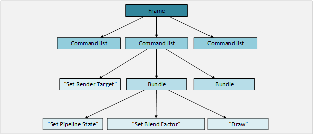

<h1>D3D12 CPU Efficiency</h1>

---

<h1>Contents</h1>

- [Feature Summary](#feature-summary)
- [Overview](#overview)
  - [Summary](#summary)
- [Document Terms](#document-terms)
- [Problems, Value Proposition & Goals](#problems-value-proposition--goals)
  - [Problems](#problems)
  - [Value Proposition](#value-proposition)
  - [Goals](#goals)
  - [Non-goals](#non-goals)
- [Feature Requirements](#feature-requirements)
- [Use Cases and Workflow](#use-cases-and-workflow)
  - [Single-threaded](#single-threaded)
  - [Multi-threaded](#multi-threaded)
- [Architectural Overview](#architectural-overview)
  - [Rendering Work Submission](#rendering-work-submission)
    - [Removal of the immediate context](#removal-of-the-immediate-context)
    - [Grouping of GPU work items](#grouping-of-gpu-work-items)
    - [GPU work submission](#gpu-work-submission)
  - [Rendering state changes](#rendering-state-changes)
    - [Pipeline State Objects](#pipeline-state-objects)
    - [State Inheritance](#state-inheritance)
  - [Application-managed per-resource state](#application-managed-per-resource-state)
    - [Resource usage state](#resource-usage-state)
    - [Resource allocation state](#resource-allocation-state)
- [Detailed Design](#detailed-design)
  - [Threading Model](#threading-model)
  - [Context Local Storage](#context-local-storage)
  - [Synchronization](#synchronization)
  - [Reference Counting](#reference-counting)
  - [Command List Errors](#command-list-errors)
  - [Device Removal](#device-removal)
  - [Pipeline State Object contents](#pipeline-state-object-contents)
  - [Bundle Restrictions](#bundle-restrictions)
  - [Subresource State Tracking](#subresource-state-tracking)
- [API Changes](#api-changes)
  - [Detailed API Descriptions](#detailed-api-descriptions)
    - [ID3D12CommandAllocator](#id3d12commandallocator)
    - [ID3D12PipelineState](#id3d12pipelinestate)
    - [ID3D12CommandList](#id3d12commandlist)
      - [ID3D12CommandList::Close](#id3d12commandlistclose)
        - [Runtime Validation](#runtime-validation)
        - [Debug Layer](#debug-layer)
        - [Errors](#errors)
      - [ID3D12CommandList::Reset](#id3d12commandlistreset)
        - [Runtime Validation](#runtime-validation-1)
        - [Debug Layer](#debug-layer-1)
        - [Errors](#errors-1)
      - [ID3D12CommandList::ClearState](#id3d12commandlistclearstate)
      - [ID3D12CommandList::Draw{Instanced|IndexedInstanced|InstancedIndirect|IndexedInstancedIndirect}](#id3d12commandlistdrawinstancedindexedinstancedinstancedindirectindexedinstancedindirect)
        - [Runtime Validation](#runtime-validation-2)
        - [Debug Layer](#debug-layer-2)
      - [ID3D12CommandList::Dispatch / DispatchIndirect](#id3d12commandlistdispatch--dispatchindirect)
      - [ID3D12CommandList::Clear*](#id3d12commandlistclear)
      - [ID3D12CommandList::CopyResource](#id3d12commandlistcopyresource)
      - [ID3D12CommandList::CopyTiles](#id3d12commandlistcopytiles)
      - [ID3D12CommandList::ResolveSubresource](#id3d12commandlistresolvesubresource)
      - [ID3D12CommandList::IASetPrimitiveTopology / RSSetViewports / RSSetScissorRects](#id3d12commandlistiasetprimitivetopology--rssetviewports--rssetscissorrects)
      - [ID3D12CommandList::OMSetBlendFactor / OMSetStencilRef](#id3d12commandlistomsetblendfactor--omsetstencilref)
      - [ID3D12CommandList::SetPipelineState](#id3d12commandlistsetpipelinestate)
      - [ID3D12CommandList::ResourceBarrier](#id3d12commandlistresourcebarrier)
        - [Validation](#validation)
      - [ID3D12CommandList::ExecuteBundle](#id3d12commandlistexecutebundle)
    - [ID3D12CommandQueue](#id3d12commandqueue)
      - [ID3D12CommandQueue::ExecuteCommandListS](#id3d12commandqueueexecutecommandlists)
    - [ID3D12Device](#id3d12device)
      - [ID3D12Device::CreateCommandAllocator](#id3d12devicecreatecommandallocator)
      - [ID3D12Device::CreatePipelineState](#id3d12devicecreatepipelinestate)
      - [ID3D12Device::CreateCommandList](#id3d12devicecreatecommandlist)
  - [Resource states and transition barriers](#resource-states-and-transition-barriers)
    - [States](#states)
    - [State support by command-list type](#state-support-by-command-list-type)
    - [Common state support for scan-out](#common-state-support-for-scan-out)
    - [Common state promotion](#common-state-promotion)
    - [State decay to common](#state-decay-to-common)
    - [Split barriers](#split-barriers)
    - [Guidance](#guidance)
    - [Examples](#examples)
      - [Split barriers](#split-barriers-1)
    - [Runtime Validation](#runtime-validation-3)
- [DDI Changes](#ddi-changes)
  - [DDI Overview](#ddi-overview)
    - [Initialization](#initialization)
    - [User-Mode Driver Name](#user-mode-driver-name)
    - [Threading](#threading)
    - [Cross-device Resource States](#cross-device-resource-states)
    - [Runtime Implemented Functionality](#runtime-implemented-functionality)
    - [Bundle State Inheritance and Leakage](#bundle-state-inheritance-and-leakage)
    - [Resource Lifetime](#resource-lifetime)
      - [Pipeline State Objects](#pipeline-state-objects-1)
      - [Command Lists](#command-lists)
  - [Detailed DDI Descriptions](#detailed-ddi-descriptions)
    - [Runtime Callbacks & Error Handling](#runtime-callbacks--error-handling)
    - [NULL Shaders](#null-shaders)
    - [Resource barrier DDIs](#resource-barrier-ddis)
- [Test Plan](#test-plan)
  - [Risks](#risks)
    - [Driver Conformance: Late feedback from IHV's](#driver-conformance-late-feedback-from-ihvs)
  - [Test Approach](#test-approach)
  - [Test Area Breakdown](#test-area-breakdown)
    - [Hardware Conformance](#hardware-conformance)
      - [Bundles And Command LIsts](#bundles-and-command-lists)
      - [Multithreading](#multithreading)
      - [Pipeline State Objects](#pipeline-state-objects-2)
      - [Driver Performance](#driver-performance)
  - [Dev Unit Tests](#dev-unit-tests)
  - [Dev Micro-benchmarks](#dev-micro-benchmarks)
- [Development & Test Plan](#development--test-plan)
  - [Development Plan](#development-plan)
  - [Interesting Driver test cases](#interesting-driver-test-cases)
  
---

# Feature Summary

Before Direct3D API calls can be executed by a GPU, they must first be
processed by the CPU. Depending on a game's rendering workload, the game
can become 'CPU-bound' if this processing keeps the GPU from being fed a
steady stream of work.

Direct3D 12 introduces new functionality that enables games to render
far more efficiently with the CPU than previously possible. This opens
up new rendering scenarios, in addition to simplifying porting between
high-efficiency console environments and the PC.

---

# Overview

---

## Summary

Direct3D has had two main goals as a feature since its inception:

1) Provide a low-overhead, performant means for games to achieve great
    visual effects on GPUs.

2) Provide a single API that works equivalently across all hardware
    platforms.

As GPUs and the API have become more complex and powerful, these goals
have started to come into conflict. It is challenging to provide a
single low-overhead, straight-to-the-GPU API if the GPU hardware itself
is variant across different IHVs.

Direct3D 11 has sought to strike a balance by providing a level of
abstraction that enables wide compatibility with hardware while still
maintaining efficient rendering. This abstraction requires extra work on
the part of PC graphics drivers, and leads to higher CPU overhead
relative to fixed platforms such as consoles.

Direct3D 12 seeks to allow applications to render in new ways to
dramatically reduce the CPU costs associated with this abstraction,
while still retaining broad compatibility.

---

# Document Terms

Term                              | Definition
-|-
Command List, Direct Command List, Bundle |<p>A **command list** corresponds to a set of commands which the GPU executes. These include commands to set state, draw, clear, copy,etc. The D3D12 command list interface is significantly different than the D3D11 command list interface. The D3D12 command list interface contains APIs similar to the D3D11 device context rendering APIs. A D3D12 command list does not map or unmap resources, change tile mappings, resize tile pools, get query data, nor does it ever implicitly submit commands to the GPU for execution.</p><p>Unlike D3D11 deferred contexts, D3D12 command lists only support 2 levels of indirection. A **direct command list**  corresponds to a command buffer which the GPU can execute. A **bundle** can be executed only directly via a direct command list.</p><p>A direct command list does not inherit any GPU state. A bundle  inherits all GPU state (except for the currently set pipeline state object and primitive topology).</p><p>Direct command lists were formally known as Transient Command Lists (TCLs), Bundles were previously known as Persistent Command Lists (PCLs).
Command Allocator                 | The command allocator object corresponds to the underlying allocations in which GPU commands are stored. The command allocator object applies to both direct command lists and bundles. Use of the command allocator object at the API is required.
Command Queue                     | A command queue corresponds represents a queue of command lists which the GPU will execute. Applications must explicitly submit command lists to a command queue for execution.
Pipeline State Object             | A pipeline state object corresponds to a significant portion of the state of the GPU. This includes all currently set shaders, and certain fixed function state objects. The only way change states contained within the pipeline object is to change the currently bound pipeline object.

---

# Problems, Value Proposition & Goals

## Problems

CPU usage in Direct3D 11 causes three classes of problems:

**Performance on the PC is not as fast as it could be.**

If a games CPU usage becomes too high, to the point where the GPU
becomes starved for work, performance suffers. Similarly, on SOC systems
with shared CPU/GPU power budgets, higher CPU usage can reduce the
resources available to the GPU.

**Console-to-PC porting is challenging. Engines must be tweaked or
re-written to prevent being CPU-bound.**

Consoles, due to their fixed nature, contain highly-optimized CPU paths
for rendering. It can be challenging for developers to take a game
developed in this environment and port it to the PC, while remaining
within their CPU budget.

**Games must homogenize/reduce state changes and draw calls to stay
within CPU budget.**

Fundamentally, the high CPU usage of Direct3D 11 imposes constraints on
the types of rendering games are able to performantly achieve.
Particularly, games must work to reduce the number of draw calls and
state changes (disproportionally expensive for the CPU vs the GPU)
during rendering.

## Value Proposition

The goal of the Direct3D 12 API is to refactor rendering APIs to better
align with hardware such that apps can render at dramatically higher
levels of CPU efficiency. In particular, the API seeks to allow games
to:

1) Increase single-threaded efficiency by pre-computing rendering work
    up front for later re-use.

2) Take advantage of multi-core systems by spreading rendering work
    across multiple process threads.

## Goals

Goals | Priority
-|-
Games are able to achieve near-linear scaling of rendering workloads across multiple cores.|0
Games are able to reduce overall CPU usage associated with rendering by an order of magnitude.|0
All changes to the API are to either: enable near-linear multi-threading, improve single-threaded performance, or implementation details to enable the first to goals.|0

## Non-goals

Non-Goals | Mitigation
-|-
The Direct3D 12 API is perceived as more straightforward to use than Direct3D 11.|The Direct3D 12 API is targeted at advanced developers only. Additionally, the debug layer and graphics debugging tools will provide strong guidance for correct usage of the API.

# Feature Requirements

\#|Requirement|Priority
-|-|-
**1**|**Developers are able to scale rendering workloads across multiple cores**|**0**
1.1|Command list / command buffer generation can be performed across multiple threads. {FREE THREADED}|0
1.2|Ignoring DXGK/KMD workloads, execution-time processing is generally less than 10% of overall command list CPU usage.|0
**2**|**Developers are able to pre-create 'Bundles' of rendering commands with constant CPU-time execution.**|**0**
2.1|Bundles must be able to be created in a free-threaded manner.|0
2.2|Bundles must be able to be referenced from multiple command lists at a single time.|0
2.4|The CPU cost of a Bundle execution must not vary with the number of draw calls in the Bundle.|0
2.5|Bundles must allow only the subset of rendering functionality that is required for drivers to achieve requirement 2.3.|0
2.6|Bundles must not inherit state contained within the Pipeline State Object (PSO).|0
2.7|Bundles must not persist state within the Pipeline State Object to the parent command list.|0
2.8|Bundles must inherit state outside the Pipeline State Object with the exception of non-PSO IA Topology state.|0
2.9|Bundles must persist all state including the PSO back up to the parent command list.|0
2.10|For Bundle interaction with descriptor tables/heaps, see the separate Resource Binding spec.|0
2.11|Bundles may only be executed from within a command list -- they may not be submitted directly to the GPU for execution.|0
**3**|**All state necessary for pre-compilation of Bundles must be grouped into new Pipeline State object (PSO).**|**0**
3.1|All state present with in a PSO must not be modifiable through other means (e.g. separate APIs).|0
3.2|Pipeline State objects must be able to be created in a free-threaded manner.|0
3.3|High-frequency state that is deemed not necessary for pre-compilation of Bundles must be kept outside the PSO, and separate modification APIs must be maintained.|0
3.4|A single Pipeline State object must be able to be referenced simultaneously from multiple command lists and/or bundles.|0
**4**|**Command lists must not be implicitly submitted for execution.**|0
4.1|Applications must be able to submit command lists for execution in a free-threaded manner.|1
**5**|**To lower CPU usage in d3d12.dll, the API 'shadow state' must not be maintained.**|**0**
5.1|'Get' APIs (e.g. OMGetBlendState) must no longer be available for use.|0
**6**|**When possible, per-resource state must be moved from the D3D API/runtime and into the application in order to aide drivers' multi-threading implementations.**|**0**
6.1|'Resource renaming' (mapping a DYNAMIC resource with the DISCARD flag) must no longer be available in the API.|0
6.2|Applications must now be required to manually transition resources between different usage states (for example usage as a SRV or a Render Target).|0
**7**|**Applications are required to manage command list and Bundle object lifetimes in groups.**|**1**
7.1|To reclaim memory from a command list/Bundle associated with a particular memory group, all command lists/Bundles in the group must be released.|1

---

# Use Cases and Workflow

There are two primary usage scenarios of this feature: usage of Bundles
to improve single-threaded performance, and usage of multiple
concurrently-recording command lists. These two scenarios should be able
to be combined as needed, heavy usage of Bundles does not preclude
command-list-based multi-threading.

---

## Single-threaded

A developer who is interested in single-threaded performance should:

1. Be able to create Bundles to represent most of their
    predictable/static rendering work. This means that Bundles must not
    have too many API restrictions such that they can't be used for the
    majority of day-to-day (predictable/static) rendering work.

    a.  Be able to execute Bundles cheaply. There should be little
        execution-time cost for executing a Bundle.

2. Bundle resource and state inheritance/upstream propagation must be
    aligned with hardware, but also aligned with real-world rendering
    scenarios. Developers should not need to burn CPU cycles by
    overriding inherited resources/states or need to burn CPU cycles
    propagating state from Bundles back in to Command Lists.

3. Be able to create Pipeline State Objects (PSOs) for the majority of
    their predictable/static state changes. Pipeline State Objects
    should encompass the right balance of state such that \~5000 PSOs
    created at app startup can encompass the majority of
    predictable/static state needs -- we do not want developers to have
    to create PSOs on the fly if that state is able to be predicted.

    b.  PSOs must similarly be cheap to bind to a command list.

---

## Multi-threaded

A developer who is interested in multi-threaded performance should:

1. Be able to execute command lists with little at-execute-time CPU
    processing. The majority of CPU cost associated with a command list
    should be at the building stage.

2. High-volume APIs/functionality such as command list/bundle creation,
    PSO creation, resource mapping, should be free-threaded without any
    driver restrictions on parallelism (for example critical sections
    inside a driver for creating PSOs).

---

# Architectural Overview

There are three classes of changes from Direct3D 11. Some changes are to
provide the API semantics necessary to achieve the
re-use/multi-threading goals, while others are in place to allow
graphics drivers to implement the design efficiently -- no change has
been made from D3D11 that is not aligned with these two principles.

---

## Rendering Work Submission

The goals of enabling rendering work re-use and multi-threaded scaling
require foundational changes to how apps submit rendering work to the
GPU. A contrast with Direct3D 11 is useful to illustrate the changes:

In Direct3D 11, the primary mechanism for submitting rendering work is
the *immediate context*. As apps call rendering APIs, the immediate
context silently groups them into GPU work items and submits them for
processing -- there is little opportunity for re-use, and all access to
the immediate context is completely single-threaded. Apps can create
limited *deferred contexts* as 'helpers' to create rendering work across
multiple threads for playback on the immediate context, but driver
support remains poor for this due to API/hardware divergence.

Direct3D 12 changes this design in 3 important ways:

1) No more 'primary' immediate-context. Enables multi-threading.

2) Apps now own how rendering calls are grouped into GPU work items.
    Enables re-use.

3) Apps now explicitly control when work is submitted to the GPU.
    Necessary for \#1 and \#2.

---

### Removal of the immediate context

The largest change is that there is no longer a single 'immediate
context' associated with a device. Instead, to render, applications can
create a *command list* off of the device, on which traditional
rendering APIs can be called. From a functionality standpoint, a command
list looks similar to an immediate context (can contain Draws, state
changes, etc). Like immediate contexts, each individual command list is
not free-threaded, but multiple command lists *can* be recorded
concurrently (which enables multi-threading).

To enable efficient driver implementations, applications will need to
state at device creation time the maximum number of command lists they
will be recording to at any given time. The graphics driver will use
this information to allocate only as much memory as is necessary to
track *n* command list recording states.

---

### Grouping of GPU work items

Beyond command lists, the new API exploits functionality present in all
hardware today by adding a 'second level' of command lists, which are
referred to as 'Bundles'. The purpose of Bundles is to allow apps to
group a small number of API commands together for later execution. At
Bundle creation time, the driver will perform as much pre-processing as
is possible to make these cheap to execute later. Command lists, on the
other hand, are typically executed only a single time (to enable
multi-threaded command buffer recording). However, a command list can be
executed multiple times (as long as the application ensures that the
previous executions have completed before submitting new executions).

Re-use of Bundles is a large driver of single-threaded CPU efficiency
improvements. There are certain restrictions on what operations can be
performed within a Bundle that are designed to further enable driver
pre-processing (e.g. render target cannot be changed within a Bundle).
See the [Bundle restrictions](#bundle-restrictions) section for details.



---

### GPU work submission

To actually execute work on the GPU, an application must explicitly
submit a command list to a *command queue* associated with the Direct3D
device. A command list can be submitted for execution multiple times,
but applications will be responsible for ensuring a command list is not
still 'in use' before an additional submission -- new APIs will be
provided for this functionality. Bundles, on the other hand, have no
concurrent-use restrictions (from inclusion in multiple command lists).
Bundles cannot be directly submitted to a command queue for execution.

At the system level, only a single command list at a time can be
submitted for execution. However as 'syntactic sugar', all threads may
submit command lists to the default command queue, and the runtime will
automatically serialize the command list submission while preserving
submission order.

---

## Rendering state changes

The previous section described how the vehicles for submitting work to
the GPU have changed. This section talks about the changes to the actual
rendering commands themselves.

The primary mechanisms for submitting rendering work to the GPU are
issuing Draw commands ('Draw this triangle'), updating GPU resources
('Use these vertex positions to draw the triangle'), and changing the
hardware state ('Blend the triangle using this formula').

Draw commands are not changing between D3D11 and D3D12. GPU resource
updates are changing, but are described in a separate feature document
(Resource Bindings and Heaps). The third, changing the hardware state,
does have several changes over D3D11:

In Direct3D 11, the parameters of the hardware state (how geometry is
blended, rasterized, what shaders are used) were bundled into large,
coarse-grained state objects (ID3D11BlendState). The purpose of bundling
these parameters together was to give the driver as much information as
possible when changing the state for a particular hardware unit so that
the GPU commands to program that unit could be pre-computed.

What we have seen over time is that even these coarse-grained state
objects are not sufficient for today's hardware, that there are in fact
hidden hardware dependencies between different units. For example, the
hardware Blend State unit might have dependencies on the API Blend State
as well as the API Rasterizer State. These dependencies vary between
different IHVs, and even different hardware from the same IHV.

---

### Pipeline State Objects

To solve this dependency challenge, hardware state parameters will be
further collected into a new 'Pipeline State Object'. The Pipeline State
Object (PSO) will contain a number of D3D11 state objects
(ID3D11PixelShader, ID3D11BlendState, etc), the exact list is stated in
the Detailed Design section below. Higher-frequency states, which are
also deemed to be isolated from a hardware perspective, will remain
outside the PSO (OM Blend Factor, IA Scissor Rects, etc).

Grouping this large amount of state into a single PSO enables drivers to
perform as much pre-processing of hardware commands as possible, no
matter what the particular state-mapping dependencies are for a
particular hardware. The intended usage model is for applications to
create Pipeline State Objects up-front (on the order of hundreds) where
driver pre-processing can happen, and then use those PSOs to change the
rendering state during the course of rendering.

To that end, state contained within the PSO will not retain their own
individual state-manipulation APIs (e.g.
ID3D11DeviceContext::OMSetBlendState), which cannot be pre-processed.

D3D10 and 11 have a limit on the number of fixed function state objects
which may exist at any given time (blend, rasterizer, depth stencil,
sampler; no more than 4096 per type). This limitation is removed in
D3D12. Also, there is no limit to the number of pipeline state objects
which may exist at any given time.

---

### State Inheritance

Direct3D 12's state inheritance model is designed to match real-world
hardware implementations.

First, command lists do not inherit state (PSO or otherwise) -- a
'starting point' PSO is specified at command list creation time. Non-PSO
state is reset to the Direct3D-defined default at the beginning of each
command list.

Second, Bundles inherit non-PSO state, but do *not* inherit PSO state.
As with command lists, a 'starting point' PSO is specified at Bundle
creation time. PSOs can be shared across multiple bundles. Also, as a
hardware implementation detail, bundles do not inherit certain
properties of IA primitive topology (even though it is not in the PSO).

Third, all state changes within a Bundle do affect the 'parent' command
list.

Resource Binding changes in a command list are inherited into Bundles,
and conversely resource binding changes in Bundles are 'leaked' into the
parent command list.

## Application-managed per-resource state

A second class of hardware state exists: per-resource state. This state
is highly hardware-specific, and for that reason is not directly exposed
in the Direct3D 11 API at all. Instead, drivers have been forced to
track this state behind-the-scenes. This is expensive from a CPU
perspective and significantly complicates any sort of multi-threaded
design.

### Resource usage state

To reduce overall CPU usage and enable driver
multi-threading/pre-processing, Direct3D 12 moves per-resource state
manipulation responsibility from the graphics driver to the application.
The majority of application-based resource manipulation is done through
a single API: ResourceBarrier. The API accepts the resource to perform
the transition on, the old state, and the new state. Each state is
paired with specific allowed functionality. See the [Resource Barrier](#_ID3D12CommandList::ResourceBarrier) section for details.

For example, conceptually if an application wants to switch from using
Shader Resource View (SRV) of a resource, to a Render Target View (RTV)
of the same resource, it must call the ResourceBarrier API after it has
finished using the resource as an SRV, and before it wants to use it as
an RTV. This instructs the graphics driver to synchronize the rendering
operations if there is a read-after-write (or similar) dependency, and
to change the hardware-specific resource state to enable its usage as a
Render Target.

### Resource allocation state

A separate class of resource state exists. In Direct3D 11, applications
were able to map dynamic resources with a 'DISCARD' flag. This flag
signified that the application didn't care about the old contents of the
resource, that they would be overwritten completely. This flag was
implemented by drivers keeping a collection of multiple memory
allocations tied to a single API resource. As a resource was mapped, the
driver would hand the application a memory allocation that was not
in-use by the GPU. This is an important optimization that drivers used
to prevent stalls (if an application tried to map an in-use resource).

However, because the particular memory allocation currently linked to
the resource is not exposed at the API level (only the abstract
'resource'), drivers had to perform this tracking behind-the-scenes.
This functionality is incompatible with efficient multi-threading, and
thus it (the DISCARD flag) has been removed from the Direct3D 12 API.

Instead, the Direct3D 12 API will instead expose synchronization
information to the application so that applications can implement this
functionality themselves. A new API will be created that will allow
applications to see whether a particular resource is 'in-use' by the
GPU. If the resource is in use by the GPU, the application is expected
to simply create a new copy of the resource to avoid contention-based
stalls.

---

# Detailed Design

---

## Threading Model

All methods on the device interface are free-threaded (similar to D3D11
device methods).

Methods on a specific command list object are not free-threaded with
respect to each other. Applications must ensure that they never
concurrently call methods on the same command list.

Methods on a command allocator are not free-threaded with respect to
each other. Applications must ensure that they never concurrently call
methods on the same command list allocator.

All methods on the command queue are free-threaded.

In contrast to D3D11, the D3D12 threading behavior is not configurable.

---

## Context Local Storage

The low-level nature of D3D12 makes context-local-storage less important
for D3D12. There is no explicit allocation of context local storage that
occurs at the DDI. If a driver needs context local storage for a
particular API object (like a resource), it can use a per-command list
hash table which maps resource->context local storage.

---

## Synchronization

Applications are responsible for more synchronization in D3D12 than in
D3D11. In particular, the following APIs may only be called once the
application is sure that the GPU is not referencing the resource in
question:

1. ID3D12Resource::Map

2. ID3D12CommandQueue::ExecuteCommandList

3. ID3D12CommandAllocator::Reset

Note that applications are allowed to call ID3D12CommandList::Reset
before previous executions of the associated command list have
completed. Additionally, applications can destroy command lists before
previous executions have completed.

---

## Reference Counting

Most D3D12 APIs continue to use reference counting as per COM
conventions. 1 notable exception to this is the D3D12 command list APIs.
All APIs on ID3D12CommandList do not hold references to the objects
passed into those APIs. This means applications are responsible for
ensuring that a command list is never submitted for execution that
references a destroyed resource.

---

## Command List Errors

Most APIs on ID3D12CommandList do not return errors. Errors encountered
during command list creation are deferred until
ID3D12CommandList::Close. The one exception is
DXGI_ERROR_DEVICE_REMOVED, which is deferred even further (see
below). Note that this is different from D3D11, where many parameter
validation errors are silently dropped and never returned to the caller.

---

## Device Removal

Applications can expect to see DXGI_DEVICE_REMOVED errors in the
following API calls:

- Resource Creation
- ID3D12Resource::Map
- Present
- GetDeviceRemovedReason

---

## Pipeline State Object contents

Contained in PSO              | Not contained in PSO
-|-
<li>Root Signature</li><li>All Shaders (ID3D11PixelShader, ...)</li><li>ID3D11BlendState</li><li>ID3D11RasterizerState (Note: ScissorEnable must not be set to 'true'.)</li><li>ID3D11DepthStencilState</li><li>ID3D11InputLayout</li><li>IA PrimitiveTopology type (Triangle vs Line vs Point vs Patch)</li><li>Render Target properties (read-only) (Must specify formats and sampleCounts of RTs/DBs that will be bound.</li>|<li>Viewports</li><li>Scissor Rects</li><li>Blend factor</li><li>Depth test</li><li>Stencil ref</li><li>IA PrimitiveTopology bucket (List/Strip/ListAdj/StripAdj)</li>

---

## Bundle Restrictions

The following command list API calls are not allowed on command lists
created with type: D3D12_COMMAND_LIST_TYPE_BUNDLE:

- ClearState
- Clear*
- Copy*
- Discard*
- ExecuteBundle
- ResourceBarrier
- GenerateMips
- ResolveSubresource
- SetPredication
- ExecuteBundle
- BeginQuery
- EndQuery
- SetStreamOutputBuffers*
- SetRenderTargets
- RSSetViewports
- RSSetScissorRects

SetDescriptorHeaps can be called on a bundle, but the bundle descriptor
heaps must match the calling command list descriptor heap.

These restrictions are present to ensure that drivers can provide
performant implementation of bundles. In particular, these restrictions
enables drivers to do most of the work associated with bundles are
record time, thus enabling the ID3D12CommandList::ExecuteBundle API to
be serviced with low overhead.

If any of these APIs are called on a bundle, the runtime will drop the
call. The debug layer will issue an error whenever this occurs.

Note that these restrictions imply that all pipeline state objects
referenced by a bundle must have the same render target formats, depth
buffer format, and sample descriptions.

---

## Subresource State Tracking

As described elsewhere, applications are responsible for calling the
ResourceBarrier API to indicate transitions in subresource states. The
runtime will track the state of all subresources in order to validate
that the "Before" state of a resource transition barrier matches up with
the "After" state of a resource transition barrier.

Tracking of resource state is accomplished with the CResourceState
class. This class has 2 modes of operation:

- Tracking state per resource
- Tracking state per subresource

Tracking state per-resource is more efficient, and is the preferred mode
of operation. This state is used when the application transitions all
subresources to a given state via the
D3D12_RESOURCE_BARRIER_ALL_SUBRESOURCES flag.

Each resource has many copies of the CResourceState class. 1 copy
contains the current resource state on the GPU timeline. The other
copies contain the current resource state with respect to a given
command list which is being recorded. The number of CResourceState
objects per resource is determined by the app-specified maximum number
of command lists which can be recorded.

---

# API Changes

---

## Detailed API Descriptions

This section describes D3D12 APIs which are not described in other
specs.

---

### ID3D12CommandAllocator

```C++
virtual HRESULT STDMETHODCALLTYPE Reset( void)
```

This API is called by applications to re-use the memory associated with
a command allocator. This indicates to the runtime and driver that GPU
is no longer executing any command lists which have recorded commands
with the command allocator.

This call will fail with E_FAIL if there is an actively recording
command list referencing the command allocator. The debug layer will
also issue an error in this case.

This call will fail with E_FAIL if the command queue fence indicates
that there may still be pending GPU references to commands in the
command allocator.

The debug layer will issue an error if this API is called concurrently
by multiple threads (on the same allocator object).

---

### ID3D12PipelineState

The pipeline object is an immutable state object. It contains no
methods.

---

### ID3D12CommandList

---

#### ID3D12CommandList::Close

```C++
virtual HRESULT STDMETHODCALLTYPE Close( void) = 0;
```

This API is called to indicate that recording to a command list has
finished.

##### Runtime Validation

The runtime will validate that the command list has not previously been
closed. If an error was encountered during recording, the error code is
returned here. The runtime will not call the close DDI in this case.

##### Debug Layer

The debug layer will issue errors if the API fails.

##### Errors

E_INVALIDARG: An invalid argument was passed to the command list API
during recording

E_FAIL: The command list has already been closed, or an invalid API was
called during command list recording

E_OUTOFMEMORY: The system ran out of memory during recording

---

#### ID3D12CommandList::Reset

```C++
virtual HRESULT STDMETHODCALLTYPE Reset(
    _In_ ID3D12CommandAllocator* pAllocator,
    _In_opt_ ID3D12PipelineState* pInitialState
    ) = 0;
```

This API is called to reset a command list back to its initial state (as
if a new command list was just created). This enables command list
tracking structures to be re-used without any allocations.

Applications [are allowed]{.underline} to call this method before the
GPU has finished all previous executions of the command list (unlike
ID3D12CommandAllocator::Reset).

This method works for both command lists and bundles.

This API also takes a command allocator as input. A given allocator can
be associated with no more than 1 recording command list at a time. The
allocator type (command list or bundle), must match the type of command
list that is being created.

##### Runtime Validation

Before calling Reset, the command list must be in the "closed" state.
The API call will fail if this is not the case. Note that if a call to
ID3D12CommandList::Close fails, then that command list can never be
reset. Calling ID3D12CommandList::Reset will result in the same error
being returned that Close returned.

Applications must specify a command list allocator. The runtime will
ensure that an allocator is never associated with more than one
recording command list at the same time.

##### Debug Layer

The debug layer will issue errors if the API fails.

The debug layer will also track GPU progress and issue an error if it
cannot prove that there are no outstanding executions of the command
list.

##### Errors

E_FAIL: The command list was not in the "closed" state when the call
was made.

E_INVALIDARG: The allocator is currently being used with another
command list in the "recording" state

E_INVALIDARG: The specified allocator was created with the wrong type

E_OUTOFMEMORY: The system ran out of memory

---

#### ID3D12CommandList::ClearState

```C++
virtual void STDMETHODCALLTYPE ClearState(
    _In_ ID3D12PipelineState *pPipelineState) = 0;
```

This API resets the state of a direct command list back to the state it
was in when the command list was created. It is illegal to call this API
on a bundle. If this API is called on a bundle, then
ID3D12CommandList::Close will return E_FAIL.

All currently bound resources are unbound. The primitive topology is set
to D3D_PRIMITIVE_TOPOLOGY_UNDEFINED. Viewports, scissor rects,
stencil reference value, and the blend factor are to set empty values
(all zeros). Predication is disabled.

The app-provided pipeline state object bound as the currently set
pipeline state object.

#### ID3D12CommandList::Draw{Instanced|IndexedInstanced|InstancedIndirect|IndexedInstancedIndirect}

```C++
virtual void STDMETHODCALLTYPE DrawInstanced(
    _In_ UINT VertexCountPerInstance,
    _In_ UINT InstanceCount,
    _In_ UINT StartVertexLocation,
    _In_ UINT StartInstanceLocation) = 0;

virtual void STDMETHODCALLTYPE DrawIndexedInstanced(
    _In_ UINT IndexCountPerInstance,
    _In_ UINT InstanceCount,
    _In_ UINT StartIndexLocation,
    _In_ INT BaseVertexLocation,
    _In_ UINT StartInstanceLocation) = 0;

virtual void STDMETHODCALLTYPE DrawInstancedIndirect(
    _In_ ID3D12Resource *pBufferForArgs,
    _In_ UINT AlignedByteOffsetForArgs) = 0;

virtual void STDMETHODCALLTYPE DrawIndexedInstancedIndirect(
    _In_ ID3D12Resource *pBufferForArgs,
    _In_ UINT AlignedByteOffsetForArgs) = 0;

virtual void STDMETHODCALLTYPE DrawAuto( void) = 0;
```

These methods behave like their D3D11 counterparts.

##### Runtime Validation

For Draw*Indirect cases, the runtime will drop the call if any of the
following conditions occur:

- The offset is not aligned properly

- The offset is too large given the size of the buffer

Validation failure will result in ID3D12CommandList::Close returning
E_INVALIDARG.

##### Debug Layer

The debug layer will issue an error for any case where the runtime drops
the call.

The debug layer will issue a warning if the formats and sample
descriptions in the currently bound pipeline state object do not match
the currently bound render targets and depth buffers.

The debug layer will issue a warning if the currently set topology does
not match the topology type specified in the currently bound pipeline
state object.

The debug layer will issue a warning if the vertex shader of the
currently bound pipeline object is NULL.

The debug layer will issue an error if the state of the argument buffer
is not INDIRECT_ARGUMENT

---

#### ID3D12CommandList::Dispatch / DispatchIndirect

```C++
virtual void STDMETHODCALLTYPE Dispatch(
    _In_ UINT ThreadGroupCountX,
    _In_ UINT ThreadGroupCountY,
    _In_ UINT ThreadGroupCountZ) = 0;

virtual void STDMETHODCALLTYPE DispatchIndirect(
    _In_ ID3D12Resource *pBufferForArgs,
    _In_ UINT AlignedByteOffsetForArgs) = 0;
```

These methods behave like their D3D11 counterparts.

Runtime Validation

For DispatchIndirect, the runtime will drop the call if any of the
following conditions occur:

- The offset is not aligned properly

- The offset is too large given the size of the buffer

Validation failure will result in ID3D12CommandList::Close returning
E_INVALIDARG.

Debug Layer

The debug layer will issue an error for any case where the runtime
silently drops the call.

The debug layer will issue a warning if the compute shader of the
currently bound pipeline object is NULL.

The debug layer will issue an error if the state of the argument buffer
is not INDIRECT_ARGUMENT

---

#### ID3D12CommandList::Clear*

Runtime Validation

For floating-point inputs, the runtime will set denormalized values to 0
(while preserving NANs).

For ClearView, the runtime will validate that the view type is one of
(ShaderResource, UnorderedAccess, RenderTarget, DepthStencil).

Validation failure will result in ID3D12CommandList::Close returning
E_INVALIDARG.

Debug Layer

Same as D3D11: The debug layer will issue errors if the input colors are
denormalized.

The debug layer will issue an error if the subresources referenced by
the view are not in the appropriate state.

ClearRenderTargetView : D3D12_RESOURCE_USAGE_RENDER_TARGET

ClearDepthStencilView : D3D12_RESOURCE_USAGE_DEPTH

ClearUnorderedAccessView* : D3D12_RESOURCE_USAGE_UNORDERED_ACCESS

---

#### ID3D12CommandList::CopyResource

```C++
virtual void STDMETHODCALLTYPE CopyResource(
    _In_ ID3D12Resource *pDstResource,
    _In_ ID3D12Resource *pSrcResource) = 0;
```

Debug Layer

The debug layer will issue an error if the source resource is not in the
COPY_SOURCE state.

The debug layer will issue an error if the destination resource is not
in the COPY_DEST state.

#### ID3D12CommandList::CopyTiles

```C++
virtual void STDMETHODCALLTYPE CopyTiles(
    _In_ ID3D12Resource *pTiledResource,
    _In_ const D3D11_TILED_RESOURCE_COORDINATE *pTileRegionStartCoordinate,
    _In_ const D3D11_TILE_REGION_SIZE *pTileRegionSize,
    _In_ ID3D12Resource *pBuffer,
    _In_ UINT64 BufferStartOffsetInBytes,
    _In_ UINT Flags) = 0;
```

Debug Layer

The debug layer will issue an error if the tiled resource (all
subresources) or destination buffer are not in the correct state.

If the D3D11_TILE_COPY_LINEAR_BUFFER_TO_SWIZZLED_TILED_RESOURCE
flag is set, then the buffer must be in the COPY_SOURCE state, and the
tiled resource must be in the COPY_DEST state.

Otherwise, the buffer must be in the COPY_DEST state, and the tiled
resource must be in the COPY_SOURCE state.

---

#### ID3D12CommandList::ResolveSubresource

```C++
virtual void STDMETHODCALLTYPE ResolveSubresource(
    _In_ ID3D12Resource *pDstResource,
    _In_ UINT DstSubresource,
    _In_ ID3D12Resource *pSrcResource,
    _In_ UINT SrcSubresource,
    _In_ DXGI_FORMAT Format) = 0;
```

Core Runtime

The runtime will validate:

- Subresource indices are within range
- The specified format supports MSAA resolve
- The specified format is compatible with the resource formats
- Resource dimensions match
- Dest resource must have SampleCount = 1
- Source resource must have SampleCount > 1

Debug Layer

The debug layer will issue an error if source subresource is not in the
RESOLVE_SOURCE state. The debug layer will issue an error if the
destination subresource is not in the RESOLVE_DEST state.

---

#### ID3D12CommandList::IASetPrimitiveTopology / RSSetViewports / RSSetScissorRects

```C++
virtual void STDMETHODCALLTYPE RSSetViewports(
    _In_range_(0,D3D11_VIEWPORT_AND_SCISSORRECT_OBJECT_COUNT_PER_PIPELINE) UINT Count,
    _In_reads_opt_( Count) const D3D11_VIEWPORT *pViewports) = 0;

virtual void STDMETHODCALLTYPE RSSetScissorRects(
    _In_range_(0,D3D11_VIEWPORT_AND_SCISSORRECT_OBJECT_COUNT_PER_PIPELINE) UINT Count,
    _In_reads_opt_( Count) const D3D11_RECT *pRects) = 0;
```

As with D3D11, RSSetViewports and RSSetScissor rects always set all 16
objects. If the application specifies fewer than 16 objects, the driver
sets the unspecified objects to their default values.

---

#### ID3D12CommandList::OMSetBlendFactor / OMSetStencilRef

```C++
virtual void STDMETHODCALLTYPE OMSetBlendFactor(
    _In_opt_ const FLOAT BlendFactor[ 4 ]) = 0;
    virtual void STDMETHODCALLTYPE OMSetStencilRef(
    _In_ UINT StencilRef) = 0;
```

The blend factor and stencil reference values are set on stand-alone
APIs. There is no runtime nor debug layer validation of the input
parameters.

---

#### ID3D12CommandList::SetPipelineState

```C++
virtual void STDMETHODCALLTYPE SetPipelineState(
    _In_ ID3D12PipelineState *pPipelineState) = 0;
```

This API sets all shaders and programs most of the fixed-function state
of the GPU pipeline.

Runtime Validation

None

Debug Layer

The debug layer will issue an error if the specified pipeline state
object is NULL.

---

#### ID3D12CommandList::ResourceBarrier

```C++
virtual void STDMETHODCALLTYPE ResourceBarrier(
    _In_ UINT Count,
    _In_reads_(Count) const D3D12_RESOURCE_BARRIER_DESC *pDesc) = 0;

typedef enum D3D12_RESOURCE_STATES
{
    D3D12_RESOURCE_STATE_COMMON = 0,
    D3D12_RESOURCE_STATE_VERTEX_AND_CONSTANT_BUFFER = 0x0001,
    D3D12_RESOURCE_STATE_INDEX_BUFFER = 0x0002,
    D3D12_RESOURCE_STATE_RENDER_TARGET = 0x0004,
    D3D12_RESOURCE_STATE_UNORDERED_ACCESS = 0x0008,
    D3D12_RESOURCE_STATE_DEPTH_WRITE = 0x0010,
    D3D12_RESOURCE_STATE_DEPTH_READ = 0x0020,
    D3D12_RESOURCE_STATE_NON_PIXEL_SHADER_RESOURCE = 0x0040,
    D3D12_RESOURCE_STATE_PIXEL_SHADER_RESOURCE = 0x0080,
    D3D12_RESOURCE_STATE_STREAM_OUT = 0x0100,
    D3D12_RESOURCE_STATE_INDIRECT_ARGUMENT = 0x0200,
    D3D12_RESOURCE_STATE_COPY_DEST = 0x0400,
    D3D12_RESOURCE_STATE_COPY_SOURCE = 0x0800,
    D3D12_RESOURCE_STATE_RESOLVE_DEST = 0x1000,
    D3D12_RESOURCE_STATE_RESOLVE_SOURCE = 0x2000,
    D3D12_RESOURCE_STATE_GENERIC_READ =
    /*D3D12_RESOURCE_STATE_VERTEX_AND_CONSTANT_BUFFER*/ 0x0001 \|
    /*D3D12_RESOURCE_STATE_INDEX_BUFFER*/ 0x0002 \|
    /*D3D12_RESOURCE_STATE_NON_PIXEL_SHADER_RESOURCE*/ 0x0040 \|
    /*D3D12_RESOURCE_STATE_PIXEL_SHADER_RESOURCE*/ 0x0080 \|
    /*D3D12_RESOURCE_STATE_INDIRECT_ARGUMENT*/ 0x0200 \|
    /*D3D12_RESOURCE_STATE_COPY_SOURCE*/ 0x0800,
} D3D12_RESOURCE_STATES;

typedef enum D3D12_RESOURCE_BARRIER_TYPE
{
    D3D12_RESOURCE_BARRIER_TYPE_TRANSITION,
    D3D12_RESOURCE_BARRIER_TYPE_ALIASING,
    D3D12_RESOURCE_BARRIER_TYPE_UAV,
} D3D12_RESOURCE_BARRIER_TYPE;

const UINT D3D12_RESOURCE_BARRIER_ALL_SUBRESOURCES = 0xFFFFFFFF;

typedef struct D3D12_RESOURCE_TRANSITION_BARRIER
{
    ID3D12Resource* pResource;
    UINT Subresource;
    D3D12_RESOURCE_STATES StateBefore;
    D3D12_RESOURCE_STATES StateAfter;
} D3D12_RESOURCE_TRANSITION_BARRIER;

typedef struct D3D12_RESOURCE_ALIASING_BARRIER
{
    ID3D12Resource* pResourceBefore;
    ID3D12Resource* pResourceAfter;
} D3D12_RESOURCE_ALIASING_BARRIER;

typedef struct D3D12_RESOURCE_UAV_BARRIER
{
    ID3D12Resource* pResource;
} D3D12_RESOURCE_UAV_BARRIER;

typedef enum D3D12_RESOURCE_BARRIER_FLAGS
{
    D3D12_RESOURCE_BARRIER_FLAG_NONE = 0x0,
    D3D12_RESOURCE_BARRIER_FLAG_BEGIN_ONLY = 0x1,
    D3D12_RESOURCE_BARRIER_FLAG_END_ONLY = 0x2,
} D3D12_RESOURCE_BARRIER_FLAGS;

typedef struct D3D12_RESOURCE_BARRIER
{
    D3D12_RESOURCE_BARRIER_TYPE Type;
    D3D12_RESOURCE_BARRIER_FLAGS Flags;
    union
    {
        D3D12_RESOURCE_TRANSITION_BARRIER Transition;
        D3D12_RESOURCE_ALIASING_BARRIER Aliasing;
        D3D12_RESOURCE_UAV_BARRIER UAV;
    };
} D3D12_RESOURCE_BARRIER;
```

This API notifies the driver of situations in which the driver may need
to synchronize multiple accesses to memory. The API accepts an array of
barrier descriptions. There are 3 types of barrier descriptions:

1. Transition barriers indicate that a set of subresources transition
    between different states. The caller must specify the before and
    after states of the subresources. The
    D3D12_RESOURCE_BARRIER_ALL_SUBRESOURCES flag is used to
    transition all subresources in a resource at the same time.

2. Aliasing barriers indicate a transition between usages of 2
    different resources which have mappings into the same tile pool. The
    application can specify both the before and the after resource. Note
    that one or both resources can be NULL (indicating that any tiled
    resource could cause aliasing).

3. UAV barriers indicate all UAV accesses (read or writes) to a
    particular resource must complete before any future UAV accesses
    (read or write) can begin. It is not necessary to insert a UAV
    barrier between 2 draw/dispatch calls which only read a UAV.
    Additionally, it is not necessary to insert a UAV barrier between 2
    draw/dispatch calls which write to the same UAV if the application
    knows that it is safe to execute the UAV accesses in any order. The
    resource can be NULL (indicating that any UAV access could require
    the barrier). Finally, a UAV barrier is not necessary the resource
    transitions to another state (like RENDER_TARGET) in-between the
    UAV accesses.

When the API is passed an array of resource barrier descriptions, the
API behaves as if it was called N times (1 for each array element), in
the specified order.

The D3D12_RESOURCE_BARRIER_FLAGS parameter allows a single transition
to be split into begin and end halves. The split barrier flags are
placed at the resource barrier level rather than the *transition* level
so that they can in the future apply to UAV and Aliasing barriers, but
they are currently only supported for Transition barriers.

##### Validation

For aliasing barriers the runtime will validate that:

- If either resource pointer is non-NULL, it refers to a tiled
    resource

For UAV barriers the runtime will validate that:

- If the resource is non-NULL, the resource has the "Unordered Access"
    bind flag set

Validation failure will result in ID3D12CommandList::Close returning
E_INVALIDARG.

Debug Layer

The debug layer will issue errors in the case where runtime validation
fails.

The debug layer will issue errors if a resource is used without first
calling ResourceBarrier to put the resource into the correct state. Note
that this is tricky for dynamic indexing of resources. If a shader
performs dynamic index of resources, then the debug layer will modify
object tables such that invalid objects are removed from object tables.

As a result of the above validation, the debug layer will also issue an
error if a resource is illegally bound for read and write at the same
time.

The debug layer will issue errors if the before and after states passed
to the API do not match with previous calls to the API (including the
aliasing case).

The debug layer will issue warnings if there are unnecessary
transitions.

The debug layer will also issue warnings for all of the cases where the
D3D11 debug layer would issues warnings for TiledResourceBarrier.

The debug layer will issue warnings if a resource is transitioned from a
write state to a read state without the NoAccess bit being set first.

The debug layer will issue an error if a depth buffer is used in a
non-read-only mode while the resource has the ShaderResourceView usage
bit set.

The debug layer will issue a warning if a UAV is accessed in multiple
draw/dispatch calls without UAV barriers in-between (unless all accesses
are reads).

The debug layer will issue a warning if
D3D12_RESOURCE_BARRIER_ALL_SUBRESOURCES is not used (because this
index makes resource state tracking easier for the runtime/driver).

The debug layer will issue an error when the runtime detects that the
"Before" and "After" states of 2 consecutive resource transition
barriers do not match up.

The debug layer will issue a warning if an application sets a usage
bits, and then does not do anything with the resource that requires the
bit to be set.

Resource states and transition barriers are discussed in greater detail
in Section 9.2 below.

---

#### ID3D12CommandList::ExecuteBundle

```C++
virtual void STDMETHODCALLTYPE ExecuteBundle(
    _In_ ID3D12CommandList *pCommandList) = 0;
```

This API executes a bundle. The API is defined such that the pipeline
state, primitive topology and other state set in bundle will spill back
to apply on the parent command list upon returning. Note that
ExecuteBundle is not a predicated operation. Note that bundles cannot
inherit pipeline state (because the CreateCommandList API defines the
initial pipeline state). Bundles also do not inherit primitive topology.

Runtime Validation

The runtime will validate that the "callee" is a bundle and that the
"caller" is a direct command list. The runtime will also validate that
the bundle has been closed. If the contract is violated, the runtime
will silently drop the call.

Validation failure will result in ID3D12CommandList::Close returning
E_INVALIDARG.

Debug Layer

The debug layer will issue a warning in the same cases where the runtime
will fail.

Also, the debug layer will issue an error if it detects that any
resource reference by the command list has been destroyed.

The runtime will also validate that the command allocator associated
with the bundle has not been reset since ID3D12CommandList::Close was
called on the command list. This validation occurs at ExecuteBundle
time, and when the parent command list is executed on a command queue.
Early measurements indicate that putting this validation into the
non-debug runtime costs 3% CPU time in important scenarios.

---

### ID3D12CommandQueue

---

#### ID3D12CommandQueue::ExecuteCommandListS

```C++
virtual void STDMETHODCALLTYPE ExecuteCommandLists(
    _In_ UINT Count,
    _In_reads_(Count) ID3D12CommandList **ppCommandLists) = 0;
```

This API is used to submit a direct command list for execution. The
drivers is free to patch the command list, it is the application's
responsibility to ensure that the GPU is not currently reading the
command list from a previous execution.

Runtime Validation

If a bundle is passed to this API, the runtime will drop the call. The
runtime will also drop the call if the Finish API has not been called on
the command list.

The runtime will validate the "before" and "after" states of resource
transition barriers inside of ExecuteCommandLists. If the "before" state
of a transition does not match up with the "after" state of a previous
transition, then the runtime will drop the call and remove the device

The runtime will detect if the command allocator associated with the
command list has been reset after ID3D12CommandList::Close was called.
The runtime will drop the call and remove the device in this situation.

The runtime will validate the "before" and "after" states of queries
used by the command list. If an error is detected, then the runtime will
drop the call and remove the device.

The runtime will drop the call and remove the device if the command
queue fence indicates that a previous execution of the command list has
not yet completed.

Debug layer

The debug layer will issue errors for all cases where the runtime would
drop the call.

Also, the debug layer will issue an error if it detects that any
resource (including queries) referenced by the command list has been
destroyed.

---

### ID3D12Device

---

#### ID3D12Device::CreateCommandAllocator

```C++
virtual HRESULT STDMETHODCALLTYPE CreateCommandAllocator(
    _In_ D3D12_COMMAND_LIST_TYPE type,
    _Outptr_ ID3D12CommandAllocator **ppCommandAllocator) = 0;
```

Runtime Validation

The runtime will validate the command list type.

Debug Layer

The debug layer will issue an error if an invalid command list type is
specified.

Errors

E_INVALIDARG: an invalid command list type is specified

---

#### ID3D12Device::CreatePipelineState

```C++
virtual HRESULT STDMETHODCALLTYPE CreatePipelineState(
    _In_ const D3D12_PIPELINE_STATE_DESC *pDesc,
    _Outptr_ ID3D12PipelineState **ppPipelineState) = 0;
```

This API creates a pipeline state object. The object holds references to
the underlying shaders and state objects which it was created from. The
runtime will use "duplicate-preventer" functionality similar to state
objects to ensure that duplicate pipeline state creations are mapped to
the same underlying DDI object.

Note that there is no limit on the number of pipeline state objects that
can exist at any given time. Additionally, there is no limit on the
number of fixed-function state objects that can exist at any given time.
D3D11 has a per-type limit of 4096 (rasterizer, sampler, blend,
depth-stencil) state objects which can exist at any given time. D3D12
has no such limit.

Runtime validation

Much of the validation that exists in the D3D11 debug layer at draw time
is moved into the proper runtime inside of CreatePipelineState.
Specifically, the runtime will validate:

1. The linkage between the shader stages is correct
2. If an HS and DS are specified, then the topology type must be patch
3. Sample frequency execution is not allowed with the center MSAA
    pattern
4. AA lines are not allowed with the center MSAA pattern
5. If ForcedSampleCount is not zero then:
    a.  depth/stencil must be disabled
    b.  Pixel shader cannot output depth
    c.  Pixel shader cannot run at sample frequency
    d.  Render target sample count must be 1
6. Blend state is compatible with render target formats
7. Pixel shader output type is compatible with render target format
8. The sample count and quality are supported for the render
    target/depth stencil formats
9. Rasterizer state must have scissor enabled

10. RTVFormats[i] must be DXGI_FORMAT_UNKNOWN for i >=
    NumRenderTargets
11. NumRenderTargets must be \<= 8

Note that it is legal to create pipeline objects which do not specify
any shader objects.

Note that a single pipeline state object may not contain both compute
and graphics shaders. The runtime will fail CreatePipelineState with
E_INVALIDARG in this case.

Debug Layer

The debug layer will issue errors for all cases where the runtime will
fail.

---

#### ID3D12Device::CreateCommandList

```C++
virtual HRESULT STDMETHODCALLTYPE CreateCommandList(
    _In_ D3D12_COMMAND_LIST_TYPE type,
    _In_ ID3D12CommandAllocator *pCommandAllocator,
    _In_opt_ ID3D12PipelineState *pInitialState,
    _Outptr_ ID3D12CommandList **ppCommandList) = 0;
```

This API creates a command list or a bundle. The command list starts out
in the "recording" state. There is a per-device limit on the total
number of command lists which can be in this state.

This API also takes a pipeline state object which defines the initial
state of the command list. If the application does not specify an
initial PSO, then the runtime uses a default. The DDI does not take a
pipeline state object. Instead, the runtime simply ensures that the
first call made to the command list is a call to SetPipelineState.
Drivers can rely on this behavior.

This API also takes a command allocator as input. A given allocator can
be associated no more than 1 recording command list at a time. The
allocator type (command list or bundle), must match the type of command
list which is being created.

For direct command lists, the runtime will call the DDI to reset all
non-PSO state to the default. See the description of
ID3D12CommandList::ClearState for the default state. The runtime will
also call the DDI to set the PSO.

For bundles, all state is inherited except for PSO and topology. The
runtime will call the DDI to set the PSO to the app-provided PSO, and to
set the topology to UNDEFINED.

Note: There should be no limit on the amount of Draw/state/resource
calls on a command list or bundle. As a practical matter, a small test
will be developed at ensures that command lists/bundles can record and
play back at least 100,000 draws along with associated state/resource
changes.

Runtime validation

The runtime will validate the command list type. The runtime will also
validate the command list type matches the command allocator type.
Applications must specify a command allocator. The runtime will ensure
that no command allocator is ever associated with 2 recording command
lists at the same time.

Drivers may return DXGI_ERROR_DEVICE_REMOVED from the
CreateCommandList DDI. In this case, the runtime will succeed the call,
and defer returning the error code until ID3D12CommandList::Finish() is
called.

Debug Layer

The debug layer will issue warnings for all of the cases where the
runtime can fail.

Errors

E_FAIL: The per-device limit would have been exceeded if the command
list was created

E_INVALIDARG: The command list type is invalid

E_INVALIDARG: No allocator is specified

E_INVALIDARG: The allocator is currently being used with another
command list in the "recording" state

E_INVALIDARG: The type of the allocator does not match the type of the
command list

E_OUTOFMEMORY: The system ran out of memory

DXGI_ERROR_DEVICE_REMOVED: The device was removed

Drivers may return E_OUTOFMEMORY or D3DDDIERR_DEVICEREMOVED from the
DDI.

---

## Resource states and transition barriers

---

### States

The flags which determine subresource states are:

1. VERTEX_AND_CONSTANT_BUFFER -- When this bit is set, it indicates
    that a resource is readable as either a vertex or constant buffer.

2. INDEX_BUFFER -- When this bit is set, it indicates that a resource
    is readable as an index buffer.

3. RENDER_TARGET -- A resource must be in this state when it is
    rendered to with the 3D pipeline. Also, a subresource must be in
    this state when it is cleared with ClearRenderTargetView.

4. NON_PIXEL_SHADER_RESOURCE -- A subresource must be in this state
    before when it is read by any stage except for the pixel shader
    stage via a shader resource view.

5. PIXEL_SHADER_RESOURCE-- A subresource must be in this state before
    being read by the pixel shader via a shader resource view. This
    distinction is added because some hardware can use a less-costly
    barrier when transitioning from render target to pixel shader
    resource. A barrier is needed when transitioning between pixel
    shader resource, and shader resource.

6. UNORDERED_ACCESS -- A subresource must be in this state when it is
    accessed by the 3D pipeline via an unordered access view. A
    subresource must also be in this state when it is cleared with
    ClearUnorderedAccessView*. Note that a subresource must also be in
    this state when the hidden append counter is set via
    OMSetRenderTargets.

7. DEPTH_WRITE -- A subresource must be in this state when it is write
    as a depth/stencil surface. A subresource must also be in this state
    when it is cleared with ClearDepthStencilView*.

8. DEPTH_READ -- A subresource must be in this state when it is used
    as a read-only depth/stencil surface.

9. STREAM_OUT - A subresource must be in this state when it is
    accessed by the 3D pipeline as a stream-out target.

10. INDIRECT_ARGUMENT -- Subresources must be in this state when they
    are used as the argument buffer passed to Draw*Indirect, and
    DispatchIndirect. Subresources must also be in this state to be
    passed to SetPredication.

11. COPY_DEST -- Subresources must be in this state when they are used
    as the destination of Copy* (including CopyStructureCount), or Blt

12. COPY_SOURCE -- Subresources must be in this state when they are
    used as the source of a Copy* (including CopyStructruceCount), or
    Blt

13. RESOLVE_DEST -- Subresources must be in this state when they are
    used as the destination of Resolve

14. RESOLVE_SOURCE -- Subresources must be in this state when they are
    used as the source of a Copy* Resolve

Most resources start in a state where no bits are set.

One exceptions is that dynamic heaps start out in the GENERIC_READ
state =
(VERTEX_AND_CONSTANT_BUFFER\|INDEX_BUFFER\|NON_PIXEL_SHADER_RESOURCE\|

PIXEL_SHADER_RESOURCE\|INDIRECT_ARGUMENT\|COPY_SOURCE) state

Note that a subresource can be in any state when the following APIs are
called:

- DiscardView

- DiscardResource

The null state is designated the common state
(D3D12_RESOURCE_STATE_COMMON) and has some special behaviors
described here and also in the multiengine spec.

When a back buffer is presented, it must be in the COMMON state. If
Present() is called on a resource which is not in the COMMON state, then
the runtime will transition the resource to the COMMON state on behalf
of the application. A debug layer warning will be emitted in this case.

The resource usage bits are group into 2 categories:

Read Only :

- VERTEX_BUFFER
- INDEX_BUFFER
- DEPTH_READ
- NON_PIXEL_SHADER_RESOURCE
- PIXEL_SHADER_RESOURCE
- INDIRECT_ARGUMENT
- COPY_SOURCE
- RESOLVE_SOURCE

Read/Write:

- RENDER_TARGET
- UNORDERED_ACCESS
- DEPTH_WRITE
- STREAM_OUT
- COPY_DEST
- RESOLVE_DEST

At most 1 write bit can be set.

If any write bit is set, then no read bit may be set.

If no write bit is set, then any number of read bits may be set.

At any given time, a subresource is in exactly 1 state (determined by a
set of flags). The application must ensure that the sequence of
**ResourceBarrier** calls are always (the before and after states of
consecutive calls to **ResourceBarrier** agree).

A common scenario involves transitioning all subresources within a
resource. In this case, the application can set the subresource index to
**D3D12_RESOURCE_BARRIER_ALL_SUBRESOURCES**, which implies that all
subresources are changed.

In the common case, a dynamic heap will be in the **GENERIC_READ**
state. When a GPU copy is issued to a dynamic heap, the heap must be
first transitioned to the **COPY_DEST** state before the copy can be
issued.

There is a significant amount of duplication in the parameters passed to
the ResourceBarrier API. This duplication is present in the API to
enable efficient multi-threaded command buffer generation.

---

### State support by command-list type

Not all states apply to each queue type. A state may only transition
into or out of a state on a queue type that supports both the source and
destination states. As the COPY states are considered different for
3D/Compute vs Copy a resource can only transition out of a COPY state on
the same queue type class as was used to enter the state. This rule does
not apply to the state decay behavior.

The applicability of states to queue types is as follows:

  **State flag**|**3D**|**Compute**|**Copy**
  -|-|-|-
  VERTEX_AND_CONSTANT_BUFFER|Y|N|N
  INDEX_BUFFER|Y|N|N
  RENDER_TARGET|Y|N|N
  UNORDERED_ACCESS|Y|Y|N
  DEPTH_WRITE|Y|N|N
  DEPTH_READ|Y|N|N
  NON_PIXEL_SHADER_RESOURCE|Y|Y|N
  PIXEL_SHADER_RESOURCE|Y|N|N
  STREAM_OUT|Y|N|N
  INDIRECT_ARGUMENT|Y|N|N
  COPY_DEST|Y|Y|Y
  COPY_SOURCE|Y|Y|Y
  RESOLVE_DEST|Y|N|N
  RESOLVE_SOURCE|Y|N|N

---

### Common state support for scan-out

Primary resources (as indicated by the
D3D12DDI_RESOURCE_OPTIMIZATION_FLAG_PRIMARY flag) are placed into
the D3D12_RESOURCE_STATE_COMMON state before present. The current
runtime calls the present DDI before the resource will be scanned out,
however future runtimes will de-emphasize the present DDI and require
that resources in the D3D12_RESOURCE_STATE_COMMON state should be
capable of being scanned-out without any further DDI calls.

---

### Common state promotion

Any resource in the COMMON state can be accessed as through it were in a
*single* state with

1 WRITE flag, *or*

1 or more READ flags,

set from among the resource's *promotable flags*. The promotable flags
of the resource are all of the flags that apply to the resource and are
marked as promotable in the following table:

State flag|Initializable|Promotable
-|-|-
VERTEX_AND_CONSTANT_BUFFER|Y|N
INDEX_BUFFER|Y|N
RENDER_TARGET|N|N
UNORDERED_ACCESS|Y|N
DEPTH_WRITE|N|N
DEPTH_READ|N|N
NON_PIXEL_SHADER_RESOURCE|Y|Y
PIXEL_SHADER_RESOURCE|Y|Y
STREAM_OUT|N|N
INDIRECT_ARGUMENT|N|N
COPY_DEST|Y|Y
COPY_SOURCE|Y|Y
RESOLVE_DEST|N|N
RESOLVE_SOURCE|N|N

When this access occurs the promotion acts like an implicit resource
barrier. Subsequent to this access further resource barriers will be
required to change the resource state.

The promotion represents the fact that resources in the COMMON state
should not require additional GPU work or driver tracking to support
certain accesses.

---

### State decay to common

The flip side of common state promotion is decay. Resources that meet
certain requirements are considered to be stateless and automatically
return to the common state under certain conditions. To support the use
of resource transition barriers to allow hazard tracking the resource
state only decays when a GPU signal operation is enqueued.

The following resources will decay when a GPU signal operation is
enqueued:

- Resources being accessed on a Copy queue, *and*

- Resources that have the
    D3D12_RESOURCE_FLAG_ALLOW_SIMULTANEOUS_ACCESS flag set.

---

### Split barriers

At creation and normally a (sub)resource has no pending split barriers.
A resource transition barrier with the
D3D12_RESOURCE_BARRIER_FLAG_BEGIN_ONLY flag begins a split barrier
and the the transition barrier is said to be pending. While the barrier
is pending the resource cannot be read or written by the GPU. The only
legal transition barrier that can be applied to a resource with a
pending barrier is one with the same before and after states and the
D3D12_RESOURCE_BARRIER_FLAG_END_ONLY flag, which barrier completes
the pending transition.

### Guidance

Immediately after writing to a resource with the 3D pipeline,
applications should begin a transition to the next state with the
BEGIN_ONLY flag set. This enables drivers to track the time of the last
access to a resource, which makes subsequent barriers more efficient.

Applications should batch multiple transitions into 1 API call wherever
possible.

### Examples

Imagine a multi-threaded renderer which uses shadow mapping, and a
frequently changing cube map. The command lists generated by an
application could look like this:

> Command list 1: Render to shadow map 1
>
> Command list 2: Render to shadow map 2
>
> Command list 3: Render to cube map
>
> Command list 4: Render to back buffer, using shadow map 1, shadow map
> 2, and cube map as shader resources.

The application should insert ResourceBarrier API calls like so:

> Command list 1: Render to shadow map 1, ResourceBarrier(Shadow Map 1,
> DSV->SRV, BEGIN_ONLY)
>
> Command list 2: Render to shadow map 2, ResourceBarrier(Shadow Map 2,
> DSV->SRV, BEGIN_ONLY)
>
> Command list 3: Render to cube map, ResourceBarrier(Cube Map,
> RTV->SRV, BEGIN_ONLY)
>
> Command list 4:
>
> ResourceBarrier(
>
> { Shadow Map 1, DSV->SRV, END_ONLY },
>
> { Shadow Map 2, DSV ->SRV, END_ONLY },
>
> { Cube Map, RTV ->SRV, END_ONLY }
>
> ),
>
> Render to back buffer, using shadow map 1, shadow map 2, and cube map
> as shader resources.

#### Split barriers

The following example shows how to use a split barrier to reduce
pipeline stalls.

```C++
WithoutSplitBarriers()
{
  D3D12_RESOURCE_BARRIER BarrierDesc = {};
  BarrierDesc.Type = D3D12_RESOURCE_BARRIER_TRANSITION;
  BarrierDesc.Flags = D3D12_RESOURCE_BARRIER_NONE;
  BarrierDesc.Transition.pResource = pResource;
  BarrierDesc.Transition.Subresource = 0;
  BarrierDesc.Transition.StateBefore = D3D12_RESOURCE_STATE_COMMON;
  BarrierDesc.Transition.StateAfter = D3D12_RESOURCE_STATE_RENDER_TARGET;

  pCommandList->ResourceBarrier( 1, &BarrierDesc );

  Write(pResource); // \... render to pResource
  OtherStuff(); // .. other gpu work

  // Transition pResource to PIXEL_SHADER_RESOURCE

  BarrierDesc.Transition.StateBefore =
  D3D12_RESOURCE_STATE_RENDER_TARGET;

  BarrierDesc.Transition.StateAfter =
  D3D12_RESOURCE_STATE_PIXEL_SHADER_RESOURCE;

  pCommandList->ResourceBarrier( 1, &BarrierDesc );

  Read(pResource); // \... read from pResource
}

WithSplitBarriers()
{
  D3D12_RESOURCE_BARRIER BarrierDesc = {};
  BarrierDesc.Type = D3D12_RESOURCE_BARRIER_TRANSITION;
  BarrierDesc.Flags = D3D12_RESOURCE_BARRIER_NONE;
  BarrierDesc.Transition.pResource = pResource;
  BarrierDesc.Transition.Subresource = 0;
  BarrierDesc.Transition.StateBefore = D3D12_RESOURCE_STATE_COMMON;
  BarrierDesc.Transition.StateAfter =
  D3D12_RESOURCE_STATE_RENDER_TARGET;

  pCommandList->ResourceBarrier( 1, &BarrierDesc );

  Write(pResource); // \... render to pResource

  // Done writing to pResource. Start barrier to PIXEL_SHADER_RESOURCE and
  // then do other work

  BarrierDesc.Flags = D3D12_RESOURCE_BARRIER_BEGIN_ONLY;
  BarrierDesc.Transition.StateBefore = D3D12_RESOURCE_STATE_RENDER_TARGET;
  BarrierDesc.Transition.StateAfter = D3D12_RESOURCE_STATE_PIXEL_SHADER_RESOURCE;

  pCommandList->ResourceBarrier( 1, &BarrierDesc );

  OtherStuff(); // .. other gpu work

  // Need to read from pResource so end barrier

  BarrierDesc.Flags = D3D12_RESOURCE_BARRIER_END_ONLY;

  pCommandList->ResourceBarrier( 1, &BarrierDesc );

  Read(pResource); // \... read from pResource
}
```

---

### Runtime Validation

The runtime will validate that the barrier type values are valid members
of the D3D12_RESOURCE_BARRIER_TYPE enumeration.

For resource transitions, the runtime will validate:

- The resource pointer is non-NULL

- The subresource index is valid

- The before and after states are supported by the bind flags & misc
    flags of the resource

- Reserved bits in the state masks are not set

- The before and after states are different

- The set of bits in the before and after states are valid

- The resource is not a tile pool

- If the ResolveSource bit is set, then the resource sample count must
    be greater than 1

- If the ResolveDest bit is set, then the resource sample count must
    be equal to 1

The runtime will also track the state of all subresources as they are
changed by resource transitions. This enables the runtime to validate
that the "Before" state of a transition matches the "After" state of the
previous transition. This validation is performed in 2 places:

- If both resource barrier calls are in the same command list, then
    the validation occurs during command list recording. Validation
    failure causes ID3D12CommandList::Close to return E_INVALIDARG.

- Otherwise, validation occurs at
    ID3D12CommandQueue::ExecuteCommandList time. If the validation
    fails, then the command list execution is dropped and the device
    becomes removed.

- Because of multiple queues can change the resource state the runtime
    will only track the state of a resource in a queue until a
    synchronization event occurs (Wait or Signal.) At this point the
    state of the resource will be unknown until subsequent barrier
    occurs.

---

# DDI Changes

---

## DDI Overview

---

### Initialization

The UMD OpenAdapter10_2 function is called by the D3D12 runtime (just
like D3D11). When the UMD handles a call to OpenAdapter10_2 with
D3D10DDIARG_OPENADAPTER:: D3D12_DDI_INTERFACE_VERSION >=
D3D12_DDI_INTERFACE_VERSION, it should return adapter functions in a
D3D12DDI_ADAPTERFUNCS structure. This will cause the new D3D12 device
creation DDI to be called.

---

### User-Mode Driver Name

The D3D12 runtime will query the OS kernel to determine the name of the
D3D12 user-mode driver. D3D12 driver *.INF files should append the
user-mode driver file name to the UserModeDriverName{Wow} registry
key(s).

---

### Threading

Drivers are expected to implement the threading model described in this
document. The one exception is the atomicity of command queue operation.
The D3D12 runtime acquires a lock around all command queue APIs.
Additionally, the runtime acquires the command queue lock around the
DXGI Present and Blt DDIs. Drivers can thus assume that the following
DDI calls are serialized:

- ExecuteCommandLists
- UpdateTileMappings
- CopyTileMappings

---

### Cross-device Resource States

The ResourceBarrier API and DDI only affect the states of a resource
within a particular device. The only currently supported cross-process
resources sharing scenario is Present. In this case, the back buffer is
explicitly transitioned to the Present (AKA CopySource) state.

---

### Runtime Implemented Functionality

Most APIs are mapped 1:1 to a specific DDI. The following exceptions
exist:

- There is no ClearState DDI. Instead, the runtime will call the
    individual DDIs to clear state. This happens in response to the
    following APIs:

  - ID3D12Device::CreateCommandList

  - ID3D12CommandList::ClearState

  - ID3D12CommandList::Reset

        Note that there is a DDI to clear root arguments to 0. This DDI
        is called by the runtime in the APIs listed above.

- The CreateCommandList and ResetCommandList DDIs do not take pipeline
    state objects as input (where the API does). Instead, the runtime
    will call the SetPipelineState DDI immediately after the
    CreateCommandList or ResetCommandList DDIs are called. Therefore,
    drivers can assume that the first command recorded into any command
    list (direct or bundle), will be SetPipelineState.

- The runtime assigns a unique 64-bit ID to each command list. This ID
    is guaranteed to be unique among all command lists associated with a
    given D3D device. This ID is passed to the ResetCommandList and
    CreateCommandList DDIs.

---

### Bundle State Inheritance and Leakage

As described above, bundles inherit all GPU state except for the
currently bound pipeline state object & primitive topology. Any state
set by a bundle also affects the direct command list on which it was
executed. Drivers are responsible for implementing these semantics.

---

### Resource Lifetime

---

#### Pipeline State Objects

The runtime implementation of pipeline state objects holds a reference
to all of the constituent objects (shaders, fixed function state
objects). Drivers can assume that all sub-objects will out-live a
pipeline state object.

---

#### Command Lists

The runtime implementation of command lists does not hold references
objects (resources, pipeline state objects, queries, etc) used by a
command list. Applications must guarantee that they do not call
ID3D12CommandQueue::Execute{CommandList, Bundle} if any resource
referenced by the command list has been destroyed. This however does not
guarantee the order of destruction. Drivers must be robust to the case
where a command list is destroyed after the resources that it references
have been destroyed.

---

## Detailed DDI Descriptions

---

### Runtime Callbacks & Error Handling

There are only 2 user-mode callbacks supported by the D3D12 runtime:

```C++
typedef struct D3D12DDI_CORELAYER_DEVICECALLBACKS
{
    PFND3D10DDI_SETERROR_CB pfnSetErrorCb;
    PFND3D12DDI_SETCOMMANDLISTERROR_CB pfnSetCommandListErrorCb;
} D3D12DDI_CORELAYER_DEVICECALLBACKS;
```

SetErrorCb is used for errors encountered while executing DDIs found
directly in the D3D12DDI_DEVICEFUNCS table. This behaves like the D3D11
SetErrorCb function.

SetCommandListErrorCb is used for errors encountered while executing
command list recording DDIs (those found in the
D3D12DDI_COMMANDLISTFUNCS table). There are only 3 errors which drivers
should pass to this function:

- E_OUTOFMEMORY
- D3DDDIERR_DEVICEREMOVED
- D3DDDIERROR_APPLICATIONERROR

After the SetCommandListErrorCb DDI is called, the runtime will drop all
calls into the driver which record commands on the specified command
list.

The following new D3D12 DDIs directly return an HRESULT error code.
Drivers are expected to not call Set*ErrorCb, and instead return
failures directly from this DDIs.

```C++
typedef HRESULT ( APIENTRY* PFND3D12DDI_RESOURCEMAP )(
    D3D10DDI_HRESOURCE, UINT, D3D10_DDI_MAP, _Out_
    D3D10DDI_MAPPED_SUBRESOURCE* );

typedef HRESULT ( APIENTRY* PFND3D12DDI_QUERYGETDATA )(
    D3D10DDI_HQUERY, _Out_writes_bytes_all_opt_(DataSize) VOID*,
    UINT DataSize );
```

ResourceMap, and QueryGetData can return S_OK or
D3DDDIERR_DEVICEREMOVED.

```C++
typedef HRESULT ( APIENTRY* PFND3D12DDI_CREATECOMMANDQUEUE )(
    D3D10DDI_HDEVICE, _In_ CONST D3D12DDIARG_CREATECOMMANDQUEUE* );

typedef HRESULT ( APIENTRY* PFND3D12DDI_CREATECOMMANDALLOCATOR ) (
    D3D10DDI_HDEVICE, _In_ CONST D3D12DDIARG_CREATECOMMANDALLOCATOR* );

typedef HRESULT ( APIENTRY* PFND3D12DDI_CREATEPIPELINESTATE ) (
    D3D10DDI_HDEVICE, _In_ CONST D3D12DDIARG_CREATEPIPELINESTATE* );

typedef HRESULT ( APIENTRY* PFND3D12DDI_CREATECOMMANDLIST ) (
    D3D10DDI_HDEVICE, _In_ CONST D3D12DDIARG_CREATECOMMANDLIST* );
```

Create{CommandQueue, ComamndAllocator, PipelineState, CommandList} can
return S_OK, E_OUTOFMEMORY, or D3DDDIERR_DEVICEREMOVED.

---

### NULL Shaders

It is validate for an application to issue a Draw* call with no
graphics pipeline state bound. Similarly, an application can issue a
Dispatch* call with no compute pipeline state bound. These calls are
defined to do nothing. D3D12 Drivers must implement this.

---

### Resource barrier DDIs

The definition and behavior of the resource barrier DDIs exactly mirrors
the behavior of the API so the specified behavior is not repeated here
in detail.

---

# Test Plan

---

## Risks

---

### Driver Conformance: Late feedback from IHV's

As IHV's develop drivers they frequently provide feedback that result in
changes to API/DDI design and testing methods. Any significant delays in
IHV development of D3D12 drivers could put test code completion at risk.

---

## Test Approach

Driver support for D3D12 is tested using driver conformance tests (a.k.a. HCK
tests or Hardware Certification Kit tests).

D3D12 developers are writing their own functional tests.

Performance testing is done using micro-benchmarks, 3DMark and
co-developed ports of existing games from D3D11. The goals of
performance testing are to demonstrate that the D3D12 runtime *enables*
drivers to perform better than D3D11 drivers. Performance tests are not
however designed to verify that D3D12 drivers are in fact always faster
than D3D11 drivers. IHV's need to have the flexibility to determine
which performance optimizations are necessary under various conditions.

---

## Test Area Breakdown

---

### Hardware Conformance

Tests released as part of the Hardware Certification Test suite used for graphics device and driver certification

---

#### Bundles And Command LIsts

Test Binary: D3D12CmdList.exe\
Test Group: Bundles

**Functional Requirements Covered:**| |
-|-
2.2|Bundles should be able to be referenced from multiple command lists at a single time. They must be able to be executed an unlimited number of times.
2.7|They must not persist state within the Pipeline State Object to the parent command list.
2.8|Bundles must inherit state outside the Pipeline State Object with the exception of IA Topology.
2.8|Bundles must persist all state not contained within the PSO back up to the parent command list.
2.9|Resource binding interaction goes here.

**Additional Requirements:**

- Direct command lists to not inherit predication state

- Bundles *DO* inherit predication state

- Command lists correctly handle Reset()

**DDI\'s Covered:**

```C++
PFND3D12DDI_CREATECOMMANDQUEUE
PFND3D12DDI_DESTROYCOMMANDQUEUE
PFND3D12DDI_CREATEPIPELINESTATE
PFND3D12DDI_DESTROYPIPELINESTATE
PFND3D12DDI_CREATECOMMANDLIST (Direct and Bundle)
PFND3D12DDI_DESTROYCOMMANDLIST (Direct and Bundle)
PFND3D12DDI_CLOSECOMMANDLIST (Direct and Bundle)
PFND3D12DDI_RESETCOMMANDLIST (Direct and Bundle)
```

**Test Implementation:**

- Test creates two command lists
- Test creates two bundles
- Test creates three render targets
- Two sets of command operations are used (called set A and set B
    below)
  - Pipeline State Objects
  - Resource Bindings
  - Non PSO states (e.g. Blend factor)
- The first bundle is assigned operation set A
- The second bundle is assigned operation set B
- The first command list has state set using both bundles and is
    executed
- The first command list is then reset and directly assigned state to
    clear the render target to black (verified prior to next step)
- The first command list is then reset and has state set using only
    the first bundle and operation set B is set directly then executed
- The second command list has all state set directly using operation
    sets A and B and is executed on a separate render target
- The first bundle must be usable by both command lists
- The effective command stream in each command list is identical
    therefore the contents of all render targets must match

---

#### Multithreading

Test Binary: D3D12CmdList.exe\
Test Group: Multithreading

**Functional Requirements Covered:**| |
-|-
1.1|Command list / command buffer generation can be performed across multiple threads. {FREE THREADED}
2.1|Bundles should be able to be created in a free-threaded manner.
3.2|Pipeline State objects must be able to be created in a free-threaded manner.
3.4|A single Pipeline State object should be able to be referenced
simultaneously from multiple command lists and/or bundles.

**DDI\'s Covered:**

```C++
PFND3D12DDI_CREATECOMMANDQUEUE
PFND3D12DDI_DESTROYCOMMANDQUEUE
PFND3D12DDI_CREATEPIPELINESTATE
PFND3D12DDI_DESTROYPIPELINESTATE
PFND3D12DDI_CREATECOMMANDLIST (Direct and Bundle)
PFND3D12DDI_DESTROYCOMMANDLIST (Direct and Bundle)
PFND3D12DDI_CLOSECOMMANDLIST (Direct and Bundle)
```

**Test Implementation:**

- Test implements 16 threads
- Test implements 15 'test' command lists
- Test implements two 'reference' command lists setting different
  state designed to produce unique output
- Test implements two unique bundles shared between threads
- Test implements two or more PSO's with diverse pixel shaders, blend
    states and rasterizer states
- Thread 0 represents a baseline for comparison with the rendering
    results from other threads using a single command list filled in
    serially
  - Thread 0
    1. Create PSO's
    2. Create two shared bundles using shared PSO's and non-PSO states
    3. Kick off all other threads
    4. Create two reference command lists
    5. Record first shared bundle to first reference command list
    6. Record additional state directly to first command list
    7. Finish and execute first reference command list
    8. Record second shared bundle to second reference command list
    9. Record additional state directly to second command list
    10. Finish and execute second reference command list
    11. Wait for all child threads to complete
    12. Verify results
  - Threads 1 -- 15
    1. Create command list N
    2. Choose which reference command list to match based on test parameter
    input
    3. Record either first or second shared bundle depending on step 2
    4. Record additional state directly using PSO's and non-PSO states
    (matching step 6 states for Thread 0)
    5. Finish and execute command list N
- Results of command list execution on threads 1 -- 15 must match
    either the first reference command list output or the second
    depending on test parameter input

**Risks:**

This approach to multithreaded testing may not expose all possible
failure conditions. There is only a very limited set of unique states
that can be covered while the number of possible failure conditions
approaches infinity. Therefore this test can be considered little more
than a sanity test ensuring that drivers are not fundamentally
preventing multithreaded use of command lists and PSO's.

**Mitigation:**

A review of conditions most at risk is reviewed with dev/test/pm and
specifically covered in the test.

---

#### Pipeline State Objects

Test Binary: D3D12PipelineState.exe\
Test Group: PipelineState

This is not an exhaustive test of pipeline state as the individual
states are exhaustively tested in existing D3D11 conformance tests in
combination with the 11on12 mapping layer (e.g. WGF11ComputeShader,
WGF11Blend, etc). Instead this test focuses on transitioning non-PSO
state vs PSO state and vice versa.

**Requirements Covered:**

- Drivers must functionally support Pipeline State Objects

- Pipeline state doesn't leak to the parent command list

- Non-PSO state is not affected by PSO state

- Serialization/Deserialization of PSO's is not affected by non-PSO
    state

**Test Implementation:**

1. Test creates two PSO's
2. Test creates two command lists
3. On the first command list:
    - Record first PSO
    - Record non-PSO state
    - Record Draw
    - Record second PSO
      - Assumes non-PSO state is unchanged
    - Record Draw
      - Results of second Draw are designed to overwrite the results
        of the first Draw call
    - Execute command list
  
4. On the second command list
    - Record second PSO
    - Record non-PSO state
    - Record Draw
    - Execute command list
      - Results of execution of second command list must match
            results of first command list

5. Now serialize/deserialize the PSO's (replacing the original PSO's
    with these exact duplicates)

6. Reset first command list
    - Repeat step 3

7.Results of executing this command list must match the results of
    step 4

---

#### Driver Performance

Driver performance can vary depending on a variety of factors known only
by the IHV's. In general we expect D3D12 drivers to be much faster than
D3D11 under typical game workloads though there is no guarantee that the
same performance benefits will be seen in non-game (e.g. perf tests)
scenarios. It is reasonable to state that IHV's are performance driven
by the marketplace and any driver performance testing is likely to have
little value to the consumer.

What is important is to know that the D3D12 design and runtime
implementation does in fact enable faster execution of graphics content.
It is assumed that existing 3DMark and micro-benchmarks maintained by
the development team are sufficient to prove this.

---

## Dev Unit Tests

The following scenarios will be tested:

- IL->VS linkage in PSO creation. This is different from the reset of
    the linkage valiation.

- CreateGraphicsPSO Validates linkage between SODecl semantic names
    and DS/GS/VS output struct

- CreateGraphicsPSO validation of StreamOutput.RasterizeStream. If >=
    D3D11_SO_STREAM_COUNT, then it must be ==
    D3D11_SO_NO_RASTERIZED_STREAM.

- Debug layer error at draw time if control point count defined by
    topology does not match control point count expected by HS

- Debug layer catches threading violations on command lists

- Debug layer warning in Draw* if input topology does not match GS
    expected input topology

- DebugLayer error if Draw* is called with no graphics PSO bound

- Debug layer error if Dispatch* is called with no compute PSO bound

- Debug layer complains if Draw is called while topology is undefined

- Validation of CommandAllocator::Reset synchronization for bundles

- Debug layer validates that resources cannot be used if they are in
    the NoAccess state.

- Debug layer warns on command allocators not being reset after a long
    time

- Debug layer validation of resource states for binding

- Debug layer validation of Clear* APIs

- Debug layer validation of Copy* APIs

- Debug layer validation of ResolveSubresource

- Debug layer validation of Discard* APIs

- Debug layer validation of IASetPrimitiveTopology

- Debug layer validation of RSSetViewports/RSSetScissorRects

- Debug layer validation of OMSetBlendFactor/OMSetStencilRef

- Debug layer validation of SetPipelineState

- Debug layer validation of ExecuteBundle

- Debug layer validation of ExecuteCommandList

- When the debug layer is enabled, the Discard* APIs clear the
    discarded contents

- The DebugLayer moves Copy(NoOverwrite) operations to the beginning
    of the command list

- Debug layer outputs errors if an application calls
    CommandAllocator::Reset on 1 thread concurrently with another thread
    calling CreateCommandList or CommandList::Reset

- Debug layer output if a command list (or bundle) is executed after a
    referenced resource is destroyed.

- Debug layer issues an error if a depth buffer is bound with a
    non-readonly DSV, and the {Pixel,NonPixel}ShaderResource bits are
    set.

- Debug layer warns when NoAccess bit is not used with resource
    transition barriers

- Debug layer warns when UAV barrier is not used when it should be

- Debug layer complains when PSO sample desc is wrong (waiting for
    draw-time validation to be re-enabled)

- D3D12 debug layer validates everything that D3D11 debug layer does
    during Draw* (all validation that is not moved into CreatePSO)

- CreateGraphicsPSO validates that the MSAA count/quality are
    supported for the RTV/DSV formats **√**

- CreateGraphicsPSO fails if sampleCount == 0 and the formats indicate
    that there is an RT bound **√**

- CreateGrahpiccsPSO fails if sample quality is not supported **√**

- CreateGraphicsPSO fails if sample count > 1, but all formats are
    DXGI_FORMAT_UNKNOWN **√**

- CreateComputeGraphicsPipeline if non-CS bytecode is passed in. **√**

- CreateComputePipelineState fails if no CS is specified **√**

- Runtime correctly uses default PSO in CreateCommandList /
    CommandList::Reset / ClearState (need to fix the sal) when the PSO
    is not specified **√**

- Runtime validation of ResolveSubresource **√**

- Runtime validation of ExecuteBundle **√**

- Runtime validation in CreateCommandList **√**

- Runtime validation in CreateCommandAllocator **√**

- Runtime validation of cross-stage linkage in CreatePipelineState
    **√**

- ExecuteCommandLists fails if any of the command lists are bundles
    **√**

- ID3D12CommandQueue::ExecuteCommandList fails if the command list was
    not closed, or has an error **√**

- For new DDIs which return HRESULT, if D3DDDIERR_DEVICEREMOVED is
    returned, then DXGI_ERROR_DEVICE_REMOVED should be returned, and
    the device should be put into a removed state **√**

- Runtime validation of ID3D12CommandListAllocator::Reset
    synchronization **√**

- Runtime validation of ID3D12CommandQueue::ExecuteCommandList
    synchronization **√**

- Runtime drops calls to a Closed command list **√**

- SetCommandListErrorCb returns errors via ID3D12CommandList::Close
    **√**

- SetCommandListErrorCb stops calling the DDI **√**

- All runtime validation errors result in an error from
    ID3D12CommandList::Close **√**

- The runtime handling of device removed errors during command list
    recording **√**

- Runtime tracking of per-resource state works correctly (including
    when the state is not known at record time, and when multiple
    command lists are being recorded at once) **√**

- Allocation of command list slots is thread-safe **√**

- Command list slots are freed by Reset() and command list destruction
    **√**

- Command list IDs passed to create/reset DDIs are always unique **√**

- Command list slots passed to create/reset DDIs are always within
    range, and the same slot is never active in 2 command lists at a
    time. **√**

- CreateCommandList/CommandList::Reset fails when slot are exhausted
    **√**

- Command lists slots are returned to the pool on command list
    destruction & Reset **√**

- Command list close DDI is called before the command list destroy DDI
    is called, in all cases (even device removed) **√**

- Debug layer output on InitialDataBarrier failures **√**

- ResourceBarrier validation of
    D3D12_RESOURCE_BARRIER_ALL_SUBRESOURCES works correctly **√**

- Map API validates the map type **√**

- Map API validates resource type **√**

- QI for ID3D12Resource works on all resource types **√**

- QI for ID3D12Asynchronous works for all asynchronous types **√**

- CreateDevice* validates the MaxConcurrentCommandLists is > 0 **√**

- CreatePipelineState substitutes default objects when passed NULL
    (rasterizer state, etc) **√**

- CreateCommandList, ClearState, and CommandList::Reset all properly
    set the DDI state (inc bundles) **√**

- Direct command lists start out in the correct state (inc non-PSO
    state) **√**

- The ClearState API is implemented correctly **√**

- D3D12CreateDevice* fails if MaxConcurrentCommandLists is 0 **√**

- All APIs described in this document will be tested for memory leaks
    **√**

- Swap chains put resources into correct states **√**

- ClearView fails when passed a shader resource view

- Command list slot allocation/free is properly synchronized **√**

- Per-resource state tracking errors in debug layer report correct
    pointer, subresource index, and states (in both cases detected at
    record time, and detected at execute time) **√**

- Fast and slow paths in per-resource state tracking work correctly
    **√**

- The case where the app changes all subresources states, but the
    command list was currently tracking per-subresource states
    individually **√**

- ResourceBarrier fails if resource state is not supported by resource
    bind flags **√**

- Debug layer issues warning if an app is presented while not in
    default_read state **√**

- More than 4096 fixed-function state objects of a given type can be
    created **√**

- Command list execution fails if the associated command allocator has
    been reset **√**

- Bundle execution fails if the associated command allocator has been
    reset **√**

- CreateCommandList/Reset command list fails if the command allocator
    is already in use **√**

- Command lists hold references to their associated allocators **√**

- Resetting a command allocator fails if there is an actively
    recording command list referencing it **√**

- Swap chain back buffers start out in the DEFAULT_READ state **√**

- SetPredication( NULL ) **√**

- Runtime validation of query states **√**

- Calling SetPredication() with the currently-bound predicate **√**

- Runtime query validation is thread safe **√**

- Predicates are unbound at the end of a command list **√**

- All command list state is reset by Reset API (including per-resource
    tracking state). **√**

- Debug layer deferred resource state validation structures are
    cleared on Reset()**√**

- Bundles do not inherit topology **√**

- Runtime calls through correct command list function table (direct
    command list vs bundle) **√**

- Runtime applies initial PSO inside CreateCommandList **√**

- ClearState fails on bundles **√**

- CommandList::Reset fails if the command list was not previously
    closed **√**

- If the NoAccess bit is set in the "before" state, then it cannot be
    set in the "after "state. **√**

- Debug layer validation of resource states inside of a bundle
    (validation happens at op time, ExecuteBundle time, or
    ExecuteCommandList time) **√**

- CommandAllocator::Reset fails if there is an outstanding command
    list recording commands into the allocator **√**

- Runtime drops invalid calls into bundles (copy*, etc) **√**

- The first DDI called for a fresh command list is SetPipelineState
    **√**

- Resource transitions barriers to the StreamOutput stage fail if the
    STREAM_OUTPUT bind flags are not set **√**

- Resource transitions to DEFAULT_READ fail if the resource cannot be
    bound as a VB,IB,CB **√**

- Resource transitions to IndirectArgument fail if the
    MISC_DRAWINDIRECT_ARGS flag is not set **√**

- Resource transition into resolve_source fail if the sample count ==
    1 **√**

- Resource transitions into resolve_dest fail if the sample count !=
    1 **√**

- Queries cannot be manipulated with bundles **√**

- Command allocator type must match command list type in Create/Reset
    command list **√**

- *Indirect APIs fail if the argument buffer doesn't have the
    MISC_DRAWINDIRECT_ARGS flag set **√**

- *Indirect APIs fail if argument buffer is not large enough **√**

- *Indirect APIs fail if the byte offset is not correctly aligned
    **√**

- *Indirect APIs work dynamic heaps **√**

- Present and blt acquire the command queue lock **√**

- All command queue APIs acquire the command queue lock **√**

---

## Dev Micro-benchmarks

Performance micro-benchmarks will be developed which measure the
following metrics:

- CPU time required to change pipeline state

- CPU time required to execute a bundle

- Multithreaded scalability

---

# Development & Test Plan

---

## Development Plan

Cost days|Work Item Description
-|-
  2|           Add APIs to headers
  1|           Remove D3D11 DDI callbacks
  1|           Add 12 DDIs to header (inc. separate tables for command list vs bundle recording)
  1|           Add empty command list object
  2|           Add command allocator object
  4|           Connect command list APIs to DDIs (including runtime validation)
  2|           Add command queue object - including lock
  1|           Move map to be a per-resource API
  1|           Move ResizeTilePool off device context
  1|           Move GetData off device context
  2|           Move per-resource MinLOD to be a property of the shader resource view
  3|           Write 12 on 11 mapping layer for WARP devices
  2|           Runtime validation of errors returned from driver
  3|           Remove runtime deferred resource destruction
  2|           Remove D3D11 device-removed DDI stubs (secondary DDI)
  2|           Stop calling driver when device removed is encountered during recording
  3|           Remove device context API
  2|           Remove support for D3D11 DDIs (inc making D3D12 creation DDIs return an HRESULT)
  2|           Remove Map(DISCARD)
  2|           Driver verifier validation of error handling & validation that drivers don't reach into runtime command list handle
  5|           Write unit tests
  3|           Write micro-benchmarks
  5|           A debug layer warnings & errors
  **51**|      Total

---

## Interesting Driver test cases

After a bundle is executed on a direct command list, all states which
are changed by the bundle do affect the corresponding state of the
direct command list.  These states are:

- Root arguments
- Descriptor tables
- Root constants
- Root views
- Blend factor
- Stencil reference value
- Topology
- PSO

When a bundle is executed on a direct command list, the bundle inherits
all state from the calling direct command list which is not explicitly
set in the bundle.

Drivers must correctly implement bundles.  In particular, bundle
execution must be equivalent to execution of all of the commands
contained within the bundle.

Drivers must handle bundles which have both graphics (draw*) and
compute (dispatch*) DDI calls

Drivers behave correctly when a command list is destroyed without first
being closed.  In this case, drivers must behave in the same manner as
when a command list is closed and then destroyed.

Drivers correctly handle the command list reset DDI being called before
previous executions of the command list on the GPU have finished.
Drivers must not block the calling thread during command list reset.

Drivers behave correctly if a command list is destroyed after resources
that it reference have been destroyed.  When the command list destroy
DDI is called, drivers must not inspect any tracking structures for
resources visible by the command list.

Drivers correctly handle a direct command list being submitted for
execution multiple times.  Drivers may assume that a particular command
list will not be submitted for execution until previous executions of
the same command list have finished on the GPU.

Drivers correctly handle a bundle being submitted for execution multiple
times.  Drivers may not assume that a particular bundle will not be
submitted for execution until previous executions of the same bundle
have finished on the GPU.

Drivers must correctly handle a command allocator being reset.  Drivers
may assume that command allocators will be reset only after all previous
executions of command lists referencing the command allocator have
finished execution on the GPU.

Drivers must not allocate memory (from the OS heap, OS system memory
manager, or OS video memory manager) during command list recording if
the command list is being recorded with a warm command list and command
list allocator.  In particular, if an application:

1. Records a sequence of commands into a command list
2. Resets the command list and command allocator
3. Records the same sequence of commands into the command list

No memory allocation should occur during the second recording (step 3).

Drivers must implement command list recording DDIs in a free-threaded
manner so that multiple command lists can be recording in parallel.
Additionally, drivers must support command list recording DDIs being
called concurrent with resource creation, resource destruction, resource
mapping, resource unmapping, command list execution, and frame
presentation DDIs.

Drivers must implement command list execution DDIs in a free threaded
manner so that multiple queues can accept command lists for execution
concurrently.

When the command list execution DDI is called, the driver must immediate
call the command buffer submission callback.  Drivers may not defer
submission of command buffers until a later time.

Drivers must correct handle all valid combinations of flags passed to
the resource barrier DDI.  Any individual flag must be supported in
isolation.  Additionally, any combination of the following "read-only"
flags must be supported:

```C++
D3D12DDI_RESOURCE_STATE_VERTEX_AND_CONSTANT_BUFFER
D3D12DDI_RESOURCE_STATE_INDEX_BUFFER
D3D12DDI_RESOURCE_STATE_DEPTH_READ
D3D12DDI_RESOURCE_STATE_NON_PIXEL_SHADER_RESOURCE
D3D12DDI_RESOURCE_STATE_PIXEL_SHADER_RESOURCE
D3D12DDI_RESOURCE_STATE_INDIRECT_ARGUMENT
D3D12DDI_RESOURCE_STATE_COPY_SOURCE
D3D12DDI_RESOURCE_STATE_RESOLVE_SOURCE
```

Drivers must correctly handle subresources which are explicitly
identified by the resource barrier DDI, and subresources which are
generically specified via the
D3D12_RESOURCE_BARRIER_ALL_SUBRESOURCES value.

Drivers must correctly handle the resource barrier DDI being called with
an array of barriers (including the same resource or subresource being
referenced multiple times).  A single batched call to the resource
barrier DDI must produce the same result as a sequence of individual
calls to the resource barrier DDI (each with 1 barrier specified).

Drivers must correctly handle DDI calls which set a subset of the values
in the scissor rectangle array.  In this case, drivers must behave as if
the DDI was called with the full set of scissor rectangles, with the
extra rectangles being set to all 0s.

Drivers must correctly handle DDI calls which set a subset of the values
in the viewport array.  In this case, drivers must behave as if the DDI
was called with the full set of viewports, with the extra viewports
being set to all 0s.

Drivers must correct handle calls to the SetBlendFactor DDI with no
corresponding change to the currently set pipeline state object.

Drivers must correct handle calls to the SetStencilReference DDI with no
corresponding change to the currently set pipeline state object.

High performance timestamps work correctly.  Graphics performance tools
are able to collect correct information about the time when rendering
operations retire from the GPU pipeline.

Drivers must correctly implement all rendering operations which are
supported by both the D3D11 and D3D12 DDIs.  In particular, any D3D11
test mapped to the D3D12 DDI must continue to behave has it does when
running on the D3D11 DDI.