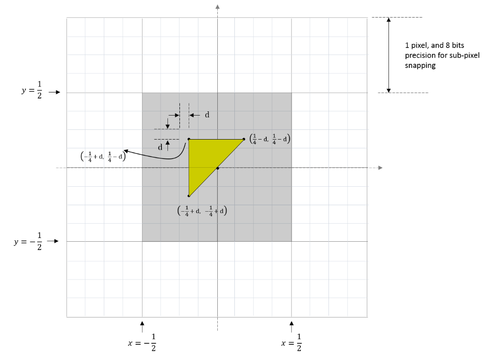

<h1>Conservative Rasterization</h1>

Version: 3.2

Date: 6/30/2015

---

<h1>Contents</h1>

- [Summary](#summary)
- [Overview](#overview)
  - [Architectural Overview](#architectural-overview)
  - [Architecture Decisions](#architecture-decisions)
- [Interactions with the Pipeline](#interactions-with-the-pipeline)
  - [Rasterization Rules interaction](#rasterization-rules-interaction)
  - [Multisampling interaction](#multisampling-interaction)
  - [SampleMask interaction](#samplemask-interaction)
  - [Depth/Stencil Test interaction](#depthstencil-test-interaction)
  - [Helper Pixel interaction](#helper-pixel-interaction)
  - [Output Coverage interaction](#output-coverage-interaction)
  - [InputCoverage interaction](#inputcoverage-interaction)
  - [InnerCoverage](#innercoverage)
  - [Attribute Interpolation interaction](#attribute-interpolation-interaction)
  - [Clipping interaction](#clipping-interaction)
  - [Clip Distance interaction](#clip-distance-interaction)
  - [Target Independent Rasterization interaction](#target-independent-rasterization-interaction)
  - [IA Primitive Topology interaction](#ia-primitive-topology-interaction)
  - [Query interaction](#query-interaction)
  - [Cull State interaction](#cull-state-interaction)
  - [IsFrontFace interaction](#isfrontface-interaction)
  - [Fill Modes interaction](#fill-modes-interaction)
- [Tiered Support](#tiered-support)
  - [Tier 1](#tier-1)
  - [Tier 2](#tier-2)
    - [Degenerate Triangle Culling](#degenerate-triangle-culling)
    - [Smaller Outer Uncertainty Region](#smaller-outer-uncertainty-region)
  - [Tier 3](#tier-3)
    - [Inner-Conservative Coverage System Generated Value](#inner-conservative-coverage-system-generated-value)
- [API Changes](#api-changes)
  - [D3D11](#d3d11)
  - [D3D12](#d3d12)
  - [HLSL](#hlsl)
- [DDI Design](#ddi-design)
  - [GetCaps](#getcaps)
  - [Rasterizer State Additions](#rasterizer-state-additions)
- [Runtime Changes](#runtime-changes)
  - [D3D11](#d3d11-1)
    - [Validation](#validation)
  - [D3D12](#d3d12-1)
- [Functional / Unit Tests](#functional--unit-tests)
  - [IHV-Bring-up Test](#ihv-bring-up-test)
  - [Conformance Tests](#conformance-tests)
- [Questions](#questions)

---

# Summary

Support Conservative Rasterization in Direct3D. Conservative
Rasterization is mode of operation for the Rasterizer stage of the
Direct3D Graphics Pipeline. It disables the standard sample-based
rasterization, and will instead rasterize a pixel that is covered by any
amount by a primitive. One important distinction is that, while any
coverage at all produces a rasterized pixel, that coverage cannot be
characterized by the hardware so coverage always appears binary to a
Pixel Shader: either fully covered or not covered. It is left to the
Pixel Shader code to analytically determine the actual coverage, if
needed.

---

# Overview

Conservative Rasterization in this context means that all pixels that
are at least partially covered by a rendered primitive are rasterized,
meaning the Pixel Shader is invoked. Behavior is not dependent on the
sample point coverage that is used when Conservative Rasterization is
not enabled: if any part of a primitive overlaps a pixel, then that
pixel is considered covered and is then rasterized. When an edge or
corner of a primitive falls along the edge or corner of a pixel, the
application of the Top-Left Rule is implementation-specific (with the
exception of implementations using the minimum uncertainty region).
However, for implementations that support degenerate triangles, a
degenerate triangle along an edge or corner must cover at least one
pixel; so nothing falls through the cracks.

This type of rasterization is sometimes referred to as Overestimated
Conservative Rasterization. There is also the concept of Underestimated
Conservative Rasterization, which means that only pixels that are fully
covered by a rendered primitive are rasterized. Underestimated
Conservative Rasterization is only exposed via the new InnerCoverage
System Generated Value, described later. The D3D Rasterizer's
Conservative Rasterization mode specified here is only Overestimated
Conservative Rasterization.

Conservative Rasterization implementations are allowed to produce false
positives, meaning they incorrectly decide that pixels are covered. This
can happen due to implementation-specific details like primitive growing
or snapping error inherent in the fixed-point vertex coordinates used in
rasterization. The reason false positives (with respect to fixed point
vertex coordinates) are valid is because some amount of false positives
are needed to allow an implementation to do coverage evaluation against
post-snapped vertices (i.e. vertex coordinates that have been converted
from floating point to the 16.8 fixed-point used in the Rasterizer), but
honor the coverage produced by the original floating point vertex
coordinates. Beyond that, implementations are encouraged to reduce the
number of false positives as much as possible. Limits on false positives
are detailed in Rasterization Rules interaction.

Conservative Rasterization implementations must never produce false
negatives with respect to the floating-point vertex coordinates for
non-degenerate post-snap primitives: if any part of a primitive overlaps
any part of a pixel, then that pixel must be rasterized.

Triangles that are degenerate (duplicate indices in an index buffer or
collinear in 3D), or become degenerate after fixed-point conversion
(collinear vertices in the Rasterizer), may or may not be culled; both
are valid behaviors. However, Tier 2 and above require an implementation
to never produce false negatives with respect to the floating-point
vertex coordinates and therefore they must rasterize degenerates, with
the exception that triangles with duplicate indices in an index buffer
may be culled (some hardware automatically discards triangles with
duplicate indices and this case is not considered useful enough to force
a hardware change). Degenerate triangles must be considered back facing,
so if a specific behavior is required by an application, it can use
back-face culling or the IsFrontFace System Generated Value. Degenerate
triangles must use the values assigned to Vertex 0 for all interpolated
values.

Conservative Rasterization is an optional feature as of D3D11.3. (Note:
check support DDI not detailed here). A WDDM 2.0+, D3D Feature Level
11.1+ capable driver and hardware is required.

Conservative Rasterization support will be defined by three Tiers, as
described in the Tiered Support section.

---

## Architectural Overview

Conservative Rasterization will only be supported on WDDM 2.0 or newer
UMDs that support FL11.1+. A new capability bit will expose support on
such systems.

---

## Architecture Decisions

We will use a Tiered structure to split implementations across two
differentiators: post-snap degenerate culling behavior, and inner input
coverage.

(1) Tier 1:

- ½ pixel uncertainty region, and no post-snap degenerates
- Good for tiled rendering, texture atlas, light map gen,
        sub-pixel shadow maps

(2) Tier 2:

- Adds post-snap degenerates, and 1/256 uncertainty region
- Adds support for CPU-based-algorithm acceleration (e.g.
        voxelization)

(3) Tier 3:

- Adds Inner input coverage
- Adds support for occlusion culling

---

# Interactions with the Pipeline

---

## Rasterization Rules interaction

In Conservative Rasterization mode, Rasterization Rules apply the same
way as when Conservative Rasterization mode is not enabled with
exceptions for the Top-Left Rule, as described previously, and [[Pixel
Coverage]{.underline}](#_InputCoverage_interaction). 16.8 Fixed-Point
Rasterizer precision must be used.

Pixels that would not be covered if hardware was using full floating
point vertex coordinates may only be included if they are within an
uncertainty region no larger half a pixel in the fixed point domain.
Future hardware is expected to reach the tightened uncertainty region
specified in Tier 2. Note that this requirement prevents sliver
triangles from extending further than necessary.

A similar valid uncertainty region applies to InnerCoverage as well, but
it is tighter since no implementations require a larger uncertainty
region for this case. See InnerCoverage for more detail.

Inner and outer uncertainty regions must be greater than or equal to the
size of half the subpixel grid, or 1/512 of a pixel, in the fixed point
domain. This is the minimum valid uncertainty region. 1/512 comes from
the 16.8 fixed point Rasterizer coordinate representation and the
round-to-nearest rule that applies when converting floating point vertex
coordinates to 16.8 fixed point coordinates. 1/512 can change if the
Rasterizer precision changes. If an implementation implements this
minimum uncertainty region, then they must follow the Top-Left Rule when
an edge or corner of the uncertainty region falls along the edge or
corner of a pixel. The clipped edges of the uncertainty region should be
treated as the closest vertex, meaning that it counts as two edges: the
two that join at the associated vertex. Top-Left Rule is required when
the minimum uncertainty region is used because if it is not, then a
Conservative Rasterization implementation would fail to rasterize pixels
that could be covered when Conservative Rasterization mode is disabled.

The included diagram illustrates a valid outer uncertainty region
produced by sweeping a square around the edges of the primitive in the
fixed point domain (i.e. the vertices have been quantized by the 16.8
fixed point representation). The dimensions of this square are based on
the valid outer uncertainty region size: for the 1/2 of a pixel, the
square is 1 pixel in width and height, for 1/512 of a pixel, the square
is 1/256 of a pixel in width and height. The green triangle represents a
given primitive, the red dotted line represents the bound on
Overestimated Conservative Rasterization, the solid black squares
represent the square that is swept along the primitive edges, and the
blue checkered area is the outer uncertainty region:


---

## Multisampling interaction

Regardless of the number of samples in RenderTarget/DepthStencil
surfaces (or whether ForcedSampleCount is being used or not), all
samples are covered for pixels rasterized by Conservative Rasterization.
Individual sample locations are not tested for whether they fall in the
primitive or not.

---

## SampleMask interaction

The SampleMask Rasterizer State applies the same way as when
Conservative Rasterization is not enabled for InputCoverage, but does
not affect InnerCoverage (i.e. it is not AND'ed into an input declared
with InnerCoverage). This is because InnerCoverage is unrelated to
whether MSAA samples are masked out: 0 InnerCoverage only means that the
pixel is not guaranteed to be fully covered, not that no samples will be
updated.

---

## Depth/Stencil Test interaction

Depth/Stencil Testing proceeds for a conservatively rasterized pixel the
same way as if all samples are covered when Conservative Rasterization
is not enabled. Proceeding with all samples covered can cause Depth
extrapolation, which is valid and must be clamped to the viewport as
specified when Conservative Rasterization is not enabled. This is
similar to when pixel-frequency interpolation modes are used on a
RenderTarget with sample count \> 1 (see section 3.5.5), although in the
case of Conservative Rasterization, it is the depth value going into the
fixed function depth test that can be extrapolated.

Use of early depth culling behavior in combination with conservative rasterization is undefined.
This includes early depth culling where depth extrapolation occurs. This
is because some Early Depth culling hardware cannot properly support
extrapolated depth values. However, Early Depth culling behavior in the
presence of Depth Extrapolation is problematic even with hardware that
can support extrapolated depth values. This issue can be worked around
by clamping the Pixel Shader input depth to the min and max depth values
of the primitive being rasterized and writing that value to oDepth.
Implementations are required to disable Early Depth culling in this
case, due to the oDepth write.

---

## Helper Pixel interaction

Helper Pixel rules apply the same way as when Conservative Rasterization
is not enabled. As part of this, all pixels including Helper Pixels must
report InputCoverage accurately as specified in the InputCoverage
interaction section. So fully noncovered pixels report 0 coverage.

---

## Output Coverage interaction

Output Coverage (oMask) behaves for a conservatively rasterized pixel as
it does when Conservative Rasterization is not enabled with all samples
covered.

---

## InputCoverage interaction

In Conservative Rasterization mode, this input register is populated as
if all samples are covered when Conservative Rasterization is not
enabled for a given conservatively rasterized pixel. That is to say, all
existing interactions apply (e.g. SampleMask is applied), and the first
n bits in InputCoverage from the LSB are set to 1 for a conservatively
rasterized pixel, given an n sample per pixel RenderTarget and/or
Depth/Stencil buffer is bound at the Output Merger, or an n sample
ForcedSampleCount. The rest of the bits are 0.

This input is available in a shader regardless of the use of
Conservative Rasterization, though Conservative Rasterization changes
its behavior to only show all samples covered (or none for Helper
Pixels).

---

## InnerCoverage

This feature is required by, and only available in, Tier 3. The runtime
will fail shader creation for shaders that use this mode when an
implementation supports a Tier less than Tier 3.

The Pixel Shader has a new 32-bit scalar integer System Generate Value
available: InnerCoverage. This is a bitfield that has bit 0 from the LSB
set to 1 for a given conservatively rasterized pixel, only when that
pixel is guaranteed to be entirely inside the current primitive. All
other input register bits must be set to 0 when bit 0 is not set, but
are undefined when bit 0 is set to 1 (essentially, this bitfield
represents a Boolean value where false must be exactly 0, but true can
be any odd (i.e. bit 0 set) non-zero value). This input is used for
underestimated Conservative Rasterization information. It informs the
Pixel Shader whether the current pixel lies completely inside the
geometry.

This must account for snapping error at resolutions greater than or
equal to the resolution at which the current Draw is operating. There
must not be false positives (setting InnerCoverage bits when the pixel
is not fully covered for any snapping error at resolutions greater than
or equal to the resolution at which the current Draw is operating), but
false negatives are allowed. Said another way, the implementation must
not incorrectly identify pixels as fully covered that would not be with
full floating point vertex coordinates in the Rasterizer.

Pixels that would be fully covered if hardware was using full floating
point vertex coordinates may only be omitted if they intersect the inner
uncertainty region, which must be no larger than the size of the
subpixel grid, or 1/256 of a pixel, in the fixed point domain. Said
another way, pixels entirely within the inner boundary of the inner
uncertainty region must be marked as fully covered. The inner boundary
of the uncertainty region is illustrated in the diagram below by the
bold black dotted line. 1/256 comes from the 16.8 fixed point Rasterizer
coordinate representation, which can change if the Rasterizer precision
changes. This uncertainty region is enough to account for snapping error
caused by the conversion of floating point vertex coordinates to fixed
point vertex coordinates in the Rasterizer.

The same 1/512 minimum uncertainty region requirements defined in
Rasterization Rules interaction apply here as well.

The included diagram illustrates a valid inner uncertainty region
produced by sweeping a square around the edges of the primitive in the
fixed point domain (i.e. the vertices have been quantized by the 16.8
fixed point representation). The dimensions of this square are based on
the valid inner uncertainty region size: for 1/256 of a pixel, the
square is 1/128 of a pixel in width and height. The green triangle
represents a given primitive, the bold black dotted line represents the
boundary of the inner uncertainty region, the solid black squares
represent the square that is swept along the primitive edges, and the
orange checkered area is the inner uncertainty region:


The use of InnerCoverage does not affect whether a pixel is
conservatively rasterized, i.e. using one of these InputCoverage modes
does not affect which pixels are rasterized when Conservative
Rasterization mode is enabled. Therefore, when InnerCoverage is used and
the Pixel Shader is processing a pixel that is not completely covered by
the geometry its value will be 0, but the Pixel Shader invocation will
have samples updated. This is different from when InputCoverage is 0,
meaning that no samples will be updated.

This input is mutually exclusive with InputCoverage: both cannot be
used.

To access InnerCoverage, it must be declared as a single component out
of one of the Pixel Shader input registers. The interpolation mode on
the declaration must be constant (interpolation does not apply).

The InnnerCoverage bitfield is not affected by depth/stencil tests, nor
is it ANDed with the SampleMask Rasterizer state.

This input is only valid in Conservative Rasterization mode. That is to
say, when Conservative Rasterization is not enabled, InnerCoverage
produces an undefined value.

Pixel Shader invocations caused by the need for Helper Pixels, but
otherwise not covered by the primitive, must have the InnerCoverage
register set to 0.

---

## Attribute Interpolation interaction

Attribute interpolation modes are unchanged and proceed the same way as
when Conservative Rasterization is not enabled, where the
viewport-scaled and fixed-point-converted vertices are used. Because all
samples in a conservatively rasterized pixel are considered covered, it
is valid for values to be extrapolated, similar to when pixel-frequency
interpolation modes are used on a RenderTarget with sample count \> 1
(see section 3.5.5). Centroid interpolation modes produce results
identical to the corresponding non-centroid interpolation mode; the
notion of centroid is meaningless in this scenario -- where sample
coverage is only either full or 0.

Conservative Rasterization allows for degenerate triangles to produce
Pixel Shader invocations, therefore, degenerate triangles must use the
values assigned to Vertex 0 for all interpolated values.

---

## Clipping interaction

When Conservative Rasterization mode is enabled and depth clip is
disabled (i.e. DepthClipEnable Rasterizer State set to FALSE), there may
be variances in attribute interpolation for segments of a primitive that
fall outside the 0 \<= z \<= w range, depending on implementation:
either constant values are used from a point where the primitive
intersects the relevant plane (near or far), or attribute interpolation
behaves as when Conservative Rasterization mode is disabled. However,
the depth value behavior is the same regardless of Conservative
Rasterization mode, i.e. primitives that fall outside of the depth range
must still be given the value of the nearest limit of the viewport depth
range. Attribute interpolation behavior inside the 0 \<= z \<= w range
must remain unchanged.

---

## Clip Distance interaction

Clip Distance is valid when Conservative Rasterization mode is enabled,
and behaves for a conservatively rasterized pixel as it does when
Conservative Rasterization is not enabled with all samples covered.

Note that Conservative Rasterization can cause extrapolation of the W
vertex coordinate, which may cause W \<= 0. This could cause per-pixel
Clip Distance implementations to operate on a Clip Distance that has
been Perspective Divided by an invalid W value. Clip Distance
implementations must guard against invoking rasterization for pixels
where vertex coordinate W \<= 0 (e.g. due to extrapolation when in
Conservative Rasterization mode).

---

## Target Independent Rasterization interaction

Conservative Rasterization mode is compatible with TIR. TIR rules and
restrictions apply, behaving for a conservatively rasterized pixel as if
all samples are covered.

---

## IA Primitive Topology interaction

Conservative Rasterization is not defined for line or point primitives.
Therefore, Primitive Topologies that specify points or lines produce
undefined behavior if they are fed to the rasterizer unit when
Conservative Rasterization is enabled.

Note: there will be debug layer validation to verify applications do not
use these Primitive Topologies.

---

## Query interaction

For a conservatively rasterized pixel, D3D11 Queries must behave as they
do when Conservative Rasterization is not enabled when all samples are
covered. E.g. For a conservatively rasterized pixel,
D3D11_QUERY_OCCLUSION and D3D11_QUERY_DATA_PIPELINE_STATISTICS
must behave as they would when Conservative Rasterization is not enabled
when all samples are covered.

For example, Pixel Shader invocations should increment for every
conservatively rasterized pixel in Conservative Rasterization mode.

---

## Cull State interaction

All Cull States are valid in Conservative Rasterization mode and follow
the same rules as when Conservative Rasterization is not enabled.

*Note: When comparing Conservative Rasterization across resolutions to
itself or without Conservative Rasterization enabled, there is the
possibility that some primitives may have mismatched facedness (i.e. one
back facing, the other front facing). Applications can avoid this
uncertainty by using D3D11_CULL_NONE and not using the IsFrontFace
System Generated Value.*

---

## IsFrontFace interaction

The IsFrontFace System Generated Value is valid to use in Conservative
Rasterization mode, and follows the behavior defined when Conservative
Rasterization is not enabled.

Note: see [cull state interaction](#cull-state-interaction).

---

## Fill Modes interaction

The only valid Fill Mode for Conservative Rasterization is
D3D11_FILL_SOLID, any other Fill Mode is an invalid parameter for the
Rasterizer State.

This is because D3D11 functional specification specifies that wireframe
Fill Mode should convert triangle edges to lines and follow the line
rasterization rules and conservative line rasterization behavior has not
been defined. If conservative line rasterization behavior is defined in
the future, this restriction can be lifted.

---

# Tiered Support

We expect future implementations to converge on support for Tier 3.

---

## Tier 1

This tier captures use cases that don't rely on degenerates being
rasterized or inner coverage.

Conservative Rasterization behaves as specified previously in this
document.

---

## Tier 2

This tier captures use cases that rely on degenerates being rasterized,
such as voxelization.

Conservative Rasterization behaves as specified previously in this
document, with the following new requirements:

---

### Degenerate Triangle Culling

Conservative Rasterization must not fail to rasterize pixels that would
be rasterized with full floating point vertex coordinates in the
Rasterizer (note that (especially post-snap) degenerate culling prevents
this from being true).

Therefore, degenerate triangles **must not be culled**, with the
exception that triangles with duplicate indices may be culled. This
simplifies the distinction between Standard and Conservative
Rasterization: standard always has degenerate culling, conservative does
not.

Note that degenerate triangles must be back-facing, so if a specific
behavior is required by an application, it can use back-face culling or
the IsFrontFace System Generated Value.

---

### Smaller Outer Uncertainty Region

Pixels that would not be covered if hardware was using floating point
vertex coordinates must only be included if they are within an outer
uncertainty region no larger than the size the subpixel grid, or 1/256
of a pixel as the Rasterizer exists today, in the fixed point domain.
1/256 comes from the 16.8 fixed point Rasterizer coordinate
representation, which can change if the Rasterizer precision changes.
This uncertainty region is enough to account for snapping error caused
by the conversion of floating point vertex coordinates to fixed point
vertex coordinates in the Rasterizer. Note that this requirement
prevents sliver triangles from extending further than necessary.

The previously included outer uncertainty region diagram illustrates
this smaller valid outer uncertainty region when the swept square
measures 1/128 of a pixel in width and height.

---

## Tier 3

This tier captures use cases that require inner input coverage, such as
occlusion culling.

Conservative Rasterization behaves as specified previously in this
document (including previous tier requirements), with the following new
requirements:

---

### Inner-Conservative Coverage System Generated Value

InnerCoverage System Generate Value is **required**.

---

---

# API Changes

---

## D3D11

A new Rasterizer Desc struct will be required at the API.

API Struct:

```C++
typedef struct D3D11_RASTERIZER_DESC2
{
    /* Previous members */
    D3D11_CONSERVATIVE_RASTER_MODE ConservativeRaster;
} D3D11_RASTERIZER_DESC2;

```C++
typedef enum D3D11_CONSERVATIVE_RASTERIZER_MODE
{
    D3D11_CONSERVATIVE_RASTER_MODE_OFF = 0; // Default
    D3D11_CONSERVATIVE_RASTER_MODE_ON = 1;
} D3D11_CONSERVATIVE_RASTERIZER_MODE;

This needs an associated CD3D11_RASTERIZER_DESC2 utility class.

A new ID3D11Device* function will be added to the latest ID3D11Device*
interface (e.g. ID3D11Device3) that takes the new desc:

```C++
HRESULT CreateRasterizerState2(
    [annotation(\"_In_\")[ const D3D11_RASTERIZER_DESC2* pRasterizerDesc,
    [annotation(\"_Out_opt_\")[ ID3D11RasterizerState2** ppRasterizerState );
```

A new Rasterizer State interface will be required to support a new
GetDesc:

```C++
interface ID3D11RasterizerState2 : ID3D11RasterizerState1
{
    void GetDesc2( [annotation(\"_Out_\")[ D3D11_RASTERIZER_DESC2* pDesc );
};
```

RS[Set/Get[State() APIs do not require changes.

---

## D3D12

D3D12 uses the same (or similar) types and interfaces, so essentially
the same D3D11 changes can be made to D3D12. There is a possibility that
we rename the rasterizer state interface to ID3D12RasterizerState, or
that we get rid of separate pipeline objects all together and only have
PSOs, but that work is being considered as part of the 11on12 effort.

---

## HLSL

A new Input Coverage System Generated Value is defined that must work in
D3D11 and D3D12:

SV_InnerCoverage

> A 32-bit scalar integer that can be specified on input of a pixel
> shader. Requires ps_5_0 or higher.
>
> Represents underestimated conservative rasterization information (i.e.
> whether a pixel is guaranteed-to-be-fully covered).

This System Generated Value is required for [Tier
3](#tier-3) support, and is only available in that Tier.
Therefore, a new Shader Feature flag must be added to the
SShaderFeatureInfo FeatureFlags in order for runtime to properly
validate. This is typically performed as part of the HLSL compiler work,
see SHADER_FEATURE_TILED_RESOURCES as an example.

SV_InnerCoverage is mutually exclusive with SV_Coverage: both cannot
be used.

To access SV_InnerCoverage, it must be declared as a single component
out of one of the Pixel Shader input registers. The interpolation mode
on the declaration must be constant (interpolation does not apply).

---

# DDI Design

Conservative Rasterization will be supported by D3D11 and D3D12. D3D11
DDI is specified here, but there will be D3D12 equivalents.

D3D Feature Level 11.1+ hardware and WDDM 2.0+ UMD is required.

---

## GetCaps

A new D3D10_2DDICAPS_TYPE will be added to communicate Tier, for
example:

```C++
typedef enum D3D10_2DDICAPS_TYPE
{
    /* other caps */
    D3DWDDM2_0DDICAPS_D3D11_OPTIONS2 = 140,
} D3D10_2DDICAPS_TYPE;
```

And an associated struct for the driver to fill out:

```C++
// D3DWDDM2_0DDICAPS_D3D11_OPTIONS2
typedef struct D3DWDDM2_0DDICAPS_D3D11_OPTIONS2_DATA
{
    /* other caps */
    D3DWDDM2_0DDI_CONSERVATIVE_RASTERIZATION_TIER
    ConservativeRasterizationTier;
} D3DWDDM2_0DDICAPS_D3D11_OPTIONS2_DATA;
```

And an associated enum type:

```C++
typedef enum D3DWDDM2_0DDI_CONSERVATIVE_RASTERIZATION_TIER
{
    D3DWDDM2_0DDI_CONSERVATIVE_RASTERIZATION_NOT_SUPPORTED = 0,
    D3DWDDM2_0DDI_CONSERVATIVE_RASTERIZATION_TIER_1 = 1,
    D3DWDDM2_0DDI_CONSERVATIVE_RASTERIZATION_TIER_2 = 2,
    D3DWDDM2_0DDI_CONSERVATIVE_RASTERIZATION_TIER_3 = 3,
} D3DWDDM2_0DDI_CONSERVATIVE_RASTERIZATION_TIER;
```

---

## Rasterizer State Additions

A new Conservative Rasterization mode Rasterizer State will be added,
for example:

```C++
typedef struct D3DWDDM2_0DDI_RASTERIZER_DESC
{
    /* other state */
    D3DWDDM2_0DDI_CONSERVATIVE_RASTERIZATION_MODE ConservativeRaster;
} D3DWDDM2_0DDI_RASTERIZER_DESC;

typedef enum D3DWDDM2_0DDI_CONSERVATIVE_RASTERIZATION_MODE
{
    D3DWDDM2_0DDI_CONSERVATIVE_RASTERIZATION_OFF = 0, // Default
    D3DWDDM2_0DDI_CONSERVATIVE_RASTERIZATION_ON = 1,
} D3DWDDM2_0DDI_CONSERVATIVE_RASTERIZATION_MODE;
```

This necessitates revisions of the DDIs that have Rasterizer State
parameters (CalcPrivateSize and CreateRasterizerState):

```C++
typedef SIZE_T ( APIENTRY* PFND3D12DDI_CALCPRIVATERASTERIZERSTATESIZE)(
    D3D12DDI_HDEVICE, _In_ CONST D3DWDDM2_0DDI_RASTERIZER_DESC * );

typedef VOID ( APIENTRY* PFND3DWDDM2_0DDI_CREATERASTERIZERSTATE )(
    D3D12DDI_HDEVICE, _In_ CONST D3DWDDM2_0DDI_RASTERIZER_DESC *,
    D3D12DDI_HRASTERIZERSTATE, D3D12DDI_HRTRASTERIZERSTATE );
```

---

# Runtime Changes

---

## D3D11

CRasterizerState in both the runtime and SDKLayers needs to implement
the new ID3D11RasterizerState2. Uses of ID3D11RasterizerState1 should be
updated to ID3D11RasterizerState2 where they make sense as well, e.g.
C10and11DeviceChildForVisibleClasses\<\>, ChildTypeFromIFace\<\>,
CDeviceChild\<\>. GetDesc will be updated to have a GetDesc_Worker that
provides the shared code implementation, taking a CFunctionSentinel from
the callers (see CreateRasterizerStatePostValidation for an example of
CFunctionSentinel passing).

CDevice in both the runtime and SDKLayers needs to implement the new
Create API added to the latest ID3D11Device* interface.

- For the SDKLayers, CreateRasterizerState1 has its own implementation
    of Pre and Post validation, which must be changed. We will update
    CDevice::CreateRasterizerStatePreValidation and
    CDevice::CreateRasterizerStatePostValidation to take the latest
    Desc, and all old versions of CreateRasterizerState in the SDKLayers
    will be updated to convert to the latest Desc.
    (CreateRasterizerState1 (and CreateRasterizerState2) will look like
    CreateRasterizerState when this is done)

- For the Core Device, CreateRasterizerState_Worker will be modified
    to use the latest Rasterizer State Desc and Interface. Then all
    Rasterizer State Create calls will forward to the Worker, doing any
    parameter translation and ETW logging necessary.
    CreateRasterizerState1 should be used as a template for the worker
    code. This also means a new
    CETWEvent_ID3D11Device_CreateRasterizerState2_ETWLogger is
    required to log Core Device calls to CreateRasterizerState2.

SmallRasterizerStateDesc must also be updated to handle the new API and
DDI structs. This utility class is used in many of the functions
identified in this section to access API state and DDI state objects.

To support layered creation, a new layered creation args that inherits
from SD3D11_1LayeredRasterizerStateCreationArgs is required (e.g.
SD3D11_3LayeredRasterizerStateCreationArgs). This necessitates changes
to the CDevice::GetLayeredChildSize, CDevice::CreateLayeredChild,
CDevice::CreateRasterizerState* functions, CDevice::EnsureRSDual, and
CRasterizerState::TConstructorArgs.

DDI call sites in CDevice::GetLayeredChildSize and
CRasterizerState::CLS::FinalConstruct must be updated to call the latest
DDI.

Device Removed stubs for D3D11's handling of Device Removed UMD
insulation and Software Deferred Context stubs are required for the new
DDIs as well.

SwitchToRef.* can be safely ignored because the precedent was set to do
so with the addition of D3D11_RASTERIZER_DESC1.

---

### Validation

CCreateRasterizerStateValidator::Validate must be updated to take a
D3D11_RASTERIZER_DESC2. Any Create-time validation of Conservative
Rasterization must be added here. Create validation consists of the
following checks:

- Conservative Rasterization is supported by driver

- D3D11_FILL_MODE is only D3D11_FILL_SOLID

Draw-time validation of Conservative Rasterization will be placed in
CContext::ValidateDraw, and a new default Rasterizer State Desc will be
added (i.e. a new version of c_DefaultRasterizerDesc1). Draw-time
validation consists of the following checks:

- Primitive Topology is not one that produces points or lines (i.e.
    *LINE* & *POINT* topologies)

- Pixel Shader is not using InnerCoverage when ConsRas is disabled.

Pixel Shader creation validation will be placed in
CCreatePixelShaderValidator::ValidateShader. Validation consists of the
following checks:

- Inner Coverage Feature Flag (see [HLSL section](#hlsl)) is only set
    if driver Tier \>= Tier 3.

---

## D3D12

Most changes specified in D3D11 apply here, with a few additions:

- PipelineSubobjectTraits\<CRasterizerState\> will be updated to use
    D3D11_RASTERIZER_DESC2

- c_12DefaultRasterizerDesc1 will be removed since
    c_12DefaultRasterizerDesc + CreateRasterizerState() fill in
    defaults for the missing parameters already

- PSONeutralBlob will be updated to use D3D11_RASTERIZER_DESC2

We specify "most changes" because D3D12 is currently in the process of
removing now-out-dated 11 APIs. For example, CreateRasterizerState will
not have so many variants in D3D12.

Any chance to share code between D3D12 and D3D11 should be taken. To do
so, the easiest way is to add a new \<filename\>_SharedTo11.\<fileext\>
file that contains the shared code and is included in both D3D12 and
D3D11 versions of \<filename\>. Let the preprocessor do the work!
However, we must be mindful of changes to the DDI in D3D12 that could
require the shared code to be unshared, so don't waste work! A good
candidate for sharing is the pre and post validation functions.

---

# Functional / Unit Tests

The functional unit tests will be written in TAEF. Because negatives
must be tested, we need D3D11 and D3D12 API tests. We must also ensure
D3D11on12 works for positives. D3DDriver will be used for D3D11 DDI call
verification, DDIFilter and WARP will be used for D3D12 and D3D11on12.

Functional unit tests will cover the following:

- CheckFeatureSupport:
  - Check Tier reporting (no support through Tier 3) by querying
        ConsRas Tier cap to verify expected support and pfnGetCaps DDI
        calls.
  - Check support negatives caused by lack of feature level and/or
        WDDM version requirements and verify pfnGetCaps is not called.
- CreateRasterizerState2
  - Verify expected failures and debug output due to:
    - Lack of Conservative Rasterization support by driver
            (integrate into CheckFeatureSupport test so all negative
            support cases are covered).
    - D3D11_FILL_MODE != D3D11_FILL_SOLID
  - Verify expected success and DDI calls (getprivatesize and
        create) when ConsRas is supported (again, integrate into
        CheckFeatureSupport so all Tiers are covered).
- GetDesc2 (Rasterizer State Interface)
  - Verify GetDesc2 returns expected values after
        CreateRasterizerState2 success.
- RS[Set/Get[State
  - Verify SetState DDI calls
  - Verify GetState API returns expected state (compare GetDesc2
        values, or possibly pointers)
- Draw-time validation
  - Verify expected failures and debug output when Primitive
        Topology is not one that produces points or lines (i.e. *LINE*
        & *POINT* topologies).
  - Verify expected failures and debug output when Pixel Shader is
        using InnerCoverage when ConsRas is enabled.
  - Verify expected Draw DDI call and no debug output when
        rasterizer state is valid.
- Create Shader validation
  - Verify expected failure and debug output when PS is using
        SV_InnerCoverage and driver Tier \< Tier 3.
  - Verify expected create pixel shader DDI call and no debug output
        when driver Tier \>= Tier 3.

CreateRasterizerState2 and RS[Set/Get[State are the only ones required
to unblock partners.

Note that is probably makes sense to combine many of these tests so, for
example, successful creates can be used for later validation.

## IHV-Bring-up Test

The unit test to unblock IHV development is written to rasterize a
triangle that falls in between the center sample positions of a 2x2
Render Target. Enabling Conservative Rasterization must produce
rasterized pixels, while disabling Conservative Rasterization must NOT
rasterize pixels. The vertex coordinates should be
\<-1,0\>,\<1,0\>,\<0,0.5\> in NDC, with a Viewport top-left of \<0,0\>
and \<2,2\> width and height.

This test leverages 11on12 to get D3D12 coverage.

## Conformance Tests

The following functionality is HCK (conformance) tested:

- Basic Functionality:
  - IHV-Bring-up Test, described in the previous section
- Uncertainty Range:
  - Tier 1 uses a ½ pixel uncertainty region. Tiers 2 and 3 are 1/256.
  - To validate ½ pixel, a 4x4 RT/viewport will render a triangle
        such that only the center four pixels should be rasterized. The
        vertex coordinates should be \<-.25+d, .25-d\>,\<-.25+d,
        -.25+d\>,\<.25-d, .25-d\> in NDC, with a Viewport top-left of
        \<0,0\> and \<4,4\> width and height, where d is a small delta
        offset such that the uncertainty region edge does not land on a
        pixel edge, since Top-Left Rule is undefined.



  - To validate 1/256 pixel, a 3x3 RT/viewport will render a
        triangle such that only the center pixel should be rasterized.
        This test must only run when the driver reports Tier 3 support.
        The vertex coordinates should be \<-1/3+d, 1/3-d\>,\<-1/3+d,
        -1/3+d\>,\<1/3-d,1/3-d\> in NDC, with a Viewport top-left of
        \<0,0\> and \<3,3\> width and height, where d is 1/256 of 2/3
        (i.e. 1/256 of a pixel), accounting for the uncertainty region,
        plus a small offset such that the uncertainty region edge does
        not land on a pixel edge, since Top-Left Rule is undefined.


  - To validate tier-3 Top-Left Rule, we set up the primitive with
        vertices \<-1+d, -0.5\>, \<d, 0.5\>, and \<0.5, -0.5\> on a 4x4
        viewport, where d is 1/256 of 1/2 (i.e. 1/512). In this case, 13
        pixels should be rendered according to the Top-Left Rule. (Since
        the bottom-right corners of the red pixels touch the left edge
        of the triangle.)


  - Included below is a diagram of the described tests, but note
        that the actual vertex coordinate values are not in NDC:


- Inner Coverage
  - Tier 3+ required.
  - Ensure bits are only set when pixel is entirely within 1/256
        inner uncertainty region. A 3x3 RT/Viewport is used to
        validate that only the center pixel receives the Inner Input
        Coverage flag. The vertex coordinates should be \<-1-d,
        -1\>,\<1+d, -1\>,\<0, 1+2d\> in NDC, with a Viewport top-left of
        \<0,0\> and \<3,3\> width and height. The value 'd' is chosen such that the top-left and top-right corners of the middle pixel won't stick outside of the triangle nor will it stick into the uncertainty region. A suitable such value of 'd' is 3/512 in DC, which is multiplied by 2/3 for conversion to NDC.


  - Inner Input Coverage is undefined with Conservative
        Rasterization mode disabled, so no testing for that case.

- Post-snap degenerate culling
  - Tier 1 implementations do cull, Tier 2+ implementations do not
        cull.
  - For implementations that do not cull, a 1x3 RT/Viewport will be
        used to validate that a pixel is rasterized when a triangle is
        post-snap degenerate. The pixel must mark the triangle as
        back-facing, and all attributes must be V0 values. The vertex
        coordinates should be \<-1,1\>,\<1,1-(1/2048)\>,\<1,1\> in NDC,
        with a Viewport top-left of \<0,0\> and \<3,1\> width and
        height. We will assign colors of
        \<.1,.2,.3\>,\<1,1,1\>,\<1,1,1\>, respectively. The triangle
        must be rasterized, be back-facing, and the input color to all
        pixel shaders must be \<.1,.2,.3\>.
  - For implementations that do not cull, a 1x2 RT/Viewport will be
        used to validate that a pixel is rasterized when a degenerate
        triangle falls along the pixel boundary. The vertex coordinates
        should be \<0,-1\>,\<0,1\>,\<-1/1024,,1\> in NDC, with a
        Viewport top-left of \<0,0\> and \<2,1\> width and height. At
        least one pixel must be rasterized.
  - Enabling back-face culling must cull post-snap degenerates. This
        test will be re-run with back-face culling enabled, it should
        produce no rasterization.
- Other Pipeline Interactions:
- TIR
  - All Tiers.
  - Use IHV-Bring-up Test, modify it to set ForcedSampleCount to 4,
        verify that SV_Coverage receives 0x0000000F (i.e. low 4 bits
        set). This can be accomplished by simply writing SV_Coverage to
        the color output, or to a UAV.
- MSAA
  - All Tiers.
  - Use IHV-Bring-up Test, modify it to use 4x MSAA RT
        (DXGI_SAMPLE_DESC::Count = 4) and verify that SV_Coverage
        receives 0x0000000F (i.e. low 4 bits set).
- SampleMask w/ Inner Coverage
  - Tier 3+.
  - Use Inner Coverage Test, modify it to use 4x MSAA and set
        OMSetBlendState's SampleMask to 0x00000000, and verify
        SV_InnerCoverage receives 0x00000001.
- Clip Distance
  - Not interesting: clipping specification already states 0 \< w
        requirement for Clipping, which happens before per-pixel clip
        distance.
- Queries (e.g. D3D11_QUERY_OCCLUSION and
    D3D11_QUERY_DATA_PIPELINE_STATISTICS)
  - Not interesting: low risk that Conservative Rasterization
        affects behavior of any Queries.
- oMask
  - Not interesting: very little risk that implementations don't use
        the InputCoverage as the coverage for AND'ing with oMask.
- HelperPixel coverage
  - Not interesting: Helper Pixels are already tested to be
        non-side-effecting.
- Attribute Interpolation (extrapolation)
  - Not interesting: extrapolated values already exist, no need to
        test them again.
- Early Z w/ Depth Extrapolation
  - Not an issue for main occlusion-culling/visibility-testing
        techniques. All other implementations will have Early Z issues,
        but Qualcomm's will be a little different.

All tests specified here can be verified by reading the Render Target
contents (via copy-to-staging + map), or writing to a UAV.

---

# Questions

- Why isn't there an inner/under Conservative Rasterization mode?

Some Conservative Rasterization implementations are not capable of only
rasterizing guaranteed-to-be-fully-covered pixels. To support the most
hardware, this mode of rasterization behavior is not yet available, but
the same information can be conveyed by using the InnerCoverage System
Generated Value.

- Why did configurable fractional precision (versus 16.8) go away?

That feature wasn't tightly related to Conservative Rasterization,
although it can help certain use cases where Conservative Rasterization
is used to render a low-resolution proxy. Conservative Rasterization
should not rely on configuring the fractional precision in the
rasterizer because that limits its usefulness. This feature is still
interesting, and can be introduced in a future spec.