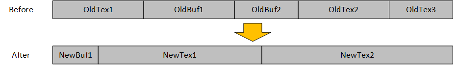
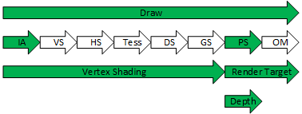

# Enhanced Barriers

This document proposes an enhanced D3D12 Barrier API/DDI design that is capable of fully replacing the legacy D3D12 Resource Barrier API's.

- [Introduction](#introduction)
- [D3D12 Legacy Resource Barrier Shortcomings](#d3d12-legacy-resource-barrier-shortcomings)
  - [Excessive sync latency](#excessive-sync-latency)
  - [Excessive flush operations](#excessive-flush-operations)
  - [Aliasing Barriers Are Very Expensive](#aliasing-barriers-are-very-expensive)
  - [Asymmetric Aliasing is Even More Expensive](#asymmetric-aliasing-is-even-more-expensive)
  - [Resource State Promotion and Decay](#resource-state-promotion-and-decay)
  - [Compute Queues and `D3D12_RESOURCE_STATE_PIXEL_SHADER_RESOURCE`](#compute-queues-and-d3d12_resource_state_pixel_shader_resource)
  - [Full-Subresource Clear, Copy or Discard](#full-subresource-clear-copy-or-discard)
  - [Simultaneous Access - But Only Across Queues](#simultaneous-access---but-only-across-queues)
  - [Inefficient Batching of Subresource Range Transitions](#inefficient-batching-of-subresource-range-transitions)
  - [Synchronous Copy, Discard and Resolve](#synchronous-copy-discard-and-resolve)
  - [No Self Copy](#no-self-copy)
- [Goals](#goals)
- [Non-Goals](#non-goals)
- [Overall Design Details](#overall-design-details)
  - [Barrier Types](#barrier-types)
  - [Synchronization](#synchronization)
  - [Layout Transitions](#layout-transitions)
  - [Access Transitions](#access-transitions)
  - [Single-Queue Simultaneous Access](#single-queue-simultaneous-access)
  - [Subresource Ranges](#subresource-ranges)
  - [Queue type specific layouts](#queue-type-specific-layouts)
  - [Barrier-Free Access](#barrier-free-access)
  - [Self Resource Copy](#self-resource-copy)
  - [Placed Resource Metadata Initialization](#placed-resource-metadata-initialization)
  - [Barrier Ordering](#barrier-ordering)
  - [New Resource Creation API's](#new-resource-creation-apis)
  - [Hardware Requirements](#hardware-requirements)
- [Compatibility with legacy `D3D12_RESOURCE_STATES`](#compatibility-with-legacy-d3d12_resource_states)
  - [Interop with legacy `ResourceBarrier`](#interop-with-legacy-resourcebarrier)
  - [Legacy layouts](#legacy-layouts)
  - [Equivalent `D3D12_BARRIER_LAYOUT` for each `D3D12_RESOURCE_STATES` bit](#equivalent-d3d12_barrier_layout-for-each-d3d12_resource_states-bit)
  - [Equivalent `D3D12_BARRIER_ACCESS` bit for each `D3D12_RESOURCE_STATES` bit](#equivalent-d3d12_barrier_access-bit-for-each-d3d12_resource_states-bit)
  - [Equivalent `D3D12_BARRIER_SYNC` bit for each `D3D12_RESOURCE_STATES` bit](#equivalent-d3d12_barrier_sync-bit-for-each-d3d12_resource_states-bit)
  - [UAV Barriers](#uav-barriers)
  - [Resource Aliasing](#resource-aliasing)
  - [Initial Resource State](#initial-resource-state)
  - [Split Barriers](#split-barriers)
  - [`COMMON` Layout](#common-layout)
  - [Upload Heap Resources](#upload-heap-resources)
  - [Readback Heap Resources](#readback-heap-resources)
  - [Command Queue Layout Compatibility](#command-queue-layout-compatibility)
  - [Command Queue Access Compatibility](#command-queue-access-compatibility)
  - [Command Queue Sync Compatibility](#command-queue-sync-compatibility)
  - [Copy Queues](#copy-queues)
  - [Layout Access Compatibility](#layout-access-compatibility)
  - [Access Bits Barrier Sync Compatibility](#access-bits-barrier-sync-compatibility)
- [API](#api)
  - [`D3D12_BARRIER_LAYOUT`](#d3d12_barrier_layout)
  - [`D3D12_BARRIER_SYNC`](#d3d12_barrier_sync)
  - [`D3D12_BARRIER_ACCESS`](#d3d12_barrier_access)
  - [`D3D12_BARRIER_SUBRESOURCE_RANGE`](#d3d12_barrier_subresource_range)
  - [`D3D12_BARRIER_TYPE`](#d3d12_barrier_type)
  - [`D3D12_GLOBAL_BARRIER`](#d3d12_global_barrier)
  - [`D3D12_TEXTURE_BARRIER_FLAGS`](#d3d12_texture_barrier_flags)
  - [`D3D12_TEXTURE_BARRIER`](#d3d12_texture_barrier)
  - [`D3D12_BUFFER_BARRIER`](#d3d12_buffer_barrier)
  - [`D3D12_BARRIER_GROUP`](#d3d12_barrier_group)
  - [`ID3D12GraphicsCommandList7::Barrier()`](#id3d12graphicscommandlist7-barrier)
  - [`ID3D12VideoDecodeCommandList3::Barrier()`](#id3d12videodecodecommandlist3-barrier)
  - [`ID3D12VideoProcessCommandList3::Barrier()`](#id3d12videoprocesscommandlist3-barrier)
  - [`ID3D12VideoEncodeCommandList3::Barrier()`](#id3d12videoencodecommandlist3-barrier)
  - [`ID3D12Device10::CreateCommittedResource3()`](#id3d12device10-createcommittedresource3)
  - [`ID3D12Device10::CreatePlacedResource2()`](#id3d12device10-createplacedresource2)
  - [`ID3D12Device10::CreateReservedResource2()`](#id3d12device10-createreservedresource2)
  - [`ID3D12DebugCommandQueue1::AssertResourceAccess()`](#id3d12debugcommandqueue1-assertresourceaccess)
  - [`ID3D12DebugCommandQueue1::AssertTextureLayout()`](#id3d12debugcommandqueue1-asserttexturelayout)
  - [`ID3D12DebugCommandList3::AssertResourceAccess()`](#id3d12debugcommandlist3-assertresourceaccess)
  - [`ID3D12DebugCommandList3::AssertTextureLayout()`](#id3d12debugcommandlist3-asserttexturelayout)
- [Barrier Examples](#barrier-examples)
- [DDI](#ddi)
  - [`D3D12DDI_BARRIER_LAYOUT`](#d3d12ddi_barrier_layout)
  - [`D3D12DDI_BARRIER_SYNC`](#d3d12ddi_barrier_sync)
  - [`D3D12DDI_BARRIER_ACCESS`](#d3d12ddi_barrier_access)
  - [`D3D12DDI_BARRIER_SUBRESOURCE_RANGE_0088`](#d3d12ddi_barrier_subresource_range_0088)
  - [`D3D12DDI_GLOBAL_BARRIER_0088`](#d3d12ddi_global_barrier_0088)
  - [`D3D12DDI_TEXTURE_BARRIER_0088_FLAGS_0088`](#d3d12ddi_texture_barrier_0088_flags_0088)
  - [`D3D12DDI_TEXTURE_BARRIER_0088`](#d3d12ddi_texture_barrier_0088)
  - [`D3D12DDI_BUFFER_BARRIER_0088`](#d3d12ddi_buffer_barrier_0088)
  - [`D3D12DDI_RANGED_BARRIER_FLAGS`](#d3d12ddi_ranged_barrier_flags)
  - [`D3D12DDI_RANGED_BARRIER_0088`](#d3d12ddi_ranged_barrier_0088)
  - [`D3D12DDI_RANGE_BARRIER_FLAGS_0094`](#d3d12ddi_range_barrier_flags_0094)
  - [`D3D12DDI_RANGED_BARRIER_0094`](#d3d12ddi_ranged_barrier_0094)
  - [`D3D12DDI_BARRIER_TYPE`](#d3d12ddi_barrier_type)
  - [`D3D12DDIARG_BARRIER_0094`](#d3d12ddiarg_barrier_0094)
  - [`PFND3D12DDI_BARRIER`](#pfnd3d12ddi_barrier)
  - [`D3D12DDIARG_CREATERESOURCE_0088`](#d3d12ddiarg_createresource_0088)
  - [`PFND3D12DDI_CREATEHEAPANDRESOURCE_0088`](#pfnd3d12ddi_createheapandresource_0088)
  - [`PFND3D12DDI_CALCPRIVATEHEAPANDRESOURCESIZES_0088`](#pfnd3d12ddi_calcprivateheapandresourcesizes_0088)
  - [`PFND3D12DDI_CHECKRESOURCEALLOCATIONINFO_0088`](#pfnd3d12ddi_checkresourceallocationinfo_0088)
  - [`D3D12DDI_D3D12_OPTIONS_DATA_0089`](#d3d12ddi_d3d12_options_data_0089)
- [Open Issues](#open-issues)
- [Testing](#testing)
  - [Functional Testing](#functional-testing)
  - [Unit Testing](#unit-testing)
  - [HLK Testing](#hlk-testing)
- [Debug Layers](#debug-layers)
  - [Validation Phases](#validation-phases)
  - [Barrier API Call Validation](#barrier-api-call-validation)
  - [Layout Validation](#layout-validation)
  - [Sync and Access Validation](#sync-and-access-validation)
  - [Legacy vs Enhanced State Validation](#legacy-vs-enhanced-state-validation)
  - [GPU-Based Validation](#gpu-based-validation)

------------------------------------------------

## Introduction

The legacy Resource Barrier design has been a source of endless app developer frustration since the beginning of D3D12.  Microsoft's documentation falls short of making sense of concepts such as resource state promotion and decay, split barriers, aliasing barriers, Copy queue states vs Direct queue states, and so on.  The debug layer helps, but validation of the convoluted barrier rules has been buggy at times.  Even when used correctly, a lot of GPU cycles are wasted in `ResourceBarrier` transitions due to excessive sync latency and frequent, unnecessary cache flushes.  The legacy `ResourceBarrier` API design itself can sometimes require otherwise-unnecessary transitions, causing additional performance loss.  These are significant pain points that have been the source of frequent customer complaints.

Now, as Microsoft looks toward leveraging D3D12 for more layering solutions similar to OpenGLOn12 and OpenCLOn12, the legacy Resource Barrier model is becoming even more burdensome as compatibility issues arise.

Enhanced Barriers are designed to address these issues while remaining compatible with legacy Resource Barrier API's.  As a bonus, enhanced Barriers expose latent hardware capabilities that legacy `ResourceBarrier` API's could not.

Enhanced Barriers features include:

- Reduce sync latency and excessive cache flushes.
- No mysterious Promotion and Decay rules.
- Fast, flexible resource aliasing.
- Discard during barrier transition.
- Concurrent read/write and self-copy.
- Support for Asynchronous Discard, Copy, Resolve, and Clear commands (Future API's not included in this spec).

------------------------------------------------

## D3D12 Legacy Resource Barrier Shortcomings

A Resource State encapsulates both the Layout of a subresource and the ways the GPU can access a subresource (e.g. UAV write, SRV read, Render Target, etc).  Resource State Transitions do the following:

1. GPU work Synchronization
   - Any in-flight GPU work accessing the transitioning subresource must be completed before a layout change or cache flush can occur
2. Subresource Layout changes
3. Memory visibility (i.e. cache flushing)

Resource States are high-level abstractions over what hardware and drivers are actually doing.  This works ok... sort of.  In reality, the only stateful property of a resource is layout.  Access to resource memory and required synchronization are transient properties that may depend on the current state of the GPU command stream rather than the resource.

### Excessive sync latency

App developers must assume that a State Transition Barrier will flush all preceding GPU work potentially-using StateBefore, and block all subsequent GPU work potentially-using StateAfter until the barrier is completed.  However, this is often performed using naive, worst-case synchronization, resulting in longer-than-necessary latency.

For example, a transition from `D3D12_RESOURCE_STATE_UNORDERED_ACCESS` to `D3D12_RESOURCE_STATE_NON_PIXEL_SHADER_RESOURCE|D3D12_RESOURCE_STATE_PIXEL_SHADER_RESOURCE` will wait for ALL preceding Graphics and Compute shader execution to complete, and block ALL subsequent Graphics and Compute shader execution.  This could be a problem if the preceding access was only in a Compute shader and subsequent access is only in a pixel shader.

### Excessive flush operations

D3D12 requires a full finish and flush of all GPU work at `ExecuteCommandLists` completion. Therefore, any writes to a resource during a preceding `ExecuteCommandLists` scope will be fully completed when that resource is needed in a subsequent `ExecuteCommandLists` scope.  However, drivers are not expected to keep track of when a resource was last written to.  So in addition to sync, a transition from a WRITE state may force a cache flush, even if the resource is already up-to-date from an earlier cache flush.

Assume a texture was used as a render target during a previous frame.  Now the app wants to read from that texture in a pixel shader.  Obviously a layout change may be required, but there is no need to flush any preceding Draw calls in the current `ExecuteCommandLists` scope. Unfortunately, a subresource state transition from `D3D12_RESOURCE_STATE_RENDER_TARGET` to `D3D12_RESOURCE_STATE_PIXEL_SHADER_RESOURCE` will unnecessarily force all preceding Draw commands to finish and flush before transitioning the texture layout.

### Aliasing Barriers Are Very Expensive

The Legacy Aliasing Barrier design provides no way to indicate the state of the AFTER subresource as part of the barrier.  Therefore, an additional `ResourceBarrier` may be needed to transition the resource to the desired state.  Not only does this further stall execution on the GPU, but a state transition always requires a BEFORE state.  As far as the D3D12 API's are concerned, the AFTER resource is still in the state it was in at last use/barrier/create.  However, the contents of this memory may not match this stale state.  Transitioning this memory is wasteful at least, and could even be unstable if the driver attempts to decompress garbage memory.

Under the covers, an Aliasing Barrier typically blocks all GPU execution until all preceding work is finished and writes are flushed.  This is quite expensive, especially if resource aliasing is being used to improve application efficiency.

### Asymmetric Aliasing is Even More Expensive

The Legacy Aliasing Barrier API assumes that only a single subresource is atomically activated with only one other subresource being deactivated.  However, there are many scenarios where there are multiple overlapping subresources on the 'before' and/or 'after' side of the aliasing barrier (see *Figure 1*).



*Figure 1*

In *Figure 1*, `NewTex1` partially overlaps `OldTex1` and `OldBuf2`, which are also partially aliased with other after-resources.  The only way to accomplish this using Legacy Aliasing Barriers is to use a "null/null" aliasing barrier, which is guaranteed to produces a full GPU execution stall.  This is especially unfortunate if all commands accessing `OldTex1`, `OldBuf1`, and `OldBuf2` have already completed.

### Resource State Promotion and Decay

[Implicit State Transitions (promotion and decay)](https://docs.microsoft.com/en-us/windows/win32/direct3d12/using-resource-barriers-to-synchronize-resource-states-in-direct3d-12#implicit-state-transitions) was invented to help support such scenarios.  Unfortunately, Implicit state promotion and decay is a major source of confusion for developers.  There are complex - and evolving - rules about when promotion and decay occur.

Some of the promotion/decay rules include:

- Non-simultaneous-access textures can only be promoted to `D3D12_RESOURCE_STATE_COPY_SOURCE`, `D3D12_RESOURCE_STATE_COPY_DEST`, or `D3D12_RESOURCE_STATE_*_SHADER_RESOURCE`.
- Buffers and simultaneous-access textures can be promoted to ANY state.
  - Except `D3D12_RESOURCE_STATE_DEPTH_STENCIL`.
- Resources promoted to a READ state will decay to `D3D12_RESOURCE_STATE_COMMON` when `ExecuteCommandLists` completes.
  - But not resources promoted to a write state.
- Resources can be cumulatively promoted to multiple read-states but only a single write-state.
- All resources used in Copy queues must begin in the `COMMON` state and always decay back to `COMMON` when `ExecuteCommandLists` completes.
- Resources promoted to `D3D12_RESOURCE_STATE_COPY_DEST` are left in `D3D12_RESOURCE_STATE_COPY_DEST`
  - Except for resources used in Copy queues, which decay back to `D3D12_RESOURCE_STATE_COMMON`.

Promotion and decay reflect the natural consequences of `ExecuteCommandLists` boundaries.  However, some developers incorrectly assume that hidden barriers are being inserted behind the scenes.  As such, it is common for promotion and decay to be ignored, resulting in excessive use of unnecessary barriers with noticeable performance impact.

### Compute Queues and `D3D12_RESOURCE_STATE_PIXEL_SHADER_RESOURCE`

The `D3D12_RESOURCE_STATE_PIXEL_SHADER_RESOURCE` state is only usable in Direct command lists.  Therefore, a Compute queue cannot use or transition a resource in state `D3D12_RESOURCE_STATE_PIXEL_SHADER_RESOURCE|D3D12_RESOURCE_STATE_NON_PIXEL_SHADER_RESOURCE`.  However, Compute queues DO support `D3D12_RESOURCE_STATE_NON_PIXEL_SHADER_RESOURCE`, which has an identical layout in both Direct and Compute queues.  This design oversight is a common source of d3d12 app developer frustration.  The primary reason for the separate states is to provide precise execution sync and memory flush for a Direct queue.  However, when passing resources between Direct and Compute queues, sync and flush are handled using fences.

### Full-Subresource Clear, Copy or Discard

According to earlier D3D12 specifications, Clear, Copy or Discard commands require destination resources be in a specific resource state.  Typically, this involves a state transition from a prior state.  This makes sense when only a portion of the resource is being written to or discarded.  However, when performing a full-subresource Clear, Copy or Discard, the old resource data is being completely replaced.  Therefore, a layout transition seems unnecessary.

This is particularly interesting when it comes to resource aliasing or updated tile mapping, as these operations require full-subresource Clear, Copy or Discard when the target is a DSV or RSV.  In such cases, there may not even be a previous "state" to transition from.  In fact, it is conceivable that a memory-decompressing state transition could trigger device removal.

### Simultaneous Access - But Only Across Queues

Buffers and simultaneous-access resources can be written to in one queue while concurrently being read-from one or more OTHER queues.  However, this pattern is not supported in a single queue because legacy Resource Barrier design prevents subresources from being in both READ and WRITE states at the same time.  However, hardware can support same-queue simultaneous-access; Layout is always `COMMON` and there is no sync or flush needed since the reads are non-dependent.

### Inefficient Batching of Subresource Range Transitions

Resource State Transition Barriers provide a choice of transitioning either ALL subresources (subresource index set to `0xFFFFFFFF`) or a single subresource.  This may be inefficient when transitioning a large range of logically-adjacent subresources, such as a range of array slices or a full mip-level chain in a single array slice.  It can be costly to build the array of individual transition elements and the translation from [mip-level, array-slice, plane-slice] to subresource-index is a common source of app bugs.

### Synchronous Copy, Discard and Resolve

With the exception of UAV barriers, legacy `ResourceBarrier` API's have no way to express dependent writes to the same resource.  For example, a Copy from resource A->B along with a Copy from resource C->B could produce different results if copies actually complete in different orders.  As a result, all Copy, Discard and Resolve commands execute synchronously, with an implicit sync and flush after each command.

### No Self Copy

According to the D3D12 specifications, a subresource cannot be in a state that combines *read-only* bits and *write* bits.  Therefore a resource cannot be in the `D3D12_RESOURCE_STATE_COPY_SOURCE|D3D12_RESOURCE_STATE_COPY_DEST` state.  This rule applies for promoted states as well, so a resource in a `COMMON` state cannot be implicitly promoted to both COPY_SOURCE and COPY_DEST at the same time.

------------------------------------------------

## Goals

- Legacy Resource Barriers can be fully implemented using D3D12 Barrier DDI's with NO noticeable performance loss.
- App developers can independently express synchronization, memory access, and layout of all subresources used in the GPU command stream.
- The enhanced Barrier API's match actual hardware and driver behaviors better than legacy Resource Barriers.

------------------------------------------------

## Non-Goals

- Deprecate legacy Resource Barrier API's
  - Legacy Resource Barrier API's must remain available with no functional changes in behavior.

------------------------------------------------

## Overall Design Details

Drivers typically handle legacy Resource Barriers using three separate operations:

1. Synchronize GPU work
2. Perform any necessary cache flush operations
3. Perform any necessary layout changes

The enhanced Barrier API's give developers the ability to control each of these operations separately.

### Barrier Types

Enhanced Barrier API's provide three barrier types:

- Texture Barriers
- Buffer Barriers
- Global Barriers

#### Texture Barriers

Texture Barriers control cache flush, memory layout and synchronization for texture subresources.  Texture Barriers must only be used with texture resources.  Texture barriers allow a selection of a single subresource, all subresources, or a coherent range of subresources (i.e. mip range and array range).  Texture barriers must provide a valid, non-NULL resource pointer.

#### Buffer Barriers

Buffer Barriers control cache flush and synchronization for buffer resources.  Buffer Barriers must only be used with buffer resources.  Unlike textures, buffers have only a single subresource and do not have a transitionable layout.  Buffer barriers must provide a valid, non-NULL resource pointer.

Buffer subregion barriers are supported in other low-level graphics API's.  However how these barriers work with various memory, caches or whether they guarantee multi-writer support is unclear.  The `D3D12_BUFFER_BARRIER` structure does include `UINT64` `Offset` and `UINT64` `Size` members to facilitate future buffer subregion barriers.  For now, `Offset` must be zero and `Size` must be either the buffer size in bytes or `UINT64_MAX`.  Note that enhanced barriers already supports concurrent read and write on buffers without the need for intervening barriers (see [Single-Queue Simultaneous Access](#single-queue-simultaneous-access)).

The current enhanced buffer barrier DDI's do not use `Offset` or `Size`, avoiding any need for drivers to handle this no-yet-required feature.

#### Global Barriers

Global barriers control cache flush and synchronization for all indicated resource access types in a single command queue.  Global Barriers have no effect on texture layout.  Global Barriers are needed to provide functionality similar to legacy NULL UAV barriers and NULL/NULL aliasing barriers.

Since global barriers do not transition texture layout, global barriers may not be used in transitions that otherwise would require a layout change. For example, a global barrier cannot be used to transition a non-simultaneous-access texture from `D3D12_BARRIER_ACCESS_RENDER_TARGET` to `D3D12_BARRIER_ACCESS_SHADER_RESOURCE`, since that would also require a change from `D3D12_BARRIER_LAYOUT_RENDER_TARGET` to `D3D12_BARRIER_LAYOUT_SHADER_RESOURCE`.

### Synchronization

Graphics processors are designed to execute as much work in parallel as possible.  Any GPU work that depends on previous GPU work must be synchronized before accessing dependent data.

With legacy Resource Barriers, drivers must infer which work to synchronize.  Often this is a best-guess since the driver may not be able to determine when a subresource was last accessed.  Typically, the driver must assume the worst-case: any previous work that *could* have accessed a resource in `StateBefore` must be synchronized with any work that *could* access the resource in `StateAfter`.

The enhanced Barrier API's use explicit `SyncBefore` and `SyncAfter` values as bitfield masks that can describe one or more combined synchronization scopes.  A Barrier must wait for all preceding command `SyncBefore` scopes to complete before executing the barrier.  Similarly, a Barrier must block all subsequent `SyncAfter` scopes until the barrier completes.

`D3D12_BARRIER_SYNC_NONE` indicates synchronization is not needed either before or after barrier.  A `D3D12_BARRIER_SYNC_NONE` `SyncBefore` value implies that the corresponding subresources are not accessed before the barrier in the same `ExecuteCommandLists` scope.  Likewise, a `D3D12_BARRIER_SYNC_NONE` `SyncAfter` value implies that the corresponding subresources are not accessed after the barrier in the same `ExecuteCommandLists` scope.  Therefore, `Sync[Before|After]=D3D12_BARRIER_SYNC_NONE` must be paired with `Access[Before|After]=D3D12_BARRIER_ACCESS_NO_ACCESS`.

If a barrier `SyncBefore` is `D3D12_BARRIER_SYNC_NONE`, then `AccessBefore` MUST be `D3D12_BARRIER_ACCESS_NO_ACCESS`.  In this case, there MUST have been no preceding barriers or accesses made to that resource in the same `ExecuteCommandLists` scope.

If a barrier `SyncAfter` is `D3D12_BARRIER_SYNC_NONE`, then `AccessAfter` MUST be `D3D12_BARRIER_ACCESS_NO_ACCESS`.  Afterward, there MUST be no subsequent barriers or accesses made to the associated resource in the same `ExecuteCommandLists` scope.

When used, `D3D12_BARRIER_SYNC_NONE` must be the only bit set.

`ClearUnorderedAccessView*` operations are treated as UAV accesses and have their own synchronization scope, `D3D12_BARRIER_SYNC_CLEAR_UNORDERED_ACCESS_VIEW`. The `ClearRenderTargetView` and `ClearDepthStencilView` operations use `D3D12_BARRIER_SYNC_RENDER_TARGET` and `D3D12_BARRIER_SYNC_DEPTH_STENCIL`, which are shared with RT and DSV access scopes during Draw.

`DATA_STATIC_WHILE_SET_AT_EXECUTE` descriptors require resource data is finalized by the time `SetGraphicsRoot*` or `SetComputeRoot*` is executed on the GPU timeline. To support this, any barriers on resources used by `D3D12_DESCRIPTOR_RANGE_FLAG_DATA_STATIC_WHILE_SET_AT_EXECUTE` descriptors must precede the relevant `Set[Graphics|Compute]Root*` call, and must specify `SyncAfter=D3D12_BARRIER_SYNC_DRAW` (for graphics descriptors) or `SyncAfter=D3D12_BARRIER_SYNC_COMPUTE_SHADING` (for compute descriptors).

#### Umbrella Synchronization Scopes

Umbrella synchronization scopes supersede one or more other synchronization scopes, and can effectively be treated as though all of the superseded scope bits are set.  For example, the `D3D12_BARRIER_SYNC_DRAW` scope supersedes `D3D12_BARRIER_SYNC_INDEX_INPUT`, `D3D12_BARRIER_SYNC_VERTEX_SHADING`, `D3D12_BARRIER_SYNC_PIXEL_SHADING`, `D3D12_BARRIER_SYNC_DEPTH_STENCIL`, and `D3D12_BARRIER_SYNC_RENDER_TARGET` (see *Figure 2*).



*Figure 2*

The following tables list superseded synchronization scope bits for each umbrella synchronization scope bit.

| `D3D12_BARRIER_SYNC_ALL`                         |
|--------------------------------------------------|
| `D3D12_BARRIER_SYNC_DRAW`                        |
| `D3D12_BARRIER_SYNC_INDEX_INPUT`                 |
| `D3D12_BARRIER_SYNC_VERTEX_SHADING`              |
| `D3D12_BARRIER_SYNC_PIXEL_SHADING`               |
| `D3D12_BARRIER_SYNC_DEPTH_STENCIL`               |
| `D3D12_BARRIER_SYNC_RENDER_TARGET`               |
| `D3D12_BARRIER_SYNC_COMPUTE_SHADING`             |
| `D3D12_BARRIER_SYNC_RAYTRACING`                  |
| `D3D12_BARRIER_SYNC_COPY`                        |
| `D3D12_BARRIER_SYNC_RESOLVE`                     |
| `D3D12_BARRIER_SYNC_EXECUTE_INDIRECT`            |
| `D3D12_BARRIER_SYNC_PREDICATION`                 |
| `D3D12_BARRIER_SYNC_VIDEO_DECODE`                |
| `D3D12_BARRIER_SYNC_VIDEO_PROCESS`               |
| `D3D12_BARRIER_SYNC_VIDEO_ENCODE`                |
| `D3D12_BARRIER_SYNC_CLEAR_UNORDERED_ACCESS_VIEW` |

| `D3D12_BARRIER_SYNC_DRAW`           |
|-------------------------------------|
| `D3D12_BARRIER_SYNC_INDEX_INPUT`    |
| `D3D12_BARRIER_SYNC_VERTEX_SHADING` |
| `D3D12_BARRIER_SYNC_PIXEL_SHADING`  |
| `D3D12_BARRIER_SYNC_DEPTH_STENCIL`  |
| `D3D12_BARRIER_SYNC_RENDER_TARGET`  |

| `D3D12_BARRIER_SYNC_ALL_SHADING`     |
|--------------------------------------|
| `D3D12_BARRIER_SYNC_VERTEX_SHADING`  |
| `D3D12_BARRIER_SYNC_PIXEL_SHADING`   |
| `D3D12_BARRIER_SYNC_COMPUTE_SHADING` |

| `D3D12_BARRIER_SYNC_NON_PIXEL_SHADING` |
|----------------------------------------|
| `D3D12_BARRIER_SYNC_VERTEX_SHADING`    |
| `D3D12_BARRIER_SYNC_COMPUTE_SHADING`   |

#### Sequential Barriers

Any barrier subsequent to another barrier on the same subresource in the same `ExecuteCommandLists` scope must use a `SyncBefore` value that fully-contains the preceding barrier `SyncAfter` scope bits.

To provide well-defined barrier ordering, sequential, adjacent barriers on the same subresource with no intervening commands behave as though all `SyncBefore` and `SyncAfter` bits are bitwise combined.

#### Barrier Sync Examples

| `SyncBefore`             | `SyncAfter`              |
|--------------------------|--------------------------|
| `D3D12_BARRIER_SYNC_ALL` | `D3D12_BARRIER_SYNC_ALL` |

Execute barrier **after** all preceding GPU work has completed and block **all subsequent work** until barrier has completed.

| `SyncBefore`             | `SyncAfter`          |
|--------------------------|----------------------|
| `D3D12_BARRIER_SYNC_ALL` | *specific sync bits* |

Execute barrier **after** all preceding GPU work has completed and block *specific sync bits* GPU work until barrier has completed.

| `SyncBefore`         | `SyncAfter`              |
|----------------------|--------------------------|
| *specific sync bits* | `D3D12_BARRIER_SYNC_ALL` |

Execute barrier **after** *specific sync bits* GPU work has completed and block **all subsequent work** until barrier has completed.

| `SyncBefore`              | `SyncAfter`          |
|---------------------------|----------------------|
| `D3D12_BARRIER_SYNC_NONE` | *specific sync bits* |

Execute barrier **before** *specific sync bits* GPU work, but do not wait for any preceding work.

| `SyncBefore`         | `SyncAfter`               |
|----------------------|---------------------------|
| *specific sync bits* | `D3D12_BARRIER_SYNC_NONE` |

Execute barrier **after** *specific sync bits* GPU work but do not block any subsequent work.

| `SyncBefore`                        | `SyncAfter`                          |
|-------------------------------------|--------------------------------------|
| `D3D12_BARRIER_SYNC_VERTEX_SHADING` | `D3D12_BARRIER_SYNC_COMPUTE_SHADING` |

Execute barrier **after** all vertex stages have completed and block subsequent compute shading work until barrier has completed.

| `SyncBefore`              | `SyncAfter`               |
|---------------------------|---------------------------|
| `D3D12_BARRIER_SYNC_NONE` | `D3D12_BARRIER_SYNC_NONE` |

Execute barrier without waiting for preceding work or blocking subsequent work. This is something an app might do in a `ExecuteCommandLists` call that only performs Barriers to JIT (Just-In-Time) latch resource state. When working with enhanced barriers, this should only be used for transitioning texture subresources to a new layout. Given that completion of `ExecuteCommandLists` guarantees full pipeline sync and cache flush, there is zero value in using other barrier types in this way.

### Layout Transitions

Texture subresources may use different layouts for various access methods.  For example, textures are often compressed when used as a render target or depth stencil and are often uncompressed for shader read or copy commands.  Texture Barriers use `LayoutBefore` and `LayoutAfter` `D3D12_BARRIER_LAYOUT` values to describe layout transitions.

Layout transitions are only needed for textures, therefore they are expressed only in the `D3D12_TEXTURE_BARRIER` data structure.

Both `LayoutBefore` and `LayoutAfter` must be compatible with the type of queue performing the Barrier.  For example, a compute queue cannot transition a subresource into or out of `D3D12_BARRIER_LAYOUT_RENDER_TARGET`.

To provide well-defined barrier ordering, the layout of a subresource after completing a sequence of barriers is the final `LayoutAfter` in the sequence.

### Access Transitions

Since many GPU-write operations are cached, any Barrier from a write access to another write access or a read-only access may require a cache flush.  The enhanced Barrier API's use access transitions to indicate that a subresource's memory needs to be made visible for a specific new access type.  Like the layout transitions, some access transitions may not be needed if it is known that the memory of the associated subresource is already accessible for the desired use.

Barrier `AccessBefore` and/or `AccessAfter` values may be a bitwise-or combination of `D3D12_BARRIER_ACCESS` bits when more than one access type applies before or after the barrier.

Access transitions for textures are expressed as part of the `D3D12_TEXTURE_BARRIER` structure data.  Access transitions for buffers are expressed using the `D3D12_BUFFER_BARRIER` structure.

Access transitions do not perform synchronization.  It is expected that synchronization between dependent accesses is handled using appropriate `SyncBefore` and `SyncAfter` values in the barrier.

An `AccessBefore` made visible to a specified `AccessAfter` DOES NOT guarantee that the resource memory is also visible for a *different* access type.  For example:

```c++
MyTexBarrier.AccessBefore=D3D12_BARRIER_ACCESS_UNORDERED_ACCESS;
MyTexBarrier.AccessAfter=D3D12_BARRIER_ACCESS_SHADER_RESOURCE|D3D12_BARRIER_ACCESS_COPY_SOURCE;
```

This access transition indicates that subsequent shader-resource and copy-source accesses depend on a preceding unordered-access-write. However, this may not actually flush the UAV cache if the hardware is capable of reading shader-resource and copy-source data directly from the UAV cache.

`D3D12_BARRIER_ACCESS_COMMON` is a special access type that indicates any layout-compatible access. Transitioning to `D3D12_BARRIER_ACCESS_COMMON` means that subresource data must be available for any layout-compatible access after a barrier. Since buffers have no layout, `D3D12_BARRIER_ACCESS_COMMON` simply means any buffer-compatible access.

Specifying `D3D12_BARRIER_ACCESS_COMMON` as `AccessBefore` in a barrier implies the set of all write-access types. Using `D3D12_BARRIER_ACCESS_COMMON` as `AccessBefore` is strongly discouraged since this could result in costly, unintended cache flushes. Instead, developers are encouraged to use only the most narrowly required write-access bits to properly constrain barrier overhead. A debug layer warning is issued when `AccessBefore` is set to `D3D12_BARRIER_ACCESS_COMMON`.

### Single-Queue Simultaneous Access

The enhanced Barrier API allows concurrent read write operations on the same buffer or simultaneous-access texture in the same command queue.

Buffers and simultaneous-access resources have always supported write access from one queue with concurrent, non-dependent read accesses from one or more other queues.  This is because such resources always use the `COMMON` layout and have no read/write hazards since reads must not depend on concurrent writes.  Unfortunately, legacy Resource Barrier rules disallow combining write state bits with any other state bits.  As such, resources cannot be concurrently read-from and written-to in the same queue using legacy `ResourceBarrier` API's.

Note that the one-writer-at-a-time policy still applies since two seemingly non-overlapping write regions may still have overlapping cache lines.

### Subresource Ranges

It is common for developers to want to transition a range of subresources such as a full mip-chain for a given texture array or a single mip-level for all array slices.  Legacy Resource State Transition barriers only provide developers the option of transitioning ALL subresource states or single subresource state atomically.  The enhanced Barrier API's allow developers to transition logically-adjacent ranges of subresources using the [`D3D12_BARRIER_SUBRESOURCE_RANGE`](#d3d12_barrier_subresource_range) structure.

### Queue type specific layouts

Some of the layout names indicate a specific queue type. For example `D3D12_BARRIER_LAYOUT_COMPUTE_QUEUE_UNORDERED_ACCESS` or `D3D12_BARRIER_LAYOUT_DIRECT_QUEUE_COPY_SOURCE`. Such layouts are useful when sequential accesses to a given texture occur on the same queue or queue type. On some hardware, costly texture decompression can be avoided if accesses on both sides of a layout transition barrier happen on the same queue type. For instance, a texture transitioning from `D3D12_BARRIER_LAYOUT_RENDER_TARGET` to `D3D12_BARRIER_LAYOUT_DIRECT_QUEUE_SHADER_RESOURCE` can be significantly faster than a transition to `D3D12_BARRIER_LAYOUT_SHADER_RESOURCE`. This is because some hardware can access the render target compressed data in SRV operations on direct queues. However, a transition to `D3D12_BARRIER_LAYOUT_SHADER_RESOURCE` necessarily implies subsequent SRV access could potentially happen in a compute queue. As such, decompression is required if the hardware compute queues cannot read render target compression data.

It is common for applications to use a single direct queue for all GPU operations. In such cases, it is strongly recommended that developers always use `D3D12_BARRIER_LAYOUT_DIRECT_QUEUE_...` layouts when available. Likewise, any barrier on a texture that is only ever used in a single queue or queue type should use queue type specific layouts.

Queue type specific layouts may only be used within a compatible command queue. For example, a compute queue cannot transition a texture into or out-of `D3D12_BARRIER_LAYOUT_DIRECT_QUEUE_UNORDERED_ACCESS`.

### Barrier-Free Access

Since there must be no pending commands or cache flush operations between `ExecuteCommandLists` boundaries, buffers MAY be initially accessed in an `ExecuteCommandLists` scope without a Barrier.  Likewise, texture subresources may also be initially accessed without a barrier under the following conditions:

- The subresource layout is compatible with the access type
- Any necessary compression metadata has been initialized

Texture subresources in layout `D3D12_BARRIER_LAYOUT_COMMON` or one of the queue-specific common layouts (e.g. `D3D12_BARRIER_LAYOUT_DIRECT_QUEUE_COMMON`), with no potentially outstanding read or write operations, MAY be accessed in an `ExecuteCommandLists` command stream without a Barrier using any of the following access types:

- `D3D12_BARRIER_ACCESS_SHADER_RESOURCE`
- `D3D12_BARRIER_ACCESS_COPY_SOURCE`
- `D3D12_BARRIER_ACCESS_COPY_DEST`

Additionally, a buffer or texture using a queue-specific common layout can use `D3D12_BARRIER_ACCESS_UNORDERED_ACCESS` without a barrier.

Buffers and Simultaneous-Access Textures (Textures created with the `D3D12_RESOURCE_FLAG_ALLOW_SIMULTANEOUS_ACCESS` flag) MAY be initially accessed in an `ExecuteCommandLists` command stream without a Barrier using any of the following access types:

- `D3D12_BARRIER_ACCESS_VERTEX_BUFFER`
- `D3D12_BARRIER_ACCESS_CONSTANT_BUFFER`
- `D3D12_BARRIER_ACCESS_INDEX_BUFFER`
- `D3D12_BARRIER_ACCESS_RENDER_TARGET`
- `D3D12_BARRIER_ACCESS_UNORDERED_ACCESS`
- `D3D12_BARRIER_ACCESS_SHADER_RESOURCE`
- `D3D12_BARRIER_ACCESS_STREAM_OUTPUT`
- `D3D12_BARRIER_ACCESS_INDIRECT_ARGUMENT`
- `D3D12_BARRIER_ACCESS_COPY_DEST`
- `D3D12_BARRIER_ACCESS_COPY_SOURCE`
- `D3D12_BARRIER_ACCESS_RESOLVE_DEST`
- `D3D12_BARRIER_ACCESS_RESOLVE_SOURCE`
- `D3D12_BARRIER_ACCESS_PREDICATION`

Subsequent accesses MAY also be made without a barrier with no more than one write access type.  However, with the exception of `D3D12_BARRIER_ACCESS_RENDER_TARGET`, barriers MUST be used to flush sequential writes to the same resource.

### Self Resource Copy

Though not exclusively related to the enhanced Barrier API's, the ability to allow copies from one region of a subresource to another non-intersecting region is a highly-requested feature.  According to the legacy Resource Barrier design, a subresource cannot be in both the `D3D12_RESOURCE_STATE_COPY_SOURCE` and `D3D12_RESOURCE_STATE_COPY_DEST` state at the same time, and thus cannot copy to itself.

With Enhanced Barriers, a subresource with a common layout can be used as both a source and destination in the same `CopyBufferRegion` or `CopyTextureRegion` call.  Copies between intersecting `source` and `dest` memory regions produce undefined results.  The Debug Layer MUST validate against this.

### Placed Resource Metadata Initialization

The legacy Resource Barrier design requires newly-placed and activated aliased texture resources to be initialized by Clear, Copy, or Discard before using as a Render Target or Depth Stencil resource.  This is because Render Target and Depth Stencil resources typically use compression metadata that must be initialized for the data to be valid.  The same goes for reserved textures with newly updated tile mapping.

Enhanced Barriers support an option to Discard as part of a barrier.  Barrier layout transitions from `D3D12_BARRIER_LAYOUT_UNDEFINED` to any potentially-compressed layout (e.g. `D3D12_BARRIER_LAYOUT_RENDER_TARGET`, `D3D12_BARRIER_LAYOUT_DEPTH_STENCIL`, `D3D12_BARRIER_LAYOUT_UNORDERED_ACCESS`) MUST initialize compression metadata when `D3D12_TEXTURE_BARRIER_FLAG_DISCARD` is present in the `D3D12_TEXTURE_BARRIER::Flags` member.

In addition to render target and depth/stencil resources, there are similar UAV texture compression optimizations that the legacy Barrier model did not support.

### Barrier Ordering

Barriers are queued in forward order (API-call order, barrier-group-index, barrier-array-index).  Multiple barriers on the same subresource must function as though the barriers complete in queued order.

Queued Barriers with matching `SyncAfter` scopes that potentially write to the same memory must complete all writes in queued order.  This is necessary to avoid data races on barriers that support resource aliasing.  For example a barrier that 'deactivates' a resource must flush any caches before another barrier that 'activates' a different resource on the same memory, possible clearing metadata.

### New Resource Creation API's

To fully support enhanced barriers, developers need to be able to create resources with `InitialLayout` rather than `InitialState`.  This is especially true given the fact that there exist some layouts that do not deterministically map to a legacy `D3D12_RESOURCE_STATE` (e.g. `D3D12_BARRIER_LAYOUT_COMPUTE_QUEUE_COPY_DEST`).

Buffers may only use `D3D12_BARRIER_LAYOUT_UNDEFINED` as an initial layout.

### Hardware Requirements

Enhanced Barriers is not currently a hardware or driver requirement.  Developers must check for optional driver support before using command list Barrier API's or resource `Create` methods using `InitialLayout`.

```c++
    D3D12_FEATURE_DATA_D3D12_OPTIONS12 options12 = {};
    bool EnhancedBarriersSupported = false;
    if (SUCCEEDED(pDevice->CheckFeatureSupport(D3D12_FEATURE_D3D12_OPTIONS12, &options12, sizeof(options12))))
    {
        EnhancedBarriersSupported = options12.EnhancedBarriersSupported;
    }
```

#### `D3D12_RESOURCE_FLAG_RAYTRACING_ACCELERATION_STRUCTURE`

Since resources are created with `InitialLayout` instead of `InitialState`, and buffer resources have no layout, a new `D3D12_RESOURCE_FLAGS` enum value is needed to indicate that a buffer is to be used as a raytracing acceleration structure.

------------------------------------------------

## Compatibility with legacy `D3D12_RESOURCE_STATES`

The D3D12 runtime internally translates all `ResourceBarrier` calls to equivalent Enhanced Barriers at the driver interface.  Legacy barrier DDI's are never invoked on a driver supporting enhanced barriers.

### Interop with legacy `ResourceBarrier`

Interop between enhanced Barrier API's and legacy `D3D12_RESOURCE_STATES` is supported.  However, mixing legacy and enhanced barriers on the same subresource can introduce extra performance overhead, especially when combined in the same `ExecuteCommandLists` scope. Therefore, it is strongly recommended that applications avoid mixing barrier types on the same subresource as much as possible.

Buffers and texture subresources assigned any legacy state (either via state promotion or `ResourceBarrier`) other than `D3D12_RESOURCE_STATE_COMMON` must be transitioned to `D3D12_RESOURCE_STATE_COMMON` before being referenced using an enhanced Barrier. Conversely, texture subresources with an enhanced layout must be placed by barrier into `D3D12_BARRIER_LAYOUT_COMMON`, with all preceding accesses finished and flushed, before being referenced by a legacy `ResourceBarrier`. Although simultaneous-access texture subresources are already immutably in `D3D12_BARRIER_LAYOUT_COMMON`, any preceding accesses must still be finished and flushed using a barrier. Similarly, buffer resources that do not have an explicit legacy state must finish and flush all preceding accesses before using in a legacy barrier (effectively placing the buffer in `D3D12_RESOURCE_STATE_COMMON`). Note that at the start of any given `ExecuteCommandLists` scope, all buffer resources and simultaneous-access texture subresources are implicitly in `D3D12_RESOURCE_STATE_COMMON`.

### Legacy layouts

Legacy resource state rules allow textures in the state `D3D12_RESOURCE_STATE_COMMON` to be "promoted" to one of the following:

- `D3D12_RESOURCE_STATE_COPY_DEST`
- `D3D12_RESOURCE_STATE_COPY_SOURCE`
- `D3D12_RESOURCE_STATE_PIXEL_SHADER_RESOURCE`
- `D3D12_RESOURCE_STATE_NON_PIXEL_SHADER_RESOURCE`

This promotion can occur during a state transformation `ResourceBarrier`, where the `StateBefore` value is one of these states, but the actual subresource state is `D3D12_RESOURCE_STATE_COMMON`.  From an enhanced barriers perspective the `LayoutBefore` may be either `D3D12_BARRIER_LAYOUT_COMMON` or `D3D12_BARRIER_LAYOUT_<SOMETHING_SPECIFIC>`.  Therefore, a number of internal-only layouts are used to support legacy `ResourceBarrier` to enhanced `Barrier` calls by the D3D12 runtime:

- `D3D12_BARRIER_LAYOUT_LEGACY_COPY_DEST`
- `D3D12_BARRIER_LAYOUT_LEGACY_COPY_SOURCE`
- `D3D12_BARRIER_LAYOUT_LEGACY_PIXEL_SHADER_RESOURCE`
- `D3D12_BARRIER_LAYOUT_LEGACY_SHADER_RESOURCE`
- `D3D12_BARRIER_LAYOUT_LEGACY_DIRECT_QUEUE_GENERIC_READ_COMPUTE_QUEUE_ACCESSIBLE`

It is the driver's responsibility to determine the actual memory layout of a resource using one of these legacy layouts.  This is not new behavior since drivers needed to do this for legacy barriers.  These layouts are not exposed in the public API and may not be used in enhanced `Barrier` API calls.  Invalid layout values in `Barrier` API calls, including these, result in removal of command list.

The `D3D12_BARRIER_LAYOUT_LEGACY_DIRECT_QUEUE_GENERIC_READ_COMPUTE_QUEUE_ACCESSIBLE` is used when translating from a resource state that includes the `D3D12_RESOURCE_STATE_NON_PIXEL_SHADER` bit along with any other read bits.

### Equivalent `D3D12_BARRIER_LAYOUT` for each `D3D12_RESOURCE_STATES` bit

Layout enums starting with `D3D12_BARRIER_LAYOUT_LEGACY_` are internal-only and not exposed in public headers.  These exist only for internal translation of legacy `ResourceBarrier` API's. See [Legacy layouts](#legacy-layouts).

| State bit                                                | Layout                                         |
|----------------------------------------------------------|------------------------------------------------|
| `D3D12_RESOURCE_STATE_COMMON`                            | `D3D12_BARRIER_LAYOUT_COMMON`                  |
| `D3D12_RESOURCE_STATE_VERTEX_BUFFER`                     | N/A                                            |
| `D3D12_RESOURCE_STATE_CONSTANT_BUFFER`                   | N/A                                            |
| `D3D12_RESOURCE_STATE_INDEX_BUFFER`                      | N/A                                            |
| `D3D12_RESOURCE_STATE_RENDER_TARGET`                     | `D3D12_BARRIER_LAYOUT_RENDER_TARGET`           |
| `D3D12_RESOURCE_STATE_UNORDERED_ACCESS`                  | `D3D12_BARRIER_LAYOUT_UNORDERED_ACCESS`        |
| `D3D12_RESOURCE_STATE_DEPTH_WRITE`                       | `D3D12_BARRIER_LAYOUT_DEPTH_STENCIL_WRITE`     |
| `D3D12_RESOURCE_STATE_DEPTH_READ`                        | `D3D12_BARRIER_LAYOUT_DEPTH_STENCIL_READ`      |
| `D3D12_RESOURCE_STATE_NON_PIXEL_SHADER_RESOURCE`         | `D3D12_BARRIER_LAYOUT_LEGACY_SHADER_RESOURCE`* |
| `D3D12_RESOURCE_STATE_PIXEL_SHADER_RESOURCE`             | `D3D12_BARRIER_LAYOUT_LEGACY_SHADER_RESOURCE`* |
| `D3D12_RESOURCE_STATE_STREAM_OUT`                        | N/A                                            |
| `D3D12_RESOURCE_STATE_INDIRECT_ARGUMENT`                 | N/A                                            |
| `D3D12_RESOURCE_STATE_PREDICATION`                       | N/A                                            |
| `D3D12_RESOURCE_STATE_COPY_DEST`                         | `D3D12_BARRIER_LAYOUT_LEGACY_COPY_DEST`*       |
| `D3D12_RESOURCE_STATE_COPY_SOURCE`                       | `D3D12_BARRIER_LAYOUT_LEGACY_COPY_SOURCE`*     |
| `D3D12_RESOURCE_STATE_RESOLVE_DEST`                      | `D3D12_BARRIER_LAYOUT_RESOLVE_DEST`            |
| `D3D12_RESOURCE_STATE_RESOLVE_SOURCE`                    | `D3D12_BARRIER_LAYOUT_RESOLVE_SOURCE`          |
| `D3D12_RESOURCE_STATE_RAYTRACING_ACCELERATION_STRUCTURE` | N/A                                            |
| `D3D12_RESOURCE_STATE_SHADING_RATE_SOURCE`               | `D3D12_BARRIER_LAYOUT_SHADING_RATE_SOURCE`     |

### Equivalent `D3D12_BARRIER_ACCESS` bit for each `D3D12_RESOURCE_STATES` bit

| State bit                                                | Access bit                                                                |
|----------------------------------------------------------|---------------------------------------------------------------------------|
| `D3D12_RESOURCE_STATE_COMMON`                            | `D3D12_BARRIER_ACCESS_COMMON`                                             |
| `D3D12_RESOURCE_STATE_VERTEX_BUFFER`                     | `D3D12_BARRIER_ACCESS_VERTEX_BUFFER|D3D12_BARRIER_ACCESS_CONSTANT_BUFFER` |
| `D3D12_RESOURCE_STATE_CONSTANT_BUFFER`                   | `D3D12_BARRIER_ACCESS_VERTEX_BUFFER|D3D12_BARRIER_ACCESS_CONSTANT_BUFFER` |
| `D3D12_RESOURCE_STATE_INDEX_BUFFER`                      | `D3D12_BARRIER_ACCESS_INDEX_BUFFER`                                       |
| `D3D12_RESOURCE_STATE_RENDER_TARGET`                     | `D3D12_BARRIER_ACCESS_RENDER_TARGET`                                      |
| `D3D12_RESOURCE_STATE_UNORDERED_ACCESS`                  | `D3D12_BARRIER_ACCESS_UNORDERED_ACCESS`                                   |
| `D3D12_RESOURCE_STATE_DEPTH_WRITE`                       | `D3D12_BARRIER_ACCESS_DEPTH_STENCIL_WRITE`                                |
| `D3D12_RESOURCE_STATE_DEPTH_READ`                        | `D3D12_BARRIER_ACCESS_DEPTH_STENCIL_READ`                                 |
| `D3D12_RESOURCE_STATE_NON_PIXEL_SHADER_RESOURCE`         | `D3D12_BARRIER_ACCESS_SHADER_RESOURCE`                                    |
| `D3D12_RESOURCE_STATE_PIXEL_SHADER_RESOURCE`             | `D3D12_BARRIER_ACCESS_SHADER_RESOURCE`                                    |
| `D3D12_RESOURCE_STATE_STREAM_OUT`                        | `D3D12_BARRIER_ACCESS_STREAM_OUTPUT`                                      |
| `D3D12_RESOURCE_STATE_INDIRECT_ARGUMENT`                 | `D3D12_BARRIER_ACCESS_INDIRECT_ARGUMENT`                                  |
| `D3D12_RESOURCE_STATE_PREDICATION`                       | `D3D12_BARRIER_ACCESS_PREDICATION`                                        |
| `D3D12_RESOURCE_STATE_COPY_DEST`                         | `D3D12_BARRIER_ACCESS_COPY_DEST`                                          |
| `D3D12_RESOURCE_STATE_COPY_SOURCE`                       | `D3D12_BARRIER_ACCESS_COPY_SOURCE`                                        |
| `D3D12_RESOURCE_STATE_RESOLVE_DEST`                      | `D3D12_BARRIER_ACCESS_RESOLVE_DEST`                                       |
| `D3D12_RESOURCE_STATE_RESOLVE_SOURCE`                    | `D3D12_BARRIER_ACCESS_RESOLVE_SOURCE`                                     |
| `D3D12_RESOURCE_STATE_RAYTRACING_ACCELERATION_STRUCTURE` | `D3D12_BARRIER_ACCESS_RAYTRACING_ACCELERATION_STRUCTURE`                  |
| `D3D12_RESOURCE_STATE_SHADING_RATE_SOURCE`               | `D3D12_BARRIER_ACCESS_SHADING_RATE_SOURCE`                                |

Non-simultaneous-access textures using a common layout can be accessed as `D3D12_BARRIER_ACCESS_COPY_DEST|D3D12_BARRIER_ACCESS_COPY_SOURCE|D3D12_BARRIER_ACCESS_SHADER_RESOURCE`.  Buffers and simultaneous-access textures can be freely accessed as all-but `D3D12_BARRIER_ACCESS_DEPTH_STENCIL_WRITE|D3D12_BARRIER_ACCESS_DEPTH_STENCIL_READ|D3D12_RESOURCE_STATE_RAYTRACING_ACCELERATION_STRUCTURE`.

### Equivalent `D3D12_BARRIER_SYNC` bit for each `D3D12_RESOURCE_STATES` bit

| State bit                                                | Sync bit                               |
|----------------------------------------------------------|----------------------------------------|
| `D3D12_RESOURCE_STATE_COMMON`                            | `D3D12_BARRIER_SYNC_ALL`               |
| `D3D12_RESOURCE_STATE_VERTEX_AND_CONSTANT_BUFFER`        | `D3D12_BARRIER_SYNC_ALL_SHADING`       |
| `D3D12_RESOURCE_STATE_INDEX_BUFFER`                      | `D3D12_BARRIER_SYNC_INDEX_INPUT`       |
| `D3D12_RESOURCE_STATE_RENDER_TARGET`                     | `D3D12_BARRIER_SYNC_RENDER_TARGET`     |
| `D3D12_RESOURCE_STATE_UNORDERED_ACCESS`                  | `D3D12_BARRIER_SYNC_ALL_SHADING`       |
| `D3D12_RESOURCE_STATE_DEPTH_WRITE`                       | `D3D12_BARRIER_SYNC_DEPTH_STENCIL`     |
| `D3D12_RESOURCE_STATE_DEPTH_READ`                        | `D3D12_BARRIER_SYNC_DEPTH_STENCIL`     |
| `D3D12_RESOURCE_STATE_NON_PIXEL_SHADER_RESOURCE`         | `D3D12_BARRIER_SYNC_NON_PIXEL_SHADING` |
| `D3D12_RESOURCE_STATE_PIXEL_SHADER_RESOURCE`             | `D3D12_BARRIER_SYNC_PIXEL_SHADING`     |
| `D3D12_RESOURCE_STATE_STREAM_OUT`                        | `D3D12_BARRIER_SYNC_VERTEX_SHADING`    |
| `D3D12_RESOURCE_STATE_INDIRECT_ARGUMENT`                 | `D3D12_BARRIER_SYNC_EXECUTE_INDIRECT`  |
| `D3D12_RESOURCE_STATE_PREDICATION`                       | `D3D12_BARRIER_SYNC_PREDICATION`       |
| `D3D12_RESOURCE_STATE_COPY_DEST`                         | `D3D12_BARRIER_SYNC_COPY`              |
| `D3D12_RESOURCE_STATE_COPY_SOURCE`                       | `D3D12_BARRIER_SYNC_COPY`              |
| `D3D12_RESOURCE_STATE_RESOLVE_DEST`                      | `D3D12_BARRIER_SYNC_RESOLVE`           |
| `D3D12_RESOURCE_STATE_RESOLVE_SOURCE`                    | `D3D12_BARRIER_SYNC_RESOLVE`           |
| `D3D12_RESOURCE_STATE_RAYTRACING_ACCELERATION_STRUCTURE` | `D3D12_BARRIER_SYNC_RAYTRACING`        |
| `D3D12_RESOURCE_STATE_SHADING_RATE_SOURCE`               | `D3D12_BARRIER_SYNC_PIXEL_SHADING`     |

### UAV Barriers

UAV Barriers are simply synchronization barriers between preceding and subsequent shader execution scopes, with possible UAV cache flush.  A UAV barrier can be achieved using enhanced Barrier API's by setting `SyncBefore` to the scope where the preceding UAV access occurred, and a `SyncAfter` to the scope where the subsequent UAV access is to be made.  `AccessBefore` and `AccessAfter` must both be `D3D12_BARRIER_ACCESS_UNORDERED_ACCESS`.  Additionally for textures, `LayoutBefore` and `LayoutAfter` must both be `D3D12_BARRIER_LAYOUT_UNORDERED_ACCESS`.

UAV Barriers are used for both shader UAV accesses and raytracing acceleration structure accesses.  Therefore, the Enhanced Barrier equivalent for a legacy UAV barrier in a graphics command list is:

```c++
UAVBarrier.SyncBefore =
UAVBarrier.SyncAfter =
    D3D12_BARRIER_SYNC_ALL_SHADING |
    D3D12_BARRIER_SYNC_BUILD_RAYTRACING_ACCELERATION_STRUCTURE |
    D3D12_BARRIER_SYNC_COPY_RAYTRACING_ACCELERATION_STRUCTURE |
    D3D12_BARRIER_SYNC_EMIT_RAYTRACING_ACCELERATION_STRUCTURE_POSTBUILD_INFO;

UAVBarrier.AccessBefore =
UAVBarrier.AccessAfter =
    D3D12_BARRIER_ACCESS_UNORDERED_ACCESS |
    D3D12_BARRIER_ACCESS_RAYTRACING_ACCELERATION_STRUCTURE_WRITE |
    D3D12_BARRIER_ACCESS_RAYTRACING_ACCELERATION_STRUCTURE_READ;
```

Applications using Enhanced Barriers natively can leave out the acceleration structure bits if they are not needed.

Legacy Resource Barriers support `NULL` UAV barriers.  These are equivalent to enhanced Barrier global barriers.

### Resource Aliasing

Enhanced Barrier API's do not explicitly provide native Aliasing Barrier transitions at the API-level.  Instead, enhanced Barrier API's support the necessary synchronization, layout transitions and memory access needed to match the functionality of legacy Aliasing Barriers.  In addition, there are many aliasing scenarios that the legacy Aliasing Barriers did not support that can be accomplished using enhanced Barriers.

Using the enhanced Barrier API's, aliased resource management is an organic concept.  For example:

For each "before resource":

- If needed: Wait for all accesses to complete.
  - Not needed if the access occurred in a different `ExecuteCommandLists` scope.
- If needed: Flush writes.
- If needed: Transition to layout compatible with subsequent use of the resource memory.
  - This spec does not define compatible layouts between aliased resources.
- Barriers may set `AccessAfter` to `D3D12_BARRIER_ACCESS_NO_ACCESS` to indicate the subresource is being 'deactivated'
  - On some drivers, this may reduce cache burden.
  - The subresource is inaccessible until 'activated' using a barrier with `D3D12_BARRIER_ACCESS_NO_ACCESS` set in `AccessBefore`.

For each "after resource":

- If needed: Wait for all "before resource" accesses to complete.
- If needed: Specify desired layout.
  - Use `LayoutBefore` of `D3D12_BARRIER_LAYOUT_UNDEFINED` to avoid modifying memory as part of the barrier.
- If needed: Perform a full-subresource discard using `D3D2_TEXTURE_BARRIER_FLAG_DISCARD`.
  - Must not use this flag if any of the "before resource" barriers transition layout or flush memory writes.
- If needed: Set `AccessBefore` to `D3D12_BARRIER_ACCESS_NO_ACCESS` to 'activate' a subresource previously 'deactivated' in the same `ExecuteCommandLists` scope.

Note that each of these is tagged as 'If needed'.  There are aliasing scenarios where resource aliasing can be accomplished without any barriers at all.  For example: all "before" and "after" resources are buffers (thus no layout), and accesses to all "before" resources occurred in a separate `ExecuteCommandLists` scope than all "after" resources.

Since barriers on different subresources have no guaranteed order, care must be taken to avoid combining barriers that potentially modify the same memory. This includes Layout transitions and barriers using `D3D2_TEXTURE_BARRIER_FLAG_DISCARD`.

Possible but not expected to be common: If aliased memory write flushes were needed on any "before resources", then use a separate Discard/Clear/Copy to initialize "after resource" memory rather than using the `D3D2_TEXTURE_BARRIER_FLAG_DISCARD` flag.

### Initial Resource State

Legacy D3D12 resource creation API's require an initial state.  For texture resources, this initial state implies an initial layout according to the table in [Equivalent `D3D12_BARRIER_LAYOUT` for each `D3D12_RESOURCE_STATES` bit](#equivalent-d3d12_barrier_layout-for-each-d3d12_resource_states-bit).

Despite the fact that legacy resource creation API's have an Initial State, buffers do not have a layout, and thus are treated as though they have an initial state of `D3D12_RESOURCE_STATE_COMMON`.  This includes Upload Heap and Readback Heap buffers, despite being documented as requiring `D3D12_RESOURCE_STATE_GENERIC_READ` and `D3D12_RESOURCE_STATE_COPY_DEST` respectively.  The exception to this is buffers intended to be used as raytracing acceleration structures.  The `D3D12_RESOURCE_STATE_RAYTRACING_ACCELERATION_STRUCTURE` state is a hint to the runtime, driver and PIX that the resource may only be used as a raytracing acceleration structure.

### Split Barriers

A split barrier provides a hint to a driver that a state transition must occur between two points in a command stream, even across `ExecuteCommandLists` boundaries.  Drivers may complete the required layout transitions and cache flushes any time between the start and end of a split barrier.

Enhanced Barrier API's allow SPLIT synchronization.  Split barriers are represented by a pair of barriers where the initial barrier uses a `D3D12_BARRIER_SYNC_SPLIT` `SyncAfter` value, and the final barrier uses a `D3D12_BARRIER_SYNC_SPLIT` `SyncBefore` value.

Split barrier pairs must use identical `LayoutBefore`, `LayoutAfter`, `AccessBefore`, and `AccessAfter` values for both the initial and final barriers. Split barrier pairs must be sequential with no other intervening barriers on the same resource.

```c++
// BEGIN split from compute shader UAV to pixel shader SRV
splitBarrierBegin.SyncBefore = D3D12_BARRIER_SYNC_COMPUTE
splitBarrierBegin.SyncAfter = D3D12_BARRIER_SYNC_SPLIT
splitBarrierBegin.AccessBefore = D3D12_BARRIER_ACCESS_UNORDERED_ACCESS
splitBarrierBegin.AccessAfter = D3D12_BARRIER_ACCESS_SHADER_RESOURCE
splitBarrierBegin.LayoutBefore = D3D12_BARRIER_LAYOUT_UNORDERED_ACCESS
splitBarrierBegin.LayoutAfter = D3D12_BARRIER_LAYOUT_DIRECT_QUEUE_SHADER_RESOURCE

// END split from compute shader UAV to pixel shader SRV
splitBarrierEnd.SyncBefore = D3D12_BARRIER_SYNC_SPLIT
splitBarrierEnd.SyncAfter = D3D12_BARRIER_SYNC_PIXEL_SHADING
splitBarrierEnd.AccessBefore = D3D12_BARRIER_ACCESS_UNORDERED_ACCESS
splitBarrierEnd.AccessAfter = D3D12_BARRIER_ACCESS_SHADER_RESOURCE
splitBarrierEnd.LayoutBefore = D3D12_BARRIER_LAYOUT_UNORDERED_ACCESS
splitBarrierEnd.LayoutAfter = D3D12_BARRIER_LAYOUT_DIRECT_QUEUE_SHADER_RESOURCE
```

Split barriers across `ExecuteCommandLists` boundaries are allowed.  In this case all `AccessBefore` and `AccessAfter` values are effectively ignored since the `ExecuteCommandLists` boundaries take care of any cache flushing.  Essentially, cross-`ExecuteCommandLists` split barriers are layout-only barriers.  Therefore, splitting a buffer barrier or a simultaneous-access texture barrier across `ExecuteCommandLists` boundaries serves no purpose.  An unmatched BEGIN or END split barrier on a buffer or simultaneous-access texture in a given `ExecuteCommandLists` scope is effectively unused and the Debug Layer produces a warning.

### `COMMON` Layout

The `D3D12_BARRIER_LAYOUT_COMMON` matches the layout of legacy `ResourceBarrier` state `D3D12_RESOURCE_STATE_COMMON`.  Any texture subresource in `D3D12_BARRIER_LAYOUT_COMMON` can be used without a layout transition for any combination of the following access bits:

- `D3D12_BARRIER_ACCESS_SHADER_RESOURCE`
- `D3D12_BARRIER_ACCESS_COPY_DEST`
- `D3D12_BARRIER_ACCESS_COPY_SOURCE`

In addition, textures created using the `D3D12_RESOURCE_FLAG_ALLOW_SIMULTANEOUS_ACCESS` flag can be used without barrier for the following access types:

- `D3D12_BARRIER_ACCESS_SHADER_RESOURCE`
- `D3D12_BARRIER_ACCESS_COPY_DEST`
- `D3D12_BARRIER_ACCESS_COPY_SOURCE`
- `D3D12_BARRIER_ACCESS_RENDER_TARGET`
- `D3D12_BARRIER_ACCESS_UNORDERED_ACCESS`
- `D3D12_BARRIER_ACCESS_RESOLVE_DEST`
- `D3D12_BARRIER_ACCESS_RESOLVE_SOURCE`

There are several queue-type-specific common layouts which may differ from `D3D12_BARRIER_LAYOUT_COMMON` in some hardware:

- `D3D12_BARRIER_LAYOUT_DIRECT_QUEUE_COMMON`
- `D3D12_BARRIER_LAYOUT_COMPUTE_QUEUE_COMMON`
- `D3D12_BARRIER_LAYOUT_VIDEO_QUEUE_COMMON`

The queue-specific common layouts offer some advantages, including reduced decompress operations and the ability to use common-layout textures as UAV's without the need for a layout transition.

Using a queue-specific common layout is strongly recommended whenever possible.

### Upload Heap Resources

Upload Heap resources are buffers and thus have no layout.  Upload Heap resources allow only the following access types:

- `D3D12_BARRIER_ACCESS_VERTEX_BUFFER`
- `D3D12_BARRIER_ACCESS_CONSTANT_BUFFER`
- `D3D12_BARRIER_ACCESS_INDEX_BUFFER`
- `D3D12_BARRIER_ACCESS_SHADER_RESOURCE`
- `D3D12_BARRIER_ACCESS_INDIRECT_ARGUMENT`
- `D3D12_BARRIER_ACCESS_COPY_SOURCE`
- `D3D12_BARRIER_ACCESS_RESOLVE_SOURCE` [^1]

[^1]: `D3D12_BARRIER_ACCESS_RESOLVE_SOURCE` is available only on devices that support Sampler Feedback.

### Readback Heap Resources

Readback and Upload Heap resources are buffers, and thus have no layout.

Readback Heap resources can be written to either by Copy or Resolve operations (Resolve only supported on devices that also support Sampler Feedback).  As such, Readback Heap resources may require barriers to manage write-after-write hazards.

Readback Heap resources support the following accesses:

- `D3D12_BARRIER_ACCESS_COPY_DEST`
- `D3D12_BARRIER_ACCESS_RESOLVE_DEST` [^2]

[^2]: `D3D12_BARRIER_ACCESS_RESOLVE_DEST` MUST be available on hardware that supports Sampler Feedback.

### Command Queue Layout Compatibility

As with `D3D12_RESOURCE_STATES`, Resource Layouts MUST be compatible with the type of Queue performing the layout transition:

`D3D12_COMMAND_LIST_TYPE_DIRECT`

- `D3D12_BARRIER_LAYOUT_COMMON`
- `D3D12_BARRIER_LAYOUT_GENERIC_READ`
- `D3D12_BARRIER_LAYOUT_RENDER_TARGET`
- `D3D12_BARRIER_LAYOUT_UNORDERED_ACCESS`
- `D3D12_BARRIER_LAYOUT_DEPTH_STENCIL_WRITE`
- `D3D12_BARRIER_LAYOUT_DEPTH_STENCIL_READ`
- `D3D12_BARRIER_LAYOUT_SHADER_RESOURCE`
- `D3D12_BARRIER_LAYOUT_COPY_SOURCE`
- `D3D12_BARRIER_LAYOUT_COPY_DEST`
- `D3D12_BARRIER_LAYOUT_RESOLVE_SOURCE`
- `D3D12_BARRIER_LAYOUT_RESOLVE_DEST`
- `D3D12_BARRIER_LAYOUT_SHADING_RATE_SOURCE`
- `D3D12_BARRIER_LAYOUT_DIRECT_QUEUE_GENERIC_READ`
- `D3D12_BARRIER_LAYOUT_DIRECT_QUEUE_UNORDERED_ACCESS`
- `D3D12_BARRIER_LAYOUT_DIRECT_QUEUE_SHADER_RESOURCE`
- `D3D12_BARRIER_LAYOUT_DIRECT_QUEUE_COPY_SOURCE`
- `D3D12_BARRIER_LAYOUT_DIRECT_QUEUE_COPY_DEST`

`D3D12_COMMAND_LIST_TYPE_COMPUTE`

- `D3D12_BARRIER_LAYOUT_COMMON`
- `D3D12_BARRIER_LAYOUT_GENERIC_READ`
- `D3D12_BARRIER_LAYOUT_UNORDERED_ACCESS`
- `D3D12_BARRIER_LAYOUT_SHADER_RESOURCE`
- `D3D12_BARRIER_LAYOUT_COPY_SOURCE`
- `D3D12_BARRIER_LAYOUT_COPY_DEST`

`D3D12_COMMAND_LIST_TYPE_COPY`

- `D3D12_BARRIER_LAYOUT_COMMON`

`D3D12_COMMAND_LIST_TYPE_VIDEO_DECODE`

- `D3D12_BARRIER_LAYOUT_COMMON`
- `D3D12_BARRIER_LAYOUT_VIDEO_DECODE_READ`
- `D3D12_BARRIER_LAYOUT_VIDEO_DECODE_WRITE`

`D3D12_COMMAND_LIST_TYPE_VIDEO_PROCESS`

- `D3D12_BARRIER_LAYOUT_COMMON`
- `D3D12_BARRIER_LAYOUT_VIDEO_PROCESS_READ`
- `D3D12_BARRIER_LAYOUT_VIDEO_PROCESS_WRITE`

`D3D12_COMMAND_LIST_TYPE_VIDEO_ENCODE`

- `D3D12_BARRIER_LAYOUT_COMMON`
- `D3D12_BARRIER_LAYOUT_VIDEO_ENCODE_READ`
- `D3D12_BARRIER_LAYOUT_VIDEO_ENCODE_WRITE`

### Command Queue Access Compatibility

As with `D3D12_RESOURCE_STATES`, Resource Accesses MUST be compatible with the type of Queue accessing the resource:

`D3D12_COMMAND_LIST_TYPE_DIRECT`

- `D3D12_BARRIER_ACCESS_VERTEX_BUFFER`
- `D3D12_BARRIER_ACCESS_CONSTANT_BUFFER`
- `D3D12_BARRIER_ACCESS_INDEX_BUFFER`
- `D3D12_BARRIER_ACCESS_RENDER_TARGET`
- `D3D12_BARRIER_ACCESS_UNORDERED_ACCESS`
- `D3D12_BARRIER_ACCESS_DEPTH_STENCIL_WRITE`
- `D3D12_BARRIER_ACCESS_DEPTH_STENCIL_READ`
- `D3D12_BARRIER_ACCESS_SHADER_RESOURCE`
- `D3D12_BARRIER_ACCESS_STREAM_OUTPUT`
- `D3D12_BARRIER_ACCESS_INDIRECT_ARGUMENT`
- `D3D12_BARRIER_ACCESS_COPY_DEST`
- `D3D12_BARRIER_ACCESS_COPY_SOURCE`
- `D3D12_BARRIER_ACCESS_RESOLVE_DEST`
- `D3D12_BARRIER_ACCESS_RESOLVE_SOURCE`
- `D3D12_BARRIER_ACCESS_RAYTRACING_ACCELERATION_STRUCTURE_READ`
- `D3D12_BARRIER_ACCESS_RAYTRACING_ACCELERATION_STRUCTURE_WRITE`
- `D3D12_BARRIER_ACCESS_SHADING_RATE_SOURCE`
- `D3D12_BARRIER_ACCESS_PREDICATION`

`D3D12_COMMAND_LIST_TYPE_COMPUTE`

- `D3D12_BARRIER_ACCESS_VERTEX_BUFFER`
- `D3D12_BARRIER_ACCESS_CONSTANT_BUFFER`
- `D3D12_BARRIER_ACCESS_UNORDERED_ACCESS`
- `D3D12_BARRIER_ACCESS_SHADER_RESOURCE`
- `D3D12_BARRIER_ACCESS_INDIRECT_ARGUMENT`
- `D3D12_BARRIER_ACCESS_COPY_DEST`
- `D3D12_BARRIER_ACCESS_COPY_SOURCE`
- `D3D12_BARRIER_ACCESS_RAYTRACING_ACCELERATION_STRUCTURE_READ`
- `D3D12_BARRIER_ACCESS_RAYTRACING_ACCELERATION_STRUCTURE_WRITE`
- `D3D12_BARRIER_ACCESS_PREDICATION`

`D3D12_COMMAND_LIST_TYPE_COPY`

- `D3D12_BARRIER_ACCESS_COPY_DEST`
- `D3D12_BARRIER_ACCESS_COPY_SOURCE`

`D3D12_COMMAND_LIST_TYPE_VIDEO_DECODE`

- `D3D12_BARRIER_ACCESS_VIDEO_DECODE_READ`
- `D3D12_BARRIER_ACCESS_VIDEO_DECODE_WRITE`

`D3D12_COMMAND_LIST_TYPE_VIDEO_PROCESS`

- `D3D12_BARRIER_ACCESS_VIDEO_PROCESS_READ`
- `D3D12_BARRIER_ACCESS_VIDEO_PROCESS_WRITE`

`D3D12_COMMAND_LIST_TYPE_VIDEO_ENCODE`

- `D3D12_BARRIER_ACCESS_VIDEO_ENCODE_READ`
- `D3D12_BARRIER_ACCESS_VIDEO_ENCODE_WRITE`

### Command Queue Sync Compatibility

`D3D12_COMMAND_LIST_TYPE_DIRECT`

- `D3D12_BARRIER_SYNC_ALL`
- `D3D12_BARRIER_SYNC_DRAW`
- `D3D12_BARRIER_SYNC_INDEX_INPUT`
- `D3D12_BARRIER_SYNC_VERTEX_SHADING`
- `D3D12_BARRIER_SYNC_PIXEL_SHADING`
- `D3D12_BARRIER_SYNC_DEPTH_STENCIL`
- `D3D12_BARRIER_SYNC_RENDER_TARGET`
- `D3D12_BARRIER_SYNC_COMPUTE_SHADING`
- `D3D12_BARRIER_SYNC_RAYTRACING`
- `D3D12_BARRIER_SYNC_COPY`
- `D3D12_BARRIER_SYNC_RESOLVE`
- `D3D12_BARRIER_SYNC_EXECUTE_INDIRECT`
- `D3D12_BARRIER_SYNC_PREDICATION`
- `D3D12_BARRIER_SYNC_ALL_SHADING`
- `D3D12_BARRIER_SYNC_NON_PIXEL_SHADING`
- `D3D12_BARRIER_SYNC_BUILD_RAYTRACING_ACCELERATION_STRUCTURE`
- `D3D12_BARRIER_SYNC_COPY_RAYTRACING_ACCELERATION_STRUCTURE`
- `D3D12_BARRIER_SYNC_EMIT_RAYTRACING_ACCELERATION_STRUCTURE_POSTBUILD_INFO`
- `D3D12_BARRIER_SYNC_CLEAR_UNORDERED_ACCESS_VIEW`
- `D3D12_BARRIER_SYNC_SPLIT`

`D3D12_COMMAND_LIST_TYPE_COMPUTE`

- `D3D12_BARRIER_SYNC_ALL`
- `D3D12_BARRIER_SYNC_COMPUTE_SHADING`
- `D3D12_BARRIER_SYNC_RAYTRACING`
- `D3D12_BARRIER_SYNC_COPY`
- `D3D12_BARRIER_SYNC_EXECUTE_INDIRECT`
- `D3D12_BARRIER_SYNC_ALL_SHADING`
- `D3D12_BARRIER_SYNC_NON_PIXEL_SHADING`
- `D3D12_BARRIER_SYNC_BUILD_RAYTRACING_ACCELERATION_STRUCTURE`
- `D3D12_BARRIER_SYNC_COPY_RAYTRACING_ACCELERATION_STRUCTURE`
- `D3D12_BARRIER_SYNC_EMIT_RAYTRACING_ACCELERATION_STRUCTURE_POSTBUILD_INFO`
- `D3D12_BARRIER_SYNC_CLEAR_UNORDERED_ACCESS_VIEW`
- `D3D12_BARRIER_SYNC_SPLIT`

`D3D12_COMMAND_LIST_TYPE_COPY`

- `D3D12_BARRIER_SYNC_ALL`
- `D3D12_BARRIER_SYNC_COPY`
- `D3D12_BARRIER_SYNC_SPLIT`

`D3D12_COMMAND_LIST_TYPE_VIDEO_DECODE`

- `D3D12_BARRIER_SYNC_ALL`
- `D3D12_BARRIER_SYNC_VIDEO_DECODE`
- `D3D12_BARRIER_SYNC_SPLIT`

`D3D12_COMMAND_LIST_TYPE_VIDEO_PROCESS`

- `D3D12_BARRIER_SYNC_ALL`
- `D3D12_BARRIER_SYNC_VIDEO_PROCESS`
- `D3D12_BARRIER_SYNC_SPLIT`

`D3D12_COMMAND_LIST_TYPE_VIDEO_ENCODE`

- `D3D12_BARRIER_SYNC_ALL`
- `D3D12_BARRIER_SYNC_VIDEO_ENCODE`
- `D3D12_BARRIER_SYNC_SPLIT`

### Copy Queues

According to legacy D3D12 Resource Barriers requirements, subresources used in Copy queues MUST be in the state `D3D12_RESOURCE_STATE_COMMON`.  This is equivalent to a subresource with a layout of `D3D12_BARRIER_LAYOUT_COMMON`.

Copy queues do not support layout transition Barriers, thus any subresources accessed in a Copy queue remain in the common layout at completion of the Copy queue `ExecuteCommandLists` scope.

### Layout Access Compatibility

The following tables describe the Access types compatible with a given layout:

| `D3D12_BARRIER_LAYOUT_UNDEFINED`                                                  |
|-----------------------------------------------------------------------------------|
| Any access bits (only when BOTH `LayoutBefore` AND `LayoutAfter` are `UNDEFINED`) |
| `D3D12_BARRIER_ACCESS_NO_ACCESS`                                                  |

| `D3D12_BARRIER_LAYOUT_COMMON`          |
|----------------------------------------|
| `D3D12_BARRIER_ACCESS_SHADER_RESOURCE` |
| `D3D12_BARRIER_ACCESS_COPY_DEST`       |
| `D3D12_BARRIER_ACCESS_COPY_SOURCE`     |

| `D3D12_BARRIER_LAYOUT_GENERIC_READ`    |
|----------------------------------------|
| `D3D12_BARRIER_ACCESS_SHADER_RESOURCE` |
| `D3D12_BARRIER_ACCESS_COPY_SOURCE`     |

| `D3D12_BARRIER_LAYOUT_RENDER_TARGET` |
|--------------------------------------|
| `D3D12_BARRIER_ACCESS_RENDER_TARGET` |

| `D3D12_BARRIER_LAYOUT_UNORDERED_ACCESS` |
|-----------------------------------------|
| `D3D12_BARRIER_ACCESS_UNORDERED_ACCESS` |

| `D3D12_BARRIER_LAYOUT_DEPTH_STENCIL_WRITE` |
|--------------------------------------------|
| `D3D12_BARRIER_ACCESS_DEPTH_STENCIL_READ`  |
| `D3D12_BARRIER_ACCESS_DEPTH_STENCIL_WRITE` |

| `D3D12_BARRIER_LAYOUT_DEPTH_STENCIL_READ` |
|-------------------------------------------|
| `D3D12_BARRIER_ACCESS_DEPTH_STENCIL_READ` |

| `D3D12_BARRIER_LAYOUT_SHADER_RESOURCE` |
|----------------------------------------|
| `D3D12_BARRIER_ACCESS_SHADER_RESOURCE` |

| `D3D12_BARRIER_LAYOUT_COPY_SOURCE` |
|------------------------------------|
| `D3D12_BARRIER_ACCESS_COPY_SOURCE` |

| `D3D12_BARRIER_LAYOUT_COPY_DEST` |
|----------------------------------|
| `D3D12_BARRIER_ACCESS_COPY_DEST` |

| `D3D12_BARRIER_LAYOUT_RESOLVE_SOURCE` |
|---------------------------------------|
| `D3D12_BARRIER_ACCESS_RESOLVE_SOURCE` |

| `D3D12_BARRIER_LAYOUT_RESOLVE_DEST` |
|-------------------------------------|
| `D3D12_BARRIER_ACCESS_RESOLVE_DEST` |

| `D3D12_BARRIER_LAYOUT_SHADING_RATE_SOURCE` |
|--------------------------------------------|
| `D3D12_BARRIER_ACCESS_SHADING_RATE_SOURCE` |

| `D3D12_BARRIER_LAYOUT_VIDEO_DECODE_READ` |
|------------------------------------------|
| `D3D12_BARRIER_ACCESS_VIDEO_DECODE_READ` |

| `D3D12_BARRIER_LAYOUT_VIDEO_DECODE_WRITE` |
|-------------------------------------------|
| `D3D12_BARRIER_ACCESS_VIDEO_DECODE_WRITE` |

| `D3D12_BARRIER_LAYOUT_VIDEO_PROCESS_READ` |
|-------------------------------------------|
| `D3D12_BARRIER_ACCESS_VIDEO_PROCESS_READ` |

| `D3D12_BARRIER_LAYOUT_VIDEO_PROCESS_WRITE` |
|--------------------------------------------|
| `D3D12_BARRIER_ACCESS_VIDEO_PROCESS_WRITE` |

| `D3D12_BARRIER_LAYOUT_VIDEO_ENCODE_READ` |
|------------------------------------------|
| `D3D12_BARRIER_ACCESS_VIDEO_ENCODE_READ` |

| `D3D12_BARRIER_LAYOUT_VIDEO_ENCODE_WRITE` |
|-------------------------------------------|
| `D3D12_BARRIER_ACCESS_VIDEO_ENCODE_WRITE` |

| `D3D12_BARRIER_LAYOUT_DIRECT_QUEUE_COMMON` |
|--------------------------------------------|
| `D3D12_BARRIER_ACCESS_COPY_SOURCE`         |
| `D3D12_BARRIER_ACCESS_COPY_DEST`           |
| `D3D12_BARRIER_ACCESS_SHADER_RESOURCE`     |
| `D3D12_BARRIER_ACCESS_UNORDERED_ACCESS`    |

| `D3D12_BARRIER_LAYOUT_DIRECT_QUEUE_GENERIC_READ` |
|--------------------------------------------------|
| `D3D12_BARRIER_ACCESS_SHADER_RESOURCE`           |
| `D3D12_BARRIER_ACCESS_COPY_SOURCE`               |
| `D3D12_BARRIER_ACCESS_DEPTH_STENCIL_READ`        |
| `D3D12_BARRIER_ACCESS_SHADING_RATE_SOURCE`       |
| `D3D12_BARRIER_ACCESS_RESOLVE_SOURCE`            |

| `D3D12_BARRIER_LAYOUT_DIRECT_QUEUE_SHADER_RESOURCE` |
|-----------------------------------------------------|
| `D3D12_BARRIER_ACCESS_SHADER_RESOURCE`              |

| `D3D12_BARRIER_LAYOUT_DIRECT_QUEUE_UNORDERED_ACCESS` |
|------------------------------------------------------|
| `D3D12_BARRIER_ACCESS_UNORDERED_ACCESS`              |

| `D3D12_BARRIER_LAYOUT_DIRECT_QUEUE_COPY_SOURCE` |
|-------------------------------------------------|
| `D3D12_BARRIER_ACCESS_COPY_SOURCE`              |

| `D3D12_BARRIER_LAYOUT_DIRECT_QUEUE_COPY_DEST` |
|-----------------------------------------------|
| `D3D12_BARRIER_ACCESS_COPY_DEST`              |

| `D3D12_BARRIER_LAYOUT_COMPUTE_QUEUE_COMMON` |
|---------------------------------------------|
| `D3D12_BARRIER_ACCESS_COPY_SOURCE`          |
| `D3D12_BARRIER_ACCESS_COPY_DEST`            |
| `D3D12_BARRIER_ACCESS_SHADER_RESOURCE`      |
| `D3D12_BARRIER_ACCESS_UNORDERED_ACCESS`     |

| `D3D12_BARRIER_LAYOUT_COMPUTE_QUEUE_GENERIC_READ` |
|---------------------------------------------------|
| `D3D12_BARRIER_ACCESS_SHADER_RESOURCE`            |
| `D3D12_BARRIER_ACCESS_COPY_SOURCE`                |

| `D3D12_BARRIER_LAYOUT_COMPUTE_QUEUE_UNORDERED_ACCESS` |
|-------------------------------------------------------|
| `D3D12_BARRIER_ACCESS_UNORDERED_ACCESS`               |

| `D3D12_BARRIER_LAYOUT_COMPUTE_QUEUE_SHADER_RESOURCE` |
|------------------------------------------------------|
| `D3D12_BARRIER_ACCESS_SHADER_RESOURCE`               |

| `D3D12_BARRIER_LAYOUT_COMPUTE_QUEUE_COPY_SOURCE` |
|--------------------------------------------------|
| `D3D12_BARRIER_ACCESS_COPY_SOURCE`               |

| `D3D12_BARRIER_LAYOUT_COMPUTE_QUEUE_COPY_DEST` |
|------------------------------------------------|
| `D3D12_BARRIER_ACCESS_COPY_DEST`               |

| `D3D12_BARRIER_LAYOUT_VIDEO_QUEUE_COMMON` |
|-------------------------------------------|
| `D3D12_BARRIER_ACCESS_COPY_SOURCE`        |
| `D3D12_BARRIER_ACCESS_COPY_DEST`          |

### Access Bits Barrier Sync Compatibility

Some Access types require matching Sync.  For the following access bits, at least one of the listed sync bits must also be provided in a barrier.

| `D3D12_BARRIER_ACCESS_COMMON`                    |
|--------------------------------------------------|
| Any valid sync bits                              |

| `D3D12_BARRIER_ACCESS_VERTEX_BUFFER` |
|--------------------------------------|
| `D3D12_BARRIER_SYNC_ALL`             |
| `D3D12_BARRIER_SYNC_VERTEX_SHADING`  |
| `D3D12_BARRIER_SYNC_DRAW`            |
| `D3D12_BARRIER_SYNC_ALL_SHADING`     |

| `D3D12_BARRIER_ACCESS_CONSTANT_BUFFER` |
|----------------------------------------|
| `D3D12_BARRIER_SYNC_ALL`               |
| `D3D12_BARRIER_SYNC_VERTEX_SHADING`    |
| `D3D12_BARRIER_SYNC_PIXEL_SHADING`     |
| `D3D12_BARRIER_SYNC_COMPUTE_SHADING`   |
| `D3D12_BARRIER_SYNC_DRAW`              |
| `D3D12_BARRIER_SYNC_ALL_SHADING`       |

| `D3D12_BARRIER_ACCESS_INDEX_BUFFER` |
|-------------------------------------|
| `D3D12_BARRIER_SYNC_ALL`            |
| `D3D12_BARRIER_SYNC_INDEX_INPUT`    |
| `D3D12_BARRIER_SYNC_DRAW`           |

| `D3D12_BARRIER_ACCESS_RENDER_TARGET` |
|--------------------------------------|
| `D3D12_BARRIER_SYNC_ALL`             |
| `D3D12_BARRIER_SYNC_DRAW`            |
| `D3D12_BARRIER_SYNC_RENDER_TARGET`   |

| `D3D12_BARRIER_ACCESS_UNORDERED_ACCESS`          |
|--------------------------------------------------|
| `D3D12_BARRIER_SYNC_ALL`                         |
| `D3D12_BARRIER_SYNC_VERTEX_SHADING`              |
| `D3D12_BARRIER_SYNC_PIXEL_SHADING`               |
| `D3D12_BARRIER_SYNC_COMPUTE_SHADING`             |
| `D3D12_BARRIER_SYNC_VERTEX_SHADING`              |
| `D3D12_BARRIER_SYNC_DRAW`                        |
| `D3D12_BARRIER_SYNC_ALL_SHADING`                 |
| `D3D12_BARRIER_SYNC_CLEAR_UNORDERED_ACCESS_VIEW` |

| `D3D12_BARRIER_ACCESS_DEPTH_STENCIL_WRITE` |
|--------------------------------------------|
| `D3D12_BARRIER_SYNC_ALL`                   |
| `D3D12_BARRIER_SYNC_DRAW`                  |
| `D3D12_BARRIER_SYNC_DEPTH_STENCIL`         |

| `D3D12_BARRIER_ACCESS_DEPTH_STENCIL_READ` |
|-------------------------------------------|
| `D3D12_BARRIER_SYNC_ALL`                  |
| `D3D12_BARRIER_SYNC_DRAW`                 |
| `D3D12_BARRIER_SYNC_DEPTH_STENCIL`        |

| `D3D12_BARRIER_ACCESS_SHADER_RESOURCE` |
|----------------------------------------|
| `D3D12_BARRIER_SYNC_ALL`               |
| `D3D12_BARRIER_SYNC_VERTEX_SHADING`    |
| `D3D12_BARRIER_SYNC_PIXEL_SHADING`     |
| `D3D12_BARRIER_SYNC_COMPUTE_SHADING`   |
| `D3D12_BARRIER_SYNC_DRAW`              |
| `D3D12_BARRIER_SYNC_ALL_SHADING`       |

| `D3D12_BARRIER_ACCESS_STREAM_OUTPUT` |
|--------------------------------------|
| `D3D12_BARRIER_SYNC_ALL`             |
| `D3D12_BARRIER_SYNC_VERTEX_SHADING`  |
| `D3D12_BARRIER_SYNC_DRAW`            |
| `D3D12_BARRIER_SYNC_ALL_SHADING`     |

| `D3D12_BARRIER_ACCESS_INDIRECT_ARGUMENT` |
|------------------------------------------|
| `D3D12_BARRIER_SYNC_ALL`                 |
| `D3D12_BARRIER_SYNC_EXECUTE_INDIRECT`    |

| `D3D12_BARRIER_ACCESS_PREDICATION` |
|------------------------------------|
| `D3D12_BARRIER_SYNC_ALL`           |
| `D3D12_BARRIER_SYNC_PREDICATION`   |

| `D3D12_BARRIER_ACCESS_COPY_DEST` |
|----------------------------------|
| `D3D12_BARRIER_SYNC_ALL`         |
| `D3D12_BARRIER_SYNC_COPY`        |

| `D3D12_BARRIER_ACCESS_COPY_SOURCE` |
|------------------------------------|
| `D3D12_BARRIER_SYNC_ALL`           |
| `D3D12_BARRIER_SYNC_COPY`          |

| `D3D12_BARRIER_ACCESS_RESOLVE_DEST` |
|-------------------------------------|
| `D3D12_BARRIER_SYNC_ALL`            |
| `D3D12_BARRIER_SYNC_RESOLVE`        |

| `D3D12_BARRIER_ACCESS_RESOLVE_SOURCE` |
|---------------------------------------|
| `D3D12_BARRIER_SYNC_ALL`              |
| `D3D12_BARRIER_SYNC_RESOLVE`          |

| `D3D12_BARRIER_ACCESS_RAYTRACING_ACCELERATION_STRUCTURE_READ`              |
|----------------------------------------------------------------------------|
| `D3D12_BARRIER_SYNC_ALL`                                                   |
| `D3D12_BARRIER_SYNC_COMPUTE_SHADING`                                       |
| `D3D12_BARRIER_SYNC_RAYTRACING`                                            |
| `D3D12_BARRIER_SYNC_ALL_SHADING`                                           |
| `D3D12_BARRIER_SYNC_BUILD_RAYTRACING_ACCELERATION_STRUCTURE`               |
| `D3D12_BARRIER_SYNC_COPY_RAYTRACING_ACCELERATION_STRUCTURE`                |
| `D3D12_BARRIER_SYNC_EMIT_RAYTRACING_ACCELERATION_STRUCTURE_POSTBUILD_INFO` |

| `D3D12_BARRIER_ACCESS_RAYTRACING_ACCELERATION_STRUCTURE_WRITE` |
|----------------------------------------------------------------|
| `D3D12_BARRIER_SYNC_ALL`                                       |
| `D3D12_BARRIER_SYNC_COMPUTE_SHADING`                           |
| `D3D12_BARRIER_SYNC_RAYTRACING`                                |
| `D3D12_BARRIER_SYNC_ALL_SHADING`                               |
| `D3D12_BARRIER_SYNC_BUILD_RAYTRACING_ACCELERATION_STRUCTURE`   |
| `D3D12_BARRIER_SYNC_COPY_RAYTRACING_ACCELERATION_STRUCTURE`    |

| `D3D12_BARRIER_ACCESS_SHADING_RATE_SOURCE` |
|--------------------------------------------|
| `D3D12_BARRIER_SYNC_ALL`                   |
| `D3D12_BARRIER_SYNC_PIXEL_SHADING`         |
| `D3D12_BARRIER_SYNC_ALL_SHADING`           |

| `D3D12_BARRIER_ACCESS_VIDEO_DECODE_READ` |
|------------------------------------------|
| `D3D12_BARRIER_SYNC_ALL`                 |
| `D3D12_BARRIER_SYNC_VIDEO_DECODE`        |

| `D3D12_BARRIER_ACCESS_VIDEO_DECODE_WRITE` |
|-------------------------------------------|
| `D3D12_BARRIER_SYNC_ALL`                  |
| `D3D12_BARRIER_SYNC_VIDEO_DECODE`         |

| `D3D12_BARRIER_ACCESS_VIDEO_PROCESS_READ` |
|-------------------------------------------|
| `D3D12_BARRIER_SYNC_ALL`                  |
| `D3D12_BARRIER_SYNC_VIDEO_PROCESS`        |

| `D3D12_BARRIER_ACCESS_VIDEO_PROCESS_WRITE` |
|--------------------------------------------|
| `D3D12_BARRIER_SYNC_ALL`                   |
| `D3D12_BARRIER_SYNC_VIDEO_PROCESS`         |

| `D3D12_BARRIER_ACCESS_VIDEO_ENCODE_READ` |
|------------------------------------------|
| `D3D12_BARRIER_SYNC_ALL`                 |
| `D3D12_BARRIER_SYNC_VIDEO_ENCODE`        |

| `D3D12_BARRIER_ACCESS_VIDEO_ENCODE_WRITE` |
|-------------------------------------------|
| `D3D12_BARRIER_SYNC_ALL`                  |
| `D3D12_BARRIER_SYNC_VIDEO_ENCODE`         |

| `D3D12_BARRIER_ACCESS_NO_ACCESS` |
|----------------------------------|
| Any valid sync bits              |

------------------------------------------------

## API

### `D3D12_BARRIER_LAYOUT`

Describes any of the possible layouts used by D3D12 subresources.  Layouts apply only to texture resources.  Buffer resources have only a linear layout, regardless of access type.

```c++
typedef enum D3D12_BARRIER_LAYOUT
{
    D3D12_BARRIER_LAYOUT_UNDEFINED = 0xffffffff,
    D3D12_BARRIER_LAYOUT_COMMON = 0,
    D3D12_BARRIER_LAYOUT_PRESENT = 0,
    D3D12_BARRIER_LAYOUT_GENERIC_READ,
    D3D12_BARRIER_LAYOUT_RENDER_TARGET,
    D3D12_BARRIER_LAYOUT_UNORDERED_ACCESS,
    D3D12_BARRIER_LAYOUT_DEPTH_STENCIL_WRITE,
    D3D12_BARRIER_LAYOUT_DEPTH_STENCIL_READ,
    D3D12_BARRIER_LAYOUT_SHADER_RESOURCE,
    D3D12_BARRIER_LAYOUT_COPY_SOURCE,
    D3D12_BARRIER_LAYOUT_COPY_DEST,
    D3D12_BARRIER_LAYOUT_RESOLVE_SOURCE,
    D3D12_BARRIER_LAYOUT_RESOLVE_DEST,
    D3D12_BARRIER_LAYOUT_SHADING_RATE_SOURCE,
    D3D12_BARRIER_LAYOUT_VIDEO_DECODE_READ,
    D3D12_BARRIER_LAYOUT_VIDEO_DECODE_WRITE,
    D3D12_BARRIER_LAYOUT_VIDEO_PROCESS_READ,
    D3D12_BARRIER_LAYOUT_VIDEO_PROCESS_WRITE,
    D3D12_BARRIER_LAYOUT_VIDEO_ENCODE_READ,
    D3D12_BARRIER_LAYOUT_VIDEO_ENCODE_WRITE,
    D3D12_BARRIER_LAYOUT_DIRECT_QUEUE_COMMON,
    D3D12_BARRIER_LAYOUT_DIRECT_QUEUE_GENERIC_READ,
    D3D12_BARRIER_LAYOUT_DIRECT_QUEUE_UNORDERED_ACCESS,
    D3D12_BARRIER_LAYOUT_DIRECT_QUEUE_SHADER_RESOURCE,
    D3D12_BARRIER_LAYOUT_DIRECT_QUEUE_COPY_SOURCE,
    D3D12_BARRIER_LAYOUT_DIRECT_QUEUE_COPY_DEST,
    D3D12_BARRIER_LAYOUT_COMPUTE_QUEUE_COMMON,
    D3D12_BARRIER_LAYOUT_COMPUTE_QUEUE_GENERIC_READ,
    D3D12_BARRIER_LAYOUT_COMPUTE_QUEUE_UNORDERED_ACCESS,
    D3D12_BARRIER_LAYOUT_COMPUTE_QUEUE_SHADER_RESOURCE,
    D3D12_BARRIER_LAYOUT_COMPUTE_QUEUE_COPY_SOURCE,
    D3D12_BARRIER_LAYOUT_COMPUTE_QUEUE_COPY_DEST,
    D3D12_BARRIER_LAYOUT_VIDEO_QUEUE_COMMON,
} D3D12_BARRIER_LAYOUT;
```

#### `D3D12_BARRIER_LAYOUT_UNDEFINED`

Provides support for subresource layout changes where the previous layout is irrelevant or undefined.  Typically, this is used for full-subresource or full-subresource Clear, Discard, and Copy commands.

A layout transition with BOTH `LayoutBefore` AND `LayoutAfter` set to `D3D12_BARRIER_LAYOUT_UNDEFINED` indicates a memory-access-only barrier.  Many write operations support more than one layout (e.g. Copy operations support `D3D12_BARRIER_LAYOUT_COMMON` or `D3D12_BARRIER_LAYOUT_COPY_DEST`). A memory-access-only barrier can be used to flush writes to a texture without inadvertently changing the texture layout.

A barrier with only `LayoutBefore` OR `LayoutAfter` set to `D3D12_BARRIER_LAYOUT_UNDEFINED` must set the corresponding `AccessBefore` or `AccessAfter` value to `D3D12_BARRIER_ACCESS_NO_ACCESS`. A texture with an undefined layout clearly does not have meaningful data and thus should not require preservation of data or cache flushes. Barriers used for aliasing can take advantage of this to let the GPU discard outstanding cache writes.

#### `D3D12_BARRIER_LAYOUT_COMMON`

This is the layout used by `D3D12_RESOURCE_STATE_COMMON`.  Subresources with this layout are readable in any queue type without requiring a layout change.  They are also writable as a copy dest in any queue type.

Swap Chain presentation requires the back buffer is using `D3D12_BARRIER_LAYOUT_COMMON`.

#### `D3D12_BARRIER_LAYOUT_PRESENT`

Alias for `D3D12_BARRIER_LAYOUT_COMMON`.

#### `D3D12_BARRIER_LAYOUT_GENERIC_READ`

Provides support for any read-only access (e.g. `SHADER_RESOURCE`, `COPY_SOURCE`).  Should only be used for textures that require multiple, concurrent read accesses since this may not be as optimal as a more specific read layout.

#### `D3D12_BARRIER_LAYOUT_RENDER_TARGET`

Matches the layout used by `D3D12_RESOURCE_STATE_RENDER_TARGET`.

#### `D3D12_BARRIER_LAYOUT_UNORDERED_ACCESS`

Matches the layout used by `D3D12_RESOURCE_STATE_UNORDERED_ACCESS`.

#### `D3D12_BARRIER_LAYOUT_DEPTH_STENCIL_WRITE`

Matches the layout used by `D3D12_RESOURCE_STATE_DEPTH_WRITE`.

#### `D3D12_BARRIER_LAYOUT_DEPTH_STENCIL_READ`

Matches the layout used by `D3D12_RESOURCE_STATE_DEPTH_READ`.

#### `D3D12_BARRIER_LAYOUT_SHADER_RESOURCE`

Matches the layout used by `D3D12_RESOURCE_STATE_PIXEL_SHADER_RESOURCE`, and `D3D12_RESOURCE_STATE_NON_PIXEL_SHADER_RESOURCE`.

#### `D3D12_BARRIER_LAYOUT_COPY_SOURCE`

Matches the layout used by `D3D12_RESOURCE_STATE_COPY_SOURCE`.

#### `D3D12_BARRIER_LAYOUT_COPY_DEST`

Matches the layout used by `D3D12_RESOURCE_STATE_COPY_DEST`.

#### `D3D12_BARRIER_LAYOUT_VIDEO_DECODE_READ`

Matches the layout used by `D3D12_RESOURCE_STATE_VIDEO_DECODE_READ`.

#### `D3D12_BARRIER_LAYOUT_VIDEO_DECODE_WRITE`

Matches the layout used by `D3D12_RESOURCE_STATE_VIDEO_DECODE_WRITE`.

#### `D3D12_BARRIER_LAYOUT_VIDEO_PROCESS_READ`

Matches the layout used by `D3D12_RESOURCE_STATE_VIDEO_PROCESS_READ`.

#### `D3D12_BARRIER_LAYOUT_VIDEO_PROCESS_WRITE`

Matches the layout used by `D3D12_RESOURCE_STATE_VIDEO_PROCESS_WRITE`.

#### `D3D12_BARRIER_LAYOUT_VIDEO_ENCODE_READ`

Matches the layout used by `D3D12_RESOURCE_STATE_VIDEO_ENCODE_READ`.

#### `D3D12_BARRIER_LAYOUT_VIDEO_ENCODE_WRITE`

Matches the layout used by `D3D12_RESOURCE_STATE_VIDEO_ENCODE_WRITE`.

#### `D3D12_BARRIER_LAYOUT_DIRECT_QUEUE_COMMON`

Supports common (barrier free) usage on direct queues only.  May be more optimal than the more general `D3D12_BARRIER_LAYOUT_COMMON`.  Can only be used in barriers on direct queues.

Note that this cannot be used for Present.  `D3D12_BARRIER_LAYOUT_COMMON` (a.k.a `D3D12_BARRIER_LAYOUT_PRESENT`) is still the required layout for Presentation.

#### `D3D12_BARRIER_LAYOUT_DIRECT_QUEUE_GENERIC_READ`

Same as `D3D12_BARRIER_LAYOUT_GENERIC_READ` except with optimizations specific for direct queues. Can only be used in barriers on direct queues.

In addition, `D3D12_BARRIER_LAYOUT_DIRECT_QUEUE_GENERIC_READ` includes support for read-only depth, shading-rate source, and resolve source accesses on direct queues.

#### `D3D12_BARRIER_LAYOUT_DIRECT_QUEUE_UNORDERED_ACCESS`

Same as `D3D12_BARRIER_LAYOUT_UNORDERED_ACCESS` except with optimizations specific for direct queues. Can only be used in barriers on direct queues.

#### `D3D12_BARRIER_LAYOUT_DIRECT_QUEUE_SHADER_RESOURCE`

Same as `D3D12_BARRIER_LAYOUT_SHADER_RESOURCE` except with optimizations specific for direct queues. Can only be used in barriers on direct queues.

#### `D3D12_BARRIER_LAYOUT_DIRECT_QUEUE_COPY_SOURCE`

Same as `D3D12_BARRIER_LAYOUT_COPY_SOURCE` except with optimizations specific for direct queues. Can only be used in barriers on direct queues.

#### `D3D12_BARRIER_LAYOUT_DIRECT_QUEUE_COPY_DEST`

Same as `D3D12_BARRIER_LAYOUT_COPY_DEST` except with optimizations specific for direct queues. Can only be used in barriers on direct queues. Can prevent costly, and unnecessary decompression on some layout transitions on resources with next access in a Direct queue.

#### `D3D12_BARRIER_LAYOUT_COMPUTE_QUEUE_COMMON`

Supports common (barrier free) usage on compute queues only. May be more optimal than the more general `D3D12_BARRIER_LAYOUT_COMMON`. Can only be used in barriers on compute queues.

#### `D3D12_BARRIER_LAYOUT_COMPUTE_QUEUE_GENERIC_READ`

Same as `D3D12_BARRIER_LAYOUT_GENERIC_READ` except with optimizations specific for compute queues. Can only be used in barriers on compute queues.

#### `D3D12_BARRIER_LAYOUT_COMPUTE_QUEUE_UNORDERED_ACCESS`

Same as `D3D12_BARRIER_LAYOUT_UNORDERED_ACCESS` except with optimizations specific for compute queues. Can only be used in barriers on compute queues.

#### `D3D12_BARRIER_LAYOUT_COMPUTE_QUEUE_SHADER_RESOURCE`

Same as `D3D12_BARRIER_LAYOUT_SHADER_RESOURCE` except with optimizations specific for compute queues. Can only be used in barriers on compute queues.

#### `D3D12_BARRIER_LAYOUT_COMPUTE_QUEUE_COPY_SOURCE`

Same as `D3D12_BARRIER_LAYOUT_COPY_SOURCE` except with optimizations specific for compute queues. Can only be used in barriers on compute queues.

#### `D3D12_BARRIER_LAYOUT_COMPUTE_QUEUE_COPY_DEST`

Same as `D3D12_BARRIER_LAYOUT_COPY_DEST` except with optimizations specific for compute queues. Can only be used in barriers on compute queues.

#### `D3D12_BARRIER_LAYOUT_VIDEO_QUEUE_COMMON`

Supports common (barrier free) usage on video queues only. May be more optimal than the more general `D3D12_BARRIER_LAYOUT_COMMON`. Can only be used in barriers on video queues.

### `D3D12_BARRIER_SYNC`

Bit values representing synchronization scopes. Can be combined using bitwise-or in barrier `SyncBefore` and `SyncAfter` values.

```c++
enum D3D12_BARRIER_SYNC
{
    D3D12_BARRIER_SYNC_NONE                                                     = 0x0,
    D3D12_BARRIER_SYNC_ALL                                                      = 0x1,
    D3D12_BARRIER_SYNC_DRAW                                                     = 0x2,
    D3D12_BARRIER_SYNC_INDEX_INPUT                                              = 0x4,
    D3D12_BARRIER_SYNC_VERTEX_SHADING                                           = 0x8,
    D3D12_BARRIER_SYNC_PIXEL_SHADING                                            = 0x10,
    D3D12_BARRIER_SYNC_DEPTH_STENCIL                                            = 0x20,
    D3D12_BARRIER_SYNC_RENDER_TARGET                                            = 0x40,
    D3D12_BARRIER_SYNC_COMPUTE_SHADING                                          = 0x80,
    D3D12_BARRIER_SYNC_RAYTRACING                                               = 0x100,
    D3D12_BARRIER_SYNC_COPY                                                     = 0x200,
    D3D12_BARRIER_SYNC_RESOLVE                                                  = 0x400,
    D3D12_BARRIER_SYNC_EXECUTE_INDIRECT                                         = 0x800,
    D3D12_BARRIER_SYNC_PREDICATION                                              = 0x800, // Aliased with SYNC_EXECUTE_INDIRECT
    D3D12_BARRIER_SYNC_ALL_SHADING                                              = 0x1000,
    D3D12_BARRIER_SYNC_NON_PIXEL_SHADING                                        = 0x2000,
    D3D12_BARRIER_SYNC_EMIT_RAYTRACING_ACCELERATION_STRUCTURE_POSTBUILD_INFO    = 0x4000,
    D3D12_BARRIER_SYNC_CLEAR_UNORDERED_ACCESS_VIEW                              = 0x8000,
    D3D12_BARRIER_SYNC_VIDEO_DECODE                                             = 0x100000,
    D3D12_BARRIER_SYNC_VIDEO_PROCESS                                            = 0x200000,
    D3D12_BARRIER_SYNC_VIDEO_ENCODE                                             = 0x400000,
    D3D12_BARRIER_SYNC_BUILD_RAYTRACING_ACCELERATION_STRUCTURE                  = 0x800000,
    D3D12_BARRIER_SYNC_COPY_RAYTRACING_ACCELERATION_STRUCTURE                   = 0x1000000,
    D3D12_BARRIER_SYNC_SPLIT                                                    = 0x80000000,
};
```

#### `D3D12_BARRIER_SYNC_NONE`

A `SyncBefore` value of `D3D12_BARRIER_SYNC_NONE` indicates NO PRECEDING work must complete before executing the barrier.  This MUST be paired with an `AccessBefore` value of `D3D12_BARRIER_ACCESS_NO_ACCESS`.  Additionally, no preceding barriers or accesses to the related subresource are permitted in the same `ExecuteCommandLists` scope.

A `SyncAfter` value of `D3D12_BARRIER_SYNC_NONE` indicates NO SUBSEQUENT work must wait for the barrier to complete, and MUST be paired with an `AccessAfter` value of `D3D12_BARRIER_ACCESS_NO_ACCESS`.  Additionally, no subsequent barriers or accesses to the related subresource are permitted in the same `ExecuteCommandLists` scope.

#### `D3D12_BARRIER_SYNC_ALL`

A `SyncBefore` value of `D3D12_BARRIER_SYNC_ALL` indicates ALL PRECEDING work must complete before executing the barrier.  A `SyncAfter` value of `D3D12_BARRIER_SYNC_ALL` indicates ALL SUBSEQUENT work must wait for the barrier to complete.

#### `D3D12_BARRIER_SYNC_DRAW`

Synchronize against the following GPU workloads:

- `DrawInstanced`
- `DrawIndexedInstanced`
- `SetGraphicsRootDescriptorTable`
- `SetGraphicsRootShaderResource`
- `SetGraphicsRootUnorderedAccessView`
- `SetGraphicsRootConstantBufferView`

The `SetGraphicsRoot*` synchronization is required to support `D3D12_DESCRIPTOR_RANGE_FLAG_DATA_STATIC_WHILE_SET_AT_EXECUTION` descriptors.

This is an umbrella scope for all Draw pipeline stages. A `SyncBefore` value of `D3D12_BARRIER_SYNC_DRAW` indicates ALL PRECEDING Draw work must complete before executing the barrier.  A `SyncAfter` value of `D3D12_BARRIER_SYNC_DRAW` indicates ALL SUBSEQUENT Draw work must wait for the barrier to complete.

Access types in this scope are limited to:

- `D3D12_BARRIER_ACCESS_VERTEX_BUFFER`
- `D3D12_BARRIER_ACCESS_CONSTANT_BUFFER`
- `D3D12_BARRIER_ACCESS_INDEX_BUFFER`
- `D3D12_BARRIER_ACCESS_RENDER_TARGET`
- `D3D12_BARRIER_ACCESS_UNORDERED_ACCESS`
- `D3D12_BARRIER_ACCESS_DEPTH_STENCIL_WRITE`
- `D3D12_BARRIER_ACCESS_DEPTH_STENCIL_READ`
- `D3D12_BARRIER_ACCESS_SHADER_RESOURCE`
- `D3D12_BARRIER_ACCESS_STREAM_OUTPUT`

#### `D3D12_BARRIER_SYNC_INDEX_INPUT`

Synchronize scope for processing index buffer input.

Access types in this scope are limited to:

- `D3D12_BARRIER_SYNC_INDEX_INPUT`

#### `D3D12_BARRIER_SYNC_VERTEX_SHADING`

Synchronize scope for all vertex shading stages, including vertex, domain, hull, tessellation, geometry, amplification and mesh shading.

Access types in this scope are limited to:

- `D3D12_BARRIER_ACCESS_VERTEX_BUFFER`
- `D3D12_BARRIER_ACCESS_CONSTANT_BUFFER`
- `D3D12_BARRIER_ACCESS_UNORDERED_ACCESS`
- `D3D12_BARRIER_ACCESS_SHADER_RESOURCE`
- `D3D12_BARRIER_ACCESS_STREAM_OUTPUT`

#### `D3D12_BARRIER_SYNC_PIXEL_SHADING`

Synchronize scope for pixel shader execution.

Access types in this scope are limited to:

- `D3D12_BARRIER_ACCESS_CONSTANT_BUFFER`
- `D3D12_BARRIER_ACCESS_UNORDERED_ACCESS`
- `D3D12_BARRIER_ACCESS_SHADER_RESOURCE`

#### `D3D12_BARRIER_SYNC_DEPTH_STENCIL`

Synchronize scope for depth/stencil read/write operations. This includes DSV accesses during `Draw*` and `ClearRenderTargetView`.

Access types in this scope are limited to:

- `D3D12_BARRIER_ACCESS_DEPTH_STENCIL_WRITE`
- `D3D12_BARRIER_ACCESS_DEPTH_STENCIL_READ`

#### `D3D12_BARRIER_SYNC_RENDER_TARGET`

Synchronize scope for render target read/write operations. This include RTV writes during `Draw*` and `ClearRenderTargetView`.

#### `D3D12_BARRIER_SYNC_COMPUTE_SHADING`

Synchronize scope for the following GPU workloads:

- `Dispatch`
- `SetComputeRootDescriptorTable`
- `SetComputeRootShaderResource`
- `SetComputeRootUnorderedAccessView`
- `SetComputeRootConstantBufferView`

The `SetComputeRoot*` synchronization is required to support `D3D12_DESCRIPTOR_RANGE_FLAG_DATA_STATIC_WHILE_SET_AT_EXECUTION` descriptors.

Access types in this scope are limited to:

- `D3D12_BARRIER_SYNC_RENDER_TARGET`

#### `D3D12_BARRIER_SYNC_RAYTRACING`

Synchronize scope for raytracing execution.

Access types in this scope are limited to:

- `D3D12_BARRIER_ACCESS_RAYTRACING_ACCELERATION_STRUCTURE_READ`

#### `D3D12_BARRIER_SYNC_COPY`

Synchronize scope for Copy commands.

Access types in this scope are limited to:

- `D3D12_BARRIER_ACCESS_COPY_SOURCE`
- `D3D12_BARRIER_ACCESS_COPY_DEST`

#### `D3D12_BARRIER_SYNC_RESOLVE`

Synchronize scope for Resolve commands.

Access types in this scope are limited to:

- `D3D12_BARRIER_ACCESS_RESOLVE_SOURCE`
- `D3D12_BARRIER_ACCESS_RESOLVE_DEST`

#### `D3D12_BARRIER_SYNC_EXECUTE_INDIRECT`

Synchronize scope for ExecuteIndirect execution.

Access types in this scope are limited to:

- `D3D12_BARRIER_ACCESS_INDIRECT_ARGUMENT`

#### `D3D12_BARRIER_SYNC_ALL_SHADING`

Synchronize scope for ALL shader execution.

Access types in this scope are limited to:

- `D3D12_BARRIER_ACCESS_VERTEX_BUFFER`
- `D3D12_BARRIER_ACCESS_CONSTANT_BUFFER`
- `D3D12_BARRIER_ACCESS_UNORDERED_ACCESS`
- `D3D12_BARRIER_ACCESS_SHADER_RESOURCE`
- `D3D12_BARRIER_ACCESS_STREAM_OUTPUT`
- `D3D12_BARRIER_ACCESS_RAYTRACING_ACCELERATION_STRUCTURE_READ`
- `D3D12_BARRIER_ACCESS_SHADING_RATE_SOURCE`

#### `D3D12_BARRIER_SYNC_NON_PIXEL_SHADING`

Synchronize scope for shader execution EXCEPT pixel shading.  Exists for compatibility with legacy `ResourceBarrier` API.

Access types in this scope are limited to:

- `D3D12_BARRIER_ACCESS_VERTEX_BUFFER`
- `D3D12_BARRIER_ACCESS_CONSTANT_BUFFER`
- `D3D12_BARRIER_ACCESS_UNORDERED_ACCESS`
- `D3D12_BARRIER_ACCESS_SHADER_RESOURCE`
- `D3D12_BARRIER_ACCESS_STREAM_OUTPUT`
- `D3D12_BARRIER_ACCESS_RAYTRACING_ACCELERATION_STRUCTURE_READ`

#### `D3D12_BARRIER_SYNC_VIDEO_DECODE`

Synchronize scope for Video Decode execution.

Access types in this scope are limited to:

- `D3D12_BARRIER_ACCESS_VIDEO_DECODE_READ`
- `D3D12_BARRIER_ACCESS_VIDEO_DECODE_WRITE`

#### `D3D12_BARRIER_SYNC_VIDEO_PROCESS`

Synchronize scope for Video Process execution.

Access types in this scope are limited to:

- `D3D12_BARRIER_ACCESS_VIDEO_PROCESS_READ`
- `D3D12_BARRIER_ACCESS_VIDEO_PROCESS_WRITE`

#### `D3D12_BARRIER_SYNC_VIDEO_ENCODE`

Synchronize scope for Video Encode execution.

Access types in this scope are limited to:

- `D3D12_BARRIER_ACCESS_VIDEO_ENCODE_READ`
- `D3D12_BARRIER_ACCESS_VIDEO_ENCODE_WRITE`

#### `D3D12_BARRIER_SYNC_BUILD_RAYTRACING_ACCELERATION_STRUCTURE`

Synchronize scope for `ID3D12GraphicsCommandList4::BuildAccelerationStructure` work.

Corresponding barrier `Access[Before|After]` must have the `D3D12_BARRIER_ACCESS_RAYTRACING_ACCELERATION_STRUCTURE_WRITE` bit set.

Access types in this scope are limited to:

- `D3D12_BARRIER_ACCESS_RAYTRACING_ACCELERATION_STRUCTURE_READ`

#### `D3D12_BARRIER_SYNC_COPY_RAYTRACING_ACCELERATION_STRUCTURE`

Synchronize scope for `ID3D12GraphicsCommandList4::CopyRaytracingAccelerationStructure` work.

Corresponding barrier `Access[Before|After]` must have the `D3D12_BARRIER_ACCESS_RAYTRACING_ACCELERATION_STRUCTURE_WRITE` bit set.

Access types in this scope are limited to:

`D3D12_BARRIER_ACCESS_RAYTRACING_ACCELERATION_STRUCTURE_READ`

#### `D3D12_BARRIER_SYNC_CLEAR_UNORDERED_ACCESS_VIEW`

Synchronize scope for `ID3D12GraphicsCommandList::ClearUnorderedAccessViewUint` and `ID3D12GraphicsCommandList::ClearUnorderedAccessViewFloat`.

Access types in this scope are limited to:

`D3D12_BARRIER_ACCESS_COMMON`

#### `D3D12_BARRIER_SYNC_SPLIT`

Special sync bit indicating a [split barrier](#split-barriers).  Used as a `SyncAfter` to indicates the start of a split barrier.  The application must provide a matching barrier with `SyncBefore` set to `D3D12_BARRIER_SYNC_SPLIT`.

### `D3D12_BARRIER_ACCESS`

Bit values representing access types. Can be combined using bitwise-or in barrier `AccessBefore` and `AccessAfter` values.

```c++
enum D3D12_BARRIER_ACCESS
{
    D3D12_BARRIER_ACCESS_COMMON                                     = 0,
    D3D12_BARRIER_ACCESS_VERTEX_BUFFER                              = 0x1,
    D3D12_BARRIER_ACCESS_CONSTANT_BUFFER                            = 0x2,
    D3D12_BARRIER_ACCESS_INDEX_BUFFER                               = 0x4,
    D3D12_BARRIER_ACCESS_RENDER_TARGET                              = 0x8,
    D3D12_BARRIER_ACCESS_UNORDERED_ACCESS                           = 0x10,
    D3D12_BARRIER_ACCESS_DEPTH_STENCIL_WRITE                        = 0x20,
    D3D12_BARRIER_ACCESS_DEPTH_STENCIL_READ                         = 0x40,
    D3D12_BARRIER_ACCESS_SHADER_RESOURCE                            = 0x80,
    D3D12_BARRIER_ACCESS_STREAM_OUTPUT                              = 0x100,
    D3D12_BARRIER_ACCESS_INDIRECT_ARGUMENT                          = 0x200,
    D3D12_BARRIER_ACCESS_PREDICATION                                = 0x200, // Aliased with ACCESS_INDIRECT_ARGUMENT
    D3D12_BARRIER_ACCESS_COPY_DEST                                  = 0x400,
    D3D12_BARRIER_ACCESS_COPY_SOURCE                                = 0x800,
    D3D12_BARRIER_ACCESS_RESOLVE_DEST                               = 0x1000,
    D3D12_BARRIER_ACCESS_RESOLVE_SOURCE                             = 0x2000,
    D3D12_BARRIER_ACCESS_RAYTRACING_ACCELERATION_STRUCTURE_READ     = 0x4000,
    D3D12_BARRIER_ACCESS_RAYTRACING_ACCELERATION_STRUCTURE_WRITE    = 0x8000,
    D3D12_BARRIER_ACCESS_SHADING_RATE_SOURCE                        = 0x10000,
    D3D12_BARRIER_ACCESS_VIDEO_DECODE_READ                          = 0x20000,
    D3D12_BARRIER_ACCESS_VIDEO_DECODE_WRITE                         = 0x40000,
    D3D12_BARRIER_ACCESS_VIDEO_PROCESS_READ                         = 0x80000,
    D3D12_BARRIER_ACCESS_VIDEO_PROCESS_WRITE                        = 0x100000,
    D3D12_BARRIER_ACCESS_VIDEO_ENCODE_READ                          = 0x200000,
    D3D12_BARRIER_ACCESS_VIDEO_ENCODE_WRITE                         = 0x400000,
    D3D12_BARRIER_ACCESS_NO_ACCESS                                  = 0x80000000
};
```

#### `D3D12_BARRIER_ACCESS_COMMON`

Default initial access for all resources in a given `ExecuteCommandLists` scope.  Supports any type of access compatible with current layout and resource properties, including no-more than one write access.  For buffers and textures using `D3D12_BARRIER_LAYOUT_COMMON`, `D3D12_BARRIER_ACCESS_COMMON` supports concurrent read and write accesses.

When used as `AccessAfter`, `D3D12_BARRIER_ACCESS_COMMON` may be used to return a resource back to common accessibility.  Note, this may force unnecessary cache flushes if used incorrectly.  When possible, `AccessAfter` should be limited to explicit access bits.

App developers should avoid using `D3D12_BARRIER_ACCESS_COMMON` as a barrier `AccessBefore` value. Any read-after-write or write-after-write hazards are best handled using explicit `AccessBefore` bits.

#### `D3D12_BARRIER_ACCESS_VERTEX_BUFFER`

Indicates a buffer resource is accessible as a vertex buffer in the current execution queue. Vertex buffer accesses occur only in `D3D12_BARRIER_SYNC_VERTEX_SHADING` scope. Runtime barrier validation ensure that `D3D12_BARRIER_ACCESS_VERTEX_BUFFER` is used with one or more of the following sync bits:

- `D3D12_BARRIER_SYNC_ALL`
- `D3D12_BARRIER_SYNC_VERTEX_SHADING`
- `D3D12_BARRIER_SYNC_DRAW`
- `D3D12_BARRIER_SYNC_ALL_SHADING`

#### `D3D12_BARRIER_ACCESS_CONSTANT_BUFFER`

Indicates a buffer resource is accessible as a constant buffer in the current execution queue. Runtime barrier validation ensures that `D3D12_BARRIER_ACCESS_CONSTANT_BUFFER` is used with one or more of the following sync bits:

- `D3D12_BARRIER_SYNC_ALL`
- `D3D12_BARRIER_SYNC_VERTEX_SHADING`
- `D3D12_BARRIER_SYNC_PIXEL_SHADING`
- `D3D12_BARRIER_SYNC_COMPUTE_SHADING`
- `D3D12_BARRIER_SYNC_DRAW`
- `D3D12_BARRIER_SYNC_ALL_SHADING`

#### `D3D12_BARRIER_ACCESS_INDEX_BUFFER`

Indicates a buffer resource is accessible as an index buffer in the current execution queue. Index buffer accesses occur only in `D3D12_BARRIER_SYNC_INDEX_INPUT` scope.  Runtime barrier validation ensures that `D3D12_BARRIER_ACCESS_INDEX_BUFFER` is used with one or more of the following sync bits:

- `D3D12_BARRIER_SYNC_INDEX_INPUT`
- `D3D12_BARRIER_SYNC_DRAW`
- `D3D12_BARRIER_SYNC_ALL`

#### `D3D12_BARRIER_ACCESS_RENDER_TARGET`

Indicates a resource is accessible as a render target. Runtime barrier validation ensures that `D3D12_BARRIER_ACCESS_RENDER_TARGET` is used with one or more of the following sync bits:

- `D3D12_BARRIER_SYNC_ALL`
- `D3D12_BARRIER_SYNC_DRAW`
- `D3D12_BARRIER_SYNC_RENDER_TARGET`

#### `D3D12_BARRIER_ACCESS_UNORDERED_ACCESS`

Indicates a resource is accessible as an unordered access resource. Runtime barrier validation ensures that `D3D12_BARRIER_ACCESS_UNORDERED_ACCESS` is used with one or more of the following sync bits:

- `D3D12_BARRIER_SYNC_ALL`
- `D3D12_BARRIER_SYNC_VERTEX_SHADING`
- `D3D12_BARRIER_SYNC_PIXEL_SHADING`
- `D3D12_BARRIER_SYNC_COMPUTE_SHADING`
- `D3D12_BARRIER_SYNC_VERTEX_SHADING`
- `D3D12_BARRIER_SYNC_DRAW`
- `D3D12_BARRIER_SYNC_ALL_SHADING`
- `D3D12_BARRIER_SYNC_CLEAR_UNORDERED_ACCESS_VIEW`

#### `D3D12_BARRIER_ACCESS_DEPTH_STENCIL_WRITE`

Indicates a resource is accessible as a writable depth/stencil resource. Runtime barrier validation ensures that `D3D12_BARRIER_ACCESS_DEPTH_STENCIL_WRITE` is used with one or more of the following sync bits:

- `D3D12_BARRIER_SYNC_ALL`
- `D3D12_BARRIER_SYNC_DRAW`
- `D3D12_BARRIER_SYNC_DEPTH_STENCIL`

#### `D3D12_BARRIER_ACCESS_DEPTH_STENCIL_READ`

Indicates a resource is accessible as a read-only depth/stencil resource. Runtime barrier validation ensures that `D3D12_BARRIER_ACCESS_DEPTH_STENCIL_READ` is used with one or more of the following sync bits:

- `D3D12_BARRIER_SYNC_ALL`
- `D3D12_BARRIER_SYNC_DRAW`
- `D3D12_BARRIER_SYNC_DEPTH_STENCIL`

#### `D3D12_BARRIER_ACCESS_SHADER_RESOURCE`

Indicates a resource is accessible as a shader resource. Runtime barrier validation ensures that `D3D12_BARRIER_ACCESS_SHADER_RESOURCE` is used with one or more of the following sync bits:

- `D3D12_BARRIER_SYNC_ALL`
- `D3D12_BARRIER_SYNC_VERTEX_SHADING`
- `D3D12_BARRIER_SYNC_PIXEL_SHADING`
- `D3D12_BARRIER_SYNC_COMPUTE_SHADING`
- `D3D12_BARRIER_SYNC_DRAW`
- `D3D12_BARRIER_SYNC_ALL_SHADING`

#### `D3D12_BARRIER_ACCESS_STREAM_OUTPUT`

Indicates a buffer is accessible as a stream output target. Runtime barrier validation ensures that `D3D12_BARRIER_ACCESS_STREAM_OUTPUT` is used with one or more of the following sync bits:

- `D3D12_BARRIER_SYNC_ALL`
- `D3D12_BARRIER_SYNC_VERTEX_SHADING`
- `D3D12_BARRIER_SYNC_DRAW`
- `D3D12_BARRIER_SYNC_ALL_SHADING`

#### `D3D12_BARRIER_ACCESS_INDIRECT_ARGUMENT`

Indicates a buffer is accessible as an indirect argument buffer. Runtime barrier validation ensures that `D3D12_BARRIER_ACCESS_INDIRECT_ARGUMENT` is used with one or more of the following sync bits:

- `D3D12_BARRIER_SYNC_ALL`
- `D3D12_BARRIER_SYNC_EXECUTE_INDIRECT`

#### `D3D12_BARRIER_ACCESS_PREDICATION`

Indicates a buffer is accessible as a predication buffer. Runtime barrier validation ensures that `D3D12_BARRIER_ACCESS_PREDICATION` is used with one or more of the following sync bits:

- `D3D12_BARRIER_SYNC_ALL`
- `D3D12_BARRIER_SYNC_PREDICATION`

#### `D3D12_BARRIER_ACCESS_COPY_DEST`

Indicates a resource is accessible as a copy destination. Runtime barrier validation ensures that `D3D12_BARRIER_ACCESS_COPY_DEST` is used with one or more of the following sync bits:

- `D3D12_BARRIER_SYNC_ALL`
- `D3D12_BARRIER_SYNC_COPY`

#### `D3D12_BARRIER_ACCESS_COPY_SOURCE`

Indicates a resource is accessible as a copy source. Runtime barrier validation ensures that `D3D12_BARRIER_ACCESS_COPY_SOURCE` is used with one or more of the following sync bits:

- `D3D12_BARRIER_SYNC_ALL`
- `D3D12_BARRIER_SYNC_COPY`

#### `D3D12_BARRIER_ACCESS_RESOLVE_DEST`

Indicates a resource is accessible as a resolve destination. Runtime barrier validation ensures that `D3D12_BARRIER_ACCESS_RESOLVE_DEST` is used with one or more of the following sync bits:

- `D3D12_BARRIER_SYNC_ALL`
- `D3D12_BARRIER_SYNC_RESOLVE`

#### `D3D12_BARRIER_ACCESS_RESOLVE_SOURCE`

Indicates a resource is accessible as a resolve source. Runtime barrier validation ensures that `D3D12_BARRIER_ACCESS_RESOLVE_SOURCE` is used with one or more of the following sync bits:

- `D3D12_BARRIER_SYNC_ALL`
- `D3D12_BARRIER_SYNC_RESOLVE`

#### `D3D12_BARRIER_ACCESS_RAYTRACING_ACCELERATION_STRUCTURE_READ`

Indicates a resource is accessible for read as a raytracing acceleration structure.  The resource MUST have been created using an initial state of `D3D12_RESOURCE_STATE_RAYTRACING_ACCELERATION_STRUCTURE`. Runtime barrier validation ensures that `D3D12_BARRIER_ACCESS_RAYTRACING_ACCELERATION_STRUCTURE_READ` is used with one or more of the following sync bits:

- `D3D12_BARRIER_SYNC_ALL`
- `D3D12_BARRIER_SYNC_COMPUTE_SHADING`
- `D3D12_BARRIER_SYNC_RAYTRACING`
- `D3D12_BARRIER_SYNC_ALL_SHADING`
- `D3D12_BARRIER_SYNC_BUILD_RAYTRACING_ACCELERATION_STRUCTURE`
- `D3D12_BARRIER_SYNC_COPY_RAYTRACING_ACCELERATION_STRUCTURE`
- `D3D12_BARRIER_SYNC_EMIT_RAYTRACING_ACCELERATION_STRUCTURE_POSTBUILD_INFO`

#### `D3D12_BARRIER_ACCESS_RAYTRACING_ACCELERATION_STRUCTURE_WRITE`

Indicates a resource is accessible for write as a raytracing acceleration structure.  The resource MUST have been created using an initial state of `D3D12_RESOURCE_STATE_RAYTRACING_ACCELERATION_STRUCTURE`. Runtime barrier validation ensures that `D3D12_BARRIER_ACCESS_RAYTRACING_ACCELERATION_STRUCTURE_WRITE` is used with one or more of the following sync bits:

- `D3D12_BARRIER_SYNC_ALL`
- `D3D12_BARRIER_SYNC_COMPUTE_SHADING`
- `D3D12_BARRIER_SYNC_RAYTRACING`
- `D3D12_BARRIER_SYNC_ALL_SHADING`
- `D3D12_BARRIER_SYNC_BUILD_RAYTRACING_ACCELERATION_STRUCTURE`
- `D3D12_BARRIER_SYNC_COPY_RAYTRACING_ACCELERATION_STRUCTURE`

#### `D3D12_BARRIER_ACCESS_SHADING_RATE_SOURCE`

Indicates a resource is accessible as a shading rate source. Runtime barrier validation ensures that `D3D12_BARRIER_ACCESS_SHADING_RATE_SOURCE` is used with one or more of the following sync bits:

- `D3D12_BARRIER_SYNC_ALL`
- `D3D12_BARRIER_SYNC_PIXEL_SHADING`
- `D3D12_BARRIER_SYNC_ALL_SHADING`

#### `D3D12_BARRIER_ACCESS_VIDEO_DECODE_READ`

Indicates a resource is accessible for read-only access in a video decode queue. Runtime barrier validation ensures that `D3D12_BARRIER_ACCESS_VIDEO_DECODE_READ` is used with one or more of the following sync bits:

- `D3D12_BARRIER_SYNC_ALL`
- `D3D12_BARRIER_SYNC_VIDEO_DECODE`

#### `D3D12_BARRIER_ACCESS_VIDEO_DECODE_WRITE`

Indicates a resource is accessible for write access in a video decode queue. Runtime barrier validation ensures that `D3D12_BARRIER_ACCESS_VIDEO_DECODE_WRITE` is used with one or more of the following sync bits:

- `D3D12_BARRIER_SYNC_ALL`
- `D3D12_BARRIER_SYNC_VIDEO_DECODE`

#### `D3D12_BARRIER_ACCESS_VIDEO_PROCESS_READ`

Indicates a resource is accessible for read-only access in a video process queue. Runtime barrier validation ensures that `D3D12_BARRIER_ACCESS_VIDEO_PROCESS_READ` is used with one or more of the following sync bits:

- `D3D12_BARRIER_SYNC_ALL`
- `D3D12_BARRIER_SYNC_VIDEO_PROCESS`

#### `D3D12_BARRIER_ACCESS_VIDEO_PROCESS_WRITE`

Indicates a resource is accessible for read-only access in a video process queue. Runtime barrier validation ensures that `D3D12_BARRIER_ACCESS_VIDEO_PROCESS_WRITE` is used with one or more of the following sync bits:

- `D3D12_BARRIER_SYNC_ALL`
- `D3D12_BARRIER_SYNC_VIDEO_PROCESS`

#### `D3D12_BARRIER_ACCESS_VIDEO_ENCODE_READ`

Indicates a resource is accessible for read-only access in a video encode queue. Runtime barrier validation ensures that `D3D12_BARRIER_ACCESS_VIDEO_ENCODE_READ` is used with one or more of the following sync bits:

- `D3D12_BARRIER_SYNC_ALL`
- `D3D12_BARRIER_SYNC_VIDEO_ENCODE`

#### `D3D12_BARRIER_ACCESS_VIDEO_ENCODE_WRITE`

Indicates a resource is accessible for read-only access in a video encode queue. Runtime barrier validation ensures that `D3D12_BARRIER_ACCESS_VIDEO_ENCODE_WRITE` is used with one or more of the following sync bits:

- `D3D12_BARRIER_SYNC_ALL`
- `D3D12_BARRIER_SYNC_VIDEO_ENCODE`

#### `D3D12_BARRIER_ACCESS_NO_ACCESS`

Resource is either not accessed before/after the barrier in the same `ExecuteCommandLists` context, or the data is no longer needed. `D3D12_BARRIER_ACCESS_NO_ACCESS` may not be combined with other access bits.

Using `AccessBefore=D3D12_BARRIER_ACCESS_NO_ACCESS` with `SyncBefore=D3D12_BARRIER_SYNC_NONE` implies that a subresource was not accessed before the barrier in the current `ExecuteCommandLists` scope. Likewise, using `AccessAfter=D3D12_BARRIER_ACCESS_NO_ACCESS` with `SyncAfter=D3D12_BARRIER_SYNC_NONE` implies that a subresource is not accessed after the barrier in the same `ExecuteCommandLists` scope. This is useful for initiating a layout transition as the final act on a resource before the end of an `ExecuteCommandLists` scope.

Barriers used for aliased resource transitions can set `AccessBefore` or `AccessAfter` to `D3D12_BARRIER_ACCESS_NO_ACCESS` to indicate that aliased subresources do not share data across synchronization boundaries. This can help avoid unnecessary cache flushes and layout transitions.

Useful in aliasing barriers when subresource is not needed for a sufficiently long time that it makes sense to purge the subresource from any read cache.

### `D3D12_BARRIER_SUBRESOURCE_RANGE`

```c++
struct D3D12_BARRIER_SUBRESOURCE_RANGE
{
    UINT IndexOrFirstMipLevel;
    UINT NumMipLevels;
    UINT FirstArraySlice;
    UINT NumArraySlices;
    UINT FirstPlane;
    UINT NumPlanes;
};
```

| Members                |                                                                                                                                                                       |
|------------------------|-----------------------------------------------------------------------------------------------------------------------------------------------------------------------|
| `IndexOrFirstMipLevel` | Subresource Index (If `NumMipLevels` is zero) or index of first mip level in the range. May be `0xffffffff` if used as subresource index to specify all subresources. |
| `NumMipLevels`         | Number of mip levels in the range, or zero to indicate `IndexOrFirstMipLevel` is a subresource index.                                                                 |
| `FirstArraySlice`      | Index of first array slice in the range. Ignored if `NumMipLevels` is zero.                                                                                           |
| `NumArraySlices`       | Number of array slices in the range. Ignored if `NumMipLevels` is zero.                                                                                               |
| `FirstPlane`           | First plane slice in the range.  Ignored if `NumMipLevels` is zero.                                                                                                   |
| `NumPlanes`            | Number of plane slices in the range.  Ignored if `NumMipLevels` is zero.                                                                                              |

### `D3D12_BARRIER_TYPE`

```c++
enum D3D12_BARRIER_TYPE
{
    D3D12_BARRIER_TYPE_GLOBAL,
    D3D12_BARRIER_TYPE_TEXTURE,
    D3D12_BARRIER_TYPE_BUFFER,
};
```

| `D3D12_BARRIER_TYPE`         |                                                                                                                                                                          |
|------------------------------|--------------------------------------------------------------------------------------------------------------------------------------------------------------------------|
| `D3D12_BARRIER_TYPE_GLOBAL`  | Indicates a barrier of type GLOBAL. A global barrier applies to ALL resource memory.  Global barriers DO NOT transition texture layouts or force any data decompression. |
| `D3D12_BARRIER_TYPE_BUFFER`  | Indicates a barrier of type BUFFER. A buffer barrier applies to a specific buffer resource.                                                                              |
| `D3D12_BARRIER_TYPE_TEXTURE` | Indicates a barrier of type TEXTURE. A texture barrier applies to a specific range of texture subresources.                                                              |

Note: Global barriers CAN NOT be split.

### `D3D12_GLOBAL_BARRIER`

Describes a resource memory access barrier.  Used by GLOBAL, TEXTURE, and BUFFER barriers to indicate when resource memory must be made visible for a specific access type.

```c++
struct D3D12_GLOBAL_BARRIER
{
    D3D12_BARRIER_SYNC SyncBefore;
    D3D12_BARRIER_SYNC SyncAfter;
    D3D12_BARRIER_ACCESS AccessBefore;
    D3D12_BARRIER_ACCESS AccessAfter;
}
```

| Member         |                                                                                                                                                                                                              |
|----------------|--------------------------------------------------------------------------------------------------------------------------------------------------------------------------------------------------------------|
| `SyncBefore`   | Synchronization scope bits of all preceding GPU work that must be completed before executing the barrier. Can be a bitwise-or combination of multiple `D3D12_BARRIER_SYNC` bits.                             |
| `SyncAfter`    | Synchronization scope bits of all subsequent GPU work that must wait until the barrier execution is finished. Can be a bitwise-or combination of multiple `D3D12_BARRIER_SYNC` bits.                         |
| `AccessBefore` | Access bits corresponding with any relevant resource usage since the preceding barrier or the start of `ExecuteCommandLists` scope. Can be a bitwise-or combination of multiple `D3D12_BARRIER_ACCESS` bits. |
| `AccessAfter`  | Access bits corresponding with any relevant resource usage after the barrier completes. Can be a bitwise-or combination of multiple `D3D12_BARRIER_ACCESS` bits.                                             |

### `D3D12_TEXTURE_BARRIER_FLAGS`

```c++
enum D3D12_TEXTURE_BARRIER_FLAGS
{
    D3D12_TEXTURE_BARRIER_FLAG_NONE = 0x0,
    D3D12_TEXTURE_BARRIER_FLAG_DISCARD = 0x1,
}
```

#### `D3D12_TEXTURE_BARRIER_FLAG_DISCARD`

Can only be used when `LayoutBefore` is `D3D12_BARRIER_LAYOUT_UNDEFINED`.  Typically, this is used to initialize compression metadata as part of a barrier that activates an aliased resource.

### `D3D12_TEXTURE_BARRIER`

```c++
struct D3D12_TEXTURE_BARRIER
{
    D3D12_BARRIER_SYNC SyncBefore;
    D3D12_BARRIER_SYNC SyncAfter;
    D3D12_BARRIER_ACCESS AccessBefore;
    D3D12_BARRIER_ACCESS AccessAfter;
    D3D12_BARRIER_LAYOUT LayoutBefore;
    D3D12_BARRIER_LAYOUT LayoutAfter;
    ID3D12Resource *pResource;
    D3D12_BARRIER_SUBRESOURCE_RANGE Subresources;
    D3D12_TEXTURE_BARRIER_FLAGS Flags;
};
```

| Member         |                                                                                                                                                                                                 |
|----------------|-------------------------------------------------------------------------------------------------------------------------------------------------------------------------------------------------|
| `SyncBefore`   | Synchronization scope bits of all preceding GPU work that must be completed before executing the barrier. Can be a bitwise-or combination of multiple `D3D12_BARRIER_SYNC` bits.                |
| `SyncAfter`    | Synchronization scope bits of all subsequent GPU work that must wait until the barrier execution is finished. Can be a bitwise-or combination of multiple `D3D12_BARRIER_SYNC` bits.            |
| `AccessBefore` | Access bits corresponding with resource usage since the preceding barrier or the start of `ExecuteCommandLists` scope. Can be a bitwise-or combination of multiple `D3D12_BARRIER_ACCESS` bits. |
| `AccessAfter`  | Access bits corresponding with resource usage after the barrier completes. Can be a bitwise-or combination of multiple `D3D12_BARRIER_ACCESS` bits.                                             |
| `LayoutBefore` | Layout of texture preceding the barrier execution.                                                                                                                                              |
| `LayoutAfter`  | Layout of texture upon completion of barrier execution.                                                                                                                                         |
| `pResource`    | Pointer to the buffer resource being using the barrier.                                                                                                                                         |
| `Subresources` | Range of texture subresources being barriered.                                                                                                                                                  |
| `Flags`        | Optional flags values.                                                                                                                                                                          |

### `D3D12_BUFFER_BARRIER`

```c++
struct D3D12_BUFFER_BARRIER
{
    D3D12_BARRIER_SYNC SyncBefore;
    D3D12_BARRIER_SYNC SyncAfter;
    D3D12_BARRIER_ACCESS AccessBefore;
    D3D12_BARRIER_ACCESS AccessAfter;
    ID3D12Resource *pResource;
    UINT64 Offset; // Must be 0
    UINT64 Size; // Must be UINT64_MAX or buffer size in bytes
};
```

| Member         |                                                                                                                                                                                                 |
|----------------|-------------------------------------------------------------------------------------------------------------------------------------------------------------------------------------------------|
| `SyncBefore`   | Synchronization scope bits of all preceding GPU work that must be completed before executing the barrier. Can be a bitwise-or combination of multiple `D3D12_BARRIER_SYNC` bits.                |
| `SyncAfter`    | Synchronization scope bits of all subsequent GPU work that must wait until the barrier execution is finished. Can be a bitwise-or combination of multiple `D3D12_BARRIER_SYNC` bits.            |
| `AccessBefore` | Access bits corresponding with resource usage since the preceding barrier or the start of `ExecuteCommandLists` scope. Can be a bitwise-or combination of multiple `D3D12_BARRIER_ACCESS` bits. |
| `AccessAfter`  | Access bits corresponding with resource usage after the barrier completes. Can be a bitwise-or combination of multiple `D3D12_BARRIER_ACCESS` bits.                                             |
| `pResource`    | Pointer to the buffer resource being using the barrier.                                                                                                                                         |
| `Offset`       | Offset value must be `0`.                                                                                                                                                                       |
| `Size`         | Size must either be `UINT64_MAX` or the size of the buffer in bytes.                                                                                                                            |

### `D3D12_BARRIER_GROUP`

Describes a group of barrier of a given type

```c++
struct D3D12_BARRIER_GROUP
{
    D3D12_BARRIER_TYPE Type;
    UINT32 NumBarriers;
    union
    {
        D3D12_GLOBAL_BARRIER *pGlobalBarriers;
        D3D12_TEXTURE_BARRIER *pTextureBarriers;
        D3D12_BUFFER_BARRIER *pBufferBarriers;
    };
};
```

| Member             |                                                                                         |
|--------------------|-----------------------------------------------------------------------------------------|
| `Type`             | Type of barriers in the group                                                           |
| `NumBarriers`      | Number of barriers in the group                                                         |
| `pGlobalBarriers`  | Pointer to an array of `D3D12_GLOBAL_BARRIERS` if Type is `D3D12_BARRIER_TYPE_GLOBAL`   |
| `pTextureBarriers` | Pointer to an array of `D3D12_TEXTURE_BARRIERS` if Type is `D3D12_BARRIER_TYPE_TEXTURE` |
| `pBufferBarriers`  | Pointer to an array of `D3D12_BUFFER_BARRIERS` if Type is `D3D12_BARRIER_TYPE_BUFFER`   |

### ID3D12GraphicsCommandList7 Barrier

Adds a collection of barriers into a graphics command list recording.

```c++
void ID3D12GraphicsCommandList7::Barrier(
        UINT32 NumBarrierGroups,
        D3D12_BARRIER_GROUP *pBarrierGroups
        );
```

| Parameter          |                                                         |
|--------------------|---------------------------------------------------------|
| `NumBarrierGroups` | Number of barrier groups pointed to by `pBarrierGroups` |
| `pBarrierGroups`   | Pointer to an array of `D3D12_BARRIER_GROUP` objects    |

### ID3D12VideoDecodeCommandList3 Barrier

Adds a collection of barriers into a video decode command list recording.

```c++
void ID3D12VideoDecodeCommandList3::Barrier(
        UINT32 NumBarrierGroups,
        D3D12_BARRIER_GROUP *pBarrierGroups,
        );
```

| Parameter          |                                                         |
|--------------------|---------------------------------------------------------|
| `NumBarrierGroups` | Number of barrier groups pointed to by `pBarrierGroups` |
| `pBarrierGroups`   | Pointer to an array of `D3D12_BARRIER_GROUP` objects    |

### ID3D12VideoProcessCommandList3 Barrier

Adds a collection of barriers into a video process command list recording.

```c++
void ID3D12VideoProcessCommandList3::Barrier(
        UINT32 NumBarrierGroups,
        D3D12_BARRIER_GROUP *pBarrierGroups,
        );
```

| Parameter          |                                                         |
|--------------------|---------------------------------------------------------|
| `NumBarrierGroups` | Number of barrier groups pointed to by `pBarrierGroups` |
| `pBarrierGroups`   | Pointer to an array of `D3D12_BARRIER_GROUP` objects    |

### ID3D12VideoEncodeCommandList3 Barrier

Adds a collection of barriers into a video encode command list recording.

```c++
void ID3D12VideoEncodeCommandList3::Barrier(
        UINT32 NumBarrierGroups,
        D3D12_BARRIER_GROUP *pBarrierGroups,
        );
```

| Parameter          |                                                         |
|--------------------|---------------------------------------------------------|
| `NumBarrierGroups` | Number of barrier groups pointed to by `pBarrierGroups` |
| `pBarrierGroups`   | Pointer to an array of `D3D12_BARRIER_GROUP` objects    |

### ID3D12Device10 CreateCommittedResource3

Creates a committed resource with an initial layout rather than an initial state.

```c++
HRESULT ID3D12Device10::CreateCommittedResource3(
    const D3D12_HEAP_PROPERTIES* pHeapProperties,
    D3D12_HEAP_FLAGS HeapFlags,
    const D3D12_RESOURCE_DESC1* pDesc,
    D3D12_BARRIER_LAYOUT InitialLayout,
    const D3D12_CLEAR_VALUE* pOptimizedClearValue,
    ID3D12ProtectedResourceSession* pProtectedSession,
    UINT32 NumCastableFormats,
    DXGI_FORMAT *pCastableFormats,
    REFIID riidResource, // Expected: ID3D12Resource1*
    void** ppvResource);
```

| Parameter            |                                                                                  |
|----------------------|----------------------------------------------------------------------------------|
| `InitialLayout`      | Initial layout of texture resource, `D3D12_BARRIER_LAYOUT_UNDEFINED` for buffers |
| `NumCastableFormats` | The number of elements in `pCastableFormats`                                     |
| `pCastableFormats`   | A contiguous array of `DXGI_FORMAT`s that this resource may be cast to           |

See the [Format List Casting](VulkanOn12.md#format-list-casting) spec for details on format casting using `NumCastableFormats` and `pCastableFormats`.

### ID3D12Device10 CreatePlacedResource2

```c++
HRESULT ID3D12Device10::CreatePlacedResource2(
    ID3D12Heap* pHeap,
    UINT64 HeapOffset,
    const D3D12_RESOURCE_DESC1* pDesc,
    D3D12_BARRIER_LAYOUT InitialLayout,
    const D3D12_CLEAR_VALUE* pOptimizedClearValue,
    UINT32 NumCastableFormats,
    DXGI_FORMAT *pCastableFormats,
    REFIID riid, // Expected: ID3D12Resource*
    void** ppvResource);
```

| Parameter            |                                                                                  |
|----------------------|----------------------------------------------------------------------------------|
| `InitialLayout`      | Initial layout of texture resource, `D3D12_BARRIER_LAYOUT_UNDEFINED` for buffers |
| `NumCastableFormats` | The number of elements in `pCastableFormats`                                     |
| `pCastableFormats`   | A contiguous array of `DXGI_FORMAT`s that this resource may be cast to           |

See the [Format List Casting](VulkanOn12.md#format-list-casting) spec for details on format casting using `NumCastableFormats` and `pCastableFormats`.

### ID3D12Device10 CreateReservedResource2

```c++
HRESULT ID3D12Device10::CreateReservedResource2(
    const D3D12_RESOURCE_DESC* pDesc,
    D3D12_BARRIER_LAYOUT InitialLayout,
    const D3D12_CLEAR_VALUE* pOptimizedClearValue,
    ID3D12ProtectedResourceSession *pProtectedSession,
    UINT32 NumCastableFormats,
    DXGI_FORMAT *pCastableFormats,
    REFIID riid, // Expected: ID3D12Resource1*
    void** ppvResource
);
```

| Parameter            |                                                                                  |
|----------------------|----------------------------------------------------------------------------------|
| `InitialLayout`      | Initial layout of texture resource, `D3D12_BARRIER_LAYOUT_UNDEFINED` for buffers |
| `NumCastableFormats` | The number of elements in `pCastableFormats`                                     |
| `pCastableFormats`   | A contiguous array of `DXGI_FORMAT`s that this resource may be cast to           |

See the [Format List Casting](VulkanOn12.md#format-list-casting) spec for details on format casting using `NumCastableFormats` and `pCastableFormats`.

### ID3D12DebugCommandQueue1 AssertResourceAccess

```c++
    void ID3D12DebugCommandQueue1::AssertResourceAccess(
        ID3D12Resource* pResource,
        UINT Subresource,
        D3D12_BARRIER_ACCESS Access);
```

Triggers a debug layer error if the given resource does not support the asserted access at the moment the `AssertResourceAccess` begins execution on the command queue GPU timeline.

Also tracks the resource as in-use by the command queue until the `AssertResourceAccess` has completed execution on the command queue GPU timeline. Attempts to evict or destroy an in-use resource produces a debug layer error.

Access validation currently considers only texture barrier layout (if `pResource` is a texture) and resource creation flags. Validation related to missing synchronization and/or cache flush is not implemented.

### ID3D12DebugCommandQueue1 AssertTextureLayout

```c++
    void ID3D12DebugCommandQueue1::AssertTextureLayout(
        ID3D12Resource* pResource,
        UINT Subresource,
        D3D12_BARRIER_LAYOUT Layout);
```

Triggers a debug layer error if the given texture resource layout does not match the asserted layout at the moment the `AssertTextureLayout` begins execution on the command queue GPU timeline.

Also tracks the resource as in-use by the command queue until the `AssertTextureLayout` has completed execution on the command queue GPU timeline. Attempts to evict or destroy an in-use resource produces a debug layer error.

Buffers have no layout, therefore `AssertTextureLayout` does nothing when `pResource` is a buffer resource.

### ID3D12DebugCommandList3 AssertResourceAccess

```c++
    void ID3D12DebugCommandList3::AssertResourceAccess(
        ID3D12Resource* pResource,
        UINT Subresource,
        D3D12_BARRIER_ACCESS Access);
```

Triggers a debug layer error if the given resource does not support the asserted access at the moment the command list recording begins execution on the command queue GPU timeline.

Also tracks the resource as in-use by the command queue until the command list recording has completed execution on the command queue GPU timeline. Attempts to evict or destroy an in-use resource produces a debug layer error.

Access validation currently considers only texture barrier layout (if `pResource` is a texture) and resource creation flags. Validation related to missing synchronization and/or cache flush is not implemented.

### ID3D12DebugCommandList3 AssertTextureLayout

```c++
    void ID3D12DebugCommandList3::AssertTextureLayout(
        ID3D12Resource* pResource,
        UINT Subresource,
        D3D12_BARRIER_LAYOUT Layout);
```

Triggers a debug layer error if the given texture resource layout does not match the asserted layout at the moment the command list recording begins execution on the command queue GPU timeline.

Also tracks the resource as in-use by the command queue until the command list recording has completed execution on the command queue GPU timeline. Attempts to evict or destroy an in-use resource produces a debug layer error.

Buffers have no layout, therefore `AssertTextureLayout` does nothing when `pResource` is a buffer resource.

## Barrier Examples

For the sake of simplicity, these examples use the D3DX12 helper classes.

```c++
void BarrierSamples(
    ID3D12CommandListN *pCommandList;
    ID3D12Resource *pTexture;
    ID3D12Resource *pBuffer;
    )
{
    // Simple state transition barrier:
    // RENDER_TARGET -> PIXEL_SHADER_RESOURCE
    D3D12_TEXTURE_BARRIER TexBarriers[] =
    {
        CD3DX12_TEXTURE_BARRIER(
            D3D12_BARRIER_SYNC_RENDER_TARGET,                   // SyncBefore
            D3D12_BARRIER_SYNC_PIXEL_SHADING,                   // SyncAfter
            D3D12_BARRIER_ACCESS_RENDER_TARGET,                 // AccessBefore
            D3D12_BARRIER_ACCESS_SHADER_RESOURCE,               // AccessAfter
            D3D12_BARRIER_LAYOUT_RENDER_TARGET,                 // LayoutBefore
            D3D12_BARRIER_LAYOUT_DIRECT_QUEUE_SHADER_RESOURCE,  // LayoutAfter
            pTexture,
            CD3DX12_BARRIER_SUBRESOURCE_RANGE(0xffffffff),       // All subresources
            D3D12_TEXTURE_BARRIER_FLAG_NONE
        )
    };

    D3D12_BARRIER_GROUP TexBarrierGroups[] =
    {
        CD3DX12_BARRIER_GROUP(1, TexBarriers)
    };

    pCommandList->Barrier(1, TexBarrierGroups);

    // Buffer access transition barrier:
    // D3D12_RESOURCE_STATE_STREAM_OUTPUT -> D3D12_RESOURCE_STATE_NON_PIXEL_SHADER_RESOURCE
    D3D12_BUFFER_BARRIER BufBarriers[] =
    {
        CD3DX12_BUFFER_BARRIER(
            D3D12_BARRIER_SYNC_STREAM_OUTPUT,               // SyncBefore
            D3D12_BARRIER_SYNC_VERTEX_SHADING,              // SyncAfter
            D3D12_BARRIER_ACCESS_STREAM_OUTPUT,             // AccessBefore
            D3D12_BARRIER_ACCESS_SHADER_RESOURCE,           // AccessAfter
            pBuffer
        )
    };

    D3D12_BARRIER_GROUP BufBarrierGroups[] =
    {
        CD3DX12_BARRIER_GROUP(1, BufBarriers)
    };

    pCommandList->Barrier(1, BufBarrierGroups);

    // Compute Texture UAV barrier
    D3D12_TEXTURE_BARRIER TexBarriersUAVs[] =
    {
        CD3DX12_TEXTURE_BARRIER(
            D3D12_BARRIER_SYNC_COMPUTE_SHADING,     // SyncBefore
            D3D12_BARRIER_SYNC_COMPUTE_SHADING,     // SyncAfter
            D3D12_BARRIER_ACCESS_UNORDERED_ACCESS,  // AccessBefore
            D3D12_BARRIER_ACCESS_UNORDERED_ACCESS,  // AccessAfter
            D3D12_BARRIER_LAYOUT_UNORDERED_ACCESS,  // LayoutBefore
            D3D12_BARRIER_LAYOUT_UNORDERED_ACCESS,  // LayoutAfter
            pTexture,
            CD3DX12_BARRIER_SUBRESOURCE_RANGE(0xffffffff),       // All subresources
            D3D12_TEXTURE_BARRIER_FLAG_NONE
        )
    };

    D3D12_BARRIER_GROUP UAVBarrierGroups[] =
    {
        CD3DX12_BARRIER_GROUP(1, TexBarriersUAVs)
    };

    pCommandList->Barrier(1, UAVBarrierGroups);


    // Compute Global UAV barrier
    // This is what is called a "NULL UAV barrier" in legacy ResourceBarrier
    // vernacular.
    D3D12_BUFFER_BARRIER GlobalBarriersUAVs[] =
    {
        CD3DX12_GLOBAL_BARRIER(
            D3D12_BARRIER_SYNC_COMPUTE_SHADING,     // SyncBefore
            D3D12_BARRIER_SYNC_COMPUTE_SHADING,     // SyncAfter
            D3D12_BARRIER_ACCESS_UNORDERED_ACCESS,  // AccessBefore
            D3D12_BARRIER_ACCESS_UNORDERED_ACCESS,  // AccessAfter
            nullptr
        )
    };

    D3D12_BARRIER_GROUP GlobalBarrierGroups[] =
    {
        CD3DX12_BARRIER_GROUP(1, GlobalBarriersUAVs)
    };

    pCommandList->Barrier(1, GlobalBarrierGroups);

    // Aliasing barrier index buffer -> srv texture
    // without data sharing.
    D3D12_BUFFER_BARRIER BufBarrierAlias[] =
    {
        CD3DX12_BUFFER_BARRIER(
            D3D12_BARRIER_SYNC_INDEX_INPUT,     // SyncBefore
            D3D12_BARRIER_SYNC_PIXEL_SHADING,   // SyncAfter
            D3D12_BARRIER_ACCESS_INDEX_BUFFER,  // AccessBefore
            D3D12_BARRIER_ACCESS_NO_ACCESS,     // AccessAfter: Data get discarded/overwritten
            pBuffer,
        }
    };

    D3D12_TEXTURE_BARRIER TexBarrierAlias[] =
    {
        CD3DX12_TEXTURE_BARRIER(
            D3D12_BARRIER_SYNC_INDEX_INPUT,         // SyncBefore
            D3D12_BARRIER_SYNC_PIXEL_SHADING,       // SyncAfter
            D3D12_BARRIER_ACCESS_NO_ACCESS,         // AccessBefore: Old data is not needed
            D3D12_BARRIER_ACCESS_SHADER_RESOURCE,   // AccessAfter
            D3D12_BARRIER_LAYOUT_UNDEFINED,         // LayoutBefore is UNDEFINED
            D3D12_BARRIER_LAYOUT_SHADER_RESOURCE,   // LayoutAfter
            pTexture,
            CD3DX12_BARRIER_SUBRESOURCE_RANGE(0xffffffff),       // All subresources
            D3D12_TEXTURE_BARRIER_FLAG_DISCARD      // Discard and init metadata
        )
    };

    D3D12_BARRIER_GROUP AliasBarrierGroups[] =
    {
        CD3DX12_BARRIER_GROUP(1, BufBarrierAlias),
        CD3DX12_BARRIER_GROUP(1, TexBarrierAlias),
    };

    pCommandList->Barrier(2, AliasBarrierGroupS);
}
```

------------------------------------------------

## DDI

### `D3D12DDI_BARRIER_LAYOUT`

```c++
enum D3D12DDI_BARRIER_LAYOUT
{
    D3D12DDI_BARRIER_LAYOUT_UNDEFINED = 0xffffffff,
    D3D12DDI_BARRIER_LAYOUT_COMMON = 0,
    D3D12DDI_BARRIER_LAYOUT_PRESENT = 0,
    D3D12DDI_BARRIER_LAYOUT_GENERIC_READ,
    D3D12DDI_BARRIER_LAYOUT_RENDER_TARGET,
    D3D12DDI_BARRIER_LAYOUT_UNORDERED_ACCESS,
    D3D12DDI_BARRIER_LAYOUT_DEPTH_STENCIL_WRITE,
    D3D12DDI_BARRIER_LAYOUT_DEPTH_STENCIL_READ,
    D3D12DDI_BARRIER_LAYOUT_SHADER_RESOURCE,
    D3D12DDI_BARRIER_LAYOUT_COPY_SOURCE,
    D3D12DDI_BARRIER_LAYOUT_COPY_DEST,
    D3D12DDI_BARRIER_LAYOUT_RESOLVE_SOURCE,
    D3D12DDI_BARRIER_LAYOUT_RESOLVE_DEST,
    D3D12DDI_BARRIER_LAYOUT_SHADING_RATE_SOURCE,
    D3D12DDI_BARRIER_LAYOUT_VIDEO_DECODE_READ,
    D3D12DDI_BARRIER_LAYOUT_VIDEO_DECODE_WRITE,
    D3D12DDI_BARRIER_LAYOUT_VIDEO_PROCESS_READ,
    D3D12DDI_BARRIER_LAYOUT_VIDEO_PROCESS_WRITE,
    D3D12DDI_BARRIER_LAYOUT_VIDEO_ENCODE_READ,
    D3D12DDI_BARRIER_LAYOUT_VIDEO_ENCODE_WRITE,
    D3D12DDI_BARRIER_LAYOUT_DIRECT_QUEUE_COMMON,
    D3D12DDI_BARRIER_LAYOUT_DIRECT_QUEUE_GENERIC_READ,
    D3D12DDI_BARRIER_LAYOUT_DIRECT_QUEUE_UNORDERED_ACCESS,
    D3D12DDI_BARRIER_LAYOUT_DIRECT_QUEUE_SHADER_RESOURCE,
    D3D12DDI_BARRIER_LAYOUT_DIRECT_QUEUE_COPY_SOURCE,
    D3D12DDI_BARRIER_LAYOUT_DIRECT_QUEUE_COPY_DEST,
    D3D12DDI_BARRIER_LAYOUT_COMPUTE_QUEUE_COMMON,
    D3D12DDI_BARRIER_LAYOUT_COMPUTE_QUEUE_GENERIC_READ,
    D3D12DDI_BARRIER_LAYOUT_COMPUTE_QUEUE_UNORDERED_ACCESS,
    D3D12DDI_BARRIER_LAYOUT_COMPUTE_QUEUE_SHADER_RESOURCE,
    D3D12DDI_BARRIER_LAYOUT_COMPUTE_QUEUE_COPY_SOURCE,
    D3D12DDI_BARRIER_LAYOUT_COMPUTE_QUEUE_COPY_DEST,
    D3D12DDI_BARRIER_LAYOUT_VIDEO_QUEUE_COMMON,
    D3D12DDI_BARRIER_LAYOUT_LEGACY_DIRECT_QUEUE_GENERIC_READ_COMPUTE_QUEUE_ACCESSIBLE, // Recently promoted to legacy layout
    D3D12DDI_BARRIER_LAYOUT_LEGACY_COPY_SOURCE = 0x80000000, // Special layouts start here
    D3D12DDI_BARRIER_LAYOUT_LEGACY_COPY_DEST,
    D3D12DDI_BARRIER_LAYOUT_LEGACY_SHADER_RESOURCE,
    D3D12DDI_BARRIER_LAYOUT_LEGACY_PIXEL_SHADER_RESOURCE,
} D3D12DDI_BARRIER_LAYOUT;
```

### `D3D12DDI_BARRIER_SYNC`

```c++
typedef enum D3D12DDI_BARRIER_SYNC
{
    D3D12DDI_BARRIER_SYNC_NONE                                                     = 0x0,
    D3D12DDI_BARRIER_SYNC_ALL                                                      = 0x1,
    D3D12DDI_BARRIER_SYNC_DRAW                                                     = 0x2,
    D3D12DDI_BARRIER_SYNC_INPUT_ASSEMBLER                                          = 0x4,
    D3D12DDI_BARRIER_SYNC_VERTEX_SHADING                                           = 0x8,
    D3D12DDI_BARRIER_SYNC_PIXEL_SHADING                                            = 0x10,
    D3D12DDI_BARRIER_SYNC_DEPTH_STENCIL                                            = 0x20,
    D3D12DDI_BARRIER_SYNC_RENDER_TARGET                                            = 0x40,
    D3D12DDI_BARRIER_SYNC_COMPUTE_SHADING                                          = 0x80,
    D3D12DDI_BARRIER_SYNC_RAYTRACING                                               = 0x100,
    D3D12DDI_BARRIER_SYNC_COPY                                                     = 0x200,
    D3D12DDI_BARRIER_SYNC_RESOLVE                                                  = 0x400,
    D3D12DDI_BARRIER_SYNC_EXECUTE_INDIRECT                                         = 0x800,
    D3D12DDI_BARRIER_SYNC_PREDICATION                                              = 0x800,
    D3D12DDI_BARRIER_SYNC_ALL_SHADING                                              = 0x1000,
    D3D12DDI_BARRIER_SYNC_NON_PIXEL_SHADING                                        = 0x2000,
    D3D12DDI_BARRIER_SYNC_EMIT_RAYTRACING_ACCELERATION_STRUCTURE_POSTBUILD_INFO    = 0x4000,
    D3D12DDI_BARRIER_SYNC_CLEAR_UNORDERED_ACCESS_VIEW                              = 0x8000,
    D3D12DDI_BARRIER_SYNC_VIDEO_DECODE                                             = 0x100000,
    D3D12DDI_BARRIER_SYNC_VIDEO_PROCESS                                            = 0x200000,
    D3D12DDI_BARRIER_SYNC_VIDEO_ENCODE                                             = 0x400000,
    D3D12DDI_BARRIER_SYNC_BUILD_RAYTRACING_ACCELERATION_STRUCTURE                  = 0x800000,
    D3D12DDI_BARRIER_SYNC_COPY_RAYTRACING_ACCELERATION_STRUCTURE                   = 0x1000000,
    D3D12DDI_BARRIER_SYNC_SPLIT                                                    = 0x80000000,
} D3D12DDI_BARRIER_SYNC;
```

### `D3D12DDI_BARRIER_ACCESS`

```c++
typedef enum D3D12DDI_BARRIER_ACCESS
{
    D3D12DDI_BARRIER_ACCESS_COMMON                                     = 0,
    D3D12DDI_BARRIER_ACCESS_VERTEX_BUFFER                              = 0x1,
    D3D12DDI_BARRIER_ACCESS_CONSTANT_BUFFER                            = 0x2,
    D3D12DDI_BARRIER_ACCESS_INDEX_BUFFER                               = 0x4,
    D3D12DDI_BARRIER_ACCESS_RENDER_TARGET                              = 0x8,
    D3D12DDI_BARRIER_ACCESS_UNORDERED_ACCESS                           = 0x10,
    D3D12DDI_BARRIER_ACCESS_DEPTH_STENCIL_WRITE                        = 0x20,
    D3D12DDI_BARRIER_ACCESS_DEPTH_STENCIL_READ                         = 0x40,
    D3D12DDI_BARRIER_ACCESS_SHADER_RESOURCE                            = 0x80,
    D3D12DDI_BARRIER_ACCESS_STREAM_OUTPUT                              = 0x100,
    D3D12DDI_BARRIER_ACCESS_INDIRECT_ARGUMENT                          = 0x200,
    D3D12DDI_BARRIER_ACCESS_PREDICATION                                = 0x200,
    D3D12DDI_BARRIER_ACCESS_COPY_DEST                                  = 0x400,
    D3D12DDI_BARRIER_ACCESS_COPY_SOURCE                                = 0x800,
    D3D12DDI_BARRIER_ACCESS_RESOLVE_DEST                               = 0x1000,
    D3D12DDI_BARRIER_ACCESS_RESOLVE_SOURCE                             = 0x2000,
    D3D12DDI_BARRIER_ACCESS_RAYTRACING_ACCELERATION_STRUCTURE_READ     = 0x4000,
    D3D12DDI_BARRIER_ACCESS_RAYTRACING_ACCELERATION_STRUCTURE_WRITE    = 0x8000,
    D3D12DDI_BARRIER_ACCESS_SHADING_RATE_SOURCE                        = 0x10000,
    D3D12DDI_BARRIER_ACCESS_VIDEO_DECODE_READ                          = 0x20000,
    D3D12DDI_BARRIER_ACCESS_VIDEO_DECODE_WRITE                         = 0x40000,
    D3D12DDI_BARRIER_ACCESS_VIDEO_PROCESS_READ                         = 0x80000,
    D3D12DDI_BARRIER_ACCESS_VIDEO_PROCESS_WRITE                        = 0x100000,
    D3D12DDI_BARRIER_ACCESS_VIDEO_ENCODE_READ                          = 0x200000,
    D3D12DDI_BARRIER_ACCESS_VIDEO_ENCODE_WRITE                         = 0x400000,
    D3D12DDI_BARRIER_ACCESS_NO_ACCESS                                  = 0x80000000
} D3D12DDI_BARRIER_ACCESS;
```

### `D3D12DDI_BARRIER_SUBRESOURCE_RANGE_0088`

```c++
typedef struct D3D12DDI_BARRIER_SUBRESOURCE_RANGE_0088
{
    UINT32 IndexOrFirstMipLevel;
    UINT32 NumMipLevels;
    UINT32 FirstArraySlice;
    UINT32 NumArraySlices;
    UINT32 FirstPlane;
    UINT32 NumPlanes;
};
```

### `D3D12DDI_GLOBAL_BARRIER_0088`

```c++
typedef struct D3D12DDI_GLOBAL_BARRIER_0088
{
    D3D12DDI_BARRIER_SYNC SyncBefore;
    D3D12DDI_BARRIER_SYNC SyncAfter;
    D3D12DDI_BARRIER_ACCESS AccessBefore;
    D3D12DDI_BARRIER_ACCESS AccessAfter;
} D3D12DDI_GLOBAL_BARRIER_0088;
```

### `D3D12DDI_TEXTURE_BARRIER_0088_FLAGS_0088`

```c++
enum D3D12DDI_TEXTURE_BARRIER_0088_FLAGS_0088
{
    D3D12DDI_TEXTURE_BARRIER_0088_FLAG_NONE = 0x0,
    D3D12DDI_TEXTURE_BARRIER_0088_FLAG_DISCARD = 0x1,
}
```

### `D3D12DDI_TEXTURE_BARRIER_0088`

```c++
typedef struct D3D12DDI_TEXTURE_BARRIER_0088
{
    D3D12DDI_BARRIER_SYNC SyncBefore;
    D3D12DDI_BARRIER_SYNC SyncAfter;
    D3D12DDI_BARRIER_ACCESS AccessBefore;
    D3D12DDI_BARRIER_ACCESS AccessAfter;
    D3D12DDI_BARRIER_LAYOUT LayoutBefore;
    D3D12DDI_BARRIER_LAYOUT LayoutAfter;
    D3D12DDI_HRESOURCE hResource;
    D3D12DDI_BARRIER_SUBRESOURCE_RANGE_0088 Subresources;
    D3D12DDI_TEXTURE_BARRIER_0088_FLAGS_0088 Flags;
} D3D12DDI_TEXTURE_BARRIER_0088;
```

### `D3D12DDI_BUFFER_BARRIER_0088`

```c++
typedef struct D3D12DDI_BUFFER_BARRIER_0088
{
    D3D12DDI_BARRIER_SYNC SyncBefore;
    D3D12DDI_BARRIER_SYNC SyncAfter;
    D3D12DDI_BARRIER_ACCESS AccessBefore;
    D3D12DDI_BARRIER_ACCESS AccessAfter;
    D3D12DDI_HRESOURCE hResource;
} D3D12DDI_BUFFER_BARRIER_0088;
```

### `D3D12DDI_RANGED_BARRIER_FLAGS`

```c++
typedef enum D3D12DDI_RANGED_BARRIER_FLAGS
{
    D3D12DDI_RANGED_BARRIER_0088_FLAG_NONE           = 0,
    D3D12DDI_RANGED_BARRIER_0088_FLAG_ATOMIC_COPY    = 0x1,
} D3D12DDI_RANGED_BARRIER_FLAGS;
```

### `D3D12DDI_RANGED_BARRIER_0088`

Replaces legacy `D3D12DDI_RESOURCE_RANGED_BARRIER_0022`.  Enhanced Barriers are designed to fully deprecate the legacy `ResourceBarrier` DDI's.  This includes the ranged barriers used internally by AtomicCopy commands.

### `D3D12DDI_RANGE_BARRIER_FLAGS_0094`

```c++
typedef enum D3D12DDI_RANGE_BARRIER_FLAGS_0094
{
    D3D12DDI_RANGED_BARRIER_FLAG_NONE_0094           = 0,
    D3D12DDI_RANGED_BARRIER_FLAG_ATOMIC_COPY_0094    = 0x1,
    D3D12DDI_RANGED_BARRIER_FLAG_ACQUIRE_0094        = 0x2,
    D3D12DDI_RANGED_BARRIER_FLAG_RELEASE_0094        = 0x4,
} D3D12DDI_RANGED_BARRIER_FLAGS;
```

### `D3D12DDI_RANGED_BARRIER_0094`

```c++
typedef struct D3D12DDI_RANGED_BARRIER_0094
{
    D3D12DDI_RANGE_BARRIER_FLAGS_0094 Flags;
    D3D12DDI_HRESOURCE hResource;
    D3D12DDI_BARRIER_SUBRESOURCE_RANGE_0088 Subresources;
    D3D12DDI_RANGE Range;
} D3D12DDI_RANGED_BARRIER_0094;
```

### `D3D12DDI_BARRIER_TYPE`

```c++
typedef enum D3D12DDI_BARRIER_TYPE
{
    D3D12DDI_BARRIER_TYPE_GLOBAL,
    D3D12DDI_BARRIER_TYPE_TEXTURE,
    D3D12DDI_BARRIER_TYPE_BUFFER,
    D3D12DDI_BARRIER_TYPE_RANGED,
} D3D12DDI_BARRIER_TYPE;

```

### `D3D12DDIARG_BARRIER_0094`

```c++
typedef struct D3D12DDIARG_BARRIER_0094
{
    D3D12DDI_BARRIER_TYPE Type;

    union
    {
        D3D12DDI_GLOBAL_BARRIER_0088 GlobalBarrier;
        D3D12DDI_TEXTURE_BARRIER_0088 TextureBarrier;
        D3D12DDI_BUFFER_BARRIER_0088 BufferBarrier;
        D3D12DDI_RANGED_BARRIER_0094 RangedBarrier;
    };
} D3D12DDIARG_BARRIER_0094;
```

### `PFND3D12DDI_BARRIER`

```c++
typedef VOID ( APIENTRY* PFND3D12DDI_BARRIER_0094 )(
    D3D12DDI_HCOMMANDLIST hDrvCommandList,
    UINT32 NumBarriers,
    _In_reads_(NumBarriers) CONST D3D12DDIARG_BARRIER_0094 *pBarriers );
```

### `D3D12DDIARG_CREATERESOURCE_0088`

```c++
typedef struct D3D12DDIARG_CREATERESOURCE_0088
{
    D3D12DDIARG_BUFFER_PLACEMENT    ReuseBufferGPUVA;
    D3D12DDI_RESOURCE_TYPE          ResourceType;
    UINT64                          Width; // Virtual coords
    UINT                            Height; // Virtual coords
    UINT16                          DepthOrArraySize;
    UINT16                          MipLevels;
    DXGI_FORMAT                     Format;
    DXGI_SAMPLE_DESC                SampleDesc;
    D3D12DDI_TEXTURE_LAYOUT         Layout; // See standard swizzle spec
    D3D12DDI_RESOURCE_FLAGS_0003    Flags;
    D3D12DDI_BARRIER_LAYOUT         InitialBarrierLayout;

    // When Layout = D3D12DDI_TL_ROW_MAJOR and pRowMajorLayout is non-null
    // then *pRowMajorLayout specifies the layout of the resource
    CONST D3D12DDIARG_ROW_MAJOR_RESOURCE_LAYOUT* pRowMajorLayout;

    D3D12DDI_MIP_REGION_0075        SamplerFeedbackMipRegion;
    UINT32                          NumCastableFormats;
    DXGI_FORMAT *                   pCastableFormats;
} D3D12DDIARG_CREATERESOURCE_0088;
```

### `PFND3D12DDI_CREATEHEAPANDRESOURCE_0088`

```c++
typedef HRESULT ( APIENTRY* PFND3D12DDI_CREATEHEAPANDRESOURCE_0088)(
    D3D12DDI_HDEVICE, _In_opt_ CONST D3D12DDIARG_CREATEHEAP_0001*, D3D12DDI_HHEAP, D3D12DDI_HRTRESOURCE,
    _In_opt_ CONST D3D12DDIARG_CREATERESOURCE_0088*, _In_opt_ CONST D3D12DDI_CLEAR_VALUES*,
    D3D12DDI_HPROTECTEDRESOURCESESSION_0030, D3D12DDI_HRESOURCE );
```

### `PFND3D12DDI_CALCPRIVATEHEAPANDRESOURCESIZES_0088`

```c++
typedef D3D12DDI_HEAP_AND_RESOURCE_SIZES ( APIENTRY* PFND3D12DDI_CALCPRIVATEHEAPANDRESOURCESIZES_0088)(
     D3D12DDI_HDEVICE, _In_opt_ CONST D3D12DDIARG_CREATEHEAP_0001*, _In_opt_ CONST D3D12DDIARG_CREATERESOURCE_0088*,
     D3D12DDI_HPROTECTEDRESOURCESESSION_0030 );
```

### `PFND3D12DDI_CHECKRESOURCEALLOCATIONINFO_0088`

```c++
typedef VOID ( APIENTRY* PFND3D12DDI_CHECKRESOURCEALLOCATIONINFO_0088)(
    D3D12DDI_HDEVICE, _In_ CONST D3D12DDIARG_CREATERESOURCE_0088*, D3D12DDI_RESOURCE_OPTIMIZATION_FLAGS,
    UINT32 AlignmentRestriction, UINT VisibleNodeMask, _Out_ D3D12DDI_RESOURCE_ALLOCATION_INFO_0022* );
```

### `D3D12DDI_D3D12_OPTIONS_DATA_0089`

Includes a boolean member indicating whether the driver supports EnhancedBarriers.

```c++
typedef struct D3D12DDI_D3D12_OPTIONS_DATA_0089
{
    D3D12DDI_RESOURCE_BINDING_TIER ResourceBindingTier;
    D3D12DDI_CONSERVATIVE_RASTERIZATION_TIER ConservativeRasterizationTier;
    D3D12DDI_TILED_RESOURCES_TIER TiledResourcesTier;
    D3D12DDI_CROSS_NODE_SHARING_TIER CrossNodeSharingTier;
    BOOL VPAndRTArrayIndexFromAnyShaderFeedingRasterizerSupportedWithoutGSEmulation;
    BOOL OutputMergerLogicOp;
    D3D12DDI_RESOURCE_HEAP_TIER ResourceHeapTier;
    BOOL DepthBoundsTestSupported;
    D3D12DDI_PROGRAMMABLE_SAMPLE_POSITIONS_TIER ProgrammableSamplePositionsTier;
    BOOL CopyQueueTimestampQueriesSupported;
    D3D12DDI_COMMAND_QUEUE_FLAGS WriteBufferImmediateQueueFlags;
    D3D12DDI_VIEW_INSTANCING_TIER ViewInstancingTier;
    BOOL BarycentricsSupported;
    BOOL ReservedBufferPlacementSupported; // Actually just 64KB aligned MSAA support
    BOOL Deterministic64KBUndefinedSwizzle;
    BOOL SRVOnlyTiledResourceTier3;
    D3D12DDI_RENDER_PASS_TIER RenderPassTier;
    D3D12DDI_RAYTRACING_TIER RaytracingTier;
    D3D12DDI_VARIABLE_SHADING_RATE_TIER VariableShadingRateTier;
    BOOL PerPrimitiveShadingRateSupportedWithViewportIndexing;
    BOOL AdditionalShadingRatesSupported;
    UINT ShadingRateImageTileSize;
    BOOL BackgroundProcessingSupported;
    D3D12DDI_MESH_SHADER_TIER MeshShaderTier;
    D3D12DDI_SAMPLER_FEEDBACK_TIER SamplerFeedbackTier;
    BOOL DriverManagedShaderCachePresent;
    BOOL MeshShaderSupportsFullRangeRenderTargetArrayIndex;
    BOOL VariableRateShadingSumCombinerSupported;
    BOOL MeshShaderPerPrimitiveShadingRateSupported;
    BOOL MSPrimitivesPipelineStatisticIncludesCulledPrimitives;
    BOOL EnhancedBarriersSupported;
} D3D12DDI_D3D12_OPTIONS_DATA_0089;

```

------------------------------------------------

## Open Issues

## Testing

### Functional Testing

Functional tests primarily cover debug layer validation scenarios.  All other functional testing is covered by additional HLK tests.

### Unit Testing

No target unit tests.  Leverages existing `ResourceBarrier` unit tests.

### HLK Testing

Given that existing ResourceBarriers are implemented on-top of the enhanced Barrier DDI's, much of the conformance testing is naturally handled by existing HLK tests.  However, since the enhanced Barriers expose previously inaccessible hardware functionality, the following test scenarios need new HLK testing:

- Asynchronous Copy, Discard and Resolve
- Self-resource copy
- Single-Queue simultaneous access
- Subresource Ranges
- Enhanced resource aliasing support

------------------------------------------------

## Debug Layers

Supporting both legacy resource state validation and the enhanced Barrier API validation is not a reasonable option.  The enhanced Barrier API's are a superset of the legacy Resource Barrier capabilities, meaning there is no parity between legacy resource states and the "state" of a resource in the enhanced Barrier API model.  Therefore, given that existing `ResourceBarrier` API's are implemented on-top of enhanced Barrier DDI's, all Barrier validation is based on the enhanced Barrier design.

There may be an option to retain some of the existing resource state validation when the state of a resource is "known".  For example, an application that only uses legacy `ResourceBarrier` API's is guaranteed to keep resources in a known-state.  Retaining and segregating legacy state validation from enhanced Barrier API validation requires significant additional work beyond simply adding enhanced Barrier validation.

### Validation Phases

Validation of barrier layout, sync and access is accomplished in two separate phases.

#### Command List Record Validation Phase

During command list recording, the initial layout, sync scope, and accessibility of a resource is indeterminate.  As such, the debug layer sets these to assumed values and reconciles these assumptions at the `ExecuteCommandLists` call-site phase.  Subsequent record-time validation builds on that initial assumption.

#### `ExecuteCommandLists` Call-Site Validation Phase

Texture layout is the only transient property of resources that propagate from one `ExecuteCommandLists` call to the next.  When Synchronized Command Queue Execution is enabled, texture layout can be accurately resolved to enable validation of record-time layout assumptions.  This applies only to non-simultaneous-access texture resources.  Simultaneous-access textures always have a `COMMON` layout, and buffers have no layout.

Since layout can only be changed using the Barrier API, the debug layer only needs to keep track of Layout Barriers to track texture layout.  This is in contrast to Legacy Resource Barriers, which needed to account for resource state promotion and decay.

### Barrier API Call Validation

The debug layer validates the following during `Barrier` calls:

- Underlying device supports enhanced barriers.
- Not bundle command list.
- Warn if any count (group or per-group-barriers) is zero.
- Verify texture barrier `Subresources` match texture subresource bounds.
- Barrier type matches resource type.
- `LayoutBefore` and `AccessBefore` match known or assumed resource layout and access.
- `SyncBefore`, `AccessBefore` and `LayoutBefore` are compatible.
- `SyncAfter`, `AccessAfter` and `LayoutAfter` are compatible.
- End-split barriers match preceding Begin-split barriers.
- Buffer and `D3D12_BARRIER_LAYOUT_COMMON` split barriers do not cross `ExecuteCommandLists` boundaries.
  - Probably a warning rather than an error due to legacy allowances.

### Layout Validation

Only texture resources have layout.  Therefore, buffers are effectively in `RESOURCE_STATE_COMMON` between `ExecuteCommandLists` boundaries.  Legacy resource state validation handles buffer state by "decaying" buffer state to `RESOURCE_STATE_COMMON` upon completion of `ExecuteCommandLists`.  In fact, the complex rules surrounding resource state promotion and decay are a significant portion of the debug validation source.

Validation for Layout Barriers is partially validated during command list record using an assumed initial layout. The assumed layout is later validated during the `ExecuteCommandLists` call.  Synchronized command queue execution must be enabled to validate texture layout between `ExecuteCommandLists` calls.  In some cases, more than one assumed layout is possible (e.g. `D3D12_BARRIER_LAYOUT_SHADER_RESOURCE` and `D3D12_BARRIER_LAYOUT_COMMON` both support use as a shader resource). The debug layer resolves the assumed layout against the actual layout during command list execution (again, only when command queue sync is enabled).

### Sync and Access Validation

The Debug Layer attempts to validate barriers are correctly mitigating hazards.  In most cases, hazards are detected as a result of incompatible access types, including most read-after-write and write-after-read hazards.  However, some write-after-write operations need sync-only barriers:

- Raytracing Acceleration Structure Writes
- Unordered Access (requires GBV to detect unless using `DATA_STATIC` descriptors)
- Copy (when using `D3D12_COMMAND_LIST_FLAG_ALLOW_ALLOW_EXTENDED_ASYNC`)
- Resolve (when using `D3D12_COMMAND_LIST_FLAG_ALLOW_ALLOW_EXTENDED_ASYNC`)

Note that there is no sync validation resources supporting concurrent read and write.  It is up to the app developer to know when to synchronize dependent accesses.

### Legacy vs Enhanced State Validation

During command list record, the actual legacy state or layout a resource will have at execution time cannot be known.  Therefore, the first command referencing the resource assigns a "blended state" indicating layout, accessibility, and legacy state (if available).  Subsequent non-barrier accesses are validated against the assumed state or access, updating the assumed bits or producing an error if the accesses are incompatible.

Until the first barrier call, the record-time layout of any texture remains `D3D12_BARRIER_LAYOUT_UNDEFINED`, meaning no record-time validation of layout is performed.

Debug layer validation of legacy states is used only if the resource currently has an assigned legacy state, either through a legacy resource Create or having been transitioned with a legacy barrier in a previously completed command list execution.  All other barrier validation uses enhanced barriers.

### GPU-Based Validation

GPU-Based Validation (GBV) is built around the legacy resource state model.  GBV already greatly bloats shaders and saps performance by several orders of magnitude.  Adding D3D12 Barrier validation to GBV is only going to greatly increase that cost. Therefore, maintaining compatibility with both legacy Resource Barriers and the enhanced Barrier API's are impractical.  Therefore, all GBV validation must be based on the enhanced Barriers API's.

Without resource state promotion, GBV may be able to reduce much of the overhead introduced by supporting promotion and decay.  In addition, GBV can take advantage of the fact that buffers have no layout, and thus only access compatibility must be validated.  Note that `D3D12_BARRIER_ACCESS_COMMON` is a special case that allows any type of access compatible with resource layout (and create-time attributes), which is similar to promotion.  GBV must also handle ensuring only one write access type is performed without a barrier.

GBV uses a sparse buffer to keep track of texture layouts globally.  This is only necessary for texture resources since buffers have no layout.  The buffer must be logically large enough to contain the layout of all application resources (or risk loss of validation).  Since GBV requires synchronized queue execution, GBV reads from and writes to the global data directly during shader execution.  GBV writes only occur during Barrier operations since layout is not "promotable".  This could be a big performance win over legacy `ResourceBarrier` validation.

GBV uses a separate sparsely-resident buffer to keep track of local resource accessibility (state local to a given `ExecuteCommandLists` context).  This buffer must be logically large enough to store the transient accesses for all application resources (or risk loss of validation).  Patched shaders require write access to this buffer to keep track of UAV write operations.  This allows GBV to validate against disparate write access types missing a barrier.

Legacy GBV validation used a similar system, except that both buffers and textures were tracked only using "state", therefore the local buffer is a temporary copy of the global buffer.  At the start of `ExecuteCommandLists`, GBV copied the state of all resources to the local subresource-states buffer as an initial state.  At the end of `ExecuteCommandLists`, resource states that changed were copied back to the global buffer.

With enhanced barriers, the "global buffer" tracks only texture layout and the "local buffer" tracks only resource accesses.  Therefore, no copy between the buffers is needed.  The local access-bits buffer gets initialized to `D3D12_BARRIER_ACCESS_COMMON` (`0`) for all existing resources at the start of an `ExecuteCommandLists` scope, and is discarded upon completion of an `ExecuteCommandLists` scope.  The global subresource-layout buffer is accessed directly by GBV operations (since GBV GPU-work is serialized, there is no contention for this data).

This does require an extra binding since subresource layout is tracked in a different buffer than subresource access bits.  Legacy GBV only bound the local subresource states buffer, copying promoted results to the global subresource states buffer.  GBV for enhanced barriers must bind the local access bits buffer and the global subresource layout buffer in separate UAV locations.  Changes to Layout only occur as a result of `Barrier` calls.  All other accesses to this data is read-only.

Unlike legacy resource states, layout can only ever be changed using a barrier.  There is no promotion of layout as a result of a read or write.  Therefore, GBV doesn't have to modify state during shader patching.  Instead GBV does the following:

- Validates any access is compatible with resource create-time attributes.
- Validates any access is compatible with texture subresource layout.

Similarly, most non-Draw or Dispatch commands do not require a special GBV-Dispatch to validate or promote state.
