# D3D12 GUID Texture Layout <!-- omit in toc -->

## Table of Contents <!-- omit in toc -->
- [Overview](#overview)
- [Goal](#goal)
- [GUID Layout](#guid-layout)
  - [GUID Type](#guid-type)
  - [Storing private GUIDs for future use](#storing-private-guids-for-future-use)
- [API](#api)
  - [GUID Enumeration](#guid-enumeration)
  - [Resource Creation](#resource-creation)
- [Example](#example)
- [Cross Adapter Rules and Limitations](#cross-adapter-rules-and-limitations)
  - [Cross-Adapter Sharing via Placed Resources on Shared Heaps](#cross-adapter-sharing-via-placed-resources-on-shared-heaps)
  - [Sharing CPU-Accessible Resources via System Memory](#sharing-cpu-accessible-resources-via-system-memory)
- [Release Staging](#release-staging)
- [Velocity](#velocity)
- [Feature Support](#feature-support)
  - [Example](#example-1)
  - [Video Codec Layout GUID Support (Experimental)](#video-codec-layout-guid-support-experimental)
    - [Example](#example-2)
- [Tier 1 Public GUIDs](#tier-1-public-guids)
  - [D3D12\_GUID\_TEXTURE\_LAYOUT\_NULL](#d3d12_guid_texture_layout_null)
  - [D3D12\_GUID\_TEXTURE\_LAYOUT\_ROW\_MAJOR\_WITH\_RENDER\_AND\_VPBLT\_CAPABILITY](#d3d12_guid_texture_layout_row_major_with_render_and_vpblt_capability)
  - [Dimension Alignment Validation](#dimension-alignment-validation)
  - [D3D12\_GUID\_TEXTURE\_LAYOUT\_ROW\_MAJOR\_WITH\_RENDER\_AND\_VPBLT\_CAPABILITY\_8\_ROW\_ALIGNMENT (Experimental)](#d3d12_guid_texture_layout_row_major_with_render_and_vpblt_capability_8_row_alignment-experimental)
  - [Memory Layout Requirements for Planar Formats:](#memory-layout-requirements-for-planar-formats)
  - [Multiple Planes Support](#multiple-planes-support)
  - [Example for application that only supports a single allocation for NV12](#example-for-application-that-only-supports-a-single-allocation-for-nv12)
- [DDI](#ddi)
  - [DDI Version Requirement](#ddi-version-requirement)
  - [D3D12DDIARG\_CREATERESOURCE\_0111](#d3d12ddiarg_createresource_0111)
  - [PFND3D12DDI\_GET\_TEXTURE\_LAYOUTS\_0118](#pfnd3d12ddi_get_texture_layouts_0118)
  - [Extended Feature Table](#extended-feature-table)
- [Validations and Tests](#validations-and-tests)
  - [Debug layer validations](#debug-layer-validations)
  - [Tests](#tests)
- [Layout Standardization](#layout-standardization)
  - [Standard Swizzle](#standard-swizzle)
  - [Bandwidth Compressed Layout](#bandwidth-compressed-layout)
- [Unrestricted Buffer Texture Copy Row Pitch and Offset](#unrestricted-buffer-texture-copy-row-pitch-and-offset)
- [Other Device Stacks](#other-device-stacks)
- [D3D11 Support](#d3d11-support)
- [Shipping Vehicle](#shipping-vehicle)
- [D3DX12 Headers](#d3dx12-headers)
- [Future Considerations](#future-considerations)
  - [Multi-Array and Multi-Mip Support](#multi-array-and-multi-mip-support)
  - [Cross-Adapter Resource Sharing](#cross-adapter-resource-sharing)
  - [Cross-Adapter Layout Conversion](#cross-adapter-layout-conversion)
  - [Cross-Adapter Displayable Support](#cross-adapter-displayable-support)
  - [Other possible scenarios](#other-possible-scenarios)
- [Change Log](#change-log)


## Overview

The D3D12 GUID Texture Layout feature introduces a new extensible mechanism for applications to specify and control the exact memory layout of texture resources. This feature extends the existing D3D12_TEXTURE_LAYOUT enumeration with a new GUID-based approach that allows both standardized public layouts and vendor-specific private layouts. The feature is particularly beneficial for video processing pipelines and applications that require direct CPU access to texture data in predictable memory layouts.

An important scenario driving this feature is camera processing where hardware MJPEG decode and MEP (Effect Package) integration requires efficient power management. Currently, after decoder outputs YUY2 or NV12 textures with UNKNOWN layout, MEP applications cannot use this texture directly since they are expecting memory contiguous NV12 data. There may be a VPBlit conversion from YUY2 to NV12, but even after having the NV12 texture with UNKNOWN layout, there is a need of issuing a staging copy so the data can be accessed through Map() with two non contiguous plane allocations for Y, UV subresources or with ReadFromSubresource which can be used to access these two planes. In either case, the data must be reorganized into a contiguous memory region for use by the MEP application. In this process, copy engine is used and it is very power-inefficient. 

The proposed solution supports YUV textures that are laid out in CPU-accessible memory in a predictable and directly usable row-major layout, where the Y plane is followed directly by the UV plane in a single, contiguous allocation. When video processing engines support this texture as output, it replaces the staging copy by allowing VPBlit operation to write directly to an L0 CPU-accessible row-major NV12 texture, which contains data that can be used by MEP applications without further data reorganization and it's already in sysmem so we don't need a staging copy from L1 to L0. This optimization saves 2ms out of a 20ms budget (10% performance improvement). Additionally, VPBlit operations using video processing engines (25mW) are more power efficient than copy engine operations (100mW-500+mW) and can utilize 20% more bandwidth. Further optimization can be achieved when decoder can output texture with this new layout. 

```mermaid
flowchart TD
    subgraph "Current Approach"
        A1[MJPEG Decoder] --> B1[NV12/YUY2 Texture<br/>Undefined Layout]
        B1 --> C1[Copy Engine<br/>100-500+mW]
        C1 --> D1[Staging Resource<br/>CPU-accessible]
        D1 --> E1[Data Reorganization<br/>to Contiguous Memory]
        E1 --> F1[MEP CPU Access]
    end
    
    subgraph "Proposed Solution"
        A2[MJPEG Decoder] --> B2[NV12/YUY2 Texture<br/>Undefined Layout]
        B2 --> C2[VPBlit Engine<br/>25mW]
        C2 --> D2[Row-Major NV12 Texture<br/>CPU-accessible via GUID Layout<br/>Single Contiguous Allocation]
        D2 --> E2[MEP CPU Access<br/>]
    end
    
    style C1 fill:#f8d7da,stroke:#721c24,color:#721c24
    style D1 fill:#f8d7da,stroke:#721c24,color:#721c24
    style E1 fill:#f8d7da,stroke:#721c24,color:#721c24
    style C2 fill:#d4edda,stroke:#155724,color:#155724
    style D2 fill:#d4edda,stroke:#155724,color:#155724
```



> **Note:** Applications should prefer `D3D12_TEXTURE_LAYOUT_UNKNOWN` unless they have a clear reason to use a GUID-based layout. With unknown layout, the driver is free to choose the most optimal memory layout for the resource, which will generally yield the best performance. GUID-based layouts are intended for specific scenarios—such as the camera/video processing pipeline described above—where a predictable, standardized memory layout is required for interoperability or direct CPU access. Using a GUID-based layout without a concrete need may result in suboptimal performance compared to letting the driver select the layout.

## Goal

* Applications can specify the exact layout for a texture on an adapter. In the past Apps use undefined layout and let drivers decide what's the best layout to use.
* Applications gain more performance and less power consumption with the new row-major layout. 
* Applications can query a shared and optimized layout GUID for multiple adapters, and then use cross-adapter resources with this layout to avoid copies or layout conversions. 

## GUID Layout

Instead of adding more layouts directly to [D3D12_TEXTURE_LAYOUT](https://learn.microsoft.com/en-us/windows/win32/api/d3d12/ne-d3d12-d3d12_texture_layout), we are adding `D3D12_TEXTURE_LAYOUT_GUID`. When texture layout is `D3D12_TEXTURE_LAYOUT_GUID`, GUID layouts will be used. 

### GUID Type

There are 2 types of GUIDs, public GUIDs and private GUIDs.

**Public GUIDs**

```c++
// NULL indicates there's no available GUIDs to use.
DEFINE_GUID( D3D12_GUID_TEXTURE_LAYOUT_NULL, 0x00000000, 0x0000, 0x0000, 0x00, 0x00, 0x00, 0x00, 0x00, 0x00, 0x00, 0x00 );
DEFINE_GUID( D3D12_GUID_TEXTURE_LAYOUT_ROW_MAJOR_WITH_RENDER_AND_VPBLT_CAPABILITY, 0x451b3cc7, 0x91ce, 0x49fa, 0xba, 0x67, 0x0d, 0xca, 0x71, 0x9c, 0xcb, 0xb8 );
// Experimental:
DEFINE_GUID( D3D12_GUID_TEXTURE_LAYOUT_ROW_MAJOR_WITH_RENDER_AND_VPBLT_CAPABILITY_8_ROW_ALIGNMENT, 0xc5d8a1f3, 0x2e7b, 0x4a9c, 0x83, 0x4d, 0x7f, 0x1b, 0x6e, 0x2c, 0x9a, 0x05 );

```

Public GUIDs are GUIDs that more than one vendors use. D3D internally define these GUIDs and make sure there are no collisions. When an application negotiates texture layouts between adapters from different vendors, public GUIDs may be used. Using public layout GUIDs can keep the D3D12_TEXTURE_LAYOUT enum clean and stable, which GUIDs offer a safe extension point.

This GUID-based approach provides significant advantages over the traditional layout enumeration. Unlike fixed enum values that must be supported universally, drivers can optionally report which layout GUIDs they support and specify the exact capabilities available for each layout. This allows for more granular control and better resource utilization, as applications can query the actual supported operations for each layout rather than making assumptions based on fixed enum definitions.


**Private GUIDs**

Private GUIDs are vendor-specific GUIDs that a vendor uses internally. D3D12 doesn't internally define these GUIDs and vendors need to make sure there are no GUID collisions.

When sharing resources between adapters from the same vendor, private GUIDs are supported as long as both adapters report support for the specific private GUID being used. Applications can also use private layout GUIDs across adapters from different vendors. However, applications should be aware that private GUIDs work reliably only when all participating vendors independently define the same GUID with identical layout specifications. Since there is no central coordination of private GUID definitions across vendors, compatibility cannot be guaranteed and may change with driver updates. Public GUIDs provide guaranteed interoperability and are the safer choice for cross-vendor scenarios.

A private GUID cannot have the same value as a public GUID.

Like existing vendor-specific opaque layouts, private layouts are compatible with parameterized swizzle, enabling applications to use ReadFromSubresource and WriteToSubresource for data access—as long as the resource is accessible from the CPU.

### Storing private GUIDs for future use

D3D12 is not responsible for maintaining private GUIDs and they are fully managed by vendors. While it is okay to store private GUIDs for future use, it is not guaranteed that a private layout GUID will always be valid. We strongly recommend apps to check if a private GUID is valid and supported before using it, and to implement a fallback path to use a public GUID / a layout enum when this private GUID is not available.

## API

### GUID Enumeration

```c++
// D3D12_TEXTURE_LAYOUT
typedef enum D3D12_TEXTURE_LAYOUT {
    D3D12_TEXTURE_LAYOUT_UNKNOWN = 0,
    D3D12_TEXTURE_LAYOUT_ROW_MAJOR = 1,
    D3D12_TEXTURE_LAYOUT_64KB_UNDEFINED_SWIZZLE = 2,
    D3D12_TEXTURE_LAYOUT_64KB_STANDARD_SWIZZLE = 3,
    D3D12_TEXTURE_LAYOUT_GUID = 4, // indicates layout GUID will be used
} ;

// New D3D12_RESOURCE_DESC2
typedef struct D3D12_RESOURCE_DESC2
{
    D3D12_RESOURCE_DIMENSION Dimension;
    UINT64                   Alignment;
    UINT64                   Width;
    UINT                     Height;
    UINT16                   DepthOrArraySize;
    UINT16                   MipLevels;
    DXGI_FORMAT              Format;
    DXGI_SAMPLE_DESC         SampleDesc;
    D3D12_TEXTURE_LAYOUT     Layout;
    D3D12_RESOURCE_FLAGS     Flags;
    D3D12_MIP_REGION         SamplerFeedbackMipRegion;
    GUID                     LayoutGuid;
} D3D12_RESOURCE_DESC2;

typedef enum D3D12_TEXTURE_LAYOUT_FILTER_FLAGS
{
    D3D12_TEXTURE_LAYOUT_FILTER_FLAG_NONE = 0x0,
} D3D12_TEXTURE_LAYOUT_FILTER_FLAGS;

typedef struct D3D12_TEXTURE_LAYOUT_FILTER 
{
    D3D12_RESOURCE_DESC2                Desc;
    D3D12_FORMAT_SUPPORT1               Support1;
    D3D12_FORMAT_SUPPORT2               Support2;
    D3D12_TEXTURE_LAYOUT_FILTER_FLAGS   Flags;      // Reserved for future tier extensibility
} D3D12_TEXTURE_LAYOUT_FILTER;

// ID3D12Device15
HRESULT GetTextureLayoutCount
    ( _In_ const D3D12_TEXTURE_LAYOUT_FILTER* pFilter
    , _Out_ UINT* pNumGUIDs
    );

// ID3D12Device15
HRESULT GetTextureLayouts
    ( _In_ const D3D12_TEXTURE_LAYOUT_FILTER* pFilter
    , _In_ UINT NumGUIDs
    , _Out_writes_(NumGUIDs) GUID* pGUIDs
    );

// ID3D12Device15
D3D12_RESOURCE_ALLOCATION_INFO GetResourceAllocationInfo4(
    UINT visibleMask,
    UINT numResourceDescs,
    _In_reads_(numResourceDescs) const D3D12_RESOURCE_DESC2* pResourceDescs,
    _In_opt_count_(numResourceDescs) const UINT32* pNumCastableFormats,
    _In_opt_count_(numResourceDescs) const DXGI_FORMAT* const* ppCastableFormats,
    _Out_writes_opt_(numResourceDescs) D3D12_RESOURCE_ALLOCATION_INFO1* pResourceAllocationInfo1);

// ID3D12Resource3
D3D12_RESOURCE_DESC2 GetDesc2();

// ID3D12Device15
void GetCopyableFootprints2(
    _In_  const D3D12_RESOURCE_DESC2*,
    _In_range_(0, D3D12_REQ_SUBRESOURCES) UINT FirstSubresource,
    _In_range_(0, D3D12_REQ_SUBRESOURCES - FirstSubresource) UINT NumSubresources,
    UINT64 BaseOffset,
    _Out_writes_opt_(NumSubresources) D3D12_PLACED_SUBRESOURCE_FOOTPRINT*,
    _Out_writes_opt_(NumSubresources) UINT* pNumRows,
    _Out_writes_opt_(NumSubresources) UINT64* pRowSizeInBytes,
    _Out_opt_ UINT64* pTotalBytes);

// ID3D12Device15 - New API for querying texture layout information
HRESULT GetRowMajorTextureLayoutInfo(
    _In_ const D3D12_RESOURCE_DESC2* pResourceDesc,
    _In_range_(0, D3D12_REQ_SUBRESOURCES) UINT FirstSubresource,
    _In_range_(0, D3D12_REQ_SUBRESOURCES - FirstSubresource) UINT NumSubresources,
    _Out_writes_opt_(NumSubresources) D3D12_ROW_MAJOR_TEXTURE_LAYOUT_INFO* pLayoutInfo);

typedef struct D3D12_ROW_MAJOR_TEXTURE_LAYOUT_INFO
{
    UINT64 Offset;              // Offset of this subresource/plane within the resource
    UINT RowPitch;              // Physical row pitch in memory
    UINT HeightInRows;          // Physical height in rows
    UINT64 SizeInBytes;         // Total size in bytes of this subresource/plane
} D3D12_ROW_MAJOR_TEXTURE_LAYOUT_INFO;

```

**D3D12_FORMAT_SUPPORT1 and D3D12_FORMAT_SUPPORT2**

Devs may use `D3D12_FORMAT_SUPPORT1` and `D3D12_FORMAT_SUPPORT2` to specify which operations must be supported in `Support1`/`Support2`.

`D3D12_FORMAT_SUPPORT1` and `D3D12_FORMAT_SUPPORT2` are already used by D3D12 for format capability queries via `CheckFeatureSupport`. Devs can conveniently and correctly identify what they want their resource to be supported for by looking at what format support capabilities they require. This provides a more comprehensive and standardized way to describe resource usage patterns compared to originally designed barrier access patterns.

For example, if the layout needs to support unordered access operations and shader resource operations, `Support1` will be `D3D12_FORMAT_SUPPORT1_TYPED_UNORDERED_ACCESS_VIEW | D3D12_FORMAT_SUPPORT1_SHADER_LOAD`, and `Support2` might include `D3D12_FORMAT_SUPPORT2_UAV_TYPED_LOAD | D3D12_FORMAT_SUPPORT2_UAV_TYPED_STORE`.

**D3D12_RESOURCE_DESC2**

The new resource desc is similar to existing `D3D12_RESOURCE_DESC1`, but we are adding a new GUID field here. The same resource desc is going to be used in new resource creation APIs so that applications can first query available layouts with a `D3D12_RESOURCE_DESC2`, then fill in the Texture GUID and create the resource with the desc.   

**D3D12_TEXTURE_LAYOUT_FILTER**

In this filter, `D3D12_TEXTURE_LAYOUT_GUID` need be specified in the resource desc so that driver queries texture layout GUIDs. If resource desc has a layout other than `D3D12_TEXTURE_LAYOUT_GUID`, an empty list of GUIDs will be returned.

The `Support1` and `Support2` fields specify the format support capabilities that are required for the returned layout GUIDs. Only GUIDs that can provide the specified support capabilities will be returned.


**ID3D12Device15::GetTextureLayoutCount**

| Params | |
|-------------------|----------------------------|
| `pFilter`         | The filter used to query the GUIDs that meet these requirements. If `pFilter` is nullptr, driver returns all supported layout GUIDs.|
| `pNumGUIDs`       | This value will be updated to the actual number of GUIDs available.|

**ID3D12Device15::GetTextureLayouts**

| Params | |
|-------------------|----------------------------|
| `pFilter`         | The filter used to query the GUIDs that meet these requirements. If `pFilter` is nullptr, any supported GUIDs can be returned.|
| `NumGUIDs`       | The number of GUIDs to query. Use GetTextureLayoutCount to get the maximum valid number.|
| `pGUIDs`          | Returns a list of GUIDs, ordered by performance in descending priority.|

Note: since the list of GUIDs returned is in decreasing priority order, the same list of GUIDs will be returned each time if values of pFilter and NumGUIDs are not changed.

**ID3D12Resource3::GetDesc2**

Returns a `D3D12_RESOURCE_DESC2` in the resource. If the resource does not use a texture layout GUID, the GUID returned will be `D3D12_GUID_TEXTURE_LAYOUT_NULL`.


**ID3D12Device15::GetCopyableFootprints2**

Supports `D3D12_RESOURCE_DESC2` with layout GUIDs.

**ID3D12Device15::GetRowMajorTextureLayoutInfo**

| Params | |
|-------------------|----------------------------|
| `pResourceDesc`   | Pointer to a `D3D12_RESOURCE_DESC2` structure that describes the resource. The resource must use `D3D12_TEXTURE_LAYOUT_GUID` with a valid layout GUID. The resource must only have 1 mip level.|
| `FirstSubresource`| The index of the first subresource to query.|
| `NumSubresources` | The number of subresources to query.|
| `pLayoutInfo`     | Pointer to an array of `D3D12_ROW_MAJOR_TEXTURE_LAYOUT_INFO` structures that will receive the layout information for each queried subresource/plane.|

This API returns the actual intrinsic layout properties of a row-major texture resource based on its resource descriptor and layout GUID. If an invalid resource descriptor is provided, this API returns E_INVALIDARG. If the provided layout is non-row-major, this API returns a nullptr `pLayoutInfo`.

### Resource Creation

```c++
// ID3D12Device15
HRESULT CreateCommittedResource4(
        [annotation("_In_")] const D3D12_HEAP_PROPERTIES* pHeapProperties,
        D3D12_HEAP_FLAGS HeapFlags,
        [annotation("_In_")] const D3D12_RESOURCE_DESC2* pResourceDesc,
        D3D12_BARRIER_LAYOUT InitialLayout,
        [annotation("_In_opt_")] const D3D12_CLEAR_VALUE* pOptimizedClearValue,
        [annotation("_In_opt_")] ID3D12ProtectedResourceSession* pProtectedSession,
        UINT32 NumCastableFormats,
        [annotation("_In_opt_count_(NumCastableFormats)")] const DXGI_FORMAT *pCastableFormats,
        [in] REFIID riidResource,
        [out, iid_is(riidResource), annotation("_COM_Outptr_opt_")] void** ppvResource);

// ID3D12Device15
HRESULT CreatePlacedResource3(
        [annotation("_In_")] ID3D12Heap* pHeap,
        UINT64 HeapOffset,
        [annotation("_In_")] const D3D12_RESOURCE_DESC2* pResourceDesc,
        D3D12_BARRIER_LAYOUT InitialLayout,
        [annotation("_In_opt_")] const D3D12_CLEAR_VALUE* pOptimizedClearValue,
        UINT32 NumCastableFormats,
        [annotation("_In_opt_count_(NumCastableFormats)")] const DXGI_FORMAT *pCastableFormats,
        [in] REFIID riid,
        [out, iid_is(riid), annotation("_COM_Outptr_opt_")] void** ppvResource);

// No changes to CreateReservedResource2
HRESULT CreateReservedResource2(...);
```

`CreatePlacedResource3` and `CreateCommittedResource4` are introduced, the only difference with previous version is that new `D3D12_RESOURCE_DESC2` replaces previous `D3D12_RESOURCE_DESC1`.

`CreateReservedResource2` is not updated because there is no current scenario that requires GUID texture layouts on reserved resources. Additionally, the row-major memory layout defined by the initial public GUIDs is fundamentally incompatible with the tiled memory model that reserved resources rely on.

When layout is `D3D12_TEXTURE_LAYOUT_GUID`, `CreateCommittedResource4` and `CreatePlacedResource3` return failure if GUID is invalid, or when the GUID is `D3D12_GUID_TEXTURE_LAYOUT_NULL`.

When layout is not `D3D12_TEXTURE_LAYOUT_GUID`, the GUID should be `D3D12_GUID_TEXTURE_LAYOUT_NULL`, and `CreateCommittedResource4`/`CreatePlacedResource3` behaves the same as `CreateCommittedResource3`/`CreatePlacedResource2`, respectively. 

## Example

There are two ways to select a layout GUID:

1. **Query available layouts**: Use `GetTextureLayoutCount` and `GetTextureLayouts` to discover supported GUIDs based on required capabilities. This is useful when the application doesn't need a specific layout.

2. **Specify a known GUID directly**: Use a specific public or private GUID (e.g., `D3D12_GUID_TEXTURE_LAYOUT_ROW_MAJOR_WITH_RENDER_AND_VPBLT_CAPABILITY`). This is useful when a particular layout is required. You can verify support with `CheckFeatureSupport` before creating the resource.

```c++
D3D12_RESOURCE_DESC2 resourceDesc = {}; 
resourceDesc.Layout = D3D12_TEXTURE_LAYOUT_GUID;
resourceDesc.Format = DXGI_FORMAT_NV12;
resourceDesc.Dimension = D3D12_RESOURCE_DIMENSION_TEXTURE2D;
resourceDesc.Width = 1920;
resourceDesc.Height = 1080;
resourceDesc.DepthOrArraySize = 1;
resourceDesc.MipLevels = 1;
resourceDesc.SampleDesc.Count = 1;
// Fill out other resourceDesc fields here...

GUID guid = D3D12_GUID_TEXTURE_LAYOUT_NULL;

// Option 1: Query available layouts
D3D12_FORMAT_SUPPORT1 requiredSupport1 = D3D12_FORMAT_SUPPORT1_VIDEO_PROCESSOR_OUTPUT;
D3D12_FORMAT_SUPPORT2 requiredSupport2 = D3D12_FORMAT_SUPPORT2_NONE;

D3D12_TEXTURE_LAYOUT_FILTER layoutFilter = {};
layoutFilter.Desc = resourceDesc;
layoutFilter.Support1 = requiredSupport1;
layoutFilter.Support2 = requiredSupport2;

UINT numGuids;
if (SUCCEEDED(pDevice->GetTextureLayoutCount(&layoutFilter, &numGuids)) && numGuids != 0)
{
    std::vector<GUID> textureGuids(numGuids);
    pDevice->GetTextureLayouts(&layoutFilter, numGuids, textureGuids.data());
    guid = textureGuids[0]; // Use the first (highest priority) GUID
}

// Option 2: Specify a known GUID directly (can also be private GUIDs)
// guid = D3D12_GUID_TEXTURE_LAYOUT_ROW_MAJOR_WITH_RENDER_AND_VPBLT_CAPABILITY;

// Create resource
resourceDesc.LayoutGuid = guid;
ID3D12Resource1* pResource = nullptr;
HRESULT hr = pDevice->CreateCommittedResource4(..., &resourceDesc, ..., IID_PPV_ARGS(&pResource));
if (FAILED(hr))
{
    // GUID may be unsupported or D3D12_GUID_TEXTURE_LAYOUT_NULL; provide a fallback path
}

// Resource is ready to be used with VPBlit or other supported operations
```

## Cross Adapter Rules and Limitations

In Tier 1, committed resources created with `D3D12_TEXTURE_LAYOUT_GUID` cannot be created with the `D3D12_RESOURCE_FLAG_ALLOW_CROSS_ADAPTER` flag.  This restriction exists because additional kernel work is needed to properly support the cross-adapter resource flag with GUID-based layouts. Cross-adapter resource flag support will be revisited in a later tier. See [Future Considerations - Cross-Adapter Resource Sharing](#cross-adapter-resource-sharing) for more details.

However, cross-adapter sharing is still possible by placing resources on cross-adapter shared heaps, as described below.

### Cross-Adapter Sharing via Placed Resources on Shared Heaps

Although committed resources with guid layout does not support `D3D12_RESOURCE_FLAG_ALLOW_CROSS_ADAPTER` in Tier 1, cross-adapter sharing can be achieved by placing resources on a cross-adapter shared heap. The key insight is that from the kernel's perspective, a heap is simply a memory allocation. When both adapters agree on the same well-defined layout GUID, each adapter can independently place a texture with that layout on the shared heap and correctly interpret the memory contents without exchanging any private driver data.

This works with both public and private layout GUIDs. For public GUIDs, any two adapters that report support for the same public GUID can share resources. For private GUIDs, sharing works when both adapters report support for the same private GUID — this is feasible for adapters from the same vendor, and can also work across different vendors if they independently define the same GUID with identical layout specifications.

Applications can negotiate a common layout GUID between two adapters, create a cross-adapter shared heap on one adapter, open it on the other, and place textures with the agreed-upon layout on both sides.

```c++
// Two D3D12 devices on different adapters
ID3D12Device15* pDeviceA; // e.g., iGPU
ID3D12Device15* pDeviceB; // e.g., dGPU

// Define the resource description
D3D12_RESOURCE_DESC2 resourceDesc = {};
resourceDesc.Layout = D3D12_TEXTURE_LAYOUT_GUID;
resourceDesc.Format = DXGI_FORMAT_NV12;
resourceDesc.Dimension = D3D12_RESOURCE_DIMENSION_TEXTURE2D;
resourceDesc.Width = 1920;
resourceDesc.Height = 1080;
resourceDesc.DepthOrArraySize = 1;
resourceDesc.MipLevels = 1;
resourceDesc.SampleDesc.Count = 1;

// Negotiate a common layout GUID between the two adapters
D3D12_FORMAT_SUPPORT1 requiredSupport1 = D3D12_FORMAT_SUPPORT1_VIDEO_PROCESSOR_OUTPUT;
D3D12_FORMAT_SUPPORT2 requiredSupport2 = D3D12_FORMAT_SUPPORT2_NONE;

D3D12_TEXTURE_LAYOUT_FILTER layoutFilter = {};
layoutFilter.Desc = resourceDesc;
layoutFilter.Support1 = requiredSupport1;
layoutFilter.Support2 = requiredSupport2;

UINT numGuidsA, numGuidsB;
if (FAILED(pDeviceA->GetTextureLayoutCount(&layoutFilter, &numGuidsA)))
    numGuidsA = 0;
if (FAILED(pDeviceB->GetTextureLayoutCount(&layoutFilter, &numGuidsB)))
    numGuidsB = 0;

GUID sharedGuid = D3D12_GUID_TEXTURE_LAYOUT_NULL;
if (numGuidsA > 0 && numGuidsB > 0)
{
    std::vector<GUID> guidsA(numGuidsA), guidsB(numGuidsB);
    pDeviceA->GetTextureLayouts(&layoutFilter, numGuidsA, guidsA.data());
    pDeviceB->GetTextureLayouts(&layoutFilter, numGuidsB, guidsB.data());

    // Find the first GUID supported by both adapters (highest priority from A)
    auto it = std::find_first_of(guidsA.begin(), guidsA.end(), guidsB.begin(), guidsB.end());
    if (it != guidsA.end())
        sharedGuid = *it;
}

// Or directly use a known public GUID after verifying support on both adapters:
// sharedGuid = D3D12_GUID_TEXTURE_LAYOUT_ROW_MAJOR_WITH_RENDER_AND_VPBLT_CAPABILITY;

if (sharedGuid == D3D12_GUID_TEXTURE_LAYOUT_NULL)
{
    // No common layout GUID found; provide a fallback path
    return;
}

resourceDesc.LayoutGuid = sharedGuid;

// Query allocation info to determine heap size
D3D12_RESOURCE_ALLOCATION_INFO allocInfo = pDeviceA->GetResourceAllocationInfo4(
    0, 1, &resourceDesc, nullptr, nullptr, nullptr);

// Create a cross-adapter shared heap on device A
D3D12_HEAP_DESC heapDesc = {};
heapDesc.SizeInBytes = allocInfo.SizeInBytes;
heapDesc.Properties.Type = D3D12_HEAP_TYPE_DEFAULT;
heapDesc.Flags = D3D12_HEAP_FLAG_SHARED | D3D12_HEAP_FLAG_SHARED_CROSS_ADAPTER;

ID3D12Heap* pHeapA = nullptr;
pDeviceA->CreateHeap(&heapDesc, IID_PPV_ARGS(&pHeapA));

// Create a shared handle for the heap
HANDLE sharedHeapHandle = nullptr;
pDeviceA->CreateSharedHandle(pHeapA, nullptr, GENERIC_ALL, nullptr, &sharedHeapHandle);

// Open the shared heap on device B
ID3D12Heap* pHeapB = nullptr;
pDeviceB->OpenSharedHandle(sharedHeapHandle, IID_PPV_ARGS(&pHeapB));

// Place a texture on the shared heap from device A
ID3D12Resource* pResourceA = nullptr;
pDeviceA->CreatePlacedResource3(
    pHeapA, 0, &resourceDesc,
    D3D12_BARRIER_LAYOUT_COMMON, nullptr, 0, nullptr,
    IID_PPV_ARGS(&pResourceA));

// Place a texture with the same layout on the shared heap from device B
ID3D12Resource* pResourceB = nullptr;
pDeviceB->CreatePlacedResource3(
    pHeapB, 0, &resourceDesc,
    D3D12_BARRIER_LAYOUT_COMMON, nullptr, 0, nullptr,
    IID_PPV_ARGS(&pResourceB));

// Device A writes to pResourceA, device B reads from pResourceB — same memory, same layout
```

### Sharing CPU-Accessible Resources via System Memory

For CPU-accessible resources, sharing is also possible using `ID3D12Device3::OpenExistingHeapFromAddress` or `ID3D12Device3::OpenExistingHeapFromFileMapping`. Applications can open a heap from a system memory address and place resources on top of the opened heap. This approach is compatible with cross-process and cross-adapter scenarios.

```c++
HRESULT hr = pDevice->OpenExistingHeapFromAddress(
    pAddress,
    IID_PPV_ARGS(&pHeap));

if (SUCCEEDED(hr))
{
    // Create a placed resource using the opened heap
    D3D12_RESOURCE_DESC2 resourceDesc = {};
    // ... fill in resource desc ...
    resourceDesc.Layout = D3D12_TEXTURE_LAYOUT_GUID;
    resourceDesc.LayoutGuid = D3D12_GUID_TEXTURE_LAYOUT_ROW_MAJOR_WITH_RENDER_AND_VPBLT_CAPABILITY;
    
    ID3D12Resource* pResource = nullptr;
    hr = pDevice->CreatePlacedResource3(
        pHeap,
        0, // HeapOffset
        &resourceDesc,
        D3D12_BARRIER_LAYOUT_COMMON,
        nullptr,
        0,
        nullptr,
        IID_PPV_ARGS(&pResource));
}
```


## Release Staging

This feature is divided into two release stages:

**Initial Release (Preview / Retail):**
- GUID texture layout mechanism (`D3D12_TEXTURE_LAYOUT_GUID`, `D3D12_FEATURE_GUID_TEXTURE_LAYOUT`)
- `D3D12_GUID_TEXTURE_LAYOUT_NULL` and `D3D12_GUID_TEXTURE_LAYOUT_ROW_MAJOR_WITH_RENDER_AND_VPBLT_CAPABILITY` public GUIDs
- All enumeration, resource creation, and query APIs (`GetTextureLayoutCount`, `GetTextureLayouts`, `CreateCommittedResource4`, `CreatePlacedResource3`, `GetResourceAllocationInfo4`, `GetCopyableFootprints2`, `GetRowMajorTextureLayoutInfo`, `GetDesc2`)
- Basic format support including VPBlit (`D3D12_FORMAT_SUPPORT1_VIDEO_PROCESSOR_OUTPUT`, `D3D12_FORMAT_SUPPORT1_VIDEO_PROCESSOR_INPUT`)
- DDI version 0118 (`D3D12DDI_GUID_TEXTURE_LAYOUT_FUNCS_0118`, `D3D12DDICAPS_TYPE_GUID_TEXTURE_LAYOUT_GUID_SUPPORT_0118`)
- Dimension alignment validation at resource creation
- Cross-adapter sharing via placed resources on shared heaps

**Experimental (subject to change, not in initial release):**
- `D3D12_GUID_TEXTURE_LAYOUT_ROW_MAJOR_WITH_RENDER_AND_VPBLT_CAPABILITY_8_ROW_ALIGNMENT` public GUID
- Video codec layout GUID support: `D3D12_FEATURE_VIDEO_DECODE_SUPPORT1`, `D3D12_FEATURE_VIDEO_ENCODER_SUPPORT3`, and associated enums/structs
- DDI video version 0119 (`D3D12DDICAPS_TYPE_VIDEO_0119_DECODE_SUPPORT1`, `D3D12DDICAPS_TYPE_VIDEO_0119_ENCODER_SUPPORT3`)

> **Note:** Sections marked **(Experimental)** describe APIs and features that are not yet stabilized and are subject to change. They will not be included in the initial preview/retail Agility SDK release.

## Velocity

A new velocity key is added: Feature_D3D12GUIDTextureLayout.

## Feature Support

```c++
enum D3D12_FEATURE
{
    … ,
    D3D12_FEATURE_GUID_TEXTURE_LAYOUT,
};

typedef enum D3D12_GUID_TEXTURE_LAYOUT_TIER
{
    D3D12_GUID_TEXTURE_LAYOUT_TIER_NOT_SUPPORTED = 0,
    D3D12_GUID_TEXTURE_LAYOUT_TIER_1 = 1,
} D3D12_GUID_TEXTURE_LAYOUT_TIER;

typedef struct D3D12_FEATURE_DATA_GUID_TEXTURE_LAYOUT
{
    [annotation("_In_")] const D3D12_RESOURCE_DESC2* pDesc;
    [annotation("_Out_")] D3D12_FORMAT_SUPPORT1 Support1;
    [annotation("_Out_")] D3D12_FORMAT_SUPPORT2 Support2;
    [annotation("_Out_")] D3D12_GUID_TEXTURE_LAYOUT_TIER GuidTextureLayoutTier;
    [annotation("_Out_")] BOOL GuidSupported;
} D3D12_FEATURE_DATA_GUID_TEXTURE_LAYOUT;
```

CheckFeatureSupport returns these results: `GuidTextureLayoutTier`, `GuidSupported`, `Support1`, and `Support2`. 

For `D3D12_GUID_TEXTURE_LAYOUT_TIER`, Tier 0 means this feature is not supported on this device, Tier 1 means the GUID-based texture layout mechanism is supported and the driver can report support for public and private layout GUIDs. The tier does not mandate support for any specific public layout GUID — drivers individually report which GUIDs they support via `CheckFeatureSupport` with `GuidSupported`. New public GUIDs can be defined in the future without requiring a tier bump.

`GuidSupported` returns true if the layout GUID specified in the resource descriptor is supported at all by the driver. When `GuidSupported` is true, it means the layout GUID is valid and the driver supports it for at least basic copy operations. (If `GuidSupported` is true, the `Support1` field will contain at least `D3D12_FORMAT_SUPPORT1_TEXTURE2D`). The `GuidSupported` field returns false when the GUID is not supported, or when `pDesc` is nullptr.

The `Support1` and `Support2` fields are output parameters that return the actual format support capabilities that the driver provides for the specified resource description and layout GUID. These fields indicate what operations are supported with the given layout. If `pDesc` is nullptr, the `Support1` and `Support2` fields will not be modified. 


### Example

```c++
    D3D12_FEATURE_DATA_GUID_TEXTURE_LAYOUT capData = { };
    capData.pDesc = &Desc;
    pDevice->CheckFeatureSupport(D3D12_FEATURE_GUID_TEXTURE_LAYOUT, &capData, sizeof(capData));

    if (capData.GuidTextureLayoutTier == D3D12_GUID_TEXTURE_LAYOUT_TIER_NOT_SUPPORTED) 
    {
        // Guid layout is not supported on this device, need to use other layouts as a fallback
    }
    else if (!capData.GuidSupported) 
    {
        // Current GUID is not supported by the driver
    }
    else 
    {
        // Check what support capabilities are available
        D3D12_FORMAT_SUPPORT1 availableSupport1 = capData.Support1;
        D3D12_FORMAT_SUPPORT2 availableSupport2 = capData.Support2;
        
        // availableSupport1 and availableSupport2 now contain the format support capabilities that the driver provides for this layout and resource desc
        // At minimum, availableSupport1 will contain D3D12_FORMAT_SUPPORT1_TEXTURE2D
    }
    
    // Continue with GUID layout...
```

### Video Codec Layout GUID Support (Experimental)

> **Experimental:** This section describes APIs that are not yet stabilized and are subject to change. They will not be included in the initial preview/retail release.

The decode output row-major layout support is codec (engine) dependent. The existing DX12 video caps that queries decode output format only reports DXGI format, not layout. To support querying layout GUID support for video encode and decode operations, two new feature queries are added to `D3D12_FEATURE_VIDEO`: `D3D12_FEATURE_VIDEO_DECODE_SUPPORT1` and `D3D12_FEATURE_VIDEO_ENCODER_SUPPORT3`. These extend the existing video decode/encode support caps with additional GUID texture layout fields.

> **Note:** `D3D12_FEATURE_VIDEO_DECODE_SUPPORT1` and `D3D12_FEATURE_VIDEO_ENCODER_SUPPORT3` are supersets of their predecessors (`D3D12_FEATURE_VIDEO_DECODE_SUPPORT` and `D3D12_FEATURE_VIDEO_ENCODER_SUPPORT2`). They return all existing decode/encode support information (e.g., `SupportFlags`, `ConfigurationFlags`, `DecodeTier`, `ValidationFlags`) alongside the new `LayoutGUIDFlags`. Applications can use a single call to check both the overall decode/encode support and the GUID layout support together.
>
> The `LayoutGUIDFlags` output only indicates whether the specified GUID layout is usable for the video operation — it does not imply the overall decode/encode configuration is supported. Applications must still check `SupportFlags` to determine if the full configuration is supported. If `SupportFlags` indicates the configuration is not supported, applications can inspect `ValidationFlags` to determine what went wrong.
>
> The default/legacy unknown layout (`D3D12_TEXTURE_LAYOUT_UNKNOWN`) is always supported for video operations. When `DecodeTargetTextureLayout` (for decode) or `SourceTextureLayout`/`ReconPicOutputLayout` (for encode) is set to `D3D12_GUID_TEXTURE_LAYOUT_NULL`, the layout-related output fields are not meaningful and the call behaves identically to the base version of the cap.

```c++
typedef enum D3D12_FEATURE_VIDEO
{
    … ,
    D3D12_FEATURE_VIDEO_DECODE_SUPPORT1 = 58,
    D3D12_FEATURE_VIDEO_ENCODER_SUPPORT3 = 59,
};

typedef enum D3D12_VIDEO_DECODE_GUID_TEXTURE_LAYOUT_SUPPORT_FLAGS
{
    D3D12_VIDEO_DECODE_GUID_TEXTURE_LAYOUT_SUPPORT_FLAG_NONE = 0x0,
    D3D12_VIDEO_DECODE_GUID_TEXTURE_LAYOUT_SUPPORT_FLAG_SUPPORTED = 0x1,
} D3D12_VIDEO_DECODE_GUID_TEXTURE_LAYOUT_SUPPORT_FLAGS;

typedef enum D3D12_VIDEO_DECODE_VALIDATION_FLAGS
{
    D3D12_VIDEO_DECODE_VALIDATION_FLAG_NONE = 0x0,
    D3D12_VIDEO_DECODE_VALIDATION_FLAG_DECODE_PROFILE_NOT_SUPPORTED = 0x1,
    D3D12_VIDEO_DECODE_VALIDATION_FLAG_ENCRYPTION_NOT_SUPPORTED = 0x2,
    D3D12_VIDEO_DECODE_VALIDATION_FLAG_INTERLACE_TYPE_NOT_SUPPORTED = 0x4,
    D3D12_VIDEO_DECODE_VALIDATION_FLAG_RESOLUTION_NOT_SUPPORTED = 0x8,
    D3D12_VIDEO_DECODE_VALIDATION_FLAG_INPUT_FORMAT_NOT_SUPPORTED = 0x10,
    D3D12_VIDEO_DECODE_VALIDATION_FLAG_FRAME_RATE_NOT_SUPPORTED = 0x20,
    D3D12_VIDEO_DECODE_VALIDATION_FLAG_BIT_RATE_NOT_SUPPORTED = 0x40,
    D3D12_VIDEO_DECODE_VALIDATION_FLAG_DECODE_TARGET_TEXTURE_LAYOUT_NOT_SUPPORTED = 0x80,
} D3D12_VIDEO_DECODE_VALIDATION_FLAGS;

typedef enum D3D12_VIDEO_ENCODE_GUID_TEXTURE_LAYOUT_SUPPORT_FLAGS
{
    D3D12_VIDEO_ENCODE_GUID_TEXTURE_LAYOUT_SUPPORT_FLAG_NONE = 0x0,
    D3D12_VIDEO_ENCODE_GUID_TEXTURE_LAYOUT_SUPPORT_FLAG_SUPPORTED = 0x1,
} D3D12_VIDEO_ENCODE_GUID_TEXTURE_LAYOUT_SUPPORT_FLAGS;

typedef struct D3D12_FEATURE_DATA_VIDEO_DECODE_SUPPORT1
{
    UINT NodeIndex;                                            // input
    D3D12_VIDEO_DECODE_CONFIGURATION Configuration;            // input
    UINT Width;                                                // input
    UINT Height;                                               // input
    DXGI_FORMAT DecodeFormat;                                  // input
    DXGI_RATIONAL FrameRate;                                   // input
    UINT BitRate;                                              // input
    D3D12_VIDEO_DECODE_SUPPORT_FLAGS SupportFlags;             // output
    D3D12_VIDEO_DECODE_CONFIGURATION_FLAGS ConfigurationFlags; // output
    D3D12_VIDEO_DECODE_TIER DecodeTier;                        // output

    /* Below are new arguments for D3D12_FEATURE_DATA_VIDEO_DECODE_SUPPORT1 */
    GUID DecodeTargetTextureLayout;                                             // input
    D3D12_VIDEO_DECODE_GUID_TEXTURE_LAYOUT_SUPPORT_FLAGS LayoutGUIDFlags;       // output
    D3D12_VIDEO_DECODE_VALIDATION_FLAGS ValidationFlags;                        // output
} D3D12_FEATURE_DATA_VIDEO_DECODE_SUPPORT1;

typedef struct D3D12_FEATURE_DATA_VIDEO_ENCODER_SUPPORT3
{
    UINT NodeIndex;
    D3D12_VIDEO_ENCODER_CODEC Codec;
    DXGI_FORMAT InputFormat;
    D3D12_VIDEO_ENCODER_CODEC_CONFIGURATION CodecConfiguration;
    D3D12_VIDEO_ENCODER_SEQUENCE_GOP_STRUCTURE CodecGopSequence;
    D3D12_VIDEO_ENCODER_RATE_CONTROL RateControl;
    D3D12_VIDEO_ENCODER_INTRA_REFRESH_MODE IntraRefresh;
    D3D12_VIDEO_ENCODER_FRAME_SUBREGION_LAYOUT_MODE SubregionFrameEncoding;
    UINT ResolutionsListCount;
    const D3D12_VIDEO_ENCODER_PICTURE_RESOLUTION_DESC* pResolutionList;
    UINT MaxReferenceFramesInDPB;
    D3D12_VIDEO_ENCODER_VALIDATION_FLAGS ValidationFlags;
    D3D12_VIDEO_ENCODER_SUPPORT_FLAGS SupportFlags;
    D3D12_VIDEO_ENCODER_PROFILE_DESC SuggestedProfile;
    D3D12_VIDEO_ENCODER_LEVEL_SETTING SuggestedLevel;
    D3D12_FEATURE_DATA_VIDEO_ENCODER_RESOLUTION_SUPPORT_LIMITS1* pResolutionDependentSupport;
    D3D12_VIDEO_ENCODER_PICTURE_CONTROL_SUBREGIONS_LAYOUT_DATA SubregionFrameEncodingData;
    UINT MaxQualityVsSpeed;

    /* Below are new arguments for D3D12_FEATURE_DATA_VIDEO_ENCODER_SUPPORT2 */
    D3D12_VIDEO_ENCODER_QPMAP_CONFIGURATION QPMap;
    D3D12_VIDEO_ENCODER_DIRTY_REGIONS_CONFIGURATION DirtyRegions;
    D3D12_VIDEO_ENCODER_MOTION_SEARCH_CONFIGURATION MotionSearch;
    D3D12_VIDEO_ENCODER_FRAME_ANALYSIS_CONFIGURATION FrameAnalysis;

    /* Below are new arguments for D3D12_FEATURE_DATA_VIDEO_ENCODER_SUPPORT3 */
    GUID SourceTextureLayout;                                                   // input
    GUID ReconPicOutputLayout;                                                  // input
    D3D12_VIDEO_ENCODE_GUID_TEXTURE_LAYOUT_SUPPORT_FLAGS LayoutGUIDFlags;       // output
} D3D12_FEATURE_DATA_VIDEO_ENCODER_SUPPORT3;
```

A new validation flag is added to the existing `D3D12_VIDEO_ENCODER_VALIDATION_FLAGS` enum:

```c++
typedef enum D3D12_VIDEO_ENCODER_VALIDATION_FLAGS
{
    ...
    D3D12_VIDEO_ENCODER_VALIDATION_FLAG_LAYOUT_GUID_NOT_SUPPORTED = 0x20000,
} D3D12_VIDEO_ENCODER_VALIDATION_FLAGS;
```

**D3D12_FEATURE_DATA_VIDEO_DECODE_SUPPORT1**

`D3D12_FEATURE_DATA_VIDEO_DECODE_SUPPORT1` extends the existing `D3D12_FEATURE_DATA_VIDEO_DECODE_SUPPORT` with GUID texture layout fields. The first set of fields (`NodeIndex` through `DecodeTier`) are identical to the base struct.

| New Params | |
|-------------------|----------------------------|
| `DecodeTargetTextureLayout` | The layout GUID to query decode output support for. Set to `D3D12_GUID_TEXTURE_LAYOUT_NULL` if not querying layout support.|
| `LayoutGUIDFlags` | Output flags indicating whether the specified layout GUID is generally usable for decode output. This does not imply the overall decode configuration is supported — applications must still check `SupportFlags` for actual decode support, and inspect `ValidationFlags` if not supported. `LayoutGUIDFlags` exists primarily for future extensibility so that additional layout-related capabilities can be added without bumping the decode support version.|
| `ValidationFlags` | Output validation flags providing detailed reasons if the configuration is not supported.|

**D3D12_FEATURE_DATA_VIDEO_ENCODER_SUPPORT3**

`D3D12_FEATURE_DATA_VIDEO_ENCODER_SUPPORT3` extends the existing `D3D12_FEATURE_DATA_VIDEO_ENCODER_SUPPORT2` with GUID texture layout fields.

| New Params | |
|-------------------|----------------------------|
| `SourceTextureLayout` | The layout GUID to query for the encode source texture. Set to `D3D12_GUID_TEXTURE_LAYOUT_NULL` if not querying layout support.|
| `ReconPicOutputLayout` | The layout GUID to query for the reconstructed picture output. Set to `D3D12_GUID_TEXTURE_LAYOUT_NULL` if not querying layout support.|
| `LayoutGUIDFlags` | Output flags indicating whether the specified layout GUIDs are generally usable for encode. This does not imply the overall encode configuration is supported — applications must still check `SupportFlags` for actual encode support, and inspect `ValidationFlags` if not supported. `LayoutGUIDFlags` exists primarily for future extensibility so that additional layout-related capabilities can be added without bumping the encode support version.|

#### Example

```c++
// Check if row-major layout is supported for MJPEG decode output
D3D12_FEATURE_DATA_VIDEO_DECODE_SUPPORT1 decodeSupport = {};
decodeSupport.NodeIndex = 0;
decodeSupport.Configuration.DecodeProfile = D3D12_VIDEO_DECODE_PROFILE_MJPEG;
decodeSupport.Width = 1920;
decodeSupport.Height = 1080;
decodeSupport.DecodeFormat = DXGI_FORMAT_NV12;
decodeSupport.DecodeTargetTextureLayout = D3D12_GUID_TEXTURE_LAYOUT_ROW_MAJOR_WITH_RENDER_AND_VPBLT_CAPABILITY;

pVideoDevice->CheckFeatureSupport(D3D12_FEATURE_VIDEO_DECODE_SUPPORT1, &decodeSupport, sizeof(decodeSupport));

if (decodeSupport.SupportFlags & D3D12_VIDEO_DECODE_SUPPORT_FLAG_SUPPORTED)
{
    // Decode is supported with this GUID layout, format, resolution, etc.
}
else
{
    // Decode not supported — check ValidationFlags to find out why
    // (e.g., D3D12_VIDEO_DECODE_VALIDATION_FLAG_DECODE_TARGET_TEXTURE_LAYOUT_NOT_SUPPORTED
    //  indicates the GUID layout is the reason)
}

// Check if row-major layout is supported for H264 encode
D3D12_FEATURE_DATA_VIDEO_ENCODER_SUPPORT3 encodeSupport = {};
encodeSupport.NodeIndex = 0;
encodeSupport.Codec = D3D12_VIDEO_ENCODER_CODEC_H264;
encodeSupport.InputFormat = DXGI_FORMAT_NV12;
// ... fill in other encoder support fields ...
encodeSupport.SourceTextureLayout = D3D12_GUID_TEXTURE_LAYOUT_ROW_MAJOR_WITH_RENDER_AND_VPBLT_CAPABILITY;
encodeSupport.ReconPicOutputLayout = D3D12_GUID_TEXTURE_LAYOUT_NULL; // Not querying recon pic layout

pVideoDevice->CheckFeatureSupport(D3D12_FEATURE_VIDEO_ENCODER_SUPPORT3, &encodeSupport, sizeof(encodeSupport));

if (encodeSupport.SupportFlags & D3D12_VIDEO_ENCODER_SUPPORT_FLAG_GENERAL_SUPPORT_OK)
{
    // Encode is supported with this GUID layout and configuration.
}
else
{
    // Encode not supported — check ValidationFlags to find out why
    // (e.g., D3D12_VIDEO_ENCODER_VALIDATION_FLAG_LAYOUT_GUID_NOT_SUPPORTED
    //  indicates the GUID layout is the reason)
}
```

## Tier 1 Public GUIDs

### D3D12_GUID_TEXTURE_LAYOUT_NULL

`D3D12_GUID_TEXTURE_LAYOUT_NULL` means no layout is specified.

`D3D12_GUID_TEXTURE_LAYOUT_NULL` is `00000000-0000-0000-0000-000000000000`, so that zero initializing the desc sets the GUID to `D3D12_GUID_TEXTURE_LAYOUT_NULL`.

---

### D3D12_GUID_TEXTURE_LAYOUT_ROW_MAJOR_WITH_RENDER_AND_VPBLT_CAPABILITY

`D3D12_GUID_TEXTURE_LAYOUT_ROW_MAJOR_WITH_RENDER_AND_VPBLT_CAPABILITY` is different than `D3D12_TEXTURE_LAYOUT_ROW_MAJOR` that it supports both packed YUV formats and planar YUV formats. Other restrictions still apply:

* D3D12_RESOURCE_DIMENSION_TEXTURE_2D.
* A single mip level.
* A single array slice.
* 64KB alignment.
* Non-MSAA.
* No D3D12_RESOURCE_FLAG_ALLOW_DEPTH_STENCIL.

Alignment:

* Row pitch alignment: 256 B
* Height alignment: 4 rows (applies to **each plane individually**, not just the resource height)
* Subresource alignment (for planar formats): 4 KB

> **Important:** The height alignment requirement applies to all planes, not just the top-level resource dimensions. For planar formats, each plane's height must be divisible by the alignment value. For example, with NV12 at 1080p, the Y plane is 1080 rows (1080 ÷ 4 = 270, OK) and the UV plane is 540 rows (540 ÷ 4 = 135, OK). If any alignment requirement (row pitch, height, or subresource) cannot be satisfied for all planes, resource creation will fail with `E_INVALIDARG`.

This layout supports all the formats supported by `D3D12_TEXTURE_LAYOUT_ROW_MAJOR`.

| Supported packed YUV formats: |
|--------------------------------|
| DXGI_FORMAT_AYUV |
| DXGI_FORMAT_YUY2 |
| DXGI_FORMAT_Y210 |
| DXGI_FORMAT_Y216 |
||

| Supported planar YUV formats: |
|--------------------------------|
| DXGI_FORMAT_NV12 |
| DXGI_FORMAT_P010 |
| DXGI_FORMAT_P016 |
| DXGI_FORMAT_NV11 |
||

The above formats are supported in D3D12_GUID_TEXTURE_LAYOUT_TIER_1, more formats can be added in a later tier. In future tiers, planar RGB formats may be supported; "No D3D12_RESOURCE_FLAG_ALLOW_DEPTH_STENCIL" restriction can be removed if we decide to support depth stencil formats.

### Dimension Alignment Validation

Resource creation (`CreateCommittedResource4`/`CreatePlacedResource3`) validates that the resource dimensions satisfy the row-major GUID layout alignment requirements. The implementation rounds `PitchWidth * BytesPerUnit` up to the next `D3D12_GUID_TEXTURE_LAYOUT_ROW_MAJOR_PITCH_ALIGNMENT` (256 B) multiple, so the width does not need to be pitch-aligned at resource creation. The following checks are performed for each plane:

1. **Plane height**: Each plane's height must be a multiple of the GUID's height alignment (4 rows for `D3D12_GUID_TEXTURE_LAYOUT_ROW_MAJOR_WITH_RENDER_AND_VPBLT_CAPABILITY`; 8 rows for `D3D12_GUID_TEXTURE_LAYOUT_ROW_MAJOR_WITH_RENDER_AND_VPBLT_CAPABILITY_8_ROW_ALIGNMENT` (Experimental)).
2. **Plane size** (for planar formats, non-last planes): `AlignedPitch * PlaneHeight` must be a multiple of 4096 bytes, where `AlignedPitch` is `PitchWidth * BytesPerUnit` rounded up to the next 256 B multiple. 

If any of these checks fail, resource creation returns `E_INVALIDARG` with `D3D12_MESSAGE_ID_CREATERESOURCE_INVALIDDIMENSIONS`.

---

### D3D12_GUID_TEXTURE_LAYOUT_ROW_MAJOR_WITH_RENDER_AND_VPBLT_CAPABILITY_8_ROW_ALIGNMENT (Experimental)

> **Experimental:** This GUID is not yet stabilized and is subject to change. It will not be included in the initial preview/retail release.

`D3D12_GUID_TEXTURE_LAYOUT_ROW_MAJOR_WITH_RENDER_AND_VPBLT_CAPABILITY_8_ROW_ALIGNMENT` is identical to `D3D12_GUID_TEXTURE_LAYOUT_ROW_MAJOR_WITH_RENDER_AND_VPBLT_CAPABILITY` except that it uses **8-row height alignment** instead of 4-row height alignment. All other restrictions, supported formats, and capabilities are the same.

This variant exists because some decode hardware requires 8-row height alignment and cannot support the 4-row aligned variant. However, the 8-row height alignment requirement applies to **all planes individually**, which limits the set of valid resource dimensions. For example:

* NV12 at 1080p with 8-row alignment: Y plane = 1080 rows (1080 ÷ 8 = 135, OK), UV plane = 540 rows (540 ÷ 8 = 67.5, **NOT OK**). Resource creation **fails**.
* NV12 at 1088 height with 8-row alignment: Y plane = 1088 rows (1088 ÷ 8 = 136, OK), UV plane = 544 rows (544 ÷ 8 = 68, OK). Resource creation **succeeds**.

The 4-row aligned GUID (`D3D12_GUID_TEXTURE_LAYOUT_ROW_MAJOR_WITH_RENDER_AND_VPBLT_CAPABILITY`) may still be needed for applications that expect the exact resolution without padding (e.g., 1080p NV12 where the UV plane height of 540 is divisible by 4 but not by 8). Even when decode hardware cannot directly output to the 4-row aligned layout, VPBlit typically supports converting decoder output to a 4-row aligned resource.

Alignment:

* Row pitch alignment: 256 B
* Height alignment: 8 rows (applies to **each plane individually**)
* Subresource alignment (for planar formats): 4 KB

Supported formats: Same as `D3D12_GUID_TEXTURE_LAYOUT_ROW_MAJOR_WITH_RENDER_AND_VPBLT_CAPABILITY`.

### Memory Layout Requirements for Planar Formats:

For planar YUV formats, drivers must ensure that planes are stored in a single allocation with the following layout requirements:
* The starting address of plane 2 (chroma) = starting address of plane 1 (luma) + align_up(row pitch * align_up(height, H), 4096), where H is the height alignment of the GUID (4 for `D3D12_GUID_TEXTURE_LAYOUT_ROW_MAJOR_WITH_RENDER_AND_VPBLT_CAPABILITY`, 8 for `D3D12_GUID_TEXTURE_LAYOUT_ROW_MAJOR_WITH_RENDER_AND_VPBLT_CAPABILITY_8_ROW_ALIGNMENT`)
* A single allocation is required for both planes
* This memory organization is required for compatibility with many software components (especially older ones or those from DX9/DX11 eras) that assume a single memory region with chroma planes following the luma plane
* HLK tests will validate this behavior to ensure driver compliance

### Multiple Planes Support

For planar formats, this resource has multiple subresources corresponding to different planes. A new API `GetRowMajorTextureLayoutInfo` can be used to query the actual layout attributes of all planes, as `GetCopyableFootprints2` only provides information for copy operations, not the intrinsic texture layout properties.

### Example for application that only supports a single allocation for NV12

The height and subresource alignment listed above can result in padding in some cases. However, some applications allocate a single memory block for NV12 textures and expect no padding between the Y and UV planes. This scenario can be supported if resource allocators allocate these resources in a way that the planes are immediately following each other without padding.

```c++
// Define NV12 resource descriptor with contiguous plane layout
D3D12_RESOURCE_DESC2 resourceDesc = {};
resourceDesc.Layout = D3D12_TEXTURE_LAYOUT_GUID;
resourceDesc.LayoutGuid = D3D12_GUID_TEXTURE_LAYOUT_ROW_MAJOR_WITH_RENDER_AND_VPBLT_CAPABILITY;
resourceDesc.Format = DXGI_FORMAT_NV12;
resourceDesc.Dimension = D3D12_RESOURCE_DIMENSION_TEXTURE_2D;
resourceDesc.Width = width;
resourceDesc.Height = height;
resourceDesc.DepthOrArraySize = 1;
resourceDesc.MipLevels = 1;
resourceDesc.SampleDesc.Count = 1;
resourceDesc.SampleDesc.Quality = 0;

// Query the actual texture layout information using the new API before creating the resource
D3D12_ROW_MAJOR_TEXTURE_LAYOUT_INFO layoutInfo[2];
pDevice->GetRowMajorTextureLayoutInfo(&resourceDesc, 0, 2, layoutInfo);

UINT actualRowPitch = layoutInfo[0].RowPitch;  // Actual physical row pitch of Y plane
UINT64 offsetYUV = layoutInfo[1].Offset - layoutInfo[0].Offset; // Actual offset between Y and UV planes
UINT actualHeight = layoutInfo[0].HeightInRows; // Actual height of Y plane

// Now create the resource with the knowledge of its layout
ID3D12Resource* pResource = nullptr;
HRESULT hr = pDevice->CreateCommittedResource4(
    &heapProperties,
    D3D12_HEAP_FLAG_NONE,
    &resourceDesc,
    D3D12_BARRIER_LAYOUT_COMMON,
    nullptr,
    nullptr,
    0,
    nullptr,
    IID_PPV_ARGS(&pResource));

// Now allocator can use actualRowPitch and actualHeight for allocation
// The resource has already been created, so we can directly use the layout information

// Verify contiguous layout by mapping and checking pointer arithmetic
uint8_t* ptrY = nullptr;
uint8_t* ptrUV = nullptr;

// Map subresource 0 (Y plane)
hr = pResource->Map(0, nullptr, reinterpret_cast<void**>(&ptrY));

// Map subresource 1 (UV plane)  
hr = pResource->Map(1, nullptr, reinterpret_cast<void**>(&ptrUV));

// Verify contiguous memory layout - UV plane should immediately follow Y plane
assert(ptrY + offsetYUV == ptrUV);

// Write to texture, etc...

// Unmap when done. This is optional, persistent mapping can also be used.
pResource->Unmap(0, nullptr);
pResource->Unmap(1, nullptr);
```

## DDI

### DDI Version Requirement

DDI needs to support version 0118 or above to support this feature. DDI Version 0111 initially introduced the GUID texture layout DDI with `AllowedAccess`-based capability queries, but the capability model has been revised. Starting with DDI version 0118, the feature uses `D3D12DDI_LAYOUT_SUPPORT1`/`D3D12DDI_LAYOUT_SUPPORT2` instead of `D3D12DDI_BARRIER_ACCESS` for more granular format support reporting. The 0118 versions are delivered via an extended feature table (`D3D12DDI_GUID_TEXTURE_LAYOUT_FUNCS_0118`) and a new caps type (`D3D12DDICAPS_TYPE_GUID_TEXTURE_LAYOUT_GUID_SUPPORT_0118`).


```c++

DEFINE_GUID( D3D12DDI_GUID_TEXTURE_LAYOUT_NULL, 0x00000000, 0x0000, 0x0000, 0x00, 0x00, 0x00, 0x00, 0x00, 0x00, 0x00, 0x00 ); 
DEFINE_GUID( D3D12DDI_GUID_TEXTURE_LAYOUT_ROW_MAJOR_WITH_RENDER_AND_VPBLT_CAPABILITY, 0x451b3cc7, 0x91ce, 0x49fa, 0xba, 0x67, 0x0d, 0xca, 0x71, 0x9c, 0xcb, 0xb8 );
// Experimental:
DEFINE_GUID( D3D12DDI_GUID_TEXTURE_LAYOUT_ROW_MAJOR_WITH_RENDER_AND_VPBLT_CAPABILITY_8_ROW_ALIGNMENT, 0xc5d8a1f3, 0x2e7b, 0x4a9c, 0x83, 0x4d, 0x7f, 0x1b, 0x6e, 0x2c, 0x9a, 0x05 );


typedef enum D3D12DDICAPS_TYPE
{
    ...
    D3D12DDICAPS_TYPE_GUID_TEXTURE_LAYOUT_TIER_0111 = 1090,
    D3D12DDICAPS_TYPE_GUID_TEXTURE_LAYOUT_GUID_SUPPORT_0111 = 1092,
    D3D12DDICAPS_TYPE_GUID_TEXTURE_LAYOUT_GUID_SUPPORT_0118 = 1097,
} D3D12DDICAPS_TYPE;

// DDI layout support bits corresponding to D3D12_FORMAT_SUPPORT1 and D3D12_FORMAT_SUPPORT2
typedef enum D3D12DDI_LAYOUT_SUPPORT1
{
    D3D12DDI_LAYOUT_SUPPORT1_NONE                                      = 0,
    D3D12DDI_LAYOUT_SUPPORT1_TEXTURE1D                                 = 0x10,
    D3D12DDI_LAYOUT_SUPPORT1_TEXTURE2D                                 = 0x20,
    D3D12DDI_LAYOUT_SUPPORT1_TEXTURE3D                                 = 0x40,
    D3D12DDI_LAYOUT_SUPPORT1_TEXTURECUBE                               = 0x80,
    D3D12DDI_LAYOUT_SUPPORT1_SHADER_LOAD                               = 0x100,
    D3D12DDI_LAYOUT_SUPPORT1_SHADER_SAMPLE                             = 0x200,
    D3D12DDI_LAYOUT_SUPPORT1_SHADER_SAMPLE_COMPARISON                  = 0x400,
    D3D12DDI_LAYOUT_SUPPORT1_MIP                                       = 0x1000,
    D3D12DDI_LAYOUT_SUPPORT1_RENDER_TARGET                             = 0x4000,
    D3D12DDI_LAYOUT_SUPPORT1_BLENDABLE                                 = 0x8000,
    D3D12DDI_LAYOUT_SUPPORT1_DEPTH_STENCIL                             = 0x10000,
    D3D12DDI_LAYOUT_SUPPORT1_MULTISAMPLE                               = 0x40000,
    D3D12DDI_LAYOUT_SUPPORT1_DISPLAY                                   = 0x80000,
    D3D12DDI_LAYOUT_SUPPORT1_CAST_WITHIN_BIT_LAYOUT                    = 0x100000,
    D3D12DDI_LAYOUT_SUPPORT1_SHADER_GATHER                             = 0x800000,
    D3D12DDI_LAYOUT_SUPPORT1_BACK_BUFFER_CAST                          = 0x1000000,
    D3D12DDI_LAYOUT_SUPPORT1_SHADER_GATHER_COMPARISON                  = 0x4000000,
    D3D12DDI_LAYOUT_SUPPORT1_DECODER_OUTPUT                            = 0x8000000,
    D3D12DDI_LAYOUT_SUPPORT1_VIDEO_PROCESSOR_OUTPUT                    = 0x10000000,
    D3D12DDI_LAYOUT_SUPPORT1_VIDEO_PROCESSOR_INPUT                     = 0x20000000,
    D3D12DDI_LAYOUT_SUPPORT1_VIDEO_ENCODER                             = 0x40000000,
} D3D12DDI_LAYOUT_SUPPORT1;
DEFINE_ENUM_FLAG_OPERATORS( D3D12DDI_LAYOUT_SUPPORT1 )

typedef enum D3D12DDI_LAYOUT_SUPPORT2
{
    D3D12DDI_LAYOUT_SUPPORT2_NONE                                           = 0,
    D3D12DDI_LAYOUT_SUPPORT2_UAV_INTEGER_ATOMICS                            = 0x1,
    D3D12DDI_LAYOUT_SUPPORT2_UAV_ATOMIC_COMPARE_EXCHANGE                    = 0x4,
    D3D12DDI_LAYOUT_SUPPORT2_UAV_TYPED_LOAD                                 = 0x40,
    D3D12DDI_LAYOUT_SUPPORT2_UAV_TYPED_STORE                                = 0x80,
    D3D12DDI_LAYOUT_SUPPORT2_OUTPUT_MERGER_LOGIC_OP                         = 0x100,
    D3D12DDI_LAYOUT_SUPPORT2_TILED                                          = 0x200,
    D3D12DDI_LAYOUT_SUPPORT2_MULTIPLANE_OVERLAY                             = 0x4000,
    D3D12DDI_LAYOUT_SUPPORT2_SAMPLER_FEEDBACK                               = 0x8000,
    D3D12DDI_LAYOUT_SUPPORT2_DISPLAYABLE                                    = 0x10000,
} D3D12DDI_LAYOUT_SUPPORT2;
DEFINE_ENUM_FLAG_OPERATORS( D3D12DDI_LAYOUT_SUPPORT2 )

typedef struct D3D12DDI_GUID_TEXTURE_LAYOUT_TIER_DATA_0111
{
    _Out_ D3D12DDI_GUID_TEXTURE_LAYOUT_TIER GuidTextureLayoutTier;
} D3D12DDI_GUID_TEXTURE_LAYOUT_TIER_DATA_0111;

// D3D12DDI_GUID_TEXTURE_LAYOUT_GUID_SUPPORT_DATA_0111 is deprecated (used AllowedAccess).
// Use the 0118 version below instead.

typedef struct D3D12DDI_GUID_TEXTURE_LAYOUT_GUID_SUPPORT_DATA_0118
{
    _In_ D3D12DDIARG_CREATERESOURCE_0111* pCreateResource;
    _Out_ D3D12DDI_LAYOUT_SUPPORT1 Support1;
    _Out_ D3D12DDI_LAYOUT_SUPPORT2 Support2;
    _Out_ BOOL GuidSupported;
} D3D12DDI_GUID_TEXTURE_LAYOUT_GUID_SUPPORT_DATA_0118;

typedef struct D3D12DDIARG_CREATERESOURCE_0111
{
    D3D12DDIARG_BUFFER_PLACEMENT    ReuseBufferGPUVA;
    D3D12DDI_RESOURCE_TYPE          ResourceType;
    UINT64                          Width; // Virtual coords
    UINT                            Height; // Virtual coords
    UINT16                          DepthOrArraySize; 
    UINT16                          MipLevels;
    DXGI_FORMAT                     Format; 
    DXGI_SAMPLE_DESC                SampleDesc;
    D3D12DDI_TEXTURE_LAYOUT         Layout; // See standard swizzle spec
    D3D12DDI_RESOURCE_FLAGS_0003    Flags;
    D3D12DDI_BARRIER_LAYOUT         InitialBarrierLayout;

    // When Layout = D3D12DDI_TL_ROW_MAJOR and pRowMajorLayout is non-null
    // then *pRowMajorLayout specifies the layout of the resource
    CONST D3D12DDIARG_ROW_MAJOR_RESOURCE_LAYOUT* pRowMajorLayout;

    D3D12DDI_MIP_REGION_0075        SamplerFeedbackMipRegion;
    UINT32                          NumCastableFormats;
    const DXGI_FORMAT *             pCastableFormats;

    D3D12DDI_GPU_VIRTUAL_ADDRESS    CreateAtVirtualAddress;

    // When Layout = D3D12DDI_TL_GUID, LayoutGuid specifies the layout of the resource
    GUID                            LayoutGuid; // new
} D3D12DDIARG_CREATERESOURCE_0111;

typedef HRESULT ( APIENTRY* PFND3D12DDI_CREATEHEAPANDRESOURCE_0111)( 
    D3D12DDI_HDEVICE, 
    _In_opt_ CONST D3D12DDIARG_CREATEHEAP_0001*, 
    D3D12DDI_HHEAP, 
    D3D12DDI_HRTRESOURCE,
    _In_opt_ CONST D3D12DDIARG_CREATERESOURCE_0111*, 
    _In_opt_ CONST D3D12DDI_CLEAR_VALUES*, 
    D3D12DDI_HPROTECTEDRESOURCESESSION_0030, 
    D3D12DDI_HRESOURCE );
    
typedef D3D12DDI_HEAP_AND_RESOURCE_SIZES ( APIENTRY* PFND3D12DDI_CALCPRIVATEHEAPANDRESOURCESIZES_0111)(
    D3D12DDI_HDEVICE, 
    _In_opt_ CONST D3D12DDIARG_CREATEHEAP_0001*, 
    _In_opt_ CONST D3D12DDIARG_CREATERESOURCE_0111*,
    D3D12DDI_HPROTECTEDRESOURCESESSION_0030 );

typedef VOID ( APIENTRY* PFND3D12DDI_CHECKRESOURCEALLOCATIONINFO_0111)(
    D3D12DDI_HDEVICE, 
    _In_ CONST D3D12DDIARG_CREATERESOURCE_0111*, D3D12DDI_RESOURCE_OPTIMIZATION_FLAGS,
    UINT32 AlignmentRestriction, 
    UINT VisibleNodeMask, 
    _Out_ D3D12DDI_RESOURCE_ALLOCATION_INFO_0022* );

// PFND3D12DDI_GET_TEXTURE_LAYOUTS_0111 is deprecated (used AllowedAccess/optimizedAccess).
// Use the 0118 version below instead.

typedef VOID ( APIENTRY* PFND3D12DDI_GET_TEXTURE_LAYOUTS_0118)(
    D3D12DDI_HDEVICE, 
    _In_ CONST D3D12DDIARG_CREATERESOURCE_0111*, 
    D3D12DDI_LAYOUT_SUPPORT1 RequiredSupport1, 
    D3D12DDI_LAYOUT_SUPPORT2 RequiredSupport2, 
    _Inout_ UINT* pNumGuids,
    _Out_writes_opt_( *pNumGuids ) GUID* pGuids);

// --- Experimental: Video Codec Layout GUID Support DDI ---
// Video DDI version 0119 adds GUID texture layout support to video decode/encode caps.
// This section is experimental and subject to change.
typedef enum D3D12DDICAPS_TYPE_VIDEO_0020
{
    ...
    D3D12DDICAPS_TYPE_VIDEO_0119_DECODE_SUPPORT1 = 57,
    D3D12DDICAPS_TYPE_VIDEO_0119_ENCODER_SUPPORT3 = 58,
} D3D12DDICAPS_TYPE_VIDEO_0020;

typedef enum D3D12DDI_VIDEO_DECODE_GUID_TEXTURE_LAYOUT_SUPPORT_FLAGS_0119
{
    D3D12DDI_VIDEO_DECODE_GUID_TEXTURE_LAYOUT_SUPPORT_FLAG_0119_NONE = 0x0,
    D3D12DDI_VIDEO_DECODE_GUID_TEXTURE_LAYOUT_SUPPORT_FLAG_0119_SUPPORTED = 0x1,
} D3D12DDI_VIDEO_DECODE_GUID_TEXTURE_LAYOUT_SUPPORT_FLAGS_0119;

typedef enum D3D12DDI_VIDEO_DECODE_VALIDATION_FLAGS_0119
{
    D3D12DDI_VIDEO_DECODE_VALIDATION_FLAG_0119_NONE = 0x0,
    D3D12DDI_VIDEO_DECODE_VALIDATION_FLAG_0119_DECODE_PROFILE_NOT_SUPPORTED = 0x1,
    D3D12DDI_VIDEO_DECODE_VALIDATION_FLAG_0119_ENCRYPTION_NOT_SUPPORTED = 0x2,
    D3D12DDI_VIDEO_DECODE_VALIDATION_FLAG_0119_INTERLACE_TYPE_NOT_SUPPORTED = 0x4,
    D3D12DDI_VIDEO_DECODE_VALIDATION_FLAG_0119_RESOLUTION_NOT_SUPPORTED = 0x8,
    D3D12DDI_VIDEO_DECODE_VALIDATION_FLAG_0119_INPUT_FORMAT_NOT_SUPPORTED = 0x10,
    D3D12DDI_VIDEO_DECODE_VALIDATION_FLAG_0119_FRAME_RATE_NOT_SUPPORTED = 0x20,
    D3D12DDI_VIDEO_DECODE_VALIDATION_FLAG_0119_BIT_RATE_NOT_SUPPORTED = 0x40,
    D3D12DDI_VIDEO_DECODE_VALIDATION_FLAG_0119_DECODE_TARGET_TEXTURE_LAYOUT_NOT_SUPPORTED = 0x80,
} D3D12DDI_VIDEO_DECODE_VALIDATION_FLAGS_0119;

typedef enum D3D12DDI_VIDEO_ENCODE_GUID_TEXTURE_LAYOUT_SUPPORT_FLAGS_0119
{
    D3D12DDI_VIDEO_ENCODE_GUID_TEXTURE_LAYOUT_SUPPORT_FLAG_0119_NONE = 0x0,
    D3D12DDI_VIDEO_ENCODE_GUID_TEXTURE_LAYOUT_SUPPORT_FLAG_0119_SUPPORTED = 0x1,
} D3D12DDI_VIDEO_ENCODE_GUID_TEXTURE_LAYOUT_SUPPORT_FLAGS_0119;

typedef enum D3D12DDI_VIDEO_ENCODER_VALIDATION_FLAGS_0082_0
{
    ...
    D3D12DDI_VIDEO_ENCODER_VALIDATION_FLAG_0119_LAYOUT_GUID_NOT_SUPPORTED = 0x20000,
} D3D12DDI_VIDEO_ENCODER_VALIDATION_FLAGS_0082_0;

typedef struct D3D12DDI_VIDEO_DECODE_SUPPORT_DATA_0119
{
    UINT NodeIndex;                                                         // input
    D3D12DDI_VIDEO_DECODE_CONFIGURATION_0020 Configuration;                 // input
    UINT Width;                                                             // input
    UINT Height;                                                            // input
    DXGI_FORMAT DecodeFormat;                                               // input
    DXGI_RATIONAL FrameRate;                                                // input
    UINT BitRate;                                                           // input
    D3D12DDI_VIDEO_DECODE_SUPPORT_FLAGS_0020 SupportFlags;                  // output
    D3D12DDI_VIDEO_DECODE_CONFIGURATION_FLAGS_0020 ConfigurationFlags;      // output
    D3D12DDI_VIDEO_DECODE_TIER_0020 DecodeTier;                             // output

    /* Below are new arguments for D3D12DDI_VIDEO_DECODE_SUPPORT_DATA_0119 */
    _In_ GUID DecodeTargetTextureLayout;                                    // input
    _Out_ D3D12DDI_VIDEO_DECODE_GUID_TEXTURE_LAYOUT_SUPPORT_FLAGS_0119 LayoutGUIDFlags; // output
    _Out_ D3D12DDI_VIDEO_DECODE_VALIDATION_FLAGS_0119 ValidationFlags;      // output
} D3D12DDI_VIDEO_DECODE_SUPPORT_DATA_0119;

typedef struct D3D12DDICAPS_VIDEO_ENCODER_SUPPORT3_DATA_0119
{
    UINT NodeIndex;
    D3D12DDI_VIDEO_ENCODER_CODEC_0080 Codec;
    DXGI_FORMAT InputFormat;
    D3D12DDI_VIDEO_ENCODER_CODEC_CONFIGURATION_0082_0 CodecConfiguration;
    D3D12DDI_VIDEO_ENCODER_SEQUENCE_GOP_STRUCTURE_0082_0 CodecGopSequence;
    D3D12DDI_VIDEO_ENCODER_RATE_CONTROL_0080_2 RateControl;
    D3D12DDI_VIDEO_ENCODER_INTRA_REFRESH_MODE_0080 IntraRefresh;
    D3D12DDI_VIDEO_ENCODER_FRAME_SUBREGION_LAYOUT_MODE_0080 SubregionFrameEncoding;
    UINT ResolutionsListCount;
    const D3D12DDI_VIDEO_ENCODER_PICTURE_RESOLUTION_DESC_0080* pResolutionList;
    UINT MaxReferenceFramesInDPB;
    D3D12DDI_VIDEO_ENCODER_VALIDATION_FLAGS_0082_0 ValidationFlags;
    D3D12DDI_VIDEO_ENCODER_SUPPORT_FLAGS_0083_0 SupportFlags;
    D3D12DDI_VIDEO_ENCODER_PROFILE_DESC_0080_2 SuggestedProfile;
    D3D12DDI_VIDEO_ENCODER_LEVEL_SETTING_0080_2 SuggestedLevel;
    D3D12DDI_VIDEO_ENCODER_RESOLUTION_SUPPORT_LIMITS_0107* pResolutionDependentSupport;
    D3D12DDI_VIDEO_ENCODER_PICTURE_CONTROL_SUBREGIONS_LAYOUT_DATA_0080_2 SubregionFrameEncodingData;
    UINT MaxQualityVsSpeed;

    /* Below are new arguments for D3D12DDICAPS_VIDEO_ENCODER_SUPPORT2_DATA_0107 */
    D3D12DDI_VIDEO_ENCODER_QPMAP_CONFIGURATION_0107 QPMap;
    D3D12DDI_VIDEO_ENCODER_DIRTY_REGIONS_CONFIGURATION_0107 DirtyRegions;
    D3D12DDI_VIDEO_ENCODER_MOTION_SEARCH_CONFIGURATION_0107 MotionSearch;
    D3D12DDI_VIDEO_ENCODER_FRAME_ANALYSIS_CONFIGURATION_0110 FrameAnalysis;

    /* Below are new arguments for D3D12DDICAPS_VIDEO_ENCODER_SUPPORT3_DATA_0119 */
    _In_ GUID SourceTextureLayout;                                          // input
    _In_ GUID ReconPicOutputLayout;                                         // input
    _Out_ D3D12DDI_VIDEO_ENCODE_GUID_TEXTURE_LAYOUT_SUPPORT_FLAGS_0119 LayoutGUIDFlags; // output
} D3D12DDICAPS_VIDEO_ENCODER_SUPPORT3_DATA_0119;

```

For DDI caps,
`D3D12DDICAPS_TYPE_GUID_TEXTURE_LAYOUT_TIER_0111` is used to check which layout tier the driver supports. `D3D12DDICAPS_TYPE_GUID_TEXTURE_LAYOUT_GUID_SUPPORT_0118` is used to check if a GUID is supported with a resource desc and returns the layout support capabilities via `D3D12DDI_LAYOUT_SUPPORT1` and `D3D12DDI_LAYOUT_SUPPORT2`. (`D3D12DDICAPS_TYPE_GUID_TEXTURE_LAYOUT_GUID_SUPPORT_0111` is deprecated.)

For video codec GUID texture layout support (experimental), the caps have been moved to the video DDI caps table (`D3D12DDICAPS_TYPE_VIDEO_0020`) at version 0119: `D3D12DDICAPS_TYPE_VIDEO_0119_DECODE_SUPPORT1` and `D3D12DDICAPS_TYPE_VIDEO_0119_ENCODER_SUPPORT3`. These extend the existing video decode/encode support caps with GUID layout fields, replacing the previously deprecated `D3D12DDICAPS_TYPE_GUID_TEXTURE_LAYOUT_VIDEO_ENCODE_SUPPORT_0118` and `D3D12DDICAPS_TYPE_GUID_TEXTURE_LAYOUT_VIDEO_DECODE_SUPPORT_0118`. These DDI additions are experimental and subject to change.

The `Support1` and `Support2` fields in `D3D12DDI_GUID_TEXTURE_LAYOUT_GUID_SUPPORT_DATA_0118` are output parameters that the driver fills with the actual format support capabilities it provides for the specified resource description and layout GUID.

**Important**: All final format support for any layout GUID is optional and depends entirely on what the driver sets in the returned DDI layout support bits (`D3D12DDI_LAYOUT_SUPPORT1` and `D3D12DDI_LAYOUT_SUPPORT2`). The driver has full control over which operations are supported for each layout GUID, and applications must check the actual support bits rather than making assumptions about what should be supported.

**Video Format Support Requirements**: For [video scenarios](#overview) with new row-major layouts, we need `D3D12DDI_LAYOUT_SUPPORT1_VIDEO_PROCESSOR_OUTPUT` support for NV12 and YUY2 formats in the short term. In future, we need `D3D12DDI_LAYOUT_SUPPORT1_DISPLAY`, `D3D12DDI_LAYOUT_SUPPORT1_DECODER_OUTPUT`, and `D3D12DDI_LAYOUT_SUPPORT1_VIDEO_ENCODER` for these formats to enable:
1. Direct presenting of decoder output
2. Using decoder output as input to another encoder while simultaneously supporting camera preview

While it would be beneficial for other video formats to support these functionalities as well, we currently prioritize NV12 and YUY2 formats.

Example:
```c++
    // D3D12DDICAPS_TYPE_GUID_TEXTURE_LAYOUT_TIER_0111
    pAdapter->GetCaps(D3D12DDICAPS_TYPE_GUID_TEXTURE_LAYOUT_TIER_0111,
        NULL,
        pCaps,
        sizeof(D3D12DDI_GUID_TEXTURE_LAYOUT_TIER_DATA_0111));

    // D3D12DDICAPS_TYPE_GUID_TEXTURE_LAYOUT_GUID_SUPPORT_0118
    D3D12DDI_GUID_TEXTURE_LAYOUT_GUID_SUPPORT_DATA_0118 GuidTextureLayoutData = {};
    GuidTextureLayoutData.pCreateResource = &ResourceCreationArgs;
    GuidTextureLayoutData.GuidSupported = false;

    pAdapter->GetCaps(D3D12DDICAPS_TYPE_GUID_TEXTURE_LAYOUT_GUID_SUPPORT_0118,
        NULL,
        &GuidTextureLayoutData,
        sizeof(D3D12DDI_GUID_TEXTURE_LAYOUT_GUID_SUPPORT_DATA_0118));
        
    // After the call, GuidTextureLayoutData.Support1 and GuidTextureLayoutData.Support2 contain the format support capabilities that the driver provides for this layout and resource desc
```

### D3D12DDIARG_CREATERESOURCE_0111

`PFND3D12DDI_CREATEHEAPANDRESOURCE_0111`, `PFND3D12DDI_CALCPRIVATEHEAPANDRESOURCESIZES_0111`, or `PFND3D12DDI_CHECKRESOURCEALLOCATIONINFO_0111` now takes a  `D3D12DDIARG_CREATERESOURCE_0111` as input. In `D3D12DDIARG_CREATERESOURCE_0111`, a new `LayoutGuid` field is added.

### PFND3D12DDI_GET_TEXTURE_LAYOUTS_0118

Present in the extended feature table (`D3D12DDI_GUID_TEXTURE_LAYOUT_FUNCS_0118`). Uses `RequiredSupport1` and `RequiredSupport2` (`D3D12DDI_LAYOUT_SUPPORT1`/`D3D12DDI_LAYOUT_SUPPORT2`) to filter supported layout GUIDs.

When `pGuids` is nullptr, this DDI checks the number of GUIDs supported by the current resource desc and layout support capabilities and returns the number in `pNumGuids`.

When `pGuids` is not null, driver queries at most `pNumGuids` GUIDs and stores them in `pGuids`. If `pNumGuids` exceeds the maximum number of supported GUIDs, it will be updated to be the value of the maximum number of supported GUIDs.

The `RequiredSupport1` and `RequiredSupport2` parameters specify the format support capabilities that must be supported by the returned layout GUIDs. Only GUIDs that can provide the specified support capabilities will be returned.

> **Note:** `PFND3D12DDI_GET_TEXTURE_LAYOUTS_0111` (present in core device funcs 0111+) is deprecated and should not be used by new drivers.

### Extended Feature Table

The 0118 revision introduces an extended feature table for the GUID texture layout feature. This table provides the updated `PFND3D12DDI_GET_TEXTURE_LAYOUTS_0118` function pointer that uses `D3D12DDI_LAYOUT_SUPPORT1`/`D3D12DDI_LAYOUT_SUPPORT2` instead of `D3D12DDI_BARRIER_ACCESS`.

```c++
// Feature version defines
#define D3D12DDI_FEATURE_VERSION_GUID_TEXTURE_LAYOUT_0118_0 1u

// Table type for the extended feature table
typedef enum D3D12DDI_TABLE_TYPE
{
    ...
    D3D12DDI_TABLE_TYPE_0118_GUID_TEXTURE_LAYOUT = 34,
} D3D12DDI_TABLE_TYPE;

// Feature enum entry
typedef enum D3D12DDI_FEATURE_0020
{
    ...
    D3D12DDI_FEATURE_0118_GUID_TEXTURE_LAYOUT = 19,
} D3D12DDI_FEATURE_0020;

// Extended feature table struct
typedef struct D3D12DDI_GUID_TEXTURE_LAYOUT_FUNCS_0118
{
    PFND3D12DDI_GET_TEXTURE_LAYOUTS_0118 pfnGetTextureLayouts;
} D3D12DDI_GUID_TEXTURE_LAYOUT_FUNCS_0118;
```


## Validations and Tests

### Debug layer validations
- When texture layout is used but it is not supported, runtime returns a failure result and we report this debug layer message if debug layer is enabled: `D3D12_MESSAGE_ID_GUID_TEXTURE_LAYOUT_UNSUPPORTED`. 

- Creating a resource with `D3D12_GUID_TEXTURE_LAYOUT_NULL` is invalid.
- Using a layout without corresponding feature support, for example, using a layout as UAV when this layout doesn't report UAV support.
- Resource dimensions that do not satisfy the row-major GUID texture layout alignment requirements will fail with `D3D12_MESSAGE_ID_CREATERESOURCE_INVALIDDIMENSIONS`. This includes per-plane checks for height alignment (4 or 8 rows depending on GUID) and inter-plane size alignment (4 KB, using the padded pitch). Row-pitch alignment is not validated.


### Tests

Conformance tests:
Test public GUIDs are working as expected, we don't test private GUIDs.
- For planar formats that supports row-major, verify that planes are contiguous.
- Verify resource allocation follows row-major alignment rules.
- Verify layout works properly for reported capabilities.

Functional/Unit tests:
Test public GUIDs are reporting errors as expected when we are using this feature incorrectly. 
It is also possible that we can test some private GUIDs.

## Layout Standardization

Layout standardization can be considered as an alternative to GUID texture layout. However, GUID texture layout seems to be a more possible approach because of some issues in layout standardization:

### Standard Swizzle

Standard swizzle is a memory layout that demands a lot from most display hardware architectures because it requires translating the data back to the traditional row-major format used by older monitors. While many display adapters can support standard swizzle, they may face limitations, such as not being able to use it simultaneously across all outputs at their maximum resolutions. 

### Bandwidth Compressed Layout

Using bandwidth-compressed texture representations can significantly conserve power. However, it's very difficult to standardize compressed representations. As a result, the idea of an uncompressed, standardized texture layout becomes less relevant for the foreseeable future.

## Unrestricted Buffer Texture Copy Row Pitch and Offset

Unrestricted Buffer Texture Copy Row Pitch and Offset, which specifies both offset and row-pitch must be aligned only to the whole unit size of the texture’s format, does not apply to this feature because the new row-major layout is not copy-only.

More detail can be found [here.](https://microsoft.github.io/DirectX-Specs/d3d/VulkanOn12.html#unrestricted-buffer-texture-copy-row-pitch-and-offset)

## Other Device Stacks

Other device stacks don't need to implement this feature, since they all have D3D device injected.

## D3D11 Support

We are limiting this feature to D3D12 for now.

In addition, most of the key pieces to support D3D12 are already in the works, so supporting D3D11 might be unnecessary in the future.

## Shipping Vehicle

This feature is D3D12 only, and it can be released with D3D12 Agility SDK.

## D3DX12 Headers

These headers will be updated to include `D3D12_RESOURCE_DESC2`.

## Future Considerations

### Multi-Array and Multi-Mip Support

Currently, `D3D12_GUID_TEXTURE_LAYOUT_ROW_MAJOR_WITH_RENDER_AND_VPBLT_CAPABILITY` is restricted to single mip level and single array slice. If support for multiple array slices (we might need to support array size of 2 for stereo swapchains) or mip levels is added in future versions, the following considerations will apply:

**Subresource Ordering**: When using planar formats with multiple arrays or mip levels, special attention would need to be paid to subresource ordering. D3D12 subresource indexing follows the order (plane, array, mip), while this layout would organize memory in (array, mip, plane) order. As a result, subresource 1 may not correspond to the UV plane of subresource 0's Y plane.

**GetCopyableFootprints2/GetRowMajorTextureLayoutInfo Considerations**: When querying layout information for multi-array or multi-mip planar resources, `FirstSubresource` would need to be set to 0 to ensure proper subresource ordering is respected.

### Cross-Adapter Resource Sharing

In Tier 1, cross-adapter sharing of resources with GUID layouts is already possible by placing resources on cross-adapter shared heaps. See [Cross-Adapter Sharing via Placed Resources on Shared Heaps](#cross-adapter-sharing-via-placed-resources-on-shared-heaps) for details and an example.

However, direct resource-level cross-adapter sharing via `CreateSharedHandle` on a resource is not yet available. A future tier may support this behavior.

### Cross-Adapter Layout Conversion

When working with different layouts on different adapters in a future tier, texture layout conversion would be needed. It can be achieved by:
1. Find a shared layout between two adapters.
2. Create a cross-adapter shared texture resource on adapter A and copy to that via [CopyResource](https://learn.microsoft.com/en-us/windows/win32/api/d3d12/nf-d3d12-id3d12graphicscommandlist-copyresource).
3. Open that shared texture resource on adapter B, and use CopyResource again to copy to the private layout.

Usually most textures support row-major layout, so that the above approach can be used. There's also an alternative approach when row-major is not available:
1. First copy the texture resource to a cross-adapter linear shared buffer resource on adapter A.
2. Open the shared buffer resource on adapter B, and from that buffer copy to a texture resource on adapter B.

### Cross-Adapter Displayable Support

In a future tier, D3D12 may support cross-adapter displayable surfaces with GUID texture layout.

An example scenario would be: iGPU can write to a surface that will then be directly consumed by a display plane.

### Other possible scenarios

**Scenario 1: New encode/presentation path with row-major layout**

When downstream component supports this layout, such as display/encoder, after negotiating the pitch/offsets with `GetRowMajorTextureLayoutInfo`, a row-major resource can be created on top of a CPU buffer, and then it can be consumed by DX12 video encode or a DX12 presentation path.

**Scenario 2: Cross-adapter/accelerator resource sharing**

Resource sharing between different adapters/accelerators have always been a big problem, Recently new accelerator hardwares have been shipped including NPU and Media accelerators. To better support these, D3D is working on new user mode architecture for exposing these accelerators: [NPU-Video-MCDM-D3D12.md](..\mcdm\NPU-Video-MCDM-D3D12.md). This feature allows adapters/accelerators to share textures with custom layouts through public and private layout GUIDs.

**Scenario 3: Optimization with private layouts**

On certain devices, private layouts can be used to optimize performance. Private layout GUIDs support parameterized swizzle, allowing applications to use ReadFromSubresource and WriteToSubresource without requiring explicit knowledge of the swizzle pattern. Private layouts may lead to more efficient memory access compared to row-major layouts.

---

## Change Log

| Version | Date | Description |
|---------|------|-------------|
| 1.0 | - | Initial spec version. |
| 1.1 | April 27, 2026 | Added release staging section. Added `D3D12_GUID_TEXTURE_LAYOUT_ROW_MAJOR_WITH_RENDER_AND_VPBLT_CAPABILITY_8_ROW_ALIGNMENT` public GUID (experimental). Replaced video codec layout GUID support APIs with `D3D12_FEATURE_VIDEO_DECODE_SUPPORT1` and `D3D12_FEATURE_VIDEO_ENCODER_SUPPORT3` (experimental). Added dimension alignment validation at resource creation. Updated DDI to video DDI version 0119 (experimental). Clarified height alignment applies to all planes individually. |
| 1.2 | May 22, 2026 | Relaxed dimension alignment validation: removed row-pitch alignment check. |
