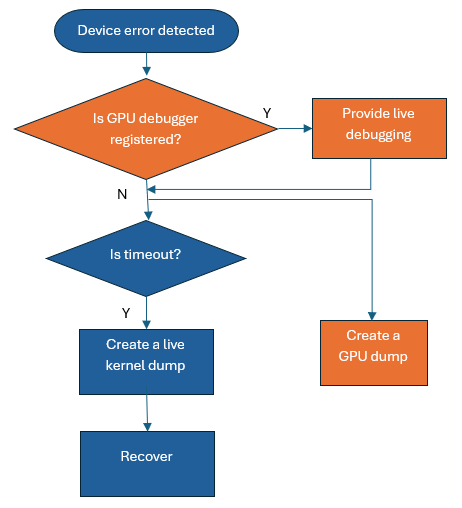
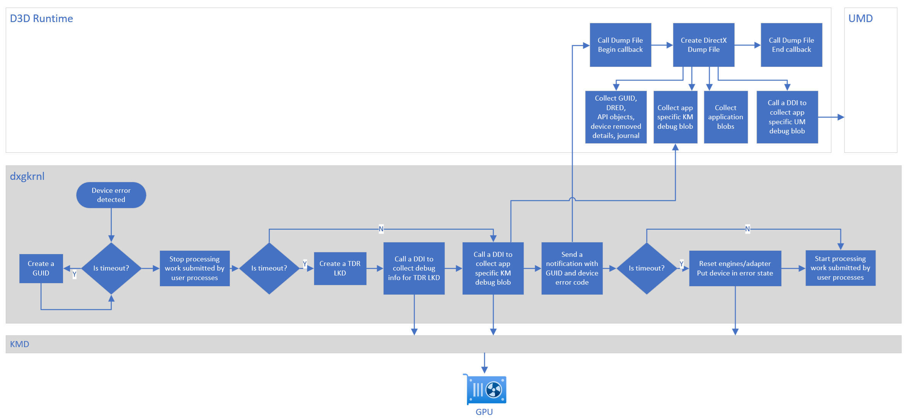
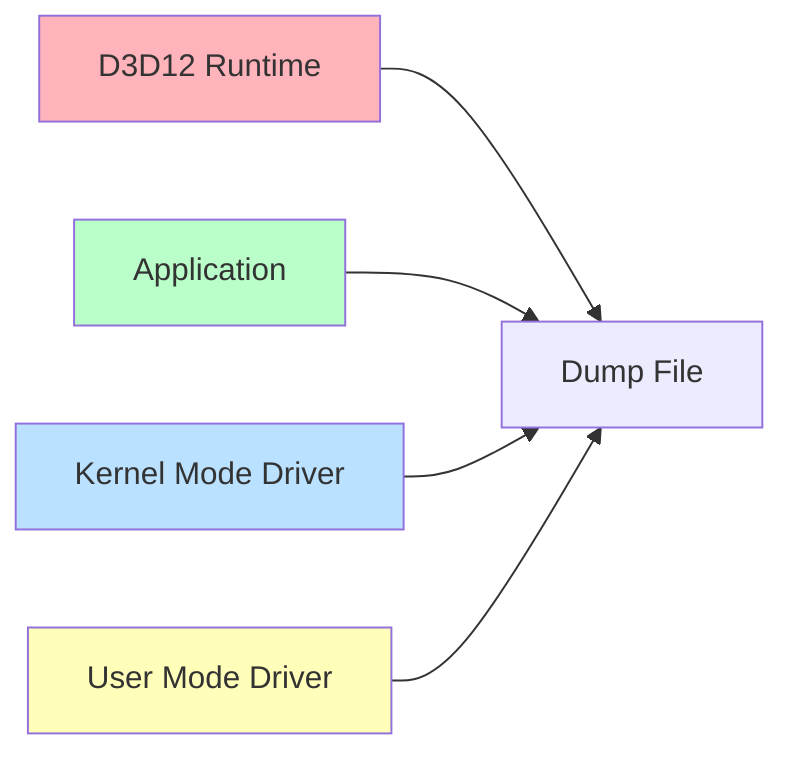

# D3D12: DirectX Dump Files <!-- omit in toc -->

v0.02 29 May 2026

# Contents <!-- omit in toc -->

- [Overview](#overview)
- [System Workflow](#system-workflow)
- [GPU Debug Manager](#gpu-debug-manager)
  - [Device Error](#device-error)
  - [DirectX Dump File Creation](#directx-dump-file-creation)
    - [Settings](#settings)
      - [Add the application to d3dconfig](#add-the-application-to-d3dconfig)
      - [Retain dump file](#retain-dump-file)
      - [Dump file driver options](#dump-file-driver-options)
    - [Callbacks](#callbacks)
    - [Dump file](#dump-file)
  - [Information from D3D12 runtime](#information-from-d3d12-runtime)
  - [Information from the application](#information-from-the-application)
  - [Information from the drivers](#information-from-the-drivers)
    - [GPU Debug Blobs](#gpu-debug-blobs)
  - [Naming and Location](#naming-and-location)
- [Device error code](#device-error-code)
- [Proposed API/DDI](#proposed-apiddi)
  - [API](#api)
    - [ID3D12DevicePreview](#id3d12devicepreview)
      - [D3D12\_DUMPFILEBEGINCALLBACK](#d3d12_dumpfilebegincallback)
      - [D3D12\_DUMPFILEENDCALLBACK](#d3d12_dumpfileendcallback)
      - [D3D12\_DUMP\_FILE\_DRIVER\_TIER](#d3d12_dump_file_driver_tier)
      - [D3D12\_DUMP\_FILE\_DRIVER\_OPTIONS](#d3d12_dump_file_driver_options)
      - [ConfigureDumpFile](#configuredumpfile)
      - [SetDumpFileCallbacks](#setdumpfilecallbacks)
      - [AddBlobToDumpFile](#addblobtodumpfile)
      - [RetainDumpFile](#retaindumpfile)
      - [GetDeviceErrorCode](#getdeviceerrorcode)
    - [D3D12\_FEATURE\_DUMP\_FILE](#d3d12_feature_dump_file)
  - [DDI](#ddi)
    - [D3D12DDI\_DUMP\_FILE\_FUNCS\_0121](#d3d12ddi_dump_file_funcs_0121)
      - [pfnSetDumpFileOptions](#pfnsetdumpfileoptions)
      - [pfnGetDebugBlobInfo](#pfngetdebugblobinfo)
      - [pfnGetDebugBlob](#pfngetdebugblob)
- [Test Plan](#test-plan)
  - [Test App](#test-app)
  - [Functional Tests](#functional-tests)
  - [Driver Conformance Tests](#driver-conformance-tests)
- [Spec History](#spec-history)


---

## Terms and Acronyms

| Term | Definition |
| -- | -- |
| TDR | Timeout Detection and Recovery, a feature in Windows that detects when the GPU is taking longer than expected to complete an operation. It then resets the GPU to prevent the entire system from becoming unresponsive. |
| dxgkrnl | GPU scheduler, a component of the DirectX graphics kernel subsystem in Windows, responsible for timeout detection and recovery (TDR) |
| LKD | Live kernel dump, a TDR LKD created by dxgkrnl on a TDR |
| DirectX Dump Files | Application specific dump files with the GPU state, created by DirectX that this spec describes |
| ISV | Independent Software Vendor, aka Xbox and PC game developer, or author of other applications using DirectX, aka "software developer" |
| IHV | Independent Hardware Vendor, aka "GPU manufacturer" or "hardware developer" |
| D3D12 runtime | D3D12Core.dll in Agility SDK or in Windows OS |
| Developer scenario | The one where a D3D12 application is running at a company developing it | 
| Retail scenario | The one where an end user is running a D3D12 application they did not develop |
| Overhead | Reduced frame rate or increased memory consumption due to extra mechanisms enabled for debugging purposes while the application is running |

# Overview

TDR live kernel dumps (LKDs) are created currently as part of the timeout detection and recovery (TDR) process. However, these dumps are not accessible for timeout investigations to game developers or authors of other applications (ISVs) utilizing DirectX. Since these dumps are created by dxgkrnl, a component of the DirectX graphics kernel subsystem, they may contain kernel memory and optionally user memory of all the processes, which cannot be shared with ISVs.

Additionally, there can be other graphics issues that may not cause a timeout but may result in a device error detected either by the graphics kernel or by the D3D12 runtime. These are referred to as software device removals. The ability to investigate using dumps is immensely helpful in these cases as well. 

This spec outlines new DirectX functionality to create application specific GPU dump files. The dump files are always generated on Windows OS versions that send a notification on device errors and do not need any setting to be turned on. These dump files are available to ISVs in both development and retail scenarios.

This work will be extended to support live debugging of shaders on device errors and other scenarios. It will be available to ISVs exclusively in the development scenario. Spec updates and implementation will be done after implementing support for application specific GPU dumps.

# System Workflow
This diagram illustrates the device error workflow at a high level. Blue boxes indicate existing functionality and orange boxes denote new functionality.



Here is an in-depth view and description of the device error workflow that explain how things flow between Windows OS, D3D Runtime and drivers to create the DirectX dump file. Additional information regarding live debugging will be provided once that feature work commences.


- dxgkrnl detects a timeout or other issues that result in a device error (existing functionality)
- if a timeout, dxgkrnl creates a GUID (new functionality)
- dxgkrnl stops processing the work submitted by user processes (existing functionality)
- if a timeout, dxgkrnl creates a live kernel dump (LKD) and writes the GUID (new functionality), global kernel mode GPU debug blob and other TDR segments (existing functionality)
- dxgkrnl calls a DDI to collect application specific kernel mode GPU debug blob (new functionality)
- dxgkrnl sends a notification to the D3D12 runtime with the GUID (if created) and device error code (new functionality)
- D3D12 runtime starts user mode device error processing (new functionality)
  - calls the Begin callback
  - creates a GPU dump and writes the GUID and relevant information from D3D12 runtime
  - gets the application specific kernel mode GPU debug blob and passes it to collect the user mode GPU debug blob 
  - writes both GPU debug blobs in the GPU dump
  - writes application blobs in the dump file
  - calls the End callback
- if a timeout, dxgkrnl resets engines/adapter and puts the device in error state (existing functionality)
- dxgkrnl reclaims the memory allocated for the application specific GPU debug blob if the D3D12 runtime call to retrieve the blob succeeds or after the application process exits (new functionality)
- dxgkrnl starts processing the work submitted by user processes (existing functionality)

The GPU dumps are uploaded to Watson and made available to ISVs through cloud services and IHVs through dev center. PIX is updated to open these GPU dumps for postmortem debugging. It uses the PIX plugin model to analyze information in the driver collected GPU debug blobs.

# GPU Debug Manager
This spec focuses on updates to the D3D12 runtime. We are adding a GPU Debug Manager to the Agility SDK that creates application specific GPU dumps which ISVs can use for postmortem debugging.

We are updating D3D12Core.dll to add the GPU Debug Manager and not creating a new DLL. This is to make diagnostic the first-class citizen and avoid having no dump when the application does not load a new DLL. This also avoids the compliance cost associated with adding a new DLL to Windows OS. We are hoping that GPU Debug Manager functionality won’t increase D3D12Core.dll size significantly. If it adds more than a few MBs then we will revisit this and check if it makes sense to put this functionality in a separate DLL.

## Device Error
D3D12 runtime receives a notification after
1. a timeout
2. dxgkrnl software device error 
3. D3D12 device error. 

Spec revisions and implementation for 2 and 3 will be done after implementing 1 above. 

The device error notification contains the GUID (if created) and the device error code.

## DirectX Dump File Creation
D3D12 runtime generates the GPU dump file on a device error. In other words, the GPU dump is always created in both developer and retail scenarios on Windows OS versions that send a notification on a device error.

### Settings
-	A setting to retain the dump file locally is added. It is ON by default for the preview release so that the dump is available immediately for postmortem debugging. But it will be turned OFF for the retail release so that the disk space on end user's machine won't be used. This setting is exposed through PIX and D3DConfig. It can also be updated programmatically by calling the [RetainDumpFile](#retaindumpfile) API.

- A set of new [options](#d3d12_dump_file_driver_options) is added to control the amount of data tracked and/or collected by the driver in the GPU dump. Some of these options may have performance overhead which means the application may run at a lower frame rate. Some of these options may additionally or alternatively have memory overhead which means the dump file size may increase significantly. This set is exposed through PIX and D3DConfig. It can also be updated programmatically by calling the [ConfigureDumpFile](#configuredumpfile) API.

#### Add the application to d3dconfig

D3DConfig settings only apply to applications in its app list. Register the application executable:

```cmd
d3dconfig.exe apps --add <exefilename>
```

> **Notes:**
> - A full path may also be used, but be aware that applications launched through hard links or other references may not match this path.
> - Settings are applied to all instances of the matching exe.

#### Retain dump file

```cmd
d3dconfig.exe device retain-dump-file=true
```

> **Note:** All matching d3dconfig apps use this setting. Use `d3dconfig.exe apps` to see the currently configured applications.

#### Dump file driver options

```cmd
d3dconfig.exe device dump-file-driver-options=1
```

> **Notes:** 
> - d3dconfig settings are only read at device creation. Exit and restart the application to ensure settings apply.
> - Multiple options can be set by calculating the value from the option enum values. 
> ```e.g. d3dconfig.exe device dump-file-driver-options=65 // D3D12_DUMP_FILE_DRIVER_OPTION_NO_OVERHEAD | D3D12_DUMP_FILE_DRIVER_OPTION_EVENT_MARKERS = 0x41 = 65```

### Callbacks
D3D12 runtime supports two callbacks in the application code.
-	It calls [D3D12_DUMPFILEBEGINCALLBACK](#d3d12_dumpfilebegincallback) callback at the start of dump creation
-	It calls [D3D12_DUMPFILEENDCALLBACK](#d3d12_dumpfileendcallback) callback at the end of dump creation

### Dump file
D3D12 runtime generates a dump file by incorporating information from four sources:



## Information from D3D12 runtime
1. GUID created by dxgkrnl: this helps correlate the live kernel dump (LKD) to the DirectX dump file, if required internally or by IHVs for deeper investigations.
2. Metadata such as D3D12 runtime version, a bit indicating if the dump should be in the Watson upload cab etc.
3. [Application identity](https://microsoft.github.io/DirectX-Specs/d3d/D3D12ApplicationIdentity.html)
4. Device and dump file configuration and capabilities
6. Adapter information
7. OS, CPU and system memory information
8. PIX markers aka user defined annotations
9. DRED information
10. D3D API objects
11. D3D12 journal entries: a journal entry consists of an error message, hr, and a partial call stack.

## Information from the application
Application blobs added by calling [AddBlobToDumpFile](#addblobtodumpfile)

## Information from the drivers
1. GPU debug blob containing kernel mode diagnostic information specific to the application
2. GPU debug blob containing user mode diagnostic information

### GPU Debug Blobs
Debug blobs are utilized to collect application-specific GPU diagnostic information from both the kernel mode and user mode. The kernel mode debug blob is collected using a new DDI pfnCollectProcessDebugBlob. The user mode debug blob is collected by the DDI [pfnGetDebugBlob](#pfngetdebugblob).

It is recommended that the kernel mode blob contains the following information. Some of this information may be included in the user mode blob instead if it is available in the user mode. The user mode debug blob may also include other IHV specific data. The IHV has full control over the format of these blobs, as Microsoft enforces no requirements and D3D12 runtime or dxgkrnl do not process their contents. PIX Plugin implemented by the IHV decodes these blobs during postmortem debugging.

1. Registers (from various categories e.g. debug, status, perf etc.) of various GPU blocks used by the application when a device error occurred. This information helps auto detect the cause of the device error at the GPU level during postmortem debugging in PIX. 
2. Registers that help identify last completed and first incomplete draws and dispatches of the application when a device error occurred. This information helps to know till what point the frame progressed before the device error. 
3. Shader registers of the [waves](https://learn.microsoft.com/en-us/windows/win32/direct3dhlsl/hlsl-shader-model-6-0-features-for-direct3d-12#terminology) that correspond to the application when a device error occurred. This also includes per wave and per lane registers. This information helps to know the instruction pointer location, execution mask, corrupt descriptors, if the shader was stuck or moving, hit a fatal error, threw an exception, and so on which in turn helps auto detect the cause of the device error. 
4. Shader memory of the waves that correspond to the application when a device error occurred. This information enables showing ISA of the application shaders. More importantly, this along with the information from #3 helps pinpoint the shader location causing the device error.
5. PSO key/shader identifier that helps map ISA to HLSL files. It also helps map ISA variables, lines and functions to corresponding HLSL information. 
6. Command buffers containing API calls including call parameters, user markers and optionally driver events. This information allows reconstructing frames and populating the event list during postmortem debugging in PIX. It is also very helpful in detecting errors in command buffers including command buffer corruption.
7. Fence writeback values from memory. This information helps detect fence synchronization issues that might cause a device error.

## Naming and Location

Key points about the dump file name, extension, and path:
- The DirectX dump file uses .dxdmp as the file extension. Note that it is .dxdmp_preview for the preview version indicating the file format may change between the preview releases and between the preview and the retail release.
- The file name format is NameOfExeWithoutExtension-yyyy-mm-dd-hh-mm-ss.dxdmp e.g. MyGame-2025-04-02-16-45-32.dxdmp
- Windows dump files with .dmp extension are generated at this location: C:\Users\UserName\AppData\Local\CrashDumps. DirectX dump files are generated at the same location.
- This file is also used by WER to include in the cab file that is uploaded to Watson.

The dump is available to the ISV locally when the [setting to retain](#retaindumpfile) it locally is turned on. This can be done in the developer scenario. The dump is also uploaded to Watson using a WER event and available to the ISV through cloud services. The dump can be opened in PIX for postmortem debugging in both the scenarios.


# Device error code
Currently, dxgkrnl detects an error and sets the device error code to one of the _VIDSCH_ERROR_CODE enum values. This gets translated at the user mode boundary to a D3DKMT device execution state (D3DKMT_DEVICEEXECUTION_STATE), which the D3D12 runtime then converts to one of the three DXGI error codes - DXGI_ERROR_DEVICE_REMOVED/HUNG/RESET. The details are lost in this process sometimes, misleading the ISVs. A new enum is added to dxgkrnl for device error codes and a corresponding new D3D12_DEVICE_ERROR_CODE enum is added to the D3D12 runtime. [GetDeviceErrorCode](#getdeviceerrorcode) API is provided to query the new device error code in the application.

---

# Proposed API/DDI

## API

### ID3D12DevicePreview

```c++
typedef UINT (*D3D12_DUMPFILEBEGINCALLBACK)(UINT64 flags);
typedef void (*D3D12_DUMPFILEENDCALLBACK)(const wchar_t* pDumpPath);

typedef enum D3D12_DUMP_FILE_DRIVER_TIER
{
    D3D12_DUMP_FILE_DRIVER_TIER_NOT_SUPPORTED,
    D3D12_DUMP_FILE_DRIVER_TIER_1,               // Supports only the MEDIUM_OVERHEAD and/or HIGH_OVERHEAD options
    D3D12_DUMP_FILE_DRIVER_TIER_2,               // Supports NO_OVERHEAD and one or more individual options like SHADER_REGISTERS or RESOURCES
} D3D12_DUMP_FILE_DRIVER_TIER;

typedef enum D3D12_DUMP_FILE_DRIVER_OPTIONS
{
    D3D12_DUMP_FILE_DRIVER_OPTION_NO_OVERHEAD        = 0x1,   // Track driver data with no overhead. This is the default.
    D3D12_DUMP_FILE_DRIVER_OPTION_MEDIUM_OVERHEAD    = 0x2,   // Track driver data with medium overhead. It is up to the driver exactly what data this includes.
    D3D12_DUMP_FILE_DRIVER_OPTION_HIGH_OVERHEAD      = 0x4,   // Track driver data with high overhead. It is up to the driver exactly what data this includes.
    D3D12_DUMP_FILE_DRIVER_OPTION_NO_DATA            = 0x8,   // Track and collect no data from the driver. All other options are ignored if this is specified.
    D3D12_DUMP_FILE_DRIVER_OPTION_SHADER_REGISTERS   = 0x10,  // Track shader general purpose registers
    D3D12_DUMP_FILE_DRIVER_OPTION_RESOURCES          = 0x20,  // Track resources as the application executes and collect existing and recently deleted resources in the dump
    D3D12_DUMP_FILE_DRIVER_OPTION_EVENT_MARKERS      = 0x40,  // Track application and driver event markers as the application executes
} D3D12_DUMP_FILE_DRIVER_OPTIONS;
DEFINE_ENUM_FLAG_OPERATORS( D3D12_DUMP_FILE_DRIVER_OPTIONS )

typedef enum D3D12_DEVICE_ERROR_CODE
{
    D3D12_DEVICE_ERROR_NONE         = 0,
    D3D12_DEVICE_ERROR_DEVICE_HUNG  = 7,
    D3D12_DEVICE_ERROR_PAGE_FAULT   = 9,
    D3D12_DEVICE_ERROR_UNKNOWN      = 0x88000000,
} D3D12_DEVICE_ERROR_CODE;

interface ID3D12DevicePreview : IUnknown
{
    HRESULT ConfigureDumpFile(
      [annotation("_In_")] D3D12_DUMP_FILE_DRIVER_OPTIONS driverOptions);

    void SetDumpFileCallbacks(
      [annotation("_In_")] D3D12_DUMPFILEBEGINCALLBACK pBeginCallback,
      [annotation("_In_")] D3D12_DUMPFILEENDCALLBACK pEndCallback);

    HRESULT AddBlobToDumpFile(
      [annotation("_In_")] void* pBlob,
      [annotation("_In_")] UINT sizeBytes,
      [annotation("_In_")] UINT64 metadata);

    void RetainDumpFile(
      [annotation("_In_")] BOOL retain);

    D3D12_DEVICE_ERROR_CODE GetDeviceErrorCode();
};
```

#### D3D12_DUMPFILEBEGINCALLBACK
`D3D12_DUMPFILEBEGINCALLBACK` is a pointer to the application side callback function. It is called by D3D12 runtime at the beginning of GPU dump creation. Return value of the callback determines if the dump should be created; 1 indicates that the GPU dump should be created and 0 indicates that the dump shouldn't be created. Note that this does not alter LKD creation by dxgkrnl. This callback can be used to add application side information to the dump. See [AddBlobToDumpFile](#addblobtodumpfile).

`flags` is currently unused but reserved for future use.

#### D3D12_DUMPFILEENDCALLBACK
`D3D12_DUMPFILEENDCALLBACK` is a pointer to the application side callback function. It is called by D3D12 runtime at the end of GPU dump creation. This callback can be used to copy the dump file to another location and other processing post GPU dump creation.

> **Note:** The dump file won't be accessible after this callback returns unless retaining the dump file is enabled by calling [RetainDumpFile](#retaindumpfile) API or by using PIX or D3DConfig. Therefore, make sure to copy the dump file before returning from the callback.

`pDumpPath` points to the path of the dump file created by D3D12 runtime.

#### D3D12_DUMP_FILE_DRIVER_TIER
Different tiers in `D3D12_DUMP_FILE_DRIVER_TIER` represent different GPU dump capabilities specific to the driver. The IHV has discretion to enable individual options within each tier, provided they remain within the tier's specified overhead limits. Note that this is different from other feature tiers in D3D12.

#### D3D12_DUMP_FILE_DRIVER_OPTIONS
`D3D12_DUMP_FILE_DRIVER_OPTION_NO_OVERHEAD` is an option that informs the driver to track data that has no overhead as the application executes and to collect it in the debug blob that is written in the dump file. D3D12 runtime sets this by default.

`D3D12_DUMP_FILE_DRIVER_OPTION_MEDIUM_OVERHEAD` is an option that informs the driver to track data that has medium overhead as the application executes and to collect it in the debug blob that is written in the dump file. This can be set if `D3D12_DUMP_FILE_DRIVER_TIER_1` is supported. The selection of individual options is determined by the IHV. Direct3D does not offer a mechanism to query these specific options, as a direct one-to-one correspondence between driver settings and D3D options may not exist. If multiple overhead options are specified then the higher overhead option takes effect. e.g. if `D3D12_DUMP_FILE_DRIVER_OPTION_NO_OVERHEAD` and `D3D12_DUMP_FILE_DRIVER_OPTION_MEDIUM_OVERHEAD` are specified then `D3D12_DUMP_FILE_DRIVER_OPTION_MEDIUM_OVERHEAD` is used.

`D3D12_DUMP_FILE_DRIVER_OPTION_HIGH_OVERHEAD` is an option that informs the driver to track data that has high overhead as the application executes and to collect it in the debug blob that is written in the dump file. This can be set if `D3D12_DUMP_FILE_DRIVER_TIER_1` is supported. The selection of individual options is determined by the IHV. Direct3D does not offer a mechanism to query these specific options, as a direct one-to-one correspondence between driver settings and D3D options may not exist. If multiple overhead options are specified then the higher overhead option takes effect. e.g. if `D3D12_DUMP_FILE_DRIVER_OPTION_MEDIUM_OVERHEAD` and `D3D12_DUMP_FILE_DRIVER_OPTION_HIGH_OVERHEAD` are specified then `D3D12_DUMP_FILE_DRIVER_OPTION_HIGH_OVERHEAD` is used.

`D3D12_DUMP_FILE_DRIVER_OPTION_NO_DATA` is an option that informs the driver to track and collect no data. All other options are ignored in this case. The dump file contains data only from D3D12 runtime and application, if any.

`D3D12_DUMP_FILE_DRIVER_OPTION_SHADER_REGISTERS` is an option that informs the driver to collect shader general purpose registers in the debug blob that is written in the dump file. These registers are used to store variable values while the shaders are executing. This may need significant amount of memory depending on the number of shader waves present at the dump creation time.

`D3D12_DUMP_FILE_DRIVER_OPTION_RESOURCES` is an option that informs the driver to track resources as the application executes and to collect existing and recently deleted resources in the debug blob that is written in the dump file. This may have significant performance overhead while the application is executing and may increase the dump file size significantly. It is advisable to set this flag only during the development scenario.

`D3D12_DUMP_FILE_DRIVER_OPTION_EVENT_MARKERS` is an option that informs the driver to track application and driver markers and to collect them in the debug blob that is written in the dump file. This may have significant performance overhead while the application is executing.

#### ConfigureDumpFile
`ConfigureDumpFile()` is used to configure the amount of data tracked and/or collected in the GPU dump. Some of these options may have performance overhead which means the application may run at a lower frame rate. Some of these options may additionally or alternatively have memory overhead which means the dump file size may increase significantly. Currently, this API has options to control the data in the driver but in the future, it may be extended to control the data in D3D12 runtime.

#### SetDumpFileCallbacks
`SetDumpFileCallbacks()` is used to set application code callbacks to be invoked at the time of a device error.

#### AddBlobToDumpFile
`AddBlobToDumpFile()` is used to add a memory blob and metadata to the GPU dump. This API should be called only from [D3D12_DUMPFILEBEGINCALLBACK](#d3d12_dumpfilebegincallback) at the time of a device error. It can be called multiple times to add multiple blobs to the dump. Passing unique metadata for each blob helps identifying them easily during postmortem debugging. Applications can reclaim the blob memory after calling this API. A limit of 2 MB is enforced on the total sizes of blobs plus metadata.

`pBlob` is the virtual address of the blob.

`sizeBytes` is the size of the blob in bytes.

`metaData` is the application defined metadata to associate with the blob.

#### RetainDumpFile
`RetainDumpFile()` is used to persist the dump file locally after the device error processing is complete. Retaining dumps locally is ON by default for the preview release so that they are available immediately for postmortem debugging. But it will be turned OFF for the retail release so that the disk space on end user's machine won't be used. This setting persists until it is turned off, the device is recreated or the application is closed. It is also exposed through PIX and D3DConfig.

> **Note:** Regardless of the retain dump file setting, the dump file remains accessible in the D3D12_DUMPFILEENDCALLBACK callback until the callback returns.

#### GetDeviceErrorCode
`GetDeviceErrorCode()` is used to query the code that provides more details about the device error.

### D3D12_FEATURE_DUMP_FILE

`D3D12_FEATURE_DUMP_FILE` is added to define a cap for the feature that creates a GPU dump.

```c++
typedef struct D3D12_FEATURE_DATA_DUMP_FILE
{
    [annotation("_Out_")] BOOL SupportedByOS;              // The feature is supported by the OS i.e. a GPU dump is created on the OS that sends a notification on device errors including timeouts
    [annotation("_Out_")] D3D12_DUMP_FILE_TIER DumpFileDriverTier;
    [annotation("_Out_")] UINT DumpFileDriverOptionsMask;  // Bits corresponding to the driver supported options in D3D12_DUMP_FILE_DRIVER_OPTIONS are set
} D3D12_FEATURE_DATA_DUMP_FILE;

typedef enum D3D12_FEATURE
{
    D3D12_FEATURE_D3D12_OPTIONS =  0,
    D3D12_FEATURE_ARCHITECTURE  =  1, // Deprecated by D3D12_FEATURE_ARCHITECTURE1
    ...
    D3D12_FEATURE_DUMP_FILE      = 71,
```

## DDI

### D3D12DDI_DUMP_FILE_FUNCS_0121
```c++
typedef struct D3D12DDI_DUMP_FILE_FUNCS_0121
{
    PFND3D12DDI_SET_DUMP_FILE_OPTIONS_0121 pfnSetDumpFileOptions;
    PFND3D12DDI_GET_DEBUG_BLOB_INFO_0121  pfnGetDebugBlobInfo;
    PFND3D12DDI_GET_DEBUG_BLOB_0121       pfnGetDebugBlob;
} D3D12DDI_DUMP_FILE_FUNCS_0121;
```
DDI rev 121 adds `pfnSetDumpFileOptions`, `pfnGetDebugBlobInfo` and `pfnGetDebugBlob` that D3D12 runtime can call to configure the driver for GPU dumps, get the GPU debug blob size and get the GPU debug blob, respectively. This blob contains user mode GPU diagnostic information.

#### pfnSetDumpFileOptions
```c++
typedef enum D3D12DDI_DUMP_FILE_TIER_0121
{
    D3D12DDI_DUMP_FILE_TIER_NOT_SUPPORTED,
    D3D12DDI_DUMP_FILE_TIER_1,               // Supports only the MEDIUM_OVERHEAD and/or HIGH_OVERHEAD options
    D3D12DDI_DUMP_FILE_TIER_2,               // Supports NO_OVERHEAD and one or more individual options like SHADER_REGISTERS or RESOURCES
} D3D12DDI_DUMP_FILE_TIER_0121;

typedef enum D3D12DDI_DUMP_FILE_OPTIONS_0121
{
    D3D12DDI_DUMP_FILE_OPTION_NO_OVERHEAD        = 0x1,   // Collect data with no tracking overhead
    D3D12DDI_DUMP_FILE_OPTION_MEDIUM_OVERHEAD    = 0x2,   // Collect data with medium tracking overhead, it is up to the IHV exactly what data this includes
    D3D12DDI_DUMP_FILE_OPTION_HIGH_OVERHEAD      = 0x4,   // Collect data with high tracking overhead, it is up to the IHV exactly what data this includes
    D3D12DDI_DUMP_FILE_OPTION_NO_DATA            = 0x8,   // Collect nothing in the driver, useful to stop tracking if only TIER_1 is supported
    D3D12DDI_DUMP_FILE_OPTION_SHADER_REGISTERS   = 0x10,  // Collect shader general purpose registers
    D3D12DDI_DUMP_FILE_OPTION_RESOURCES          = 0x20,  // Track resources as the application executes and collect existing and recently deleted resources during blob creation
    D3D12DDI_DUMP_FILE_OPTION_EVENT_MARKERS      = 0x40,  // Track application and driver event markers as the application executes
} D3D12DDI_DUMP_FILE_OPTIONS_0121;
DEFINE_ENUM_FLAG_OPERATORS( D3D12DDI_DUMP_FILE_OPTIONS_0121 )

typedef HRESULT ( APIENTRY* PFND3D12DDI_SET_DUMP_FILE_OPTIONS_0121 )(
    _In_ D3D12DDI_HDEVICE hDrvDevice,
    _In_ D3D12DDI_DUMP_FILE_OPTIONS_0121 options);
```

Different tiers in `D3D12DDI_DUMP_FILE_TIER_0121` represent different GPU dump options specific to the driver. The IHV has discretion to enable individual options within each tier, provided they remain within the tier's specified overhead limits. Note that this is different from other feature tiers in D3D12.

`D3D12DDI_DUMP_FILE_OPTION_NO_OVERHEAD` is an option that informs the driver to track data that has no overhead as the application executes and to collect it in the debug blob. This is typically the data present on the GPU used to execute the current frame and should have negligible performance overhead. This is the default option that is passed to the driver by D3D12 runtime after device creation.

`D3D12DDI_DUMP_FILE_OPTION_MEDIUM_OVERHEAD` is an option that informs the driver to track data that has medium overhead as the application executes and to collect it in the debug blob. This can be set if `D3D12DDI_DUMP_FILE_TIER_1` is supported. The selection of individual options is determined by the IHV. Direct3D does not offer a mechanism to query these specific options, as a direct one-to-one correspondence between the DDI options and D3D options may not exist. If multiple overhead options are specified then the higher overhead option takes effect. e.g. if `D3D12DDI_DUMP_FILE_OPTION_NO_OVERHEAD` and `D3D12DDI_DUMP_FILE_OPTION_MEDIUM_OVERHEAD` are specified then `D3D12DDI_DUMP_FILE_OPTION_MEDIUM_OVERHEAD` is used.

`D3D12DDI_DUMP_FILE_OPTION_HIGH_OVERHEAD` is an option that informs the driver to track data that has high overhead as the application executes and to collect it in the debug blob. This can be set if `D3D12DDI_DUMP_FILE_TIER_1` is supported. The selection of individual options is determined by the IHV. Direct3D does not offer a mechanism to query these specific options, as a direct one-to-one correspondence between the DDI options and D3D options may not exist. If multiple overhead options are specified then the higher overhead option takes effect. e.g. if `D3D12DDI_DUMP_FILE_OPTION_MEDIUM_OVERHEAD` and `D3D12DDI_DUMP_FILE_OPTION_HIGH_OVERHEAD` are specified then `D3D12DDI_DUMP_FILE_OPTION_HIGH_OVERHEAD` is used.

`D3D12DDI_DUMP_FILE_OPTION_NO_DATA` is an option that informs the driver to track and collect no data in the user mode and kernel mode drivers. All other options are ignored in this case. It is useful to stop tracking if only `D3D12DDI_DUMP_FILE_TIER_1` is supported.

`D3D12DDI_DUMP_FILE_OPTION_SHADER_REGISTERS` is an option that informs the driver to collect shader general purpose registers in the debug blob. These registers are used to store variable values while the shaders are executing. 

`D3D12DDI_DUMP_FILE_OPTION_RESOURCES` is an option that informs the driver to track resources as the application executes and to collect existing and recently deleted resources in the debug blob.

`D3D12DDI_DUMP_FILE_OPTION_EVENT_MARKERS` is an option that informs the driver to track application and driver markers as the application executes and to collect them in the debug blob.


`pfnSetDumpFileOptions` is used to configure the driver to control the data tracked and/or collected in the debug blobs for GPU dumps. It is called after Direct3D12 device creation. It is also called from `ID3D12DevicePreview::ConfigureDumpFile` API. The driver ignores the options that it does not recognize or support. Some of these options may have performance overhead which means the application may run at a lower frame rate. It is the IHV's responsibility to not turn them on for the NO_OVERHEAD option. Some of these options may additionally or alternatively have memory overhead which means the debug blob size may increase significantly.

```c++
typedef struct D3D12DDI_FEATURE_DATA_DUMP_FILE_0121
{
    _Out_ D3D12DDI_DUMP_FILE_TIER_0121 DumpFileTier;
    _Out_ UINT DumpFileOptionsMask; // Set bits corresponding to the supported options in D3D12DDI_DUMP_FILE_OPTIONS_0121
} D3D12DDI_FEATURE_DATA_DUMP_FILE_0121;
```

`D3D12DDI_FEATURE_DATA_DUMP_FILE_0121` is populated by querying driver capabilities with `D3D12DDI_CAPS_TYPE_DUMP_FILE` to give the GPU dump tier and options supported by the driver. `D3D12DDI_FEATURE_0121_DUMP_FILE` is added to define a cap for the driver feature that supports GPU dumps.

#### pfnGetDebugBlobInfo
```c++
#define D3D12DDI_MINI_DEBUG_BLOB_MAX_SIZE_0121 (256 * 1024 * 1024)

typedef enum D3D12DDI_DEBUG_BLOB_TYPE_0121
{
    D3D12DDI_DEBUG_BLOB_MINI  = 1,
    D3D12DDI_DEBUG_BLOB_FULL  = 2,
} D3D12DDI_DEBUG_BLOB_TYPE_0121;

typedef struct D3D12DDI_DEBUG_BLOB_DETAILS_0121
{
    D3D12DDI_DEBUG_BLOB_TYPE_0121 DebugBlobType;
    SIZE_T DebugBlobSize;
} D3D12DDI_DEBUG_BLOB_DETAILS_0121;

typedef struct D3D12DDI_DEBUG_BLOB_INFO_0121
{
    ULONG NumDebugBlobDetails;                           // in: Number of entries in ProcessDebugBlobDetails
    D3D12DDI_DEBUG_BLOB_DETAILS_0121* pDebugBlobDetails; // in/out: An array that describe debug blob details for different types of debug blobs
} D3D12DDI_DEBUG_BLOB_INFO_0121;

typedef HRESULT ( APIENTRY* PFND3D12DDI_GET_DEBUG_BLOB_INFO_0121 )(
    _In_ D3D12DDI_HDEVICE hDrvDevice,
    _In_reads_bytes_(KMDebugBlobSize) const void *pKMDebugBlob,
    _In_ SIZE_T KMDebugBlobSize,
    _Inout_ D3D12DDI_DEBUG_BLOB_INFO_0121* pArgs);
```

This DDI is used to collect estimated blob sizes of different types of debug blobs for the given device. The returned blob size is used by D3D12 runtime in a subsequent DDI call `pfnGetDebugBlob` to collect blob data. D3D12 runtime calls this DDI with `NumDebugBlobDetails` equal to the number of `D3D12DDI_DEBUG_BLOB_DETAILS` entries in `DebugBlobDetails`. Each `D3D12DDI_DEBUG_BLOB_DETAILS` entry contains a blob type defined in `D3D12DDI_DEBUG_BLOB_TYPE`, along with a maximum size for that type. D3D12 runtime fills `DebugBlobSize` before calling the DDI to indicate the maximum size. 0 indicates there is not maximum blob size.

In response to this DDI call, the driver updates `DebugBlobSize` to its upper limit size estimate for the associated blob type. If it does not support a blob type, it updates `DebugBlobSize` to 0 for that blob type. This DDI is designed so new `D3D12DDI_DEBUG_BLOB_TYPE` values can be added in the future to support different types of blobs. The driver handles these cases carefully, where unrecognized blob types are treated as unsupported and `DebugBlobSize` is set to 0. 

If the driver was initialized with `D3D12DDI_DUMP_FILE_OPTION_NO_DATA`, D3D12 runtime does not call this DDI and the subsequent `pfnGetDebugBlob` DDI to get the blob data at the time of the crash.

#### pfnGetDebugBlob
```c++
typedef struct D3D12DDI_DEBUG_BLOB_0121
{
    D3D12DDI_DEBUG_BLOB_TYPE_0121 DebugBlobType; // in: The type of debug blob to collect
    SIZE_T DebugBlobSize;                        // in/out: The size in bytes of pDebugBlob
    PVOID pDebugBlob;                            // out: Pointer to the buffer that contains the debug blob
} D3D12DDI_DEBUG_BLOB_0121;

typedef HRESULT ( APIENTRY* PFND3D12DDI_GET_DEBUG_BLOB_0121 )(
    _In_ D3D12DDI_HDEVICE hDrvDevice,
    _In_reads_bytes_(KMDebugBlobSize) const void *pKMDebugBlob,
    _In_ SIZE_T KMDebugBlobSize,
    _Inout_ D3D12DDI_DEBUG_BLOB_0121* pArgs);
```

This DDI is used to collect application specific debug blob of the specified type. This DDI may be called multiple times e.g. if collection of full debug blob fails for some reason then D3D12 runtime calls this DDI again to get the mini debug blob. If memory allocation for the full dump fails for some reason then D3D12 runtime calls this DDI to collect only the mini dump without having to query the size. 

D3D12 runtime fills `DebugBlobSize` to the size returned by the prior DDI `pfnGetDebugBlobInfo`. The driver updates `DebugBlobSize` with the actual size used by `pDebugBlob`. This way the driver gives estimated sizes in `pfnGetDebugBlobInfo` and the actual size in `pfnGetDebugBlob`. The actual size is always less than or equal to the `DebugBlobSize` filled by D3D12 runtime.

Kernel mode blob pointer and size are passed to the DDI to extract information required to populate the user mode blob. Both these blobs are opaque to Microsoft components such as dxgkrnl and D3D12 runtime. Their layouts are specific to the IHV driver. The IHV implemented PIX Plugin decodes these blobs and correlates them with other dump information during postmortem debugging.

# Test Plan
## Test App
A test application causing a device error is authored.
- It has different device error cases 
  - cases with shader issues
    - infinite loop
    - descriptor corruption
    - large direct workload
    - large indirect workload
  - page faults
  - root signature mismatch
  - PSO corruption
  - fence deadlock
  - ray tracing cases
  - work graph cases
  - hardware specific cases (hopefully not very many)
- It allows normal rendering (and taking a GPU capture) till a device error is triggered
- It has an ability to trigger a device error on the specified frame
- It has an ability to set callbacks with command line args
- It has an ability to add an application side blob with a command line argument

## Functional Tests
Functional tests are written using the TAEF framework.

The important behaviors to test are:

- Device error
  - Verify that `GetDeviceErrorCode` API gives the correct error code.
- Dump File feature support
  - Verify that `CheckFeatureSupport(D3D12_FEATURE_DUMP_FILE)` succeeds. 
  - Verify that `ConfigureDumpFile` API call succeeds regardless of feature support.
  - Verify that `SetDumpFileCallbacks` API call succeeds regardless of the feature support.
- Driver tiers
  - Verify that driver options are reported according to the tiers (For Tier 2: NO_OVERHEAD flag is present; For Tier 1: `HIGH_OVERHEAD/MEDIUM_OVERHEAD` is present; For Not Supported: options mask is 0.)
- Dump generation
  - Verify that a dump file is generated on a timeout regardless of the presence of callbacks.
  - Verify that a dump file is generated when the begin callback returns 1 and not generated when it returns 0.
  - Verify that a dump file is not generated if the feature is not supported by the OS.
  - Verify that the dump file is retained locally with `RetainDumpFile(TRUE)`
  - Verify that the dump file path passed to the End callback points to the correct dump file.
- Callbacks
  - Verify that Begin and End callbacks are invoked correctly.
  - Verify that multiple blobs can be added with `AddBlobToDumpFile` API calls during the Begin callback

Tests that require the dump file parser are added to the PIX repo.

## Driver Conformance Tests
Driver conformance tests are written using the TAEF framework and verify behavior of the driver that supports the feature.

- CheckTierAndOptions
  - Tier 2 reports `NO_OVERHEAD` and at least one individual option
  - Tier 1 reports at least one of `MEDIUM_OVERHEAD` or `HIGH_OVERHEAD` options
  - All drivers supporting the feature report `NO_DATA` option
- CheckConfigureOptions
  - `ConfigureDumpFile(NO_OVERHEAD)` and `ConfigureDumpFile(NO_DATA)` succeed
  - `ConfigureDumpFile(0xFF)` succeeds indicating the driver silently ignores unsupported bits.
- CheckDebugBlobPresent
  - Verifies that the driver returns debug data by ensuring that the dump file size is larger than the file size with `NO_DATA` option.

Driver conformance tests to verify the information in kernel mode and user mode debug blobs require PIX plugin and so will be added to the PIX repo.

---

# Spec History

|Version|Date|Details|Author|
|-|-|-|-|
|v0.01|12 Mar 2026|Initial draft spec|Deepali Bhagvat (PIX)|
|v0.02|29 May 2026|Promoted APIs from ID3D12DeviceExperimental to ID3D12DevicePreview|Deepali Bhagvat (PIX)|