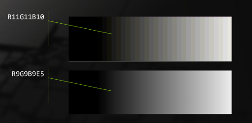

<h1>D3D12 Revised Support For R9G9B9E5 Format</h1>

Version 1.0

---

# Contents

- [Contents](#contents)
- [Document Terms](#document-terms)
- [Intro](#intro)
- [Motivation](#motivation)
- [Goals](#goals)
  - [Group 1: RTV/UAV use](#group-1-rtvuav-use)
  - [Group 2: Display (Scanout)](#group-2-display-scanout)
- [Detailed Design](#detailed-design)
  - [Usage](#usage)
  - [Applications Checking for Support](#applications-checking-for-support)
    - [RTV/UAV Group](#rtvuav-group)
    - [Display Group](#display-group)
  - [Conversions To Float And Back](#conversions-to-float-and-back)
  - [Interaction with RenderTargetWriteMask](#interaction-with-rendertargetwritemask)
  - [Runtime Changes](#runtime-changes)
    - [Format Requirements Table](#format-requirements-table)
    - [Display Scanout Changes](#display-scanout-changes)
      - [DXGI Swap Chain](#dxgi-swap-chain)
        - [DXGI API Update](#dxgi-api-update)
      - [DWM Changes](#dwm-changes)
      - [Composite Swap Chain](#composite-swap-chain)
      - [Display/DxgKrnl Changes](#displaydxgkrnl-changes)
    - [WARP Support](#warp-support)
    - [Checking Against Older Drivers](#checking-against-older-drivers)
  - [DDI Changes](#ddi-changes)
    - [CheckFormatSupport](#checkformatsupport)
      - [New D3D112 DDI](#new-d3d112-ddi)
      - [New D3D11 DDI](#new-d3d11-ddi)
      - [Reporting Support: Two Groups of Support](#reporting-support-two-groups-of-support)
    - [Display Scan Out](#display-scan-out)
    - [d3dukmdt.h](#d3dukmdth)
  - [Validation](#validation)
    - [Debug Layer](#debug-layer)
- [Tests](#tests)
  - [HLK Conformance Tests](#hlk-conformance-tests)
    - [Conformance tests for RTV and UAV](#conformance-tests-for-rtv-and-uav)
    - [Conformance tests for Display](#conformance-tests-for-display)
  - [Functional Tests](#functional-tests)
- [Changelog](#changelog)

# Document Terms

| **Term** | **Definition**                     
|------|-----------------------         
| RTV  | Render Target View             
| UAV  | Unordered Access View          
| SRV  | Shader Resource View           
| 999E5| DXGI_FORMAT_R9G9B9E5_SHAREDEXP

# Intro
This document describes what is needed to revise the existing support for `DXGI_FORMAT_R9G9B9E5_SHAREDEXP`. This format existed previously in D3D11 and D3D12, but in a reduced capacity. The aim is to bring in optional support for this format so that it can be used as a render target and as a unordered access view.

The details of the format as it existed in Direct3D 11 can be found [here](https://microsoft.github.io/DirectX-Specs/d3d/archive/D3D11_3_FunctionalSpec.htm#19.3.2%20RGBE%20Floating%20Point%20Format:%20DXGI_FORMAT_R9G9B9E5_SHAREDEXP). This document aims to build on top of that spec and bring first-class support for `DXGI_FORMAT_R9G9B9E5_SHAREDEXP` as an RTV and UAV.

# Motivation
High Dynamic Range (HDR) technology has revolutionized the visual quality of digital content, providing a wider range of colors and luminance levels. Direct3D 12 plans to support developers by exposing more of `DXGI_FORMAT_R9G9B9E5_SHAREDEXP`, which gives a much better color definition in almost every color space. 999E5 promises a lot of utility as a float format that is half the size of `R16G16B16A16_FLOAT`, while being almost on par with `R16G16B16A16_FLOAT` on image quality except in the most contrived scenarios. The image below is an exaggerated banding comparison between R11G11B10 vs 999E5 \[0..200\]. 



This format was previously only available in Direct3D as a shader resource. To use the format previously, applications would alias with a 32-bit type format, create a resource that is `DXGI_FORMAT_R9G9B9E5_SHAREDEXP` format, and [copy](https://learn.microsoft.com/en-us/windows/win32/api/d3d12/nf-d3d12-id3d12graphicscommandlist-copyresource#reinterpret-copy) into said resource. More recently, [relaxed casting options](https://microsoft.github.io/DirectX-Specs/d3d/RelaxedCasting.html) allowed developers greater flexbility to write into the `DXGI_FORMAT_R9G9B9E5_SHAREDEXP` format. With this optional feature (depending on driver support), applications will be able to write and use `DXGI_FORMAT_R9G9B9E5_SHAREDEXP` directly without the casts. This means relying on hardware format conversions between the format memory and the float data in the shader. Applications can also rely on hardware supporting output merger blending.

# Goals
The revision for 999E5 comes in two major groups. 
- RTV/UAV 
- Display

Drivers that report support for display also has support for RTV/UAV.

## Group 1: RTV/UAV use
Applications can use `DXGI_FORMAT_R9G9B9E5_SHAREDEXP` consistently through the resource creation, view creation, and pipeline creation process. This would be consistent with how applications use `DXGI_FORMAT_R32G32B32A32_UINT`, or any other format that doesn't require casting to use. The following support would be added to `DXGI_FORMAT_R9G9B9E5_SHAREDEXP`.

As a resource:
  - Multisampling
    - Load
    - Resolve

As a RTV:
  - Writing to resource as a RT
  - Clearing
  - Blending
  
As a UAV:
  - Typed UAV store
  - Typed UAV load
  - UAV Clear

## Group 2: Display (Scanout)
Applications can create resources of format 999E5 on the swapchain and display them, depending on driver support. The swapchain supports presentation via composition, DirectFlip, DirectFlip with MPO, and Independant Flip. Drivers that report group 2 support should have group 1 support.

Microsoft Display Capture Toolkit will also add support for presenting MPO planes in this format.

This format works on cross-adapter presentation as well, [CASO and non-CASO](https://learn.microsoft.com/en-us/windows-hardware/drivers/display/supporting-caso).

# Detailed Design
## Usage
Application are able to create resources with this format and create RTVs and UAVs of this format, contingent on hardware support. This change will come for **both** D3D11 and D3D12. Applications can create resources of this format on the swap chain and present them.

## Applications Checking for Support
### RTV/UAV Group
Applications should check whether their devices can support this format as an RT/UAV, as this is an optional support. Applications can use [CheckFeatureSupport](https://learn.microsoft.com/en-us/windows/win32/api/d3d12/nf-d3d12-id3d12device-checkfeaturesupport) with `D3D12_FEATURE_FORMAT_SUPPORT` to check the support for a format.

Relevant bits (from [here](https://learn.microsoft.com/en-us/windows/win32/api/d3d12/ne-d3d12-d3d12_format_support1)): 

| **D3D11**                                        | **D3D12**                                         |
|--------------------------------------------------|---------------------------------------------------|
| D3D11_FORMAT_SUPPORT_RENDER_TARGET               | D3D12_FORMAT_SUPPORT1_RENDER_TARGET               |
| D3D11_FORMAT_SUPPORT_MULTISAMPLE_RENDERTARGET    | D3D12_FORMAT_SUPPORT1_MULTISAMPLE_RENDERTARGET    |
| D3D11_FORMAT_SUPPORT_MULTISAMPLE_RESOLVE         | D3D12_FORMAT_SUPPORT1_MULTISAMPLE_RESOLVE         |
| D3D11_FORMAT_SUPPORT_MULTISAMPLE_LOAD            | D3D12_FORMAT_SUPPORT1_MULTISAMPLE_LOAD            |
| D3D11_FORMAT_SUPPORT_TYPED_UNORDERED_ACCESS_VIEW | D3D12_FORMAT_SUPPORT1_TYPED_UNORDERED_ACCESS_VIEW |
| D3D11_FORMAT_SUPPORT_BLENDABLE                   | D3D12_FORMAT_SUPPORT1_BLENDABLE                   |
| D3D11_FORMAT_SUPPORT2_UAV_TYPED_LOAD             | D3D12_FORMAT_SUPPORT2_UAV_TYPED_LOAD              |
| D3D11_FORMAT_SUPPORT2_UAV_TYPED_STORE            | D3D12_FORMAT_SUPPORT2_UAV_TYPED_STORE             |


As each support group is **all-or-nothing**, applications need only check one of these bits to assume if all the above bits are set. Older versions of D3D12 will not report support for this feature, while newer versions will query the driver.

Example:
``` 
    D3D12_FEATURE_DATA_FORMAT_SUPPORT formatSupport{};
    formatSupport.Format = DXGI_FORMAT_R9G9B9E5_SHAREDEXP;
    m_device->CheckFeatureSupport(D3D12_FEATURE_FORMAT_SUPPORT, &formatSupport, sizeof(D3D12_FEATURE_DATA_FORMAT_SUPPORT));
    if (formatSupport.Support1 & D3D12_FORMAT_SUPPORT1_RENDER_TARGET)
    {
        // Since it is all-or-nothing, supporting render target means support updated 999E5 revision
        printf("Format supports rtv and uav\n");
    }
```

Note: Applications still need to check for multisamping level support via `ID3D12Device::CheckFeatureSupport` with `CheckMultisampleQualityLevels`.

### Display Group
Applications should check whether their hardware can support displaying 999E5 via the same function [CheckFeatureSupport](https://learn.microsoft.com/en-us/windows/win32/api/d3d12/nf-d3d12-id3d12device-checkfeaturesupport) with `D3D12_FEATURE_FORMAT_SUPPORT`.

In this case, the application should check against `D3D12_FORMAT_SUPPORT1_DISPLAY`.

Example:
``` 
    D3D12_FEATURE_DATA_FORMAT_SUPPORT formatSupport{};
    formatSupport.Format = DXGI_FORMAT_R9G9B9E5_SHAREDEXP;
    m_device->CheckFeatureSupport(D3D12_FEATURE_FORMAT_SUPPORT, &formatSupport, sizeof(D3D12_FEATURE_DATA_FORMAT_SUPPORT));
    if (formatSupport.Support1 & D3D12_FORMAT_SUPPORT1_DISPLAY)
    {
        // Format can display!
        printf("Format supports present\n");
    }

    // ... Eventually create a DXGI swap chain with this format...
```
| **D3D11**                                        | **D3D12**                                         |
|--------------------------------------------------|---------------------------------------------------|
| D3D11_FORMAT_SUPPORT2_MULTIPLANE_OVERLAY         | D3D12_FORMAT_SUPPORT2_MULTIPLANE_OVERLAY          |
| D3D11_FORMAT_SUPPORT2_DISPLAYABLE                |                                                   |
| D3D11_FORMAT_SUPPORT_DISPLAY                     | D3D12_FORMAT_SUPPORT1_DISPLAY                     |

Note: Using this format on the swap chain requires an up-to-date version of Windows. Applications may still fail swap chain creation with the Agility SDK if the Windows version is not high enough.

A new color space, `DXGI_COLOR_SPACE_RGB_FULL_G10_NONE_P2020`, will be added to accomodate R9G9B9E5_SHAREDEXP as a color format. Currently only R9G9B9E5 will work with `DXGI_COLOR_SPACE_RGB_FULL_G10_NONE_P2020`.

## Conversions To Float And Back
The rules of conversion to float and back for this format will stay the same. These rules are descibed [in the D3D11.3 spec](https://microsoft.github.io/DirectX-Specs/d3d/archive/D3D11_3_FunctionalSpec.htm#19.3.2%20RGBE%20Floating%20Point%20Format:%20DXGI_FORMAT_R9G9B9E5_SHAREDEXP).

There is an implementation in hlsl in the [DirectX Graphics Sample's mini engine](https://github.com/microsoft/DirectX-Graphics-Samples/blob/master/MiniEngine/Core/Shaders/PixelPacking_RGBE.hlsli) that can be used as a reference.

## Interaction with RenderTargetWriteMask
Whenever a 999E5 render target is used, the accompanying `D3D12_RENDER_TARGET_BLEND_DESC::RenderTargetWriteMask` must be set to `D3D12_COLOR_WRITE_ENABLE_ALL`. Partial updates to some component is not supported. While 999E5 does not support alpha writing, setting `COLOR_WRITE_ENABLE_ALPHA` is required for the exponent component to be written.

## Runtime Changes
### Format Requirements Table
The existing format requirement table for hardware feature level 12.1 and above would need to modified to support these changes. In particular, format `DXGI_FORMAT_R9G9B9E5_SHAREDEXP` will now have optional support for 
  - Render Target
  - Blendable Render Target
  - Multisample Render Target
  - Multisample Load
  - Multisample Resolve
  - Typed Unordered Access View
  - Display Scan out

Previously the runtime would report these supports as not available. By changing these to optional, the runtime will query the driver on the supported features of the format. 

### Display Scanout Changes

This section describes the tech stack on Microsoft's side that may be changed to accomodate display. The general flow of a display buffer in user mode is

\[Applicatiion\] -> \[DXGI\] -> \[DWM\] -> \[DDisplay\] -> \[Driver\] 

With certain optimizations available in DWM to blit/bypass itself.

#### DXGI Swap Chain
The [DXGI swap chain](https://learn.microsoft.com/en-us/windows/win32/direct3ddxgi/d3d10-graphics-programming-guide-dxgi#create-a-swap-chain) can create and hold resources in this format. From here, applications can call `Present` to display the resource.

There will be a new [DXGI Color Space](https://learn.microsoft.com/en-us/windows/win32/api/dxgicommon/ne-dxgicommon-dxgi_color_space_type) that supports R9G9B9E5_SHAREDEXP. The new color space type is
  - `DXGI_COLOR_SPACE_RGB_FULL_G10_NONE_P2020`

This is to accomodate the fact that R9G9B9E5 cannot hold negative values, which would mean it cannot be used in the scRGB space. The properties of the new color space are

| **Property**       | **Value** |
|--------------------|-----------|
| Colorspace         | RGB       |
| Range              | 0-255     |
| Gamma              | 1.0       |
| Siting             | Image     |
| Primaries          | BT.2020   |

The DXGI swap chain is primarily responsible for passing the format and the color space to DWM/Display/DxgKrnl.

##### DXGI API Update
`IDXGISwapChain*::CheckColorSpaceSupport` 
  - Update to report present and overlay present support for `DXGI_COLOR_SPACE_RGB_FULL_G10_NONE_P2020`
`IDXGIFactory*::CreateSwapChain`
  - When a swap chain with R9G9B9E5_SHAREDEXP is created, DXGI should set the color space to `DXGI_COLOR_SPACE_RGB_FULL_G10_NONE_P2020`.
  - Validation: Only allow creation if format and device reports `D3D12_FORMAT_SUPPORT1_DISPLAY`
`IDXGIOutput4::CheckOverlayColorSpaceSupport`
  - When R9G9B9E5_SHAREDEXP is passed with `DXGI_COLOR_SPACE_RGB_FULL_G10_NONE_P2020`, return `DXGI_OVERLAY_COLOR_SPACE_SUPPORT_FLAG_PRESENT` 
#### DWM Changes
As there is a new color space, DWM would require shader changes to be able to handle this new color space. DWM functions equivalently as before, the only requirement is that DWM be able to handle composing from `R9G9B9E5_SHAREDEXP` format and the `RGB_FULL_G10_NONE_P2020` color space.

Due to a lack of alpha in the format, DWM will not use `R9G9B9E5_SHAREDEXP` in composition mode.

The modes that support fullscreen are (and hence benefit from R9G9B9E5):
- Independant Flip
- DirectFlip
- Multiplane Overlay (MPO)

GPUs that claim display support must provide support for all the above modes.

#### Composite Swap Chain
[Composite swap chains](https://learn.microsoft.com/en-us/windows/win32/comp_swapchain/comp-swapchain-portal) will also work with this format. 

Same as DWM, the composite swap chain would have to be able to handle this new color space. 

This will be updated later as more is discovered.

#### Display/DxgKrnl Changes
Display/DxgKrnl is required to work with this format, if driver support is declared. 

There might be changes required in  `D3DKMTCheckMultiPlaneOverlaySupport*` and `CheckColorspaceSupport` that will need to support this format. 

This will be updated later as more is discovered.

### WARP Support
999E5 previously existed as an SRV, so there is already WARP decoding support for this format. The following will be added to WARP
  - 999E5 encoding
  - Render target write
  - Render target clear
  - UAV write
  - UAV clear


### Checking Against Older Drivers
In the case of a newer runtime running on older drivers, the runtime will first determine the driver's DDI version. If the driver's DDI is below **107**, the runtime will report not support instead of querying the driver.

## DDI Changes
### CheckFormatSupport
Drivers would report support for this format via `PFND3D12DDI_CHECKFORMATSUPPORT` for D3D12 and `PFND3D10DDI_CHECKFORMATSUPPORT` for D3D11. This is an optional support for drivers. 


#### New D3D112 DDI 
DDI Version: **107**

The new bit to report is
``` 
#define D3D12DDI_FORMAT_SUPPORT_DISPLAY 0x00200000
```

The runtime would check the driver's DDI against **107**. If the driver reports a lower DDI, the runtime won't query the driver and instead report no support.

#### New D3D11 DDI
Minor Header Version: 24
D3DWDDM3_2_DDI_BUILD_VERSION 1

The new bit to report is
```
D3D11_1DDI_FORMAT_SUPPORT_DISPLAY 0x00200000 
```

Note that there is no DDI check in D3D11, hence updated D3D11 runtimes would always query the drivers on 999E5 support.

#### Reporting Support: Two Groups of Support
Drivers are required to treat the below two groups of support as all-or-nothing. 

RTV/UAV Support

| **D3D11**                                        | **D3D12**                                         |
|--------------------------------------------------|---------------------------------------------------|
| D3D10_DDI_FORMAT_SUPPORT_RENDERTARGET            | D3D12DDI_FORMAT_SUPPORT_RENDERTARGET              |
| D3D10_DDI_FORMAT_SUPPORT_BLENDABLE               | D3D12DDI_FORMAT_SUPPORT_BLENDABLE                 |
| D3D10_DDI_FORMAT_SUPPORT_MULTISAMPLE_RENDERTARGET| D3D12DDI_FORMAT_SUPPORT_MULTISAMPLE_RENDERTARGET  |
| D3D10_DDI_FORMAT_SUPPORT_MULTISAMPLE_LOAD        | D3D12DDI_FORMAT_SUPPORT_MULTISAMPLE_LOAD          |
| D3D11_1DDI_FORMAT_SUPPORT_UAV_WRITES             | D3D12DDI_FORMAT_SUPPORT_UAV_READS                 |
| D3DWDDM2_0DDI_FORMAT_SUPPORT_UAV_READS           | D3D12DDI_FORMAT_SUPPORT_UAV_WRITES                |


Display Support
| **D3D11**                                        | **D3D12**                                         |
|--------------------------------------------------|---------------------------------------------------|
| D3D11_1DDI_FORMAT_SUPPORT_MULTIPLANE_OVERLAY     | D3D12DDI_FORMAT_SUPPORT_MULTIPLANE_OVERLAY        |
| D3D11_1DDI_FORMAT_SUPPORT_DISPLAY                | D3D12DDI_FORMAT_SUPPORT_DISPLAY                   |
| D3D11_FORMAT_SUPPORT2_DISPLAYABLE                |                                                   |

### Display Scan Out 
The following DDI has changed to handle 999E5 for presenting and display out. If 999E5 is supported as a display option, it should also come with multiple overlay support. The relevant HLK tests would also need to be updated. This list is not conclusive yet, and may be updated as time goes on.

In order to support CASO, DXGI would create a cross-adapter resource via `pfnCreateResource`. The driver evaluates whether a resource in 999E5 format can be created.

While the DDIs remain the same, the behavior expected can be different hence the DDIs are listed out. There are no new DDIs added.
``` 
  // d3dumddi.h
  HRESULT Pfnd3dddiCreateresource(HANDLE hDevice, D3DDDIARG_CREATERESOURCE *unnamedParam2) // We need to be able to create a resource in 999E5 for CASO
  HRESULT pfnCheckMultiplaneOverlayColorSpaceSupport(DXGI_DDI_ARG_CHECKMULTIPLANEOVERLAYCOLORSPACESUPPORT*);

  // d3dkmddi.h
  DXGKDDI_CHECKMULTIPLANEOVERLAYSUPPORT3 DxgkddiCheckmultiplaneoverlaysupport3;
  NTSTATUS DxgkddiCheckmultiplaneoverlaysupport3(
    IN_CONST_HANDLE hAdapter,
    IN_OUT_PDXGKARG_CHECKMULTIPLANEOVERLAYSUPPORT3 pCheckMultiPlaneOverlaySupport
  )

  //d3d12umddi.h
  void      PFND3D12DDI_PRESENT_0051 (D3D12DDI_HCOMMANDLIST, D3D12DDI_HCOMMANDQUEUE, CONST D3D12DDIARG_PRESENT_0001*, D3D12DDI_PRESENT_0051*, D3D12DDI_PRESENT_CONTEXTS_0051* D3D12DDI_PRESENT_HWQUEUES_0051* );
  HRESULT PFND3DDDI_CHECKDIRECTFLIPSUPPORT (HANDLE hDevice, D3DDDIARG_CHECKDIRECTFLIPSUPPORT*);

```

### d3dukmdt.h
R9G9B9E5_SHAREDEXP and the new color space will need to be exposed in `d3dukmdt.h` DDIs. The following is added.

  - `D3DDDIFORMAT` contains a new entry, named `D3DDDIFMT_E5B9G9R9` to represent this format. This is so that the graphics kernal can understand this format.
  - `D3DDDI_COLOR_SPACE_TYPE` contains a new entry, named `D3DDDI_COLOR_SPACE_RGB_FULL_G10_NONE_P2020`

## Validation
### Debug Layer
The debug layer validates the following
  - When the render target is 999E5, the `D3D12_RENDER_TARGET_BLEND_DESC::RenderTargetWriteMask` must be set to `D3D12_COLOR_WRITE_ENABLE_ALL` 

The debug layer validates if the DXGI/Windows version is high enough to support this format for presenting.

# Tests 
## HLK Conformance Tests
### Conformance tests for RTV and UAV
- Add new TAEF conformance tests
  - Make sure all-or-nothing works for CheckFormatSupport
    - Group one of rtv/uav DDIs
    - Group two of display DDIs
  - Ensure that when support is given by driver
    - Leverages 11on12 to test both d3d11 and d3d12 at once
      - Adding new format into these existing HLK tests
        - D3DConf_11_3_TypedUAVLoad           (UAV read/write)
        - D3DConf_11_CrossAdapterResource     (Cross Adapter Resource)
        - DXGIConf_HybridCrossAdapterScanOut  (Hybrid Adapter Scan out)
        - PresentCompositionCoreWindowTest    (Scanout, RTV write, RTV clear)
        - Conf11_Displayable                  (composite swap chains)
        - WGF11RenderTargets                  (render targets)
        - WGF11ResourceFormats                (resource formats)
        - WGF11Multisample                    (resolve)
        - WGF11Blend                          (blend)
### Conformance tests for Display
- Use hardware HLK to do end-to-end testing for R9G9B9E5_SHAREDEXP

## Functional Tests
The functional unit tests will be written in TAEF and they will test for negatives.

- CheckFeatureSupport testing:
  - Test positive and negative cases of `CheckFeatureSupport`
  - Creation of RT and UAV should failed if drivers do not report support
  - Creation of RT and UAV should succeed if drivers do report support
  - Test if reporting of display support for format goes to drivers and reports correctly

# Changelog
- 7/05/2023 -- Initial Draft with RTV/UAV support and justification
- 7/13/2023 -- Added display out support, updated draft to 0.2
- 7/21/2023 -- Fleshed out more display support, updated draft to 0.3
- 8/01/2023 -- Split up the display from the RTV/UAV support 
- 8/18/2023 -- Finalized D3D11 and D3D12 DDI/Header versions. Fleshed out feature split into groups 1 and 2.
- 3/15/2023 -- Added DXGI_COLOR_SPACE_RGB_FULL_G10_NONE_P2020 color space for R9G9B9E5
- 4/1/2023 -- Fleshed out a bit more about the CASO support, including DDIs and such
- 4/2/2023 -- Expanded on DWM's role; added a new color space DDI. Updated version to 1.0