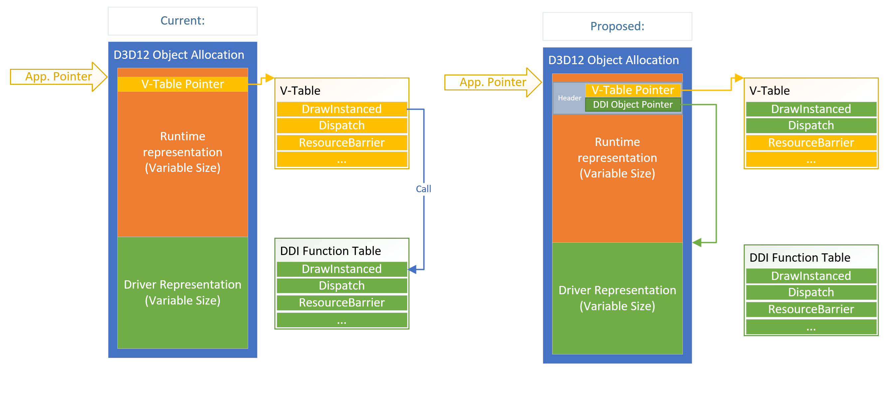

# D3D12 Runtime Bypass

## Overview
The D3D12 runtime is highly optimized for the maximum throughput of high-frequency API calls such setting Root Data, Drawing, Dispatching etc. For these APIs the runtime's task is to essentially forward the application arguments to the User Mode Driver via the appropriate DDI function pointer.

For example, the following is an x86-64 disassembly snippet of the D3D12 runtime implementation of DrawInstanced which shows that the entire function requires only 15 instructions to complete:

```asm
 push        rbx  
 mov         rbx,qword ptr [00007FF9DF165000h]  
 mov         r10,rcx  
 movzx       ecx,bl  
 mov         r11d,1  
 shl         r11,cl  
 and         rbx,0FFFFFFFFFFFF0000h  
 dec         r11  
 mov         rax,qword ptr [r10+60h]  
 lea         rcx,[r10+0000000000000570h]  
 add         rax,10h  
 and         r11,rax  
 mov         rax,qword ptr [r11+rbx]  
 pop         rbx  
 jmp         rax                                =======> Jump to User Mode Driver
```
While this is an impressively small and light-weight solution, there is still a measurable overhead to each API call that the application makes and as modern games push scene complexity further the volume of D3D12 API calls per frame has reached well over 100,000 in some cases. It's worth noting that the move towards GPU based scene traversal and submission using APIs like Work Graphs alleviates this issue; however, it will take some time for these APIs to become ubiquitous.

This document outlines a solution which eliminates the overhead of the D3D12 runtime entirely by providing a means for the application to take a shortcut directly to the User Mode Driver. Initial prototyping shows that this method could save around 5% of CPU time for heavy D3D12 API usage workloads (when measuring command list recording time).

## Virtual Tables
D3D12 is a Common Object Model (COM) based API which means that applications interact with the D3D12 runtime through well-defined C++ (or C) interfaces. When using C++, D3D12 interfaces such as ID3D12GraphicsCommandList use the concept of Virtual Functions to abstract the implementation details for each API call. In practice this is implemented via a Virtual Function Table (V-Table) which is essentially a region of memory owned by the D3D12 runtime which holds a table of function pointers which correspond to the implementation of each API. D3D12 objects have a pointer to their corresponding V-Table (which is stored in the first 8-bytes of the object by ABI convention) and when the application wants to call one of these D3D12 APIs the C++ compiler will generate the code to dereference the function pointer table and add the correct offset for the API which is to be called. A simple way to understand how this works is to inspect the C interface bindings which are made available by the IDL compiler in the D3D12 header file.

```c

    typedef struct ID3D12GraphicsCommandListVtbl
    {
        BEGIN_INTERFACE
        ...
        void ( STDMETHODCALLTYPE *DrawInstanced )( 
            ID3D12GraphicsCommandList * This,
            _In_  UINT VertexCountPerInstance,
            _In_  UINT InstanceCount,
            _In_  UINT StartVertexLocation,
            _In_  UINT StartInstanceLocation);
        
        void ( STDMETHODCALLTYPE *DrawIndexedInstanced )( 
            ID3D12GraphicsCommandList * This,
            _In_  UINT IndexCountPerInstance,
            _In_  UINT InstanceCount,
            _In_  UINT StartIndexLocation,
            _In_  INT BaseVertexLocation,
            _In_  UINT StartInstanceLocation);
        ...
        END_INTERFACE
    } ID3D12GraphicsCommandListVtbl;

    interface ID3D12GraphicsCommandList
    {
        CONST_VTBL struct ID3D12GraphicsCommandListVtbl *lpVtbl;
    };
```

The above is a snippet for the C interface version of ID3D12GraphicsCommandList which demonstrates the definition of the V-Table as a Plain Old Data (POD) structure containing function pointers to each API on the interface. At the bottom is the definition of the ID3D12GraphcisCommandList interface itself as a basic struct whose only member is pointer to an instance of the V-Table defined prior.

Thus, this C++ D3D12 code:

```c++
    m_commandList->DrawInstanced(3, 1, 0, 0);
```
is functionally equivalent (and is in fact what happens under the hood) to this C code:

```c
    m_commandList->lpVtbl.DrawInstanced(m_commandList, 3, 1, 0, 0);
```
It's important to note that the signature of these API functions takes a pointer to the calling object as the first parameter followed by the rest of the API arguments.

## Optimization: Runtime Bypass - Shortcut to the driver
The function pointed to in the prior section is implemented in the D3D12 runtime. In general, the API implementations for high-frequency APIs follow this pattern:

1. Retrieve the handle for the driver representation of the D3D12 object.
2. Look up the matching Device Driver Interface (DDI) function pointer for the API
3. Call the DDI function driver object handle, forwarding the API arguments. 

The D3D12 runtime queries the driver on startup for the DDI function pointer table and stores it for later use.

D3D12 DDI functions generally have the same signature as the APIs they correspond to except they take as their first parameter a DDI 'Handle' which is just an alias of a void pointer which points to the driver's representation of the API object.

For example, this is the definition for the DDI function corresponding to DrawInstanced.

```c++
typedef VOID ( APIENTRY* PFND3D12DDI_DRAWINSTANCED )(D3D12DDI_HCOMMANDLIST, UINT, UINT, UINT, UINT );
```
We can observe that this is a compatible signature to that of the D3D12 API interface and therefore there is an opportunity to make an optimization by short-cutting from the application straight to the driver.

This can be achieved by building a custom V-Table that instead of containing pointers to functions hosted in the D3D12 runtime contains the DDI function pointers directly.

One issue with this approach is that the 'this pointer' passed from the application will be a pointer to the ID3D12* object and therefore the driver cannot obtain its version of the object without additional context.

Currently the D3D12 runtime allocates the memory for its own object representation and the driver's as a single blob, effectively placement creating both within that blob. At present the driver representation is placed after the runtime's own object but there is not a guarantee of that and the driver is expected to just use the handle provided by the runtime at the DDI call site as both driver and runtime objects can be variable in size and are subject to change from release to release. To enable the driver to obtain its version of the object for these runtime bypass APIs, the D3D12 runtime will reorganize the object layout such that the interface that is returned to the application will be a pointer to a well defined header. The header will contain the V-Table pointer for the object followed immediately by a pointer to the driver object.

  

In some modes, such as when ETW tracing or when the D3D Debug Layers are enabled, the runtime will still need to execute code in between the application and the driver. For this reason, the V-Table accessed by the app will be dynamically changed at runtime as is what happens today. Therefore, it's possible for the driver to be called directly from the application or via the runtime but this should be transparent to the driver and the runtime will always consistently pass the correct handle to the driver when it's 'in the middle'.

A nice benefit of this optimization is that all D3D12 applications can receive a performance improvement without any code changes required and it can be applied retroactively to any application that has already been released, provided that there is an updated runtime and driver on the the system.

### DDI Implementation

A new structure called D3D12DDI_RUNTIME_BYPASS_HEADER will be declared to define the interface that will be returned to the application by the D3D12 runtime for objects which are used in runtime bypass APIs. Effectively the 'this' pointer at the API call site will be a pointer to an instance of one of these structures and subsequently new driver entry points will receive that pointer as well.
```c++
typedef struct D3D12DDI_RUNTIME_BYPASS_HEADER
{
    const void* pInterfaceVtable;
    void*   pDriverObject;
} D3D12DDI_RUNTIME_BYPASS_HEADER;
```
The first member of this structure is a pointer to the V-Table hosted in the D3D12 runtime, this is required to be the first member by C++ virtual function convention and the second member is a pointer directly to the driver object

Additionally, there will be new typedef declarations which represent handles (pointers) to bypass header objects for those objects which are compatible with the runtime bypass feature. To aid driver development, helper functions will also be provided to convert from these new handle types to the current handles. It is expected that drivers should be able to create simple entry points which forward calls to existing DDIs to avoid code churn.

```c++
// Handles to application objects not driver objects
D3D10DDI_H( D3D12DDI_API_HPIPELINESTATE )
D3D10DDI_H( D3D12DDI_API_HSTATEOBJECT )
D3D10DDI_H( D3D12DDI_API_HROOTSIGNATURE )
D3D10DDI_H( D3D12DDI_API_HCOMMANDLIST )

inline D3D12DDI_HCOMMANDLIST GetDriverCommandListHandle(D3D12DDI_API_HCOMMANDLIST ApiHandle)
{
    D3D12DDI_RUNTIME_BYPASS_HEADER* pBypassHeader = (D3D12DDI_RUNTIME_BYPASS_HEADER*)ApiHandle.pDrvPrivate;
    D3D12DDI_HCOMMANDLIST hCommandList;

    hCommandList.pDrvPrivate = pBypassHeader->pDriverObject;
    return hCommandList;
}
...
```

Finally, new function pointer prototypes which define which DDIs will be capable of bypassing the runtime. These functions are identical to the ones they are replacing expect they take 'API' handles to indicated that the driver must inspect the bypass header to obtain their internal object.
```c++
// DDI function signatures that are directly compatible with their API counterparts.
typedef VOID ( APIENTRY* PFND3D12DDI_DRAWINSTANCED_0114 )(D3D12DDI_API_HCOMMANDLIST, UINT, UINT, UINT, UINT );
typedef VOID ( APIENTRY* PFND3D12DDI_DRAWINDEXEDINSTANCED_0114 )(D3D12DDI_API_HCOMMANDLIST, UINT, UINT, UINT, INT, UINT );
typedef VOID ( APIENTRY* PFND3D12DDI_DISPATCH_0114 )(D3D12DDI_API_HCOMMANDLIST, UINT, UINT, UINT );
typedef VOID ( APIENTRY* PFND3D12DDI_IA_SETTOPOLOGY_0114 )(D3D12DDI_API_HCOMMANDLIST, D3D12DDI_PRIMITIVE_TOPOLOGY );
typedef VOID ( APIENTRY* PFND3D12DDI_RS_SETVIEWPORTS_0114 )(D3D12DDI_API_HCOMMANDLIST, _In_range_(0, D3D12_VIEWPORT_AND_SCISSORRECT_OBJECT_COUNT_PER_PIPELINE) UINT Count, _In_reads_(Count) CONST D3D12DDI_VIEWPORT* );
typedef VOID ( APIENTRY* PFND3D12DDI_RS_SETSCISSORRECTS_0114 )(D3D12DDI_API_HCOMMANDLIST, _In_range_(0, D3D12_VIEWPORT_AND_SCISSORRECT_OBJECT_COUNT_PER_PIPELINE) UINT Count, _In_reads_(Count) CONST D3D12DDI_RECT* );
typedef VOID ( APIENTRY* PFND3D12DDI_OM_SETBLENDFACTOR_0114 )(D3D12DDI_API_HCOMMANDLIST, CONST FLOAT[4] );
typedef VOID ( APIENTRY* PFND3D12DDI_OM_SETSTENCILREF_0114 )(D3D12DDI_API_HCOMMANDLIST, UINT );
typedef VOID ( APIENTRY* PFND3D12DDI_SET_PIPELINE_STATE_0114 )(D3D12DDI_API_HCOMMANDLIST, D3D12DDI_API_HPIPELINESTATE );
typedef VOID ( APIENTRY* PFND3D12DDI_SET_ROOT_SIGNATURE_0114 )(D3D12DDI_API_HCOMMANDLIST, _In_ D3D12DDI_API_HROOTSIGNATURE);
typedef VOID ( APIENTRY* PFND3D12DDI_SET_ROOT_DESCRIPTOR_TABLE_0114 )(D3D12DDI_API_HCOMMANDLIST, _In_ UINT RootParameterIndex,_In_ D3D12DDI_GPU_DESCRIPTOR_HANDLE BaseDescriptor );
typedef VOID ( APIENTRY* PFND3D12DDI_SET_ROOT_32BIT_CONSTANT_0114 )(D3D12DDI_API_HCOMMANDLIST, UINT RootParameterIndex, UINT SrcData, UINT DestOffsetIn32BitValues);
typedef VOID ( APIENTRY* PFND3D12DDI_SET_ROOT_32BIT_CONSTANTS_0114 )(D3D12DDI_API_HCOMMANDLIST, UINT RootParameterIndex, UINT Num32BitValuesToSet, CONST void* pSrcData, UINT DestOffsetIn32BitValues );  
typedef VOID ( APIENTRY* PFND3D12DDI_SET_ROOT_BUFFER_VIEW_0114 )(D3D12DDI_API_HCOMMANDLIST, UINT RootParameterIndex, _In_ D3D12DDI_GPU_VIRTUAL_ADDRESS BufferLocation);
typedef VOID ( APIENTRY* PFND3D12DDI_IA_SET_INDEX_BUFFER_0114 )(D3D12DDI_API_HCOMMANDLIST, _In_ CONST D3D12DDI_INDEX_BUFFER_VIEW* pDesc);
typedef VOID ( APIENTRY* PFND3D12DDI_IA_SET_VERTEX_BUFFERS_0114 )(D3D12DDI_API_HCOMMANDLIST, _In_ UINT StartSlot, _In_ UINT NumViews, _In_reads_opt_(NumViews) CONST D3D12DDI_VERTEX_BUFFER_VIEW * pViews );
typedef VOID ( APIENTRY* PFND3D12DDI_SO_SET_TARGETS_0114 )(D3D12DDI_API_HCOMMANDLIST, _In_ UINT StartSlot, _In_ UINT NumViews, _In_reads_opt_(NumViews) CONST D3D12DDI_STREAM_OUTPUT_BUFFER_VIEW* pViews );
typedef VOID ( APIENTRY* PFND3D12DDI_OM_SET_RENDER_TARGETS_0114 )(D3D12DDI_API_HCOMMANDLIST, _In_ UINT NumRenderTargetDescriptors, _In_ CONST D3D12DDI_CPU_DESCRIPTOR_HANDLE* pRenderTargetDescriptors, _In_ BOOL RTsSingleHandleToDescriptorRange, _In_opt_ CONST D3D12DDI_CPU_DESCRIPTOR_HANDLE* pDepthStencilDescriptor);
typedef VOID ( APIENTRY* PFND3D12DDI_OM_SETDEPTHBOUNDS_0114 )(D3D12DDI_API_HCOMMANDLIST, FLOAT Min, FLOAT Max);
typedef VOID ( APIENTRY* PFND3D12DDI_SETSAMPLEPOSITIONS_0114 )(D3D12DDI_API_HCOMMANDLIST, UINT NumSamplesPerPixel, UINT NumPixels, __in_ecount(NumSamplesPerPixel*NumPixels) D3D12DDI_SAMPLE_POSITION* pSamplePositions);
typedef VOID ( APIENTRY* PFND3D12DDI_SETVIEWINSTANCEMASK_0114 )( D3D12DDI_API_HCOMMANDLIST, UINT Mask );
typedef VOID ( APIENTRY* PFND3D12DDI_BUILD_RAYTRACING_ACCELERATION_STRUCTURE_0114 )(D3D12DDI_API_HCOMMANDLIST, _In_ CONST D3D12DDIARG_BUILD_RAYTRACING_ACCELERATION_STRUCTURE_0054* );
typedef VOID ( APIENTRY* PFND3D12DDI_EMIT_RAYTRACING_ACCELERATION_STRUCTURE_POSTBUILD_INFO_0114 )(D3D12DDI_API_HCOMMANDLIST, _In_ CONST D3D12DDIARG_EMIT_RAYTRACING_ACCELERATION_STRUCTURE_POSTBUILD_INFO_0054* );
typedef VOID ( APIENTRY* PFND3D12DDI_COPY_RAYTRACING_ACCELERATION_STRUCTURE_0114 )(D3D12DDI_API_HCOMMANDLIST, _In_ CONST D3D12DDIARG_COPY_RAYTRACING_ACCELERATION_STRUCTURE_0054* );
typedef VOID ( APIENTRY* PFND3D12DDI_SET_PIPELINE_STATE1_0114 )(D3D12DDI_API_HCOMMANDLIST, D3D12DDI_API_HSTATEOBJECT );
typedef VOID ( APIENTRY* PFND3D12DDI_DISPATCH_RAYS_0114 )(D3D12DDI_API_HCOMMANDLIST, _In_ CONST D3D12DDIARG_DISPATCH_RAYS_0054* );
typedef VOID ( APIENTRY* PFND3D12DDI_RS_SET_SHADING_RATE_0114 )(D3D12DDI_API_HCOMMANDLIST, D3D12DDI_SHADING_RATE_0062 ShadingRate,_In_reads_opt_(D3D12_RS_SET_SHADING_RATE_COMBINER_COUNT) const D3D12DDI_SHADING_RATE_COMBINER_0062* Combiners);
typedef VOID ( APIENTRY* PFND3D12DDI_DISPATCH_MESH_0114 )(D3D12DDI_API_HCOMMANDLIST, UINT, UINT, UINT );
typedef VOID ( APIENTRY* PFND3D12DDI_OM_SETFRONTANDBACKSTENCILREF_0114 )(D3D12DDI_API_HCOMMANDLIST, UINT, UINT );
typedef VOID ( APIENTRY* PFND3D12DDI_SET_DEPTH_BIAS_STATE_0114)(D3D12DDI_API_HCOMMANDLIST, FLOAT, FLOAT, FLOAT);
typedef VOID ( APIENTRY* PFND3D12DDI_SET_INDEX_BUFFER_STRIP_CUT_VALUE_0114)(D3D12DDI_API_HCOMMANDLIST, D3D12DDI_INDEX_BUFFER_STRIP_CUT_VALUE IBStripCutValue);
typedef VOID ( APIENTRY* PFND3D12DDI_SET_PROGRAM_0114 )(D3D12DDI_API_HCOMMANDLIST, _In_ const D3D12DDI_SET_PROGRAM_DESC_0108* pDesc );
typedef VOID ( APIENTRY* PFND3D12DDI_DISPATCH_GRAPH_0114 )(D3D12DDI_API_HCOMMANDLIST, _In_ CONST D3D12DDI_DISPATCH_GRAPH_DESC_0108* );
```

```c++
typedef struct D3D12DDI_COMMAND_LIST_FUNCS_3D_0114
{
    PFND3D12DDI_CLOSECOMMANDLIST                                            pfnCloseCommandList;
    PFND3D12DDI_RESETCOMMANDLIST_0040                                       pfnResetCommandList;

    PFND3D12DDI_DRAWINSTANCED_0114                                          pfnDrawInstanced;
    PFND3D12DDI_DRAWINDEXEDINSTANCED_0114                                   pfnDrawIndexedInstanced;
    PFND3D12DDI_DISPATCH_0114                                               pfnDispatch;
    ...
```
### Example DDI implementation - WARP

The WARP driver implementation of these new DDI entrypoints is very straight forward as it simply resolves the DDI object using the provided helpers and forwards to the DDI entry points which already exist.

```c++
//----------------------------------------------------------------------------------------------------------------------------------
// Runtime Bypass Functions (RTBP)
//----------------------------------------------------------------------------------------------------------------------------------

//----------------------------------------------------------------------------------------------------------------------------------
EXTERN_C VOID APIENTRY UMCommandList::DrawInstanced_RTBP(
    D3D12DDI_API_HCOMMANDLIST hCommandList,
    UINT VertexCountPerInstance,
    UINT InstanceCount,
    UINT StartVertexLocation,
    UINT StartInstanceLocation)
{
    DrawInstanced(GetDriverCommandListHandle(hCommandList), VertexCountPerInstance, InstanceCount, StartVertexLocation, StartInstanceLocation);
}
```

Additionally, by applying the 'inline' hint to the original DDI entry points the compiler can generate optimal code without any additional jump or call instructions.

For Example, this is the assembly code which would be executed by a DrawInstanced call from the application to the driver and back using the new system:

```asm
pList->DrawInstanced(60,1,0,0);
 mov         rax,qword ptr [rsi]        # rax == VTable Pointer
 xor         r9d,r9d  
 mov         rcx,rsi                    # rcx == pList
 mov         dword ptr [rsp+20h],0  
 lea         edx,[r9+3Ch]  
 lea         r8d,[r9+1]  
 call        qword ptr [rax+60h]        # Call directly to WARP

d3d10warp.dll!UMCommandList::DrawInstanced_RTBP(D3D12DDI_API_HCOMMANDLIST, unsigned int, unsigned int, unsigned int, unsigned int):
 mov         qword ptr [rsp+8],rbx  
 mov         qword ptr [rsp+10h],rsi  
 push        rdi  
 sub         rsp,20h  
 mov         rax,qword ptr [rcx+8]      # Get DriverObject from header
 mov         ebx,r9d  
 mov         edi,r8d  
 mov         esi,edx  
 test        rax,rax  
 je          00007FFBF4900B25  
 mov         rcx,qword ptr [rax]  
 jmp         00007FFBF4900B27  
 xor         ecx,ecx  
 mov         edx,1  
 lea         r8d,[rdx+0Fh]  
 call        00007FFBF485C398  
 test        rax,rax  
 je          00007FFBF4900B49  
 mov         ecx,dword ptr [rsp+50h]  
 mov         dword ptr [rax+0Ch],ecx  
 mov         dword ptr [rax],esi  
 mov         dword ptr [rax+4],edi  
 mov         dword ptr [rax+8],ebx  
 mov         rbx,qword ptr [rsp+30h]  
 mov         rsi,qword ptr [rsp+38h]  
 add         rsp,20h  
 pop         rdi  
 ret  
```

### Modifiable V-Tables

To accommodate this optimization, these D3D12 interfaces (and their iterations) will be refactored to conform to the layout defined by D3D12DDI_RUNTIME_BYPASS_HEADER in order to enable the driver to convert from API pointer to driver object at the DDI call site:

- ID3D12GraphicsCommandList
- ID3D12PipelineState
- ID3D12StateObject
- ID3D12Resource
- ID3D12RootSignature

For example, the SetPipelineState API takes a pointer to a ID3D12PipelineState object and if this call were to land directly in the driver, the driver would need the ability to also convert the PSO pointer to its representation in addition to the 'this' pointer of the command list.

### Security

Currently, in order to avoid an unacceptable performance hit, the D3D12 runtime disables Control Flow Guard (CFG) code generation for high-frequency indirect calls to DDI functions. To limit exploits that CFG would usually guard against, the runtime takes care to store DDI function tables that are returned from the driver in an allocation which is protected with PAGE_READONLY (apart from a small window of time when the table is filled out). Futhermore, the pointer to that allocation and it's size is also stored in a PAGE_READONLY allocation. This system prevents buffer overrun attacks from potentially bad user input from overwriting the the DDI function pointer table and redirecting code execution while still ensuring high performance.

Fortunately, no extra measures are required to enable runtime bypass to the driver as CFG (if the application has it enabled) will sanitize the addresses that are fetched from the V-Table before calling them i.e the level of security should be the same if the application calls the driver directly vs indirectly through the D3D runtime.

### Validation

Some medium to high-frequency D3D12 APIs have light-weight validation enabled even when the D3D12 Debug Layer is not enabled. This validation will detect bad state from the application and remove the command list (set to error state) if and API error is encountered to minimize undefined behavior. If an application calls into the driver this (limited) validation will be skipped reducing some protections from undefined behavior; however, there is a parallel effort ongoing to reduce this validation and perhaps apply it opportunistically as to not incur the cost in retail scenarios. When it is determined that validation should be enabled the D3D runtime can disable the runtime bypass optimization and fall back to the traditional model. The result of this is that drivers do <b>*not*</b> have to increase their defensiveness to invalid API input in response to this optimization.

### Applicable APIs

Not every D3D12 API is called at a high enough frequency to benefit from such an optimization and other APIs require some logic to be executed in the D3D12 runtime and/or have an incompatible API/DDI signature.

The following is a list of APIs which are eligible to shortcut directly into the driver

- DrawInstanced
- DrawIndexedInstanced
- Dispatch
- IASetPrimitiveTopology
- RSSetViewports
- RSSetScissorRects
- OMSetBlendFactor
- OMSetStencilRef
- SetPipelineState
- SetComputeRootSignature
- SetGraphicsRootSignature
- SetComputeRootDescriptorTable
- SetGraphicsRootDescriptorTable
- SetComputeRoot32BitConstant
- SetGraphicsRoot32BitConstant
- SetComputeRoot32BitConstants
- SetGraphicsRoot32BitConstants
- SetComputeRootConstantBufferView
- SetGraphicsRootConstantBufferView
- SetComputeRootShaderResourceView
- SetGraphicsRootShaderResourceView
- SetComputeRootUnorderedAccessView
- SetGraphicsRootUnorderedAccessView
- IASetIndexBuffer
- IASetVertexBuffers
- SOSetTargets
- SetRenderTargets
- OMSetDepthBounds
- SetSamplePositions
- SetViewInstanceMask
- BuildRaytracingAccelerationStructure
- EmitRaytracingAccelerationStructurePostbuildInfo
- CopyRaytracingAccelerationStructure
- SetPipelineState1
- DispatchRays
- RSSetShadingRate
- DispatchMesh
- OMSetFrontAndBackStencilRef
- RSSetDepthBias
- IASetIndexBufferStripCutValue
- SetProgram
- DispatchGraph           

## Backwards compatibility
Not all drivers will be enlightened about the new D3D12 Object layout, this is not an issue however because the runtime can simply disable the V-Table swap when a legacy driver is detected and continue to pass the DDI handle to the driver.

## PIX requirements
PIX sits on top of the D3D12 API and thus this change should be transparent to and no work is required.
