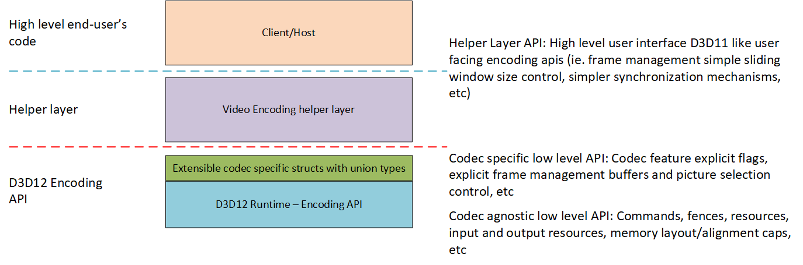
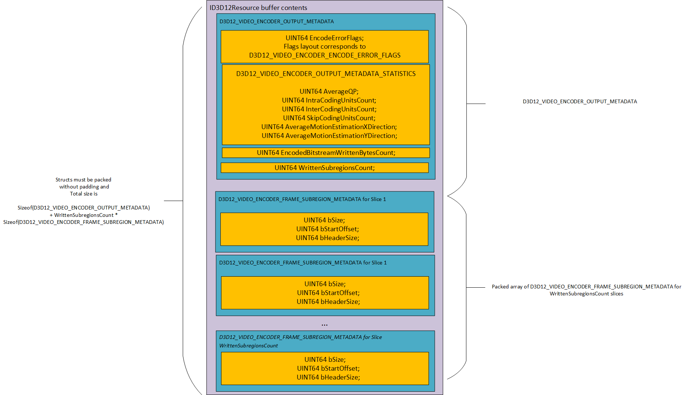
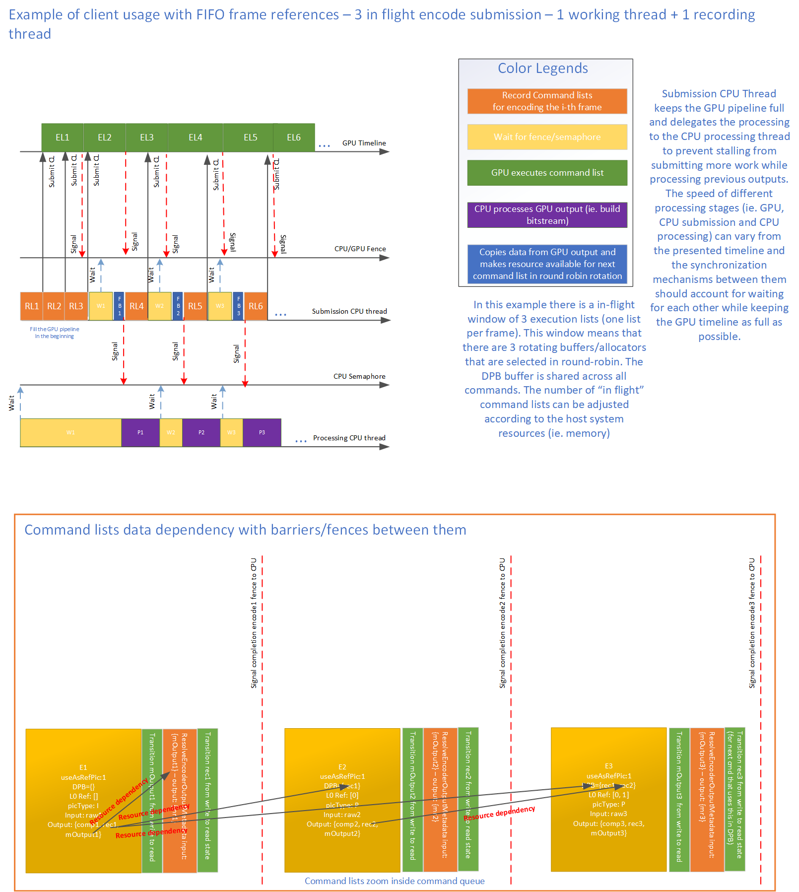

# 1. D3D12 Video Encoding

**Overview**

This feature adds a video encoding mechanism to D3D12, providing a coherent set of encoding APIs that are consistent with the D3D12 framework, and allows optimal usage of hardware encoding with D3D12 in a low-level fashion. This API provides access to the video encode hardware acceleration capabilities for different scenarios such as IoT, Cloud, Media APIs, machine learning and game streaming.

A helper layer will be developed on top of this API interface to provide a higher level entry point for users that need a higher level interface.

This spec covers video encoding, although image encoding also needs exposure in D3D12. We will be covering that separately.

# 2. General considerations

## 2.0 Video Encoding on D3D11

Video encoding on D3D11 is done via an extension mechanism, passing-through parameters to the D3D11 drivers. HW specific MediaFoundation transforms are provided by the IHVs, and they know which extensions to use so to communicate with the drivers. This way, applications can make use of video encoding capabilities via MediaFoundation. This new D3D12 API will provide a consistent and unified interface to expose the low level hardware acceleration capabilities that can be used to write video encoding applications.

## 2.1 Scenarios 

### 2.1.1 OneCore 

The D3D12 Video API will enable portable hardware accelerated video encoding on newer platforms where only D3D12 is available. This includes the various OneCore SKUs used by cloud compute and IoT platforms. Video encoding acceleration will be now available in this scenarios without the need for using platform specific solutions.

### 2.1.2 Media APIs

This API provides access to video encoding capabilities in a low level and portable way across all hardware vendors. This allows higher level Media APIs (such as Media Foundation) to build their media layers on top of this API which takes care of abstracting the different hardware platforms. Given the low level design of the API, these higher level media layers can optimize for their scenarios by having fine grain control of synchronization and memory allocation/residency aspects of the Video encode session such as full control of the reference picture management and bitstream headers writing responsabilities. This shift of responsabilities to the layer sitting above this API also allows to have a consistent set of encoding policies (eg. DPB heuristics such as adaptive GOP) in the media layer that can be reused across different hardware platforms.

### 2.1.3 D3D Graphics, Compute and Machine learning interop with Video Encode API

This API enables efficient interop between D3D12 Video Encode and D3D12 Graphics, Compute and Machine learning scenarios, which is interesting for scenarios such as running machine learning inference over a camera stream.

### 2.1.4 Game streaming scenarios
This API enables game streaming scenarios that require a highly performant low level API.

## 2.2 Codecs support extensibility

The main supported codecs will be H264 and HEVC but with open extensibility for new codecs such as AV1. The codec-specific aspects of the API will be delegated to codec-specific structures and their access to union types. When a new codec wants to be supported, the extension process should consist of:
    
    1. Extending the codecs enum with the new codec.
    2. Creating the codec specific support flags and configuration structures and adding it to the respective union types.
    3. Creating the codec specific picture control structures and adding it to the respective union types.
    4. (If applicable) Extending the API to add new subregion partition modes following the same pattern exposed in this API for slice based subregion partitioning. A common example is adding support for tiles, which can be combined with

 *Note:* The union types always contain **pointers** to the codec-specific structures. The rationale behind this design decision is to preserve the binary interface compatibility on extensibility. The union types will always have a constant size based on the pointer size of the host architecture. This decision also prevents structures holding members of (or containing anonymous) union types of changing their type sizes when extending the interface. Some of the unions today only contain pointers to enum types, but to be consistent with this, they were also referenced as pointers in the case a new codec requires some more complex type than an enum to represent those concepts.

## 2.3 Responsabilities separation between D3D12 API and Helper layer

The D3D12 API is designed to be a lower level API than the existing D3D11 like APIs, giving more control to the host regarding some aspects like final bitstream header coding, frame reference management and exposing more complex synchronization mechanisms and explicit memory management.

After building this API, we will be building an **optional** separate helper layer placed on top of this API interface that will have responsabilities such as, but not limited to:
* Producing the full encoded bitstream based on the D3D12 API payload output and subregion (eg. slice) headers. This includes handling SEI/VUI/VPS/SPS/PPS/etc.
* Reference picture management component that manages the reconstructed picture allocations and residency, B-frame reordering and reference frames usage strategy.
* Delegation pattern for some of the D3D12 API features such as Rate Control, Intra-refresh, Encoder Support cap queries, etc.
* Maps some of the finer grain control to higher level concepts, abstracting some of the lower level configuration options such as codec config flags.
* Overall, provides a higher level API for Video Encode by taking care of the D3D12 explicit memory management and synchronization aspects of this API into a simpler and higher level interface. This includes managing the command recording and submission, resource barriers, reference picture management related allocations and residency policies, etc. 

### D3D12 Api vs Helper layer interaction diagram


**Note:** In the spec, when mentioning "the host" we refer to any user of the D3D12 lower level API. The helper layer is a particular instance of a host that will take care of some of the low level responsabilities and provide a higher level interface for entry level end users. **Advanced users can use the D3D12 API directly without the helper layer.**

---

## 2.4 API and DDI similarities

The next sections detail the API and DDI for video encoding. In many cases, the DDI is extremely similar to the API. The structures and enumerations which are basically the same (differing solely in name convention) are not repeated in the this specification. We include just the DDI structures/enumerations and functions that differ substantially from the API.

# 3. Video Encoding Support

## 3.1. Video Encoding Support API

The framework support for video encoding is already present in the D3D12 API, with feature support check via D3D12_FEATURE_DATA_VIDEO_FEATURE_AREA_SUPPORT.VideoEncodeSupport, encoding command list support via ID3D12VideoEncodeCommandList and video encoding command queues.
The following features options are added to D3D12_FEATURE_VIDEO. Use this enumeration in a call to ID3D12VideoDevice::CheckFeatureSupport to query a driver about the support for the given feature.

### 3.1.1. ENUM:  D3D12_FEATURE_VIDEO

```C++
typedef enum D3D12_FEATURE_VIDEO
{
…
    D3D12_FEATURE_VIDEO_ENCODER_CODEC = 33
    D3D12_FEATURE_VIDEO_ENCODER_PROFILE_LEVEL = 34
    D3D12_FEATURE_VIDEO_ENCODER_OUTPUT_RESOLUTION_RATIOS_COUNT = 35
    D3D12_FEATURE_VIDEO_ENCODER_OUTPUT_RESOLUTION = 36
    D3D12_FEATURE_VIDEO_ENCODER_INPUT_FORMAT = 37
    D3D12_FEATURE_VIDEO_ENCODER_RATE_CONTROL_MODE = 38
    D3D12_FEATURE_VIDEO_ENCODER_INTRA_REFRESH_MODE = 39
    D3D12_FEATURE_VIDEO_ENCODER_FRAME_SUBREGION_LAYOUT_MODE = 40
    D3D12_FEATURE_VIDEO_ENCODER_HEAP_SIZE = 41
    D3D12_FEATURE_VIDEO_ENCODER_CODEC_CONFIGURATION_SUPPORT = 42
    D3D12_FEATURE_VIDEO_ENCODER_SUPPORT = 43
    D3D12_FEATURE_VIDEO_ENCODER_CODEC_PICTURE_CONTROL_SUPPORT = 44
    D3D12_FEATURE_VIDEO_ENCODER_RESOURCE_REQUIREMENTS = 45
} D3D12_FEATURE_VIDEO;
```

We add the above constants to the existing D3D12_FEATURE_VIDEO to support video encoding. The associated data structures can be found right below.

**Constants**

*D3D12_FEATURE_VIDEO_ENCODER_CODEC*

Checks support for a given codec. The associated data structure is D3D12_FEATURE_DATA_VIDEO_ENCODER_CODEC.

*D3D12_FEATURE_VIDEO_ENCODER_PROFILE_LEVEL*

Checks support for a given profile and returns the supported levels range for that profile. The associated data structure is D3D12_FEATURE_DATA_VIDEO_ENCODER_PROFILE_LEVEL.

*D3D12_FEATURE_VIDEO_ENCODER_OUTPUT_RESOLUTION_RATIOS_COUNT*

Checks support for the number of resolution ratios available. The associated data structure is D3D12_FEATURE_DATA_VIDEO_ENCODER_OUTPUT_RESOLUTION_RATIOS_COUNT.

*D3D12_FEATURE_VIDEO_ENCODER_OUTPUT_RESOLUTION*

Checks support for the rules that resolutions must meet. The associated data structure is D3D12_FEATURE_DATA_VIDEO_ENCODER_OUTPUT_RESOLUTION.

*D3D12_FEATURE_VIDEO_ENCODER_INPUT_FORMAT*

Checks support for a given input format. The associated data structure is D3D12_FEATURE_DATA_VIDEO_ENCODER_INPUT_FORMAT.

*D3D12_FEATURE_VIDEO_ENCODER_RATE_CONTROL_MODE*

Checks support for a given rate control mode. The associated data structure is D3D12_FEATURE_DATA_VIDEO_ENCODER_RATE_CONTROL_MODE.

*D3D12_FEATURE_VIDEO_ENCODER_INTRA_REFRESH_MODE*

Checks support for a given intra refresh mode. The associated data structure is D3D12_FEATURE_DATA_VIDEO_ENCODER_INTRA_REFRESH_MODE.

*D3D12_FEATURE_VIDEO_ENCODER_FRAME_SUBREGION_LAYOUT_MODE*

Checks support for a given subregion layout mode. The associated data structure is D3D12_FEATURE_DATA_VIDEO_ENCODER_FRAME_SUBREGION_LAYOUT_MODE.

*D3D12_FEATURE_VIDEO_ENCODER_HEAP_SIZE*

Retrieves the memory requirements of a video encoder heap created with the given encoder heap properties. The associated data structure is D3D12_FEATURE_DATA_VIDEO_ENCODER_HEAP_SIZE.

*D3D12_FEATURE_VIDEO_ENCODER_CODEC_CONFIGURATION_SUPPORT*

Retrieves a set of codec specific configuration limits. The associated data structure is D3D12_FEATURE_DATA_VIDEO_ENCODER_CODEC_CONFIGURATION_SUPPORT.

*D3D12_FEATURE_VIDEO_ENCODER_SUPPORT*

Retrieves the feature support details on the requested configuration. The associated data structure is D3D12_FEATURE_DATA_VIDEO_ENCODER_SUPPORT.

*D3D12_FEATURE_VIDEO_ENCODER_CODEC_PICTURE_CONTROL_SUPPORT*

Retrieves the codec specific capabilities related to the reference picture management limitations. The associated data structure is D3D12_FEATURE_DATA_VIDEO_ENCODER_CODEC_PICTURE_CONTROL_SUPPORT.

*D3D12_FEATURE_VIDEO_ENCODER_RESOURCE_REQUIREMENTS*

Retrieves the requirements for alignment for resource access. The associated data structure is D3D12_FEATURE_DATA_VIDEO_ENCODER_RESOURCE_REQUIREMENTS.

---

### 3.1.2. ENUM: D3D12_VIDEO_ENCODER_CODEC

```C++
typedef enum D3D12_VIDEO_ENCODER_CODEC
{
    D3D12_VIDEO_ENCODER_CODEC_H264  = 1,
    D3D12_VIDEO_ENCODER_CODEC_HEVC  = 2,
} D3D12_VIDEO_ENCODER_CODEC;
```

List of possible codecs.

### 3.1.3. STRUCT: D3D12_FEATURE_DATA_VIDEO_ENCODER_CODEC 

```C++
typedef struct D3D12_FEATURE_DATA_VIDEO_ENCODER_CODEC
{
    UINT64 NodeIndex;                           // input
    D3D12_VIDEO_ENCODER_CODEC Codec;   // input
    BOOL IsSupported;                           // output
} D3D12_FEATURE_DATA_VIDEO_ENCODER_CODEC; 
```

**Members**

*NodeIndex*

Input parameter, in multi-adapter operation, this indicates which physical adapter of the device this operation applies to.

*Codec*

Input parameter, desired codec to check support for.

*IsSupported*

Output parameter, indicates if given value for feature is supported.


### 3.1.4. ENUM: D3D12_VIDEO_ENCODER_PROFILE_H264

```C++
typedef enum D3D12_VIDEO_ENCODER_PROFILE_H264
{
    D3D12_VIDEO_ENCODER_PROFILE_H264_MAIN = 77,
    D3D12_VIDEO_ENCODER_PROFILE_H264_HIGH = 100,
    D3D12_VIDEO_ENCODER_PROFILE_H264_HIGH_10 = 110,
} D3D12_VIDEO_ENCODER_PROFILE_H264;
```

List of possible H264 profiles.

### 3.1.5. ENUM: D3D12_VIDEO_ENCODER_PROFILE_HEVC

```C++
typedef enum D3D12_VIDEO_ENCODER_PROFILE_HEVC
{
    D3D12_VIDEO_ENCODER_PROFILE_HEVC_MAIN = 0,
    D3D12_VIDEO_ENCODER_PROFILE_HEVC_MAIN10 = 1,
} D3D12_VIDEO_ENCODER_PROFILE_HEVC;
```

List of possible HEVC profiles.

### 3.1.6. UNION: D3D12_VIDEO_ENCODER_PROFILE_DESC

```C++
typedef struct D3D12_VIDEO_ENCODER_PROFILE_DESC
{
    UINT DataSize;
    union
    {
        D3D12_VIDEO_ENCODER_PROFILE_H264* pH264Profile;
        D3D12_VIDEO_ENCODER_PROFILE_HEVC* pHEVCProfile;
    };
} D3D12_VIDEO_ENCODER_PROFILE_DESC;
```

Generic structure for codec profiles.

### 3.1.7. ENUM: D3D12_VIDEO_ENCODER_LEVELS_H264

```C++
typedef enum D3D12_VIDEO_ENCODER_LEVELS_H264
{
    D3D12_VIDEO_ENCODER_LEVELS_H264_1 = 0,
    D3D12_VIDEO_ENCODER_LEVELS_H264_1b = 1,
    D3D12_VIDEO_ENCODER_LEVELS_H264_11 = 2,
    D3D12_VIDEO_ENCODER_LEVELS_H264_12 = 3,
    D3D12_VIDEO_ENCODER_LEVELS_H264_13 = 4,
    D3D12_VIDEO_ENCODER_LEVELS_H264_2 = 5,
    D3D12_VIDEO_ENCODER_LEVELS_H264_21 = 6,
    D3D12_VIDEO_ENCODER_LEVELS_H264_22 = 7,
    D3D12_VIDEO_ENCODER_LEVELS_H264_3 = 8,
    D3D12_VIDEO_ENCODER_LEVELS_H264_31 = 9,
    D3D12_VIDEO_ENCODER_LEVELS_H264_32 = 10,
    D3D12_VIDEO_ENCODER_LEVELS_H264_4 = 11,
    D3D12_VIDEO_ENCODER_LEVELS_H264_41 = 12,
    D3D12_VIDEO_ENCODER_LEVELS_H264_42 = 13,
    D3D12_VIDEO_ENCODER_LEVELS_H264_5 = 14,
    D3D12_VIDEO_ENCODER_LEVELS_H264_51 = 15,
    D3D12_VIDEO_ENCODER_LEVELS_H264_52 = 16,
    D3D12_VIDEO_ENCODER_LEVELS_H264_6 = 17,
    D3D12_VIDEO_ENCODER_LEVELS_H264_61 = 18,
    D3D12_VIDEO_ENCODER_LEVELS_H264_62 = 19,
} D3D12_VIDEO_ENCODER_LEVELS_H264;
```

List of possible H264 levels.

### 3.1.8. ENUM: D3D12_VIDEO_ENCODER_TIER_HEVC
```C++
typedef enum D3D12_VIDEO_ENCODER_TIER_HEVC
{
    D3D12_VIDEO_ENCODER_TIER_HEVC_MAIN = 0,
    D3D12_VIDEO_ENCODER_TIER_HEVC_HIGH = 1,
} D3D12_VIDEO_ENCODER_TIER_HEVC;
```

**Constants**

List of possible HEVC tiers.

### 3.1.9. ENUM: D3D12_VIDEO_ENCODER_LEVELS_HEVC

```C++
typedef enum D3D12_VIDEO_ENCODER_LEVELS_HEVC
{
    D3D12_VIDEO_ENCODER_LEVELS_HEVC_1 = 1,
    D3D12_VIDEO_ENCODER_LEVELS_HEVC_2 = 2,
    D3D12_VIDEO_ENCODER_LEVELS_HEVC_21 = 3,
    D3D12_VIDEO_ENCODER_LEVELS_HEVC_3 = 4,
    D3D12_VIDEO_ENCODER_LEVELS_HEVC_31 = 5,
    D3D12_VIDEO_ENCODER_LEVELS_HEVC_4 = 6,
    D3D12_VIDEO_ENCODER_LEVELS_HEVC_41 = 7,
    D3D12_VIDEO_ENCODER_LEVELS_HEVC_5 = 8,
    D3D12_VIDEO_ENCODER_LEVELS_HEVC_51 = 9,
    D3D12_VIDEO_ENCODER_LEVELS_HEVC_52 = 10,
    D3D12_VIDEO_ENCODER_LEVELS_HEVC_6 = 11,
    D3D12_VIDEO_ENCODER_LEVELS_HEVC_61 = 12,
    D3D12_VIDEO_ENCODER_LEVELS_HEVC_62 = 13,
} D3D12_VIDEO_ENCODER_LEVELS_HEVC;
```

**Constants**

List of possible HEVC levels.

### 3.1.10. STRUCT: D3D12_VIDEO_ENCODER_LEVEL_TIER_CONSTRAINTS_HEVC

```C++
typedef struct D3D12_VIDEO_ENCODER_LEVEL_TIER_CONSTRAINTS_HEVC
{
    D3D12_VIDEO_ENCODER_LEVELS_HEVC Level;
    D3D12_VIDEO_ENCODER_TIER_HEVC Tier;
} D3D12_VIDEO_ENCODER_LEVEL_TIER_CONSTRAINTS_HEVC;
```

Groups a level and a tier for HEVC level setting configuration.

**Members**

*Level*

The HEVC associated level.

*Tier*

The HEVC associated tier.

### 3.1.11. UNION: D3D12_VIDEO_ENCODER_LEVEL_SETTING

```C++
typedef struct D3D12_VIDEO_ENCODER_LEVEL_SETTING
{
    UINT DataSize;
    union
    {
        D3D12_VIDEO_ENCODER_LEVELS_H264* pH264LevelSetting;
        D3D12_VIDEO_ENCODER_LEVEL_TIER_CONSTRAINTS_HEVC* pHEVCLevelSetting;
    };
} D3D12_VIDEO_ENCODER_LEVEL_SETTING;
```

Encapsulates a generic level related setting definition.

### 3.1.12. STRUCT: D3D12_FEATURE_DATA_VIDEO_ENCODER_PROFILE_LEVEL

```C++
typedef struct D3D12_FEATURE_DATA_VIDEO_ENCODER_PROFILE_LEVEL
{
    UINT NodeIndex;                                      // input
    D3D12_VIDEO_ENCODER_CODEC Codec;                     // input
    D3D12_VIDEO_ENCODER_PROFILE_DESC Profile;            // input
    BOOL IsSupported;                                    // output
    D3D12_VIDEO_ENCODER_LEVEL_SETTING MinSupportedLevel; // output
    D3D12_VIDEO_ENCODER_LEVEL_SETTING MaxSupportedLevel; // output
} D3D12_FEATURE_DATA_VIDEO_ENCODER_PROFILE_LEVEL;
```

**Members**

*NodeIndex*

Input parameter, in multi-adapter operation, this indicates which physical adapter of the device this operation applies to.

*Codec*

Input parameter, desired codec to check support for.

*Profile*

Input parameter, desired profile to check support for. 

*IsSupported*

Output parameter, indicates if given value for feature is supported.

*MinSupportedLevel*

Output parameter, minimum supported level for the selected codec and profile if supported.

*MaxSupportedLevel*

Output parameter, maximum supported level for the selected codec and profile if supported.

### 3.1.13. STRUCT: D3D12_VIDEO_ENCODER_PICTURE_RESOLUTION_RATIO_DESC

```C++
typedef struct D3D12_VIDEO_ENCODER_PICTURE_RESOLUTION_RATIO_DESC
{
    UINT64 WidthRatio;
    UINT64 HeightRatio;
} D3D12_VIDEO_ENCODER_PICTURE_RESOLUTION_RATIO_DESC;
```

Defines a resolution ratio as an irreducible fraction.

**Members**

*WidthRatio*

Indicates the resolution ratio numerator.

*HeightRatio*

Indicates the resolution ratio denominator.


### 3.1.14. STRUCT: D3D12_FEATURE_DATA_VIDEO_ENCODER_OUTPUT_RESOLUTION_RATIOS_COUNT

```C++
typedef struct D3D12_FEATURE_DATA_VIDEO_ENCODER_OUTPUT_RESOLUTION_RATIOS_COUNT
{
    UINT NodeIndex;                                              // input
    D3D12_VIDEO_ENCODER_CODEC Codec;                             // input
    UINT ResolutionRatiosCount;                                  // output
} D3D12_FEATURE_DATA_VIDEO_ENCODER_OUTPUT_RESOLUTION_RATIOS_COUNT;
```

Structure returning the number of supported resolutions based on codec, profile and level.

**Members**

*NodeIndex*

Input parameter, in multi-adapter operation, this indicates which physical adapter of the device this operation applies to.

*Codec*

Input parameter, desired codec to check support for.

*ResolutionRatiosCount*

Indicates the number of resolution ratios supported for this configuration.

### 3.1.15. STRUCT: D3D12_VIDEO_ENCODER_PICTURE_RESOLUTION_DESC

```C++
typedef struct D3D12_VIDEO_ENCODER_PICTURE_RESOLUTION_DESC
{
    UINT64 Width;
    UINT64 Height;
} D3D12_VIDEO_ENCODER_PICTURE_RESOLUTION_DESC;
```
Defines a resolution.

**Members**

*Width*

Indicates the resolution width in pixels.

*Height*

Indicates the resolution height in pixels.

### 3.1.16. STRUCT: D3D12_FEATURE_DATA_VIDEO_ENCODER_OUTPUT_RESOLUTION

```C++
typedef struct D3D12_FEATURE_DATA_VIDEO_ENCODER_OUTPUT_RESOLUTION
{
    UINT NodeIndex;                                              // input
    D3D12_VIDEO_ENCODER_CODEC Codec;                             // input
    UINT ResolutionRatiosCount;                                 // input
    BOOL IsSupported;                                           // output
    D3D12_VIDEO_ENCODER_PICTURE_RESOLUTION_DESC MinResolutionSupported; // output
    D3D12_VIDEO_ENCODER_PICTURE_RESOLUTION_DESC MaxResolutionSupported; // output
    UINT ResolutionWidthMultipleRequirement;    // output
    UINT ResolutionHeightMultipleRequirement;   // output
    [annotation("_Field_size_full_(ResolutionRatiosCount)")] D3D12_VIDEO_ENCODER_PICTURE_RESOLUTION_RATIO_DESC* pResolutionRatios;
} D3D12_FEATURE_DATA_VIDEO_ENCODER_OUTPUT_RESOLUTION;
```

Structure returning the list of supported resolutions based on codec, profile and level.

**Members**

*NodeIndex*

Input parameter, in multi-adapter operation, this indicates which physical adapter of the device this operation applies to.

*Codec*

Input parameter, desired codec to check support for.

*ResolutionRatiosCount*

Input parameter, indicates the number of resolution ratios to retrieve. Must match D3D12_FEATURE_DATA_VIDEO_ENCODER_OUTPUT_RESOLUTION_RATIOS_COUNT.ResolutionRatiosCount.

*IsSupported*

Output parameter, indicates if there's support for the current query inputs.

*MinResolutionSupported*

Output parameter, minimum resolution supported.

*MaxResolutionSupported*

Output parameter, maximum resolution supported.

*ResolutionWidthMultipleRequirement*

Output parameter, resolution X component must be divisible by this value.

*ResolutionHeightMultipleRequirement*

Output parameter, resolution Y component must be divisible by this value.

*pResolutionRatios*

Output parameter, list of supported resolution ratios as irreducible fractions.

The host allocates the memory for this array based on the resolution count query and passes it in the query struct.

### 3.1.17. STRUCT: D3D12_FEATURE_DATA_VIDEO_ENCODER_INPUT_FORMAT

```C++
typedef struct D3D12_FEATURE_DATA_VIDEO_ENCODER_INPUT_FORMAT
{
    UINT64 NodeIndex;                         // input
    D3D12_VIDEO_ENCODER_CODEC Codec;          // input
    D3D12_VIDEO_ENCODER_PROFILE_DESC Profile; // input
    DXGI_FORMAT Format;                       // input
    BOOL IsSupported;                         // output
} D3D12_FEATURE_DATA_VIDEO_ENCODER_INPUT_FORMAT;
```

**Remarks**
    
    Encode format support for 4:2:0 with 8 and 10 bitdepth samples using following formats:
        DXGI_FORMAT_P010
        DXGI_FORMAT_NV12

**Members**

*NodeIndex*

Input parameter, in multi-adapter operation, this indicates which physical adapter of the device this operation applies to.

*Codec*

Input parameter, desired codec to check support for.
    
*Profile*

Input parameter, desired profile to check support for. 

*Format*

Input parameter, desired format setting to check support for. 

**Note:** This format definition includes the subsampling and bit-depth modes settings for the video encoding session.

**Note:** The host is expected to handle the input subsampling/color conversion stages of video encoding.

*IsSupported*

Output parameter, indicates if given value for feature is supported.

### 3.1.18. ENUM: D3D12_VIDEO_ENCODER_RATE_CONTROL_MODE

```C++
typedef enum D3D12_VIDEO_ENCODER_RATE_CONTROL_MODE
{
    D3D12_VIDEO_ENCODER_RATE_CONTROL_MODE_ABSOLUTE_QP_MAP = 1,
    D3D12_VIDEO_ENCODER_RATE_CONTROL_MODE_CQP  = 2,
    D3D12_VIDEO_ENCODER_RATE_CONTROL_MODE_CBR  = 3,
    D3D12_VIDEO_ENCODER_RATE_CONTROL_MODE_VBR  = 4,
    D3D12_VIDEO_ENCODER_RATE_CONTROL_MODE_QVBR = 5,
} D3D12_VIDEO_ENCODER_RATE_CONTROL_MODE;
```

List of possible rate control modes.

**Constants**

*D3D12_VIDEO_ENCODER_RATE_CONTROL_MODE_ABSOLUTE_QP_MAP*

Indicates no rate control budgeting. Each EncodeFrame call will interpret the the QP values in D3D12_VIDEO_ENCODER_RATE_CONTROL.pRateControlQPMap as a map of absolute QP values.

*D3D12_VIDEO_ENCODER_RATE_CONTROL_MODE_CQP*

Indicates constant quantization parameter rate control mode.

*D3D12_VIDEO_ENCODER_RATE_CONTROL_MODE_CBR*

Indicates constant bit rate rate control mode.

*D3D12_VIDEO_ENCODER_RATE_CONTROL_MODE_VBR*

Indicates variable bit rate control mode.

*D3D12_VIDEO_ENCODER_RATE_CONTROL_MODE_QVBR*

Indicates constant quality target rate variable rate control mode.

### 3.1.19. STRUCT: D3D12_FEATURE_DATA_VIDEO_ENCODER_RATE_CONTROL_MODE

```C++
typedef struct D3D12_FEATURE_DATA_VIDEO_ENCODER_RATE_CONTROL_MODE
{
    UINT64 NodeIndex;                                               // input
    D3D12_VIDEO_ENCODER_CODEC Codec;                                // input
    D3D12_VIDEO_ENCODER_RATE_CONTROL_MODE RateControlMode;          // input
    BOOL IsSupported;                                               // output
} D3D12_FEATURE_DATA_VIDEO_ENCODER_RATE_CONTROL_MODE;
```

**Members**

*NodeIndex*

Input parameter, in multi-adapter operation, this indicates which physical adapter of the device this operation applies to.

*Codec*

Input parameter, desired codec to check support for.

*RateControlMode*

Input parameter, desired rate control to check support for. 

*IsSupported*

Output parameter, indicates if given value for feature is supported.

### 3.1.20. ENUM: D3D12_VIDEO_ENCODER_INTRA_REFRESH_MODE

```C++
typedef enum D3D12_VIDEO_ENCODER_INTRA_REFRESH_MODE
{
    D3D12_VIDEO_ENCODER_INTRA_REFRESH_MODE_NONE = 0,
    D3D12_VIDEO_ENCODER_INTRA_REFRESH_MODE_ROW_BASED = 1,
} D3D12_VIDEO_ENCODER_INTRA_REFRESH_MODE;
```

List of possible intra refresh modes.

**Constants**

*D3D12_VIDEO_ENCODER_INTRA_REFRESH_MODE_NONE*

Encoder does not use intra refresh.

*D3D12_VIDEO_ENCODER_INTRA_REFRESH_MODE_ROW_BASED*

Encoder uses row-based intra refresh mode.

### 3.1.21. STRUCT: D3D12_FEATURE_DATA_VIDEO_ENCODER_INTRA_REFRESH_MODE 

```C++
typedef struct D3D12_FEATURE_DATA_VIDEO_ENCODER_INTRA_REFRESH_MODE {
    UINT64 NodeIndex;                                          // input
    D3D12_VIDEO_ENCODER_CODEC Codec;                           // input
    D3D12_VIDEO_ENCODER_PROFILE_DESC Profile;                  // input
    D3D12_VIDEO_ENCODER_LEVEL_SETTING Level;                   // input
    D3D12_VIDEO_ENCODER_INTRA_REFRESH_MODE IntraRefreshMode;   // input
    BOOL IsSupported;                                          // output
} D3D12_FEATURE_DATA_VIDEO_ENCODER_INTRA_REFRESH_MODE;
```

**Members**

*NodeIndex*

Input parameter, in multi-adapter operation, this indicates which physical adapter of the device this operation applies to.

*Codec*

Input parameter, desired codec to check support for.

*Profile*

Input parameter, desired profile to check support for. 

*Level*

Input parameter, desired level to check support for. 

*IntraRefreshMode*

Input parameter, desired intra refresh to check support for. 

*IsSupported*

Output parameter, indicates if given value for feature is supported.

### 3.1.22. ENUM: D3D12_VIDEO_ENCODER_FRAME_SUBREGION_LAYOUT_MODE

```C++
typedef enum D3D12_VIDEO_ENCODER_FRAME_SUBREGION_LAYOUT_MODE
{
    D3D12_VIDEO_ENCODER_FRAME_SUBREGION_LAYOUT_MODE_FULL_FRAME = 0,
    D3D12_VIDEO_ENCODER_FRAME_SUBREGION_LAYOUT_MODE_BYTES_PER_SUBREGION = 1,
    D3D12_VIDEO_ENCODER_FRAME_SUBREGION_LAYOUT_MODE_SQUARE_UNITS_PER_SUBREGION_ROW_UNALIGNED = 2,
    D3D12_VIDEO_ENCODER_FRAME_SUBREGION_LAYOUT_MODE_UNIFORM_PARTITIONING_ROWS_PER_SUBREGION = 3,
    D3D12_VIDEO_ENCODER_FRAME_SUBREGION_LAYOUT_MODE_UNIFORM_PARTITIONING_SUBREGIONS_PER_FRAME = 4,
} D3D12_VIDEO_ENCODER_FRAME_SUBREGION_LAYOUT_MODE;
```

List of possible frame subregion encoding modes.

**Constants**

*D3D12_VIDEO_ENCODER_FRAME_SUBREGION_LAYOUT_MODE_FULL_FRAME*

Full frame output support.

*D3D12_VIDEO_ENCODER_FRAME_SUBREGION_LAYOUT_MODE_BYTES_PER_SUBREGION*

Indicates support for frame subregions to be set as a number of bytes per subregion.

*D3D12_VIDEO_ENCODER_FRAME_SUBREGION_LAYOUT_MODE_SQUARE_UNITS_PER_SUBREGION_ROW_UNALIGNED*

Indicates support for frame subregions to be set as a number of squared blocks per subregion.
The number of squared blocks does not need to be multiple of a row size in squared blocks (eg. if the subregions don't need to be row aligned). When needing to set row aligned number of squared blocks per subregion, please use the D3D12_VIDEO_ENCODER_FRAME_SUBREGION_LAYOUT_MODE_UNIFORM_PARTITIONING_* modes.

*D3D12_VIDEO_ENCODER_FRAME_SUBREGION_LAYOUT_MODE_UNIFORM_PARTITIONING_ROWS_PER_SUBREGION*

Divides the frame into a number of slices determined by the number of rows per slice.
The size in pixels of the rows can be calculated using the current resolution and D3D12_FEATURE_DATA_VIDEO_ENCODER_RESOLUTION_SUPPORT_LIMITS.SubregionBlockPixelsSize for the current frame resolution.

*D3D12_VIDEO_ENCODER_FRAME_SUBREGION_LAYOUT_MODE_UNIFORM_PARTITIONING_SUBREGIONS_PER_FRAME*

Specifies number of slices to divide the frame into.

### 3.1.23. STRUCT: D3D12_FEATURE_DATA_VIDEO_ENCODER_FRAME_SUBREGION_LAYOUT_MODE

```C++
typedef struct D3D12_FEATURE_DATA_VIDEO_ENCODER_FRAME_SUBREGION_LAYOUT_MODE
{
    UINT64 NodeIndex;                                              // input
    D3D12_VIDEO_ENCODER_CODEC Codec;                               // input
    D3D12_VIDEO_ENCODER_PROFILE_DESC Profile;                      // input
    D3D12_VIDEO_ENCODER_LEVEL_SETTING Level;                       // input
    D3D12_VIDEO_ENCODER_FRAME_SUBREGION_LAYOUT_MODE SubregionMode; // input
    BOOL IsSupported;                                              // output    
} D3D12_FEATURE_DATA_VIDEO_ENCODER_FRAME_SUBREGION_LAYOUT_MODE;
```

**Members**

*NodeIndex*

Input parameter, in multi-adapter operation, this indicates which physical adapter of the device this operation applies to.

*Codec*

Input parameter, desired codec to check support for.

*Profile*

Input parameter, desired profile to check support for. 

*Level*

Input parameter, desired level to check support for. 

*SubregionMode*

Input parameter, desired subregion mode to check support for. 

*IsSupported*

Output parameter, indicates if given value for feature is supported.

### 3.1.24. ENUM: D3D12_VIDEO_ENCODER_HEAP_FLAGS

```C++
typedef enum D3D12_VIDEO_ENCODER_HEAP_FLAGS
{
    D3D12_VIDEO_ENCODER_HEAP_FLAG_NONE = 0x0,
} D3D12_VIDEO_ENCODER_HEAP_FLAGS;
```

**Constants**

*D3D12_VIDEO_ENCODER_HEAP_FLAG_NONE*

No flags.

### 3.1.25. STRUCT: D3D12_VIDEO_ENCODER_HEAP_DESC

```C++
typedef struct D3D12_VIDEO_ENCODER_HEAP_DESC
{
    UINT NodeMask;  
    D3D12_VIDEO_ENCODER_HEAP_FLAGS Flags;
    D3D12_VIDEO_ENCODER_CODEC EncodeCodec;
    D3D12_VIDEO_ENCODER_PROFILE_DESC EncodeProfile;
    D3D12_VIDEO_ENCODER_LEVEL_SETTING EncodeLevel;
    UINT ResolutionsListCount;
    [annotation("_Field_size_full_(ResolutionsListCount)")] const D3D12_VIDEO_ENCODER_PICTURE_RESOLUTION_DESC* pResolutionList;
} D3D12_VIDEO_ENCODER_HEAP_DESC;
```

**Members**

*NodeMask*

For single GPU operation, set this to zero. If there are multiple GPU nodes, set a bit to identify the node (the device's physical adapter) to which the command queue applies. Each bit in the mask corresponds to a single node. Only 1 bit may be set.

*Flags*

Flags for encoder heap creation.

*EncodeCodec*

Indicates the codec of the associated encoder object.

*EncodeProfile*

Indicates the profile for the selected codec in the associated encoder object.

*EncodeLevel*

Indicates the level for the selected codec and profile in the associated encoder object.

*ResolutionsListCount*

Indicates the count of resolutions requested to be supported passed in pResolutionList.

*pResolutionList*

Indicates the list of resolutions requested to be supported.

**Remarks**

    1) If support for resolution dynamic reconfiguration is not supported, only one resolution is passed denoting the target resolution desired.

### 3.1.26. STRUCT: D3D12_FEATURE_DATA_VIDEO_ENCODER_HEAP_SIZE

```C++
typedef struct D3D12_FEATURE_DATA_VIDEO_ENCODER_HEAP_SIZE {
  D3D12_VIDEO_ENCODER_HEAP_DESC RequestedHeapDesc; // input
  UINT64                        MemoryPoolL0Size;  // output
  UINT64                        MemoryPoolL1Size;  // output
} D3D12_FEATURE_DATA_VIDEO_ENCODER_HEAP_SIZE;
```

**Members**

*RequestedHeapDesc*

The creation properties for a video encoder heap. Driver should map these creation properties to size and assume the maximum resolution allowed for such heap.

*MemoryPoolL0Size*

Output parameter, the L0 size of the heap object. Memory Pool L0 is the memory pool “closest” to the GPU. In the case of UMA adapters, this is the amount of system memory used. For discrete adapters, this is the amount of discrete memory used.

*MemoryPoolL1Size*

Output parameter, the L1 size of the heap object. Memory Pool L1 is the memory pool “second closest” to the GPU. In the case of UMA adapters, this value is zero. In the case of discrete adapters, this is the amount of system memory used.

### 3.1.27. ENUM: D3D12_VIDEO_ENCODER_CODEC_CONFIGURATION_SUPPORT_FLAGS_H264

```C++
typedef enum D3D12_VIDEO_ENCODER_CODEC_CONFIGURATION_SUPPORT_FLAGS_H264
{
    D3D12_VIDEO_ENCODER_CODEC_CONFIGURATION_SUPPORT_FLAGS_H264_CABAC_ENCODING_SUPPORT = 0x1,
    D3D12_VIDEO_ENCODER_CODEC_CONFIGURATION_SUPPORT_FLAGS_H264_INTRA_SLICE_CONSTRAINED_ENCODING_SUPPORT = 0x2,
    D3D12_VIDEO_ENCODER_CODEC_CONFIGURATION_SUPPORT_FLAGS_H264_BFRAME_LTR_COMBINED_SUPPORT = 0x4,
    D3D12_VIDEO_ENCODER_CODEC_CONFIGURATION_SUPPORT_FLAGS_H264_ADAPTIVE_8x8_TRANSFORM_ENCODING_SUPPORT = 0x8,
    D3D12_VIDEO_ENCODER_CODEC_CONFIGURATION_SUPPORT_FLAGS_H264_DIRECT_SPATIAL_ENCODING_SUPPORT = 0x10,
    D3D12_VIDEO_ENCODER_CODEC_CONFIGURATION_SUPPORT_FLAGS_H264_DIRECT_TEMPORAL_ENCODING_SUPPORT = 0x20,
    D3D12_VIDEO_ENCODER_CODEC_CONFIGURATION_SUPPORT_FLAGS_H264_CONSTRAINED_INTRAPREDICTION_SUPPORT = 0x40,
} D3D12_VIDEO_ENCODER_CODEC_CONFIGURATION_SUPPORT_FLAGS_H264;

```

Reports HW capabilities for H264.

**Constants**

*D3D12_VIDEO_ENCODER_CODEC_CONFIGURATION_SUPPORT_FLAGS_H264_CABAC_ENCODING_SUPPORT*

Indicates if support is available for CABAC Encoding.

*D3D12_VIDEO_ENCODER_CODEC_CONFIGURATION_SUPPORT_FLAGS_H264_INTRA_SLICE_CONSTRAINED_ENCODING_SUPPORT*

Indicates if support is available for slice constrained encoding in which every slice in a frame is encoded independently from other slices in the same frame. This mode restricts the motion vector search range to the region box of the current slice (eg. can’t use motion vectors outside the slice boundary). 

*D3D12_VIDEO_ENCODER_CODEC_CONFIGURATION_SUPPORT_FLAGS_H264_BFRAME_LTR_COMBINED_SUPPORT*

Indicates support for using B-frames and long term references at the same time.

*D3D12_VIDEO_ENCODER_CODEC_CONFIGURATION_SUPPORT_FLAGS_H264_ADAPTIVE_8x8_TRANSFORM_ENCODING_SUPPORT*

Indicates support for using adaptive 8x8 transforms when encoding.

*D3D12_VIDEO_ENCODER_CODEC_CONFIGURATION_SUPPORT_FLAGS_H264_DIRECT_SPATIAL_ENCODING_SUPPORT*

Indicates support for spatial direct mode.

*D3D12_VIDEO_ENCODER_CODEC_CONFIGURATION_SUPPORT_FLAGS_H264_DIRECT_TEMPORAL_ENCODING_SUPPORT*

Indicates support for temporal direct mode.

*D3D12_VIDEO_ENCODER_CODEC_CONFIGURATION_SUPPORT_FLAGS_H264_CONSTRAINED_INTRAPREDICTION_SUPPORT*

Indicates if support is available for constrained intraprediction, that if activated will force the encoding of each intra-coded block with residual data only from other intra-coded blocks (eg. not from inter-coded blocks). This refers to constrained_intra_pred_flag in the PPS.

### 3.1.28. STRUCT: D3D12_VIDEO_ENCODER_CODEC_CONFIGURATION_H264_SLICES_DEBLOCKING_MODES
```C++
typedef enum D3D12_VIDEO_ENCODER_CODEC_CONFIGURATION_H264_SLICES_DEBLOCKING_MODES {
    D3D12_VIDEO_ENCODER_CODEC_CONFIGURATION_H264_SLICES_DEBLOCKING_MODE_0_ALL_LUMA_CHROMA_SLICE_BLOCK_EDGES_ALWAYS_FILTERED = 0,
    D3D12_VIDEO_ENCODER_CODEC_CONFIGURATION_H264_SLICES_DEBLOCKING_MODE_1_DISABLE_ALL_SLICE_BLOCK_EDGES = 1,
    D3D12_VIDEO_ENCODER_CODEC_CONFIGURATION_H264_SLICES_DEBLOCKING_MODE_2_DISABLE_SLICE_BOUNDARIES_BLOCKS = 2,
    D3D12_VIDEO_ENCODER_CODEC_CONFIGURATION_H264_SLICES_DEBLOCKING_MODE_3_USE_TWO_STAGE_DEBLOCKING = 3,
    D3D12_VIDEO_ENCODER_CODEC_CONFIGURATION_H264_SLICES_DEBLOCKING_MODE_4_DISABLE_CHROMA_BLOCK_EDGES = 4,
    D3D12_VIDEO_ENCODER_CODEC_CONFIGURATION_H264_SLICES_DEBLOCKING_MODE_5_DISABLE_CHROMA_BLOCK_EDGES_AND_LUMA_BOUNDARIES = 5,
    D3D12_VIDEO_ENCODER_CODEC_CONFIGURATION_H264_SLICES_DEBLOCKING_MODE_6_DISABLE_CHROMA_BLOCK_EDGES_AND_USE_LUMA_TWO_STAGE_DEBLOCKING = 6,
} D3D12_VIDEO_ENCODER_CODEC_CONFIGURATION_H264_SLICES_DEBLOCKING_MODES;
```

Corresponds to _disable_deblocking_filter_idc_ syntax for H264 spec.

### 3.1.29. STRUCT: D3D12_VIDEO_ENCODER_CODEC_CONFIGURATION_H264_SLICES_DEBLOCKING_MODES
```C++
typedef enum D3D12_VIDEO_ENCODER_CODEC_CONFIGURATION_H264_SLICES_DEBLOCKING_MODE_FLAGS {
    D3D12_VIDEO_ENCODER_CODEC_CONFIGURATION_H264_SLICES_DEBLOCKING_MODE_FLAG_NONE = 0x0,
    D3D12_VIDEO_ENCODER_CODEC_CONFIGURATION_H264_SLICES_DEBLOCKING_MODE_FLAG_0_ALL_LUMA_CHROMA_SLICE_BLOCK_EDGES_ALWAYS_FILTERED = (1 << D3D12_VIDEO_ENCODER_CODEC_CONFIGURATION_H264_SLICES_DEBLOCKING_MODE_0_ALL_LUMA_CHROMA_SLICE_BLOCK_EDGES_ALWAYS_FILTERED),
    D3D12_VIDEO_ENCODER_CODEC_CONFIGURATION_H264_SLICES_DEBLOCKING_MODE_FLAG_1_DISABLE_ALL_SLICE_BLOCK_EDGES = (1 << D3D12_VIDEO_ENCODER_CODEC_CONFIGURATION_H264_SLICES_DEBLOCKING_MODE_1_DISABLE_ALL_SLICE_BLOCK_EDGES),
    D3D12_VIDEO_ENCODER_CODEC_CONFIGURATION_H264_SLICES_DEBLOCKING_MODE_FLAG_2_DISABLE_SLICE_BOUNDARIES_BLOCKS = (1 << D3D12_VIDEO_ENCODER_CODEC_CONFIGURATION_H264_SLICES_DEBLOCKING_MODE_2_DISABLE_SLICE_BOUNDARIES_BLOCKS),
    D3D12_VIDEO_ENCODER_CODEC_CONFIGURATION_H264_SLICES_DEBLOCKING_MODE_FLAG_3_USE_TWO_STAGE_DEBLOCKING = (1 << D3D12_VIDEO_ENCODER_CODEC_CONFIGURATION_H264_SLICES_DEBLOCKING_MODE_3_USE_TWO_STAGE_DEBLOCKING),
    D3D12_VIDEO_ENCODER_CODEC_CONFIGURATION_H264_SLICES_DEBLOCKING_MODE_FLAG_4_DISABLE_CHROMA_BLOCK_EDGES = (1 << D3D12_VIDEO_ENCODER_CODEC_CONFIGURATION_H264_SLICES_DEBLOCKING_MODE_4_DISABLE_CHROMA_BLOCK_EDGES),
    D3D12_VIDEO_ENCODER_CODEC_CONFIGURATION_H264_SLICES_DEBLOCKING_MODE_FLAG_5_DISABLE_CHROMA_BLOCK_EDGES_AND_LUMA_BOUNDARIES = (1 << D3D12_VIDEO_ENCODER_CODEC_CONFIGURATION_H264_SLICES_DEBLOCKING_MODE_5_DISABLE_CHROMA_BLOCK_EDGES_AND_LUMA_BOUNDARIES),
    D3D12_VIDEO_ENCODER_CODEC_CONFIGURATION_H264_SLICES_DEBLOCKING_MODE_FLAG_6_DISABLE_CHROMA_BLOCK_EDGES_AND_USE_LUMA_TWO_STAGE_DEBLOCKING = (1 << D3D12_VIDEO_ENCODER_CODEC_CONFIGURATION_H264_SLICES_DEBLOCKING_MODE_6_DISABLE_CHROMA_BLOCK_EDGES_AND_USE_LUMA_TWO_STAGE_DEBLOCKING),
} D3D12_VIDEO_ENCODER_CODEC_CONFIGURATION_H264_SLICES_DEBLOCKING_MODE_FLAGS;
```

Corresponds to D3D12_VIDEO_ENCODER_CODEC_CONFIGURATION_H264_SLICES_DEBLOCKING_MODES. Used to report support for each of them in the H264 codec support caps.

### 3.1.30. STRUCT: D3D12_VIDEO_ENCODER_CODEC_CONFIGURATION_SUPPORT_H264
```C++
typedef struct D3D12_VIDEO_ENCODER_CODEC_CONFIGURATION_SUPPORT_H264 {
    D3D12_VIDEO_ENCODER_CODEC_CONFIGURATION_SUPPORT_H264_FLAGS SupportFlags;
    D3D12_VIDEO_ENCODER_CODEC_CONFIGURATION_H264_SLICES_DEBLOCKING_MODE_FLAGS DisableDeblockingFilterSupportedModes;
} D3D12_VIDEO_ENCODER_CODEC_CONFIGURATION_SUPPORT_H264;
```

**Members**

*SupportFlags*

Indicates which optional features are supported for the codec. The flags can be combined.

*DisableDeblockingFilterSupportedModes*

Indicates the allowed modes supported for _disable_deblocking_filter_idc_ syntax for H264 spec.

### 3.1.31. ENUM: D3D12_VIDEO_ENCODER_CODEC_CONFIGURATION_SUPPORT_FLAGS_HEVC

```C++
typedef enum D3D12_VIDEO_ENCODER_CODEC_CONFIGURATION_SUPPORT_HEVC_FLAGS
{
    D3D12_VIDEO_ENCODER_CODEC_CONFIGURATION_SUPPORT_HEVC_FLAG_NONE = 0x0,
    D3D12_VIDEO_ENCODER_CODEC_CONFIGURATION_SUPPORT_HEVC_FLAG_BFRAME_LTR_COMBINED_SUPPORT = 0x1,
    D3D12_VIDEO_ENCODER_CODEC_CONFIGURATION_SUPPORT_HEVC_FLAG_INTRA_SLICE_CONSTRAINED_ENCODING_SUPPORT = 0x2,
    D3D12_VIDEO_ENCODER_CODEC_CONFIGURATION_SUPPORT_HEVC_FLAG_CONSTRAINED_INTRAPREDICTION_SUPPORT = 0x4,
    D3D12_VIDEO_ENCODER_CODEC_CONFIGURATION_SUPPORT_HEVC_FLAG_SAO_FILTER_SUPPORT = 0x8,
    D3D12_VIDEO_ENCODER_CODEC_CONFIGURATION_SUPPORT_HEVC_FLAG_ASYMETRIC_MOTION_PARTITION_SUPPORT = 0x10,
    D3D12_VIDEO_ENCODER_CODEC_CONFIGURATION_SUPPORT_HEVC_FLAG_ASYMETRIC_MOTION_PARTITION_REQUIRED = 0x20,
    D3D12_VIDEO_ENCODER_CODEC_CONFIGURATION_SUPPORT_HEVC_FLAG_TRANSFORM_SKIP_SUPPORT = 0x40,
    D3D12_VIDEO_ENCODER_CODEC_CONFIGURATION_SUPPORT_HEVC_FLAG_DISABLING_LOOP_FILTER_ACROSS_SLICES_SUPPORT = 0x80,
    D3D12_VIDEO_ENCODER_CODEC_CONFIGURATION_SUPPORT_HEVC_FLAG_P_FRAMES_IMPLEMENTED_AS_LOW_DELAY_B_FRAMES  = 0x100,
} D3D12_VIDEO_ENCODER_CODEC_CONFIGURATION_SUPPORT_HEVC_FLAGS;
```
Reports HW capabilities for HEVC.

**Constants**

*D3D12_VIDEO_ENCODER_CODEC_CONFIGURATION_SUPPORT_HEVC_FLAG_NONE*

None.

*D3D12_VIDEO_ENCODER_CODEC_CONFIGURATION_SUPPORT_HEVC_FLAG_BFRAME_LTR_COMBINED_SUPPORT*

If bit set, reports support for usage of B frames and long term references frames simultaneously.

*D3D12_VIDEO_ENCODER_CODEC_CONFIGURATION_SUPPORT_HEVC_FLAG_INTRA_SLICE_CONSTRAINED_ENCODING_SUPPORT*

If bit set, reports support for slice contrained encoding, in which every slice in a frame is encoded independently from other slices in the same frame. This mode restricts the motion vector search range to the region box of the current slice (eg. can’t use motion vectors outside the slice boundary). 

*D3D12_VIDEO_ENCODER_CODEC_CONFIGURATION_SUPPORT_HEVC_FLAG_CONSTRAINED_INTRAPREDICTION_SUPPORT*

If bit set, reports support for constrained intraprediction, that if activated will force the encoding of each intra-coded block with residual data only from other intra-coded blocks (eg. not from inter-coded blocks). This refers to constrained_intra_pred_flag in the PPS.

*D3D12_VIDEO_ENCODER_CODEC_CONFIGURATION_SUPPORT_HEVC_FLAG_SAO_FILTER_SUPPORT*

If bit set, reports support for sample adaptive offset.

*D3D12_VIDEO_ENCODER_CODEC_CONFIGURATION_SUPPORT_HEVC_FLAG_ASYMETRIC_MOTION_PARTITION_SUPPORT*

If bit set, reports support for asymetric motion partition.

*D3D12_VIDEO_ENCODER_CODEC_CONFIGURATION_SUPPORT_HEVC_FLAG_ASYMETRIC_MOTION_PARTITION_REQUIRED*

If bit set, asymetric motion partition must be always enabled. If this flag is set, D3D12_VIDEO_ENCODER_CODEC_CONFIGURATION_SUPPORT_HEVC_FLAG_ASYMETRIC_MOTION_PARTITION_SUPPORT is expected to also be set.

*D3D12_VIDEO_ENCODER_CODEC_CONFIGURATION_SUPPORT_HEVC_FLAG_TRANSFORM_SKIP_SUPPORT*

If bit set, reports support for transform skip.

*D3D12_VIDEO_ENCODER_CODEC_CONFIGURATION_SUPPORT_HEVC_FLAG_DISABLING_LOOP_FILTER_ACROSS_SLICES_SUPPORT*

If bit set, reports support for disabling loop filter across slices.

*D3D12_VIDEO_ENCODER_CODEC_CONFIGURATION_SUPPORT_HEVC_FLAG_P_FRAMES_IMPLEMENTED_AS_LOW_DELAY_B_FRAMES*

If bit set, informs the user that when encoding frames with type D3D12_VIDEO_ENCODER_FRAME_TYPE_HEVC_P_FRAME, they will be written as low delay B-Frames in the compressed bitstream. If bit off, informs P frames will be written in the compressed bitstream.
 > Note: When operating under this mode, is the user responsability to code the correct frame type in _AUD_NUT_ and other parts of the HEVC bitstream, taking into account that P frames will be treated as generalized B frames with only references to past frames in POC order.

### 3.1.32. ENUM: D3D12_VIDEO_ENCODER_CODEC_CONFIGURATION_HEVC_CUSIZE
```C++
typedef enum D3D12_VIDEO_ENCODER_CODEC_CONFIGURATION_HEVC_CUSIZE {
    D3D12_VIDEO_ENCODER_CODEC_CONFIGURATION_HEVC_CUSIZE_8x8 = 1,
    D3D12_VIDEO_ENCODER_CODEC_CONFIGURATION_HEVC_CUSIZE_16x16 = 2,
    D3D12_VIDEO_ENCODER_CODEC_CONFIGURATION_HEVC_CUSIZE_32x32 = 3,
    D3D12_VIDEO_ENCODER_CODEC_CONFIGURATION_HEVC_CUSIZE_64x64 = 4,
} D3D12_VIDEO_ENCODER_CODEC_CONFIGURATION_HEVC_CUSIZE;
```

Indicates possible values for luma coding block sizes for HEVC. These values can then be used to express HEVC variables such as _MinCbSizeY_, _CtbLog2SizeY_.

*D3D12_VIDEO_ENCODER_CODEC_CONFIGURATION_HEVC_CUSIZE_8x8*
Indicates a luma coding block if pixel size 8.

*D3D12_VIDEO_ENCODER_CODEC_CONFIGURATION_HEVC_CUSIZE_16x16*
Indicates a luma coding block if pixel size 16.

*D3D12_VIDEO_ENCODER_CODEC_CONFIGURATION_HEVC_CUSIZE_32x32*
Indicates a luma coding block if pixel size 32.

*D3D12_VIDEO_ENCODER_CODEC_CONFIGURATION_HEVC_CUSIZE_64x64*
Indicates a luma coding block if pixel size 64.

**Constants**

### 3.1.33. ENUM: D3D12_VIDEO_ENCODER_CODEC_CONFIGURATION_HEVC_TUSIZE
```C++
typedef enum D3D12_VIDEO_ENCODER_CODEC_CONFIGURATION_HEVC_TUSIZE {
    D3D12_VIDEO_ENCODER_CODEC_CONFIGURATION_HEVC_TUSIZE_4x4 = 0,
    D3D12_VIDEO_ENCODER_CODEC_CONFIGURATION_HEVC_TUSIZE_8x8 = 1,
    D3D12_VIDEO_ENCODER_CODEC_CONFIGURATION_HEVC_TUSIZE_16x16 = 2,
    D3D12_VIDEO_ENCODER_CODEC_CONFIGURATION_HEVC_TUSIZE_32x32 = 3,
} D3D12_VIDEO_ENCODER_CODEC_CONFIGURATION_HEVC_TUSIZE;
```

Indicates possible values for luma transform block sizes for HEVC. These values can then be used to express HEVC variables such as _MinTbLog2SizeY_, _MaxTbLog2SizeY_.

*D3D12_VIDEO_ENCODER_CODEC_CONFIGURATION_HEVC_TUSIZE_4x4*
Indicates a luma transform block if pixel size 4.

*D3D12_VIDEO_ENCODER_CODEC_CONFIGURATION_HEVC_TUSIZE_8x8*
Indicates a luma transform block if pixel size 8.

*D3D12_VIDEO_ENCODER_CODEC_CONFIGURATION_HEVC_TUSIZE_16x16*
Indicates a luma transform block if pixel size 16.

*D3D12_VIDEO_ENCODER_CODEC_CONFIGURATION_HEVC_TUSIZE_32x32*
Indicates a luma transform block if pixel size 32.

### 3.1.34. STRUCT: D3D12_VIDEO_ENCODER_CODEC_CONFIGURATION_SUPPORT_HEVC
```C++
typedef struct D3D12_VIDEO_ENCODER_CODEC_CONFIGURATION_SUPPORT_HEVC {
    D3D12_VIDEO_ENCODER_CODEC_CONFIGURATION_SUPPORT_HEVC_FLAGS SupportFlags;
    D3D12_VIDEO_ENCODER_CODEC_CONFIGURATION_HEVC_CUSIZE MinLumaCodingUnitSize;
    D3D12_VIDEO_ENCODER_CODEC_CONFIGURATION_HEVC_CUSIZE MaxLumaCodingUnitSize;
    D3D12_VIDEO_ENCODER_CODEC_CONFIGURATION_HEVC_TUSIZE MinLumaTransformUnitSize;
    D3D12_VIDEO_ENCODER_CODEC_CONFIGURATION_HEVC_TUSIZE MaxLumaTransformUnitSize;
    UCHAR max_transform_hierarchy_depth_inter;
    UCHAR max_transform_hierarchy_depth_intra;
} D3D12_VIDEO_ENCODER_CODEC_CONFIGURATION_SUPPORT_HEVC;
```

Used in D3D12_FEATURE_DATA_VIDEO_ENCODER_CODEC_CONFIGURATION_SUPPORT for HEVC. User sends the desired configuration in this struct, the cap returns IsSupported=true when there's support for the configuration combination.

**Members**

*SupportFlags*

Indicates which optional features are requested for the codec. The flags can be combined.

*MinLumaCodingUnitSize*

Indicates the minimum luma coding block size requested. This value matches what the user will code in SPS.

*MaxLumaCodingUnitSize*

Indicates the max luma coding block size requested. This value matches what the user will code in SPS.

*MinLumaTransformUnitSize*

Indicates the minimum luma transform block size requested. This value matches the pixel size of what the user will code in SPS.log2_min_luma_transform_block_size_minus2.

*MaxLumaTransformUnitSize*

Indicates the max luma transform block size requested. This value has to be consistent with the pixel size the user will code in SPS.log2_diff_max_min_luma_transform_block_size.
The variable MaxTbLog2SizeY is set equal to log2_min_luma_transform_block_size_minus2 + 2 + log2_diff_max_min_luma_transform_block_size.

*max_transform_hierarchy_depth_inter*

Specifies the maximum hierarchy depth for transform units of coding units coded in inter prediction mode. The value of max_transform_hierarchy_depth_inter shall be in the range of 0 to CtbLog2SizeY − MinTbLog2SizeY, inclusive.

*max_transform_hierarchy_depth_intra*

Specifies the maximum hierarchy depth for transform units of coding units coded in intra prediction mode. The value of max_transform_hierarchy_depth_intra shall be in the range of 0 to CtbLog2SizeY − MinTbLog2SizeY, inclusive.

### 3.1.35. UNION: D3D12_VIDEO_ENCODER_CODEC_CONFIGURATION_SUPPORT
```C++
typedef struct D3D12_VIDEO_ENCODER_CODEC_CONFIGURATION_SUPPORT {
    UINT DataSize;
    union
    {
        D3D12_VIDEO_ENCODER_CODEC_CONFIGURATION_SUPPORT_H264* pH264Support;
        D3D12_VIDEO_ENCODER_CODEC_CONFIGURATION_SUPPORT_HEVC* pHEVCSupport;
    };
} D3D12_VIDEO_ENCODER_CODEC_CONFIGURATION_SUPPORT;
```

### 3.1.36. STRUCT: D3D12_FEATURE_DATA_VIDEO_ENCODER_CODEC_CONFIGURATION_SUPPORT
```C++
typedef struct D3D12_FEATURE_DATA_VIDEO_ENCODER_CODEC_CONFIGURATION_SUPPORT {
    UINT NodeIndex;                                                      // input
    D3D12_VIDEO_ENCODER_CODEC Codec;                                     // input
    D3D12_VIDEO_ENCODER_PROFILE_DESC Profile;                            // input
    BOOL IsSupported;                                                    // output
    D3D12_VIDEO_ENCODER_CODEC_CONFIGURATION_SUPPORT CodecSupportLimits;  // input/output
} D3D12_FEATURE_DATA_VIDEO_ENCODER_CODEC_CONFIGURATION_SUPPORT;
```

**Members**

*NodeIndex*

Input parameter, in multi-adapter operation, this indicates which physical adapter of the device this operation applies to.

*Codec*

Input parameter, indicates the encode codec to be targeted in the support query.

*Profile*

Input parameter, desired profile to check support for. 

*IsSupported*

Output parameter, indicates if supported for current input arguments.

*CodecSupportLimits*

Input/Output parameter, codec specific support configuration limits structure. For H264, output parameter returning the supported configuration. For HEVC, input parameter with the user desired/requested HEVC configuration.

### 3.1.37. STRUCT: D3D12_VIDEO_ENCODER_CODEC_PICTURE_CONTROL_SUPPORT_H264
```C++
typedef struct D3D12_VIDEO_ENCODER_CODEC_PICTURE_CONTROL_SUPPORT_H264 {
    UINT MaxL0ReferencesForP;
    UINT MaxL0ReferencesForB;
    UINT MaxL1ReferencesForB;
    UINT MaxLongTermReferences;   
    UINT MaxDPBCapacity;
} D3D12_VIDEO_ENCODER_CODEC_PICTURE_CONTROL_SUPPORT_H264;
```

### 3.1.38. STRUCT: D3D12_VIDEO_ENCODER_CODEC_PICTURE_CONTROL_SUPPORT_HEVC
```C++
typedef struct D3D12_VIDEO_ENCODER_CODEC_PICTURE_CONTROL_SUPPORT_HEVC {
    UINT MaxL0ReferencesForP;
    UINT MaxL0ReferencesForB;
    UINT MaxL1ReferencesForB;
    UINT MaxLongTermReferences;   
    UINT MaxDPBCapacity;
} D3D12_VIDEO_ENCODER_CODEC_PICTURE_CONTROL_SUPPORT_HEVC;
```

**Members**

*MaxL0ReferencesForP*

MaxL0ReferencesForP corresponds to the maximum value allowed in the slice headers for (num_ref_idx_l0_active_minus1 +1) when encoding P frames – This is equivalent to the maximum size of an L0 for a P frame supported.

*MaxL0ReferencesForB*

MaxL0ReferencesForB corresponds to the maximum value allowed in the slice headers for (num_ref_idx_l0_active_minus1 +1) when encoding B frames – This is equivalent to the maximum size of an L0 for a B frame supported.

*MaxL1ReferencesForB*

MaxL1ReferencesForB corresponds to the maximum value allowed in the slice headers for (num_ref_idx_l1_active_minus1 +1) when encoding B frames – This is equivalent to the maximum size of an L1 for a B frame supported.

*MaxLongTermReferences*

Indicates maximum number of references used in a frame that can be marked as long term reference.

*MaxDPBCapacity*

MaxDPBCapacity should be the maximum number of unique pictures that can be used from the DPB the user manages (number of unique indices in L0 union L1) for a given EncodeFrame command on the underlying HW.

### 3.1.39. STRUCT: D3D12_VIDEO_ENCODER_CODEC_PICTURE_CONTROL_SUPPORT
```C++
typedef struct D3D12_VIDEO_ENCODER_CODEC_PICTURE_CONTROL_SUPPORT {
    UINT DataSize;
    union
    {
        D3D12_VIDEO_ENCODER_CODEC_PICTURE_CONTROL_SUPPORT_H264* pH264Support;
        D3D12_VIDEO_ENCODER_CODEC_PICTURE_CONTROL_SUPPORT_HEVC* pHEVCSupport;
    };
} D3D12_VIDEO_ENCODER_CODEC_PICTURE_CONTROL_SUPPORT;
```

Describes the support check structure for multiple codecs.

### 3.1.40. STRUCT: D3D12_FEATURE_DATA_VIDEO_ENCODER_CODEC_PICTURE_CONTROL_SUPPORT
```C++
typedef struct D3D12_FEATURE_DATA_VIDEO_ENCODER_CODEC_PICTURE_CONTROL_SUPPORT {
    UINT NodeIndex;                                                      // input
    D3D12_VIDEO_ENCODER_CODEC Codec;                                     // input
    D3D12_VIDEO_ENCODER_PROFILE_DESC Profile;                            // input
    BOOL IsSupported;                                                    // output
    D3D12_VIDEO_ENCODER_CODEC_PICTURE_CONTROL_SUPPORT PictureSupport;    // output
} D3D12_FEATURE_DATA_VIDEO_ENCODER_CODEC_PICTURE_CONTROL_SUPPORT;
```

**Members**

*NodeIndex*

Input parameter, in multi-adapter operation, this indicates which physical adapter of the device this operation applies to.

*Codec*

Input parameter, indicates the encode codec to be targeted in the support query.

*Profile*

Input parameter, desired profile to check support for. 

*IsSupported*

Output parameter, indicates if supported for current input arguments.

*PictureSupport*

Output parameter, contains for the indicated *Codec* input argument, the picture control limitations.

### 3.1.41. ENUM: D3D12_VIDEO_ENCODER_SUPPORT_FLAGS

```C++
typedef enum D3D12_VIDEO_ENCODER_SUPPORT_FLAGS
{
    D3D12_VIDEO_ENCODER_SUPPORT_FLAG_NONE = 0x0,
    D3D12_VIDEO_ENCODER_SUPPORT_FLAG_GENERAL_SUPPORT_OK = 0x1,
    D3D12_VIDEO_ENCODER_SUPPORT_FLAG_RATE_CONTROL_RECONFIGURATION_AVAILABLE = 0x2,
    D3D12_VIDEO_ENCODER_SUPPORT_FLAG_RESOLUTION_RECONFIGURATION_AVAILABLE = 0x4,
    D3D12_VIDEO_ENCODER_SUPPORT_FLAG_RATE_CONTROL_VBV_SIZE_CONFIG_AVAILABLE = 0x8,
    D3D12_VIDEO_ENCODER_SUPPORT_FLAG_RATE_CONTROL_FRAME_ANALYSIS_AVAILABLE = 0x10,
    D3D12_VIDEO_ENCODER_SUPPORT_FLAG_RECONSTRUCTED_FRAMES_REQUIRE_TEXTURE_ARRAYS = 0x20,
    D3D12_VIDEO_ENCODER_SUPPORT_FLAG_RATE_CONTROL_DELTA_QP_AVAILABLE = 0x40,
    D3D12_VIDEO_ENCODER_SUPPORT_FLAG_SUBREGION_LAYOUT_RECONFIGURATION_AVAILABLE = 0x80,
    D3D12_VIDEO_ENCODER_SUPPORT_FLAG_RATE_CONTROL_ADJUSTABLE_QP_RANGE_AVAILABLE = 0x100,
    D3D12_VIDEO_ENCODER_SUPPORT_FLAG_RATE_CONTROL_INITIAL_QP_AVAILABLE = 0x200,
    D3D12_VIDEO_ENCODER_SUPPORT_FLAG_RATE_CONTROL_MAX_FRAME_SIZE_AVAILABLE = 0x400,
    D3D12_VIDEO_ENCODER_SUPPORT_FLAG_SEQUENCE_GOP_RECONFIGURATION_AVAILABLE = 0x800,
    D3D12_VIDEO_ENCODER_SUPPORT_FLAG_MOTION_ESTIMATION_PRECISION_MODE_LIMIT_AVAILABLE = 0x1000,
} D3D12_VIDEO_ENCODER_SUPPORT_FLAGS;
```

Reports the support for a given configuration. The first flag specifies if there is general support or not, the rest of the flags can be combined to convey further information.

**General support always expected**

* There is support for all buffers to be allocated with D3D12_MEMORY_POOL_L0. This is always system memory, but still a D3D12 buffer.
* There is support for all buffers to be allocated with D3D12_MEMORY_POOL_L1, the default pool, including those allocated with D3D12_CPU_PAGE_PROPERTY_NOT_AVAILABLE.

**Constants**

*D3D12_VIDEO_ENCODER_SUPPORT_FLAG_GENERAL_SUPPORT_OK*

Indicates whether the given configuration is supported by the encoder in combination with the rest of the flags to convey certain limitations or no general support. D3D12 Debug layer can provide further information.

*D3D12_VIDEO_ENCODER_SUPPORT_FLAG_RATE_CONTROL_RECONFIGURATION_AVAILABLE*  

Support for changing the rate control in the middle of the encoding session.

*D3D12_VIDEO_ENCODER_SUPPORT_FLAG_RESOLUTION_RECONFIGURATION_AVAILABLE*

Support for changing the resolution in the middle of the encoding session.

*D3D12_VIDEO_ENCODER_SUPPORT_FLAG_RATE_CONTROL_VBV_SIZE_CONFIG_AVAILABLE*

Enables configuring the VBV Initial fullness and capacity for rate control algorithms.

*D3D12_VIDEO_ENCODER_SUPPORT_FLAG_RATE_CONTROL_FRAME_ANALYSIS_AVAILABLE*

Indicates that support for rate control modes that involve frame analysis to optimize the bitrate usage at the cost of a slower performance.

*D3D12_VIDEO_ENCODER_SUPPORT_FLAG_RECONSTRUCTED_FRAMES_REQUIRE_TEXTURE_ARRAYS*

If enabled, textures referring reconstructed pictures can only be referenced as a texture array (as opposed to an array of separate texture 2D resources (each resource having array size of 1)). 

When this is not required, there is more flexibility for the host and is important in scenarios where the resolution changes frequently such as in streaming video and the DPB needs to be flushed for an IDR frame, because a texture array can only be allocated and deallocated as an single unit, but separate texture 2D resources can be allocated and deallocated individually.

*D3D12_VIDEO_ENCODER_SUPPORT_FLAG_RATE_CONTROL_DELTA_QP_AVAILABLE*

If enabled, indicates support for Delta QP usage in rate control.

*D3D12_VIDEO_ENCODER_SUPPORT_FLAG_SUBREGION_LAYOUT_RECONFIGURATION_AVAILABLE*

If enabled, indicates support for dynamic subregion layout changes during an encoding session.

*D3D12_VIDEO_ENCODER_SUPPORT_FLAG_RATE_CONTROL_ADJUSTABLE_QP_RANGE_AVAILABLE*

If enabled, indicates support for adjustable QP range in rate control.

*D3D12_VIDEO_ENCODER_SUPPORT_FLAG_RATE_CONTROL_INITIAL_QP_AVAILABLE*

If enabled, indicates support for adjustable initial QP in rate control.

*D3D12_VIDEO_ENCODER_SUPPORT_FLAG_RATE_CONTROL_MAX_FRAME_SIZE_AVAILABLE*


Indicates support for setting a maximum cap in the bitrate algorithm per each encoded frame.

*D3D12_VIDEO_ENCODER_SUPPORT_FLAG_SEQUENCE_GOP_RECONFIGURATION_AVAILABLE*

If enabled, indicates support for dynamic GOP changes during an encode session.

*D3D12_VIDEO_ENCODER_SUPPORT_FLAG_MOTION_ESTIMATION_PRECISION_MODE_LIMIT_AVAILABLE*

If enabled allows user to limit the precision used for motion search on frame encode.

### 3.1.42. ENUM: D3D12_VIDEO_ENCODER_CODEC_CONFIGURATION_H264_DIRECT_MODES
```C++
typedef enum D3D12_VIDEO_ENCODER_CODEC_CONFIGURATION_H264_DIRECT_MODES {
    D3D12_VIDEO_ENCODER_CODEC_CONFIGURATION_H264_DIRECT_MODES_DISABLED = 0,
    D3D12_VIDEO_ENCODER_CODEC_CONFIGURATION_H264_DIRECT_MODES_TEMPORAL = 1,
    D3D12_VIDEO_ENCODER_CODEC_CONFIGURATION_H264_DIRECT_MODES_SPATIAL = 2,
} D3D12_VIDEO_ENCODER_CODEC_CONFIGURATION_H264_DIRECT_MODES;
```

**Members**

*D3D12_VIDEO_ENCODER_CODEC_CONFIGURATION_H264_DIRECT_MODES_DISABLED*

Disable direct modes.

*D3D12_VIDEO_ENCODER_CODEC_CONFIGURATION_H264_DIRECT_MODES_SPATIAL*

Enables Direct spatial mode. Please check for support in D3D12_VIDEO_ENCODER_CODEC_CONFIGURATION_SUPPORT_FLAGS_H264_DIRECT_SPATIAL_ENCODING_SUPPORT.

*D3D12_VIDEO_ENCODER_CODEC_CONFIGURATION_H264_DIRECT_MODES_TEMPORAL*

Enables Direct temporal mode. Please check for support in D3D12_VIDEO_ENCODER_CODEC_CONFIGURATION_SUPPORT_FLAGS_H264_DIRECT_TEMPORAL_ENCODING_SUPPORT.

### 3.1.43. ENUM: D3D12_VIDEO_ENCODER_CODEC_CONFIGURATION_H264_FLAGS

```C++
typedef enum D3D12_VIDEO_ENCODER_CODEC_CONFIGURATION_H264_FLAGS
{
    D3D12_VIDEO_ENCODER_CODEC_CONFIGURATION_H264_FLAG_NONE = 0x0,  
    D3D12_VIDEO_ENCODER_CODEC_CONFIGURATION_H264_FLAG_USE_CONSTRAINED_INTRAPREDICTION = 0x1,
    D3D12_VIDEO_ENCODER_CODEC_CONFIGURATION_H264_FLAG_USE_ADAPTIVE_8x8_TRANSFORM = 0x2,
    D3D12_VIDEO_ENCODER_CODEC_CONFIGURATION_H264_FLAG_ENABLE_CABAC_ENCODING = 0x4,    
    D3D12_VIDEO_ENCODER_CODEC_CONFIGURATION_H264_FLAG_ALLOW_REQUEST_INTRA_CONSTRAINED_SLICES = 0x8,                          
} D3D12_VIDEO_ENCODER_CODEC_CONFIGURATION_H264_FLAGS;
```

The host sets this configuration flags based on the limits queried in the API support section.

**Constants**

*D3D12_VIDEO_ENCODER_CODEC_CONFIGURATION_H264_FLAG_NONE*

No Flags.

*D3D12_VIDEO_ENCODER_CODEC_CONFIGURATION_H264_FLAG_USE_CONSTRAINED_INTRAPREDICTION*

If activated will force the encoding of each intra-coded block with residual data only from other intra-coded blocks (eg. not from inter-coded blocks) in the frame. Please check for support in D3D12_VIDEO_ENCODER_CODEC_CONFIGURATION_SUPPORT_FLAGS_H264_CONSTRAINED_INTRAPREDICTION_SUPPORT. This refers to constrained_intra_pred_flag in the PPS.


*D3D12_VIDEO_ENCODER_CODEC_CONFIGURATION_H264_FLAG_USE_ADAPTIVE_8x8_TRANSFORM*

If activated, enables the usage of adaptive 8x8 transform. Please check for support in D3D12_VIDEO_ENCODER_CODEC_CONFIGURATION_SUPPORT_FLAGS_H264_ADAPTIVE_8x8_TRANSFORM_ENCODING_SUPPORT.

*D3D12_VIDEO_ENCODER_CODEC_CONFIGURATION_H264_FLAG_ENABLE_CABAC_ENCODING*

If set to 1 enables CABAC entropy coding. If turned off, will use CAVLC. Please check for support in D3D12_VIDEO_ENCODER_CODEC_CONFIGURATION_SUPPORT_FLAGS_H264_CABAC_ENCODING_SUPPORT.

*D3D12_VIDEO_ENCODER_CODEC_CONFIGURATION_H264_FLAG_ALLOW_REQUEST_INTRA_CONSTRAINED_SLICES*

If enabled, the user can request for each frame with a special flag in the picture control structure that the slices of such frame are coded independently from each other. This mode restricts the motion vector search range to the region box of the current slice (eg. can’t use motion vectors outside the slice boundary). 

### 3.1.44. STRUCT: D3D12_VIDEO_ENCODER_CODEC_CONFIGURATION_H264
```C++
typedef struct D3D12_VIDEO_ENCODER_CODEC_CONFIGURATION_H264 
{
    D3D12_VIDEO_ENCODER_CODEC_CONFIGURATION_H264_FLAGS ConfigurationFlags;    
    D3D12_VIDEO_ENCODER_CODEC_CONFIGURATION_H264_DIRECT_MODES DirectModeConfig;    
    D3D12_VIDEO_ENCODER_CODEC_CONFIGURATION_H264_SLICES_DEBLOCKING_MODES DisableDeblockingFilterConfig;
} D3D12_VIDEO_ENCODER_CODEC_CONFIGURATION_H264;
```

**Members**

*ConfigurationFlags*

Defines the set of enabled features. Flags can be combined.

*DirectModeConfig*

Configuration regarding direct modes.

*DisableDeblockingFilterConfig*
Configuration related to _disable_deblocking_filter_idc_ syntax for H264 spec.

### 3.1.45. ENUM: D3D12_VIDEO_ENCODER_CODEC_CONFIGURATION_HEVC_FLAGS

```C++
typedef enum D3D12_VIDEO_ENCODER_CODEC_CONFIGURATION_HEVC_FLAGS
{
    D3D12_VIDEO_ENCODER_CODEC_CONFIGURATION_HEVC_FLAG_NONE = 0x0,
    D3D12_VIDEO_ENCODER_CODEC_CONFIGURATION_HEVC_FLAG_DISABLE_LOOP_FILTER_ACROSS_SLICES = 0x1,
    D3D12_VIDEO_ENCODER_CODEC_CONFIGURATION_HEVC_FLAG_ALLOW_REQUEST_INTRA_CONSTRAINED_SLICES = 0x2,
    D3D12_VIDEO_ENCODER_CODEC_CONFIGURATION_HEVC_FLAG_ENABLE_SAO_FILTER = 0x4,
    D3D12_VIDEO_ENCODER_CODEC_CONFIGURATION_HEVC_FLAG_ENABLE_LONG_TERM_REFERENCES = 0x8,
    D3D12_VIDEO_ENCODER_CODEC_CONFIGURATION_HEVC_FLAG_USE_ASYMETRIC_MOTION_PARTITION = 0x10,
    D3D12_VIDEO_ENCODER_CODEC_CONFIGURATION_HEVC_FLAG_ENABLE_TRANSFORM_SKIPPING = 0x20,
    D3D12_VIDEO_ENCODER_CODEC_CONFIGURATION_HEVC_FLAG_USE_CONSTRAINED_INTRAPREDICTION = 0x40,
} D3D12_VIDEO_ENCODER_CODEC_CONFIGURATION_HEVC_FLAGS;
```
The host sets this configuration flags based on the limits queried in the API support section.

**Constants**

*D3D12_VIDEO_ENCODER_CODEC_CONFIGURATION_HEVC_FLAG_NONE*

No flags.

*D3D12_VIDEO_ENCODER_CODEC_CONFIGURATION_HEVC_FLAG_DISABLE_LOOP_FILTER_ACROSS_SLICES*

If set, disables the loop filtering across slices.


*D3D12_VIDEO_ENCODER_CODEC_CONFIGURATION_HEVC_FLAG_ALLOW_REQUEST_INTRA_CONSTRAINED_SLICES*

If set, allows the usage of the intra constrained slices flag in picture control. This mode restricts the motion vector search range to the region box of the current slice (eg. can’t use motion vectors outside the slice boundary). 


*D3D12_VIDEO_ENCODER_CODEC_CONFIGURATION_HEVC_FLAG_ENABLE_SAO_FILTER*

If set, enables the sample adaptive offset filter.


*D3D12_VIDEO_ENCODER_CODEC_CONFIGURATION_HEVC_FLAG_ENABLE_LONG_TERM_REFERENCES*

If set, enables the usage of long term references in the picture reference management structures for HEVC.


*D3D12_VIDEO_ENCODER_CODEC_CONFIGURATION_HEVC_FLAG_USE_ASYMETRIC_MOTION_PARTITION*

If set, enables asymetric motion partitioning.

> Note: Please note that if D3D12_VIDEO_ENCODER_CODEC_CONFIGURATION_SUPPORT_HEVC_FLAG_ASYMETRIC_MOTION_PARTITION_REQUIRED was reported, this flag always has to be enabled.


*D3D12_VIDEO_ENCODER_CODEC_CONFIGURATION_HEVC_FLAG_ENABLE_TRANSFORM_SKIPPING*

If set, enables transform skipping.


*D3D12_VIDEO_ENCODER_CODEC_CONFIGURATION_HEVC_FLAG_USE_CONSTRAINED_INTRAPREDICTION*

If set, enables constrained intra prediction. This refers to constrained_intra_pred_flag in the PPS.

### 3.1.46. STRUCT: D3D12_VIDEO_ENCODER_CODEC_CONFIGURATION_HEVC
```C++
typedef struct D3D12_VIDEO_ENCODER_CODEC_CONFIGURATION_HEVC {
    D3D12_VIDEO_ENCODER_CODEC_CONFIGURATION_HEVC_FLAGS ConfigurationFlags;
    D3D12_VIDEO_ENCODER_CODEC_CONFIGURATION_HEVC_CUSIZE MinLumaCodingUnitSize;
    D3D12_VIDEO_ENCODER_CODEC_CONFIGURATION_HEVC_CUSIZE MaxLumaCodingUnitSize;
    D3D12_VIDEO_ENCODER_CODEC_CONFIGURATION_HEVC_TUSIZE MinLumaTransformUnitSize;
    D3D12_VIDEO_ENCODER_CODEC_CONFIGURATION_HEVC_TUSIZE MaxLumaTransformUnitSize;
    UCHAR max_transform_hierarchy_depth_inter;
    UCHAR max_transform_hierarchy_depth_intra;
} D3D12_VIDEO_ENCODER_CODEC_CONFIGURATION_HEVC;
```

**Members**

*ConfigurationFlags*

Defines the set of enabled features. Flags can be combined.

*MinLumaCodingUnitSize*

Indicates the minimum luma coding block size to be used in the encoder. This value matches what the user will code in SPS.

*MaxLumaCodingUnitSize*

Indicates the max luma coding block size to be used in the encoder. This value matches what the user will code in SPS.

*MinLumaTransformUnitSize*

Indicates the minimum luma transform block size to be used in the encoder. This value matches the pixel size of what the user will code in SPS.log2_min_luma_transform_block_size_minus2.

*MaxLumaTransformUnitSize*

Indicates the max luma transform block size to be used in the encoder. This value has to be consistent with the pixel size the user will code in SPS.log2_diff_max_min_luma_transform_block_size.
The variable MaxTbLog2SizeY is set equal to log2_min_luma_transform_block_size_minus2 + 2 + log2_diff_max_min_luma_transform_block_size.

*max_transform_hierarchy_depth_inter*

Indicates for the associated encoder, the maximum hierarchy depth for transform units of coding units coded in inter prediction mode. The value of max_transform_hierarchy_depth_inter shall be in the range of 0 to CtbLog2SizeY − MinTbLog2SizeY, inclusive. The value indicated here must be consistent with the user coded SPS headers.

*max_transform_hierarchy_depth_intra*

Indicates for the associated encoder, the maximum hierarchy depth for transform units of coding units coded in intra prediction mode. The value of max_transform_hierarchy_depth_intra shall be in the range of 0 to CtbLog2SizeY − MinTbLog2SizeY, inclusive. The value indicated here must be consistent with the user coded SPS headers.

### 3.1.47. UNION: D3D12_VIDEO_ENCODER_CODEC_CONFIGURATION

```C++
typedef struct D3D12_VIDEO_ENCODER_CODEC_CONFIGURATION
{
    UINT DataSize;
    union
    {
        D3D12_VIDEO_ENCODER_CODEC_CONFIGURATION_H264* pH264Config;
        D3D12_VIDEO_ENCODER_CODEC_CONFIGURATION_HEVC* pHEVCConfig;
    };
} D3D12_VIDEO_ENCODER_CODEC_CONFIGURATION;
```

### 3.1.48. STRUCT: D3D12_VIDEO_ENCODER_INTRA_REFRESH

```C++
typedef struct D3D12_VIDEO_ENCODER_INTRA_REFRESH
{
    D3D12_VIDEO_ENCODER_INTRA_REFRESH_MODE Mode;
    UINT64 IntraRefreshDuration;
} D3D12_VIDEO_ENCODER_INTRA_REFRESH;
```

**Members**

*D3D12_VIDEO_ENCODER_INTRA_REFRESH_MODE*

Input parameter, type of intra refresh to be used. 

*IntraRefreshDuration*

Input parameter, duration in number of frames of the intra-refresh session. For D3D12_VIDEO_ENCODER_INTRA_REFRESH_MODE_ROW_BASED, this value and the frame height define the size of the I rows for the duration of the IR session.

**Remarks**
    
    1) When triggering an intra-refresh session, the host informs the current frame number relative to the [0..IntraRefreshDuration) session by setting *IntraRefreshFrameIndex* in the picture control structures.

### 3.1.49. ENUM: D3D12_VIDEO_ENCODER_MOTION_ESTIMATION_PRECISION_MODE

```C++
typedef enum D3D12_VIDEO_ENCODER_MOTION_ESTIMATION_PRECISION_MODE
{
    D3D12_VIDEO_ENCODER_MOTION_ESTIMATION_PRECISION_MODE_MAXIMUM = 0,
    D3D12_VIDEO_ENCODER_MOTION_ESTIMATION_PRECISION_MODE_FULL_PIXEL = 1,
    D3D12_VIDEO_ENCODER_MOTION_ESTIMATION_PRECISION_MODE_HALF_PIXEL = 2,
    D3D12_VIDEO_ENCODER_MOTION_ESTIMATION_PRECISION_MODE_QUARTER_PIXEL = 3,
} D3D12_VIDEO_ENCODER_MOTION_ESTIMATION_PRECISION_MODE;
```

List of possible motion estimation precision modes.

**Constants**

*D3D12_VIDEO_ENCODER_MOTION_ESTIMATION_PRECISION_MODE_MAXIMUM*

Indicates no limit in the precision for motion estimation vectors. *Allows the maximum precision supported by the driver*.

*D3D12_VIDEO_ENCODER_MOTION_ESTIMATION_PRECISION_MODE_FULL_PIXEL*

Indicates that the precision for motion estimation vectors has to be at most full pixel.

*D3D12_VIDEO_ENCODER_MOTION_ESTIMATION_PRECISION_MODE_HALF_PIXEL*

Indicates that the precision for motion estimation vectors has to be at most half pixel.

*D3D12_VIDEO_ENCODER_MOTION_ESTIMATION_PRECISION_MODE_QUARTER_PIXEL*

Indicates that the precision for motion estimation vectors has to be at most quarter pixel.

### 3.1.50. STRUCT: D3D12_FEATURE_DATA_VIDEO_ENCODER_RESOLUTION_SUPPORT_LIMITS
```C++
typedef struct D3D12_FEATURE_DATA_VIDEO_ENCODER_RESOLUTION_SUPPORT_LIMITS
{
    UINT MaxSubregionsNumber;
    UINT MaxIntraRefreshFrameDuration;
    UINT SubregionBlockPixelsSize;
    UINT QPMapRegionPixelsSize;
} D3D12_FEATURE_DATA_VIDEO_ENCODER_RESOLUTION_SUPPORT_LIMITS;
```

*Members*

*MaxSubregionsNumber*

Indicates for the associated resolution, the maximum number of subregions per frame supported by the encoder.
For the mode *D3D12_VIDEO_ENCODER_FRAME_SUBREGION_LAYOUT_MODE_BYTES_PER_SUBREGION* this value is expected to be an absolute maximum limit of subregions per frame to be coded.

*MaxIntraRefreshFrameDuration*

Indicates for the associated resolution, the maximum number that can be used in D3D12_VIDEO_ENCODER_INTRA_REFRESH.IntraRefreshDuration.

*SubregionBlockPixelsSize*

Indicates for the associated resolution, the size in pixels of the squared regions that will be used to partition the frame for the subregion layout (eg. slices) semantics. The resolution of the frame will be rounded up to be aligned to this value when it's partitioned in blocks.
The configuration of the subregion partitioning will use a number of squared subregions, that have their size in pixels according to the returned value in this argument.

> Note: For HEVC this indicates the resolution block alignment for the compressed bitstream. For example: If SubregionBlockPixelsSize = 32, then SPS.pic_width/height_in_luma_samples must be aligned to this value and SPS.conf_win_\*_offset/conformance_window_flag indicate the difference between this aligned resolution and the current frame resolution indicated by D3D12_RESOURCE_DESC.Dimension of the input video texture. SubregionBlockPixelsSize must be aligned to D3D12_VIDEO_ENCODER_CODEC_CONFIGURATION_SUPPORT_HEVC.MinLumaCodingUnitSize (minCUSize), so SPS.pic_width/height_in_luma_samples ends up aligned to minCUSize as required by the HEVC codec spec.

*QPMapRegionPixelsSize*

Indicates for the associated resolution, the size in pixels of the squared regions that will be affected by each of the values in the QP map buffer in absolute or delta QP modes. The resolution of the frame will be rounded up to be aligned to this value when it's partitioned in blocks for QP maps and the number of QP values in those maps will be the number of blocks of these indicated pixel size that comprise a full frame.

### 3.1.51. STRUCT: D3D12_FEATURE_DATA_VIDEO_ENCODER_SUPPORT
```C++
typedef enum D3D12_VIDEO_ENCODER_VALIDATION_FLAGS
{
    D3D12_VIDEO_ENCODER_VALIDATION_FLAG_NONE = 0x0,
    D3D12_VIDEO_ENCODER_VALIDATION_FLAG_CODEC_NOT_SUPPORTED = 0x1,
    D3D12_VIDEO_ENCODER_VALIDATION_FLAG_INPUT_FORMAT_NOT_SUPPORTED = 0x8,
    D3D12_VIDEO_ENCODER_VALIDATION_FLAG_CODEC_CONFIGURATION_NOT_SUPPORTED = 0x10,
    D3D12_VIDEO_ENCODER_VALIDATION_FLAG_RATE_CONTROL_MODE_NOT_SUPPORTED = 0x20,
    D3D12_VIDEO_ENCODER_VALIDATION_FLAG_RATE_CONTROL_CONFIGURATION_NOT_SUPPORTED = 0x40,
    D3D12_VIDEO_ENCODER_VALIDATION_FLAG_INTRA_REFRESH_MODE_NOT_SUPPORTED = 0x80,
    D3D12_VIDEO_ENCODER_VALIDATION_FLAG_SUBREGION_LAYOUT_MODE_NOT_SUPPORTED = 0x100,
    D3D12_VIDEO_ENCODER_VALIDATION_FLAG_RESOLUTION_NOT_SUPPORTED_IN_LIST = 0x200,
    D3D12_VIDEO_ENCODER_VALIDATION_FLAG_GOP_STRUCTURE_NOT_SUPPORTED = 0x800,
} D3D12_VIDEO_ENCODER_VALIDATION_FLAGS;
```

Indicates which values passed to D3D12_FEATURE_DATA_VIDEO_ENCODER_SUPPORT were not supported.

### 3.1.52. STRUCT: D3D12_VIDEO_ENCODER_SEQUENCE_GOP_STRUCTURE_H264
```C++
typedef struct D3D12_VIDEO_ENCODER_SEQUENCE_GOP_STRUCTURE_H264
{    
    UINT GOPLength;
    UINT PPicturePeriod;
    UCHAR pic_order_cnt_type;
    UCHAR log2_max_frame_num_minus4;
    UCHAR log2_max_pic_order_cnt_lsb_minus4;
} D3D12_VIDEO_ENCODER_SEQUENCE_GOP_STRUCTURE_H264;
```

**Members**

*GOPLength*

Indicates the distance between I-frames in the sequence, or the number of pictures on a GOP. If set to 0, only the first frame will be an I frame (infinite GOP). 

*PPicturePeriod*

Indicates the period for P-frames to be inserted within the GOP. Note that if *GOPLength* is set to 0 for infinite GOP, this value must be greater than zero.

> Example usage; Let A=GOPLength; B=PPictureInterval
> - A=0; B=1 => IPPPPPPPP...
> - A=0; B=2 => IBPBPBPBP...
> - A=0; B=3 => IBBPBBPBB...
> - A=1; B=0 => IIIIIIIII...
> - A=2; B=1 => IPIPIPIPI...
> - A=3; B=1 => IPPIPPIPP...
> - A=3; B=2 => IBPIBPIBP...
> - A=4; B=3 => IBBPIBBPIBBP...

*pic_order_cnt_type*

Specifies the picture order count type filter mode as defined in the H264 standard under *pic_order_cnt_type* in the sequence parameter set. The value of pic_order_cnt_type shall be in the range of 0 to 2, inclusive.

*log2_max_frame_num_minus4*

Specifies the value of the variable MaxFrameNum that is used in frame_num related derivations as follows:

    MaxFrameNum = 2^(log2_max_frame_num_minus4 + 4)

The value of log2_max_frame_num_minus4 shall be in the range of 0 to 12, inclusive.

*log2_max_pic_order_cnt_lsb_minus4*

Specifies the value of the variable MaxPicOrderCntLsb that is used in the decoding process for picture order count as specified in clause 8.2.1 as follows:

    MaxPicOrderCntLsb = 2^ (log2_max_pic_order_cnt_lsb_minus4 + 4)

The value of log2_max_pic_order_cnt_lsb_minus4 shall be in the range of 0 to 12, inclusive.

### 3.1.53. STRUCT: D3D12_VIDEO_ENCODER_SEQUENCE_GOP_STRUCTURE_HEVC
```C++
typedef struct D3D12_VIDEO_ENCODER_SEQUENCE_GOP_STRUCTURE_HEVC
{    
    UINT GOPLength;
    UINT PPicturePeriod;
    UCHAR log2_max_pic_order_cnt_lsb_minus4;
} D3D12_VIDEO_ENCODER_SEQUENCE_GOP_STRUCTURE_HEVC;
```

**Members**

*GOPLength*

Indicates the distance between I-frames in the sequence, or the number of pictures on a GOP. If set to 0, only the first frame will be an I frame (infinite GOP). 

*PPicturePeriod*

Indicates the period for P-frames to be inserted within the GOP. Note that if *GOPLength* is set to 0 for infinite GOP, this value must be greater than zero.

> Example usage; Let A=GOPLength; B=PPictureInterval
> - A=0; B=1 => IPPPPPPPP...
> - A=0; B=2 => IBPBPBPBP...
> - A=0; B=3 => IBBPBBPBB...
> - A=1; B=0 => IIIIIIIII...
> - A=2; B=1 => IPIPIPIPI...
> - A=3; B=1 => IPPIPPIPP...
> - A=3; B=2 => IBPIBPIBP...
> - A=4; B=3 => IBBPIBBPIBBP...

*log2_max_pic_order_cnt_lsb_minus4*

Specifies the value of the variable MaxPicOrderCntLsb that is used in the decoding process for picture order count as specified in clause 8.2.1 as follows:

    MaxPicOrderCntLsb = 2^ (log2_max_pic_order_cnt_lsb_minus4 + 4)

The value of log2_max_pic_order_cnt_lsb_minus4 shall be in the range of 0 to 12, inclusive.

### 3.1.54. STRUCT: D3D12_VIDEO_ENCODER_SEQUENCE_GOP_STRUCTURE
```C++
typedef struct D3D12_VIDEO_ENCODER_SEQUENCE_GOP_STRUCTURE
{
    UINT DataSize;
    union
    {
        D3D12_VIDEO_ENCODER_SEQUENCE_GOP_STRUCTURE_H264* pH264GroupOfPictures;
        D3D12_VIDEO_ENCODER_SEQUENCE_GOP_STRUCTURE_HEVC* pHEVCGroupOfPictures;
    };
} D3D12_VIDEO_ENCODER_SEQUENCE_GOP_STRUCTURE;
```

### 3.1.55. STRUCT: D3D12_FEATURE_DATA_VIDEO_ENCODER_SUPPORT
```C++
typedef struct D3D12_FEATURE_DATA_VIDEO_ENCODER_SUPPORT
{
    // input
    UINT NodeIndex;  
    D3D12_VIDEO_ENCODER_CODEC Codec;    
    DXGI_FORMAT InputFormat;
    D3D12_VIDEO_ENCODER_CODEC_CONFIGURATION CodecConfiguration;
    D3D12_VIDEO_ENCODER_SEQUENCE_GOP_STRUCTURE CodecGopSequence;
    D3D12_VIDEO_ENCODER_RATE_CONTROL RateControl;
    D3D12_VIDEO_ENCODER_INTRA_REFRESH_MODE IntraRefresh;
    D3D12_VIDEO_ENCODER_FRAME_SUBREGION_LAYOUT_MODE SubregionFrameEncoding;
    UINT ResolutionsListCount;
    const D3D12_VIDEO_ENCODER_PICTURE_RESOLUTION_DESC* pResolutionList;
    UINT MaxReferenceFramesInDPB;

    // single value output
    D3D12_VIDEO_ENCODER_VALIDATION_FLAGS ValidationFlags;
    D3D12_VIDEO_ENCODER_SUPPORT_FLAGS SupportFlags;
    D3D12_VIDEO_ENCODER_PROFILE_DESC SuggestedProfile;
    D3D12_VIDEO_ENCODER_LEVEL_SETTING SuggestedLevel; // assuming max resolution from input list
    
    // resolution dependent output
    [annotation("_Field_size_full_(ResolutionsListCount)")] D3D12_FEATURE_DATA_VIDEO_ENCODER_RESOLUTION_SUPPORT_LIMITS* pResolutionDependentSupport;
} D3D12_FEATURE_DATA_VIDEO_ENCODER_SUPPORT;
```

Structure denoting support details for the input configurations passed. 

**Remarks**

    1) The support granted or rejected by this query indicates simultaneous support for all the features selected to be used in the same encoding session. There can be features that are supported individually when queried with individual query calls but not supported simultaneously.

    For example: There can be support for intra refresh when checking D3D12_FEATURE_DATA_VIDEO_ENCODER_INTRA_REFRESH_MODE and there can be support for B frames when checking D3D12_VIDEO_ENCODER_CODEC_PICTURE_CONTROL_SUPPORT_H*.MaxL1ReferencesForB > 0. But it can be the case that intra refresh and B frames are not supported simultaneously, so when querying D3D12_FEATURE_DATA_VIDEO_ENCODER_SUPPORT with CodecGopSequence containing B frames and IntraRefresh containing row based mode, D3D12_VIDEO_ENCODER_SUPPORT_FLAG_GENERAL_SUPPORT_OK will be set off.

**Members**

*NodeIndex*

Input parameter, in multi-adapter operation, this indicates which physical adapter of the device this operation applies to.

*Codec*       

Input parameter, indicates the encode codec to be used.

*InputFormat*

Input parameter, indicates the input format of the input frames

*CodecConfiguration*

Requested configuration for selected codec. Please pass according structure depending on the option set in *Codec*.

*CodecGopSequence*

Requested GOP configuration for selected codec. Please pass according structure depending on the option set in *Codec*.

*RateControl*

Input parameter, requested rate control configuration.

*IntraRefresh*

Input parameter, requested intra refresh mode.

*SubregionFrameEncoding*

Input parameter, indicates the requested subregion partitioning mode.

*ResolutionsListCount*

Input parameter, indicates the count of resolutions requested to be supported passed in pResolutionList.

*pResolutionList*

Input parameter, indicates the list of resolutions requested to be supported.

*MaxReferenceFramesInDPB*
Maximum number of previous reference frames to be used when calling EncodeFrame for inter-frames. This is used to calculate the suggested level.

*ValidationFlags*
Indicates more details if query returned D3D12_VIDEO_ENCODER_SUPPORT_FLAG_GENERAL_SUPPORT_OK off.

*SupportFlags*

Output parameter, contains the support details for the given configuration.

*SuggestedProfile*

This argument returns the matching profile for the requested configuration.

*SuggestedLevel*

This argument returns the matching level for the requested configuration for each resolution present in pResolutionList.

*pResolutionDependentSupport*

Indicates resolution dependent support limits.

### 3.1.56. STRUCT: D3D12_FEATURE_DATA_VIDEO_ENCODER_RESOURCE_REQUIREMENTS
```C++
typedef struct D3D12_FEATURE_DATA_VIDEO_ENCODER_RESOURCE_REQUIREMENTS
{
    UINT NodeIndex;                                                      // input
    D3D12_VIDEO_ENCODER_CODEC Codec;                                     // input
    D3D12_VIDEO_ENCODER_PROFILE_DESC Profile;                            // input     
    DXGI_FORMAT InputFormat;                                             // input
    D3D12_VIDEO_ENCODER_PICTURE_RESOLUTION_DESC PictureTargetResolution; // input

    BOOL IsSupported;                                                    // output   
    UINT CompressedBitstreamBufferAccessAlignment;                       // output
    UINT EncoderMetadataBufferAccessAlignment;                           // output
    UINT MaxEncoderOutputMetadataBufferSize;                             // output
} D3D12_FEATURE_DATA_VIDEO_ENCODER_RESOURCE_REQUIREMENTS;
```

**Members**

*NodeIndex*

Input parameter, in multi-adapter operation, this indicates which physical adapter of the device this operation applies to.

*Codec*

Input parameter, indicates the encode codec to be targeted in the support query.

*Profile*

Input parameter, desired profile to check support for. 

*InputFormat*

Input parameter, indicates the input format of the input textures.

*PictureTargetResolution*

Input parameter, indicates the encoder resolution to be used.

*IsSupported*

*CompressedBitstreamBufferAccessAlignment*

The alignment required in bytes for the resource to be passed in D3D12_VIDEO_ENCODER_COMPRESSED_BITSTREAM.pBuffer and D3D12_VIDEO_ENCODER_COMPRESSED_BITSTREAM.Offset. If no alignment required, 1 should be reported to convey 1 byte (trivial) alignment. 

*EncoderMetadataBufferAccessAlignment*

The alignment required in bytes for the resource to be passed in D3D12_VIDEO_ENCODER_OUTPUT_ARGUMENTS.pEncoderOutputMetadata. If no alignment required, 1 should be reported to convey 1 byte (trivial) alignment. 

*MaxEncoderOutputMetadataBufferSize*

Indicates the maximum size in bytes needed for the ID3D12Resource that will be allocated by the host and used as output in the *EncodeFrame* for output encoder metadata based on the input arguments.

---

## 3.2. Video Encoder Support DDI

Structures and enumerations for video encoder support for the D3D12 API are almost identical to API ones, except for name changes to match DDI convention, so they are not included here. One exception would be the flexibility for the DDI to return a list of supported modes instead of the *IsSupported* boolean and for the runtime to absorb this logic.

---

## 4. Rate Control API

### 4.1. ENUM: D3D12_VIDEO_ENCODER_RATE_CONTROL_FLAGS

```C++
typedef enum D3D12_VIDEO_ENCODER_RATE_CONTROL_FLAGS
{
    D3D12_VIDEO_ENCODER_RATE_CONTROL_FLAG_NONE = 0x0,
    D3D12_VIDEO_ENCODER_RATE_CONTROL_FLAG_ENABLE_DELTA_QP = 0x1,
    D3D12_VIDEO_ENCODER_RATE_CONTROL_FLAG_ENABLE_FRAME_ANALYSIS = 0x2,
    D3D12_VIDEO_ENCODER_RATE_CONTROL_FLAG_ENABLE_QP_RANGE = 0x4,
    D3D12_VIDEO_ENCODER_RATE_CONTROL_FLAG_ENABLE_INITIAL_QP = 0x8,
    D3D12_VIDEO_ENCODER_RATE_CONTROL_FLAG_ENABLE_MAX_FRAME_SIZE = 0x10,
    D3D12_VIDEO_ENCODER_RATE_CONTROL_FLAG_ENABLE_VBV_SIZES = 0x20,
} D3D12_VIDEO_ENCODER_RATE_CONTROL_FLAGS;
```

**Constants**

*D3D12_VIDEO_ENCODER_RATE_CONTROL_FLAG_NONE*

No rate control flag.

*D3D12_VIDEO_ENCODER_RATE_CONTROL_FLAG_ENABLE_DELTA_QP*

If the selected rate control is D3D12_VIDEO_ENCODER_RATE_CONTROL_MODE_ABSOLUTE_QP_MAP, this flag has no effect since the QP values in D3D12_VIDEO_ENCODER_RATE_CONTROL.pRateControlQPMap are used as absolute QP values.

For the other rate control modes, enables the usage of D3D12_VIDEO_ENCODER_RATE_CONTROL.pRateControlQPMap to be interpreted as a delta QP map to be used for the current frame encode operation. The values provided in the map are incremented/decremented on top of the QP values decided by the rate control algorithm or the baseline QP constant set in CQP mode. 

> **Note that using delta QP adjustment along with some active rate control modes may violate bitrate constraints as it's explicitly altering the QP values that were selected by rate control budgeting algorithm.**

*D3D12_VIDEO_ENCODER_RATE_CONTROL_FLAG_ENABLE_FRAME_ANALYSIS*

If available in D3D12_VIDEO_ENCODER_SUPPORT_FLAGS.D3D12_VIDEO_ENCODER_SUPPORT_FLAG_RATE_CONTROL_ALLOW_FRAME_ANALYSIS, enables the rate control algorithm to optimize bitrate usage by selecting QP values based on statistics collected by doing frame analysis on a first pass.

*D3D12_VIDEO_ENCODER_RATE_CONTROL_FLAG_ENABLE_QP_RANGE*

If turned on with these rate control modes, will use the *MinQp/MaxQP* values as a range for the rate control algorithm.

*D3D12_VIDEO_ENCODER_RATE_CONTROL_FLAG_ENABLE_INITIAL_QP*

If turned on with these rate control modes, will use the *InitialQP* values as a range for the rate control algorithm.

*D3D12_VIDEO_ENCODER_RATE_CONTROL_FLAG_ENABLE_MAX_FRAME_SIZE*

If turned on, the rate control algorithm will limit the maximum size per frame to the specified parameter in the rate control configuration.
Please check for support in D3D12_VIDEO_ENCODER_SUPPORT_FLAG_RATE_CONTROL_MAX_FRAME_SIZE.

*D3D12_VIDEO_ENCODER_RATE_CONTROL_FLAG_ENABLE_VBV_SIZES*
If turned on, enabled the usage of VBVCapacity and InitialVBVFullness.

### 4.2. STRUCT: D3D12_VIDEO_ENCODER_RATE_CONTROL_CONFIGURATION_PARAMS

```C++
typedef struct D3D12_VIDEO_ENCODER_RATE_CONTROL_CONFIGURATION_PARAMS
{
    UINT DataSize;
    union
    {
        const D3D12_VIDEO_ENCODER_RATE_CONTROL_CQP* pConfiguration_CQP;
        const D3D12_VIDEO_ENCODER_RATE_CONTROL_CBR* pConfiguration_CBR;
        const D3D12_VIDEO_ENCODER_RATE_CONTROL_VBR* pConfiguration_VBR;
        const D3D12_VIDEO_ENCODER_RATE_CONTROL_QVBR* pConfiguration_QVBR;        
    };
} D3D12_VIDEO_ENCODER_RATE_CONTROL_CONFIGURATION_PARAMS;
```

### 4.2. STRUCT: D3D12_VIDEO_ENCODER_RATE_CONTROL

```C++
typedef struct D3D12_VIDEO_ENCODER_RATE_CONTROL {
    D3D12_VIDEO_ENCODER_RATE_CONTROL_MODE Mode;
    D3D12_VIDEO_ENCODER_RATE_CONTROL_FLAGS Flags;
    D3D12_VIDEO_ENCODER_RATE_CONTROL_CONFIGURATION_PARAMS ConfigParams;
    DXGI_RATIONAL TargetFrameRate;
} D3D12_VIDEO_ENCODER_RATE_CONTROL;
```

**Members**

*Mode*

Specifies the rate control mode.

*Flags*

Specifies flags for the rate control.

*ConfigParams*

Points to specific configuration structures based on the selection of *Mode*. Please note that for absolute QP matrix mode, the configuration arguments are provided per *EncodeFrame* basis. 

If the selected rate control is D3D12_VIDEO_ENCODER_RATE_CONTROL_MODE_ABSOLUTE_QP_MAP, the QP values in *pRateControlQPMap* are used as absolute QP values.

For the other rate control modes, enables the usage of D3D12_VIDEO_ENCODER_RATE_CONTROL.pRateControlQPMap to be interpreted as a delta QP map to be used for the current frame encode operation. The values provided in the map are incremented/decremented on top of the QP values decided by the rate control algorithm or the baseline QP constant set in CQP mode. 

*TargetFrameRate*

Indicates the frame rate we are targeting for the encoded stream.

*This is a hint for the rate control budgeting algorithm*.

### 4.3. STRUCT: D3D12_VIDEO_ENCODER_RATE_CONTROL_CQP

```C++
typedef struct D3D12_VIDEO_ENCODER_RATE_CONTROL_CQP {
    UINT64 ConstantQP_FullIntracodedFrame;
    UINT64 ConstantQP_InterPredictedFrame_PrevRefOnly;
    UINT64 ConstantQP_InterPredictedFrame_BiDirectionalRef;
} D3D12_VIDEO_ENCODER_RATE_CONTROL_CQP;
```

Rate control structure definition for constant quantization parameter mode.

**Members**

*ConstantQP_FullIntracodedFrame*

Quantization parameter that should be used for each fully intra-encoded frame.

*ConstantQP_InterPredictedFrame_PrevRefOnly*

Quantization parameter that should be used for each encoded frame that has inter-picture references to pictures (in display order) before the current one.

*ConstantQP_InterPredictedFrame_BiDirectionalRef*

Quantization parameter that should be used for each encoded frame that has inter-picture references to pictures (in display order) both from previous and next frames.

### 4.4. STRUCT: D3D12_VIDEO_ENCODER_RATE_CONTROL_CBR

```C++
typedef struct D3D12_VIDEO_ENCODER_RATE_CONTROL_CBR {
    UINT64 InitialQP;
    UINT64 MinQP;
    UINT64 MaxQP;
    UINT64 MaxFrameBitSize;
    UINT64 TargetBitRate;
    UINT64 VBVCapacity;
    UINT64 InitialVBVFullness;    
} D3D12_VIDEO_ENCODER_RATE_CONTROL_CBR;
```

Rate control structure definition for constant bitrate mode.

**Members**

*InitialQP*

When D3D12_VIDEO_ENCODER_RATE_CONTROL_FLAG_ENABLE_INITIAL_QP enabled, allows Initial QP to be used by the rate control algorithm.

*MinQP*

When D3D12_VIDEO_ENCODER_RATE_CONTROL_FLAG_ENABLE_QP_RANGE enabled, limits QP range of the rate control algorithm.

*MaxQP*

When D3D12_VIDEO_ENCODER_RATE_CONTROL_FLAG_ENABLE_QP_RANGE enabled, limits QP range of the rate control algorithm.

*MaxFrameBitSize*

Maximum size **in bits** for each frame to be coded.
When D3D12_VIDEO_ENCODER_RATE_CONTROL_FLAG_ENABLE_MAX_FRAME_SIZE enabled, limits each frame maximum size in the rate control algorithm.

*TargetBitRate*

Specifies the constant bitrate to be used in bits/second.

*VBVCapacity*

If D3D12_VIDEO_ENCODER_SUPPORT_FLAG_RATE_CONTROL_VBV_SIZE_CONFIG_AVAILABLE enabled, specifies the capacity in bits of the Video Buffer Verifier to be used in the rate control algorithm.

*InitialVBVFullness*

If D3D12_VIDEO_ENCODER_SUPPORT_FLAG_RATE_CONTROL_VBV_SIZE_CONFIG_AVAILABLE enabled, specifies the initial fullness in bits of the Video Buffer Verifier to be used in the rate control algorithm.

### 4.5. STRUCT: D3D12_VIDEO_ENCODER_RATE_CONTROL_VBR

```C++
typedef struct D3D12_VIDEO_ENCODER_RATE_CONTROL_VBR {
    UINT64 InitialQP;
    UINT64 MinQP;
    UINT64 MaxQP;
    UINT64 MaxFrameBitSize;
    UINT64 TargetAvgBitRate;    
    UINT64 PeakBitRate;
    UINT64 VBVCapacity;
    UINT64 InitialVBVFullness;
} D3D12_VIDEO_ENCODER_RATE_CONTROL_VBR;
```

Rate control structure definition for variable bitrate mode.

**Members**

*InitialQP*

When D3D12_VIDEO_ENCODER_RATE_CONTROL_FLAG_ENABLE_INITIAL_QP enabled, allows Initial QP to be used by the rate control algorithm.

*MinQP*

When D3D12_VIDEO_ENCODER_RATE_CONTROL_FLAG_ENABLE_QP_RANGE enabled, limits QP range of the rate control algorithm.

*MaxQP*

When D3D12_VIDEO_ENCODER_RATE_CONTROL_FLAG_ENABLE_QP_RANGE enabled, limits QP range of the rate control algorithm.

*MaxFrameBitSize*

Maximum size **in bits** for each frame to be coded.
When D3D12_VIDEO_ENCODER_RATE_CONTROL_FLAG_ENABLE_MAX_FRAME_SIZE enabled, limits each frame maximum size in the rate control algorithm.

*TargetAvgBitRate*

Average bitrate to be used in bits/second.

*PeakBitRate*

Indicates the maximum bit rate that can be reached in bits/second.

*VBVCapacity*

If D3D12_VIDEO_ENCODER_SUPPORT_FLAG_RATE_CONTROL_VBV_SIZE_CONFIG_AVAILABLE enabled, specifies the capacity in bits of the Video Buffer Verifier to be used in the rate control algorithm.

*InitialVBVFullness*

If D3D12_VIDEO_ENCODER_SUPPORT_FLAG_RATE_CONTROL_VBV_SIZE_CONFIG_AVAILABLE enabled, specifies the initial fullness in bits of the Video Buffer Verifier to be used in the rate control algorithm.

### 4.6. STRUCT: D3D12_VIDEO_ENCODER_RATE_CONTROL_QVBR

```C++
typedef struct D3D12_VIDEO_ENCODER_RATE_CONTROL_QVBR {
    UINT64 InitialQP;
    UINT64 MinQP;
    UINT64 MaxQP;
    UINT64 MaxFrameBitSize;
    UINT64 PeakBitRate;
    UINT64 ConstantQualityTarget;
} D3D12_VIDEO_ENCODER_RATE_CONTROL_QVBR;
```

Rate control structure definition for constant quality target with constrained bitrate.

**Members**

*InitialQP*

When D3D12_VIDEO_ENCODER_RATE_CONTROL_FLAG_ENABLE_INITIAL_QP enabled, allows Initial QP to be used by the rate control algorithm.

*MinQP*

When D3D12_VIDEO_ENCODER_RATE_CONTROL_FLAG_ENABLE_QP_RANGE enabled, limits QP range of the rate control algorithm.

*MaxQP*

When D3D12_VIDEO_ENCODER_RATE_CONTROL_FLAG_ENABLE_QP_RANGE enabled, limits QP range of the rate control algorithm.

*MaxFrameBitSize*

Maximum size **in bits** for each frame to be coded.
When D3D12_VIDEO_ENCODER_RATE_CONTROL_FLAG_ENABLE_MAX_FRAME_SIZE enabled, limits each frame maximum size in the rate control algorithm.

*PeakBitRate*

Indicates the maximum bit rate that can be reached in bits/second while using this rate control mode. In other words, it's the bitrate cap.

*ConstantQualityTarget*

Indicates the quality level. The values are codec specific as each standard defines the range for this argument. (eg. h264/hevc 0-51, etc). The lower the value, the higher the quality.

## 4.2. Rate control DDI

Structures and enumerations for rate control are identical to the API ones (except for changing naming convention), so they are not included here.

---

# 5. Video Encoder Creation

## 5.1. Video Encoder Creation API

### 5.1.1. ENUM: D3D12_VIDEO_ENCODER_FLAGS

```C++
typedef enum D3D12_VIDEO_ENCODER_FLAGS
{
    D3D12_VIDEO_ENCODER_FLAG_NONE = 0x0,    
} D3D12_VIDEO_ENCODER_FLAGS;
```

**Constants**

*D3D12_VIDEO_ENCODER_FLAG_NONE*

No flags.

### 5.1.2. STRUCT: D3D12_VIDEO_ENCODER_DESC

```C++
typedef struct D3D12_VIDEO_ENCODER_DESC
{
    UINT64 NodeMask;
    D3D12_VIDEO_ENCODER_FLAGS Flags;
    D3D12_VIDEO_ENCODER_CODEC EncodeCodec;
    D3D12_VIDEO_ENCODER_PROFILE_DESC EncodeProfile;
    DXGI_FORMAT InputFormat;
    D3D12_VIDEO_ENCODER_CODEC_CONFIGURATION CodecConfiguration;    
    D3D12_VIDEO_ENCODER_MOTION_ESTIMATION_PRECISION_MODE MaxMotionEstimationPrecision;
} D3D12_VIDEO_ENCODER_DESC;
```

**Members**

*NodeMask*

For single GPU operation, set this to zero. If there are multiple GPU nodes, set a bit to identify the node (the device's physical adapter) to which the command queue applies. Each bit in the mask corresponds to a single node. Only 1 bit may be set.

*Flags*

Flags for the encoder creation.

*EncodeCodec*

Indicates the desired encode codec.

*EncodeProfile*

Indicates the desired encode profile.

*InputFormat*

Indicates the format of the source stream.

*CodecConfiguration*

Configures the sequence level codec specific parameters.

*MaxMotionEstimationPrecision*

Indicates the maximum motion estimation vectors precision allowed.


### 5.1.3 INTERFACE: ID3D12VIDEOENCODER

```C++
interface ID3D12VideoEncoder : ID3D12Pageable
{
    UINT GetNodeMask(); 
    D3D12_VIDEO_ENCODER_FLAGS GetEncoderFlags(); 
    D3D12_VIDEO_ENCODER_CODEC GetCodec(); 
    HRESULT GetCodecProfile([annotation("_Out_")] D3D12_VIDEO_ENCODER_PROFILE_DESC dstProfile);
    HRESULT GetCodecConfiguration([annotation("_Out_")] D3D12_VIDEO_ENCODER_CODEC_CONFIGURATION dstCodecConfig);
    DXGI_FORMAT GetInputFormat();
    D3D12_VIDEO_ENCODER_MOTION_ESTIMATION_PRECISION_MODE GetMaxMotionEstimationPrecision();
}
```

The encoder instance.

**Methods**

*Get\**

Retrieves the corresponding values used in D3D12_VIDEO_ENCODER_DESC on video encoder creation.

### 5.1.4. INTERFACE: ID3D12VIDEOENCODERHEAP

```C++
interface ID3D12VideoEncoderHeap : ID3D12Pageable
{
    UINT GetNodeMask(); 
    D3D12_VIDEO_ENCODER_HEAP_FLAGS GetEncoderHeapFlags(); 
    D3D12_VIDEO_ENCODER_CODEC GetCodec(); 
    HRESULT GetCodecProfile([annotation("_Out_")] D3D12_VIDEO_ENCODER_PROFILE_DESC dstProfile); 
    HRESULT GetCodecLevel([annotation("_Out_")] D3D12_VIDEO_ENCODER_LEVEL_SETTING dstLevel); 
    UINT GetResolutionListCount(); 
    HRESULT GetResolutionList(
        const UINT ResolutionsListCount,
        [annotation("_Out_writes_(ResolutionsListCount)")] D3D12_VIDEO_ENCODER_PICTURE_RESOLUTION_DESC* pResolutionList); 
}
```

The encoder heap instance.

**Methods**

*Get\**

Retrieves the corresponding values used in D3D12_VIDEO_ENCODER_HEAP_DESC on video encoder heap creation.

### 5.1.9. INTERFACE: ID3D12VIDEODEVICE

We add methods to the existing ID3D12VideoDevice interface to create video encoder and video encoder heaps, described below.

### 5.1.5. METHOD: ID3D12VIDEODEVICE::CREATEVIDEOENCODER

```C++
HRESULT CreateVideoEncoder(
        [annotation("_In_")] const D3D12_VIDEO_ENCODER_DESC* pDesc
        [annotation("_In_")] REFIID riid, // Expected: IID_ID3D12VideoEncoder,
        [annotation("_COM_Outptr_")] VOID** ppVideoEncoder);
```

Creates a video encoder instance.

**Parameters**

*pDesc*

The configuration for the encoder.

*riid*

The globally unique identifier (GUID) for the video encoder interface.

*ppVideoEncoder*

A pointer to a memory block that receives a pointer to the video encoder interface.

### 5.1.6. METHOD: ID3D12VIDEODEVICE::CREATEVIDEOENCODERHEAP

```C++
HRESULT CreateVideoEncoderHeap(
    [annotation("_In_")] const D3D12_VIDEO_ENCODER_HEAP_DESC* pDesc,
    [annotation("_In_")] REFIID riid, // Expected: IID_ID3D12VideoEncoderHeap,
    [annotation("_COM_Outptr_")] VOID** ppVideoEncoderHeap);
```

Creates a video encoder heap instance.

**Parameters**

*pDesc*

The configuration for the encoder heap.

*riid*

The globally unique identifier (GUID) for the video encoder heap interface.

*ppVideoEncoderHeap*

A pointer to a memory block that receives a pointer to the video encoder heap interface.

## 5.2. Video Encoder Creation DDI

Structures and enumerations for video encoder creation which are identical to the API ones (except for changing naming convention) are not included here. All structures/functions that differ substantially between API and DDI follow.

### 5.2.1. STRUCT: D3D12DDIARG_CREATE_VIDEO_ENCODER_0082_0

```C++
typedef struct D3D12DDIARG_CREATE_VIDEO_ENCODER_0082_0
{
    UINT64 NodeMask;
    D3D12DDI_VIDEO_ENCODER_FLAGS Flags;
    D3D12DDI_VIDEO_ENCODER_CODEC EncodeCodec;
    D3D12DDI_VIDEO_ENCODER_PROFILE_DESC EncodeProfile;
    DXGI_FORMAT InputFormat;
    D3D12DDI_VIDEO_ENCODER_CODEC_CONFIGURATION CodecConfiguration;    
    D3D12DDI_VIDEO_ENCODER_MOTION_ESTIMATION_PRECISION_MODE MaxMotionEstimationPrecision;
} D3D12DDIARG_CREATE_VIDEO_ENCODER_0082_0;
```

**Members**
...

### 5.2.2. FUNCTION: PFND3D12DDI_CALC_PRIVATE_VIDEO_ENCODER_SIZE

```C++
typedef SIZE_T (APIENTRY* PFND3D12DDI_CALC_PRIVATE_VIDEO_ENCODER_SIZE)(
    D3D12DDI_HDEVICE hDrvDevice, 
    const D3D12DDIARG_CREATE_VIDEO_ENCODER_0082_0 *pCreationArgs);
```

This method is used to calculate the required driver object size. The D3D runtime allocates the memory for storing the driver's object representing the video encoder.

**Parameters**

*hDrvDevice*

Handle for the D3D12 device.

*pCreationArgs*

Encoder creation parameters.

### 5.2.3. FUNCTION: PFND3D12DDI_CREATE_VIDEO_ENCODER

```C++
typedef HRESULT ( APIENTRY* PFND3D12DDI_CREATE_VIDEO_ENCODER )(
    D3D12DDI_HDEVICE hDrvDevice,
    const D3D12DDIARG_CREATE_VIDEO_ENCODER_0082_0* pCreationArgs,
    D3D12DDI_HVIDEOENCODER hDrvVideoEncoder );
```

Creates a video encoder object.

**Parameters**

*hDrvDevice*

Handle for the D3D12 device.

*pCreationArgs*

Encoder creation parameters.

*hDrvVideoEncoder*

Handle to the hDrvVideoEncoder. Runtime has allocated space according to the result of PFND3D12DDI_CALC_PRIVATE_VIDEO_ENCODER_SIZE for the driver to place its object.

### 5.2.4. FUNCTION: PFND3D12DDI_DESTROY_VIDEO_ENCODER

```C++
typedef VOID ( APIENTRY* PFND3D12DDI_DESTROY_VIDEO_ENCODER )(
    D3D12DDI_HDEVICE hDrvDevice, 
    D3D12DDI_HVIDEOENCODER hDrvVideoEncoder);
```

**Parameters**

*hDrvDevice*

Handle for the D3D12 device.

*hDrvVideoEncoder*

Handle to the hDrvVideoEncoder.

### 5.2.5. STRUCT: D3D12DDIARG_CREATE_VIDEO_ENCODER_HEAP_0082_0

```C++
typedef struct D3D12DDIARG_CREATE_VIDEO_ENCODER_HEAP_0080_2
{
    UINT NodeMask;  
    D3D12DDI_VIDEO_ENCODER_HEAP_FLAGS_0080 Flags;
    D3D12DDI_VIDEO_ENCODER_CODEC_0080 EncodeCodec;
    D3D12DDI_VIDEO_ENCODER_PROFILE_DESC_0080_2 EncodeProfile;
    D3D12DDI_VIDEO_ENCODER_LEVEL_SETTING_0080_2 EncodeLevel;
    UINT ResolutionsListCount;
    const D3D12DDI_VIDEO_ENCODER_PICTURE_RESOLUTION_DESC_0080* pResolutionList;
} D3D12DDIARG_CREATE_VIDEO_ENCODER_HEAP_0080_2;
```

**Members**

...

### 5.2.6. FUNCTION: PFND3D12DDI_CALC_PRIVATE_VIDEO_ENCODER_HEAP_SIZE

```C++
typedef SIZE_T (APIENTRY* PFND3D12DDI_CALC_PRIVATE_VIDEO_ENCODER_HEAP_SIZE)(
    D3D12DDI_HDEVICE hDrvDevice, 
    const D3D12DDIARG_CREATE_VIDEO_ENCODER_HEAP_0082_0 *pCreationArgs);
```

This method is used to calculate the required driver object size. The D3D runtime allocates the memory for storing the driver's object representing the video encoder heap.

**Parameters**

*hDrvDevice*

Handle for the D3D12 device.

*pCreationArgs*

Encoder heap creation parameters.

### 5.2.7. FUNCTION: PFND3D12DDI_CREATE_VIDEO_ENCODER_HEAP

```C++
typedef HRESULT ( APIENTRY* PFND3D12DDI_CREATE_VIDEO_ENCODER_HEAP )(
    D3D12DDI_HDEVICE hDrvDevice,
    const D3D12DDIARG_CREATE_VIDEO_ENCODER_HEAP_0082_0* pCreationArgs,
    D3D12DDI_HVIDEOENCODERHEAP hDrvVideoEncoderHeap );
```

Creates a video encoder heap object.

**Parameters**

*hDrvDevice*

Handle for the D3D12 device.

*pCreationArgs*

Encoderr heap creation parameters.

*hDrvVideoEncoderHeap*

Handle to the hDrvVideoEncoderHeap. Runtime has allocated space according to the result of PFND3D12DDI_CALC_PRIVATE_VIDEO_ENCODER_HEAP_SIZE for the driver to place its object.

### 5.2.8. FUNCTION: FPND3D12DDI_DESTROY_VIDEO_ENCODER_HEAP

```C++
typedef VOID ( APIENTRY* PFND3D12DDI_DESTROY_VIDEO_ENCODER_HEAP )(
    D3D12DDI_HDEVICE hDrvDevice,
    D3D12DDI_HVIDEOENCODERHEAP hDrvVideoEncoderHeap);
```

**Parameters**

*hDrvDevice*

Handle for the D3D12 device.

*hDrvVideoEncoderHeap*

Handle to the hDrvVideoEncoderHeap.

### 5.2.9. Modification: D3D12DDI_DEVICE_FUNCS_CORE

The device funcs core table is updated to include the new object creation methods and query capabilities for video encoding.

### 5.2.10. Addition: D3D12DDI_DEVICE_FUNCS_VIDEO

The D3D12DDI_DEVICE_FUNCS_VIDEO is modified to include the new functions for creation/destruction of video encoder.

```C++
typedef struct D3D12DDI_DEVICE_FUNCS_VIDEO_<VERSION>
{
    ...

    PFND3D12DDI_CALCPRIVATEVIDEOENCODERSIZE                 pfnCalcPrivateVideoEncoderSize;
    PFND3D12DDI_CREATEVIDEOENCODER                          pfnCreateVideoEncoder;
    PFND3D12DDI_DESTROYVIDEOENCODER                         pfnDestroyVideoEncoder;

    PFND3D12DDI_CALCPRIVATEVIDEOENCODERHREAPSIZE            pfnCalcPrivateVideoEncoderHeapSize;
    PFND3D12DDI_CREATEVIDEODENODERHEAP                      pfnCreateVideoEncoderHeap;
    PFND3D12DDI_DESTROYVIDEOENCODERHEAP                     pfnDestroyVideoEncoderHeap;
} D3D12DDI_DEVICE_FUNCS_VIDEO_<VERSION>;

```
---

# 6. Encoding Operation

## 6.0.0 Expected SPS and PPS Values for H264

## Level_idc mappings for H264

| D3D12 Level | Expected level_idc | Notes |
|--------|------------|------------|
D3D12_VIDEO_ENCODER_LEVELS_H264_1 | 10 | None | 
D3D12_VIDEO_ENCODER_LEVELS_H264_1b | 11 | SPS.constraint_set3 must be 1 | 
D3D12_VIDEO_ENCODER_LEVELS_H264_11 | 11 | None | 
D3D12_VIDEO_ENCODER_LEVELS_H264_12 | 12 | None | 
D3D12_VIDEO_ENCODER_LEVELS_H264_13 | 13 | None | 
D3D12_VIDEO_ENCODER_LEVELS_H264_2 | 20 | None | 
D3D12_VIDEO_ENCODER_LEVELS_H264_21 | 21 | None | 
D3D12_VIDEO_ENCODER_LEVELS_H264_22 | 22 | None | 
D3D12_VIDEO_ENCODER_LEVELS_H264_3 | 30 | None | 
D3D12_VIDEO_ENCODER_LEVELS_H264_31 | 31 | None | 
D3D12_VIDEO_ENCODER_LEVELS_H264_32 | 32 | None | 
D3D12_VIDEO_ENCODER_LEVELS_H264_4 | 40 | None | 
D3D12_VIDEO_ENCODER_LEVELS_H264_41 | 41 | None | 
D3D12_VIDEO_ENCODER_LEVELS_H264_42 | 42 | None | 
D3D12_VIDEO_ENCODER_LEVELS_H264_5 | 50 | None | 
D3D12_VIDEO_ENCODER_LEVELS_H264_51 | 51 | None | 
D3D12_VIDEO_ENCODER_LEVELS_H264_52 | 52 | None | 
D3D12_VIDEO_ENCODER_LEVELS_H264_6 | 60 | None | 
D3D12_VIDEO_ENCODER_LEVELS_H264_61 | 61 | None | 
D3D12_VIDEO_ENCODER_LEVELS_H264_62 | 62 | None | 

---

## H264 Sequence Parameter Set expected values

| Syntax element | Expected default value | Notes |
|--------|------------|------------|
profile_idc | Enum value of H264_PROFILE_MAIN/H264_PROFILE_HIGH/H264_PROFILE_HIGH10 | None | 
constraint_set0_flag | 0 | None | 
constraint_set1_flag | 0 | None | 
constraint_set2_flag | 0 | None | 
constraint_set3_flag | 0 | 1 if using D3D12_VIDEO_ENCODER_LEVELS_H264_1b | 
constraint_set4_flag | 0 | None | 
constraint_set5_flag | 0 | None | 
reserved_zero_2bits | 0 | None | 
level_idc | Please see table above for H264 levels | None | 
seq_parameter_set_id | User specific | None | 
chroma_format_idc | 1 | For usage with P010 or NV12 YUV 4.2.0 formats only |
bit_depth_luma_minus8 | 0 for NV12, 2 for P010 | None |
qpprime_y_zero_transform_bypass_flag | 0 | None |
seq_scaling_matrix_present_flag | 0 | None |
log2_max_frame_num_minus4 | Same as in D3D12_VIDEO_ENCODER_SEQUENCE_GOP_STRUCTURE_H264 | None |
pic_order_cnt_type | Same as in D3D12_VIDEO_ENCODER_SEQUENCE_GOP_STRUCTURE_H264 | Only modes 0 and 2 supported in this API |
log2_max_pic_order_cnt_lsb_minus4 | Same as in D3D12_VIDEO_ENCODER_SEQUENCE_GOP_STRUCTURE_H264 | Only if pic_order_cnt_type == 0 |
max_num_ref_frames | Max number of reference pictures used in encode session | None | 
gaps_in_frame_num_value_allowed_flag | 0 | None |
pic_width_in_mbs_minus1 | std::ceil(sequenceTargetResolution.Width / 16.0)) - 1; | None |
pic_height_in_map_units_minus1 | std::ceil(sequenceTargetResolution.Height / 16.0)) - 1; | None |
frame_mbs_only_flag | 1 | No interlace support |
direct_8x8_inference_flag | 1 | None |
frame_cropping_flag | 0 or 1 depending on encode resolution being 16 aligned or not | None |
frame_cropping_rect_left_offset | 0 | Only if frame_cropping_flag = 1 |
frame_cropping_rect_right_offset | ((pic_width_in_mbs_minus1+1) * 16 - sequenceTargetResolution.Width) / 2 | Only if frame_cropping_flag = 1 |
frame_cropping_rect_top_offset | ((pic_height_in_map_units_minus1+1) * 16 - sequenceTargetResolution.Height) / 2 | Only if frame_cropping_flag = 1 |
frame_cropping_rect_bottom_offset | 0 | Only if frame_cropping_flag = 1 |
vui_paramenters_present_flag | 0 | None |

## H264 Picture Parameter Set expected values

| Syntax element | Expected default value | Notes |
|--------|------------|------------|
pic_parameter_set_id | User specific | None | 
seq_parameter_set_id | User specific | None | 
entropy_coding_mode_flag | Based on D3D12_VIDEO_ENCODER_CODEC_CONFIGURATION_H264_FLAG_ENABLE_CABAC_ENCODING | None | 
pic_order_present_flag | 0 | Only support for pic_cnt_type = 0, 2 | 
num_slice_groups_minus1 | 0 | None | 
num_ref_idx_l1_active_minus1 | std::max(static_cast<INT>(pictureControl.List0ReferenceFramesCount) - 1, 0) | None |
num_ref_idx_l0_active_minus1 | std::max(static_cast<INT>(pictureControl.List1ReferenceFramesCount) - 1, 0) | None |
weighted_pred_flag | 0 | None | 
weighted_bipred_idc | 0 | None | 
pic_init_qp_minus26 | 0 | None | 
pic_init_qs_minus26 | 0 | None | 
chroma_qp_index_offset | 0 | None | 
deblocking_filter_control_present_flag | 1 | None | 
constrained_intra_pred_flag | Based on D3D12_VIDEO_ENCODER_CODEC_CONFIGURATION_H264_FLAG_USE_CONSTRAINED_INTRAPREDICTION | None | 
redundant_pic_cnt_present_flag | 0 | None | 
transform_8x8_mode_flag | Based on D3D12_VIDEO_ENCODER_CODEC_CONFIGURATION_H264_FLAG_USE_ADAPTIVE_8x8_TRANSFORM | Only if using High profiles | 
pic_scaling_matrix_present_flag | 0 | None | 
second_chroma_qp_index_offset | 0 | None | 

---

## 6.0.1 Expected VPS, SPS and PPS Values for HEVC

## Level_idc mappings for HEVC

| D3D12 Level | Expected general_level_idc | Notes |
|--------|------------|------------|
D3D12_VIDEO_ENCODER_LEVELS_HEVC_1 | 30 | Corresponds to 3 * enum level 2 digit suffix (10) |
D3D12_VIDEO_ENCODER_LEVELS_HEVC_2 | 60 | Corresponds to 3 * enum level 2 digit suffix (20) |
D3D12_VIDEO_ENCODER_LEVELS_HEVC_21 | 63 | Corresponds to 3 * enum level 2 digit suffix (21) |
D3D12_VIDEO_ENCODER_LEVELS_HEVC_3 | 90 | Corresponds to 3 * enum level 2 digit suffix (30) |
D3D12_VIDEO_ENCODER_LEVELS_HEVC_31 | 93 | Corresponds to 3 * enum level 2 digit suffix (31) |
D3D12_VIDEO_ENCODER_LEVELS_HEVC_4 1| 20 | Corresponds to 3 * enum level 2 digit suffix (40) |
D3D12_VIDEO_ENCODER_LEVELS_HEVC_41 1| 23 | Corresponds to 3 * enum level 2 digit suffix (41) |
D3D12_VIDEO_ENCODER_LEVELS_HEVC_5 1| 50 | Corresponds to 3 * enum level 2 digit suffix (50) |
D3D12_VIDEO_ENCODER_LEVELS_HEVC_51 1| 53 | Corresponds to 3 * enum level 2 digit suffix (51) |
D3D12_VIDEO_ENCODER_LEVELS_HEVC_52 1| 56 | Corresponds to 3 * enum level 2 digit suffix (52) |
D3D12_VIDEO_ENCODER_LEVELS_HEVC_6 1| 80 | Corresponds to 3 * enum level 2 digit suffix (60) |
D3D12_VIDEO_ENCODER_LEVELS_HEVC_61 1| 83 | Corresponds to 3 * enum level 2 digit suffix (61) |
D3D12_VIDEO_ENCODER_LEVELS_HEVC_62 1| 86 | Corresponds to 3 * enum level 2 digit suffix (62) |

## HEVC Video Parameter Set expected values

| Syntax element | Expected default value | Notes |
|--------|------------|------------|
vps_video_parameter_set_id | User specific | None |
vps_base_layer_internal_flag | 0 | None |
vps_base_layer_available_flag | 0 | None |
vps_max_layers_minus1 | 0 | None |
vps_max_sub_layers_minus1 | 0 | None |
vps_temporal_id_nesting_flag | 1 | None |
vps_reserved_ffff_16bits | 0xFFFF | None |
general_profile_space | 0 | None |
general_tier_flag | 1 for High tier, 0 for Main tier | None |
general_profile_idc | D3D12_VIDEO_ENCODER_PROFILE_HEVC enum value + 1 | None |
general_profile_compatibility_flag[general_profile_space] | 1 | None |
general_progressive_source_flag |1 | None |
general_interlaced_source_flag | 0 | None |
general_non_packed_constraint_flag | 1 | None |
general_frame_only_constraint_flag | 1 | None |
general_reserved_zero_44bits | 44 bit zeroes | None |
general_level_idc | Please see table above | None |
vps_sub_layer_ordering_info_present_flag | 0 | None |
vps_max_dec_pic_buffering_minus1[0] | (MaxReferenceFramesInDPB/*previous reference frames*/ + 1 /*additional current frame recon pic*/) - 1/**minus1 for header*/; | None |
vps_max_num_reorder_pics[0] | 0 if no B frames. vps_max_dec_pic_buffering_minus1 otherwise. | None |
vps_max_latency_increase_plus1[0] | 1 | None |
vps_max_layer_id | 0 | None |
vps_num_layer_sets_minus1 | 0 | None |
vps_timing_info_present_flag | 0 | None |
vps_extension_flag | 0 | None |

---

## HEVC Sequence Parameter Set expected values

| Syntax element | Expected default value | Notes |
|--------|------------|------------|
sps_video_parameter_set_id | User specific | None |
sps_max_sub_layers_minus1 | Same as in associated VPS | None |
sps_temporal_id_nesting_flag | Same as in associated VPS | None |
general_profile_space | 0 | None |
general_tier_flag | 1 for High tier, 0 for Main tier | None |
general_profile_idc | D3D12_VIDEO_ENCODER_PROFILE_HEVC enum value + 1 | None |
general_profile_compatibility_flag[general_profile_space] | 1 | None |
general_progressive_source_flag |1 | None |
general_interlaced_source_flag | 0 | None |
general_non_packed_constraint_flag | 1 | None |
general_frame_only_constraint_flag | 1 | None |
general_reserved_zero_44bits | 44 bit zeroes | None |
general_level_idc | Please see table above | None |
chroma_format_idc | 1 | 4.2.0 for NV12 and P010 |
pic_width_in_luma_samples | std::ceil(sequenceTargetResolution.Width / SubregionBlockPixelsSize)) * SubregionBlockPixelsSize | Use current frame resolution for D3D12_FEATURE_DATA_VIDEO_ENCODER_RESOLUTION_SUPPORT_LIMITS.SubregionBlockPixelsSize  |
pic_height_in_luma_samples | std::ceil(sequenceTargetResolution.Height / SubregionBlockPixelsSize)) * SubregionBlockPixelsSize | Use current frame resolution for D3D12_FEATURE_DATA_VIDEO_ENCODER_RESOLUTION_SUPPORT_LIMITS.SubregionBlockPixelsSize |
conformance_window_flag | 0 if resolution is aligned to SubregionBlockPixelsSize, 1 otherwise | None |
conf_win_left_offset | 0 | Only if conformance_windows_flag = 1 | 
conf_win_right_offset | (sps.pic_width_in_luma_samples - encodeResolution.Width) >> 1 | Only if conformance_windows_flag = 1 | 
conf_win_top_offset | 0 | Only if conformance_windows_flag = 1 | 
conf_win_bottom_offset | (sps.pic_height_in_luma_samples - encodeResolution.Height) >> 1 | Only if conformance_windows_flag = 1 | 
bit_depth_luma_minus8 | 0 for NV12, 2 for P010 | None |
bit_depth_luma_minus8 | 0 for NV12, 2 for P010 | None |
log2_max_pic_order_cnt_lsb_minus4 | Based on D3D12_VIDEO_ENCODER_SEQUENCE_GOP_STRUCTURE_HEVC | None |
sps_sub_layer_ordering_info_present_flag | Same as in associated VPS | None |
sps_max_dec_pic_buffering_minus1 | Same as in associated VPS | None |
sps_max_num_reorder_pics | Same as in associated VPS | None |
sps_max_latency_increase_plus1 | Same as in associated VPS | None |
log2_min_luma_coding_block_size_minus3 | std::log2(minCuSize) - 3) | For example MinCUSize=8 for D3D12_VIDEO_ENCODER_CODEC_CONFIGURATION_HEVC_CUSIZE_8x8 |
log2_diff_max_min_luma_coding_block_size | std::log2(maxCuSize) - std::log2(minCuSize)) | For example MaxCUSize=16 for D3D12_VIDEO_ENCODER_CODEC_CONFIGURATION_HEVC_CUSIZE_16x16 |
log2_min_transform_block_size_minus2 | std::log2(minTuSize) - 2) |  For example MinTuSize=4 for D3D12_VIDEO_ENCODER_CODEC_CONFIGURATION_HEVC_TUSIZE_4x4 | |
log2_diff_max_min_transform_block_size | std::log2(maxTuSize) - std::log2(minTuSize)) | For example MaxTuSize=16 for D3D12_VIDEO_ENCODER_CODEC_CONFIGURATION_HEVC_TUSIZE_16x16 | |
max_transform_hierarchy_depth_inter | Based on D3D12_VIDEO_ENCODER_CODEC_CONFIGURATION_HEVC | None |
max_transform_hierarchy_depth_inter | Based on D3D12_VIDEO_ENCODER_CODEC_CONFIGURATION_HEVC | None |
scaling_list_enabled_flag | 0 | None |
amp_enabled_flag | Based on D3D12_VIDEO_ENCODER_CODEC_CONFIGURATION_HEVC_FLAG_USE_ASYMETRIC_MOTION_PARTITION | None |
sample_adaptive_offset_enabled_flag | Based on D3D12_VIDEO_ENCODER_CODEC_CONFIGURATION_HEVC_FLAG_ENABLE_SAO_FILTER | None |
pcm_enabled_flag | 0 | None |
num_short_term_ref_pic_sets | 0 | None |
long_term_ref_pics_present_flag | Based on D3D12_VIDEO_ENCODER_CODEC_CONFIGURATION_HEVC_FLAG_ENABLE_LONG_TERM_REFERENCES | None |
num_long_term_ref_pics_sps | 0 | None |
sps_temporal_mvp_enabled_flag | 0 | None |
strong_intra_smoothing_enabled_flag | 0 | None |
vui_parameters_present_flag | 0 | None |
sps_extension_flag | 0 | None |

## HEVC Picture Parameter Set expected values

| Syntax element | Expected default value | Notes |
|--------|------------|------------|
pps_pic_parameter_set_id | User specific | None |
pps_seq_parameter_set_id | User specific | None |
dependent_slice_segments_enabled_flag | 0 | None |
output_flag_present_flag | 0 | None |
num_extra_slice_header_bits | 0 | None |
sign_data_hiding_enabled_flag | 0 | None |
cabac_init_present_flag | 1 | None |
num_ref_idx_lx_default_active_minus1[0] | std::max(static_cast<INT>(pictureControl.List0ReferenceFramesCount) - 1, 0)) | None |
num_ref_idx_lx_default_active_minus1[1] | std::max(static_cast<INT>(pictureControl.List1ReferenceFramesCount) - 1, 0)) | None |
init_qp_minus26 | 0 | None |
constrained_intra_pred_flag | Based on D3D12_VIDEO_ENCODER_CODEC_CONFIGURATION_HEVC_FLAG_USE_CONSTRAINED_INTRAPREDICTION | None |
transform_skip_enabled_flag | Based on D3D12_VIDEO_ENCODER_CODEC_CONFIGURATION_HEVC_FLAG_ENABLE_TRANSFORM_SKIPPING | None |
cu_qp_delta_enabled_flag | 1 | None |
diff_cu_qp_delta_depth | 0 | None |
pps_cb_qp_offset | 0 | None |
pps_cr_qp_offset | 0 | None |
pps_slice_chroma_qp_offsets_present_flag | 1 | None |
weighted_pred_flag | 0 | No support for weighted prediction in the API |
weighted_bipred_flag | 0 | No support for weighted prediction in the API |
transquant_bypass_enabled_flag | 0 | None |
tiles_enabled_flag | 0 | None |
entropy_coding_sync_enabled_flag | 0 | None |
pps_loop_filter_across_slices_enabled_flag  | Based on D3D12_VIDEO_ENCODER_CODEC_CONFIGURATION_HEVC_FLAG_DISABLE_LOOP_FILTER_ACROSS_SLICES | None |
deblocking_filter_control_present_flag | 1 | None |
deblocking_filter_override_enabled_flag | 0 | None |
pps_deblocking_filter_disabled_flag | 0 | None |
pps_beta_offset_div2 | 0 | None |
pps_tc_offset_div2 | 0 | None |
pps_scaling_list_data_present_flag | 0 | None |
lists_modification_present_flag | 1 if sending down D3D12_VIDEO_ENCODER_PICTURE_CONTROL_CODEC_DATA_HEVC lists modifications. Otherwise set as 0. | None | 
log2_parallel_merge_level_minus2 | 0 | None |
slice_segment_header_extension_present_flag | 0 | None |
pps_extension_flag | 0 | None |

## 6.1. Encoding Operation API

### 6.1.1. ENUM: D3D12_VIDEO_ENCODER_FRAME_TYPE_H264

```C++
typedef enum D3D12_VIDEO_ENCODER_FRAME_TYPE_H264
{
    D3D12_VIDEO_ENCODER_FRAME_TYPE_H264_I_FRAME = 0,
    D3D12_VIDEO_ENCODER_FRAME_TYPE_H264_P_FRAME = 1,
    D3D12_VIDEO_ENCODER_FRAME_TYPE_H264_B_FRAME = 2,
    D3D12_VIDEO_ENCODER_FRAME_TYPE_H264_IDR_FRAME = 3,
} D3D12_VIDEO_ENCODER_FRAME_TYPE_H264;
```

**Constants**

*D3D12_VIDEO_ENCODER_FRAME_TYPE_H264_I_FRAME*

I-Frame. Completely intra-coded frame.

*D3D12_VIDEO_ENCODER_FRAME_TYPE_H264_P_FRAME*

P-Frame. Allows references to past frames.

*D3D12_VIDEO_ENCODER_FRAME_TYPE_H264_B_FRAME*

B-Frame. Allows references to both past and future (in display order) frames.

*D3D12_VIDEO_ENCODER_FRAME_TYPE_H264_IDR_FRAME*

Instanteneous decode refresh frame. Special type of I-frame where no frame after it can reference any frame before it.

### 6.1.2 STRUCT: D3D12_VIDEO_ENCODER_REFERENCE_PICTURE_DESCRIPTOR_H264
```C++
typedef struct D3D12_VIDEO_ENCODER_REFERENCE_PICTURE_DESCRIPTOR_H264
{
    UINT ReconstructedPictureResourceIndex;
    BOOL IsLongTermReference; 
    UINT LongTermPictureIdx;
    UINT PictureOrderCountNumber;
    UINT FrameDecodingOrderNumber;
    UINT TemporalLayerIndex;
} D3D12_VIDEO_ENCODER_REFERENCE_PICTURE_DESCRIPTOR_H264;
```

**Members**

*ReconstructedPictureResourceIndex*

Maps the current reference picture described by this structure to a resource in the D3D12_VIDEO_ENCODER_PICTURE_CONTROL_DESC.ReferenceFrames array.

*IsLongTermReference*

Set when the described reference frame is being used as a long-term reference picture.

*LongTermPictureIdx*

If used as a long term reference, indicates the long term reference index number.

*PictureOrderCountNumber*

Indicates the described reference frame display order.

*FrameDecodingOrderNumber*

Frame *decode* order **with semantic as indicated by the slice header *frame_num* syntax element** associated with the encoded reference picture.

*TemporalLayerIndex*

Picture layer number in temporal hierarchy. Please check for maximum number of layers in D3D12_VIDEO_ENCODER_CODEC_CONFIGURATION_SUPPORT_H264.

### 6.1.3. ENUM: D3D12_VIDEO_ENCODER_PICTURE_CONTROL_CODEC_DATA_H264_FLAGS

```C++
typedef enum D3D12_VIDEO_ENCODER_PICTURE_CONTROL_CODEC_DATA_H264_FLAGS
{
    D3D12_VIDEO_ENCODER_PICTURE_CONTROL_CODEC_DATA_H264_FLAGS_NONE = 0x0,
    D3D12_VIDEO_ENCODER_PICTURE_CONTROL_CODEC_DATA_H264_FLAGS_REQUEST_INTRA_CONSTRAINED_SLICES = 0x1,
} D3D12_VIDEO_ENCODER_PICTURE_CONTROL_CODEC_DATA_H264_FLAGS;
```

Defines the set of flags for the codec-specific picture control properties.

**Constants**

*D3D12_VIDEO_ENCODER_PICTURE_CONTROL_FLAG_NONE*

No flags

*D3D12_VIDEO_ENCODER_PICTURE_CONTROL_CODEC_DATA_H264_FLAGS_REQUEST_INTRA_CONSTRAINED_SLICES*

Requests slice constrained encoding for this frame, in which every slice in a frame is encoded independently from other slices in the same frame. Please check for support in 
D3D12_VIDEO_ENCODER_CODEC_CONFIGURATION_SUPPORT_FLAGS_H264_INTRA_SLICE_CONSTRAINED_ENCODING_SUPPORT. This mode restricts the motion vector search range to the region box of the current slice (eg. can’t use motion vectors outside the slice boundary). 

### 6.1.4. STRUCT: D3D12_VIDEO_ENCODER_PICTURE_CONTROL_CODEC_DATA_H264_REFERENCE_PICTURE_MARKING_OPERATION

```C++
typedef struct D3D12_VIDEO_ENCODER_PICTURE_CONTROL_CODEC_DATA_H264_REFERENCE_PICTURE_MARKING_OPERATION
{
    UCHAR memory_management_control_operation;
    UCHAR difference_of_pic_nums_minus1;
    UCHAR long_term_pic_num;
    UCHAR long_term_frame_idx;
    UCHAR max_long_term_frame_idx_plus1;
} D3D12_VIDEO_ENCODER_PICTURE_CONTROL_CODEC_DATA_H264_REFERENCE_PICTURE_MARKING_OPERATION;
```

Describes changes in the reference pictures as memory operations as a tuple of an operation identificator and associated parameters needed for the operation.

Please refer to H264 specification for more details: section 8.2.5.4 "Adaptive memory control decoded reference picture marking process".

**Members**

*memory_management_control_operation*

Specifies a control operation to be applied to affect the reference picture marking state.

| memory_management_control_operation | Operation description |
|--------|------------|
0 | End memory_management_control_operation syntax element loop |
1 | Mark a short-term reference picture as "unused for reference" |
2 | Mark a long-term reference picture as "unused for reference" |
3 | Mark a short-term reference picture as "used for long-term reference" and assign a long-term frame index to it |
4 | Specify the maximum long-term frame index and mark all long-term reference pictures having long-term frame indices greater than the maximum value as "unused for reference" |
5 | Mark all reference pictures as "unused for reference" and set the MaxLongTermFrameIdx variable to "no long-term frame indices" |
6 | Mark the current picture as "used for long-term reference" and assign a long-term frame index to it |

*difference_of_pic_nums_minus1*

**Is used with memory_management_control_operation equal to 3 or 1** to assign a long-term frame index to a short-term reference picture or to mark a short-term reference picture as "unused for reference". When the associated memory_management_control_operation is processed by the decoding process, the resulting picture number derived from difference_of_pic_nums_minus1 shall be a picture number assigned to one of the reference pictures marked as "used for reference" and not previously assigned to a long-term frame index.

*long_term_pic_num*

**Is used with memory_management_control_operation equal to 2** to mark a long-term reference picture as "unused for reference". When the associated memory_management_control_operation is processed by the decoding process, long_term_pic_num shall be equal to a long-term picture number assigned to one of the reference pictures that is currently marked as "used for long-term reference".

*long_term_frame_idx*

**Is used with memory_management_control_operation equal to 3 or 6** to assign a long-term frame index to a picture. When the associated memory_management_control_operation is processed by the decoding process, the value of long_term_frame_idx shall be in the range of 0 to MaxLongTermFrameIdx, inclusive.

*max_long_term_frame_idx_plus1*

The value minus 1 specifies the maximum value of long-term frame index allowed for long-term reference pictures (until receipt of another value of max_long_term_frame_idx_plus1). The value of max_long_term_frame_idx_plus1 shall be in the range of 0 to max_num_ref_frames, inclusive.

**Notes**

    The variable MaxLongTermFrameIdx is derived as follows:

        – If max_long_term_frame_idx_plus1 is equal to 0, MaxLongTermFrameIdx is set equal to "no long-term frame indices".
        – Otherwise (max_long_term_frame_idx_plus1 is greater than 0), MaxLongTermFrameIdx is set equal to max_long_term_frame_idx_plus1 − 1.

    The operation of marking the current frame as a **short** term reference is given by a flag present in the *D3D12_VIDEO_ENCODER_PICTURE_CONTROL_CODEC_DATA_H264_FLAGS* structure with its corresponding PictureOrderCountNumber and FrameDecodingOrderNumber values indicated in the associated picture control structure.

    The variable max_num_ref_frames is indicated in this API by the maximum DPB capacity reported.

    Note that for marking an IDR frame as long term reference, the proposed explicit mechanism is to mark it as short term reference first, by setting D3D12_VIDEO_ENCODER_PICTURE_CONTROL_FLAG_USED_AS_REFERENCE_PICTURE when calling EncodeFrame for such IDR frame, and later promoting it to be a long term reference frame using memory management operation '3' Mark a short-term reference picture as "used for long-term reference" and assign a long-term frame index to it.
    Alternatively, if encoding an IDR frame and setting adaptive_ref_pic_marking_mode_flag = 1, the driver will assume that the client is attempting to set the H264 slice header long_term_reference_flag and will do so in the output bitstream for such EncodeFrame call.

### 6.1.5. STRUCT: D3D12_VIDEO_ENCODER_PICTURE_CONTROL_CODEC_DATA_H264_REFERENCE_PICTURE_LIST_MODIFICATION_OPERATION

```C++
typedef struct D3D12_VIDEO_ENCODER_PICTURE_CONTROL_CODEC_DATA_H264_REFERENCE_PICTURE_LIST_MODIFICATION_OPERATION
{
    UCHAR modification_of_pic_nums_idc;
    UINT abs_diff_pic_num_minus1;
    UINT long_term_pic_num;
} D3D12_VIDEO_ENCODER_PICTURE_CONTROL_CODEC_DATA_H264_REFERENCE_PICTURE_LIST_MODIFICATION_OPERATION;
```

**Members**

*modification_of_pic_nums_idc*

Together with abs_diff_pic_num_minus1 or long_term_pic_num specifies which of the reference pictures are re-mapped. The values of modification_of_pic_nums_idc are specified in Table 7-7. The value of
Rec. ITU-T H.264 (06/2019) the first modification_of_pic_nums_idc that follows immediately after ref_pic_list_modification_flag_l0 or ref_pic_list_modification_flag_l1 shall not be equal to 3.

*abs_diff_pic_num_minus1*
Plus 1 specifies the absolute difference between the picture number of the picture being moved to the current index in the list and the picture number prediction value. abs_diff_pic_num_minus1 shall be in the range of 0 to MaxPicNum − 1. The allowed values of abs_diff_pic_num_minus1 are further restricted as specified in clause 8.2.4.3.1.

*long_term_pic_num*

Specifies the long-term picture number of the picture being moved to the current index in the list. When decoding a coded frame, long_term_pic_num shall be equal to a LongTermPicNum assigned to one of the reference frames or complementary reference field pairs marked as "used for long-term reference". When decoding a coded field, long_term_pic_num shall be equal to a LongTermPicNum assigned to one of the reference fields marked as "used for long-term reference".

### 6.1.6. STRUCT: D3D12_VIDEO_ENCODER_PICTURE_CONTROL_CODEC_DATA_H264

```C++
typedef struct D3D12_VIDEO_ENCODER_PICTURE_CONTROL_CODEC_DATA_H264
{
    D3D12_VIDEO_ENCODER_PICTURE_CONTROL_CODEC_DATA_H264_FLAGS Flags;
    D3D12_VIDEO_ENCODER_FRAME_TYPE_H264 FrameType;    
    UINT pic_parameter_set_id;
    UINT idr_pic_id;    
    UINT PictureOrderCountNumber;
    UINT FrameDecodingOrderNumber;
    UINT TemporalLayerIndex;
    UINT List0ReferenceFramesCount;
    [annotation("_Field_size_full_(List0ReferenceFramesCount)")] UINT* pList0ReferenceFrames;
    UINT List1ReferenceFramesCount;
    [annotation("_Field_size_full_(List1ReferenceFramesCount)")] UINT* pList1ReferenceFrames;
    UINT ReferenceFramesReconPictureDescriptorsCount;
    [annotation("_Field_size_full_(ReferenceFramesReconPictureDescriptorsCount)")] D3D12_VIDEO_ENCODER_REFERENCE_PICTURE_DESCRIPTOR_H264* pReferenceFramesReconPictureDescriptors;
    UCHAR adaptive_ref_pic_marking_mode_flag;
    UINT RefPicMarkingOperationsCommandsCount;
    [annotation("_Field_size_full_(RefPicMarkingOperationsCommandsCount)")] D3D12_VIDEO_ENCODER_PICTURE_CONTROL_CODEC_DATA_H264_REFERENCE_PICTURE_MARKING_OPERATION* pRefPicMarkingOperationsCommands;
    UINT List0RefPicModificationsCount;
    [annotation("_Field_size_full_(List0RefPicModificationsCount)")] D3D12_VIDEO_ENCODER_PICTURE_CONTROL_CODEC_DATA_H264_REFERENCE_PICTURE_LIST_MODIFICATION_OPERATION* pList0RefPicModifications;
    UINT List1RefPicModificationsCount;
    [annotation("_Field_size_full_(List1RefPicModificationsCount)")] D3D12_VIDEO_ENCODER_PICTURE_CONTROL_CODEC_DATA_H264_REFERENCE_PICTURE_LIST_MODIFICATION_OPERATION* pList1RefPicModifications;
    UINT QPMapValuesCount;
    [annotation("_Field_size_full_(QPMapValuesCount)")] INT8 *pRateControlQPMap;
} D3D12_VIDEO_ENCODER_PICTURE_CONTROL_CODEC_DATA_H264;
```

Describes the picture level control elements for the associated *EncodeFrame* command.

Please note that if the current frame is marked as a reference picture, the output must contain the reconstructed picture along with the bitstream for the host to place it in future commands in the reconstructed pictures reference list. Please note that there might be limitations for some frame types to be marked as references, please check support before setting those values.

**Members**

*Flags*

Configuration flags for this frame to be encoded. The flags can be combined.

*FrameType*

Sets the picture type. See D3D12_VIDEO_ENCODER_FRAME_TYPE_H264 values. Please check that the codec specific flags support the type (eg. B-Frames) before selecting a value.

**This selection needs to be kept in sync with the GOP structure configuration set by the host. Please beware that the GOP is defined in display order and this pic type selection must follow such GOP but in encode order**.

*pic_parameter_set_id*

Value to be used in the slice headers of the current frame to reference the PPS.

*idr_pic_id*

When frame is of type *D3D12_VIDEO_ENCODER_FRAME_TYPE_H264_IDR_FRAME*, this indicates the identifier of such IDR frame to be used in all the slices headers present in the frame.

*disable_deblocking_filter_idc*

Specifies the deblocking filter mode as defined in the H264 standard under *disable_deblocking_filter_idc*. Please check D3D12_VIDEO_ENCODER_CODEC_CONFIGURATION_SUPPORT_H264.MaxDisableDeblockingFilterIDCSupported for available range of values supported.

*PictureOrderCountNumber*

Current frame display order.

*FrameDecodingOrderNumber*

Frame *decode* order **with semantic as indicated by the slice header *frame_num* syntax element** that increments after each reference picture.

*TemporalLayerIndex*

Picture layer number in temporal hierarchy. Please check for maximum number of layers in D3D12_VIDEO_ENCODER_CODEC_CONFIGURATION_SUPPORT_H264.

*List0ReferenceFramesCount*

Number of past frame references to be used for this frame. This value should be coherent with what was exposed in D3D12_VIDEO_ENCODER_CODEC_CONFIGURATION_SUPPORT_H264.

*pList0ReferenceFrames*

List of past frame reference frames to be used for this frame. Each integer value in this array indices into pReferenceFramesReconPictureDescriptors to reference pictures kept in the DPB.

*List1ReferenceFramesCount*

Number of future frame references to be used for this frame. This value should be coherent with what was exposed in D3D12_VIDEO_ENCODER_CODEC_CONFIGURATION_SUPPORT_H264.

*pList0ReferenceFrames*

List of future frame reference frames to be used for this frame. Each integer value in this array indices into pReferenceFramesReconPictureDescriptors to reference pictures kept in the DPB.

*ReferenceFramesReconPictureDescriptorsCount*
Number of entries in pReferenceFramesReconPictureDescriptors.

*pReferenceFramesReconPictureDescriptors*

Describes the current state of the DPB buffer kept in D3D12_VIDEO_ENCODER_PICTURE_CONTROL_DESC.ReferenceFrames. The L0/L1 lists indices map from past/future references into this descriptors array. 

This array of descriptors, in turn, maps a reference picture for this frame into a resource index in the reconstructed pictures array D3D12_VIDEO_ENCODER_PICTURE_CONTROL_DESC.ReferenceFrames. Aditionally, for each reference picture it indicates the encode and display order number and whether it is a long term reference.

The size of this array always matches D3D12_VIDEO_ENCODER_PICTURE_CONTROL_DESC.ReferenceFrames.NumTextures for the associated EncodeFrame command.

*adaptive_ref_pic_marking_mode_flag*

Defines a semantic mode for the frame reference handling.

| adaptive_ref_pic_marking_mode_flag | Reference picture marking mode specified |
|--------|------------|
0 | Sliding window reference picture marking mode: A marking mode providing a first-in first-out mechanism for short-term reference pictures. |
1 | Adaptive reference picture marking mode: A reference picture marking mode providing syntax elements to specify marking of reference pictures as "unused for reference" and to assign long-term frame indices. |

*RefPicMarkingOperationsCommandsCount*

Requires that **adaptive_ref_pic_marking_mode_flag** is set to 1.

Number of reference pictures marking operations associated with the current frame.

*pRefPicMarkingOperationsCommands*

Requires that **adaptive_ref_pic_marking_mode_flag** is set to 1.

List of *RefPicMarkingOperationsCommandsCount* reference pictures marking operations associated with the current frame.

**Remarks**

    The operations described by this list need to be reflected in the DPB descriptors accordingly during the encoding session.

*List0RefPicModificationsCount*

Number of list modifications for L0 list.

*pList0RefPicModifications*

Contains List0RefPicModificationsCount modification commands for L0 list.

*List1RefPicModificationsCount*

Number of list modifications for L1 list.

*pList1RefPicModifications*

Contains List1RefPicModificationsCount modification commands for L1 list.

*QPMapValuesCount*

Contains the number of elements present in QPMapValuesCount. This should match the number of coding blocks in the frame, rounding up the frame resolution to the closest aligned values.

*pRateControlQPMap*

Array containing in row/column scan order, the QP map values to use on each squared region for this frame.
The QP map dimensions can be calculated using the current resolution and D3D12_FEATURE_DATA_VIDEO_ENCODER_RESOLUTION_SUPPORT_LIMITS.QPMapRegionPixelsSize conveying the squared region sizes.

### 6.1.7. ENUM: D3D12_VIDEO_ENCODER_FRAME_TYPE_HEVC

```C++
typedef enum D3D12_VIDEO_ENCODER_FRAME_TYPE_HEVC
{
    D3D12_VIDEO_ENCODER_FRAME_TYPE_HEVC_I_FRAME = 0,
    D3D12_VIDEO_ENCODER_FRAME_TYPE_HEVC_P_FRAME = 1,
    D3D12_VIDEO_ENCODER_FRAME_TYPE_HEVC_B_FRAME = 2,
    D3D12_VIDEO_ENCODER_FRAME_TYPE_HEVC_IDR_FRAME = 3,
} D3D12_VIDEO_ENCODER_FRAME_TYPE_HEVC;
```

**Constants**

*D3D12_VIDEO_ENCODER_FRAME_TYPE_HEVC_I_FRAME*

I-Frame. Completely intra-coded frame.

*D3D12_VIDEO_ENCODER_FRAME_TYPE_HEVC_P_FRAME*

P-Frame. Allows references to past frames.

*D3D12_VIDEO_ENCODER_FRAME_TYPE_HEVC_B_FRAME*

B-Frame. Allows references to both past and future (in display order) frames.

*D3D12_VIDEO_ENCODER_FRAME_TYPE_HEVC_IDR_FRAME*

Instanteneous decode refresh frame. Special type of I-frame where no frame after it can reference any frame before it.


> Note: Please see below the expected HEVC header frame type for each of the defined frames.

| Syntax element | Expected default value |
|--------|------------|
| D3D12_VIDEO_ENCODER_FRAME_TYPE_HEVC_I_FRAME | nal_unit_type = CRA_NUT   |
| D3D12_VIDEO_ENCODER_FRAME_TYPE_HEVC_P_FRAME | nal_unit_type = TRAIL_R |
| D3D12_VIDEO_ENCODER_FRAME_TYPE_HEVC_B_FRAME |  nal_unit_type = TRAIL_R |
| D3D12_VIDEO_ENCODER_FRAME_TYPE_HEVC_IDR_FRAME | nal_unit_type = IDR_W_RADL   |


> Note for D3D12_VIDEO_ENCODER_CODEC_CONFIGURATION_SUPPORT_HEVC_FLAG_P_FRAMES_IMPLEMENTED_AS_LOW_DELAY_B_FRAMES:
If bit set, informs the user that when encoding frames with type D3D12_VIDEO_ENCODER_FRAME_TYPE_HEVC_P_FRAME, they will be written as low delay B-Frames in the compressed bitstream. If bit off, informs P frames will be written in the compressed bitstream.
> Note: When operating under this mode, is the user responsability to code the correct frame type in _AUD_NUT_ and other parts of the HEVC bitstream, taking into account that P frames will be treated as generalized B frames with only references to past frames in POC order.


### 6.1.8 STRUCT: D3D12_VIDEO_ENCODER_REFERENCE_PICTURE_DESCRIPTOR_HEVC
```C++
typedef struct D3D12_VIDEO_ENCODER_REFERENCE_PICTURE_DESCRIPTOR_HEVC
{
    UINT ReconstructedPictureResourceIndex;
    BOOL IsRefUsedByCurrentPic; 
    BOOL IsLongTermReference; 
    UINT PictureOrderCountNumber;
    UINT TemporalLayerIndex;
} D3D12_VIDEO_ENCODER_REFERENCE_PICTURE_DESCRIPTOR_HEVC;
```

**Members**

*ReconstructedPictureResourceIndex*

Maps the current reference picture described by this structure to a resource in the D3D12_VIDEO_ENCODER_PICTURE_CONTROL_DESC.ReferenceFrames array.

*IsRefUsedByCurrentPic*

Indicates whether this descriptor entry is being used by the current picture by being indexed from either L0 and/or L1 lists.

*IsLongTermReference*

Set when the described reference frame is being used as a long-term reference picture.

*PictureOrderCountNumber*

Indicates the described reference frame display order.

*TemporalLayerIndex*

Picture layer number in temporal hierarchy. Please check for maximum number of layers in D3D12_VIDEO_ENCODER_CODEC_CONFIGURATION_SUPPORT_H264.

### 6.1.9. ENUM: D3D12_VIDEO_ENCODER_PICTURE_CONTROL_CODEC_DATA_HEVC_FLAGS

```C++
typedef enum D3D12_VIDEO_ENCODER_PICTURE_CONTROL_CODEC_DATA_HEVC_FLAGS
{
    D3D12_VIDEO_ENCODER_PICTURE_CONTROL_CODEC_DATA_HEVC_FLAGS_NONE = 0x0,
    D3D12_VIDEO_ENCODER_PICTURE_CONTROL_CODEC_DATA_HEVC_FLAGS_REQUEST_INTRA_CONSTRAINED_SLICES = 0x1,
} D3D12_VIDEO_ENCODER_PICTURE_CONTROL_CODEC_DATA_HEVC_FLAGS;
```

Defines the set of flags for the codec-specific picture control properties.

**Constants**

*D3D12_VIDEO_ENCODER_PICTURE_CONTROL_FLAG_NONE*

No flags

*D3D12_VIDEO_ENCODER_PICTURE_CONTROL_CODEC_DATA_HEVC_FLAGS_REQUEST_INTRA_CONSTRAINED_SLICES*

Requests slice constrained encoding for this frame, in which every slice in a frame is encoded independently from other slices in the same frame. Please check for support in 
D3D12_VIDEO_ENCODER_CODEC_CONFIGURATION_SUPPORT_FLAGS_HEVC_INTRA_SLICE_CONSTRAINED_ENCODING_SUPPORT. This mode restricts the motion vector search range to the region box of the current slice (eg. can’t use motion vectors outside the slice boundary). 

### 6.1.10. STRUCT: D3D12_VIDEO_ENCODER_PICTURE_CONTROL_CODEC_DATA_HEVC

```C++
typedef struct D3D12_VIDEO_ENCODER_PICTURE_CONTROL_CODEC_DATA_HEVC
{
    D3D12_VIDEO_ENCODER_PICTURE_CONTROL_CODEC_DATA_HEVC_FLAGS Flags;
    D3D12_VIDEO_ENCODER_FRAME_TYPE_HEVC FrameType;
    UINT slice_pic_parameter_set_id;
    UINT PictureOrderCountNumber;
    UINT TemporalLayerIndex;    
    UINT List0ReferenceFramesCount;
    [annotation("_Field_size_full_(List0ReferenceFramesCount)")] UINT* pList0ReferenceFrames;
    UINT List1ReferenceFramesCount;
    [annotation("_Field_size_full_(List1ReferenceFramesCount)")] UINT* pList1ReferenceFrames;
    UINT ReferenceFramesReconPictureDescriptorsCount;
    [annotation("_Field_size_full_(ReferenceFramesReconPictureDescriptorsCount)")] D3D12_VIDEO_ENCODER_REFERENCE_PICTURE_DESCRIPTOR_HEVC* pReferenceFramesReconPictureDescriptors;
    UINT List0RefPicModificationsCount;
    [annotation("_Field_size_full_(List0RefPicModificationsCount)")] UINT* pList0RefPicModifications;
    UINT List1RefPicModificationsCount;
    [annotation("_Field_size_full_(List1RefPicModificationsCount)")] UINT* pList1RefPicModifications;    
    UINT QPMapValuesCount;
    [annotation("_Field_size_full_(QPMapValuesCount)")] INT8 *pRateControlQPMap;
} D3D12_VIDEO_ENCODER_PICTURE_CONTROL_CODEC_DATA_HEVC;
```

**Members**

*Flags*

Configuration flags for this frame to be encoded. The flags can be combined.

*FrameType*

Sets the picture type. See D3D12_VIDEO_ENCODER_FRAME_TYPE_HEVC values. Please check that the codec specific flags support the type (eg. B-Frames) before selecting a value.

**This selection needs to be kept in sync with the GOP structure configuration set by the host. Please beware that the GOP is defined in display order and this pic type selection must follow such GOP but in encode order**.

*slice_pic_parameter_set_id*

Value to be used in the slice headers of the current frame to reference the PPS.

*PictureOrderCountNumber*

Current frame display order. 

*TemporalLayerIndex*

Picture layer number in temporal hierarchy. Please check for maximum number of layers in D3D12_VIDEO_ENCODER_CODEC_CONFIGURATION_SUPPORT_H264.

*List0ReferenceFramesCount*

Number of past frame references to be used for this frame. This value should be coherent with what was exposed in D3D12_VIDEO_ENCODER_CODEC_CONFIGURATION_SUPPORT_HEVC.

*pList0ReferenceFrames*

List of past frame reference frames to be used for this frame. Each integer value in this array indices into pReferenceFramesReconPictureDescriptors to reference pictures kept in the DPB.

*List1ReferenceFramesCount*

Number of future frame references to be used for this frame. This value should be coherent with what was exposed in D3D12_VIDEO_ENCODER_CODEC_CONFIGURATION_SUPPORT_HEVC.

*pList1ReferenceFrames*

List of future frame reference frames to be used for this frame. Each integer value in this array indices into pReferenceFramesReconPictureDescriptors to reference pictures kept in the DPB.

*ReferenceFramesReconPictureDescriptorsCount*

Number of entries in pReferenceFramesReconPictureDescriptors.

*pReferenceFramesReconPictureDescriptors*

Describes the current state of the DPB buffer kept in D3D12_VIDEO_ENCODER_PICTURE_CONTROL_DESC.ReferenceFrames. The L0/L1 lists indices map from past/future references into this descriptors array. 

This array of descriptors, in turn, maps a reference picture for this frame into a resource index in the reconstructed pictures array D3D12_VIDEO_ENCODER_PICTURE_CONTROL_DESC.ReferenceFrames. Aditionally, for each reference picture it indicates the encode and display order number and whether it is a long term reference.

The size of this array always matches D3D12_VIDEO_ENCODER_PICTURE_CONTROL_DESC.ReferenceFrames.NumTextures for the associated EncodeFrame command.

*List0RefPicModificationsCount*

Number of list modifications for L0 list.

*pList0RefPicModifications*

Contains List0RefPicModificationsCount modification commands for L0 list.

*List1RefPicModificationsCount*

Number of list modifications for L1 list.

*pList1RefPicModifications*

Contains List1RefPicModificationsCount modification commands for L1 list.

*QPMapValuesCount*

Contains the number of elements present in QPMapValuesCount. This should match the number of coding blocks in the frame, rounding up the frame resolution to the closest aligned values.

*pRateControlQPMap*

Array containing in row/column scan order, the QP map values to use on each squared region for this frame.
The QP map dimensions can be calculated using the current resolution and D3D12_FEATURE_DATA_VIDEO_ENCODER_RESOLUTION_SUPPORT_LIMITS.QPMapRegionPixelsSize conveying the squared region sizes.

### 6.1.11. UNION: D3D12_VIDEO_ENCODER_PICTURE_CONTROL_CODEC_DATA

```C++
typedef struct D3D12_VIDEO_ENCODER_PICTURE_CONTROL_CODEC_DATA
{
    UINT DataSize;
    union
    {
        D3D12_VIDEO_ENCODER_PICTURE_CONTROL_CODEC_DATA_H264* pH264PicData;
        D3D12_VIDEO_ENCODER_PICTURE_CONTROL_CODEC_DATA_HEVC* pHEVCPicData;
    };
} D3D12_VIDEO_ENCODER_PICTURE_CONTROL_CODEC_DATA;
```
**Remarks**

    1) There is no support for slice level picture reference lists reordering.
    2) There is no support for weighted inter-prediction.

### 6.1.12. STRUCT: D3D12_VIDEO_ENCODE_REFERENCE_FRAMES

```C++
typedef struct D3D12_VIDEO_ENCODE_REFERENCE_FRAMES
{
    UINT NumTexture2Ds;
    [annotation("_Field_size_full_(NumTexture2Ds)")] ID3D12Resource** ppTexture2Ds;
    [annotation("_Field_size_full_(NumTexture2Ds)")] UINT* pSubresources;
} D3D12_VIDEO_ENCODE_REFERENCE_FRAMES;
```

Structure encapsulating the reconstructed reference images for the encoding operation.

**Members**

*NumTexture2Ds*

Number of textures in the array.

*ppTexture2Ds*

The array of textures.

*pSubresouces*

An array of subresource indices for the reference textures specified in ppTexture2Ds. NULL indicates that subresource 0 should be assumed for each resource.

With texture arrays within a single resource, the subresource indices point to the array index of the first resource plane. With an array of textures in individual resources, the subresource index is typically zero.

### 6.1.13. ENUM: D3D12_VIDEO_ENCODER_PICTURE_CONTROL_FLAGS

```C++
typedef enum D3D12_VIDEO_ENCODER_PICTURE_CONTROL_FLAGS
{
    D3D12_VIDEO_ENCODER_PICTURE_CONTROL_FLAG_NONE = 0x0,    
    D3D12_VIDEO_ENCODER_PICTURE_CONTROL_FLAG_USED_AS_REFERENCE_PICTURE = 0x1,
} D3D12_VIDEO_ENCODER_PICTURE_CONTROL_FLAGS;
```

Defines the set of flags for the picture control properties.

**Constants**

*D3D12_VIDEO_ENCODER_PICTURE_CONTROL_FLAG_NONE*

No flags.

*D3D12_VIDEO_ENCODER_PICTURE_CONTROL_FLAG_USED_AS_REFERENCE_PICTURE*

Value indicating if this frame will be used as a reference frame in future encode commands. Also indicates to output the reconstructed picture along with the bitstream for the host to place it in future calls in the reconstructed pictures reference list. Please note that there might be limitations for some frame types to be marked as references, please check support before setting this value.

> Note: If this flag is not set, _pReconstructedPicture_ can be nullptr on the EncodeFrame call.

### 6.1.14. STRUCT: D3D12_VIDEO_ENCODER_PICTURE_CONTROL_DESC

```C++
typedef struct D3D12_VIDEO_ENCODER_PICTURE_CONTROL_DESC
{
    UINT IntraRefreshFrameIndex;
    D3D12_VIDEO_ENCODER_PICTURE_CONTROL_FLAGS Flags;
    D3D12_VIDEO_ENCODER_PICTURE_CONTROL_CODEC_DATA PictureControlCodecData;    
    D3D12_VIDEO_ENCODE_REFERENCE_FRAMES ReferenceFrames;
} D3D12_VIDEO_ENCODER_PICTURE_CONTROL_DESC;
```

Parameters for the input of the encoding operation at a picture level.

**Members**

*IntraRefreshFrameIndex*

When requesting an intra-refresh wave for *IntraRefreshFramesDuration* frames by activating *D3D12_VIDEO_ENCODER_PICTURE_CONTROL_FLAG_REQUEST_INTRA_REFRESH*. This indicates for the current picture the index of the frame in the intra-refresh wave, the value range is set by the host between [0..IntraRefreshFramesDuration) to hint the status of the intra-refresh session to the driver.

*Flags*

Indicates the picture control descriptor flags.

*PictureControlCodecData*

Picture-control codec specific data.

Depending of the selected rate control mode the QP values are interpreted differently. Refer to the rate control section for more information.

*ReferenceFrames*

Contains the reconstructed pictures from the past encoding operations outputs.

**Remarks about frame management**

    1) The host calls EncodeFrame in encode order based in the picture type periodic sequence configured in the codec GOP structure after doing the B-frame reordering by POC if needed. 

    2) Different codecs will use their own ways of indexing this structure and keeping their state metadata. Please refer to the codec picture parameters also passed in the EncodeFrame operation that contain such details.

    3) D3D12_VIDEO_ENCODER_SUPPORT_FLAG_RECONSTRUCTED_FRAMES_REQUIRE_TEXTURE_ARRAYS specifies the requirement of texture arrays for ppTexture2Ds and pSubresources.

    4) The output of the encode operation for a given frame must also return the reconstructed picture if marked as used as reference for future usage in next frames, the client passes the reconstructed pictures in future EncodeFrame commands.

    5) If coding temporal layers, a picture can only use as references pictures on lower *TemporalLayerIndex* than its own. The temporal layer indices are specified in the picture control structure and in the reference picture descriptors. 

> The HW limitations for the number of reference pictures are expressed in terms of the maximum number of elements present in L0 (MaxL0ReferencesForP/MaxL0ReferencesForB) and L1 (MaxL1ReferencesForB) lists and limiting by MaxDPBCapacity the maximum number of unique indices in (L0 union L1) that map into pReferenceFramesReconPictureDescriptors.
There's no limitation to the number of DPB entries being passed in pReferenceFramesReconPictureDescriptors, but instead in the number of entries on that array being references by the L0 and L1 lists. This allows the user to track the state of a DPB in pReferenceFramesReconPictureDescriptors within the restrictions defined by the codec standard limitations and only use a subset restricted by the HW limitations when calling EncodeFrame. For example: In HEVC, the user could keep track of the latest 15 encoded pictures in pReferenceFramesReconPictureDescriptors but only use a subset of them that falls within the HW restrictions, by assigning a limited number of unique indices in the L0 and L1 lists.

 **Please note that a request for an IDR frame will act as a barrier between frame references and the DPB buffer and its state might need to be flushed accordingly by the host**.

### 6.1.15. ENUM: D3D12_VIDEO_ENCODER_SEQUENCE_CONTROL_FLAGS

```C++
typedef enum D3D12_VIDEO_ENCODER_SEQUENCE_CONTROL_FLAGS
{
    D3D12_VIDEO_ENCODER_SEQUENCE_CONTROL_FLAG_NONE = 0x0,
    D3D12_VIDEO_ENCODER_SEQUENCE_CONTROL_FLAG_RESOLUTION_CHANGE = 0x1,
    D3D12_VIDEO_ENCODER_SEQUENCE_CONTROL_FLAG_RATE_CONTROL_CHANGE = 0x2,
    D3D12_VIDEO_ENCODER_SEQUENCE_CONTROL_FLAG_SUBREGION_LAYOUT_CHANGE = 0x4,
    D3D12_VIDEO_ENCODER_SEQUENCE_CONTROL_FLAG_REQUEST_INTRA_REFRESH = 0x8,
    D3D12_VIDEO_ENCODER_SEQUENCE_CONTROL_FLAG_GOP_SEQUENCE_CHANGE = 0x10,
} D3D12_VIDEO_ENCODER_SEQUENCE_CONTROL_FLAGS;
```

Defines the set of flags for the sequence control properties.

**Constants**

*D3D12_VIDEO_ENCODER_SEQUENCE_CONTROL_FLAG_NONE*

No flags

*D3D12_VIDEO_ENCODER_SEQUENCE_CONTROL_FLAG_RESOLUTION_CHANGE*

Advises about a change in D3D12_VIDEO_ENCODER_SEQUENCE_CONTROL_DESC.PictureTargetResolution

*D3D12_VIDEO_ENCODER_SEQUENCE_CONTROL_FLAG_RATE_CONTROL_CHANGE*

Advises about a change in D3D12_VIDEO_ENCODER_SEQUENCE_CONTROL_DESC.RateControl

*D3D12_VIDEO_ENCODER_SEQUENCE_CONTROL_FLAG_SUBREGION_LAYOUT_CHANGE*

Advises about a change in D3D12_VIDEO_ENCODER_SEQUENCE_CONTROL_DESC.SelectedLayoutMode or D3D12_VIDEO_ENCODER_SEQUENCE_CONTROL_DESC.pFrameSubregionsLayoutData

*D3D12_VIDEO_ENCODER_PICTURE_CONTROL_FLAG_REQUEST_INTRA_REFRESH*

Starts an intra-refresh session starting at this frame using the configuration in D3D12_VIDEO_ENCODER_SEQUENCE_CONTROL_DESC.IntraRefreshConfig

*D3D12_VIDEO_ENCODER_SEQUENCE_CONTROL_FLAG_GOP_SEQUENCE_CHANGE*

Advises about a change in D3D12_VIDEO_ENCODER_SEQUENCE_CONTROL_DESC.CodecGOPSequence.

**Please note that depending on the codec, a request for reconfiguration might need to insert an IDR in the bitstream and new SPS headers**.

### 6.1.16. STRUCT: D3D12_VIDEO_ENCODER_PICTURE_CONTROL_SUBREGIONS_LAYOUT_DATA_SLICES

```C++
typedef struct D3D12_VIDEO_ENCODER_PICTURE_CONTROL_SUBREGIONS_LAYOUT_DATA_SLICES
{
    // Mutually exclusive options according to selected mode
    union
    {
        // Use with mode: D3D12_VIDEO_ENCODER_FRAME_SUBREGION_LAYOUT_MODE_BYTES_PER_SUBREGION
        UINT MaxBytesPerSlice;

        // Use with mode: D3D12_VIDEO_ENCODER_FRAME_SUBREGION_LAYOUT_MODE_SQUARE_UNITS_PER_SUBREGION_ROW_UNALIGNED 
        UINT NumberOfCodingUnitsPerSlice;
        
        // Use with mode: D3D12_VIDEO_ENCODER_FRAME_SUBREGION_LAYOUT_MODE_UNIFORM_PARTITIONING_ROWS_PER_SUBREGION
        UINT NumberOfRowsPerSlice;

        // Use with mode: D3D12_VIDEO_ENCODER_FRAME_SUBREGION_LAYOUT_MODE_UNIFORM_PARTITIONING_SUBREGIONS_PER_FRAME
        UINT NumberOfSlicesPerFrame;
    }
} D3D12_VIDEO_ENCODER_PICTURE_CONTROL_SUBREGIONS_LAYOUT_DATA_SLICES;
```

Defines subregions as slices for codecs that support this partitioning mode.

**Members**

*MaxBytesPerSlice*

To be used exclusively with D3D12_VIDEO_ENCODER_FRAME_SUBREGION_LAYOUT_MODE_BYTES_PER_SUBREGION. Specifies maximum number of bytes per slice to be used.

*NumberOfCodingUnitsPerSlice*

To be used exclusively with D3D12_VIDEO_ENCODER_FRAME_SUBREGION_LAYOUT_MODE_SQUARE_UNITS_PER_SUBREGION_ROW_UNALIGNED. Specifies number of squared blocks to be used per slice.
The size in pixels of the squared regions can be calculated using the current resolution and D3D12_FEATURE_DATA_VIDEO_ENCODER_RESOLUTION_SUPPORT_LIMITS.SubregionBlockPixelsSize for the current frame resolution.

*NumberOfRowsPerSlice*

To be used exclusively with D3D12_VIDEO_ENCODER_FRAME_SUBREGION_LAYOUT_MODE_UNIFORM_PARTITIONING_ROWS_PER_SUBREGION. Specifies number of squared blocks rows per slice for the frame to be divided into.
The size in pixels of the squared regions can be calculated using the current resolution and D3D12_FEATURE_DATA_VIDEO_ENCODER_RESOLUTION_SUPPORT_LIMITS.SubregionBlockPixelsSize for the current frame resolution.

*NumberOfSlicesPerFrame*

To be used exclusively with D3D12_VIDEO_ENCODER_FRAME_SUBREGION_LAYOUT_MODE_UNIFORM_PARTITIONING_SUBREGIONS_PER_FRAME. Specifies number of slices to divide the frame into.

**Remarks**

    For modes that imply a fixed number of slices, the number of slices selected must be less than indicated by D3D12_FEATURE_DATA_VIDEO_ENCODER_RESOLUTION_SUPPORT_LIMITS.MaxSubregionsNumber and the selected resolution.

### 6.1.17. UNION: D3D12_VIDEO_ENCODER_PICTURE_CONTROL_SUBREGIONS_LAYOUT_DATA

```C++
typedef struct D3D12_VIDEO_ENCODER_PICTURE_CONTROL_SUBREGIONS_LAYOUT_DATA
{
    UINT DataSize;
    union
    {
        const D3D12_VIDEO_ENCODER_PICTURE_CONTROL_SUBREGIONS_LAYOUT_DATA_SLICES* pSlicesPartition_H264;
        const D3D12_VIDEO_ENCODER_PICTURE_CONTROL_SUBREGIONS_LAYOUT_DATA_SLICES* pSlicesPartition_HEVC;
    };
    
} D3D12_VIDEO_ENCODER_PICTURE_CONTROL_SUBREGIONS_LAYOUT_DATA;
```

### 6.1.18. STRUCT: D3D12_VIDEO_ENCODER_SEQUENCE_CONTROL_DESC

```C++
typedef struct D3D12_VIDEO_ENCODER_SEQUENCE_CONTROL_DESC
{
    D3D12_VIDEO_ENCODER_SEQUENCE_CONTROL_FLAGS Flags;
    D3D12_VIDEO_ENCODER_INTRA_REFRESH IntraRefreshConfig;
    D3D12_VIDEO_ENCODER_RATE_CONTROL RateControl;
    D3D12_VIDEO_ENCODER_PICTURE_RESOLUTION_DESC PictureTargetResolution;
    D3D12_VIDEO_ENCODER_FRAME_SUBREGION_LAYOUT_MODE SelectedLayoutMode;
    D3D12_VIDEO_ENCODER_PICTURE_CONTROL_SUBREGIONS_LAYOUT_DATA FrameSubregionsLayoutData;
    D3D12_VIDEO_ENCODER_SEQUENCE_GOP_STRUCTURE CodecGopSequence;
} D3D12_VIDEO_ENCODER_SEQUENCE_CONTROL_DESC;
```

Parameters for the input of the encoding operation at a sequence level.

**Members**

*Flags*

Indicates the sequence control descriptor flags for the current operation.

*IntraRefreshConfig*

Indicates the parameters for the intra-refresh mode that should be used when triggering intra-refresh sessions.

**Remarks about the use of intra-refresh**

    1) The use of bidirectional reference frames (eg. B Frames) is mutually exclusive with intra-refresh. This should be validated making sure that the GOP structure doesn't contain B frames if intra refresh modes are active. When querying for D3D12_FEATURE_DATA_VIDEO_ENCODER_SUPPORT with IntraRefresh distinct than D3D12_VIDEO_ENCODER_INTRA_REFRESH_MODE_NONE, the CodecGopSequence set must not contain B frames, the cap will return no support otherwise.

    2) The usage of infinite intra-refresh is possible by requesting periodically a new wave of intra-refresh after each of them finishes.

    3) When starting an intra-refresh of N frames of duration, the hosts sets the corresponding picture control flag to start intra-refresh and controls the frame index between [0..N) also in the picture control structure to hint the driver about the progress about the intra refresh session.

    4) Expected behaviour when explicitly requesting an intra refresh wave with duration N frames:

        a) If the request for intra-refresh happens at the beginning of a GOP, the intra refresh ocurrs for N frames and then a new GOP is started with an I frame.

        b) If the request for intra-refresh happens in the middle of a GOP, the group of pictures will be ended until the last EncodeFrame command submitted and restarted after the intra-refresh session with a new GOP starting with an I frame. For example, let's say the GOP is IPPPP...IPPPP..., if the intra-refresh start is requested at the "IPP" partial submission of the GOP, the last two P frames of that GOP will be ignored, the intra-refresh session will be issued for the N next frames and then a new key-frame that restarts the GOP structure is expected.

        c) For row based intra-refresh, the configured GOP structure will have to be reconfigured to Infinite IPPP...P... GOP (GOPLength = 0u and PPicturePeriod = 1u) for the duration of the intra refresh session. It can then be reconfigured again after the IR wave finished.
        
        d) For row based IR, the configured subregion partioning mode will be reconfigured to correspond with N uniform slices partitioning per frame for a duration of N EncodeFrame commands. This is particularly important for when the subregion partitioning is set to an incompatible mode with IR requirements, for example when the row of intra coded units in a slice will disrupt the limitation set to bytes per slice. The expectation for row bases intra refresh is that the resulting frame contains N slices, all P slices, except the current intra refresh row slice, which has to be an I slice.

*RateControl*

Rate control configuration. 

**Remarks**
    
    1) If rate control dynamic reconfiguration is allowed, by modifying this parameter, the rate control algorithm is restarted with the new configuration starting from the execution of the associated *EncodeFrame*. Otherwise this should be set at the beginning of the encoding session and not changed after.
    
    2) Please check support for rate control dynamic reconfiguration in D3D12_VIDEO_ENCODER_SUPPORT_FLAG_RATE_CONTROL_RECONFIGURATION_AVAILABLE.

*PictureTargetResolution*

Describes the resolution to use when encoding this frame.

**Remarks**

    1) Please check support for resolution dynamic reconfiguration in D3D12_VIDEO_ENCODER_SUPPORT_FLAG_RESOLUTION_RECONFIGURATION_AVAILABLE. If no support is given for this, this indicates the target resolution of the full encoding session and must not be changed during the encoding session. Otherwise this indicates the resolution used for the associated *EncodeFrame* command.

    2) The target must be set based on the list of resolutions specified when creating the associated encoder heap for this operation.

    3) A change in resolution in the middle of the encoding session might require in some codecs a GOP to be reset with a potential force IDR/Key frame request, also resetting the DPB buffer/frame management algorithms.

*SelectedLayoutMode* 

Indicates which layout mode is being used and hence, which union members to use in *pFrameSubregionsLayoutData*.

**Remarks**

    1) Please check support for subregion dynamic reconfiguration in D3D12_VIDEO_ENCODER_SUPPORT_FLAG_SUBREGION_LAYOUT_RECONFIGURATION_AVAILABLE. If no support is given for this, this indicates the target subregion mode of the full encoding session and must not be changed during the encoding session. Otherwise this indicates the subregion partitioning mode used for the associated *EncodeFrame* command.

*pFrameSubregionsLayoutData*

Picture subregions layout optional codec-specific data. If *SelectedLayoutMode* is selected such that there are no subregions, *null is expected*.

*CodecGopSequence*

Current GOP used in the Video Sequence, in display order. Calls to EncodeFrame must follow this GOP but in encode order after B-Frames reordering.

**Remarks**

    1) Please check support for GOP dynamic reconfiguration in D3D12_VIDEO_ENCODER_SUPPORT_FLAG_SEQUENCE_GOP_RECONFIGURATION_AVAILABLE. If no support is given for this, this indicates the target GOP pattern (in display order) of the full encoding session and must not be changed during the encoding session. Otherwise this indicates the new GOP subregion mode used starting at the associated *EncodeFrame* command.

### 6.1.20. STRUCT: D3D12_VIDEO_ENCODER_INPUT_ARGUMENTS

```C++
typedef struct D3D12_VIDEO_ENCODER_INPUT_ARGUMENTS
{
    D3D12_VIDEO_ENCODER_SEQUENCE_CONTROL_DESC SequenceControlDesc;
    D3D12_VIDEO_ENCODER_PICTURE_CONTROL_DESC PictureControlDesc;
    ID3D12Resource *pInputFrame;
    UINT64 InputFrameSubresource;
    UINT64 CurrentFrameBitstreamMetadataSize;
} D3D12_VIDEO_ENCODER_INPUT_ARGUMENTS;
```

Parameters for the input of the encoding operation.

**Members**

*Flags*

Flags regarding the input arguments for this encode operation.

*SequenceControlDesc*

Sequence control parameter. Defines configuration for the video sequence.

*PictureControlDesc*

Picture control parameter. Defines configuration for the video picture.

*pInputFrame*

Frame to encode.

**Remarks**

    1) The input frame passed to ID3D12VIDEOCOMMANDLIST2::ENCODEFRAME is a D3D12 resource that can be consumed by other portions of the pipeline and must not have the D3D12_RESOURCE_FLAG_VIDEO_ENCODE_REFERENCE_ONLY flag. 

*InputFrameSubresource*

Subresource index for pInputFrame.

*CurrentFrameBitstreamMetadataSize*

Number of bytes added to the final bitstream between the end of the last EncodeFrame compressed bitstream output and the current call output. This is intended to capture the size of any headers or metadata messages added by the client to the final bitstream. This is intended to be used as a hint by the rate control algorithms to keep track of the full bitstream size.

### 6.1.21. STRUCT: D3D12_VIDEO_ENCODER_COMPRESSED_BITSTREAM

```C++
typedef struct D3D12_VIDEO_ENCODER_COMPRESSED_BITSTREAM
{
    ID3D12Resource* pBuffer;
    UINT64 FrameStartOffset;
} D3D12_VIDEO_ENCODER_COMPRESSED_BITSTREAM;
```

Structure encapsulating the compressed bitstream output for the encoding operation.

**Remarks about bitstream content**

    1) The output bitstream is expected to contain the subregion headers, **but not the picture, sequence, video or other headers**. The responsability to code those headers and generate the complete bitstream is delegated to the host.

    2) In subregion frame partitioning, all subregions for a given frame encoding operation output must be placed in top/down, left/right order and must be contiguous.

**Members**

*pBuffer*

Pointer to the compressed bitstream buffer. Please note that the resource buffer size is not the available size for this encoding operation (FrameStartOffset needs to be taken into account against this size).

*Available size for current frame output in this buffer = BufferSize(pBuffer) - FrameStartOffset*

*FrameStartOffset*

The offset into the compressed bitstream where the encoder may start adding the current frame output.

### 6.1.22. STRUCT: D3D12_VIDEO_ENCODER_RECONSTRUCTED_PICTURE

```C++
typedef struct D3D12_VIDEO_ENCODER_RECONSTRUCTED_PICTURE
{
    ID3D12Resource *pReconstructedPicture;
    UINT64 ReconstructedPictureSubresource;
} D3D12_VIDEO_ENCODER_RECONSTRUCTED_PICTURE;
```

Structure encapsulating the reconstructed picture generated from the input frame passed to the encode operation.

**Members**

*pReconstructedPicture*

Reconstructed picture generated from the input frame.

*ReconstructedPictureSubresource*

Subresource index for pReconstructedPicture.


### 6.1.23. STRUCT: D3D12_VIDEO_ENCODER_FRAME_SUBREGION_METADATA
```C++
typedef struct D3D12_VIDEO_ENCODER_FRAME_SUBREGION_METADATA
{
    UINT64 bSize;
    UINT64 bStartOffset;
    UINT64 bHeaderSize;
} D3D12_VIDEO_ENCODER_FRAME_SUBREGION_METADATA;
```

**Members**

*bSize*

Output parameter containing the sizes in bytes of each subregion. Subregions sizes must include both the subregion initial padding, the subregion header and the subregion payload. 

*bStartOffset*

Output parameter containing the padding size in bytes that needs to be skipped at the beginning of every subregion, this padding size is included in the size reported above.

Let pFrameSubregionsSizes be an array of bSize and pFrameSubregionsStartOffsets of bStartOffset for each slice.

With this information, along with *pFrameSubregionsSizes*, the user can extract individual subregions from the output bitstream buffer by calculating i-th subregion start offset as *pBuffer + FrameStartOffset + sum j = (0, (i-1)){ pFrameSubregionsSizes[j] } + pFrameSubregionsStartOffsets[i]* and reading (pFrameSubregionsSizes[i] - pFrameSubregionsStartOffsets[i]) bytes.

*bHeaderSize*

Output parameter containing the **sizes in bits** of each subregion header.

With this information, in addition to extracting the full subregion from the bitstream like explained above, the user can extract the subregions payload/headers directly without needing to parse the full subregion bitstream.

### 6.1.24. STRUCT: D3D12_VIDEO_ENCODER_ENCODE_ERROR_FLAGS
```C++
typedef enum D3D12_VIDEO_ENCODER_ENCODE_ERROR_FLAGS
{
    D3D12_VIDEO_ENCODER_ENCODE_ERROR_FLAG_NO_ERROR = 0x0,    
    D3D12_VIDEO_ENCODER_ENCODE_ERROR_FLAG_CODEC_PICTURE_CONTROL_NOT_SUPPORTED = 0x1,
    D3D12_VIDEO_ENCODER_ENCODE_ERROR_FLAG_SUBREGION_LAYOUT_CONFIGURATION_NOT_SUPPORTED = 0x2,    
    D3D12_VIDEO_ENCODER_ENCODE_ERROR_FLAG_INVALID_REFERENCE_PICTURES = 0x4,    
    D3D12_VIDEO_ENCODER_ENCODE_ERROR_FLAG_RECONFIGURATION_REQUEST_NOT_SUPPORTED = 0x8,    
    D3D12_VIDEO_ENCODER_ENCODE_ERROR_FLAG_INVALID_METADATA_BUFFER_SOURCE = 0x10,    
} D3D12_VIDEO_ENCODER_ENCODE_ERROR_FLAGS;
```

Indicates errors during the associated EncodeFrame command execution.

**Members**

### 6.1.25. STRUCT: D3D12_VIDEO_ENCODER_OUTPUT_METADATA_STATISTICS
```C++
typedef struct D3D12_VIDEO_ENCODER_OUTPUT_METADATA_STATISTICS
{
    UINT64 AverageQP;                        
    UINT64 IntraCodingUnitsCount;            
    UINT64 InterCodingUnitsCount;            
    UINT64 SkipCodingUnitsCount;             
    UINT64 AverageMotionEstimationXDirection;
    UINT64 AverageMotionEstimationYDirection;
} D3D12_VIDEO_ENCODER_OUTPUT_METADATA_STATISTICS;
```

**Members**

*AverageQP*

Output parameter, indicating the average QP value used for encoding this frame.

*IntraCodingUnitsCount*

Output parameter, indicating the number of intra-coded coding units used in this frame.

*InterCodingUnitsCount*

Output parameter, indicating the number of inter-coded coding units used in this frame.

*SkipCodingUnitsCount*

Output parameter, indicating the number of skip coding units used in this frame.

*AverageMotionEstimationXDirection*

Output parameter, indicating the average motion vector shift in X direction.

*AverageMotionEstimationYDirection*

Output parameter, indicating the average motion vector shift in Y direction.


### 6.1.26. STRUCT: D3D12_VIDEO_ENCODER_OUTPUT_METADATA
```C++
typedef struct D3D12_VIDEO_ENCODER_OUTPUT_METADATA
{    
    UINT64 EncodeErrorFlags; // D3D12_VIDEO_ENCODER_ENCODE_ERROR_FLAGS
    D3D12_VIDEO_ENCODER_OUTPUT_METADATA_STATISTICS EncodeStats;    
    UINT64 EncodedBitstreamWrittenBytesCount;
    UINT64 WrittenSubregionsCount;    
} D3D12_VIDEO_ENCODER_OUTPUT_METADATA;
```
Parameters for the metadata of the output of the encoding operation.

**Members**

*EncodeErrorFlags*

Indicates information about the encode execution status.

*EncodeStats*

Indicates statistics about the encode execution.

*EncodedBitstreamWrittenBytesCount*

Output parameter containing how many bytes it wrote into *D3D12_VIDEO_ENCODER_COMPRESSED_BITSTREAM.pBuffer + D3D12_VIDEO_ENCODER_COMPRESSED_BITSTREAM.FrameStartOffset*.

*WrittenSubregionsCount*

Output parameter containing the number of subregions used to encode the current frame.

This must be coherent with the settings specified in D3D12_VIDEO_ENCODER_SEQUENCE_CONTROL_DESC.pFrameSubregionsLayoutData. In other words, if number of subregions was specified, this should match that value. If other mode was used, **this is how the driver reports the final number of subregions**. If the output is a full frame, then there is only 1 subregion.

**Remarks**

    D3D12_VIDEO_ENCODER_OUTPUT_METADATA and it's child structs are all aligned to a 64 bit access boundary for use with SetPredication.

### 6.1.27. STRUCT: D3D12_VIDEO_ENCODER_ENCODE_OPERATION_METADATA_BUFFER
```C++
typedef struct D3D12_VIDEO_ENCODER_ENCODE_OPERATION_METADATA_BUFFER
{
    ID3D12Resource* pBuffer;
    UINT64 Offset;
} D3D12_VIDEO_ENCODER_ENCODE_OPERATION_METADATA_BUFFER;
```

**Members**

*pBuffer*

Pointer to the metadata buffer.

*Offset*

The offset into the associated buffer.


### 6.1.28. STRUCT: D3D12_VIDEO_ENCODER_RESOLVE_METADATA_INPUT_ARGUMENTS
```C++
typedef struct D3D12_VIDEO_ENCODER_RESOLVE_METADATA_INPUT_ARGUMENTS
{
    D3D12_VIDEO_ENCODER_CODEC EncoderCodec;
    D3D12_VIDEO_ENCODER_PROFILE_DESC EncoderProfile;
    DXGI_FORMAT EncoderInputFormat; 
    D3D12_VIDEO_ENCODER_PICTURE_RESOLUTION_DESC EncodedPictureEffectiveResolution;
    D3D12_VIDEO_ENCODER_ENCODE_OPERATION_METADATA_BUFFER HWLayoutMetadata;
} D3D12_VIDEO_ENCODER_RESOLVE_METADATA_INPUT_ARGUMENTS;
```

**Members**

*EncoderCodec*

Associated operation codec.

*EncoderProfile*

Associated operation profile.

*EncoderInputFormat*

Associated operation input format.

*EncodedPictureEffectiveResolution*

Associated frame encoded resolution.

*HWLayoutMetadata*

Associated opaque metadata buffer received from EncodeFrame.

### 6.1.29. STRUCT: D3D12_VIDEO_ENCODER_RESOLVE_METADATA_OUTPUT_ARGUMENTS
```C++
typedef struct D3D12_VIDEO_ENCODER_RESOLVE_METADATA_OUTPUT_ARGUMENTS
{
    D3D12_VIDEO_ENCODER_ENCODE_OPERATION_METADATA_BUFFER ResolvedLayoutMetadata;
} D3D12_VIDEO_ENCODER_RESOLVE_METADATA_OUTPUT_ARGUMENTS;
```

**Members**

*ResolvedLayoutMetadata*

The resolved metadata buffer. This buffer has to be read back from the user to CPU and casted to D3D12_VIDEO_ENCODER_OUTPUT_METADATA. The remaining data in the buffer, corresponds to D3D12_VIDEO_ENCODER_OUTPUT_METADATA.WrittenSubregionsCount _packed_ entries of type D3D12_VIDEO_ENCODER_FRAME_SUBREGION_METADATA.

### 6.1.30. STRUCT: D3D12_VIDEO_ENCODER_ENCODEFRAME_OUTPUT_ARGUMENTS
```C++
typedef struct D3D12_VIDEO_ENCODER_ENCODEFRAME_OUTPUT_ARGUMENTS
{    
    D3D12_VIDEO_ENCODER_COMPRESSED_BITSTREAM Bitstream;
    D3D12_VIDEO_ENCODER_RECONSTRUCTED_PICTURE ReconstructedPicture;
    D3D12_VIDEO_ENCODER_ENCODE_OPERATION_METADATA_BUFFER EncoderOutputMetadata;
} D3D12_VIDEO_ENCODER_ENCODEFRAME_OUTPUT_ARGUMENTS;
```

Parameters for the output of the encoding operation.

**Members**

*Bitstream*

Bitstream for the result of the encoding operation.

*ReconstructedPicture*

Reconstructed picture generated from the input frame. This resource is only needed if the encoded picture is marked to be used as a reference picture in the corresponding picture control structure for this encode operation, NULL can be set otherwise as the reconstructed picture will not be written in the output.

*EncoderOutputMetadata*

Metadata returned by the encoder regarding the output in HW specific layout. This data needs to be resolved into a readable format using *ID3D12VIDEOCOMMANDLIST2::ResolveEncoderOutputMetadata*.

**Remarks about output resources**

    1) Please check for alignment requirements for the output resources used for the encoding operation.

### 6.1.31. INTERFACE: ID3D12VIDEOENCODECOMMANDLIST2

We add a new revision to ID3D12VideoEncodeCommandList to add the encoding method below.

### 6.1.32. METHOD: ID3D12VIDEOCOMMANDLIST2::ENCODEFRAME

```C++
VOID EncodeFrame(
    [annotation("_In_")] ID3D12VideoEncoder* pEncoder,
    [annotation("_In_")] ID3D12VideoEncoderHeap *pHeap;
    [annotation("_In_")] const D3D12_VIDEO_ENCODER_INPUT_ARGUMENTS *pInputArguments
    [annotation("_In_")] const D3D12_VIDEO_ENCODER_OUTPUT_ARGUMENTS *pOutputArguments)
```

Encodes a bitstream.

**Parameters**

*pEncoder*

Video encoder to be used for this operation. 

*pHeap*

Video encoder heap to be used for this operation. 

**Remarks**
    
    1) The encoder heap object allocation must not be released before any in-flight GPU commands that references it finishes execution. 
    
    2) Please note that the reconfigurations in recorded commands input arguments done within allowed bounds (eg. different target resolutions in allowed lists of resolutions) can co-exist in-flight with the same encoder heap instance (providing the target resolution is supported by the given encoder heap).

    3) In the first version of the API, we only support one execution flow at a time using the same encoder or encoder heap instances. All commands against this objects must be recorded and submitted in a serialized order (eg. from a single CPU thread or synchronizing multiple threads in such way that the commands are recorded in a serialized order).

    4) The video encoder and video encoder heap may only be used to record commands from multiple command lists, but may only be associated with one command list at a time. The application is responsible for synchronizing single accesses to the video encoder and video encoder heap at a time. The application must also record video encoding commands against the video encoder and video encoder heaps in the order that they are executed on the GPU.

*pInputArguments*

Input arguments for the encode operation.

*pOutputArguments*

Output arguments for the encode operation.

### 6.1.33. METHOD: ID3D12VIDEOCOMMANDLIST2::ResolveEncoderOutputMetadata

```C++
    void ResolveEncoderOutputMetadata(
        [annotation("_In_")] const D3D12_VIDEO_ENCODER_RESOLVE_METADATA_INPUT_ARGUMENTS* pInputArguments,
        [annotation("_In_")] const D3D12_VIDEO_ENCODER_RESOLVE_METADATA_OUTPUT_ARGUMENTS* pOutputArguments);
```

Resolves the output metadata to a readable format.

**Remarks**

    1) The user can interpret the contents of pOutputArguments as a memory blob that contains D3D12_VIDEO_ENCODER_OUTPUT_METADATA structure and the metadata array contents. The array contents of the dynamic size metadata based on the subregion number are positioned in memory contiguously right after the struct allocation and the pointers in the struct point to the start addresses of the array contents.

    2) Please see diagram below depicting an example contiguous allocation with the array contents in the resolved ID3DResource.


### Resolved metadata memory layout for ID3D12Resource example


**Parameters**

*pInputArguments*

Opaque output metadata results from *EncodeFrame*.

*pOutputArguments*

Output structure to place the readable metadata.

## 6.2. Encoding Operation DDI

Structures and enumerations for the encoding operation which are identical to the API ones (except for changing naming convention) are not included here. All structures/functions that differ substantially between API and DDI follow.

### 6.2.1 STRUCT: D3D12DDI_VIDEO_ENCODER_ENCODEFRAME_INPUT_STREAM_ARGUMENTS_0082_0

```C++
typedef struct D3D12DDI_VIDEO_ENCODER_ENCODEFRAME_INPUT_STREAM_ARGUMENTS_0082_0
{
    D3D12DDI_VIDEO_ENCODER_SEQUENCE_CONTROL_DESC_0082_0 SequenceControlDesc;
    D3D12DDI_VIDEO_ENCODER_PICTURE_CONTROL_DESC_0082_0 PictureControlDesc;
    D3D12DDI_HRESOURCE hDrvInputTexture2D;
    UINT InputFrameSubresource;
    UINT CurrentFrameBitstreamMetadataSize;
} D3D12DDI_VIDEO_ENCODER_ENCODEFRAME_INPUT_STREAM_ARGUMENTS_0082_0;
```

Parameters for the input of the encoding operation.

**Members**
...

### 6.2.2 STRUCT: D3D12DDI_VIDEO_ENCODER_COMPRESSED_BITSTREAM_0080
```C++
typedef struct D3D12DDI_VIDEO_ENCODER_COMPRESSED_BITSTREAM_0080
{
    D3D12DDI_HRESOURCE hDrvBuffer;
    UINT64 Offset;
} D3D12DDI_VIDEO_ENCODER_COMPRESSED_BITSTREAM_0080;
```
### 6.2.3 STRUCT: D3D12DDI_VIDEO_ENCODE_RECONSTRUCTED_PICTURE_0080
```C++
typedef struct D3D12DDI_VIDEO_ENCODE_RECONSTRUCTED_PICTURE_0080
{
    D3D12DDI_HRESOURCE hDrvTexture2D;
    UINT InputFrameSubresource;
} D3D12DDI_VIDEO_ENCODE_RECONSTRUCTED_PICTURE_0080;
```
### 6.2.4 STRUCT: D3D12DDI_VIDEO_ENCODER_ENCODE_OPERATION_METADATA_BUFFER_0080_2
```C++
typedef struct D3D12DDI_VIDEO_ENCODER_ENCODE_OPERATION_METADATA_BUFFER_0080_2
{
    D3D12DDI_HRESOURCE hDrvBuffer;
    UINT64 Offset;
} D3D12DDI_VIDEO_ENCODER_ENCODE_OPERATION_METADATA_BUFFER_0080_2;
```
### 6.2.5. STRUCT: D3D12DDI_VIDEO_ENCODER_OUTPUT_STREAM_ARGUMENTS

```C++
typedef struct D3D12DDI_VIDEO_ENCODER_ENCODEFRAME_OUTPUT_STREAM_ARGUMENTS_0080_2
{
    D3D12DDI_VIDEO_ENCODER_COMPRESSED_BITSTREAM_0080 CompressedBitstream;
    D3D12DDI_VIDEO_ENCODE_RECONSTRUCTED_PICTURE_0080 ReconstructedPicture;
    D3D12DDI_VIDEO_ENCODER_ENCODE_OPERATION_METADATA_BUFFER_0080_2 HWLayoutEncoderMetadataDrvBuffer;
} D3D12DDI_VIDEO_ENCODER_ENCODEFRAME_OUTPUT_STREAM_ARGUMENTS_0080_2;
```

Parameters for the output of the encoding operation.

**Members**
...

### 6.2.6. Function: PFND3D12DDI_VIDEO_ENCODE_FRAME
```C++
typedef VOID ( APIENTRY* PFND3D12DDI_VIDEO_ENCODE_FRAME_0082_0 )(
    D3D12DDI_HCOMMANDLIST hDrvCommandList,
    D3D12DDI_HVIDEOENCODER_0080 hDrvEncoder,
    D3D12DDI_HVIDEOENCODERHEAP_0080 hDrvVideoEncoderHeap,
    const D3D12DDI_VIDEO_ENCODER_ENCODEFRAME_INPUT_STREAM_ARGUMENTS_0082_0* pInputStreamArguments,
    const D3D12DDI_VIDEO_ENCODER_ENCODEFRAME_OUTPUT_STREAM_ARGUMENTS_0080_2* pOutputStreamArguments
    );
```

Records an encode frame operation to the command list.

### 6.2.7. Function: PFND3D12DDI_VIDEO_ENCODE_RESOLVE_OUTPUT_METADATA

```C++
typedef VOID ( APIENTRY* PFND3D12DDI_VIDEO_ENCODE_RESOLVE_OUTPUT_METADATA_0082_0 )(
    D3D12DDI_HCOMMANDLIST hDrvCommandList,
    const D3D12DDI_VIDEO_ENCODER_RESOLVE_METADATA_INPUT_ARGUMENTS_0080_2* pInputArguments,
    const D3D12DDI_VIDEO_ENCODER_RESOLVE_METADATA_OUTPUT_ARGUMENTS_0082_0* pOutputArguments);
```

Records a command to resolve a encoding operation output metadata into a readable format.

## 6.3. Other Video Encode Command list requirements

### 6.3.1 SetPredication

There must be support for using the Video Encode Command List function _SetPredication_ in between encode operations defined in this API.

> Please note that D3D12_VIDEO_ENCODER_OUTPUT_METADATA, D3D12_VIDEO_ENCODER_OUTPUT_METADATA_STATISTICS and D3D12_VIDEO_ENCODER_FRAME_SUBREGION_METADATA are all defined with 64 bits members and therefore their accesses are all 64 bit aligned to be compatible with the use of SetPredication.

### 6.3.2 SetMarker 

There must be support for using the Video Encode Command List function _SetMarker_ for while using the encode operations defined in this API.

### 6.3.3 Support for capturing and storing GPU Timestamps

There must be support for capturing and storing GPU timestamps using D3D12_QUERY_HEAP_TYPE_TIMESTAMP for the encode operations defined in this API.

# 7. Testing

It was not possible to test video encoding on D3D11. The D3D12 video encoding API enables us to be able to test and write HLK tests that can be used to verify validity of the driver.

For this API, the following tests will be included as part of the HLK initially:

*CreateVideoEncoder*

    Validates the creation of VideoEncoder/VideoEncoderHeap based on the reported CheckFeatureSupport related cases.

*SingleEncodeH264/HEVC*

    QR-code based tests for structural image basic checks, where we stamp the input images sequence with a predefined QR content, encode and then decode and check the output values (and to some extent, quality), are what we expected.

*EncodeProfileLevelSuggestionsH264/HEVC*

    Validates the D3D12_FEATURE_DATA_VIDEO_ENCODER_SUPPORT.SuggestedProfile/Level values are as expected based on H264/HEVC specifications and the configurations passed as input to D3D12_FEATURE_DATA_VIDEO_ENCODER_SUPPORT.


*EncodeHeapSizeCap*

    Validates increasing memory footprint with different increasing input arguments.

*SimpleGOPEncodeH264/HEVC(10bit)*

    Transcodes an input video using different resolutions, GOP patterns, slice modes and other codec configurations and validates the output encoded video against the input video stream difference is acceptable. This comparison is done using PSNR.

*EncodeSubregions/ResolutionReconfiguration*

    Test that validates on the fly reconfigurations.

*EncodeH264LongTermReferences*

    Test that validates the use of long term picture references.

*EncodeIntraRefresh*

    Test that validates a simple scenario of intra-refresh with an open IPP...P...P... GOP.

*VideoEncodeCommandListFeatures*

    Validates Predication and Markers for Video encode command lists.

*VideoEncodeTimestamps*

    Validates Timestamps for Video encode command lists.

# 8. High level host usage flow example for the D3D12 API.

A host might follow the steps outlined below to use the low level D3D12 API in a basic encoding session.

1. Host queries supported codecs, profiles, maximum level, available codec features, etc. Host queries input color format support, subsampling and bit depth modes support, HW specific requeriments such as memory alignment constraints, support cap flags and limits for reconstructed picture memory allocations, maximum subregions number, etc.

2. Host selects desired configuration based on (1) and queries *Encoder_Support_Flags* to check if selected configuration is supported and to read back potential additional constraints such as texture array memory layout limitations and reconstructed picture layout format limitations, optional feature flags such as dynamic resolution/rate control changes, etc

3. Host fills in the required descriptor structures and uses the creation API to generate the *Encoder* and *EncoderHeap* instances.

4. *Preparation for encoding loop;* Host prepares the D3D12 required components such as fences, command lists, command allocators and corresponding D3D12 initialization code, also creates the associated codec picture control structures, etc.

4. *Preparation for encoding loop;* Host has input frame resources ready, allocates resources for DPB buffer and compressed output resources according to the encoder flags, alignment requirements and maximum size constraints. *Depending on available resources on physical system, the user will select a size for the in-flight sliding window of commands to fill the GPU work pipeline. This resources are instanciated/prepared at this stage.*

4. *Preparation for encoding loop;* Host prepares command submission order acording to the GOP configured (taking into account B frame reordering) and fills in the picture control, reference picture control structures according to the resources allocated in previous step. At this point, the user might also pass the codec specific syntax associated to the current picture header, if any.

5. *Video encoding loop;* Please see diagram below that depicts *an example* of how a sequence of execution might look like as a particular example.
    * Optional step in the encoding loop: Host might be able to reconfigure some aspects of the encoding session such as resolution/subregions layout/rate control/gop pattern in the command recording. User needs to take into account the codec restrictions such as an IDR frame requirement and hence the picture management buffers flushing on resolution change, etc.



6. Finish up the final compressed bitstream output with the remaining codec headers (eg. PPS).

7. Flush and release all the D3D12 and system resources used for the encoding session.
