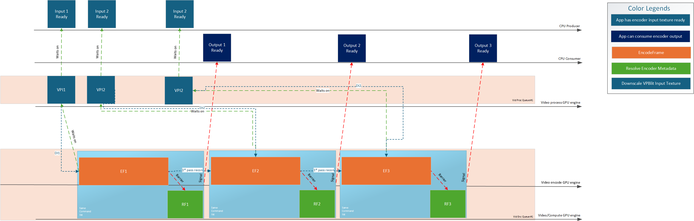
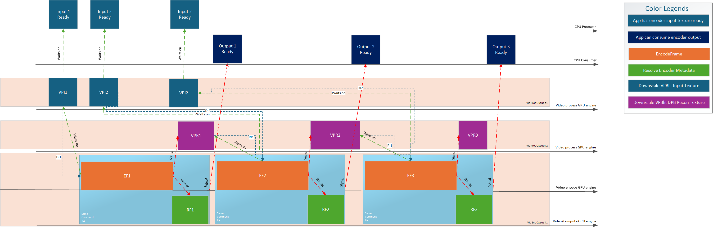
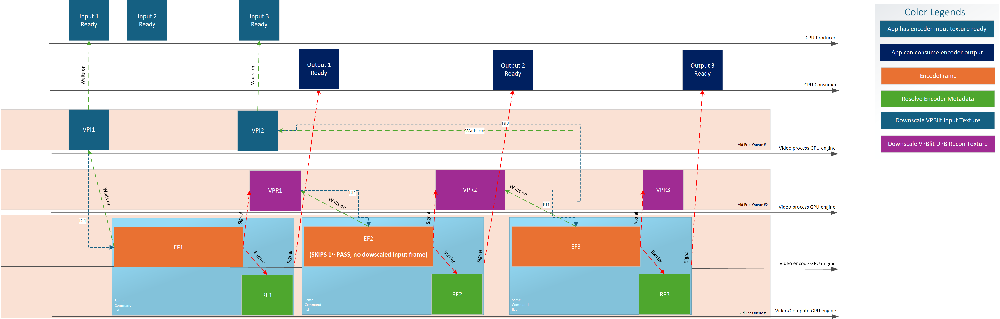

# 1. D3D12 Video Encoding lower resolution two pass

# 2. General considerations

This spec focuses on the points of extension where the existing D3D12 Video Encode API needs new structures to support lower resolution rate control two pass. The rest of the D3D12 Encode API will remain unmodified for this feature unless explicited in this spec.
The next sections detail the API and DDI for video encoding. In many cases, the DDI is extremely similar to the API. The structures and enumerations which are basically the same (differing solely in name convention) are not repeated in the this specification.

In this design, neither the driver not the D3D12 Encode API will perform any implicit downscaling. If using two pass with smaller dimensions than full resolution, the app must perform the downscaling separately (for example using D3D12 Video Processing API), and then passing the downscaled texture to the D3D12 Video Encode API.

# 3. Video Encoding API

## 3.1.0 Creation APIs

For using lower resolution two pass feature, the app must create a heap of type `ID3D12VideoEncoderHeap1`. For the legacy full resolution two pass, using `ID3D12VideoEncoderHeap` is enough as usual.

### ENUM: D3D12_VIDEO_ENCODER_HEAP_FLAGS

```C++
typedef enum D3D12_VIDEO_ENCODER_HEAP_FLAGS
{
    ...
    // New flags added in this spec
    D3D12_VIDEO_ENCODER_HEAP_FLAG_ALLOW_RATE_CONTROL_FRAME_ANALYSIS = ...
    
} D3D12_VIDEO_ENCODER_HEAP_FLAGS;
```

*D3D12_VIDEO_ENCODER_HEAP_FLAG_ALLOW_RATE_CONTROL_FRAME_ANALYSIS*

Indicates to the driver that two pass will be used with the associated `ID3D12VideoEncoderHeap1`.

> The driver uses this flag to know that it must allocate and initialize (if any) the internal state required for storing two pass context in this object.

### STRUCT: D3D12_VIDEO_ENCODER_HEAP_DESC1

```C++
typedef struct D3D12_VIDEO_ENCODER_HEAP_DESC1
{
    ...  
    // New members added in this spec
    UINT Pow2DownscaleFactor;
} D3D12_VIDEO_ENCODER_HEAP_DESC1;
```

*Pow2DownscaleFactor*

When `D3D12_VIDEO_ENCODER_HEAP_FLAG_ALLOW_RATE_CONTROL_FRAME_ANALYSIS` set, indicates to the driver the downscaling factor for the 1st pass.

> Please note that `D3D12_VIDEO_ENCODER_SUPPORT_FLAG_RESOLUTION_RECONFIGURATION_AVAILABLE` is supported, `Pow2DownscaleFactor` applies **to all possible resolutions that can be dynamically switched between/used with this ID3D12VideoEncoderHeap1, listed in** `D3D12_VIDEO_ENCODER_HEAP_DESC1.pResolutionList`. When dynamically switching between resolutions in `pResolutionList`, the 1st pass lower resolution is also adjusted accordingly.
The driver can reject supporting `D3D12_VIDEO_ENCODER_SUPPORT_FLAG_RESOLUTION_RECONFIGURATION_AVAILABLE` specifically when `D3D12_FEATURE_DATA_VIDEO_ENCODER_SUPPORT2.FrameAnalysis.Enabled = TRUE`.

### Interface: ID3D12VideoEncoderHeap1

```C++
interface ID3D12VideoEncoderHeap1
    : ID3D12VideoEncoderHeap
{
    ...
    // new definitions added in this spec
    UINT GetPow2DownscaleFactor(); 
}
```

*GetPow2DownscaleFactor*

When the `ID3D12VideoEncoderHeap1` object was created with `D3D12_VIDEO_ENCODER_HEAP_FLAG_ALLOW_RATE_CONTROL_FRAME_ANALYSIS` indicates the value of `Pow2DownscaleFactor` used at creation. Zero otherwise.

### Interface: ID3D12VideoDeviceXXX

```C++
interface ID3D12VideoDeviceXXX
    : ID3D12VideoDeviceLast
{
    HRESULT CreateVideoEncoderHeap1(
        [annotation("_In_")] const D3D12_VIDEO_ENCODER_HEAP_DESC1* pDesc,
        [annotation("_In_")] REFIID riid, // Expected: IID_ID3D12VideoEncoderHeap1,
        [annotation("_COM_Outptr_")] void** ppVideoEncoderHeap);
}

```

## 3.1.1 Feature support APIs

### ENUM:  D3D12_FEATURE_VIDEO

```C++
typedef enum D3D12_FEATURE_VIDEO
{
    ...
    D3D12_FEATURE_VIDEO_ENCODER_HEAP_SIZE1 = ...,
    D3D12_FEATURE_VIDEO_ENCODER_SUPPORT2 = ...,
    D3D12_FEATURE_VIDEO_ENCODER_RATE_CONTROL_FRAME_ANALYSIS = ...,
} D3D12_FEATURE_VIDEO;
```

### STRUCT: D3D12_FEATURE_DATA_VIDEO_ENCODER_HEAP_SIZE1

```C++
// D3D12_FEATURE_VIDEO_ENCODER_HEAP_SIZE1
typedef struct D3D12_FEATURE_DATA_VIDEO_ENCODER_HEAP_SIZE1 {
  D3D12_VIDEO_ENCODER_HEAP_DESC1 HeapDesc; // input
  ... // rest of D3D12_FEATURE_DATA_VIDEO_ENCODER_HEAP_SIZE
} D3D12_FEATURE_DATA_VIDEO_ENCODER_HEAP_SIZE1;
```

Redefines `D3D12_FEATURE_DATA_VIDEO_ENCODER_HEAP_SIZE` by passing `D3D12_VIDEO_ENCODER_HEAP_DESC1` instead of `D3D12_VIDEO_ENCODER_HEAP_DESC`.

### 3.1.27. STRUCT: D3D12_VIDEO_ENCODER_FRAME_ANALYSIS_FRAME_TYPE_FLAGS
```C++
typedef enum D3D12_VIDEO_ENCODER_FRAME_ANALYSIS_FRAME_TYPE_FLAGS {
    D3D12_VIDEO_ENCODER_FRAME_ANALYSIS_FRAME_TYPE_FLAG_NONE = 0x0,
    D3D12_VIDEO_ENCODER_FRAME_ANALYSIS_FRAME_TYPE_FLAG_INTRACODED_FRAME = 0x1,
    D3D12_VIDEO_ENCODER_FRAME_ANALYSIS_FRAME_TYPE_FLAG_UNIDIR_INTER_FRAME = 0x2,
    D3D12_VIDEO_ENCODER_FRAME_ANALYSIS_FRAME_TYPE_FLAG_BIDIR_INTER_FRAME = 0x4,
} D3D12_VIDEO_ENCODER_FRAME_ANALYSIS_FRAME_TYPE_FLAGS;
```

### STRUCT: D3D12_FEATURE_DATA_VIDEO_ENCODER_RESOLUTION_SUPPORT_FRAME_ANALYSIS

Defines the reported support for `FrameAnalysis` as output for `D3D12_FEATURE_DATA_VIDEO_ENCODER_RESOLUTION_SUPPORT_LIMITS1`.

```C++
typedef struct D3D12_FEATURE_DATA_VIDEO_ENCODER_RESOLUTION_SUPPORT_FRAME_ANALYSIS
{
    D3D12_VIDEO_ENCODER_RATE_CONTROL_FRAME_ANALYSIS_SUPPORT_FLAGS SupportFlags;    // output
} D3D12_FEATURE_DATA_VIDEO_ENCODER_RESOLUTION_SUPPORT_FRAME_ANALYSIS;
```

### STRUCT: D3D12_FEATURE_DATA_VIDEO_ENCODER_RESOLUTION_SUPPORT_LIMITS1

Adds the new reported support structs defined above to be reportable by the driver per-resolution in `D3D12_FEATURE_DATA_VIDEO_ENCODER_SUPPORT2`.

```C++
typedef struct D3D12_FEATURE_DATA_VIDEO_ENCODER_RESOLUTION_SUPPORT_LIMITS1
{
    // D3D12_FEATURE_DATA_VIDEO_ENCODER_RESOLUTION_SUPPORT_LIMITS
    ...
    D3D12_FEATURE_DATA_VIDEO_ENCODER_RESOLUTION_SUPPORT_FRAME_ANALYSIS FrameAnalysis;
} D3D12_FEATURE_DATA_VIDEO_ENCODER_RESOLUTION_SUPPORT_LIMITS1;
```

**New members**

*FrameAnalysis*

Output parameter. Only reported when `D3D12_FEATURE_DATA_VIDEO_ENCODER_SUPPORT2.FrameAnalysis.Enabled == TRUE` and driver supports it. Zeroed memory otherwise.

### STRUCT: D3D12_VIDEO_ENCODER_FRAME_ANALYSIS_CONFIGURATION

```C++
typedef struct D3D12_VIDEO_ENCODER_FRAME_ANALYSIS_CONFIGURATION
{
    BOOL Enabled;
    UINT Pow2DownscaleFactor;
} D3D12_VIDEO_ENCODER_FRAME_ANALYSIS_CONFIGURATION;
```

### ENUM: D3D12_VIDEO_ENCODER_VALIDATION_FLAGS
```C++
typedef enum D3D12_VIDEO_ENCODER_VALIDATION_FLAGS
{
    ...
    D3D12_VIDEO_ENCODER_VALIDATION_FLAG_FRAME_ANALYSIS_NOT_SUPPORTED = 0x8000,
} D3D12_VIDEO_ENCODER_VALIDATION_FLAGS;
```

### STRUCT: D3D12_FEATURE_DATA_VIDEO_ENCODER_SUPPORT2

Extends `D3D12_FEATURE_DATA_VIDEO_ENCODER_SUPPORT2`, for the driver to be able to report support details when enabling the FrameAnalysis features of this spec in combination with the rest of the encode features. As usual, if the driver does not support a given combination with the new features, must report `D3D12_VIDEO_ENCODER_SUPPORT_FLAG_NONE` and specify in `D3D12_VIDEO_ENCODER_VALIDATION_FLAGS` the conflicting features.

This new query must behave exactly as `D3D12_FEATURE_VIDEO_ENCODER_SUPPORT1` semantics when the new input parameters features are not enabled.

```C++
// D3D12_FEATURE_VIDEO_ENCODER_SUPPORT2
typedef struct D3D12_FEATURE_DATA_VIDEO_ENCODER_SUPPORT2
{
    /*
     * Below params match existing D3D12_FEATURE_DATA_VIDEO_ENCODER_SUPPORT2 binary size
     * please note pResolutionDependentSupport type changes from D3D12_FEATURE_DATA_VIDEO_ENCODER_RESOLUTION_SUPPORT_LIMITS to 
       D3D12_FEATURE_DATA_VIDEO_ENCODER_RESOLUTION_SUPPORT_LIMITS1
    */

    UINT NodeIndex;
    D3D12_VIDEO_ENCODER_CODEC Codec;
    DXGI_FORMAT InputFormat;
    D3D12_VIDEO_ENCODER_CODEC_CONFIGURATION CodecConfiguration;
    D3D12_VIDEO_ENCODER_SEQUENCE_GOP_STRUCTURE CodecGopSequence;
    D3D12_VIDEO_ENCODER_RATE_CONTROL RateControl;
    D3D12_VIDEO_ENCODER_INTRA_REFRESH_MODE IntraRefresh;
    D3D12_VIDEO_ENCODER_FRAME_SUBREGION_LAYOUT_MODE SubregionFrameEncoding;
    UINT ResolutionsListCount;
    const D3D12_VIDEO_ENCODER_PICTURE_RESOLUTION_DESC* pResolutionList;
    UINT MaxReferenceFramesInDPB;
    D3D12_VIDEO_ENCODER_VALIDATION_FLAGS ValidationFlags;
    D3D12_VIDEO_ENCODER_SUPPORT_FLAGS SupportFlags;
    D3D12_VIDEO_ENCODER_PROFILE_DESC SuggestedProfile;
    D3D12_VIDEO_ENCODER_LEVEL_SETTING SuggestedLevel;
    [annotation("_Field_size_full_(ResolutionsListCount)")] D3D12_FEATURE_DATA_VIDEO_ENCODER_RESOLUTION_SUPPORT_LIMITS1* pResolutionDependentSupport;
    D3D12_VIDEO_ENCODER_PICTURE_CONTROL_SUBREGIONS_LAYOUT_DATA SubregionFrameEncodingData;
    UINT MaxQualityVsSpeed;
    D3D12_VIDEO_ENCODER_QPMAP_CONFIGURATION QPMap;
    D3D12_VIDEO_ENCODER_DIRTY_REGIONS_CONFIGURATION DirtyRegions;
    D3D12_VIDEO_ENCODER_MOTION_SEARCH_CONFIGURATION MotionSearch;

    /* Below are new arguments for D3D12_FEATURE_DATA_VIDEO_ENCODER_SUPPORT2 */
    D3D12_VIDEO_ENCODER_FRAME_ANALYSIS_CONFIGURATION FrameAnalysis; // input
} D3D12_FEATURE_DATA_VIDEO_ENCODER_SUPPORT2;
```

### ENUM: D3D12_VIDEO_ENCODER_SUPPORT_FLAGS

```C++
typedef enum D3D12_VIDEO_ENCODER_SUPPORT_FLAGS
{
    ...
    D3D12_VIDEO_ENCODER_SUPPORT_FLAG_RATE_CONTROL_FRAME_ANALYSIS_AVAILABLE 	= ...,
} D3D12_VIDEO_ENCODER_SUPPORT_FLAGS;
```

*D3D12_VIDEO_ENCODER_SUPPORT_FLAG_RATE_CONTROL_FRAME_ANALYSIS_AVAILABLE*

This flag already exists in the API and indicates support for rate control modes that involve frame analysis to optimize the bitrate usage at the cost of a slower performance. This two pass is currently done at full resolution from the `D3D12_VIDEO_ENCODER_ENCODEFRAME_INPUT_ARGUMENTS.pInputFrame` texture. On legacy encoder support queries without the `FrameAnalysis` input parameter to them, the reporting of this flag will continue to indicate support for full-resolution two pass.

When this flag is already reported by the driver, further support for performing two pass at lower resolutions can be queried in `D3D12_FEATURE_DATA_VIDEO_ENCODER_RATE_CONTROL_FRAME_ANALYSIS`.

### STRUCT: D3D12_FEATURE_DATA_VIDEO_ENCODER_RATE_CONTROL_FRAME_ANALYSIS

```C++
// D3D12_FEATURE_VIDEO_ENCODER_RATE_CONTROL_FRAME_ANALYSIS
typedef struct D3D12_FEATURE_DATA_VIDEO_ENCODER_RATE_CONTROL_FRAME_ANALYSIS
{
    UINT NodeIndex;                                                                             // input
    D3D12_VIDEO_ENCODER_CODEC Codec;                                                            // input
    D3D12_VIDEO_ENCODER_PROFILE_DESC Profile;                                                   // input
    D3D12_VIDEO_ENCODER_LEVEL_SETTING Level;                                                    // input
    DXGI_FORMAT InputFormat;                                                                    // input
    D3D12_VIDEO_ENCODER_PICTURE_RESOLUTION_DESC InputResolution;                                // input
    D3D12_VIDEO_ENCODER_CODEC_CONFIGURATION CodecConfiguration;                                 // input
    D3D12_VIDEO_ENCODER_FRAME_SUBREGION_LAYOUT_MODE SubregionFrameEncoding;                     // input
    D3D12_VIDEO_ENCODER_PICTURE_CONTROL_SUBREGIONS_LAYOUT_DATA SubregionFrameEncodingData;      // input
    D3D12_VIDEO_ENCODER_QPMAP_CONFIGURATION QPMap;                                              // input
    D3D12_VIDEO_ENCODER_DIRTY_REGIONS_CONFIGURATION DirtyRegions;                               // input
    D3D12_VIDEO_ENCODER_MOTION_SEARCH_CONFIGURATION MotionSearch;                               // input
    UINT Pow2DownscaleFactor;                                                                   // input
    D3D12_VIDEO_ENCODER_RATE_CONTROL_FRAME_ANALYSIS_SUPPORT_FLAGS SupportFlags;                 // output
} D3D12_FEATURE_DATA_VIDEO_ENCODER_RATE_CONTROL_FRAME_ANALYSIS;
```

*NodeIndex*

Input parameter, in multi-adapter operation, this indicates which physical adapter of the device this operation applies to.

*Codec*, *Profile*, *Level*, *InputFormat*, *InputResolution*, *CodecConfiguration*, *SubregionFrameEncoding*, *SubregionFrameEncodingData*, *QPMap*, *DirtyRegions*, *MotionSearch*

Input parameters to driver indicating context about other features being used in encode session where the frame analysis will be used.

*Pow2DownscaleFactor*

Input parameter. Indicates the downscaling ratio to be used for the two pass downscaled `ID3D12Resource` texture passed to the driver to perform two pass frame analysis on.

For simplicity and to keep certain format restrictions on planar formats like `DXGI_FORMAT_NV12`/`DXGI_FORMAT_P010` (e.g dimensions must be 2 aligned), etc we will require that `InputWidth`/`InputHeight` to always be exactly divisible by `2^Pow2DownscaleFactor`. The drivers must also enforce this by reporting no support in this cap where the division is not exact.

For example let `InputWidth`/`InputHeight` be the `D3D12_VIDEO_ENCODER_ENCODEFRAME_INPUT_ARGUMENTS.pInputFrame` dimensions:

| `Pow2DownscaleFactor` | `Two pass width` | `Two pass height` |
| -------- | -------- | -------- |
| `0` | `InputWidth` | `InputHeight` |
| `1` | `InputWidth / 2` | `InputHeight / 2` |
| `2` | `InputWidth / 4` | `InputHeight / 4` |
| `3` | `InputWidth / 8` | `InputHeight / 8` |
| `...` | `...` | `...` |
| `Pow2DownscaleFactor` | `InputWidth / (2^Pow2DownscaleFactor)` | `InputHeight / (2^Pow2DownscaleFactor)` |

*SupportFlags*

Output parameter. Indicates support for the given input parameters.

### ENUM:  D3D12_VIDEO_ENCODER_RATE_CONTROL_FRAME_ANALYSIS_SUPPORT_FLAGS

```C++
typedef enum D3D12_VIDEO_ENCODER_RATE_CONTROL_FRAME_ANALYSIS_SUPPORT_FLAGS
{
    D3D12_VIDEO_ENCODER_RATE_CONTROL_FRAME_ANALYSIS_SUPPORT_FLAG_NONE	= 0x0,
    D3D12_VIDEO_ENCODER_RATE_CONTROL_FRAME_ANALYSIS_SUPPORT_FLAG_INTRACODED_FRAME_SUPPORTED	= 0x1,
    D3D12_VIDEO_ENCODER_RATE_CONTROL_FRAME_ANALYSIS_SUPPORT_FLAG_UNIDIR_INTER_FRAME_SUPPORTED	= 0x2,
    D3D12_VIDEO_ENCODER_RATE_CONTROL_FRAME_ANALYSIS_SUPPORT_FLAG_BIDIR_INTER_FRAME_SUPPORTED	= 0x4,
    D3D12_VIDEO_ENCODER_RATE_CONTROL_FRAME_ANALYSIS_SUPPORT_FLAG_EXTERNAL_DPB_DOWNSCALING	= 0x8,
    D3D12_VIDEO_ENCODER_RATE_CONTROL_FRAME_ANALYSIS_SUPPORT_FLAG_DYNAMIC_1ST_PASS_SKIP	= 0x10,
    D3D12_VIDEO_ENCODER_RATE_CONTROL_FRAME_ANALYSIS_SUPPORT_FLAG_DYNAMIC_DOWNSCALE_FACTOR_CHANGE_KEY_FRAME	= 0x20,
} D3D12_VIDEO_ENCODER_RATE_CONTROL_FRAME_ANALYSIS_SUPPORT_FLAGS;
```

> Note: The 1st pass corresponds to the lower resolution and the 2nd pass corresponds to the full resolution.

> As the driver reports support for which individual frame types used in `EncodeFrame1` the app can set `D3D12_VIDEO_ENCODER_RATE_CONTROL_FLAG_ENABLE_FRAME_ANALYSIS`. When the frame type is not supported by the driver, the app must not enable it. In no-reconfiguration modes, this means the app will enable two-pass only _for all supported frame types_ (and unsupported types will always be disabled) during the encode session with that `ID3D12VideoEncoderHeap1`. For reconfiguration-allowed modes, this means the app will only be able to dynamically enable/disable the 1st pass on supported frame types (and unsupported types will always be disabled).

> Note: Changing `D3D12_VIDEO_ENCODER_RATE_CONTROL_FLAG_ENABLE_FRAME_ANALYSIS` between frames must not trigger the app to set `D3D12_VIDEO_ENCODER_SEQUENCE_CONTROL_FLAG_RATE_CONTROL_CHANGE` (or encoder recreation) if no other rate control change happened.

*D3D12_VIDEO_ENCODER_RATE_CONTROL_FRAME_ANALYSIS_SUPPORT_FLAG_NONE*

Indicates no support.

*D3D12_VIDEO_ENCODER_RATE_CONTROL_FRAME_ANALYSIS_SUPPORT_FLAG_INTRACODED_FRAME_SUPPORTED*

Indicates support for two pass frame analysis for intra coded frame types. 

*D3D12_VIDEO_ENCODER_RATE_CONTROL_FRAME_ANALYSIS_SUPPORT_FLAG_UNIDIR_INTER_FRAME_SUPPORTED*

Indicates support for two pass frame analysis for inter coded unidirectional frame types.

*D3D12_VIDEO_ENCODER_RATE_CONTROL_FRAME_ANALYSIS_SUPPORT_FLAG_BIDIR_INTER_FRAME_SUPPORTED*

Indicates support for two pass frame analysis for inter coded bidirectional frame types.

> When `D3D12_VIDEO_ENCODER_SUPPORT_FLAG_RATE_CONTROL_FRAME_ANALYSIS_AVAILABLE` is supported, this flag must also be supported when querying `D3D12_FEATURE_VIDEO_ENCODER_RATE_CONTROL_FRAME_ANALYSIS` for `Pow2DownscaleFactor = 0`.

*D3D12_VIDEO_ENCODER_RATE_CONTROL_FRAME_ANALYSIS_SUPPORT_FLAG_EXTERNAL_DPB_DOWNSCALING*

Indicates support for the app to optionally skip the reconstructed picture output writing for the 1st pass and externally downscale the `D3D12_VIDEO_ENCODER_ENCODEFRAME_OUTPUT_ARGUMENTS.ReconstructedPicture` texture to generate the lower resolution corresponding DPB textures.
Using external downscaling may provide better quality at a higher performance cost, so apps can choose this as a trade-off.

> When skipping the 1st pass, `pDownscaledFrame` is not necessary and `NULL` can be passed.

> The external downscaling is explicitly kept separate from the `EncodeFrame` operation to give app more flexibility on how to perform the downscaling and how to synchronize it with the rest of the D3D12 workloads.
As at times, video processing and video encoding happen on different HW engines, keeping this separate avoids implicit scheduling delays by having two engines tied into a single D3D12 command.

> Please note that to support this flag, at least one of these two must also be supported: `D3D12_VIDEO_ENCODER_SUPPORT_FLAG_READABLE_RECONSTRUCTED_PICTURE_LAYOUT_AVAILABLE` for readable reconstructed pictures or `D3D12_VIDEO_SCALE_SUPPORT_FLAG_DPB_RESOURCES` to support VPBlit scaling of resources with `D3D12_RESOURCE_FLAG_VIDEO_ENCODE_REFERENCE_ONLY`.

**Remarks**

When this flag **IS NOT** supported:

 - Enabling `D3D12_VIDEO_ENCODER_RATE_CONTROL_FLAG_ENABLE_FRAME_ANALYSIS` **WITHOUT** `D3D12_VIDEO_ENCODER_PICTURE_CONTROL_FLAG_USED_AS_REFERENCE_PICTURE`
    -  Both `D3D12_VIDEO_ENCODER_ENCODEFRAME_OUTPUT_ARGUMENTS.ReconstructedPicture`and `D3D12_VIDEO_ENCODER_ENCODEFRAME_OUTPUT_ARGUMENTS1.FrameAnalysisReconstructedPicture` are set to `NULL` as there is no reconstructed picture output on neither pass.
 - Enabling `D3D12_VIDEO_ENCODER_RATE_CONTROL_FLAG_ENABLE_FRAME_ANALYSIS` **WITH** `D3D12_VIDEO_ENCODER_PICTURE_CONTROL_FLAG_USED_AS_REFERENCE_PICTURE`
    -  Both `D3D12_VIDEO_ENCODER_ENCODEFRAME_OUTPUT_ARGUMENTS.ReconstructedPicture`and `D3D12_VIDEO_ENCODER_ENCODEFRAME_OUTPUT_ARGUMENTS1.FrameAnalysisReconstructedPicture` must contain a valid allocation as there are reconstructed picture outputs on both passes.

When this flag **IS** supported:

 - Enabling `D3D12_VIDEO_ENCODER_RATE_CONTROL_FLAG_ENABLE_FRAME_ANALYSIS` **WITHOUT** `D3D12_VIDEO_ENCODER_PICTURE_CONTROL_FLAG_USED_AS_REFERENCE_PICTURE`
    -  Both `D3D12_VIDEO_ENCODER_ENCODEFRAME_OUTPUT_ARGUMENTS.ReconstructedPicture`and `D3D12_VIDEO_ENCODER_ENCODEFRAME_OUTPUT_ARGUMENTS1.FrameAnalysisReconstructedPicture` are set to `NULL` as there is no reconstructed picture output on either pass.
 - Enabling `D3D12_VIDEO_ENCODER_RATE_CONTROL_FLAG_ENABLE_FRAME_ANALYSIS` **WITH** `D3D12_VIDEO_ENCODER_PICTURE_CONTROL_FLAG_USED_AS_REFERENCE_PICTURE`
    - `D3D12_VIDEO_ENCODER_ENCODEFRAME_OUTPUT_ARGUMENTS.ReconstructedPicture` must contain a valid allocation as there is a reconstructed picture outputs on the 2nd pass.
    - The app can decide if `D3D12_VIDEO_ENCODER_ENCODEFRAME_OUTPUT_ARGUMENTS1.FrameAnalysisReconstructedPicture` contains an allocation or `NULL`.
        - In case of this being set to `NULL`, the driver will perform the two passes but not write (skip the reconstructed picture generation for) the 1st pass reconstructed picture output.
        - This is intended for the cases where the app will externally generate the 1st pass reconstructed picture by externally downscaling the 2nd pass `D3D12_VIDEO_ENCODER_ENCODEFRAME_OUTPUT_ARGUMENTS.ReconstructedPicture`.

*D3D12_VIDEO_ENCODER_RATE_CONTROL_FRAME_ANALYSIS_SUPPORT_FLAG_DYNAMIC_1ST_PASS_SKIP*

Indicates support for dynamically toggling `D3D12_VIDEO_ENCODER_RATE_CONTROL_FLAG_ENABLE_FRAME_ANALYSIS` on an encode session associated with an `ID3D12VideoEncoderHeap1` with two pass enabled.
Disabling `D3D12_VIDEO_ENCODER_RATE_CONTROL_FLAG_ENABLE_FRAME_ANALYSIS` will make the driver skip the 1st (lower resolution) pass for the associated `EncodeFrame1` command.

> Note: Changing `D3D12_VIDEO_ENCODER_RATE_CONTROL_FLAG_ENABLE_FRAME_ANALYSIS` between frames must not trigger the app to set `D3D12_VIDEO_ENCODER_SEQUENCE_CONTROL_FLAG_RATE_CONTROL_CHANGE` (or encoder recreation) if no other rate control change happened.

> Please note that if `D3D12_VIDEO_ENCODER_PICTURE_CONTROL_FLAG_USED_AS_REFERENCE_PICTURE` is set for a `EncodeFrame1` command that skips 1st pass, supporting
 `D3D12_VIDEO_ENCODER_RATE_CONTROL_FRAME_ANALYSIS_SUPPORT_FLAG_DYNAMIC_1ST_PASS_SKIP` requires the driver to also support `D3D12_VIDEO_ENCODER_RATE_CONTROL_FRAME_ANALYSIS_SUPPORT_FLAG_EXTERNAL_DPB_DOWNSCALING` (and `D3D12_VIDEO_SCALE_SUPPORT_FLAG_DPB_RESOURCES` if necessary for opaque reconstructed pictures) as the app must externally downscale the full resolution output reconstructed picture to keep the DPB mirrored between the two resolution streams.

*D3D12_VIDEO_ENCODER_RATE_CONTROL_FRAME_ANALYSIS_SUPPORT_FLAG_DYNAMIC_DOWNSCALE_FACTOR_CHANGE_KEY_FRAME*

Indicates support for changing the `Pow2DownscaleFactor` of the encode session associated `ID3D12VideoEncoderHeap1`. Such change requires the app to re-create the `ID3D12VideoEncoderHeap1` object using the new `Pow2DownscaleFactor` parameter and at the moment can only be done at KEY/IDR frames that clear the DPB.

> Note: When switching from lower resolution (`Pow2DownscaleFactor > 0`) to full resolution (`Pow2DownscaleFactor == 0`), the downscaled parameters that are sent for lower resolution (downscaled input frame, downscaled input reference pictures, downscaled output reconstructed picture) are no longer sent starting the key frame of full resolution, and the driver must use their full resolution associated parameters(since they will be the same objects as they're the same resolution). Conversely, when switching from full resolution (`Pow2DownscaleFactor == 0`) to lower resolution (`Pow2DownscaleFactor > 0`), the downscaled parameters that were not being sent for full resolution, must start being sent down starting from the key frame with the lower resolution two pass enabled.

## 3.1.2 Feature usage APIs

### Enabling two pass for an EncodeFrame command

### ENUM: D3D12_VIDEO_ENCODER_RATE_CONTROL_FLAGS

```C++
typedef enum D3D12_VIDEO_ENCODER_RATE_CONTROL_FLAGS
{
    ...
    D3D12_VIDEO_ENCODER_RATE_CONTROL_FLAG_ENABLE_FRAME_ANALYSIS	= 0x2,
    ...
} D3D12_VIDEO_ENCODER_RATE_CONTROL_FLAGS;
```

*D3D12_VIDEO_ENCODER_RATE_CONTROL_FLAG_ENABLE_FRAME_ANALYSIS*

This flag already exists in the API and enables the rate control algorithm to optimize bitrate usage by selecting QP values based on statistics collected by doing frame analysis on a 1st pass (at full resolution). 

When additional support reported in `D3D12_FEATURE_VIDEO_ENCODER_RATE_CONTROL_FRAME_ANALYSIS` the app can use `D3D12_VIDEO_ENCODER_RATE_CONTROL_FLAG_ENABLE_FRAME_ANALYSIS` in combination with `D3D12_VIDEO_ENCODER_HEAP_DESC1.Pow2DownscaleFactor` to determine the resolution of the 1st pass.

### STRUCT: D3D12_VIDEO_ENCODER_ENCODEFRAME_OUTPUT_ARGUMENTS1
```C++
typedef struct D3D12_VIDEO_ENCODER_ENCODEFRAME_OUTPUT_ARGUMENTS1
{
    ...
    D3D12_VIDEO_ENCODER_RECONSTRUCTED_PICTURE FrameAnalysisReconstructedPicture;
} D3D12_VIDEO_ENCODER_ENCODEFRAME_OUTPUT_ARGUMENTS1;
```

*FrameAnalysisReconstructedPicture*

When non `NULL` parameter passed (See `D3D12_VIDEO_ENCODER_RATE_CONTROL_FRAME_ANALYSIS_SUPPORT_FLAG_EXTERNAL_DPB_DOWNSCALING`), the driver writes the 1st pass (if enabled for this frame) reconstructed picture output in this passed allocation.

> Please note that the hardware **must not** generate this lower resolution reconstructed picture with implicit additional downscaling HW kick-offs (e.g VPBlit engine) from the full resolution reconstructed picture, but just output the 1st pass output reconstructed picture as-is.

### STRUCT: D3D12_VIDEO_ENCODER_FRAME_ANALYSIS
```C++
typedef struct D3D12_VIDEO_ENCODER_FRAME_ANALYSIS
{
    ID3D12Resource *pDownscaledFrame;
    UINT64 Subresource;
    D3D12_VIDEO_ENCODE_REFERENCE_FRAMES DownscaledReferences;
} D3D12_VIDEO_ENCODER_FRAME_ANALYSIS;
```

**Parameters**

*pDownscaledFrame*

Downscaled input texture to perform two pass frame analysis. Downscaling factor indicated by `D3D12_VIDEO_ENCODER_HEAP_DESC1.Pow2DownscaleFactor`.

*Subresource*

Subresource index for `pDownscaledFrame`.

*DownscaledReferences*

Downscaled reference frame textures to perform two pass frame analysis. Downscaling factor indicated by `D3D12_VIDEO_ENCODER_HEAP_DESC1.Pow2DownscaleFactor`.

> Please note the DPB snapshot and reference lists must be always mirrored for the parallel streams (full and downscaled resolution passes). `D3D12_VIDEO_ENCODER_FRAME_ANALYSIS.DownscaledReferences` and `D3D12_VIDEO_ENCODER_PICTURE_CONTROL_DESC1.ReferenceFrames` must always have entries mirroring the same frames in the DPB, just in different resolutions.

### STRUCT: D3D12_VIDEO_ENCODER_PICTURE_CONTROL_DESC1
```C++
typedef struct D3D12_VIDEO_ENCODER_PICTURE_CONTROL_DESC1
{
    UINT IntraRefreshFrameIndex;
    D3D12_VIDEO_ENCODER_PICTURE_CONTROL_FLAGS Flags;
    D3D12_VIDEO_ENCODER_PICTURE_CONTROL_CODEC_DATA1 PictureControlCodecData;
    D3D12_VIDEO_ENCODE_REFERENCE_FRAMES ReferenceFrames;
    D3D12_VIDEO_ENCODER_FRAME_MOTION_VECTORS MotionVectors;
    D3D12_VIDEO_ENCODER_DIRTY_REGIONS DirtyRects;
    D3D12_VIDEO_ENCODER_QUANTIZATION_OPAQUE_MAP QuantizationTextureMap;
    D3D12_VIDEO_ENCODER_FRAME_ANALYSIS FrameAnalysis;
} D3D12_VIDEO_ENCODER_PICTURE_CONTROL_DESC1;
```

Adds `FrameAnalysis` at the end respect from `D3D12_VIDEO_ENCODER_PICTURE_CONTROL_DESC`

### STRUCT: D3D12_VIDEO_ENCODER_ENCODEFRAME_INPUT_ARGUMENTS1
```C++
typedef struct D3D12_VIDEO_ENCODER_ENCODEFRAME_INPUT_ARGUMENTS1
{
    D3D12_VIDEO_ENCODER_SEQUENCE_CONTROL_DESC SequenceControlDesc;
    D3D12_VIDEO_ENCODER_PICTURE_CONTROL_DESC1 PictureControlDesc;
    ID3D12Resource *pInputFrame;
    UINT64 InputFrameSubresource;
    UINT64 CurrentFrameBitstreamMetadataSize;
} D3D12_VIDEO_ENCODER_ENCODEFRAME_INPUT_ARGUMENTS1;
```

Changes `D3D12_VIDEO_ENCODER_PICTURE_CONTROL_DESC1` to `D3D12_VIDEO_ENCODER_PICTURE_CONTROL_DESC1` respect from `D3D12_VIDEO_ENCODER_ENCODEFRAME_INPUT_ARGUMENTS1`.

### METHOD: ID3D12VideoEncodeCommandList4::EncodeFrame1

```C++
VOID EncodeFrame1(
    [annotation("_In_")] ID3D12VideoEncoder* pEncoder,
    [annotation("_In_")] ID3D12VideoEncoderHeap1 *pHeap;
    [annotation("_In_")] const D3D12_VIDEO_ENCODER_ENCODEFRAME_INPUT_ARGUMENTS1 *pInputArguments
    [annotation("_In_")] const D3D12_VIDEO_ENCODER_ENCODEFRAME_OUTPUT_ARGUMENTS1 *pOutputArguments)
```

Changes `D3D12_VIDEO_ENCODER_ENCODEFRAME_INPUT_ARGUMENTS1` to `D3D12_VIDEO_ENCODER_ENCODEFRAME_INPUT_ARGUMENTS1` and `ID3D12VideoEncoderHeap` to `ID3D12VideoEncoderHeap1` respect from `EncodeFrame1`.

**Remarks**

- As for D3D12 full resolution two pass, the D3D12 caller will execute { `EncodeFrame1` + `ResolveEncoderOutputMetadata` } only once per frame (passing both the full resolution + downscaled textures), then the driver can perform multiple **encode** HW kick offs per pass if necessary, from a single `pfnEncodeFrame` DDI call.

- The following textures must have the same dimensions:
    - The lower resolution input frame
    - The **optional** (See `D3D12_VIDEO_ENCODER_RATE_CONTROL_FRAME_ANALYSIS_SUPPORT_FLAG_EXTERNAL_DPB_DOWNSCALING`) output lower resolution output reconstructed picture
    - The lower resolution reference pictures
- If the full resolution DPB allocations require `D3D12_RESOURCE_FLAG_VIDEO_ENCODE_REFERENCE_ONLY`, the same applies to any lower resolution DPB allocations.
- `D3D12_VIDEO_ENCODER_ENCODEFRAME_INPUT_ARGUMENTS.pInputFrame` dimensions must be exactly divisible by `2^D3D12_VIDEO_ENCODER_HEAP_DESC1.Pow2DownscaleFactor`.
- As `D3D12_FEATURE_DATA_VIDEO_ENCODER_OUTPUT_RESOLUTION.ResolutionWidthMultipleRequirement/ResolutionHeightMultipleRequirement` defines the allocation alignment requirements for `D3D12_VIDEO_ENCODER_ENCODEFRAME_INPUT_ARGUMENTS.pInputFrame`, these restrictions also apply to the downscaled stream allocations (e.g input frame, DPB reconstructed pictures, etc). 
    - For example: If `D3D12_FEATURE_DATA_VIDEO_ENCODER_OUTPUT_RESOLUTION` requires `16` alignment for width and height and the _original_ input frame is 1280x720 (already satisfies `D3D12_FEATURE_DATA_VIDEO_ENCODER_OUTPUT_RESOLUTION` 16 alignment) and trying to do `Pow2DownscaleFactor=2`, then the dimensions for the downscaled textures must be Width = align(16, 1280/4) = align(16, 320) = 320 (already 16 aligned) and Height = align(16, 720/4) = align(16, 180) = 192 (padding until 16 aligned).
    - The "padding" pixels resulting of the bigger allocation in the edges of the resource are ignored by app and driver, the actual region of interest will be exactly `Pow2DownscaleFactor=2` of (1280x720) = (320x180). In other words, the downscaling operation must place the downscaled image in the (0,0) to (320,180) pixels region, ignoring the additional pixels on the right and bottom edges.


### Diagram: Feature usage with 1st pass output textures (no external reconstructed picture downscaling)

This diagram explains at a high level a possible way an app could use D3D12 Video Processing API and D3D12 Video Encode API to drive and [synchronize the different engines](https://learn.microsoft.com/en-us/windows/win32/direct3d12/user-mode-heap-synchronization).

> In this example there is no external downscaling of reconstructed pictures, the app uses D3D12_VIDEO_ENCODER_ENCODEFRAME_OUTPUT_ARGUMENTS1.FrameAnalysisReconstructedPicture driver output of the current frame to place in the DPB for future frames.

Please note:

0. [_Initialization_] Create `ID3D12VideoEncoderHeap1` indicating `Pow2DownscaleFactor` and `D3D12_VIDEO_ENCODER_HEAP_FLAG_ALLOW_RATE_CONTROL_FRAME_ANALYSIS`.
1. [Frame 1] Once the app has a new `ID3D12Resource` input frame ready for encoding with two pass, it can signal (using CPU-GPU or GPU-GPU `ID3D12Fence`) a `Video Process Queue #1` to begin the downscaling operation.
2. [Frame 1] Once the downscaling operation from (1) finishes, it can signal (GPU to GPU) for the `EFn` command to begin.
3. [Frame 1] Once `RFn` is ready, the app is notified that that frame is completed (including slice/tile data + frame stats).
    - Note that [D3D12_Video_Encoding_SubregionNotification](D3D12_Video_Encoding_SubregionNotification.md) can be used to get slices/tiles earlier in the `CPU Consumer` timeline.
4. [Future frames] Once the next input frame is available, same process as for `Frame 1` explained above happens. The app will be able to track a parallel DPB array of textures / texture array of downsampled reconstructed pictured that mirrors the full resolution DPB to pass to the subsequent `EFn` calls. The downscaled DPB textures are tracked/evicted along their full resolution DPB texture counterpart.
    - `Input Ready N` is assumed to have no dependencies with previous encode outputs (e.g stats) in this diagram, with the frames flowing in from another pipeline upstream. Any additional delays in `Input Ready N` would also delay the begining of the `VPIn` command (and the subsequent delay of the tasks depending on it).



# 4. Video Processing API

The following APIs are extended to support external downscaling of DPB reconstructed pictures for supporting `D3D12_VIDEO_ENCODER_RATE_CONTROL_FRAME_ANALYSIS_SUPPORT_FLAG_EXTERNAL_DPB_DOWNSCALING` when driver requires `D3D12_RESOURCE_FLAG_VIDEO_ENCODE_REFERENCE_ONLY`.

## 4.1.1 Feature support

### ENUM: D3D12_VIDEO_ENCODER_RATE_CONTROL_FLAGS

```C++
typedef enum D3D12_VIDEO_SCALE_SUPPORT_FLAGS
{
    ...
    D3D12_VIDEO_SCALE_SUPPORT_FLAG_DPB_RESOURCES = ...
} D3D12_VIDEO_SCALE_SUPPORT_FLAGS;
```

*D3D12_VIDEO_SCALE_SUPPORT_FLAG_DPB_RESOURCES*

Indicates support for scaling resources with `D3D12_RESOURCE_FLAG_VIDEO_ENCODE_REFERENCE_ONLY`. If the DPB resources don't have this restriction, the downscaling can be performed as it was any `ID3D12Resource` (e.g with shaders, CPU, usual video processing APIs etc).

## 4.1.2 Feature usage

**Remarks**

The following rules will be enforced in `ID3D12VideoProcessCommandList::ProcessFrames` for this feature:

- `D3D12_VIDEO_SCALE_SUPPORT_FLAG_DPB_RESOURCES` needs to be reported for the command arguments passed to `ProcessFrames`.
- Only 1 input stream with `D3D12_RESOURCE_FLAG_VIDEO_ENCODE_REFERENCE_ONLY` passed to `ProcessFrames` (e.g no blending)
- The `ID3D12Resource` objects for input/output streams must have the same `D3D12_RESOURCE_DESC` properties:
    - `Dimension`
    - `MipLevels`
    - `Format`
    - Both must have `D3D12_RESOURCE_FLAG_VIDEO_ENCODE_REFERENCE_ONLY` in `Flags`
- `D3D12_VIDEO_PROCESS_OUTPUT_STREAM_ARGUMENTS.TargetRectangle` must cover the entire `D3D12_VIDEO_PROCESS_OUTPUT_STREAM` texture dimensions. (e.g no additional transforms)
- Restrictions to other transforms in `D3D12_VIDEO_PROCESS_INPUT_STREAM_ARGUMENTS`:
    - `D3D12_VIDEO_PROCESS_TRANSFORM` must contain `D3D12_VIDEO_PROCESS_ORIENTATION_DEFAULT`
    - `SourceRectangle` and `DestinationRectangle` must cover the entire `D3D12_VIDEO_PROCESS_INPUT_STREAM` texture dimensions.
    - `D3D12_VIDEO_PROCESS_INPUT_STREAM_FLAGS`, `D3D12_VIDEO_PROCESS_INPUT_STREAM_RATE` are ignored by the driver.
    - `FilterLevels` is ignored (since `D3D12_VIDEO_PROCESS_FILTER_FLAGS` are restricted in `ID3D12VideoProcessor` objects to use this feature)
    - `D3D12_VIDEO_PROCESS_ALPHA_BLENDING.Enabled` must be `FALSE`.

- Restrictions to the `ID3D12VideoProcessor` used in `ID3D12VideoProcessCommandList::ProcessFrames` for this feature (viewed from `CreateVideoProcessor` params):
    - `D3D12_VIDEO_PROCESS_OUTPUT_STREAM_DESC.AlphaFillMode` must be `D3D12_VIDEO_PROCESS_ALPHA_FILL_MODE_OPAQUE`
    - `D3D12_VIDEO_PROCESS_INPUT_STREAM_DESC.EnableOrientation` must be `FALSE`.
    - `D3D12_VIDEO_PROCESS_INPUT_STREAM_DESC.FilterFlags` must be `D3D12_VIDEO_PROCESS_FILTER_FLAG_NONE`.
    - `D3D12_VIDEO_PROCESS_INPUT_STREAM_DESC.DeinterlaceMode` must be `D3D12_VIDEO_PROCESS_DEINTERLACE_FLAG_NONE`.
    - `D3D12_VIDEO_PROCESS_INPUT_STREAM_DESC.EnableAlphaBlending` must be `FALSE`.
    - `D3D12_VIDEO_PROCESS_INPUT_STREAM_DESC.LumaKey.Enabled` must be `FALSE`.
    - `D3D12_VIDEO_PROCESS_INPUT_STREAM_DESC.EnableAutoProcessing` must be `FALSE`.

- For drivers requiring texture array DPB allocations, `ID3D12VideoProcessCommandList::ProcessFrames` will allow the input/output streams to be downscaled from `{RegularSizeDPBTexArray + RegularSizeSubres}` into `{DownscaledDPBTexArray + DownscaledSubres}` in `D3D12_VIDEO_PROCESS_INPUT_STREAM` and `D3D12_VIDEO_PROCESS_OUTPUT_STREAM` arguments respectively.

### Diagram: Feature usage with externally downscaled reconstructed picture textures

This diagram explains at a high level a possible way an app could use D3D12 Video Processing API and D3D12 Video Encode API to drive and [synchronize the different engines](https://learn.microsoft.com/en-us/windows/win32/direct3d12/user-mode-heap-synchronization).

> In this example, the app DOES NOT use `D3D12_VIDEO_ENCODER_ENCODEFRAME_OUTPUT_ARGUMENTS1.FrameAnalysisReconstructedPicture`, and can always pass NULL on this param. The app instead performs external downscaling of the full resolution driver output `D3D12_VIDEO_ENCODER_ENCODEFRAME_OUTPUT_ARGUMENTS1.ReconstructedPicture` and uses the result to track the lower resolution DPB mirrored with the full resolution DPB.

Please note:

0. [_CheckFeatureSupport_] Make sure the driver supports `D3D12_VIDEO_ENCODER_RATE_CONTROL_FRAME_ANALYSIS_SUPPORT_FLAG_EXTERNAL_DPB_DOWNSCALING` and one of the following:
    - `D3D12_VIDEO_ENCODER_SUPPORT_FLAG_READABLE_RECONSTRUCTED_PICTURE_LAYOUT_AVAILABLE` for external downscalingn of readable reconstructed pictures
    - `D3D12_VIDEO_SCALE_SUPPORT_FLAG_DPB_RESOURCES` for external VPBlit scaling for resources with `D3D12_RESOURCE_FLAG_VIDEO_ENCODE_REFERENCE_ONLY`.
0. [_Initialization_] Create `ID3D12VideoEncoderHeap1` indicating `Pow2DownscaleFactor` and `D3D12_VIDEO_ENCODER_HEAP_FLAG_ALLOW_RATE_CONTROL_FRAME_ANALYSIS`.
1. [Frame 1] Once the app has a new `ID3D12Resource` input frame ready for encoding with two pass, it can signal (using CPU-GPU or GPU-GPU `ID3D12Fence`) a `Video Process Queue #1` to begin the downscaling operation.
2. [Frame 1] Once the downscaling operation from (1) finishes, it can signal (GPU to GPU) for the `EFn` command to begin.
3. [Frame 1] Once the `EFn` command is finished, a GPU-GPU signal triggers `VPRn` to downscale the output reconstructed picture output from `EFn`.
4. [Frame 1] Once `RFn` is ready, the app is notified that that frame is completed (including slice/tile data + frame stats).
    - Note that [D3D12_Video_Encoding_SubregionNotification](D3D12_Video_Encoding_SubregionNotification.md) can be used to get slices/tiles earlier in the `CPU Consumer` timeline.
5. [Future frames] Once the next input frame is available, same process as for `Frame 1` explained above happens, but there is an additional dependency to `EFn`, the downscaled reference picture from the previous frame (if used as reference and placed in the full resolution DPB). As a result, there's an additional waiting dependency on `EFn` with `VPR n-1`. The app will be able to track a parallel DPB array of textures / texture array of downsampled reconstructed pictured that mirrors the full resolution DPB to pass to the subsequent `EFn` calls. The downscaled DPB textures are tracked/evicted along their full resolution DPB texture counterpart.
    - Please note that `VPR2` takes longer to execute than `VPR1` in the diagram to show how such delays would add latency between `EFn` executions.
    - Similarly, `Input Ready N` is assumed to have no dependencies with previous encode outputs (e.g stats) in this diagram, with the frames flowing in from another pipeline upstream. Any additional delays in `Input Ready N` would also delay the begining of the `VPIn` command (and the subsequent delay of the tasks depending on it).



### Diagram: Feature usage with externally downscaled reconstructed picture textures and dynamic 1st pass skipping

This diagram explains at a high level a possible way an app could use D3D12 Video Processing API and D3D12 Video Encode API to drive and [synchronize the different engines](https://learn.microsoft.com/en-us/windows/win32/direct3d12/user-mode-heap-synchronization).

> In this example, the app DOES NOT use `D3D12_VIDEO_ENCODER_ENCODEFRAME_OUTPUT_ARGUMENTS1.FrameAnalysisReconstructedPicture`, and can always pass NULL on this param. The app instead performs external downscaling of the full resolution driver output `D3D12_VIDEO_ENCODER_ENCODEFRAME_OUTPUT_ARGUMENTS1.ReconstructedPicture` and uses the result to track the lower resolution DPB mirrored with the full resolution DPB.

Please note:

0. [_CheckFeatureSupport_] Make sure the driver supports `D3D12_VIDEO_ENCODER_RATE_CONTROL_FRAME_ANALYSIS_SUPPORT_FLAG_EXTERNAL_DPB_DOWNSCALING`, `D3D12_VIDEO_ENCODER_RATE_CONTROL_FRAME_ANALYSIS_SUPPORT_FLAG_DYNAMIC_1ST_PASS_SKIP` and one of the following:
    - `D3D12_VIDEO_ENCODER_SUPPORT_FLAG_READABLE_RECONSTRUCTED_PICTURE_LAYOUT_AVAILABLE` for external downscalingn of readable reconstructed pictures
    - `D3D12_VIDEO_SCALE_SUPPORT_FLAG_DPB_RESOURCES` for external VPBlit scaling for resources with `D3D12_RESOURCE_FLAG_VIDEO_ENCODE_REFERENCE_ONLY`.
0. [_Initialization_] Create `ID3D12VideoEncoderHeap1` indicating `Pow2DownscaleFactor` and `D3D12_VIDEO_ENCODER_HEAP_FLAG_ALLOW_RATE_CONTROL_FRAME_ANALYSIS`.
1. [Frame 1] Once the app has a new `ID3D12Resource` input frame ready for encoding with two pass, it can signal (using CPU-GPU or GPU-GPU `ID3D12Fence`) a `Video Process Queue #1` to begin the downscaling operation.
2. [Frame 1] Once the downscaling operation from (1) finishes, it can signal (GPU to GPU) for the `EFn` command to begin.
3. [Frame 1] Once the `EFn` command is finished, a GPU-GPU signal triggers `VPRn` to downscale the output reconstructed picture output from `EFn`.
4. [Frame 1] Once `RFn` is ready, the app is notified that that frame is completed (including slice/tile data + frame stats).
    - Note that [D3D12_Video_Encoding_SubregionNotification](D3D12_Video_Encoding_SubregionNotification.md) can be used to get slices/tiles earlier in the `CPU Consumer` timeline.
5. [Frame 2] Once the next input frame is available, the app can disable `D3D12_VIDEO_ENCODER_RATE_CONTROL_FLAG_ENABLE_FRAME_ANALYSIS` to skip the 1st pass encode on this frame.
    - For this frame, we don't need the `pDownscaledFrame` downscaled input as 1st pass is skipped.
    - For future frames, the app must externally downscale the full resolution (2nd pass) output reconstructed picture to provide the lower resolution DPB.
6. [Future frames] Once the next input frame is available, same process as for `Frame 1` explained above happens, but there is an additional dependency to `EFn`, the downscaled reference picture from the previous frame (if used as reference and placed in the full resolution DPB). As a result, there's an additional waiting dependency on `EFn` with `VPR n-1`. The app will be able to track a parallel DPB array of textures / texture array of downsampled reconstructed pictured that mirrors the full resolution DPB to pass to the subsequent `EFn` calls. The downscaled DPB textures are tracked/evicted along their full resolution DPB texture counterpart.
    - Please note that `VPR2` takes longer to execute than `VPR1` in the diagram to show how such delays would add latency between `EFn` executions.
    - Similarly, `Input Ready N` is assumed to have no dependencies with previous encode outputs (e.g stats) in this diagram, with the frames flowing in from another pipeline upstream. Any additional delays in `Input Ready N` would also delay the begining of the `VPIn` command (and the subsequent delay of the tasks depending on it).


