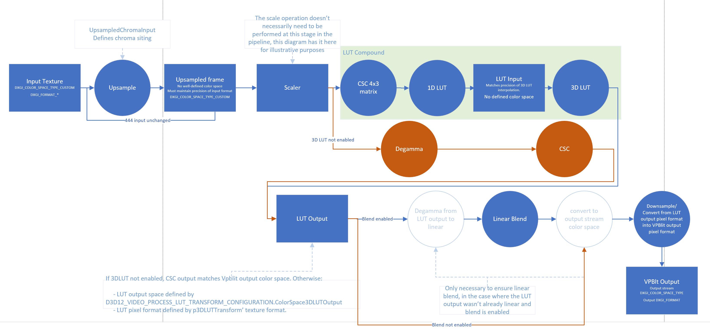
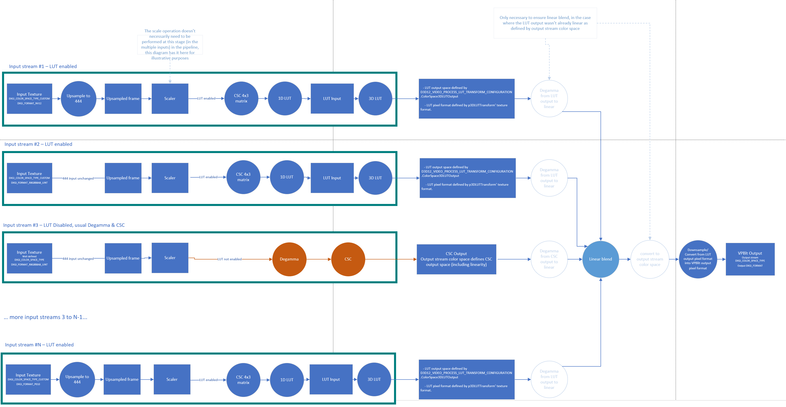

# D3D12 Video Processing 1D/3D LUT

# General considerations

This spec extends the D3D12 Video Processing API with LUT processing.
In many cases, the DDI is extremely similar to the API. The structures and enumerations which are basically the same (differing solely in name convention) are not repeated in the this specification.

# VPBlit Overview

## Pipeline Stages

The following diagram indicates where the CSC/1DLUT/3DLUT operations (called the LUT compound as a group) fall within the VPBlit pipeline. CSC/1DLUT/3DLUT operations can be considered as replacing the "Degamma & CSC" stages in the previously defined VPBlit API. When the LUT compound is enabled, any other VPBlit operations (e.g rotation, scaling, blend, etc) must happen in the same order as they do relative to "Degamma & CSC" operations without the LUT compound enabled.



The input texture format (`DXGI_FORMAT`) is given by the VPBlit input stream's format. Additionally, if the input is not 444 already, VPBlt needs to perform upsampling to 4:4:4 from that input format. `UpsampledChromaInput` gives the driver info about chroma siting on the configuration parameters of the LUT compound.

> Note: The [`DXGI_FORMAT`](https://learn.microsoft.com/en-us/windows/win32/api/dxgiformat/ne-dxgiformat-dxgi_format) parameters do **not** specify the semantics of the actual values stored in textures with such `DXGI_FORMAT`, even when the `DXGI_FORMAT` implies RGB or YUV by its name (e.g AYUV/R8G8B8A8, etc) that is only to be considered as the physical format memory layout/packing of several channels in a pixel on that format, disregarding of contents. The semantics of the values is given by [`DXGI_COLOR_SPACE_TYPE`](https://learn.microsoft.com/en-us/windows/win32/api/dxgicommon/ne-dxgicommon-dxgi_color_space_type) instead.

> Note: In the context of this spec, since the color space from the input stream up to the output of the 3DLUT stage are defined as `DXGI_COLOR_SPACE_TYPE_CUSTOM`, it's possible for apps to use `DXGI_FORMAT` such as, for example, `DXGI_FORMAT_R8G8B8A8_*` but without implying the contents of such `ID3D12Resource` objects contain RGBA values (e.g it's just a 4 channel 8 bits packed format containing custom color values on that texture). Another example would be using `DXGI_FORMAT_AYUV` without implying AYUV color values, just the 4 channel per pixel packing.

The input to the CSC needs only to be defined in terms of the upsampling operation required and its output passed directly into the 1DLUT stage. The 3DLUT input is passed directly from the 1DLUT stage and the output space of the 3DLUT cube is defined in `D3D12_VIDEO_PROCESS_LUT_TRANSFORM_CONFIGURATION.ColorSpace3DLUTOutput`.

However, please note that when LUT compound is enabled, the input color space to the LUT compound (`D3D12_VIDEO_PROCESS_INPUT_STREAM_DESC.ColorSpace`) is not defined (e.g `DXGI_COLOR_SPACE_TYPE_CUSTOM`). This allows the LUT to enable support for formats which are not defined in VPBlit/DXGI.

After the LUT compound stages, the blend operation (if any) must always be done in linear gamma, so the driver/harware must apply a conversion to linear (if not already in linear) from the `D3D12_VIDEO_PROCESS_LUT_TRANSFORM_CONFIGURATION.ColorSpace3DLUTOutput`, perform the linear blend and then convert to the `D3D12_VIDEO_PROCESS_OUTPUT_STREAM_DESC.ColorSpace`. When blending is not present, the driver must perform a conversion between `D3D12_VIDEO_PROCESS_LUT_TRANSFORM_CONFIGURATION.ColorSpace3DLUTOutput` and `D3D12_VIDEO_PROCESS_OUTPUT_STREAM_DESC.ColorSpace`.

Please note also that if `D3D12_VIDEO_PROCESS_OUTPUT_STREAM_DESC.Format` is different than `p3DLUTTransform`'s texture `Format`, a pixel format conversion must be performed post LUT stage (e.g downsampling between LUT output format and output stream format as indicated in the diagrams).

## Multiple input streams

The diagram below depicts how multiple input streams interact when LUT compound is enabled, or not (using regular Degramma & CSC stages) are merged together at the `Linear Blend` stage.

The diagram is based on the high level diagram, but for each input stream has an actual input `DXGI_FORMAT` and was adjusted to skip upsampling to 444 (if necessary), and decide if the input stream goes through Degamma & CSC with a well defined `DXGI_COLOR_SPACE_TYPE` or if it goes through the LUT stages with `DXGI_COLOR_SPACE_TYPE_CUSTOM`.



# New structures for Video Processing API

## D3D12 Resource API

### D3D12_RESOURCE_FLAG

```C++
typedef struct D3D12_RESOURCE_FLAG
{
    ...
    D3D12_RESOURCE_FLAG_VIDEO_PROCESS_3DLUT_ONLY = ...,
    D3D12_RESOURCE_FLAG_VIDEO_PROCESS_1DLUT_ONLY = ...,
} D3D12_RESOURCE_FLAG;
```

*D3D12_RESOURCE_FLAG_VIDEO_PROCESS_3DLUT_ONLY*

Indicates the resource will contain a 3DLUT cube.

For hardware requiring special stride/allocation size alignment on any cube dimension, this must be addressed transparently by having the driver over-allocate accordingly when a caller creates a Texture3D `ID3D12Resource` with `Flags` containing `D3D12_RESOURCE_FLAG_VIDEO_PROCESS_3DLUT_ONLY`. When the D3D12 caller uses the resource within the `[0..Width/Height/Depth]` dimensions in any part of the pipeline (e.g 3D/Compute Shaders, VPBlit, etc), the driver must take care of handling the strides and layout/swizzle mappings transparently.

*D3D12_RESOURCE_FLAG_VIDEO_PROCESS_1DLUT_ONLY*

Indicates the resource will contain a 1DLUT table. Used for hardware requiring special layouts and needing to identify resources containing 1DLUTs for performing appropiate layout conversions on `ResourceBarrier` indicating the 1DLUT table contents changed (e.g WRITE to COMMON).

## LUT Compound API

### LUT Compound API - Support & Capabilities reporting

#### D3D12_VIDEO_PROCESS_LUT_SUPPORT_FLAGS

```C++
enum D3D12_VIDEO_PROCESS_LUT_SUPPORT_FLAGS
{
    D3D12_VIDEO_PROCESS_LUT_SUPPORT_FLAG_NONE	   = 0x0,
    D3D12_VIDEO_PROCESS_LUT_SUPPORT_FLAG_SUPPORTED = 0x1,
    D3D12_VIDEO_PROCESS_LUT_SUPPORT_FLAG_1DLUT_SPACING_CURVE = 0x2,
    D3D12_VIDEO_PROCESS_LUT_SUPPORT_FLAG_1DLUT_NON_MONOTONICALLY_INCREASING_CURVE = 0x4,
} D3D12_VIDEO_PROCESS_LUT_SUPPORT_FLAGS;
```

*D3D12_VIDEO_PROCESS_LUT_SUPPORT_FLAG_NONE*

Indicates no support for LUT compound.

*D3D12_VIDEO_PROCESS_LUT_SUPPORT_FLAG_SUPPORTED*

Indicates support for LUT compound including CSC, 1DLUT preshaper and 3DLUT.

*D3D12_VIDEO_PROCESS_LUT_SUPPORT_FLAG_1DLUT_NON_MONOTONICALLY_INCREASING_CURVE*

Indicates support for 1DLUT curves that do **not** monotonically increase.

#### D3D12_VIDEO_PROCESS_3DLUT_INTERPOLATION_MODE

```C++
enum D3D12_VIDEO_PROCESS_3DLUT_INTERPOLATION_MODE
{
    D3D12_VIDEO_PROCESS_3DLUT_INTERPOLATION_MODE_TRILINEAR = 0,
    D3D12_VIDEO_PROCESS_3DLUT_INTERPOLATION_MODE_TETRAHEDRAL = 1,
} D3D12_VIDEO_PROCESS_3DLUT_INTERPOLATION_MODE;
```

Interpolation mode for the 3DLUT cube.

#### D3D12_VIDEO_PROCESS_3DLUT_INTERPOLATION_MODE_SUPPORT_FLAGS

```C++
enum D3D12_VIDEO_PROCESS_3DLUT_INTERPOLATION_MODE_SUPPORT_FLAGS
{
    D3D12_VIDEO_PROCESS_3DLUT_INTERPOLATION_MODE_SUPPORT_FLAG_NONE = 0x0,
    D3D12_VIDEO_PROCESS_3DLUT_INTERPOLATION_MODE_SUPPORT_FLAG_TRILINEAR = (1 << D3D12_VIDEO_PROCESS_3DLUT_INTERPOLATION_MODE_TRILINEAR),
    D3D12_VIDEO_PROCESS_3DLUT_INTERPOLATION_MODE_SUPPORT_FLAG_TETRAHEDRAL = (1 << D3D12_VIDEO_PROCESS_3DLUT_INTERPOLATION_MODE_TETRAHEDRAL)
} D3D12_VIDEO_PROCESS_3DLUT_INTERPOLATION_MODE_SUPPORT_FLAGS;
```

Supported interpolation modes for the 3DLUT cube.

#### D3D12_VIDEO_PROCESS_3DLUT_TABLE_DIMENSION

```C++
enum D3D12_VIDEO_PROCESS_3DLUT_TABLE_DIMENSION
{
    D3D12_VIDEO_PROCESS_3DLUT_TABLE_DIMENSION_17x17x17 = 0;
    D3D12_VIDEO_PROCESS_3DLUT_TABLE_DIMENSION_33x33x33 = 1;
    D3D12_VIDEO_PROCESS_3DLUT_TABLE_DIMENSION_45x45x45 = 2;
    D3D12_VIDEO_PROCESS_3DLUT_TABLE_DIMENSION_65x65x65 = 3;
}
```

Dimensions for 3DLUT cubes.

#### D3D12_VIDEO_PROCESS_3DLUT_TABLE_DIMENSION_SUPPORT_FLAGS

```C++
enum D3D12_VIDEO_PROCESS_3DLUT_TABLE_DIMENSION_SUPPORT_FLAGS
{
    D3D12_VIDEO_PROCESS_3DLUT_TABLE_DIMENSION_SUPPORT_FLAG_NONE = 0x0,
    D3D12_VIDEO_PROCESS_3DLUT_TABLE_DIMENSION_SUPPORT_FLAG_17x17x17 = (1 << D3D12_VIDEO_PROCESS_3DLUT_TABLE_DIMENSION_17x17x17);
    D3D12_VIDEO_PROCESS_3DLUT_TABLE_DIMENSION_SUPPORT_FLAG_33x33x33 = (1 << D3D12_VIDEO_PROCESS_3DLUT_TABLE_DIMENSION_33x33x33);
    D3D12_VIDEO_PROCESS_3DLUT_TABLE_DIMENSION_SUPPORT_FLAG_45x45x45 = (1 << D3D12_VIDEO_PROCESS_3DLUT_TABLE_DIMENSION_45x45x45);
    D3D12_VIDEO_PROCESS_3DLUT_TABLE_DIMENSION_SUPPORT_FLAG_65x65x65 = (1 << D3D12_VIDEO_PROCESS_3DLUT_TABLE_DIMENSION_65x65x65);
} D3D12_VIDEO_PROCESS_3DLUT_TABLE_DIMENSION_SUPPORT_FLAGS
```

Supported dimensions for 3DLUT cubes.

#### D3D12_VIDEO_PROCESS_LUT_SUPPORT

```C++
typedef struct D3D12_VIDEO_PROCESS_LUT_SUPPORT
{
    DXGI_FORMAT Format1DLUT; // input
    DXGI_FORMAT Format3DLUT; // input
    DXGI_COLOR_SPACE_TYPE ColorSpace3DLUTOutput; // input
    D3D12_VIDEO_PROCESS_LUT_SUPPORT_FLAGS Flags; // output
    UINT Native1DLUTSize; // output
    D3D12_VIDEO_PROCESS_3DLUT_INTERPOLATION_MODE_SUPPORT_FLAGS Interpolation3DLUTFlags; // output
    D3D12_VIDEO_PROCESS_3DLUT_TABLE_DIMENSION_SUPPORT_FLAGS Dimension3DLUTFlags; // output
} D3D12_VIDEO_PROCESS_LUT_SUPPORT;
```

*Format1DLUT*

Input parameter. Indicates the `DXGI_FORMAT` format intended by the app to be used in `p1DLUTtransform`.

*Format3DLUT*

Input parameter. Indicates the `DXGI_FORMAT` format intended by the app to be used in `p3DLUTtransform`.

*ColorSpace3DLUTOutput*

Input parameter. Indicates the `DXGI_COLOR_SPACE_TYPE` output space of `p3DLUTtransform`. If this parameter is equal to `D3D12_FEATURE_DATA_VIDEO_PROCESS_SUPPORT1.OutputFormat.ColorSpace` then the color space output of the 3DLUT cube will match the VPBlit output stream color space (`D3D12_VIDEO_PROCESS_OUTPUT_STREAM_DESC.ColorSpace`). Otherwise, indicates that if the driver reports support in this support query, it will need to perform a conversion after the LUT and blend stages to match the VPBlit stream output color space.

*Flags*

Output Parameter. Indicates support for LUT based on the input parameters in `D3D12_FEATURE_DATA_VIDEO_PROCESS_SUPPORT1` and `D3D12_VIDEO_PROCESS_LUT_SUPPORT`.

*Native1DLUTSize*

Output Parameter. When LUT supported in _Flags_, indicates the dimensions of the hardware native 1DLUT size, the caller must adjust the 1DLUT texture `Width` to the native size.

The gap between the `Native1DLUTSize` size reported by the driver and the `2^bitdepth` potential size of a full 1DLUT, will be resolved by the hardware doing interpolation.

*Interpolation3DLUTFlags*

Output Parameter. When LUT supported in _Flags_, indicates the 3DLUT interpolation support.

*Dimension3DLUTFlags*

Output Parameter. When LUT supported in _Flags_, indicates the 3DLUT dimensions support.

### LUT Compound API - Input stream configuration

#### D3D12_VIDEO_PROCESS_LUT_UPDATE_FLAGS

```C++
enum D3D12_VIDEO_PROCESS_LUT_UPDATE_FLAGS
{
    D3D12_VIDEO_PROCESS_LUT_UPDATE_FLAG_NONE = 0x0,
    D3D12_VIDEO_PROCESS_LUT_UPDATE_FLAG_CSC = 0x1,
    D3D12_VIDEO_PROCESS_LUT_UPDATE_FLAG_1DLUT = 0x2,
    D3D12_VIDEO_PROCESS_LUT_UPDATE_FLAG_1DLUT_SPACING = 0x4,
    D3D12_VIDEO_PROCESS_LUT_UPDATE_FLAG_3DLUT = 0x8,
} D3D12_VIDEO_PROCESS_LUT_UPDATE_FLAGS;
```

*D3D12_VIDEO_PROCESS_LUT_UPDATE_FLAG_NONE*

No flags.

*D3D12_VIDEO_PROCESS_LUT_UPDATE_FLAG_CSC*

Indicates to the driver that an updated CSC is sent for hardware reconfiguration on this frame. In any subsequent calls to `ProcessFrame`, the user must send the same unchanged CSC matrix if not enabling this flag.

*D3D12_VIDEO_PROCESS_LUT_UPDATE_FLAG_1DLUT*

Indicates to the driver that updated 1D LUTs are sent for hardware reconfiguration on this frame. In any subsequent calls to `ProcessFrame`, the user must send the same unchanged 1DLUT table if not enabling this flag.

*D3D12_VIDEO_PROCESS_LUT_UPDATE_FLAG_1DLUT_SPACING*

Indicates to the driver that updated 1D LUTs spacing curves are sent for hardware reconfiguration on this frame. In any subsequent calls to `ProcessFrame`, the user must send the same unchanged 1DLUT spacing curve if not enabling this flag.

*D3D12_VIDEO_PROCESS_LUT_UPDATE_FLAG_3DLUT*

Indicates to the driver that an updated 3DLUT is sent for hardware reconfiguration on this frame. In any subsequent calls to `ProcessFrame`, the user must send the same unchanged 3DLUT if not enabling this flag.

#### D3D12_VIDEO_PROCESS_LUT_TRANSFORM_CONFIGURATION_FLAGS

```C++
enum D3D12_VIDEO_PROCESS_LUT_TRANSFORM_CONFIGURATION_FLAGS
{
    D3D12_VIDEO_PROCESS_LUT_TRANSFORM_CONFIGURATION_FLAG_NONE = 0x0,
    D3D12_VIDEO_PROCESS_LUT_TRANSFORM_CONFIGURATION_FLAG_ENABLE = 0x1,
} D3D12_VIDEO_PROCESS_LUT_TRANSFORM_CONFIGURATION_FLAGS;
```

*D3D12_VIDEO_PROCESS_LUT_TRANSFORM_CONFIGURATION_FLAG_NONE*

No flags.

*D3D12_VIDEO_PROCESS_LUT_TRANSFORM_CONFIGURATION_FLAG_ENABLE*

Enables the LUT compound for this frame, including CSC, 1DLUT preshaper and 3DLUT. When this flag is enabled, the LUT compound replaces the "Degamma & CSC" stages in the previously defined VPBlit API. Otherwise, the pre-existing "Degamma & CSC" stages are used without tonemapping.

#### D3D12_VIDEO_PROCESS_LUT_TRANSFORM_CONFIGURATION

```C++
typedef struct D3D12_VIDEO_PROCESS_LUT_TRANSFORM_CONFIGURATION
{
    D3D12_VIDEO_PROCESS_LUT_TRANSFORM_CONFIGURATION_FLAGS ConfigFlags;
    DXGI_COLOR_SPACE_TYPE UpsampledChromaInput;
    DXGI_FORMAT Format1DLUT;
    DXGI_FORMAT Format3DLUT;
    DXGI_COLOR_SPACE_TYPE ColorSpace3DLUTOutput;
    D3D12_VIDEO_PROCESS_3DLUT_INTERPOLATION_MODE Interpolation3DLUT;
    D3D12_VIDEO_PROCESS_3DLUT_TABLE_DIMENSION Dimension3DLUT;
} D3D12_VIDEO_PROCESS_LUT_TRANSFORM_CONFIGURATION;
```

*ConfigFlags*

Indicates the LUT configuration flags that will be used.

*UpsampledChromaInput*

If the input VPblit stream texture has a subsampled format (e.g NV12, YUY2, P010, etc), this parameter indicates the upsampling chroma properties (e.g sample siting positions) to be used for upsampling from the input stream texture format before being consumed. Parameter ignored by driver otherwise.

> Please note that even as `DXGI_COLOR_SPACE_TYPE` also specifies other color space properties (e.g primaries), the driver should only consider `UpsampledChromaInput` relative to the siting information needed for the upsampling stage.

*Format1DLUT*

Indicates the `DXGI_FORMAT` format of `p1DLUTtransform`.

*Format3DLUT*

Indicates the `DXGI_FORMAT` format of `p3DLUTTransform`.

*ColorSpace3DLUTOutput*

Indicates the `DXGI_COLOR_SPACE_TYPE` output space of `p3DLUTTransform`.

*Interpolation3DLUT*

Indicates the 3DLUT interpolation that will be used.

*Dimension3DLUT*

Indicates the 3DLUT dimension that will be used.

### LUT Compound API - ProcessFrames input stream parameters

#### D3D12_VIDEO_PROCESS_TRANSFORM_LUT

```C++
typedef struct D3D12_VIDEO_PROCESS_TRANSFORM_LUT
{
    // LUT Compound config
    D3D12_VIDEO_PROCESS_LUT_TRANSFORM_CONFIGURATION Configuration;

    // LUT Compound flags
    D3D12_VIDEO_PROCESS_LUT_UPDATE_FLAGS UpdateFlags;
    
    // CSC
    float pCSCMatrix[4][3];

    // 1DLUT
    ID3D12Resource *p1DLUTtransform;
    UINT Subresource1DLUT;
    ID3D12Resource *p1DLUTInputSpacing;
    UINT Subresource1DLUTInputSpacing;

    // 3DLUT
    ID3D12Resource *p3DLUTTransform; // No subresource for Texture3D
} D3D12_VIDEO_PROCESS_TRANSFORM_LUT;
```
Indicates the LUT parameters for this frame.

**Params**

*Configuration*

LUT configuration.

*UpdateFlags*

LUT Update flags indicating which stages have been modified and may require hardware reconfiguration for this frame.

*pCSCMatrix*

The CSC matrix.

*p1DLUTtransform*

1D LUT Table.

*Subresource1DLUT*

`p1DLUTtransform` subresource index.

*p1DLUTInputSpacing*

1D LUT input spacing curve.

*Subresource1DLUTInputSpacing*

`p1DLUTInputSpacing` subresource index.

*p3DLUTTransform*

3D LUT Table.

## LUT compound remarks

When the LUT compound is enabled for a `ProcessFrames` call, it encompasses the CSC, 1DLUT and 3DLUT transforms in that order.
To ensure a well defined format definition between stages within the LUT compound, all these stages are always enabled together, and the apps can use a linear ramp for 1DLUT and/or a identity matrix for CSC as defaults.

### DXGI_FORMAT mappings

The input `D3D12_VIDEO_PROCESS_INPUT_STREAM.pTexture2D` texture will be upsampled to 4:4:4 if necessary before the CSC stage. 

If it's already an 4:4:4 format input, the A,Y,U,V and R,G,B,A mappings are specified by the [DXGI_FORMAT's shader view rules](https://learn.microsoft.com/en-us/windows/win32/api/dxgiformat/ne-dxgiformat-dxgi_format). For example: For `DXGI_FORMAT_AYUV` one view provides a straightforward mapping of the entire surface and the mapping to the view channel is V->R8, U->G8, Y->B8, and A->A8.

For subsampled formats that use a single view (e.g `DXGI_FORMAT_YUY2`, `DXGI_FORMAT_Y210`, `DXGI_FORMAT_Y216`, etc), [DXGI_FORMAT's shader mapping to the view channel rules](https://learn.microsoft.com/en-us/windows/win32/api/dxgiformat/ne-dxgiformat-dxgi_format) are used to map between A,Y,U,V and R,G,B,A channels, and using the packed RGB `DXGI_FORMAT_RxGxBxAx_*` as view formats. The precision `x` for each channel of the upsampled format matches the precision of the `p1DLUTtransform` texture's format. Alpha channel is ignored.

For subsampled input formats that use multiple views (e.g `DXGI_FORMAT_NV12`, `DXGI_FORMAT_P010`, `DXGI_FORMAT_P016`, etc) the upsampling conversion matches the precision of the `p1DLUTtransform` texture's format and maps to a single view with RGBA format. For example upsampling `DXGI_FORMAT_NV12` maps to `DXGI_FORMAT_R8G8B8A8_*`, `DXGI_FORMAT_P010` maps to `DXGI_FORMAT_R10G10B10A10_*` when the latter format matches the `p1DLUTTransform`'s texture format., etc with mapping to the channels between A,Y,U,V and R,G,B,A mappings beign V<->Rx, U<->Gx, Y<->Bx, and A<->Ax, where x is the bit depth of the channel. Alpha channel is ignored.

> Since some DXGI formats do not have the RGBX variant (e.g R16G16B16X16 does not exist) and not all HW supports passthrough/copy of the alpha channel, the alpha channel (if present in the format) is ignored for simplicity, but the formats allowed to be used.

### Data flow

Please see below a pseudocode of how the data would flow from the (see diagram) "Upsampled frame" (444) input to the "LUT Output" output. This example assumes the upsampled frame has 8 bit channel components.

Note that provides only _a possible_ implementation of the `lookup_1d`/`lookup_3d` functions, the drivers/hardware may implement these differently based on their HW specifics.

```C++
// LUT_compound(...): Describes the DX12 LUT Compound pipeline of this spec as a whole

// The pipeline consists of the following stages:

// 1. Input Handling & Upsampling:
//     - Accepts a texture input (pTexture2D) from D3D12_VIDEO_PROCESS_INPUT_STREAM.
//     - If the input format is not 4:4:4, chroma upsampling is performed using the specified upsample mode.
//     - Extracts R8, G8, B8 channels, ignoring alpha if present.

// 2. Color Space Conversion (CSC):
//     - Applies a CSC matrix transformation to the upsampled RGB values.
//     - The output values (O_R8, O_G8, O_B8) are clamped to the [0, 1] range.

// 3. 1D LUT Stage:
//     - Applies a 1D LUT transformation to each color channel.
//     - If no input spacing resource is provided, assumes uniform spacing for LUT inputs.
//     - Uses lookup_1d to map the CSC output through the 1D LUTs for each channel.
//     - The results (S_R8, S_G8, S_B8) are clamped to [0, 1].

// 4. 3D LUT Stage:
//     - Applies a 3D LUT transformation using the outputs from the 1D LUT stage.
//     - Uses lookup_3d with the processed RGB values and the provided 3D LUT transform.

// 5. Output:
//     - Returns the final LUT_OUTPUT after all processing stages.

// Notes:
//     - The function assumes DXGI_FORMAT mappings and D3D12_VIDEO_PROCESS_LUT_SUPPORT.Native1DLUTSize for LUT sizing.
//     - The pipeline is designed for driver-level implementation and assumes certain defaults if resources are not provided by the application.
define LUT_compound(...):
{
    //...
    // App populates 3DLUT Cube with populate_3dlut_texture(p3DLUTTransform, N) where N corresponds to the D3D12_VIDEO_PROCESS_3DLUT_TABLE_DIMENSION_NxNxN and populate_1dlut_texture(p1DLUTtransform, p1DLUTInputSpacing, N) where N is D3D12_VIDEO_PROCESS_LUT_SUPPORT.Native1DLUTSize. Note the app does NOT need to load the 1D/3D nor CSC on every frame, but only as needed.
    //...

    // I_* is the input to the LUT compound after upsampling, following DXGI_FORMAT mappings specified above
    if (Format(D3D12_VIDEO_PROCESS_INPUT_STREAM.pTexture2D) is not 4:4:4)
    {
        I_R8, I_G8, I_B8 = upsample(D3D12_VIDEO_PROCESS_INPUT_STREAM.pTexture2D, upsample_mode=UpsampledChromaInput)
    }
    else
    {
        I_R8, I_G8, I_B8 = D3D12_VIDEO_PROCESS_INPUT_STREAM.pTexture2D; // ignore alpha channel if present
    }

    //
    // Apply CSC stage
    //
    // Note: The pCSCMatrix[4][3] structure maps directly to matrix elements as pCSCMatrix[x][y] = Mxy.
    // The mathematical 3x4 matrix is applied in transposed form as shown below:

    | O_R8 |   | M00  M10  M20  M30  |   | I_R8 |
    | O_G8 | = | M01  M11  M21  M31  | . | I_G8 |
    | O_B8 |   | M02  M12  M22  M32  |   | I_B8 |
    | 1.0f |   | 0.0f 0.0f 0.0f 1.0f |   | 1.0f |

    O_R8 = clamp(O_R8, 0, 1)
    O_G8 = clamp(O_G8, 0, 1)
    O_B8 = clamp(O_B8, 0, 1);

    //
    // Apply 1DLUT stage
    //

    //
    // if a p1DLUTInputSpacing resource is not provided by app
    // Driver assumes fixed uniform spacing for 1DLUT inputs.
    //
    if (p1DLUTInputSpacing == NULL)
    {
        // Driver assumes this is the input spacing when not specified by app:
        p1DLUTInputSpacing.Width = p1DLUTtransform.Width // D3D12_VIDEO_PROCESS_LUT_SUPPORT.Native1DLUTSize
        for (i = 0; i < p1DLUTInputSpacing.Width; i++)
        {
            p1DLUTInputSpacing[i] = i / (float)(p1DLUTInputSpacing.Width - 1);
        }
    }

    S_R8 = lookup_1d(O_R8, array_slice_channel(p1DLUTtransform.R8), array_slice_channel(p1DLUTInputSpacing.R16))
    S_G8 = lookup_1d(O_G8, array_slice_channel(p1DLUTtransform.G8), array_slice_channel(p1DLUTInputSpacing.R16))
    S_B8 = lookup_1d(O_B8, array_slice_channel(p1DLUTtransform.B8), array_slice_channel(p1DLUTInputSpacing.R16))

    S_R8 = clamp(S_R8, 0, 1)
    S_G8 = clamp(S_G8, 0, 1)
    S_B8 = clamp(S_B8, 0, 1);

    //
    // Apply 3DLUT stage
    //
    // R8 -> x; G8 -> y; B8 -> z
    LUT_OUTPUT = lookup_3d((S_R8,S_G8,S_B8), p3DLUTTransform)

    return LUT_OUTPUT;
}

//
// 3DLUT Texture Population (Application side)
//
// The 3DLUT texture should be populated following the R->G->B walking order:
// - R channel matches X dimension / Width
// - G channel matches Y dimension / Height
// - B channel matches Z dimension / Depth
//
// For a NxNxN cube, the texture coordinates map as follows:
define populate_3dlut_texture(p3DLUTTransform, N):
{
    for (int z = 0; z < N; z++)      // Blue matches z axis (depth)
    {
        for (int y = 0; y < N; y++)  // Green matches y axis (height)
        {
            for (int x = 0; x < N; x++)  // Red matches x axis (width)
            {
                // Input RGB coordinates in normalized [0,1] space
                float input_r = x / (float)(N-1);
                float input_g = y / (float)(N-1);
                float input_b = z / (float)(N-1);

                // Apply your color transformation function and
                // store the result in texture at coordinates (x,y,z)
                p3DLUTTransform[x][y][z] = transform_function(input_r, input_g, input_b);
            }
        }
    }
}

//
// 1DLUT Texture Population (Application side)
//
// The 1DLUT consists of two components:
// 1. p1DLUTtransform: The actual lookup table values for each channel (R, G, B)
// 2. p1DLUTInputSpacing: Optional spacing curve that defines non-uniform input sampling
//
// For a 1DLUT with N entries, the texture should be populated as follows:
define populate_1dlut_texture(p1DLUTtransform, p1DLUTInputSpacing, N):
{
    //
    // [Optional] Populate the input spacing curve with
    // a custom_spacing_function
    //
    // Note: If the app sends p1DLUTInputSpacing = NULL,
    // the driver assumes uniform spacing: i / (N-1)
    //
    if (p1DLUTInputSpacing != NULL)
    {
        for (int i = 0; i < N; i++)
        {
            // Store in R16_FLOAT format as required by the spec
            p1DLUTInputSpacing[i] = spacing_function(i, N, ...);
        }
    }

    // Populate the 1DLUT transform values for each channel
    for (int i = 0; i < N; i++)
    {
        float input_value = 0.0f;

        // Determine input value based on spacing
        if (p1DLUTInputSpacing != NULL)
        {
            // Use custom spacing
            input_value = p1DLUTInputSpacing[i];
        }
        else
        {
            // Use uniform spacing
            input_value = i / (float)(N-1);
        }

        // Apply your 1D transformation function for each channel
        // Format depends on Format1DLUT (e.g., R8G8B8A8, R10G10B10A2, etc.)
        p1DLUTtransform[i].r = red_transform_function(input_value);
        p1DLUTtransform[i].g = green_transform_function(input_value);
        p1DLUTtransform[i].b = blue_transform_function(input_value);
        // Alpha channel is ignored in 1DLUT processing
    }
}

//
// 1DLUT Lookup (Hardware/Driver side)
//
// The function iterates through the input spacing array to find the interval
// where O_R8 falls. It then interpolates between the corresponding LUT transform
// values to compute the output S_R8.
//
define lookup_1d(O_R8, p1DLUTtransform[], p1DLUTInputSpacing[]):
{
    for (i = 0; i < p1DLUTtransform.Width-1; i++)
    {
        if (O_R8 > p1DLUTInputSpacing[i] && O_R8 <= p1DLUTInputSpacing[i+1])
        {
            S_R8 = interpolate(O_R8, p1DLUTtransform[i], p1DLUTtransform[i+1]);
        }
    }
    return S_R8;
}

//
// 3DLUT Lookup (Hardware/Driver side)
//
// The function maps the input RGB values to corresponding coordinates in the LUT's 3D space:
//   - r -> x (Width)
//   - g -> y (Height)
//   - b -> z (Depth)
//
// Depending on the interpolation mode specified in `Interpolation3DLUT`, the function performs either:
//   - Trilinear interpolation (D3D12_VIDEO_PROCESS_3DLUT_INTERPOLATION_MODE_TRILINEAR)
//   - Tetrahedral interpolation (D3D12_VIDEO_PROCESS_3DLUT_INTERPOLATION_MODE_TETRAHEDRAL)
//
define lookup_3d(rgb_input, p3DLUTTransform):
{
    // rgb_input.r -> x coordinate (Width dimension)
    // rgb_input.g -> y coordinate (Height dimension)
    // rgb_input.b -> z coordinate (Depth dimension)

    float x_coord = rgb_input.r * (p3DLUTTransform.Width - 1);
    float y_coord = rgb_input.g * (p3DLUTTransform.Height - 1);
    float z_coord = rgb_input.b * (p3DLUTTransform.Depth - 1);

    // Perform interpolation based on Interpolation3DLUT mode
    if (Interpolation3DLUT == D3D12_VIDEO_PROCESS_3DLUT_INTERPOLATION_MODE_TRILINEAR)
    {
        return trilinear_interpolate(p3DLUTTransform, x_coord, y_coord, z_coord);
    }
    else // D3D12_VIDEO_PROCESS_3DLUT_INTERPOLATION_MODE_TETRAHEDRAL
    {
        return tetrahedral_interpolate(p3DLUTTransform, x_coord, y_coord, z_coord);
    }
}
```

## 1DLUT remarks

- 1DLUTs are applied per each input format channels as independent map transforms.

- The `Format` of `p1DLUTtransform` must be one supported by `D3D12_FEATURE_DATA_VIDEO_PROCESS_SUPPORT1.SupportLUT`. This format indicates the output format of the 1DLUT transformation, and the input format for the subsequent (when enabled) 3DLUT transformation. 

- The `Format` defines the allowed value ranges, for example `DXGI_FORMAT_B8G8R8A8_UNORM` indicates unsigned-normalized-integer format that supports 8 bits for each color channel and so on. More details about the ranges of the available formats can be found at [the DXGI_FORMAT documentation](https://learn.microsoft.com/en-us/windows/win32/api/dxgiformat/ne-dxgiformat-dxgi_format#format-modifiers). For floating-point formats, the normalization and value interpretation is further defined by the combination of `DXGI_FORMAT` and `DXGI_COLOR_SPACE_TYPE` as described in [the DXGI_COLOR_SPACE_TYPE documentation](https://learn.microsoft.com/en-us/windows/win32/api/dxgicommon/ne-dxgicommon-dxgi_color_space_type).

- The `Dimension` of `p1DLUTtransform` must be `D3D12_RESOURCE_DIMENSION_TEXTURE1D`.

- The  `Width` of `p1DLUTtransform` must match `D3D12_VIDEO_PROCESS_LUT_SUPPORT.Native1DLUTSize`.

- `D3D12_RESOURCE_FLAG_VIDEO_PROCESS_1DLUT_ONLY` must be specified when creating `p1DLUTtransform`.

- The appropiate resources/subresources for `p1DLUTtransform` must be in `D3D12_RESOURCE_STATE_VIDEO_PROCESS_READ` state before executing `ProcessFrames` with it.

> Note that when writing/loading contents to a resource with `D3D12_RESOURCE_FLAG_VIDEO_PROCESS_1DLUT_ONLY` (e.g with a CPU->GPU upload or with a shader or another way), the `D3D12_RESOURCE_STATE_*` -> `D3D12_RESOURCE_STATE_COMMON` resource state transition after the write may need to convert the compression/layout to a HW specific one, and this may have a performance cost. So it's advised when possible to pre-generate/pre-load the contents and avoid such unnecessary transitions.

## 1DLUT input spacing remarks

- Requires `D3D12_VIDEO_PROCESS_LUT_SUPPORT_FLAG_1DLUT_SPACING_CURVE` support from the driver. Otherwise `p1DLUTInputSpacing` must be always `NULL`.

- When `p1DLUTInputSpacing` is passed as `NULL`, driver must assumes fixed uniform spacing for `p1DLUTtransform` input.

- When a non `NULL` `p1DLUTInputSpacing` is passed by the app, it indicates a curve to shape the `x` axis input coordinates to `p1DLUTtransform`. Such curve maps from the `[0..D3D12_VIDEO_PROCESS_LUT_SUPPORT.Native1DLUTSize]` index space into the `DXGI_FORMAT_R16_FLOAT` range.

> The app could send such a curve when needing to modify the spacing of the 1DLUT pre-shaper, to match custom linearities of the input. For example, when mapping from a linear input into a non-linear pre-shaper spacing, some areas of the input may require additional precision which may not well modeled by the default linear spacing of the 1DLUT pre-shaper.

- The `Format` of a non `NULL` `p1DLUTInputSpacing` must be `DXGI_FORMAT_R16_FLOAT`.

- The `Dimension` of a non `NULL` `p1DLUTInputSpacing` must be `D3D12_RESOURCE_DIMENSION_TEXTURE1D`.

- The  `Width` of a non `NULL` `p1DLUTInputSpacing` must match `D3D12_VIDEO_PROCESS_LUT_SUPPORT.Native1DLUTSize`.

- The appropiate resources/subresources for `p1DLUTInputSpacing` must be in `D3D12_RESOURCE_STATE_VIDEO_PROCESS_READ` state before executing `ProcessFrames` with it.

## 3DLUT remarks

- 3DLUT is applied as a single transform to all the channels in the input/output formats.

- `Interpolation3DLUT` mode is used for inputs that do not fall within exact entries in the cube.

- The `Dimension` of the 3DLUT transform will be `D3D12_RESOURCE_DIMENSION_TEXTURE3D`.

- The `Width = Height = DepthOrArraySize` of the 3DLUT transform will be given by `D3D12_VIDEO_PROCESS_LUT_TRANSFORM_CONFIGURATION.Dimension3DLUT`
     - For example `D3D12_VIDEO_PROCESS_3DLUT_TABLE_DIMENSION_33x33x33` implies `Width = Height = DepthOrArraySize = 33`.

- `D3D12_RESOURCE_FLAG_VIDEO_PROCESS_3DLUT_ONLY` must be specified when creating `p3DLUTTransform`.

- The `Format` of the 3DLUT transform must be one supported by `D3D12_FEATURE_DATA_VIDEO_PROCESS_SUPPORT1.SupportLUT` and match the `Format3DLUT` parameter. This format indicates the output format of the 3DLUT transformation.

- The `Format` defines the allowed value ranges, for example `DXGI_FORMAT_B8G8R8A8_UNORM` indicates unsigned-normalized-integer format that supports 8 bits for each color channel and so on. More details about the ranges of the available formats can be found at [the DXGI_FORMAT documentation.](https://learn.microsoft.com/en-us/windows/win32/api/dxgiformat/ne-dxgiformat-dxgi_format#format-modifiers).

> Note: For floating-point formats such as `DXGI_FORMAT_R16G16B16A16_FLOAT`, hardware implementations are not required to support the full theoretical range and precision of the format in their internal processing. Implementations must be capable of supporting the reduced range necessary for typical display output scenarios (e.g. nits peak luminance for in-market HDR displays), but may use optimized internal representations that trade off precision or range for performance while maintaining acceptable visual quality for the target use cases.

- The `ColorSpace3DLUTOutput` parameter indicates the `DXGI_COLOR_SPACE_TYPE` output space of `p3DLUTtransform`. If this parameter is different to `D3D12_VIDEO_PROCESS_OUTPUT_STREAM_DESC.ColorSpace` then the driver must perform a conversion after the LUT and blend stages to match the VPBlit stream output color space.
    - When `ColorSpace3DLUTOutput` is YUV but `Format3DLUT` is an RGB format, the same mappings between YUV/RGB channels apply as explained above in the `DXGI_FORMAT mappings` section.

- `p3DLUTTransform` must be in `D3D12_RESOURCE_STATE_VIDEO_PROCESS_READ` state before executing `ProcessFrames` with it.

> Note that when writing/loading contents to a resource with `D3D12_RESOURCE_FLAG_VIDEO_PROCESS_3DLUT_ONLY` (e.g with a CPU->GPU upload or with a shader or another way), the `D3D12_RESOURCE_STATE_*` -> `D3D12_RESOURCE_STATE_COMMON` resource state transition after the write may need to convert the compression/layout to a HW specific one, and this may have a performance cost. So it's advised when possible to pre-generate/pre-load the contents and avoid such unnecessary transitions.

# Extensions to existing structures for Video Processing API

These are the extension points to the existing VPBlit API to hold the new structures defined above.

### Core Video Processing API - Support & Capabilities reporting for LUT compound

#### D3D12_FEATURE_VIDEO

```C++
typedef enum D3D12_FEATURE_VIDEO
{
    …,
    D3D12_FEATURE_VIDEO_PROCESS_SUPPORT1, // D3D12_FEATURE_DATA_VIDEO_PROCESS_SUPPORT1
    D3D12_FEATURE_VIDEO_PROCESSOR_SIZE2, // D3D12_FEATURE_DATA_VIDEO_PROCESSOR_SIZE2
} D3D12_FEATURE_VIDEO;
```

#### D3D12_FEATURE_DATA_VIDEO_PROCESS_SUPPORT1

```C++
typedef struct D3D12_FEATURE_DATA_VIDEO_PROCESS_SUPPORT1
{
    // Existing in D3D12_FEATURE_DATA_VIDEO_PROCESS_SUPPORT

    UINT NodeIndex;
    D3D12_VIDEO_SAMPLE InputSample;
    D3D12_VIDEO_FIELD_TYPE InputFieldType;
    D3D12_VIDEO_FRAME_STEREO_FORMAT InputStereoFormat;
    DXGI_RATIONAL InputFrameRate;
    D3D12_VIDEO_FORMAT OutputFormat;
    D3D12_VIDEO_FRAME_STEREO_FORMAT OutputStereoFormat;
    DXGI_RATIONAL OutputFrameRate;
    D3D12_VIDEO_PROCESS_SUPPORT_FLAGS SupportFlags;
    D3D12_VIDEO_SCALE_SUPPORT ScaleSupport;
    D3D12_VIDEO_PROCESS_FEATURE_FLAGS FeatureSupport;
    D3D12_VIDEO_PROCESS_DEINTERLACE_FLAGS DeinterlaceSupport;
    D3D12_VIDEO_PROCESS_AUTO_PROCESSING_FLAGS AutoProcessingSupport;
    D3D12_VIDEO_PROCESS_FILTER_FLAGS FilterSupport;
    D3D12_VIDEO_PROCESS_FILTER_RANGE FilterRangeSupport[ 32 ];

    // New in D3D12_FEATURE_DATA_VIDEO_PROCESS_SUPPORT1
    D3D12_VIDEO_PROCESS_LUT_SUPPORT SupportLUT;
} D3D12_FEATURE_DATA_VIDEO_PROCESS_SUPPORT1;
```

New parameters are added respect to `D3D12_FEATURE_DATA_VIDEO_PROCESS_SUPPORT` for LUT compound.

`SupportLUT` contains in/out parameters regarding support for the LUT compound.

The driver must only take into consideration the inputs in `D3D12_VIDEO_PROCESS_LUT_SUPPORT` and report LUT support accordingly when  `D3D12_FEATURE_DATA_VIDEO_PROCESS_SUPPORT1.InputSample.Format.ColorSpace == DXGI_COLOR_SPACE_TYPE_CUSTOM`. Otherwise driver must **not** report any support for LUT, since with a well defined color space stream input, legacy CSC path is used without LUT compound.

#### D3D12_FEATURE_VIDEO_PROCESSOR_SIZE2

Revision for new struct `D3D12_VIDEO_PROCESS_INPUT_STREAM_DESC1`.

```C++
// D3D12_FEATURE_VIDEO_PROCESSOR_SIZE2
typedef struct D3D12_FEATURE_DATA_VIDEO_PROCESSOR_SIZE2
{
    UINT NodeMask;
    const D3D12_VIDEO_PROCESS_OUTPUT_STREAM_DESC* pOutputStreamDesc;    // input
    UINT NumInputStreamDescs;                                           // input
    const D3D12_VIDEO_PROCESS_INPUT_STREAM_DESC1 *pInputStreamDescs;    // input
    BOOL Protected;                                                     // input
    UINT64 MemoryPoolL0Size;                                            // output
    UINT64 MemoryPoolL1Size;                                            // output
} D3D12_FEATURE_DATA_VIDEO_PROCESSOR_SIZE2;
```

Replaced `D3D12_VIDEO_PROCESS_INPUT_STREAM_DESC` in `D3D12_FEATURE_DATA_VIDEO_PROCESSOR_SIZE1` with `D3D12_VIDEO_PROCESS_INPUT_STREAM_DESC1` in `D3D12_FEATURE_DATA_VIDEO_PROCESSOR_SIZE2`.

### Core Video Processing API - Input stream configuration for LUT compound

```C++
typedef struct D3D12_VIDEO_PROCESS_INPUT_STREAM_DESC1
{
    DXGI_FORMAT Format;
    DXGI_COLOR_SPACE_TYPE ColorSpace;
    DXGI_RATIONAL SourceAspectRatio;
    DXGI_RATIONAL DestinationAspectRatio;
    DXGI_RATIONAL FrameRate;
    D3D12_VIDEO_SIZE_RANGE SourceSizeRange;
    D3D12_VIDEO_SIZE_RANGE DestinationSizeRange;
    BOOL EnableOrientation;
    D3D12_VIDEO_PROCESS_FILTER_FLAGS FilterFlags;
    D3D12_VIDEO_FRAME_STEREO_FORMAT StereoFormat;
    D3D12_VIDEO_FIELD_TYPE FieldType;
    D3D12_VIDEO_PROCESS_DEINTERLACE_FLAGS DeinterlaceMode;
    BOOL EnableAlphaBlending;
    D3D12_VIDEO_PROCESS_LUMA_KEY LumaKey;
    UINT NumPastFrames;
    UINT NumFutureFrames;
    BOOL EnableAutoProcessing;
    D3D12_VIDEO_PROCESS_LUT_TRANSFORM_CONFIGURATION ConfigurationLUT;
} D3D12_VIDEO_PROCESS_INPUT_STREAM_DESC1;
```
New parameters are added respect to `D3D12_VIDEO_PROCESS_INPUT_STREAM_DESC` for LUT compound.

#### ID3D12VideoProcessor2

Revision for new struct `D3D12_VIDEO_PROCESS_INPUT_STREAM_DESC1`.

```C++
interface ID3D12VideoProcessor2
    : ID3D12VideoProcessor1
{
    HRESULT GetInputStreamDescs1(UINT NumInputStreamDescs,
                                [annotation("_Out_writes_(NumInputStreamDescs)")] D3D12_VIDEO_PROCESS_INPUT_STREAM_DESC1 *pInputStreamDescs
    );
}

```

#### ID3D12VideoDevice4

Revision for new struct `D3D12_VIDEO_PROCESS_INPUT_STREAM_DESC1`.

```C++
interface ID3D12VideoDevice4
    : ID3D12VideoDevice3
{
    HRESULT CreateVideoProcessor2(
        UINT NodeMask,
        [annotation("_In_")] const D3D12_VIDEO_PROCESS_OUTPUT_STREAM_DESC* pOutputStreamDesc,
        UINT NumInputStreamDescs,
        [annotation("_In_reads_(NumInputStreamDescs)")] const D3D12_VIDEO_PROCESS_INPUT_STREAM_DESC1 *pInputStreamDescs,
        [annotation("_In_opt_")] ID3D12ProtectedResourceSession *pProtectedResourceSession,
        [annotation("_In_")] REFIID riid, // Expected: IID_ID3D12VideoProcessor2, 
        [out, iid_is(riid), annotation("_COM_Outptr_")] void **ppVideoProcessor
        );
}
```

### Core Video Processing API - ProcessFrames input stream parameters for LUT compound

```C++
typedef struct D3D12_VIDEO_PROCESS_INPUT_STREAM_ARGUMENTS2
{
    D3D12_VIDEO_PROCESS_INPUT_STREAM InputStream[D3D12_VIDEO_PROCESS_STEREO_VIEWS];
    D3D12_VIDEO_PROCESS_TRANSFORM Transform;
    D3D12_VIDEO_PROCESS_INPUT_STREAM_FLAGS Flags;
    D3D12_VIDEO_PROCESS_INPUT_STREAM_RATE RateInfo;
    INT FilterLevels[D3D12_VIDEO_PROCESS_MAX_FILTERS];
    D3D12_VIDEO_PROCESS_ALPHA_BLENDING AlphaBlending;
    D3D12_VIDEO_FIELD_TYPE FieldType;
    D3D12_VIDEO_PROCESS_TRANSFORM_LUT LUTMode;
} D3D12_VIDEO_PROCESS_INPUT_STREAM_ARGUMENTS2;
```

New parameters are added respect to `D3D12_VIDEO_PROCESS_INPUT_STREAM_ARGUMENTS1` for LUT compound.

```C++
interface ID3D12VideoProcessCommandList4 : ID3D12VideoProcessCommandList3
{
    void ProcessFrames2(
        [annotation("_In_")] ID3D12VideoProcessor2* pVideoProcessor,
        [annotation("_In_")] const D3D12_VIDEO_PROCESS_OUTPUT_STREAM_ARGUMENTS *pOutputArguments,
        UINT NumInputStreams,
        [annotation("_In_reads_(NumInputStreams)")] const D3D12_VIDEO_PROCESS_INPUT_STREAM_ARGUMENTS2 *pInputArguments
        );
}
```

# Known scenarios

While the API defined above must work with any input as a fully programmable LUT compound for any apps attempting to use it for diverse scenarios (e.g custom tonemapping operations with programmable LUTs), this section details specific scenarios that will be of particular interest to Media & other teams using this API.
Please note that the output format/color space determination doesn't depend directly on the input format/spaces, it may be determined by other factors such as display properties. So any input could go to either/any output format/space.

## Media scenarios

### RGB scenarios

| Scenario | Input stream color space | Expected input color semantics (not passed in API/DDI) | Input stream format | CSC Matrix | 1DLUT texture format (1DLUT output format) | 3DLUT Format/Color space | Output stream color space | Output stream format |
| -------- | -------- | -------- | -------- | -------- | -------- | -------- | -------- | -------- |
| Custom to HDR10 | `DXGI_COLOR_SPACE_TYPE_CUSTOM` | `DXGI_COLOR_SPACE_TYPE` not defined | `DXGI_FORMAT_R10G10B10A2_UNORM` | As needed or identity | `DXGI_FORMAT_R10G10B10A2_UNORM` | Same as VPBlit format/space output |  `DXGI_COLOR_SPACE_RGB_FULL_G2084_NONE_P2020`<br>`DXGI_COLOR_SPACE_RGB_STUDIO_G2084_NONE_P2020`<br> | `DXGI_FORMAT_R10G10B10A2_UNORM` |
| HDR10 to HDR10 | `DXGI_COLOR_SPACE_TYPE_CUSTOM` | `DXGI_COLOR_SPACE_RGB_FULL_G2084_NONE_P2020` | `DXGI_FORMAT_R10G10B10A2_UNORM` | As needed or identity | `DXGI_FORMAT_R10G10B10A2_UNORM` | Same as VPBlit format/space output |  `DXGI_COLOR_SPACE_RGB_FULL_G2084_NONE_P2020`<br>`DXGI_COLOR_SPACE_RGB_STUDIO_G2084_NONE_P2020`<br> | `DXGI_FORMAT_R10G10B10A2_UNORM` |
| Custom to sRGB | `DXGI_COLOR_SPACE_TYPE_CUSTOM` | `DXGI_COLOR_SPACE_TYPE` not defined | `DXGI_FORMAT_R10G10B10A2_UNORM` | As needed or identity | `DXGI_FORMAT_R10G10B10A2_UNORM` | Same as VPBlit format/space output | `DXGI_COLOR_SPACE_RGB_FULL_G22_NONE_P709` | `DXGI_FORMAT_R8G8B8A8_UNORM` |
| HDR10 to sRGB | `DXGI_COLOR_SPACE_TYPE_CUSTOM` | `DXGI_COLOR_SPACE_RGB_FULL_G2084_NONE_P2020` | `DXGI_FORMAT_R10G10B10A2_UNORM` | As needed or identity | `DXGI_FORMAT_R10G10B10A2_UNORM` | Same as VPBlit format/space output | `DXGI_COLOR_SPACE_RGB_FULL_G22_NONE_P709` | `DXGI_FORMAT_R8G8B8A8_UNORM` |
| HDR10 to FP16 (CCCS) | `DXGI_COLOR_SPACE_TYPE_CUSTOM` | `DXGI_COLOR_SPACE_RGB_FULL_G2084_NONE_P2020` | `DXGI_FORMAT_R10G10B10A2_UNORM` | As needed or identity | `DXGI_FORMAT_R10G10B10A2_UNORM` | Same as VPBlit format/space output | `DXGI_COLOR_SPACE_RGB_FULL_G10_NONE_P709`  | `DXGI_FORMAT_R16G16B16A16_FLOAT` |
| FP16 to FP16 (CCCS) | `DXGI_COLOR_SPACE_TYPE_CUSTOM` | `DXGI_COLOR_SPACE_RGB_FULL_G10_NONE_P709` | `DXGI_FORMAT_R16G16B16A16_FLOAT` | As needed or identity | `DXGI_FORMAT_R16G16B16A16_FLOAT` | Same as VPBlit format/space output | `DXGI_COLOR_SPACE_RGB_FULL_G10_NONE_P709`  | `DXGI_FORMAT_R16G16B16A16_FLOAT` |

### YUV scenarios

| Scenario | Input stream color space | Expected input color semantics (not passed in API/DDI) | Input stream format | CSC Matrix | 1DLUT texture format (1DLUT output format) | 3DLUT Format/Color space | Output stream color space | Output stream format |
| -------- | -------- | -------- | -------- | -------- | -------- | -------- | -------- | -------- |
| HDR10 (YUV) to HDR10 | `DXGI_COLOR_SPACE_TYPE_CUSTOM` |  `DXGI_COLOR_SPACE_YCBCR_STUDIO_G2084_LEFT_P2020`<br>`DXGI_COLOR_SPACE_YCBCR_STUDIO_G2084_TOPLEFT_P2020` | `DXGI_FORMAT_P010` | As needed or identity | `DXGI_FORMAT_R8G8B8A8_UNORM`<br>`DXGI_FORMAT_R8G8B8X8_UNORM` (P010 input is upscaled to 4:4:4 for CSC input, 3 channel 1DLUT processing with alpha channel ignored) | Same as VPBlit format/space output |  `DXGI_COLOR_SPACE_RGB_FULL_G2084_NONE_P2020`<br>`DXGI_COLOR_SPACE_RGB_STUDIO_G2084_NONE_P2020`<br> | `DXGI_FORMAT_R10G10B10A2_UNORM` |
| HDR10 (YUV) to sRGB | `DXGI_COLOR_SPACE_TYPE_CUSTOM` |  `DXGI_COLOR_SPACE_YCBCR_STUDIO_G2084_LEFT_P2020`<br>`DXGI_COLOR_SPACE_YCBCR_STUDIO_G2084_TOPLEFT_P2020` | `DXGI_FORMAT_P010` | As needed or identity | `DXGI_FORMAT_R8G8B8A8_UNORM`<br>`DXGI_FORMAT_R8G8B8X8_UNORM` (P010 input is upscaled to 4:4:4 for CSC input, 3 channel 1DLUT processing with alpha channel ignored) | Same as VPBlit format/space output |  `DXGI_COLOR_SPACE_RGB_FULL_G22_NONE_P709` | `DXGI_FORMAT_R8G8B8A8_UNORM`<br>`DXGI_FORMAT_B8G8R8A8_UNORM`<br>`DXGI_FORMAT_B8G8R8X8_UNORM`<br>`DXGI_FORMAT_R10G10B10A2_UNORM`<br>`DXGI_FORMAT_R8G8B8A8_UNORM_SRGB`<br>`DXGI_FORMAT_B8G8R8A8_UNORM_SRGB`<br>`DXGI_FORMAT_B8G8R8X8_UNORM_SRGB`<br> |
| FP16 to YUV 2084 | `DXGI_COLOR_SPACE_TYPE_CUSTOM` |  `DXGI_COLOR_SPACE_RGB_FULL_G10_NONE_P709` | `DXGI_FORMAT_R16G16B16A16_FLOAT` | As needed or identity | `DXGI_FORMAT_R16G16B16A16_FLOAT` | `DXGI_FORMAT_R10G10B10A2_UNORM`/`DXGI_COLOR_SPACE_YCBCR_STUDIO_G2084_LEFT_P2020`<br>`DXGI_COLOR_SPACE_YCBCR_STUDIO_G2084_TOPLEFT_P2020`<br>  (output stream needs additional downsampling but no color space conversion) |  `DXGI_COLOR_SPACE_YCBCR_STUDIO_G2084_LEFT_P2020`<br>`DXGI_COLOR_SPACE_YCBCR_STUDIO_G2084_TOPLEFT_P2020`<br> | `DXGI_FORMAT_P010` |
| HDR10 (YUV) to FP16 (CCCS) | `DXGI_COLOR_SPACE_TYPE_CUSTOM` | `DXGI_COLOR_SPACE_YCBCR_STUDIO_G2084_LEFT_P2020`<br>`DXGI_COLOR_SPACE_YCBCR_STUDIO_G2084_TOPLEFT_P2020` | `DXGI_FORMAT_P010` | As needed or identity |`DXGI_FORMAT_R8G8B8A8_UNORM`<br>`DXGI_FORMAT_R8G8B8X8_UNORM` (P010 input is upscaled to 4:4:4 for CSC input, 3 channel 1DLUT processing with alpha channel ignored) | Same as VPBlit format/space output | `DXGI_COLOR_SPACE_RGB_FULL_G10_NONE_P709`  | `DXGI_FORMAT_R16G16B16A16_FLOAT` |

## Other scenarios

### HDR conversion scenarios

| Scenario | Input stream color space | Expected input color semantics (not passed in API/DDI) | Input stream format | CSC Matrix | 1DLUT texture format (1DLUT output format) | 3DLUT Format/Color space | Output stream color space | Output stream format |
| --------| --------| -------- | -------- | -------- | -------- | -------- | -------- | -------- |
| RGB SDR to RGB HDR |  `DXGI_COLOR_SPACE_TYPE_CUSTOM` | `DXGI_COLOR_SPACE_RGB_FULL_G22_NONE_P709` | `DXGI_FORMAT_R8G8B8A8_UNORM`<br>`DXGI_FORMAT_B8G8R8A8_UNORM`<br>`DXGI_FORMAT_B8G8R8X8_UNORM`<br>`DXGI_FORMAT_R10G10B10A2_UNORM`<br>`DXGI_FORMAT_R8G8B8A8_UNORM_SRGB`<br>`DXGI_FORMAT_B8G8R8A8_UNORM_SRGB`<br>`DXGI_FORMAT_B8G8R8X8_UNORM_SRGB`<br> | As needed or identity | As needed or identity | Same as VPBlit format/space output | `DXGI_COLOR_SPACE_RGB_FULL_G10_NONE_P709`<br>`DXGI_COLOR_SPACE_RGB_FULL_G2084_NONE_P2020` | `DXGI_FORMAT_R16G16B16A16_FLOAT`<br>`DXGI_FORMAT_R10G10B10A2_UNORM` |
| RGB HDR10 to YUV SDR 709 | `DXGI_COLOR_SPACE_TYPE_CUSTOM` | `DXGI_COLOR_SPACE_RGB_FULL_G2084_NONE_P2020` | `DXGI_FORMAT_R10G10B10A2_UNORM` | As needed or identity | `DXGI_FORMAT_R10G10B10A2_UNORM` (same as input stream format) | `DXGI_FORMAT_R8G8B8A8_UNORM` (output stream needs additional downsampling for `DXGI_FORMAT_NV12` VPblit stream output format but no color space conversion)<br><br>`DXGI_FORMAT_AYUV`<br> (no output stream additional conversion) |  `DXGI_COLOR_SPACE_YCBCR_STUDIO_G24_LEFT_P709`<br>`DXGI_COLOR_SPACE_YCBCR_FULL_G22_LEFT_P709`<br>`DXGI_COLOR_SPACE_YCBCR_FULL_G22_NONE_P709_X601`<br> | `DXGI_FORMAT_NV12`<br>`DXGI_FORMAT_AYUV` |
| FP16 to YUV SDR 709 | `DXGI_COLOR_SPACE_TYPE_CUSTOM` |  `DXGI_COLOR_SPACE_RGB_FULL_G10_NONE_P709` | `DXGI_FORMAT_R16G16B16A16_FLOAT` | As needed or identity | `DXGI_FORMAT_R16G16B16A16_FLOAT` (same as input stream format) | `DXGI_FORMAT_R8G8B8A8_UNORM` (output stream needs additional downsampling for `DXGI_FORMAT_NV12` VPblit stream output format but no color space conversion)<br><br>`DXGI_FORMAT_AYUV`<br> (no output stream additional conversion) | `DXGI_COLOR_SPACE_YCBCR_STUDIO_G24_LEFT_P709`<br>`DXGI_COLOR_SPACE_YCBCR_FULL_G22_LEFT_P709`<br>`DXGI_COLOR_SPACE_YCBCR_FULL_G22_NONE_P709_X601`<br> | `DXGI_FORMAT_NV12`<br>`DXGI_FORMAT_AYUV` |
| YUV 709 to RGB 2084 | `DXGI_COLOR_SPACE_TYPE_CUSTOM` |  `DXGI_COLOR_SPACE_YCBCR_STUDIO_G24_LEFT_P709`<br>`DXGI_COLOR_SPACE_YCBCR_FULL_G22_LEFT_P709`<br>`DXGI_COLOR_SPACE_YCBCR_FULL_G22_NONE_P709_X601`<br> | `DXGI_FORMAT_NV12` | As needed or identity | `DXGI_FORMAT_R8G8B8A8_UNORM`<br>`DXGI_FORMAT_R8G8B8X8_UNORM` (NV12 input is upscaled to 4:4:4 for CSC input, 3 channel 1DLUT processing with alpha channel ignored) | Same as VPBlit format/space output |  `DXGI_COLOR_SPACE_RGB_FULL_G2084_NONE_P2020`<br>`DXGI_COLOR_SPACE_RGB_STUDIO_G2084_NONE_P2020`<br> | `DXGI_FORMAT_R10G10B10A2_UNORM`<br>`DXGI_FORMAT_R16G16B16A16_FLOAT`<br> |

> Note: In cases where the output format is YUV (e.g., P010, NV12), and the driver performs a downsampling conversion from the 3DLUT output `DXGI_FORMAT`, the channels RGB from the 3DLUT output `DXGI_FORMAT` directly map to the respective channels YUV in the output stream `DXGI_FORMAT`.

> Note: For `DXGI_COLOR_SPACE_RGB_FULL_G10_NONE_P709` + `DXGI_FORMAT_R16G16B16A16_FLOAT` output VPBlit stream cases, when the hardware does not report support (in `D3D12_FEATURE_DATA_VIDEO_PROCESS_SUPPORT1.SupportLUT`) for `DXGI_COLOR_SPACE_RGB_FULL_G10_NONE_P709` + `DXGI_FORMAT_R16G16B16A16_FLOAT` in `p3DLUTTransform` as format/colorspace, the app can alternatively query support for having the `p3DLUTTransform` in another format/space (e.g RGB10 + BT2020) and a subsequent conversion on the LUT output will be done by the driver to match VPBlit stream output color space + format.
