# DirectX Support for MLIR Programs (Compute Graphs) <!-- omit in toc -->

Version: v0.11 - May 4, 2026

Today, work in DirectX is primarily conveyed through a low-level intermediate language (IL) known as *shader bytecode*. The instructions in shader bytecode are closer to an assembly level of abstraction (load, store, add, multiply, etc.), and compiled shaders are associated with an execution model that maps to a specific graphics pipeline stage (vertex, pixel, compute, etc.). This places shader ILs at a level just high enough for drivers to compile down to machine code, but too low to preserve details that are useful for domain-specific optimizations (e.g., fusing neural network layers in ML inference scenarios). This spec introduces extensions to the D3D12 API and DDI to enable compute work at a higher level than shader bytecode without resorting to metacommands.

This doc is organized into the following major sections:

- [**Problem Statement**](#problem-statement): explains the issues related to using shaders for domain-specific compute work and how a new MLIR-based compiler can address these issues.
- [**DX Compute Graph Compiler (DXCGC)**](#dx-compute-graph-compiler): illustrates how DXCGC represents work with MLIR.
- [**MLIR Programs**](#mlir-programs): introduces a way to represent MLIR-based IRs, such as that of DXCGC, in DirectX.
- [**D3D12 API**](#d3d12-api): details the application interface to support MLIR programs in D3D12.
- [**D3D12 DDI**](#d3d12-ddi): details the driver interface to support MLIR programs in D3D12.

## Table of Contents <!-- omit in toc -->

- [Problem Statement](#problem-statement)
  - [MLIR Programs as a Solution](#mlir-programs-as-a-solution)
- [DX Compute Graph Compiler](#dx-compute-graph-compiler)
  - [Overview](#overview)
  - [Input IR](#input-ir)
  - [Output IR](#output-ir)
  - [Partition IR](#partition-ir)
  - [Partition Binding](#partition-binding)
  - [DXCGC Runtime](#dxcgc-runtime)
- [MLIR Programs](#mlir-programs)
  - [Interchange Format](#interchange-format)
  - [IR Versioning](#ir-versioning)
  - [IR Identity](#ir-identity)
  - [Compile API](#compile-api)
  - [Dispatch API](#dispatch-api)
  - [Resource Binding](#resource-binding)
  - [Synchronizing Work](#synchronizing-work)
  - [Bytecode Validation](#bytecode-validation)
  - [D3D Debug Layer](#d3d-debug-layer)
  - [Program Precompilation](#program-precompilation)
- [D3D12 API](#d3d12-api)
  - [Device Methods](#device-methods)
    - [CheckFeatureSupport](#checkfeaturesupport)
      - [D3D12\_FEATURE](#d3d12_feature)
      - [D3D12\_FEATURE\_DATA\_D3D12\_OPTIONS\_MLIR](#d3d12_feature_data_d3d12_options_mlir)
      - [D3D12\_MLIR\_PROGRAMS\_TIER](#d3d12_mlir_programs_tier)
      - [D3D12\_FEATURE\_DATA\_MLIR\_EXCHANGE](#d3d12_feature_data_mlir_exchange)
      - [D3D12\_FEATURE\_DATA\_MLIR\_INTERFACE\_SUPPORT](#d3d12_feature_data_mlir_interface_support)
    - [CreateStateObject](#createstateobject)
      - [D3D12\_STATE\_OBJECT\_DESC](#d3d12_state_object_desc)
      - [D3D12\_STATE\_OBJECT\_TYPE](#d3d12_state_object_type)
      - [D3D12\_STATE\_SUBOBJECT](#d3d12_state_subobject)
      - [D3D12\_STATE\_SUBOBJECT\_TYPE](#d3d12_state_subobject_type)
      - [D3D12\_MLIR\_PROGRAM\_DESC](#d3d12_mlir_program_desc)
    - [AddToStateObject](#addtostateobject)
  - [Command List Methods](#command-list-methods)
    - [SetProgram](#setprogram)
      - [D3D12\_SET\_PROGRAM\_DESC](#d3d12_set_program_desc)
      - [D3D12\_PROGRAM\_TYPE](#d3d12_program_type)
      - [D3D12\_SET\_MLIR\_PROGRAM\_DESC](#d3d12_set_mlir_program_desc)
      - [D3D12\_SET\_MLIR\_PROGRAM\_FLAGS](#d3d12_set_mlir_program_flags)
    - [DispatchGraph](#dispatchgraph)
      - [D3D12\_DISPATCH\_GRAPH\_DESC](#d3d12_dispatch_graph_desc)
      - [D3D12\_DISPATCH\_MODE](#d3d12_dispatch_mode)
      - [D3D12\_MLIR\_PROGRAM\_BINDINGS](#d3d12_mlir_program_bindings)
      - [D3D12\_MLIR\_PROGRAM\_BINDING](#d3d12_mlir_program_binding)
      - [D3D12\_MLIR\_PROGRAM\_BINDING\_FLAGS](#d3d12_mlir_program_binding_flags)
      - [D3D12\_MLIR\_PROGRAM\_BINDING\_TYPE](#d3d12_mlir_program_binding_type)
      - [D3D12\_MLIR\_PROGRAM\_CPU\_BINDING](#d3d12_mlir_program_cpu_binding)
  - [Usage Examples](#usage-examples)
    - [Compiling an MLIR program](#compiling-an-mlir-program)
    - [Executing an MLIR program](#executing-an-mlir-program)
    - [Checking support for MLIR programs](#checking-support-for-mlir-programs)
    - [Checking support for MLIR interfaces](#checking-support-for-mlir-interfaces)
    - [Querying subgraph transformations](#querying-subgraph-transformations)
    - [Specializing a subgraph transformation](#specializing-a-subgraph-transformation)
- [D3D12 DDI](#d3d12-ddi)
  - [DDI Function Tables](#ddi-function-tables)
  - [D3D12DDICAPS\_TYPE](#d3d12ddicaps_type)
  - [D3D12DDI\_OPTIONS\_DATA\_MLIR](#d3d12ddi_options_data_mlir)
  - [D3D12DDI\_MLIR\_EXCHANGE\_0119](#d3d12ddi_mlir_exchange_0119)
  - [D3D12DDI\_MLIR\_PROGRAMS\_TIER](#d3d12ddi_mlir_programs_tier)
  - [D3D12DDI\_MLIR\_INTERFACE\_SUPPORT\_0119](#d3d12ddi_mlir_interface_support_0119)
  - [D3D12DDI\_STATE\_SUBOBJECT\_TYPE](#d3d12ddi_state_subobject_type)
  - [D3D12DDI\_MLIR\_PROGRAM\_DESC\_0119](#d3d12ddi_mlir_program_desc_0119)
  - [D3D12DDI\_SET\_PROGRAM\_DESC\_0108](#d3d12ddi_set_program_desc_0108)
  - [D3D12DDI\_PROGRAM\_TYPE\_0108](#d3d12ddi_program_type_0108)
  - [D3D12DDI\_SET\_MLIR\_PROGRAM\_DESC\_0119](#d3d12ddi_set_mlir_program_desc_0119)
  - [D3D12DDI\_SET\_MLIR\_PROGRAM\_FLAGS\_0119](#d3d12ddi_set_mlir_program_flags_0119)
  - [D3D12DDI\_DISPATCH\_GRAPH\_DESC\_0108](#d3d12ddi_dispatch_graph_desc_0108)
  - [D3D12DDI\_DISPATCH\_MODE\_0108](#d3d12ddi_dispatch_mode_0108)
  - [D3D12DDI\_MLIR\_PROGRAM\_BINDINGS\_0119](#d3d12ddi_mlir_program_bindings_0119)
  - [D3D12DDI\_MLIR\_PROGRAM\_BINDING\_0119](#d3d12ddi_mlir_program_binding_0119)
  - [D3D12DDI\_MLIR\_PROGRAM\_BINDING\_FLAGS\_0119](#d3d12ddi_mlir_program_binding_flags_0119)
  - [D3D12DDI\_MLIR\_PROGRAM\_BINDING\_TYPE\_0119](#d3d12ddi_mlir_program_binding_type_0119)
  - [D3D12DDI\_MLIR\_PROGRAM\_CPU\_BINDING\_0119](#d3d12ddi_mlir_program_cpu_binding_0119)
- [Appendices](#appendices)
  - [DXCGC MLIR Interfaces](#dxcgc-mlir-interfaces)
  - [Metacommand Limitations](#metacommand-limitations)
  - [Memory Planning](#memory-planning)
  - [Execution Scheduling](#execution-scheduling)
  - [Dataflow and Dependency Graphs](#dataflow-and-dependency-graphs)
  - [Change Log](#change-log)


## Problem Statement

The manner in which clients submit work to DirectX devices tracks the evolution of graphics hardware: fixed-function units in GPUs were progressively exposed as programmable stages, with the logic for each stage encapsulated in a *shader program*. Shaders have served as the fundamental unit of work on GPUs for nearly 25 years and build on the SIMT execution model, with waves of threads being organized and scheduled either implicitly (graphics shaders) or explicitly (compute shaders). The shader programming model has worked reasonably well for raster graphics, real-time ray tracing, and scoped general purpose compute interleaved with graphics tasks; however, the suitability of this model for the ML domain (specifically inference of deep neural networks, or DNNs) is questionable.

DNNs are computational graphs composed of semi-standardized math operations, or *layers*, like convolution and generalized matrix multiplication (GEMM). Developers using low-level graphics platforms to implement these graphs (for fine-grained hardware scheduling, memory allocation, interoperability with graphics pipeline, novel layers or network architectures, etc.) must take the route of writing shaders (*kernels* in ML parlance) for individual network layers; while intuitive, this path leads to a suboptimal platform experience as a result of:

1) **Difficulty optimizing individual layers**. Writing an efficient GEMM kernel is notoriously difficult, and GPU experts can spend months tuning algorithms. There are numerous popular and active libraries dedicated *exclusively* to optimizing GEMM for specific GPU architectures, and this challenge is amplified when attempting to write an abstraction that guarantees an efficient implementation across GPUs. Peak performance requires architecture-specific ML-oriented hardware that is difficult to incorporate into a generalized yet low-level shading language like HLSL without compromising on performance or flexibility. A kernel that can't leverage ML-oriented hardware might result in 10-20% of peak throughput.

2) **Difficulty optimizing across layers**. Layer-by-layer execution, even with architecture-optimized kernels for each layer, will typically result in memory-bound performance for end-to-end network inference. Newer hardware is tailored to matrix multiplication that can only be fully utilized with a staggeringly large compute-to-memory-access ratio (on the order of hundreds of floating-point ops per byte of DRAM access), so aggressively fusing layers to avoid DRAM memory access is an essential optimization. This is deceptively hard in practice. Ignoring cross-layer optimizations might result in *single-digit percentages* of peak throughput.

3) **Scope of programmability**. The flexibility of programmable shader stages is an invaluable perk when using hardware for creative rendering techniques; however, it can be a burden when developers simply want highly optimized implementations of specific, well-defined math operations. Creativity in the ML domain typically manifests in training and the graph topology, *not* the implementation of individual graph nodes.

These challenges are reflected in the design of DirectML, which offered a graph-level API to solve these platform challenges. However, the foundation of DirectML was built on a mixture of hand-authored HLSL compute shaders and *metacommands* (opaque implementations of critical and common ML layers). Even with programmatic access to hardware MMA (historically a gap of shaders that is being addressed with [Linear Algebra Matrix](https://microsoft.github.io/hlsl-specs/proposals/0035-linalg-matrix/)), maintaining a library of hand-authored compute shaders across several vendors' GPU architectures is not scalable. Scaling optimal kernels across drivers and GPUs is what led to metacommands, but metacommands simply introduced a new set of scaling challenges: new layers, fusions, tiling strategies, quantization schemes, data types, tensor layouts, and more. Finally, the mixture of shaders and metacommands is problematic since they often introduce expensive conversions and cannot be fused.

There is, of course, tremendous value in evolving HLSL to expose ML-oriented hardware, and low-level programmability is essential for writing novel layers or mixing MMA within a traditional shader stage. However, the complexity in implementing a single deep neural network for inference is analogous to the complexity in implementing an entire rendering pipeline; shaders are simply not designed for this scale of work. The only existing alternative, metacommands, is really intended for fixed algorithms (see [Appendix: Metacommand Limitations](#metacommand-limitations)), yet the number of useful metacommands patterns in ML is effectively infinite. Metacommands are not designed to be adaptive and accept arbitrary combinations of layers. Taken to the limit, it almost seems necessary to convey an entire network to a driver as a single metacommand, but this approach tends to leak hardware details upward and inhibit higher-level graph transformations -- potentially resulting in a unique graph for each device! There is no room for consolidating common optimizations, granting developers fine-grained control of scheduling and allocation, enabling unified tooling, or interoperability with shaders when a driver doesn't implement something.

### MLIR Programs as a Solution

The problem statement is not necessarily unique to neural networks or ML inference, and it may apply to other domains in the future, but the remainder of this doc uses ML to frame a new pathway for conveying compute work to the D3D runtime and drivers. We envision two paths for conveying ML-focused compute work to a driver:

1. The existing **shader program path** for handwritten implementations of [shallow, fully-connected networks](https://en.wikipedia.org/wiki/Multilayer_perceptron) (MLPs) inlined into existing shader stages. MLPs rely solely on matrix multiplication and trivial elementwise layers, they are easy to manually fuse, and they do not require sophisticated cross-layer optimizations -- they are of a realistic scope to implement by hand. This path will expand through new low-level abstractions such as [Linear Algebra Matrix](https://devblogs.microsoft.com/directx/d3d12-linalg-preview/).

2. A new **MLIR program path** for compiler-generated implementations of deeper networks composed from a richer set of layer types (U-Nets, CNNs, transformers, etc.) that require sophisticated cross-layer optimizations. Unlike DirectML, this path will not resemble a kernel library for layers that sits on top of D3D12's shader and metacommand features; instead, compiled networks will be expressed at a coarser granularity using a new [MLIR](https://mlir.llvm.org/)-based IR that is a first-class currency in the D3D12 API and DDI.

It's important to note that *MLIR* is not specific to machine learning or even any concrete IR; the acronym stands for multi-level IR (not to be confused with machine learning IR), and it is simply infrastructure for expressing and translating domain-specific IRs. This doc is focused on the changes in D3D12 to support the **DirectX Compute Graph Compiler** (DXCGC), but the APIs introduced to D3D in this doc are generic to MLIR. Any work expressed with MLIR is fully compiled by a driver when converted into an executable *MLIR program* contained within a D3D12 state object. This process is intentionally similar to shader compile and execute patterns, though there are important differences that will be covered in the following sections.

## DX Compute Graph Compiler

Before delving into the D3D12 interfaces to support MLIR program compilation and execution, it is helpful to have a high-level understanding of the composition of a deep neural network, how it is represented in MLIR with DXCGC, and how it differs from shader-based work. This section is not a complete deep dive into the compiler and all nuances (versioning, lowering, details of declarative patterns, etc.) and only intended to orient end users on how it fits into the D3D12 APIs and DDIs.

### Overview

We start with a high-level diagram illustrating the various components (white boxes) and MLIR-based intermediate representations (yellow boxes). DXCGC is a new compiler that accepts dataflow graphs as input ("CGC Input IR") instead of HLSL. DXCGC produces an optimized MLIR bytecode output ("CGC Output IR") as a result of high-level optimization and lowering, but it leaves the final hardware codegen as a step for the driver.

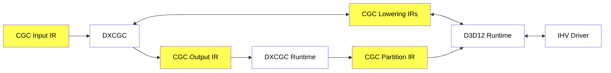
There are four types of MLIRs to focus on in this document:

1. **Input IR**: unoptimized hardware-agnostic representation of a graph produced by an importer/tool.
2. **Output IR**: optimized hardware-specific representation of a graph produced by the DX Compute Graph Compiler. This is conceptually one big executable with statically planned memory, but it is broken down into smaller executable chunks (partitions).
3. **Partition IR**: a piece of Output IR that is compiled and executed atomically from the programmer's perspective. A single output comprises one or more partitions, which are conceptually like independently compiled and linked *functions* in an executable (output IR).
4. **Lowering IRs**: broad term for IRs that are involved in lowering Input IR to Output IR during compilation. D3D applications do not generally need to be aware of these IRs and they are only briefly covered in this doc.

Each IR is represented using a mixture of ops/types/attributes defined in a new set of CGC MLIR [dialects](https://mlir.llvm.org/docs/LangRef/#dialects) (`cgc.*`, `cgc_op.*`, etc.). For example, the convolution layer maps to the `convolution` operation in the `cgc_op` dialect. The `cgc_op` dialect is a high-level dialect that contains abstract representations of ML layers, similar to [ONNX](https://onnx.ai/onnx/operators/), and the `cgc` dialect contains foundational elements like data types and memory views.

The next sections will focus on the first three IRs at a high level for illustrative purposes. A contrived 7-layer network topology that is much simpler than most real-world models is used for illustrative purposes, and the text representation of MLIR is slightly simplified for the sake of brevity.

### Input IR

A simple network is visualized below with network layers in blue and resource bindings in green/yellow. This is called a dataflow graph, and it represents the semantic intent of the overall computation rather than the explicit implementation.

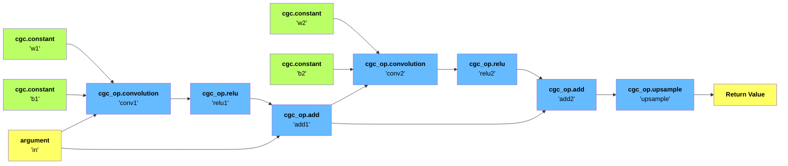
The example network in the human-readable textual form is shown below:

```mlir
cgc.module
{
    cgc.entry_point @main(%in: !cgc.tensor<1x1x4x4!cgc.float32>) -> cgc.tensor<1x1x8x8!cgc.float32>
    {
        // SSA variable references to externally bound named constants as opposed to
        // positional arguments of the main function.
        %w1 = cgc.constant("w1")
        %b2 = cgc.constant("b2")
        %w2 = cgc.constant("w2")
        %b1 = cgc.constant("b1")

        %conv1 = cgc_op.convolution(%in, %w1, %b1) { start_padding=[1,1], end_padding=[1,1], ... } 
        %relu1 = cgc_op.relu(%conv1) 
        %add1 = cgc_op.add(%relu1, %in)

        %conv2 = cgc_op.convolution(%add1, %w2, %b2) { start_padding=[1,1], end_padding=[1,1], ... } 
        %relu2 = cgc_op.relu(%conv2)
        %add2 = cgc_op.add(%relu2, %add1)

        %upsample = cgc_op.upsample(%add2)

        cgc.return %upsample
    }
}
```

The basic text format of the MLIR operations presented above is `<dialect>.<operation>(<arguments>) {<attributes>} : (<argument types>) -> <return types>`. However, the printed MLIR presented in this doc is slightly simplified and omits details on [*source location*](https://mlir.llvm.org/docs/Diagnostics/#source-locations), [*blocks*](https://mlir.llvm.org/docs/LangRef/#blocks), and [*regions*](https://mlir.llvm.org/docs/LangRef/#regions) associated with every MLIR operation. It also hides many types and attributes for brevity.

### Output IR

The job of DXCGC is to translate the *abstract* operations from CGC Input IR (convolution, matrix multiply, add, etc.) to a graph of *concrete* operations (codegen'able implementations) that can be executed on a set of ***targets***. This process is called *lowering*, and the resulting MLIR is referred to as *CGC Output IR*. Examples of *targets* include: 

- A hardware driver for a physical device that provides highly optimized implementations
- A software library that provides generic fallback implementations
- Application code that provides specialized implementations

The initial version of DXCGC relies on lowering to target-specific *connected subgraphs*, which conceptually represent fusions. The full lowering process involves additional graph transformations, and future versions of DXCGC will introduce concrete operations beyond subgraphs, but for the purpose of this doc we will focus exclusively on subgraphs.

To extend our earlier example, let's say a hardware driver supports fusing `conv -> relu -> add` as a subgraph. Let's also say the upsample layer isn't explicitly implemented by the driver, so it ends up getting lowered into a fallback implementation (e.g., shader implementation). The lowered output would resemble the following:

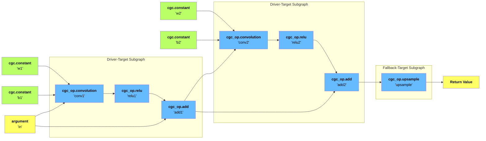
DXCGC incorporates subgraphs using a declarative approach: targets tell DXCGC the types of subgraph *patterns* they support (independent of any specific graph), these patterns are applied by DXCGC transforming the Input IR, and each target is then responsible for providing implementations for matched subgraphs at runtime. Target subgraph patterns are not limited to fixed DAGs of operations shown in this contrived example. For example, a dynamic subgraph pattern could be "convolution followed by an arbitrary sequence of elementwise operations" (so-called epilogue fusion). Furthermore, subgraph patterns can declare constraints on data types, tensor shapes, memory layout, alignment, attribute values, and more. The details of how declarative subgraph patterns work are out of scope for this doc (falling under the "lowering IRs" mentioned earlier), and we will only look at the effects of subgraphs on resulting Output IR.

The Output IR in MLIR text form reveals both the driver and fallback subgraphs as well as how they are connected. Subgraphs appear as externally implemented functions that are associated with a concrete DAG of input IR ops and tensors (the "functional definition"). We also see an "origin" attribute on each subgraph that makes clear which target is responsible for implementing it. Subgraph invocations are organized into *partitions*, another function-like concept that serves as a bridge between abstract *tensors* and concrete *memory references* -- we'll cover this in more detail in the next section. Finally, partition invocations are organized into a *program* that serves as the main entrypoint for end-to-end execution.

```mlir
cgc.module
{
    // ---------------------------------------------------------------------
    // Portion implemented by driver target
    // ---------------------------------------------------------------------

    cgc.subgraph @convReluAdd attributes {origin = "driverTarget", ...}
    {
        cgc.functional_definition private @convReluAddFunctional(
            %in: !cgc.tensor<1x1x4x4x!cgc.float32>, 
            %w:  !cgc.tensor<constant 1x1x3x3x!cgc.float32>, 
            %b:  !cgc.tensor<constant 1x!cgc.float32>) -> !cgc.tensor<1x1x4x4x!cgc.float32> 
        {
            %0 = cgc_op.convolution (%in, %w, %b) { start_padding=[1,1], end_padding=[1,1], ... } 
            %1 = cgc_op.relu (%0)
            %2 = cgc_op.add (%1, %in)
            cgc.return %2
        }
    }

    cgc.partition @driverPartition(
        %in:      !cgc.memref<1x1x4x4x!cgc.float32>, 
        %w1:      !cgc.memref<constant 1x1x3x3x!cgc.float32>, 
        %b1:      !cgc.memref<constant 1x!cgc.float32>, 
        %w2:      !cgc.memref<constant 1x1x3x3x!cgc.float32>, 
        %b2:      !cgc.memref<constant 1x!cgc.float32>, 
        %output:  !cgc.memref<1x1x4x4x!cgc.float32>,
        %scratch: !cgc.memref<1x1x4x4x!cgc.float32>) 
    {
        cgc.invoke @convReluAdd(%in, %w1, %b1, %scratch)
        cgc.invoke @convReluAdd(%scratch, %w2, %b2, %output)
        cgc.return
    }

    // ---------------------------------------------------------------------
    // Portion implemented by fallback target
    // ---------------------------------------------------------------------

    cgc_subgraph.subgraph @upsample attributes {origin="fallbackTarget", ...}
    {
        cgc_subgraph.functional_definition private @upsampleFunctional(
            %in: !cgc.tensor<1x1x4x4x!cgc.float32>) -> !cgc.tensor<1x1x8x8x!cgc.float32>
        {
            %0 = cgc_op.upsample2d (%in) { scale_size=[2,2], ... }
            cgc.return %0
        }
    }

    cgc.partition @fallbackPartition(
        %in: !cgc.memref<1x1x4x4x!cgc.float32>, 
        %out: !cgc.memref<1x1x8x8x!cgc.float32>)
    {
        cgc.invoke @upsample(%in, %out)
        cgc.return
    }

    // ---------------------------------------------------------------------
    // Orchestration of end-to-end execution managed by runtime
    // ---------------------------------------------------------------------

    cgc.program @main(
        %in:      !cgc.memref<1x1x4x4x!cgc.float32>, 
        %out:     !cgc.memref<1x1x8x8x!cgc.float32>, 
        %scratch: !cgc.memref<64x!cgc.int8>)
    {
        %w1 = cgc.constant("w1")
        %b2 = cgc.constant("b2")
        %w2 = cgc.constant("w2")
        %b1 = cgc.constant("b1")
        
        %0 = cgc.view_memref %scratch[0] : !cgc.memref<64x!cgc.int8> to !cgc.memref<1x1x4x4x!cgc.float32>
        cgc.invoke @driverPartition(%in, %w1, %b1, %w2, %b2, %0)
        cgc.invoke @fallbackPartition(%0, %out)
        cgc.return
    }
}
```

There are many details and concepts that are hidden here for simplicity, but the important takeaway is that Output IR is simply a DAG of partition calls reachable through a `cgc.program`, and each partition is a DAG of subgraph calls. The hierarchy is:

- `cgc.module` (1) : the entire output IR
  - `cgc.program` (1) : the entrypoint for end-to-end execution at runtime
    - `cgc.partition` (1+) : collection of subgraphs to compile/execute as a unit
      - `cgc.subgraph` (1+) : logical fusion of abstract ops from input IR

### Partition IR

Partitions bridge the gap between abstract data views (tensors) and concrete data views (memrefs) as well as providing more control over execution scheduling. In this example the output IR comprises two partitions that must be independently executed with different resource bindings (solid arrows). This is visualized below, with the body of the `cgc.program` acting as a sequence of partition invocations. There is a dependency (dotted arrow) between the two partitions because of shared use of scratch memory.

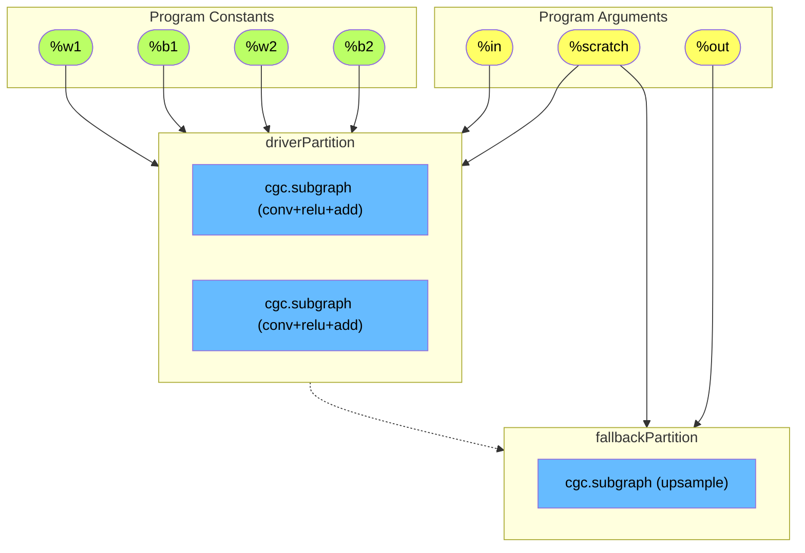
A few important things to note on the output IR:

- Most performance is expected to originate from driver-declared subgraphs, but fallback is provided by the DXCGC runtime (explained later) for drivers that don't yet have support for direct MLIR lowering.
- In addition to lowering operations, DXCGC also performs [static memory planning](#memory-planning). All output IR operations consume *memrefs* (strided views of buffers) instead of *tensors* (variables with ambiguous storage details).
- Intermediate memory for subgraphs is suballocated from a scratch argument (`%scratch`) that is bound as an input to the network. More complicated graphs may have multiple scratch allocations, and it's even possible that non-intermediate inputs are part of the scratch allocation if they aren't needed after inference.

One critical observation is that DXCGC compilation as shown here is dependent on subgraph declarations from drivers at runtime, which implies graph compilation is a JIT-only process (as was the case for shader bytecode to machine code for many years). However, the intention is to hoist subgraph patterns from drivers into offline compiler toolchains (see [MLIR program precompilation](#program-precompilation)). The preview version of DXCGC does not support AOT compilation, but we aim to support this in the near future.

Partitions in the output IR demarcate the scope of work that a driver (or other target) is required to compile and execute. Drivers do not process the *full* MLIR module but instead the individual partitions. In comparison to the shader programming model, the role of an MLIR program partition is similar to a compute shader pipeline state object (PSO); the D3D application is responsible for compiling, binding, and dispatching at the partition scope. The need for multiple partitions arises from:

- Supporting fallback with shaders and metacommands through existing D3D shader APIs. For now, there is no plan or mechanism for drivers to digest these concepts through MLIR directly.
- Flexibility in giving the D3D client an opportunity to own [execution scheduling](#execution-scheduling).
- Flexibility in giving the D3D client an opportunity to own multi-threaded compilation of partitions.
- Improving cache friendliness of compiled work by avoiding overspecialization of partitions.

Earlier, we saw an example where the compiler organized two subgraph dialect operations into a single partition and a shader dialect operation into a second partition. The portion of the output IR that the driver actually sees is restricted to the symbols reachable from the partition. In other words, the following "isolated" snippet of IR is what is ultimately passed to the driver when compiling a partition into an executable D3D12 API object:

```mlir
cgc.module
{
    cgc.subgraph @convReluAdd attributes {origin = "ihv.driver", ...}
    {
        cgc.functional_definition private @convReluAddFunctional(
            %in: !cgc.tensor<1x1x4x4x!cgc.float32>, 
            %w:  !cgc.tensor<constant 1x1x3x3x!cgc.float32>, 
            %b:  !cgc.tensor<constant 1x!cgc.float32>) -> !cgc.tensor<1x1x4x4x!cgc.float32> 
        {
            %0 = cgc_op.convolution (%in, %w, %b) { start_padding=[1,1], end_padding=[1,1], ... } 
            %1 = cgc_op.relu (%0)
            %2 = cgc_op.add (%1, %in)
            cgc.return %2
        }
    }

    cgc.partition @driverPartition(
        %in:      !cgc.memref<1x1x4x4x!cgc.float32>, 
        %w1:      !cgc.memref<constant 1x1x3x3x!cgc.float32>, 
        %b1:      !cgc.memref<constant 1x!cgc.float32>, 
        %w2:      !cgc.memref<constant 1x1x3x3x!cgc.float32>, 
        %b2:      !cgc.memref<constant 1x!cgc.float32>, 
        %output:  !cgc.memref<1x1x4x4x!cgc.float32>,
        %scratch: !cgc.memref<1x1x4x4x!cgc.float32>) 
    {
        cgc.invoke @convReluAdd(%in, %w1, %b1, %scratch)
        cgc.invoke @convReluAdd(%scratch, %w2, %b2, %output)
        cgc.return
    }
}
```

Alternatively, DXCGC could have split output IR up into three partitions:

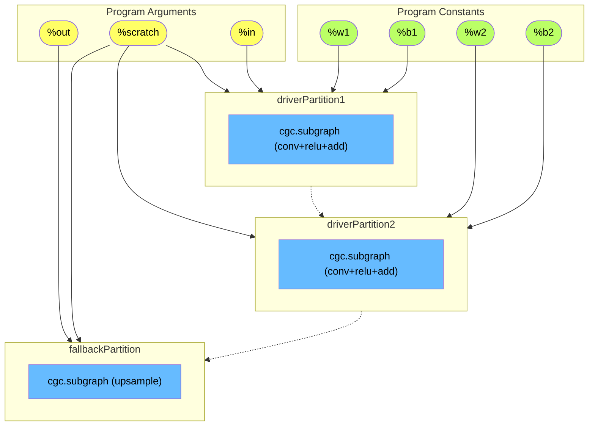
Ultimately, both partitionings above are valid and have pros and cons. For example, the second finer-grained partitioning is useful if the subgraph ops are expensive to compile: the client may compile all three partitions in parallel on separate threads. In the first example, the driver is required to compile both subgraph ops on a single thread. In general, the granularity of partitioning represents a tunable knob that shifts responsibility from the D3D client (many small partitions) to the driver (few large partitions).

### Partition Binding

Planning memory in advance is crucial for maximizing performance and minimizing the memory footprint at runtime; as such, there are no dynamic memory allocation operations in the output IR. Concrete operations in the output IR consume memrefs, which are simply views into existing resources. At runtime the D3D client must associate resources with the arguments and constants consumed by each MLIR program partition. As the previous section explained, partitions represent independently executable units of work with their own bindings.

```mlir
cgc.partition @driverPartition(
    %in:      !cgc.memref<1x1x4x4x!cgc.float32>, 
    %w1:      !cgc.memref<constant 1x1x3x3x!cgc.float32>, 
    %b1:      !cgc.memref<constant 1x!cgc.float32>, 
    %w2:      !cgc.memref<constant 1x1x3x3x!cgc.float32>, 
    %b2:      !cgc.memref<constant 1x!cgc.float32>, 
    %output:  !cgc.memref<1x1x4x4x!cgc.float32>,
    %scratch: !cgc.memref<1x1x4x4x!cgc.float32>) 
{
    cgc.invoke @convReluAdd(%in, %w1, %b1, %scratch)
    cgc.invoke @convReluAdd(%scratch, %w2, %b2, %output)
    cgc.return
}
```

In the optimized MLIR representations (output IR or partition IR), each partition has a flat list of positional arguments for all resource bindings (both inputs and outputs are arguments). These arguments are also called "bind points" in the API, and this example has 7 bind points:

- Bind point 0 = in
- Bind point 1 = w1
- Bind point 2 = b1
- Bind point 3 = w2
- Bind point 4 = b2
- Bind point 5 = output
- Bind point 6 = scratch

The D3D client must supply 7 bindings when executing this partition. GPU virtual addresses are used to link the bind points with D3D resources. This topic is covered in more detail later on in the section [Resource Binding](#resource-binding).

### DXCGC Runtime

As noted earlier, compiler targets such as a driver are only responsible for implementing individual partitions. *Something* (the D3D application) must orchestrate resource allocation, compilation of partitions, and scheduling of partitions. This responsibility may be very little (e.g., there is a single partition), but it might also more work if there are many partitions. These may seem like unnecessary steps (why not let the D3D runtime or driver handle it?), but it is intentional and desirable:

1. We don't want to limit DXCGC output to working purely with the latest D3D runtime and drivers, since this would severely limit its value to ISVs. Shaders don't require new interfaces or drivers to execute. However, this means some code above D3D has to parse the MLIR, translate shaders into command list dispatches, and translate execution-order dependencies into barriers.
2. The client has more opportunity for control of execution scheduling and multi-threaded compilation of partitions.

We are building an optional DXCGC runtime component that handles direct execution of output IR in a robust way, though it is intended as a starting point and not a requirement for end users. This will greatly simplify the execution flow while giving flexibility to modify or take control where needed.

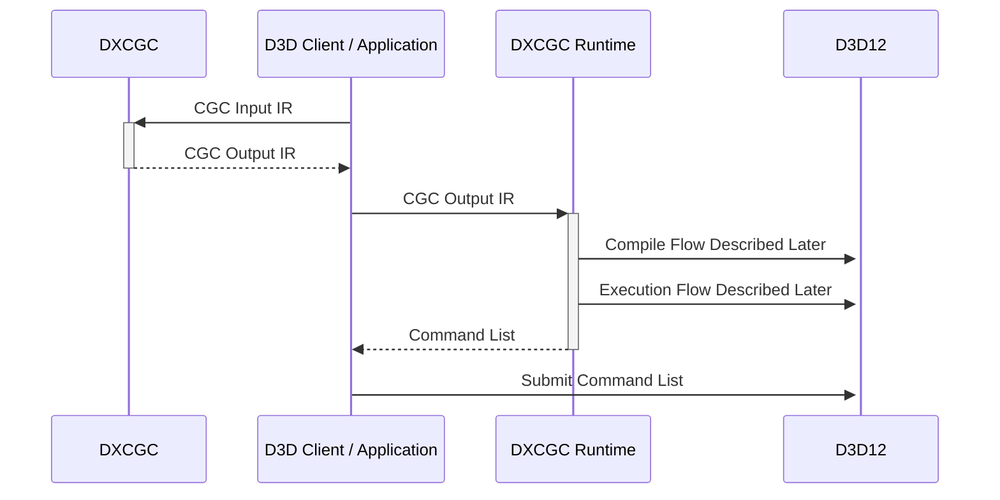
For convenience this runtime component is built as a library with an API, but we do not envision this component as a versioned and opaque DLL component that ships in Windows; instead, this is something we intend to ship as an open-source sample that developers can modify and integrate with their engines as needed. The runtime is a helper layer that is not mandatory for correctly executing CGC Output IR, but it can simplify dependencies for applications that do not want to parse MLIR and handle fallback manually.

## MLIR Programs

The previous section covered DXCGC and its use of MLIR to represent an unoptimized network ("input IR") as well as an optimized representation ("output IR"). While optimized, the output of the DXCGC is still just another intermediate representation that needs to be translated into device-specific machine code before it can be executed. This section explains how the optimized MLIR bytecode is fully compiled and executed using *MLIR programs* in D3D12. There are similarities between MLIR programs and shader programs, and it may be helpful to compare the two along certain dimensions:

| Role               | Shader Program            | MLIR Program (for DXCGC)  |
| ------------------ | ------------------------- | ------------------------- |
| Compiler Input     | HLSL                      | CGC Input IR              |
| Compiler Output    | DXIL                      | CGC Output/Partition IR   |
| Interchange Format | DX Container              | MLIR Bytecode             |
| IR Versioning      | Shader Model              | Semantic Version          |
| IR Identity        | Shader Profile            | MLIR Interface            |
| Compile API        | Generic Program Subobject | MLIR Program Subobject    |
| Dispatch API       | Commandlist Dispatch      | Commandlist DispatchGraph |

We covered the compiler input/output representations for DXCGC IRs in the previous section. This section will focus on the interchange format, versioning, and compile/execute APIs.

### Interchange Format

DXCGC IRs are transmitted across component boundaries using [MLIR bytecode](https://mlir.llvm.org/docs/BytecodeFormat/), which allows two components with different versions of MLIR to serialize and deserialize correctly. In order to guarantee this, however, the MLIR itself must comprise dialects that are immutable; it is for this reason that CGC IRs use CGC dialects only, at least at the public interface.

MLIR has a [*built-in*](https://mlir.llvm.org/docs/Dialects/Builtin/) dialect that expresses some of the same concepts in CGC dialects (`func.func`, `module`, `tensor`, and others), and there are also upstream dialects that capture high-level operations similar to `cgc_op`. These dialects are not directly usable in DXCGC IRs since we cannot guarantee they will not be broken; however, within DXCGC itself (or drivers/targets that have their own version of MLIR/LLVM) it is feasible and encouraged to convert to upstream dialects where it makes sense.

Parsing MLIR bytecode directly without depending on MLIR itself is possible, but it is limited to obtaining top-level information like the names of dialects and operations used. Interpreting the semantics of the encoded dialects requires access to definitions of the dialects, and this ultimately means taking a build-time dependency on MLIR (and thus consuming the whole LLVM repo). As an optional component, we will provide a standalone helper library for lightweight traversal of DXCGC IRs with a simple interface for the convenience of D3D12 applications and PIX. This library will be fully open source so that projects can extend or modify it if needed; there is no need to use an "official" version of this library, since any project that already consumes MLIR might prefer to simply add the DXCGC dialects (also open source) into its codebase. We anticipate that drivers might not use this library at all -- some drivers already consume MLIR -- but the DXCGC-oriented interfaces may still be useful for reference or ease of use.

### IR Versioning

DXCGC IRs are composed of CGC dialects that get versioned together using semantic versioning; if any CGC dialect is extended, then all CGC dialects collectively get bumped together into a new updated version. To keep things backward compatible, CGC dialects are only ever extended: existing ops/types/attributes are never changed or deleted. 

### IR Identity

MLIR bytecode by itself is insufficient to identify *what* the encoded data represents or how it should be used. For example, how does a component know that a serialized MLIR bytecode captures CGC Input IR or CGC Output IR? The dialects and ops within the MLIR might give some clues, but deducing the semantics from the presence of specific dialects or operations is brittle. For this reason, we use the notion of "MLIR interfaces" to define the role of different types of MLIR flowing through the DirectX stack. Some examples of MLIR interfaces for DXCGC are listed in [DXCGC MLIR Interfaces](#dxcgc-mlir-interfaces).

Interfaces are associated with a GUID to help the compiler, runtime, drivers, and tools easily and quickly recognize, interpret, and validate any MLIR they might encounter. The GUID may be embedded directly in the MLIR bytecode (e.g., as an attribute of the top-level module), but it may also be stored externally from the MLIR bytecode. The D3D runtime will only permit MLIR bytecode to flow between the D3D client and driver when it recognizes the MLIR interface GUID, though this restriction may be relaxed when executing with developer mode.

MLIR interfaces are immutable once introduced. In other words, the full set of MLIR dialects (and their respective operations, types, etc.) must be static when an interface is introduced. This is similar to how shader models define a set of requirements, and it avoids a moving target for drivers and tools to support. Extensions to any existing MLIR interface require a new interface name and GUID.

### Compile API

A simplified view of MLIR program compilation is presented in this section. It is useful to contrast MLIR compilation with shader compilation, so we start with how compute shaders are compiled (using [*state objects*](https://microsoft.github.io/DirectX-Specs/d3d/Raytracing.html#state-objects) introduced in DXR and extended to support [*programs*](https://microsoft.github.io/DirectX-Specs/d3d/WorkGraphs.html#program) with work graphs; this is largely identical to the classic compute pipeline state object flow but uses a more generic API).

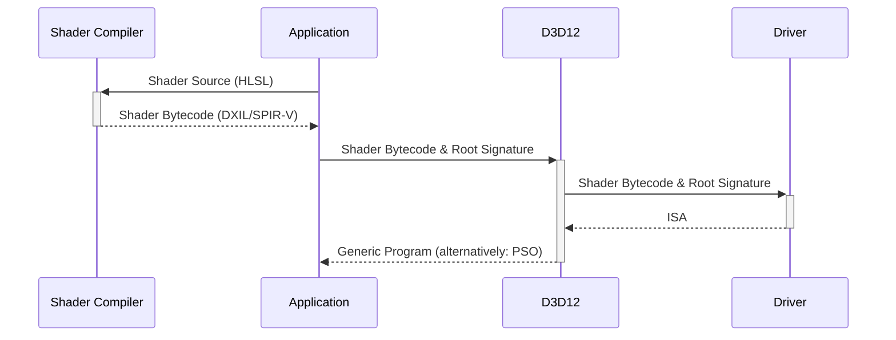
MLIR compilation with DXCGC is illustrated below, and it is largely identical to how shaders are compiled into state objects. The key difference with MLIR program compilation is the need to loop over partitions in Output IR and compile each separately.

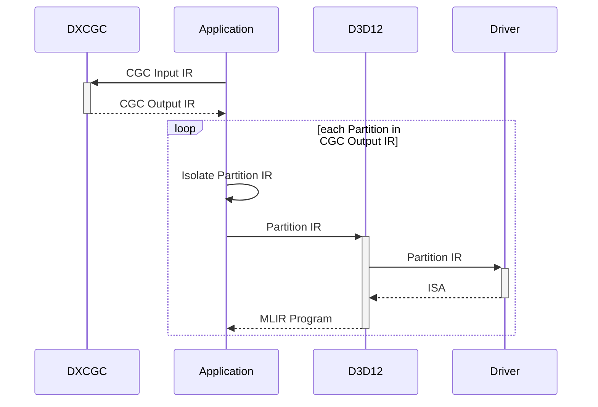
If there are multiple targets used in the compilation of CGC Input IR, then non-driver partitions need to be compiled using the appropriate APIs (not shown above). For example, a fallback target that provides shader or metacommand implementations of MLIR subgraphs will have partition IR translated to existing D3D12 APIs.

### Dispatch API

Shaders and MLIR programs can coexist in the same D3D command list, though they will use separate interfaces for command recording (`Dispatch` for compute shaders, `DispatchGraph` for MLIR programs). Eventually the two paths even interoperate more closely (e.g., shaders calling MLIR programs), but this is out of scope for now.

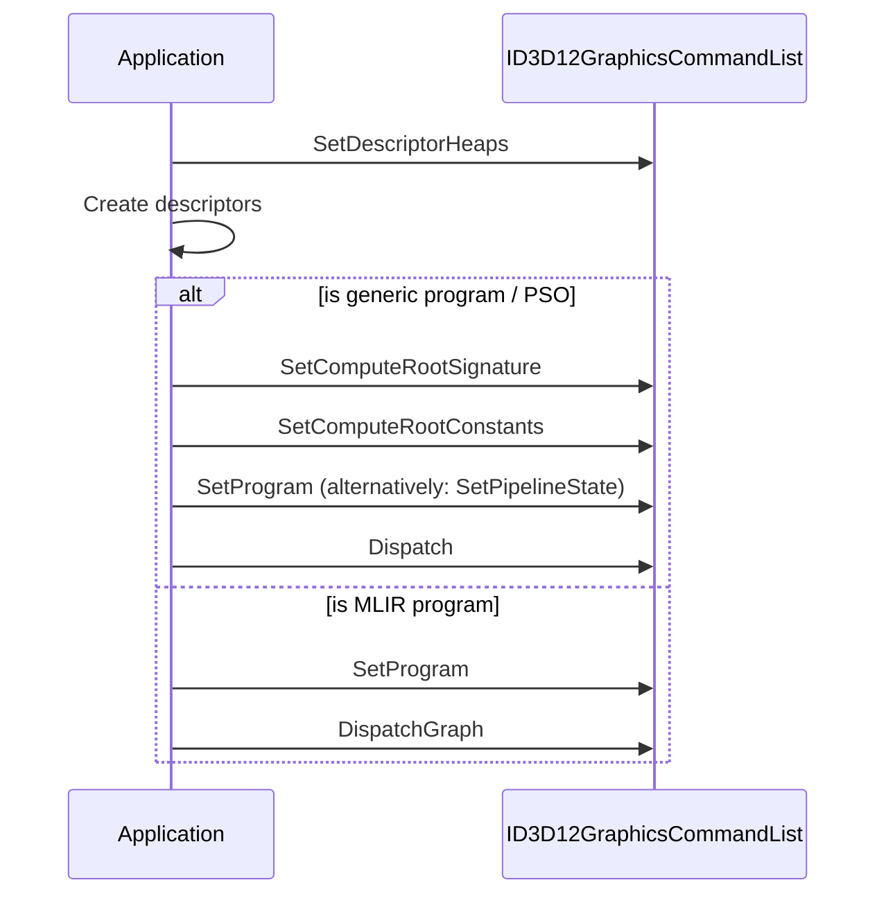
Once a command list is recorded, it can be submitted to a command queue like any other D3D work. The resource binding structure for shaders (generic programs or PSOs) is a root signature. The resource binding structure for MLIR programs is the list of partition bind points in the MLIR, and resource bindings are supplied directly to the `DispatchGraph` call.

### Resource Binding

The two primary mechanisms for referencing device memory in D3D12 are *GPU virtual addresses* (GPUVAs) and *descriptors*, with the former being a raw pointer and the latter capturing richer semantics about how the memory is utilized or viewed.

Descriptors are essential for shader-based workloads, but they are slightly awkward for compute workloads that don't use compute shaders: the most appropriate view type for these workloads is a UAV, but some of the [fields](https://learn.microsoft.com/en-us/windows/win32/api/d3d12/ns-d3d12-d3d12_unordered_access_view_desc) aren't entirely applicable (DXGI formats might not match with tensor formats, element-sized offset with `FirstElement` is clunky, raw UAVs aren't relevant, etc.). UAVs are also subject to some alignment constraints that make them problematic for ML workloads (e.g., eliding joins/gathers by offsetting writes to addresses that may not align with 4 current byte requirement). In light of the drawbacks of using UAVs, MLIR programs bind through GPUVAs.

Resource bindings are always buffers with unordered access:

- **Enhanced Barrier Access**: all resource bindings must be accessible with `D3D12_BARRIER_ACCESS_COMMON` or `D3D12_BARRIER_ACCESS_UNORDERED_ACCESS`.

- **Legacy Barrier State**: all resource bindings must be accessible with `D3D12_RESOURCE_STATE_COMMON` or `D3D12_RESOURCE_STATE_UNORDERED_ACCESS`.

*NOTE: binding directly through GPUVAs also removes the opportunity for recording a command list once and swapping out the bindings with volatile descriptors. In order to enable this "command list reuse" optimization we would need to add an indirection, like binding a GPUVA to a buffer that itself contains the address for the actual data for the bind point. This may be added in the future with a flag like `D3D12_MLIR_PROGRAM_BINDING_FLAG_INDIRECT` or similar. Additionally, descriptor support may be added for texture access in the future.*

### Synchronizing Work

MLIR program dispatches (i.e., `ID3D12GraphicsCommandList::DispatchGraph`) in a command list are by default asynchronous with respect to other work recorded into that same command list: the driver is free to execute an MLIR program immediately and in parallel with other work so long as it respects the semantics of all previously encountered resource barriers and implicitly synchronizing operations (e.g., `ClearUnorderedAccessView`). In other words, the behavior for synchronizing MLIR program dispatches is identical to the behavior for compute shader dispatches (i.e., `ID3D12GraphicsCommandList::Dispatch`) with unordered access; the synchronization scope for a `DispatchGraph` using an MLIR program is `D3D12_BARRIER_SYNC_COMPUTE_SHADING`.

**Inter-dispatch synchronization**: Resource access in an MLIR program is dictated by the GPUVAs associated with the MLIR partition's bind points during a `DispatchGraph` call. The D3D client is responsible for explicitly recording buffer-specific barriers or global barriers between an MLIR program dispatch and any dependent operations that affect its input resources.

**Intra-dispatch synchronization**: A compiled MLIR program may logically encapsulate multiple "suboperations" (e.g., multiple CGC subgraph ops); however, from the perspective of the D3D client, this partition is treated as a single atomic unit of work. The driver is responsible for synchronization of suboperations within an MLIR program.

### Bytecode Validation

The DX shader compiler performs a [*bytecode validation*](https://github.com/microsoft/hlsl-specs/blob/main/proposals/infra/INF-0004-validator-hashing.md) step when compiling shader source to bytecode (i.e., HLSL to DXIL) to ensure the emitted instructions conform to the rules of a shader model. Shader bytecode validation is performed in the *DXIL Validator*, which is a library that is independent of the shader compiler itself. Upon successful validation the validator will compute and store a hash in the 16-byte DX container digest field, and this hash serves as a proxy to indicate to the D3D runtime that the bytecode has been previously validated: the validator and runtime use the same hashing algorithm, so the two should derive the same hash value barring any tampering or skipped validation (the digest would be empty).

For MLIR programs, the strategy is a relaxed since MLIR has built-in validation to guarantee the compiler does not emit invalid IR. Additionally, the Partition IR for subgraph workloads is largely dependent on externally defined implementations from the IHV driver target. The driver will only need to validate that it receives subgraphs compatible with what it previously declared, which cannot be rigorously enforced or checked by DXCGC or D3D12.

### D3D Debug Layer

When enabled, the D3D debug layers can perform some additional runtime validation to catch developer errors. For MLIR programs this validation includes:

- Validate all bindings are non-null in the `DispatchGraph` arguments.
  - MLIR programs do not have optional bindings since memory planning and algorithm selection is finalized during compilation. All bind points should point to valid resources or they would not exist as bind points in the output IR.
- Validate bounds on GPUVA/CPU bindings by looking up respective bind point metadata in DX container.
  - The debug layer can ensure resources bound by the application are suitably large to not have out-of-bounds access.

### Program Precompilation

⚠️ *This section covers a feature that is planned but not fully implemented.*

[Advanced Shader Delivery](https://devblogs.microsoft.com/directx/introducing-advanced-shader-delivery/) (or ASD) transitions shader bytecode-to-ISA compilation from a runtime step to an offline step. Normally this process requires both the D3D runtime and a hardware driver, but the design calls for the IHV shader compiler to be hoisted out of the driver into a plugin that can be invoked in an offline compile toolchain. At a conceptual level, this offline compile process looks something like the diagram below (not entirely accurate -- read the full D3D specs for details):

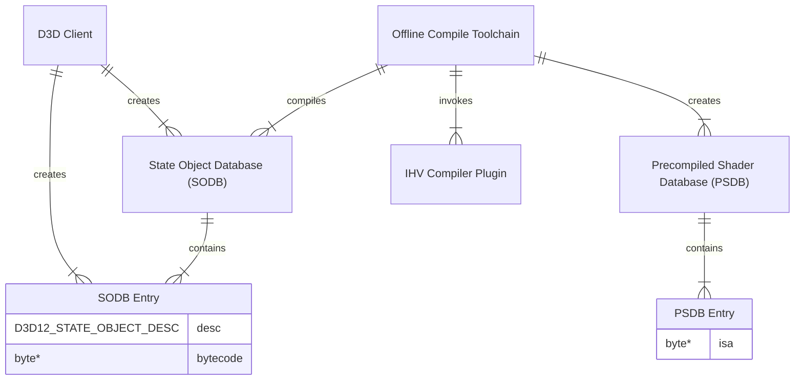
In a nutshell:

- The D3D client produces a *state object database* (SODB) comprising descriptions of the *state objects* (SOs) or *pipeline state objects* (PSOs) likely to be encountered at runtime along with associated shader bytecode (DXIL). In other words, all of the arguments to any future invocations of `CreateStateObject` or `CreatePipelineState` are bundled up in this SODB.
- The SODB is processed by a toolchain that may invoke one or more IHV compiler plugins to produce a *precompiled shader database* (PSDB). This is a database comprising the GPU ISA associated with the SOs/PSOs in the SODB.
- Later, at runtime, the PSDB may be explicitly or implicitly utilized to avoid incurring the runtime compile cost since the ISA is already available. The D3D client still passes in SO/PSO creation args (descs and bytecode) for fallback, but compilation to ISA is skipped if there is a cache hit within the PSDB.

Offline compilation of MLIR programs would be tremendously advantageous since the compile time for a DNN may be considerable. This offline toolchain fits well not only for shader precompilation but also MLIR program precompilation: MLIR program SO descs and bytecode map 1:1 with shader SO/PSO descs and bytecode. DXCGC could trivially build an SODB covering all MLIR partitions in one or more input networks and produce a PSDB with perfect coverage for those networks (unlike game engines, there is no guesswork or large SO/PSO space that needs to be sampled to produce the SODB). However, there are a few issues:

- **DXCGC needs declarative subgraphs** to lower CGC Input IR to Output IR. In other words, we would need to extend the IHV compiler plugin interface and toolchain to reflect the MLIR capabilities covered by the `D3D12_FEATURE_MLIR_EXCHANGE` API later.

- **DXCGC needs constant preprocessing** to occur offline to fully eliminate some runtime initialization overhead. Constant preprocessing isn't covered in this doc, but it involves transforming model parameters into hardware-optimal layouts. It might not be appropriate to store preprocessed weights in a PSDB, but it could be a valuable step in offline compilation of MLIR programs.

These issues will be explored in an upcoming revision of this doc.

## D3D12 API

### Device Methods

Per D3D12 device interface semantics, these device methods can be called by multiple threads simultaneously.

#### CheckFeatureSupport

✅ *This is an existing D3D12 method that is **unchanged**.*

```cpp
HRESULT CheckFeatureSupport(
    D3D12_FEATURE Feature,
    _Inout_updates_bytes_(FeatureSupportDataSize) void* pFeatureSupportData,
    UINT FeatureSupportDataSize
    );
```

This is the generic D3D API for querying feature support and isn't specific to MLIR programs.

- To query for MLIR program support, pass [D3D12_FEATURE_D3D12_OPTIONS_MLIR](#d3d12_feature) for Feature, and point pFeatureSupportData to a [D3D12_FEATURE_DATA_D3D12_OPTIONS_MLIR](#d3d12_feature_data_d3d12_options_mlir) variable. This has a member `D3D12_MLIR_PROGRAMS_TIER MlirProgramsTier`.
- To query for MLIR interface support, pass [D3D12_FEATURE_MLIR_INTERFACE_SUPPORT](#d3d12_feature) for Feature, and point pFeatureSupportData to a [D3D12_FEATURE_DATA_MLIR_INTERFACE_SUPPORT](#d3d12_feature_data_mlir_interface_support) variable. This allows the client to check a number of specific MLIR interfaces.
- To send/receive MLIR data specific to an MLIR interface (e.g., declarative subgraph transformations), pass [D3D12_FEATURE_MLIR_EXCHANGE](#d3d12_feature) for Feature, and point pFeatureSupportData to a [D3D12_FEATURE_DATA_MLIR_EXCHANGE](#d3d12_feature_data_mlir_exchange) variable.

##### D3D12_FEATURE

⚠️ *This is an existing D3D12 enum that is **extended**.*

```diff
enum D3D12_FEATURE
{
    ...
    D3D12_FEATURE_BYTECODE_BYPASS_HASH_SUPPORTED = 57,
    ...
+   D3D12_FEATURE_D3D12_OPTIONS_MLIR             = 68,
+   D3D12_FEATURE_MLIR_EXCHANGE                  = 69,
+   D3D12_FEATURE_MLIR_INTERFACE_SUPPORT         = 70,
};
```

Three new values are added:

- `D3D12_FEATURE_D3D12_OPTIONS_MLIR`: for querying general MLIR program support. See [D3D12_FEATURE_DATA_D3D12_OPTIONS_MLIR](#d3d12_feature_data_d3d12_options_mlir)
- `D3D12_FEATURE_MLIR_EXCHANGE`: for queries encoded as MLIR. See [D3D12_FEATURE_DATA_MLIR_EXCHANGE](#d3d12_feature_data_mlir_exchange)
- `D3D12_FEATURE_MLIR_INTERFACE_SUPPORT`: for querying specific MLIR interface support. See [D3D12_FEATURE_DATA_MLIR_INTERFACE_SUPPORT](#d3d12_feature_data_mlir_interface_support)

##### D3D12_FEATURE_DATA_D3D12_OPTIONS_MLIR

🆕 *This is a new D3D12 struct.*

```cpp
struct D3D12_FEATURE_DATA_D3D12_OPTIONS_MLIR
{
    _Out_ D3D12_MLIR_PROGRAMS_TIER MlirProgramsTier;
};
```

This struct reports support for MLIR programs (not specific to any MLIR interface).

| Member                     | Definition                                                                                                                                      |
| -------------------------- | ----------------------------------------------------------------------------------------------------------------------------------------------- |
| `D3D12_MLIR_PROGRAMS_TIER` | Indicates support for MLIR programs in general (not specific to any MLIR interface). See [D3D12_MLIR_PROGRAMS_TIER](#d3d12_mlir_programs_tier). |

##### D3D12_MLIR_PROGRAMS_TIER

🆕 *This is a new D3D12 enum.*

```cpp
enum D3D12_MLIR_PROGRAMS_TIER
{
    D3D12_MLIR_PROGRAMS_TIER_NOT_SUPPORTED = 0,
    D3D12_MLIR_PROGRAMS_TIER_1_0           = 10,
    D3D12_MLIR_PROGRAMS_TIER_2_0           = 20,
};
```

Expresses support for MLIR programs. Support is typically additive, with higher tiers being more capable than earlier tiers.

| Member                                   | Definition                                                                                                                                                                                 |
| ---------------------------------------- | ------------------------------------------------------------------------------------------------------------------------------------------------------------------------------------------ |
| `D3D12_MLIR_PROGRAMS_TIER_NOT_SUPPORTED` | No support for MLIR programs on the device. Attempts to create any state objects containing MLIR programs will fail and using related APIs on command lists results in undefined behavior. |
| `D3D12_MLIR_PROGRAMS_TIER_1_0`           | The device supports MLIR programs with `D3D12_MLIR_PROGRAM_BINDING_TYPE_GPU` bindings.                                                                                                     |
| `D3D12_MLIR_PROGRAMS_TIER_2_0`           | The device supports MLIR programs with `D3D12_MLIR_PROGRAM_BINDING_TYPE_GPU` and `D3D12_MLIR_PROGRAM_BINDING_TYPE_CPU` bindings.                                                           |

##### D3D12_FEATURE_DATA_MLIR_EXCHANGE

🆕 *This is a new D3D12 struct.*

```cpp
struct D3D12_FEATURE_DATA_MLIR_EXCHANGE
{
    GUID MlirInterface;
    _Field_size_bytes_full_opt_(InputDataSizeInBytes) const void* pInputData;
    _In_ SIZE_T InputDataSizeInBytes;
    _Field_size_bytes_full_opt_(OutputDataSizeInBytes) void* pOutputData;
    _In_ SIZE_T* OutputDataSizeInBytes;
};
```

This struct is for exchanging MLIR data (both input and output data in the [DX Container format](#interchange-format)) that conveys ML compiler-specific information including but not limited to:

- Discovering a driver's declarative subgraph transformation capabilities independent of any network or tensor shapes.
- Discovering GPU hardware properties like cache sizes, tensor formats, MMA instruction alignments, and so on used for driving compilation decisions.
- Validating a driver's subgraph transformation with concrete tensor shapes.

It is not expected that a D3D12 app would directly invoke this API, and the MLIR interface GUIDs are externally defined to decouple churn in requirements from the D3D API.

| Member                  | Definition                                                                                                                                                                                                                                                                                                                                                                                                                                                           |
| ----------------------- | -------------------------------------------------------------------------------------------------------------------------------------------------------------------------------------------------------------------------------------------------------------------------------------------------------------------------------------------------------------------------------------------------------------------------------------------------------------------- |
| `MlirInterface`         | Unique identifier that captures the semantics and structure of the exchange. See [DXCGC MLIR Interfaces](#dxcgc-mlir-interfaces) for examples. If the runtime does not recognize the GUID, it will fail the API call (before the respective DDI is called) and return `E_INVALIDARG`; however, this block is removed when executing with Windows developer mode active. The driver should return `DXGI_ERROR_UNSUPPORTED` if it does not support the MLIR interface. |
| `pInputData`            | Pointer to input data (in [DX Container format](#interchange-format)) supplied by client and read by driver. May be null for some queries. Neither the runtime nor drivers may access this pointer once `CheckFeatureSupport` returns (the D3D client may free it immediately on return).                                                                                                                                                                       |
| `InputDataSizeInBytes`  | Size in bytes of `pInputData`.                                                                                                                                                                                                                                                                                                                                                                                                                                       |
| `pOutputData`           | Pointer to output data (in [DX Container format](#interchange-format)) written by driver and read by client. May be null for some queries. Neither the runtime nor drivers may access this pointer once `CheckFeatureSupport` returns (the D3D client may free it immediately on return).                                                                                                                                                                       |
| `OutputDataSizeInBytes` | Pointer to variable to store the size in bytes of `pOutputData`. This is written by the driver.                                                                                                                                                                                                                                                                                                                                                                      |

##### D3D12_FEATURE_DATA_MLIR_INTERFACE_SUPPORT

🆕 *This is a new D3D12 struct.*

```cpp
struct D3D12_FEATURE_DATA_MLIR_INTERFACE_SUPPORT
{
    _In_ UINT NumMlirInterfaces;
    _In_reads_(*NumMlirInterfaces) const GUID *pMlirInterfacesRequested;
    _Out_writes_(*NumMlirInterfaces) BOOL *pMlirInterfacesSupported;
};
```

This struct reports support for specific MLIR interfaces.

| Member                     | Definition                                                                                                                  |
| -------------------------- | --------------------------------------------------------------------------------------------------------------------------- |
| `NumMlirInterfaces`        | The number of MLIR interfaces the client is interested in using. See [IR Identity](#ir-identity). |
| `pMlirInterfacesRequested` | An array of GUIDs associated with the MLIR interfaces the client is interested in using.                                    |
| `pMlirInterfacesSupported` | An array of booleans indicating if the MLIR interface is supported.                                                         |

#### CreateStateObject

✅ *This is an existing D3D12 method that is **unchanged**.*

```cpp
HRESULT CreateStateObject(
    _In_ const D3D12_STATE_OBJECT_DESC* pDesc,
    _In_ REFIID riid, // ID3D12StateObject
    _COM_Outptr_ void** ppStateObject
    );
```

See the DXR spec for an overview of [state objects](https://microsoft.github.io/DirectX-Specs/d3d/Raytracing.html#state-objects). MLIR program partitions are encapsulated in an executable state object.

| Parameter         | Definition                                                                                                            |
| ----------------- | --------------------------------------------------------------------------------------------------------------------- |
| `pDesc`           | Description of the state object to create.                                                                            |
| `riid`            | `__uuidof(ID3D12StateObject)`                                                                                         |
| `ppStateObject`   | Returned state object.                                                                                                |
| `Return: HRESULT` | `S_OK` for success. `E_INVALIDARG`, `E_OUTOFMEMORY` on failure. The debug layer provides detailed status information. |

##### D3D12_STATE_OBJECT_DESC

✅ *This is an existing D3D12 struct that is **unchanged**.*

```cpp
struct D3D12_STATE_OBJECT_DESC
{
    D3D12_STATE_OBJECT_TYPE Type;
    UINT NumSubobjects;
    _In_reads_(NumSubobjects) const D3D12_STATE_SUBOBJECT* pSubobjects;
};
```

When compiling MLIR program workloads, type `Type` should be set to `D3D12_STATE_OBJECT_TYPE_EXECUTABLE` with at least one subobject of type `D3D12_STATE_SUBOBJECT_TYPE_MLIR_PROGRAM`.

| Member          | Definition                                                  |
| --------------- | ----------------------------------------------------------- |
| `Type`          | See [D3D12_STATE_OBJECT_TYPE](#d3d12_state_object_type). |
| `NumSubobjects` | Pointer to state object description of the specified type.  |
| `pSubobjects`   | Pointer to an array of subobjects.                          |

##### D3D12_STATE_OBJECT_TYPE

✅ *This is an existing D3D12 struct that is **unchanged**.*

```cpp
enum D3D12_STATE_OBJECT_TYPE
{
    D3D12_STATE_OBJECT_TYPE_COLLECTION          = 0,
    D3D12_STATE_OBJECT_TYPE_RAYTRACING_PIPELINE = 3,
    D3D12_STATE_OBJECT_TYPE_EXECUTABLE          = 4, // Relevant to MLIR programs
};
```

When creating MLIR program workloads, the state object type must be `D3D12_STATE_OBJECT_TYPE_EXECUTABLE`.

| Value                                       | Definition                                                                                                                                                                                                                                  |
| ------------------------------------------- | ------------------------------------------------------------------------------------------------------------------------------------------------------------------------------------------------------------------------------------------- |
| D3D12_STATE_OBJECT_TYPE_COLLECTION          | Not applicable to MLIR programs. MLIR programs cannot be added to collection state objects.                                                                                                                                                 |
| D3D12_STATE_OBJECT_TYPE_RAYTRACING_PIPELINE | Not applicable to MLIR programs. MLIR programs cannot be added to raytracing state objects.                                                                                                                                                 |
| D3D12_STATE_OBJECT_TYPE_EXECUTABLE          | State object that holds one or more [programs](https://github.com/microsoft/DirectX-Specs/blob/master/d3d/WorkGraphs.md#program), which may include zero or more MLIR programs, zero or more work graphs, and zero or more shader programs. |

##### D3D12_STATE_SUBOBJECT

✅ *This is an existing D3D12 struct that is **unchanged**.*

```cpp
struct D3D12_STATE_SUBOBJECT
{
    D3D12_STATE_SUBOBJECT_TYPE Type;
    const void* pDesc;
};
```

Subobject within a state object. To encapsulate an MLIR program workload, the subobject type should be `D3D12_STATE_SUBOBJECT_TYPE_MLIR_PROGRAM` and point to a description of type `D3D12_MLIR_PROGRAM_DESC`.

| Member  | Definition                                                 |
| ------- | ---------------------------------------------------------- |
| `Type`  | See D3D12_STATE_SUBOBJECT_TYPE.                            |
| `pDesc` | Pointer to state object description of the specified type. |

##### D3D12_STATE_SUBOBJECT_TYPE

⚠️ *This is an existing D3D12 enum that is **extended**.*

```diff
enum D3D12_STATE_SUBOBJECT_TYPE
{
    ...   
    D3D12_STATE_SUBOBJECT_TYPE_DEPTH_STENCIL2 = 30,          
-   D3D12_STATE_SUBOBJECT_TYPE_MAX_VALID      = ( D3D12_STATE_SUBOBJECT_TYPE_DEPTH_STENCIL2 + 1 ) 
+   D3D12_STATE_SUBOBJECT_TYPE_MLIR_PROGRAM   = 31,
+   D3D12_STATE_SUBOBJECT_TYPE_MAX_VALID      = ( D3D12_STATE_SUBOBJECT_TYPE_MLIR_PROGRAM + 1 ) 
};
```

One new value is added:

- `D3D12_STATE_SUBOBJECT_TYPE_MLIR_PROGRAM`: specifies a subobject that encapsulates an MLIR program partition.

##### D3D12_MLIR_PROGRAM_DESC

🆕 *This is a new D3D12 struct.*

```cpp
struct D3D12_MLIR_PROGRAM_DESC
{
    LPCWSTR ProgramName;
    const void* pBytecode;
    SIZE_T BytecodeSizeInBytes;
};
```

| Member                | Definition                                                                                                                                                                                                                                                   |
| --------------------- | ------------------------------------------------------------------------------------------------------------------------------------------------------------------------------------------------------------------------------------------------------------ |
| `ProgramName`         | Name to assign to the MLIR program in the state object. This can be used in APIs that need to reference MLIR program definitions, like `ID3D12StateObjectProperties1::GetProgramIdentifier()`. There can be multiple MLIR programs in a single state object. |
| `pBytecode`           | A pointer to the MLIR program partition as MLIR bytecode wrapped in a [DX Container](#interchange-format). Neither the runtime nor drivers may access this pointer once `CreateStateObject` returns (the D3D client may free it immediately on return). |
| `BytecodeSizeInBytes` | Size of `pBytecode` in bytes.                                                                                                                                                                                                                                |

#### AddToStateObject

✅ *This is an existing D3D12 method that is **unchanged**.*

```cpp
HRESULT AddToStateObject(
    _In_ const D3D12_STATE_OBJECT_DESC* pAddition,
    _In_ ID3D12StateObject* pStateObjectToGrowFrom,
    _In_ REFIID riid, // ID3D12StateObject
    _COM_Outptr_ void** ppNewStateObject
    );
```

`AddToStateObject()` allows incrementally adding to an existing state object. For example, consider a state object $S_0=\{A,B\}$, where $A$ and $B$ are subobjects, and a second set of subobject descs $\{B,C\}$. This method produces a *new* state object $S_1=\{A,B,C\}$ that is the union of the subobjects. This interface was [introduced in DXR](https://microsoft.github.io/DirectX-Specs/d3d/Raytracing.html#addtostateobject) for the purpose of reducing CPU overhead when creating state objects that are supersets or share common state.

MLIR programs are fully self-contained and do not affect or depend on other subobjects in an executable state object. There is little utility in adding new MLIR programs to an existing state object (or even creating a state object with multiple MLIR programs) beyond API consistency and perhaps application convenience. Since MLIR programs are a type of subobject that is only valid when used within an executable state object, the behavior for [extending an executable state object](https://microsoft.github.io/DirectX-Specs/d3d/WorkGraphs.html#addtostateobject) applies to MLIR programs and is unchanged aside from allowing MLIR programs as a valid addition. In summary:

- Valid additions to executable state objects include new shaders, generic programs, work graphs, subobjects that shaders/generic programs may need, **and MLIR programs**.
- The original state object and portion being added must both opt-in to being used with `AddToStateObject()` by specifying the flag `D3D12_STATE_OBJECT_FLAG_ALLOW_STATE_OBJECT_ADDITIONS` as part of the flags member of a `D3D12_STATE_OBJECT_CONFIG` subobject.
- Additions to executable state objects can only be made to the most recent addition (i.e., inheritance must form a linear history). For example, once $S_1$ is created from $S_0$ it is no longer legal to use $S_0$ as an argument for `pStateObjectToGrowFrom`.
- MLIR programs and their identifiers should not change when extending an executable state object.

### Command List Methods

For all command list methods, at command list recording the runtime makes a deep copy of the parameters (not including data in GPU memory pointed to via GPU virtual addresses). The application's CPU memory for the parameters is no longer referenced when the call returns. When the commands actually execute on the GPU timeline any GPU memory identified by GPU virtual addresses gets accessed, giving freedom for the application to change that memory independent of command list recording time.

#### SetProgram

✅ *This is an existing D3D12 struct that is **unchanged**.*

```cpp
void SetProgram(_In_ const D3D12_SET_PROGRAM_DESC* pDesc);
```

Method for setting a program on a command list, which may be an MLIR program, work graph, compute shader, etc.

| Parameter | Definition                                             |
| --------- | ------------------------------------------------------ |
| `pDesc`   | See [D3D12_SET_PROGRAM_DESC](#d3d12_set_program_desc). |

##### D3D12_SET_PROGRAM_DESC

⚠️ *This is an existing D3D12 struct that is **extended**.*

```diff
struct D3D12_SET_PROGRAM_DESC
{
    D3D12_PROGRAM_TYPE Type;
    union
    {
        D3D12_SET_GENERIC_PIPELINE_DESC GenericPipeline; 
        D3D12_SET_RAYTRACING_PIPELINE_DESC RaytracingPipeline;
        D3D12_SET_WORK_GRAPH_DESC WorkGraph;
+       D3D12_SET_MLIR_PROGRAM_DESC MlirProgram;
    };
};
```

| Member               | Definition                                                                                                                 |
| -------------------- | -------------------------------------------------------------------------------------------------------------------------- |
| `Type`               | Selected the program type to set, and thus which entry in the union to use. See [D3D12_PROGRAM_TYPE](#d3d12_program_type). |
| `GenericPipeline`    | Not relevant to this spec.                                                                                                 |
| `RaytracingPipeline` | Not relevant to this spec.                                                                                                 |
| `WorkGraph`          | Not relevant to this spec.                                                                                                 |
| `MlirProgram`        | See [D3D12_SET_MLIR_PROGRAM_DESC](#d3d12_set_mlir_program_desc).                                                           |

##### D3D12_PROGRAM_TYPE

⚠️ *This is an existing D3D12 enum that is **extended**.*

```diff
enum D3D12_PROGRAM_TYPE
{
    D3D12_PROGRAM_TYPE_GENERIC_PIPELINE    = 1,
    D3D12_PROGRAM_TYPE_RAYTRACING_PIPELINE = 4,
    D3D12_PROGRAM_TYPE_WORK_GRAPH          = 5,
+   D3D12_PROGRAM_TYPE_MLIR_PROGRAM        = 6
} D3D12_PROGRAM_TYPE;
```

One new value is added:

- `D3D12_PROGRAM_TYPE_MLIR_PROGRAM`: specifies that the program type is an MLIR program.

##### D3D12_SET_MLIR_PROGRAM_DESC

🆕 *This is a new D3D12 struct.*

```cpp
struct D3D12_SET_MLIR_PROGRAM_DESC
{
    D3D12_PROGRAM_IDENTIFIER ProgramIdentifier;
    D3D12_SET_MLIR_PROGRAM_FLAGS Flags;
};
```

Describes the program to set as active on the command list.

| Member                                       | Definition                                                                                                                                                                                    |
| -------------------------------------------- | --------------------------------------------------------------------------------------------------------------------------------------------------------------------------------------------- |
| `D3D12_PROGRAM_IDENTIFIER ProgramIdentifier` | ID of the MLIR program to set. This value may be retrieved by looking up the ID using the name of an MLIR program in a state object with `ID3D12StateObjectProperties1::GetProgramIdentifer`. |
| `D3D12_SET_MLIR_PROGRAM_FLAGS Flags`         | See [D3D12_SET_MLIR_PROGRAM_FLAGS](#d3d12_set_mlir_program_flags).                                                                                                                            |

##### D3D12_SET_MLIR_PROGRAM_FLAGS

🆕 *This is a new D3D12 enum.*

```cpp
enum D3D12_SET_MLIR_PROGRAM_FLAGS
{
    D3D12_SET_MLIR_PROGRAM_FLAG_NONE = 0,
};
```

This enum is reserved for future use.

#### DispatchGraph

✅ *This is an existing D3D12 struct that is **unchanged**.*

```cpp
void DispatchGraph(const D3D12_DISPATCH_GRAPH_DESC* pDesc);
```

The `DispatchGraph` method may be used to dispatch both work graphs and MLIR programs depending on the active program set with `SetProgram`. Resource binding is supplied through the `pDesc` parameter. The [synchronization scope](https://microsoft.github.io/DirectX-Specs/d3d/D3D12EnhancedBarriers.html#synchronization) associated with `DispatchGraph` and an MLIR program is `D3D12_BARRIER_SYNC_COMPUTE_SHADING`.

| Parameter | Definition                                                   |
| --------- | ------------------------------------------------------------ |
| `pDesc`   | See [D3D12_DISPATCH_GRAPH_DESC](#d3d12_dispatch_graph_desc). |

##### D3D12_DISPATCH_GRAPH_DESC

⚠️ *This is an existing D3D12 struct that is **extended**.*

```diff
struct D3D12_DISPATCH_GRAPH_DESC
{
    D3D12_DISPATCH_GRAPH_MODE Mode;
    union
    {
        D3D12_NODE_CPU_INPUT        NodeCPUInput;
        D3D12_GPU_VIRTUAL_ADDRESS   NodeGPUInput;
        D3D12_MULTI_NODE_CPU_INPUT  MultiNodeCPUInput;
        D3D12_GPU_VIRTUAL_ADDRESS   MultiNodeGPUInput;
+       D3D12_MLIR_PROGRAM_BINDINGS MlirProgramBindings;
    };    
};
```

This struct supplies resource binding information for a single `DispatchGraph` call. For MLIR program execution, the mode must be set to `D3D12_DISPATCH_MODE_MLIR_PROGRAM` and the `MlirProgramBindings` union member used for supplying bindings.

| Member              | Definition                                                    |
| ------------------- | ------------------------------------------------------------- |
| `NodeCPUInput`      | Not relevant to this spec.                                    |
| `NodeGPUInput`      | Not relevant to this spec.                                    |
| `MultiNodeCPUInput` | Not relevant to this spec.                                    |
| `MultiNodeGPUInput` | Not relevant to this spec.                                    |
| `MlirProgramBindings`  | See [D3D12_MLIR_PROGRAM_BINDINGS](#d3d12_mlir_program_bindings). |

##### D3D12_DISPATCH_MODE

⚠️ *This is an existing D3D12 enum that is **extended**.*

```diff
enum D3D12_DISPATCH_MODE
{
    D3D12_DISPATCH_MODE_NODE_CPU_INPUT       = 0,
    D3D12_DISPATCH_MODE_NODE_GPU_INPUT       = 1,
    D3D12_DISPATCH_MODE_MULTI_NODE_CPU_INPUT = 2,
    D3D12_DISPATCH_MODE_MULTI_NODE_GPU_INPUT = 3,
+   D3D12_DISPATCH_MODE_MLIR_PROGRAM         = 4
};
```

One new value is added:
- `D3D12_DISPATCH_MODE_MLIR_PROGRAM`: indicates the type graph dispatch is MLIR programs, and bindings must be supplied in the `MlirProgramBindings` field of `D3D12_DISPATCH_GRAPH_DESC`.

##### D3D12_MLIR_PROGRAM_BINDINGS

🆕 *This is a new D3D12 struct.*

```cpp
struct D3D12_MLIR_PROGRAM_BINDINGS
{
    UINT NumBindings;
    const D3D12_MLIR_PROGRAM_BINDING* pBindings;
};
```

This struct is used to supply resource bindings for one execution of an active MLIR program.

| Member        | Definition                                                                                                                                                                                                                                                                                     |
| ------------- | ---------------------------------------------------------------------------------------------------------------------------------------------------------------------------------------------------------------------------------------------------------------------------------------------- |
| `NumBindings` | The size of the `pBindings` array.                                                                                                                                                                                                                                                             |
| `pBindings`   | Pointer to an array of bindings. See [D3D12_MLIR_PROGRAM_BINDING](#d3d12_mlir_program_binding). Neither the runtime nor drivers may access this pointer once `DispatchGraph` returns (the D3D client may free it immediately on return). The runtime will not make a copy of this data. |

##### D3D12_MLIR_PROGRAM_BINDING

🆕 *This is a new D3D12 struct.*

```cpp
struct D3D12_MLIR_PROGRAM_BINDING
{
    UINT BindPointIndex;
    D3D12_MLIR_PROGRAM_BINDING_FLAGS Flags;
    D3D12_MLIR_PROGRAM_BINDING_TYPE Type;
    union
    {
        D3D12_GPU_VIRTUAL_ADDRESS_RANGE GpuBinding;
        D3D12_MLIR_PROGRAM_CPU_BINDING CpuBinding;
    };
};
```

This struct is used to supply bindings for an MLIR program partition bind point. A single binding may populate one bind point. Bind points may be fed with either GPU data (typically large tensors or buffers) or CPU data (typically small parameters that don't affect compilation). If CPU data is supplied, the runtime must copy data during recording such that the application's CPU memory for the parameters is no longer referenced when the call returns.

| Member           | Definition                                                                       |
| ---------------- | -------------------------------------------------------------------------------- |
| `BindPointIndex` | Index of the bind point to populate.                                             |
| `Flags`          | See [D3D12_MLIR_PROGRAM_BINDING_FLAGS](#d3d12_mlir_program_binding_flags). |
| `Type`           | Indicates the type of binding and thus which union field is used.                |
| `GpuBinding`     | Pointer to GPU memory.                                                           |
| `CpuBinding`     | Pointer to CPU memory.                                                           |

##### D3D12_MLIR_PROGRAM_BINDING_FLAGS

🆕 *This is a new D3D12 enum.*

```cpp
enum D3D12_MLIR_PROGRAM_BINDING_FLAGS
{
    D3D12_MLIR_PROGRAM_BINDING_FLAG_NONE = 0,
};
```

This enum is reserved for future use.

##### D3D12_MLIR_PROGRAM_BINDING_TYPE

🆕 *This is a new D3D12 enum.*

```cpp
enum D3D12_MLIR_PROGRAM_BINDING_TYPE
{
    D3D12_MLIR_PROGRAM_BINDING_TYPE_GPU = 0,
    D3D12_MLIR_PROGRAM_BINDING_TYPE_CPU = 1,
};
```

| Value                                 | Definition                                                       |
| ------------------------------------- | ---------------------------------------------------------------- |
| `D3D12_MLIR_PROGRAM_BINDING_TYPE_GPU` | Indicates a binding of GPU data in `D3D12_MLIR_PROGRAM_BINDING`. |
| `D3D12_MLIR_PROGRAM_BINDING_TYPE_CPU` | Indicates a binding of CPU data in `D3D12_MLIR_PROGRAM_BINDING`. |

##### D3D12_MLIR_PROGRAM_CPU_BINDING

🆕 *This is a new D3D12 struct.*

```cpp
struct D3D12_MLIR_PROGRAM_CPU_BINDING
{
    const void* pData;
    UINT64 DataSizeInBytes;
};
```

| Value             | Definition                                                                                                                                                                                                                                                                                    |
| ----------------- | --------------------------------------------------------------------------------------------------------------------------------------------------------------------------------------------------------------------------------------------------------------------------------------------- |
| `pData`           | Pointer to CPU memory owned by the client. Neither the runtime nor drivers may access this pointer once `DispatchGraph` returns (the D3D client may free it immediately on return). The runtime will not make a copy of this data. The driver copies/saves this data into command list state. |
| `DataSizeInBytes` | Size in bytes of `pData`.                                                                                                                                                                                                                                                                     |

### Usage Examples

#### Compiling an MLIR program

```cpp
// Get one partition from output of CGC compiler.
std::vector<std::byte> partitionBytecode = cgcHelper->GetPartitionBytecode(0);

// Executable-type state object with a single MLIR program subobject.
// Might have more than one program-type subobject in the state object...
CD3DX12_STATE_OBJECT_DESC stateObjectDesc(D3D12_STATE_OBJECT_TYPE_EXECUTABLE);
auto mlGraph = stateObjectDesc.CreateSubobject<CD3DX12_MLIR_PROGRAM_SUBOBJECT>();
mlGraph->SetProgramName(L"partition0");
mlGraph->SetBytecode(partitionBytecode.data(), partitionBytecode.size());

// Driver compiles MLIR program partition on current thread.
ID3D12Device14* device = ...;
ComPtr<ID3D12StateObject> stateObject;
THROW_IF_FAILED(device->CreateStateObject(&(*stateObjectDesc), IID_PPV_ARGS(&stateObject)));
```

#### Executing an MLIR program

```cpp
// Created earlier (encapsulates at least one MLIR program subobject)
ComPtr<ID3D12StateObject> stateObject = ...;

// Each bind point is bound to its own buffer resource in this example.
std::array<ID3D12Resource*, 5> resources = ...;

// Get program identifier for the MLIR program in the state object.
ComPtr<ID3D12StateObjectProperties1> stateObjectProperties;
THROW_IF_FAILED(stateObject->QueryInterface(IID_PPV_ARGS(&stateObjectProperties)));
auto programId = stateObjectProperties->GetProgramIdentifier(L"partition0");

// Set active program to MLIR program.
D3D12_SET_PROGRAM_DESC programDesc = {};
programDesc.Type = D3D12_PROGRAM_TYPE_MLIR_PROGRAM;
programDesc.MlirProgram.ProgramIdentifier = programId;
programDesc.MlirProgram.Flags = D3D12_SET_MLIR_PROGRAM_FLAG_NONE;
commandList->SetProgram(&programDesc);

// Associate bind points with GPUVAs.
std::array<D3D12_MLIR_PROGRAM_BINDING, 5> bindings;
for (uint32_t i = 0; i < bindings.size(); i++)
{
    bindings[i].BindPointIndex = i;
    bindings[i].Type = D3D12_MLIR_PROGRAM_BINDING_TYPE_GPU;
    bindings[i].GpuBinding = resources[i]->GetGPUVirtualAddress();
}

D3D12_DISPATCH_GRAPH_DESC dispatchDesc = {};
dispatchDesc.Mode = D3D12_DISPATCH_MODE_MLIR_PROGRAM;
dispatchDesc.MlirProgramBindings.NumBindings = bindings.size();
dispatchDesc.MlirProgramBindings.pBindings = bindings.data();

// Dispatch the MLIR program partition.
commandList->DispatchGraph(&dispatchDesc);
```

#### Checking support for MLIR programs

This example illustrates a client (like DXCGC) checking for driver support of MLIR programs in general. If the driver doesn't support MLIR programs, there is no need to check individual MLIR interfaces.

```cpp
ID3D12Device* device = ...;

D3D12_FEATURE_DATA_D3D12_OPTIONS_MLIR options = {};

if (SUCCEEDED(device->CheckFeatureSupport(D3D12_FEATURE_D3D12_OPTIONS_MLIR, &options, sizeof(options))) && 
    options.MlirProgramsTier > D3D12_MLIR_PROGRAMS_TIER_NOT_SUPPORTED)
{
    // Client can use MLIR programs
}
```

#### Checking support for MLIR interfaces

This example illustrates a client (like DXCGC) checking for driver support of specific MLIR interfaces.

```cpp
ID3D12Device* device = ...;

// In this example, the client is interested in subgraph-related MLIR interfaces.
std::array<GUID, 5> mlirInterfacesRequested = 
{
    CGC_SUBGRAPH_PARTITION,
    CGC_SUBGRAPH_DECLARATION_REQUEST,
    CGC_SUBGRAPH_DECLARATION,
    CGC_SUBGRAPH_SPECIALIZATION_REQUEST,
    CGC_SUBGRAPH_SPECIALIZATION,
};

std::array<bool, mlirInterfacesRequested.size()> mlirInterfacesSupported = {};

D3D12_FEATURE_DATA_MLIR_INTERFACE_SUPPORT support = {};
support.NumMlirInterfaces = mlirInterfacesRequested.size();
support.pMlirInterfacesRequested = mlirInterfacesRequested.data();
support.pMlirInterfacesSupported = mlirInterfacesSupported.data();

if (SUCCEEDED(device->CheckFeatureSupport(D3D12_FEATURE_MLIR_INTERFACE_SUPPORT, &support, sizeof(support))) && 
    std::all_of(mlirInterfacesSupported.begin(), mlirInterfacesSupported.end(), [](BOOL b) { return b; }))
{
    // Driver supports subgraph lowering and execution
}
```

#### Querying subgraph transformations

The `D3D12_FEATURE_MLIR_EXCHANGE` interface is used to discover the declarative transformation capabilities of a D3D12 adapter (the "Get HW Caps & Driver Subgraph Transforms" arrow from earlier section).

```cpp
ID3D12Device* device = ...;

SIZE_T outputBufferSize = 0;

D3D12_FEATURE_DATA_MLIR_EXCHANGE exchange = 
{
    .MlirInterface = CGC_SUBGRAPH_DECLARATION_REQUEST,
    .pInputData = nullptr,
    .InputDataSizeInBytes = 0,
    .pOutputData = nullptr,
    .OutputDataSizeInBytes = &outputBufferSize
};

// Determine size of output buffer. 
if (FAILED(device->CheckFeatureSupport(D3D12_FEATURE_MLIR_EXCHANGE, &exchange, sizeof(exchange))))
{
    // Driver doesn't support ML subgraphs. Compiler should use shaders only.
    return;
}

// Allocate space for output from driver.
std::vector<std::byte> buffer(outputBufferSize);
exchange.pOutputData = buffer.data();

// Fetch output from driver.
THROW_IF_FAILED(device->CheckFeatureSupport(D3D12_FEATURE_MLIR_EXCHANGE, &exchange, sizeof(exchange)));

// Compiler registers patterns encoded in buffer.
```

#### Specializing a subgraph transformation

It may seem odd initially that a client must validate something declared and defined by the driver, but this is a consequence of drivers not having full context when declaring transformations: transformation patterns might be a little optimistic yet be rejected under certain circumstances (a combination of tensor shapes that isn't supported). It's incredibly difficult to precisely express all possible constraints declaratively, so validation is an unfortunate but necessary step.

```cpp
ID3D12Device* device = ...;

// This is populated with MLIR from the compiler. This is NOT simply
// driver-declared subgraph pattern (what was fetched from the driver earlier), 
// but it is instead a concrete partition with tensor shapes.
std::vector<std::byte> subgraphMLIR = ...;

SIZE_T outputBufferSize = 0;

D3D12_FEATURE_DATA_MLIR_EXCHANGE exchange = 
{
    .MlirInterface = CGC_SUBGRAPH_SPECIALIZATION_REQUEST,
    .pInputData = subgraphMLIR.data(),
    .InputDataSizeInBytes = subgraphMLIR.size(),
    .pOutputData = nullptr,
    .OutputDataSizeInBytes = &outputBufferSize
};

// Determine size of output buffer for response. 
if (FAILED(device->CheckFeatureSupport(D3D12_FEATURE_MLIR_EXCHANGE, &exchange, sizeof(exchange))))
{
    return;
}

// Allocate space for output from driver.
std::vector<std::byte> buffer(outputBufferSize);
exchange.pOutputData = buffer.data();

// Fetch response from driver.
THROW_IF_FAILED(device->CheckFeatureSupport(D3D12_FEATURE_MLIR_EXCHANGE, &exchange, sizeof(exchange)));

// Compiler will scan buffer from driver that determines if subgraph is valid.
```

## D3D12 DDI

This table maps API types and methods related to MLIR programs to their respective DDI types and function pointers. Unchanged interfaces are listed for completeness, but their signatures are not detailed in the sections that follow this table.

| Functionality          | API                                         | DDI                                             | Type       | Modification   |
| ---------------------- | ------------------------------------------- | ----------------------------------------------- | ---------- | -------------- |
| MLIR Exchange          | `ID3D12Device::CheckFeatureSupport`         | `PFND3D12DDI_GETCAPS`                           | Function   | ✅ Unchanged    |
| MLIR Exchange          | `D3D12_FEATURE`                             | `D3D12DDICAPS_TYPE`                             | Enum       | ⚠️ **Extended** |
| MLIR Exchange          | `D3D12_FEATURE_MLIR_EXCHANGE`               | `D3D12DDICAPS_TYPE_MLIR_EXCHANGE_0119`          | Enum Value | 🆕 **New**      |
| MLIR Exchange          | `D3D12_FEATURE_DATA_MLIR_EXCHANGE`          | `D3D12DDI_MLIR_EXCHANGE_0119`                   | Struct     | 🆕 **New**      |
| -                      | -                                           | -                                               | -          | -              |
| MLIR Program Support   | `ID3D12Device::CheckFeatureSupport`         | `PFND3D12DDI_GETCAPS`                           | Function   | ✅ Unchanged    |
| MLIR Program Support   | `D3D12_FEATURE`                             | `D3D12DDICAPS_TYPE`                             | Enum       | ⚠️ **Extended** |
| MLIR Program Support   | `D3D12_FEATURE_D3D12_OPTIONS_MLIR`          | `D3D12DDI_OPTIONS_DATA_MLIR`                    | Enum Value | 🆕 **New**      |
| MLIR Program Support   | `D3D12_MLIR_PROGRAMS_TIER`                  | `D3D12DDI_MLIR_PROGRAMS_TIER`                   | Enum       | 🆕 **New**      |
| -                      | -                                           | -                                               | -          | -              |
| MLIR Interface Support | `ID3D12Device::CheckFeatureSupport`         | `PFND3D12DDI_GETCAPS`                           | Function   | ✅ Unchanged    |
| MLIR Interface Support | `D3D12_FEATURE`                             | `D3D12DDICAPS_TYPE`                             | Enum       | ⚠️ **Extended** |
| MLIR Interface Support | `D3D12_FEATURE_MLIR_INTERFACE_SUPPORT`      | `D3D12DDICAPS_TYPE_MLIR_INTERFACE_SUPPORT_0119` | Enum Value | 🆕 **New**      |
| MLIR Interface Support | `D3D12_FEATURE_DATA_MLIR_INTERFACE_SUPPORT` | `D3D12DDI_MLIR_INTERFACE_SUPPORT_0119`          | Struct     | 🆕 **New**      |
| -                      | -                                           | -                                               | -          | -              |
| MLIR Program Creation  | `ID3D12Device::CreateStateObject`           | `PFND3D12DDI_CREATE_STATE_OBJECT_0054`          | Function   | ✅ Unchanged    |
| MLIR Program Creation  | `D3D12_STATE_OBJECT_DESC`                   | `D3D12DDIARG_CREATE_STATE_OBJECT_0054`          | Struct     | ✅ Unchanged    |
| MLIR Program Creation  | `D3D12_STATE_OBJECT_TYPE`                   | `D3D12DDI_STATE_OBJECT_TYPE`                    | Enum       | ✅ Unchanged    |
| MLIR Program Creation  | `D3D12_STATE_SUBOBJECT`                     | `D3D12DDI_STATE_SUBOBJECT_0054`                 | Struct     | ✅ Unchanged    |
| MLIR Program Creation  | `D3D12_STATE_SUBOBJECT_TYPE`                | `D3D12DDI_STATE_SUBOBJECT_TYPE`                 | Enum       | ⚠️ **Extended** |
| MLIR Program Creation  | `D3D12_STATE_SUBOBJECT_TYPE_MLIR_PROGRAM`   | `D3D12DDI_STATE_SUBOBJECT_TYPE_MLIR_PROGRAM`    | Enum Value | 🆕 **New**      |
| MLIR Program Creation  | `D3D12_MLIR_PROGRAM_DESC`                   | `D3D12DDI_MLIR_PROGRAM_DESC_0119`               | Struct     | 🆕 **New**      |
| -                      | -                                           | -                                               | -          | -              |
| MLIR Program Addition  | `ID3D12Device::AddToStateObject`            | `PFND3D12DDI_ADD_TO_STATE_OBJECT_0072`          | Function   | ✅ Unchanged    |
| -                      | -                                           | -                                               | -          | -              |
| MLIR Program Execution | `ID3D12GraphicsCommandList::SetProgram`     | `PFND3D12DDI_SET_PROGRAM_0108`                  | Function   | ✅ Unchanged    |
| MLIR Program Execution | `D3D12_SET_PROGRAM_DESC`                    | `D3D12DDI_SET_PROGRAM_DESC_0108`                | Struct     | ⚠️ **Extended** |
| MLIR Program Execution | `D3D12_PROGRAM_TYPE`                        | `D3D12DDI_PROGRAM_TYPE_0108`                    | Enum       | ⚠️ **Extended** |
| MLIR Program Execution | `D3D12_PROGRAM_TYPE_MLIR_PROGRAM`           | `D3D12DDI_PROGRAM_TYPE_MLIR_PROGRAM_0119`       | Enum Value | 🆕 **New**      |
| MLIR Program Execution | `D3D12_SET_MLIR_PROGRAM_DESC`               | `D3D12DDI_SET_MLIR_PROGRAM_DESC_0119`           | Struct     | 🆕 **New**      |
| MLIR Program Execution | `D3D12_SET_MLIR_PROGRAM_FLAGS`              | `D3D12DDI_SET_MLIR_PROGRAM_FLAGS_0119`          | Enum       | 🆕 **New**      |
| MLIR Program Execution | `ID3D12GraphicsCommandList::DispatchGraph`  | `PFND3D12DDI_DISPATCH_GRAPH_0108`               | Function   | ✅ Unchanged    |
| MLIR Program Execution | `D3D12_DISPATCH_GRAPH_DESC`                 | `D3D12DDI_DISPATCH_GRAPH_DESC_0108`             | Struct     | ⚠️ **Extended** |
| MLIR Program Execution | `D3D12_DISPATCH_MODE`                       | `D3D12DDI_DISPATCH_MODE_0108`                   | Enum       | ⚠️ **Extended** |
| MLIR Program Execution | `D3D12_DISPATCH_MODE_MLIR_PROGRAM`          | `D3D12DDI_DISPATCH_MODE_MLIR_PROGRAM_0119`      | Enum Value | 🆕 **New**      |
| MLIR Program Execution | `D3D12_MLIR_PROGRAM_BINDINGS`               | `D3D12DDI_MLIR_PROGRAM_BINDINGS_0119`           | Struct     | 🆕 **New**      |
| MLIR Program Execution | `D3D12_MLIR_PROGRAM_BINDING`                | `D3D12DDI_MLIR_PROGRAM_BINDING_0119`            | Struct     | 🆕 **New**      |
| MLIR Program Execution | `D3D12_MLIR_PROGRAM_BINDING_FLAGS`          | `D3D12DDI_MLIR_PROGRAM_BINDING_FLAGS_0119`      | Enum       | 🆕 **New**      |
| MLIR Program Execution | `D3D12_MLIR_PROGRAM_BINDING_TYPE`           | `D3D12DDI_MLIR_PROGRAM_BINDING_TYPE_0119`       | Enum       | 🆕 **New**      |
| MLIR Program Execution | `D3D12_MLIR_PROGRAM_CPU_BINDING`            | `D3D12DDI_MLIR_PROGRAM_CPU_BINDING_0119`        | Struct     | 🆕 **New**      |

### DDI Function Tables

There are no new adapter, device, or command list function signatures for MLIR programs. The following functions are relevant to MLIR programs:

```cpp
typedef struct D3D12DDI_DEVICE_FUNCS_CORE_0119
{
    ...
    PFND3D12DDI_CREATE_STATE_OBJECT_0054    pfnCreateStateObject;    // for MLIR Program Creation
    PFND3D12DDI_ADD_TO_STATE_OBJECT_0072    pfnAddToStateObject;     // for MLIR Program Addition
    PFND3D12DDI_GET_PROGRAM_IDENTIFIER_0108 pfnGetProgramIdentifier; // for MLIR Program Execution
} D3D12DDI_DEVICE_FUNCS_CORE_0119;

typedef struct D3D12DDI_COMMAND_LIST_FUNCS_3D_0119
{
    ...
    PFND3D12DDI_SET_PROGRAM_0108            pfnSetProgram;           // for MLIR Program Execution
    PFND3D12DDI_DISPATCH_GRAPH_0108         pfnDispatchGraph;        // for MLIR Program Execution
} D3D12DDI_COMMAND_LIST_FUNCS_3D_0119;
```

See [device methods](#device-methods) and [command-list methods](#command-list-methods) for details.

### D3D12DDICAPS_TYPE

```diff
typedef enum D3D12DDICAPS_TYPE
{
    ...
+   D3D12DDI_CAPS_TYPE_MLIR = 1100,
+   D3D12DDICAPS_TYPE_MLIR_EXCHANGE_0119 = 1101,
+   D3D12DDICAPS_TYPE_MLIR_INTERFACE_SUPPORT_0119 = 1102,
} D3D12DDICAPS_TYPE;
```

Two new values are added to the existing `D3D12DDICAPS_TYPE` enum used by the existing DDI function `PFND3D12DDI_GETCAPS`:

- `D3D12DDI_CAPS_TYPE_MLIR`: corresponds to the caps structure [D3D12DDI_OPTIONS_DATA_MLIR](#d3d12ddi_options_data_mlir).
- `D3D12DDICAPS_TYPE_MLIR_EXCHANGE_0119`: corresponds to the caps structure [D3D12DDI_MLIR_EXCHANGE_0119](#d3d12ddi_mlir_exchange_0119).
- `D3D12DDICAPS_TYPE_MLIR_INTERFACE_SUPPORT_0119`: corresponds to the caps structure [D3D12DDI_MLIR_INTERFACE_SUPPORT_0119](#d3d12ddi_mlir_interface_support_0119).

### D3D12DDI_OPTIONS_DATA_MLIR

```cpp
typedef struct D3D12DDI_OPTIONS_DATA_MLIR
{
    D3D12DDI_MLIR_PROGRAMS_TIER MlirProgramsTier;
} D3D12DDI_OPTIONS_DATA_MLIR;
```

### D3D12DDI_MLIR_EXCHANGE_0119

```cpp
typedef struct D3D12DDI_MLIR_EXCHANGE_0119
{
    GUID MlirInterface;
    const void* pInputData;
    SIZE_T InputDataSizeInBytes;
    void* pOutputData;
    SIZE_T* OutputDataSizeInBytes;
} D3D12DDI_MLIR_EXCHANGE_0119;
```

The lifetime of the memory referenced by `pInputData` and `pOutputData` is the scope of the call into `PFND3D12DDI_GETCAPS`. The driver must not dereference these pointers outside the scope of the DDI call.

See details in the API equivalent [D3D12_FEATURE_DATA_MLIR_EXCHANGE](#d3d12_feature_data_mlir_exchange).

See details in the API equivalent [D3D12_FEATURE_DATA_D3D12_OPTIONS_MLIR](#d3d12_feature_data_d3d12_options_mlir).

### D3D12DDI_MLIR_PROGRAMS_TIER

```cpp
typedef enum D3D12DDI_MLIR_PROGRAMS_TIER
{
    D3D12DDI_MLIR_PROGRAMS_TIER_NOT_SUPPORTED = 0,
    D3D12DDI_MLIR_PROGRAMS_TIER_1_0           = 10
    D3D12DDI_MLIR_PROGRAMS_TIER_2_0           = 20
} D3D12DDI_MLIR_PROGRAMS_TIER;
```

See details in the API equivalent [D3D12_MLIR_PROGRAMS_TIER](#d3d12_mlir_programs_tier).

### D3D12DDI_MLIR_INTERFACE_SUPPORT_0119

```cpp
typedef struct D3D12DDI_MLIR_INTERFACE_SUPPORT_0119
{
    UINT NumMlirInterfaces;
    const GUID* pMlirInterfacesRequested;
    BOOL* pMlirInterfacesSupported;
} D3D12DDI_MLIR_INTERFACE_SUPPORT_0119;
```

See details in the API equivalent [D3D12_FEATURE_DATA_MLIR_INTERFACE_SUPPORT](#d3d12_feature_data_mlir_interface_support).

### D3D12DDI_STATE_SUBOBJECT_TYPE

```diff
typedef enum D3D12DDI_STATE_SUBOBJECT_TYPE
{
    ...
+   D3D12DDI_STATE_SUBOBJECT_TYPE_MLIR_PROGRAM = 34,
} D3D12DDI_STATE_SUBOBJECT_TYPE;
```

One new value is added to the existing `D3D12DDI_STATE_SUBOBJECT_TYPE` enum used by the existing DDI function `PFND3D12DDI_CREATE_STATE_OBJECT_0054`:

- `D3D12DDI_STATE_SUBOBJECT_TYPE_MLIR_PROGRAM`: corresponds to the caps structure [D3D12DDI_MLIR_PROGRAM_DESC_0119](#d3d12ddi_mlir_program_desc_0119).

### D3D12DDI_MLIR_PROGRAM_DESC_0119

```cpp
typedef struct D3D12DDI_MLIR_PROGRAM_DESC_0119
{
    LPCWSTR ProgramName;
    const void* pBytecode;
    SIZE_T BytecodeSizeInBytes;
} D3D12DDI_MLIR_PROGRAM_DESC_0119;
```

The lifetime of the memory referenced by `pBytecode` is the scope of the call into `PFND3D12DDI_CREATE_STATE_OBJECT_0054`, so the driver must not dereference this pointer outside of this scope. If the driver requires a background compile it must make a copy (the runtime does not keep a copy of the data passed from the application).

See details in the API equivalent [D3D12_MLIR_PROGRAM_DESC](#d3d12_mlir_program_desc).

### D3D12DDI_SET_PROGRAM_DESC_0108

```diff
typedef struct D3D12DDI_SET_PROGRAM_DESC_0108
{
    D3D12DDI_PROGRAM_TYPE_0108 Type;
    union
    {
        D3D12DDI_SET_GENERIC_PIPELINE_DESC_0108 GenericPipeline; 
        D3D12DDI_SET_RAYTRACING_PIPELINE_DESC_0108 RaytracingPipeline;
        D3D12DDI_SET_WORK_GRAPH_DESC_0108 WorkGraph;
+       D3D12DDI_SET_MLIR_PROGRAM_DESC_0119 MlirProgram;
    };
} D3D12DDI_SET_PROGRAM_DESC_0108;
```

See details in the API equivalent [D3D12_SET_PROGRAM_DESC](#d3d12_set_program_desc).

### D3D12DDI_PROGRAM_TYPE_0108

```diff
typedef enum D3D12DDI_PROGRAM_TYPE_0108
{
    D3D12DDI_PROGRAM_TYPE_GENERIC_PIPELINE_0108 = 1,
    D3D12DDI_PROGRAM_TYPE_RAYTRACING_PIPELINE_0108 = 4,
    D3D12DDI_PROGRAM_TYPE_WORK_GRAPH_0108 = 5
+   D3D12DDI_PROGRAM_TYPE_MLIR_PROGRAM_0119 = 6
} D3D12DDI_PROGRAM_TYPE_0108;
```

See details in the API equivalent [D3D12_PROGRAM_TYPE](#d3d12_program_type).

### D3D12DDI_SET_MLIR_PROGRAM_DESC_0119

```cpp
typedef struct D3D12DDI_SET_MLIR_PROGRAM_DESC_0119
{
    D3D12DDI_PROGRAM_IDENTIFIER_0108 ProgramIdentifier;
    D3D12DDI_SET_MLIR_PROGRAM_FLAGS_0119 Flags;
} D3D12DDI_SET_MLIR_PROGRAM_DESC_0119;
```

See details in the API equivalent [D3D12_SET_MLIR_PROGRAM_DESC](#d3d12_set_mlir_program_desc).

### D3D12DDI_SET_MLIR_PROGRAM_FLAGS_0119

```cpp
typedef enum D3D12DDI_SET_MLIR_PROGRAM_FLAGS_0119
{
    D3D12DDI_SET_MLIR_PROGRAM_FLAG_NONE_0119     = 0x0,
    // Reserved for possible future extensions
} D3D12DDI_SET_MLIR_PROGRAM_FLAGS_0119;
DEFINE_ENUM_FLAG_OPERATORS( D3D12DDI_SET_MLIR_PROGRAM_FLAGS_0119 )
```

See details in the API equivalent [D3D12_SET_MLIR_PROGRAM_FLAGS](#d3d12_set_mlir_program_flags).

### D3D12DDI_DISPATCH_GRAPH_DESC_0108

```diff
typedef struct D3D12DDI_DISPATCH_GRAPH_DESC_0108
{
    D3D12DDI_DISPATCH_MODE_0108 Mode;
    union
    {
        D3D12DDI_NODE_CPU_INPUT_0108        NodeCPUInput;
        D3D12DDI_GPU_VIRTUAL_ADDRESS        NodeGPUInput;
        D3D12DDI_MULTI_NODE_CPU_INPUT_0108  MultiNodeCPUInput;
        D3D12DDI_GPU_VIRTUAL_ADDRESS        MultiNodeGPUInput;
+       D3D12DDI_MLIR_PROGRAM_BINDINGS_0119 MlirProgramBindings;
    };    
} D3D12DDI_DISPATCH_GRAPH_DESC_0108;
```

See details in the API equivalent [D3D12_DISPATCH_GRAPH_DESC](#d3d12_dispatch_graph_desc).

### D3D12DDI_DISPATCH_MODE_0108

```diff
typedef enum D3D12DDI_DISPATCH_MODE_0108
{
    D3D12DDI_DISPATCH_MODE_NODE_CPU_INPUT_0108 = 0,
    D3D12DDI_DISPATCH_MODE_NODE_GPU_INPUT_0108 = 1,
    D3D12DDI_DISPATCH_MODE_MULTI_NODE_CPU_INPUT_0108 = 2,
    D3D12DDI_DISPATCH_MODE_MULTI_NODE_GPU_INPUT_0108 = 3,
+   D3D12DDI_DISPATCH_MODE_MLIR_PROGRAM = 4
} D3D12DDI_DISPATCH_MODE_0108;
```

See details in the API equivalent [D3D12_DISPATCH_MODE](#d3d12_dispatch_mode).

### D3D12DDI_MLIR_PROGRAM_BINDINGS_0119

```cpp
typedef struct D3D12DDI_MLIR_PROGRAM_BINDINGS_0119
{
    UINT NumBindings;
    const D3D12DDI_MLIR_PROGRAM_BINDING_0119* pBindings;
} D3D12DDI_MLIR_PROGRAM_BINDINGS_0119;
```

The lifetime of the memory referenced by `pBindings` is the scope of the call into `PFND3D12DDI_DISPATCH_GRAPH_0108`, so the driver must not dereference this pointer outside of this scope.

See details in the API equivalent [D3D12_MLIR_PROGRAM_BINDINGS](#d3d12_mlir_program_bindings).

### D3D12DDI_MLIR_PROGRAM_BINDING_0119

```cpp
typedef struct D3D12DDI_MLIR_PROGRAM_BINDING_0119
{
    UINT BindPointIndex;
    D3D12DDI_MLIR_PROGRAM_BINDING_FLAGS_0119 Flags;
    D3D12DDI_MLIR_PROGRAM_BINDING_TYPE_0119 Type;
    union
    {
        D3D12DDI_GPU_VIRTUAL_ADDRESS_RANGE GpuBinding;
        D3D12DDI_MLIR_PROGRAM_CPU_BINDING_0119 CpuBinding;
    };
} D3D12DDI_MLIR_PROGRAM_BINDING_0119;
```

See details in the API equivalent [D3D12_MLIR_PROGRAM_BINDING](#d3d12_mlir_program_binding).

### D3D12DDI_MLIR_PROGRAM_BINDING_FLAGS_0119

```cpp
typedef enum D3D12DDI_MLIR_PROGRAM_BINDING_FLAGS_0119
{
    D3D12DDI_MLIR_PROGRAM_BINDING_FLAG_NONE_0119 = 0,
} D3D12DDI_MLIR_PROGRAM_BINDING_FLAGS_0119;
```

See details in the API equivalent [D3D12_MLIR_PROGRAM_BINDING_FLAGS](#d3d12_mlir_program_binding_flags).

### D3D12DDI_MLIR_PROGRAM_BINDING_TYPE_0119

```cpp
typedef enum D3D12DDI_MLIR_PROGRAM_BINDING_TYPE_0119
{
    D3D12DDI_MLIR_PROGRAM_BINDING_TYPE_GPU_0119 = 0,
    D3D12DDI_MLIR_PROGRAM_BINDING_TYPE_CPU_0119 = 1,
} D3D12DDI_MLIR_PROGRAM_BINDING_TYPE_0119;
```

See details in the API equivalent [D3D12_MLIR_PROGRAM_BINDING_TYPE](#d3d12_mlir_program_binding_type).

### D3D12DDI_MLIR_PROGRAM_CPU_BINDING_0119

```cpp
typedef struct D3D12DDI_MLIR_PROGRAM_CPU_INPUT_0119
{
    const void* pData;
    UINT64 DataSizeInBytes;
} D3D12DDI_MLIR_PROGRAM_CPU_INPUT_0119;
```

The lifetime of the memory referenced by `pData` is the scope of the call into `PFND3D12DDI_DISPATCH_GRAPH_0108`, so the driver must not dereference this pointer outside of this scope.

See details in the API equivalent [D3D12_MLIR_PROGRAM_CPU_BINDING](#d3d12_mlir_program_cpu_binding).

## Appendices

### DXCGC MLIR Interfaces

Cross-component exchanges of MLIR data (subgraph transformations, capability checks, etc.) drive the DXCGC compilation process. MLIR interfaces define the semantics and structure of serialized data exchanged between components, and each interface is associated with a GUID. Compilation targets (drivers, apps) must declare support for a subset of these interfaces to participate in the compilation process.

```c
// ------------------------------------------------------------------------
// Compiler input/output data.
// ------------------------------------------------------------------------

// CGC Input IR.
// {7FC4F23F-2474-4AE8-AE7A-2722118B350E}
DEFINE_GUID(CGC_INPUT, 
0x7fc4f23f, 0x2474, 0x4ae8, 0xae, 0x7a, 0x27, 0x22, 0x11, 0x8b, 0x35, 0xe);

// CGC Output IR.
// {F53E923F-5300-4EEF-8F1E-ADA03FFF2605}
DEFINE_GUID(CGC_OUTPUT, 
0xf53e923f, 0x5300, 0x4eef, 0x8f, 0x1e, 0xad, 0xa0, 0x3f, 0xff, 0x26, 0x5);

// ========================================================================
// Subgraph-related interfaces.
//
// Targets must support all SUBGRAPH_* interfaces if they wish to optimize
// subgraphs (i.e., declare patterns, specialize matches, and receive
// partitions at runtime).
// ========================================================================

// A partition of CGC Output IR comprising one or more subgraphs.
// Targets receive data associated with this interface through the 
// CreateStateObject API/DDI when creating an MLIR program.
// {EAA277C3-190D-4049-A7B0-A611B11701B6}
DEFINE_GUID(CGC_SUBGRAPH_PARTITION, 
0xeaa277c3, 0x190d, 0x4049, 0xa7, 0xb0, 0xa6, 0x11, 0xb1, 0x17, 0x1, 0xb6);

// ------------------------------------------------------------------------
// The following two interfaces are paired in an MLIR_EXCHANGE.
// inputData = null
// outputData = valid MLIR containing dxpatterns (see subgraph IR spec)
//  ------------------------------------------------------------------------

// Compiler-initiated request to get all subgraph transformations from a target.
// {EB53032A-1116-4E71-8309-54347C1E5A26}
DEFINE_GUID(CGC_SUBGRAPH_DECLARATION_REQUEST, 
0xeb53032a, 0x1116, 0x4e71, 0x83, 0x9, 0x54, 0x34, 0x7c, 0x1e, 0x5a, 0x26);

// Target's response to SUBGRAPH_DECLARATION_REQUEST.
// {BE441609-6AB8-4FA8-B551-019ED938C298}
DEFINE_GUID(CGC_SUBGRAPH_DECLARATION, 
0xbe441609, 0x6ab8, 0x4fa8, 0xb5, 0x51, 0x1, 0x9e, 0xd9, 0x38, 0xc2, 0x98);

// ------------------------------------------------------------------------
// The following two interfaces are paired in an MLIR_EXCHANGE.
// inputData = valid MLIR (see subgraph IR spec)
// outputData = valid MLIR (see subgraph IR spec)
//  ------------------------------------------------------------------------

// Compiler-initiated request to specialize a subgraph with concrete shapes.
// {EBED5ED6-2206-457B-8BD0-ABFCC677195B}
DEFINE_GUID(CGC_SUBGRAPH_SPECIALIZATION_REQUEST, 
0xebed5ed6, 0x2206, 0x457b, 0x8b, 0xd0, 0xab, 0xfc, 0xc6, 0x77, 0x19, 0x5b);

// Target's response to SUBGRAPH_SPECIALIZATION_REQUEST.
// {F90A981E-0FCD-46D8-8AA1-166994C4DE02}
DEFINE_GUID(CGC_SUBGRAPH_SPECIALIZATION, 
0xf90a981e, 0xfcd, 0x46d8, 0x8a, 0xa1, 0x16, 0x69, 0x94, 0xc4, 0xde, 0x2);
```

### Metacommand Limitations

Metacommands are intended to be opaque implementations of specific algorithms that conform to fixed signatures (like a C function). MLIR programs are transparent implementations of arbitrary algorithms that conform to dynamic signatures (like a C program). There are a number of issues that make metacommands less than ideal for expressing  workloads with dynamic signatures:

- Metacommand parameters are [highly constrained](https://dev.azure.com/cga-exchange/_git/docs?path=/directml/DirectML_DDI.md&_a=preview&anchor=metacommand-definitions) with 5 field types (FLOAT, UINT64, GPUVA, CPU/GPU descriptor handle) and require a predefined definition (struct layout) that is reasonable for expressing functions but not graphs. Variable-sized payloads are possible by allocating massive structs filled with padding, but this leads to arbitrary limits and bespoke encodings that aren't possible to convey (as intended) with fixed C-style struct definitions.
- Metacommands structs are copied by the D3D runtime before passing to the driver, making it inefficient to pass large structs between the client and driver.
- Metacommands rely on descriptor handles with implicit requirements (e.g., the type/flags of descriptor -- UAV, SRV, etc. -- is only knowable by reading the spec where the metacommand is defined).
- Resource binding is awkward for variable-sized bindings: structs must reserve some arbitrarily limited number descriptor handles and mask off unused handles.
- It is not possible for an application to query details about a specific instance of `ID3D12MetaCommand`, since the UMD-specific handle for the metacommand is not exposed through the API. This makes it infeasible for an application to serialize or cache metacommands. 
- The mechanism to query properties about metacommands (`CheckFeatureSupport` with `D3D12_FEATURE_DATA_QUERY_META_COMMAND`) is limited to general queries about the metacommand GUID rather than an instance. Again, there is no way to convey a metacommand instance to the driver.

### Memory Planning

Memory planning is the process of figuring out where the edges of a graph live in memory. For GPU execution this typically means planning global memory (DRAM), since on-chip memory caches are automatically managed by the hardware (shared memory can be planned if a graph is fused into a single kernel). This process can be done ahead of time (hence the term *plan*), or it can be done just in time (dynamic allocation). To maximize performance (or minimize memory usage), it's preferable to figure this out in advance.

Consider the following graph with layers `A`, `B`, `C`, `D`, and `E`. For simplicity, all tensors (`in`, `a`, `b`, `c`, `d`, `out`) in the example have the same size in bytes. The interior tensors (`a`, `b`, `c`, `d`) are called *intermediates* since they are only temporarily needed while the network is executed; however, the boundary tensors (`in`, `out`) usually need to persist in memory after execution completes.

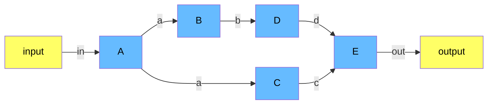
A naive memory plan for this network involves simply allocating unique memory for each tensor. In this case, the memory footprint is the sum of all tensors. This is simple, but it's obviously impractical for larger networks. A slight extension of this is to page memory in and out as tensors are needed: for example, the memory storing tensor `a` can be paged in to execute layer `A`, then paged out once layers `B` and `C` complete. This solution, of course, comes at the cost of performance as paging memory across PCI-e is extremely slow.

In practice, most implementations will try to reuse memory locations occupied by intermediate edges once those tensors are no longer needed. Assuming input and output tensors are preallocated (common, but not necessarily required), such a memory plan might look like this:

<table>
    <thead>
        <tr>
            <th style="border: 1px solid;">Executing Layer</th>
            <th style="border: 1px solid;">Mem[0]</th>
            <th style="border: 1px solid;">Mem[1]</th>
            <th style="border: 1px solid;">Mem[2]</th>
            <th style="border: 1px solid;">Mem[3]</th>
            <th style="border: 1px solid;">Mem[4]</th>
        </tr>
    </thead>
    <tbody>
        <tr>
            <td style="border: 1px solid;">Start</td>
            <td style="border: 1px solid;"><div style="text-align: center; color:black; background-color:lightgreen">in</div></td>
            <td style="border: 1px solid;"><div style="text-align: center; color:black; background-color:lightgreen">out</div></td>
            <td style="border: 1px solid;"><div style="text-align: center; color:black; background-color:lightgray">?</div></td>
            <td style="border: 1px solid;"><div style="text-align: center; color:black; background-color:lightgray">?</div></td>
            <td style="border: 1px solid;"><div style="text-align: center; color:black; background-color:lightgray">?</div></td>
        </tr>
        <tr>
            <td style="border: 1px solid;">A</td>
            <td style="border: 1px solid;"><div style="text-align: center; color:black; background-color:lightgreen">in</div></td>
            <td style="border: 1px solid;"><div style="text-align: center; color:black; background-color:lightgreen">out</div></td>
            <td style="border: 1px solid;"><div style="text-align: center; color:black; background-color:lightgreen">a</div></td>
            <td style="border: 1px solid;"><div style="text-align: center; color:black; background-color:lightgray">?</div></td>
            <td style="border: 1px solid;"><div style="text-align: center; color:black; background-color:lightgray">?</div></td>
        </tr>
        <tr>
            <td style="border: 1px solid;">B</td>
            <td style="border: 1px solid;"><div style="text-align: center; color:black; background-color:lightgreen">in</div></td>
            <td style="border: 1px solid;"><div style="text-align: center; color:black; background-color:lightgreen">out</div></td>
            <td style="border: 1px solid;"><div style="text-align: center; color:black; background-color:lightgreen">a</div></td>
            <td style="border: 1px solid;"><div style="text-align: center; color:black; background-color:lightgreen">b</div></td>
            <td style="border: 1px solid;"><div style="text-align: center; color:black; background-color:lightgray">?</div></td>
        </tr>
        <tr>
            <td style="border: 1px solid;">C</td>
            <td style="border: 1px solid;"><div style="text-align: center; color:black; background-color:lightgreen">in</div></td>
            <td style="border: 1px solid;"><div style="text-align: center; color:black; background-color:lightgreen">out</div></td>
            <td style="border: 1px solid;"><div style="text-align: center; color:black; background-color:lightgreen">a</div></td>
            <td style="border: 1px solid;"><div style="text-align: center; color:black; background-color:lightgreen">b</div></td>
            <td style="border: 1px solid;"><div style="text-align: center; color:black; background-color:lightgreen">c</div></td>
        </tr>
        <tr>
            <td style="border: 1px solid;">D</td>
            <td style="border: 1px solid;"><div style="text-align: center; color:black; background-color:lightgreen">in</div></td>
            <td style="border: 1px solid;"><div style="text-align: center; color:black; background-color:lightgreen">out</div></td>
            <td style="border: 1px solid;"><div style="text-align: center; color:black; background-color:lightgreen">d</div></td>
            <td style="border: 1px solid;"><div style="text-align: center; color:black; background-color:lightgreen">b</div></td>
            <td style="border: 1px solid;"><div style="text-align: center; color:black; background-color:lightgreen">c</div></td>
        </tr>
        <tr>
            <td style="border: 1px solid;">E</td>
            <td style="border: 1px solid;"><div style="text-align: center; color:black; background-color:lightgreen">in</div></td>
            <td style="border: 1px solid;"><div style="text-align: center; color:black; background-color:lightgreen">out</div></td>
            <td style="border: 1px solid;"><div style="text-align: center; color:black; background-color:lightgreen">d</div></td>
            <td style="border: 1px solid;"><div style="text-align: center; color:black; background-color:lightgray">b</div></td>
            <td style="border: 1px solid;"><div style="text-align: center; color:black; background-color:lightgreen">c</div></td>
        </tr>
        <tr>
            <td style="border: 1px solid;">End</td>
            <td style="border: 1px solid;"><div style="text-align: center; color:black; background-color:lightgreen">in</div></td>
            <td style="border: 1px solid;"><div style="text-align: center; color:black; background-color:lightgreen">out</div></td>
            <td style="border: 1px solid;"><div style="text-align: center; color:black; background-color:lightgray">d</div></td>
            <td style="border: 1px solid;"><div style="text-align: center; color:black; background-color:lightgray">b</div></td>
            <td style="border: 1px solid;"><div style="text-align: center; color:black; background-color:lightgray">c</div></td>
        </tr>
    </tbody>
</table>

Note how `Mem[2]` is initially occupied by tensor `a`, then repurposed to store tensor `d` once layers `B` and `C` are complete. This type of plan can be implemented by reference counting edges and doing a graph traversal. A related optimization is exploiting "in-place execution" on layers where the input memory can be repurposed as the output (e.g., elementwise ops). These optimizations are conceptually simple, but the example here glosses over the challenge of memory fragmentation since all tensors are the same size. There are many ways to address fragmentation, but they won't be explained here.

A subtle consequence of reusing memory locations in memory planning is the introduction of implicit dependencies that affect concurrency. In the original graph, layer `C` can run concurrently with nodes `B` and `D`; however, the memory plan above effectively makes `C` a dependency of `D` given the shared memory location. If `D` executed before `C` (or simultaneously with `C`) then it would overwrite the contents of tensor `a`.

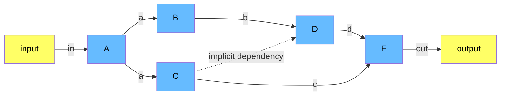
Was it smart to reuse memory in this example? If the model wouldn't fit in memory without reusing the memory location for `a` and `d` then this is absolutely a good plan. However, perhaps layers `B` and `C` only have work to occupy half the GPU: latency could be reduced by running them in parallel. Alternatively, maybe `B` fully occupies the GPU and it is better to run `C` and `D` in parallel. Ultimately, the right choice depends on the network, the hardware, and the optimization goal of minimizing memory or minimizing latency.

Memory planning is an interesting challenge with serious consequence for performance. The intent of this brief introduction is to highlight one of the tasks that is well-suited to a compiler algorithm and challenging for handwritten implementations.

### Execution Scheduling

Execution scheduling is the process of figuring out when to execute (dispatch) units of work, like shader programs or MLIR programs. In D3D12 this is done using command lists and queues. Most operations within a command list are asynchronous by default; for example, two back-to-back shader dispatches are assumed to have no dependency and thus can run simultaneously if the hardware has capacity. *Barriers* are the mechanism to enforce dependencies between work items in a command list, but the legacy barrier APIs make this quite problematic for efficiently handling [dependency *graphs*](#dataflow-and-dependency-graphs).


To illustrate the issue with legacy barriers being used for expressing node dependencies, consider that a barrier needs to exist between node pairs `A/B`, `A/C`, `B/D`, `C/E`, and `D/E`. If every edge was a separate resource this might look like the following in a command list:

```
Dispatch(A) // consumes input; produces a
Barrier(a)

Dispatch(B) // consumes a; produces b
Barrier(b)

Dispatch(C) // consumes a; produces c
Barrier(c)

Dispatch(D) // consumes b; produces d
Barrier(d)

Dispatch(E) // consumes d, c; produces out
Barrier(out)
```

In theory, a driver could detect the implicit dependencies between nodes and schedule them in parallel. For example, the driver could notice that `Dispatch(B)` and `Dispatch(C)` depend only on `a` and thus can run in parallel immediately after `Barrier(a)`. However, this dependency isn't so clearly articulated as shown in the comments. Furthermore, consider what happens if the intermediate edges are suballocated out of a single buffer resource (especially common to alias scratch memory as shown in the section on memory planning):

```
Dispatch(A)
Barrier(scratch)

Dispatch(B)
Barrier(scratch)

Dispatch(C)
Barrier(scratch)

Dispatch(D)
Barrier(scratch)

Dispatch(E)
Barrier(out)
```

In this case, the driver MUST synchronize between every dispatch since it has no way of knowing if the reads and writes to `scratch` alias the same regions. In other words, `Barrier(scratch)` in this example is *effectively* equivalent a "null" or "global UAV barrier" that forces all UAV accesses to complete before any subsequent commands can commence. DirectML relied heavily on aliasing a single large scratch buffer and used global UAV barriers for enforcing correct execution order in graphs like the one above. The observant reader may notice that the naive translation of resource-specific barriers to global barriers leads to excessive synchronization (e.g., a barrier between B and C, which is not needed). This leads to a forced decision on how to "flatten" the dependency graph by grouping dispatches into barrier boundaries. This DAG has four valid arrangements with global barriers:

- Linear Schedule 1: `A, Barrier, B, C, Barrier, D, Barrier, E`
- Linear Schedule 2: `A, Barrier, C, B, Barrier, D, Barrier, E`
- Linear Schedule 3: `A, Barrier, B, Barrier, C, D, Barrier, E`
- Linear Schedule 4: `A, Barrier, B, Barrier, D, C, Barrier, E`

Which of the above schedules it optimal? It is hard (or even impossible) for a D3D client to know, and it's possible that none of these may maximize utilization of the hardware. A full-fledged solution to this problem would require expressing the dependency graph more explicitly, but this is out of scope at the moment. As a consolation, however, it is important to recognize that MLIR program partitions mitigate this to an extent. Consider if nodes B, C, and D are grouped into a partition:

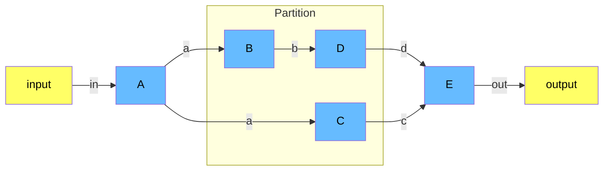
The resulting command list would be `A, Barrier, Partition, Barrier, E`, which is significantly better than forcing an arbitrary decision on where to place nodes B/C/D. In the future, we may consider extending the work graph APIs to support the dispatch of an explicit dependency graph. The current design is not directly suitable since [joins aren't supported](https://github.com/microsoft/DirectX-Specs/blob/master/d3d/WorkGraphs.md#joins---synchronizing-within-the-graph).

### Dataflow and Dependency Graphs

The previous sections on memory planning and execution scheduling subtly hint at two fundamentally different ways to look at computational graphs:

- **Dataflow graph**: nodes represent computation (network layers, subgraphs, shader dispatches, etc.) and edges represent data (tensors, memory references, pointer and offset, etc.). As the name indicates, this type of graph emphasizes the data going into and coming out of nodes; however, it *does not* explicitly convey dependencies that affect execution order.

- **Dependency graph**: nodes represent computation (or any task really) and inbound edges represent dependencies on other nodes that must complete before the target node can start.

Regardless of the framework or interchange format (ONNX, GGUF, MLIR bytecode, etc.), pretty much all ML models are described as dataflow graphs. A dataflow graph is flexible in that doesn't prescribe details of how to allocate memory or schedule execution of nodes, so it enables a variety of implementation approaches. A dependency graph description of an ML model is typically a byproduct of locking down many of these decisions and doesn't give as much wiggle room in an implementation.

### Change Log

<table>
<thead>
    <tr>
        <th>Version</th>
        <th>Date</th>
        <th>Description</th>
    </tr>
</thead>
<tbody>
<tr>
    <td>v0.11</td>
    <td>05/04/2026</td>
    <td><ul>
        <li>Initial draft matching interfaces in Preview Agility SDK 1.720.0-preview.</li>
    </ul></td>
</tr>
</tbody>
</table>
