# DirectX Raytracing (DXR) Functional Spec <!-- omit in toc -->

v1.31 6/9/2025

---

# Contents <!-- omit in toc -->

- [Intro](#intro)
- [Overview](#overview)
- [Design goals](#design-goals)
- [Walkthrough](#walkthrough)
  - [Initiating raytracing](#initiating-raytracing)
  - [Ray generation shaders](#ray-generation-shaders)
  - [Rays](#rays)
  - [Raytracing output](#raytracing-output)
  - [Ray-geometry interaction diagram](#ray-geometry-interaction-diagram)
  - [Geometry and acceleration structures](#geometry-and-acceleration-structures)
  - [Acceleration structure updates](#acceleration-structure-updates)
  - [Built-in ray-triangle intersection - triangle mesh geometry](#built-in-ray-triangle-intersection---triangle-mesh-geometry)
  - [Intersection shaders - procedural primitive geometry](#intersection-shaders---procedural-primitive-geometry)
    - [Minor intersection shader details](#minor-intersection-shader-details)
  - [Any hit shaders](#any-hit-shaders)
  - [Closest hit shaders](#closest-hit-shaders)
  - [Miss shaders](#miss-shaders)
  - [Hit groups](#hit-groups)
  - [TraceRay control flow](#traceray-control-flow)
  - [Flags per ray](#flags-per-ray)
  - [Instance masking](#instance-masking)
  - [Callable shaders](#callable-shaders)
  - [Resource binding](#resource-binding)
    - [Local root signatures vs global root signatures](#local-root-signatures-vs-global-root-signatures)
  - [Shader identifier](#shader-identifier)
  - [Shader record](#shader-record)
  - [Shader tables](#shader-tables)
  - [Indexing into shader tables](#indexing-into-shader-tables)
    - [Shader record stride](#shader-record-stride)
    - [Shader table memory initialization](#shader-table-memory-initialization)
  - [Inline raytracing](#inline-raytracing)
    - [TraceRayInline control flow](#tracerayinline-control-flow)
    - [Specialized TraceRayInline control flow](#specialized-tracerayinline-control-flow)
  - [Shader Execution Reordering](#shader-execution-reordering)
    - [SER Device Support](#ser-device-support)
  - [Opacity micromaps](#opacity-micromaps)
    - [Opacity micromap construction](#opacity-micromap-construction)
    - [Opacity micromaps and TraceRay](#opacity-micromaps-and-traceray)
    - [Opacity micromaps and TraceRayInline](#opacity-micromaps-and-tracerayinline)
    - [Opacity micromap encoding](#opacity-micromap-encoding)
    - [Opacity micromap related API and HLSL impacts](#opacity-micromap-related-api-and-hlsl-impacts)
- [Shader management](#shader-management)
  - [Problem space](#problem-space)
    - [Implementations juggle many shaders](#implementations-juggle-many-shaders)
    - [Applications control shader compilation](#applications-control-shader-compilation)
  - [State objects](#state-objects)
    - [Subobjects](#subobjects)
      - [Subobjects in DXIL libraries](#subobjects-in-dxil-libraries)
    - [State object types](#state-object-types)
      - [Raytracing pipeline state object](#raytracing-pipeline-state-object)
      - [Graphics and compute state objects](#graphics-and-compute-state-objects)
      - [Collection state object](#collection-state-object)
      - [Collections vs libraries](#collections-vs-libraries)
    - [DXIL libraries and state objects example](#dxil-libraries-and-state-objects-example)
    - [Subobject association behavior](#subobject-association-behavior)
      - [Default associations](#default-associations)
        - [Terminology](#terminology)
        - [Declaring a default association](#declaring-a-default-association)
        - [Behavior of a default association](#behavior-of-a-default-association)
      - [Explicit associations](#explicit-associations)
      - [Multiple associations of a subobject](#multiple-associations-of-a-subobject)
      - [Conflicting subobject associations](#conflicting-subobject-associations)
        - [Exception: overriding DXIL library associations](#exception-overriding-dxil-library-associations)
      - [Subobject associations for hit groups](#subobject-associations-for-hit-groups)
      - [Runtime resolves associations for driver](#runtime-resolves-associations-for-driver)
    - [Subobject association requirements](#subobject-association-requirements)
    - [State object caching](#state-object-caching)
    - [Incremental additions to existing state objects](#incremental-additions-to-existing-state-objects)
- [System limits and fixed function behaviors](#system-limits-and-fixed-function-behaviors)
  - [Addressing calculations within shader tables](#addressing-calculations-within-shader-tables)
    - [Hit group table indexing](#hit-group-table-indexing)
    - [Miss shader table indexing](#miss-shader-table-indexing)
    - [Callable shader table indexing](#callable-shader-table-indexing)
    - [Out of bounds shader table indexing](#out-of-bounds-shader-table-indexing)
  - [Acceleration structure properties](#acceleration-structure-properties)
    - [Data rules](#data-rules)
    - [Determinism based on fixed acceleration structure build input](#determinism-based-on-fixed-acceleration-structure-build-input)
    - [Determinism based varying acceleration structure build input](#determinism-based-varying-acceleration-structure-build-input)
    - [Preservation of triangle set](#preservation-of-triangle-set)
    - [AABB volume](#aabb-volume)
    - [Inactive primitives and instances](#inactive-primitives-and-instances)
    - [Degenerate primitives and instances](#degenerate-primitives-and-instances)
    - [Geometry limits](#geometry-limits)
  - [Acceleration structure update constraints](#acceleration-structure-update-constraints)
    - [Bottom-level acceleration structure updates](#bottom-level-acceleration-structure-updates)
    - [Top-level acceleration structure updates](#top-level-acceleration-structure-updates)
  - [Acceleration structure memory restrictions](#acceleration-structure-memory-restrictions)
    - [Synchronizing acceleration structure memory writes/reads](#synchronizing-acceleration-structure-memory-writesreads)
  - [Fixed function ray-triangle intersection specification](#fixed-function-ray-triangle-intersection-specification)
    - [Watertightness](#watertightness)
      - [Top-left rule](#top-left-rule)
    - [Example top-left rule implementation](#example-top-left-rule-implementation)
      - [Determining a coordinate system](#determining-a-coordinate-system)
      - [Hypothetical scheme for establishing plane for ray-tri intersection](#hypothetical-scheme-for-establishing-plane-for-ray-tri-intersection)
      - [Triangle intersection](#triangle-intersection)
      - [Examples of classifying triangle edges](#examples-of-classifying-triangle-edges)
  - [Ray extents](#ray-extents)
  - [Ray recursion limit](#ray-recursion-limit)
  - [Pipeline stack](#pipeline-stack)
    - [Optimal pipeline stack size calculation](#optimal-pipeline-stack-size-calculation)
    - [Default pipeline stack size](#default-pipeline-stack-size)
    - [Pipeline stack limit behavior](#pipeline-stack-limit-behavior)
  - [Shader limitations resulting from independence](#shader-limitations-resulting-from-independence)
    - [Wave Intrinsics](#wave-intrinsics)
  - [Execution and memory ordering](#execution-and-memory-ordering)
- [General tips for building acceleration structures](#general-tips-for-building-acceleration-structures)
  - [Choosing acceleration structure build flags](#choosing-acceleration-structure-build-flags)
- [Determining raytracing support](#determining-raytracing-support)
  - [Raytracing emulation](#raytracing-emulation)
- [Tools support](#tools-support)
  - [Buffer bounds tracking](#buffer-bounds-tracking)
  - [Acceleration structure processing](#acceleration-structure-processing)
- [API](#api)
  - [Device methods](#device-methods)
    - [CheckFeatureSupport](#checkfeaturesupport)
      - [CheckFeatureSupport Structures](#checkfeaturesupport-structures)
        - [D3D12\_FEATURE\_D3D12\_OPTIONS5](#d3d12_feature_d3d12_options5)
        - [D3D12\_RAYTRACING\_TIER](#d3d12_raytracing_tier)
    - [CreateStateObject](#createstateobject)
      - [CreateStateObject Structures](#createstateobject-structures)
        - [D3D12\_STATE\_OBJECT\_DESC](#d3d12_state_object_desc)
        - [D3D12\_STATE\_OBJECT\_TYPE](#d3d12_state_object_type)
        - [D3D12\_STATE\_SUBOBJECT](#d3d12_state_subobject)
        - [D3D12\_STATE\_SUBOBJECT\_TYPE](#d3d12_state_subobject_type)
        - [D3D12\_STATE\_OBJECT\_CONFIG](#d3d12_state_object_config)
        - [D3D12\_STATE\_OBJECT\_FLAGS](#d3d12_state_object_flags)
        - [D3D12\_GLOBAL\_ROOT\_SIGNATURE](#d3d12_global_root_signature)
        - [D3D12\_LOCAL\_ROOT\_SIGNATURE](#d3d12_local_root_signature)
        - [D3D12\_DXIL\_LIBRARY\_DESC](#d3d12_dxil_library_desc)
        - [D3D12\_EXPORT\_DESC](#d3d12_export_desc)
        - [D3D12\_EXPORT\_FLAGS](#d3d12_export_flags)
        - [D3D12\_EXISTING\_COLLECTION\_DESC](#d3d12_existing_collection_desc)
        - [D3D12\_HIT\_GROUP\_DESC](#d3d12_hit_group_desc)
        - [D3D12\_HIT\_GROUP\_TYPE](#d3d12_hit_group_type)
        - [D3D12\_RAYTRACING\_SHADER\_CONFIG](#d3d12_raytracing_shader_config)
        - [D3D12\_RAYTRACING\_PIPELINE\_CONFIG](#d3d12_raytracing_pipeline_config)
        - [D3D12\_RAYTRACING\_PIPELINE\_CONFIG1](#d3d12_raytracing_pipeline_config1)
        - [D3D12\_RAYTRACING\_PIPELINE\_FLAGS](#d3d12_raytracing_pipeline_flags)
        - [D3D12\_NODE\_MASK](#d3d12_node_mask)
        - [D3D12\_SUBOBJECT\_TO\_EXPORTS\_ASSOCIATION](#d3d12_subobject_to_exports_association)
        - [D3D12\_DXIL\_SUBOBJECT\_TO\_EXPORTS\_ASSOCIATION](#d3d12_dxil_subobject_to_exports_association)
    - [AddToStateObject](#addtostateobject)
    - [GetRaytracingAccelerationStructurePrebuildInfo](#getraytracingaccelerationstructureprebuildinfo)
      - [GetRaytracingAccelerationStructurePrebuildInfo Structures](#getraytracingaccelerationstructureprebuildinfo-structures)
        - [D3D12\_RAYTRACING\_ACCELERATION\_STRUCTURE\_PREBUILD\_INFO](#d3d12_raytracing_acceleration_structure_prebuild_info)
    - [CheckDriverMatchingIdentifier](#checkdrivermatchingidentifier)
      - [CheckDriverMatchingIdentifier Structures](#checkdrivermatchingidentifier-structures)
        - [D3D12\_SERIALIZED\_DATA\_TYPE](#d3d12_serialized_data_type)
        - [D3D12\_SERIALIZED\_DATA\_DRIVER\_MATCHING\_IDENTIFIER](#d3d12_serialized_data_driver_matching_identifier)
        - [D3D12\_DRIVER\_MATCHING\_IDENTIFIER\_STATUS](#d3d12_driver_matching_identifier_status)
    - [CreateCommandSignature](#createcommandsignature)
      - [CreateCommandSignature Structures](#createcommandsignature-structures)
        - [D3D12\_COMMAND\_SIGNATURE\_DESC](#d3d12_command_signature_desc)
        - [D3D12\_INDIRECT\_ARGUMENT\_DESC](#d3d12_indirect_argument_desc)
        - [D3D12\_INDIRECT\_ARGUMENT\_TYPE](#d3d12_indirect_argument_type)
  - [Command list methods](#command-list-methods)
    - [BuildRaytracingAccelerationStructure](#buildraytracingaccelerationstructure)
      - [BuildRaytracingAccelerationStructure Structures](#buildraytracingaccelerationstructure-structures)
        - [D3D12\_BUILD\_RAYTRACING\_ACCELERATION\_STRUCTURE\_DESC](#d3d12_build_raytracing_acceleration_structure_desc)
        - [D3D12\_BUILD\_RAYTRACING\_ACCELERATION\_STRUCTURE\_INPUTS](#d3d12_build_raytracing_acceleration_structure_inputs)
        - [D3D12\_RAYTRACING\_ACCELERATION\_STRUCTURE\_TYPE](#d3d12_raytracing_acceleration_structure_type)
        - [D3D12\_RAYTRACING\_ACCELERATION\_STRUCTURE\_BUILD\_FLAGS](#d3d12_raytracing_acceleration_structure_build_flags)
        - [D3D12\_ELEMENTS\_LAYOUT](#d3d12_elements_layout)
        - [D3D12\_RAYTRACING\_GEOMETRY\_DESC](#d3d12_raytracing_geometry_desc)
        - [D3D12\_RAYTRACING\_GEOMETRY\_TYPE](#d3d12_raytracing_geometry_type)
        - [D3D12\_RAYTRACING\_GEOMETRY\_FLAGS](#d3d12_raytracing_geometry_flags)
        - [D3D12\_RAYTRACING\_GEOMETRY\_TRIANGLES\_DESC](#d3d12_raytracing_geometry_triangles_desc)
        - [D3D12\_RAYTRACING\_GEOMETRY\_AABBS\_DESC](#d3d12_raytracing_geometry_aabbs_desc)
        - [D3D12\_RAYTRACING\_AABB](#d3d12_raytracing_aabb)
        - [D3D12\_RAYTRACING\_INSTANCE\_DESC](#d3d12_raytracing_instance_desc)
        - [D3D12\_RAYTRACING\_INSTANCE\_FLAGS](#d3d12_raytracing_instance_flags)
        - [D3D12\_RAYTRACING\_GEOMETRY\_OMM\_TRIANGLES\_DESC](#d3d12_raytracing_geometry_omm_triangles_desc)
        - [D3D12\_RAYTRACING\_GEOMETRY\_OMM\_LINKAGE\_DESC](#d3d12_raytracing_geometry_omm_linkage_desc)
        - [D3D12\_RAYTRACING\_OPACITY\_MICROMAP\_SPECIAL\_INDEX](#d3d12_raytracing_opacity_micromap_special_index)
        - [D3D12\_RAYTRACING\_OPACITY\_MICROMAP\_ARRAY\_DESC](#d3d12_raytracing_opacity_micromap_array_desc)
        - [D3D12\_RAYTRACING\_OPACITY\_MICROMAP\_FORMAT](#d3d12_raytracing_opacity_micromap_format)
        - [D3D12\_RAYTRACING\_OPACITY\_MICROMAP\_HISTOGRAM\_ENTRY](#d3d12_raytracing_opacity_micromap_histogram_entry)
        - [D3D12\_RAYTRACING\_OPACITY\_MICROMAP\_DESC](#d3d12_raytracing_opacity_micromap_desc)
        - [D3D12\_RAYTRACING\_OPACITY\_MICROMAP\_STATE](#d3d12_raytracing_opacity_micromap_state)
        - [D3D12\_GPU\_VIRTUAL\_ADDRESS\_AND\_STRIDE](#d3d12_gpu_virtual_address_and_stride)
    - [EmitRaytracingAccelerationStructurePostbuildInfo](#emitraytracingaccelerationstructurepostbuildinfo)
      - [EmitRaytracingAccelerationStructurePostbuildInfo Structures](#emitraytracingaccelerationstructurepostbuildinfo-structures)
        - [D3D12\_RAYTRACING\_ACCELERATION\_STRUCTURE\_POSTBUILD\_INFO\_DESC](#d3d12_raytracing_acceleration_structure_postbuild_info_desc)
        - [D3D12\_RAYTRACING\_ACCELERATION\_STRUCTURE\_POSTBUILD\_INFO\_TYPE](#d3d12_raytracing_acceleration_structure_postbuild_info_type)
        - [D3D12\_RAYTRACING\_ACCELERATION\_STRUCTURE\_POSTBUILD\_INFO\_COMPACTED\_SIZE\_DESC](#d3d12_raytracing_acceleration_structure_postbuild_info_compacted_size_desc)
        - [D3D12\_RAYTRACING\_ACCELERATION\_STRUCTURE\_POSTBUILD\_INFO\_TOOLS\_VISUALIZATION\_DESC](#d3d12_raytracing_acceleration_structure_postbuild_info_tools_visualization_desc)
        - [D3D12\_RAYTRACING\_ACCELERATION\_STRUCTURE\_POSTBUILD\_INFO\_SERIALIZATION\_DESC](#d3d12_raytracing_acceleration_structure_postbuild_info_serialization_desc)
        - [D3D12\_RAYTRACING\_ACCELERATION\_STRUCTURE\_POSTBUILD\_INFO\_CURRENT\_SIZE\_DESC](#d3d12_raytracing_acceleration_structure_postbuild_info_current_size_desc)
    - [CopyRaytracingAccelerationStructure](#copyraytracingaccelerationstructure)
      - [CopyRaytracingAccelerationStructure Structures](#copyraytracingaccelerationstructure-structures)
        - [D3D12\_RAYTRACING\_ACCELERATION\_STRUCTURE\_COPY\_MODE](#d3d12_raytracing_acceleration_structure_copy_mode)
        - [D3D12\_SERIALIZED\_RAYTRACING\_ACCELERATION\_STRUCTURE\_HEADER](#d3d12_serialized_raytracing_acceleration_structure_header)
        - [D3D12\_SERIALIZED\_RAYTRACING\_ACCELERATION\_STRUCTURE\_HEADER1](#d3d12_serialized_raytracing_acceleration_structure_header1)
        - [D3D12\_SERIALIZED\_RAYTRACING\_ACCELERATION\_STRUCTURE\_HEADER\_POSTAMBLE\_TYPE](#d3d12_serialized_raytracing_acceleration_structure_header_postamble_type)
        - [D3D12\_RAYTRACING\_SERIALIZED\_BLOCK](#d3d12_raytracing_serialized_block)
        - [D3D12\_RAYTRACING\_SERIALIZED\_BLOCK\_TYPE](#d3d12_raytracing_serialized_block_type)
        - [D3D12\_BUILD\_RAYTRACING\_ACCELERATION\_STRUCTURE\_TOOLS\_VISUALIZATION\_HEADER](#d3d12_build_raytracing_acceleration_structure_tools_visualization_header)
    - [SetPipelineState1](#setpipelinestate1)
    - [DispatchRays](#dispatchrays)
      - [DispatchRays Structures](#dispatchrays-structures)
        - [D3D12\_DISPATCH\_RAYS\_DESC](#d3d12_dispatch_rays_desc)
        - [D3D12\_GPU\_VIRTUAL\_ADDRESS\_RANGE](#d3d12_gpu_virtual_address_range)
        - [D3D12\_GPU\_VIRTUAL\_ADDRESS\_RANGE\_AND\_STRIDE](#d3d12_gpu_virtual_address_range_and_stride)
    - [ExecuteIndirect](#executeindirect)
  - [ID3D12StateObjectProperties methods](#id3d12stateobjectproperties-methods)
    - [GetShaderIdentifier](#getshaderidentifier)
    - [GetShaderStackSize](#getshaderstacksize)
    - [GetPipelineStackSize](#getpipelinestacksize)
    - [SetPipelineStackSize](#setpipelinestacksize)
  - [Additional resource states](#additional-resource-states)
  - [Additional root signature flags](#additional-root-signature-flags)
    - [D3D12\_ROOT\_SIGNATURE\_FLAG\_LOCAL\_ROOT\_SIGNATURE](#d3d12_root_signature_flag_local_root_signature)
    - [Note on shader visibility](#note-on-shader-visibility)
  - [Additional SRV type](#additional-srv-type)
  - [Constants](#constants)
- [HLSL](#hlsl)
  - [Types, enums, subobjects and concepts](#types-enums-subobjects-and-concepts)
    - [Ray flags](#ray-flags)
    - [Ray description structure](#ray-description-structure)
    - [Raytracing pipeline flags](#raytracing-pipeline-flags)
    - [RaytracingAccelerationStructure](#raytracingaccelerationstructure)
    - [Subobject definitions](#subobject-definitions)
      - [Hit group](#hit-group)
      - [Root signature](#root-signature)
      - [Local root signature](#local-root-signature)
      - [Subobject to entrypoint association](#subobject-to-entrypoint-association)
      - [Raytracing shader config](#raytracing-shader-config)
      - [Raytracing pipeline config](#raytracing-pipeline-config)
      - [Raytracing pipeline config1](#raytracing-pipeline-config1)
    - [Intersection attributes structure](#intersection-attributes-structure)
    - [Ray payload structure](#ray-payload-structure)
    - [Call parameter structure](#call-parameter-structure)
  - [Shaders](#shaders)
    - [Ray generation shader](#ray-generation-shader)
    - [Intersection shader](#intersection-shader)
    - [Any hit shader](#any-hit-shader)
    - [Closest hit shader](#closest-hit-shader)
    - [Miss shader](#miss-shader)
    - [Callable shader](#callable-shader)
  - [Intrinsics](#intrinsics)
    - [CallShader](#callshader)
    - [TraceRay](#traceray)
    - [ReportHit](#reporthit)
    - [IgnoreHit](#ignorehit)
    - [AcceptHitAndEndSearch](#accepthitandendsearch)
  - [System value intrinsics](#system-value-intrinsics)
    - [Ray dispatch system values](#ray-dispatch-system-values)
      - [DispatchRaysIndex](#dispatchraysindex)
      - [DispatchRaysDimensions](#dispatchraysdimensions)
    - [Ray system values](#ray-system-values)
      - [WorldRayOrigin](#worldrayorigin)
      - [WorldRayDirection](#worldraydirection)
      - [RayTMin](#raytmin)
      - [RayTCurrent](#raytcurrent)
      - [RayFlags](#rayflags)
    - [Primitive/object space system values](#primitiveobject-space-system-values)
      - [InstanceIndex](#instanceindex)
      - [InstanceID](#instanceid)
      - [GeometryIndex](#geometryindex)
      - [PrimitiveIndex](#primitiveindex)
      - [ObjectRayOrigin](#objectrayorigin)
      - [ObjectRayDirection](#objectraydirection)
      - [ObjectToWorld3x4](#objecttoworld3x4)
      - [ObjectToWorld4x3](#objecttoworld4x3)
      - [WorldToObject3x4](#worldtoobject3x4)
      - [WorldToObject4x3](#worldtoobject4x3)
    - [Hit specific system values](#hit-specific-system-values)
      - [HitKind](#hitkind)
      - [TriangleObjectPosition](#triangleobjectposition)
  - [RayQuery](#rayquery)
    - [RayQuery flags](#rayquery-flags)
    - [RayQuery intrinsics](#rayquery-intrinsics)
      - [RayQuery enums](#rayquery-enums)
        - [COMMITTED\_STATUS](#committed_status)
        - [CANDIDATE\_TYPE](#candidate_type)
      - [RayQuery TraceRayInline](#rayquery-tracerayinline)
        - [TraceRayInline examples](#tracerayinline-examples)
          - [TraceRayInline example 1](#tracerayinline-example-1)
          - [TraceRayInline example 2](#tracerayinline-example-2)
          - [TraceRayInline example 3](#tracerayinline-example-3)
      - [RayQuery Proceed](#rayquery-proceed)
      - [RayQuery Abort](#rayquery-abort)
      - [RayQuery CandidateType](#rayquery-candidatetype)
      - [RayQuery CandidateProceduralPrimitiveNonOpaque](#rayquery-candidateproceduralprimitivenonopaque)
      - [RayQuery CommitNonOpaqueTriangleHit](#rayquery-commitnonopaquetrianglehit)
      - [RayQuery CommitProceduralPrimitiveHit](#rayquery-commitproceduralprimitivehit)
      - [RayQuery CommittedStatus](#rayquery-committedstatus)
      - [RayQuery RayFlags](#rayquery-rayflags)
      - [RayQuery WorldRayOrigin](#rayquery-worldrayorigin)
      - [RayQuery WorldRayDirection](#rayquery-worldraydirection)
      - [RayQuery RayTMin](#rayquery-raytmin)
      - [RayQuery CandidateTriangleRayT](#rayquery-candidatetrianglerayt)
      - [RayQuery CommittedRayT](#rayquery-committedrayt)
      - [RayQuery CandidateInstanceIndex](#rayquery-candidateinstanceindex)
      - [RayQuery CandidateInstanceID](#rayquery-candidateinstanceid)
      - [RayQuery CandidateInstanceContributionToHitGroupIndex](#rayquery-candidateinstancecontributiontohitgroupindex)
      - [RayQuery CandidateGeometryIndex](#rayquery-candidategeometryindex)
      - [RayQuery CandidatePrimitiveIndex](#rayquery-candidateprimitiveindex)
      - [RayQuery CandidateObjectRayOrigin](#rayquery-candidateobjectrayorigin)
      - [RayQuery CandidateObjectRayDirection](#rayquery-candidateobjectraydirection)
      - [RayQuery CandidateObjectToWorld3x4](#rayquery-candidateobjecttoworld3x4)
      - [RayQuery CandidateObjectToWorld4x3](#rayquery-candidateobjecttoworld4x3)
      - [RayQuery CandidateWorldToObject3x4](#rayquery-candidateworldtoobject3x4)
      - [RayQuery CandidateWorldToObject4x3](#rayquery-candidateworldtoobject4x3)
      - [RayQuery CommittedInstanceIndex](#rayquery-committedinstanceindex)
      - [RayQuery CommittedInstanceID](#rayquery-committedinstanceid)
      - [RayQuery CommittedInstanceContributionToHitGroupIndex](#rayquery-committedinstancecontributiontohitgroupindex)
      - [RayQuery CommittedGeometryIndex](#rayquery-committedgeometryindex)
      - [RayQuery CommittedPrimitiveIndex](#rayquery-committedprimitiveindex)
      - [RayQuery CommittedObjectRayOrigin](#rayquery-committedobjectrayorigin)
      - [RayQuery CommittedObjectRayDirection](#rayquery-committedobjectraydirection)
      - [RayQuery CommittedObjectToWorld3x4](#rayquery-committedobjecttoworld3x4)
      - [RayQuery CommittedObjectToWorld4x3](#rayquery-committedobjecttoworld4x3)
      - [RayQuery CommittedWorldToObject3x4](#rayquery-committedworldtoobject3x4)
      - [RayQuery CommittedWorldToObject4x3](#rayquery-committedworldtoobject4x3)
      - [RayQuery CandidateTriangleBarycentrics](#rayquery-candidatetrianglebarycentrics)
      - [RayQuery CandidateTriangleFrontFace](#rayquery-candidatetrianglefrontface)
      - [RayQuery CandidateTriangleObjectPosition](#rayquery-candidatetriangleobjectposition)
      - [RayQuery CommittedTriangleBarycentrics](#rayquery-committedtrianglebarycentrics)
      - [RayQuery CommittedTriangleFrontFace](#rayquery-committedtrianglefrontface)
      - [RayQuery CommittedTriangleObjectPosition](#rayquery-committedtriangleobjectposition)
  - [HitObject](#hitobject)
    - [HitObject Interaction with Payload Access Qualifiers](#hitobject-interaction-with-payload-access-qualifiers)
    - [HitObject TraceRay](#hitobject-traceray)
    - [HitObject FromRayQuery](#hitobject-fromrayquery)
    - [HitObject MakeMiss](#hitobject-makemiss)
    - [HitObject MakeNop](#hitobject-makenop)
    - [HitObject Invoke](#hitobject-invoke)
    - [HitObject IsMiss](#hitobject-ismiss)
    - [HitObject IsHit](#hitobject-ishit)
    - [HitObject IsNop](#hitobject-isnop)
    - [HitObject GetRayFlags](#hitobject-getrayflags)
    - [HitObject GetRayTMin](#hitobject-getraytmin)
    - [HitObject GetRayTCurrent](#hitobject-getraytcurrent)
    - [HitObject GetWorldRayOrigin](#hitobject-getworldrayorigin)
    - [HitObject GetWorldRayDirection](#hitobject-getworldraydirection)
    - [HitObject GetObjectRayOrigin](#hitobject-getobjectrayorigin)
    - [HitObject GetObjectRayDirection](#hitobject-getobjectraydirection)
    - [HitObject GetObjectToWorld3x4](#hitobject-getobjecttoworld3x4)
    - [HitObject GetObjectToWorld4x3](#hitobject-getobjecttoworld4x3)
    - [HitObject GetWorldToObject3x4](#hitobject-getworldtoobject3x4)
    - [HitObject GetWorldToObject4x3](#hitobject-getworldtoobject4x3)
    - [HitObject GetInstanceIndex](#hitobject-getinstanceindex)
    - [HitObject GetInstanceID](#hitobject-getinstanceid)
    - [HitObject GetGeometryIndex](#hitobject-getgeometryindex)
    - [HitObject GetPrimitiveIndex](#hitobject-getprimitiveindex)
    - [HitObject GetHitKind](#hitobject-gethitkind)
    - [HitObject GetAttributes](#hitobject-getattributes)
    - [HitObject GetShaderTableIndex](#hitobject-getshadertableindex)
    - [HitObject SetShaderTableIndex](#hitobject-setshadertableindex)
    - [HitObject LoadLocalRootArgumentsConstant](#hitobject-loadlocalrootargumentsconstant)
  - [MaybeReorderThread](#maybereorderthread)
    - [MaybeReorderThread with HitObject](#maybereorderthread-with-hitobject)
    - [MaybeReorderThread with coherence hint](#maybereorderthread-with-coherence-hint)
    - [MaybeReorderThread with HitObject and coherence hint](#maybereorderthread-with-hitobject-and-coherence-hint)
    - [ReorderThread Example 1](#reorderthread-example-1)
    - [ReorderThread Example 2](#reorderthread-example-2)
    - [ReorderThread Example 3](#reorderthread-example-3)
    - [Reorder points](#reorder-points)
    - [MaybeReorderThread divergence behavior](#maybereorderthread-divergence-behavior)
      - [Reorder points - memory coherence and visibility](#reorder-points---memory-coherence-and-visibility)
    - [Separation of MaybeReorderThread and HitObject Invoke](#separation-of-maybereorderthread-and-hitobject-invoke)
      - [MaybeReorderThread and Invoke example 1: Common computations that rely on large raygen state](#maybereorderthread-and-invoke-example-1-common-computations-that-rely-on-large-raygen-state)
      - [MaybeReorderThread and Invoke example 2: Do common computations with hit coherence](#maybereorderthread-and-invoke-example-2-do-common-computations-with-hit-coherence)
      - [MaybeReorderThread and Invoke example 3: Same surface shader but different behaviour in raygen](#maybereorderthread-and-invoke-example-3-same-surface-shader-but-different-behaviour-in-raygen)
      - [MaybeReorderThread and Invoke example 4: Unified shading](#maybereorderthread-and-invoke-example-4-unified-shading)
      - [MaybeReorderThread and Invoke example 5: Coherently break render loop on miss](#maybereorderthread-and-invoke-example-5-coherently-break-render-loop-on-miss)
      - [MaybeReorderThread and Invoke example 6: Two-step shading, single reorder](#maybereorderthread-and-invoke-example-6-two-step-shading-single-reorder)
      - [MaybeReorderThread and Invoke example 7: Live state optimization](#maybereorderthread-and-invoke-example-7-live-state-optimization)
      - [MaybeReorderThread and Invoke example 8: Back-to-back calls](#maybereorderthread-and-invoke-example-8-back-to-back-calls)
  - [Payload access qualifiers](#payload-access-qualifiers)
    - [Availability](#availability)
    - [Payload size](#payload-size)
    - [Syntax](#syntax)
    - [Semantics](#semantics)
      - [anyhit/closesthit/miss stages](#anyhitclosesthitmiss-stages)
      - [caller stage](#caller-stage)
    - [Detailed semantics](#detailed-semantics)
      - [Local working copy](#local-working-copy)
      - [Shader stage sequence](#shader-stage-sequence)
    - [Example](#example)
    - [Guidelines](#guidelines)
    - [Optimization potential](#optimization-potential)
    - [Advanced examples](#advanced-examples)
      - [Various accesses and recursive TraceRay](#various-accesses-and-recursive-traceray)
      - [Payload as function parameter](#payload-as-function-parameter)
      - [Forwarding payloads to recursive TraceRay calls](#forwarding-payloads-to-recursive-traceray-calls)
      - [Pure input in a loop](#pure-input-in-a-loop)
      - [Conditional pure output overwriting initial value](#conditional-pure-output-overwriting-initial-value)
    - [Payload access qualifiers in DXIL](#payload-access-qualifiers-in-dxil)
- [DDI](#ddi)
  - [General notes](#general-notes)
    - [Descriptor handle encodings](#descriptor-handle-encodings)
  - [State object DDIs](#state-object-ddis)
    - [State subobjects](#state-subobjects)
      - [D3D12DDI\_STATE\_SUBOBJECT\_TYPE](#d3d12ddi_state_subobject_type)
      - [D3D12DDI\_STATE\_SUBOBJECT\_0054](#d3d12ddi_state_subobject_0054)
      - [D3D12DDI\_STATE\_SUBOBJECT\_TYPE\_SHADER\_EXPORT\_SUMMARY](#d3d12ddi_state_subobject_type_shader_export_summary)
      - [D3D12DDI\_FUNCTION\_SUMMARY\_0054](#d3d12ddi_function_summary_0054)
      - [D3D12DDI\_FUNCTION\_SUMMARY\_NODE\_0054](#d3d12ddi_function_summary_node_0054)
      - [D3D12\_EXPORT\_SUMMARY\_FLAGS](#d3d12_export_summary_flags)
      - [State object lifetimes as seen by driver](#state-object-lifetimes-as-seen-by-driver)
        - [Collection lifetimes](#collection-lifetimes)
        - [AddToStateObject parent lifetimes](#addtostateobject-parent-lifetimes)
    - [Reporting raytracing support from the driver](#reporting-raytracing-support-from-the-driver)
      - [D3D12DDI\_RAYTRACING\_TIER](#d3d12ddi_raytracing_tier)
- [Change log](#change-log)

---

# Intro

This document describes raytracing support in D3D12 as a first class
peer to compute and graphics (rasterization). Similar to the
rasterization pipeline, the raytracing pipeline strikes a balance
between programmability, to maximize expressiveness for applications;
and fixed function, to maximize the opportunity for implementations to
execute workloads efficiently.

---

# Overview

The system is designed to allow implementations to process rays
independently. This includes the various types of shaders (to be
described), which can only ever see a single input ray and cannot see or
depend on the order of processing of other rays in flight. Some shader
types can generate multiple rays over the course of a given invocation,
and if desired look at the result of a ray's processing. Regardless,
generated rays that are in-flight can never be dependent on each other.

This ray independence opens up the possibility of parallelism. To
exploit this during execution, a typical implementation would balance
between scheduling and other tasks.

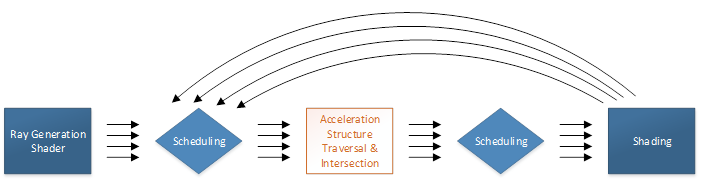

(The above diagram is only a loose approximation of what an
implementation might do -- don't read it too deeply.)

The scheduling portions of execution are hard-wired, or at least
implemented in an opaque way that can be customized for the hardware.
This would typically employ strategies like sorting work to maximize
coherence across threads. From an API point of view, ray scheduling
is built-in functionality.

The other tasks in raytracing are a combination of fixed function and
fully or partially programmable work:

The largest fixed function task is traversing acceleration structures
that have been built out of geometry provided by the application, with
the goal of efficiently finding potential ray intersections. Triangle
intersection is also supported in fixed function.

Shaders expose application programmability in several areas:

- generating rays

- determining intersections for implicit geometry (as opposed to the
    fixed function triangle intersection option)

- processing ray intersections (such as surface shading) or misses

The application also has a high level of control over exactly which out
of a pool of shaders to run in any given situation, as well as
flexibility in the resources such as textures that each shader
invocation has access to.

---

# Design goals

- Implementation agnostic
  
  - Support for hardware with or without dedicated raytracing
    acceleration via single programming model

  - Expected variances in hardware capability are captured in a
    clean feature progression, if necessary at all

- Embrace relevant D3D12 paradigms
  
  - Applications have explicit control of shader compilation, memory
    resources and overall synchronization

  - Applications can tightly integrate raytracing with compute and
    graphics

  - Incrementally adoptable

- Friendly to tools such as PIX
  
  - Running tools such as API capture / playback don't incur
    unnecessary overhead to support raytracing

---

# Walkthrough

The following walkthrough broadly covers most components of this
feature. Further details will be described later in the document,
including dedicated sections listing APIs and HLSL details.

---

## Initiating raytracing

First a pipeline state containing raytracing shaders must be set on a
command list, via [SetPipelineState1()](#setpipelinestate1).

Then, just as rasterization is invoked by Draw() and compute is invoked
via Dispatch(), raytracing is invoked via [DispatchRays()](#dispatchrays).
DispatchRays() can be called from graphics command lists, compute
command lists or bundles.

[Tier 1.1](#d3d12_raytracing_tier) implementations also support GPU initiated DispatchRays() via [ExecuteIndirect()](#executeindirect).

[Tier 1.1](#d3d12_raytracing_tier) implementations also support a variant of raytracing that can be invoked from any shader stage (including compute and graphics shaders), but does not involve any other shaders - instead processing happens logically inline with the calling shader.  See [Inline raytracing](#inline-raytracing).

---

## Ray generation shaders

[DispatchRays()](#dispatchrays) invokes a grid of ray generation shader invocations.
Each invocation (thread) of a ray generation shader knows its location
in the overall grid, can generate arbitrary rays via TraceRay(), and
operates independently of other invocations. So there is no defined
order of execution of threads with respect to each
other.

HLSL details are [here](#ray-generation-shader).

---

## Rays

A ray is: an origin, direction and parametric interval (TMin, TMax) in
which intersections may occur at T locations along the interval. To be
concrete, positions along the ray are: origin + T*direction (the
direction does not get normalized).  

There is some nuance to the exact bounds used, (TMin..TMax) vs \[TMin...TMax\]
for intersections to count, depending on the geometry type, defined in [ray extents](#ray-extents).

A ray is accompanied by a user defined payload that is modifiable as the
ray interacts with geometry in a scene and also visible to the caller of
[TraceRay()](#traceray) upon its return.  In the case of the [Inline raytracing](#inline-raytracing) variation, the payload isn't an explicit entity, rather it is just a part of whatever user variables the caller of [RayQuery::TraceRayInline()](#rayquery-tracerayinline) has in its execution scope.

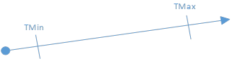

The TMin value tracked by the system never changes over the lifetime of
a ray. On the other hand, as intersections are discovered (in arbitrary
spatial order), the system reduces TMax to reflect the closest
intersection so far. When all intersections are complete, TMax
represents the closest intersection, the relevance of which appears
later.

---

## Raytracing output

In raytracing, shaders output results, such as color samples for an
image, manually through UAVs.

---

## Ray-geometry interaction diagram

Upcoming sections describe this picture, plus concepts not shown that
aren't specific to geometry, like "miss shaders".

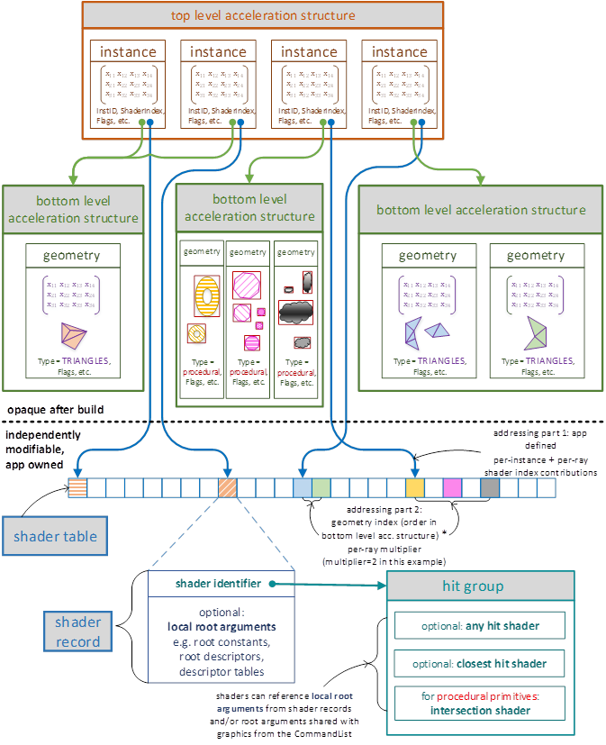

---

## Geometry and acceleration structures

Geometry for a scene is described to the system using two levels of
acceleration structures: Bottom-level acceleration structures each
consist of a set of geometries that are building blocks for a scene. A
top-level acceleration structure represents a set of instances of
bottom-level acceleration structures.

Within a given bottom-level acceleration structure there can be any
number: (1) triangle meshes, or (2) procedural primitives initially
described only by an axis aligned bounding box (AABB). A bottom-level
acceleration structure can only contain a single geometry type. These
geometry types are described more later. Given a definition of a set of
these geometries (via array of [D3D12_RAYTRACING_GEOMETRY_DESC](#d3d12_raytracing_geometry_desc)), the
application calls [BuildRaytracingAccelerationStructure()](#buildraytracingaccelerationstructure)
on a CommandList to ask the system to build an opaque acceleration
structure representing it into GPU memory owned by the application. This
acceleration structure is what the system will use to intersect rays
with the geometry.

Given a set of bottom-level acceleration structures, the application
then defines a set of instances (by pointing to
[D3D12_RAYTRACING_INSTANCE_DESC](#d3d12_raytracing_instance_desc)
structures living in GPU memory). Each instance points to a bottom-level
acceleration structure and includes some other information for
specializing the instance. A couple of examples of the specializing
information included in an instance definition are: a matrix transform
(to place the instance in the world), and a user defined InstanceID
(identifying the unique instance to shaders).

Instances are sometimes referred to in this specification as geometry
instances for clarity.

This set of geometry instance definitions is given to the implementation
(via
[BuildRaytracingAccelerationStructure()](#buildraytracingaccelerationstructure)
to generate an opaque top-level acceleration structure into GPU memory
owned by the application. This acceleration structure represents what
the system traces rays against.

An application can use multiple top-level acceleration structures
simultaneously, binding them to relevant shaders as input resources (see
[RaytracingAccelerationStructure](#raytracingaccelerationstructure) in
HLSL). That way a given shader can trace rays into different sets of
geometry if desired.

> The two level hierarchy for geometry lets applications strike a balance between intersection performance (maximized by using larger bottom-level acceleration structures) and flexibility (maximized by using more, smaller bottom-level acceleration structures and more instances in a top-level acceleration structure).

See [Acceleration structure properties](#acceleration-structure-properties) for a discussion of rules and determinism.

---

## Acceleration structure updates

Apps can request to make an acceleration structure updateable, or
request an update to an updateable acceleration structure, via
[D3D12_RAYTRACING_ACCELERATION_STRUCTURE_BUILD_FLAGS](#d3d12_raytracing_acceleration_structure_build_flags)
in [BuildRaytracingAccelerationStructure()](#buildraytracingaccelerationstructure).

The updateable acceleration structures (before and after they have been
updated) will not be as optimal in terms of raytracing performance as
building a static acceleration structure from scratch. An update will be
faster, however, than building an acceleration structure from scratch.

For updates to be viable to implement, constraints are in place on what
an app is allowed to change. For instance, with triangle geometry in
bottom-level acceleration structures only vertex positions can be
updated. There is much more freedom of update allowed for instance
descriptions in top-level acceleration structures. For more detail see
[Acceleration structure update constraints](#acceleration-structure-update-constraints).

---

## Built-in ray-triangle intersection - triangle mesh geometry

As mentioned above, geometry in a bottom-level acceleration structure
can be represented as triangle meshes which use built-in ray-triangle
intersection support that passes triangle barycentrics describing the
intersection to subsequent shaders.

---

## Intersection shaders - procedural primitive geometry

An alternative representation for geometry in a bottom-level
acceleration structure is an axis aligned bounding box which contains a
procedural primitive. The surface is defined by running an application
defined intersection shader to evaluate intersections when a ray hits
the bounding box. The shader defines the attributes describing
intersections to pass on to subsequent shaders, including the current T
value.

Using intersection shaders instead of the build-in ray-triangle
intersection is less efficient but offers far more flexibility.

HLSL details are [here](#intersection-shader).

---

### Minor intersection shader details

Intersection shaders may be executed redundantly. There is no guarantee
that for a given ray that the intersection shader only executes once for
a given procedural primitive encountered in the acceleration structure.
Multiple invocations for a given ray and primitive would be redundant
(wasteful), yet implementations are free to have this behavior if the
implementation believes the tradeoff is worth it for some reason. The
implication of this is apps must be careful about authoring side effects
into intersection shaders, such as doing UAV writes from them or in
particular finding different intersections each invocation. The results
may differ depending on the implementation.

Regardless if multiple invocations of intersection shaders occur for a
given ray, the implementation must always honor the app's choice of
[flags](#d3d12_raytracing_geometry_flags) on the geometry, which may include
`D3D12_RAYTRACING_GEOMETRY_FLAG_NO_DUPLICATE_ANYHIT_INVOCATION`.
With this flag, the [any hit shader](#any-hit-shaders) (described next)
must only execute once for a given intersection on a given ray.

---

## Any hit shaders

A unique shader can be defined to run whenever a ray intersects a
geometry instance within the current [ray extents](#ray-extents),
regardless of position along the ray relative to other intersections.
This is an any hit shader.

Any hit shaders can read intersection attributes, modify ray payload,
indicate a hit should be ignored ([IgnoreHit()](#ignorehit)), accept
the hit and continue (by exiting execution) or accept the hit and tell
the system to stop searching for more intersections
([AcceptHitAndEndSearch()](#accepthitandendsearch)).

There is no defined order of execution of any hit shaders for the
intersections along a ray path. If an any hit shader accepts a hit, its
T value becomes the new TMax. So depending on the order that
intersections are found all else being equal, different numbers of any
hit shader invocations would occur.

The system cannot execute multiple any hit shaders for a given ray at the 
same time - as such, any hit shaders can freely modify their 
[ray payload](#ray-payload-structure) without worrying about conflicting 
with other shaders. 

Any hit shaders are useful, for instance, when geometry has
transparency. A particular case is transparency in shadow determination,
where if the any hit shader finds that the current hit location is
opaque it can tell the system to take this hit but stop searching for
more intersections (just looking for anything in a ray's path). In
many cases though, any hit shaders are not needed, yielding some
execution efficiency: In the absence of an any hit shader for a given
geometry instance that has an intersection T within the current ray
interval, the implementation simply accepts the intersection and reduces
TMax of the current ray interval to T.

Unlike some of the other shader types to be described, any hit shaders
cannot trace new rays, as doing so here would lead to an unreasonable
explosion of work for the system.

HLSL details are [here](#any-hit-shader).

---

## Closest hit shaders

A unique shader can be defined to run for each geometry in an instance
if it produced the closest accepted intersection within the [ray extents](#ray-extents). This is a closest hit shader.

Closest hit shaders can read intersection attributes, modify ray
payload, and generate additional rays.

> A typical use of a closest hit shader would be to evaluate the color of a surface and either contribute to the ray payload or store data to memory (via UAV).

Any hit shaders (if any) along a ray's path are all executed before a
closest hit shader (if any). In particular, if both shader types are
defined for the geometry instance at the closest hit's T value, the any
hit shader will always run before the closest hit shader.

HLSL details are [here](#closest-hit-shader).

---

## Miss shaders

For rays that do not intersect any geometry, a miss shader can be
specified. Miss shaders can modify ray payload and generate additional
rays. Since there was no intersection, there are no intersection
attributes available.

HLSL details are [here](#miss-shader).

---

## Hit groups

A hit group is one or more shaders consisting of: {0 or 1 intersection
shader, 0 or 1 any hit shader, 0 or 1 closest hit shader}. Individual
geometries in a given instance each refer to a hit group to provide
their shader code. The point of the grouping is to allow implementations
to be able to compile and execute the group efficiently as rays interact
with geometry.

Ray generation shaders and miss shaders aren't part of hit groups
because they aren't involved directly with geometry.

If a hit group contains an intersection shader, it can only be used with
procedural primitive geometry. If a hit group does not contain an
intersection shader, it can only be used with triangle geometry.

A hit group with no shaders at all is also possible, by simply using
NULL as it's [shader identifier](#shader-identifier) (concept described
later).  This counts as opaque geometry.

> An empty hit group can be useful, for example, if the app doesn't want to do anything for hits and only cares about the [miss shader](#miss-shaders) running when nothing has been hit.

---

## TraceRay control flow

This is what happens when a shader calls [TraceRay()](#traceray):

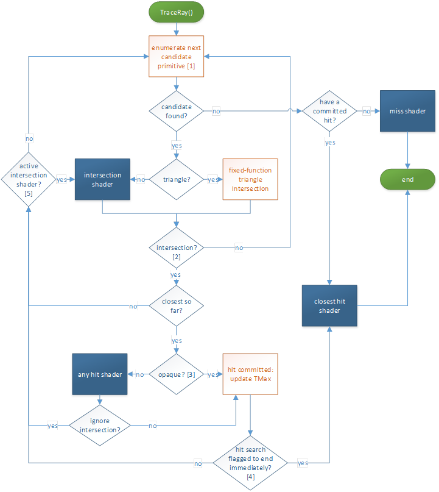

\[1\] This stage searches acceleration structures to enumerate
primitives that may intersect the ray, conservatively: If a primitive is
intersected by the ray and is within the current [ray extents](#ray-extents), it is guaranteed to be enumerated eventually. If a primitive
is not intersected by the ray or is outside the current [ray extents](#ray-extents), it may or may not be enumerated. Note that TMax is updated
when a hit is committed (internal to the traversal, not visible to the application).

\[2\] If the intersection shader is running and calls
[ReportHit()](#reporthit), the subsequent logic handles the intersection
and then returns to the intersection shader via \[5\].

\[3\] Opaqueness is determined by examining the geometry and instance
flags of the intersection as well as the [ray flags](#ray-flags). Also
if there is no any hit shader, the geometry is considered opaque.

\[4\] The search for hits is ended at this point if either the
`RAY_FLAG_ACCEPT_FIRST_HIT_AND_END_SEARCH` [ray flag](#ray-flags)
is set, or if the any hit shader called
[AcceptHitAndEndSearch()](#accepthitandendsearch), which aborts the
execution of the any hit shader at the
[AcceptHitAndEndSearch()](#accepthitandendsearch)
call site. Since at least this hit was committed, whichever hit is
closest so far has the closest hit shader run on it, if present (and not
disabled via `RAY_FLAG_SKIP_CLOSEST_HIT_SHADER`).

\[5\] If the primitive that was intersected was not a triangle, an
intersection shader is still active and resumes execution, given it may
contain more calls to [ReportHit()](#reporthit).

---

## Flags per ray

[TraceRay()](#traceray) supports a selection of [ray flags](#ray-flags) to override transparency, culling, and early-out
behavior.

> To illustrate the utility of ray flags, consider how they would help implement one of multiple approaches to rendering shadows. Suppose an app wants to trace rays to distant light sources to accumulate light contributions for rays that don't hit any geometry, using tail recursion.
>
> [TraceRay()](#traceray) could be called with `RAY_FLAG_ACCEPT_FIRST_HIT_AND_END_SEARCH | RAY_FLAG_SKIP_CLOSEST_HIT_SHADER` flags from the [ray generation shader](#ray-generation-shaders), followed by exiting the shader withn nothing else to do. Any hit shaders, if present on geometry, would execute to determine transparency, though these shader invocations could be skipped if desired by also including `RAY_FLAG_FORCE_OPAQUE`.
>
>If any geometry hit is encountered (not necessarily the closest hit), ray processing stops, due to `RAY_FLAG_ACCEPT_FIRST_HIT_AND_END_SEARCH`. A hit has been committed/found, but there is no [closest hit shader](#closest-hit-shaders) invocation, due to `RAY_FLAG_SKIP_CLOSEST_HIT_SHADER`. So processing of the ray ends with no action.
>
>Rays that don't hit anything cause the [miss shader](#miss-shaders) to run, where light contribution is evaluated and written to a UAV. So in this scenario, geometry in the acceleration structure acted to cull miss shader invocations,  ignoring every other type of shader (unless needed for transparency evaluation).
>
>Skipping shaders can alternatively be accomplished by setting shader bindings to NULL (shader bindings details are discussed [later on](#shader-identifier)). But the use of ray flags in this example means the implementation doesn't even have to look up shader bindings (only to find that they are NULL). Which also means the app doesn't have to bother configuring NULL bindings anywhere.

---

## Instance masking

[Geometry instances](#d3d12_raytracing_instance_desc) in top-level
acceleration structures each contain an 8-bit user defined InstanceMask.
[TraceRay()](#traceray) has an 8-bit input parameter
InstanceInclusionMask which gets ANDed with the InstanceMask from any
geometry instance that is a candidate for intersection. If the result of
the AND is zero, the intersection is ignored.

> This feature allows apps to represent different subsets of geometry within a single acceleration structure as opposed to having to build separate acceleration structures for each subset. The app can choose how to trade traversal performance versus overhead for maintaining multiple acceleration structures.
>
> An example would be culling objects that an app doesn't want to contribute to a shadow determination but otherwise remain visible.
>
> Another way to look at this is:
>
> The bits in InstanceMask define which "groups" an instance belongs to. (If it is set to zero the instance will always be rejected\!)
>
>The bits in the ray's InstanceInclusionMask define which groups to include during traversal.

---

## Callable shaders

Callable shaders are meant to assist with pathological shader
permutations or shader networks, at the potential expense of some
execution efficiency.

Callable shaders are defined through a [shader table](#shader-tables),
described later, but basically a user defined function table. The table
is identified by providing a GPU virtual address (CallableShaderTable in
[D3D12_DISPATCH_RAYS_DESC](#d3d12_dispatch_rays_desc)) to
[DispatchRays()](#dispatchrays) calls. The contents of the table
contain shader identifiers retrieved from [state objects](#state-objects) (described later) via
[GetShaderIdentifier()](#getshaderidentifier).

A given callable shader is called (via [CallShader()](#callshader) in
HLSL) by indexing into the shader table to pick which callable shader to
call from any of the raytracing shaders. A shader invocation making a
call just produces one invocation of a callable shader, like a
subroutine call with arbitrary in/out parameters. So when the call
returns, the caller continues as would be expected. Callable shaders are
separately compiled from other shaders, so compilers can't make any
assumptions about caller/callee other than the agreed on function
signature. The implementation chooses how to make use of a stack of user
defined maximum size to store parameters (that it didn't decide to pass
via registers) and/or live state -- see [Pipeline stack](#pipeline-stack).

Implementations are expected to schedule callable shaders for execution
separately from the calling shader, as opposed to the code being
optimally inlined with the caller. This is similar to the way tracing
rays causes other shaders to run. So using this feature to execute a
tiny program may not be worth the minimum overhead of scheduling the
shader to run.

> In the absence of callable shaders as a feature, applications could achieve the same result by tracing rays with a NULL acceleration structure, which causes a miss shader to run, repurposing the ray payload and potentially the ray itself as function parameters. Except doing this miss shader hack would be wasteful in terms of defining a ray that is guaranteed to miss for no reason. Rather than supporting this hack, callable shaders are seen as a cleaner equivalent.
>
> The bottom line is implementations should not have difficulty supporting callable shaders given the system has to support miss shaders anyway. At the same time, apps must not expect execution efficiency that would greatly exceed that of invoking a miss shader from a raytrace (minus the actual ray processing overhead).

---

## Resource binding

Since rays can go anywhere, in raytracing not only must all shaders for
a scene be simultaneously available to execute, but also their resource
bindings. In fact, the selection of what shader to run (by shader
Identifier, described later) is considered just another resource binding
along with traditional root signature bindings: descriptor tables, root
descriptors and root constants.

Descriptor heaps set on CommandLists via SetDescriptorHeaps() are shared
by raytracing, graphics and compute.

---

### Local root signatures vs global root signatures

For raytracing shaders, bindings can be defined by one or both of the
following root signatures:

- A *local* root signature, whose arguments come from shader tables,
  described later, enabling each shader to have unique arguments.

- A *global* root signature whose arguments are shared across all
  raytracing shaders and compute PSOs on CommandLists, set via
  SetComputeRootSignature() (or equivalent indirect state setting API
  if it ever exists).

Each raytracing shader used together can use different local root
signatures but must use the same global root signature. The "global"
root signature identical to the root signature used for compute state on
command lists.

Different sets of shaders collected together in a [State object](#state-objects) (described later),
may have different global root signatures, as long as during a [DispatchRays()](#dispatchrays)
call (or equivalent indirect API if it ever exists) any shaders that get
invoked use the same global root signature that is set on the CommandList
as described above.

Unlike global root signatures, local root signatures have a larger limit
on the number of entries they can hold, bounded by the maximum supported
shader record stride of 4096 bytes, minus 32 bytes for shader identifier
size = 4064 bytes max local root signature footprint. Shader identifiers
and shader records are described further below.

The shader "register" bindings (e.g. t0, u0 etc.) specified by a local
root signature can't overlap with those in a global root signature for a
given shader.

Note about static samplers: Local root signatures can define static
samplers (just like global root signatures can), except that each local
root signature used in a [Raytracing pipeline state object](#raytracing-pipeline-state-object) (described later)
must define any static samplers it uses identically as other local root
signatures that define the same ones. So if any local root signature makes
a definition for, say, sampler s0, all local root signatures that define
s0 must use the same definition. Further, the total number of unique
static samplers across local root signature and global root signature
must fit in the static sampler limit for D3D12's resource binding model.

> The reason that local root signatures must not have any conflicting static sampler definitions is to enable shaders to be compiled individually on implementations that have to emulate static samplers using descriptor heaps. Such implementations can pick a fixed location in a sampler descriptor heap to place a static sampler, knowing that other shaders that might use a different local root signature and define the same sampler will use the same slot. Static samplers in the global root signature can also be handled the same way (given that as mentioned above, register bindings can't overlap across global and local root signatures.

There is a discussion on shader visibility flags in root signatures
[here](#note-on-shader-visibility).

---

## Shader identifier

A shader identifier is an opaque data blob of 32 bytes that uniquely
identifies (within the current device / process) one of the raytracing
shaders: ray generation shader, hit group, miss shader, callable shader.
The application can request the shader identifier for any of these
shaders from the system. It can be thought of as a pointer to a shader.

If the raytracing process encounters a NULL shader identifier from an
app when looking for a shader to run, no shader is executed for that
purpose, and the raytracing process continues. In the case of a [hit group](#hit-groups),
a NULL shader identifier simply means no shader is executed for any of
the types of shaders it contains.

An application might create the same shader multiple times. This could
be the same code but with same or different export names, potentially
across separate raytracing pipelines or collections of code ([described later](#state-object-types)).
In this case the seemingly identical shaders may or may not return
the same identifier depending on the implementation. Regardless, execution
behavior will be consistent with the specified shader code.

---

## Shader record

```nothing
shader record = {shader identifier, local root arguments for the shader}
```

A shader record simply refers to a region of memory owned by an
application in the above layout. Since an application can retrieve a
shader identifier for any raytracing shader, it can create shader
records any way it wants, anywhere it wants. If a shader uses a local
root signature, its shader record contains the arguments for that root
signature. The maximum stride for shader records is 4096 bytes.

---

## Shader tables

```nothing
shader table = {shader record A}, {shader record B} ...
```

A shader table is a set of shader records in a contiguous region of
memory. The start address must be aligned to 64 bytes
([D3D12_RAYTRACING_SHADER_TABLE_BYTE_ALIGNMENT](#constants)).

Raytracing indexes in to shader tables (in various ways) to enable
running unique shaders and resource bindings for all the different parts
of a scene. Only the particular shader records that will be accessed
need to be validly populated.

There is no API object for a shader table; the app merely identifies a
region in memory as being a shader table. Rather, the parameters to
[DispatchRays()](#dispatchrays)
include pointers to memory that let apps identify (among other things)
the following types of shader tables:

- [ray generation shader](#ray-generation-shaders) (single entry since only one shader record is
needed)

- [hit groups](#hit-groups)

- [miss shaders](#miss-shaders)

- [callable shaders](#callable-shaders)

---

## Indexing into shader tables

The location in shader tables to find the appropriate shaders to use at
a given geometry intersection is computed as the sum of various offsets
provided by the application at different places, for flexibility.

Details are provided in [Addressing calculations within shader tables](#addressing-calculations-within-shader-tables),
but basically the process starts at [DispatchRays()](#dispatchrays), which provides
base addresses and record strides for shader tables. Then each
geometry and each geometry instance definition in a raytracing
acceleration structure contribute values to the indexing. And the final
contributions are provided by [TraceRay()](#traceray) calls within shaders allow
further differentiation of which shaders and arguments (bindings) to
use with a given geometry instance, without having to change the geometries /
instances or acceleration structures themselves.

---

### Shader record stride

The application indicates a data stride it wants the system to use for
records as a parameter to [DispatchRays()](#dispatchrays). All shader table indexing
arithmetic is done as multiples of this record stride. It can be any multiple
of 32 bytes ([D3D12_RAYTRACING_SHADER_RECORD_BYTE_ALIGNMENT](#constants))
of size \[0...4096\] bytes.

If the stride is nonzero, the stride must be at least as large as the
largest shader record. So there is some unused memory between shader
records when they are smaller than the stride.

If the stride is 0, all indexing points to the same shader record. This
is unlikely to be interesting, particularly given this would cause the
local root signature to behave in a global way redundantly with the
explicit global root signature. This could be handy for testing or
manual debugging though.

---

### Shader table memory initialization

When the system indexes in to a shader table using the stride and
arrives at a record, a valid shader identifier must be there, followed
by the appropriate amount of local root arguments. Individual local root
arguments need only be initialized if the shader executing references
them.

In a given record in a shader table, the root arguments that follow the
shader identifier must match the local root signature the specified
shader was compiled with. The argument layout is defined by packing each
argument with padding as needed to align each to its individual
(defined) size, and in the order declared in the local root signature.
For instance, root descriptors and descriptor handles (identifying
descriptor tables) are each 8 bytes in size and therefore need to be at
the nearest 8 byte aligned offset from the start of the record after
whatever argument precedes it.

---

## Inline raytracing

[TraceRayInline()](#rayquery-tracerayinline) is an alternative to [TraceRay()](#traceray) that doesn't use any separate shaders - all shading is handled by the caller.  Both styles of raytracing use the same acceleration structures.

`TraceRayInline()`, as a member of the [RayQuery](#rayquery) object, actually does very little itself - it initializes raytracing parameters. This sets up the shader to call other methods of the [RayQuery](#rayquery) object to work through the actual raytracing process.  

Shaders can instantiate `RayQuery` objects as local variables, each of which acts as a state machine for ray query.  The shader interacts with the `RayQuery` object's methods to advance the query through an acceleration structure and query traversal information.  Accesses to the acceleration structure (e.g. box and triangle intersection) are abstracted and thus left to the hardware.  Surrounding these fixed-function acceleration structure accesses, all necessary app shader code, for handling both enumerated candidate hits and the final result of a query (e.g. hit vs miss) can be contained in the individual shader driving the RayQuery.  

`RayQuery` objects can be used in any shader stage, including compute shaders, pixel shaders etc.  These can even be using in any raytracing shaders: any hit, closest hit etc., combining both raytracing styles.  

Inline raytracing is supported by [Tier 1.1](#d3d12_raytracing_tier) raytracing implementations.

Pseudocode examples are [here](#tracerayinline-examples).

> The motivations for this second parallel raytracing system are both the any-shader-stage property as well as being open to the possibility that for certain scenarios the full dynamic- shader-based raytracing system may be overkill.  The tradeoff is that by inlining shading work with the caller, the system has far less opportunity to make performance optimizations on behalf of the app.  Still, if the app can constrain the complexity of its raytracing related shading work (while inlining with other non raytracing shaders) this path could be a win versus spawning separate shaders with the fully general path.  
>
> One simple scenario for inline raytracing is tracing rays with the `RayQuery` object initialized with template flags: `RAY_FLAG_CULL_NON_OPAQUE | RAY_FLAG_SKIP_PROCEDURAL_PRIMITIVES | RAY_FLAG_ACCEPT_FIRST_HIT_AND_END_SEARCH`, using an acceleration structure with only triangle based geometry.  In this case the system can see that it is only being asked to find either a hit or a miss in one step, which it could potentially fast-path.  This could enable basic shadow determination from any shader stage as long as no transparency is involved.  Should more complexity in traversal be required, of course the full state machine is available for completeness and generality.  
>
> It is likely that shoehorning fully dynamic shading via heavy uber-shading through inline raytracing will have performance that depends extra heavily on the degree of coherence across threads.  Being careful not to lose too much performance here may be a burden largely if not entirely for the the application and it's data organization as opposed to the system.

---

### TraceRayInline control flow

The image below depicts what happens when a shader uses a [RayQuery](#rayquery) object to call [RayQuery::TraceRayInline()](#rayquery-tracerayinline) and related methods for performing inline raytracing.  It offers similar functionality to the full dynamic-shader-based [TraceRay() control flow](#traceray-control-flow), except refactored to make more sense when driven from a single shader.  The orange boxes represent fixed function operations while the blue boxes represent cases where control has returned to the originating shader to drive what happens next, if anything.  In each of these states of shader control, the shader can choose to further interact with the `RayQuery` object via a subset of [RayQuery intrinsics](#rayquery-intrinsics) currently valid based on the current state.

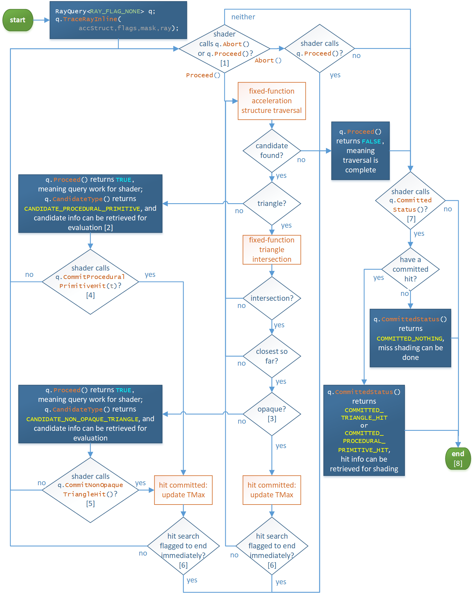

\[1\] [RayQuery::Proceed()](#rayquery-proceed) searches the acceleration structure to enumerate
primitives that may intersect the ray, conservatively: If a primitive is
intersected by the ray and is within the current [ray extents](#ray-extents)
interval, it is guaranteed to be enumerated eventually. If a primitive
is not intersected by the ray or is outside the current [ray extents](#ray-extents), it may or may not be enumerated. Note that TMax is updated
when a hit is committed (internal to the traversal, not visible to the application).  [RayQuery::Proceed()](#rayquery-proceed) represents where the bulk of system acceleration structure traversal is implemented (including code inlining where applicable).  [RayQuery::Abort()](#rayquery-abort) is an optional shortcut for the shader to be able to cause traversal to appear to be complete, via [RayQuery::Proceed()](#rayquery-proceed) returning `FALSE`.  So it is just a convenient way to exit the shader's traversal loop.  A shader can instead choose to break out of its traversal logic manually as well with normal shader code branching (invisible to the system).  This works since, as discussed in \[5\], the shader can call [RayQuery::CommittedStatus()](#rayquery-committedstatus) and related methods for retrieving committed hit information at any time after a [RayQuery::TraceRayInline](#rayquery-tracerayinline) call.

\[2\] Consider the case where the geometry is not triangle based.  Instead of fixed function triangle intersection [RayQuery::Proceed()](#rayquery-proceed) returns control to the shader.  It is the responsibility of the shader to evaluate all procedural intersections for this acceleration structure node, including resolving transparency for them if necessary without the system seeing what's happening.  The net result in terms of traversal is to call[RayQuery::CommitProceduralPrimitiveHit()](#rayquery-commitproceduralprimitivehit) at most once if the shader finds an opaque hit that is closest so far.

\[3\] Opaqueness is determined by examining the geometry and instance
flags of the intersection as well as the selection of [ray flags](#ray-flags) (template parameter and dynamic flags OR'd together).

\[4\] While in `CANDIDATE_PROCEDURAL_PRIMITIVE` state it is ok to call [RayQuery::CommitProceduralPrimitiveHit()](#rayquery-commitproceduralprimitivehit) zero or more times for a given candidate, as long as each time called, the shader has manually ensured that the latest hit being committed is within the current [ray extents](#ray-extents).  The system does not do this work for procedural primitives.  So new committed hits will update TMax multiple times as they are encountered.  For simplicity, the flow diagram doesn't visually depict the situation of multiple commits per candidate.  Alternatively the shader could enumerate all procedural hits for the current candidate and just call `CommitProceduralPrimitiveHit()` once for the closest hit found that the shader has calculated will be the new TMax.

\[5\] While in `CANDIDATE_NON_OPAQUE_TRIANGLE` state, the system has already determined that the candidate would be the closest hit so far in the [ray extents](#ray-extents) (e.g. would be new TMax if committed).  It is ok for the shader to call [RayQuery::CommitNonOpaqueTriangleHit()](#rayquery-commitnonopaquetrianglehit) zero or more times for a given candidate.  If called more than once, subsequent calls simply have not effect as the hit has already been committed.  For simplicity, the flow diagram doesn't visually depict the situation of multiple commits per candidate.

\[6\] The search for hits is ended at this point if the
`RAY_FLAG_ACCEPT_FIRST_HIT_AND_END_SEARCH` [ray flag](#ray-flags) is set.

\[7\] The shader can call [RayQuery::CommittedStatus()](#rayquery-committedstatus) from anywhere - a careful look at the flow diagram will reveal this.  It doesn't have to be after traversal has completed.  The status (including values returned from methods that report commited values) simply reflect the current state of the query.  What is not depicted in the diagram is that if [RayQuery::CommittedStatus()](#rayquery-committedstatus) is called before traversal has completed, the shader can still continue with the ray query.  One scenario where it can be interesting to call [RayQuery::CommittedStatus()](#rayquery-committedstatus) before [RayQuery::Proceed()](#rayquery-proceed) has returned false is if the shader has chosen to manually break out of its traversal loop without calling [RayQuery::Abort()](#rayquery-abort) discussed in \[1\].

\[8\] The endpoint of the graph is trivially reachable anytime the shader has control simply by not calling methods that advance `RayQuery` state.  The shader can arbitrarily choose to stop using the `RayQuery` object, or do final shading based on whatever the current state of the `RayQuery` object is.  The shader can even reset the query regardless of its current state at any time by calling [RayQuery::TraceRayInline()](#rayquery-tracerayinline) again to initialize a new trace.

### Specialized TraceRayInline control flow

The image below depicts how a particular choice of template flags used with the initial declaration of `RayQuery` can prune down the full flow graph (depicted above).  There is no shader participation needed in the search for intersections here.  Further, the search is configured to end upon the first hit.  Simplifications like this can free the system to generate more performant inline raytracing code.

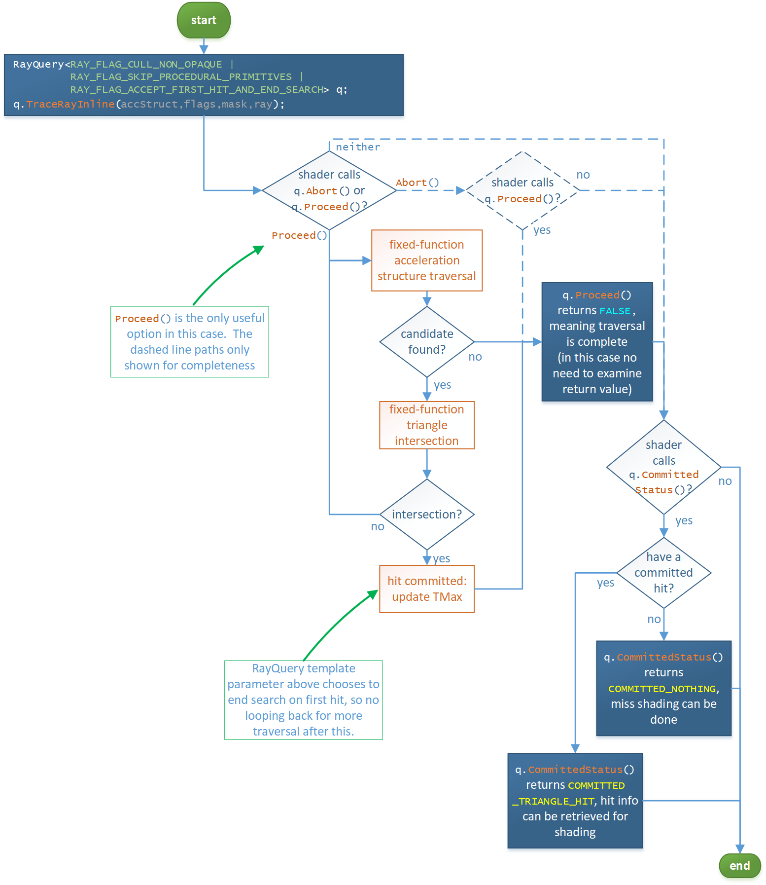

---

## Shader Execution Reordering

> Motivation:
>
> Many raytracing workloads suffer from divergent shader execution and divergent data access because of their stochastic nature. Improving coherence with high-level application-side logic has many drawbacks, both in terms of achievable performance (compared to a hardware-assisted implementation) and developer effort. The DXR API already allows implementations to dynamically schedule shading work triggered by [TraceRay](#traceray) and [CallShader](#callshader)`, but does not offer a way for the application to control that scheduling in any way.
>
>Furthermore, the current fused nature of `TraceRay` with its combined execution of traversal, intersection testing, anyhit shading and closesthit or miss shading imposes various restrictions on the programming model that, again, can increase the amount of developer effort and decrease performance. One aspect is that common code, e.g., vertex fetch and interpolation, must be duplicated in all closesthit shaders. This can cause more code to be generated, which is particularly problematic in a divergent execution environment. Furthermore, `TraceRay`'s nature requires that simple visibility rays unnecessarily execute hit shaders in order to access basic information about the hit which must be transferred back to the caller through the payload.

Shader Execution Reordering (SER) introduces a new HLSL built-in intrinsic,
[MaybeReorderThread](#maybereorderthread),
that enables application-controlled reordering of work across the GPU for
improved execution and data coherence.
Additionally, the introduction of [HitObject](#hitobject) allows separation of traversal,
anyhit shading and intersection testing from closesthit and miss shading.

`HitObject` and `MaybeReorderThread` can be combined to improve coherence for
closesthit and miss shader execution in a controlled manner.
Applications can control coherence based on hit properties,
ray generation state, ray payload, or any combination thereof. Applications can
maximize performance by considering coherence for both hit and miss shading as
well as subsequent control flow and data access patterns inside the
raygeneration shader.

`HitObject` improves the flexibility of the ray tracing pipeline in general.
First, common code, such as vertex fetch and interpolation, must no longer be
duplicated in all closesthit shaders. Common code can simply be part of the
raygeneration shader and execute before closesthit shading. Second, simple
visibility rays no longer have to invoke hit shaders in order to access basic
information about the hit, such as the distance to the closest hit. Finally,
`HitObject` can be constructed from a [RayQuery](#rayquery), which enables
`MaybeReorderThread` and shader table-based closesthit and miss shading to be combined with
`RayQuery`.

This feature should be relatively straightforward to adopt by
current DXR implementations: `HitObject` merely decouples existing `TraceRay`
functionality into two distinct stages: the traversal stage and the shading
stage. For SER's `MaybeReorderThread`, the minimal allowed implementation is simply a
no-op, while implementations that already employ more sophisticated scheduling
strategies are likely able to reuse existing mechanisms to implement support
for SER. No DXR runtime changes are necessary, since the addition to the programming model is limited to HLSL and DXIL.

This feature is a required part of Shader Model 6.9 (in preview) for devices with raytracing support.  It is also a required part of [D3D12_RAYTRACING_TIER_1_2](#d3d12_raytracing_tier), though even if a device doesn't support this tier it must still must support SER if it supports Shader Model 6.9.

Note that all new SER types and intrinsics are added to `namespace dx` in
accordance with the [Fast-Track Process for HLSL
Extensions](https://github.com/microsoft/hlsl-specs/blob/main/docs/Process.md#fast-track-for-extensions).
For the sake of legibility, this document only qualifies the namespace
explicitly in the definition of [HitObject](#hitobject) and its members. An implicit `using namespace dx` is assumed
elsewhere, such as code examples.

The canonical use of the features in SER features involve changing a `TraceRay` call to the
following sequence that is functionally equivalent:

```C++
HitObject Hit = HitObject::TraceRay( ..., Payload );
MaybeReorderThread( Hit );
HitObject::Invoke( Hit, Payload );
```

This snippet traces a ray and stores the result of traversal, intersection
testing and anyhit shading in `Hit`. The call to [MaybeReorderThread](#maybereorderthread) improves
coherence based on the information inside the `Hit`. Closesthit or miss
shading is then invoked in a more coherent context.

Note that this is a very basic example. Among other things, it is possible to
query information about the hit to influence [MaybeReorderThread](#maybereorderthread) with additional
hints. See [Separation of MaybeReorderThread and HitObject::Invoke](#separation-of-maybereorderthread-and-hitobject-invoke)
for more elaborate examples.

[TraceRay](#hitobject-traceray) returning a [HitObject](#hitobject) can be called on its own as well without
calling [MaybeReorderThread](#maybereorderthread) or [Invoke](#hitobject-invoke).  The caller might just want a `HitObject` 
without caring about thread reordering or Closesthit or miss shading. 
This is discussed in [SER Device Support](#SER-device-support), in particular
the implication, given that SER is required as part of Shader Model 6.9 for 
raytracing capable devices: Even devices that only trivially support SER 
by doing nothing on `MaybeReorderThread` must also support `Invoke` not being called,
essentially a new capability to skip final shading not available before.

See [HitObject](#hitobject) and [MaybeReorderThread](#maybereorderthread) for the rest of the documentation
of this feature.

---

### SER Device Support

Devices that support Shader Model 6.9 and raytracing must support the 
[Shader Execution Reordering](#shader-execution-reordering) HLSL methods in this spec. This doesn't mean 
all devices must support performing thread reordering - it is valid for 
an implementation to do nothing there.  Applications write one codebase 
using SER, and devices that can take advantage will, and other devices 
will just behave as if no reordering happened.

To help applications understand if the device actually does reordering,
D3D12 exposes a device capability indicating it that can be queried via
`CheckFeatureSupport()`:

```C++
// OPTIONSNN - NN TBD when SER support goes out of preview
typedef struct D3D12_FEATURE_DATA_D3D12_OPTIONSNN
{
    ...
    _Out_ BOOL ShaderExecutionReorderingActuallyReorders;
    ...
} D3D12_FEATURE_DATA_D3D12_OPTIONSNN;
```

e.g.:

```C++
D3D12_FEATURE_DATA_D3D12_OPTIONSNN Options; // NN TBD when implemented
VERIFY_SUCCEEDED(pDevice->CheckFeatureSupport(
    D3D12_FEATURE_D3D12_OPTIONSNN, &Options, sizeof(Options)));
if (!Options.ShaderExecutionReorderingActuallyReorders) {
    // Maybe app wants to do it's own manual sorting.
    // Or maybe a developer just wants to double check what's happening
    // on a given device during development.
}
```
 
Even on devices that don't do reordering, the [HitObject](#hitobject) portion 
of SER can be useful.

For instance, suppose an app wants to trace a ray, potentially including AnyHit 
shader invocations, and just wants the final `T` value without running
the ClosestHit shader (even if it happens to exist in the HitGroup).

The app can call [TraceRay](#hitobject-traceray) returning a [HitObject](#hitobject), call
[HitObject::GetRayTCurrent](#hitobject-getraytcurrent) on the `HitObject` to get the `T` value and be done.
Not calling [HitObject::Invoke](#hitobject-invoke), skips `ClosestHit`/`Miss` invocation, and this 
works on any device with Shader Model 6.9 support.

The app might still want to call `MaybeReorderThread()` after `TraceRay()` 
if the subsequent work could benefit, as illustrated in the Unified 
Shading example above.  And devices that can't reorder would just 
ignore the `MaybeReorderThread()` call.

---

## Opacity micromaps

Very high quality, high-definition opacity (alpha) content is usually very coherent, or locally similar.

Typically, there are larger regions that are completely transparent or opaque within meshes that do not necessarily coincide with triangle boundaries.

Furthermore, in DXR Tier 1.1, the opaque/non-opaque properties of triangles are geometry-wide, but it might be impractical to split up meshes into several geometry pieces. As a consequence, any-hit shaders are often invoked for ray-triangle hits that could be trivially categorized as a miss or a hit.

To reduce the overhead of redundant and potentially expensive any-hit shaders, Opacity Micromaps (OMM) are added to triangle primitives with DXR Tier 1.2 ([D3D12_RAYTRACING_TIER_1_2](#d3d12_raytracing_tier)).

The opacity micromap is defined on a sub-triangle detail level, encoded in a uniformly subdivided mesh of 4<sup>N</sup> *micro-triangles*, laid out on a 2<sup>N</sup>&nbsp;×&nbsp;2<sup>N</sup> barycentric grid. 

Here is a diagram of the first few levels of the subdivision scheme:

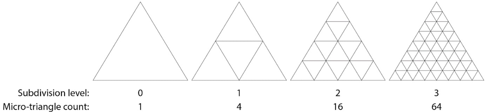
<figure>
  <figcaption>Micro-mesh subdivision scheme.</figcaption>
</figure>

Briefly, OMMs can be used to cull any-hit shading invocations in regions within a triangle known to be completely opaque or transparent.
It is also possible to bypass any-hit shading completely, and use the mask as high frequency geometric detail on the triangle.
Individual OMMs store (compact) information about how to modulate a base triangle to add the extra detail, much like traditional texture mapping.

Here is an example of OMM detail applied to a base triangle:
	

<figure>
  <figcaption>Left: A plain base triangle. Right: A opacity micromap applied to the base triangle, splitting it into opaque and transparent regions.</figcaption>
</figure>

Some more operational details follow.  In addition, see [Opacity Micromap related API and HLSL impacts](#opacity-micromap-related-api-and-hlsl-impacts) for a links to how the features integrates into the programming model overall.

---

### Opacity micromap construction

Unlike triangles, the OMMs are not stored directly in the bottom-level acceleration structures (BLAS), but instead reside in separate resources. Individual OMMs may be referenced by triangles from within a BLAS. Because OMMs storage is separate from the BLASes, they can be reused within and across multiple BLASes in a scene.

Before OMMs can be used with raytracing, they must be processed by the driver. This is similar to how triangles and procedural primitives must be encoded into a BLAS before they can be used.

Collections of OMM inputs are used to construct *OMM Arrays* using the same API as for building acceleration structures: [`BuildRaytracingAccelerationStructure()`](#buildraytracingaccelerationstructure) on the command list.  Here is an example of a collection of OMMs in an OMM Array:

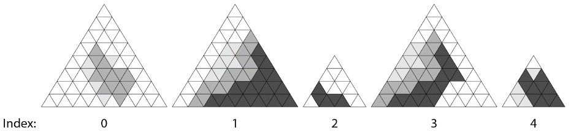
<figure>
  <figcaption>Example of an OMM Array containing entries with different subdivision levels. Individual OMMs are referenced via their index in the array.</figcaption>
</figure>

Like acceleration structures, the OMM Arrays are opaque data structures, but the application is responsible for memory management. The amount of memory required for an OMM Array can be queried via the same method used for acceleration structures: [GetRaytracingAccelerationStructurePrebuildInfo()](#getraytracingaccelerationstructureprebuildinfo) device member function. Opaque OMM Array data must reside in resources that are permanently in the state [D3D12_RESOURCE_STATE_RAYTRACING_ACCELERATION_STRUCTURE](#additional-resource-states), just like acceleration structures.  It is fine to intermix acceleration structures and OMM array data in the same allocations.

The application can reference specific entries within an array by their input-order index to link specific entries to specific triangles in a BLAS. To construct an OMM Array, the application provides an input buffer with micro-triangles in one of the supported encodings, which the driver assembles into a raytracing-compatible format.

The application can link an OMM Array per geometry, from which detailed opacity information is retrieved during ray traversal. This is illustrated in the diagram below. The OMM feature is accessible for BLAS builds through the use of a new geometry descriptor, [D3D12_RAYTRACING_GEOMETRY_OMM_TRIANGLES_DESC](#d3d12_raytracing_geometry_omm_triangles_desc), which contains additional inputs to the [BuildRaytracingAccelerationStructure()](#buildraytracingaccelerationstructure) function.

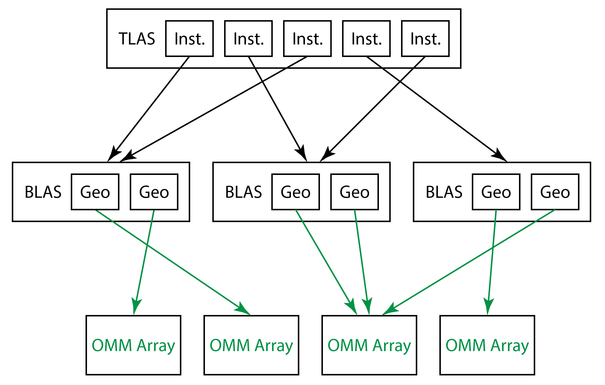
<figure>
  <figcaption>Illustration of how OMM Arrays fit into the AS hierarchy. At BLAS build time, per-triangle indices link specific triangles to OMM Array entries. OMMs can be referenced multiple times both within and across multiple BLASes.</figcaption>
</figure>

If an OMM Array is overwritten with new OMM data, any BLASes referencing it become stale and must be updated.
It is also possible to assign a different OMM Array and OMM indices when updating a BLAS.
The new AS build flag [D3D12_RAYTRACING_ACCELERATION_STRUCTURE_BUILD_FLAG_ALLOW_OMM_LINKAGE_UPDATE](#d3d12_raytracing_acceleration_structure_build_flags) lets the driver know that OMM contents may change with BLAS updates.

OMM Arrays can be copied around, serialized/deserialized etc. just like acceleration structures via the various modes of [CopyRaytracingAccelerationStructure()](#copyraytracingaccelerationstructure). 

Some information about OMM Arrays is only available once it has been built. This includes the final size of the resource (which may be somewhat smaller than what is reported by the [GetRaytracingAccelerationStructurePrebuildInfo()](#getraytracingaccelerationstructureprebuildinfo) call), and the sizes of the serialized and visualization versions of the Array. The information can either be retrieved from the OMM Array build call, or by calling [EmitRaytracingAccelerationStructurePostbuildInfo()](#emitraytracingaccelerationstructurepostbuildinfo).

---

### Opacity micromaps and TraceRay

A new pipeline flag, [D3D12_RAYTRACING_PIPELINE_FLAG_ALLOW_OPACITY_MICROMAPS](#d3d12_raytracing_pipeline_flags), has been added to let the driver know that the opacity micromap feature is going to be used. 

- If OMMs are known not to be used, it is more efficient to not specify the [D3D12_RAYTRACING_PIPELINE_FLAG_ALLOW_OPACITY_MICROMAPS](#d3d12_raytracing_pipeline_flags) flag. 
- If the flag is omitted and an OMM is encountered during ray traversal, behavior is undefined.

Opacity micromaps classify micro-triangles as opaque, transparent or unknown. When a ray intersects a triangle with a linked OMM, the intersection point within the barycentric space of the triangle is used to look up the opacity at that location.

- If it is opaque, then the hit is committed.
- If it is transparent the hit is ignored and traversal resumes.
- If it is unknown, the attached any hit shader is invoked.

The additions to [TraceRay()](#traceray) are depicted in this diagram:


<figure>
  <figcaption>Updated `TraceRay()` behavior to handle opacity micromaps.</figcaption>
</figure>

The geometry opaque/non-opaque flag state is ignored for triangles which have linked OMMs (that aren't disabled via flags), as OMMs give much more fine-grained control and are intended to replace the geometry-wide state where possible.

Ray flags and instance flags may still alter the state of opaque or unknown hits, but note that any such flags are only applied *after* the OMM hit classification has occurred. This means that once the OMM has been evaluated, there is no way to turn a transparent micro-triangle miss into a hit even by using force-opaque ray or instance flags.

It is still possible to turn off OMMs and revert to the geometry-specified behavior for individual instances using the [D3D12_RAYTRACING_INSTANCE_FLAG_DISABLE_OMMS](#d3d12_raytracing_instance_flags) instance flag.
This flag is only valid if the referenced BLAS was originally built with the [D3D12_RAYTRACING_ACCELERATION_STRUCTURE_BUILD_FLAG_ALLOW_DISABLE_OMMS](#d3d12_raytracing_acceleration_structure_build_flags) build flag.

> Disabling OMMs on a per-instance basis is useful to implement certain level-of-detail schemes.

---

### Opacity micromaps and TraceRayInline

For inline raytracing via [RayQuery](#rayquery) objects, the `RayQuery` object takes an additional template parameter (as of Shader Model 6.9) allowing each instance of the object to indicate that the opacity micromap feature is going to be used.

```C++
RayQuery<RAY_FLAGS,RAYQUERY_FLAGS>
```
See [RayQuery flags](#rayquery-flags), which has a `RAYQUERY_FLAG_ALLOW_OPACITY_MICROMAPS` flag.

- If OMMs are known not to be used, it is more efficient to not specify the `RAYQUERY_FLAG_ALLOW_OPACITY_MICROMAPS` flag. 
- If the flag is omitted and an OMM is encountered during ray traversal, behavior is undefined.

Opacity micromaps classify micro-triangles as opaque, transparent or unknown. When a ray intersects a triangle with a a linked OMM, the intersection point within the barycentric space of the triangle is used to look up the opacity at that location.

- If it is opaque, then the hit is committed.
- If it is transparent the hit is ignored and traversal resumes.
- If it is unknown, a candidate hit is returned.

The geometry opaque/non-opaque flag state is ignored for triangles which have linked OMMs, as OMMs give much more fine-grained control and are intended to replace the geometry-wide state where possible.

Ray flags and instance flags may still alter the state of opaque hits, but note that any such flags are only applied *after* the OMM hit classification has occurred. This means that once the OMM has been evaluated, there is no way to turn a transparent micro-triangle miss into a hit even by using force-opaque ray or instance flags.

It is still possible to turn off OMMs and revert to the geometry-specified behavior for individual instances using the [D3D12_RAYTRACING_INSTANCE_FLAG_DISABLE_OMMS](#d3d12_raytracing_instance_flags) instance flag.
This flag is only valid if the referenced BLAS was originally built with the [D3D12_RAYTRACING_ACCELERATION_STRUCTURE_BUILD_FLAG_ALLOW_DISABLE_OMMS](#d3d12_raytracing_acceleration_structure_build_flags) build flag.

> Disabling OMMs on a per-instance basis is useful to implement certain level-of-detail schemes.

---

### Opacity micromap encoding

Opacity micromaps are bit masks of one or two bits per micro-triangle.

A 1-bit OMM marks each corresponding micro-triangle as either opaque ([D3D12_RAYTRACING_OPACITY_MICROMAP_STATE_OPAQUE](#d3d12_raytracing_opacity_micromap_state)) or transparent ([D3D12_RAYTRACING_OPACITY_MICROMAP_STATE_TRANSPARENT](#d3d12_raytracing_opacity_micromap_state)) and never requires any-hit shader intervention during the tracing of a ray.

2-bit OMMs are used if there are portions of the opacity that need to be resolved in an any-hit shader. A third translucent or “unknown” micro-triangle state is used for this purpose. The 2-bit OMM encodes four states (instead of only three) which affords some flexibility of interpretation: in some ray-traced effects, exact resolution is not required. For example, soft shadows may be resolved using a lower resolution proxy.

To facilitate use of such proxies the four states of a 2-bit OMM are transparent, opaque, unknown transparent ([D3D12_RAYTRACING_OPACITY_MICROMAP_STATE_UNKNOWN_TRANSPARENT](#d3d12_raytracing_opacity_micromap_state)), and unknown opaque ([D3D12_RAYTRACING_OPACITY_MICROMAP_STATE_UNKNOWN_OPAQUE](#d3d12_raytracing_opacity_micromap_state)). 

In one mode of interpretation, unknown transparent is associated with transparent, and unknown opaque with opaque, and in doing so interpreting it as a 1-bit map without unknown states. This is referred to as operating in 2-state mode.

In a second mode of interpretation of the four states, the any-hit shader is invoked when the micro-triangle that is struck is categorized as either of the unknowns. This is referred to as operating in 4-state mode.

OMMs can be constructed with either 2 or 4 states ([D3D12_RAYTRACING_OPACITY_MICROMAP_FORMAT_OC1_2_STATE](#d3d12_raytracing_opacity_micromap_format) or [D3D12_RAYTRACING_OPACITY_MICROMAP_FORMAT_OC1_4_STATE](#d3d12_raytracing_opacity_micromap_format)).

4-state OMMs can operate in a 2-state interpretation mode through ray and instance flags, [RAY_FLAG_FORCE_OMM_2_STATE](#ray-flags) or [D3D12_RAYTRACING_INSTANCE_FLAG_FORCE_OMM_2_STATE](#d3d12_raytracing_instance_flags). 

The OMM micro-triangle states are organized along a space-filling curve in barycentric space, depicted here:

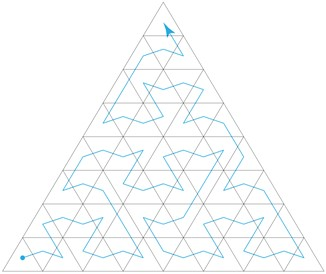
<figure>
  <figcaption>The OMM input order follows a space-filling curve over the uniformly tessellated micro-triangles in barycentric space.</figcaption>
</figure>

---

### Opacity micromap related API and HLSL impacts

Device methods extended to support Opacity Micromaps:
- [GetRaytracingAccelerationStructurePrebuildInfo()](#getraytracingaccelerationstructureprebuildinfo)
  - added support for prebuild info for acceleration structures using OMMs
  - added support for prebuild info for OMM arrays themselves
  - for details see additions to `BuildRaytracingAccelerationStructure` below which are shared for prebuild info here
- [CreateStateObject()](#createstateobject) 
  - added `D3D12_RAYTRACING_PIPELINE_FLAG_ALLOW_OPACITY_MICROMAPS` in [D3D12_RAYTRACING_PIPELINE_FLAG](#d3d12_raytracing_pipeline_flags)
  - added `RAYQUERY_FLAG_ALLOW_OPACITY_MICROMAPS` in a new [RayQuery flags](#rayquery-flags) template parameter to [RayQuery](#rayquery)
- [CheckDriverMatchingIdentifier()](#checkdrivermatchingidentifier)
  - added `D3D12_SERIALIZED_DATA_RAYTRACING_OPACITY_MICROMAP_ARRAY` in [D3D12_SERIALIZED_DATA_TYPE](#d3d12_serialized_data_type)

CommandList methods extended to support Opacity Micromaps:
- [BuildRaytracingAccelerationStructure()](#buildraytracingaccelerationstructure)
  - Additions for using Opacity Micromap arrays in bottom level acceleration structures:
    - In [D3D12_RAYTRACING_ACCELERATION_STRUCTURE_BUILD_FLAGS](#d3d12_raytracing_acceleration_structure_build_flags):
      - Added behavior to existing flag `D3D12_RAYTRACING_ACCELERATION_STRUCTURE_BUILD_FLAG_PERFORM_UPDATE`
      - Added `D3D12_RAYTRACING_ACCELERATION_STRUCTURE_BUILD_FLAG_ALLOW_OMM_LINKAGE_UPDATE` and `D3D12_RAYTRACING_ACCELERATION_STRUCTURE_BUILD_FLAG_ALLOW_DISABLE_OMMS`
    - In [D3D12_RAYTRACING_GEOMETRY_DESC](#d3d12_raytracing_geometry_desc) added [D3D12_RAYTRACING_GEOMETRY_OMM_TRIANGLES_DESC](#d3d12_raytracing_geometry_omm_triangles_desc) to union
    - Added `D3D12_RAYTRACING_GEOMETRY_TYPE_OMM_TRIANGLES` to [D3D12_RAYTRACING_GEOMETRY_TYPE](#d3d12_raytracing_geometry_type) to indicate above desc
    - In [D3D12_RAYTRACING_INSTANCE_FLAGS](#d3d12_raytracing_instance_flags):
      - Added `D3D12_RAYTRACING_INSTANCE_FLAG_FORCE_OMM_2_STATE` and `D3D12_RAYTRACING_INSTANCE_FLAG_DISABLE_OMMS`
  - Added support for building Opacity Micromap arrays themselves:
    - [D3D12_BUILD_RAYTRACING_ACCELERATION_STRUCTURE_INPUTS](#d3d12_build_raytracing_acceleration_structure_inputs) has a new entry in its typed union: [D3D12_RAYTRACING_OPACITY_MICROMAP_ARRAY_DESC](#d3d12_raytracing_opacity_micromap_array_desc) `*pOpacityMicromapArrayDesc`.  There is a corresponding new [D3D12_RAYTRACING_ACCELERATION_STRUCTURE_TYPE](#d3d12_raytracing_acceleration_structure_type) `D3D12_RAYTRACING_ACCELERATION_STRUCTURE_TYPE_OPACITY_MICROMAP_ARRAY`.
  
- [EmitRaytracingAccelerationStructurePostbuildInfo()](#emitraytracingaccelerationstructurepostbuildinfo)
  - [D3D12_RAYTRACING_ACCELERATION_STRUCTURE_POSTBUILD_INFO_SERIALIZATION_DESC](#d3d12_raytracing_acceleration_structure_postbuild_info_serialization_desc) defines a new serialization header [D3D12_SERIALIZED_RAYTRACING_ACCELERATION_STRUCTURE_HEADER1](#d3d12_serialized_raytracing_acceleration_structure_header1) that is a superset and backwards compatible with the existing header, [D3D12_SERIALIZED_RAYTRACING_ACCELERATION_STRUCTURE_HEADER](#d3d12_serialized_raytracing_acceleration_structure_header).  With the new header, BLAS can refer to serialized Opacity Micromaps, where before there was nothing they could refer to.  Apps that serialized with the previous header continue to work fine, as it results in the same memory layout for cases where there is nothing after the header (since there were no OMMs before).
- [CopyRaytracingAccelerationStructure()](#copyraytracingaccelerationstructure)
  - OMM Arrays support existing `COPY_MODE_CLONE`, `COPY_MODE_COMPACT`, `_VISUALIZATION_DECODE_FOR_TOOLS`, `_SERIALIZE` and `_DESERIALIZE`.
  - As described above for [EmitRaytracingAccelerationStructurePostbuildInfo()](#emitraytracingaccelerationstructurepostbuildinfo), when doing serialization/deserialization the header for BLAS now supports specifying serialized Opacity Micromaps (which are themselves serialized/deserialized separately)

There are a couple of header [Constants](#constants) related to Opacity Micromaps as well.

For HLSL there is one new [Ray flag](#ray-flags) related to Opacity Micromaps. There is also an equivalent flag in a new [RayQuery flags](#rayquery-flags) template parameter for inline raytracing [RayQuery](#rayquery) objects.

Enum representing entries in Opacity Micromaps (not an API, just defining the data interpretation): [D3D12_RAYTRACING_OPACITY_MICROMAP_STATE](#d3d12_raytracing_opacity_micromap_state).

---

# Shader management

---

## Problem space

---

### Implementations juggle many shaders

In a given [DispatchRays()](#dispatchrays) invocation from a CommandList, the application
must have a way to specify every shader that might be invoked, since rays
can go anywhere. It would seem this is solved by the presence of shader
tables that allow applications to arbitrarily select shaders and their
root arguments.

However, implementations have the potential to run the arbitrary set of
shaders more efficiently if they also get a chance to see the full set
up front (before execution). So the design choice is to give
implementations the ability to perform a quick link step. This link
doesn't recompile the individual shaders but instead makes some
scheduling decisions based on the characteristics of all of the shaders
in the potentially referenced set. Where applications have freedom is to
reference any of the shaders in a given pre-identified set from anywhere
in shader tables.

Sets of shaders need to be pre-defined because it isn't viable to
require drivers to inspect shader tables in order to figure out what the
reachable set for a given [DispatchRays()](#dispatchrays) call.
Shader tables can be modified freely by the application (with
appropriate state barriers), after all, on the GPU timeline. The
expectation is that any analysis of the set of shaders for the purpose
of scheduling optimization for the group is best left as a CPU task for
the driver.

This motivates the need to make some representation of all shaders
reachable by a raytracing operation on the CPU timeline.

---

### Applications control shader compilation

Applications must control when and where (on which threads) shader
compilation occurs given the high CPU cost, particularly with large
asset bases.

First there is the initial shader compile to DXIL binary, which can be
done offline by an application (before any hardware driver sees it). The
HLSL compiler supports DXIL libraries, allowing applications to easily
store large compiled codebases in single files if desired.

Given shaders in one or more DXIL libraries, they must be submitted to
drivers to compile on any given system where the shaders will run.
Applications must be able to choose which subset of any given DXIL
library a driver should compile at any given time; applications have the
freedom to choose how to distribute driver shader compilation across
threads, regardless of how groups of shaders happen to be packaged into
DXIL libraries.

---

## State objects

A state object represents a variable amount of configuration state,
including shaders, that an application manages as a single unit and
which is given to a driver atomically to process (e.g. compile/optimize)
however it sees fit. A state object is created via
[CreateStateObject()](#createstateobject) on a D3D12 device.

---

### Subobjects

State objects are built out of subobjects. A subobject has a
[type](#d3d12_state_subobject_type) and corresponding data. A couple of
examples of subobject types:
`D3D12_STATE_SUBOBJECT_TYPE_DXIL_LIBRARY` and
`D3D12_STATE_SUBOBJECT_TYPE_LOCAL_ROOT_SIGNATURE*`.

Another notable subobject type is
`D3D12_STATE_SUBOBJECT_TYPE_SUBOBJECT_TO_EXPORTS_ASSOCIATION`,
whose role is to associate another subobject with a list of DXIL
exports. This enables, for example, multiple local root signatures to be
present in a state object simultaneously, each associated with different
shader exports. See [Subobject association behavior](#subobject-association-behavior) for detailed discussion, and
see the relevant parts of the state object API here:
[D3D12_SUBOBJECT_TO_EXPORTS_ASSOCIATION](#d3d12_subobject_to_exports_association) and
[D3D12_DXIL_SUBOBJECT_TO_EXPORTS_ASSOCIATION](#d3d12_dxil_subobject_to_exports_association).

The full set of subobject types is defined in
[D3D12_STATE_SUBOBJECT_TYPE](#d3d12_state_subobject_type).

---

#### Subobjects in DXIL libraries

DXIL libraries, compiled offline before state object creation, can also
define many of the same kinds of subobjects that can be directly defined
in state objects. The DXIL/HLSL versions of subobjects are defined
[here](#subobject-definitions).

The reason that subobjects can be defined either in DXIL libraries or in
state objects is to give the application the choice about how much state
authoring to do offline (DXIL libraries) vs at runtime (state objects).

Shaders are **not** considered a subobject, so while they are present in
DXIL libraries, they can't be directly passed into state objects.
Instead, the way to get shaders into a state object is to put the
containing DXIL library into the state object, as a DXIL library
subobject, including the requested shader entrypoint names to include.

---

### State object types

State objects have a [type](#d3d12_state_object_type) that dictates rules
about the subobjects they contain and how the state objects can be used.

---

#### Raytracing pipeline state object

One of the state object [types](#d3d12_state_object_type) is
`D3D12_STATE_OBJECT_TYPE_RAYTRACING_PIPELINE`, or
raytracing pipeline state object - RTPSO for short. An RTPSO
represents a full set of shaders that could be reachable by a
[DispatchRays](#dispatchrays) call, with all configuration options resolved,
such as local root signatures and other state.

An RTPSO can be thought of as an *executable* state object.

The input to [SetPipelineState1()](#setpipelinestate1) is a state object,
where an RTPSO can be bound to the command list.

---

#### Graphics and compute state objects

In the future, graphics and compute pipelines could be defined in state
object form for completeness. Initially the focus is on enabling
raytracing. So for now the way graphics and compute PSOs are constructed
is not changed.

---

#### Collection state object

Another state object [type](#d3d12_state_object_type) is
`D3D12_STATE_OBJECT_TYPE_COLLECTION`, or collection for short. A
collection can contain any amount of subobjects, but doesn't have
constraints. Not all dependencies the included subobjects have must be
resolved in the same collection. Even if dependencies are locally
defined, the set of subobjects doesn't have to be the complete set of
state that will eventually be used on the GPU. For instance, a
collection may not include all shaders needed to raytrace a scene,
though it could.

The purpose of a collection is to allow an application to pass an
arbitrarily large or small collection of state to drivers to compile at
once (e.g. on a given thread).

If too little configuration information is provided in the subobjects in
a collection, the driver cannot compile anything, 
and would be left with simply storing the subobjects.  This situation isn't allowed by 
default: collection creation will fail.  The collection can opt out of needing all 
dependencies to be resolvable, causing the driver to defer compilation, by setting the `D3D12_STATE_OBJECT_FLAG_ALLOW_LOCAL_DEPENDENCIES_ON_EXTERNAL_DEFINITONS` flag in [D3D12_STATE_OBJECT_FLAGS](#d3d12_state_object_flags).

A collection must meet the following requirements for the driver to be able to compile it immediately:
- library functions called by shaders must have code definitions
- resource bindings referenced by shaders must have local and/or global root signature subobjects defining the bindings
- raytracing shaders must have a [D3D12_RAYTRACING_SHADER_CONFIG](#d3d12_raytracing_shader_config) and a [D3D12_RAYTRACING_PIPELINE_CONFIG](#d3d12_raytracing_pipeline_config) subobject

The parts of the above list that involve subobject associations are discussed further at [subobject association requirements](#subobject-association-requirements).

For simplicity, collections can't be made out of other collections. Only
executable state objects (e.g. RTPSOs) can take existing collections as
a part of their definition.

[State object lifetimes as seen by driver](#state-object-lifetimes-as-seen-by-driver) is a discussion useful for driver authors.

---

#### Collections vs libraries

A collection is a bit like a library, but a different name is used to
distinguish it from DXIL Libraries.

DXIL Libraries are hardware agnostic. In contrast, a collection's
contents are given to a driver to process and can include a part of a
DXIL Library (by listing a subset of exports to use), multiple DXIL
Libraries, as well as other types of subobjects like root signatures.

An application can choose to have many tiny DXIL libraries each with a
single compileable raytracing shader. It can choose to create a separate
collection for each one across different threads on a CPU. Or it could
make one collection per thread, distributing the set of shaders evenly
across them. In either case, an RTPSO can then be constructed out of the
set of collections.

Alternatively, if CPU time compiling shaders in the driver before use
isn't a concern, an application can skip making collections and pass all
of its DXIL Libraries directly into the creation of an RTPSO. An extreme
case of this would be an application baking all of its shader assets
(and other necessary subobjects like root signatures) in a single DXIL
Library (e.g. one binary file), loading this into memory and passing it
directly into the creation of an RTPSO. The driver would have to compile
all of the shaders at once on one thread.

---

### DXIL libraries and state objects example

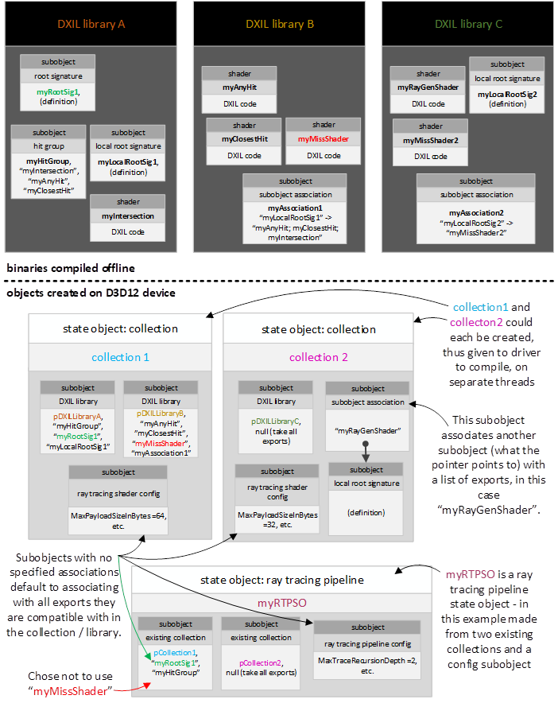

---

### Subobject association behavior

The introduction to [Subobjects](#subobjects) called out a specific type
of subobject that associates another subobject with a set of shader
exports.

This section describes how subobjects (like root signatures) get
associated with shaders in DXIL libraries and state objects. This
includes the way default associations (intended for convenience) and
explicit association work. Also covered is how DXIL subobject
associations can be overridden when an app includes a DXIL library in a
state object.

---

#### Default associations

Default associations serve as a convenience for the common case where a
given subobject (like a root signature) will be used with many shaders.

---

##### Terminology

For the subsequent discussion consider the following **scopes** of
visibility where a set of shaders can be found:

- a given DXIL library

- a collection state object, which may get shaders from one or more
  DXIL libraries

- an executable state object (e.g. RTPSO), which may get shaders from
  one or more collections and/or DXIL libraries

A given scope can **contain** other inner scopes, or outer scopes can
**enclose** it.

---

##### Declaring a default association

There are two ways declare a default association for a subobject to a
set of shaders:

1. Declare a subobject in a given scope with no explicit associations
   in that scope that reference it.  If this subobject is involved in
   an association defined in any *other* scope including enclosing or
   contained scopes, it doesn't affect that locally this subobject acts
   as a default association.

2. Define an association with an empty export list.  The subobject
   specified may or may not be in the current scope.  The subobject
   specified can also be unresolved (not defined in current, containing
   or enclosed scopes), unless the state object being defined is
   executable, e.g. RTPSO.

---

##### Behavior of a default association

In a default association a subobject is associated with all candidate
exports in the current and contained scopes, but not to enclosing
scopes.  Candidates to be associated are exports for which the
association would make sense, and that don't have an explicit
association with another subobject of the same type already.  There is
one exception, where default association can **override** an existing
association on an export, described later.

---

#### Explicit associations

Explicit associations associate a given subobject to a specific nonempty
list of exports.

The subobject being associated (e.g. root signature) and/or the listed
exports can be in any scope in the object.

In addition, neither the subobject being associated or the listed
exports have to even be visible yet (may be unresolved references),
unless the state object is executable, e.g. RTPSO.

---

#### Multiple associations of a subobject

A given subobject can be referenced in multiple association definitions,
explicit and/or default. This way any given association definition
doesn't need to be all-knowing (does not need to be aware of all
shaders a subobject may be relevant to).

The use of multiple association declarations also enables, for instance,
broadcasting a default association for a given subobject to be broadcast
into multiple scopes. Each association declaration (in a different
scope) this case would use an empty export (making it a default
association) but reference the same subobject.

---

#### Conflicting subobject associations

If there are multiple explicit subject associations (with different
subobject definitions) that map to a given shader export, this is a
conflict. If a conflict is discovered during DXIL library creation,
library creation will fail. Otherwise if a conflict is discovered during
state object creation, that fails.

The determination of conflicts doesn't care what scope(s) hold the
associations, subobjects being associated or shader export within a
given state object (or single scope DXIL library). This is because by
definition, explicit associations can reach anywhere in a state object
(or DXIL library).

There is one exception where a conflict doesn't cause a failure and
instead there is a precedence order that causes an override:

---

##### Exception: overriding DXIL library associations

Subobject associations (default or explicit) declared directly in state
objects that target an export in a directly included DXIL library cause
any other association to that export that was defined in any DXIL
library (same or other library) to no longer apply to that export. And
as a result, the subobject association declared directly in the state
object "wins" and overrides the DXIL based association. This includes
associations defined at state object scope via either
[D3D12_SUBOBJECT_TO_EXPORTS_ASSOCIATION](#d3d12_subobject_to_exports_association) (association at state object
scope for a subobject also defined at state object scope) or
[D3D12_DXIL_SUBOBJECT_TO_EXPORTS_ASSOCIATION](#d3d12_dxil_subobject_to_exports_association) (association at state
object scope a subject defined in a DXIL library).

Associations declared in state objects do not override any existing
associations in contained collections (including DXIL libraries the
contained collections may have).

The subobject being associated can be unresolved unless the state object
is RTPSO (executable).

> The reason overriding is only defined for DXIL libraries directly passed into a given state object's creation is the following. Drivers never have to worry about compiling code that came from a DXIL library during state object creation only to have to recompile later because multiple subobject overrides happened. e.g. creating a collection that overrides associations in a DXIL library then creating an RTPSO that includes the collection and tries to override an association again is invalid (the second association becomes conflicting and state object creation fails).
>
> The value in supporting overriding of subobject associations is to give programmatic code (i.e. performing state object creation) one chance to override what is in a static DXIL library, without having to patch the DXIL library itself.

---

#### Subobject associations for hit groups

[Hit groups](#hit-groups) reference a set of component shaders, such as
a closest hit shader, any hit shader, and/or intersection shader.
Subobject associations (like associating a local root signature to a
shader) can be made directly to the individual component shaders used by
a hit group and/or directly to the hit group. Making the association to
the hit group can be convenient, as it applies to all the component
shaders (so they don't need individual associations). If both a hit
group has an association and its component shaders have associations,
they must match. If a hit group doesn't have a particular subobject
association, the associations for all component shaders must match. So
different component shaders can't use different local root signatures,
for instance.

---

#### Runtime resolves associations for driver

The runtime resolves what subobject associations ended up at any given
export, accounting for defaults, overriding etc. and tells the driver
the result during state object association. This ensures consistency
across implementations.

---

### Subobject association requirements

This table describes requirements for each subobject type that supports
being associated with shader exports.

The "Match rule" column describes whether a subobject association is
required or optional for any given shader and whether the definition of
the subobject must match that of other shaders.  

The "Match scope" column describes what set of shader code the matching
requirement applies to.

| Subobject type                                                  | Match rule                                   | Match scope                                                                                                                                                          |
| --------------------------------------------------------------- | -------------------------------------------- | -------------------------------------------------------------------------------------------------------------------------------------------------------------------- |
| [Raytracing shader config](#d3d12_raytracing_shader_config)     | Required & matching for all exports          | Full state object. More discussion at [D3D12_RAYTRACING_SHADER_CONFIG](#d3d12_raytracing_shader_config).                                                          |
| [Raytracing pipeline config](#d3d12_raytracing_pipeline_config1) | Required & matching for all exports          | Full state object. More discussion at [D3D12_RAYTRACING_PIPELINE_CONFIG](#d3d12_raytracing_pipeline_config), [D3D12_RAYTRACING_PIPELINE_CONFIG1](#d3d12_raytracing_pipeline_config1).                                                      |
| [Global root signature](#d3d12_global_root_signature)           | Optional, if present must match shader entry | Call graph reachable from shader entry. More discussion at [D3D12_GLOBAL_ROOT_SIGNATURE](#d3d12_global_root_signature).                                           |
| [Local root signature](#d3d12_local_root_signature)            | Optional, if present must match shader entry | Call graph reachable from shader entry (not including calls through shader tables). More discussion at [D3D12_LOCAL_ROOT_SIGNATURE](#d3d12_local_root_signature). |
| [Node mask](#d3d12_node_mask)                                  | Optional, if present match for all exports   | Full state object. More discussion at [D3D12_NODE_MASK](#d3d12_node_mask).                                                                                        |
| [State object config](#d3d12_state_object_config)               | Optional, if present match for all exports   | Local state object only, doesn't need to match contained state objects. More discussion at [D3D12_STATE_OBJECT_CONFIG](#d3d12_state_object_config)                |

---

### State object caching

Drivers are responsible for implementing caching of state objects using
existing services in D3D12 to improve performance when state objects (or
components in them) are reused across runs of an application.

---

### Incremental additions to existing state objects

[Tier 1.1](#d3d12_raytracing_tier) implementations support adding to existing state objects via
 [AddToStateObject()](#addtostateobject).  This incurs lower CPU overhead in streaming scenarios where new shaders need to be added to a state object that is already being used, rather than having to create a state object that is mostly redundant with an existing one.  Details on the nuances of this option are described at [AddToStateObject()](#addtostateobject).

---

# System limits and fixed function behaviors

---

## Addressing calculations within shader tables

> The very fixed nature of shader table indexing described here is a result of IHV limitation. The hope is these limitations aren't too annoying for apps (which have to live with them). The extent to which the fixed function choices made here conflict with what an app actually wants may force app to do inefficient things like duplicating entries in shader tables to accomplish what they want. That said, such inefficiencies in shader table layout may not turn out to be an overall bottleneck. So this might be no worse than simply being slightly awkward to use.

---

### Hit group table indexing

> HitGroupRecordAddress =<br>[D3D12_DISPATCH_RAYS_DESC](#d3d12_dispatch_rays_desc).HitGroupTable.StartAddress \+ <small>// from: [DispatchRays()](#dispatchrays)</small><br>[D3D12_DISPATCH_RAYS_DESC](#d3d12_dispatch_rays_desc).HitGroupTable.StrideInBytes \*  <small>// from: [DispatchRays()](#dispatchrays)</small><br>(<br>RayContributionToHitGroupIndex \+ <small>// from shader: [TraceRay()](#traceray)</small><br>(MultiplierForGeometryContributionToHitGroupIndex \* <small>// from shader: [TraceRay()](#traceray)</small><br>GeometryContributionToHitGroupIndex) \+ <small>// system generated index of geometry in bottom-level acceleration structure (0,1,2,3..)</small><br><br>[D3D12_RAYTRACING_INSTANCE_DESC](#d3d12_raytracing_instance_desc).InstanceContributionToHitGroupIndex <small>// from instance</small><br>)

Setting MultiplierForGeometryContributionToHitGroupIndex \> 1 lets apps
group shaders for multiple ray types adjacent to each other per-geometry
in a shader table. The acceleration structure doesn't need to know this
is happening, as it merely stores an InstanceContributionToHitGroupIndex
per-instance. GeometryContributionToHitGroupIndex is a fixed function
sequential index (0,1,2,3..) incrementing per geometry, mirroring the
order each geometry was placed by the app in the current bottom-level
acceleration structure.

As of raytracing [Tier 1.1](#d3d12_raytracing_tier) implementations, it can be interesting to set MultiplierForGeometryContributionToHitGroupIndex to 0, meaning geometry index does not contribute to shader table indexing at all.  This can work if the shaders will be calling the [GeometryIndex()](#geometryindex) intrinsic (added for [Tier 1.1](#d3d12_raytracing_tier) implementations) to be able to distinguish geometries within shaders manually.

---

### Miss shader table indexing

> MissShaderRecordAddress =<br>D3D12_DISPATCH_RAYS_DESC.MissShaderTable.StartAddress \+ <small>// from: [DispatchRays()](#dispatchrays)</small><br>D3D12_DISPATCH_RAYS_DESC.MissShaderTable.StrideInBytes \* <small>// from: [DispatchRays()](#dispatchrays)</small><br>MissShaderIndex <small>// from shader: [TraceRay()](#traceray)</small><br>

---

### Callable shader table indexing

> CallableShaderRecordAddress =<br>D3D12_DISPATCH_RAYS_DESC.CallableShaderTable.StartAddress + <small>// from: [DispatchRays()](#dispatchrays)</small><br>D3D12_DISPATCH_RAYS_DESC.CallableShaderTable.StrideInBytes \* <small>//  from: [DispatchRays()](#dispatchrays)</small><br>ShaderIndex <small>// from shader: [CallShader()](#callshader)</small>

---

### Out of bounds shader table indexing

Behavior is undefined if shader tables are indexed out of range. The
same applies to referencing a region within a shader table that is
uninitialized or contains stale data.

---

## Acceleration structure properties

---

### Data rules

- Once an acceleration structure has been built, it does not retain
  any references to inputs to the build, including vertex buffers etc.
  pointed to by the app's acceleration structure description.

- Acceleration structures are self-contained aside from top-level
  acceleration structures pointing to bottom-level acceleration
  structures.

- Applications may not inspect the contents of an acceleration
  structure. Nothing stops a determined app from doing this, but the
  point is the data is implementation-dependent, undocumented and
  therefore useless for an app to inspect.

- Once built, an acceleration structure is immutable with the
  exception of updates (incremental builds) done in-place.

- A top-level acceleration structure must be rebuilt or updated before
  use whenever bottom-level acceleration structures it references are
  rebuilt or updated.

- The valid operations on acceleration structures are the following:

  - input to [TraceRay()](#traceray) and [RayQuery::TraceRayInline()](#rayquery-tracerayinline) from a shader

  - input to [BuildRaytracingAccelerationStructure()](#buildraytracingaccelerationstructure):

    - as a bottom-level structure being referenced by a top-level
      acceleration structure build
  
    - as the source for an acceleration structure update
      (incremental build)

      - source can be the same as destination address to mean an
        in-place update

    - input to [CopyRaytracingAccelerationStructure()](#copyraytracingaccelerationstructure),
      which has various modes for doing things like acceleration
      structure compaction or simply cloning the data structure

      - in particular, notice that copying acceleration structures
        in any other way is invalid

    - input to [EmitRaytracingAccelerationStructurePostbuildInfo()](#emitraytracingaccelerationstructurepostbuildinfo),
      which reports information about an acceleration structure like
      how much space is needed for a compacted version.

---

### Determinism based on fixed acceleration structure build input

Given a fixed world composed of triangles and AABBs, as well as
identical shader code and data in the same order, multiple identical
[TraceRay()](#traceray) or [RayQuery::TraceRayInline()](#rayquery-tracerayinline) calls produce identical results on the same
device and driver. This requirement means that both the tracing of rays
must be deterministic, and the acceleration structure must also be
constructed such that it behaves deterministically.

Given the same triangle stream, AABB stream and any other configuration
input to multiple acceleration structure builds (including the same
instance and geometry transforms and other properties as applicable),
the resulting acceleration structures' behavior must be the same on a
given device and driver. The actual acceleration structures' contents
may not be bit for bit identical, which could be revealed by a memory
comparison. Matching acceleration structure data itself is of no value --
they may contain internal pointers for instance that refer to differing
addresses or data layout orderings without effect on behavior. So it is
just the functional behavior of the consistently constructed
acceleration structures that must match. The same intersections will be
found in the same order with the same order of shader invocations,
assuming application shaders and data that could affect execution flow
also match.

For acceleration structure updates (incremental builds), multiple
identical update sequences with matching sets of inputs to each update
result in the same consistency of acceleration structure behavior
described above.

---

### Determinism based varying acceleration structure build input

Aside from the obvious fact that changing the locations and amount of
geometry used to build an acceleration will affect its behavior, there
are subtler variations that can affect acceleration structure function.

Acceleration structure intersection finding and intersection ordering
behaviors may change as a result of varying of any of the following
factors across acceleration structure builds:

- vertex order (for triangles)

- primitive order (for triangles)

- AABB order

- instance order in a top-level acceleration structure

- geometry ordering in a bottom-level acceleration structure

- flags to acceleration structure build (or instance / geometry flags)

- acceleration structure update (incremental build) count and input
  history

- device/driver

- user defined values embedded in acceleration structures contributing
  to shader table indexing calculation or shader IDs. Implementations
  may find reason to, for instance, sort contents on these or somehow
  know which sets of content use the same values. Of course during an
  acceleration structure build the actual shader tables are not
  present, so the most an implementation could look at are the raw
  offset/ID values without trying to use them.

Acceleration structure intersection finding and intersection ordering
behaviors do not change as a result of varying any of the following
factors across acceleration structure builds:

- memory addresses of acceleration structures or build inputs (aside
  from data ordering tolerances described above)

- time

---

### Preservation of triangle set

Implementations may not change the input set of triangles in an
acceleration structure aside from the vertex order and primitive order.
Merging, splitting, dropping triangles are not permitted.

Observable duplication of primitive in an acceleration structure is
invalid. Observable meaning in any way that becomes visible during
raytracing operations beyond just performance difference. Exceptions
are:

- Intersection shader invocation counts, which are allowed to be
  duplicated.

- If an application has **not** set the [flag](#d3d12_raytracing_geometry_flags)
  `D3D12_RAYTRACING_GEOMETRY_FLAG_NO_DUPLICATE_ANYHIT_INVOCATION`
  in a given geometry, multiple any hit invocations may be observed
  for a given primitive for a given ray.

Barycentrics provided in the [intersection attributes structure](#intersection-attributes-structure) for
a triangle intersection must be relative to the original vertex order,
since the app has to be able to look up vertex attributes on its own.

---

### AABB volume

Implementations may replace the AABBs provided as input to an
acceleration structure build with more or fewer AABBs (or other
representation), with the only guarantee that the locations in space
enclosed by the input AABBs are included in the acceleration structure.

In particular, applications must not depend on the planes in the AABBs
input to acceleration structure build having any kind of clipping effect
on the shapes defined by enclosed intersection shader invocations. An
implementation may have chosen some larger volume than the input AABB
for which to invoke intersection shaders. While there is freedom for
implementations here, excessive bloat of bounding volumes would incur
extreme performance penalties from unnecessary intersection shader
invocation. So the extent of bounding volume bloating should be limited
in practice.

---

### Inactive primitives and instances

Triangles are considered "inactive" (but legal input to acceleration
structure build) if the x component of any vertex is NaN. Similarly
AABBs are considered inactive if AABB.MinX is NaN. The geometries and/or
their transforms in bottom level acceleration structures can be used as
one way to inject these NaN values and deactivate entire
instances/geometries. Instances with NULL bottom level acceleration
structure pointers are also considered legal but inactive.

All inactive primitives/AABBs/bottom level acceleration structures are
discarded during the acceleration structure build phase and can thus not
be intersected during traversal.

Inactive primitives may not become active in subsequent acceleration
structure updates -- results are undefined if attempted. Conversely,
primitives that were active at the initial build operation may not be
changed to inactive (and thus can't be discarded) in acceleration
structure updates.

Inactive primitives are counted for [PrimitiveIndex()](#primitiveindex),
which affects the index values for neighboring active primitives.
Similarly inactive instances are counted for
[InstanceIndex()](#instanceindex), which affects the index for
neighboring instances. This ensures that any array indexing an app wants
to do based on index values for active primitives isn't affected by the
presence of inactive primitives earlier in the array.

For triangles and AABBs, none of the input coordinates may be NaN unless
the first coordinate is also NaN (that is, only when the primitive is
inactive), otherwise behavior is undefined.

Triangle vertices using an SNORM format (see VertexFormat in
[D3D12_RAYTRACING_GEOMETRY_TRIANGLES_DESC](#d3d12_raytracing_geometry_triangles_desc))
cannot be inactive, given SNORM has no NaN representation.

---

### Degenerate primitives and instances

The following are considered "degenerate" (after applying all
transforms): Triangles that form a point or a line, point sized AABBs
(Min.X == Max.X, same for Y and Z), and instances referencing (non-NULL)
bottom level acceleration structures containing no active primitives.

All degenerate primitives and instances are still considered "active"
and may participate in acceleration structure updates with new data,
switching to/from degenerate status freely.

Degenerate instances use a point at the instance origin (specified by
the instance transform) to guide the acceleration structure builder.
Apps should give a best estimate of where any future updates might place
the instance.

AABBs with inverted bounds (Min.X \> Max.X or similar for Y and Z) are
converted to a degenerate point at the center of the input bounds for
all acceleration structure operations.

During traversal, degenerate AABBs may still report possible (false
positive) intersections and invoke the intersection shader. The shader
may check the validity of the hit by, for example, inspecting the
bounds.

Degenerate triangles, on the other hand, do not generate any
intersections.

Degenerate primitives may be discarded from an acceleration structure
build, unless the `ALLOW_UPDATE` flag specified. As a consequence, the
coordinates returned during AS visualization may be replaced with NaNs
for these primitives.  

An exception to the rule that degenerates cannot be discarded with
`ALLOW_UPDATE` specified is primitives that have repeated index value 
can always be discarded (even with `ALLOW_UPDATE` specified).  There
is no value in keeping them since index values cannot be changed.

The primitive count in the returned GeometryDescs and the number of
InstanceDescs may be affected by any discarded primitives. The index
(buffer location) and output order of active primitives will still be
correct, however.

---

### Geometry limits

The runtime does not enforce these limits (defined too late). Exceeding
them produced undefined behavior.

Maximum number of geometries in a bottom level acceleration structure:
2^24

Maximum number of primitives in a bottom level acceleration structure
(sum across all geometries): 2^29, including any inactive or degenerate
primitives (described above).

Maximum instance count in a top level acceleration structure: 2^24

---

## Acceleration structure update constraints

The following describes the data that an app can change to the inputs of
an acceleration structure update relative to the inputs / flags etc.
used to build the source acceleration structure. Note that per
acceleration structure [Data rules](#data-rules), once built they never
hold explicit references to the data used to build them, so it is fine
for an update to provide data from different addresses in memory as long
as the only changes in the data itself conform to the following
restrictions.

> A rule of thumb is that the more that acceleration structure updates diverge from the original, the more that raytrace performance is likely to suffer. An implementation is expected to be able to retain whatever topology it might have in an acceleration structure during update.

---

### Bottom-level acceleration structure updates

The VertexBuffer and/or Transform members of
[D3D12_RAYTRACING_GEOMETRY_TRIANGLES_DESC](#d3d12_raytracing_geometry_triangles_desc)
can change. The Transform member cannot change between NULL \<-\>
non-NULL, however. An app that wants to update Transform but doesn't
have one initially can specify the identity matrix rather than NULL.

Essentially this means vertex positions can change.

The AABBs member of [D3D12_RAYTRACING_GEOMETRY_DESC](#d3d12_raytracing_geometry_desc)
can change.

Nothing else can change, so note that in particular this means no
changes to properties like the number of geometries, VertexCount, or
AABBs, geometry flags, data formats, index buffer contents and so on.

Note that if a bottom-level acceleration structure at a given address is
pointed to by top-level acceleration structures ever changes, those
top-level acceleration structures are stale and must either be rebuilt
or updated before they are valid to use again.

---

### Top-level acceleration structure updates

The InstanceDescs member of [D3D12_BUILD_RAYTRACING_ACCELERATION_STRUCTURE_DESC](#d3d12_build_raytracing_acceleration_structure_desc)
can change.

This refers to [D3D12_RAYTRACING_INSTANCE_DESC](#d3d12_raytracing_instance_desc)
structures in GPU memory. The number of instances, defined by the
NumDescs member of [D3D12_BUILD_RAYTRACING_ACCELERATION_STRUCTURE_DESC](#d3d12_build_raytracing_acceleration_structure_desc), cannot change.

So aside from the number of instances used in the top-level acceleration
structure being fixed, the definitions of each of the instances can be
completely redefined during an acceleration structure update, including
which bottom-level acceleration structure each instance points to.

---

## Acceleration structure memory restrictions

Acceleration structures can only be placed in resources that are created
in the default heap (or custom heap equivalent). Further, resources that
will contain acceleration structures must be created in the state
[D3D12_RESOURCE_STATE_RAYTRACING_ACCELERATION_STRUCTURE](#additional-resource-states),
and must have resource flag `D3D12_RESOURCE_FLAG_ALLOW_UNORDERED_ACCESS`. The
`ALLOW_UNORDERED_ACCESS` requirement simply acknowledges both: that the
system will be doing this type of access in its implementation of
acceleration structure builds behind the scenes, and from the app point
of view, synchronization of writes/reads to acceleration structures is
accomplished using UAV barriers (discussed later).

For the following discussion, these resources are referred to as
acceleration structure buffers (ASBs).

ASBs cannot be transitioned into any other state, or vice versa,
otherwise the runtime will put the command list into removed state.

If a placed buffer is created that is an ASB, but there is an existing
buffer overlapping the VA range that is not an ASB, or vice versa, this
is an error enforceable by debug layer error.

Regarding reserved buffers, if a tile is ever mapped into an ASB and a
non-ASB simultaneously this is an error enforceable by debug layer
error. Mapping a tile into or out of an acceleration structure
invalidates that tile's contents.

> The reason for segregating ASBs from non-ASB memory is to enable tools/PIX to be able to robustly capture applications that use raytracing. The restriction avoids instability/crashing from tools attempting to serialize what they think are opaque acceleration structures that might have been partially overwritten by other data because the app repurposed the memory without tools being able to track it. The key issue here is the opaqueness of acceleration structure data, requiring dedicated APIs for serializing and deserializing their data to be able to preserve application state.

---

### Synchronizing acceleration structure memory writes/reads

Given that acceleration structures must always be in
[D3D12_RESOURCE_STATE_RAYTRACING_ACCELERATION_STRUCTURE](#additional-resource-states)
as described above, resource state transitions can't be used to
synchronize between writes and reads (and vice versa) of acceleration
structure data. Instead, the way to accomplish this is using UAV
barriers on resources holding acceleration structure data between
operations that write to an acceleration structure (such as
[BuildRaytracingAccelerationStructure()](#buildraytracingaccelerationstructure) and operations that read from
them (such as [DispatchRays()](#dispatchrays) (and vice versa).

> The use of UAV barriers (as opposed to state transitions) for synchronizing acceleration structure accesses comes in handy for scenarios like [compacting](#d3d12_raytracing_acceleration_structure_copy_mode) multiple acceleration structures. Each compaction reads an acceleration structure and then writes the compacted result to another address. An app can perform a string of compactions to tightly pack a collection of acceleration structures that all may be in the same resource. No resource transitions are necessary. Instead all that's needed are a single UAV barrier after one or more original acceleration structure builds are complete before passing them into a sequence of compactions for each acceleration structure. Then another UAV barrier after compactions are done and the acceleration structures are referenced by DispatchRays() for raytracing.

---

## Fixed function ray-triangle intersection specification

For manifold geometry:

- A single ray striking an edge in a scene must report an intersection
with only one of the incident triangles. A ray striking a vertex must
report an intersection with only one of the incident triangles. Which
triangle is chosen may vary for different rays intersecting the same
edge.


In the above examples of a shared edge intersection and a shared vertex
intersection, only one triangle must be reported as intersected in each
case.

For non-manifold geometry:

- When a ray strikes an edge shared by more than two triangles all
triangles on one side of the edge (from the point of view of the ray)
are intersected. When a ray strikes a vertex shared by separate
surfaces, one triangle per surface is intersected. When a ray strikes
a vertex shared by separate surfaces and strikes edges in the same
place, the intersections for the points and the intersections for the
edges each appear based on the individual rules for points and edges.

---

### Watertightness

The implementation must use a ray-triangle intersection that is
watertight. Regardless of where in the 32-bit float precision range
ray-triangle intersections occur, gaps between triangles sharing edges
must never appear. The scope of "sharing" for this definition of
watertightness spans only a given bottom level acceleration structure
for geometries that have matching transforms.

One example of an implementation of watertight ray-triangle intersection
is here:

&nbsp;&nbsp;&nbsp;&nbsp;&nbsp;&nbsp;&nbsp;&nbsp;<http://jcgt.org/published/0002/01/05/paper.pdf>

The following is another example focused on being efficient with an
acceleration structure implementation while maintaining watertightness:

&nbsp;&nbsp;&nbsp;&nbsp;&nbsp;&nbsp;&nbsp;&nbsp;<https://www.intel.com/content/dam/develop/external/us/en/documents/rptraversal.pdf>

It is expected that implementations of watertight ray triangle
intersections are possible without having to resort to costly paths such
as double precision fallbacks. This includes including following a form
of top-left rule discussed below to remove double hits on edges.

---

#### Top-left rule

In triangle rasterization, the top-left rule guarantees consistent
in/out determination on triangle edges across implementations with no
holes or double hits on shared edges. This is possible because there is
a consistent space involved ("screen space") and snapping vertex
positions to fixed point precision is done during rasterization,
eliminating variance.

These conditions are not present with raytracing. So while some form of
top-left rule (or equivalent) must be used by each implementation doing
ray triangle intersection to decide whether intersections on edges are
in or out, this only guarantees watertightness for that implementation
and not exactly the same results across implementations.

What follows is an example top-left rule that can be applied by an
implementation. The requirement is merely that implementations do
something like this to guarantee the intersection properties described
earlier.

---

### Example top-left rule implementation

---

#### Determining a coordinate system

- For each ray, choose a plane where ray-triangle intersections are
  performed. Obviously, the plane must be intersected by the ray and
  may not contain the ray. This plane is only a function of the ray
  itself (origin and direction) and might not be the same plane chosen
  by any other ray.

- Compute the ray/plane intersection.

- Originating at the intersection point, choose a direction within the
  plane, also a function of only the ray. Consider this direction to
  be left.

- Take the cross product of left direction and the plane normal to
  establish the up direction. This yields the coordinate system needed
  to implement the top-left rule.
  


---

#### Hypothetical scheme for establishing plane for ray-tri intersection

Using the dominant ray direction is one way to establish a plane within
which to perform intersection. This involves choosing from one of three
plane orientations, matching the three major axes. The offset of the
intersection plane is not important.

The below images show example ray direction to intersection plane
mappings. Ray directions on the unit sphere map to three possible
intersection planes.

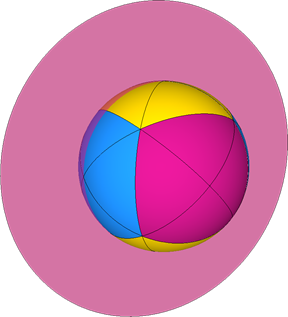

Choose the left direction within the plane based on next largest
magnitude component of the normal.

In the below image, this corresponds to the colored triangular regions
and corresponding left directions within the plane. There are two
possible left directions within each of the three possible planes.

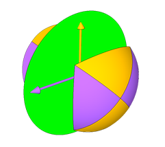

---

#### Triangle intersection

- Projected the triangle onto the ray's plane.

- Test the triangle against the ray/plane intersection. If the
  ray/plane intersection is strictly interior to the triangle, report
  an intersection.

- If the ray/plane intersection lies directly on one of the projected
  triangle's edges, apply the top-left rule to establish whether the
  triangle is considered intersected:

  **Top edge**: If a projected edge is exactly parallel to the left
  direction, and the *up* direction points away from the projected
  triangle's interior in the space of the ray's plane, then it is a
  "top" edge.*
  
  **Left edge**: If a projected edge is not exactly parallel to the
  left direction, and the *left* direction points away from the
  projected triangle's interior in the space of the ray's plane, then it
  is a "left" edge. A triangle can have one or two left edges.*

  **Top-left rule**: If the ray-plane intersection falls exactly on the
  edge of a projected triangle, the triangle is considered intersected
  if the edge is a "top" edge or a "left" edge. If two edges from the
  same projected triangle (a vertex) coincide with the ray-plane
  intersection, then if both edges are "top" or "left" then the triangle
  is considered intersected.*

---

#### Examples of classifying triangle edges

In the below image, a single left direction (red) is shown in the
intersection plane. Inclusive edges are shown in black and exclusive
edges shown in white. Note that the blue and magenta triangles have
edges parallel to the left direction. In one case, the edge in question
is an upper edge in the other case the edge is a lower edge, inclusive
and exclusive respectively.


As a series of rays strike an edge, the left direction can change 90°.
Because of the change in left direction, the inclusive/exclusive
classification of an edge can change along the length of the edge.
Classification may also change if the intersection plane changes (also a
function of ray direction) along the length of an edge.

---

## Ray extents

Ray-triangle intersection can only occur if the intersection t-value
satisfies TMin \< t \< TMax.

Ray-procedural-primitive intersection can only occur if the intersection t-value
satisfies TMin \<= t \<= TMax.

> The reason procedural primitives use an inclusive bounds test is to
> give apps a choice about how to handle exactly overlapping intersections.
> For instance, an app could choose to compare primitiveID or somesuch for
> currently committed hit versus a candidate for intersection to decide whether
> to accept a new overlapping hit or not.

Ray TMin must be nonnegative and \<= TMax. +INF is a valid TMin/TMax
value (really only makes sense for TMax).

No part of ray origin, direction, T range can be NaN.

The runtime does not enforce these limits (they may get validated in GPU
based validation eventually).

Violating these rules produces undefined behavior.

---

## Ray recursion limit

Raytracing pipeline state objects must [declare](#d3d12_raytracing_pipeline_config) a maximum ray recursion
depth (in the range [\[0..31\]](#constants)). The ray generation shader
is depth 0. Below the maximum recursion depth, shader invocations such
as closest hit or miss shaders can call [TraceRay()](#traceray) any
number of times. At the maximum recursion depth, [TraceRay()](#traceray)
calls result in the device going into removed state.

The current level of recursion cannot be retrieved from the system, due
to the overhead that might be required to be able to report it to
shaders. If applications need to track the level of ray recursion it can
be done manually in the ray payload.

This recursion depth limit does not include callable shaders, which are 
not bounded except in the context of overall [pipeline stack](#pipeline-stack)
allocation.

> Apps should pick a limit that is as low as absolutely necessary. There may be performance implications in how the implementation chooses to handle upper limits set at obvious thresholds -- e.g. 0 means no tracingof rays at all (perhaps only using callable shaders or not even that), 1 means single bounce rays, and numbers above 1 might imply a different implementation strategy.
>
> It isn't expected that most apps would ever need to declare very large recursion limits. The upper limit of 31 is there to put a bound on the number of bits hardware has to reserve for a counter -- inexpensive yet large enough range to likely never have to worry about.

---

## Pipeline stack

Raytracing shaders including callable shaders may consume memory out of
a driver managed stack allocation. This memory is internally
allocated/reserved by the driver during command list recording, such
that command list recording will fail if the driver wouldn't be able to
execute the command list due to the selected stack size. The stack
memory requirement is expressed in terms of how much memory a call chain
starting from an individual ray generation shader thread can consume,
considering tracing rays, the various shaders that can be invoked in the
process, including callable shaders, and nesting/recursion.

> In practice typical systems will support many thousands of threads in flight at once, so the actual memory footprint for driver managed stack storage will be much larger than the space required for just one thread. This multiplication factor is an implementation detail not directly exposed to the app. That said, it is in the app's best interest (if memory footprint is important) to make an optimal choice for the one number it has control over -- individual thread stack size -- to match what the app actually needs.

Raytracing pipeline state objects can optionally set a maximum pipeline
stack size, otherwise a default value is used, which is typically overly
conservative (though could underestimate if callable shaders recurse
more than 2 levels). The way an app can calculate an optimal stack size
if desired is described next, followed by an explanation of how the
default is selected.

> Here is an example of a situation where it really matters for an app to manually calculate the stack size rather than rely on the default: Suppose there is a complex closest hit shader with lots of state doing complex shading that recursively shoots a shadow ray that's known to hit only trivial shaders with very small stack requirements. The default calculation described further below doesn't know this and will assume all levels of recursion might invoke the expensive closest hit shader, resulting in wasted stack space reservation, multiplied by the number of threads in flight on the GPU.

---

### Optimal pipeline stack size calculation

Apps can retrieve the stack space requirement for individual shaders in
a raytracing pipeline via [GetShaderStackSize()](#getshaderstacksize).
(The result will be the same for a given shader if it appears in other
raytracing pipelines.) If the app combines these sizes with what it may
know about the worst case call stack amongst individual shaders during
raytracing, along with the MaxTraceRecursionDepth it
[declared](#d3d12_raytracing_pipeline_config), it can calculate the
correct stack size. This is something the system cannot do on its own.

The diagram below depicts how an app author can reason about calculating
an optimal stack size based on the shaders being used in the raytracing
pipeline and which ones might potentially be reachable (which only the
app author can reasonably know).

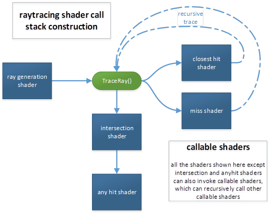

The app can set the overall stack storage per thread for a raytracing
pipeline state via [SetPipelineStackSize()](#setpipelinestacksize). The specification for that
method describes rules about when and how often the stack size can be
set for a pipeline state.

---

### Default pipeline stack size

The system initializes raytracing pipeline state objects with a default
pipeline stack size computed as follows. This is calculation is
intentionally simplified because it cannot account for what combination
of shaders might actually execute (as that depends on application
content and shader table layout, which are both unknown from the
perspective of a raytracing pipeline state). The default stack size
calculation takes the worst case combination of shaders in the
raytracing pipeline in terms of individual stack sizes and factors in
the maximum recursion level. For callable shaders, a default assumption
is that every raytracing shader calls the callable shader with the
maximum stack size to a recursion depth of 2.

The net result is that for raytracing pipelines with no callable
shaders, the default stack size is guaranteed to safely fit the maximum
declared level of recursion and the worst case combination of shaders.
With callable shader in the mix, the default might be unsafe if the app
happens to make more than 2 levels of recursive calls to the worst case
callable shader on top of maxing out all other shaders.

The exact calculation is as follows. First a definition of the input
variables.

For each shader type in the pipeline state, for which multiple instance
of that shader type might be in the pipeline state, find the maximum
individual shader stack size for that shader type. For this discussion,
let us name these maximum values:

**RGSMax** (for max ray generation shader stack size)
**ISMax** (intersection shader)
**AHSMax** (any hit shader)
**CHSMax** (closest hit shader)
**MSMax** (miss shader)
**CSMax** (callable shader)

The other relevant input is comes from the
[D3D12_RAYTRACING_PIPELINE_CONFIG](#d3d12_raytracing_pipeline_config)
subobject in the pipeline state: **MaxTraceRecursionDepth**.

Using these values, considering the raytracing shader call stack
construction diagram above, and arbitrarily estimating callable shaders
to be called 2 levels deep per shader stage, the default stack size
calculation becomes:

```C++
DefaultPipelineStackSizeInBytes =
  RGSMax
  + max( CHSMax, MSMax, ISMax+AHMax ) * min( 1, MaxTraceRecursionDepth )
  + max( CHSMax, MSMax ) * max( MaxTraceRecursionDepth - 1, 0 )
  + 2 * CSMax // if CS aren't used, this term will just be 0.
              // 2 is a completely arbitrary choice

  // Observe that ISMax and AHMax are only counted once, which results in
  // the split clauses involving MaxTraceRecursionDepth. Intersection and
  // anyhit shaders can't recurse.
```

---

### Pipeline stack limit behavior

If making a call exceeds the declared stack size the device goes into
removed state, similar to ray recursion overflow.

There is no practical limit on declared stack size. The runtime drops
calls to [SetPipelineStackSize()](#setpipelinestacksize) for extreme
stack size values, \>= 0xffffffff though (the parameter is actually
UINT64 for this purpose). This is to catch the app blindly passing the
return value of calling [GetShaderStackSize()](#getshaderstacksize) with
invalid parameters, which returns 0xffffffff, either directly into
SetPipelineStackSize or into a calculation summing stack sizes, multiple
of which could be invalid values.

---

## Shader limitations resulting from independence

Given that raytracing shader invocations are all independent of each
other, features within shaders that explicitly rely on cross-shader
communication are not allowed, with the exception of Wave Intrinsics
described further below. Examples of features not available to shaders
during raytracing: 2x2 shader invocation based derivatives (available in
pixel shaders), thread execution syncing (available in compute).

---

### Wave Intrinsics

Wave intrinsics are allowed in raytracing shaders, with the intent
that they are for tools (PIX) logging. That said, applications are also
not blocked from using wave intrinsics in case they might find safe use.

Implementations may repack threads at certain (well defined) points in
raytracing shader execution such as calls to [TraceRay()](#traceray). As
such, the results of wave intrinsics called within a shader are valid
only until a potential thread repacking point is encountered in program
execution order. In wave intrinsics have scopes of validity that are
bounded by repacking points as well as the start/end of the shader.

Repacking points that bound wave intrinsic scope:

- [CallShader()](#callshader)

- [TraceRay()](#traceray)

- [ReportHit()](#reporthit)

Other intrinsics that result in a bound due to ending the shader
invocation:

- [IgnoreHit()](#ignorehit)

- [AcceptHitAndEndSearch()](#accepthitandendsearch)

Note that use of [RayQuery](#rayquery) objects for inline raytracing 
does not count as a repacking point.

When [Shader Execution Reordering](#shader-execution-reordering) is supported
see [reorder points](#reorder-points).

---

## Execution and memory ordering

When [TraceRay()](#traceray) or [CallShader()](#callshader) are called, any resulting shader invocations complete by the time the call returns.  

Memory operations (stores, atomics) performed by the caller can be guaranteed to be visible to the callee with a `DeviceMemoryBarrier()` in the caller after writes.  The UAV must be declared `[globallycoherent]`. Input payload/parameter data is passed to callees by-value so does not require a barrier.

Memory operations performed by the callee can similarly be guaranteed to be visible to the caller (and any subsequent calls made by the caller) with similar UAV declaration and writes followed by memory barrier in the writing shader.  Output payload/parameter data is returned to the caller by-value so does not require a barrier.

Also see [Reorder points](#reorder-points) and [Reorder points - memory coherence and visibility](#reorder-points---memory-coherence-and-visibility).

# General tips for building acceleration structures

The following generalized advice apples to the use of
[BuildRaytracingAccelerationStructure()](#buildraytracingaccelerationstructure).
While it is possible that over time as more diverse device support
appears the advice needs to be refined, even as-is this should be a
useful reminder of the various options at play.

- **Prefer triangle geometry over procedural primitives**
  
  - Ray-triangle intersection can be hardware accelerated

- **Mark geometry as OPAQUE whenever possible**
  
  - If geometry doesn't require any-hit shader code to execute (e.g.
    for alpha testing), then always make sure it's marked as OPAQUE
    to utilize the raytracing hardware as effectively as possible.
    It doesn't matter whether the OPAQUE flag comes from the
    geometry descriptor (`D3D12_RAYTRACING_GEOMETRY_FLAG_OPAQUE`),
    the instance descriptor
    (`D3D12_RAYTRACING_INSTANCE_FLAG_FORCE_OPAQUE`), or through a
    ray flag (`RAY_FLAG_FORCE_OPAQUE`).

- **Merge many objects into fewer bottom-level acceleration
  structures**
  
  - In other words, take advantage of the fact that a build can
    accept more than one geometry descriptor and transform the
    geometry while building. This generally leads to the most
    efficient data structures, especially when objects' AABBs
    overlap each other. In addition, it reduces the number of
    BuildRaytracingAccelerationStructure invocations which leads to
    higher GPU utilization and lower overall CPU overhead. Consider
    merging e.g. for objects that consist of multiple meshes (and
    need to be rebuilt/updated at the same time), and for any static
    or almost static geometry.

- **Only build/update per frame what's really needed**
  
  - Acceleration updates aren't free, so objects that haven't
    deformed between frames shouldn't trigger one. This is sometimes
    not trivial to detect in an engine, but the effort can pay off
    twice since it may also be able to skip a skinning/vertex update
    pass.

- **Consider multiple update sources for skinned meshes**
  
  - Acceleration structure updates can happen either in-place, or
    use separate source and destination buffers.  For some geometry
    (e.g. a hero character), it can make sense to build multiple
    high quality acceleration structures in different key poses
    upfront (e.g. during level load time), and then refit every
    frame using the closest matching keyframe as a source.

- **Rebuild top-level acceleration structure every frame**
  
  - Only updating instead of rebuilding is rarely the right thing to
    do. Rebuilds for a few thousand instances are very fast, and
    having a good quality top-level acceleration structure can have
    a significant payoff (bad quality has a higher cost further up
    in the tree).

- **Use the right build flags**
  
  - The next section is a guideline for common use cases

---

## Choosing acceleration structure build flags

- Start by choosing a
   [D3D12_RAYTRACING_ACCELERATION_STRUCTURE_BUILD_FLAGS](#d3d12_raytracing_acceleration_structure_build_flags)
   combination from here:

<table>
<thead>
<tr class="header">
<th><strong>#</strong></th>
<th><strong>PREFER_</strong>
<strong>FAST_</strong>
<strong>TRACE</strong></th>
<th><strong>PREFER_</strong>
<strong>FAST_</strong>
<strong>BUILD</strong></th>
<th><strong>ALLOW_</strong>
<strong>UPDATE</strong></th>
<th><strong>Properties</strong></th>
<th><strong>Example</strong></th>
</tr>
</thead>
<tbody>
<tr>
<td><strong>1</strong></td>
<td>no</td>
<td>yes</td>
<td>no</td>
<td>Fastest possible build.<br />
Slower trace than #3 and #4.</td>
<td>Fully dynamic geometry like particles, destruction, changing prim counts or moving wildly (explosions etc), where per-frame rebuild is required.</td>
</tr>
<tr>
<td><strong>2</strong></td>
<td>no</td>
<td>yes</td>
<td>yes</td>
<td>Slightly slower build than #1, but allows very fast update.</td>
<td>Lower LOD dynamic objects, unlikely to be hit by too many rays but still need to be refitted per frame to be correct.</td>
</tr>
<tr>
<td><strong>3</strong></td>
<td>yes</td>
<td>no</td>
<td>no</td>
<td>Fastest possible trace.<br />
Slower build than #1 and #2.</td>
<td>Default choice for static level geometry.</td>
</tr>
<tr>
<td><strong>4</strong></td>
<td>yes</td>
<td>no</td>
<td>yes</td>
<td>Fastest trace against update-able acceleration structure. <br />
Updates slightly slower than #2.<br />
Trace a bit slower than #3.</td>
<td>Hero character, high-LOD dynamic objects that are expected to be hit by a significant number of rays.</td>
</tr>
</tbody>
</table>
</small>

- Then consider adding these flags:

    **ALLOW_COMPACTION**

    Whenever compaction is desired. It's generally a good idea to do
    this on all static geometry to reclaim (potentially significant)
    amounts of memory.

    For updateable geometry, it makes sense to compact those BVHs that
    have a long lifetime, so the extra step is worth it (compaction and
    update are not mutually exclusive\!).

    For fully dynamic geometry that's rebuilt every frame (as opposed to
    updated), there's generally no benefit from using compaction.

    One potential reason to NOT use compaction is to exploit the
    guarantee of BVH storage requirements increasing monotonically with
    primitive count -- this does not hold true in the context of
    compaction.

    **MINIMIZE_MEMORY**

    Use only when under general mem pressure, e.g. if otherwise a DXR
    path won't run at all because things don't fit. Usually costs build
    and trace perf.

---

# Determining raytracing support

See [CheckFeatureSupport()](#checkfeaturesupport) and
[D3D12_RAYTRACING_TIER](#d3d12_raytracing_tier). This reports the
level of device raytracing support.

[Raytracing emulation](#raytracing-emulation) is completely independent
of the above -- it is just a software library that sits on top of D3D.

---

## Raytracing emulation

> The following emulation feature proved useful during the experimental phase of DXR design. But as of the first shipping release of DXR, the plan is to stop maintaining this codebase. The cost/benefit is not justified and further, over time as more native DXR support comes online, the value of emulation will diminish further. That said, the description of what was done is left in case a strong justification crops up to resurrect the feature.

The raytracing fallback layer is a library that provides support for
raytracing on devices that do not have native driver/hardware support
using a DX12 compute-shader-based solution. The library is built as a
wrapper around the DX12 API and has distinct (but similar) interfaces
from the DXR API. The library will also have an internal switch that
allows it to use the DXR API when driver support exists, and fallback to
compute when it doesn't. A desired outcome is that a fallback is useful
on existing hardware without native raytracing support (and without
driver implemented emulation) at least for limited scope scenarios that
complement/support traditional graphics based rendering techniques.
Emulation can also serve as a form of reference implementation that runs
on GPUs (as opposed to the WARP software rasterizer) that raytracing
capable devices can be compared against.

The fallback layer will provide via a public GitHub repo where
developers can build and incorporate the library into their own engines.
The repo will be open for both engine developers and hardware developers
to submit pull requests to improve the code base. A benefit to having
the fallback layer outside of the OS is that it can be snapped with
releases of the DXIL compiler and developers are free to tailor their
snap of the fallback layer with optimizations specific to their
codebase. The fallback layer can even be used on older Windows OS's that
do not have DXR API support.

The implementation will use a series of compute shaders to build
acceleration structures on the GPU time line. Recursive shader
invocations (via TraceRay or CallShader) will be handled by linking all
shaders into a large state-machine shader that will emulate these
invocations as function calls where parameters are saved off to a
GPU-allocated stack. Performance is still TBD, but a goal is to ensure
that common cases enable enough performance for small-scale techniques.

Tooling with the fallback layer will work with PIX. Use of PIX's
raytracing-specific debugging tools (acceleration structure
visualization for example) however will be limited to hardware with
driver support. The fallback layer's raytracing invocations will be
shown as the underlying compute shaders dispatches.

While the fallback layer interface tries to stay faithful to the
original DXR API, there are several points of divergence. The primary
difference is DXR's requirement of reading pointers in shaders,
primarily at ray dispatch when traversing from a top-level acceleration
structure to a bottom-level acceleration structure. To mitigate this,
the fallback layer forces the developer to provide pointers not as GPU
VA's but instead as "descriptor heap index" and "byte offset" pairs,
referred to as an emulated pointer. These are also required for handling
local root descriptors and array-of-pointer layouts. The expectation is
that this provides an abstracted form of pointer support that will allow
for minimal porting from the native DXR API.

---

# Tools support

Some parts of the design have been tweaked to be friendly to tools such
as debug layers and PIX doing capture, playback and analysis. In
addition to the design tweaks listed below, several generic techniques
can be applied by tools (not specific to raytracing), such as shader
patching, root signature patching and more generally, API hooking.

---

## Buffer bounds tracking

- [DispatchRays()](#dispatchrays) has input parameters are
  pointers (GPUVA) to shader tables. Size parameters are also present
  so that tools can tell how much memory is being used.

---

## Acceleration structure processing

- [EmitRaytracingAccelerationStructurePostbuildInfo()](#emitraytracingaccelerationstructurepostbuildinfo) and
  [CopyRaytracingAccelerationStructure()](#copyraytracingaccelerationstructure) support dedicated modes for
  tools to operate on acceleration structures in the following
  ways:
  
  - **serialization:**
    Driver serializes acceleration structures to a (still) opaque
    format that tools (or an app) can store to a file.

  - **deserialization:**
    Driver deserializes the serialized format above on a later
    playback of a captured application. The result is an
    acceleration structure that functions as the original did when
    serialized, and is the same size or smaller than the original
    structure before serialization. This only works on the same
    device / driver that the serialization was performed on.

  - **visualization:**
    Convert an opaque acceleration structure to a form that can be
    visualized by tools. This is a bit like the inverse of an
    acceleration structure build, where the output in this case is
    non-opaque geometry and/or bounding boxes. Tools can display a
    visualization of any acceleration structure at any point during
    an application run without having to incur overhead tracking how
    it was built.

    The format of the output may not exactly match the inputs the
    application originally used to generate the acceleration
    structure, per the following:

    For triangles, the output for visualization represents the same
    set of geometry as the application's original acceleration
    structure, other than any level of order dependence or other
    variation permitted by the acceleration structure build spec.
    Transform matrices may have been folded into the geometry.
    Triangle format may be different (with no loss of precision) --
    so if the application used float16 data, the output of
    visualization might be float32 data.

    For AABBs, any spatial volume contained in the original set of
    AABBs must be contained in the set of output AABBs, but may
    cover a larger volume with either a larger or smaller number of
    AABBS.

Note that serialization and deserialization may still be needed by PIX
even if D3D12 gets support for repeatable VA assignment for
allocations across application runs. If PIX wants to modify workloads
at all during playback, VA can't be preserved.

- See [Acceleration structure update constraints](#acceleration-structure-update-constraints) for discussion on resource state requirements for acceleration
  structures that have been put in place. These restrictions, combined
  with the fact that all manipulations of acceleration structures must
  go through dedicated APIs for manipulating them mean that PIX can
  robustly trust the contents of an acceleration structure are valid.

---

# API

---

## Device methods

Per D3D12 device interface semantics, these device methods can be called
by multiple threads simultaneously.

---

### CheckFeatureSupport

```C++
HRESULT CheckFeatureSupport(
    D3D12_FEATURE Feature,
    [annotation("_Inout_updates_bytes_(FeatureSupportDataSize)")]
    void* pFeatureSupportData,
    UINT FeatureSupportDataSize
    );
```

This isn't a raytracing specific API, just the generic D3D API for
querying feature support. To query for raytracing support, pass
`D3D12_FEATURE_D3D12_OPTIONS5` for Feature, and point
pFeatureSupportData to a [D3D12_FEATURE_D3D12_OPTIONS5](#d3d12_feature_d3d12_options5)
variable. This has a member [D3D12_RAYTRACING_TIER](#d3d12_raytracing_tier) RaytracingTier.

---

#### CheckFeatureSupport Structures

---

##### D3D12_FEATURE_D3D12_OPTIONS5

```C++
// D3D12_FEATURE_D3D12_OPTIONS5
typedef struct D3D12_FEATURE_DATA_D3D12_OPTIONS5
{
    [annotation("_Out_")] BOOL SRVOnlyTiledResourceTier3;
    [annotation("_Out_")] D3D12_RENDER_PASS_TIER RenderPassesTier;
    [annotation("_Out_")] D3D12_RAYTRACING_TIER RaytracingTier;
} D3D12_FEATURE_DATA_D3D12_OPTIONS5;
```

The D3D12 options struct that reports RaytracingTier, the raytracing
support level (among other unreleated features). See
[D3D12_RAYTRACING_TIER](#d3d12_raytracing_tier).

---

##### D3D12_RAYTRACING_TIER

```C++
typedef enum D3D12_RAYTRACING_TIER
{
    D3D12_RAYTRACING_TIER_NOT_SUPPORTED = 0,
    D3D12_RAYTRACING_TIER_1_0 = 10,
    D3D12_RAYTRACING_TIER_1_1 = 11,
    D3D12_RAYTRACING_TIER_1_2 = 12,
} D3D12_RAYTRACING_TIER;
```

Level of raytracing support on the device. Queried via
[CheckFeatureSupport()](#checkfeaturesupport).

Value                               | Definition
-----                               | ----------
`D3D12_RAYTRACING_TIER_NOT_SUPPORTED` | No support for raytracing on the device. Attempts to create any raytracing related object will fail and using raytracing related APIs on command lists results in undefined behavior.
`D3D12_RAYTRACING_TIER_1_0` | The device supports the full raytracing functionality described in this spec, except features added in higher tiers listed below.
`D3D12_RAYTRACING_TIER_1_1` | Adds: <li>Support for indirect DispatchRays() calls (ray generation shader invocation) via [ExecuteIndirect()](#executeindirect).</li><li>Support for [incremental additions to existing state objects](#incremental-additions-to-existing-state-objects) via [AddToStateObject()](#addtostateobject).<li>Support for [inline raytracing](#inline-raytracing) via [RayQuery](#rayquery) objects declarable in any shader stage.</li><li>[GeometryIndex()](#geometryindex) intrinsic added to relevant raytracing shaders, for applications that wish to distinguish geometries manually in shaders in addition to or instead of by burning shader table slots.</li><li>Additional [ray flags](#ray-flags), `RAY_FLAG_SKIP_TRIANGLES` and `RAY_FLAG_SKIP_PROCEDURAL_PRIMITIVES`.</li><li>New version of raytracing pipeline config subobject, [D3D12_RAYTRACING_PIPELINE_CONFIG1](#d3d12_raytracing_pipeline_config1), adding a flags field, [D3D12_RAYTRACING_PIPELINE_FLAGS](#d3d12_raytracing_pipeline_flags). The equivalent subobject in HLSL is [RaytracingPipelineConfig1](#raytracing-pipeline-config1).  The available flags, `D3D12_RAYTRACING_PIPELINE_FLAG_SKIP_TRIANGLES` and `D3D12_RAYTRACING_PIPELINE_FLAG_SKIP_PROCEDURAL_PRIMITIVES` (minus `D3D12_` when defined in HLSL) behave like OR'ing the equivalent RAY_FLAGS above into any [TraceRay()](#traceray) call in a raytracing pipeline, except that these do not show up in a [RayFlags()](#rayflags) call from a shader. Implementations may be able to make pipeline optimizations knowing that one of the primitive types can be skipped.</li><li>Additional vertex formats supported for acceleration structure build input as part of [D3D12_RAYTRACING_GEOMETRY_TRIANGLES_DESC](#d3d12_raytracing_geometry_triangles_desc).</li>
`D3D12_RAYTRACING_TIER_1_2` |Adds:<li>[Opacity Micromaps](#opacity-micromaps)</li><li>[Shader Execution Reordering](#shader-execution-reordering)</li><li>The parts of these features involving shader code, which would be all of Shader Execution Reordering, as well as a small portion of Opacity Micromaps, exist in Shader Model 6.9 which is currently in preview.  All the non-HLSL parts of Opacity Micromaps are available in release (non-preview).</li><li>All devices that support raytracing at all (`D3D12_RAYTRACING_TIER_1_0`+) and support Shader Model 6.9 must support [Shader Execution Reordering](#shader-execution-reordering).  `D3D12_RAYTRACING_TIER_1_2` simply means the device supports all of the features listed here.</li>

---

### CreateStateObject

```C++
HRESULT CreateStateObject(
    _In_ const D3D12_STATE_OBJECT_DESC* pDesc,
    _In_ REFIID riid, // ID3D12StateObject
    _COM_Outptr_ void** ppStateObject
    );
```

See [State objects](#state-objects) for an overview.

Parameter                               | Definition
---------                               | ----------
`const D3D12_STATE_OBJECT_DESC* pDesc`  | Description of state object to create. See [D3D12_STATE_OBJECT_DESC](#d3d12_state_object_desc). To help generate this see the `CD3D12_STATE_OBJECT_DESC` helper in class in d3dx12.h.
`REFIID riid`                           | __uuidof(ID3D12StateObject)
`_COM_Outptr_ void** ppStateObject`     | Returned state object.
`Return: HRESULT`                       | `S_OK` for success. `E_INVALIDARG`, `E_OUTOFMEMORY` on failure. The debug layer provides detailed status information.

---

#### CreateStateObject Structures

Helper/sample wrapper code is available to make using the below
structures for defining state objects much simpler to use.

---

##### D3D12_STATE_OBJECT_DESC

```C++
typedef struct D3D12_STATE_OBJECT_DESC
{
    D3D12_STATE_OBJECT_TYPE Type;
    UINT NumSubobjects;
    _In_reads_(NumSubobjects) const D3D12_STATE_SUBOBJECT* pSubobjects;
} D3D12_STATE_OBJECT_DESC;
```

Member                               | Definition
------                               | ----------
`D3D12_STATE_OBJECT_TYPE Type`       | See [D3D12_STATE_OBJECT_TYPE](#d3d12_state_object_type).
`UINT NumSubobjects`                 | Size of pSubobjects array.
`_In_reads(NumSubobjects) const D3D12_STATE_SUBOBJECT* pSubobjects` | Array of subobject definitions. See [D3D12_STATE_SUBOBJECT](#d3d12_state_subobject).

---

##### D3D12_STATE_OBJECT_TYPE

```C++
typedef enum D3D12_STATE_OBJECT_TYPE
{
    D3D12_STATE_OBJECT_TYPE_COLLECTION = 0,
    // Could be added in future: D3D12_STATE_OBJECT_TYPE_COMPUTE_PIPELINE = 1,
    // Could be added in future: D3D12_STATE_OBJECT_TYPE_GRAPHICS_PIPELINE = 2,
    D3D12_STATE_OBJECT_TYPE_RAYTRACING_PIPELINE = 3,
} D3D12_STATE_OBJECT_TYPE;
```

Value                               | Definition
---------                           | ----------
`D3D12_STATE_OBJECT_TYPE_COLLECTION` |[Collection state object](#collection-state-object).
`D3D12_STATE_OBJECT_TYPE_RAYTRACING_PIPELINE` |[Raytracing pipeline state object](#raytracing-pipeline-state-object).

---

##### D3D12_STATE_SUBOBJECT

```C++
typedef struct D3D12_STATE_SUBOBJECT
{
    D3D12_STATE_SUBOBJECT_TYPE Type;
    const void* pDesc;
} D3D12_STATE_SUBOBJECT;
```

Subobject within a state object description.

Parameter                           | Definition
---------                           | ----------
`D3D12_STATE_SUBOBJECT_TYPE Type`   | See [D3D12_STATE_SUBOBJECT_TYPE](#d3d12_state_subobject_type).
`const void* pDesc`                 | Pointer to state object description of the specified type.

---

##### D3D12_STATE_SUBOBJECT_TYPE

```C++
typedef enum D3D12_STATE_SUBOBJECT_TYPE
{
  D3D12_STATE_SUBOBJECT_TYPE_STATE_OBJECT_CONFIG = 0,
  D3D12_STATE_SUBOBJECT_TYPE_GLOBAL_ROOT_SIGNATURE = 1,
  D3D12_STATE_SUBOBJECT_TYPE_LOCAL_ROOT_SIGNATURE = 2,
  D3D12_STATE_SUBOBJECT_TYPE_NODE_MASK = 3,
  // 4 unused
  D3D12_STATE_SUBOBJECT_TYPE_DXIL_LIBRARY = 5,
  D3D12_STATE_SUBOBJECT_TYPE_EXISTING_COLLECTION = 6,
  D3D12_STATE_SUBOBJECT_TYPE_SUBOBJECT_TO_EXPORTS_ASSOCIATION = 7,
  D3D12_STATE_SUBOBJECT_TYPE_DXIL_SUBOBJECT_TO_EXPORTS_ASSOCIATION = 8,
  D3D12_STATE_SUBOBJECT_TYPE_RAYTRACING_SHADER_CONFIG = 9,
  D3D12_STATE_SUBOBJECT_TYPE_RAYTRACING_PIPELINE_CONFIG = 10,
  D3D12_STATE_SUBOBJECT_TYPE_HIT_GROUP = 11,
  D3D12_STATE_SUBOBJECT_TYPE_MAX_VALID,
} D3D12_STATE_SUBOBJECT_TYPE;
```

Set of subobject types, each with a corresponding struct definition.

Parameter                           | Definition
---------                           | ----------
`D3D12_STATE_SUBOBJECT_TYPE_STATE_OBJECT_CONFIG` | [D3D12_STATE_OBJECT_CONFIG](#d3d12_state_object_config)
`D3D12_STATE_SUBOBJECT_TYPE_GLOBAL_ROOT_SIGNATURE` | [D3D12_GLOBAL_ROOT_SIGNATURE](#d3d12_global_root_signature)
`D3D12_STATE_SUBOBJECT_TYPE_LOCAL_ROOT_SIGNATURE` | [D3D12_LOCAL_ROOT_SIGNATURE](#d3d12_local_root_signature)
`D3D12_STATE_SUBOBJECT_TYPE_NODE_MASK` | [D3D12_NODE_MASK](#d3d12_node_mask)
`D3D12_STATE_SUBOBJECT_TYPE_DXIL_LIBRARY` | [D3D12_DXIL_LIBRARY_DESC](#d3d12_dxil_library_desc)
`D3D12_STATE_SUBOBJECT_TYPE_EXISTING_COLLECTION` | [D3D12_EXISTING_COLLECTION_DESC](#d3d12_existing_collection_desc)
`D3D12_STATE_SUBOBJECT_TYPE_SUBOBJECT_TO_EXPORTS_ASSOCIATION` | [D3D12_SUBOBJECT_TO_EXPORTS_ASSOCIATION](#d3d12_subobject_to_exports_association)
`D3D12_STATE_SUBOBJECT_TYPE_DXIL_SUBOBJECT_TO_EXPORTS_ASSOCIATION` | [D3D12_DXIL_SUBOBJECT_TO_EXPORTS_ASSOCIATION](#d3d12_dxil_subobject_to_exports_association)
`D3D12_STATE_SUBOBJECT_TYPE_RAYTRACING_SHADER_CONFIG` | [D3D12_RAYTRACING_SHADER_CONFIG](#d3d12_raytracing_shader_config)
`D3D12_STATE_SUBOBJECT_TYPE_RAYTRACING_PIPELINE_CONFIG` | [D3D12_RAYTRACING_PIPELINE_CONFIG](#d3d12_raytracing_pipeline_config)
`D3D12_STATE_SUBOBJECT_TYPE_HIT_GROUP` | [D3D12_HIT_GROUP_DESC](#d3d12_hit_group_desc)

---

##### D3D12_STATE_OBJECT_CONFIG

```C++
typedef struct D3D12_STATE_OBJECT_CONFIG
{
    D3D12_STATE_OBJECT_FLAGS Flags;
} D3D12_STATE_OBJECT_CONFIG;
```

This is a subobject type that can be [associated](#subobject-association-behavior) with shader exports. A summary of the rules about which subobject types can/must be associated
with various shaders in a state object is [here](#subobject-association-requirements).

This subobject defines general properties of a state object. The
presence of this subobject in a state object is **optional**. If
present, all exports in the state object must be associated with the
same subobject (or one with a matching definition). This consistency
requirement does not apply across existing collections that are included
in a larger state object, with the exception of the presence of the `D3D12_STATE_OBJECT_FLAG_ALLOW_STATE_OBJECT_ADDITIONS` flag, detailed below.

Member                              | Definition
---------                           | ----------
`D3D12_STATE_OBJECT_FLAGS Flags`    | See [D3D12_STATE_OBJECT_FLAGS](#d3d12_state_object_flags).

---

##### D3D12_STATE_OBJECT_FLAGS

```C++
typedef enum D3D12_STATE_OBJECT_FLAGS
{
    D3D12_STATE_OBJECT_FLAG_NONE = 0x0,
    D3D12_STATE_OBJECT_FLAG_ALLOW_LOCAL_DEPENDENCIES_ON_EXTERNAL_DEFINITONS = 0x1,
    D3D12_STATE_OBJECT_FLAG_ALLOW_EXTERNAL_DEPENDENCIES_ON_LOCAL_DEFINITIONS = 0x2,
    D3D12_STATE_OBJECT_FLAG_ALLOW_STATE_OBJECT_ADDITIONS = 0x4,
} D3D12_STATE_OBJECT_FLAGS;
```

Value                               | Definition
---------                           | ----------
`D3D12_STATE_OBJECT_FLAG_ALLOW_LOCAL_DEPENDENCIES_ON_EXTERNAL_DEFINITONS` | <p>This applies to state objects of type collection only, ignored otherwise.</p><p>The exports from this collection are allowed to have unresolved references (dependencies) that would have to be resolved (defined) when the collection is included in a containing state object (e.g. RTPSO). This includes depending on an externally defined subobject associations to associate an external subobject (e.g. root signature) to a local export.</p><p>In the absence of this flag (**default**), all exports in this collection must have their dependencies fully locally resolved, including any necessary subobject associations being defined locally. Advanced implementations/drivers will have enough information to compile the code in the collection and not need to keep around any uncompiled code (unless the `D3D12_STATE_OBJECT_FLAG_ALLOW_EXTERNAL_DEPENDENCIES_ON_LOCAL_DEFINITIONS` flag is set). So that when the collection is used in a containing state object (e.g. RTPSO), minimal work needs to be done by the driver, ideally a "cheap" link at most.</p><p>Even with this flag, there is never visibility of code across separate state object definitions that are combined incrementally via the [AddToStateObject()](#addtostateobject) API.</p>
`D3D12_STATE_OBJECT_FLAG_ALLOW_EXTERNAL_DEPENDENCIES_ON_LOCAL_DEFINITIONS` | <p>This applies to state objects of type collection only, ignored otherwise.</p><p>If a collection is included in another state object (e.g. RTPSO), allow shaders / functions in the rest of the containing state object to depend on (e.g. call) exports from this collection.</p><p> In the absence of this flag (default), exports from this collection cannot be directly referenced by other parts of containing state objects (e.g. RTPSO). This can reduce memory footprint for the collection slightly since drivers don't need to keep uncompiled code in the collection on the off chance that it may get called by some external function that would then compile all the code together. That said, if not all necessary subobject associations have been locally defined for code in this collection, the driver may not be able to compile shader code yet and may still need to keep uncompiled code around.</p><p>A subobject association defined externally that associates an external subobject to a local export does not count as an external dependency on a local definition, so the presence or absence of this flag does not affect whether the association is allowed or not. On the other hand if the current collection defines a subobject association for a locally defined subobject to an external export (e.g. shader), that counts as an external dependency on a local definition, so this flag must be set.</p><p>Also, regardless of the presence or absence of this flag, shader entrypoints (such as hit groups or miss shaders) in the collection are visible as entrypoints to a containing state object (e.g. RTPSO) if exported by it. In the case of an RTPSO, the exported entrypoints can be used in shader tables for raytracing.</p><p>Even with this flag, there is never visibility of code across separate state object definitions that are combined incrementally via the [AddToStateObject()](#addtostateobject) API.</p>
`D3D12_STATE_OBJECT_FLAG_ALLOW_STATE_OBJECT_ADDITIONS` |  <p>The presence of this flag in an executable state object, e.g. raytracing pipeline, allows the state object to be passed into [AddToStateObject()](#addtostateobject) calls, either as the original state object, or the portion being added.</p><p>The presence of this flag in a collection state object means the collection can be imported by executable state objects (e.g. raytracing pipelines) regardless of whether they have also set this flag.  The absence of this flag in a collection state object means the collection can only be imported by executable state objects that also do not set this flag.

---

##### D3D12_GLOBAL_ROOT_SIGNATURE

```C++
typedef struct D3D12_GLOBAL_ROOT_SIGNATURE
{
    ID3D12RootSignature* pGlobalRootSignature;
} D3D12_GLOBAL_ROOT_SIGNATURE;
```

This is a subobject type that can be [associated](#subobject-association-behavior) with shader exports. A
summary of the rules about which subobject types can/must be associated
with various shaders in a state object is [here](#subobject-association-requirements).

This subobject defines a global root signature that will be used with
associated shaders. The presence of this subobject in a state object is
**optional**. The combination of global and/or local root signatures
associated with any given shader function must define all resource
bindings declared by the shader (with no overlap across global and local
root signatures).

If any given function in a call graph is associated with a particular
global root signature, any other functions in the graph must either be
associated with the same global root signature or none, and the shader
entry (the root of the call graph) must be associated with the global
root signature.

Different shaders can use different global root signatures (or none)
within a state object, however any shaders referenced during a
particular [DispatchRays()](#dispatchrays) operation from a
CommandList must have specified the same global root signature as what
has been set on the CommandList as the compute root signature. So it is
valid to define a single large state object with multiple global root
signatures associated with different subsets of the shaders -- apps are
not forced to split their state object just because some shaders use
different global root signatures.

Member                              | Definition
---------                           | ----------
`ID3D12RootSignature* pGlobalRootSignature` | Root signature that will function as a global root signature. State object holds a reference.

---

##### D3D12_LOCAL_ROOT_SIGNATURE

```C++
typedef struct D3D12_LOCAL_ROOT_SIGNATURE
{
    ID3D12RootSignature* pLocalRootSignature;
} D3D12_LOCAL_ROOT_SIGNATURE;
```

This is a subobject type that can be [associated](#subobject-association-behavior) with shader exports. A
summary of the rules about which subobject types can/must be associated
with various shaders in a state object is [here](#subobject-association-requirements).

This subobject defines a local root signature that will be used with
associated shaders. The presence of this subobject in a state object is
**optional**. The combination of global and/or local root signatures
associated with any given shader function must define all resource
bindings declared by the shader (with no overlap across global and local
root signatures).

If any given function in a call graph (not counting calls across shader
tables) is associated with a particular local root signature, any other
functions in the graph must either be associated with the same local
root signature or none, and the shader entry (the root of the call
graph) must be associated with the local root signature.

This corresponds to the fact that the set of code reachable from a given
shader entry gets invoked from a shader identifier in a [shader record](#shader-record), where a single set of local root arguments apply. Of course different shaders can use
different local root signatures (or none), as their shader identifiers
will be in different shader records.

Member                              | Definition
---------                           | ----------
`ID3D12RootSignature* pLocalRootSignature` | Root signature that will function as a local root signature. State object holds a reference.

---

##### D3D12_DXIL_LIBRARY_DESC

```C++
typedef struct D3D12_DXIL_LIBRARY_DESC
{
    D3D12_SHADER_BYTECODE DXILLibrary;
    UINT NumExports;
    _In_reads_(NumExports) D3D12_EXPORT_DESC* pExports;
} D3D12_DXIL_LIBRARY_DESC;
```

Member                              | Definition
---------                           | ----------
`D3D12_SHADER_BYTECODE DXILLibrary` | Library to include in the state object. Must have been compiled with library target 6.3 or higher. It is fine to specify the same library multiple times either in the same state object / collection or across multiple, as long as the names exported each time don't conflict in a given state object.
`UINT NumExports` | Size of pExports array. If 0, everything gets exported from the library.
`_In_reads(NumExports) D3D12_EXPORT_DESC* pExports` | Optional exports array. See [D3D12_EXPORT_DESC](#d3d12_export_desc).

---

##### D3D12_EXPORT_DESC

```C++
typedef struct D3D12_EXPORT_DESC
{
    LPCWSTR Name;
    _In_opt_ LPCWSTR ExportToRename;
    D3D12_EXPORT_FLAGS Flags;
} D3D12_EXPORT_DESC;
```

Member                              | Definition
---------                           | ----------
`LPWSTR Name` | <p>Name to be exported. If the name refers to a function that is overloaded, a mangled version of the name (function parameter information encoded in name string) can be provided to disambiguate which overload to use. The mangled name for a function can be retrieved from HLSL compiler reflection (not documented in this spec).</p><p> If ExportToRename field is non-null, Name refers to the new name to use for it when exported. In this case Name must be an unmangled name, whereas ExportToRename can be either a mangled or unmangled name. A given internal name may be exported multiple times with different renames (and/or not renamed).</p>
`_In_opt_ LPWSTR ExportToRename` | If non-null, this is the name of an export to use but then rename when exported. Described further above.
`D3D12_EXPORT_FLAGS Flags` | Flags to apply to the export.

---

##### D3D12_EXPORT_FLAGS

```C++
typedef enum D3D12_EXPORT_FLAGS
{
    D3D12_EXPORT_FLAG_NONE = 0x0,
} D3D12_EXPORT_FLAGS;
```

No export flags are currently defined.

---

##### D3D12_EXISTING_COLLECTION_DESC

```C++
typedef struct D3D12_EXISTING_COLLECTION_DESC
{
    ID3D12StateObject* pExistingCollection;
    UINT NumExports;
    _In_reads_(NumExports) D3D12_EXPORT_DESC* pExports;
} D3D12_EXISTING_COLLECTION_DESC;
```

Member                              | Definition
---------                           | ----------
`ID3D12StateObject* pExistingCollection` | [Collection](#collection-state-object) to include in state object. Enclosing state object holds a ref on the existing collection.
`UINT NumExports` | Size of pExports array. If 0, all of the collection's exports get exported.
`_In_reads(NumExports) D3D12_EXPORT_DESC* pExports` | Optional exports array. See [D3D12_EXPORT_DESC](#d3d12_export_desc).

---

##### D3D12_HIT_GROUP_DESC

```C++
typedef struct D3D12_HIT_GROUP_DESC
{
    LPWSTR HitGroupExport;
    D3D12_HIT_GROUP_TYPE Type;
    _In_opt_ LPWSTR AnyHitShaderImport;
    _In_opt_ LPWSTR ClosestHitShaderImport;
    _In_opt_ LPWSTR IntersectionShaderImport;
} D3D12_HIT_GROUP_DESC;
```

Member                              | Definition
---------                           | ----------
`LPWSTR HitGroupExport` | Name to give to hit group.
`D3D12_HIT_GROUP_TYPE Type` | See [D3D12_HIT_GROUP_TYPE](#d3d12_hit_group_type).
`_In_opt_ LPWSTR AnyHitShaderImport` | Optional name of anyhit shader. Can be used with all hit group types.
`_In_opt_ LPWSTR ClosestHitShaderImport` | Optional name of closesthit shader. Can be used with all hit group types.
`_In_opt_ LPWSTR IntersectionShaderImport` | Optional name of intersection shader. Can only be used with hit groups of type procedural primitive.

---

##### D3D12_HIT_GROUP_TYPE

```C++
typedef enum D3D12_HIT_GROUP_TYPE
{
    D3D12_HIT_GROUP_TYPE_TRIANGLES = 0x0,
    D3D12_HIT_GROUP_TYPE_PROCEDURAL_PRIMITIVE = 0x1,
} D3D12_HIT_GROUP_TYPE;
```

Specify the type of hit group. For triangles, the hit group can't
contain an intersection shader. For procedural primitives, the hit group
must contain an intersection shader.

> This enum exists to allow the possibility in the future of having other hit group types which may not otherwise be distinguishable from the other members of `D3D12_HIT_GROUP_DESC`. For instance, a new type might simply change the meaning of the intersection shader import to represent a different formulation of procedural primitive.

---

##### D3D12_RAYTRACING_SHADER_CONFIG

```C++
typedef struct D3D12_RAYTRACING_SHADER_CONFIG
{
  UINT MaxPayloadSizeInBytes;
  UINT MaxAttributeSizeInBytes;
} D3D12_RAYTRACING_SHADER_CONFIG;
```

This is a subobject type that can be [associated](#subobject-association-behavior) with shader exports. A
summary of the rules about which subobject types can/must be associated
with various shaders in a state object is [here](#subobject-association-requirements).

A raytracing pipeline needs one raytracing shader configuration. If
multiple shader configurations are present (such as one in each
[collection](#collection-state-object) to enable independent driver compilation for each one) they
must all match when combined into a raytracing pipeline.

Member                              | Definition
---------                           | ----------
`UINT MaxPayloadSizeInBytes` | The maximum storage for scalars (counted as 4 bytes each) in ray payloads in raytracing pipelines that contain this program.  Callable shader payloads are not part of this limit.  This field is ignored for payloads that use [payload access qualifiers](#payload-access-qualifiers).
`UINT MaxAttributeSizeInBytes` | The maximum number of scalars (counted as 4 bytes each) that can be used for attributes in pipelines that contain this shader. The value cannot exceed [D3D12_RAYTRACING_MAX_ATTRIBUTE_SIZE_IN_BYTES](#constants).

---

##### D3D12_RAYTRACING_PIPELINE_CONFIG

```C++
typedef struct D3D12_RAYTRACING_PIPELINE_CONFIG
{
    UINT MaxTraceRecursionDepth;
} D3D12_RAYTRACING_PIPELINE_CONFIG;
```

This is a subobject type that can be [associated](#subobject-association-behavior) with shader exports. A
summary of the rules about which subobject types can/must be associated
with various shaders in a state object is [here](#subobject-association-requirements).

A raytracing pipeline needs one raytracing pipeline configuration. If
multiple shader configurations are present (such as one in each
[collection](#collection-state-object) to enable independent driver compilation for each one) they
must all match when combined into a raytracing pipeline.

Member                              | Definition
---------                           | ----------
`UINT MaxTraceRecursionDepth` | Limit on ray recursion for the raytracing pipeline. See [Ray recursion limit](#ray-recursion-limit).

---

##### D3D12_RAYTRACING_PIPELINE_CONFIG1

```C++
typedef struct D3D12_RAYTRACING_PIPELINE_CONFIG1
{
    UINT MaxTraceRecursionDepth;
    D3D12_RAYTRACING_PIPELINE_FLAGS Flags;
} D3D12_RAYTRACING_PIPELINE_CONFIG1;
```

This adds a Flags field relative to its predecessor, [D3D12_RAYTRACING_PIPELINE_CONFIG](#d3d12_raytracing_pipeline_config).  `D3D12_RAYTRACING_PIPELINE_CONFIG1` requires [Tier 1.1](#d3d12_raytracing_tier) raytracing support.

This is a subobject type that can be [associated](#subobject-association-behavior) with shader exports. A
summary of the rules about which subobject types can/must be associated
with various shaders in a state object is [here](#subobject-association-requirements).

A raytracing pipeline needs one raytracing pipeline configuration. If
multiple shader configurations are present (such as one in each
[collection](#collection-state-object) to enable independent driver compilation for each one) they
must all match when combined into a raytracing pipeline.

Member                              | Definition
---------                           | ----------
`UINT MaxTraceRecursionDepth` | Limit on ray recursion for the raytracing pipeline. See [Ray recursion limit](#ray-recursion-limit).
`D3D12_RAYTRACING_PIPELINE_FLAGS Flags` | See [D3D12_RAYTRACING_PIPELINE_FLAGS](#d3d12_raytracing_pipeline_flags).

---

##### D3D12_RAYTRACING_PIPELINE_FLAGS

```C++
typedef enum D3D12_RAYTRACING_PIPELINE_FLAGS
{
    D3D12_RAYTRACING_PIPELINE_FLAG_NONE                         = 0x0,
    D3D12_RAYTRACING_PIPELINE_FLAG_SKIP_TRIANGLES               = 0x100,
    D3D12_RAYTRACING_PIPELINE_FLAG_SKIP_PROCEDURAL_PRIMITIVES   = 0x200,
    D3D12_RAYTRACING_PIPELINE_FLAG_ALLOW_OPACITY_MICROMAPS      = 0x400,
} D3D12_RAYTRACING_PIPELINE_FLAGS;

```

Flags member of [D3D12_RAYTRACING_PIPELINE_CONFIG1](#d3d12_raytracing_pipeline_config1).

Value                               | Definition
---------                           | ----------
`D3D12_RAYTRACING_PIPELINE_FLAG_SKIP_TRIANGLES` | <p>For any [TraceRay()](#traceray) call within this raytracing pipeline, add in the `RAY_FLAG_SKIP_TRIANGLES` [Ray flag](#ray-flags). The resulting combination of ray flags must be valid.  The presence of this flag in a raytracing pipeline config does not show up in a [RayFlags()](#rayflags) call from a shader.  Implementations may be able to optimize pipelines knowing that a particular primitive type need not be considered.</p>
`D3D12_RAYTRACING_PIPELINE_FLAG_SKIP_PROCEDURAL_PRIMITIVES` | <p>For any [TraceRay()](#traceray) call within this raytracing pipeline, add in the `RAY_FLAG_SKIP_PROCEDURAL_PRIMITIVES` [Ray flag](#ray-flags). The resulting combination of ray flags must be valid.  The presence of this flag in a raytracing pipeline config does not show up in a [RayFlags()](#rayflags) call from a shader. Implementations may be able to optimize pipelines knowing that a particular primitive type need not be considered.</p>
`D3D12_RAYTRACING_PIPELINE_FLAG_ALLOW_OPACITY_MICROMAPS` | If this flag is specified, the pipeline supports Opacity Micromaps. If a triangle with an OMM is encountered during traversal with this flag cleared, behavior is undefined. This flag should not be set if there are no OMMs present, since it may incur a small penalty on traversal performance overall.  This flag is part of the [Opacity Micromaps](#opacity-micromaps) feature. This flag applies to accessing OMMs via [TraceRay()](#traceray), whereas for [RayQuery::TraceRayInline()](#rayquery-tracerayinline), the same is accomplished by specifying [RAYQUERY_FLAG_ALLOW_OPACITY_MICROMAPS](#rayquery-flags) in the second template parameter to [RayQuery](#rayquery).

---

##### D3D12_NODE_MASK

```C++
typedef struct D3D12_NODE_MASK
{
    UINT NodeMask;
} D3D12_NODE_MASK;
```

This is a subobject type that can be [associated](#subobject-association-behavior) with shader exports. A
summary of the rules about which subobject types can/must be associated
with various shaders in a state object is [here](#subobject-association-requirements).

The node mask subobject identifies which GPU nodes the state object
applies to. It is optional; in its absence the state object applies to
all available nodes. If a node mask subobject has been associated with
any part of a state object, a node mask association must be made to all
exports in a state object (including imported collections) and all node
mask subobjects that are referenced must have matching content.

---

##### D3D12_SUBOBJECT_TO_EXPORTS_ASSOCIATION

```C++
typedef struct D3D12_SUBOBJECT_TO_EXPORTS_ASSOCIATION
{
  const D3D12_STATE_SUBOBJECT* pSubobjectToAssociate;
  UINT NumExports;
  _In_reads_(NumExports) LPCWSTR* pExports;
} D3D12_SUBOBJECT_TO_EXPORTS_ASSOCIATION;
```

Associates a subobject defined directly in a state object with shader
exports. Depending on the choice of flags in the optional
[D3D12_STATE_OBJECT_CONFIG](#d3d12_state_object_config) subobject for
opting in to cross linkage, the exports being associated don't
necessarily have to be present in the current state object (or one that
has been seen yet) -- to be resolved later, e.g. on RTPSO creation. See
[Subobject association behavior](#subobject-association-behavior) for detail.

Member                              | Definition
---------                           | ----------
`const D3D12_STATE_SUBOBJECT* pSubobjectToAssociate` | Pointer to subobject in current state object to define an association to.
`UINT NumExports` | <p>Size of export array. If 0, this is being explicitly defined as a default association. See [Subobject association behavior](#subobject-association-behavior).</p><p>Another way to define a default association is to omit this subobject association for that subobject completely.</p>
`_In_reads_(NumExports) LPCWSTR* pExports` |Exports to associate subobject with.

---

##### D3D12_DXIL_SUBOBJECT_TO_EXPORTS_ASSOCIATION

```C++
typedef struct D3D12_DXIL_SUBOBJECT_TO_EXPORTS_ASSOCIATION
{
    LPWCSTR pDXILSubobjectName;
    UINT NumExports;
    _In_reads_(NumExports) LPCWSTR* pExports;
} D3D12_DXIL_SUBOBJECT_TO_EXPORTS_ASSOCIATION;
```

Associates a subobject defined in a DXIL library (not necessarily one
that has been seen yet) with shader exports. See [Subobject association behavior](#subobject-association-behavior) for details.

Member                              | Definition
---------                           | ----------
`LPWSTR pDXILSubobjectName` | Name of subobject defined in a DXIL library.
`UINT NumExports` | <p>Size of export array. If 0, this is being explicitly defined as a default association. See [Subobject association behavior](#subobject-association-behavior).</p><p>Another way to define a default association is to omit this subobject association for that subobject completely.</p>
`_In_reads_(NumExports) LPCWSTR* pExports` | Exports to associate subobject with.

---

### AddToStateObject

```C++
HRESULT AddToStateObject(
    _In_ const D3D12_STATE_OBJECT_DESC* pAddition,
    _In_ ID3D12StateObject* pStateObjectToGrowFrom,
    _In_ REFIID riid, // ID3D12StateObject
    _COM_Outptr_ void** ppNewStateObject
    );
```

Incrementally add to an existing state object.  This incurs lower CPU overhead than creating a state object from scratch that is a superset of an existing one (e.g. adding a few more shaders).  The reasons for lower overhead are:

- The D3D runtime doesn't have to re-validate the correctness of the existing state object.  It only needs to check that what is being added is valid and doens't conflict with what is already in the state object.
  
- The driver ideally only needs to compile the shaders that have been added, and even that is avoided if what is being added happens to be an existing [collection](#collection-state-object).  In a clean driver implementation, there need only be a lightweight high level link step for the overall the state object.

> It wasn't deemed worth the effort or complexity to support incremental deletion, i.e. DeleteFromStateObject\(\).  If an app finds that state object memory footprint is such a problem that it needs to periodically trim by shrinking state objects, it has to create the desired smaller state objects from scratch.  In this case, if existing [collections](#collection-state-object) are used to piece together the smaller state object, at least driver overhead will be reduced, if not runtime overhead of parsing/validating the new state object as a whole.

Since `AddToStateObject` returns a new state object, this enables the application to free the original object when it is no longer needed (and no longer referenced by in flight work).  A byproduct is that it is valid to create a branching lineage of state objects via `AddToStateObject`, even though the common case is likely only a single line of inheritance.  A given state object only exposes exports that it added plus what it's parent exposed, and not what any siblings do.  Shader identifiers from a parent remain valid for it's children, so do not need to be re-retrieved.

[State object lifetimes as seen by driver](#state-object-lifetimes-as-seen-by-driver) is a discussion useful for driver authors.

The runtime uses a shared mutex across all state objects within a family to enforce thread safety: The `AddToStateObject` API takes a writer lock on state objects within a family.  And APIs that retrieve shader export based information, [GetShaderIdentifier()](#getshaderidentifier) and [GetShaderStackSize()](#getshaderstacksize), take a shared reader lock on state objects in a family.  

> A straightforward way to minimize any thread contention is to retrieve any needed shader identifiers etc. from a state object right after it is created (and remembering that any other state objects created from this one share identifiers so they need not be re-retrieved).  So that by the time `AddToStateObject` needs to be called, nothing will be at risk of blocking (unless `AddToStateObject` itself is called in parallel with related state objects for some reason).

The new state object starts off with the same [pipeline stack size](#pipeline-stack) setting as the previous. (The runtime doesn't try to enforce thread safety against the app calling [SetPipelineStackSize()](#setpipelinestacksize) to change stack size on the existing state object while it is being used in an `AddToStateObject()` call.)  After `AddToStateObject()` returns a new state object, the app can call [GetShaderStackSize()](#getshaderstacksize) on newly added shaders to decide if the pipeline stack size for the new state object needs to be updated via [SetPipelineStackSize()](#setpipelinestacksize).

There are some stipulations about how the additions to a state object must relate to what exists already in the state object (validated by the runtime):

- The state object description must be fully self-contained, e.g. not reference any contents of the existing state object.  Said another way, the description must be valid to have been sent to [CreateStateObject()](#createstateobject) on its own.

- Global subobjects definitions, such as [D3D12_RAYTRACING_PIPELINE_CONFIG](#d3d12_raytracing_pipeline_config), must be consistent with how they are defined in the existing state object (e.g. same MaxTraceRecursionDepth).

- The original state object and the portion being added must both opt-in to being used with AddToStateObject().  This is accomplished by specifying the flag `D3D12_STATE_OBJECT_FLAG_ALLOW_STATE_OBJECT_ADDITIONS` as part of the [flags](#d3d12_state_object_flags) member of [D3D12_STATE_OBJECT_CONFIG](#d3d12_state_object_config).  See [flags](#d3d12_state_object_flags) for more detail such as what `D3D12_STATE_OBJECT_FLAG_ALLOW_STATE_OBJECT_ADDITIONS` means for collection state objects.

- Any exported shader entrypoints (i.e. that support [shader identifiers](#shader-identifier)) must have unique names that do not conflict with exports from the existing state object.

- Non shader entrypoints, such as library functions, are allowed to be defined over again (reusing a name with same or different code definition) relative to what already in the state object - necessary if they need to be visible locally.  The same is true for any of the various [subobjects](#subobjects) that are defined.

> Disallowing cross-visibility between the existing state object and what is being added offers several benefits.  It simplifies the incremental compilation burden on the driver, e.g. it isn't forced to touch existing compiled code.  It avoids messy semantic issues like the presence of a new subobject affecting [default associations](#default-associations) that may have applied to the existing state object (if cross visibility were possible).  Finally it simplifies runtime validation code complexity.

Parameter                               | Definition
---------                               | ----------
`const D3D12_STATE_OBJECT_DESC* pAddition`  | Description of state object contents to add to existing state object. See [D3D12_STATE_OBJECT_DESC](#d3d12_state_object_desc). To help generate this see the `CD3D12_STATE_OBJECT_DESC` helper in class in d3dx12.h.
`ID3D12StateObject* pStateObjectToGrowFrom` | <p>Existing state object, which can be in use (e.g. active raytracing) during this operation.</p><p>The existing state object must **not** be of type [Collection](#collection-state-object) - it is deemed too complex to bother defining behavioral semantics for this.</p>
`REFIID riid`                           | __uuidof(ID3D12StateObject)
`_COM_Outptr_ void** ppNewStateObject` | <p>Returned state object.</p><p>Behavior is undefined if shader identifiers are retrieved for new shaders from this call and they are accessed via shader tables by any already existing or in flight command list that references some older state object.  Use of the new shaders added to the state object can only occur from commands (such as DispatchRays or ExecuteIndirect calls) recorded in a command list **after** the call to `AddToStateObject`.</p>
`Return: HRESULT`                       | `S_OK` for success. `E_INVALIDARG`, `E_OUTOFMEMORY` on failure. The debug layer provides detailed status information.

---

### GetRaytracingAccelerationStructurePrebuildInfo

```C++
void GetRaytracingAccelerationStructurePrebuildInfo(
    _In_ const D3D12_BUILD_RAYTRACING_ACCELERATION_STRUCTURE_INPUTS* pDesc,
    _Out_ D3D12_RAYTRACING_ACCELERATION_STRUCTURE_PREBUILD_INFO *pInfo);
```

Query the driver for resource requirements to build an acceleration
structure. The input acceleration structure description is the same as
what goes into [BuildRaytracingAccelerationStructure()](#buildraytracingaccelerationstructure).
The result of this function lets the application provide the correct
amount of output storage and scratch storage to
[BuildRaytracingAccelerationStructure()](#buildraytracingaccelerationstructure) given the same geometry.

Builds can also be done with the same configuration passed to
GetAccelerationStructurePrebuildInfo() overall except equal or smaller
counts for any of: number of geometries/instances and number of
vertices/indices/AABBs in any given geometry. In this case the storage
requirements reported with the original sizes passed to
GetRaytracingAccelerationStructurePrebuildInfo() will be valid -- the
build may actually consume less space but not more. This is handy for
app scenarios where having conservatively large storage allocated for
acceleration structures is fine.

This method is on the device as opposed to command list on the
assumption that drivers must be able to calculate resource requirements
for an acceleration structure build from only looking at the CPU visible
portions of the call, without having to dereference any pointers to GPU
memory containing actual vertex data, index data etc.

Parameter                           | Definition
---------                           | ----------
`const D3D12_BUILD_RAYTRACING_ACCELERATION_STRUCTURE_INPUTS* pDesc` | <p>Description of the acceleration structure build. See [D3D12_BUILD_RAYTRACING_ACCELERATION_STRUCTURE_INPUTS](#d3d12_build_raytracing_acceleration_structure_inputs). This structure is shared with [BuildRaytracingAccelerationStructure()](#buildraytracingaccelerationstructure).</p><p> The implementation is allowed to look at all the CPU parameters in this struct and nested structs. It may not inspect/dereference any GPU virtual addresses, other than to check to see if a pointer is NULL or not, such as the optional Transform in [D3D12_RAYTRACING_GEOMETRY_TRIANGLES_DESC](#d3d12_raytracing_geometry_triangles_desc), without dereferencing it.</p><p>In other words, the calculation of resource requirements for the acceleration structure does not depend on the actual geometry data (such as vertex positions), rather it can only depend on overall properties, such as the number of triangles, number of instances etc.</p>
`D3D12_RAYTRACING_ACCELERATION_STRUCTURE_PREBUILD_INFO* pInfo` | Result ( [D3D12_RAYTRACING_ACCELERATION_STRUCTURE_PREBUILD_INFO](#d3d12_raytracing_acceleration_structure_prebuild_info)) of query.

---

#### GetRaytracingAccelerationStructurePrebuildInfo Structures

In addition to below, see [BuildRaytracingAccelerationStructure()](#buildraytracingaccelerationstructure)
for other structures (common to both APIs).

---

##### D3D12_RAYTRACING_ACCELERATION_STRUCTURE_PREBUILD_INFO

```C++
typedef struct D3D12_RAYTRACING_ACCELERATION_STRUCTURE_PREBUILD_INFO
{
    UINT64 ResultDataMaxSizeInBytes;
    UINT64 ScratchDataSizeInBytes;
    UINT64 UpdateScratchDataSizeInBytes;
} D3D12_RAYTRACING_ACCELERATION_STRUCTURE_PREBUILD_INFO;
```

Member                              | Definition
---------                           | ----------
`UINT64 ResultDataMaxSizeInBytes` | Size required to hold the result of an acceleration structure build based on the specified inputs.
`UINT64 ScratchDataSizeInBytes` | Scratch storage on GPU required during acceleration structure build based on the specified inputs.
`UINT64 UpdateScratchDataSizeInBytes` | <p>Scratch storage on GPU required during an acceleration structure update based on the specified inputs. This only needs to be called for the original acceleration structure build, and defines the scratch storage requirement for every acceleration structure update (other than the initial build).</p><p>If the `D3D12_RAYTRACING_ACCELERATION_STRUCTURE_BUILD_FLAG_ALLOW_UPDATE` flag is not specified, this parameter returns 0.</p><p>For [Opacity Micromaps](#opacity-micromaps), this parameter returns 0 as update doesn't apply.</p>

---

### CheckDriverMatchingIdentifier

```C++
D3D12_DRIVER_MATCHING_IDENTIFIER_STATUS
CheckDriverMatchingIdentifier(
  _In_ D3D12_SERIALIZED_DATA_TYPE SerializedDataType,
  _In_ const D3D12_SERIALIZED_DATA_DRIVER_MATCHING_IDENTIFIER* pIdentifierToCheck);
```

Suppose an app has data that has been serialized by a driver. In
particular, the data is a serialized raytracing acceleration structure
resulting from a call to [CopyRaytracingAccelerationStructure()](#copyraytracingaccelerationstructure)
with mode `D3D12_RAYTRACING_ACCELERATION_STRUCTURE_COPY_MODE_SERIALIZE`,
likely from a previous execution of the application. CheckDriverMatchingIdentifier()
reports the compatibility of the serialized data with the current device/driver.

Parameter                           | Definition
---------                           | ----------
`D3D12_SERIALIZED_DATA_TYPE SerializedDataType` | See [D3D12_SERIALIZED_DATA_TYPE](#d3d12_serialized_data_type).
`const D3D12_SERIALIZED_DATA_DRIVER_MATCHING_IDENTIFIER* pIdentifierToCheck` | Identifier from the header of the serialized data to check with the driver. See [D3D12_SERIALIZED_DATA_DRIVER_MATCHING_IDENTIFIER](#d3d12_serialized_data_driver_matching_identifier).
`Return: D3D12_DRIVER_MATCHING_IDENTIFIER_STATUS` | See [D3D12_DRIVER_MATCHING_IDENTIFIER_STATUS](#d3d12_driver_matching_identifier_status)

---

#### CheckDriverMatchingIdentifier Structures

---

##### D3D12_SERIALIZED_DATA_TYPE

```C++
typedef enum D3D12_SERIALIZED_DATA_TYPE
{
    D3D12_SERIALIZED_DATA_RAYTRACING_ACCELERATION_STRUCTURE = 0x0,
    D3D12_SERIALIZED_DATA_APPLICATION_SPECIFIC_DRIVER_STATE = 0x1,
} D3D12_SERIALIZED_DATA_TYPE;
```

Type of serialized data. At the moment there is only one:

Value                               | Definition
---------                           | ----------
`D3D12_SERIALIZED_DATA_RAYTRACING_ACCELERATION_STRUCTURE` | Serialized data contains a raytracing acceleration structure (or [Opacity Micromap](#opacity-micromaps) array).
`D3D12_SERIALIZED_DATA_APPLICATION_SPECIFIC_DRIVER_STATE` | Unrelated to raytracing, `CheckDriverMatchingIdentifier` is also used for the application specific driver state feature, specified elsewhere.

---

##### D3D12_SERIALIZED_DATA_DRIVER_MATCHING_IDENTIFIER

```C++
typedef struct D3D12_SERIALIZED_DATA_DRIVER_MATCHING_IDENTIFIER
{
    GUID DriverOpaqueGUID;
    BYTE DriverOpaqueVersioningData[16];
} D3D12_SERIALIZED_DATA_DRIVER_MATCHING_IDENTIFIER;
```

Opaque data structure describing driver versioning for a serialized
acceleration structure. This is a member of the header for serialized
acceleration structure,
[D3D12_SERIALIZED_RAYTRACING_ACCELERATION_STRUCTURE_HEADER](#d3d12_serialized_raytracing_acceleration_structure_header).
Passing this identifier into [CheckDriverMatchingIdentifier()](#checkdrivermatchingidentifier) tells
an app if a previously serialized acceleration structure is compatible
with the current driver/device, and can therefore be deserialized and
used for raytracing.

---

##### D3D12_DRIVER_MATCHING_IDENTIFIER_STATUS

```C++
typedef enum D3D12_DRIVER_MATCHING_IDENTIFIER_STATUS
{
    D3D12_DRIVER_MATCHING_IDENTIFIER_COMPATIBLE_WITH_DEVICE = 0x0,
    D3D12_DRIVER_MATCHING_IDENTIFIER_UNSUPPORTED_TYPE = 0x1,
    D3D12_DRIVER_MATCHING_IDENTIFIER_UNRECOGNIZED = 0x2,
    D3D12_DRIVER_MATCHING_IDENTIFIER_INCOMPATIBLE_VERSION = 0x3,
    D3D12_DRIVER_MATCHING_IDENTIFIER_INCOMPATIBLE_TYPE = 0x4,
} D3D12_DRIVER_MATCHING_IDENTIFIER_STATUS;
```

Return value for [CheckDriverMatchingIdentifier()](#checkdrivermatchingidentifier).

Value                               | Definition
---------                           | ----------
`D3D12_DRIVER_MATCHING_IDENTIFIER_COMPATIBLE_WITH_DEVICE` | Serialized data is compatible with the current device/driver.
`D3D12_DRIVER_MATCHING_IDENTIFIER_UNSUPPORTED_TYPE` | [D3D12_SERIALIZED_DATA_TYPE](#d3d12_serialized_data_type) specified is unknown or unsupported.
`D3D12_DRIVER_MATCHING_IDENTIFIER_UNRECOGNIZED` | Format of the data in [D3D12_SERIALIZED_DATA_DRIVER_MATCHING_IDENTIFIER](#d3d12_serialized_data_driver_matching_identifier) is unrecognized. This could indicate either corrupt data or the identifier was produced by a different hardware vendor.
`D3D12_DRIVER_MATCHING_IDENTIFIER_INCOMPATIBLE_VERSION` | Serialized data is recognized (likely from the same hardware vendor), but its version is not compatible with the current driver.
`D3D12_DRIVER_MATCHING_IDENTIFIER_INCOMPATIBLE_TYPE` | [D3D12_SERIALIZED_DATA_TYPE](#d3d12_serialized_data_type) specifies a data type that is not compatible with the type of serialized data. As long as there is only a single defined serialized data type this error cannot not be produced.

---

### CreateCommandSignature

```C++
HRESULT ID3D12Device::CreateCommandSignature(
    const D3D12_COMMAND_SIGNATURE_DESC* pDesc,
    ID3D12RootSignature* pRootSignature,
    REFIID riid, // Expected: ID3D12CommandSignature
    void** ppCommandSignature
);
```

This isn't a raytracing specific API, just the generic D3D API for creating command signatures to be used in [ExecuteIndirect()](#executeindirect).  What is shown in this section are additions to enable indirect [DispatchRays()](#dispatchrays) calls from an indirect arguments buffer.

In particular the, [D3D12_COMMAND_SIGNATURE_DESC](#d3d12_command_signature_desc) field can be set up to enable DispatchRays.

---

#### CreateCommandSignature Structures

---

##### D3D12_COMMAND_SIGNATURE_DESC

```C++
typedef struct D3D12_COMMAND_SIGNATURE_DESC
{
    // The number of bytes between each drawing structure
    UINT ByteStride;
    UINT NumArgumentDescs;
    const D3D12_INDIRECT_ARGUMENT_DESC *pArgumentDescs;
    UINT NodeMask;
} D3D12_COMMAND_SIGNATURE_DESC;
```

Struct for defining a command signature via [CreateCommandSignature()](#createcommandsignature).  The relevance to raytracing is the [D3D12_INDIRECT_ARGUMENT_DESC](#d3d12_indirect_argument_desc) array can have an entry for DispatchRays parameters as its last entry (and is mutually exclusive to the use of Draw or Dispatch arguments in a command signature).

---

##### D3D12_INDIRECT_ARGUMENT_DESC

```C++
typedef struct D3D12_INDIRECT_ARGUMENT_DESC
{
    D3D12_INDIRECT_ARGUMENT_TYPE Type;
    ...
} D3D12_INDIRECT_ARGUMENT_DESC;
```

Struct for defining an indirect argument in [D3D12_COMMAND_SIGNATURE_DESC](#d3d12_command_signature_desc).  Only showing the relevant field for raytracing, [D3D12_INDIRECT_ARGUMENT_TYPE](#d3d12_indirect_argument_type), which has an entry for DispatchRays.

---

##### D3D12_INDIRECT_ARGUMENT_TYPE

```C++
typedef enum D3D12_INDIRECT_ARGUMENT_TYPE
{
    ...
    D3D12_INDIRECT_ARGUMENT_TYPE_DISPATCH_RAYS,
    ...
} D3D12_INDIRECT_ARGUMENT_TYPE;
```

Parameter type for [D3D12_INDIRECT_ARGUMENT_DESC](#d3d12_indirect_argument_desc). Only showing the relevant value for raytracing DispatchRays here:

Value                               | Definition
-----                               | ----------
`D3D12_INDIRECT_ARGUMENT_TYPE_DISPATCH_RAYS` | <p>DispatchRays argument in command signature.  Each command in the indirect argument buffer includes [D3D12_DISPATCH_RAYS_DESC](#d3d12_dispatch_rays_desc) values for the current indirect argument.</p><p>When this argument is used, the command signature can't change vertex buffer or index buffer bindings (as those are related to the Draw pipeline only).</p>

---

## Command list methods

For all command list methods, at command list recording the runtime makes a
deep copy of the parameters (not including data in GPU memory pointed to
via GPU virtual addresses). So the application's CPU memory for the
parameters is no longer referenced when the call returns. When the
commands actually execute on the GPU timeline any GPU memory identified
by GPU virtual addresses gets accessed, giving freedom for the
application to change that memory independent of command list recording
time.

---

### BuildRaytracingAccelerationStructure

```C++
void BuildRaytracingAccelerationStructure(
    _In_ const D3D12_BUILD_RAYTRACING_ACCELERATION_STRUCTURE_DESC* pDesc,
    _In_ UINT NumPostbuildInfoDescs,
    _In_reads_opt_(NumPostbuildInfoDescs)
        const D3D12_RAYTRACING_ACCELERATION_STRUCTURE_POSTBUILD_INFO_DESC* pPostbuildInfoDescs
);
```

Perform an acceleration structure build on the GPU. Also optionally
output postbuild information immediately after the build.

CPU-side input buffers are not referenced after this call.
GPU-side input resources are not referenced after the build has finished executing via `ExecuteCommandList()`.

> This postbuild information can also be obtained separately from an already built acceleration structure via [EmitRaytracingAccelerationStructurePostbuildInfo()](#emitraytracingaccelerationstructurepostbuildinfo). The advantage of generating postbuild info along with a build is that a barrier isn't needed in between the build completing and requesting postbuild information, for the case where an app knows it needs the postbuild info right away.

See [Geometry and acceleration structures](#geometry-and-acceleration-structures) for an overview.

See [Acceleration structure properties](#acceleration-structure-properties) for a discussion of
rules and determinism.

Also see [General tips for building acceleration structures](#general-tips-for-building-acceleration-structures).

Can be called on graphics or compute command lists but not from bundles.

Parameter                           | Definition
---------                           | ----------
`const D3D12_BUILD_RAYTRACING_ACCELERATION_STRUCTURE_DESC* pDesc` | Description of the acceleration structure to build.  See [D3D12_BUILD_RAYTRACING_ACCELERATION_STRUCTURE_DESC](#d3d12_build_raytracing_acceleration_structure_desc).
`UINT NumPostbuildInfoDescs` | Size of postbuild info desc array. Set to 0 if none are needed.
`const D3D12_RAYTRACING_ACCELERATION_STRUCTURE_POSTBUILD_INFO_DESC* pPostbuildInfoDescs` | Optional array of descriptions for postbuild info to generate describing properties of the acceleration structure that was built. See [D3D12_RAYTRACING_ACCELERATION_STRUCTURE_POSTBUILD_INFO_DESC](#d3d12_raytracing_acceleration_structure_postbuild_info_desc).  Any given postbuild info type,[D3D12_RAYTRACING_ACCELRATION_STRUCTURE_POSTBUILD_INFO_TYPE](#d3d12_raytracing_acceleration_structure_postbuild_info_type), can only be selected for output by at most one array entry.

---

#### BuildRaytracingAccelerationStructure Structures

---

##### D3D12_BUILD_RAYTRACING_ACCELERATION_STRUCTURE_DESC

```C++
typedef struct D3D12_BUILD_RAYTRACING_ACCELERATION_STRUCTURE_DESC
{
    D3D12_GPU_VIRTUAL_ADDRESS DestAccelerationStructureData;
    D3D12_BUILD_RAYTRACING_ACCELERATION_STRUCTURE_INPUTS Inputs;
    _In_opt_ D3D12_GPU_VIRTUAL_ADDRESS SourceAccelerationStructureData;
    D3D12_GPU_VIRTUAL_ADDRESS ScratchAccelerationStructureData;
} D3D12_BUILD_RAYTRACING_ACCELERATION_STRUCTURE_DESC;
```

Member                              | Definition
---------                           | ----------
`D3D12_GPU_VIRTUAL_ADDRESS DestAccelerationStructureData` | <p> Location to store resulting acceleration structure. [GetRaytracingAccelerationStructurePrebuildInfo()](#getraytracingaccelerationstructureprebuildinfo) reports the amount of memory required for the result here given a set of acceleration structure build parameters.</p><p> The address must be aligned to 256 bytes ([D3D12_RAYTRACING_ACCELERATION_STRUCTURE_BYTE_ALIGNMENT](#constants)), or 128 bytes for [Opacity Micromap](#opacity-micromaps) arrays ([D3D12_RAYTRACING_OPACITY_MICROMAP_ARRAY_BYTE_ALIGNMENT](#constants)).</p><p> The memory pointed to must be in state [D3D12_RESOURCE_STATE_RAYTRACING_ACCELERATION_STRUCTURE](#additional-resource-states).</p>
`D3D12_BUILD_RAYTRACING_ACCELERATION_STRUCTURE_INPUTS Inputs` | Description of the input data for the acceleration structure build. This is packaged in its own struct since it is shared with [GetRaytracingAccelerationStructurePrebuildInfo()](#getraytracingaccelerationstructureprebuildinfo).
`D3D12_GPU_VIRTUAL_ADDRESS SourceAccelerationStructureData` | <p>Address of an existing acceleration structure if an acceleration structure update (incremental build) is being requested, by setting D3D12_RAYTRACING_ACCELERATION_STRUCTURE_BUILD_FLAG_PERFORM_UPDATE in the Flags parameter. Otherwise this address must be NULL.</p><p> If this address is the same as DestAccelerationStructureData, the update is to be performed in-place. Any other form of overlap of the source and destination memory is invalid and produces undefined behavior.</p><p>The address must be aligned to 256 bytes ([D3D12_RAYTRACING_ACCELERATION_STRUCTURE_BYTE_ALIGNMENT](#constants)), or 128 bytes for [Opacity Micromap](#opacity-micromaps) arrays ([D3D12_RAYTRACING_OPACITY_MICROMAP_ARRAY_BYTE_ALIGNMENT](#constants)).  This is somewhat redundant requirement as any existing acceleration structure passed in here would have already been required to be placed with such alignment anyway.</p><p>The memory pointed to must be in state [D3D12_RESOURCE_STATE_RAYTRACING_ACCELERATION_STRUCTURE](#additional-resource-states).</p>
`D3D12_GPU_VIRTUAL_ADDRESS ScratchAccelerationStructureData` | <p>Location where the build will store temporary data.[GetRaytracingAccelerationStructurePrebuildInfo()](#getraytracingaccelerationstructureprebuildinfo) reports the amount of scratch memory the implementation will need for a given set of acceleration structure build parameters.</p><p> The address must be aligned to 256 bytes ([D3D12_RAYTRACING_ACCELERATION_STRUCTURE_BYTE_ALIGNMENT](#constants)).</p><p> Contents of this memory going into a build on the GPU timeline are irrelevant and will not be preserved. After the build is complete on the GPU timeline, the memory is left with whatever undefined contents the build finished with.</p><p> The memory pointed to must be in state `D3D12_RESOURCE_STATE_UNORDERED_ACCESS`.</p>

---

##### D3D12_BUILD_RAYTRACING_ACCELERATION_STRUCTURE_INPUTS

```C++
typedef struct D3D12_BUILD_RAYTRACING_ACCELERATION_STRUCTURE_INPUTS
{
    D3D12_RAYTRACING_ACCELERATION_STRUCTURE_TYPE Type;
    D3D12_RAYTRACING_ACCELERATION_STRUCTURE_BUILD_FLAGS Flags;
    UINT NumDescs;
    D3D12_ELEMENTS_LAYOUT DescsLayout;
    union
    {
        D3D12_GPU_VIRTUAL_ADDRESS InstanceDescs;
        const D3D12_RAYTRACING_GEOMETRY_DESC* pGeometryDescs;
        const D3D12_RAYTRACING_GEOMETRY_DESC*const* ppGeometryDescs;
        const D3D12_RAYTRACING_OPACITY_MICROMAP_ARRAY_DESC* pOpacityMicromapArrayDesc;
    };
} D3D12_BUILD_RAYTRACING_ACCELERATION_STRUCTURE_INPUTS;
```

This structure is used by both [BuildRaytracingAccelerationStructure()](#buildraytracingaccelerationstructure)
and [GetRaytracingAccelerationStructurePrebuildInfo()](#getraytracingaccelerationstructureprebuildinfo).

For [GetRaytracingAccelerationStructurePrebuildInfo()](#getraytracingaccelerationstructureprebuildinfo),
which isn't actually doing a build, any parameter that is referenced via
`D3D12_GPU_VIRTUAL_ADDRESS` (in GPU memory), like InstanceDescs, will
not be accessed by the operation. So this memory does not need to be
initialized yet or be in a particular resource state. Whether GPU
addresses are null or not *can* be inspected by the operation, even
though the pointers are not dereferenced.

Member                              | Definition
---------                           | ----------
`D3D12_RAYTRACING_ACCELERATION_STRUCTURE_TYPE Type` | Type of acceleration structure to build (see [D3D12_RAYTRACING_ACCELERATION_STRUCTURE_TYPE](#d3d12_raytracing_acceleration_structure_type)).
`D3D12_RAYTRACING_ACCELERATION_STRUCTURE_BUILD_FLAGS Flags` | `D3D12_RAYTRACING_ACCELERATION_STRUCTURE_BUILD_FLAGS` to use for the build.
`UINT NumDescs` | <p> If Type is `D3D12_RAYTRACING_ACCELERATION_STRUCTURE_TOP_LEVEL`, number of instances (laid out based on DescsLayout).</p><p>If Type is `D3D12_RAYTRACING_ACCELERATION_STRUCTURE_BOTTOM_LEVEL`, number of elements pGeometryDescs or ppGeometryDescs refer to (which one is used depends on DescsLayout).</p>
`D3D12_ELEMENTS_LAYOUT DescsLayout` | How geometry descs are specified (see [D3D12_ELEMENTS_LAYOUT](#d3d12_elements_layout)): an array of descs or an array of pointers to descs.
`const D3D12_GPU_VIRTUAL_ADDRESS InstanceDescs` | <p> If Type is `D3D12_RAYTRACING_ACCELERATION_STRUCTURE_TOP_LEVEL`, this refers to NumDescs [D3D12_RAYTRACING_INSTANCE_DESC](#d3d12_raytracing_instance_desc) structures in GPU memory describing instances. Each instance must be aligned to 16 bytes ([D3D12_RAYTRACING_INSTANCE_DESC_BYTE_ALIGNMENT](#constants)).</p><p>If DescLayout is `D3D12_ELEMENTS_LAYOUT_ARRAY`, InstanceDescs points to an array of instance descs in GPU memory.</p><p>If DescLayout is `D3D12_ELEMENTS_LAYOUT_ARRAY_OF_POINTERS`, InstanceDescs points to an array in GPU memory of `D3D12_GPU_VIRTUAL_ADDRESS` pointers to instance descs.</p><p>If Type is not `D3D12_RAYTRACING_ACCELERATION_STRUCTURE_TOP_LEVEL`, this parameter is unused (space repurposed in a union).</p><p>The memory pointed to must be in state `D3D12_RESOURCE_STATE_NON_PIXEL_SHADER_RESOURCE`.</p>
`const D3D12_RAYTRACING_GEOMETRY_DESC* pGeometryDescs` | <p>If Type is `D3D12_RAYTRACING_ACCELERATION_STRUCTURE_BOTTOM_LEVEL`, and DescsLayout is `D3D12_ELEMENTS_LAYOUT_ARRAY`, this field is used and points to NumDescs contiguous [D3D12_RAYTRACING_GEOMETRY_DESC](#d3d12_raytracing_geometry_desc) structures on the CPU describing individual geometries.</p><p>If Type is not `D3D12_RAYTRACING_ACCELERATION_STRUCTURE_BOTTOM_LEVEL` or DescsLayout is not `D3D12_ELEMENTS_LAYOUT_ARRAY`, this parameter is unused (space repurposed in a union).</p><p>*The reason pGeometryDescs is a CPU based parameter as opposed to InstanceDescs which live on the GPU is, at least for initial implementations, the CPU needs to look at some of the information such as triangle counts in pGeometryDescs in order to schedule acceleration structure builds. Perhaps in the future more of the data can live on the GPU.*</p>
`const D3D12_RAYTRACING_GEOMETRY_DESC** ppGeometryDescs` | <p>If Type is `D3D12_RAYTRACING_ACCELERATION_STRUCTURE_BOTTOM_LEVEL`, and DescsLayout is `D3D12_ELEMENTS_LAYOUT_ARRAY_OF_POINTERS`, this field is used and points to an array of NumDescs pointers to [D3D12_RAYTRACING_GEOMETRY_DESC](#d3d12_raytracing_geometry_desc) structures on the CPU describing individual geometries.</p><p>If Type is not `D3D12_RAYTRACING_ACCELERATION_STRUCTURE_BOTTOM_LEVEL` or DescsLayout is not `D3D12_ELEMENTS_LAYOUT_ARRAY_OF_POINTERS`, this parameter is unused (space repurposed in a union).</p><p>*ppGeometryDescs is a CPU based parameter for the same reason as pGeometryDescs described above. The only difference is this option lets the app have sparsely located geometry descs if desired.*</p>
`const D3D12_RAYTRACING_OPACITY_MICROMAP_ARRAY_DESC* pOpacityMicromapArrayDesc` | <p>If Type is `D3D12_RAYTRACING_ACCELERATION_STRUCTURE_OPACITY_MICROMAP_ARRAY`, this field is used and points to a single [D3D12_RAYTRACING_OPACITY_MICROMAP_ARRAY_DESC](#d3d12_raytracing_opacity_micromap_array_desc) structure on the CPU.  `NumDescs` must be `1`, and `DescsLayout` must be `D3D12_ELEMENTS_LAYOUT_ARRAY` (even though it is just an array of 1 desc).  Note that the single structure being pointed to itself has fields describing an array of OMMs.  The array description there is split into multiple parts, so it doesn't work to specify just one array in this `D3D12_BUILD_RAYTRACING_ACCELERATION_STRUCTURE_INPUTS` union as with other acceleration structures.</p>

---

##### D3D12_RAYTRACING_ACCELERATION_STRUCTURE_TYPE

```C++
typedef enum D3D12_RAYTRACING_ACCELERATION_STRUCTURE_TYPE
{
  D3D12_RAYTRACING_ACCELERATION_STRUCTURE_TYPE_TOP_LEVEL = 0x0,
  D3D12_RAYTRACING_ACCELERATION_STRUCTURE_TYPE_BOTTOM_LEVEL = 0x1,
  D3D12_RAYTRACING_ACCELERATION_STRUCTURE_TYPE_OPACITY_MICROMAP_ARRAY = 0x2
} D3D12_RAYTRACING_ACCELERATION_STRUCTURE_TYPE;
```

Value                            | Definition
---------                        | ----------
`D3D12_RAYTRACING_ACCELERATION_STRUCTURE_TYPE_TOP_LEVEL` | Top-level acceleration structure.
`D3D12_RAYTRACING_ACCELERATION_STRUCTURE_TYPE_BOTTOM_LEVEL` | Bottom-level acceleration structure.
`D3D12_RAYTRACING_ACCELERATION_STRUCTURE_TYPE_OPACITY_MICROMAP_ARRAY` | Opacity micromap array.  This is part of the [Opacity Micromaps](#opacity-micromaps) feature.  

Descriptions of these types are at [Geometry and acceleration structures](#geometry-and-acceleration-structures)
and visualized in [Ray-geometry interaction diagram](#ray-geometry-interaction-diagram).

---

##### D3D12_RAYTRACING_ACCELERATION_STRUCTURE_BUILD_FLAGS

```C++
typedef enum D3D12_RAYTRACING_ACCELERATION_STRUCTURE_BUILD_FLAGS
{
    D3D12_RAYTRACING_ACCELERATION_STRUCTURE_BUILD_FLAG_NONE = 0x00,
    D3D12_RAYTRACING_ACCELERATION_STRUCTURE_BUILD_FLAG_ALLOW_UPDATE =0x01,
    D3D12_RAYTRACING_ACCELERATION_STRUCTURE_BUILD_FLAG_ALLOW_COMPACTION= 0x02,
    D3D12_RAYTRACING_ACCELERATION_STRUCTURE_BUILD_FLAG_PREFER_FAST_TRACE= 0x04,
    D3D12_RAYTRACING_ACCELERATION_STRUCTURE_BUILD_FLAG_PREFER_FAST_BUILD= 0x08,
    D3D12_RAYTRACING_ACCELERATION_STRUCTURE_BUILD_FLAG_MINIMIZE_MEMORY= 0x10,
    D3D12_RAYTRACING_ACCELERATION_STRUCTURE_BUILD_FLAG_PERFORM_UPDATE= 0x20,
    D3D12_RAYTRACING_ACCELERATION_STRUCTURE_BUILD_FLAG_ALLOW_OMM_LINKAGE_UPDATE = 0x40,
    D3D12_RAYTRACING_ACCELERATION_STRUCTURE_BUILD_FLAG_ALLOW_DISABLE_OMMS = 0x80,
    D3D12_RAYTRACING_ACCELERATION_STRUCTURE_BUILD_FLAG_ALLOW_DATA_ACCESS = 0x100
} D3D12_RAYTRACING_ACCELERATION_STRUCTURE_BUILD_FLAGS;
```

Member                              | Definition
---------                           | ----------
`D3D12_RAYTRACING_ACCELERATION_STRUCTURE_BUILD_FLAG_NONE` | No options specified for the acceleration structure build.
`D3D12_RAYTRACING_ACCELERATION_STRUCTURE_BUILD_FLAG_ALLOW_UPDATE` | <p>Applicable to TLAS and BLAS builds.</p><p>Build the acceleration structure such that it supports future updates (via the flag `D3D12_RAYTRACING_ACCELERATION_STRUCTURE_BUILD_FLAG_PERFORM_UPDATE`) instead of the app having to entirely rebuild. This option may result in increased memory consumption, build times and lower raytracing performance. Future updates, however, should be faster than building the equivalent acceleration structure from scratch.</p><p>This flag can only be set on an initial acceleration structure build, or on an update where the source acceleration structure specified `ALLOW_UPDATE`. In other words as soon as an acceleration structure has been built without `ALLOW_UPDATE`, no other acceleration structures can be created from it via updates.</p><p>When the [Opacity Micromaps](#opacity-micromaps) feature is being used, if `D3D12_RAYTRACING_ACCELERATION_STRUCTURE_BUILD_FLAG_ALLOW_OMM_LINKAGE_UPDATE` is specified on a BLAS, OMM linkage may be changed in the along with positions when the next update is performed. `_ALLOW_OMM_LINKAGE_SUPPORT` can't be specified without `_ALLOW_UPDATE`, implying updates always require positions to be specified, whether or not OMM linkages are also being updated. If OMM linkages are present, even if they aren't being updated, the description must still be specified in an update.</p>
`D3D12_RAYTRACING_ACCELERATION_STRUCTURE_BUILD_FLAG_ALLOW_COMPACTION` | <p>Enables the option to compact the acceleration structure by calling [CopyRaytracingAccelerationStructure()](#copyraytracingaccelerationstructure) with the compact mode (see [D3D12_RAYTRACING_ACCELERATION_STRUCTURE_COPY_MODE](#d3d12_raytracing_acceleration_structure_copy_mode)).</p><p> This option may result in increased memory consumption and build times. After future compaction, however, the resulting acceleration structure should consume a smaller memory footprint (certainly no larger) than building the acceleration structure from scratch.</p><p>Specifying `ALLOW_COMPACTION` may increase pre-compaction acceleration structure size versus not specifying `ALLOW_COMPACTION`.</p><p>If multiple incremental builds are performed before finally compacting, there may be redundant compaction related work performed.</p><p>The size required for the compacted acceleration structure can be queried before compaction via [EmitRaytracingAccelerationStructurePostbuildInfo()](#emitraytracingaccelerationstructurepostbuildinfo) -- see [D3D12_RAYTRACING_ACCELERATION_STRUCTURE_POSTBUILD_INFO_COMPACTED_SIZE_DESC](#d3d12_raytracing_acceleration_structure_postbuild_info_compacted_size_desc) in particular for a discussion on some properties of compacted acceleration structure size.</p><p>This flag is compatible with all other flags. If specified as part of an acceleration structure update, the source acceleration structure must have also been built with this flag. In other words as soon as an acceleration structure has been built without `ALLOW_COMPACTION`, no other acceleration structures can be created from it via updates that specify `ALLOW_COMPACTION`.</p><p>*Note on interaction of `ALLOW_UPDATE` with `ALLOW_COMPACTION` that might apply to some implementations:*</p><p>*As long as `ALLOW_UPDATE` is specified, there is certain information that needs to be retained in the acceleration structure, and compaction will only help so much.*</p><p>*However, if the implementation knows that the acceleration structure will no longer be updated, it could do a better job of compacting it.*</p><p>*The application could benefit from compacting twice - once after the initial build, and once after the acceleration structure has "settled" to a static state (if ever).*</p><p>Applicable to TLAS, BLAS and OMM Array builds.</p>
`D3D12_RAYTRACING_ACCELERATION_STRUCTURE_BUILD_FLAG_PREFER_FAST_TRACE` | <p>Construct a high quality acceleration structure that maximizes raytracing performance at the expense of additional build time. A rough rule of thumb is the implementation should take about 2-3 times the build time than default in order to get better tracing performance.</p><p> This flag is recommended for static geometry in particular. It is also compatible with all other flags except for `D3D12_RAYTRACING_ACCELERATION_STRUCTURE_BUILD_FLAG_PREFER_FAST_BUILD`.</p><p>This flag applies to all acceleration structure types, including OMM arrays.</p>
`D3D12_RAYTRACING_ACCELERATION_STRUCTURE_BUILD_FLAG_PREFER_FAST_BUILD` | <p>Construct a lower quality acceleration structure, trading raytracing performance for build speed. A rough rule of thumb is the implementation should take about 1/2 to 1/3 the build time than default at a sacrifice in tracing performance.</p><p>This flag is compatible with all other flags except for `D3D12_RAYTRACING_ACCELERATION_STRUCTURE_BUILD_FLAG_PREFER_FAST_TRACE`.</p><p>This flag applies to all acceleration structure types, including OMM arrays.</p>
`D3D12_RAYTRACING_ACCELERATION_STRUCTURE_BUILD_FLAG_MINIMIZE_MEMORY` | <p>Minimize the amount of scratch memory used during the acceleration structure build as well as the size of the result. This option may result in increased build times and/or raytracing times.</p><p>This is orthogonal to the `D3D12_RAYTRACING_ACCELERATION_STRUCTURE_BUILD_FLAG_ALLOW_COMPACTION` flag (and explicit acceleration structure compaction that it enables). Combining the flags can mean both the initial acceleration structure as well as the result of compacting it use less memory.</p><p>The impact of using this flag for a build is reflected in the result of calling [GetRaytracingAccelerationStructurePrebuildInfo()](#getraytracingaccelerationstructureprebuildinfo) before doing the build to retrieve memory requirements for the build.</p><p>This flag is compatible with all other flags.</p><p>Applicable to TLAS and BLAS builds.</p>
`D3D12_RAYTRACING_ACCELERATION_STRUCTURE_BUILD_FLAG_PERFORM_UPDATE` | <p> Perform an acceleration structure update, as opposed to building from scratch. This is faster than a full build, but can negatively impact raytracing performance, especially if the positions of the underlying objects have changed significantly from the original build of the acceleration structure before updates.</p><p>See [Acceleration structure update constraints](#acceleration-structure-update-constraints) for a discussion of what is allowed to change in an acceleration structure update.</p><p>If the addresses of the source and destination acceleration structures are identical, the update is performed in-place. Any other overlapping of address ranges of the source and destination is invalid. For non-overlapping source and destinations, the source acceleration structure is unmodified. The memory requirement for the output acceleration structure is the same as in the input acceleration structure.</p><p>The source acceleration structure must have specified `ALLOW_UPDATE` (and if needed `ALLOW_OMM_LINKAGE_UPDATE`).</p><p>`_PERFORM_UPDATE` compatible with all other flags. The other flags selections, aside from `ALLOW_UPDATE` and `PERFORM_UPDATE`, must match the flags in the source acceleration structure.</p><p>Acceleration structure updates can be performed in unlimited succession, as long as the source acceleration structure was created with `D3D12_RAYTRACING_ACCELERATION_STRUCTURE_BUILD_FLAG_ALLOW_UPDATE` and/or `_ALLOW_OMM_LINKAGE_UPDATE`, and if opting to continue allowing future updates, the build specifies the same combination of `ALLOW_*_UPDATE` flags (set can't change other than setting none if updates are forever finished).</p><p>If OMM linkage is present and not being updated, the original linkage description must still be passed into the update operation.</p><p>Applicable to TLAS and BLAS builds.</p>
`D3D12_RAYTRACING_ACCELERATION_STRUCTURE_BUILD_FLAG_ALLOW_OMM_LINKAGE_UPDATE`   | <p>The AS supports updating OMM contents (fields of [D3D12_RAYTRACING_GEOMETRY_OMM_LINKAGE_DESC](#d3d12_raytracing_geometry_omm_linkage_desc)). Specifying this flag may result in larger AS size and may reduce traversal performance.</p><p>Rules for when `ALLOW_OMM_LINKAGE_UPDATE` can be set mirror the rules described `ALLOW_UPDATE`, except only applicable if OMMs are present.</p><p>`ALLOW_OMM_LINKAGE_UPDATE` can only be set if `ALLOW_UPDATE` is also set.</p><p>While any part of the linkage description can be changed, switching between having an OMM linkage at all and not having one isn't permitted.</p><p>If an acceleration structure with OMM linkage is having just it's positions updated (not the OMM linkage), so `ALLOW_OMM_LINKAGE_UPDATE` isn't specified, the update description still has to provide the original OMM linkage description.</p><p>Applicable to BLAS builds.</p><p>This is part of the [Opacity Micromaps](#opacity-micromaps) feature.</p>
`D3D12_RAYTRACING_ACCELERATION_STRUCTURE_BUILD_FLAG_ALLOW_DISABLE_OMMS` | Only applicable for BLAS builds. If enabled, any instances referencing this BLAS are allowed to disable the OMM test through the [D3D12_RAYTRACING_INSTANCE_FLAG_DISABLE_OMMS](#d3d12_raytracing_instance_flags) flag. Specifying this build flag may result in some reductions in traversal performance. This is part of the [Opacity Micromaps](#opacity-micromaps) feature.
`D3D12_RAYTRACING_ACCELERATION_STRUCTURE_BUILD_FLAG_ALLOW_DATA_ACCESS` | This is proposed, not supported yet. Only applicable for BLAS builds. Allows the use of the proposed: geometry fetch intrinsic [TriangleObjectPosition(uint VertexIndex)](#triangleobjectposition) in [AnyHit](#any-hit-shader) or [ClosestHit](#closest-hit-shader) shaders, or in [RayQuery](#rayquery): [RayQuery::CandidateTriangleObjectPosition(uint VertexIndex)](#rayquery-candidatetriangleobjectposition) or [RayQuery::CommittedTriangleObjectPosition(uint VertexIndex)](#rayquery-committedtriangleobjectposition).

---

##### D3D12_ELEMENTS_LAYOUT

```C++
typedef enum D3D12_ELEMENTS_LAYOUT
{
    D3D12_ELEMENTS_LAYOUT_ARRAY = 0x0,
    D3D12_ELEMENTS_LAYOUT_ARRAY_OF_POINTERS = 0x1
} D3D12_ELEMENTS_LAYOUT;
```

Given a data set of n elements, describes how the locations of the
elements are identified.

Member                              | Definition
---------                           | ----------
`D3D12_ELEMENTS_LAYOUT_ARRAY` | For a data set of n elements, the pointer parameter simply points to the start of an of n elements in memory.
`D3D12_ELEMENTS_LAYOUT_ARRAY_OF_POINTERS` | For a data set of n elements, the pointer parameter points to an array of n pointers in memory, each pointing to an individual element of the set.

---

##### D3D12_RAYTRACING_GEOMETRY_DESC

```C++
typedef struct D3D12_RAYTRACING_GEOMETRY_DESC
{
    D3D12_RAYTRACING_GEOMETRY_TYPE Type;
    D3D12_RAYTRACING_GEOMETRY_FLAGS Flags;
    union
    {
        D3D12_RAYTRACING_GEOMETRY_TRIANGLES_DESC Triangles;
        D3D12_RAYTRACING_GEOMETRY_AABBS_DESC AABBs;
        D3D12_RAYTRACING_GEOMETRY_OMM_TRIANGLES_DESC OmmTriangles;
    };
} D3D12_RAYTRACING_GEOMETRY_DESC;
```

Member                              | Definition
---------                           | ----------
`D3D12_RAYTRACING_GEOMETRY_TYPE Type` | [D3D12_RAYTRACING_GEOMETRY_TYPE](#d3d12_raytracing_geometry_type) for this geometry.
`D3D12_RAYTRACING_GEOMETRY_FLAGS Flags` | [D3D12_RAYTRACING_GEOMETRY_FLAGS](#d3d12_raytracing_geometry_flags) for this geometry.
`D3D12_RAYTRACING_GEOMETRY_TRIANGLES_DESC Triangles` | [D3D12_RAYTRACING_GEOMETRY_TRIANGLES_DESC](#d3d12_raytracing_geometry_triangles_desc) describing triangle geometry if Type is `D3D12_RAYTRACING_GEOMETRY_TYPE_TRIANGLES`. Otherwise this parameter is unused (space repurposed in a union).
`D3D12_RAYTRACING_GEOMETRY_AABBS_DESC AABBs` | [D3D12_RAYTRACING_GEOMETRY_AABBS_DESC](#d3d12_raytracing_geometry_aabbs_desc) describing AABB geometry if Type is `D3D12_RAYTRACING_GEOMETRY_TYPE_PROCEDURAL_PRIMITIVE_AABBS`. Otherwise this parameter is unused (space repurposed in a union).
`D3D12_RAYTRACING_GEOMETRY_OMM_TRIANGLES_DESC OmmTriangles` | Describes triangle geometry which may optionally use opacity micromaps, if `Type` is [D3D12_RAYTRACING_GEOMETRY_TYPE_OMM_TRIANGLES](#d3d12_raytracing_geometry_type). Otherwise, this parameter is unused (space repurposed in a union).  This is part of the [Opacity Micromaps](#opacity-micromaps) feature.

---

##### D3D12_RAYTRACING_GEOMETRY_TYPE

```C++
typedef enum D3D12_RAYTRACING_GEOMETRY_TYPE
{
    D3D12_RAYTRACING_GEOMETRY_TYPE_TRIANGLES,
    D3D12_RAYTRACING_GEOMETRY_TYPE_PROCEDURAL_PRIMITIVE_AABBS,
    D3D12_RAYTRACING_GEOMETRY_TYPE_OMM_TRIANGLES
} D3D12_RAYTRACING_GEOMETRY_TYPE;
```

Value                               | Definition
---------                           | ----------
`D3D12_RAYTRACING_GEOMETRY_TYPE_TRIANGLES` | The geometry consists of triangles described by [D3D12_RAYTRACING_GEOMETRY_TRIANGLES_DESC](#d3d12_raytracing_geometry_triangles_desc).
`D3D12_RAYTRACING_GEOMETRY_TYPE_PROCEDURAL_PRIMITIVE_AABBS` | The geometry procedurally is defined during raytracing by [intersection shaders](#intersection-shaders---procedural-primitive-geometry). So for the purpose of acceleration structure builds, the geometry's bounds are described with axis-aligned bounding boxes via [D3D12_RAYTRACING_GEOMETRY_AABBS_DESC](#d3d12_raytracing_geometry_aabbs_desc).
`D3D12_RAYTRACING_GEOMETRY_TYPE_OMM_TRIANGLES` | Shares most fields with the basic triangle geometry type,[D3D12_RAYTRACING_GEOMETRY_TRIANGLES_DESC](#d3d12_raytracing_geometry_triangles_desc), but allows the geometry to link to an OMM Array. The basic triangle type and this OMM-enabled type geometries may be mixed in the same BLAS build.  This is part of the [Opacity Micromaps](#opacity-micromaps) feature.

---

##### D3D12_RAYTRACING_GEOMETRY_FLAGS

```C++
typedef enum D3D12_RAYTRACING_GEOMETRY_FLAGS
{
    D3D12_RAYTRACING_GEOMETRY_FLAG_NONE = 0x0,
    D3D12_RAYTRACING_GEOMETRY_FLAG_OPAQUE = 0x1,
    D3D12_RAYTRACING_GEOMETRY_FLAG_NO_DUPLICATE_ANYHIT_INVOCATION = 0x2,
} D3D12_RAYTRACING_GEOMETRY_FLAGS;
```

Value                               | Definition
---------                           | ----------
`D3D12_RAYTRACING_GEOMETRY_FLAG_NONE` | No options specified.
`D3D12_RAYTRACING_GEOMETRY_FLAG_OPAQUE` | When rays encounter this geometry, the geometry acts as if no any hit shader is present. It is recommended to use this flag liberally, as it can enable important ray processing optimizations. Note that this behavior can be overridden on a per-instance basis with [D3D12_RAYTRACING_INSTANCE_FLAGS](#d3d12_raytracing_instance_flags) and on a per-ray basis using [Ray flags](#ray-flags) in [TraceRay()](#traceray) and [RayQuery::TraceRayInline()](#rayquery-tracerayinline).
`D3D12_RAYTRACING_FLAG_NO_DUPLICATE_ANYHIT_INVOCATION` | <p>By default, the system is free to trigger an [any hit shader](#any-hit-shaders) more than once for a given ray-primitive intersection. This flexibility helps improve the traversal efficiency of acceleration structures in certain cases. For instance, if the acceleration structure is implemented internally with bounding volumes, the implementation may find it beneficial to store relatively long triangles in multiple bounding boxes rather than a larger single box.</p><p>However, some application use cases require that intersections be reported to the any hit shader at most once. This flag enables that guarantee for the given geometry, potentially with some performance impact.</p><p>This flag applies to all [geometry types](#d3d12_raytracing_geometry_type).</p>

---

##### D3D12_RAYTRACING_GEOMETRY_TRIANGLES_DESC

```C++
typedef struct D3D12_RAYTRACING_GEOMETRY_TRIANGLES_DESC
{
    D3D12_GPU_VIRTUAL_ADDRESS Transform3x4;
    DXGI_FORMAT IndexFormat;
    DXGI_FORMAT VertexFormat;
    UINT IndexCount;
    UINT VertexCount;
    D3D12_GPU_VIRTUAL_ADDRESS IndexBuffer;
    D3D12_GPU_VIRTUAL_ADDRESS_AND_STRIDE VertexBuffer;
} D3D12_RAYTRACING_GEOMETRY_TRIANGLES_DESC;
```

The geometry pointed to by this struct are always in triangle list from
(indexed or non-indexed form). Strips are not supported for simplicity.

Member                              | Definition
---------                           | ----------
`D3D12_GPU_VIRTUAL_ADDRESS Transform3x4` | <p>Address of a 3x4 affine transform matrix in row major layout to be applied to the vertices in the VertexBuffer during an acceleration structure build. The contents of VertexBuffer are not modified. If a 2D vertex format is used, the transformation is applied with the third vertex component assumed to be zero.</p><p>If Transform is NULL the vertices will not be transformed. Using Transform may result in increased computation and/or memory requirements for the acceleration structure build.</p><p>The memory pointed to must be in state `D3D12_RESOURCE_STATE_NON_PIXEL_SHADER_RESOURCE`. The address must be aligned to 16 bytes ([D3D12_RAYTRACING_TRANSFORM3X4_BYTE_ALIGNMENT](#constants)).</p>
`DXGI_FORMAT IndexFormat` | <p>Format of the indices in the IndexBuffer. Must be one of:</p><p>`DXGI_FORMAT_UNKNOWN` (when IndexBuffer is NULL)</p><p>`DXGI_FORMAT_R32_UINT`</p><p>`DXGI_FORMAT_R16_UINT`</p>
`DXGI_FORMAT VertexFormat` | <p>Format of the vertices (positions) in VertexBuffer. Must be one of:</p><p>`DXGI_FORMAT_R32G32_FLOAT` (third component assumed 0)</p><p>`DXGI_FORMAT_R32G32B32_FLOAT`</p><p>`DXGI_FORMAT_R16G16_FLOAT` (third component assumed 0)</p><p>`DXGI_FORMAT_R16G16B16A16_FLOAT` (A16 component is ignored, other data can be packed there, such as setting vertex stride to 6 bytes)</p><p>`DXGI_FORMAT_R16G16_SNORM` (third component assumed 0)</p><p>`DXGI_FORMAT_R16G16B16A16_SNORM` (A16 component is ignored, other data can be packed there, such as setting vertex stride to 6 bytes)</p><p>[Tier 1.1](#d3d12_raytracing_tier) devices support the following additional formats:</p><p>`DXGI_FORMAT_R16G16B16A16_UNORM` (A16 component is ignored, other data can be packed there, such as setting vertex stride to 6 bytes)</p><p>`DXGI_FORMAT_R16G16_UNORM` (third component assumed 0)</p><p>`DXGI_FORMAT_R10G10B10A2_UNORM` (A2 component is ignored, stride must be 4 bytes)</p><p>`DXGI_FORMAT_R8G8B8A8_UNORM` (A8 component is ignored, other data can be packed there, such as setting vertex stride to 3 bytes)</p><p>`DXGI_FORMAT_R8G8_UNORM` (third component assumed 0)</p><p>`DXGI_FORMAT_R8G8B8A8_SNORM` (A8 component is ignored, other data can be packed there, such as setting vertex stride to 3 bytes)</p><p>`DXGI_FORMAT_R8G8_SNORM` (third component assumed 0)</p><p>*The 4 component formats with ignored A\* components were a way around having to introduce 3 component variants of these formats to the DXGI format list (and associated infrastructure) only for this scenario. So this just saved a minor mount of engineering work given too much work to do overall.*</p>
`UINT IndexCount` | Number of indices in IndexBuffer. Must be 0 if IndexBuffer is NULL.
`UINT VertexCount` | Number of vertices (positions) in VertexBuffer.  If an index buffer is present, this must be at least the maximum index value in the index buffer + 1.
`D3D12_GPU_VIRTUAL_ADDRESS IndexBuffer` | <p>Array of vertex indices. If NULL, triangles are non-indexed. Just as with graphics, the address must be aligned to the size of IndexFormat.</p><p>The memory pointed to must be in state `D3D12_RESOURCE_STATE_NON_PIXEL_SHADER_RESOURCE`. Note that if an app wants to share index buffer inputs between graphics input assembler and raytracing acceleration structure build input, it can always put a resource into a combination of read states simultaneously, e.g. `D3D12_RESOURCE_STATE_INDEX_BUFFER | D3D12_RESOURCE_STATE_NON_PIXEL_SHADER_RESOURCE`.</p>
`D3D12_GPU_VIRTUAL_ADDRESS_AND_STRIDE VertexBuffer` | <p> Array of vertices including a stride. The alignment on the address and stride must be a multiple of the component size, so 4 bytes for formats with 32bit components and 2 bytes for formats with 16bit components. There is no constraint on the stride (whereas there is a limit for graphics), other than that the bottom 32bits of the value are all that are used -- the field is UINT64 purely to make neighboring fields align cleanly/obviously everywhere. Each vertex position is expected to be at the start address of the stride range and any excess space is ignored by acceleration structure builds. This excess space might contain other app data such as vertex attributes, which the app is responsible for manually fetching in shaders, whether it is interleaved in vertex buffers or elsewhere.</p><p>The memory pointed to must be in state `D3D12_RESOURCE_STATE_NON_PIXEL_SHADER_RESOURCE`. Note that if an app wants to share vertex buffer inputs between graphics input assembler and raytracing acceleration structure build input, it can always put a resource into a combination of read states simultaneously, e.g. `D3D12_RESOURCE_STATE_VERTEX_AND_CONSTANT_BUFFER | D3D12_RESOURCE_STATE_NON_PIXEL_SHADER_RESOURCE`.</p>

---

##### D3D12_RAYTRACING_GEOMETRY_AABBS_DESC

```C++
typedef struct D3D12_RAYTRACING_GEOMETRY_AABBS_DESC
{
    UINT64 AABBCount;
    D3D12_GPU_VIRTUAL_ADDRESS_AND_STRIDE AABBs;
} D3D12_RAYTRACING_GEOMETRY_AABBS_DESC;
```

Member                              | Definition
---------                           | ----------
`UINT AABBCount` | Number of AABBs pointed to in the contiguous array at AABBs.
`D3D12_GPU_VIRTUAL_ADDRESS_AND_STRIDE AABBs` | <p>[D3D12_GPU_VIRTUAL_ADDRESS_AND_STRIDE](#d3d12_gpu_virtual_address_and_stride) describing the GPU memory location where an array of [AABB descriptions](#d3d12_raytracing_aabb) is to be found, including the data stride between AABBs. The address and stride must each be aligned to 8 bytes ([D3D12_RAYTRACING_AABB_BYTE_ALIGNMENT](#constants)).</p><p>The stride can be 0.</p><p>The memory pointed to must be in state `D3D12_RESOURCE_STATE_NON_PIXEL_SHADER_RESOURCE`.</p>

---

##### D3D12_RAYTRACING_AABB

```C++
typedef struct D3D12_RAYTRACING_AABB
{
    FLOAT MinX;
    FLOAT MinY;
    FLOAT MinZ;
    FLOAT MaxX;
    FLOAT MaxY;
    FLOAT MaxZ;
} D3D12_RAYTRACING_AABB;
```

Member                              | Definition
---------                           | ----------
`FLOAT MinX, MinY, MinZ` | The minimum X, Y and Z coordinates of the box.
`FLOAT MaxX, MaxY, MaxZ` | The maximum X, Y and Z coordinates of the box.

---

##### D3D12_RAYTRACING_INSTANCE_DESC

```C++
typedef struct D3D12_RAYTRACING_INSTANCE_DESC
{
    FLOAT Transform[3][4];
    UINT InstanceID : 24;
    UINT InstanceMask : 8;
    UINT InstanceContributionToHitGroupIndex : 24;
    UINT Flags : 8;
    D3D12_GPU_VIRTUAL_ADDRESS AccelerationStructure;
} D3D12_RAYTRACING_INSTANCE_DESC;
```

This data structure is used in GPU memory during acceleration structure
build. This C++ struct definition is useful if generating instance data
on the CPU first then uploading to the GPU. But apps are also free to
generate instance descriptions directly into GPU memory from compute
shaders for instance, following the same layout.

Member                              | Definition
---------                           | ----------
`FLOAT Transform[3][4]` | A 3x4 transform matrix in row major layout representing the instance-to-world transformation. Implementations transform rays, as opposed to transforming all the geometry/AABBs.
`UINT InstanceID` | An arbitrary 24-bit value that can be accessed via [InstanceID()](#instanceid) in shader types listed in [System value intrinsics](#system-value-intrinsics).
`UINT InstanceMask` | An 8-bit mask assigned to the instance, which can be used to include/reject groups of instances on a per-ray basis. See the InstanceInclusionMask parameter in [TraceRay()](#traceray) and [RayQuery::TraceRayInline()](#rayquery-tracerayinline). If the value is zero, the instance will never be included, so typically this should be set to some nonzero value.
`UINT InstanceContributionToHitGroupIndex` | Per-instance contribution to add into shader table indexing to select the hit group to use. The indexing behavior is introduced here: [Indexing into shader tables](#indexing-into-shader-tables), detailed here: [Addressing calculations within shader tables](#addressing-calculations-within-shader-tables), and visualized here: [Ray-geometry interaction diagram](#ray-geometry-interaction-diagram).  Has no behavior with [inline raytracing](#inline-raytracing), however the value is still available to fetch from a [RayQuery](#rayquery) object for shaders use manually for any purpose.
`UINT Flags` | Flags from [D3D12_RAYTRACING_INSTANCE_FLAGS](#d3d12_raytracing_instance_flags) to apply to the instance.
`D3D12_GPU_VIRTUAL_ADDRESS AccelerationStructure` | <p>Address of the bottom-level acceleration structure that is being instanced. The address must be aligned to 256 bytes ([D3D12_RAYTRACING_ACCELERATION_STRUCTURE_BYTE_ALIGNMENT](#constants)), which is a somewhat redundant requirement as any existing acceleration structure passed in here would have already been required to be placed with such alignment anyway.</p><p>The memory pointed to must be in state [D3D12_RESOURCE_STATE_RAYTRACING_ACCELERATION_STRUCTURE](#additional-resource-states).</p>

---

##### D3D12_RAYTRACING_INSTANCE_FLAGS

```C++
typedef enum D3D12_RAYTRACING_INSTANCE_FLAGS
{
    D3D12_RAYTRACING_INSTANCE_FLAG_NONE = 0x0,
    D3D12_RAYTRACING_INSTANCE_FLAG_TRIANGLE_CULL_DISABLE = 0x1,
    D3D12_RAYTRACING_INSTANCE_FLAG_TRIANGLE_FRONT_COUNTERCLOCKWISE =0x2,
    D3D12_RAYTRACING_INSTANCE_FLAG_FORCE_OPAQUE = 0x4,
    D3D12_RAYTRACING_INSTANCE_FLAG_FORCE_NON_OPAQUE = 0x8
    D3D12_RAYTRACING_INSTANCE_FLAG_FORCE_OMM_2_STATE = 0x10,
    D3D12_RAYTRACING_INSTANCE_FLAG_DISABLE_OMMS = 0x20,
} D3D12_RAYTRACING_INSTANCE_FLAGS;
```

Value                               | Definition
---------                           | ----------
`D3D12_RAYTRACING_INSTANCE_FLAG_NONE` | No options specified.
`D3D12_RAYTRACING_INSTANCE_FLAG_TRIANGLE_CULL_DISABLE` | Disables front/back face culling for this instance. The [Ray flags](#ray-flags) `RAY_FLAG_CULL_BACK_FACING_TRIANGLES` and `RAY_FLAG_CULL_FRONT_FACING_TRIANGLES` will have no effect on this instance. `RAY_FLAG_SKIP_TRIANGLES` takes precedence however - if that flag is set, then `D3D12_RAYTRACING_INSTANCE_FLAG_TRIANGLE_CULL_DISABLE` has no effect, and all triangles will be skipped.
`D3D12_RAYTRACING_INSTANCE_FLAG_TRIANGLE_FRONT_COUNTERCLOCKWISE` | <p> This flag reverses front and back facings, which is useful if for example, the application's natural winding order differs from the default (described below).</p><p>By default, a triangle is front facing if its vertices appear clockwise from the ray origin and back facing if its vertices appear counter-clockwise from the ray origin, in object space in a left-handed coordinate system.</p><p>Since these winding direction rules are defined in object space, they are unaffected by instance transforms. For example, an instance transform matrix with negative determinant (e.g. mirroring some geometry) does not change the facing of the triangles within the instance. Per-geometry transforms, by contrast, (defined in [D3D12_RAYTRACING_GEOMETRY_TRIANGLES_DESC](#d3d12_raytracing_geometry_triangles_desc)), get combined with the associated vertex data in object space, so a negative determinant matrix there *does* flip triangle winding.</p>
`D3D12_RAYTRACING_INSTANCE_FLAG_FORCE_OPAQUE` | <p>The instance will act as if [D3D12_RAYTRACING_GEOMETRY_FLAG_OPAQUE](#d3d12_raytracing_geometry_flags) had been specified for all the geometries in the bottom-level acceleration structure referenced by the instance. Note that this behavior can be overridden by the [ray flag](#ray-flags) `RAY_FLAG_FORCE_NON_OPAQUE`.</p><p>Mutually exclusive to the `D3D12_RAYTRACING_INSTANCE_FLAG_FORCE_NON_OPAQUE` flag.</p>
`D3D12_RAYTRACING_INSTANCE_FLAG_FORCE_NON_OPAQUE` |<p>The instance will act as if [D3D12_RAYTRACING_GEOMETRY_FLAG_OPAQUE](#d3d12_raytracing_geometry_flags) had not been specified for any of the geometries in the bottom-level acceleration structure referenced by the instance. Note that this behavior can be overridden by the [ray flag](#ray-flags) `RAY_FLAG_FORCE_OPAQUE`.</p><p>Mutually exclusive to the `D3D12_RAYTRACING_INSTANCE_FLAG_FORCE_OPAQUE` flag.</p>
`D3D12_RAYTRACING_INSTANCE_FLAG_FORCE_OMM_2_STATE` | Ignore the Unknown state and only consider the Transparent/Opaque bit for all 4-state Opacity Micromaps encountered during traversal. This flag has no effect if `D3D12_RAYTRACING_INSTANCE_FLAG_DISABLE_OMMS` is set. This is part of the [Opacity Micromaps](#opacity-micromaps) feature.
`D3D12_RAYTRACING_INSTANCE_FLAG_DISABLE_OMMS`      | Disable Opacity Micromaps for all triangles, and revert to using geometry opaque/non-opaque state instead (original behavior). This flag is only valid if the referenced BLAS was built with the [D3D12_RAYTRACING_ACCELERATION_STRUCTURE_BUILD_FLAG_ALLOW_DISABLE_OMMS](#d3d12_raytracing_acceleration_structure_build_flags) flag. Omitting the flag during BLAS build will result in undefined behavior. This is part of the [Opacity micromaps](#opacity-micromaps) feature.

---

##### D3D12_RAYTRACING_GEOMETRY_OMM_TRIANGLES_DESC

```C
typedef struct D3D12_RAYTRACING_GEOMETRY_OMM_TRIANGLES_DESC
{
    const D3D12_RAYTRACING_GEOMETRY_TRIANGLES_DESC* pTriangles;
    const D3D12_RAYTRACING_GEOMETRY_OMM_LINKAGE_DESC* pOmmLinkage;
} D3D12_RAYTRACING_GEOMETRY_OMM_TRIANGLES_DESC;
```

Geometry triangle descriptor accompanied by a mapping to opacity micromaps.

Member                                                        | Definition
------                                                        | ----------
`const D3D12_RAYTRACING_GEOMETRY_TRIANGLES_DESC* pTriangles`          | Pointer to triangle mesh descriptor.  See [D3D12_RAYTRACING_GEOMETRY_TRIANGLES_DESC](#d3d12_raytracing_geometry_triangles_desc).
`const D3D12_RAYTRACING_GEOMETRY_OMM_LINKAGE_DESC pOmmLinkage` | Pointer to data to map triangles to OMM data. See [D3D12_RAYTRACING_GEOMETRY_OMM_LINKAGE_DESC](#d3d12_raytracing_geometry_omm_linkage_desc).

The reason the members are pointers is to keep the size of `D3D12_RAYTRACING_GEOMETRY_OMM_TRIANGLES_DESC` from exceeding the other pre-existing structs in the union within [D3D12_RAYTRACING_GEOMETRY_DESC](#d3d12_raytracing_geometry_desc).  This tradeoff in extra complexity to use Opacity Micromaps avoided the larger complexity of having to make an API breaking change to version the container structs and corresponding APIs.  Technically the contents of pOmmLinkage could have been inlined here, but the thinking is it could be handy to combine separately tracked OMM linkage desc and triangles desc.


This is part of the [Opacity Micromaps](#opacity-micromaps) feature.

---

##### D3D12_RAYTRACING_GEOMETRY_OMM_LINKAGE_DESC

```C
typedef struct D3D12_RAYTRACING_GEOMETRY_OMM_LINKAGE_DESC
{
    D3D12_GPU_VIRTUAL_ADDRESS_AND_STRIDE OpacityMicromapIndexBuffer;
    DXGI_FORMAT OpacityMicromapIndexFormat;
    UINT OpacityMicromapBaseLocation;
    D3D12_GPU_VIRTUAL_ADDRESS OpacityMicromapArray;
} D3D12_RAYTRACING_GEOMETRY_OMM_LINKAGE_DESC;
```

Descriptor of opacity micromap data to be paired with separate triangle data.

Member                                                                 | Definition
------                                                                 | ----------
`D3D12_GPU_VIRTUAL_ADDRESS_AND_STRIDE OpacityMicromapIndexBuffer`      | <p>Buffer specifying which OMM index to use for each triangle. Some values have special meaning and are used to encode OMMs with uniform state (see [D3D12_RAYTRACING_OPACITY_MICROMAP_SPECIAL_INDEX](#d3d12_raytracing_opacity_micromap_special_index)). This input is optional. If `NULL`, there is a 1:1 mapping between input triangles and OMM Array entries, as long as the OMM Array has at least as many entries as the number of triangles + `OpacityMicromapBaseLocation`. For BLAS updates, this input buffer must match that of the original build if the [D3D12_RAYTRACING_ACCELERATION_STRUCTURE_BUILD_FLAG_ALLOW_OMM_LINKAGE_UPDATE](#d3d12_raytracing_acceleration_structure_build_flags) build flag is cleared.</p><p>The memory must be in state `D3D12_RESOURCE_STATE_NON_PIXEL_SHADER_RESOURCE`.  Address and stride must be aligned to the index format size.</p>
`DXGI_FORMAT OpacityMicromapIndexFormat`                               | Format of `OpacityMicromapIndexBuffer`. Can be `DXGI_FORMAT_R32_UINT`, `DXGI_FORMAT_R16_UINT`, `DXGI_FORMAT_R8_UINT` or `DXGI_FORMAT_UNKNOWN` (no index buffer used).
`UINT OpacityMicromapBaseLocation`                                     | Constant added to all non-uniform OMM indices in `OpacityMicromapIndexBuffer`.  For the non-indexed case it also offsets the range of entries used in an OMM Array.
`D3D12_GPU_VIRTUAL_ADDRESS OpacityMicromapArray`                       | <p>Pointer to an OMM Array used by this geometry. May be set to `NULL` if no non-uniform OMMs are used. Unlike vertex, index, and transform buffers, this resource is dereferenced during raytracing.</p><p>The memory must be in state [D3D12_RESOURCE_STATE_RAYTRACING_ACCELERATION_STRUCTURE](#additional-resource-states).</p>

This is part of the [Opacity Micromaps](#opacity-micromaps) feature.

---

##### D3D12_RAYTRACING_OPACITY_MICROMAP_SPECIAL_INDEX

```C
typedef enum D3D12_RAYTRACING_OPACITY_MICROMAP_SPECIAL_INDEX
{
    D3D12_RAYTRACING_OPACITY_MICROMAP_SPECIAL_INDEX_FULLY_TRANSPARENT = -1,
    D3D12_RAYTRACING_OPACITY_MICROMAP_SPECIAL_INDEX_FULLY_OPAQUE = -2,
    D3D12_RAYTRACING_OPACITY_MICROMAP_SPECIAL_INDEX_FULLY_UNKNOWN_TRANSPARENT = -3,
    D3D12_RAYTRACING_OPACITY_MICROMAP_SPECIAL_INDEX_FULLY_UNKNOWN_OPAQUE = -4,
} D3D12_RAYTRACING_OPACITY_MICROMAP_SPECIAL_INDEX;
```

If a triangle has a uniform OMM state in a BLAS build, it is preferable to signal this explicitly, rather than linking to single state Opacity Micromap.

This can be accomplished by supplying these special indices as entries in `OpacityMicromapIndexBuffer`, in [D3D12_RAYTRACING_GEOMETRY_OMM_TRIANGLES_DESC](#d3d12_raytracing_geometry_omm_triangles_desc).

Value                                                                       | Definition
-----                                                                       | ----------
`D3D12_RAYTRACING_OPACITY_MICROMAP_SPECIAL_INDEX_FULLY_TRANSPARENT`         | Uniform transparent OMM state.
`D3D12_RAYTRACING_OPACITY_MICROMAP_SPECIAL_INDEX_FULLY_OPAQUE`              | Uniform opaque OMM state.
`D3D12_RAYTRACING_OPACITY_MICROMAP_SPECIAL_INDEX_FULLY_UNKNOWN_TRANSPARENT` | Uniform unknown-transparent OMM state.
`D3D12_RAYTRACING_OPACITY_MICROMAP_SPECIAL_INDEX_FULLY_UNKNOWN_OPAQUE`      | Uniform unknown-opaque OMM state.

This is part of the [Opacity Micromaps](#opacity-micromaps) feature.

---

##### D3D12_RAYTRACING_OPACITY_MICROMAP_ARRAY_DESC

```C
typedef struct D3D12_RAYTRACING_OPACITY_MICROMAP_ARRAY_DESC
{
    UINT NumOmmHistogramEntries;
    const D3D12_RAYTRACING_OPACITY_MICROMAP_HISTOGRAM_ENTRY* pOmmHistogram;
    D3D12_GPU_VIRTUAL_ADDRESS InputBuffer;
    D3D12_GPU_VIRTUAL_ADDRESS_AND_STRIDE PerOmmDescs;
} D3D12_RAYTRACING_OPACITY_MICROMAP_ARRAY_DESC;
```

Input structure to OMM Array construction.
Individual OMMs are accessed via indices when used in BLAS construction.

Member                                                                 | Definition
------                                                                 | ----------
`UINT NumOmmHistogramEntries`                                               | Number of OMM histogram entries in the `pOmmHistogram` array.
`const D3D12_RAYTRACING_OPACITY_MICROMAP_HISTOGRAM_ENTRY* pOmmHistogram` | Counts for each subdivision level and format combination across all the OMM entries in the build.  See [D3D12_RAYTRACING_OPACITY_MICROMAP_HISTOGRAM_ENTRY](#d3d12_raytracing_opacity_micromap_histogram_entry).
`D3D12_GPU_VIRTUAL_ADDRESS InputBuffer`                                | <p>Address for raw OMM input data. Must be 128-byte aligned. It is recommended to try to organize OMMs together in memory that are expected to be used close together spatially.</p><p>The memory must be in state `D3D12_RESOURCE_STATE_NON_PIXEL_SHADER_RESOURCE`.</p>
`D3D12_GPU_VIRTUAL_ADDRESS_AND_STRIDE PerOmmDescs`                     | <p>GPU array with one [`D3D12_RAYTRACING_OPACITY_MICROMAP_DESC`](#d3d12_raytracing_opacity_micromap_desc) entry per OMM.</p><p>The memory must be in state `D3D12_RESOURCE_STATE_NON_PIXEL_SHADER_RESOURCE`.  The address and stride must be 4 byte aligned.</p>

This is part of the [Opacity Micromaps](#opacity-micromaps) feature.

---

##### D3D12_RAYTRACING_OPACITY_MICROMAP_FORMAT

```C
typedef enum D3D12_RAYTRACING_OPACITY_MICROMAP_FORMAT
{
    D3D12_RAYTRACING_OPACITY_MICROMAP_FORMAT_OC1_2_STATE = 0x1,
    D3D12_RAYTRACING_OPACITY_MICROMAP_FORMAT_OC1_4_STATE = 0x2,
} D3D12_RAYTRACING_OPACITY_MICROMAP_FORMAT;
```

Specifies the input opacity micromap formats.
The OC1 (Opacity Compression 1) format follows the space-filling curve listed in the [Opacity Micromap encoding](#opacity-micromap-encoding) section.

Value                                                  | Definition
-----                                                  | ----------
`D3D12_RAYTRACING_OPACITY_MICROMAP_FORMAT_OC1_2_STATE` | 2-state (Transparent/Opaque) format.
`D3D12_RAYTRACING_OPACITY_MICROMAP_FORMAT_OC1_4_STATE` | 4-state (Transparent/Opaque, Known/Unknown) format.

This is part of the [Opacity Micromaps](#opacity-micromaps) feature.

---

##### D3D12_RAYTRACING_OPACITY_MICROMAP_HISTOGRAM_ENTRY

```C
typedef struct D3D12_RAYTRACING_OPACITY_MICROMAP_HISTOGRAM_ENTRY
{
    UINT Count;
    UINT SubdivisionLevel;
    D3D12_RAYTRACING_OPACITY_MICROMAP_FORMAT Format;
} D3D12_RAYTRACING_OPACITY_MICROMAP_HISTOGRAM_ENTRY;
```

Number of OMMs of a specific configuration in an OMM Array.
Used to compute conservative buffer size estimates for OMM Array builds.

Member                                            | Definition
------                                            | ----------
`UINT Count`                                      | Total number of OMMs in the OMM Array with the particular `SubdivisionLevel` and `Format` specified in this descriptor.
`UINT SubdivisionLevel`                           | Number of subdivisions for the OMM. Valid inputs are `[0, 12]` (see [`D3D12_RAYTRACING_OPACITY_MICROMAP_OC1_MAX_SUBDIVISION_LEVEL`](#constants)). The total number of micro-triangles is 4<sup>`SubdivisionLevel`</sup>.
`D3D12_RAYTRACING_OPACITY_MICROMAP_FORMAT Format` | Opacity micromap format. Note that this is a 32-bit integer.

This is part of the [Opacity Micromaps](#opacity-micromaps) feature.

---

##### D3D12_RAYTRACING_OPACITY_MICROMAP_DESC

```C
typedef struct D3D12_RAYTRACING_OPACITY_MICROMAP_DESC
{
    UINT ByteOffset;
    UINT SubdivisionLevel : 16;
    D3D12_RAYTRACING_OPACITY_MICROMAP_FORMAT Format : 16;
} D3D12_RAYTRACING_OPACITY_MICROMAP_DESC;
```

Describes one opacity micromap.

Member                                                | Definition
------                                                | ----------
`UINT ByteOffset`                                     | Byte offset from the InputBuffer, specified in the input [`D3D12_RAYTRACING_OPACITY_MICROMAP_ARRAY_DESC`](#d3d12_raytracing_opacity_micromap_array_desc) struct, to where the input OMM data is located.
`UINT SubdivisionLevel : 16`                          | Number of subdivisions for the OMM. Valid inputs are `[0, 12]` (see [`D3D12_RAYTRACING_OPACITY_MICROMAP_OC1_MAX_SUBDIVISION_LEVEL`](#constants)). The total number of micro-triangles is 4<sup>`SubdivisionLevel`</sup>.
`D3D12_RAYTRACING_OPACITY_MICROMAP_FORMAT Forma : 16` | Format of the OMM of type [`D3D12_RAYTRACING_OPACITY_MICROMAP_FORMAT`](#d3d12_raytracing_opacity_micromap_format). Note that this is a 16-bit integer.

This is part of the [Opacity Micromaps](#opacity-micromaps) feature.

---

##### D3D12_RAYTRACING_OPACITY_MICROMAP_STATE

```C
enum D3D12_RAYTRACING_OPACITY_MICROMAP_STATE : uint
{
    D3D12_RAYTRACING_OPACITY_MICROMAP_STATE_TRANSPARENT = 0,
    D3D12_RAYTRACING_OPACITY_MICROMAP_STATE_OPAQUE = 1,
    D3D12_RAYTRACING_OPACITY_MICROMAP_STATE_UNKNOWN_TRANSPARENT = 2,
    D3D12_RAYTRACING_OPACITY_MICROMAP_STATE_UNKNOWN_OPAQUE = 3,
} D3D12_RAYTRACING_OPACITY_MICROMAP_STATE;
```

Opacity Micromap micro-triangle states. Defines the entries within an Opacity Micromap, so not part of any APU input, just listed here for convenience.

Value                                       | Definition
-----                                       | ----------
`D3D12_RAYTRACING_OPACITY_MICROMAP_STATE_TRANSPARENT`         | Transparent OMM state. Hit is ignored.
`D3D12_RAYTRACING_OPACITY_MICROMAP_STATE_OPAQUE`              | Opaque OMM state. Hit is committed.
`D3D12_RAYTRACING_OPACITY_MICROMAP_STATE_UNKNOWN_TRANSPARENT` | Unknown-transparent OMM state. If operating in 4-state mode, invoke any-hit shader. If operating in 2-state mode, ignore hit.
`D3D12_RAYTRACING_OPACITY_MICROMAP_STATE_UNKNOWN_OPAQUE`      | Unknown-opaque OMM state. If operating in 4-state mode, invoke any-hit shader. If operating in 2-state mode, commit the hit.

This is part of the [Opacity Micromaps](#opacity-micromaps) feature.  Also see [Opacity Micromap encoding](#opacity-micromap-encoding).

---

##### D3D12_GPU_VIRTUAL_ADDRESS_AND_STRIDE

```C++
typedef struct D3D12_GPU_VIRTUAL_ADDRESS_AND_STRIDE
{
    D3D12_GPU_VIRTUAL_ADDRESS StartAddress;
    UINT64 StrideInBytes;
} D3D12_GPU_VIRTUAL_ADDRESS_AND_STRIDE;
```

Member                              | Definition
---------                           | ----------
`UINT64 StartAddress` | Beginning of a VA range.
`UINT64 StrideInBytes` |Defines indexing stride, such as for vertices. Only the bottom 32 bits get used. The field is 64 bits purely to make alignment of containing structures clean/obvious everywhere.

---

### EmitRaytracingAccelerationStructurePostbuildInfo

```C++
void EmitRaytracingAccelerationStructurePostbuildInfo(
    _In_ const D3D12_RAYTRACING_ACCELERATION_STRUCTURE_POSTBUILD_INFO_DESC* pDesc,
    _In_ UINT NumSourceAccelerationStructures,
    _In_reads_( NumSourceAccelerationStructures ) const D3D12_GPU_VIRTUAL_ADDRESS*
              pSourceAccelerationStructureData);
```

Emits post-build properties for a set of acceleration structures. This
enables applications to know the output resource requirements for
performing acceleration structure operations via
[CopyRaytracingAccelerationStructure()](#copyraytracingaccelerationstructure).

Can be called on graphics or compute command lists but not from bundles.

Parameter                           | Definition
---------                           | ----------
`D3D12_RAYTRACING_ACCELERATION_STRUCTURE_POSTBUILD_INFO_DESC* pDesc` |Description of postbuild information to generate.
`UINT NumSourceAccelerationStructures` | Number of pointers to acceleration structure GPUVAs pointed to by pSourceAccelerationStructureData. This number also affects the destination (output), which will be a contiguous array of NumSourceAccelerationStructures output structures, where the type of the structures depends on InfoType.
`const D3D12_GPU_VIRTUAL_ADDRESS* pSourceAccelerationStructureData` | <p>Pointer to array of GPUVAs of size NumSourceAccelerationStructures. Each GPUVA points to the start of an existing acceleration structure, which is aligned to 256 bytes ([D3D12_RAYTRACING_ACCELERATION_STRUCTURE_BYTE_ALIGNMENT](#constants)), or 128 bytes for [Opacity Micromap](#opacity-micromaps) arrays ([D3D12_RAYTRACING_OPACITY_MICROMAP_ARRAY_BYTE_ALIGNMENT](#constants)).</p><p>The memory pointed to must be in state [D3D12_RESOURCE_STATE_RAYTRACING_ACCELERATION_STRUCTURE](#additional-resource-states).</p>

---

#### EmitRaytracingAccelerationStructurePostbuildInfo Structures

---

##### D3D12_RAYTRACING_ACCELERATION_STRUCTURE_POSTBUILD_INFO_DESC

```C++
typedef struct D3D12_RAYTRACING_ACCELERATION_STRUCTURE_POSTBUILD_INFO_DESC
{
    D3D12_GPU_VIRTUAL_ADDRESS DestBuffer;
    D3D12_RAYTRACING_ACCELERATION_STRUCTURE_POSTBUILD_INFO_TYPE InfoType;
} D3D12_RAYTRACING_ACCELERATION_STRUCTURE_POSTBUILD_INFO_DESC;
```

Description of the postbuild information to generate from an
acceleration structure. This is used by both
[EmitRaytracingAccelerationStructurePostbuildInfo()](#emitraytracingaccelerationstructurepostbuildinfo)
and optionally by [BuildRaytracingAccelerationStructure()](#buildraytracingaccelerationstructure).

Member                              | Definition
---------                           | ----------
`D3D12_GPU_VIRTUAL_ADDRESS DestBuffer` | <p>Result storage. Size required and the layout of the contents written by the system depend on InfoType.</p><p>The memory pointed to must be in state `D3D12_RESOURCE_STATE_UNORDERED_ACCESS`. The memory must be aligned to the natural alignment for the members of the particular output structure being generated (e.g. 8 bytes for a struct with the largest membes being UINT64).</p>
`D3D12_RAYTRACING_ACCELERATION_STRUCTURE_POSTBUILD_INFO_TYPE InfoType`| Type of postbuild information to retrieve.

---

##### D3D12_RAYTRACING_ACCELERATION_STRUCTURE_POSTBUILD_INFO_TYPE

```C++
typedef enum D3D12_RAYTRACING_ACCELERATION_STRUCTURE_POSTBUILD_INFO_TYPE
{
    D3D12_RAYTRACING_ACCELERATION_STRUCTURE_POSTBUILD_INFO_COMPACTED_SIZE = 0x0,
    D3D12_RAYTRACING_ACCELERATION_STRUCTURE_POSTBUILD_INFO_TOOLS_VISUALIZATION = 0x1,
    D3D12_RAYTRACING_ACCELERATION_STRUCTURE_POSTBUILD_INFO_SERIALIZATION = 0x2,
    D3D12_RAYTRACING_ACCELERATION_STRUCTURE_POSTBUILD_INFO_CURRENT_SIZE = 0x3,
} D3D12_RAYTRACING_ACCELERATION_STRUCTURE_POSTBUILD_INFO_TYPE;
```

Member                              | Definition
---------                           | ----------
`D3D12_RAYTRACING_ACCELERATION_STRUCTURE_POSTBUILD_INFO_COMPACTED_SIZE` | Space requirements for an acceleration structure or Opacity Micromap Array after compaction. See [D3D12_RAYTRACING_ACCELERATION_STRUCTURE_POSTBUILD_INFO_COMPACTED_SIZE_DESC](#d3d12_raytracing_acceleration_structure_postbuild_info_compacted_size_desc).  Applies to TLAS, BLAS and Opacity Micromap Arrays.
`D3D12_RAYTRACING_ACCELERATION_STRUCTURE_POSTBUILD_INFO_TOOLS_VISUALIZATION` | Space requirements for generating tools visualization for an acceleration structure or Opacity Micromap Array (used by tools). See [D3D12_RAYTRACING_ACCELERATION_STRUCTURE_POSTBUILD_INFO_TOOLS_VISUALIZATION_DESC](#d3d12_raytracing_acceleration_structure_postbuild_info_tools_visualization_desc).
`D3D12_RAYTRACING_ACCELERATION_STRUCTURE_POSTBUILD_INFO_SERIALIZATION` | Space requirements for serializing an acceleration structure or Opacity Micromap Array. See [D3D12_RAYTRACING_ACCELERATION_STRUCTURE_POSTBUILD_INFO_SERIALIZATION_DESC](#d3d12_raytracing_acceleration_structure_postbuild_info_serialization_desc)
`D3D12_RAYTRACING_ACCELERATION_STRUCTURE_POSTBUILD_INFO_CURRENT_SIZE` | Size of the current acceleration structure or Opacity Micromap Array. See [D3D12_RAYTRACING_ACCELERATION_STRUCTURE_POSTBUILD_INFO_CURRENT_SIZE_DESC](#d3d12_raytracing_acceleration_structure_postbuild_info_current_size_desc).

---

##### D3D12_RAYTRACING_ACCELERATION_STRUCTURE_POSTBUILD_INFO_COMPACTED_SIZE_DESC

```C++
typedef struct D3D12_RAYTRACING_ACCELERATION_STRUCTURE_POSTBUILD_INFO_COMPACTED_SIZE_DESC
{
    UINT64 CompactedSizeInBytes;
} D3D12_RAYTRACING_ACCELERATION_STRUCTURE_POSTBUILD_INFO_COMPACTED_SIZE_DESC;
```

Member                              | Definition
---------                           | ----------
`UINT64 CompactedSizeInBytes` | <p>Space requirement for acceleration structure or Opacity Micromap Array after compaction.</p><p>It is guaranteed that a compacted acceleration structure doesn't consume more space than a non-compacted acceleration structure.</p><p>Pre-compaction, it is guaranteed that the size requirements reported by [GetRaytracingAccelerationStructurePrebuildInfo()](#getraytracingaccelerationstructureprebuildinfo) for a given build configuration (triangle counts etc.) will be sufficient to store any acceleration structure whose build inputs are reduced (e.g. reducing triangle counts). This is discussed in [GetRaytracingAccelerationStructurePrebuildInfo()](#getraytracingaccelerationstructureprebuildinfo). This non-increasing property for smaller builds does not apply post-compaction, however. In other words, it is not guaranteed that having fewer items in an acceleration structure means it compresses to a smaller size than compressing an acceleration structure with more items.</p>

---

##### D3D12_RAYTRACING_ACCELERATION_STRUCTURE_POSTBUILD_INFO_TOOLS_VISUALIZATION_DESC

```C++
typedef struct D3D12_RAYTRACING_ACCELERATION_STRUCTURE_POSTBUILD_INFO_TOOLS_VISUALIZATION_DESC
{
    UINT64 DecodedSizeInBytes;
} D3D12_RAYTRACING_ACCELERATION_STRUCTURE_POSTBUILD_INFO_TOOLS_VISUALIZATION_DESC;
```

Member                              | Definition
---------                           | ----------
`UINT64 DecodedSizeInBytes` | Space requirement for decoding an acceleration structure or Opacity Micromap array into a form that can be visualized by tools.

---

##### D3D12_RAYTRACING_ACCELERATION_STRUCTURE_POSTBUILD_INFO_SERIALIZATION_DESC

```C++
typedef struct D3D12_RAYTRACING_ACCELERATION_STRUCTURE_POSTBUILD_INFO_SERIALIZATION_DESC
{
    UINT64 SerializedSizeInBytes;
    union
    {
        UINT64 NumBottomLevelAccelerationStructurePointers; // UINT64 to align arrays of this struct
        UINT64 NumBottomLevelAccelerationStructureHeaderAndPointerListPairs;
    };
} D3D12_RAYTRACING_ACCELERATION_STRUCTURE_POSTBUILD_INFO_SERIALIZATION_DESC;
```

Member                              | Definition
---------                           | ----------
`UINT64 SerializedSizeInBytes` | Size of the serialized acceleration structure, including a header, [D3D12_SERIALIZED_RAYTRACING_ACCELERATION_STRUCTURE_HEADER1](#d3d12_serialized_raytracing_acceleration_structure_header1), and header postamble data (described by the header), and the actual acceleration structure data.  For top level acceleration structures, the header postamble is a list of pointers to bottom-level acceleration structures.  For bottom-level acceleration structures, the header postable is an array of pairs: {[D3D12_RAYTRACING_SERIALIZED_BLOCK](#d3d12_raytracing_serialized_block), list of pointers the described block type}, if needed (e.g. to describe pointers to OMM arrays if used).
`UINT64 NumBottomLevelAccelerationStructurePointers` | <p>This union entry only applies for top level acceleration structures. How many 64bit GPUVAs will be at the start of the serialized acceleration structure (after [D3D12_SERIALIZED_RAYTRACING_ACCELERATION_STRUCTURE_HEADER1](#d3d12_serialized_raytracing_acceleration_structure_header1)). For a top-level acceleration structure, the pointers indicate the acceleration structures being referred to.</p><p>When deserializing happens, these pointers to bottom level pointers must be initialized by the app in the serialized data (just after the header) to the new locations where the bottom level acceleration structures will reside. These new locations pointed to at deserialize time need not have been populated with bottom-level acceleration structures yet, as long as they have been initialized with the expected deserialized data structures before use in raytracing. During deserialization, the driver reads the new pointers, using them to produce an equivalent top-level acceleration structure to the original.</p>
`UINT64 NumBottomLevelAccelerationStructureHeaderAndPointerListPairs` | <p>This union entry only applies for bottom level acceleration structures. How many sets {[D3D12_RAYTRACING_SERIALIZED_BLOCK](#d3d12_raytracing_serialized_block), list of pointers the described block type} will be at the start of the serialized acceleration structure (after [D3D12_SERIALIZED_RAYTRACING_BOTTOM_LEVEL_ACCELERATION_STRUCTURE_HEADER](#d3d12_serialized_raytracing_acceleration_structure_header1)).  This could be `0` if no additional blocks are needed, such as no use of Opacity Micromap arrays.</p><p>When deserializing happens, this additional block information must be initialized by the app in the serialized data (just after the header) to the new locations where the specified data (e.g. Opacity Micromap arrays) will reside.  The list of entries includes at least geometries that actually have OMMs linked to them.  But also some devices the list will be interspersed with `null` entries for geometries that don't have OMMs linked, while other devices may prune out the null entries.  Consumers of the list must simply ignore null entries, if any.  Non null locations pointed to at deserialize time need not have been populated with data (e.g. Opacity Micromap arrays) yet, as long as they have been initialized with the expected deserialized data structures before use in raytracing. During deserialization, the driver reads the new pointers, using them to produce an equivalent bottom-level acceleration structure to the original.</p>

The `Num*` fields are arguably not necessary for an app to look at out of postbuild info.  The same information, with more detail, is available after serialization in [D3D12_SERIALIZED_RAYTRACING_ACCELERATION_STRUCTURE_HEADER1](#d3d12_serialized_raytracing_acceleration_structure_header1)).

For Opacity Micromap arrays being serialized, the `Num*` don't apply and are `0`.

---

##### D3D12_RAYTRACING_ACCELERATION_STRUCTURE_POSTBUILD_INFO_CURRENT_SIZE_DESC

```C++
typedef struct D3D12_RAYTRACING_ACCELERATION_STRUCTURE_POSTBUILD_INFO_CURRENT_SIZE_DESC
{
    UINT64 CurrentSizeInBytes;
} D3D12_RAYTRACING_ACCELERATION_STRUCTURE_POSTBUILD_INFO_CURRENT_SIZE_DESC;
```

Member                              | Definition
---------                           | ----------
`UINT64 CurrentSizeInBytes**` | <p>Space used by current acceleration structure or OMM array. If the acceleration structure hasn't had a compaction operation performed on it, this size is the same one reported by [GetRaytracingAccelerationStructurePrebuildInfo()](#getraytracingaccelerationstructureprebuildinfo), and if it has been compacted this size is the same reported for postbuild info with `D3D12_RAYTRACING_ACCELERATION_STRUCTURE_POSTBUILD_INFO_COMPACTED_SIZE`.</p><p>*While this appears redundant to other ways of querying sizes, this one can be handy for tools to be able to determine how much memory is occupied by an arbitrary acceleration structure sitting in memory.*</p>

---

### CopyRaytracingAccelerationStructure

```C++
void CopyRaytracingAccelerationStructure(
    _In_ D3D12_GPU_VIRTUAL_ADDRESS DestAccelerationStructureData,
    _In_ D3D12_GPU_VIRTUAL_ADDRESS SourceAccelerationStructureData,
    _In_ D3D12_RAYTRACING_ACCELERATION_STRUCTURE_COPY_MODE Mode);
```

Since raytracing acceleration structures may contain internal pointers
and have a device dependent opaque layout, copying them around or
otherwise manipulating them requires a dedicated API so that drivers can
handle the requested operation. This API takes a source acceleration
structure and copies it to destination memory while applying the
transformation requested by the Mode parameter.

Can be called on graphics or compute command lists but not from bundles.

Parameter                              | Definition
---------                           | ----------
`D3D12_GPU_VIRTUAL_ADDRESS DestAccelerationStructureData` | <p>Destination memory. Required size can be discovered by calling [EmitRaytracingAccelerationStructurePostbuildInfo()](#emitraytracingaccelerationstructurepostbuildinfo) beforehand, if necessary depending on the Mode.</p><p>Destination address must be 256 byte aligned ([D3D12_RAYTRACING_ACCELERATION_STRUCTURE_BYTE_ALIGNMENT](#constants)), or 128 bytes for [Opacity Micromap](#opacity-micromaps) arrays ([D3D12_RAYTRACING_OPACITY_MICROMAP_ARRAY_BYTE_ALIGNMENT](#constants)), regardless of the Mode.</p><p> Destination memory range cannot overlap source otherwise results are undefined.</p><p>The resource state that the memory pointed to must be in depends on the Mode parameter - see [D3D12_RAYTRACING_ACCELERATION_STRUCTURE_COPY_MODE](#d3d12_raytracing_acceleration_structure_copy_mode) definitions.</p>
`D3D12_GPU_VIRTUAL_ADDRESS SourceAccelerationStructureData` | <p> Acceleration structure or other type of data to copy/transform based on the specified Mode. The data remains unchanged and usable (such as if it is an acceleration structure). The operation only involves the data pointed to (such as acceleration structure) and not any other data (such as acceleration structures) it may point to. E.g. in the case of a top-level acceleration structure, any bottom-level acceleration structures that it points to are not involved in the operation.</p><p>Memory must be 256 byte aligned ([D3D12_RAYTRACING_ACCELERATION_STRUCTURE_BYTE_ALIGNMENT](#constants)), or 128 bytes for [Opacity Micromap](#opacity-micromaps) arrays ([D3D12_RAYTRACING_OPACITY_MICROMAP_ARRAY_BYTE_ALIGNMENT](#constants)), regardless of Mode.</p><p>The resource state that the memory pointed to must be in depends on the Mode parameter - see [D3D12_RAYTRACING_ACCELERATION_STRUCTURE_COPY_MODE](#d3d12_raytracing_acceleration_structure_copy_mode) definitions.</p>
`D3D12_RAYTRACING_ACCELERATION_STRUCTURE_COPY_MODE Mode` | Type of copy operation to perform. See [D3D12_RAYTRACING_ACCELERATION_STRUCTURE_COPY_MODE](#d3d12_raytracing_acceleration_structure_copy_mode).

---

#### CopyRaytracingAccelerationStructure Structures

---

##### D3D12_RAYTRACING_ACCELERATION_STRUCTURE_COPY_MODE

```C++
typedef enum D3D12_RAYTRACING_ACCELERATION_STRUCTURE_COPY_MODE
{
    D3D12_RAYTRACING_ACCELERATION_STRUCTURE_COPY_MODE_CLONE = 0x0,
    D3D12_RAYTRACING_ACCELERATION_STRUCTURE_COPY_MODE_COMPACT = 0x1,
    D3D12_RAYTRACING_ACCELERATION_STRUCTURE_COPY_MODE_VISUALIZATION_DECODE_FOR_TOOLS = 0x2,
    D3D12_RAYTRACING_ACCELERATION_STRUCTURE_COPY_MODE_SERIALIZE = 0x3,
    D3D12_RAYTRACING_ACCELERATION_STRUCTURE_COPY_MODE_DESERIALIZE = 0x4
} D3D12_RAYTRACING_ACCELERATION_STRUCTURE_COPY_MODE;
```

Value                               | Definition
---------                           | ----------
`D3D12_RAYTRACING_ACCELERATION_STRUCTURE_COPY_MODE_CLONE` | <p>Copy an acceleration structure or Opacity Micromap array while fixing up any self-referential pointers that may be present so that the destination is a self-contained match for the source. Any external pointers to other acceleration structures remain unchanged from source to destination in the copy. The size of the destination is identical to the size of the source.</p><p>The source and destination memory must be in state [D3D12_RESOURCE_STATE_RAYTRACING_ACCELERATION_STRUCTURE](#additional-resource-states).</p><p>The destination and source memory addresses must be be 256-byte aligned ([`D3D12_RAYTRACING_ACCELERATION_STRUCTURE_BYTE_ALIGNMENT`](#constants)), or 128 bytes for [Opacity Micromap](#opacity-micromaps) arrays ([D3D12_RAYTRACING_OPACITY_MICROMAP_ARRAY_BYTE_ALIGNMENT](#constants)).</p>
`D3D12_RAYTRACING_ACCELERATION_STRUCTURE_COPY_MODE_COMPACT` | <p>Similar to the clone mode, producing a functionally equivalent acceleration structure to source in the destination. Compact mode also fits the destination into a potentially smaller memory footprint (certainly no larger). The size required for the destination can be retrieved beforehand from [EmitRaytracingAccelerationStructurePostbuildInfo()](#emitraytracingaccelerationstructurepostbuildinfo).</p><p>This mode is only valid if the source acceleration structure was originally built with the [D3D12_RAYTRACING_ACCELERATION_STRUCTURE_BUILD_FLAG_ALLOW_COMPACTION](#d3d12_raytracing_acceleration_structure_build_flags) flag, otherwise results are undefined.</p><p>The source and destination memory must be in state [D3D12_RESOURCE_STATE_RAYTRACING_ACCELERATION_STRUCTURE](#additional-resource-states).</p><p>The destination and source memory addresses must be be 256-byte aligned, see [`D3D12_RAYTRACING_ACCELERATION_STRUCTURE_BYTE_ALIGNMENT`](#constants), or 128 bytes for [Opacity Micromap](#opacity-micromaps) arrays ([D3D12_RAYTRACING_OPACITY_MICROMAP_ARRAY_BYTE_ALIGNMENT](#constants)).</p>
`D3D12_RAYTRACING_ACCELERATION_STRUCTURE_COPY_MODE_VISUALIZATION_DECODE_FOR_TOOLS` | <p>Destination takes the layout described in [D3D12_BUILD_RAYTRACING_ACCELERATION_STRUCTURE_TOOLS_VISUALIZATION_HEADER](#d3d12_build_raytracing_acceleration_structure_tools_visualization_header). The size required for the destination can be retrieved beforehand from [EmitRaytracingAccelerationStructurePostbuildInfo()](#emitraytracingaccelerationstructurepostbuildinfo).</p><p>This mode is intended for tools such as PIX only, though nothing stops any app from using it. The output is essentially the inverse of an acceleration structure or Opacity Micromap array build and is self-contained in the destination buffer.</p><p>For top-level acceleration structures, the output includes a set of instance descriptions that are identical to the data used in the original build and in the same order.</p><p>For bottom-level acceleration structures, the output includes a set of geometry descriptions *roughly* matching the data used in the original build. The output is only a rough match for the original in part because of the tolerances allowed in the specification for [acceleration structures](#acceleration-structure-properties), and in part because reporting exactly the same structure as is conceptually encoded may not be simple.</p><p>AABBs returned for procedural primitives, for instance, could be more conservative (larger) in volume and even different in number than what is actually in the acceleration structure representation (because it may not be clean to expose the exact representation).</p><p>Geometries (each with its own geometry description) must appear in the same order as in the original build, as [shader table indexing](#hit-group-table-indexing) calculations depends on this.</p><p>For Opacity Micromap arrays the output is a lossless representation of original input expressed as a [D3D12_RAYTRACING_OPACITY_MICROMAP_ARRAY_DESC](#d3d12_raytracing_opacity_micromap_array_desc) after the header, with `pOmmHistogram` as a GPUVA within the result memory buffer rather than CPU pointer.  The `pOmmHistogram` contents are necessary for the caller to be able to understand the size of data pointed to by `InputBuffer` (there isn't an explicit size parameter).  For BLAS with type `D3D12_RAYTRACING_GEOMETRY_TYPE_OMM_TRIANGLES`, the `D3D12_RAYTRACING_GEOMETRY_DESC.OmmTriangles` member ([D3D12_RAYTRACING_GEOMETRY_OMM_TRIANGLES_DESC](#d3d12_raytracing_geometry_omm_triangles_desc)) has its CPU pointer members reinterpreted as GPUVAs within the result memory buffer.</p><p> These visualization structures overalll are sufficient for tools/PIX to be able to give the application some visual sense of the acceleration structure the driver made out of the app's input. Visualization can help reveal driver bugs in acceleration structures if what is shown grossly mismatches the data the application used to create the acceleration structure, beyond allowed tolerances.</p><p>The source memory must be in state [D3D12_RESOURCE_STATE_RAYTRACING_ACCELERATION_STRUCTURE](#additional-resource-states).</p><p>The destination memory must be in state `D3D12_RESOURCE_STATE_UNORDERED_ACCESS`.</p><p>The destination and source memory addresses must be be 256-byte aligned ([`D3D12_RAYTRACING_ACCELERATION_STRUCTURE_BYTE_ALIGNMENT`](#constants)), or 128 bytes for [Opacity Micromap](#opacity-micromaps) arrays ([D3D12_RAYTRACING_OPACITY_MICROMAP_ARRAY_BYTE_ALIGNMENT](#constants)).</p>
`D3D12_RAYTRACING_ACCELERATION_STRUCTURE_COPY_MODE_SERIALIZE` | <p>Destination takes the layout and size described in the documentation for [D3D12_RAYTRACING_ACCELERATION_STRUCTURE_POSTBUILD_INFO_SERIALIZATION_DESC](#d3d12_raytracing_acceleration_structure_postbuild_info_serialization_desc), itself a struct generated via [EmitRaytracingAccelerationStructurePostbuildInfo()](#emitraytracingaccelerationstructurepostbuildinfo).</p><p>This mode serializes an acceleration structure or Opacity Micromap array so that an app or tools/PIX can store it to a file for later reuse, typically on a different device instance, via deserialization.</p><p>The source memory must be in state [D3D12_RESOURCE_STATE_RAYTRACING_ACCELERATION_STRUCTURE](#additional-resource-states).</p><p>The destination memory must be in state `D3D12_RESOURCE_STATE_UNORDERED_ACCESS`.</p><p>When serializing a top-level acceleration structure the bottom-level acceleration structures it refers to do not have to still be present/intact in memory. Likewise bottom-level acceleration structures can be serialized independent of whether any top-level acceleration structures are pointing to them. Opacity Micromap arrays can be independently serialized as well. Said another way, order of serialization of acceleration structures or OMM arrays doesn't matter.</p>
`D3D12_RAYTRACING_ACCELERATION_STRUCTURE_COPY_MODE_DESERIALIZE` | <p>Source must be a serialized acceleration structure, with any pointers (directly after the header) fixed to point to their new locations, as discussed in the [D3D12_RAYTRACING_ACCELERATION_STRUCTURE_POSTBUILD_INFO_SERIALIZATION_DESC](#d3d12_raytracing_acceleration_structure_postbuild_info_serialization_desc) section.</p><p>Destination gets an acceleration structure that is functionally equivalent to the acceleration structure that was originally serialized. It does not matter what order top-level and bottom-level acceleration structures (that the top-level refers to) are deserialized, as long as by the time a top-level acceleration structure is used for raytracing or acceleration structure updates it's referenced bottom-level acceleration structures are present.</p><p>Deserialize only works on the same device and driver version otherwise results are undefined. This isn't intended to be used for caching acceleration structures, as running a full acceleration structure build is likely to be faster than loading one from disk.</p><p>While intended for tools/PIX, nothing stops any app from using this.</p><p>The source memory must be in state `D3D12_RESOURCE_STATE_NON_PIXEL_SHADER_RESOURCE`.</p><p>The destination memory must be in state [D3D12_RESOURCE_STATE_RAYTRACING_ACCELERATION_STRUCTURE](#additional-resource-states).</p>

---

##### D3D12_SERIALIZED_RAYTRACING_ACCELERATION_STRUCTURE_HEADER

This struct is no longer needed. [D3D12_SERIALIZED_RAYTRACING_ACCELERATION_STRUCTURE_HEADER1](#d3d12_serialized_raytracing_acceleration_structure_header1) replaces it in a backward compatible way. The new struct makes the safe the assumption that the `UINT64 NumBottomLevelAccelerationStructurePointersAfterHeader` field in this old struct would never have needed more than 32 bits to store a count.  Thus the new struct repurposes the top 32 bits to be an enum field, where the new enum would be set to 0 in any scenario that needs to be backwards compatible with this old struct.

```C++
typedef struct D3D12_SERIALIZED_RAYTRACING_ACCELERATION_STRUCTURE_HEADER
{
    D3D12_SERIALIZED_DATA_DRIVER_MATCHING_IDENTIFIER DriverMatchingIdentifier;
    UINT64 SerializedSizeInBytesIncludingHeader;
    UINT64 DeserializedSizeInBytes;
    UINT64 NumBottomLevelAccelerationStructurePointersAfterHeader;
} D3D12_SERIALIZED_RAYTRACING_ACCELERATION_STRUCTURE_HEADER;
```

Header for a serialized top level raytracing acceleration structure.

Member                              | Definition
---------                           | ----------
`D3D12_SERIALIZED_DATA_DRIVER_MATCHING_IDENTIFIER DriverMatchingIdentifier` | See [D3D12_SERIALIZED_DATA_DRIVER_MATCHING_IDENTIFIER](#d3d12_serialized_data_driver_matching_identifier).
`UINT64 SerializedSizeInBytesIncludingHeader` | Size of serialized data.
`UINT64 DeserializedSizeInBytes` | Size that will be consumed when deserialized. This is less than or equal to the size of the original acceleration structure before it was serialized.
`UINT64 NumBottomLevelAccelerationStructurePointersAfterHeader` | Size of the array of `D3D12_GPU_VIRTUAL_ADDRESS` values that follow the header. See discussion in [D3D12_RAYTRACING_ACCELERATION_STRUCTURE_POSTBUILD_INFO_SERIALIZATION_DESC](#d3d12_raytracing_acceleration_structure_postbuild_info_serialization_desc), which also reports the same count and explains what to do with these pointers.

---

##### D3D12_SERIALIZED_RAYTRACING_ACCELERATION_STRUCTURE_HEADER1

```C++
typedef struct D3D12_SERIALIZED_RAYTRACING_ACCELERATION_STRUCTURE_HEADER1
{
    D3D12_SERIALIZED_DATA_DRIVER_MATCHING_IDENTIFIER DriverMatchingIdentifier;
    UINT64 SerializedSizeInBytesIncludingHeader;
    UINT64 DeserializedSizeInBytes;
    union
    {
        UINT NumBottomLevelAccelerationStructurePointersAfterHeader;
        UINT NumBlocks;
    };
    D3D12_SERIALIZED_RAYTRACING_ACCELERATION_STRUCTURE_HEADER_POSTAMBLE_TYPE HeaderPostambleType;
} D3D12_SERIALIZED_RAYTRACING_ACCELERATION_STRUCTURE_HEADER1;
```

Header for a serialized top or bottom-level acceleration structure which may or may not reference additional blocks.

Similar to how BLAS pointers are passed in to TLAS deserialization as a list of VAs, blocks such as Opacity Micromap Arrays are listed after the header.
The number of blocks is specified by `NumBlocks`.
For each block type, one `D3D12_RAYTRACING_SERIALIZED_BLOCK` entry with array of pointers of type `D3D12_GPU_VIRTUAL_ADDRESS` follows.

Member                                              | Definition
------                                              | ----------
`D3D12_SERIALIZED_DATA_DRIVER_MATCHING_IDENTIFIER DriverMatchingIdentifier` | See [D3D12_SERIALIZED_DATA_DRIVER_MATCHING_IDENTIFIER](#d3d12_serialized_data_driver_matching_identifier)
`UINT64 SerializedSizeInBytesIncludingHeader`       | Size of serialized data.
`UINT64 DeserializedSizeInBytes`                    | Size that will be consumed when deserialized. This is less than or equal to the size of the original acceleration structure before it was serialized.
`UINT64 NumBottomLevelAccelerationStructurePointersAfterHeader` | Size of the array of `D3D12_GPU_VIRTUAL_ADDRESS` values that follow the header. See discussion in [D3D12_RAYTRACING_ACCELERATION_STRUCTURE_POSTBUILD_INFO_SERIALIZATION_DESC](#d3d12_raytracing_acceleration_structure_postbuild_info_serialization_desc), which also reports the same count and explains what to do with these pointers.
`UINT64 NumBlocks`                            | Number of [D3D12_RAYTRACING_SERIALIZED_BLOCK](#d3d12_raytracing_serialized_block) and pointer array pairs following this header.
`D3D12_SERIALIZED_RAYTRACING_ACCELERATION_STRUCTURE_HEADER_POSTAMBLE_TYPE HeaderPostambleType` | What type of extra information follows the header to complete the header before the main acceleration structure data.  See [D3D12_SERIALIZED_RAYTRACING_ACCELERATION_STRUCTURE_HEADER_POSTAMBLE_TYPE](#d3d12_serialized_raytracing_acceleration_structure_header_postamble_type). `D3D12_SERIALIZED_RAYTRACING_ACCELERATION_STRUCTURE_HEADER_POSTAMBLE_TYPE_NONE` (which doesn't apply to TLAS) means the `Num*` union fields will be `0`. `D3D12_SERIALIZED_RAYTRACING_ACCELERATION_STRUCTURE_HEADER_POSTAMBLE_TYPE_BOTTOM_LEVEL_POINTERS` (which applies to TLAS only) means that the `NumBottomLevelAccelerationStructurePointersAfterHeader` union field applies. `D3D12_SERIALIZED_RAYTRACING_ACCELERATION_STRUCTURE_HEADER_POSTAMBLE_TYPE_BLOCKS` means the `NumBlocks` union field applies.

---

##### D3D12_SERIALIZED_RAYTRACING_ACCELERATION_STRUCTURE_HEADER_POSTAMBLE_TYPE

```C++
typedef enum D3D12_SERIALIZED_RAYTRACING_ACCELERATION_STRUCTURE_HEADER_POSTAMBLE_TYPE
{
    D3D12_SERIALIZED_RAYTRACING_ACCELERATION_STRUCTURE_HEADER_POSTAMBLE_TYPE_NONE = 0,
    D3D12_SERIALIZED_RAYTRACING_ACCELERATION_STRUCTURE_HEADER_POSTAMBLE_TYPE_BOTTOM_LEVEL_POINTERS = 0,
    D3D12_SERIALIZED_RAYTRACING_ACCELERATION_STRUCTURE_HEADER_POSTAMBLE_TYPE_BLOCKS = 0xffffffff
} D3D12_SERIALIZED_RAYTRACING_ACCELERATION_STRUCTURE_HEADER_POSTAMBLE_TYPE;
```

Enum                                              | Definition
----                                              | ----------
`D3D12_SERIALIZED_RAYTRACING_ACCELERATION_STRUCTURE_HEADER_POSTAMBLE_TYPE_NONE` | No post header data after [D3D12_SERIALIZED_RAYTRACING_ACCELERATION_STRUCTURE_HEADER1](#d3d12_serialized_raytracing_acceleration_structure_header_postamble_type).  The `Num*` union members will always be `0` (which thereby makes the header backwards compatible with the old `D3D12_SERIALIZED_RAYTRACING_ACCELERATION_STRUCTURE_HEADER1` that it replaces).  This enum also intentionally uses the same enum value as `D3D12_SERIALIZED_RAYTRACING_ACCELERATION_STRUCTURE_HEADER_POSTAMBLE_TYPE_BOTTOM_LEVEL_POINTERS` for backwards compatibility, and given the `Num*` are `0`, the meaning is identical.  The `NONE` case applies, for instance, to BLAS with no OMMs linked by any of its geometries.  Drivers can ignore this entry and just treat it as the  `_BOTTOM_LEVEL_POINTERS` value (same enum value) in a switch statement, understanding that for non-TLAS the `Num*` will be `0` in this case.
`D3D12_SERIALIZED_RAYTRACING_ACCELERATION_STRUCTURE_HEADER_POSTAMBLE_TYPE_BOTTOM_LEVEL_POINTERS` | [D3D12_SERIALIZED_RAYTRACING_ACCELERATION_STRUCTURE_HEADER1](#d3d12_serialized_raytracing_acceleration_structure_header_postamble_type) is followed by `NumBottomLevelAccelerationStructurePointersAfterHeader` (header member) pointers to bottom level acceleration structures, before the main serialized data.
`D3D12_SERIALIZED_RAYTRACING_ACCELERATION_STRUCTURE_HEADER_POSTAMBLE_TYPE_BLOCKS` | [D3D12_SERIALIZED_RAYTRACING_ACCELERATION_STRUCTURE_HEADER1](#d3d12_serialized_raytracing_acceleration_structure_header_postamble_type) is followed by `NumBlocks` (header member) sets of { [D3D12_RAYTRACING_SERIALIZED_BLOCK](#d3d12_raytracing_serialized_block) header, followed by associated list of data for that block type }.

---

##### D3D12_RAYTRACING_SERIALIZED_BLOCK

```C
typedef struct D3D12_RAYTRACING_SERIALIZED_BLOCK
{
    D3D12_RAYTRACING_SERIALIZED_BLOCK_TYPE Type;
    UINT64 NumBlockPointersAfterHeader;
} D3D12_RAYTRACING_SERIALIZED_BLOCK;
```

Header for one block type.

This header struct is followed by `NumBlockPointersAfterHeader` pointers of type `D3D12_GPU_VIRTUAL_ADDRESS` with valid block resources (such as, for example, [Opacity Micromap](#opacity-micromaps) Arrays if `Type` is [D3D12_RAYTRACING_SERIALIZED_BLOCK_TYPE_OPACITY_MICROMAPS](#d3d12_raytracing_serialized_block_type)).

Member                                              | Definition
------                                              | ----------
`D3D12_RAYTRACING_SERIALIZED_BLOCK_TYPE Type`       | Type of block.
`UINT64 NumBlockPointersAfterHeader`                | Number of `D3D12_GPU_VIRTUAL_ADDRESS` entries following directly after this header.

---

##### D3D12_RAYTRACING_SERIALIZED_BLOCK_TYPE

```C
typedef enum D3D12_RAYTRACING_SERIALIZED_BLOCK_TYPE
{
    D3D12_RAYTRACING_SERIALIZED_BLOCK_TYPE_OPACITY_MICROMAPS = 0x0,
} D3D12_RAYTRACING_SERIALIZED_BLOCK_TYPE;
```

Type of block that will follow a `D3D12_RAYTRACING_SERIALIZED_BLOCK` header in a serialized BLAS.

Value                                                           | Definition
-----                                                           | ----------
`D3D12_RAYTRACING_SERIALIZED_BLOCK_TYPE_OPACITY_MICROMAPS` | Indicates that an array of OMM Array pointers follow the block header.  The list of entries includes at least geometries that actually have OMMs linked to them.  But also some devices the list will be interspersed with `null` entries for geometries that don't have OMMs linked, while other devices may prune out the null entries.  Consumers of the list must simply ignore null entries, if any.

---

##### D3D12_BUILD_RAYTRACING_ACCELERATION_STRUCTURE_TOOLS_VISUALIZATION_HEADER

```C++
typedef struct D3D12_BUILD_RAYTRACING_ACCELERATION_STRUCTURE_TOOLS_VISUALIZATION_HEADER
{
    D3D12_RAYTRACING_ACCELERATION_STRUCTURE_TYPE Type;
    UINT NumDescs;
} D3D12_BUILD_RAYTRACING_ACCELERATION_STRUCTURE_TOOLS_VISUALIZATION_HEADER;

// Depending on Type field, NumDescs above is followed by either:
// D3D12_RAYTRACING_INSTANCE_DESC InstanceDescs[NumDescs]
// or D3D12_RAYTRACING_GEOMETRY_DESC GeometryDescs[NumDescs]
// or D3D12_RAYTRACING_OPACITY_MICROMAP_ARRAY_DESC (NumDescs == 1 in this case).
//
// For D3D12_RAYTRACING_OPACITY_MICROMAP_ARRAY_DESC, the pOmmHistogram pointer becomes a GPUVA instead of CPU pointer

```

This describes the GPU memory layout of an acceleration structure
visualization. It is a bit like the inverse of the inputs to an
acceleration structure build, focused on simply the instance or geometry
details depending on the acceleration structure type.

---

### SetPipelineState1

```C++
void SetPipelineState1(_In_ ID3D12StateObject* pStateObject);
```

Set a state object on the command list. Can be called from graphics or
compute command lists and bundles.

This is an alternative to `SetPipelineState(_In_ ID3D12PipelineState*)`
which is only defined for graphics and compute shaders. There is only
one pipeline state active on a command list at a time, so either call
sets the current pipeline state. The distinction between the calls is
each sets particular types of pipeline state only. For now, at least,
SetPipelineState1 is only for setting raytracing pipeline state.

Parameter                           | Definition
---------                           | ----------
`ID3D12StateObject* pStateObject` | State object. For now this can only be of [type](#d3d12_state_object_type): `D3D12_STATE_OBJECT_TYPE_RAYTRACING_PIPELINE`.

---

### DispatchRays

```C++
void DispatchRays(_In_ const D3D12_DISPATCH_RAYS_DESC* pDesc);
```

Launch threads of a ray generation shader. See [Initiating raytracing](#initiating-raytracing)
for an overview. Can be called from graphics or compute command lists and bundles.

A raytracing pipeline state must be set on the command list otherwise
behavior of this call is undefined.

There are 3 dimensions passed in to set the grid size:
width/height/depth. These dimensions are constrained such that
width\*height\*depth \<= 2^30. Exceeding this produces undefined
behavior.

If any grid dimension is 0, no threads are launched.

[Tier 1.1](#d3d12_raytracing_tier) implementations also support GPU initiated DispatchRays() via [ExecuteIndirect()](#executeindirect).

Parameter                           | Definition
---------                           | ----------
`const D3D12_DISPATCH_RAYS_DESC* pDesc` | Description of the ray dispatch. See [D3D12_DISPATCH_RAYS_DESC](#d3d12_dispatch_rays_desc).

---

#### DispatchRays Structures

---

##### D3D12_DISPATCH_RAYS_DESC

```C++
typedef struct D3D12_DISPATCH_RAYS_DESC
{
    D3D12_GPU_VIRTUAL_ADDRESS_RANGE RayGenerationShaderRecord;
    D3D12_GPU_VIRTUAL_ADDRESS_RANGE_AND_STRIDE MissShaderTable;
    D3D12_GPU_VIRTUAL_ADDRESS_RANGE_AND_STRIDE HitGroupTable;
    D3D12_GPU_VIRTUAL_ADDRESS_RANGE_AND_STRIDE CallableShaderTable;
    UINT Width;
    UINT Height;
    UINT Depth;
} D3D12_DISPATCH_RAYS_DESC;
```

Member                              | Definition
---------                           | ----------
`D3D12_GPU_VIRTUAL_ADDRESS_RANGE RayGenerationShaderRecord` | [Shader record](#shader-record) for the [Ray generation shader](#ray-generation-shaders) to use. Memory must be in state `D3D12_RESOURCE_STATE_NON_PIXEL_SHADER_RESOURCE`. Address must be aligned to 64 bytes ([D3D12_RAYTRACING_SHADER_TABLE_BYTE_ALIGNMENT](#constants)).
`D3D12_GPU_VIRTUAL_ADDRESS_RANGE_AND_STRIDE MissShaderTable` | <p>[Shader table](#shader-tables) for [Miss shader](#miss-shaders). The stride is record stride, and must be aligned to 32 bytes ([D3D12_RAYTRACING_SHADER_RECORD_BYTE_ALIGNMENT](#constants)), and in the range \[0...4096\] bytes.</p><p>Memory must be in state `D3D12_RESOURCE_STATE_NON_PIXEL_SHADER_RESOURCE`. Address must be aligned to 64 bytes([D3D12_RAYTRACING_SHADER_TABLE_BYTE_ALIGNMENT](#constants)).</p>
`D3D12_GPU_VIRTUAL_ADDRESS_RANGE_AND_STRIDE HitGroupTable` | <p>[Shader table](#shader-tables) for [Hit Group](#hit-groups). The stride is record stride, and must be aligned to 32 bytes ([D3D12_RAYTRACING_SHADER_RECORD_BYTE_ALIGNMENT](#constants)), and in the range \[0...4096\] bytes.</p><p> Memory must be in state `D3D12_RESOURCE_STATE_NON_PIXEL_SHADER_RESOURCE`. Address must be aligned to 64 bytes ([D3D12_RAYTRACING_SHADER_TABLE_BYTE_ALIGNMENT](#constants)).</p>
`D3D12_GPU_VIRTUAL_ADDRESS_RANGE_AND_STRIDE CallableShaderTable` | <p> [Shader table](#shader-tables) for [Callable shaders](#callable-shaders). The stride is record stride, and must be aligned to 32 bytes ([D3D12_RAYTRACING_SHADER_RECORD_BYTE_ALIGNMENT](#constants)), and in the range \[0...4096\] bytes.</p><p>Memory must be in state `D3D12_RESOURCE_STATE_NON_PIXEL_SHADER_RESOURCE`. Address must be aligned to 64 bytes ([D3D12_RAYTRACING_SHADER_TABLE_BYTE_ALIGNMENT](#constants)).</p>
`UINT Width` | Width of ray generation shader thread grid.
`UINT Height` | Height of ray generation shader thread grid.
`UINT Depth` | Depth of ray generation shader thread grid.

---

##### D3D12_GPU_VIRTUAL_ADDRESS_RANGE

```C++
typedef struct D3D12_GPU_VIRTUAL_ADDRESS_RANGE
{
    D3D12_GPU_VIRTUAL_ADDRESS StartAddress;
    UINT64 SizeInBytes;
} D3D12_GPU_VIRTUAL_ADDRESS_RANGE;
```

Member                              | Definition
---------                           | ----------
`UINT64 StartAddress` | Beginning of a VA range.
`UINT64 SizeInBytes` | Size of a VA range.

---

##### D3D12_GPU_VIRTUAL_ADDRESS_RANGE_AND_STRIDE

```C++
typedef struct D3D12_GPU_VIRTUAL_ADDRESS_RANGE_AND_STRIDE
{
    D3D12_GPU_VIRTUAL_ADDRESS StartAddress;
    UINT64 SizeInBytes;
    UINT64 StrideInBytes;
} D3D12_GPU_VIRTUAL_ADDRESS_RANGE_AND_STRIDE;
```

Member                              | Definition
---------                           | ----------
`UINT64 StartAddress` | Beginning of a VA range.
`UINT64 SizeInBytes` | Size of a VA range.
`UINT64 StrideInBytes` | Define record indexing stride within the memory range.

---

### ExecuteIndirect

```C++
void ID3D12CommandList::ExecuteIndirect(
    ID3D12CommandSignature* pCommandSignature,
    UINT MaxCommandCount,
    ID3D12Resource* pArgumentBuffer,
    UINT64 ArgumentBufferOffset,
    ID3D12Resource* pCountBuffer,
    UINT64 CountBufferOffset
);
```

This isn't a raytracing specific API, just the generic D3D API for issuing indirect command execution.

What is relevant to raytracing is that `ID3D12CommandSignature` can be configured to support indirect calls to [DispatchRays()](#dispatchrays) - see [CreateCommandSignature()](#createcommandsignature).

When a command signature configured for `DispatchRays` is passed to `ExecuteIndirect`, a raytracing pipeline state must be currently set on the command list otherwise behavior is undefined.

It is invalid for an application to modify the contents of [shader tables](#shader-tables) from an ExecuteIndirect() call if that ExecuteIndirect() call references the same shader tables (e.g. via DispatchRays()).

---

## ID3D12StateObjectProperties methods

ID3D12StateObjectProperties is an interface exported by
ID3D12StateObject. The following methods are exposed from
ID3D12StateObjectProperties:

---

### GetShaderIdentifier

```C++
const void* GetShaderIdentifier(LPWSTR pExportName);
```

Retrieve the unique identifier for a shader that can be used in
[Shader records](#shader-record). This is only valid for [Ray generation shaders](#ray-generation-shaders),
[Hit groups](#hit-groups), [Miss shaders](#miss-shaders) and [Callable shaders](#callable-shaders). The state object
can be a collection or raytracing pipeline state object, and the shader
must not have any unresolved references or missing associations
to required subobjects (in other words be fully compileable by a driver),
otherwise nullptr is returned.

Parameter                           | Definition
---------                           | ----------
`LPWSTR pExportName` | Entrypoint in the state object for which to retrieve an identifier.
`Return value: const void*` | <p>Returns a pointer to the shader identifier.</p><p>The pointer and data pointed to are valid as long as the state object it came from is valid. The size of the data returned is [D3D12_SHADER_IDENTIFIER_SIZE_IN_BYTES](#constants). Applications should retain this result to avoid the cost of searching for it in the state object if it will need to be retrieved many times. The place the identifier actually gets used is in shader records within shader tables in GPU memory, which it is up to the app to populate.</p><p>If the shader isn't fully resolved in the state object, the return value is nullptr.</p>

---

### GetShaderStackSize

```C++
UINT64 GetShaderStackSize(LPCWSTR pExportName);
```

Retrieve the amount of stack memory required to invoke a raytracing
shader in HLSL. Even ray generation shaders may return nonzero despite
being at the bottom of the stack. See [Pipeline stack](#pipeline-stack)
for details on how this contributes to an app's pipeline stack size
calculation. This only needs to be called if the app wants to configure
stack size via [SetPipelineStackSize()](#setpipelinestacksize) rather
than relying on the conservative default size,

This is only valid for [Ray generation shaders](#ray-generation-shaders), [Hit groups](#hit-groups), [Miss shaders](#miss-shaders)
and [Callable shaders](#callable-shaders).

For [Hit groups](#hit-groups), stack size must be queried for the
individual shaders comprising it: [Intersection shaders](#intersection-shaders---procedural-primitive-geometry), [Any hit shaders](#any-hit-shaders),
[Closest hit shaders](#closest-hit-shaders), as each likely has a different stack size requirement. The
stack size can't be queried on these individual shaders directly, as the way they
are compiled can be influenced by the overall hit group that contains
them. The pExportName parameter described below includes syntax for
identifying individual shaders within a hit group.

This API can be called on either collection state objects or raytracing
pipeline state objects.

Parameter                           | Definition
---------                           | ----------
`LPCWSTR pExportName` | Shader entrypoint in the state object for which to retrieve stack size. For hit groups, an individual shader within the hit group must be specified as follows: "hitGroupName::shaderType", where hitGroupName is the entrypoint name for the hit group and shaderType is one of: intersection, closesthit or anyhit (all case sensitive). E.g. "myTreeLeafHitGroup::anyhit"
`Return value: UINT64` | <p>Amount of stack in bytes required to invoke the shader. If the shader isn't fully resolved in the state object, or the shader is unknown or of a type for which a stack size isn't relevant (such as a [hit group](#hit-groups)) the return value is 0xffffffff. The reason for returning 32-bit 0xffffffff for a UINT64 return value is to ensure that bad return values don't get lost when summed up with other values as part of calculating an overall [Pipeline stack](#pipeline-stack) size.</p><p>This is only UINT64 at the API. In the DDI this is a UINT; drivers cannot return massive values to the runtime.</p>

---

### GetPipelineStackSize

```C++
UINT64 GetPipelineStackSize();
```

Retrieve the current pipeline stack size. See [Pipeline stack](#pipeline-stack) for the
meaning of the size.

This call and [SetPipelineStackSize()](#setpipelinestacksize) are not re-entrant. This means if
calling either or both from separate threads, the app must
synchronize on its own.

Parameter                           | Definition
---------                           | ----------
`Return value: UINT64` | Current pipeline stack size in bytes. If called on non-executable state objects (e.g. collections), the return value is 0.

---

### SetPipelineStackSize

```C++
void SetPipelineStackSize(UINT64 PipelineStackSizeInBytes);
```

Set the current pipeline stack size. See [Pipeline stack](#pipeline-stack)
for the meaning of the size, defaults, and how
to pick a size. This method may optionally be called for a raytracing
pipeline state.

This call is and [GetPipelineStackSize()](#getpipelinestacksize) or any
use of raytracing pipeline state objects, such as via
[DispatchRays()](#dispatchrays) are not re-entrant. This means if
the calling any of these from separate threads, the app must synchronize
on its own. At time of recording on command list, any given [DispatchRays()](#dispatchrays) call or [ExecuteIndirect()](#executeindirect) call uses the most resent stack size setting. Similarly [GetPipelineStackSize()](#getpipelinestacksize) call always returns the
most recent stack size setting.

The runtime drops calls to state objects other than raytracing pipelines
(such as collections).

Parameter                           | Definition
---------                           | ----------
`UINT64 PipelineStackSizeInBytes` | <p>Stack size in bytes to use during pipeline execution for each shader thread (of which there can be many thousands in flight on the GPU).</p><p>If the value is \>= 0xffffffff (max 32-bit UINT) the runtime drops the call (debug layer will print an error) as this is likely the result of summing up invalid stack sizes returned from [GetShaderStackSize()](#getshaderstacksize) called with invalid parameters (which return 0xffffffff). In this case the previously set stack size (or default) remains.</p><p>This is only UINT64 at the API. In the DDI this is a UINT; as described above, massive stack sizes will not be requested from drivers.</p>

---

## Additional resource states

```C++
D3D12_RESOURCE_STATE_RAYTRACING_ACCELERATION_STRUCTURE = 0x400000
```

See discussion of this state in [Acceleration structure update constraints](#acceleration-structure-update-constraints).

---

## Additional root signature flags

---

### D3D12_ROOT_SIGNATURE_FLAG_LOCAL_ROOT_SIGNATURE

```C++
typedef enum D3D12_ROOT_SIGNATURE_FLAGS
{
    D3D12_ROOT_SIGNATURE_FLAG_NONE = 0x0,
    D3D12_ROOT_SIGNATURE_FLAG_ALLOW_INPUT_ASSEMBLER_INPUT_LAYOUT = 0x1,
    D3D12_ROOT_SIGNATURE_FLAG_DENY_VERTEX_SHADER_ROOT_ACCESS = 0x2,
    D3D12_ROOT_SIGNATURE_FLAG_DENY_HULL_SHADER_ROOT_ACCESS = 0x4,
    D3D12_ROOT_SIGNATURE_FLAG_DENY_DOMAIN_SHADER_ROOT_ACCESS = 0x8,
    D3D12_ROOT_SIGNATURE_FLAG_DENY_GEOMETRY_SHADER_ROOT_ACCESS = 0x10,
    D3D12_ROOT_SIGNATURE_FLAG_DENY_PIXEL_SHADER_ROOT_ACCESS = 0x20,
    D3D12_ROOT_SIGNATURE_FLAG_ALLOW_STREAM_OUTPUT = 0x40,
    D3D12_ROOT_SIGNATURE_FLAG_LOCAL_ROOT_SIGNATURE = 0x80,
} D3D12_ROOT_SIGNATURE_FLAGS;
```

`D3D12_ROOT_SIGNATURE_FLAG_LOCAL_ROOT_SIGNATURE` indicates the root
signature is to be used with raytracing shaders to define resource
bindings sourced from shader records in [shader tables](#shader-tables).
This flag cannot be combined with other root signature flags (list shown
above) that are all related to the graphics pipeline -- they don't make
sense together. The absence of the flag means the root signature can be
used with graphics or compute, where the compute version is also shared
with raytracing's (global) root signature.

Local root signatures don't have restrictions on the number of root
parameters that root signatures do.

This distinction between the two classes of root signatures is useful
for drivers since their implementation of each layout could be different
-- one sourcing root arguments from CommandLists while the other sources
them from shader tables.

---

### Note on shader visibility

Root signatures used with raytracing share command list state with
compute, as described in [Local root signatures vs root signatures](#local-root-signatures-vs-global-root-signatures). As such,
the only root parameter shader visibility that applies is
`D3D12_SHADER_VISIBILITY_ALL`, meaning the root arguments set as part
of compute command list state are also visible to raytracing.

Local root signatures can also only use `D3D12_SHADER_VISIBILITY_ALL`.

In other words, for both root signatures and local root signatures,
there's nothing interesting to narrow down with shader visibility flags
-- local root arguments are simply always visible to all raytracing
shaders (and compute for root signatures).

---

## Additional SRV type

Acceleration structures are declared in HLSL via the
[RaytracingAccelerationStructure](#raytracingaccelerationstructure)
resource type, which can then be passed into [TraceRay()](#traceray) and [RayQuery::TraceRayInline()](#rayquery-tracerayinline).
From the API, these are bound either:

- via a descriptor heap based SRV with dimension
  `D3D12_SRV_DIMENSION_RAYTRACING_ACCELERATION_STRUCTURE` (whose
  description is simply a GPUVA, see below)

- as a root descriptor SRV, in which case no special indication is
  needed to distinguish it from other root descriptor SRVs, since all
  are described as simply a GPUVA

When creating descriptor heap based acceleration structure SRVs, the
resource parameter must be NULL, as the memory location comes as a GPUVA
from the view description
(`D3D12_RAYTRACING_ACCELERATION_STRUCTURE_SRV`) shown below. E.g.
CreateShaderResourceView(NULL,pViewDesc).

```C++
typedef struct D3D12_RAYTRACING_ACCELERATION_STRUCTURE_SRV
{
    D3D12_GPU_VIRTUAL_ADDRESS Location;
} D3D12_RAYTRACING_ACCELERATION_STRUCTURE_SRV;

typedef enum D3D12_SRV_DIMENSION {
    D3D12_SRV_DIMENSION_UNKNOWN = 0,
    D3D12_SRV_DIMENSION_BUFFER = 1,
    D3D12_SRV_DIMENSION_TEXTURE1D = 2,
    D3D12_SRV_DIMENSION_TEXTURE1DARRAY = 3,
    D3D12_SRV_DIMENSION_TEXTURE2D = 4,
    D3D12_SRV_DIMENSION_TEXTURE2DARRAY = 5,
    D3D12_SRV_DIMENSION_TEXTURE2DMS = 6,
    D3D12_SRV_DIMENSION_TEXTURE2DMSARRAY = 7,
    D3D12_SRV_DIMENSION_TEXTURE3D = 8,
    D3D12_SRV_DIMENSION_TEXTURECUBE = 9,
    D3D12_SRV_DIMENSION_TEXTURECUBEARRAY = 10,
    D3D12_SRV_DIMENSION_RAYTRACING_ACCELERATION_STRUCTURE = 11,
} D3D12_SRV_DIMENSION;

typedef struct D3D12_SHADER_RESOURCE_VIEW_DESC
{
    DXGI_FORMAT Format;
    D3D12_SRV_DIMENSION ViewDimension;
    UINT Shader4ComponentMapping;
    union
    {
        D3D12_BUFFER_SRV Buffer;
        D3D12_TEX1D_SRV Texture1D;
        D3D12_TEX1D_ARRAY_SRV Texture1DArray;
        D3D12_TEX2D_SRV Texture2D;
        D3D12_TEX2D_ARRAY_SRV Texture2DArray;
        D3D12_TEX2DMS_SRV Texture2DMS;
        D3D12_TEX2DMS_ARRAY_SRV Texture2DMSArray;
        D3D12_TEX3D_SRV Texture3D;
        D3D12_TEXCUBE_SRV TextureCube;
        D3D12_TEXCUBE_ARRAY_SRV TextureCubeArray;
        D3D12_RAYTRACING_ACCELERATION_STRUCTURE_SRV RaytracingAccelerationStructure;
    };
} D3D12_SHADER_RESOURCE_VIEW_DESC;
```

---

## Constants

```C++
#define D3D12_RAYTRACING_ACCELERATION_STRUCTURE_BYTE_ALIGNMENT 256

#define D3D12_RAYTRACING_INSTANCE_DESC_BYTE_ALIGNMENT 16

#define D3D12_RAYTRACING_TRANSFORM3X4_BYTE_ALIGNMENT 16

#define D3D12_RAYTRACING_MAX_ATTRIBUTE_SIZE_IN_BYTES 32

#define D3D12_RAYTRACING_SHADER_RECORD_BYTE_ALIGNMENT 32

#define D3D12_RAYTRACING_SHADER_TABLE_BYTE_ALIGNMENT 64

#define D3D12_RAYTRACING_AABB_BYTE_ALIGNMENT 8

#define D3D12_RAYTRACING_MAX_DECLARABLE_TRACE_RECURSION_DEPTH 31

#define D3D12_SHADER_IDENTIFIER_SIZE_IN_BYTES 32
```

The following constants are relevant when [Opacity Micromaps](#opacity-micromaps) are supported:

```C++
#define D3D12_RAYTRACING_OPACITY_MICROMAP_ARRAY_BYTE_ALIGNMENT 128

#define D3D12_RAYTRACING_OPACITY_MICROMAP_OC1_MAX_SUBDIVISION_LEVEL 12
```

---

# HLSL

---

## Types, enums, subobjects and concepts

---

### Ray flags

Ray flags are passed to [TraceRay()](#traceray) or [RayQuery::TraceRayInline()](#rayquery-tracerayinline) to override
transparency, culling, and early-out behavior. For an example, see
[here](#flags-per-ray).

Ray flags are also a template parameter to [RayQuery](#rayquery) objects to enable static specialization - runtime behavior of [RayQuery::TraceRayInline()](#rayquery-tracerayinline) takes on the OR of dynamic and static/template ray flags.

Shaders that interact with rays can query the
current flags via [RayFlags()](#rayflags) or [RayQuery::RayFlags()](#rayquery-rayflags) intrinsics.

```C++
enum RAY_FLAG : uint
{
    RAY_FLAG_NONE = 0x00,
    RAY_FLAG_FORCE_OPAQUE = 0x01,
    RAY_FLAG_FORCE_NON_OPAQUE = 0x02,
    RAY_FLAG_ACCEPT_FIRST_HIT_AND_END_SEARCH = 0x04,
    RAY_FLAG_SKIP_CLOSEST_HIT_SHADER = 0x08,
    RAY_FLAG_CULL_BACK_FACING_TRIANGLES = 0x10,
    RAY_FLAG_CULL_FRONT_FACING_TRIANGLES = 0x20,
    RAY_FLAG_CULL_OPAQUE = 0x40,
    RAY_FLAG_CULL_NON_OPAQUE = 0x80,
    RAY_FLAG_SKIP_TRIANGLES = 0x100,
    RAY_FLAG_SKIP_PROCEDURAL_PRIMITIVES = 0x200,
    RAY_FLAG_FORCE_OMM_2_STATE = 0x400,
};
```

(d3d12.h has equivalent `D3D12_RAY_FLAG_*` defined for convenience)

Value                               | Definition
---------                           | ----------
`RAY_FLAG_NONE` | No options selected.
`RAY_FLAG_FORCE_OPAQUE` | <p>All ray-primitive intersections encountered in a raytrace are treated as opaque. So no [any hit](#any-hit-shaders) shaders will be executed regardless of whether or not the hit geometry specifies [D3D12_RAYTRACING_GEOMETRY_FLAG_OPAQUE](#d3d12_raytracing_geometry_flags), and regardless of the [instance flags](#d3d12_raytracing_instance_flags) on the instance that was hit.</p><p>In the case of [RayQuery::TraceRayInline()](#rayquery-tracerayinline), the impact of opacity isn't on shader invocations but instead on [TraceRayInline control flow](#tracerayinline-control-flow).</p> <p>Mutually exclusive to `RAY_FLAG_FORCE_NON_OPAQUE`, `RAY_FLAG_CULL_OPAQUE` and `RAY_FLAG_CULL_NON_OPAQUE`.</p>
`RAY_FLAG_FORCE_NON_OPAQUE` | <p>All ray-primitive intersections encountered in a raytrace are treated as non-opaque. So [any hit](#any-hit-shaders) shaders, if present, will be executed regardless of whether or not the hit geometry specifies [D3D12_RAYTRACING_GEOMETRY_FLAG_OPAQUE](#d3d12_raytracing_geometry_flags), and regardless of the [instance flags](#d3d12_raytracing_instance_flags) on the instance that was hit.</p><p>In the case of [RayQuery::TraceRayInline()](#rayquery-tracerayinline), the impact of opacity isn't on shader invocations but instead on [TraceRayInline control flow](#tracerayinline-control-flow).</p> <p>Mutually exclusive to `RAY_FLAG_FORCE_OPAQUE`, `RAY_FLAG_CULL_OPAQUE` and `RAY_FLAG_CULL_NON_OPAQUE`.</p>
`RAY_FLAG_ACCEPT_FIRST_HIT_AND_END_SEARCH` | <p>The first ray-primitive intersection encountered in a raytrace automatically causes [AcceptHitAndEndSearch()](#accepthitandendsearch) to be called immediately after the any hit shader (including if there is no any hit shader).</p><p>The only exception is when the preceding [any hit](#any-hit-shaders) shader calls [IgnoreHit()](#ignorehit), in which case the ray continues unaffected (such that the next hit becomes another candidate to be the first hit. For this exception to apply, the any hit shader has to actually be executed. So if the any hit shader is skipped because the hit is treated as opaque (e.g. due to `RAY_FLAG_FORCE_OPAQUE` or [D3D12_RAYTRACING_GEOMETRY_FLAG_OPAQUE](#d3d12_raytracing_geometry_flags) or [D3D12_RAYTRACING_INSTANCE_FLAG_OPAQUE](#d3d12_raytracing_instance_flags) being set), then [AcceptHitAndEndSearch()](#accepthitandendsearch) is called.</p><p>If a [closest hit](#closest-hit-shaders) shader is present at the first hit, it gets invoked (unless `RAY_FLAG_SKIP_CLOSEST_HIT_SHADER` is also present). The one hit that was found is considered "closest", even though other potential hits that might be closer on the ray may not have been visited.</p><p>A typical use for this flag is for shadows, where only a single hit needs to be found.</p><p>In the case of [RayQuery::TraceRayInline()](#rayquery-tracerayinline), the impact of this flag is similar to the above, except applied to [TraceRayInline control flow](#tracerayinline-control-flow), where after the first committed hit, either from fixed function intersection or from the shader, traversal completes.</p>
`RAY_FLAG_SKIP_CLOSEST_HIT_SHADER` | <p>Even if at least one hit has been committed, and the hit group for the closest hit contains a closest hit shader, skip execution of that shader.</p><p>One example where this flag could help is illustrated [here](#flags-per-ray).</p><p>This flag is not allowed (makes no sense for) [RayQuery::TraceRayInline()](#rayquery-tracerayinline) or [RayQuery](#rayquery)'s template parameter.</p>
`RAY_FLAG_CULL_BACK_FACING_TRIANGLES` | <p>Enables culling of back facing triangles. See [D3D12_RAYTRACING_INSTANCE_FLAGS](#d3d12_raytracing_instance_flags) for selecting which triangles are back facing, per-instance.</p><p>On instances that specify [D3D12_RAYTRACING_INSTANCE_FLAG_TRIANGLE_CULL_DISABLE](#d3d12_raytracing_instance_flags), this flag has no effect.</p><p>On geometry types other than [D3D12_RAYTRACING_GEOMETRY_TYPE_TRIANGLES](#d3d12_raytracing_geometry_type), this flag has no effect.</p><p>This flag is mutually exclusive to `RAY_FLAG_CULL_FRONT_FACING_TRIANGLES`.</p>
`RAY_FLAG_CULL_FRONT_FACING_TRIANGLES` | <p>Enables culling of front facing triangles. See [D3D12_RAYTRACING_INSTANCE_FLAGS](#d3d12_raytracing_instance_flags) for selecting which triangles are back facing, per-instance.</p><p>On instances that specify [D3D12_RAYTRACING_INSTANCE_FLAG_TRIANGLE_CULL_DISABLE](#d3d12_raytracing_instance_flags), this flag has no effect.</p><p> On geometry types other than [D3D12_RAYTRACING_GEOMETRY_TYPE_TRIANGLES](#d3d12_raytracing_geometry_type), this flag has no effect.</p><p>This flag is mutually exclusive to `RAY_FLAG_CULL_BACK_FACING_TRIANGLES`.</p>
`RAY_FLAG_CULL_OPAQUE` | <p>Culls all primitives that are considered opaque based on their [geometry](#d3d12_raytracing_geometry_flags) and [instance](#d3d12_raytracing_instance_flags) flags.</p><p>This flag is mutually exclusive to `RAY_FLAG_FORCE_OPAQUE`, `RAY_FLAG_FORCE_NON_OPAQUE`, and `RAY_FLAG_CULL_NON_OPAQUE`.
`RAY_FLAG_CULL_NON_OPAQUE` | <p>Culls all primitives that are considered non-opaque based on their [geometry](#d3d12_raytracing_geometry_flags) and [instance](#d3d12_raytracing_instance_flags) flags.</p><p>This flag is mutually exclusive to `RAY_FLAG_FORCE_OPAQUE`, `RAY_FLAG_FORCE_NON_OPAQUE`, and `RAY_FLAG_CULL_OPAQUE`.</p>
`RAY_FLAG_SKIP_TRIANGLES` | <p>Culls all triangles.</p><p>This flag is mutually exclusive to `RAY_FLAG_CULL_FRONT_FACING_TRIANGLES`, `RAY_FLAG_CULL_BACK_FACING_TRIANGLES` and `RAY_FLAG_SKIP_PROCEDURAL_PRIMITIVES`.</p><p>If instances specify [D3D12_RAYTRACING_INSTANCE_FLAG_TRIANGLE_CULL_DISABLE](#d3d12_raytracing_instance_flags) it has no effect, as that flag is meant for disabling front or back culling only.  In other words `RAY_FLAG_SKIP_TRIANGLES` cannot be overruled.</p><p>This flag is only supported as of [Tier 1.1](#d3d12_raytracing_tier) implementations.</p>
`RAY_FLAG_SKIP_PROCEDURAL_PRIMITIVES` | <p>Culls all procedural primitives.</p><p>This flag is mutually exclusive to `RAY_FLAG_SKIP_TRIANGLES`.</p><p>This flag is only supported as of [Tier 1.1](#d3d12_raytracing_tier) implementations.</p>
`RAY_FLAG_FORCE_OMM_2_STATE` | <p>Treat unknown opaque and unknown transparent as opaque and transparent, respectively during traversal. If an instance is flagged with [D3D12_RAYTRACING_INSTANCE_FLAG_DISABLE_OMMS](#d3d12_raytracing_instance_flags) that takes precedence over this flag.</p><p>This flag is only valid when [Opacity Micromaps](#opacity-micromaps) are supported. This flag is also documented in a separate [HLSL Opacity Micromaps](https://github.com/microsoft/hlsl-specs/blob/main/proposals/0024-opacity-micromaps.md) spec.</p>

---

### Ray description structure

The RayDesc structure is passed to [TraceRay()](#traceray) or [RayQuery::TraceRayInline()](#rayquery-tracerayinline) to define the
origin, direction, and extents of the ray.

```C++
struct RayDesc
{
    float3 Origin;
    float TMin;
    float3 Direction;
    float TMax;
};
```

---

### Raytracing pipeline flags

Flags used in [Raytracing pipeline config1](#raytracing-pipeline-config1) subobject.

```C++
enum RAYTRACING_PIPELINE_FLAG : uint
{
    RAYTRACING_PIPELINE_FLAG_NONE                         = 0x0,
    RAYTRACING_PIPELINE_FLAG_SKIP_TRIANGLES               = 0x100,
    RAYTRACING_PIPELINE_FLAG_SKIP_PROCEDURAL_PRIMITIVES   = 0x200,
    RAYTRACING_PIPELINE_FLAG_ALLOW_OPACITY_MICROMAPS      = 0x400,
};

```

For definitions of the flags, see the D3D12 API equivalent, [D3D12_RAYTRACING_PIPELINE_FLAGS](#d3d12_raytracing_pipeline_flags).

---

### RaytracingAccelerationStructure

RaytracingAccelerationStructure is a resource type that can be declared
in HLSL. It is bound as a raw buffer SRV in a descriptor table or root
descriptor SRV. The declaration in HLSL is as follows:

```C++
RaytracingAccelerationStructure MyScene[] : register(t3,space1);
```

This example shows an unbounded size array of acceleration structures,
which implies coming from a descriptor heap since root descriptors can't
be indexed.

The RaytracingAccelerationStructure (for instance MyScene\[i\]) is
passed to [TraceRay()](#traceray) or [RayQuery::TraceRayInline()](#rayquery-tracerayinline) to indicate the top-level acceleration
resource built using [BuildRaytracingAccelerationStructure()](#buildraytracingaccelerationstructure).
It is an opaque resource with no methods available to shaders.

---

### Subobject definitions

In addition to creating subobjects at runtime with the API, they can
also be defined in HLSL and made available through compiled DXIL
libraries.

---

#### Hit group

A `TriangleHitGroup` is a hit group with zero or one anyhit shaders and 
zero or one closesthit shaders listed in this order by name (string).

Use an empty string to omit a shader type.

Example:

```C++
TriangleHitGroup my_group_name = 
{ 
  "anyhit_main", 
  "" // no closesthit
};
```

A `ProceduralPrimitiveHitGroup` is a hit group with zero or one 
anyhit, zero or one closesthit and one intersection shader, 
listed in this order by name (string).

Use an empty string to omit a shader type.

Example:

```C++
ProceduralPrimitiveHitGroup my_procedural_group_name = 
{ 
  "anyhit_main", 
  "closesthit_main"
  "intersection_main", 
};
```

---

#### Root signature

A named root signature that can used globally in a raytracing pipeline
or associated with shaders by name. The root signature is global for all
shaders in a [DispatchRays](#dispatchrays) call.

```C++
GlobalRootSignature my_rs_name = 
{
    "root signature definition"
};
```

---

#### Local root signature

A named local root signature that can be associated with shaders. A
local root signature defines the structure of additional root arguments
read from the shader record in the shader table.

```C++
LocalRootSignature my_local_rs_name = 
{
    "local root signature definition"
};
```

---

#### Subobject to entrypoint association

An association between one subobject, such as a local root signature and
a list of shader entry points. The subobject is referenced by name in a
string, and the list of entry points is supplied as a
semicolon-separated list of function names in a string.

```C++
SubobjectToEntrypointAssociation my_association_name = 
{
    "subobject_name",
    "function1;function2;function3"
};
```

---

#### Raytracing shader config

Defines the maximum sizes in bytes for the [ray payload](#ray-payload-structure) and [intersection attributes](#intersection-attributes-structure).
See the API equivalent: [D3D12_RAYTRACING_SHADER_CONFIG](#d3d12_raytracing_shader_config).

```C++
RaytracingShaderConfig shader_config_name = 
{
    maxPayloadSizeInBytes,
    maxAttributeSizeInBytes
};
```

---

#### Raytracing pipeline config

Defines the maximum [TraceRay()](#traceray) recursion depth. See the API
equivalent: [D3D12_RAYTRACING_PIPELINE_CONFIG](#d3d12_raytracing_pipeline_config).

```C++
RaytracingPipelineConfig config_name = 
{
    maxTraceRecursionDepth
};
```

---

#### Raytracing pipeline config1

Defines the maximum [TraceRay()](#traceray) recursion depth as well as raytracing pipeline flags. See the API
equivalent: [D3D12_RAYTRACING_PIPELINE_CONFIG1](#d3d12_raytracing_pipeline_config1).

```C++
RaytracingPipelineConfig1 config_name = 
{
    maxTraceRecursionDepth,
    RAYTRACING_PIPELINE_CONFIG_FLAG_*
};
```

The available flags (`RAYTRACING_PIPELINE_CONFIG_FLAG_*`) are defined at: [Raytracing pipeline flags](#raytracing-pipeline-flags).

This subobject is only available on devices with [Tier 1.1](#d3d12_raytracing_tier) raytracing support.

---

### Intersection attributes structure

Intersection attributes come from one of two sources:

**(1)** Triangle geometry via fixed-function triangle intersection. In this
  case the structure used is the following:

```C++
struct BuiltInTriangleIntersectionAttributes
{
    float2 barycentrics;
};
```

[any hit](#any-hit-shaders) and [closest hit](#closest-hit-shaders) shaders invoked using fixed-function triangle
intersection must use this structure for hit attributes.

Given attributes `a0`, `a1` and `a2` for the 3 vertices of a triangle,
`barycentrics.x` is the weight for `a1` and `barycentrics.y` is the weight
for `a2`. For example, the app can interpolate by doing: `a = a0 +
barycentrics.x * (a1-a0) + barycentrics.y * (a2-a0)`.

**(2)** Intersection with axis-aligned bounding boxes for procedural
  primitives in the raytracing acceleration structure triggers an
  intersection shader. That shader provides a user-defined
  intersection attribute structure to the [ReportHit()](#reporthit)
  call. The any hit and closest hit shaders bound in the same hit
  group with this intersection shader must use the same structure for
  hit attributes, even if the attributes are not referenced. The
  maximum attribute structure size is 32 bytes
  ([D3D12_RAYTRACING_MAX_ATTRIBUTE_SIZE_IN_BYTES](#constants)).

---

### Ray payload structure

This is a user-defined structure that is provided as an inout argument
in the [TraceRay()](#traceray) call, and as an inout parameter in the
shader types that may access the ray payload ([any hit](#any-hit-shaders),
[closest hit](#closest-hit-shaders), and [miss shaders](#miss-shaders)). Any shaders that access the ray payload must
use the same structure as the one provided at the originating
[TraceRay()](#traceray) call. Even if one of these shaders doesn't
reference the ray payload at all, it still must specify the matching
payload as the originating [TraceRay()](#traceray) call.

See [payload access qualifiers](#payload-access-qualifiers) for a 
discussion of annotations on payload members introduced in Shader Models 6.6 and 6.7.

---

### Call parameter structure

This is a user-defined structure provided as an inout argument in the
[CallShader()](#callshader) call, and as an inout parameter for the
[Callable shader](#callable-shaders). The structure type used in the
callable shader must match the structure provided to the corresponding
[CallShader()](#callshader) call.

---

## Shaders

These shaders are functions compiled into a library (target lib_6_3),
and identified by an attribute \[shader("*shadertype*")\] on the shader
function.

See [Intrinsics](#intrinsics) and [System value intrinsics](#system-value-intrinsics)
to see what is allowed for each shader type.

Certain features supported in graphics or compute shader types are not
supported in raytracing shader types. See
[Shader limitations resulting from independence](#shader-limitations-resulting-from-independence).

---

### Ray generation shader

shader type: `raygeneration`

Overview is [here](#ray-generation-shaders).

Ray generation shaders call [TraceRay()](#traceray) to generate rays (aside: [RayQuery::TraceRayInline()](#rayquery-tracerayinline) works too, as it can be called from anywhere).
The initial user-defined ray payload for each ray is provided to the
[TraceRay()](#traceray) call site. [CallShader()](#callshader) may also
be used in ray generation shaders to invoke [callable shaders](#callable-shaders).

Rough Example:

```C++
struct SceneConstantStructure { ... };

ConstantBuffer<SceneConstantStructure> SceneConstants;
RaytracingAccelerationStructure MyAccelerationStructure : register(t3);
struct MyPayload { ... };

[shader("raygeneration")]
void raygen_main()
{
    RayDesc myRay = {
        SceneConstants.CameraOrigin,
        SceneConstants.TMin,
        computeRayDirection(SceneConstants.LensParams, DispatchRaysIndex(),
        DispatchRaysDimensions()),
        SceneConstants.TMax
        };

    MyPayload payload = { ... }; // init payload

    TraceRay(
        MyAccelerationStructure,
        SceneConstants.RayFlags,
        SceneConstants.InstanceInclusionMask,
        SceneConstants.RayContributionToHitGroupIndex,
        SceneConstants.MultiplierForGeometryContributionToHitGroupIndex,
        SceneConstants.MissShaderIndex,
        myRay,
        payload);

    WriteFinalPixel(DispatchRaysIndex(), payload);
}
```

---

### Intersection shader

shader type: `intersection`

Overview is [here](#intersection-shaders---procedural-primitive-geometry).

Used to implement custom intersection primitives, the intersection
shader is invoked for rays intersecting an associated bounding volume
(bounding box). The intersection shader does not have access to the ray
payload, but defines the intersection attributes for each hit through
the [ReportHit()](#reporthit) call. The handling of
[ReportHit()](#reporthit) may stop the intersection shader early, if the
[Ray Flag](#ray-flags) `RAY_FLAG_ACCEPT_FIRST_HIT_AND_END_SEARCH`
is set, or [AcceptHitAndEndSearch()](#accepthitandendsearch) is called
from an [any hit](#any-hit-shaders) shader. Otherwise, it returns true if
the hit was accepted or false if rejected (see [ReportHit()](#reporthit)
for details). This means that an [any hit](#any-hit-shaders) shader, if
present, must execute before control conditionally returns to the
intersection shader.

Rough Example:

```C++
struct CustomPrimitiveDef { ... };
struct MyAttributes { ... };
struct CustomIntersectionIterator {...};

void InitCustomIntersectionIterator(CustomIntersectionIterator it) {...}

bool IntersectCustomPrimitiveFrontToBack(
    CustomPrimitiveDef prim,
    inout CustomIntersectionIterator it,
    float3 origin, float3 dir,
    float rayTMin, inout float curT,
    out MyAttributes attr);

[shader("intersection")]
void intersection_main()
{
    float THit = RayTCurrent();
    MyAttributes attr;
    CustomIntersectionIterator it;

    InitCustomIntersectionIterator(it);

    while(IntersectCustomPrimitiveFrontToBack(
          CustomPrimitiveDefinitions[LocalConstants.PrimitiveIndex],
          it, ObjectRayOrigin(), ObjectRayDirection(),
          RayTMin(), THit, attr))
    {
        // Exit on the first hit. Note that if the ray has
        // RAY_FLAG_ACCEPT_FIRST_HIT_AND_END_SEARCH or an
        // anyhit shader is used and calls AcceptHitAndEndSearch(),
        // that would also fully exit this intersection shader (making
        // the "break" below moot in that case).
        if (ReportHit(THit, /*hitKind*/ 0, attr) &&
             (RayFlags() & RAY_FLAG_FORCE_OPAQUE))
            break;
    }
}
```

---

### Any hit shader

shader type: `anyhit`

Overview is [here](#any-hit-shaders).

The any hit shader is invoked when intersections are not opaque. The any
hit shaders must declare a payload parameter, followed by an attributes
parameter. Each must be a user defined structure type matching types
used for TraceRay and ReportHit respectively (or the
BuiltInIntersectionAttributes structure when fixed function triangle
intersection is used).

The any hit shader may do the following kinds of things:

- Read and modify the ray payload: (inout payload_t rayPayload)

- Read the intersection attributes: (in attr_t attributes)

- Call AcceptHitAndEndSearch(), which accepts the current hit, ends
  the any hit shader, ends the [intersection shader](#intersection-shaders---procedural-primitive-geometry) (if any),
  and executes the [closest hit](#closest-hit-shaders) shader on the closest hit so far (if
  active).

- Call [IgnoreHit()](#ignorehit), which ends the any hit shader and
  tells the system to continue searching for hits, including returning
  control to an [intersection shader](#intersection-shaders---procedural-primitive-geometry) (if currently executing) returning
  false from the [ReportHit()](#reporthit) call site.

- Return without calling either of these intrinsics, which accepts the
  current hit and tells the system to continue searching for hits,
  including returns control to the [intersection shader](#intersection-shaders---procedural-primitive-geometry) (if any), returning
  true at the [ReportHit()](#reporthit) call site to indicate that the
  hit was accepted.

Even if an any hit shader invocation is ended by
[IgnoreHit()](#ignorehit) or [AcceptHitAndEndSearch()](#accepthitandendsearch), any modifications
made to the ray payload so far must still be retained.

Rough Example:

```C++
[shader("anyhit")]
void anyhit_main( inout MyPayload payload, in MyAttributes attr )
{
  float3 hitLocation = ObjectRayOrigin() + ObjectRayDirection() *
      RayTCurrent();

  float alpha = computeAlpha(hitLocation, attr, ...);

  // Processing shadow and only care if a hit is registered?
  if (TerminateShadowRay(alpha))
      AcceptHitAndEndSearch(); // aborts function

  // Save alpha contribution and ignoring hit?
  if (SaveAndIgnore(payload, RayTCurrent(), alpha, attr, ...))
      IgnoreHit(); // aborts function

  // do something else
  // return to accept and update closest hit
}
```

---

### Closest hit shader

shader type: `closesthit`

Overview is [here](#closest-hit-shaders).

When the closest hit has been determined or ray intersection search
[ended](#accepthitandendsearch), the closest hit shader is invoked (if
enabled). This is where surface shading and additional ray generation
will typically occur. Closest hit shaders must declare a payload
parameter, followed by an attributes parameter. Each must be a user
defined structure type matching types used for TraceRay and ReportHit
respectively (or the BuiltInIntersectionAttributes structure when fixed
function triangle intersection is used).

Closest hit shaders may:

- Read and modify the ray payload: (inout payload_t rayPayload)

- Read the closest Intersection Attributes: (in attr_t attributes)

- Use [CallShader()](#callshader) and [TraceRay()](#traceray) to schedule more work
  and read back results.

Rough Example:

```C++
[shader("closesthit")]
void closesthit_main(inout MyPayload payload, in MyAttributes attr)
{
    CallShader( ... ); // maybe

    // update payload for surface
    // trace reflection
    float3 worldRayOrigin = WorldRayOrigin() + WorldRayDirection() *
        RayTCurrent();

    float3 worldNormal = mul(attr.normal, (float3x3)ObjectToWorld3x4());
    RayDesc reflectedRay = { worldRayOrigin, SceneConstants.Epsilon,
                              ReflectRay(WorldRayDirection(), worldNormal),
                              SceneConstants.TMax };

    TraceRay(MyAccelerationStructure,
            SceneConstants.RayFlags,
            SceneConstants.InstanceInclusionMask,
            SceneConstants.RayContributionToHitGroupIndex,
            SceneConstants.MultiplierForGeometryContributionToHitGroupIndex,
            SceneConstants.MissShaderIndex,
            reflectedRay,
            payload);

    // Combine final contributions into ray payload
    // this ray query is now complete.

    // Alternately, could look at data in payload result based on that make
    // other TraceRay calls. No constraints on the code structure.
}
```

Alternatively to the above example of calculating a current ray hit
position via "rayOrigin + rayDirection * RayTCurrent()", it is possible
to calculate the hit position via surface parametrization using
barycentrics and vertex positions. The former is faster to calculate,
but more prone to floating point error as any error will offset the
position along the ray direction often away from the surface. This is,
in particular, true for large RayTCurrent() values. The other method,
surface parametrization, is more precise with any computational error
shifting the computed position mostly along the surface, but also more
expensive as it requires loading the vertex positions and doing more
calculations. The extra overhead may be worthwhile if precision is
critical.

---

### Miss shader

shader type: `miss`

Overview is [here](#miss-shaders). The miss shader must include a user
defined structure typed payload parameter matching the one supplied to
[TraceRay()](#traceray).

If no intersections are found or accepted, the miss shader is invoked.
This is useful for background or sky shading. The miss shader may use
[CallShader()](#callshader) and [TraceRay()](#traceray) to schedule more
work.

Rough Example:

```C++
[shader("miss")]
void miss_main(inout MyPayload payload)
{
  // Use ray system values to compute contributions of background,
  // sky,etc...

  // Combine contributions into ray payload
  CallShader( ... ); // maybe

  TraceRay( ... ); // maybe

  // this ray query is now complete
}
```

---

### Callable shader

shader type: `callable`

Overview is [here](#callable-shaders).

The callable shader is invoked from another shader by using the
[CallShader()](#callshader) intrinsic. There is a parameter structure
supplied at the [CallShader()](#callshader) call site that must match
the parameter structure used in the callable shader pointed to by the
requested index into the callable shader table supplied through the
[DispatchRays()](#dispatchrays) API. The callable shader must declare this parameter
as inout. Additionally, the callable shader may read [launch index](#dispatchraysindex) and
[dimension](#dispatchraysdimensions) inputs, see [System value intrinsics](#system-value-intrinsics).

Rough Example:

```C++
[shader("callable")]
void callable_main(inout MyParams params)
{
    // Perform some common operations and update params
    CallShader( ... ); // maybe
}
```

---

## Intrinsics

| **intrinsics \\ shaders**                                                | ray generation | intersection | any hit  | closest hit | miss | callable | all shaders including graphics/compute
| ------------------------------------------------------------------------ |:--------------:|:------------:|:-------:|:-----------:|:----:|:--------:|:--------:|
| [CallShader()](#callshader)                                            |     \*          |              |             |    \*       | \*   |  \*      |          |
| [TraceRay()](#traceray)                                                |     \*          |              |             |      \*     |  \*  |          |          |
| [ReportHit()](#reporthit)                                              |                |  \*          |             |             |      |          |          |
| [IgnoreHit()](#ignorehit)                                              |                |              |        \*   |             |      |          |          |
| [AcceptHitAndEndSearch()](#accepthitandendsearch)                      |                |              |        \*   |             |      |          |          |

---

### CallShader

This intrinsic function definition is equivalent to the following
function template:

```C++
template<param_t>
void CallShader(uint ShaderIndex, inout param_t Parameter);
```

Parameter                           | Definition
---------                           | ----------
`uint ShaderIndex` | Provides index into the callable shader table supplied through the [DispatchRays()](#dispatchrays) API.  See [Callable shader table indexing](#callable-shader-table-indexing).
`inout param_t Parameter` | The user-defined parameters to pass to the callable shader. This parameter structure must match the parameter structure used in the callable shader pointed to in the shader table.

---

### TraceRay

Send a ray into a search for hits in an acceleration structure,
including various types of shader invocations where applicable. See
[TraceRay() control flow](#traceray-control-flow).

This intrinsic function definition is equivalent to the following
function template:

```C++
Template<payload_t>
void TraceRay(RaytracingAccelerationStructure AccelerationStructure,
    uint RayFlags,
    uint InstanceInclusionMask,
    uint RayContributionToHitGroupIndex,
    uint MultiplierForGeometryContributionToHitGroupIndex,
    uint MissShaderIndex,
    RayDesc Ray,
    inout payload_t Payload);
```

Parameter                           | Definition
---------                           | ----------
`RaytracingAccelerationStructure AccelerationStructure` | Top-level acceleration structure to use. Specifying a NULL acceleration structure forces a miss.
`uint RayFlags` | Valid combination of [Ray flags](#ray-flags). Only defined ray flags are propagated by the system, e.g. visible to the [RayFlags()](#rayflags) shader intrinsic.  Presence of unknown flags results in undefined behavior.
`uint InstanceInclusionMask` |<p>Bottom 8 bits of InstanceInclusionMask are used to include/reject geometry instances based on the InstanceMask in each [instance](#d3d12_raytracing_instance_desc):</p><p>`if(!((InstanceInclusionMask & InstanceMask) & 0xff)) { ignore intersection }`</p>
`uint RayContributionToHitGroupIndex` | Offset to add into [Addressing calculations within shader tables](#addressing-calculations-within-shader-tables) for hit group indexing. Only the bottom 4 bits of this value are used.
`uint MultiplierForGeometryContributionToShaderIndex` | Stride to multiply by GeometryContributionToHitGroupIndex (which is just the 0 based index the geometry was supplied by the app into its bottom-level acceleration structure). See [Addressing calculations within shader tables](#addressing-calculations-within-shader-tables) for hit group indexing. Only the bottom 4 bits of this multiplier value are used.
`uint MissShaderIndex` | Miss shader index in [Addressing calculations within shader tables](#addressing-calculations-within-shader-tables). Only the bottom 16 bits of this value are used.
`RayDesc Ray` | [Ray](#ray-description-structure) to be traced. See [Ray-extents](#ray-extents) for bounds on valid ray parameters.
`inout payload_t Payload` | User defined ray payload accessed both for both input and output by shaders invoked during raytracing. After TraceRay completes, the caller can access the payload as well.

---

### ReportHit

This intrinsic definition is equivalent to the following function
template:

```C++
template<attr_t>
bool ReportHit(float THit, uint HitKind, attr_t Attributes);
```

Parameter                           | Definition
---------                           | ----------
`float THit` | The parametric distance of the intersection.
`uint HitKind` | A value used to identify the type of hit. This is a user-specified value in the range of 0-127. The value can be read by [any hit](#any-hit-shaders) or [closest hit](#closest-hit-shaders) shaders with the [HitKind()](#hitkind) intrinsic.
`attr_t Attributes` | Intersection attributes. The type attr_t is the user-defined intersection attribute structure. See [Intersection attributes structure](#intersection-attributes-structure).

ReportHit returns true if the hit was accepted. A hit is rejected if
THit is outside the current ray interval, or the any hit shader calls
[IgnoreHit()](#ignorehit). The current ray interval is defined by
[RayTMin()](#raytmin) and [RayTCurrent()](#raytcurrent).

---

### IgnoreHit

```C++
void IgnoreHit();
```

Used in an any hit shader to reject the hit and end the shader. The hit
search continues on without committing the distance (hitT) and
attributes for the current hit. The [ReportHit()](#reporthit) call in
the intersection shader (if any) will return false. Any modifications
made to the ray payload up to this point in the any hit shader are
preserved.

---

### AcceptHitAndEndSearch

```C++
void AcceptHitAndEndSearch();
```

Used in an any hit shader to commit the current hit (hitT and
attributes) and then stop searching for more hits for the ray. If there
is an [intersection shader](#intersection-shaders---procedural-primitive-geometry) running, that stops.
Execution passes to the [closest hit shader](#closest-hit-shaders) (if enabled) with
the closest hit recorded so far.

---

## System value intrinsics

System values are retrieved by using special intrinsic functions, rather
than including parameters with special semantics in your shader function
signature.

The following table shows where system value intrinsics.

| **values \\ shaders**                                     | ray generation | intersection | any hit | closest hit | miss | callable |
|:---------------------------------------------------------:|:--------------:|:------------:|:-------:|:-----------:|:----:|:--------:|
| **Ray dispatch system values:**                         |                |              |         |         |            |      |
| uint3 [DispatchRaysIndex()](#dispatchraysindex)         |   \*           |     \*       |   \*    |    \*   |   \*       |  \*  |
| uint3 [DispatchRaysDimensions()](#dispatchraysdimensions) |     \*       |     \*       |   \*    |    \*   |   \*       |  \*  |
| **Ray system values:**                                      |                |              |         |         |            |      |
| float3 [WorldRayOrigin()](#worldrayorigin)              |                |     \*       |   \*    |    \*   |   \*       |      |
| float3 [WorldRayDirection()](#worldraydirection)        |                |     \*       |   \*    |    \*   |   \*       |      |
| float [RayTMin()](#raytmin)                             |                |     \*       |   \*    |    \*   |   \*       |      |
| float [RayTCurrent()](#raytcurrent)                     |                |     \*       |   \*    |    \*   |   \*       |      |
| uint [RayFlags()](#rayflags)                            |                |     \*       |   \*    |    \*   |   \*       |      |
| **Primitive/object space system values:**               |                |              |         |         |            |      |
| uint [InstanceIndex()](#instanceindex)                  |                |     \*       |   \*    |    \*   |            |      |
| uint [InstanceID()](#instanceid)                        |                |     \*       |   \*    |    \*   |            |      |
| uint [GeometryIndex()](#geometryindex)<br>(requires [Tier 1.1](#d3d12_raytracing_tier) implementation)                        |                |     \*       |   \*    |    \*   |            |      |
| uint [PrimitiveIndex()](#primitiveindex)                |                |     \*       |   \*    |    \*   |            |      |
| float3 [ObjectRayOrigin()](#objectrayorigin)            |                |     \*       |   \*    |    \*   |            |      |
| float3 [ObjectRayDirection()](#objectraydirection)      |                |     \*       |   \*    |    \*   |            |      |
| float3x4 [ObjectToWorld3x4()](#objecttoworld3x4)        |                |     \*       |   \*    |    \*   |            |      |
| float4x3 [ObjectToWorld4x3()](#objecttoworld4x3)        |                |     \*       |   \*    |    \*   |            |      |
| float3x4 [WorldToObject3x4()](#worldtoobject3x4)        |                |     \*       |   \*    |    \*   |            |      |
| float4x3 [WorldToObject4x3()](#worldtoobject4x3)        |                |     \*       |   \*    |    \*   |            |      |
| **Hit specific system values:**                         |                |              |         |         |            |      |
| uint [HitKind()](#hitkind)                              |                |              |   \*    |    \*   |            |      |

---

### Ray dispatch system values

Launch system values are inputs available to every raytracing shader
type. They return the values at the ray generation shader instance that
led to the current shader instance.

---

#### DispatchRaysIndex

The current x and y location within the Width and Height made available
through the [DispatchRaysDimensions()](#dispatchraysdimensions) system
value intrinsic.

```C++
uint3 DispatchRaysIndex();
```

---

#### DispatchRaysDimensions

The Width, Height and Depth values from the `D3D12_DISPATCH_RAYS_DESC`
structure provided to the originating [DispatchRays()](#dispatchrays)
call.

```C++
uint3 DispatchRaysDimensions();
```

---

### Ray system values

These system values are available to all shaders in the [hit group](#hit-groups) and [miss shaders](#miss-shaders).

---

#### WorldRayOrigin

The world-space origin for the current ray.

```C++
float3 WorldRayOrigin();
```

---

#### WorldRayDirection

The world-space direction for the current ray.

```C++
float3 WorldRayDirection();
```

---

#### RayTMin

This is a float representing the parametric starting point for the ray.

```C++
float RayTMin();
```

RayTMin defines the starting point of the ray according to the following
formula: Origin + (Direction \* RayTMin). Origin and Direction may be in
either world or object space, which results in either a world or an
object space starting point.

RayTMin is defined when calling [TraceRay()](#traceray), and is constant
for the duration of that call.

---

#### RayTCurrent

This is a float representing the current parametric ending point for the
ray.

```C++
float RayTCurrent();
```

RayTCurrent defines the current ending point of the ray according to the
following formula: Origin + (Direction * RayTCurrent). Origin and
Direction may be in either world or object space, which results in
either a world or an object space ending point.

RayTCurrent is initialized by the [TraceRay()](#traceray) call from
RayDesc::TMax, and updated during the trace query as intersections are
reported (in the any hit), and accepted.

In the [intersection shader](#intersection-shaders---procedural-primitive-geometry), it represents the
distance to the closest intersection found so far. It will be updated
after ReportHit() to the THit value provided if the hit was accepted.

In the [any hit](#any-hit-shaders) shader, it represents the distance to
the current intersection being reported.

In the [closest hit](#closest-hit-shaders) shader, it represents the
distance to the closest intersection accepted.

In the [miss shader](#miss-shader), it is equal to TMax passed to the
[TraceRay()](#traceray) call.

---

#### RayFlags

This is a uint containing the current [ray flags](#ray-flags) (only).  It doesn't
reveal any flags that may have been added externally via [D3D12_RAYTRACING_PIPELINE_CONFIG1](#d3d12_raytracing_pipeline_config1).

```C++
uint RayFlags();
```

This can be useful if, for instance, in an intersection shader an app
wants to look at the current ray's culling flags and apply corresponding
culling in its custom intersection code.

---

### Primitive/object space system values

These system values are available once a primitive has been selected for
intersection. They enable identifying what is being intersected by the
ray, the object space ray origin and direction, and the transformation
matrices between object and world space.

---

#### InstanceIndex

The autogenerated index of the current instance in the top-level
structure.

```C++
uint InstanceIndex();
```

---

#### InstanceID

The user-provided InstanceID on the bottom-level acceleration structure
instance within the top-level structure.

```C++
uint InstanceID();
```

---

#### GeometryIndex

The autogenerated index of the current geometry in the bottom-level acceleration structure.

This method is only available on [Tier 1.1](#d3d12_raytracing_tier) implementations.

The MultiplierForGeometryContributionToHitGroupIndex parameter to [TraceRay()](#traceray) can be set to 0 to stop the geometry index from contributing to shader table indexing if the shader just wants to rely on GeometryIndex() to distinguish geometries.

```C++
uint GeometryIndex();
```

---

#### PrimitiveIndex

The autogenerated index of the primitive within the geometry inside the
bottom-level acceleration structure instance.

```C++
uint PrimitiveIndex();
```

For `D3D12_RAYTRACING_GEOMETRY_TYPE_TRIANGLES`, this is the triangle
index within the geometry object.

For `D3D12_RAYTRACING_GEOMETRY_TYPE_PROCEDURAL_PRIMITIVE_AABBS`,
this is the index into the AABB array defining the geometry object.

---

#### ObjectRayOrigin

Object-space origin for the current ray. Object-space refers to the
space of the current bottom-level acceleration structure.

```C++
float3 ObjectRayOrigin();
```

---

#### ObjectRayDirection

Object-space direction for the current ray. Object-space refers to the
space of the current bottom-level acceleration structure.

```C++
float3 ObjectRayDirection();
```

---

#### ObjectToWorld3x4

Matrix for transforming from object-space to world-space. Object-space
refers to the space of the current bottom-level acceleration structure.

```C++
float3x4 ObjectToWorld3x4();
```

The only difference between this and `ObjectToWorld4x3()` is the matrix is
transposed -- use whichever is convenient.

---

#### ObjectToWorld4x3

Matrix for transforming from object-space to world-space. Object-space
refers to the space of the current bottom-level acceleration structure.

```C++
float4x3 ObjectToWorld4x3();
```

The only difference between this and `ObjectToWorld3x4()` is the matrix is
transposed -- use whichever is convenient.

---

#### WorldToObject3x4

Matrix for transforming from world-space to object-space. Object-space
refers to the space of the current bottom-level acceleration structure.

```C++
float3x4 WorldToObject3x4();
```

The only difference between this and WorldToObject4x3() is the matrix is
transposed -- use whichever is convenient.

---

#### WorldToObject4x3

Matrix for transforming from world-space to object-space. Object-space
refers to the space of the current bottom-level acceleration structure.

```C++
float4x3 WorldToObject4x3();
```

The only difference between this and WorldToObject3x4() is the matrix is
transposed -- use whichever is convenient.

---

### Hit specific system values

---

#### HitKind

Returns the value passed as HitKind in
[ReportHit()](#reporthit). If intersection was reported by
fixed-function triangle intersection, HitKind will be one of
`HIT_KIND_TRIANGLE_FRONT_FACE` (254) or
`HIT_KIND_TRIANGLE_BACK_FACE` (255).

(d3d12.h has equivalent `D3D12_HIT_KIND_*` defined for convenience)

```C++
uint HitKind();
```

---

#### TriangleObjectPosition

> This is a proposed feature, not supported yet.

```C
float3 TriangleObjectPosition(uint VertexIndex)
```

May only be used if the hit BLAS was built with [`RAYTRACING_ACCELERATION_STRUCTURE_BUILD_FLAG_ALLOW_DATA_ACCESS`](#d3d12_raytracing_acceleration_structure_build_flags). Otherwise behavior is undefined.

This intrinsic is only available in a TBD new [D3D12_RAYTRACING_TIER](#d3d12_raytracing_tier) or shader model.

This intrinsic may only be used with a triangle hit, [AnyHit](#any-hit-shader) or [ClosestHit](#closest-hit-shader) shaders, otherwise behavior is undefined. A shader can check for a triangle hit with [`HitKind`](#hitkind).

The `VertexIndex` parameter specifies the vertex within the triangle to read in the range of `[0..2]`.
Specifying an index outside this range produces undefined behavior.

---

## RayQuery

```C++
RayQuery<RAY_FLAGS,RAYQUERY_FLAGS>
```

`RayQuery` represents the state of an [inline raytracing](#inline-raytracing) call into an acceleration structure via member function [RayQuery::TraceRayInline()](#rayquery-tracerayinline).  It is "inline" in the sense that this form of raytracing doesn't automatically invoke other shader invocations during traversal as [TraceRay()](#traceray) does.  The shader observes `RayQuery` to be in one of a set of states, each of which exposes relevant [methods](#rayquery-intrinsics) to retrieve information about the current state or continue the query into the acceleration structure.  

`RayQuery` takes template parameter(s) on instantiation: a set of [RAY_FLAGS](#ray-flags) that are inline/literal at compile time, and with Shader Model 6.9+ support an additional optional [RAYQUERY_FLAGS](#rayquery-flags) parameter with rayquery-specific flags.  These flags enable implementations to produce more efficient inline code generation by drivers customized to the selected flags.  For example, declaring `RayFlags<RAY_FLAG_SKIP_PROCEDURAL_PRIMITIVES> myRayQuery` means ray traversals done via `myRayQuery` will not enumerate procedural primitives.  Applications can also custimize their code to rely on the impact of the selected flags - in this example not having to write code to handle the procedural primitives showing up. [RayQuery::TraceRayInline()](#rayquery-tracerayinline) also has a [RAY_FLAGS](#ray-flags) field which allows dynamic ray flags configuration - the template flags are OR'd with the dynamic flags during a raytrace.

Pseudocode examples are [here](#tracerayinline-examples).

The size of `RayQuery` is implementation specific and opaque.  Shaders can have any number of live `RayQuery` objects during shader execution, but at the cost of an unknown (and relatively high) amount of hardware register storage, which can limit how many shaders can run in parallel. This unknown size is in contrast to traditional shader variables (e.g. `float4 foo`), whose register cost is obvious by the data type of the variable (e.g. 16 bytes for a `float4`).

If a variable of type `RayQuery` is assigned to another (which must have been declared with a  matching template specification), a reference to the original is passed (rather than a clone), so they are both now operating on the same shared state machine.  If a variable of type `RayQuery` is passed into a function as a parameter, it is passed by reference.  If a variable of type `RayQuery` is overwritten by another (such as by assignment), the overwritten object disappears.  

> A RayQuery::Clone() intrinsic was considered to enable forking an in progress ray traversal.  But this appeared to be of no value, lacking a known interesting scenario.
>
> A proposed feature that was cut is the ability for full [TraceRay()](#traceray) to return a [RayQuery](#rayquery) object.  This would have been a middle ground between inline raytracing and the dynamic-shader-based form - e.g. apps could use dynamic any-hit shaders but then choose to do final hit/miss processing in the calling shader, without the dynamic shaders having to bother stuffing ray query metadata like hit distance in the ray payload - redundant information given that the system knows it.  It turned out that for some implementations this would actually be slower than the application manually stuffing only needed values into the ray payload, and would require extra compilation for paths that need the ray query versus those that do not.  
>
> This feature could come back in a more refined form in the future.  This could be allowing the user to declare entries in the ray payload as system generated values for all query data (e.g. SV_CurrentT).  Some implementations could choose to compile shaders (which see the payload declaration) to automatically store these values in the ray payload as declared, whereas other implementations would be free to pull these system values as needed from elsewhere if they are readily available (avoiding payload bloat).

---

### RayQuery flags

RayQuery flags are optionally specified as a second template parameter to [RayQuery](#rayquery) objects to enable static specialization - runtime behavior of [RayQuery::TraceRayInline()](#rayquery-tracerayinline) takes on the OR of dynamic and static/template ray flags as well as rayquery-specific flags.

```C++
enum RAYQUERY_FLAG : uint
{
    RAYQUERY_FLAG_NONE = 0x00, // default
    RAYQUERY_FLAG_ALLOW_OPACITY_MICROMAPS = 0x01,
};
```

(d3d12.h has equivalent `D3D12_RAY_FLAG_*` defined for convenience)

Value                               | Definition
---------                           | ----------
`RAYQUERY_FLAG_NONE` | No options selected.
`RAYQUERY_FLAG_ALLOW_OPACITY_MICROMAPS` | If this flag is specified, the rayquery object supports Opacity Micromaps. If a triangle with an OMM is encountered during traversal with this flag cleared, behavior is undefined. This flag should not be set if there are no OMMs present, since it may incur a small penalty on traversal performance overall.  This is the rayquery equivalent for [TraceRayInline()](#rayquery-tracerayinline) of what the [D3D12_RAYTRACING_PIPELINE_FLAG_ALLOW_OPACITY_MICROMAPS](#d3d12_raytracing_pipeline_flags) flag accomplishes for non-inline [TraceRay()](#traceray). This flag is also documented in a separate [HLSL Opacity Micromaps](https://github.com/microsoft/hlsl-specs/blob/main/proposals/0024-opacity-micromaps.md) spec.

---

### RayQuery intrinsics

`RayQuery` supports the methods (\*) in the following tables depending on its current state. The intrinsics are listed across several tables for readability (with entries repeated as appicable). Calling unsupported methods is invalid and produces undefined results.  

The first table lists intrinsics available after the two steps in `RayQuery` initialization:  First, declaring a [RayQuery](#rayquery) object (with [RayFlags](#ray-flags) template parameter), followed by calling [RayQuery::TraceRayInline()](#rayquery-tracerayinline) to initialize trace parameters but not yet begin the traversal.  [RayQuery::TraceRayInline()](#rayquery-tracerayinline) can be called over again any time to initialize a new trace, discarding the current one regardlessof what state it is in.

| **Intrinsic** \ State | New `RayQuery` object|`TraceRayInline()` was called |
|:--------------|:-----------:|:-----------:|
| [TraceRayInline()](#rayquery-tracerayinline) | \* | \* |
| `bool` [Proceed()](#rayquery-proceed) | | \* |
| [Abort()](#rayquery-abort) | | \* |
| `COMMITTED_STATUS` [CommittedStatus()](#rayquery-committedstatus) | | \* |

The following table lists intrinsics available when [RayQuery::Proceed()](#rayquery-proceed) returned `TRUE`, meaning a type of hit candidate that requires shader evaluation has been found.  Methods named Committed*() in this table may not actually be available depending on the current [CommittedStatus()](#rayquery-committedstatus) (i.e what type of hit has been commited yet if any?) - this is further clarified in another table further below.

| **Intrinsic** \ [CandidateType()](#rayquery-candidatetype) | `HIT_CANDIDATE_NON_OPAQUE_TRIANGLE` | `HIT_CANDIDATE_PROCEDURAL_PRIMITIVE`
|:--------------|:-----------:|:-----------:|
| [TraceRayInline()](#rayquery-tracerayinline) | \* | \* |
| `bool` [Proceed()](#rayquery-proceed) | \* | \* |
| [Abort()](#rayquery-abort) | \* | \* |
| `CANDIDATE_TYPE` [CandidateType()](#rayquery-candidatetype) | \* | \* |
| bool [CandidateProceduralPrimitiveNonOpaque()](#rayquery-candidateproceduralprimitivenonopaque)| |\*|
| [CommitNonOpaqueTriangleHit()](#rayquery-commitnonopaquetrianglehit) | \* | |
| [CommitProceduralPrimitiveHit(float t)](#rayquery-commitproceduralprimitivehit) | | \*|
| `COMMITTED_STATUS` [CommittedStatus())](#rayquery-committedstatus) | \* | \* |
| **Ray system values:**    |              |            |
| uint [RayFlags()](#rayquery-rayflags) |   \*      |    \*         |
| float3 [WorldRayOrigin()](#rayquery-worldrayorigin)|    \*     |    \*         |
| float3 [WorldRayDirection()](#rayquery-worldraydirection)|\*   |    \*         |
| float [RayTMin()](#rayquery-raytmin)  |   \*      |    \*         |
| float [CandidateTriangleRayT()](#rayquery-candidatetrianglerayt)| \* |  |
| float [CommittedRayT()](#rayquery-committedrayt)|   \*      |    \*    |
| **Primitive/object space system values:**       |          |               |
| uint [CandidateInstanceIndex()](#rayquery-candidateinstanceindex)|\*|\*|
| uint [CandidateInstanceID()](#rayquery-candidateinstanceid)|\*|\*|
| uint [CandidateInstanceContributionToHitGroupIndex()](#rayquery-candidateinstancecontributiontohitgroupindex)|\*|\*|
| uint [CandidateGeometryIndex()](#rayquery-candidategeometryindex)|\*|\*|
| uint [CandidatePrimitiveIndex()](#rayquery-candidateprimitiveindex)|\*|\*|
| float3 [CandidateObjectRayOrigin()](#rayquery-candidateobjectrayorigin)|\*|\*|
| float3 [CandidateObjectRayDirection()](#rayquery-candidateobjectraydirection)|\*|\*|
| float3x4 [CandidateObjectToWorld3x4()](#rayquery-candidateobjecttoworld3x4)|\*|\*|
| float4x3 [CandidateObjectToWorld4x3()](#rayquery-candidateobjecttoworld4x3)|\*|\*|
| float3x4 [CandidateWorldToObject3x4()](#rayquery-candidateworldtoobject3x4)|\*|\*|
| float4x3 [CandidateWorldToObject4x3()](#rayquery-candidateworldtoobject4x3)|\*|\*|
| uint [CommittedInstanceIndex()](#rayquery-committedinstanceindex)|   \*      |    \*         |
| uint [CommittedInstanceID()](#rayquery-committedinstanceid)|   \*      |    \*         |
| uint [CommittedInstanceContributionToHitGroupIndex()](#rayquery-committedinstancecontributiontohitgroupindex)|\*|\*|
| uint [CommittedGeometryIndex()](#rayquery-committedgeometryindex)|   \*      |    \*         |
| uint [CommittedPrimitiveIndex()](#rayquery-committedprimitiveindex)|   \*      |    \*    |
| float3 [CommittedObjectRayOrigin()](#rayquery-committedobjectrayorigin)|\*      |    \*       |
| float3 [CommittedObjectRayDirection()](#rayquery-committedobjectraydirection)|\*|    \*       |
| float3x4 [CommittedObjectToWorld3x4()](#rayquery-committedobjecttoworld3x4)|\*  |    \*       |
| float4x3 [CommittedObjectToWorld4x3()](#rayquery-committedobjecttoworld4x3)|\*  |    \*       |
| float3x4 [CommittedWorldToObject3x4()](#rayquery-committedworldtoobject3x4)|\*  |    \*       |
| float4x3 [CommittedWorldToObject4x3()](#rayquery-committedworldtoobject4x3)|\*  |    \*       |
| **Hit specific system values:** |              |           |
| float2 [CandidateTriangleBarycentrics()](#rayquery-candidatetrianglebarycentrics)|\*| |
| bool [CandidateTriangleFrontFace()](#rayquery-candidatetrianglefrontface)|\*| |
| proposed, not supported: float3x3 [CandidateTriangleObjectPosition(uint VertexIndex)](#rayquery-candidatetriangleobjectposition)|\*| |
| float2 [CommittedTriangleBarycentrics()](#rayquery-committedtrianglebarycentrics)|\*|\*|
| bool [CommittedTriangleFrontFace()](#rayquery-committedtrianglefrontface)|\*|\*|
| proposed, not supported: float3x3 [CommittedTriangleObjectPosition(uint VertexIndex)](#rayquery-committedtriangleobjectposition)|\*|\*|

The following table lists intrinsics available depending on the current current [COMMITTED_STATUS](#committed_status) (i.e. what type of hit has been commited, if any?).  This applies regardless of whether [RayQuery::Proceed()](#rayquery-proceed) has returned `TRUE` (shader evaluation needed for traversal), or `FALSE` (traversal complete).  If `TRUE`, additional methods than shown below are available based on the table above.

| **Intrinsic** \ [CommittedStatus()](#rayquery-committedstatus) | `COMMITTED_TRIANGLE_HIT` | `COMMITTED_PROCEDURAL_PRIMITIVE_HIT` | `COMMITTED_NOTHING` |
|:--------------|:-----------:|:-----------:|:-----------:|:-----------:|
| [TraceRayInline()](#rayquery-tracerayinline) | \* | \* | \* |
| `COMMITTED_STATUS` [CommittedStatus()](#rayquery-committedstatus) | \* | \* | \* |
| **Ray system values:**    |              |            |              |
| uint [RayFlags()](#rayquery-rayflags) |   \*      |    \*         |   \*   |
| float3 [WorldRayOrigin()](#rayquery-worldrayorigin)|    \*     |    \*         |   \*   |
| float3 [WorldRayDirection()](#rayquery-worldraydirection)|\*   |    \*         |   \*   |
| float [RayTMin()](#rayquery-raytmin)  |   \*      |    \*         |   \*   |
| float [CommittedRayT()](#rayquery-committedrayt)|   \*      |    \*    |   \*   |
| **Primitive/object space system values:**       |          |               |        |
| uint [CommittedInstanceIndex()](#rayquery-committedinstanceindex)|   \*      |    \*         |        |
| uint [CommittedInstanceID()](#rayquery-committedinstanceid)|   \*      |    \*         |        |
| uint [CommittedInstanceContributionToHitGroupIndex()](#rayquery-committedinstancecontributiontohitgroupindex)|   \*      |    \*         |        |
| uint [CommittedGeometryIndex()](#rayquery-committedgeometryindex)|   \*      |    \*         |        |
| uint [CommittedPrimitiveIndex()](#rayquery-committedprimitiveindex)|   \*      |    \*         |       |
| float3 [CommittedObjectRayOrigin()](#rayquery-committedobjectrayorigin)|\*      |    \*         |    |
| float3 [CommittedObjectRayDirection()](#rayquery-committedobjectraydirection)|\*|    \*         |    |
| float3x4 [CommittedObjectToWorld3x4()](#rayquery-committedobjecttoworld3x4)|\*  |    \*         |    |
| float4x3 [CommittedObjectToWorld4x3()](#rayquery-committedobjecttoworld4x3)|\*  |    \*         |    |
| float3x4 [CommittedWorldToObject3x4()](#rayquery-committedworldtoobject3x4)|\*  |    \*         |     |
| float4x3 [CommittedWorldToObject4x3()](#rayquery-committedworldtoobject4x3)|\*  |    \*         |    |
| **Hit specific system values:** |              |           |
| float2 [CommittedTriangleBarycentrics()](#rayquery-committedtrianglebarycentrics)|\*| | |
| bool [CommittedTriangleFrontFace()](#rayquery-committedtrianglefrontface)|\*| | |
| proposed, not supported: float3x3 [CommittedTriangleObjectPosition(uint VertexIndex)](#rayquery-committedtriangleobjectposition)|\*| | |

---

#### RayQuery enums

---

##### COMMITTED_STATUS

```C++
enum COMMITTED_STATUS : uint
{
    COMMITTED_NOTHING,
    COMMITTED_TRIANGLE_HIT,
    COMMITTED_PROCEDURAL_PRIMITIVE_HIT
};

```

Return value for [RayQuery::CommittedStatus()](#rayquery-committedstatus).

Value                               | Definition
---------                           | ----------
`COMMITTED_NOTHING` | No hits have been committed yet.
`COMMITTED_TRIANGLE_HIT` | Closest hit so far is a triangle, a result of either the shader previously calling [RayQuery::CommitNonOpaqueTriangleHit()](#rayquery-commitnonopaquetrianglehit) or a fixed function opaque triangle intersection.
`COMMITTED_PROCEDURAL_PRIMITIVE_HIT` | Closest hit so far is a procedural primitive, a result of the shader previously calling [RayQuery::CommittProceduralPrimitiveHit()](#rayquery-commitproceduralprimitivehit).

---

##### CANDIDATE_TYPE

```C++
enum CANDIDATE_TYPE : uint
{
    CANDIDATE_NON_OPAQUE_TRIANGLE,
    CANDIDATE_PROCEDURAL_PRIMITIVE
};

```

Return value for [RayQuery::CandidateType()](#rayquery-candidatetype).

Value                               | Definition
---------                           | ----------
`CANDIDATE_NON_OPAQUE_TRIANGLE` | Acceleration structure traversal has encountered a non opaque triangle (that would be the closest hit so far if committed) for the shader to evaluate.  If the shader decides this is opaque, it needs to call [RayQuery::CommitNonOpaqueTriangleHit()](#rayquery-commitnonopaquetrianglehit).
`CANDIDATE_PROCEDURAL_PRIMITIVE` | Acceleration structure traversal has encountered a procedural primitive for the shader to evaluate.  It is up to the shader to calculate all possible intersections for this procedural primitive and commit at most one hit that it sees would be the closest so far, via [RayQuery::CommitProceduralPrimitiveHit()](#rayquery-commitproceduralprimitivehit).

---

#### RayQuery TraceRayInline

Initialize parameters for an inline raytrace, invoking no other shader invocations, into an acceleration structure.  Actual traversal does not begin yet.  The calling shader manages the progress of the query via returned [RayQuery](#rayquery) object.

See [Inline raytracing](#inline-raytracing) for an overview and the [TraceRayInline() control flow](#tracerayinline-control-flow) diagram for more detail.  Pseudocode examples are [here](#tracerayinline-examples).

This intrinsic function definition is equivalent to the following function:

```C++
void RayQuery::TraceRayInline(
    RaytracingAccelerationStructure AccelerationStructure,
    uint RayFlags,
    uint InstanceInclusionMask,
    RayDesc Ray);
```

Parameter                           | Definition
---------                           | ----------
`RaytracingAccelerationStructure AccelerationStructure` | Top-level acceleration structure to use. Specifying a NULL acceleration structure forces a miss.
`uint RayFlags` | Valid combination of [Ray flags](#ray-flags). Only defined ray flags are propagated by the system, e.g. visible to the [RayFlags()](#rayflags) shader intrinsic.  These flags are OR'd with the [RayQuery](#rayquery)'s ray flags, and the combination must be valid (see the definition of each flag).  Presence of unknown flags results in undefined behavior.
`uint InstanceInclusionMask` | <p>Bottom 8 bits of InstanceInclusionMask are used to include/reject geometry instances based on the InstanceMask in each [instance](#d3d12_raytracing_instance_desc):</p><p>`if(!((InstanceInclusionMask & InstanceMask) & 0xff)) { ignore intersection }`</p>
`RayDesc Ray` | [Ray](#ray-description-structure) to be traced. See [Ray-extents](#ray-extents) for bounds on valid ray parameters.
`Return: RayQuery` | Opaque object defining the state of a ray trace operation with no shader invocations.  The caller calls methods on this object to participate in the acceleration structure traversal for as long as desired or until it ends.  See [RayQuery](#rayquery).

[RayQuery intrinsics](#rayquery-intrinsics) illustrates when this is valid to call.

---

##### TraceRayInline examples

- [Example 1](#tracerayinline-example-1): Trivially get a simple hit/miss from tracing a ray.
- [Example 2](#tracerayinline-example-2): More general case, handling all the possible states.
- [Example 3](#tracerayinline-example-3): Expensive scenario with simultaneous traces.

---

###### TraceRayInline example 1

(back to [examples list](#tracerayinline-examples))

Trivial example, just get a simple triangle hit/miss from tracing a ray.

Here is a diagram that matches this example, illustrating what happens behind the scenes: [Specialized TraceRayInline control flow](#specialized-tracerayinline-control-flow).

```C++
RaytracingAccelerationStructure myAccelerationStructure : register(t3);

float4 MyPixelShader(float2 uv : TEXCOORD) : SV_Target0
{
    ...
    // Instantiate ray query object.
    // Template parameter allows driver to generate a specialized
    // implementation.
    RayQuery<RAY_FLAG_CULL_NON_OPAQUE |
             RAY_FLAG_SKIP_PROCEDURAL_PRIMITIVES |
             RAY_FLAG_ACCEPT_FIRST_HIT_AND_END_SEARCH> q;

    // Set up a trace.  No work is done yet.
    q.TraceRayInline(
        myAccelerationStructure,
        myRayFlags, // OR'd with flags above
        myInstanceMask,
        myRay);

    // Proceed() below is where behind-the-scenes traversal happens,
    // including the heaviest of any driver inlined code.
    // In this simplest of scenarios, Proceed() only needs
    // to be called once rather than a loop:
    // Based on the template specialization above,
    // traversal completion is guaranteed.
    q.Proceed();

    // Examine and act on the result of the traversal.
    // Was a hit committed?
    if(q.CommittedStatus()) == COMMITTED_TRIANGLE_HIT)
    {
        ShadeMyTriangleHit(
            q.CommittedInstanceIndex(),
            q.CommittedPrimitiveIndex(),
            q.CommittedGeometryIndex(),
            q.CommittedRayT(),
            q.CommittedTriangleBarycentrics(),
            q.CommittedTriangleFrontFace() );
    }
    else // COMMITTED_NOTHING
         // From template specialization,
         // COMMITTED_PROCEDURAL_PRIMITIVE can't happen.
    {
        // Do miss shading
        MyMissColorCalculation(
            q.WorldRayOrigin(),
            q.WorldRayDirection());
    }
    ...
}
```

---

###### TraceRayInline example 2

(back to [examples list](#tracerayinline-examples))

More general case, handling all the possible states.

This a diagram illustrates the full control flow to support this type of scenario: [TraceRayInline control flow](#tracerayinline-control-flow).

```C++
RaytracingAccelerationStructure myAccelerationStructure : register(t3);

struct MyCustomAttrIntersectionAttributes { float4 a; float3 b; }

[numthreads(64,1,1)]
void MyComputeShader(uint3 DTid : SV_DispatchThreadID)
{
    ...
    // Instantiate ray query object.
    // Template parameter allows driver to generate a specialized
    // implemenation.  No specialization in this example.
    RayQuery<RAY_FLAG_NONE> q;

    // Set up a trace
    q.TraceRayInline(
        myAccelerationStructure,
        myRayFlags,
        myInstanceMask,
        myRay);

    // Storage for procedural primitive hit attributes
    MyCustomIntersectionAttributes committedCustomAttribs;

    // Proceed() is where behind-the-scenes traversal happens,
    // including the heaviest of any driver inlined code.
    // Returns TRUE if there's a task for the shader to perform
    // as part of traversal
    while(q.Proceed())
    {
        switch(q.CandidateType())
        {
        case CANDIDATE_PROCEDURAL_PRIMITIVE:
        {
            float tHit;
            MyCustomIntersectionAttributes candidateAttribs;

            // For procedural primitives, opacity is handled manually -
            // if an intersection is determined to not be opaque, just don't consider it
            // as a candidate.
            while(MyProceduralIntersectionEnumerator(
                tHit,
                candidateAttribs,
                q.CandidateInstanceIndex(),
                q.CandidatePrimitiveIndex(),
                q.CandidateGeometryIndex()))
            {
                if( (q.RayTMin() <= tHit) && (tHit <= q.CommittedRayT()) )
                {
                    if(q.CandidateProceduralPrimitiveNonOpaque() &&
                        !MyProceduralAlphaTestLogic(
                            tHit,
                            attribs,
                            q.CandidateInstanceIndex(),
                            q.CandidatePrimitiveIndex(),
                            q.CandidateGeometryIndex()))
                    {
                        continue; // non opaque
                    }

                    q.CommitProceduralPrimitiveHit(tHit);
                    committedCustomAttribs = candidateAttribs;
                }
            }
            break;
        }
        case CANDIDATE_NON_OPAQUE_TRIANGLE:
        {
            if( MyAlphaTestLogic(
                q.CandidateInstanceIndex(),
                q.CandidatePrimitiveIndex(),
                q.CandidateGeometryIndex(),
                q.CandidateTriangleRayT(),
                q.CandidateTriangleBarycentrics(),
                q.CandidateTriangleFrontFace() )
            {
                q.CommitNonOpaqueTriangleHit();
            }
            if(MyLogicSaysStopSearchingForSomeReason()) // not typically applicable
            {
                q.Abort(); // Stop traversing and next call to Proceed()
                           // will return FALSE.
                           // Post-traversal results will just be based
                           // on what has been encountered so far.
            }
            break;
        }
        }
    }
    switch(q.CommittedStatus())
    {
    case COMMITTED_TRIANGLE_HIT:
    {
        // Do hit shading
        ShadeMyTriangleHit(
            q.CommittedInstanceIndex(),
            q.CommittedPrimitiveIndex(),
            q.CommittedGeometryIndex(),
            q.CommittedRayT(),
            q.CommittedTriangleBarycentrics(),
            q.CommittedTriangleFrontFace() );
        break;
    }
    case COMMITTED_PROCEDURAL_PRIMITIVE_HIT:
    {
        // Do hit shading for procedural hit,
        // using manually saved hit attributes (customAttribs)
        ShadeMyProceduralPrimitiveHit(
            committedCustomAttribs,
            q.CommittedInstanceIndex(),
            q.CommittedPrimitiveIndex(),
            q.CommittedGeometryIndex(),
            q.CommittedRayT());
        break;
    }
    case COMMITTED_NOTHING:
    {
        // Do miss shading
        MyMissColorCalculation(
            q.WorldRayOrigin(),
            q.WorldRayDirection());
        break;
    }
    }
    ...
}
```

---

###### TraceRayInline example 3

(back to [examples list](#tracerayinline-examples))

Expensive scenario with multiple simultaneous traces:

```C++
RaytracingAccelerationStructure myAccelerationStructure : register(t3);

float4 MyPixelShader(float2 uv : TEXCOORD) : SV_Target0
{
    ...
    RayQuery<RAY_FLAG_FORCE_OPAQUE> rayQ1;
    rayQ1.TraceRayInline(
      myAccelerationStructure,
      RAY_FLAG_NONE,
      myInstanceMask,
      myRay1);

    RayQuery<RAY_FLAG_FORCE_OPAQUE> rayQ2;
    rayQ2.TraceRayInline(
      myAccelerationStructure,
      RAY_FLAG_NONE,
      myInstanceMask,
      myRay2);

    // traverse rayQ1 and rayQ2 state machines simultaneously for some reason

    ...

    // Assignment from another generates a reference:
    RayQuery<RAY_FLAG_FORCE_OPAQUE> rayQ3 = rayQ2; // template config must match
                                  // rayQ3 and rayQ2 are aliases of each other

    ...

    // Reusing rayQ1 for a new query:
    // This is the one part of this example that's more likely to be useful: tracing a ray
    // sequentially after a previous trace is finished (so just reusing it's state for convenience).
    // It's also fine to just declare a different query object, relying on the compiler
    // to notice the lifetimes of each don't overlap.
    rayQ1.TraceRayInline(
      myAccelerationStructure,
      RAY_FLAG_NONE,
      myInstanceMask,
      myRay1);
    // This could be done any time, no need to wait for the original query to be in some state
    // to be allowed to replace with a new trace.
}
```

---

#### RayQuery Proceed

```C++
bool RayQuery::Proceed();
```

This is the main worker function for an inline raytrace. While [RayQuery::TraceRayInline()](#rayquery-tracerayinline) initializes the parameters for a raytrace, `RayQuery::Proceed()` is the function that causes the system to search the acceleration structure for hit candidates.  

If candidates are found, they are either automatically processed in the case of opaque triangles, or the function returns to the shader (see `TRUE` below) for assistance in deciding what to do next - in particular when non-opaque triangles or procedural primitives are encountered.

Parameter                           | Definition
---------                           | ----------
Return: `bool` | <p>`TRUE` means there is a candidate for a hit that requires shader consideration.  Calling [RayQuery::CandidateType()](#rayquery-candidatetype) after this reveals what the situation is.</p><p>`FALSE` means that the search for hit candidates is finished. Once `RayQuery::Proceed()` has returned `FALSE` for a given [RayQuery::TraceRayInline()](#rayquery-tracerayinline), further calls to `RayQuery::Proceed()` will continue to return `FALSE` and do nothing, unless the shader chooses to issue a new [RayQuery::TraceRayInline()](#rayquery-tracerayinline) call on the `RayQuery` object.</p>

> For an inline raytrace to be at all useful, `RayQuery::Proceed()` must be called at least once, and typically called repeatedly until it returns `FALSE`, unless the shader chooses to just bail out of a search early for any reason.

[RayQuery intrinsics](#rayquery-intrinsics) illustrates when this is valid to call.

---

#### RayQuery Abort

```C++
void RayQuery::Abort();
```

Force a ray query into the finished state.  In particular, calls to [RayQuery::Proceed()](#rayquery-proceed) will return `FALSE`.  

`RayQuery::Abort()` can be called any time after [RayQuery::TraceRayInline()](#rayquery-tracerayinline) has been called.

[RayQuery intrinsics](#rayquery-intrinsics) also illustrates when this is valid to call.

> This method is provided for convenience for telling an outer loop that calls `RayQuery::Proceed()` such as below to break out, from within some nested code within the loop.  The shader can accomplish the same thing manually as well, effectively abandoning a search.  Either way, [RayQuery::CommittedStatus()](#rayquery-committedstatus) can be called to inform how to do any final shading.

```C+_
    while(rayQ.Proceed()) // `FALSE` after Abort() below
                          // (or search actually ended)
    {
        ...
        {
            ...
            {
                rayQ.Abort();
            }
            ...
        }
        ...
    }
```

#### RayQuery CandidateType

```C++

CANDIDATE_TYPE RayQuery::CandidateType()

```

When [RayQuery::Proceed()](#rayquery-proceed) has returned `TRUE` and there is a candidate hit for the shader to evaluate, `RayQuery::CandidateType()` reveals what type of candidate it is.  

Parameter                           | Definition
---------                           | ----------
`Return value: CANDIDATE_TYPE` | See [CANDIDATE_TYPE](#candidate_type).

[RayQuery intrinsics](#rayquery-intrinsics) illustrates when this is valid to call.

---

#### RayQuery CandidateProceduralPrimitiveNonOpaque

```C++
bool RayQuery::CandidateProceduralPrimitiveNonOpaque()
```

When [RayQuery::CandidateType()](#rayquery-candidatetype) has returned `CANDIDATE_PROCEDURAL_PRIMITIVE`, this indicates whether the acceleration structure combined with ray flags consider this procedural primitive candidate to be non-opaque.  The only action the system might have taken with this information is to cull opaque or non-opaque primitives if the shader requested it via [RAY_FLAGS](#ray-flags).  If a candidate has been produced however, culling obviously did not apply. At this point it is completely up to the shader if it wants to act any further on this opaque/non-opaque information.  

The shader could choose to not even both calling this method and make it's own opacity determination for the procedural hits it finds, ignoring whatever the acceleration structure / ray flags may have decided.

---

#### RayQuery CommitNonOpaqueTriangleHit

```C++
void RayQuery::CommitNonOpaqueTriangleHit()
```

When [RayQuery::CandidateType()](#rayquery-candidatetype) has returned `CANDIDATE_NON_OPAQUE_TRIANGLE` and the shader determines this hit location is actually opaque, it needs to call `RayQuery::CommitNonOpaqueTriangleHit()`.  `RayQuery::CommitNonOpaqueTriangleHit()` can be called multiple times per non opaque triangle candidate - after the first call, subsequent calls simply have no effect for the current candidate.  

The system will have already determined this candidate hit T would \> the ray's TMin and \< TMax ([RayQuery::CommittedRayT()](#rayquery-committedrayt)), so the shader need not manually verify these conditions.

Once committed, the system remembers hit properties like barycentrics, front/back facing of the hit, acceleration structure node information like PrimitiveIndex.  As long as this remains the closest hit, [RayQuery::CommittedTriangleBarycentrics()](#rayquery-committedtrianglebarycentrics) etc. will return the properties for this hit.

[RayQuery intrinsics](#rayquery-intrinsics) illustrates when this is valid to call.

---

#### RayQuery CommitProceduralPrimitiveHit

```C++
void RayQuery::CommitProceduralPrimitiveHit(float tHit)
```

When [RayQuery::CandidateType()](#rayquery-candidatetype) has returned `CANDIDATE_PROCEDURAL_PRIMITIVE`, the shader is responsible for procedurally finding all intersections for this candidate.  If the shader is manually accumulating transparency, it can do so manually without the system knowing this.  The one responsibility the system expects of the shader is that it must only commit hit(s) when it manually determines that a given hit being reported satisfies TMin \<= t \<= TMax ( [RayQuery::CommittedRayT()](#rayquery-committedrayt)).  When the range condiditon is satisfied, the shader can validly commit a hit via `RayQuery::CommitProceduralPrimitiveHit()`.  See [ray extents](#ray-extents) for some further discussion.

The shader must manually store (e.g. in local variables) any hit information that it might want later.  The exception is data that the system tracks, such as the t value, or acceleration structure node information such as InstanceIndex, which can be retrieved via methods like [RayQuery::CommittedInstanceIndex()](#rayquery-committedinstanceindex) for whatever the current closest commited hit is.

It is ok to call `RayQuery::CommitProceduralPrimitiveHit()` multiple times while processing a given candidate procedural primitive.  In this case, each time it is called, the shader must ensure the hit being committed is within the most recent \[TMin ... TMax\] (inclusive) range based on previous hits that have been committed.  Another way to get the job done is to manually determine which one hit is closest in range (if any) and just commit once.

[RayQuery intrinsics](#rayquery-intrinsics) illustrates when this is valid to call.

Parameter                           | Definition
---------                           | ----------
`float tHit` | t value for intersection that shader determined is closest so far and >= the ray's TMin.

---

#### RayQuery CommittedStatus

```C++
COMMITTED_STATUS CommittedStatus()
```

Status of the closest hit that has been committed so far (if any).  This can be called any time after [RayQuery::TraceRayInline()](#rayquery-tracerayinline) has been called.

[RayQuery intrinsics](#rayquery-intrinsics) illustrates when this is valid to call.

Parameter                           | Definition
---------                           | ----------
`Return value: COMMITTED_STATUS` | See [COMMITTED_STATUS](#committed_status).

---

#### RayQuery RayFlags

This is a uint containing the current [ray flags](#ray-flags) (template flags ORd with dynamic flags).

```C++
uint RayQuery::RayFlags();
```

This can be useful if, for instance, during handling of a procedural primitive candidatean app
wants to look at the current ray's culling flags and apply corresponding
culling in its custom intersection code.

> It is arguable that this method appears redundant given the shader could just remember what flags it originally passed into [RayQuery::TraceRayInline()](#rayquery-tracerayinline).  The rationale is that since the system needs to keep this information anyway, no need for the app to waste a live register storing it, so in effect it can eliminate redundancy.

[RayQuery intrinsics](#rayquery-intrinsics) illustrates when this is valid to call.

---

#### RayQuery WorldRayOrigin

The world-space origin for the current ray.

```C++
float3 RayQuery::WorldRayOrigin();
```

> It is arguable that this method appears redundant given the shader could just remember what flags it originally passed into [RayQuery::TraceRayInline()](#rayquery-tracerayinline).  The rationale is that since the system needs to keep this information anyway, no need for the app to waste a live register storing it, so in effect it can eliminate redundancy.

[RayQuery intrinsics](#rayquery-intrinsics) illustrates when this is valid to call.

---

#### RayQuery WorldRayDirection

The world-space direction for the current ray.

```C++
float3 RayQuery::WorldRayDirection();
```

> It is arguable that this method appears redundant given the shader could just remember what flags it originally passed into [RayQuery::TraceRayInline()](#rayquery-tracerayinline).  The rationale is that since the system needs to keep this information anyway, no need for the app to waste a live register storing it, so in effect it can eliminate redundancy.

[RayQuery intrinsics](#rayquery-intrinsics) illustrates when this is valid to call.

---

#### RayQuery RayTMin

This is a float representing the parametric starting point for the ray.

```C++
float RayQuery::RayTMin();
```

RayTMin defines the starting point of the ray according to the following
formula: `Origin + (Direction \* RayTMin)`. `Origin` and `Direction` may be in
either world or object space, which results in either a world or an
object space starting point.

RayTMin is defined when calling [RayQuery::TraceRayInline()](#rayquery-tracerayinline), and is constant
for the duration of that call.

> It is arguable that this method appears redundant given the shader could just remember what flags it originally passed into [RayQuery::TraceRayInline()](#rayquery-tracerayinline).  The rationale is that since the system needs to keep this information anyway, no need for the app to waste a live register storing it, so in effect it can eliminate redundancy.

[RayQuery intrinsics](#rayquery-intrinsics) illustrates when this is valid to call.

---

#### RayQuery CandidateTriangleRayT

This is a float representing the parametric distance at which a candidate triangle for hit consideration lies.

```C++
float RayQuery::CandidateTriangleRayT();
```

`CandidateTriangleRayT()` defines the candidate point for non-opaque triangles along the ray according to the
following formula: `Origin + (Direction * CandidateTriangleRayT)`. `Origin` and
`Direction` may be in either world or object space, which results in
either a world or an object space ending point.

[RayQuery intrinsics](#rayquery-intrinsics) illustrates when this is valid to call.

---

#### RayQuery CommittedRayT

This is a float representing the parametric distance at which the closest committed hit so far lies.

```C++
float RayQuery::CommittedRayT();
```

`CommittedRayT()` defines the current TMax point along the ray according to the
following formula: `Origin + (Direction * CommittedRayT)`. `Origin` and
`Direction` may be in either world or object space, which results in
either a world or an object space ending point.

`CommittedRayT()` is initialized by the [RayQuery::TraceRayInline()](#rayquery-tracerayinline) call to
`RayDesc::TMax`, and updated during the trace query as new intersections are commited.

[RayQuery intrinsics](#rayquery-intrinsics) illustrates when this is valid to call.

---

#### RayQuery CandidateInstanceIndex

The autogenerated index of the current instance in the top-level
structure for the current hit candidate.

```C++
uint RayQuery::CandidateInstanceIndex();
```

[RayQuery intrinsics](#rayquery-intrinsics) illustrates when this is valid to call.

---

#### RayQuery CandidateInstanceID

The user-provided `InstanceID` on the bottom-level acceleration structure
instance within the top-level structure for the current hit candidate.

```C++
uint RayQuery::CandidateInstanceID();
```

[RayQuery intrinsics](#rayquery-intrinsics) illustrates when this is valid to call.

---

#### RayQuery CandidateInstanceContributionToHitGroupIndex

The user-provided `InstanceContributionToHitGroupIndex` on the bottom-level acceleration structure
instance within the top-level structure for the current hit candidate.

```C++
uint RayQuery::CandidateInstanceContributionToHitGroupIndex();
```

With inline raytracing, this value has no functional effect, even though the name describes
contributing to hit group indexing.  The name refers to the behavior with dynamic-shader-based raytracing.
It is simply made available via [RayQuery](#rayquery) for completeness, enabling inline raytracing to see everything
in an acceleration structure.  

> An app might use this a way to store another arbitrary user value per instance into instance data.
> Or it might be sharing an acceleration structure between dynamic-shader-based and inline raytracing:
> In the dynamic-shader-based case, the value participates in [shader table indexing](#addressing-calculations-within-shader-tables)
> and in the inline case the app may achieve some similar equivalent effect manually indexing into its own data structures.

[RayQuery intrinsics](#rayquery-intrinsics) illustrates when this is valid to call.

---

#### RayQuery CandidateGeometryIndex

The autogenerated index of the current geometry in the bottom-level acceleration structure for the current hit candidate.

```C++
uint RayQuery::CandidateGeometryIndex();
```

[RayQuery intrinsics](#rayquery-intrinsics) illustrates when this is valid to call.

---

#### RayQuery CandidatePrimitiveIndex

The autogenerated index of the primitive within the geometry inside the
bottom-level acceleration structure instance for the current hit candidate.

```C++
uint RayQuery::CandidatePrimitiveIndex();
```

For `D3D12_RAYTRACING_GEOMETRY_TYPE_TRIANGLES`, this is the triangle
index within the geometry object.

For `D3D12_RAYTRACING_GEOMETRY_TYPE_PROCEDURAL_PRIMITIVE_AABBS`,
this is the index into the AABB array defining the geometry object.

[RayQuery intrinsics](#rayquery-intrinsics) illustrates when this is valid to call.

---

#### RayQuery CandidateObjectRayOrigin

Object-space origin for the current ray. Object-space refers to the
space of the current bottom-level acceleration structure for the current hit candidate.

```C++
float3 RayQuery::CandidateObjectRayOrigin();
```

[RayQuery intrinsics](#rayquery-intrinsics) illustrates when this is valid to call.

---

#### RayQuery CandidateObjectRayDirection

Object-space direction for the current ray. Object-space refers to the
space of the current bottom-level acceleration structure for the current hit candidate.

```C++
float3 RayQuery::CandidateObjectRayDirection();
```

[RayQuery intrinsics](#rayquery-intrinsics) illustrates when this is valid to call.

---

#### RayQuery CandidateObjectToWorld3x4

Matrix for transforming from object-space to world-space. Object-space
refers to the space of the current bottom-level acceleration structure for the current hit candidate.

```C++
float3x4 RayQuery::CandidateObjectToWorld3x4();
```

The only difference between this and `CandidateObjectToWorld4x3()` is the matrix is
transposed -- use whichever is convenient.

[RayQuery intrinsics](#rayquery-intrinsics) illustrates when this is valid to call.

---

#### RayQuery CandidateObjectToWorld4x3

Matrix for transforming from object-space to world-space. Object-space
refers to the space of the current bottom-level acceleration structure for the current hit candidate.

```C++
float4x3 RayQuery::CandidateObjectToWorld4x3();
```

The only difference between this and `CandidateObjectToWorld3x4()` is the matrix is
transposed -- use whichever is convenient.

[RayQuery intrinsics](#rayquery-intrinsics) illustrates when this is valid to call.

---

#### RayQuery CandidateWorldToObject3x4

Matrix for transforming from world-space to object-space. Object-space
refers to the space of the current bottom-level acceleration structure for the current hit canddiate.

```C++
float3x4 RayQuery::CandidateWorldToObject3x4();
```

The only difference between this and `CandidateWorldToObject4x3()` is the matrix is
transposed -- use whichever is convenient.

[RayQuery intrinsics](#rayquery-intrinsics) illustrates when this is valid to call.

---

#### RayQuery CandidateWorldToObject4x3

Matrix for transforming from world-space to object-space. Object-space
refers to the space of the current bottom-level acceleration structure for the current hit candidate.

```C++
float4x3 RayQuery::CandidateWorldToObject4x3();
```

The only difference between this and `CandidateWorldToObject3x4()` is the matrix is
transposed -- use whichever is convenient.

[RayQuery intrinsics](#rayquery-intrinsics) illustrates when this is valid to call.

---

#### RayQuery CommittedInstanceIndex

The autogenerated index of the instance in the top-level
structure for the closest hit committed so far.

```C++
uint RayQuery::CommittedInstanceIndex();
```

[RayQuery intrinsics](#rayquery-intrinsics) illustrates when this is valid to call.

---

#### RayQuery CommittedInstanceID

The user-provided `InstanceID` on the bottom-level acceleration structure
instance within the top-level structure for the closest hit committed so far.

```C++
uint RayQuery::CommittedInstanceID();
```

[RayQuery intrinsics](#rayquery-intrinsics) illustrates when this is valid to call.

---

#### RayQuery CommittedInstanceContributionToHitGroupIndex

The user-provided `InstanceContributionToHitGroupIndex` on the bottom-level acceleration structure
instance within the top-level structure for the closest hit committed so far.

```C++
uint RayQuery::CommittedInstanceContributionToHitGroupIndex();
```

With inline raytracing, this value has no functional effect, even though the name describes
contributing to hit group indexing.  The name refers to the behavior with dynamic-shader-based raytracing.
It is simply made available via [RayQuery](#rayquery) for completeness, enabling inline raytracing to see everything
in an acceleration structure.  

> An app might use this a way to store another arbitrary user value per instance into instance data.
> Or it might be sharing an acceleration structure between dynamic-shader-based and inline raytracing:
> In the dynamic-shader-based case, the value participates in [shader table indexing](#addressing-calculations-within-shader-tables)
> and in the inline case the app may implement some similar equivalent effect manually indexing into its own data structures.

[RayQuery intrinsics](#rayquery-intrinsics) illustrates when this is valid to call.

---

#### RayQuery CommittedGeometryIndex

The autogenerated index of the geometry in the bottom-level acceleration structure for the closest hit committed so far.

```C++
uint RayQuery::CommittedGeometryIndex();
```

[RayQuery intrinsics](#rayquery-intrinsics) illustrates when this is valid to call.

---

#### RayQuery CommittedPrimitiveIndex

The autogenerated index of the primitive within the geometry inside the
bottom-level acceleration structure instance for the closest hit committed so far.

```C++
uint RayQuery::CommittedPrimitiveIndex();
```

For `D3D12_RAYTRACING_GEOMETRY_TYPE_TRIANGLES`, this is the triangle
index within the geometry object.

For `D3D12_RAYTRACING_GEOMETRY_TYPE_PROCEDURAL_PRIMITIVE_AABBS`,
this is the index into the AABB array defining the geometry object.

[RayQuery intrinsics](#rayquery-intrinsics) illustrates when this is valid to call.

---

#### RayQuery CommittedObjectRayOrigin

Object-space origin for the ray. Object-space refers to the
space of the bottom-level acceleration structure for the closest hit committed so far.

```C++
float3 RayQuery::CommittedObjectRayOrigin();
```

[RayQuery intrinsics](#rayquery-intrinsics) illustrates when this is valid to call.

---

#### RayQuery CommittedObjectRayDirection

Object-space direction for the ray. Object-space refers to the
space of the bottom-level acceleration structure for the closest hit committed so far.

```C++
float3 CommittedObjectRayDirection();
```

[RayQuery intrinsics](#rayquery-intrinsics) illustrates when this is valid to call.

---

#### RayQuery CommittedObjectToWorld3x4

Matrix for transforming from object-space to world-space. Object-space
refers to the space of the bottom-level acceleration structure for the closest hit committed so far.

```C++
float3x4 RayQuery::CommittedObjectToWorld3x4();
```

The only difference between this and `CommittedObjectToWorld4x3()` is the matrix is
transposed -- use whichever is convenient.

[RayQuery intrinsics](#rayquery-intrinsics) illustrates when this is valid to call.

---

#### RayQuery CommittedObjectToWorld4x3

Matrix for transforming from object-space to world-space. Object-space
refers to the space of the bottom-level acceleration structure for the closest hit committed so far.

```C++
float4x3 RayQuery::CommittedObjectToWorld4x3();
```

The only difference between this and `CommittedObjectToWorld3x4()` is the matrix is
transposed -- use whichever is convenient.

[RayQuery intrinsics](#rayquery-intrinsics) illustrates when this is valid to call.

---

#### RayQuery CommittedWorldToObject3x4

Matrix for transforming from world-space to object-space. Object-space
refers to the space of the bottom-level acceleration structure for the closest hit committed so far.

```C++
float3x4 RayQuery::CommittedWorldToObject3x4();
```

The only difference between this and `CommittedWorldToObject4x3()` is the matrix is
transposed -- use whichever is convenient.

[RayQuery intrinsics](#rayquery-intrinsics) illustrates when this is valid to call.

---

#### RayQuery CommittedWorldToObject4x3

Matrix for transforming from world-space to object-space. Object-space
refers to the space of the bottom-level acceleration structure for the closest hit committed so far.

```C++
float3x4 RayQuery::CommittedWorldToObject4x3();
```

The only difference between this and `CommittedWorldToObject3x4()` is the matrix is
transposed -- use whichever is convenient.

[RayQuery intrinsics](#rayquery-intrinsics) illustrates when this is valid to call.

---

#### RayQuery CandidateTriangleBarycentrics

```C++
float2 RayQuery::CandidateTriangleBarycentrics
```

Applicable for the current hit candidate, if [RayQuery::CandidateType()](#rayquery-candidatetype) returns `CANDIDATE_NON_OPAQUE_TRIANGLE`.  Returns hit location barycentric coordinates.

[RayQuery intrinsics](#rayquery-intrinsics) illustrates when this is valid to call.

Parameter                           | Definition
---------                           | ----------
`Return value: float2` | <p>Given attributes `a0`, `a1` and `a2` for the 3 vertices of a triangle, `float2.x` is the weight for `a1` and `float2.y` is the weight for `a2`. For example, the app can interpolate by doing: `a = a0 + float2.x \* (a1-a0) + float2.y\* (a2 -- a0)`.</p>

---

#### RayQuery CandidateTriangleFrontFace

```C++
bool RayQuery::CandidateTriangleFrontFace
```

Applicable for the current hit candidate, if [RayQuery::CandidateType()](#rayquery-candidatetype) returns `CANDIDATE_NON_OPAQUE_TRIANGLE`.  Reveals whether hit triangle is front of back facing.

[RayQuery intrinsics](#rayquery-intrinsics) illustrates when this is valid to call.

Parameter                           | Definition
---------                           | ----------
`Return value: bool` | <p>`TRUE` means front face, `FALSE` means back face.</p>

---

#### RayQuery CandidateTriangleObjectPosition

> This is a proposed feature, not supported yet.

```C
float3 RayQuery::CandidateTriangleObjectPosition(uint VertexIndex)
```

May only be used if the hit BLAS was built with [`RAYTRACING_ACCELERATION_STRUCTURE_BUILD_FLAG_ALLOW_DATA_ACCESS`](#d3d12_raytracing_acceleration_structure_build_flags). Otherwise behavior is undefined.

[RayQuery intrinsics](#rayquery-intrinsics) illustrates when this is valid to call.

This intrinsic is only available in a TBD new [D3D12_RAYTRACING_TIER](#d3d12_raytracing_tier) or shader model.

Parameter                           | Definition
---------                           | ----------
`uint VertexIndex` | <p>Index of vertex in triangle to retrieve.</p>
`Return value: float3` | <p>Candidate hit triangle object position for specified vertex.</p>

The `VertexIndex` parameter specifies the vertex within the triangle to read in the range of `[0..2]`.
Specifying an index outside this range produces undefined behavior.

---

#### RayQuery CommittedTriangleBarycentrics

```C++
float2 RayQuery::CommittedTriangleBarycentrics
```

Applicable for the closest committed hit so far, if that hit is a triangle (which can be determined from [RayQuery::CommittedStatus()](#rayquery-committedstatus). Returns hit location barycentric coordinates.

[RayQuery intrinsics](#rayquery-intrinsics) illustrates when this is valid to call.

Parameter                           | Definition
---------                           | ----------
`Return value: float2` | <p>Given attributes `a0`, `a1` and `a2` for the 3 vertices of a triangle, `float2.x` is the weight for `a1` and `float2.y` is the weight for `a2`. For example, the app can interpolate by doing: `a = a0 + float2.x \* (a1-a0) + float2.y\* (a2 -- a0)`.</p>

---

#### RayQuery CommittedTriangleFrontFace

```C++
bool RayQuery::CommittedTriangleFrontFace
```

Applicable for the closest committed hit so far, if that hit is a triangle (which can be determined from [RayQuery::CommittedStatus()](#rayquery-committedstatus). Reveals whether hit triangle is front of back facing.

[RayQuery intrinsics](#rayquery-intrinsics) illustrates when this is valid to call.

Parameter                           | Definition
---------                           | ----------
`Return value: bool` | <p>`TRUE` means front face, `FALSE` means back face.</p>

---

#### RayQuery CommittedTriangleObjectPosition

> This is a proposed feature, not supported yet.

```C
float3 RayQuery::CommittedTriangleObjectPosition(uint VertexIndex)
```

May only be used if the hit BLAS was built with [`RAYTRACING_ACCELERATION_STRUCTURE_BUILD_FLAG_ALLOW_DATA_ACCESS`](#d3d12_raytracing_acceleration_structure_build_flags). Otherwise behavior is undefined.

[RayQuery intrinsics](#rayquery-intrinsics) illustrates when this is valid to call.

This intrinsic is only available in a TBD new [D3D12_RAYTRACING_TIER](#d3d12_raytracing_tier) or shader model.

Parameter                           | Definition
---------                           | ----------
`uint VertexIndex` | <p>Index of vertex in triangle to retrieve.</p>
`Return value: float3` | <p>Committed hit triangle object positions for specified vertex.</p>

The `VertexIndex` parameter specifies the vertex within the triangle to read in the range of `[0..2]`.
Specifying an index outside this range produces undefined behavior.

---

## HitObject

This is part of the [Shader Execution Reordering](#shader-execution-reordering) feature.

```C++
namespace dx {
  HitObject
}
```

The `HitObject` type encapsulates information about a hit or a miss. It is constructed using [HitObject::TraceRay](#hitobject-traceray), [HitObject::FromRayQuery](#hitobject-fromrayquery), [HitObject::MakeMiss](#hitobject-makemiss), or [HitObject::MakeNop](#hitobject-makenop). It can be used to invoke closesthit or miss shading using [HitObject::Invoke](#hitobject-invoke), and to reorder threads for shading coherence with [MaybeReorderThread](#maybereorderthread).

The `HitObject` has value semantics, so modifying one `HitObject` will not impact any other HitObject in the shader. A shader can have any number of active `HitObject`s at a time. Each `HitObject` will take up some hardware resources to hold information related to the hit or miss, including ray, intersection attributes and information about the shader to invoke. The size of a `HitObject` is unspecified, and thus considered intangible. As a consequence, `HitObject` cannot be stored in memory buffers, in groupshared memory, in ray payloads, or in intersection attributes. `HitObject` supports assignment (by-value copy) and can be passed as arguments to and returned from local inlined functions.

A `HitObject` is default-initialized to encode a NOP-HitObject (see [HitObject::MakeNop](#hitobject-makenop)). A NOP-HitObject can be used with [HitObject::Invoke](#hitobject-invoke) and [MaybeReorderThread](#maybereorderthread) but does not call shaders or provide additional information for reordering. Most accessors will return zero-initialized values for a NOP-HitObject.

The HitObject type and related functions are available only in the following shader stages: raygeneration, closesthit, miss (the shader stages that may call TraceRay).

|`HitObject` methods:|
|---------------------|
|[HitObject::TraceRay](#hitobject-traceray)|
|[HitObject::FromRayQuery](#hitobject-fromrayquery)|
|[HitObject::MakeMiss](#hitobject-makemiss)|
|[HitObject::MakeNop](#hitobject-makenop)|
|[HitObject::Invoke](#hitobject-invoke)|
|[HitObject::IsMiss](#hitobject-ismiss)|
|[HitObject::IsHit](#hitobject-ishit)|
|[HitObject::IsNop](#hitobject-isnop)|
|[HitObject::GetRayFlags](#hitobject-getrayflags)|
|[HitObject::GetRayTMin](#hitobject-getraytmin)|
|[HitObject::GetRayTCurrent](#hitobject-getraytcurrent)|
|[HitObject::GetWorldRayOrigin](#hitobject-getworldrayorigin)|
|[HitObject::GetWorldRayDirection](#hitobject-getworldraydirection)|
|[HitObject::GetObjectRayOrigin](#hitobject-getobjectrayorigin)|
|[HitObject::GetObjectRayDirection](#hitobject-getobjectraydirection)|
|[HitObject::GetObjectToWorld3x4](#hitobject-getobjecttoworld3x4)|
|[HitObject::GetObjectToWorld4x3](#hitobject-getobjecttoworld4x3)|
|[HitObject::GetWorldToObject3x4](#hitobject-getworldtoobject3x4)|
|[HitObject::GetWorldToObject4x3](#hitobject-getworldtoobject4x3)|
|[HitObject::GetInstanceIndex](#hitobject-getinstanceindex)|
|[HitObject::GetInstanceID](#hitobject-getinstanceid)|
|[HitObject::GetGeometryIndex](#hitobject-getgeometryindex)|
|[HitObject::GetPrimitiveIndex](#hitobject-getprimitiveindex)|
|[HitObject::GetHitKind](#hitobject-gethitkind)|
|[HitObject::GetAttributes](#hitobject-getattributes)|
|[HitObject::GetShaderTableIndex](#hitobject-getshadertableindex)|
|[HitObject::SetShaderTableIndex](#hitobject-setshadertableindex)|
|[HitObject::LoadLocalRootArgumentsConstant](#hitobject-loadlocalrootargumentsconstant)|

---

### HitObject Interaction with Payload Access Qualifiers

[Payload Access Qualifiers](#payload-access-qualifiers) (PAQs) are based on how information flows between shader stages in [TraceRay](#traceray):

```C++
caller -> anyhit -> (closesthit|miss) -> caller
           ^  |
           |__|
```

With [HitObject](#hitobject), control is returned to the caller after [HitObject::TraceRay](#hitobject-traceray) completed and hence caller is inserted between anyhit and (closesthit|miss):

The flow for [HitObject::TraceRay](#hitobject-traceray) is:

```C++
caller -> anyhit -> caller
           ^  |
           |__|
```

The flow for [HitObject::Invoke](#hitobject-invoke) is:

```C++
caller -> (closesthit|miss) -> caller
```

To allow interchangeability of payload types between [TraceRay](#traceray) and the new execution model introduced with [HitObject::TraceRay](#hitobject-traceray)/[HitObject::Invoke](#hitobject-invoke), the following additional PAQ rules apply:

- At the call to [HitObject::TraceRay](#hitobject-traceray), any field declared as `read(miss)`  or `read(closesthit)` is treated as `read(caller)`
- At the call to [HitObject::Invoke](#hitobject-invoke), any field declared as `write(anyhit)`  is treated as `write(caller)`

---

### HitObject TraceRay

Executes traversal (including anyhit and intersection shaders) and returns the resulting hit or miss information as a [HitObject](#hitobject). Unlike [TraceRay](#traceray), this does not execute closesthit or miss shaders. The resulting payload is not part of the [HitObject](#hitobject). See [HitObject Interaction with Payload Access Qualifiers](#hitobject-interaction-with-payload-access-qualifiers) for details.

```C++
template<payload_t> 
static dx::HitObject dx::HitObject::TraceRay( 
    RaytracingAccelerationStructure AccelerationStructure, 
    uint RayFlags, 
    uint InstanceInclusionMask, 
    uint RayContributionToHitGroupIndex, 
    uint MultiplierForGeometryContributionToHitGroupIndex, 
    uint MissShaderIndex, 
    RayDesc Ray, 
    inout payload_t Payload);
```

See [TraceRay](#traceray) for parameter definitions.

The returned [HitObject](#hitobject) will always encode a hit or a miss, i.e. it will never be a NOP-Hitobject.

`HitObject::TraceRay` must not be invoked if the maximum trace recursion depth has been reached.

This function introduces a [reorder point](#reorder-points).

This is part of the [Shader Execution Reordering](#shader-execution-reordering) feature.

---

### HitObject FromRayQuery

Construct a [HitObject](#hitobject) representing the committed hit in a [RayQuery](#rayquery). It is not bound to a [shader table](#shader-tables) entry and behaves as NOP (no operation) if invoked. It can be used for reordering based on hit information. If no hit is committed in the `RayQuery`, the `HitObject` returned is a [NOP](#hitobject-makenop) object. A shader table entry can be assigned separately, which in turn allows invoking a shader.

An overload takes a user-defined hit kind and custom attributes associated with `COMMITTED_PROCEDURAL_PRIMITIVE_HIT`. It is ok to always use the overload, even for `COMMITTED_TRIANGLE_HIT`. For anything other than a procedural hit, the specified hit kind and attributes are ignored.

```C++
static dx::HitObject dx::HitObject::FromRayQuery( 
    RayQuery Query);

template<attr_t>
static dx::HitObject dx::HitObject::FromRayQuery(
    RayQuery Query,
    uint CommittedCustomHitKind,
    attr_t CommittedCustomAttribs);    
```

Parameter                           | Definition
---------                           | ----------
`Return: HitObject` | The [HitObject](#hitobject) that contains the result of the initialization operation.
`RayQuery` | RayQuery from which the hit is created.
`uint CommitedCustomHitKind` | See the `HitKind` parameter of [ReportHit](#reporthit) for definition.
`attr_t CommittedCustomAttribs` | See the `Attributes` parameter of [ReportHit](#reporthit) for definition. If a closesthit shader is invoked from this `HitObject`, `attr_t` must match the attribute type of the closesthit shader.

The size of `attr_t` must not exceed `MaxAttributeSizeInBytes` specified in the [D3D12_RAYTRACING_SHADER_CONFIG](#d3d12_raytracing_shader_config).

This is part of the [Shader Execution Reordering](#shader-execution-reordering) feature.

---

### HitObject MakeMiss

Construct a [HitObject](#hitobject) representing a miss, without tracing a ray. It is legal to construct a [HitObject](#hitobject) that differs from the result that would be obtained by passing the same parameters to [HitObject::TraceRay](#hitobject-traceray), e.g. constructing a miss for a ray that would have hit some geometry if it were traced.

```C++
static dx::HitObject dx::HitObject::MakeMiss( 
    uint MissShaderIndex, 
    RayDesc Ray);
```
Parameter                           | Definition
---------                           | ----------
`Return: HitObject` | The `HitObject` that contains the result of the initialization operation.
`uint RayFlags` | Valid combination of Ray flags as specified by [TraceRay](#traceray). Only defined ray flags are propagated by the system.
`uint MissShaderIndex` | The miss shader index, used to calculate the address of the shader table record. The miss shader index must reference a valid shader table record. Only the least significant 16 bits of this value are used.

This is part of the [Shader Execution Reordering](#shader-execution-reordering) feature.

---

### HitObject MakeNop

Construct a NOP-HitObject (no operation) that represents neither a hit nor a miss. This is the same as a default-initialized [HitObject](#hitobject). NOP-Hitobjects can be useful in certain scenarios when combined with [MaybeReorderThread](#maybereorderthread), e.g. when a thread wants to participate in reordering without executing a closesthit or miss shader.

```C++
static dx::HitObject dx::HitObject::MakeNop();
```

Parameter                           | Definition
---------                           | ----------
`Return: HitObject` | The `HitObject` initialized to a NOP-HitObject.

This is part of the [Shader Execution Reordering](#shader-execution-reordering) feature.

---
### HitObject Invoke

Execute closesthit or miss shading for the hit or miss encapsulated in a [HitObject](#hitobject). The [HitObject](#hitobject) fully determines the system values accessible from the closesthit or miss shader. A NOP-HitObject or a `HitObject` constructed from a [RayQuery](#rayquery) without setting a shader table index will not invoke a shader and is effectively ignored. 

The `HitObject::Invoke` call counts towards the trace recursion depth. It must not be invoked if the maximum trace recursion depth has already been reached. It is legal to call `Invoke` with the same `HitObject` multiple times. The `HitObject` is not modified by `Invoke`.

This function introduces a [reorder point](#reorder-points).

```C++
template<payload_t> 
static void dx::HitObject::Invoke( 
    dx::HitObject HitOrMiss, 
    inout payload_t Payload);
```

Parameter                           | Definition
---------                           | ----------
`HitObject HitOrMiss` |  `HitObject` that encapsulates information about the closesthit or miss shader to be executed. If the `HitObject` is a NOP-HitObject or a `HitObject` constructed from a `RayQuery` without setting a shader table index, then neither a closeshit nor a miss shader will be executed.
`payload_t Payload` | The ray payload. `payload_t` must match the type expected by the shader being invoked. See [HitObject Interaction With Payload Access Qualifiers](#hitobject-interaction-with-payload-access-qualifiers) for details.

> It is legal to call [HitObject::TraceRay](#hitobject-traceray) with a different payload type than a subsequent [HitObject::Invoke](#hitobject-invoke). One use case for this is a pipeline with anyhit shaders that require only a small payload, combined with closesthit shaders that read inputs from a large payload. Payload Access Qualifiers can express this situation, but don't allow for as much optimization as using two different payloads with [HitObject](#hitobject) does. That is because anyhit would have to preserve the fields read by closesthit in the example above unnecessarily increasing register pressure on anyhit. Note that allowing different payload types within a hit group is not a spec change, because payload compatibility matters at runtime, not compile time. That is, at runtime, the payload type passed to the calling [TraceRay](#traceray)/[HitObject::TraceRay](#hitobject-traceray)/[HitObject::Invoke](#hitobject-invoke) must match the payload type of the *invoked* shaders (only). With the introduction of [HitObject](#hitobject), it can now be desirable for applications to create hit groups where the payload type in anyhit differs from the payload type in closesthit, whereas without [HitObject](#hitobject) this was merely legal but not particularly useful.

This is part of the [Shader Execution Reordering](#shader-execution-reordering) feature.
 
---

### HitObject IsMiss

```C++
bool dx::HitObject::IsMiss();
```

Returns `true` if the [HitObject](#hitobject) encodes a miss. If the `HitObject` encodes a hit or is a NOP-Hitobject, returns `false`.

This is part of the [Shader Execution Reordering](#shader-execution-reordering) feature.

---

### HitObject IsHit

```C++
bool dx::HitObject::IsHit();
```

Returns `true` if the [HitObject](#hitobject) encodes a hit. If the `HitObject` encodes a miss or is a NOP-Hitobject, returns `false`.

This is part of the [Shader Execution Reordering](#shader-execution-reordering) feature.

---

### HitObject IsNop

```C++
bool dx:HitObject::IsNop();
```

Returns `true` if the [HitObject](#hitobject) is a NOP-Hitobject, otherwise returns `false`.

This is part of the [Shader Execution Reordering](#shader-execution-reordering) feature.

---

### HitObject GetRayFlags

```C++
uint dx::HitObject::GetRayFlags();
```

Returns the ray flags associated with the hit object.

Returns 0 if the [HitObject](#hitobject) is a NOP-HitObject.

---

### HitObject GetRayTMin

```C++
float dx::HitObject::GetRayTMin();
```

Returns the parametric starting point for the ray associated with the hit
object.

Returns 0 if the [HitObject](#hitobject) is a NOP-HitObject.

This is part of the [Shader Execution Reordering](#shader-execution-reordering) feature.

---

### HitObject GetRayTCurrent

```C++
float dx::HitObject::GetRayTCurrent();
```

Returns the parametric ending point for the ray associated with the hit
object. For a miss, the ending point indicates the maximum initially specified.

Returns 0 if the [HitObject](#hitobject) is a NOP-HitObject.

This is part of the [Shader Execution Reordering](#shader-execution-reordering) feature.

---

### HitObject GetWorldRayOrigin

```C++
float3 dx::HitObject::GetWorldRayOrigin();
```

Returns the world-space origin for the ray associated with the hit object.

If the [HitObject](#hitobject) is a NOP-HitObject, all components of the returned `float3`
will be zero.

This is part of the [Shader Execution Reordering](#shader-execution-reordering) feature.

---

### HitObject GetWorldRayDirection

```C++
float3 dx::HitObject::GetWorldRayDirection();
```

Returns the world-space direction for the ray associated with the hit object.

If the [HitObject](#hitobject) is a NOP-HitObject, all components of the returned `float3`
will be zero.

This is part of the [Shader Execution Reordering](#shader-execution-reordering) feature.

---

### HitObject GetObjectRayOrigin

```C++
float3 dx::HitObject::GetObjectRayOrigin();
```

Returns the object-space origin for the ray associated with the hit object.

If the [HitObject](#hitobject) encodes a miss, returns the world ray origin.

If the [HitObject](#hitobject) is a NOP-HitObject, all components of the returned `float3`
will be zero.

This is part of the [Shader Execution Reordering](#shader-execution-reordering) feature.

---

### HitObject GetObjectRayDirection

```C++
float3 dx::HitObject::GetObjectRayDirection();
```

Returns the object-space direction for the ray associated with the hit object.

If the [HitObject](#hitobject) encodes a miss, returns the world ray direction.

If the [HitObject](#hitobject) is a NOP-HitObject, all components of the returned `float3`
will be zero.

This is part of the [Shader Execution Reordering](#shader-execution-reordering) feature.

---

### HitObject GetObjectToWorld3x4

```C++
float3x4 dx::HitObject::GetObjectToWorld3x4();
```

Returns a matrix for transforming from object-space to world-space.

Returns an identity matrix if the `HitObject` does not encode a hit.

The only difference between this and [HitObject::GetObjectToWorld4x3](#hitobject-getobjecttoworld4x3) is the
matrix is transposed – use whichever is convenient.

This is part of the [Shader Execution Reordering](#shader-execution-reordering) feature.

---

### HitObject GetObjectToWorld4x3

```C++
float4x3 dx::HitObject::GetObjectToWorld4x3();
```

Returns a matrix for transforming from object-space to world-space.

Returns an identity matrix if the `HitObject` does not encode a hit.

The only difference between this and [HitObject::GetObjectToWorld3x4](#hitobject-getobjecttoworld3x4) is
the matrix is transposed – use whichever is convenient.

This is part of the [Shader Execution Reordering](#shader-execution-reordering) feature.

---

### HitObject GetWorldToObject3x4

```C++
float3x4 dx::HitObject::GetWorldToObject3x4();
```

Returns a matrix for transforming from world-space to object-space.

Returns an identity matrix if the `HitObject` does not encode a hit.

The only difference between this and [HitObject::GetWorldToObject4x3](#hitobject-getworldtoobject4x3) is
the matrix is transposed – use whichever is convenient.

This is part of the [Shader Execution Reordering](#shader-execution-reordering) feature.

---

### HitObject GetWorldToObject4x3

```C++
float4x3 dx::HitObject::GetWorldToObject4x3();
```

Returns a matrix for transforming from world-space to object-space.

Returns an identity matrix if the `HitObject` does not encode a hit.

The only difference between this and [HitObject::GetWorldToObject4x3](#hitobject-getworldtoobject3x4) is
the matrix is transposed – use whichever is convenient.

This is part of the [Shader Execution Reordering](#shader-execution-reordering) feature.

---

### HitObject GetInstanceIndex

```C++
uint dx::HitObject::GetInstanceIndex();
```

Returns the instance index of a hit.

Returns 0 if the [HitObject](#hitobject) does not encode a hit.

This is part of the [Shader Execution Reordering](#shader-execution-reordering) feature.

---

### HitObject GetInstanceID

```C++
uint dx::HitObject::GetInstanceID();
```

Returns the instance ID of a hit.

Returns 0 if the [HitObject](#hitobject) does not encode a hit.

This is part of the [Shader Execution Reordering](#shader-execution-reordering) feature.

---

### HitObject GetGeometryIndex

```C++
uint dx::HitObject::GetGeometryIndex();
```

Returns the geometry index of a hit.

Returns 0 if the [HitObject](#hitobject) does not encode a hit.

This is part of the [Shader Execution Reordering](#shader-execution-reordering) feature.

---

### HitObject GetPrimitiveIndex

```C++
uint dx::HitObject::GetPrimitiveIndex();
```

Returns the primitive index of a hit.

Returns 0 if the [HitObject](#hitobject) does not encode a hit.

This is part of the [Shader Execution Reordering](#shader-execution-reordering) feature.

---

### HitObject GetHitKind

```C++
uint dx::HitObject::GetHitKind();
```

Returns the hit kind of a hit. See `HitKind` for definition of possible values.

Returns 0 if the [HitObject](#hitobject) does not encode a hit.

This is part of the [Shader Execution Reordering](#shader-execution-reordering) feature.

---

### HitObject GetAttributes

```C++
template<attr_t>
attr_t dx::HitObject::GetAttributes();
```

Returns the attributes of a hit. `attr_t` must match the committed attributes' type regardless of whether they were committed by an intersection shader, fixed function logic, or using [HitObject::FromRayQuery](#hitobject-fromrayquery).

If the `HitObject` does not encode a hit, the returned value will be zero-initialized. The size of `attr_t` must not exceed `MaxAttributeSizeInBytes` specified in the [D3D12_RAYTRACING_SHADER_CONFIG](#d3d12_raytracing_shader_config).

This is part of the [Shader Execution Reordering](#shader-execution-reordering) feature.

---

### HitObject GetShaderTableIndex

```C++
uint dx::HitObject::GetShaderTableIndex()
```

Returns the index used for shader table lookups. If the [HitObject](#hitobject) encodes a hit, the index relates to the hit group table. If the [HitObject](#hitobject) encodes a miss, the index relates to the miss table. If the [HitObject](#hitobject) is a NOP-Hitobject, or a `HitObject` constructed from a `RayQuery` without setting
a shader table index, the return value is zero.

This is part of the [Shader Execution Reordering](#shader-execution-reordering) feature.

---

### HitObject SetShaderTableIndex

```C++
uint dx::HitObject::SetShaderTableIndex(uint RecordIndex)
```

Sets the index used for shader table lookups.

Parameter                           | Definition
---------                           | ----------
`uint RecordIndex` | The index into the hit or miss shader table. If the [HitObject](#hitobject) is a NOP-Hitobject, the value is ignored.

If the `HitObject` encodes a hit, the index relates to the hit group table and only the bottom 28 bits are used:

```C++
HitGroupRecordAddress = 
    D3D12_DISPATCH_RAYS_DESC.HitGroupTable.StartAddress + // from: DispatchRays() 
    D3D12_DISPATCH_RAYS_DESC.HitGroupTable.StrideInBytes * // from: DispatchRays() 
    HitGroupRecordIndex; // from shader: HitObject::SetShaderTableIndex(RecordIndex) 
```

If the `HitObject` encodes a miss, the index relates to the miss table and only the least significant 16 bits are used:

```C++
MissRecordAddress = 
    D3D12_DISPATCH_RAYS_DESC.MissShaderTable.StartAddress + // from: DispatchRays() 
    D3D12_DISPATCH_RAYS_DESC.MissShaderTable.StrideInBytes * // from: DispatchRays() 
    MissRecordIndex; // from shader: HitObject::SetShaderTableIndex(RecordIndex) 
```

This is part of the [Shader Execution Reordering](#shader-execution-reordering) feature.

---

### HitObject LoadLocalRootArgumentsConstant

```C++
uint dx::HitObject::LoadLocalRootArgumentsConstant(uint RootConstantOffsetInBytes)
```

Load a local root arguments constant from the shader table. The offset is specified from the start of the local root arguments, after the shader identifier. This function is particularly convenient for applications to "peek" at material properties or flags stored in the shader table and use that information to augment reordering decisions before invoking a hit shader.

`RootConstantOffsetInBytes` must be a multiple of 4.

If the [HitObject](#hitobject) is a NOP-Hitobject, or a `HitObject` constructed from a
`RayQuery` without setting a shader table index, the return value is zero.

This is part of the [Shader Execution Reordering](#shader-execution-reordering) feature.

---

## MaybeReorderThread

`MaybeReorderThread` provides an efficient way for the application to reorder work across the physical threads running on the GPU in order to improve the coherence and performance of subsequently executed code. The target ordering is given by the arguments passed to `MaybeReorderThread`. For example, the application can pass a [HitObject](#hitobject), indicating to the system that coherent execution is desired with respect to a ray hit location in the scene. Reordering based on a `HitObject` is particularly useful in situations with highly incoherent hits, e.g., in path tracing applications.

`ReorderThread` is available only in shaders of type [raygeneration](#ray-generation-shader).

This function introduces a [reorder point](#reorder-points).

This is part of the [Shader Execution Reordering](#shader-execution-reordering) feature.

Variants:

- [MaybeReorderThread with HitObject](#maybereorderthread-with-hitobject)
- [MaybeReorderThread with coherence hint](#maybereorderthread-with-coherence-hint)
- [MaybeReorderThread with HitObject and coherence hint](#maybereorderthread-with-hitobject-and-coherence-hint)

Example and other information:

- [Examples](#reorderthread-example-1)
- [Reorder Points](#reorder-points)
- [Divergence behavior](#maybereorderthread-divergence-behavior)
- [Memory coherence and visibility](#reorder-points---memory-coherence-and-visibility)
- [Separation of MaybeReorderThread and HitObject::Invoke](#separation-of-maybereorderthread-and-hitobject-invoke)
- [MaybeReorderThread and Invoke examples](#maybereorderthread-and-invoke-example-1-common-computations-that-rely-on-large-raygen-state)

---

### MaybeReorderThread with HitObject

This variant of [MaybeReorderThread](#maybereorderthread) reorders calling threads based on the information contained in a [HitObject](#hitobject). 

It is implementation defined which [HitObject](#hitobject) properties are taken into
account when defining the ordering. For example, an implementation may decide
to order threads with respect to their hit group index, hit locations in
3d-space, or other factors.

[MaybeReorderThread](#maybereorderthread) may access both information about the instance in the
acceleration structure as well as the shader record at the shader table
offset contained in the [HitObject](#hitobject). The respective fields in the `HitObject`
must therefore represent valid instances and shader table offsets.
NOP-HitObjects is an exception, which do not contain information about a hit
or a miss, but are still legal inputs to `MaybeReorderThread`. Similarly, a
`HitObject` constructed from a [RayQuery](#rayquery) but did not set a shader table
index is exempt from having a valid shader table record.

```C++
void dx::MaybeReorderThread( dx::HitObject Hit );

// There is currently a bug in DXC where "using namespace dx;" to avoid needing dx:: 
// when calling dx::MaybeReorderThread*() results in incorrect DXIL generation.  
// dx::HitObject is not affected.
```

Parameter                           | Definition
---------                           | ----------
`HitObject HitOrMiss` | [HitObject](#hitobject) that encapsulates the hit or miss according to which reordering should be performed.

This is part of the [Shader Execution Reordering](#shader-execution-reordering) feature.

---

### MaybeReorderThread with coherence hint

This variant of [MaybeReorderThread](#maybereorderthread) reorders threads based on a generic
user-provided hint. Similarity of hint values should indicate expected
similarity of subsequent work being performed by threads. More significant
bits of the hint value are more important than less significant bits for
determining coherency. Specific scheduling behavior may vary by
implementation. The resolution of
the hint is implementation-specific. If an implementation cannot resolve all
values of `CoherenceHint`, it is free to ignore an arbitrary number of least
significant bits. The thread ordering resulting from this call may be
approximate.

```C++
void dx::MaybeReorderThread( uint CoherenceHint, uint NumCoherenceHintBitsFromLSB );

// There is currently a bug in DXC where "using namespace dx;" to avoid needing dx:: 
// when calling dx::MaybeReorderThread*() results in incorrect DXIL generation.  
// dx::HitObject is not affected.
```

Parameter                           | Definition
---------                           | ----------
`uint CoherenceHint` | User-defined value that determines the desired ordering of a thread relative to others.
`uint NumCoherenceHintBitsFromLSB` | Indicates how many of the least significant bits in `CoherenceHint` the implementation should try to take into account. Applications should set this to the lowest value required to represent all possible values of `CoherenceHint` (at the given `MaybeReorderThread` call site). All threads should provide the same value at a given call site to achieve best performance.

This is part of the [Shader Execution Reordering](#shader-execution-reordering) feature.

---

### MaybeReorderThread with HitObject and coherence hint

This variant of [MaybeReorderThread](#maybereorderthread) reorders threads based on the information contained in a [HitObject](#hitobject), supplemented by additional information expressed as a user-defined hint. The user-provided hint should mainly map properties that an implementation cannot infer from the [HitObject](#hitobject) itself. This can represent material- or other application-specific behavior. Examples include stochastic behavior such as loop termination by russian roulette in path tracing, or a material specific trait that is handled in a branch within a closeshit shader.

An implementation shold attempt to group threads both by information in the [HitObject](#hitobject) and by information in the coherence hint. The details of how this information is combined for reordering is implementation specific, but implementations should generally prioritize the hit group specified in the [HitObject](#hitobject) higher than the coherence hint. This lets applications use the coherence hint to reduce divergence from important branches within closesthit shaders, like the aforementioned material traits.

Note that the number of coherence hint bits that the implementation actually
honors can be smaller in this overload of `MaybeReorderThread` compared to the one
described in compared to the one described in [MaybeReorderThread with coherence hint](#maybereorderthread-with-coherence-hint).

```C++
void dx::MaybeReorderThread( 
  dx::HitObject HitOrMiss, 
  uint CoherenceHint, 
  uint NumCoherenceHintBitsFromLSB );

// There is currently a bug in DXC where "using namespace dx;" to avoid needing dx:: 
// when calling dx::MaybeReorderThread*() results in incorrect DXIL generation.  
// dx::HitObject is not affected.
```

Parameter                           | Definition
---------                           | ----------
`HitObject HitOrMiss` | [HitObject](#hitobject) that encapsulates the hit or miss according to which reordering should be performed.
`uint CoherenceHint` | User-defined value that determines the desired ordering of a thread relative to others.
`uint NumCoherenceHintBitsFromLSB` | Indicates how many of the least significant bits in `CoherenceHint` the implementation should try to take into account. Applications should set this to the lowest value required to represent all possible values of `CoherenceHint` (at the given `ReorderThread` call site). All threads should provide the same value at a given call site to achieve best performance.

This is part of the [Shader Execution Reordering](#shader-execution-reordering) feature.

---

### ReorderThread Example 1

The following example shows a common pattern of combining [HitObject](#hitobject) and [MaybeReorderThread](#maybereorderthread):

```C++
// Trace a ray without invoking closesthit/miss shading.
HitObject hit = HitObject::TraceRay( ... );
 
// Reorder by hit point to increase coherence of subsequent shading.
MaybeReorderThread( hit );

// Invoke shading.
HitObject::Invoke( hit, ... );
```

---

### ReorderThread Example 2

The following pseudocode shows an example of reordering with [coherence hints](#maybereorderthread-with-coherence-hint) as it might be used in a simple path tracer.

```C++
for( int bounceCount=0; ; bounceCount++ )
{
    // Trace the next ray
    HitObject hit = HitObject::TraceRay( ray, payload, ... );

    // Assume we have per-geometry albedo information stored in the Shader Table
    float albedo = asfloat( hit.LoadLocalRootTableConstant(0) );

    // Use the albedo information and current bounce count to estimate whether
    // we're likely to exit the loop after shading the current hit, and turn
    // that estimate into a coherence hint for reordering. Note that whether
    // this estimate is correct or not only affects performance, not
    // correctness.
    bool probablyFinished = russianRoulette(albedo) || bounceCount >= maxBounces;
    uint coherenceHints = probablyFinished ? 1 : 0;

    // Reorder based on the hit, while taking into account how likely we are to
    // exit the loop this round. 
    MaybeReorderThread( hit, coherenceHints, 1 );

    // Invoke shading for the current hit. Due to the reordering performed
    // above, this will have increased coherence. 
    HitObject::Invoke( hit, payload );

    // Test whether the loop should actually exit, or whether we should compute
    // the next light bounce.
    if( payload.needsNextBounce && bounceCount < maxBounces )
        ray = sampleNextBounce( ... );
    else
        break;
}
```

---

### ReorderThread Example 3

The following pseudocode shows another example of reordering used in the context of path tracing with a slightly different loop structure. In this case, NOP-Hitobject are used in reordering to ensure coherent execution not only of shaders, but also of the code after the loop. 

```C++
for( int bounceCount=0; ; bounceCount++ )
{
    HitObject hit;    // initialize to NOP-hitobject

    // Have threads conditionally participate in the next bounce depending on
    // loop iteration count and path throughput. Instead of having
    // non-participating threads break out of the loop here, we let them
    // participate in the reordering with a NOP-hitobject first. 
    // This will cause them to be grouped together and execute the work after 
    // the loop with higher coherence. Note that the values of 'bounceCount'
    // might differ between threads in a wave, because reordering may group
    // threads from different iteration counts together if their hit locations
    // are similar.
    if( bounceCount < MaxBounces && throughput > ThroughputThreshold )
    {
        // Trace the next ray
        hit = HitObject::TraceRay( ray, payload, ... );
    }

    // Reorder based on the ray hit. Some of the hit objects may be NOPs; these
    // will be grouped together. Note that ordering by the type of hitobject
    // (hit,miss,nop) can be expected to take precedence over ordering by the
    // shader ID represented by the hitobject. This is as opposed to coherence
    // hint bits, which have lower priority than the shader ID during
    // reordering.
    MaybeReorderThread( hit );

    // Now that we've reordered, break non-participating threads out of the
    // loop.
    if( hit.IsNop() )
        break;

    // Execute shading and update path throughput.
    HitObject::Invoke( hit, payload );
    throughput *= payload.brdfValue;
}

// Assume significant work here that benefits from waves breaking out of the
// loop coherently.
<...>
```

---

### Reorder points

The [Wave Intrinsics](#wave-intrinsics) section defines _repacking points_ at [TraceRay](#traceray), [CallShader](#callshader) and [ReportHit](#reporthit). [Shader Execution Reordering](#shader-execution-reordering) takes this concept further and refers to it as  _reorder points_.

A reorder point is a point in the control flow of a shader or sequence of
shaders where the system may arbitrarily change the physical arrangement of
threads executing on the GPU, usually with the goal of increasing coherence.
That is, the system may choose to migrate thread contexts that arrive at a
reorder point to different processors, different waves or groups, or indices
within waves or groups. Such migrations can be visible to the application if
the application queries certain system state, such as group or thread IDs,
wave lane indices, ballots, etc.

As mentioned, the base API in the absence of [Shader Execution Reordering](#shader-execution-reordering) has reorder points due to [TraceRay](#traceray), [CallShader](#callshader) and [ReportHit](#reporthit). [Shader Execution Reordering](#shader-execution-reordering) adds new reorder
points. The following is a comprehensive list of existing and newly added reorder points:

- [TraceRay](#traceray): transitions to and from `anyhit`, `intersection`, `closesthit`, and `miss` shaders. In the case of multiple `anyhit` or `intersection` shader invocations, each shader stage transition is a separate reorder point.
- [CallShader](#callshader): transitions to and from the `callable` shader.
- [HitObject::TraceRay](#hitobject-traceray): transitions to and from `anyhit` and `intersection` shaders. In the case of multiple `anyhit` or `intersection` shader invocations, each shader stage transition is a separate reorder point.
- [HitObject::Invoke](#hitobject-invoke): transitions to and from `closeshit` and `miss` shaders. Constitutes a reorder point even in cases where no shader is invoked.
- [MaybeReorderThread](#maybereorderthread): the `MaybeReorderThread` call site.

[`MaybeReorderThread`](#maybereorderthread) stands out as it explicitly separates reordering from a
transition between shader stages, thus, it allows applications to (carefully)
choose the most effective reorder locations given a specific workload. The
combination of [HitObject](#hitobject) and coherence hints provides additional control
over the reordering itself. These characteristics make `MaybeReorderThread` a
versatile tool for improving performance in a variety of workloads that suffer
from divergent execution or data access.

Similar to [TraceRay](#traceray) and [CallShader](#callshader), the behavior of the actual reorder
operation at any reorder point is implementation specific. An implementation
may, for instance, not reorder at all, reorder within some local domain
(threads on a local processor), reorder only within a certain time window,
reorder globally across the entire GPU and the entire dispatch, or any
variation thereof. The general target is for implementations to make a _best
effort_ to extract as much coherence as possible, while keeping the overhead
of reordering low enough to be practical for use in typical raytracing
scenarios.

While it is understood that reordering at `TraceRay` and `CallShader` is done
at the discretion of the driver, [HitObject::TraceRay](#hitobject-traceray) and [HitObject::Invoke](#hitobject-invoke)
are intended to be used in conjunction with [MaybeReorderThread](#maybereorderthread).
Reordering at `HitObject::TraceRay` and `HitObject::Invoke` is permitted but the
driver should minimize its efforts to reorder for hit coherence and instead
prioritize reordering through `MaybeReorderThread`.

Some implementations may achieve best performance when `HitObject::TraceRay`,
`MaybeReorderThread`, and `HitObject::Invoke` are called back-to-back.
This case is semantically equivalent to DXR 1.0 `TraceRay` but with defined
reordering characteristics.
The back-to-back combination of `MaybeReorderThread` and `HitObject::Invoke` may
similarly see a performance benefit on some implementations.

For performance reasons, it is crucial that the DXIL-generating compiler does
not move non-uniform resource access across reorder points in general, and across
`MaybeReorderThread` in particular. It should be assumed that the shader will perform
the access where coherence is maximized.

---

 ### MaybeReorderThread divergence behavior

An implementation may only reorder threads whose control flow arrives at a
reorder point. Threads that do not arrive at a reorder point are guaranteed to
not migrate, even if neighboring threads in the same wave do migrate.

From the physical wave's point of view, an implementation may remove, replace,
or do nothing with threads that arrive at a reorder point. It is also legal for
an implementation to replace threads that were inactive at the start of the
wave or those that exited the shader during execution, as long as any remaining
thread reach a reorder point. This may indirectly affect threads that
conditionally did not invoke a reorder point, as illustrated in the following
code snippet:

```C++
int MyFunc(int coherenceCoord)
{
    int A = WaveActiveBallot(true);
    if (WaveIsFirstLane())
        MaybeReorderThread(coherenceCoord, 32);
    int B = WaveActiveBallot(true);
    return A - B;
}
```

In this example, a number of different things could happen:
- If the implementation does not honor [MaybeReorderThread](#maybereorderthread) at all, the function
will most likely return zero, as the set of threads before and after the
conditional reorder would be the same.
- If the implementation reorders threads invoking `MaybeReorderThread` but does not
replace them, B will likely be less than A for threads not invoking
`MaybeReorderThread`, while the reordered threads will likely resume execution with
a newly formed full wave, thereby obtaining `A <= B`.
- If the implementation replaces threads in a wave, the threads not
participating in the reorder may possibly be joined by more threads than were
removed from the wave, again observing `A <= B`.

This is part of the [Shader Execution Reordering](#shader-execution-reordering) feature.

---

#### Reorder points - memory coherence and visibility

Due to the existence of non-coherent caches on most modern GPUs, an
application must take special care when communicating information across
reorder points through memory (UAVs). [Shader Execution Reordering](#shader-execution-reordering) adds a
coherence scope for communication between reorder points within the same
dispatch index, as follows:
- A new `[reordercoherent]` storage class for UAVs.
- A new `REORDER_SCOPE = 0x8` member in the `SEMANTIC_FLAG` enum for use in barriers.

Specifically, if UAV stores or atomics are performed on one side of a
reorder point, and on the other side the data is read via non-atomic
UAV reads, the following steps are required:
1. The UAV must be declared `[reordercoherent]`.
2. The UAV writer must issue a `Barrier(UAV_MEMORY, REORDER_SCOPE)` between the write and the reorder point.

Note that these steps are required to ensure coherence across any reorder point.
For example, between a write performed before `MaybeReorderThread` or `TraceRay` and a
subsequent read in the same shader, or between shader stages (such as data written
in the closesthit shader and read in the raygeneration shader).

When communicating both between threads with different dispatch index and
across reorder points the reorder coherence scope is insufficient.
Instead, global coherency can be utilized as follows:
1. The UAV must be declared `[globallycoherent]`.
2. The UAV writer must issue a `DeviceMemoryBarrier` between the write and the
reorder point.

---

### Separation of MaybeReorderThread and HitObject Invoke

[MaybeReorderThread](#maybereorderthread) and [HitObject::Invoke](#hitobject-invoke) are kept separate. It enables calling
`MaybeReorderThread` without `HitObject::Invoke`, and `HitObject::Invoke` without
calling `MaybeReorderThread`. These are valid use cases as reordering can be
beneficial even when shading happens inline in the raygeneration shader, and
reordering before a known to be coherent or cheap shader can be
counterproductive. For cases in which both is desired, keeping `MaybeReorderThread`
and `HitObject::Invoke` separated is still beneficial as detailed below.

Common hit processing can happen in the raygeneration shader with the
additional efficiency gains of hit coherence. Benefits include:
- Logic otherwise duplicated can be hoisted into the raygeneration shader
without a loss of hit coherence. This can reduce instruction cache pressure
and reduce compile times.
- Logic between `MaybeReorderThread` and `HitObject::Invoke` have access to the
full state of the raygeneration shader. It can access a large material stack
keeping track of surface boundaries, for example. This is difficult or
impossible to communicate through the payload.
- Modularity between the shader stages is improved by allowing hit shading to
focus on surface logic. Different raygeneration shaders, and different call
sites within a raygeneration shader, may want to vary how common logic is
implemented. E.g., on first bounce a shadow ray may be fired after performing
common light sampling. On a second bounce a shadow map lookup may be enough.

In addition to the above, API complexity is reduced by only having separate
calls, as opposed to both separate calls and a fused variant. Further,
`MaybeReorderThread` naturally communicates a reorder point, when hit-coherent
execution starts and that it will persist after the call (until the next
reorder point). Reasoning about the execution and that it is hit-coherent is
not as obvious after a call to a hypothetical (fused)
`HitObject::ReorderAndInvoke`. Finally, tools can report live state across
`MaybeReorderThread` and users can optimize live state across it. This is important
as live state across `MaybeReorderThread` may be more expensive on some
architectures.

Some examples follow. 

---

#### MaybeReorderThread and Invoke example 1: Common computations that rely on large raygen state

In this example, a large number of surface events are tracked in the ray generation shader.
Only the result is communicated to the invoked shader via the payload.

```C++
struct IorData
{
    float ior;
    uint id;
};

IorData iorList[16];
uint iorListSize = 0;

for( ... )
{
    HitObject hit = HitObject::TraceRay( ... );
    MaybeReorderThread( hit );

    IorData newEntry = LoadIorDataFromHit( hit );
    bool enter = hit.GetHitKind() == HIT_KIND_TRIANGLE_FRONT_FACE;

    payload.ior = UpdateIorList( newEntry, enter, iorList, iorListSize );

    HitObject::Invoke( hit, payload );
}
```

---

#### MaybeReorderThread and Invoke example 2: Do common computations with hit coherence

In this example, common code runs in the raygeneration shader, after
the thread has been reordered for hit coherence.

```C++
hit = HitObject::TraceRay( ... );
MaybeReorderThread( hit );

payload.giData = GlobalIlluminationCacheLookup( hit );

HitObject::Invoke( hit, payload );
```

---

#### MaybeReorderThread and Invoke example 3: Same surface shader but different behaviour in raygen

This example demonstrates varying reordering behavior and shadow logic, despite
using the same shader code.

```C++
// Primary ray wants perfect shadows and does not need to explicitly
// reorder for hit coherence as it is coherent enough.
ray = GeneratePrimaryRay();
hit = HitObject::TraceRay( ... );
// NOTE: Although MaybeReorderThread is not explicitly invoked here,
// reordering can still occur at any reorder point based on
// driver-specific decisions.
RayDesc shadowRay = SampleShadow( hit );
payload.shadowTerm = HitObject::TraceRay( shadowRay ).IsHit() ? 0.0f : 1.0f;
HitObject::Invoke( hit, payload );

// Secondary ray is incoherent but does not need perfect shadows.
ray = ContinuePath( payload );
hit = HitObject::TraceRay( ... );
MaybeReorderThread( hit );
payload.shadowTerm = SampleShadowMap( hit );
HitObject::Invoke( hit, payload );
```

---

#### MaybeReorderThread and Invoke example 4: Unified shading

No hit shader is invoked in this example; however, reordering can still
improve data coherence.

```C++
hit = HitObject::TraceRay( ... );

MaybeReorderThread( hit );

// Do not call HitObject::Invoke. Shade in raygeneration.
```

---

#### MaybeReorderThread and Invoke example 5: Coherently break render loop on miss

Executing the miss shader when not needed is unnecessarily inefficient
on some architectures. In this example, miss shader execution is skipped.

Note that behavior can vary. Other architectures may have better efficiency
when `HitObject::TraceRay`, `MaybeReorderThread` and `HitObject::Invoke` are
called back-to-back (see [Reorder Points](#reorder-points)).

```C++
for( ;; )
{
    hit = HitObject::TraceRay( ... );
    MaybeReorderThread( hit );

    if( hit.IsMiss() )
        break;

    HitObject::Invoke( hit, payload );
}
```

---

#### MaybeReorderThread and Invoke example 6: Two-step shading, single reorder

In this example, shading is performed in two steps.
The first step gathers material information, while the second step dispatches a common surface shader.
This approach can help reduce shader permutations.

```C++
hit = HitObject::TraceRay( ... );
MaybeReorderThread( hit );

// Gather surface parameters into payload, e.g., compute normal and albedo
// based on surface-specific functions and/or textures.
HitObject::Invoke( hit, payload );

// Alter the hit object to point to a unified surface shader.
hit.SetShaderTableIndex( payload.surfaceShaderIdx );

// Invoke unified surface shading. We are already hit-coherent so it is not
// worth explicitly reordering again.
// Reordering may still occur at any reorder point based on driver-specific
// decisions.
HitObject::Invoke( hit, payload );
```

---

#### MaybeReorderThread and Invoke example 7: Live state optimization

In this example, logic is added to compress and uncompress part of the
payload across [MaybeReorderThread](#maybereorderthread).
This can make sense if live state is more expensive across `MaybeReorderThread`.

Some implementations may favor cases where [HitObject::TraceRay](#hitobject-traceray), `MaybeReorderThread`
and [HitObject::Invoke](#hitobject-invoke) are called back-to-back (see [Reorder Points](#reorder-points)),
so performance profiling is necessary.

```C++
hit = HitObject::TraceRay( ... );

uint compressedNormal = CompressNormal( payload.normal );
MaybeReorderThread( hit );
payload.normal = UncompressNormal( compressedNormal );

HitObject::Invoke( hit, payload );
```
---

#### MaybeReorderThread and Invoke example 8: Back-to-back calls

This example demonstrates the back-to-back arrangement of [HitObject::TraceRay](#hitobject-traceray),
[MaybeReorderThread](#maybereorderthread), and [HitObject::Invoke](#hitobject-invoke).
For some architectures, this arrangement is the most efficient, as it can be
recognized as a single reorder point, reducing call overhead
(see [Reorder Points](#reorder-points)).

Additional logic between these calls should only be added when necessary.

```C++
hit = HitObject::TraceRay( ... );
MaybeReorderThread( hit );
HitObject::Invoke( hit, payload );
```

---

## Payload access qualifiers

Shader models 6.6 and 6.7 add payload access qualifiers (PAQs) to the [ray payload structure](#ray-payload-structure). PAQs are annotations which describe the read and write semantics of a payload field, that is, which shader stages read or write a given field. The added semantic information can help implementations reduce register pressure and can avoid spilling of payload state to memory. This incentivizes the use of the narrowest-possible qualifiers for each payload field.

---

### Availability

Prior to shader model 6.6, [payload access qualifiers](#payload-access-qualifiers) (PAQs) are not supported.

With SM 6.6, PAQs are disabled by default. The user may opt-in to the feature by using the
`-enable-payload-qualifiers` command line flag in DXC.

With SM 6.7 and higher, PAQs are enabled by default. The user may opt-out of the feature by using the
`-disable-payload-qualifiers` command line flag in DXC.

It is legal to mix annotated and unannotated payloads within the same library / state object.

---

### Payload size

With [payload access qualifiers](#payload-access-qualifiers) (PAQs), the `MaxPayloadSizeInBytes` property of [D3D12_RAYTRACING_SHADER_CONFIG](#d3d12_raytracing_shader_config) is no longer needed.  The field is ignored by drivers if PAQs are enabled (the default per above) in SM 6.7 or higher.

For SM 6.7 and higher but with PAQs disabled, `MaxPayloadSizeInBytes` is still used.

For SM 6.6, in order to ease the transition for driver implementers, applications must still set the `MaxPayloadSizeInBytes` regardless of whether PAQs are used or not.  

---

### Syntax

Any structure type used as payload must carry the `[raypayload]` type attribute as part of the type declaration as follows:

```C++
struct [raypayload] MyPayload{ ... };
```

Only structs marked as payload as shown above can be used as argument to [TraceRay](#traceray) calls and as payload parameter in
[closesthit](#closest-hit-shader), [anyhit](#any-hit-shader) or [miss](#miss-shader) shaders.

Payload types require annotating each member variable with PAQs. The [payload access qualifier](#payload-access-qualifiers) (PAQ) syntax follows the syntax of resource bindings. A valid annotation follows this syntax:

```C++
Type Field : qualifier1([s0, s1, ...]) : qualifier2([s0, s1, ...]);
```

The two valid qualifiers are `read` and `write`. Each qualifier carries an argument list, containing the shader stages it applies to (`s0..sN` in the above definition). Valid shader stages are: `anyhit`, `closesthit`, `miss`, `caller`.

Each field must declare one `read` and one `write` qualifier. Qualifier argument lists can be empty.

PAQs can only be specified for scalar, array, struct, vector, or matrix types. For payload types containing other types (i.e., structs with PAQs), the PAQs must be specified in the nested type and directly annotating the member is not allowed.

---

### Semantics

Generally speaking, the `read` qualifier indicates that a shader stage reads the payload field, and the `write` qualifier indicates that a shader stage writes to the field.

For the application developer, the following classification provides a description of the qualifier's behavior that should suffice as a mental model in most scenarios. For a more precise definition of the semantics, see the next section.

#### anyhit/closesthit/miss stages

qualifier|semantic
---|---
`read`|<p>Indicates that for the given stage, the payload field is available for reading and will contain the last value written by a previous stage.</p>
`write`|<p>Indicates that the payload field will be overwritten by the given stage, if the stage executes. The field will be overwritten regardless of whether the executed shader explicitly assigns a value. If a value is not explicitly written by the shader, then an undefined value is written to the payload field at the end of the shader.</p><p>If the given stage does not execute, the payload field remains unmodified. A shader stage may not execute for various reasons. Examples include [ray flags](#ray-flags) (`FORCE_OPAQUE` does not execute anyhit, `SKIP_CLOSESTHIT` does not execute closesthit) or dynamic behavior (rays that miss all geometry do not execute closeshit, rays that hit geometry do not execute miss, etc).</p><p>*Note that invoking a NULL shader identifier in the Shader Table is equivalent to executing an empty shader, so in that case the stage counts as executed.*</p>
`read+write`|<p>Indicates that the given stage may read and/or write the payload field. This is analogous to inout function parameters. If the shader does not explicitly assign a value or if the stage is not executed, the payload field remains unmodified.</p>
`<none>`|<p>The payload field is neither available for reading nor are its contents modified by the given stage.</p>

#### caller stage

The `caller` stage denotes the caller of the [TraceRay](#traceray) function (i.e., most commonly a [raygeneration](#ray-generation-shader) shader). Fields that represent "inputs" to [TraceRay](#traceray) (for example a random seed) must first be written by the caller, so the [payload access qualifier](#payload-access-qualifiers) (PAQ) for such fields must include `write(caller)`. Fields that represent "outputs" from [TraceRay](#traceray) (for example an output color) must be read by the caller,
so the PAQ for such fields must include `read(caller)`. Fields can be both inputs and outputs to [TraceRay](#traceray) by specifying both `read(caller)` and `write(caller)`.

---

### Detailed semantics

Payload access qualifiers (PAQs) take effect at the transition between shader stages. A shader stage transition occurs when calling or returning from [TraceRay](#traceray), or any time an [anyhit](#any-hit-shaders)/[closesthit](#closest-hit-shaders)/[miss](#miss-shaders) shader is entered or exited. Conceptually, each shader stage that receives a payload as an
argument creates the payload parameter as a local working copy of the actual payload attached to the ray. The PAQs then determine
which fields are copied between the local copy and the actual payload when entering and exiting the shader stage.

Specifically, the following semantics apply:

- At the beginning of a [TraceRay](#traceray) call, any fields of the payload type that are marked `write(caller)` are copied from the payload argument passed to [TraceRay](#traceray) into the actual payload. All other fields of the actual payload have undefined contents.
- At the beginning of execution of a shader stage that receives a payload, any fields that are marked `read` for that stage are
copied from the actual payload to the parameter the shader receives. All other fields of the input parameter are left undefined.
- At the end of execution of a shader stage that receives a payload, any fields that are marked `write` for that stage are copied
back from the parameter of the shader to the actual payload. Any values written to other fields of the parameter are ignored.
- At the end of execution of a [TraceRay](#traceray) call, any fields of the payload type that are marked `read(caller)` are copied from the actual payload back to the payload argument passed to [TraceRay](#traceray). All other fields of the payload parameter will have undefined contents.

The implementation can organize the actual payload however it wants, and need only preserve the values of payload fields that have
well-defined values and might possibly be read in the future.

---

#### Local working copy

Because [payload access qualifiers](#payload-access-qualifiers) (PAQs) only affect stage transitions, the compiler does not restrict how shaders may access the local working copy of the payload; the local copy behaves exactly like an un-annotated struct variable. This ensures that variables of payload type can freely be assigned to each other. In particular, it also enables passing payloads as function arguments (in which case in/out semantics apply just like they would for regular struct parameters).

It is the responsibility of the developer to ensure that shaders honor the specified PAQs when accessing payload fields to achieve the desired behavior. To help guard the developer against unintended effects, the compiler will attempt to warn whenever accesses are detected that could lead to undefined values or ignored writes.

---

#### Shader stage sequence

The general sequence of relevant shader stages is as follows. ([intersection](#intersection-shader) shaders are left out because they cannot access payloads).

```nothing
caller -> anyhit -> (closesthit|miss) -> caller
           ^  |
           |__|         
```
Because multiple [anyhit](#any-hit-shaders) shaders can be executed during the course of a [TraceRay](#traceray) operation, 'anyhit' both precedes and succeeds itself.

A [TraceRay](#traceray) call may not invoke any shaders at all (e.g. a ray that hits triangle geometry marked as opaque, while also specifying the `SKIP_CLOSESTHIT` [ray flag](#rayflags)). In that case, [payload access qualifiers](#payload-access-qualifiers) still apply to the `caller -> caller` transition.

The following rules are enforced by the compiler at the payload declaration:

1. Any `read` stage must be preceded by a `write` stage
2. Any `write` stage must be succeeded by a `read` stage

For a [HitObject](#hitobject) (part of the [Shader Execution Reordering](#shader-execution-reordering) feature) the semantics are described here: [HitObject Interaction With Payload Access Qualifiers](#hitobject-interaction-with-payload-access-qualifiers).

---

### Example

An example payload structure with [payload access qualifiers](#payload-access-qualifiers) is shown below:

```C++
struct Nested { float a, b, c; }

struct [raypayload] MyPayload
{
    // "Pure" output from closesthit or miss:
    float4 irradiance : read(caller) : write(closesthit, miss);

    // "Pure" input into all stages, not preserved over TraceRay
    uint seed : read(anyhit,closesthit,miss) : write(caller);

    // Simple input into all stages, preserved over TraceRay
    uint seed : read(anyhit,closesthit,miss,caller) : write(caller);

    // In-out flag, overwritten by miss (e.g. for shadow/visibility):
    bool hasHit : read(caller) : write(caller,miss);

    // Anyhits communicating amongst themselves, with initialization from caller
    float a : read(anyhit) : write(caller,anyhit);

    // Nested struct which itself does not have PAQs:
    Nested n : read(caller) : write(closesthit,miss);

    // Nested payload struct which itself has PAQs:
    MyBasePayload base;
};

```

### Guidelines

Here are some guidelines to help developers specify [payload access qualifier](#payload-access-qualifiers) definitions correctly:

1. Does the caller need to initialize the field before calling [TraceRay](#traceray) Add `caller` to `write`.
2. Does the caller use the returned field after calling [TraceRay](#traceray) (including in cases like loops)? Add `caller` to `read`.
3. Does any shader of an [anyhit](#any-hit-shaders)/[closesthit](#closest-hit-shaders)/[miss](#miss-shaders) stage read the field, but no shader in the same stage ever writes it? Add the corresponding shader stage to `read` but not `write`.
4. Do all shaders of an [anyhit](#any-hit-shaders)/[closesthit](#closest-hit-shaders)/[miss](#miss-shaders) stage write the field unconditionally and never read it? Add the corresponding shader stage to `write` but not `read`.
5. Does any [anyhit](#any-hit-shaders)/[closesthit](#closest-hit-shaders)/[miss](#miss-shaders) shader conditionally modify the field, or do some shaders in the stage write the field while others don't? Try to make the `write` unconditional in all shaders and apply guideline (4). If that is not possible, add the stage to both `read` and `write`.
6. Specify as few qualifiers/stages as possible for maximum performance. Try to make fields "pure inputs" or "pure outputs" (see later examples) where possible.

---

### Optimization potential

**1) Shortened lifetimes**

```C++
struct [raypayload] MyPayload
{
    float ahInput : write(caller) : read(anyhit);
};
```

In this example, `ahInput` is not accessed after the [anyhit](#any-hit-shaders) stage, that is, its lifetime ends after [anyhit](#any-hit-shaders). The implementation is therefore free to ignore this field for subsequent stages, which can reduce shader register pressure in [closesthit](#closest-hit-shaders) and [miss](#miss-shaders) shaders.

**2) Disjoint lifetimes**

```C++
struct [raypayload] MyPayload
{
    float alpha : write(caller,anyhit) : read(closesthit);
    bool didHit : write(closesthit, miss) : read(caller);
    ...
};
```

In this example, the lifetime of `alpha` will end once the [closesthit](#closest-hit-shaders) shader has read the value and resources (e.g. registers) allocated for `alpha` are free to be reused. Since the lifetimes of `alpha` and `didHit` are now provably disjoint, the implementation is allowed to reuse `alpha`'s register to propagate `didHit` back to the caller of [TraceRay](#traceray).

---

### Advanced examples

---

#### Various accesses and recursive TraceRay

```C++

struct [raypayload] Payload
{
    float a : write(closesthit, miss) : read(caller);
    float b : write(miss) : read(caller);
    float c : write(caller, closesthit) : read(caller, closesthit);
    float d : write(caller) : read(closesthit, miss);
};

[shader("closesthit")]
void ClosestHit(inout Payload payload)
{
    float tmp1 = payload.a; // WARNING: reading undefined value ('a' not read(closesthit))
    float tmp2 = payload.b; // WARNING: reading undefined value ('b' not read(closesthit))
    float tmp3 = payload.c;
    float tmp4 = payload.d;

    payload.a = 3;
    payload.b = 3; // WARNING: write will be ignored after CH returns ('b' not write(closesthit))
    payload.c = 3;
    payload.d = 3; // WARNING: write will be ignored after CH returns ('d' not write(closesthit))

    Payload p;
    p.a = 3; // WARNING: value will be undefined inside TraceRay ('a' not write(caller))
    p.b = 3; // WARNING: value will be undefined inside TraceRay ('b' not write(caller))
    p.c = 3;
    p.d = 3;
    TraceRay(p);
    float tmp5 = p.a;
    float tmp6 = p.b;
    float tmp7 = p.c;
    float tmp8 = p.d; // WARNING: reading undefined value ('d' not read(caller))

    Payload p2 = payload; // copying entire payload is OK, but inherits any potential undefined values
    TraceRay(p2);
}

```

---

#### Payload as function parameter

```C++
struct [raypayload] MyPayload
{
    float a : write(caller, closesthit, miss) : read(caller);
};

// could also use plain 'in' or 'out', behaves like normal struct parameter
void foo(inout MyPayload p) 
{
    p.a = 123;
}

[shader(“closesthit”)]
void ClosestHit(inout MyPayload p)
{
    foo(p);
}
```

---

#### Forwarding payloads to recursive TraceRay calls

```C++
struct [raypayload] MyPayload
{
    float pureInput : write(caller) : read(closesthit);
    float pureOutput : write(closesthit) : read(caller);
};

[shader(“closesthit”)]
void ClosestHit(inout MyPayload p)
{
    // undefined contents due to lack of read(closesthit) and write(caller)
    float a = p.pureOutput; 
    
    // This write will not be visible inside recursive closesthit stages, due to
    // the lack of write(caller) and read(closesthit) annotations. Once the recursive
    // TraceRay call returns, the value of p.pureOutput will be whatever the recursive
    // closesthit invocation assigned, or undefined if the recursive invocation did
    // not assign anything.
    p.pureOutput = 222;

    // This write will be visible inside the recursive closesthit stages, thanks to
    // write(caller). We are operating on the local copy of the payload here, so the
    // fact that p.pureInput does not specify write(closesthit) is irrelevant for this
    // point (it only matters at the stage transition out of closeshit).    
    p.pureInput = 123;    
    TraceRay(p);

    float c = p.pureInput; // now undefined due to lack of read(caller)
    float d = p.pureOutput; // result of recursive TraceRay, or undefined 
                            // if the recursion didn't write
    
    p.pureOutput = 444; // visible to the caller
}
```

---

#### Pure input in a loop

```C++
struct [raypayload] MyPayload
{
    float pureInput : write(caller) : read(closesthit);
};

[shader(“raygeneration”)]
void Raygen()
{
    MyPayload p;

    p.pureInput = 123;

    while (condition)
    {
      // p.pureInput will be undefined after the first 
      // loop iteration. Either specify read(caller)
      // to preserve the value or manually keep a copy 
      // of the value live across the TraceRay call.
      TraceRay(p);
    }
}
```

---

#### Conditional pure output overwriting initial value

```C++
struct [raypayload] MyPayload
{
    float pureOutput : write(caller,closesthit) : read(caller);
};

[shader(“closesthit”)]
void ClosestHit(inout MyPayload p)
{
    if( condition )
        p.pureOutput = 123;
    else
    {
        // p.pureOutput becomes undefined because we do not 
        // write it explicitly and omit read(closeshit)
    }
}
```

---

### Payload access qualifiers in DXIL

Payload Access Qualifiers (PAQs) are represented as metadata in DXIL, like type annotations. In contrast to type annotations, PAQs are attached to the `dx.dxrPayloadAnnotations` metadata node which references a single node that contains tag `kDxilPayloadAnnotationStructTag(0)` followed by a list of pairs consisting of an undef value of the payload type and a metadata node reference.  

```C++
!dx.dxrPayloadAnnotations = !{!24} 
|--->!24 = !{i32 0, %struct.Payload undef, !25, %struct.MyColor undef, !29} 
     |--->!25 = !{!26, !27, !28} 
     |     |--->!26 = !{i32 0, i32 0} 
     |     |--->!27 = !{i32 0, i32 819} 
     |     |--->!28 = !{i32 0, i32 51} 
     |--->!29 = !{!30, !30, !30} 
           |--->!30 = !{i32 0, i32 545} 
```

The referenced metadata node must contain another reference to per-field metadata, hence every field in the payload type must be represented by one metadata note and the order must match the type’s layout.  

The per-field metadata contains the `kDxilPayloadFieldAnnotationAccessTag(0)` followed by a bitmask that stores the PAQs for this field. For each shader stage 4 bits are used in the bitmask. Bits 0-1 are used for the PAQs. Bit 0 is set it indicates that the shader stage has read access, bit 1 indicates write access.  

The bits for each stage are: 

Stage      |Bits
-----------|----
Caller     |0-3 
Closesthit |4-7 
Miss       |8-11 
Anyhit     |12-15 

Note: A field declared with another payload type must not have any bits set. The payload access information must be taken from the payload type, not the field.

---

# DDI

---

## General notes

---

### Descriptor handle encodings

Recall that [shader tables](#shader-tables), containing application
defined data, can hold 8 byte GPU descriptor handles when they are
present in [local root signatures](#local-root-signatures-vs-global-root-signatures).

Descriptor handles are generated by the app by adding a driver defined
descriptor increment to a descriptor heap base address (also reported by
the driver to the app). It is required that descriptor handles are
globally unique across all descriptor heaps (regardless of descriptor
heap type). This ensures that tools and the debug layer can cheaply
understand the intent of the application when it places a descriptor in
a shader table. It can be validated, for instance, that descriptors
referenced by shader tables come from the descriptor heap currently
bound on the command list (as opposed to being stale descriptor handles
pointing into a previously used descriptor heap, or invalid
descriptors).

---

## State object DDIs

See [State objects](#state-objects) for an overview. DDIs generally
mirror APIs (and follow DDI patterns in the rest of D3D12). Notable
exceptions are called out below.

---

### State subobjects

Most [subobjects](#d3d12_state_subobject_type) mirror the API, with
exceptions listed here:

The runtime passes down any subjects that have been defined directly in
DXIL libraries as plain subobjects in the DDI (the driver won't find the
subobjects in the DXIL library that it gets).

The runtime also converts any subobject association definitions
including default associations into an explicit list of associations for
every exported function. So the driver doesn't have try to understand
any rules about which subobjects need to be associated with which
functions.

---

#### D3D12DDI_STATE_SUBOBJECT_TYPE

```C++
typedef enum D3D12DDI_STATE_SUBOBJECT_TYPE
{
    D3D12DDI_STATE_SUBOBJECT_TYPE_STATE_OBJECT_CONFIG = 0, // D3D12DDI_STATE_OBJECT_CONFIG_0054
    D3D12DDI_STATE_SUBOBJECT_TYPE_GLOBAL_ROOT_SIGNATURE = 1, // D3D12DDI_GLOBAL_ROOT_SIGNATURE_0054
    D3D12DDI_STATE_SUBOBJECT_TYPE_LOCAL_ROOT_SIGNATURE = 2, // D3D12DDI_LOCAL_ROOT_SIGNATURE_0054
    D3D12DDI_STATE_SUBOBJECT_TYPE_NODE_MASK = 3, // D3D12_NODE_MASK_0054
    // 4 unused
    D3D12DDI_STATE_SUBOBJECT_TYPE_DXIL_LIBRARY = 5, // D3D12DDI_DXIL_LIBRARY_DESC_0054
    D3D12DDI_STATE_SUBOBJECT_TYPE_EXISTING_COLLECTION = 6, // D3D12DDI_EXISTING_COLLECTION_DESC_0054
    // skip value from API not needed in DDI
    // skip value from API not needed in DDI
    D3D12DDI_STATE_SUBOBJECT_TYPE_RAYTRACING_SHADER_CONFIG = 9, // D3D12DDI_RAYTRACING_SHADER_CONFIG_0054
    D3D12DDI_STATE_SUBOBJECT_TYPE_RAYTRACING_PIPELINE_CONFIG = 10, // D3D12DDI_RAYTRACING_PIPELINE_CONFIG_0054
    D3D12DDI_STATE_SUBOBJECT_TYPE_HIT_GROUP = 11, //
    D3D12DDI_HIT_GROUP_DESC_0054

    // DDI only objects
    D3D12DDI_STATE_SUBOBJECT_TYPE_SHADER_EXPORT_SUMMARY = 0x100000, // D3D12DDI_FUNCTION_SUMMARY_0054
} D3D12DDI_STATE_SUBOBJECT_TYPE;
```

State object types driver sees. Note the list isn't exactly the same as
what exists at the API: [D3D12_STATE_OBJECT_TYPE](#d3d12_state_object_type).
As discussed above, association subobjects at the API are converted into a
per-function association list - [D3D12DDI_FUNCTION_SUMMARY_0054](#d3d12ddi_function_summary_0054).

The definitions of the various other DDI subobjects is omitted as they
are identical to the API equivalents documented
[here](#d3d12_state_subobject_type). Minor exceptions where DDI subobject
definitions differ slightly: in cases where in the API a subobject
contains an API COM interface, the DDI contains the DDI handle. For
example the ID3D12RootSignature\* in [D3D12_GLOBAL_ROOT_SIGNATURE](#d3d12_global_root_signature)
appears in the DDI equivalent subobject, `D3D12DDI_GLOBAL_ROOT_SIGNATURE_0054`,
with `D3D12DDI_HROOTSIGNATURE` hGlobalRootSignature.

---

#### D3D12DDI_STATE_SUBOBJECT_0054

```C++
typedef struct D3D12DDI_STATE_SUBOBJECT_0054
{
    D3D12DDI_STATE_SUBOBJECT_TYPE Type;
    const void* pDesc;
} D3D12DDI_STATE_SUBOBJECT_0054;
```

Parameter                           | Definition
---------                           | ----------
`D3D12DDI_STATE_SUBOBJECT_TYPE Type` | Type of subobject. See [D3D12DDI_STATE_SUBOBJECT_TYPE](#d3d12ddi_state_subobject_type).
`const void* pDesc` | <p>Pointer to subobject whose contents depend on Type. For instance if Type is `D3D12DDI_STATE_SUBOBJECT_TYPE_LOCAL_ROOT_SIGNATURE`, the pDesc points to `D3D12DDI_GLOBAL_ROOT_SIGNATURE_0054`.</p><p>Any data within the subobjects including shader bytecode is remains valid for the lifetime of the state object, as the memory is owned by the runtime, with no references to data the app passed in to CreateStateObject. So the app doesn't have to keep its creation data around and the driver doesn't need to make copies of any part of a state object definition.</p>

---

#### D3D12DDI_STATE_SUBOBJECT_TYPE_SHADER_EXPORT_SUMMARY

D3D12DDI_STATE_SUBOBJECT_TYPE_SHADER_EXPORT_SUMMARY is a DDI
subobject generated by the runtime during its state object validation
and creation process. This provides any information the runtime
determined, such as which subobjects have been associated with any given
export, including resolving any defaults.

See [Subobject association behavior](#subobject-association-behavior)
for a discussion about how subobject associations work at the API. At
the DDI, the driver simply sees the results of the association rules.

---

#### D3D12DDI_FUNCTION_SUMMARY_0054

```C++
typedef struct D3D12DDI_FUNCTION_SUMMARY_0054
{
    UINT NumExportedFunctions;
    _In_reads_(NumExportedFunctions) const
    D3D12DDI_FUNCTION_SUMMARY_NODE_0054* pSummaries;
    D3D12DDI_EXPORT_SUMMARY_FLAGS OverallFlags;
} D3D12DDI_FUNCTION_SUMMARY_0054;
```

Descriptions of all exported functions in a state object.

Parameter                           | Definition
---------                           | ----------
`UINT NumExportedFunctions` | How many functions are exported by the current state object. Size of pSummaries array.
`_In_reads_(NumExportedFunctions) const D3D12DDI_FUNCTION_SUMMARY_NODE_0054* pSummaries` | Array of [D3D12DDI_FUNCTION_SUMMARY_NODE_0054](#d3d12ddi_function_summary_node_0054).
`D3D12DDDI_EXPORT_SUMMARY_FLAGS OverallFlags` | Properties of the state object overall. See [D3D12_EXPORT_SUMMARY_FLAGS](#d3d12_export_summary_flags). This is the aggregate of the flags for each individual export.  See Flags in [D3D12DDI_FUNCTION_SUMMARY_NODE_0054](#d3d12ddi_function_summary_node_0054).

---

#### D3D12DDI_FUNCTION_SUMMARY_NODE_0054

```C++
typedef struct D3D12DDI_FUNCTION_SUMMARY_NODE_0054
{
    LPCWSTR ExportNameUnmangled;
    LPCWSTR ExportNameMangled;
    UINT NumAssociatedSubobjects;
    _In_reads_(NumAssociatedSubobjects) const
        D3D12DDI_STATE_SUBOBJECT_0054*const* ppAssociatedSubobjects;
    D3D12DDI_EXPORT_SUMMARY_FLAGS Flags;
} D3D12DDI_FUNCTION_SUMMARY_NODE_0054;
```

For each shader export (not function export) in a state object being
created, this struct tells the driver which subobjects have been
associated with it, and some flags indicating status like unresolved
bindings remaining (which is valid for collection state objects).

Parameter                           | Definition
---------                           | ----------
`LPCWSTR ExportNameUnmangled` | Unmangled name of the export.
`LPCWSTR ExportNameMangled` | Mangled name of the export.
`UINT NumAssociatedSubobjects` | Number of subobjects associated with the export. Size of ppAssociatedSubobjects array.
`_In_reads_(NumAssociatedSubobjects) const D3D12DDI_STATE_SUBOBJECT_0054*const* ppAssociatedSubobjects` |  Array of pointers to subobjects, [D3D12DDI_STATE_SUBOBJECT_0054](#d3d12ddi_state_subobject_0054), that are associated with the current export.
`D3D12DDI_EXPORT_SUMMARY_FLAGS Flags` | Status of the current export. See [D3D12_EXPORT_SUMMARY_FLAGS](#d3d12_export_summary_flags).

---

#### D3D12_EXPORT_SUMMARY_FLAGS

```C++
typedef enum D3D12DDI_SHADER_EXPORT_SUMMARY_FLAGS
{
    D3D12DDI_SHADER_EXPORT_SUMMARY_FLAG_NONE = 0,
    D3D12DDI_SHADER_EXPORT_SUMMARY_FLAG_UNRESOLVED_RESOURCE_BINDINGS = 0x1,
    D3D12DDI_SHADER_EXPORT_SUMMARY_FLAG_UNRESOLVED_FUNCTIONS = 0x2,
    D3D12DDI_EXPORT_SUMMARY_FLAG_UNRESOLVED_ASSOCIATIONS = 0x4,
} D3D12DDI_SHADER_EXPORT_SUMMARY_FLAGS;
```

Flags indicating properties the runtime has determined about a given
shader export (including the graph of functions it may call). Unresolved
resource bindings or unresolved functions can only appear for collection
state objects, since for executable state objects (e.g. RTPSOs), the
runtime ensures all dependencies are resolved.

Regardless of flags settings, it remains possible for the driver to find
code incompatibility while linking code across DXIL libraries that the
runtime missed, since the runtime isn't doing full linking. This is
likely to be rare. For instance, a shader in one DXIL library might call
a function where a parameter is a user defined type that has been
defined locally. The function being called may appear in a different
DXIL library with the same function signature but having the user
defined type defined differently there. Without doing full linking, the
runtime will miss this, in which case the driver would have to fail
state object creation.

---

#### State object lifetimes as seen by driver

##### Collection lifetimes

Consider a state object (call it `S`) that references another state object such as an existing ][collection](#collection-state-object) (call it `E`).  

In the runtime, `S` holds a reference on `E` so that even if the app destroys `E`, the driver won't see `E` destroyed until `S` gets destroyed.  This also means the DDI structures describing `E` when it was originally created stay alive as long as `E` is kept alive.  So in the driver both `E` and `S` can freely keep references into the data structures describing the contents of `E` without having to copy them.

##### AddToStateObject parent lifetimes

Consider a state object (call it `C`) that is a child of a parent state object (call it `P`), as a result of incremental addition via [AddToStateObject()](#addtostateobject).  

In the runtime, `C` holds a reference on `P`'s creation description DDI structures only.  So in the driver both `C` and `P` can freely keep references to the data structures describing the contents of `P` without having to copy them.

However, in the runtime `C` does not hold a reference on the DDI object/handle for `P`.  So if the app destroys `P`, the driver is told to destroy `P`, even if `C` is still alive.  This means if the driver needs to keep any driver internal data related to `P` alive because `C` depends on it, it needs to do the appropriate reference tracking manually.  By letting the driver see the destroy of `P` even while its descendent `C` is alive, the driver has a chance to destroy any dependency-free data it might have related to `P`.

> In a typical [AddToStateObject()](#addtostateobject) scenario, and app might be making regular additions while discarding the (smaller) parents that are no longer needed.  The driver gets to observe that this is happening while still being able to rely on DDI data structures for all the parts of the incrementally grown state object staying alive.

---

### Reporting raytracing support from the driver

---

#### D3D12DDI_RAYTRACING_TIER

```C++
typedef enum D3D12DDI_RAYTRACING_TIER
{
    D3D12DDI_RAYTRACING_TIER_NOT_SUPPORTED = 0,
    D3D12DDI_RAYTRACING_TIER_1_0 = 10,
} D3D12DDI_RAYTRACING_TIER;
```

Level of raytracing support. Currently all or nothing.

This is the RaytracingTier member of
`D3D12DDI_D3D12_OPTIONS_DATA_0054`.

---

# Change log

Version|Date|Change log
-|-|-
v0.01|9/27/2017|Initial draft.
v0.02|10/20/2017|<li>Changed shader record alignment to 16 bytes</li><li>Changed argument alignment within shader records: each argument must be aligned to its size</li><li>Better naming for various parameters that contribute to shader indexing.</li><li>Ray recursion overflow or callable shader stack overflow now result in a to-be-defined exception mechanism being invoked (likely involving device removal).</li><li>Initial assumption was that wave intrinsics should be disallowed in raytracing shaders (preservingray scheduling independence). Switched to allowing them with the intent that PIX and careful apps can use them. The HLSL compiler may need to warn about how fragile this can be if misused in raytracing shaders.</li><li>Loosened the acceleration structure visualization mode for tools (PIX) to allow for tolerances and variation allowed within acceleration structure builds (to be fleshed out further elsewhere later).</li><li>Changed raytracing acceleration structure alignment from 16 to 256 bytes.</li><li>Clarified that raytracing shaders that can input ray payloads must declare their layout, even if they aren't looking at it.</li><li>Fleshed out discussion of acceleration structure determinism</li><li>Fleshed out raytracing API method documentation (state objects still to be done)</li><li>Added some detail to ray-triangle intersection specification (still more to be done)</li><li>Added some details to callable shader description</li><li>Added shader cycle counter spec to tools section, ported from the spec that is in D3D11 for shader model 5. What's missing is a way to correlate shader cycle counts to wall clock time.</li>
v0.03|11/02/2017|<li>Specified that wave intrinsics have scope of validity bounded by thread repacking points in the shader (as well as start/end). Thread repacking points: CallShader(), TraceRay(), ReportIntersection().</li><li>Renames of some of the pieces in the state object API to be more consistent with DXIL library concepts.</li><li>Added a MissShaderIndex parameter to TraceRay(). So now the selection of miss shaders out of the miss shader table is no longer coupled to how the hit group is selected.</li><li>Added RAY_FLAG_SKIP_CLOSEST_HIT_SHADER. Also added an example in the ray flags section of the overall walkthrough, showing the usefulness of ray flags in general, including this new flag. Also documented each ray flag.</li><li>Added an instance culling section in the walkthrough (the feature was already present), highlighting the usefulness.</li><li>In the callable shaders discussion in the walkthrough, clarified that callable shaders are expected to be implemented by scheduling them for separate execution as opposed to being inlined. Discussed of how callable shaders are really no different than a special case of running a miss shader, minus any geometry interaction. So given an implementation has to support miss shaders, supporting callable shaders is in some ways a subset. And this should scope app expectations about how they behave accordingly.</li><li>Added a Watertightness requirement to the ray-triangle intersection spec (which is still a work in progress overall). Snippet: It is expected that implementations of watertight ray triangle intersections, including following a form of top-left rule to remove double hits on edges, are possible without having to resort to costly paths such as double precision fallbacks. A proposal is in the works and will appear in this spec.</li><li>Added D3D12_RESOURCE_STATE_SHADER_TABLE</li><li>Added bit size limits for the parameters to TraceRay that contribute to shader table indexing.</li><li>Added section describing potential future features, such as: traversal shaders, more efficient acceleration structure builds, beam tracing, ExecuteIndirect() improvements. This list will grow.</li><li>Clarified that if the raytracing process encounters a null shader identifier, no shader is executed for that purpose and the raytracing process continues.</li>
v0.04|11/07/2017|<li>Called out the largest open issue with this spec as it stands now (mention of which was missing before). In short it has been observed that the current design may not be the best fit for a lot of current and near-future hardware given the way it steers towards ubershaders. While this isn't a unanimous opinion, it must be considered. This note appears both in the Open Issues section and repeated in the Design Goals section at the front -- look there for more detail.</li><li>Stopped allowing GeometryContributionToHitGroupIndex to change in bottom-level acceleration structure updates.</li><li>Removed RayRecursionLevel() given the overhead it might cause for implementations to be able to report it. If apps need it they can track it manually in ray payload.</li><li>Stated there isn't a limit on the user declared callable shader stack size. The question still remains of what the failure mode should be if too big a stack causes out of memory.</li><li>Clarified that acceleration structure serialization/deserialization (intended for PIX) isn't meant for caching acceleration structures. It is likely that doing a full build of an acceleration structure will be faster than loading it from disk.</li><li>Also stated that deserialize and visualize modes for acceleration structure copies are only allowed when the OS is in Developer Mode.</li><li>Minor cleanup of acceleration structure update flag behaviors: If an acceleration structure is built with ALLOW_UPDATE and then PERFORM_UPDATE is done, the result still allows update. ALLOW_UPDATE cannot be specified with PERFORM_UPDATE -- further updates are implied to be allowed for the result of an update.</li><li>For acceleration structure builds, added a D3D12_ELEMENTS_LAYOUT parameter describing how instances/geometries are laid out. There are two options: D3D12_ELEMENTS_LAYOUT_ARRAY and D3D12_ELEMENTS_LAYOUT_ARRAY_OF_POINTERS. This is similar to the flexibility on the array of rendertargets in OMSetRenderTargets in graphics.</li><li>For wave intrinsics in raytracing shaders added open issue that an explicit AllowWaveRepacking() intrinsic may be required to be paired with intrinsics like TraceRay() if an app wants to use other wave intrinsics in the shader.</li><li>HLSL syntax cleanup and minor renaming, such as:</li><li>Renamed PrimitiveID() to PrimitiveIndex() since it is more like InstanceIndex(), being autogenerated as opposed to being user defined, like InstanceID()</li><li>Started documenting the required resource state for resources in some of the APIs (not finished yet). Also listed which APIs can work on graphics vs compute vs bundle command lists.</li>
v0.05|11/15/2017|<li>Clarified that on acceleration structure update, while the transform member of geometry descriptions can change, it can't change from NULL &lt;-&gt; non-NULL.</li><li>Clarified that for tools visualization of an acceleration structure, the returned geometry may have transforms folded in and may change topology/format of the data (with no loss of precision), so strips might become lists and float16 positions might become float32.</li><li>DispatchRays() can be called from graphics or compute command lists (had listed graphics only)</li><li>Consistent with above, raytracing shaders that use a root signature (instead of, or in addition to a local root signature) get root arguments from the compute root arguments on the command list.</li><li>Clarified in shader table memory initialization section that descriptor handles (identifying descriptor tables) take up 8 bytes.</li><li>For RayTracingAccelerationStructure clarified that the HLSL declaration includes :register(t#) binding assignment syntax (just like any other SRV binding). Also clarified that acceleration structures can be bound as root descriptors as well as via descriptor heap.</li><li>Switched the way descriptor based acceleration structure SRVs are declared. Instead of just being an acceleration structure flag on the buffer view type, switched to having a new view type: D3D12_SRV_DIMENSION_RAYTRACING_ACCELERATION_STRUCTURE. The description for this view type contains a GPUVA, which makes more sense than legacy buffer SRV creation fields: FirstElement, NumElements etc. -- these don't mean anything for acceleration structures.</li>
v0.06|1/29/2018|<li>Changed LPCSTR parameters in state objects (for exports names) to LPWSTR to be consistent with DXIL APIs</li><li>Minor enum renames</li><li>Made a few fields D3D12_GPU_VIRTUAL_ADDRESS_RANGE (instead of just _ADDRESS) for APIs that are writing to memory, to help tools and drivers be simpler</li><li>Added a NO_DUPLICATE_ANYHIT_INVOCATION geometry flag (enabling faster acceleration structures if absent)</li><li>Removed GeometryContributionToHitGroupIndex field in D3D12_RAYTRACING_GEOMETRY_DESC in favor of it being a fixed function value: the 0 based index of the geometry in the order the app supplied it into the bottom- level acceleration structure. Having this value be user programmable turned was not hugely valuable, and there was IHV pushback against supporting it until a stronger need came up (or perhaps some better shader table indexing scheme is proposed that can be implemented just as efficiently).</li><li>Added struct defining acceleration structure serialization header</li><li>Removed topology and strip cut value from geometry desc. Just triangle lists now.</li><li>Clarified that during raytracing visualization, geometries may appear in a different order than in the original build, as this order has no bearing on raytracing behavior.</li><li>Specified that intersections shaders are allowed to execute redundantly for a given ray and procedural primitive (redundant, but implementation is free to make that choice). Detailed a bunch of caveats related to this.</li><li>Defined ray recursion limit to be declared by app in the range \[0...31\].<li><li>GetShaderIdentifierSizeInBytes() returns a nonzero multiple of 8 bytes.</li><li>Added RayFlags() intrinsic, returning current ray flags to all shaders that interact with rays.</li><li>Changed callable shader stack limit declaration to just a shader stack limit that applies to all raytracing shaders except ray generation shaders (since they are the root).</li><li>Minor corrections to shader example code.</li><li>Renamed InstanceCullMask to InstanceInclusionMask (and flipped the sense of the instance masking test). Was: InstanceCullMask &amp; InstanceMask -&gt; cull. Changed to !(InstanceInclusionMask &amp; InstanceMask) -&gt; cull. Feedback was the change made the feature more useful typically, despite the slightly awkward implication that if apps set InstanceMask to 0 in an instance definition it will never get included.</li><li>For the HitGroupTable parameter to DispatchRays, specified: all shader records in the table must contain a valid shader identifier (NULL is valid). In contrast, local root arguments in the shader records need only be initialized if they could be referenced during raytracing (same requirement for any type of shader table).</li><li>Required that GPU descriptor handles are globally unique across all descriptor heaps regardless of type. This makes it much cheaper for tools/debug layer to validate descriptor handles in shader tables, including making sure.</li><li>Before deserializing a serialized top-level acceleration structure the app patches the pointers in the header to where bottom-level acceleration structures will be. Those bottom-level acceleration structures pointed to need not have been deserialized yet (spec previously required it), as long as they are deserialized by the app before raytracing uses the acceleration structure.</li><li>Removed D3D12_RESOURCE_STATE_SHADER_TABLE in favor of simply reusing D3D12_RESOURCE_STATE_NON_PIXEL_SHADER_RESOURCE.</li><li>Required that resources that will contain acceleration structures must be created in the D3D12_RESOURCE_STATE_RAYTRACING_ACCELERATION_STRUCTURE state and must stay in that state forever. Synchronization of read/write operations to acceleration structures is done by UAV barrier. See "Acceleration structure memory restrictions" for more details.</li><li>For all raytracing APIs that input or output to GPU memory, defined for each relevant parameter what resource state it needs to be in. In summary: all acceleration structure accesses (read or write) require ACCELERATION_STRUCTURE state as described above. Any other read only GPU input to a raytracing operation must be in NON_PIXEL_SHADER_RESOURCE state, and destination for writes (such as post build info or serialized acceleration structures) must be in UNORDERED_ACCESS.</li><li>Added D3D12_ROOT_SIGNATURE_FLAG_LOCAL_ROOT_SIGNATURE so that apps can distinguish whether a root signature is meant for graphics/compute vs being a local root signature. This distinction between the two types of root signatures is useful for drivers since their implementation of each layout could be different. Also, local root signatures don't have limits on the number of root parameters that root signatures do.</li><li>Related to adding the local root signature flag above, removed the D3D12_SHADER_VISIBILITY_RAYTRACING option for root parameter visibility. In a root signature (as opposed to local root signature), the root arguments are shared with compute, which just uses D3D12_SHADER_VISIBILITY_ALL.</li><li>Clarified in the D3D12_RAYTRACING_INSTANCE_FLAG_TRIANGLE_FRONT_COUNTERCLOCKWISE description that winding order applies in object space. So instance transforms with a negative determinant (e.g. mirroring an instance) don't change the winding within the instance. Per-geometry transforms, by contrast, are combined with geometry in object space, so negative determinant transforms do flip winding in that case.</li><li>In the DDI section, added discussion of a shader export summary that the runtime will generate for drivers, indicating for each shader export in a collection or RTPSO which subobjects have been associated with it. In the case of a collection it also indicates if the export has any unresolved bindings or functions. With all this information, a driver can quickly decide if it should even bother trying to compile the shader yet. There are more details than summarized here.</li><li>Specified that collections can't be made from existing collections (for simplicity). Only executable state objects (e.g. RTPSOs) can be constructed using existing collections as part of their definition.</li>
v0.07|2/1/2018|<li>Renames to go with marketing branding: "DirectX Raytracing":<ul><li>RAY_TRACING -&gt; RAYTRACING,</li><li>RayTracing -&gt; Raytracing,</li><li>ray tracing -&gt; raytracing etc.</li><li>Getting rid of the space is meant to at least reduce the likelihood of people concatenating the name to RT, a confusingly overloaded acronym (runtime, WindowsRT etc.).</li></ul></li><li>Renamed various shader intrinsics for clarity:<ul><li>TerminateRay() -&gt; AcceptHitAndEndSearch(),</li><li>IgnoreIntersection() -&gt; IgnoreHit(),</li><li>ReportIntersection() -&gt; ReportHit(),<li><li>RAY_FLAG_TERMINATE_ON_FIRST_HIT -&gt; RAY_FLAG_ACCEPT_FIRST_HIT_AND_END_SEARCH</li></ul></li><li>Added "Subobject association behavior" section discussing details about the subobject association feature in state objects. Lots of detail into default associations, explicit associations, overriding associations, what scopes are affected etc. This might need more refinement or clarification in the future but should be a good start.</li><li>The destination resource state for acceleration structure serialize is UNORDERED_ACCESS (spec had mistakenly stated NON_PIXEL_SHADER_RESOURCE</li><li>Defined that the order of serializing top-level and/or bottom-level acceleration structures doesn't matter (and the dependencies don't have to still be present/intact in memory). Same for deserializing.</li><li>Got rid of "TBD: GeometryIndex()" HLSL intrinsic, as this value is not available to shaders. GeometryContributionToHitGroupIndex is only used in shader table indexing, and if apps want the value in the shader, they need to put a constant in their root signature manually.</li><li>Removed stale comment indicating there's 4 bytes padding between geometry descs in raytracing visualization output to allow natural alignment when viewed on CPU. That padding became unnecessary as of spec v0.06 when the GeometryContributionToHitGroupIndex was removed from geometry desc struct.</li>
v0.08|2/6/2018|<li>Series of wording cleanups and clarifications throughout spec</li><li>Clarified that observable duplication of primitives is what is not allowed in acceleration structures. Observable as in something that becomes visible during raytracing operations beyond just performance differences. Listed exceptions where duplication can happen: intersection shader invocation counts, and when the app has not set the NO_DUPLICATE_ANYHIT_INVOCATION flag on a given geometry</li><li>Changed the behavior of pipeline stack configuration. Moved it out of the raytracing pipeline config subobject (which was a part of the pipeline state) to being mutable on a pipeline state via GetPipelineStackSize()/SetPipelineStackSize(). Added detailed discussion on the default stack size calculation (which is conservative and likely wasteful) as well as how apps can optionally choose to set it with a more optimal value based on knowing their specific calling pattern.</li><li>Clarified that shader identifiers globally identify shaders, so that even if it appears in a different state object (with the same associations like any root signatures) it will have the same identifier.</li><li>In addition to being in acceleration_structure state, resources that will hold acceleration structures must also have resource flag allow_unordered_access. This merely acknowledges that it is UAV barriers that are used for read/write synchronization. And that behind the scenes, implementations will be doing UAV style accesses to build acceleration structures (despite the API resource state being always "acceleration structure"</li>
v0.09|3/12/2018|<li>For a (tools) acceleration structure visualization, geometries must appear in the same order as in build (given that hit group table indexing is influenced by the order of each geometry in the acceleration structure, so the order needs to be preserved for visualization).</li><li>Vertex format DXGI_FORMAT_R16G16B16_FLOAT doesn't actually exist. Specified that DXGI_FORMAT_R16G16B16A16_FLOAT can be specified, and the A16 component gets ignored. Other data can be packed over the A16 part, such as setting the vertex stride to 6 bytes for instance.</li><li>For GetShaderStackSize(), required that to get the stack size for a shader within a hit group, the following syntax is used for the entrypoint string name: hitGroupName::shaderType, where hitGroupName is the name of the hit group export and shaderType is one of: intersection, closesthit, anyhit (all case sensitive). E.g. "myLeafHitGroup::anyhit". Stack size is specific to individual shaders, but the overall hit group a shader belongs to can influence the stack size as well.</li><li>Guaranteed that shader identifier size (returned by GetShaderIdentifierSize() can be no larger than 64 bytes.</li><li>The Raytracing Emulation section has been updated with more concrete details on the Fallback Layer. It will be a stand-alone library that will be open-sourced publically that will closely mirror the DXR API. Developers will be free to pull the repro and tailor it for their own needs, or even send pull-requests with contributions.</li><li>Removed row_major modifier on matrix intrinsics definition (irrelevant).</li><li>Removed system value semantics, added language to clarify parameter requirements.</li><li>Added state object flags: D3D12_STATE_OBJECT_FLAG_ALLOW_EXTERNAL_DEPENDENCIES_ON_LOCAL_DEFINITIONS and D3D12_STATE_OBJECT_FLAG_ALLOW_LOCAL_DEPENDENCIES_ON_EXTERNAL_DEFINITIONS. Both of these apply to collection state objects only. In the absence of the first flag (default), drivers are not forced to keep uncompiled code around just because of the possibility that some other entity in a containing collection might call a function in the collection. In the absence of the second flag (default), contents of collections must be fully resolved locally (including necessary subobject associations) such that advanced implementations can fully compile code in the collection (not having to wait until RTPSO creation). These flags will be added to the OS post-March 2018/GDC, and in the meantime the default behavior (absence of the flags) is the only available current behavior.</li><li>Added discussion: Subobject associations for hit groups. Explains that subobject associations can be made to the component shaders in a hit group and/or to the hit group directly. Basically it is invalid if there are any conflicts -- see the text for full detail.</li>
v0.91|7/27/2018|<li>Cleared out references to experimental/prototype API and open issues</li><li>Local root signatures don't have the size constraint that global root signatures do (since local root signatures just live in shader tables in app memory).</li><li>All local root signatures referenced in an RTPSO that define static samplers must have matching definitions for any given s# that they define, and the total number of s# defined across global and local root signatures must fit within bind model limit.</li><li>Shader table start address must be 64 byte aligned</li><li>Shader record stride must be a multiple of 32 bytes</li><li>Noted that subobjects defined in DXIL did not make this first release.</li><li>Added table (Subobject association requirements) describing rules for each subobject type.</li><li>Drivers are responsible for implementing caching of state objects using existing services in D3D12.</li><li>Added discussions of "Inactive primitives and instances" as well as "Degenerate primitives and instances"</li><li>Fleshed out "Fixed function ray-triangle intersection specification" with a hypothetical top-left rule description. Implementations must do something like it to ensure no double hits or holes along shared edges.</li><li>Exceeding ray recursion limit or overflowing pipeline stack result in device removed.</li><li>Refined "Default pipeline stack size" calculation</li><li>Added "Determining raytracing support"</li><li>Cut "Shader Cycle Counter" feature, could bring it back in a future release.</li><li>Series of minor tweaks to API/DDI definitions to get to final release state, including fleshing out documentation for individual APIs/structs/enums.</li><li>Fleshed out descriptions of D3D12_STATE_OBJECT_FLAG_ALLOW_LOCAL_DEPENDENCIES_ON_EXTERNAL_DEFINITIONS and D3D12_STATE_OBJECT_FLAG_ALLOW_EXTERNAL_DEPENDENCIES_ON_LOCAL_DEFINITIONS. The absence of these flags in a state object configuration (which is the default) means drivers can compile code in collections without waiting until RTPSO create (aside from final linking on a clean implementation), and conversely don't have to keep extra stuff around in each collection on the chance that other parts of an RTPSO will depend on whats inside a given collection. Apps can opt in to cross-linkage basically.</li><li>D3D12_NODE_MASK state object definition was missing.</li><li>Added D3D12_HIT_GROUP_TYPE member to hit groups.</li><li>Removed GetShaderIdentifierSizeInBytes(). Shader identifers are now a fixed 32 bytes.</li><li>Refactored GetRaytracingAccelerationStructurePrebuildInfo() and BuildRaytracingAccelerationStructure() APIs to share the same input struct as a convenience. The latter API just has additional parameters to specify (such as actual buffer pointers).</li><li>Added the functionality of GetAccelerationStructurePostbuildInfo() as optional output parameters to BuildRaytracingAccelerationStructure(). So an app can request post build info directly as an additional output of a build (without extra barrier calls between doing the build and getting postbuild info), or it can still separately get postbuild info for an already built acceleration structure.</li><li>BUILD_FLAG_ALLOW_UPDATE can only be specified on an original build or an update where the source acceleration structure also specified ALLOW_UPDATE. Similarly, BUILD_FLAG_ALLOW_COMPACTION can only be specified on an initial acceleration structure build or on an update where the input acceleration structure also specified ALLOW_COMPACTION.</li><li>Renamed "D3D12_GPU_VIRTUAL_ADDRESS Transform" parameter to D3D12_RAYTRACING_GEOMETRY_TRIANGLES_DESC to Transform3x4 to be more clear about the matrix layout. Similarly renamed "FLOAT Transform\[12\]" member of D3D12_RAYTRACING_INSTANCE_DESC to "FLOAT Transform\[3\]\[4\]"</li><li>Added support for 16 bit SNORM vertex formats for acceleration structure build input.</li><li>Added buffer alignment (and or stride) requirements to various places in API where buffer locations are provided.</li><li>Added option to query the current size of an already built acceleration structure "POSTBUILD_INFO_CURRENT_SIZE". Useful for tools inspecting arbitrary acceleration structures.</li><li>Added D3D12_SERIALIZED_DATA_DRIVERS_MATCHING_IDENTIFIER to serialized acceleration structure headers. This is opaque versioning information the driver generates that allow an app to serialize acceleration structures to disk and later restore. On restore, the identifier can be compared with what the current device reports via new CheckDriverMatchingIdentifier() API to see if a serialized acceleration structure is compatible with the current device (and can be deserialized).</li><li>Added SetPipelineState1() command list API for setting RTPSOs (factored out of the parameters to DispatchRays(). Calling SetPipelineState1() unsets any pipeline state set by SetPipelineState() (graphics or compute). And vice versa.</li><li>Made the grid dimensions in DispatchRays 3D to be consistent with compute Dispatch(). Similarly in HLSL, DispatchRaysIndex() returns uint3 and DispatchRaysDimensions() returns uint3.</li><li>Clarified when it is valid to call GetShaderIdentifier() to get the identifier for a given export from a state object.</li><li>Replaced float3x4 ObjectToWorld() and WorldToObject() intrinsics with ObjectToWorld3x4(), ObjectToWorld4x3(), WorldToObject3x4() and WorldToObject4x3(). The 3x4 and 4x3 variants just let apps pick whichever transpose of the matrix they want to use.</li><li>Documented the various DDIs that are not just trivial passthroughs of APIs. Most interesting of which is D3D12DDI_FUNCTION_SUMMARY_0054, a DDI only subobject in state object creation that the runtime generates, listing for each export what subobject got associated to it among other things. This way drivers don't need to understand the various rules for how subobject associations (with defaults) work.</li>
v1.0|10/1/2018|<li>Clarified that ray direction does not get normalized.</li><li>Clarified that tracing rays with a NULL acceleration structure causes a miss shader to run.</li><li>Set maximum shader record stride to 4096 bytes.</li><li>Reduced maximum local root signature size from unlimited to max-stride (4096) -- shader identifier size (32) = 4064 bytes max.</li><li>Corrected stale reference to DispatchRays() taking a state object as input -&gt; corrected to SetPipelineState1 as the API where state objects are set.</li><li>The grid dimensions passed to DispatchRays() must satisfy width*height*depth &lt;= 2^30. Exceeding this produces undefined behavior.</li><li>Removed stale mention that collections can be nested (they cannot at least for now).</li><li>Added geometry limits section: Max geos in a BLAS: 2^24, Max prims in BLAS across geos: 2^29, max instance count in TLAS 2^24.</li><li>Added Ray extents section: TMin must be nonnegative and &lt;= TMax. +Inf is ok for either (really only makes sense for TMax). Ray-trinagle intersection can only occur if the intersection T-value satisfies TMin &lt; T &lt; TMax. No part of ray origin/direction/T range can be NaN.</li><li>Added General tips for building acceleration structures section</li><li>Added Choosing acceleration structure build flags section</li><li>Added preamble to Raytracing emulation section pointing out that the fallback is no longer being maintained given the cost/benefit is not justified etc.</li><li>Various minor typos fixed</li><li>Fleshed out details of ALLOW_COMPACTION, including that specifying the flag may increase acceleration structure size.</li><li>Also for postbuild info, clarified some guarantees about CompactedSizeInBytes, such as compacted acceleration structures don't use more space than non compacted ones. And there isn't a guarantee that an acceleration structure with fewer items than another one will compact to a smaller size if both are compacted (the property does hold if they are not compacted).</li><li>Per customer request, clarified for D3D12_RAYTRACING_INSTANCE_DESC that implementations transform rays as opposed to transforming all geometry/AABBs.</li><li>Only defined ray flags are propagated by the system, e.g. visible to the RayFlags() shader intrinsic.</li><li>Clarified that the scope of shared edges where watertight ray triangle intersection applies only within a given bottom level acceleration structure for geometries that share the same transform.</li>
v1.01|11/27/2018|<li>Clarified that determination of inactive/degenerate primitives includes all geometry transforms. For instance, per-geometry bottom level transforms are one way that NaNs can be injected to cheaply cause groups of geometry to be deactivated in builds.</li><li>Some clarifications in "Conflicting subobject associations" section regarding DXIL defined subobjects (a feature for a future release).</li><li>Clarified that mixing of geometry types within a bottom-level acceleration structure is not supported.</li>
v1.02|3/4/2019|Added a comment on ways of calculating a hit position and their tradeoffs to Closest Hit Shader section.
v1.03|3/25/2019|<li>Ported DXR spec to Markdown.</li><li>Removed wording that DXIL subobjects aren't in initial release, as they have now been implemented as of 19H1.</li>
v1.04|4/18/2019|<li>Support for indirect DispatchRays() calls (ray generation shader invocation) via [ExecuteIndirect()](#executeindirect).</li><li>Support for [incremental additions to existing state objects](#incremental-additions-to-existing-state-objects) via [AddToStateObject()](#addtostateobject).</li><li>Support for [inline raytracing](#inline-raytracing) via [TraceRayInline()](#rayquery-tracerayinline).</li><li>Added [D3D12_RAYTRACING_TIER_2](#d3d12_raytracing_tier), which requires the above features.</li>
v1.05|5/15/2019|<li>Renamed `InlineRayQuery` to simply `RayQuery` in support of adding this object as a return value for [TraceRay()](#traceray) (in addition to [TraceRayInline()](#rayquery-tracerayinline)).  For `TraceRay()`, the returned `RayQuery` object represents the final state of ray traversal after any shader invocations have completed.  The caller can retrieve information about the final state of traversal (CLOSEST_HIT or MISS) and relevant metadata such as hit attributes, object ids etc. that the system already knows about without having to manually store this information in the ray payload.</li><li>Added stipulations on the state object definition passed into the [AddToStateObject()](#addtostateobject) API based around the incremental addition being a valid self contained definition of a state object, even though it is being combined with an existing one.  The list of stipulations are intended to simplify driver compiler burden, runtime validation burden, as well as simplify code linkage/dependency semantics.<li>Added `D3D12_STATE_OBJECT_FLAG_ALLOW_STATE_OBJECT_ADDITIONS` [flag](#d3d12_state_object_flags) so that *executable* state objects (e.g. raytracing pipelines) must opt-in to being used with [AddToStateObject()](#addtostateobject).  The [flags](#d3d12_state_object_flags) discussion includes a description of what it means for *collection* state objects to set this flag.</li><li>Renamed D3D12_RAYTRACING_TIER_2_0 to D3D12_RAYTRACING_TIER_1_1 to slightly better convey the relative significance of the new features to the set of functionality in TIER_1_0.</li><li>Removed RAY_QUERY_STATE_UNINITIALIZED from RAY_QUERY_STATE in favor of simply defining that accessing an uninitialized `RayQuery` object produces undefined behavior, and the HLSL compiler will attemp to disalllow it.</li>
v1.06|5/16/2019|<li>Removed a feature proposed in previous spec update: ability for [TraceRay()](#traceray) to return a [RayQuery](#rayquery) object.  For some implementations this would actually be slower than the application manually stuffing only needed values into the ray payload, and would require extra compilation for paths that need the ray query versus those that do not.  This feature could come back in a more refined form in the future.  This could be allowing the user to declare entries in the ray payload as system generated values for all query data (e.g. SV_CurrentT).  Some implementations could choose to compile shaders to automatically store these values in the ray payload (as declared), whereas other implementations would be free to retrieve these system values from elsewhere if they are readily available (avoiding payload bloat).</li>
v1.07|6/5/2019|<li>For [Tier 1.1](#d3d12_raytracing_tier), [GeometryIndex()](#geometryindex) intrinsic added to relevant raytracing shaders, for applications that wish to distinguish geometries manually in shaders in adddition to or instead of by burning shader table slots.</li><li>Revised [AddToStateObject()](#addtostateobject) API such that it returns a new ID3D12StateObject interface.  This makes it explicitly in the apps control when to release the original state object (if ever).  Clarified lots of others detail about the semantics of the operation, particularly now that an app can produce potentially a family of related state objects (though a straight line of inheritance may be the most likely in practice).</li><li>Refactored [inline raytracing](#inline-raytracing) state machine.  Gave up up original proposal's conceptual simplicity (matching the shader based model closely) in favor of a model that's functionally equivalent but makes it easier for drivers to generate inline code.  The shader has a slightly higher burden having to do a few more things manually (outside the system's tracking).  The biggest win should be that there is one logical place where the bulk of system implemented traversal work needs to happen: [RayQuery::Proceed()](#rayquery-proceed), a method which the shader will typically use in a loop condition until traversal is done. Some helpful links:<ul><li>[Inline raytracing overview](#inline-raytracing)</li><li>[TraceRayInline control flow](#tracerayinline-control-flow)</li><li>[RayQuery object](#rayquery)<li>[RayQuery intrinsics](#rayquery-intrinsics)</li><li>[TraceRayInline examples](#tracerayinline-examples)</li></ul>
v1.08|7/17/2019|<li>Removed distinction between inline ray flags and ray flags.  Both dynamic ray flags for [RayQuery::TraceRayInline()](#rayquery-tracerayinline) and [TraceRay()](#traceray) as well as the template parameter for [RayQuery](#rayquery) objects share the same set of flags.</li><li>Added [ray flags](#ray-flags): `RAY_FLAG_SKIP_TRIANGLES` and `RAY_FLAG_SKIP_PROCEDURAL_PRIMITIVES` to allow completely skipping either class of primitives.  These flags are valid everywhere ray flags can be used, as summarized above.</li><li>Allowed [RayQuery::CommitProceduralPrimitiveHit()](#rayquery-commitproceduralprimitivehit) and [RayQuery::CommitNonOpaqueTriangleHit()](#rayquery-commitnonopaquetrianglehit) to be called zero or more times per candidate (spec was 0 or 1 times).  If `CommitProceduralPrimitiveHit(t)` is called multiple times per candidate, it requires the shader to have ensure that each time the new t being committed is closest so far in [ray extents](#ray-extents) (would be the new TMax).  If `CommitNonOpaqueTriangleHit()` is called multiple times per candidate, subsequent calls have no effect, as the hit has already been committed.</li><li>[RayQuery::CandidatePrimitiveIndex()](#rayquery-candidateprimitiveindex) was incorrectly listed as not supported for `HIT_CANDIDATE_PROCEDURAL_PRIMITIVE` in the [RayQuery intrinsics](#rayquery-intrinsics) tables.</li><li>New version of raytracing pipeline config subobject, [D3D12_RAYTRACING_PIPELINE_CONFIG1](#d3d12_raytracing_pipeline_config1), adding a flags field, [D3D12_RAYTRACING_PIPELINE_FLAGS](#d3d12_raytracing_pipeline_flags). The HLSL equivalent subobject is [RaytracingPipelineConfig1](#raytracing-pipeline-config1).  The available flags, `D3D12_RAYTRACING_PIPELINE_FLAG_SKIP_TRIANGLES` and `D3D12_RAYTRACING_PIPELINE_FLAG_SKIP_PROCEDURAL_PRIMITIVES` (minus `D3D12_` when defined in HLSL) behave like OR'ing the above equivalent RAY_FLAGS listed above into any [TraceRay()](#traceray) call in a raytracing pipeline.  Implementations may be able to make some pipeline optimizations knowing that one of the primitive types can be skipped.</li><li>Cut RayQuery::Clone() instrinsic, as it doesn't appear to have any useful scenario.</li><li>[Ray extents](#ray-extents) section has been updated to define a different range test for triangles versus procedural primitives.  For triangles, intersections occur in the (TMin...TMax) (exclusive) range, which is no change in behavior.  For procedural primitives, the spec wasn't explicit on what the behavior should be, and now the chosen behavior is that intersections occur in \[TMin...TMax\] (inclusive) range.  This allows apps the choice about how to handle exactly overlapping hits if they want a particular one to be reported.</li>
v1.09|11/4/2019|<li>Added [Execution and memory ordering](#execution-and-memory-ordering) discussion defining that [TraceRay()](#traceray) and/or [CallShader()](#callshader) invocations finish execution when the caller resumes, and that for UAV writes to be visible memory barriers must be used..</li><li>Added [State object lifetimes as seen by driver](#state-object-lifetimes-as-seen-by-driver) section to clarify how driver sees the lifetimes of collection state objects as well as state objects in a chain of [AddToStateObject()](#addtostateobject) calls growing a state object while the app is also destroying older versions.</li><li>In [BuildRaytracingAccelerationStructure()](#buildraytracingaccelerationstructure) API, tightened the spec for the optional output postbuild info that the caller can request.  The caller can pass an array of postbuild info descriptions that they want the driver to fill out.  The change is to require that any given postbuild info type can only be requested at most once in the array.</li>
v1.1|11/7/2019|<li>Added accessor functions [RayQuery::CandidateInstanceContributionToHitGroupIndex](#rayquery-candidateinstancecontributiontohitgroupindex) and [RayQuery::CommittedInstanceContributionToHitGroupIndex](#rayquery-committedinstancecontributiontohitgroupindex) so that inline raytracing can see the `InstanceContributionToHitGroupIndex` field in instance data.  This is done in the spirit of letting inline raytracing see everything that is in an acceleration structure.  Of course in inline raytracing there are no shader tables, so there is no functional behavior from this value.  Instead it allows the app to use this value as arbitrary user data.  Or when sharing acceleration structures between dynamic-shader-based raytracing, to manually implementing in the inline raytracing case the effective result of the shader table indexing in the dynamic-shader-based raytracing case.</li><li>In [Wave Intrinsics](#wave-intrinsics) section, clarified that use of [RayQuery](#rayquery) objects for inline raytracing does not count as a repacking point.</li>
v1.11|3/3/2020|<li>For [Tier 1.1](#d3d12_raytracing_tier), additional vertex formats supported for acceleration structure build input as part of [D3D12_RAYTRACING_GEOMETRY_TRIANGLES_DESC](#d3d12_raytracing_geometry_triangles_desc).</li><li>Cleaned up spec wording - [D3D12_RAYTRACING_PIPELINE_CONFIG](#d3d12_raytracing_pipeline_config) and [D3D12_RAYTRACING_SHADER_CONFIG](#d3d12_raytracing_shader_config) have the same rules:  If multiple shader configurations are present (such as one in each [collection](#collection-state-object) to enable independent driver compilation for each one) they must all match when combined into a raytracing pipeline.</li><li>For [collections](#collection-state-object), spelled out the list of conditions that must be met for a shader to be able to do compilation (as opposed to having to defer it).</li><li>Clarified that [ray recursion limit](#ray-recursion-limit) doesn't include callable shaders.</li><li>Clarified that in [D3D12_RAYTRACING_SHADER_CONFIG](#d3d12_raytracing_shader_config), the MaxPayloadSizeInBytes field doesn't include callable shader payloads.  It's only for ray payloads.</li>
v1.12|4/6/2020|<li>For `D3D12_RAYTRACING_ACCELERATION_STRUCTURE_COPY_MODE_VISUALIZATION_DECODE_FOR_TOOLS`, clarified that the result is self contained in the destination buffer.</li>
v1.13|7/6/2020|<li>For [D3D12_RAYTRACING_GEOMETRY_TRIANGLES_DESC](#d3d12_raytracing_geometry_triangles_desc), clarified that if an index buffer is present, this must be at least the maximum index value in the index buffer + 1.</li><li>Clarified that a null hit group counts as opaque geometry.</li>
v1.14|1/12/2021|<li>Clarified that [RayFlags()](#rayflags) does not reveal any flags that may have been added externally via [D3D12_RAYTRACING_PIPELINE_CONFIG1](#d3d12_raytracing_pipeline_config1).</li>
v1.15|3/26/2021|<li>Added [payload access qualifiers](#payload-access-qualifiers) section, introducing a way to annotate members of ray payloads to indicate which shader stages read and/or write individual members of the payload.  This lets implementations optimize data flow in ray traversal.  It is opt-in for apps starting with shader model 6.6, and if present in shaders appears as metadata that is ignored by existing drivers.  For shader model 6.7 and higher these payload access qualifiers are required to be used by default (opt-out).</li>
v1.16|7/29/2021|<li>For [any hit shaders](#any-hit-shaders), clarified that for a given ray, the system can't execute multiple any hit shaders at the same time.  As such shaders can modify the ray payload freely without worrying about conflicting with other shader invocations.</li>
v1.17|10/25/2021|<li>In [Degenerate primitives and instances](#degenerate-primitives-and-instances), added the clarification:  An exception to the rule that degenerates cannot be discarded with `ALLOW_UPDATE` specified is primitives that have repeated index value can always be discarded (even with `ALLOW_UPDATE` specified).  There is no value in keeping them since index values cannot be changed.</li>
v1.18|3/31/2022|<li>In [Inactive primitives and instances](#inactive-primitives-and-instances), changed handling of NaN in triangles to: Triangles are considered "inactive" (but legal input to acceleration structure build) if the x component of any vertex is NaN.  The "any" used to be "each".  This reduces the amount of undefined behavior apps are exposed to.</li>
v1.19|8/10/2022|<li>For [GetShaderIdentifier](#getshaderidentifier) clarified that the returned pointer is valid as long as the state object is valid (used to only say the data pointed to is valid).</li><li>Removed inaccurate statements that various acceleration structure copy modes require the OS to be in developer mode.  Such enforcement was initially considered but not implemented.</li>
v1.20|1/11/2023|<li>In HLSL [Subobject definitions](#subobject-definitions) sections, corrected all the examples to show the syntax actually supported by the compiler.  Previously showed an alternative syntax that didn't end up being used.</li>
v1.21|7/20/2023|<li>Merged features proposals for [Opacity Micromaps](#opacity-micromaps) and [Shader Execution Reordering](#shader-execution-reordering).  These featues still need refinement, but the plan is to ship them.  Specific timeline unknown, and each may ship independently.  In the meantime progress aligning the features can resume.</li>
v1.22|8/4/2023|<li>To enable shaders to get triangle object positions, added [TriangleObjectPosition()](#triangleobjectposition), [RayQuery::CandidateTriangleObjectPosition()](#rayquery-candidatetriangleobjectposition), [RayQuery::CommittedTriangleObjectPosition()](#rayquery-committedtriangleobjectposition) and [RAYTRACING_ACCELERATION_STRUCTURE_BUILD_FLAG_ALLOW_DATA_ACCESS](#d3d12_raytracing_acceleration_structure_build_flags) build flag.  These will be supported with a TBD new [D3D12_RAYTRACING_TIER](#d3d12_raytracing_tier) or shader model.</li>
v1.23|10/31/2023|<li>Large update to [Shader Execution Reordering](#shader-execution-reordering), including many refinements and a large reduction in the scope of `MakeHit`:</li><ul><li>Added the concept of `NOP-HitObjects`, including updates to default-construction of HitObjects and various getters.</li><li>Made all [HitObject](#hitobject) getters well-defined regardless of whether the `HitObject` encodes a hit, miss, or nop.</li><li>Added a more explicit definition of reorder points and how they relate to existing and new APIs.</li><li>Updated the sections on Execution and memory reordering and Reorder points - memory coherence and visibility, including more crisp memory barrier requirements for passing data across caller/callee through UAVs and across reorder points.</li><li>Replaced ReorderThread example 2 with a longer version and added ReorderThread example 3</li><li>Restricted `HitObject::MakeHit` to creation from [RayQuery](#rayquery).</li><li>Specified that a [HitObject](#hitobject) has no shader table index if created from RayQuery.</li><li>Added `HitObject::SetShaderTableIndex`, to assign a shader table index after the fact.</li><li>Added `Separation of ReorderThread and HitObject::Invoke` section discussing the benefits of having separate calls.</li></ul>
v1.24|05/30/2024|<li>[TriangleObjectPosition(uint VertexIndex)](#triangleobjectposition), [RayQuery::CandidateTriangleObjectPosition(uint VertexIndex)](#rayquery-candidatetriangleobjectposition), [RayQuery::CommittedTriangleObjectPosition(uint VertexIndex)](#rayquery-committedtriangleobjectposition): Add `uint VertexIndex` parameter and change return to individual vertex position.</li><li>[Raytracing pipeline flags](#raytracing-pipeline-flags): Add `RAYTRACING_PIPELINE_FLAG_ALLOW_OPACITY_MICROMAPS`, corresponding to the D3D API equivalent, usable in the [Raytracing pipeline config1](#raytracing-pipeline-config1) subobject.</li><li>[TraceRay](#traceray), [RayQuery TraceRayInline](#rayquery-tracerayinline): Clarify that presence of unknown RayFlags results in undefined behavior.</li><li>In [GetShaderIdentifier](#getshaderidentifier) removed the sentence: \"The data itself globally identifies the shader, so even if the shader appears in a different state object (with same associations like any root signatures) it will have the same identifier.\".  This contradicted the text in [Shader identifier](#shader-identifier) that allows for duplicate shaders to have the same or different identifier depending on implementation.</li>
v1.25|11/8/2024|<li>For [Opacity Micromaps](#opacity-micromaps), merged separate APIs for building/copying OMMs into the equivalent existing APIs for managing acceleration structures.</li><li>A summary of the resulting delta from the base DXR spec is here: [Opacity Micromap related API and HLSL impacts](#opacity-micromap-related-api-and-hlsl-impacts)</li><li>Required OMM arrays to be in buffers of state `D3D12_RESOURCE_STATE_RAYTRACING_ACCELERATION_STRUCTURE` just like other acceleration structures (they can be intermixed in the same buffers).</li><li>Clarified the resource states required for inputs and outputs to OMM array build, consistent with how acceleration structures already behave.</li><li>Added a template parameter to [RayQuery](#rayquery), [RayQuery flags](#rayquery-flags), where `RAYQUERY_FLAG_ALLOW_OPACITY_MICROMAPS` can be specified for inline raytracing rayquery objects, equivalent to the [raytracing pipeline flag](#raytracing-pipeline-flags) `RAYTRACING_PIPELINE_FLAG_ALLOW_OPACITY_MICROMAPS` for opting in to OMMs with non-inline raytracing.</li><li>In [Opacity micromaps and TraceRayInline](#opacity-micromaps-and-tracerayinline) cleaned up incorrect text copy paste from TraceRay, so that the description is now relevant to the inline case.</li><li>In [D3D12_RAYTRACING_GEOMETRY_OMM_TRIANGLES_DESC](#d3d12_raytracing_geometry_omm_triangles_desc), changed `D3D12_RAYTRACING_GEOMETRY_TRIANGLES_DESC Triangles` member to `const D3D12_RAYTRACING_GEOMETRY_TRIANGLES_DESC* pTriangles`, similar for `pOMMLinkage`. The reason these are pointers is to keep the size of `D3D12_RAYTRACING_GEOMETRY_OMM_TRIANGLES_DESC` from exceeding the other pre-existing structs in the union within [D3D12_RAYTRACING_GEOMETRY_DESC](#d3d12_raytracing_geometry_desc).  This allowed adding the Opacity Micromaps feature without having to make an API breaking change to version the container structs and corresponding APIs.</li><li>Changed[D3D12_RAYTRACING_OPACITY_MICROMAP_ARRAY_BYTE_ALIGNMENT](#constants) from 256 to 128 bytes.  Same for [D3D12_RAYTRACING_OPACITY_MICROMAP_ARRAY_DESC](#d3d12_raytracing_opacity_micromap_array_desc).InputBuffer, from 256 to 128 byte alignment.</li><li>For [D3D12_RAYTRACING_ACCELERATION_STRUCTURE_COPY_MODE_VISUALIZATION_DECODE_FOR_TOOLS](#d3d12_raytracing_acceleration_structure_copy_mode), for OMM arrays defined the layout as: For Opacity Micromap arrays the output is a lossless representation of original input expressed as a [D3D12_RAYTRACING_OPACITY_MICROMAP_ARRAY_DESC](#d3d12_raytracing_opacity_micromap_array_desc) after the header, with `pOmmUsageCounts` as a GPUVA rather than CPU pointer.</li><li>In [D3D12_RAYTRACING_GEOMETRY_OMM_LINKAGE_DESC](#d3d12_raytracing_geometry_omm_linkage_desc) specified that indices must be aligned to the index format size.</li><li>In [D3D12_RAYTRACING_OPACITY_MICROMAP_ARRAY_DESC](#d3d12_raytracing_opacity_micromap_array_desc) specified that PerOMMDescs ([D3D12_RAYTRACING_OPACITY_MICROMAP_DESC](#d3d12_raytracing_opacity_micromap_desc)) must be 4 byte aligned.</li><li>In [D3D12_RAYTRACING_GEOMETRY_LINKAGE_DESC](#d3d12_raytracing_geometry_omm_linkage_desc) define that `OpacityMicromapBaseLocation` offsets the range of OMMs in the array that are used in the non-indexed case.  This field already was defined to offset indices in the indexed OMM case.</li><li>In [D3D12_RAYTRACING_ACCELERATION_STRUCTURE_BUILD_FLAGS](#d3d12_raytracing_acceleration_structure_build_flags) allow `D3D12_RAYTRACING_ACCELERATION_STRUCTURE_BUILD_FLAG_ALLOW_COMPACTION` to work for OMM Array builds (in addition to TLAS/BLAS before).  Similar clarifications for `D3D12_RAYTRACING_ACCELERATION_STRUCTURE_POSTBUILD_INFO_COMPACTED_SIZE`.</li><li>In [D3D12_RAYTRACING_GEOMETRY_OMM_LINKAGE_DESC](#d3d12_raytracing_geometry_omm_linkage_desc) added support for 8 bit indices.</li><li>In [D3D12_RAYTRACING_ACCELERATION_STRUCTURE_BUILD_FLAGS](#d3d12_raytracing_acceleration_structure_build_flags) defined that `ALLOW_UPDATE` and `ALLOW_OMM_LINKAGE_UPDATE` flags can be independently specified, and thus on a subsequent update, only the relevant inputs are referenced (need to be provided) based on the flags initially used.</li><li>In [D3D12_RAYTRACING_GEOMETRY_OMM_LINKAGE_DESC](#d3d12_raytracing_geometry_omm_linkage_desc) specified that `pOMMUsageCounts` aren't used and can be left null if `ALLOW_OMM_LINKAGE_UPDATE` is specified.</li><li>Renamed `D3D12_SERIALIZED_RAYTRACING_BOTTOM_LEVEL_ACCELERATION_STRUCTURE_HEADER` to [D3D12_SERIALIZED_RAYTRACING_ACCELERATION_STRUCTURE_HEADER1](#d3d12_serialized_raytracing_acceleration_structure_header1), which is now designed to be a backwards compatible replacement to the existing header [D3D12_SERIALIZED_RAYTRACING_ACCELERATION_STRUCTURE_HEADER](#d3d12_serialized_raytracing_acceleration_structure_header) which no longer needs to be used by apps or drivers (without having to worry about compatibility).  The new header enables support for serialized BLAS to reference linked OMMs.</li>
v1.26|12/9/2024|<li>Clarified that during ray traversal and TMax gets updated when a hit is committed (already in spec), that is internal to the traversal, not visiable to the application.</li>
v1.27|1/9/2025|<li>In [D3D12_RAYTRACING_ACCELERATION_STRUCTURE_BUILD_FLAGS](#d3d12_raytracing_acceleration_structure_build_flags) revisited recent change, making it now that `ALLOW_OMM_LINKAGE_UPDATE` can only be specified with `ALLOW_UPDATE` always specified.  Meaning positions are always supplied in an update whether or not omm linkage is also being updated.</li>
v1.28|1/30/2025|<li>Removed the usage count histogram from [D3D12_RAYTRACING_GEOMETRY_OMM_LINKAGE_DESC](#d3d12_raytracing_geometry_omm_linkage_desc), as it wasn't needed.  The histogram in [D3D12_RAYTRACING_OPACITY_MICROMAP_ARRAY_DESC](#d3d12_raytracing_opacity_micromap_array_desc) for OMM array builds is still present.  Renamed the histogram entry struct from `D3D12_RAYTRACING_OPACITY_MICROMAP_USAGE_COUNTS` to [D3D12_RAYTRACING_OPACITY_MICROMAP_HISTOGRAM_ENTRY](#d3d12_raytracing_opacity_micromap_histogram_entry).</li>
v1.29|2/20/2025|<li>In [D3D12_RAYTRACING_OPACITY_MICROMAP_DESC](#d3d12_raytracing_opacity_micromap_desc) made non-breaking change to switch members to bitfields so that the `UINT16 Format` member can be a more strongly typed equivalent: `D3D12_RAYTRACING_OPACITY_MICROMAP_FORMAT Format : 16;`.</li><li>In [D3D12_RAYTRACING_GEOMETRY_OMM_LINKAGE_DESC](#d3d12_raytracing_geometry_omm_linkage_desc) clarified that `OpacityMicromapIndexFormat` can be `DXGI_FORMAT_UNKNOWN` when no index buffer is used.</li>
v1.3|5/28/2025|<li>In [D3D12_RAYTRACING_TIER](#d3d12_raytracing_tier) added `D3D12_RAYTRACING_TIER_1_2`, containing [Opacity Micromaps](#opacity-micromaps) and [Shader Execution Reordering](#shader-execution-reordering).  Pointed out that the HLSL portions of these features (all of SER and a small part of OMMs) are part of Shader Model 6.9 which is in preview).</li><li>For [Shader Execution Reordering](#shader-execution-reordering), updated spec to mirror contents of [HLSL Shader Execution Reordering](https://github.com/microsoft/hlsl-specs/blob/main/proposals/0027-shader-execution-reordering.md).</li><li>For [D3D12_RAYTRACING_SERIALIZED_BLOCK_TYPE](#d3d12_raytracing_serialized_block_type) and [D3D12_RAYTRACING_ACCELERATION_STRUCTURE_POSTBUILD_INFO_SERIALIZATION_DESC](#d3d12_raytracing_acceleration_structure_postbuild_info_serialization_desc) loosened the behavior so that the list may include `null` entries for geometries that don't have OMMs (that consumers must simply ignore).  Other devices might happen prune these so the list only has OMMs.</li><li>In [MaybeReorderThread](#maybereorderthread) noted that DXC currently has a bug where "using namespace dx;" to avoid "dx::" before calling `MaybeReorderThread()` results in incorrect DXIL generation.</li>
v1.31|6/9/2025|<li>In the HLSL suboboject definition for [HitGroup](#hit-group), corrected the spec which listed a `HitGroup` object, which doens't even exist in in HLSL.  Instead there is a `TriangleHitGroup` and `ProceduralPrimitiveHitGroup`, which are now each documented.</li>
