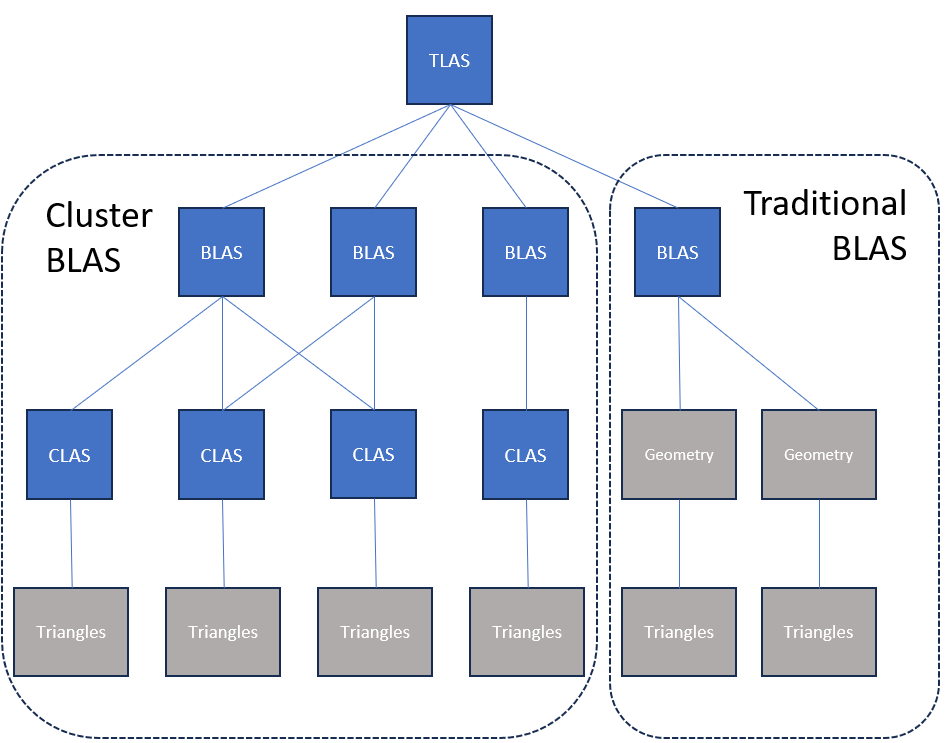
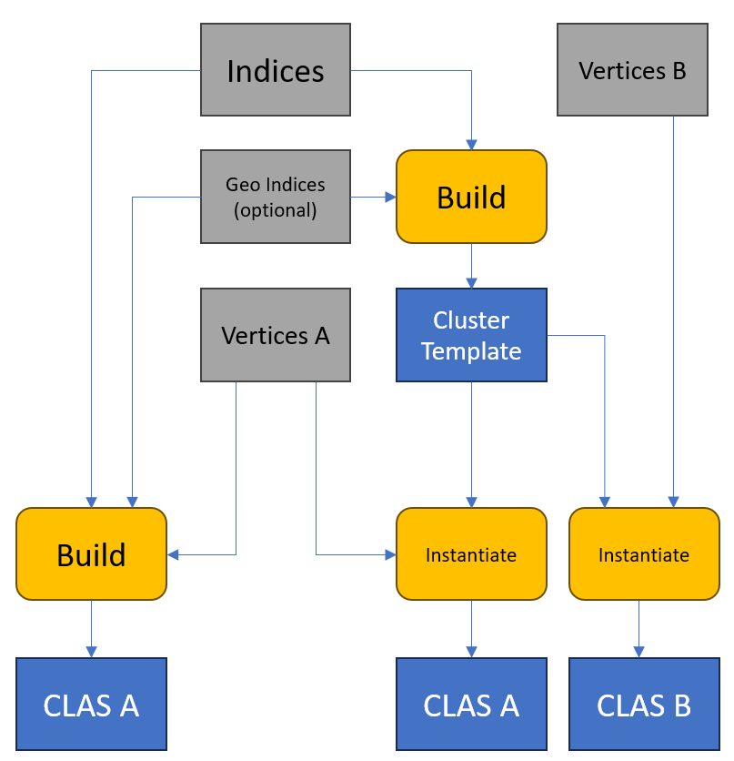
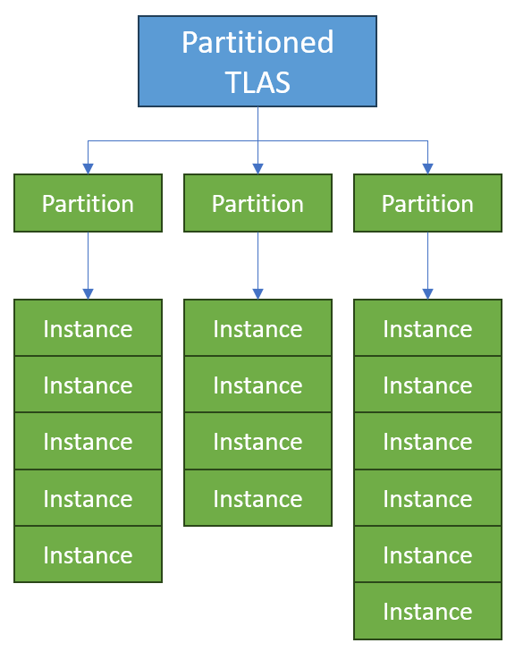
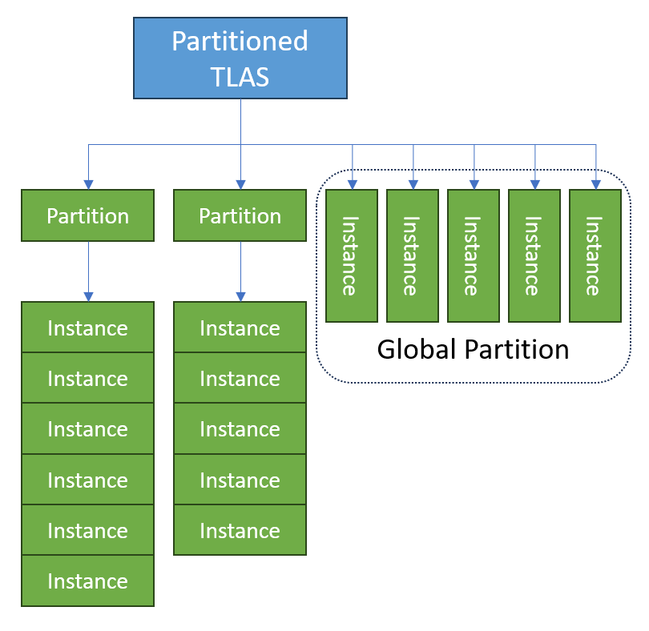

# DirectX Raytracing (DXR) Functional Spec, Part 2 <!-- omit in toc -->

v0.16 3/10/2026

---

# Contents <!-- omit in toc -->

- [Intro](#intro)
  - [Features](#features)
    - [Clustered geometry](#clustered-geometry)
      - [Cluster Level Acceleration Structure](#cluster-level-acceleration-structure)
      - [Cluster templates](#cluster-templates)
      - [Cluster input geometry encoding](#cluster-input-geometry-encoding)
        - [Compressed1 position encoding](#compressed1-position-encoding)
        - [Compressed1 with cluster templates](#compressed1-with-cluster-templates)
        - [D3D12\_VERTEX\_FORMAT\_COMPRESSED1\_TEMPLATE\_HEADER](#d3d12_vertex_format_compressed1_template_header)
    - [Partitioned Top Level Acceleration Structures](#partitioned-top-level-acceleration-structures)
      - [Partitioned TLAS overview](#partitioned-tlas-overview)
      - [Global partition](#global-partition)
      - [Partition translation](#partition-translation)
    - [Indirect Acceleration Structure operations](#indirect-acceleration-structure-operations)
- [API](#api)
  - [Device methods](#device-methods)
    - [GetRTASOperationPrebuildInfo](#getrtasoperationprebuildinfo)
      - [GetRTASOperationPrebuildInfo Structures](#getrtasoperationprebuildinfo-structures)
        - [D3D12\_RTAS\_OPERATION\_PREBUILD\_INFO](#d3d12_rtas_operation_prebuild_info)
  - [Command list methods](#command-list-methods)
    - [ExecuteIndirectRTASOperations](#executeindirectrtasoperations)
      - [ExecuteIndirectRTASOperations Structures](#executeindirectrtasoperations-structures)
        - [D3D12\_EXECUTE\_INDIRECT\_RTAS\_OPERATIONS\_FLAGS](#d3d12_execute_indirect_rtas_operations_flags)
        - [D3D12\_RTAS\_OPERATION\_DESC](#d3d12_rtas_operation_desc)
        - [D3D12\_RTAS\_OPERATION\_INPUTS](#d3d12_rtas_operation_inputs)
        - [D3D12\_RTAS\_OPERATION\_TYPE](#d3d12_rtas_operation_type)
        - [Navigating RTAS operation types](#navigating-rtas-operation-types)
        - [D3D12\_RTAS\_CLUSTER\_LIMITS](#d3d12_rtas_cluster_limits)
        - [D3D12\_RTAS\_CLUSTER\_TRIANGLES\_INPUTS\_DESC](#d3d12_rtas_cluster_triangles_inputs_desc)
        - [D3D12\_RTAS\_CLUSTER\_TEMPLATE\_TRIANGLES\_INPUTS\_DESC](#d3d12_rtas_cluster_template_triangles_inputs_desc)
        - [D3D12\_RTAS\_INSTANTIATE\_CLUSTER\_TEMPLATE\_INPUTS\_DESC](#d3d12_rtas_instantiate_cluster_template_inputs_desc)
        - [Template instance format conversion semantics](#template-instance-format-conversion-semantics)
        - [The role of geometry index in a cluster](#the-role-of-geometry-index-in-a-cluster)
        - [D3D12\_RTAS\_OPERATION\_FLAGS](#d3d12_rtas_operation_flags)
        - [D3D12\_RTAS\_OPERATION\_MODE](#d3d12_rtas_operation_mode)
        - [Implicit vs explicit destinations for acceleration structure operations](#implicit-vs-explicit-destinations-for-acceleration-structure-operations)
        - [Resource state for read-only arguments](#resource-state-for-read-only-arguments)
        - [Resource state for read-write or write-only arguments](#resource-state-for-read-write-or-write-only-arguments)
        - [Resource state for acceleration structures](#resource-state-for-acceleration-structures)
        - [D3D12\_VERTEX\_FORMAT](#d3d12_vertex_format)
        - [D3D12\_INDEX\_FORMAT](#d3d12_index_format)
        - [D3D12\_RTAS\_CLUSTER\_MOVE\_OPERATION\_FLAGS](#d3d12_rtas_cluster_move_operation_flags)
        - [D3D12\_RTAS\_MOVE\_OPERATION\_TYPE](#d3d12_rtas_move_operation_type)
        - [D3D12\_RTAS\_CLAS\_INPUTS\_DESC](#d3d12_rtas_clas_inputs_desc)
        - [D3D12\_RTAS\_CLUSTER\_MOVES\_DESC](#d3d12_rtas_cluster_moves_desc)
        - [D3D12\_RTAS\_BATCHED\_OPERATION\_DATA](#d3d12_rtas_batched_operation_data)
        - [D3D12\_RTAS\_OPERATION\_ADDRESS\_RESOLUTION\_FLAGS](#d3d12_rtas_operation_address_resolution_flags)
        - [D3D12\_RTAS\_PARTITIONED\_TLAS\_INPUTS\_DESC](#d3d12_rtas_partitioned_tlas_inputs_desc)
        - [D3D12\_RTAS\_PARTITIONED\_TLAS\_FLAGS](#d3d12_rtas_partitioned_tlas_flags)
        - [D3D12\_RTAS\_PARTITIONED\_TLAS\_OPERATION\_DATA](#d3d12_rtas_partitioned_tlas_operation_data)
        - [PTLAS resizing](#ptlas-resizing)
      - [ExecuteIndirectRTASOperations GPU-side Argument Structures](#executeindirectrtasoperations-gpu-side-argument-structures)
        - [D3D12\_RTAS\_CLUSTER\_OPERATION\_CLAS\_FLAGS](#d3d12_rtas_cluster_operation_clas_flags)
        - [D3D12\_RTAS\_CLUSTERED\_GEOMETRY\_FLAGS](#d3d12_rtas_clustered_geometry_flags)
        - [D3D12\_RTAS\_OPERATION\_BUILD\_CLAS\_FROM\_TRIANGLES\_ARGS](#d3d12_rtas_operation_build_clas_from_triangles_args)
        - [D3D12\_RTAS\_OPERATION\_BUILD\_BLAS\_FROM\_CLAS\_ARGS](#d3d12_rtas_operation_build_blas_from_clas_args)
        - [D3D12\_RTAS\_OPERATION\_MOVE\_CLUSTER\_OBJECTS\_ARGS](#d3d12_rtas_operation_move_cluster_objects_args)
        - [D3D12\_RTAS\_OPERATION\_BUILD\_CLUSTER\_TEMPLATES\_FROM\_TRIANGLES\_ARGS](#d3d12_rtas_operation_build_cluster_templates_from_triangles_args)
        - [D3D12\_RTAS\_OPERATION\_INSTANTIATE\_CLUSTER\_TEMPLATES\_ARGS](#d3d12_rtas_operation_instantiate_cluster_templates_args)
        - [D3D12\_RTAS\_PARTITIONED\_TLAS\_OPERATION](#d3d12_rtas_partitioned_tlas_operation)
        - [D3D12\_RTAS\_PARTITIONED\_TLAS\_OPERATION\_TYPE](#d3d12_rtas_partitioned_tlas_operation_type)
        - [D3D12\_RTAS\_PARTITIONED\_TLAS\_OPERATION\_WRITE\_INSTANCE\_ARGS](#d3d12_rtas_partitioned_tlas_operation_write_instance_args)
        - [D3D12\_RTAS\_PARTITIONED\_TLAS\_OPERATION\_UPDATE\_INSTANCE\_ARGS](#d3d12_rtas_partitioned_tlas_operation_update_instance_args)
        - [D3D12\_RTAS\_PARTITIONED\_TLAS\_OPERATION\_TRANSLATE\_PARTITION\_ARGS](#d3d12_rtas_partitioned_tlas_operation_translate_partition_args)
        - [Instance writes or updates and partition translation updates in the same build](#instance-writes-or-updates-and-partition-translation-updates-in-the-same-build)
        - [D3D12\_RTAS\_PARTITIONED\_TLAS\_PARTITION\_INDEX](#d3d12_rtas_partitioned_tlas_partition_index)
        - [D3D12\_RTAS\_PARTITIONED\_TLAS\_INSTANCE\_FLAGS](#d3d12_rtas_partitioned_tlas_instance_flags)
  - [Constants](#constants)
- [HLSL](#hlsl)
  - [Enums](#enums)
  - [System Value Intrinsics](#system-value-intrinsics)
    - [ClusterID](#clusterid)
  - [RayQuery](#rayquery)
    - [RayQuery intrinsics](#rayquery-intrinsics)
      - [RayQuery CandidateClusterId](#rayquery-candidateclusterid)
      - [RayQuery CommittedClusterId](#rayquery-committedclusterid)
  - [HitObject](#hitobject)
    - [HitObject::GetClusterId](#hitobjectgetclusterid)
- [Potential future features](#potential-future-features)
  - [Multi-level instancing](#multi-level-instancing)
    - [Multi-level alternative 1: nested PTLAS](#multi-level-alternative-1-nested-ptlas)
    - [Multi-level alternative 2: mid-level acceleration structure](#multi-level-alternative-2-mid-level-acceleration-structure)
  - [Indirect builds for older acceleration structure operations](#indirect-builds-for-older-acceleration-structure-operations)
- [Change Log](#change-log)

---

# Intro

This is a continuation of the large original raytracing spec: [raytracing.md](Raytracing.md) into a second file.

---

## Features

This adds to the feature [walkthrough](raytracing.md#walkthrough) in the original raytracing spec. Features defined here:

- [Clustered Geometry](#clustered-geometry)
- [Partitioned Top Level Acceleration Structures](#partitioned-top-level-acceleration-structures)
- [Indirect Acceleration Structure Operations](#indirect-acceleration-structure-operations)

These features can work on any hardware with existing raytracing support.  All that's needed are updated drivers for a given device.  If some older devices don't get support it will likely be a resourcing tradeoff the hardware vendor needed to make.

Support is reported by `ClustersAndPTLASSupported` in [D3D12_FEATURE_OPTIONS_NNN](raytracing.md#d3d12_feature_d3d12_options_nnn) (version NNN to be determined) via [CheckFeatureSupport()](raytracing.md#checkfeaturesupport).  This also implies support for Shader Model 6.10 with the small HLSL portion of these features.  Shader Model 6.10 also requires [TriangleObjectPositions](raytracing.md#triangleobjectpositions) support, which a device could expose on its own without the above features.

There is a [D3D12_RAYTRACING_TIER_2_0](raytracing.md#d3d12_raytracing_tier) which requires all of the above, in addition to all features from previous tiers.  In particular some hardware may support the feature caps described above but not yet have [Opacity Micromaps](raytracing.md#opacity-micromaps) required with [D3D12_RAYTRACING_TIER_1_2](raytracing.md#d3d12_raytracing_tier).

> These features are currently being developed.  Release likely starts with a ~late summer 2026 preview.  The spec is posted early given the features are generally aligned across hardware vendors, still subject to refinement.
> 
> The small HLSL parts are also published as proposals already: [HLSL support for Clustered Geometry in Raytracing](https://github.com/microsoft/hlsl-specs/blob/main/proposals/0045-clustered-geometry.md) and [HLSL TriangleObjectPositions](https://github.com/microsoft/hlsl-specs/blob/main/proposals/0041-triangle-object-positions.md).

---

### Clustered geometry

Acceleration structure build times can become a bottleneck in raytracing applications that require large amounts of dynamic geometry. Example scenarios include new geometry being streamed in from disk, high numbers of animated objects, level-of-detail systems, or dynamic tessellation.

Clustered Geometry addresses this issue by enabling apps to build acceleration structures around compact clusters of primitives and use those as building blocks to construct bottom-level acceleration structures.  This division of labor results in significantly faster acceleration structure build times compared to starting from triangle soup.

Apps can also save memory reusing clusters, such as across different LODs that combine sets of clusters.  Certain geometry processing pipelines already prepare such clusters, for instance as meshlets for use with mesh shaders.

Clustered Geometry consists of two concepts:

- An acceleration structure level referred to as Cluster Level Acceleration Structure (or CLAS). 
- An alternative structure to a BLAS, referred to as the Cluster BLAS. A Cluster BLAS is a BLAS constructed from the aforementioned CLAS structures.

A CLAS is a type of acceleration structure that functions as an intermediate primitive, itself constructed from triangles, from which Clustered Bottom Level Acceleration Structures (Cluster BLAS) can be constructed. The Cluster BLAS is an alternative for Bottom Level Acceleration Structures. The intent is for an application to group the geometry in their meshes into CLAS primitives before generating the Cluster BLAS from them. In order to maintain good trace performance, the application should group primitives into clusters based on spatial proximity.

The diagram below shows a comparison of how a Cluster BLAS versus a traditional BLAS would fit into a TLAS.



A Cluster BLAS behaves identically to an existing BLAS except as follows:

- Calls to [CopyRaytracingAccelerationStructure](Raytracing.md#copyraytracingaccelerationstructure) and [EmitRaytracingAccelerationStructurePostbuildInfo](Raytracing.md#emitraytracingaccelerationstructurepostbuildinfo) are not supported.  `D3D12_RTAS_OPERATION_TYPE_MOVE_CLUSTER_OBJECTS` should be used instead.
- Cluster BLAS cannot be used as source acceleration structures for calls to [BuildRaytracingAccelerationStructure](Raytracing.md#buildraytracingaccelerationstructure). [Cluster Templates](#cluster-templates) cover this functionality.
- Cluster BLAS contain explicit references to the CLAS they were constructed from. If CLAS are moved or become invalid then any Cluster BLAS referencing them will likewise become invalid.

In all other situations, any reference to a BLAS can be substituted with a Cluster BLAS without loss of functionality.

Accessing acceleration structures that may contain clusters from shaders requires opting in via [D3D12_RAYTRACING_PIPELINE_FLAG_ALLOW_CLUSTERED_GEOMETRY](raytracing.md#d3d12_raytracing_pipeline_flags) flag for the state object, or for [RayQuery](#rayquery), [RAYQUERY_FLAG_ALLOW_CLUSTERED_GEOMETRY](raytracing.md#rayquery-flags) in the `RayQuery` instantiation.

Because the application can group primitives into independent clusters, the creation of which is usually amortized over many frames, the time spent building acceleration structures is reduced dramatically. Memory usage and build time are further improved if CLAS can be reused (referenced) across multiple Cluster BLAS. Note that this is a fundamental difference to traditional BLAS, where all input primitive information is stored in the BLAS itself. An application might use this for seamless streaming or level of detail systems, where CLAS of different geometric densities are dynamically combined into a single BLAS. 

All operations related to cluster geometry are provided as part of a flexible [indirect acceleration structure operations](#indirect-acceleration-structure-operations) API. This allows applications to generate CLAS geometry, construct Cluster BLAS from lists of CLAS, and move or copy CLAS and Cluster BLAS. The inputs to the call are sourced from device memory rather than host memory and operate on many elements at once, thus avoiding the majority of host-side cost associated with existing acceleration structure functions.

---

#### Cluster Level Acceleration Structure

A CLAS behaves like a BLAS in many ways but with the following differences: 

- CLAS can only contain a limited number of triangles and vertices. The limit is 256 triangles and 256 vertices, one cluster per CLAS. 
- CLAS cannot be directly included in a TLAS; instead a Cluster BLAS needs to be created from one or more CLAS to trace the geometry within a CLAS. 
- Geometry Indices in a CLAS can be specified per-primitive and may be non-consecutive. See [The role of geometry index in a cluster](#the-role-of-geometry-index-in-a-cluster).
- A CLAS can be assigned a user determined 32-bit [ClusterID](#clusterid) that can be fetched from a hit shader, intended to be used to fetch attributes among other purposes.
- Cluster BLAS primitive indices are limited to the CLAS being hit, and thus limited to a range from 0 to 255. To identify which CLAS within a Cluster BLAS is hit, the [ClusterID](#clusterid) is intended to be used.

When creating a BLAS out of a set of CLAS, the resulting BLAS contains references to the source CLAS structures. Therefore, modifying any of the source CLAS after constructing a BLAS invalidates the BLAS and makes it invalid to trace or use as input in any other function call. These Cluster BLAS objects created from CLAS can be added to existing TLAS or [Partitioned TLAS](#partitioned-top-level-acceleration-structures) objects. With Cluster BLAS, triangle indices are no longer unique within the BLAS. Instead, the application needs to use the ClusterID HLSL intrinsic in the hit shader to identify which CLAS was hit.

Cluster BLAS objects are not compatible with [BuildRaytracingAccelerationStructure()](raytracing.md#buildraytracingaccelerationstructure), [EmitRaytracingAccelerationStructurePostbuildInfo()](raytracing.md#emitraytracingaccelerationstructurepostbuildinfo), [CopyRaytracingAccelerationStructure()](raytracing.md#copyraytracingaccelerationstructure) functions.  

Instead, all cluster-level acceleration structure functionality is provided through GPU-driven [indirect acceleration structure operations](#indirect-acceleration-structure-operations). In particular [ExecuteIndirectAccelerationStructureOperations()](#executeindirectrtasoperations) must be used to perform various tasks such as builds, fetching sizes and copying.

The intended use for cluster-related operations is for the user to create BLAS objects out of CLAS objects. This provides the following advantages to the user:

- CLAS allow reusing of geometry data between multiple BLAS, reducing memory footprint.
- CLAS can be built efficiently in general, and using [template-based instantiation](#cluster-templates) CLAS can be created with extremely low overhead.
- CLAS require no compaction and can be emitted without unnecessary structures within the object.
- Constructing BLAS from CLAS is more efficient by reducing the number of primitives the build operates on. For assembling BLAS out of CLAS of 100 triangles a ~100x speedup is reasonable to expect.
- Non-consecutive geometry indexing allows more flexible use of Shader Tables.
- All operations are device driven and allow device-generated arguments.

This allows users to create higher fidelity BLAS that can be more efficiently adapted to both animation (cluster template instantiation) and level of detail changes.

CLAS allow the user to set the Geometry Index explicitly for each triangle through a buffer which then gets added to a base index provided for the entire CLAS.

CLAS come with built-in support for [Opacity Micromaps](raytracing.md#opacity-micromaps), and CLAS utilizing Opacity Micromaps and different Geometry Flags can freely be mixed into a single Cluster BLAS.

See [Navigating RTAS operation types](#navigating-rtas-operation-types).
  
---

#### Cluster templates

In addition to CLAS and Cluster BLAS, a third structure is introduced referred to as Cluster Template. A Cluster Template is a partially constructed CLAS with the following properties compared to a CLAS:

- No Vertex Positions
  - Optional example positions can be specified as a hint about where instantiated vertices might be.  These are discarded in the resulting template. Useful for animated meshes, not that useful for tessellation / dynamic mesh generation.  Instantiating templates always provides final positions for a CLAS build.
- Reduced size due to lack of position information 
- No ability to trace or be used to build other acceleration structures 
- Optimized for ability to be used to efficiently instantiate a CLAS when provided vertex data 
- Same content relating to other non-positional properties as a CLAS, which will be inherited by the CLAS when instantiated
- Ability to provide hints to optimize Cluster Templates for certain instantiation positions, permitting different trade-offs between flexibility and trace performance 

These Cluster Template objects can be used to efficiently instantiate CLAS in memory. Instantiated CLAS from the same Cluster Template only differ by vertex positions, ClusterID and a uniform geometry index offset. Cluster Templates front-load as much computation as can be made position invariant of the CLAS creation so that its results can be reused when creating multiple CLAS. See [Template instance format conversion semantics](#template-instance-format-conversion-semantics) for details on how vertex data is handled during instantiation.

The image below shows how a Cluster Template is instantiated compared with a direct build of a CLAS:



When creating a Cluster Template, Geometry Indices can be controlled the same way as when building a CLAS directly. When instantiating a Cluster Template, an additional base offset added to all Geometry Indices in the CLAS can be provided. The final Geometry Indices cannot exceed the Maximum Geometry Index declared when creating the Cluster Template.

An example use of Cluster Templates is for animated objects in their scenes with the following workflow:

- Create Cluster Templates for the clusters of a mesh that the app intends to animate when the mesh is streamed in
- For each frame with instances of this mesh being animated:
  - Use a compute shader to generate the animated vertex positions for each instance of the mesh
  - Instantiate the Cluster Templates to produce the per-instance CLAS from the Cluster Templates created during stream-in and the per-instance vertex positions.
  - Create a BLAS over these clusters and then use the resulting Cluster BLAS as usual with a user determined ClusterID encoding to fetch per-instance and per-mesh properties
  
Other use cases could include repeatedly instantiating pre-generated patterns for particles or surfaces of dynamically created geometry.

This workflow is intended to provide performance comparable with traditional refit while permitting:

- Topology changes of the animated mesh without additional cost by swapping out Cluster Templates.
- Lower memory usage as:
  - Information for refitting is only stored in templates and shared by all instances.
  - Templates support more compression features than traditional BLAS.
- Better trace performance as the resulting BLAS can be recreated efficiently every frame and adapt to the shape of the object.
- Paying animation cost only for parts of an object that is animated, allowing static parts (for example trunk of a tree) to be encoded in their own CLAS and shared between all instances, without requiring separate overlapping instances and the associated trace penalties.

> Overall, cluster templates are intended to be an upgrade versus traditional updates / refits, that is both more efficient and works better with indirect/device-based workflows.

See [Navigating RTAS operation types](#navigating-rtas-operation-types).

---

#### Cluster input geometry encoding

Vertex position input to cluster builds supports the same uncompressed input formats supported for [triangle geometries in plain BLAS](raytracing.md#d3d12_raytracing_geometry_triangles_desc).

In addition, cluster build supports a compressed position format.  The benefit to an app for using this format is that the input data to cluster build can take less space, with the possibility that some savings propagate to the hardware's BVH in some form as well with reasonable BVH build times. This is particularly true if the app is able to represent its source assets in the same or similar format as the compressed format described here so that it doesn't have to spend much effort of its own transcoding to this format.  It is simply a flexible fixed-point position encoding which should be natural for many engines to choose, at least for some portion of geometry assets.

The `VertexFormat` fields in the CPU-side structs [D3D12_RTAS_CLUSTER_TRIANGLES_INPUTS_DESC](#d3d12_rtas_cluster_triangles_inputs_desc), [D3D12_RTAS_CLUSTER_TEMPLATE_TRIANGLES_INPUTS_DESC](#d3d12_rtas_cluster_template_triangles_inputs_desc) and [D3D12_RTAS_INSTANTIATE_CLUSTER_TEMPLATE_INPUTS_DESC](#d3d12_rtas_instantiate_cluster_template_inputs_desc) have a dedicated enum type [D3D12_VERTEX_FORMAT](#d3d12_vertex_format) which lists the various supported vertex formats.  Most of these are similar to existing `DXGI_FORMAT_*` - the subset that work for plain BLAS as mentioned above.

The reason for a new enum is both to be more clear about the exact set of supported formats, and to include the option of compressed vertex formats in the list which aren't worth adding to the general purpose `DXGI_FORMAT` enum.  The one compressed encoding defined so far is defined further below - [Compressed1 position encoding](#compressed1-position-encoding).

Topology input to cluster builds must be indexed triangle lists.  Index format is chosen by the `IndexFormat` ([D3D12_INDEX_FORMAT](#d3d12_index_format)) member in GPU-side structures [D3D12_RTAS_OPERATION_BUILD_CLAS_FROM_TRIANGLES_ARGS](#d3d12_rtas_operation_build_clas_from_triangles_args) or [D3D12_RTAS_OPERATION_BUILD_CLUSTER_TEMPLATES_FROM_TRIANGLES_ARGS](#d3d12_rtas_operation_build_cluster_templates_from_triangles_args).

---

##### Compressed1 position encoding

[D3D12_VERTEX_FORMAT_COMPRESSED1](#d3d12_vertex_format) vertices are encoded in the following format with no padding between sections.  These are pointed to by GPU-side [cluster build arguments](#d3d12_rtas_operation_build_clas_from_triangles_args) and [cluster build from template arguments](#d3d12_rtas_operation_build_clas_from_triangles_args):

(1) Header
(2) Vertex block

In detail:

(1) Header for entire set of cluster's vertex data (12 bytes)

- 4 byte aligned start address
- Power of 2 exponent value encoding a value in range `[-126..105]`
  - Implementations must clamp to this valid range to avoid undefined behavior
  - TODO: Double check if valid exponent range needs to be reduced by ~1 at either end
- 24bit * 3 (xyz) anchor position encoding
- Bit sizes for per-vertex xyz deltas from anchor (specifying `1-16` bits per component) 

> Note vertex count isn't needed here as it is part of the overall cluster description.  See `VertexCount` in GPU-side build arguments: [D3D12_RTAS_OPERATION_BUILD_CLAS_FROM_TRIANGLES_ARGS](#d3d12_rtas_operation_build_clas_from_triangles_args) and [D3D12_RTAS_OPERATION_BUILD_CLUSTER_TEMPLATES_FROM_TRIANGLES_ARGS](#d3d12_rtas_operation_build_cluster_templates_from_triangles_args).  Also see the `Max*` counts in CPU-side build inputs description:[D3D12_RTAS_CLUSTER_LIMITS](#d3d12_rtas_cluster_limits).

```C++
typedef struct D3D12_VERTEX_FORMAT_COMPRESSED1_HEADER
{
    // uint_32 0
    UINT exponent             :  8; // Float32 scale (exponent-only) with bias 127. 
                                        // 1-232 are supported, resulting in range [-126..105].
    INT  x_anchor             : 24; // 24-bit signed two's complement 
                                        // (0x800000 represents -8,388,608)

    // uint_32 1
    UINT x_bits               :  4; // 1-16 (add 1 when decoding)
    UINT y_bits               :  4; // 1-16 (add 1 when decoding)
    INT  y_anchor             : 24; // 24-bit signed two's complement

    // uint_32 2
    UINT z_bits               :  4; // 1-16 (add 1 when decoding)
    UINT unused               :  4;
    INT  z_anchor             : 24; // 24-bit signed two's complement
} D3D12_VERTEX_FORMAT_COMPRESSED1_HEADER;
```

This struct definition shown from `d3d12.h` can be copied to HLSL with the following definitions along with HLSL 2021 to get bitfield support (or replacing types):

```C++
typedef uint32_t UINT;
typedef int32_t INT;
```

  
(2) Vertex block

- Directly after the header
- Per vertex xyz deltas relative to the cluster's anchor in the header
- Bit widths for each of x, y and z come from the header

A position is decoded as:

```C++
float3 compressed1_position_decode(int24_t Anchor[3], uint16_t Offset[3], uint8_t Exponent)
{
    int x = Anchor[0] + Offset[0]; // 24b + 16b add.. 25b result
    int y = Anchor[1] + Offset[1];
    int z = Anchor[2] + Offset[2];

    float fx = (float)(x); // convert results to float
    float fy = (float)(y);
    float fz = (float)(z);

    // apply a pow2 scale factor
    float scale = ldexp(1.0f, Exponent - 127);
    return float3(fx, fy, fz) * scale;
}
```

---

##### Compressed1 with cluster templates

When generating [cluster templates](#cluster-templates), [D3D12_RTAS_CLUSTER_TEMPLATE_TRIANGLES_INPUTS_DESC](#d3d12_rtas_cluster_template_triangles_inputs_desc) has a `VertexInstantiationFormat` member that specifies the data format that instances of the template will store in the acceleration structure.  Actual hardware implementation may vary, but it will functionally appear as if the specified format is what is used.

If this format is `D3D12_VERTEX_FORMAT_COMPRESSED1`, then [D3D12_RTAS_OPERATION_BUILD_CLUSTER_TEMPLATES_FROM_TRIANGLES_ARGS](#d3d12_rtas_operation_build_cluster_templates_from_triangles_args) has a [D3D12_VERTEX_FORMAT_COMPRESSED1_TEMPLATE_HEADER](#d3d12_vertex_format_compressed1_template_header) `Compressed1TemplateHeader` field that specifies a subset of the full `COMPRESSED1` header that is locked for all instances of the template: `exponent`, `x_bits`, `y_bits` and `z_bits`.  

The anchor is derived at [template instantiation](#d3d12_rtas_operation_instantiate_cluster_templates_args) by the min `x`, `y` and `z` components of all the input positions.  The combination of fixed template properties and derived anchor define the format that the input positions are encoded with at template instantiation.

The exception is if the input vertex data at template instantiation also happens to be in `COMPRESSED1` format and its header specifies `x_bits`, `y_bits` and `z_bits` less than or equal to the values in the template.  In this case the anchor doesn't have to be derived.  It can just be taken from the input header, and the input bitstream can also be taken as-is (padding extra bits with `0`).  And in this case the `exponent` is also taken from the input header as well, so the `exponent` in the template's `Compressed1TemplateHeader` is ignored.

See [Template instance format conversion semantics](#template-instance-format-conversion-semantics).

Since `COMPRESSED1` templates lock the `exponent`, `x_bits`, `y_bits` and `z_bits` properties, adjacent clusters instantiated with the same template can remain watertight (no cracks between adjacent geometry) even when there is animation of the vertices input to each cluster's template instantiation.

The constraint for input data to the template is it must fit within the locked format properties. Given the anchor is derived at instantiation based on the input vertices, that acts as a sliding window, in the region of space defined by the `exponent`, that can hold the geometry for the cluster.  

Even in the exception case described above, which is instantiating `COMPRESSED1` templates with `COMPRESSED1` input data with bit counts less than or equal to the `Compressed1TemplateHeader`, where `anchor` and `exponent` are taken directly from the input header, watertightness across neighboring clusters can be achieved by the app.

This requires careful selection of `anchor` and `exponent` values in the input `COMPRESSED1` headers for adjacent clusters to result in effectively the same decoded data for vertices shared across clusters (possible with care even if they use different `exponent` values).  This is true for non-templates as well.

---

##### D3D12_VERTEX_FORMAT_COMPRESSED1_TEMPLATE_HEADER

```C++
typedef struct D3D12_VERTEX_FORMAT_COMPRESSED1_TEMPLATE_HEADER
{
    UINT exponent : 8;
    UINT x_bits : 4;
    UINT y_bits : 4;
    UINT z_bits : 4;
} D3D12_VERTEX_FORMAT_COMPRESSED1_TEMPLATE_HEADER;
```

See [Compressed1 with cluster templates](#compressed1-with-cluster-templates) above.

Referenced by `Compressed1TemplateHeader` member of [D3D12_RTAS_OPERATION_BUILD_CLUSTER_TEMPLATES_FROM_TRIANGLES_ARGS](#d3d12_rtas_operation_build_cluster_templates_from_triangles_args).

This struct definition shown from `d3d12.h` can be copied to HLSL with the following definition, along with HLSL 2021 to get bitfield support:

```C++
typedef uint32_t UINT;
```

---

### Partitioned Top Level Acceleration Structures

As developers strive to create larger and more detailed worlds, instance counts have been steadily increasing since the launch of DXR. The design of the Top Level Acceleration Structure API requires the entire data structure to be rebuilt even if only a small number of instances are modified. This does not allow for exploiting temporal invariance across frames, such as in applications where the majority of the scene is static.

Partitioned Top Level Acceleration Structures (PTLAS) provide an alternative to [Top Level Acceleration Structures (TLAS)](raytracing.md#geometry-and-acceleration-structures). Unlike TLAS, PTLAS allows the efficient reuse of previously built parts of the acceleration structure, therefore significantly increasing build performance and enabling higher overall instance counts. From the perspective of ray tracing shaders and pipelines, PTLAS behavior is identical to existing TLAS.

---

#### Partitioned TLAS overview

The primary difference between a Partitioned TLAS and a non-Partitioned TLAS is the partitioning of instances, as the name implies. A PTLAS build is internally split into two stages: 

- an acceleration structure for each partition, combining the instances within the partition into a single acceleration structure. 
- a second type of acceleration structure that combines all the partitions into a single acceleration structure equivalent to a TLAS.

The following depicts the arrangement of the acceleration structures within a Partitioned TLAS:



The Partitioned TLAS API has the following key design properties: 

- The structure manages a persistent acceleration structure that may be rebuilt partially by modifying some partitions but not others.
- Rebuilds are usually expected to be performed in-place, although this is not mandatory.
- The structure manages a persistent instance list that is separate from the instances that are actually enabled (visible to rays). To control which instances are enabled, the user assigns them to one of several partitions.
- There exists a single special partition referred to as the *[global partition](#global-partition)*. Instances assigned to the global partition behave (in terms of performance) as if each was in a partition of its own. Typical use cases for the global partition include dynamic instances that move every frame, such as characters in a game.
- Instances can be assigned an [explicit bounding box](#d3d12_rtas_partitioned_tlas_instance_flags), allowing their BLAS pointer to be replaced without the cost of a rebuild. This particularly facilitates LOD techniques, where objects of which the conservative common bounds are known are swapped out against each other.
- Partitions may be assigned a [translation vector](#partition-translation) that can be updated efficiently while otherwise retaining the contents of the partition. This is particularly useful for applications that periodically re-center the scene around the origin to avoid floating point precision issues.
- Arguments to the PTLAS build call are provided indirectly (in GPU memory).
- No changes or additions to the shading language are required.

Applications will benefit most from the performance improvements offered by PTLAS when instances and partitions are carefully organized. Spatial overlap between partition bounds will have a negative effect on trace performance on most implementations, similar to instance overlap in existing TLAS. Generally small partitions (100-1000 instances) should offer the majority of build speed improvements with the smallest trace performance impact. The PTLAS structure itself, with optimally chosen partitions approximating ideal BVH subtrees, should have negligible trace performance impact.

PTLAS are not compatible with [BuildRaytracingAccelerationStructure()](raytracing.md#buildraytracingaccelerationstructure), [EmitRaytracingAccelerationStructurePostbuildInfo()](raytracing.md#emitraytracingaccelerationstructurepostbuildinfo), [CopyRaytracingAccelerationStructure()](raytracing.md#copyraytracingaccelerationstructure) functions.  

Instead, just like with [CLAS](#cluster-level-acceleration-structure), all PTLAS related functionality is provided through GPU-driven [indirect acceleration structure operations](#indirect-acceleration-structure-operations). [ExecuteIndirectAccelerationStructureOperations()](#executeindirectrtasoperations) must be used to perform various tasks such as builds and fetching sizes.

See [Navigating RTAS operation types](#navigating-rtas-operation-types).

Also see [PTLAS resizing](#ptlas-resizing).

---

#### Global partition

Partitioned TLAS supports a special Global Partition that exists separately from the other partitions. Instances can be assigned to the Global Partition in the same way they can be assigned to other partitions. The Global Partition differs in two ways from other partitions:

- It has a separate size limit that can be set independently from other partitions.
- When the internal Partitioned TLAS acceleration structures are built, the instances within the global partition are individually inserted into the second-stage acceleration structure that combines all partitions. Therefore, the instances within the Global Partition behave (in terms of trace performance and build performance) as if each was within its own partition, but without inflating the maximum partition count.

This diagram compares instances in the Global Partition with instances in ordinary partitions within the Partitioned TLAS:



The intended use of the Global Partition is for applications to use it for instances that are expected to frequently require updates (for example: animated characters in motion). Placing these instances in the global partition reduces the build cost that potentially modifying many individual partitions would cause while eliminating the trace performance impact that having them in a larger spatially overlapping partition would cause. 

Instances within the global partition still have a build performance impact, and once instances have settled and it is expected they won't require frequent transform updates, it is recommended to [write them into](#d3d12_rtas_partitioned_tlas_operation_write_instance_args) a spatially well-located, non-global partition instead.

---

#### Partition translation

In order to assist titles with large worlds that require more precision than 32-bit floating point numbers can provide, the Partitioned TLAS supports the efficient translation of partitions.

A typical way applications have been handling this issue is to assign a world space position based on a world center that is close to the camera position in order to increase accuracy of positions close to the camera. A Partition Translation is an additional translation that can be applied to the instances as the acceleration structure is constructed, without affecting the stored transform of the instance.

The expected use of this feature is for the application to store instance transforms relative to the partitions they are assigned to. Then, the partition translation is added to the stored transform to arrive at the desired world position for each instance. This way, the stored instance transform can utilize the higher accuracy of smaller floating point numbers, with larger loss of accuracy not occurring until the acceleration structure is built. When the user wishes to re-center the world space coordinates of all objects, the position translations can be updated efficiently without triggering a rebuild of the entire Partitioned TLAS.

Use of the Partition Translation requires additional memory for storing the un-translated version of instance transforms and must be enabled with a flag when constructing the Partitioned TLAS.  The global partition supports translation just like any other partition.

See [Navigating RTAS operation types](#navigating-rtas-operation-types).

---

### Indirect Acceleration Structure operations

A GPU-driven acceleration structure management API surface provides an extendable interface for multiple raytracing features. All operations are GPU-driven with indirect argument lists, allowing for efficient batching and device-generated workloads. The system is designed to be implementation agnostic while providing optimization opportunities for specific hardware architectures.

The API consists of two methods: a host-side query function to fetch requirements and a multi-purpose indirect command list function to execute operations:

- [GetRTASOperationPrebuildInfo()](#getrtasoperationprebuildinfo) — query conservative memory requirements for an operation
- [ExecuteIndirectRTASOperations()](#executeindirectrtasoperations) — execute one or more batched operations on the GPU

These functions allow the user to create or copy/move multiple acceleration structures at once while controlling both the number of arguments and the arguments themselves on device.

The supported operation types (see [Navigating RTAS operation types](#navigating-rtas-operation-types) for a complete mapping of types to structs):

- **Cluster builds**: [Build CLAS from triangles](#d3d12_rtas_operation_build_clas_from_triangles_args), [build Cluster BLAS from CLAS](#d3d12_rtas_operation_build_blas_from_clas_args), [build cluster templates](#d3d12_rtas_operation_build_cluster_templates_from_triangles_args), and [instantiate cluster templates](#d3d12_rtas_operation_instantiate_cluster_templates_args)
- **Partitioned TLAS**: [Build and update](#d3d12_rtas_partitioned_tlas_operation) partitioned top-level acceleration structures, including [writing instances](#d3d12_rtas_partitioned_tlas_operation_write_instance_args), [updating instances](#d3d12_rtas_partitioned_tlas_operation_update_instance_args), and [translating partitions](#d3d12_rtas_partitioned_tlas_operation_translate_partition_args)
- **Move operations**: [Copy/move](#d3d12_rtas_operation_move_cluster_objects_args) CLAS, cluster templates, and Cluster BLAS

Key concepts for managing operation results:
- [Implicit vs explicit destinations](#implicit-vs-explicit-destinations-for-acceleration-structure-operations) — choosing where build outputs are placed
- [Operation modes](#d3d12_rtas_operation_mode) — implicit destinations, explicit destinations, or size queries

---

# API

This is a continuation of the [API](raytracing.md#api) section in the original spec.

[Device methods](#device-methods):
- [GetRTASOperationPrebuildInfo()](#getrtasoperationprebuildinfo)

[Command list methods](#command-list-methods):
- [ExecuteIndirectRTASOperations()](#executeindirectrtasoperations)

---

## Device methods

The following device methods are defined here:
- [GetRTASOperationPrebuildInfo()](#getrtasoperationprebuildinfo)

---

### GetRTASOperationPrebuildInfo

```C++
void GetRTASOperationPrebuildInfo(
    _In_ const D3D12_RTAS_OPERATION_INPUTS* pDesc,
    _Out_ D3D12_RTAS_OPERATION_PREBUILD_INFO* pInfo
);
```

Query conservative memory requirements for executing an indirect acceleration structure operation.
The returned size is conservative for operations containing a lower or equal number of values for each of the provided properties.

Parameter                                                                      | Definition
---------                                                                      | ----------
`const D3D12_RTAS_OPERATION_INPUTS* pDesc`       | Description of the operation. The implementation is allowed to look at all the parameters in this struct and nested structs.  This structure is shared with [ExecuteIndirectRTASOperations()](#executeindirectrtasoperations). See [D3D12_RTAS_OPERATION_INPUTS](#d3d12_rtas_operation_inputs).
`D3D12_RTAS_OPERATION_PREBUILD_INFO* pInfo`                | Result of the query. See [D3D12_RTAS_OPERATION_PREBUILD_INFO](#d3d12_rtas_operation_prebuild_info).

---

#### GetRTASOperationPrebuildInfo Structures

In addition to the structures listed below, see [ExecuteIndirectRTASOperations()](#executeindirectrtasoperations) for other structures common to both methods.

---

##### D3D12_RTAS_OPERATION_PREBUILD_INFO

```C++
typedef struct D3D12_RTAS_OPERATION_PREBUILD_INFO
{
    UINT64 ResultDataMaxSizeInBytes;
    UINT64 ScratchDataSizeInBytes;
} D3D12_RTAS_OPERATION_PREBUILD_INFO;
```

Conservative memory requirements for executing the described operation.

Member                               | Definition
------                               | ----------
`UINT64 ResultDataMaxSizeInBytes`    | Size required to hold the result of the operation based on the specified inputs. <br><br>In [D3D12_RTAS_OPERATION_INPUTS](#d3d12_rtas_operation_inputs), if the selected operation [Type](#d3d12_rtas_operation_type)'s corresponding union desc member has a [D3D12_RTAS_OPERATION_MODE](#d3d12_rtas_operation_mode) `Mode` field, here are the `Mode` semantics:<ul><li>`D3D12_RTAS_OPERATION_MODE_IMPLICIT_DESTINATIONS`: this field will contain the required size for all results of the operation. That is, the amount of memory required for `BatchResultData` in [D3D12_RTAS_BATCHED_OPERATION_DATA](#d3d12_rtas_batched_operation_data), under the union member `pBatchedOperationData` of [D3D12_RTAS_OPERATION_DESC](#d3d12_rtas_operation_desc). </li><li>`D3D12_RTAS_OPERATION_MODE_EXPLICIT_DESTINATIONS`: this field will contain the required size for a single result.</li><li>`D3D12_RTAS_OPERATION_MODE_GET_SIZES`: the field is unused and will be set to 0 by the call.</li></ul>In the implicit case, the implementation guarantees that the returned value fulfills an inequality: `prebuild(A) + prebuild(B) <= prebuild(A+B)` where: <ul><li>`prebuild(A)` is the value returned by [GetRTASOperationPrebuildInfo()](#getrtasoperationprebuildinfo) in `ResultDataMaxSizeInBytes` for a set of objects `A`.</li><li>`prebuild(B)` is the value returned by [GetRTASOperationPrebuildInfo()](#getrtasoperationprebuildinfo) in `ResultDataMaxSizeInBytes` for a set of objects `B`.</li><li>`prebuild(A+B)` is the value returned by [GetRTASOperationPrebuildInfo()](#getrtasoperationprebuildinfo) in `ResultDataMaxSizeInBytes` for the union of objects of `A` and `B`.</li></ul>This inequality guarantees that a single large buffer can be subdivided into several independent builds by distributing the objects built. <br><br>In [D3D12_RTAS_OPERATION_INPUTS](#d3d12_rtas_operation_inputs), if the selected operation [Type](#d3d12_rtas_operation_type) is `D3D12_RTAS_TYPE_MOVE_CLUSTER_OBJECTS` and [Mode](#d3d12_rtas_operation_mode) is `D3D12_RTAS_OPERATION_MODE_EXPLICIT_DESTINATIONS` the returned value will be zero as there is no way for the implementation to know the maximum size of a moved objects for this operation type.
`UINT64 ScratchDataSizeInBytes`      | Scratch storage on GPU required during the operation based on the specified inputs.

Used by:
- [GetRTASOperationPrebuildInfo()](#getrtasoperationprebuildinfo) - `pInfo` parameter

---

## Command list methods

The following command list methods are defined here:
- [ExecuteIndirectRTASOperations()](#executeindirectrtasoperations)

---

### ExecuteIndirectRTASOperations

```C++
void ExecuteIndirectRTASOperations(
    UINT NumOperationDescs,
    _In_reads_(NumOperationDescs) const D3D12_RTAS_OPERATION_DESC* pDescs,
    D3D12_EXECUTE_INDIRECT_RTAS_OPERATIONS_FLAGS Flags
);
```

Execute a set of `NumOperationDescs` indirect acceleration structure operations on the GPU, where each specified operation is itself a batch.

The CPU-side input buffers are not referenced after this call.
The GPU-side input resources are referenced only while the operations are executing on the GPU.

Parameter                     | Definition
---------                     | ----------
`UINT NumOperationDescs`      | Number of operation descriptors to execute
`const D3D12_RTAS_OPERATION_DESC* pDescs` | Array of operation descriptors. See [D3D12_RTAS_OPERATION_DESC](#d3d12_rtas_operation_desc).
`D3D12_EXECUTE_INDIRECT_RTAS_OPERATIONS_FLAGS Flags` | Flags affecting the full operation.  None defined yet. See [D3D12_EXECUTE_INDIRECT_RTAS_OPERATIONS_FLAGS](#d3d12_execute_indirect_rtas_operations_flags).

All operations requested in this call can be executed in any order by the GPU.

> For future consideration: A way for the app to opt-in to an ordering based on defined precedence ordering of various operation types.  So for instance, CLAS builds could be performed before CBLAS builds, and then be followed by PTLAS build, even though all operations are submitted together.
> 
> One way to do achieve this is a flag that requests the operation descs in the `pDescs` array execute in order.  Meaning all the tasks per operation desc can run in parallel, but must complete before the next operation desc in the top level array.  As a further optimization, if certain [operation types](#d3d12_rtas_operation_type) are adjacent in the array, they can also be run in parallel.  e.g. if `BUILD_CLAS_FROM_TRIANGLES` and `INSTANTIATE_CLUSTER_TEMPLATES` are adjacent, they are allowed to run in parallel since there shouldn't be a need for them to be ordered.
>
> This would only matter if in practice implementations could be more efficient about ordering the types of tasks here given a batch with dependencies versus the app splitting the dependencies is a lot of idle time between operations that could be easily filled with overlapping work.

---

#### ExecuteIndirectRTASOperations Structures

---

##### D3D12_EXECUTE_INDIRECT_RTAS_OPERATIONS_FLAGS

```C++
typedef enum D3D12_EXECUTE_INDIRECT_RTAS_OPERATIONS_FLAGS
{
    D3D12_RTAS_OPERATION_FLAG_NONE = 0x0,
};
```

Member                           | Definition
------                           | ----------
`D3D12_RTAS_OPERATION_FLAG_NONE` | No flags are defined yet - for expansion.

---

##### D3D12_RTAS_OPERATION_DESC

```C++
typedef struct D3D12_RTAS_OPERATION_DESC
{
    const D3D12_RTAS_OPERATION_INPUTS* pInputs;

    union
    {
        const D3D12_RTAS_BATCHED_OPERATION_DATA* pBatchedOperationData;
        const D3D12_RTAS_PARTITIONED_TLAS_OPERATION_DATA* pPartitionedTlasOperationData;
    };
} D3D12_RTAS_OPERATION_DESC;
```

Describes an acceleration structure operation to execute.

Member                                    | Definition
------                                    | ----------
`const D3D12_RTAS_OPERATION_INPUTS* pInputs` | Input parameters for the operation. See [D3D12_RTAS_OPERATION_INPUTS](#d3d12_rtas_operation_inputs). The `Inputs.Type` member ([D3D12_RTAS_OPERATION_TYPE](#d3d12_rtas_operation_type)) dictates which union member below is used.
`const D3D12_RTAS_BATCHED_OPERATION_DATA* pBatchedOperationData` | Data for batched cluster operations. See [D3D12_RTAS_BATCHED_OPERATION_DATA](#d3d12_rtas_batched_operation_data).
`const D3D12_RTAS_PARTITIONED_TLAS_OPERATION_DATA* pPartitionedTlasOperationData` | Data for partitioned TLAS operations, when `Inputs.Type` is [D3D12_RTAS_OPERATION_TYPE_PARTITIONED_TLAS](#d3d12_rtas_operation_type) . See [D3D12_RTAS_PARTITIONED_TLAS_OPERATION_DATA](#d3d12_rtas_partitioned_tlas_operation_data).

Used by:
- [ExecuteIndirectRTASOperations()](#executeindirectrtasoperations) - `pDescs` parameter

---

##### D3D12_RTAS_OPERATION_INPUTS

```C++
typedef struct D3D12_RTAS_OPERATION_INPUTS
{
    D3D12_RTAS_OPERATION_TYPE Type;

    union
    {
        const D3D12_RTAS_CLAS_INPUTS_DESC* pClasDesc;
        const D3D12_RTAS_CLUSTER_TRIANGLES_INPUTS_DESC* pClusterTrianglesDesc;
        const D3D12_RTAS_CLUSTER_TEMPLATE_TRIANGLES_INPUTS_DESC* pClusterTemplateTrianglesDesc;
        const D3D12_RTAS_INSTANTIATE_CLUSTER_TEMPLATE_INPUTS_DESC* pInstantiateClusterTemplateDesc;
        const D3D12_RTAS_CLUSTER_MOVES_DESC* pClusterMovesDesc;
        const D3D12_RTAS_PARTITIONED_TLAS_INPUTS_DESC* pPartitionedTLASInputsDesc;
    };
} D3D12_RTAS_OPERATION_INPUTS;
```

Input structure for acceleration structure operations.

> See [Navigating RTAS operation types](#navigating-rtas-operation-types) for a more complete summary of how the `Type` member directs which fields are used.

Member                           | Definition
------                           | ----------
`D3D12_RTAS_OPERATION_TYPE Type` | The type of operation to execute. See [D3D12_RTAS_OPERATION_TYPE](#d3d12_rtas_operation_type).  This determines which union member below is used (multiple types sometimes share one union member).
`const D3D12_RTAS_CLAS_INPUTS_DESC* pClasDesc` | Description when building BLAS from CLAS. See [D3D12_RTAS_CLAS_INPUTS_DESC](#d3d12_rtas_clas_inputs_desc).
`const D3D12_RTAS_CLUSTER_TRIANGLES_INPUTS_DESC* pClusterTrianglesDesc` | Description when building CLAS. See [D3D12_RTAS_CLUSTER_TRIANGLES_INPUTS_DESC](#d3d12_rtas_cluster_triangles_inputs_desc).
`const D3D12_RTAS_CLUSTER_TEMPLATE_TRIANGLES_INPUTS_DESC* pClusterTemplateTrianglesDesc` | Description when building cluster templates. See [D3D12_RTAS_CLUSTER_TEMPLATE_TRIANGLES_INPUTS_DESC](#d3d12_rtas_cluster_template_triangles_inputs_desc).
`const D3D12_RTAS_INSTANTIATE_CLUSTER_TEMPLATE_INPUTS_DESC* pInstantiateClusterTemplateDesc` | Description when instantiating cluster templates. See [D3D12_RTAS_INSTANTIATE_CLUSTER_TEMPLATE_INPUTS_DESC](#d3d12_rtas_instantiate_cluster_template_inputs_desc).
`const D3D12_RTAS_CLUSTER_MOVES_DESC* pClusterMovesDesc` | Description when moving cluster objects. See [D3D12_RTAS_CLUSTER_MOVES_DESC](#d3d12_rtas_cluster_moves_desc).
`const D3D12_RTAS_PARTITIONED_TLAS_INPUTS_DESC* pPartitionedTLASInputsDesc` | Description for partitioned TLAS operations. See [D3D12_RTAS_PARTITIONED_TLAS_INPUTS_DESC](#d3d12_rtas_partitioned_tlas_inputs_desc).

Used by:
- [D3D12_RTAS_OPERATION_DESC](#d3d12_rtas_operation_desc) - `Inputs` member
- [GetRTASOperationPrebuildInfo()](#getrtasoperationprebuildinfo) - `pDesc` parameter

---

##### D3D12_RTAS_OPERATION_TYPE

```C++
typedef enum D3D12_RTAS_OPERATION_TYPE
{
    D3D12_RTAS_OPERATION_TYPE_MOVE_CLUSTER_OBJECTS = 0x0,
    D3D12_RTAS_OPERATION_TYPE_BUILD_BLAS_FROM_CLAS = 0x1,
    D3D12_RTAS_OPERATION_TYPE_BUILD_CLAS_FROM_TRIANGLES = 0x2,
    D3D12_RTAS_OPERATION_TYPE_BUILD_CLUSTER_TEMPLATES_FROM_TRIANGLES = 0x3,
    D3D12_RTAS_OPERATION_TYPE_INSTANTIATE_CLUSTER_TEMPLATES = 0x4,
    D3D12_RTAS_OPERATION_TYPE_PARTITIONED_TLAS = 0x8,
} D3D12_RTAS_OPERATION_TYPE;
```

Specifies the type of acceleration structure operation to perform in the indirect build API.  

> In addition to the following definitions of each type, see [navigating RTAS operation types](#navigating-rtas-operation-types) for a more compact table relating the operation types to associated CPU configuration struct members and GPU indirect argument types.

Value                                                                             | Definition
-----                                                                             | ----------
`D3D12_RTAS_OPERATION_TYPE_MOVE_CLUSTER_OBJECTS`     | Move multiple CLAS objects, multiple Cluster Template objects or multiple Cluster BLAS objects in memory. This operation type requires the use of the union member `ClusterMovesDesc` ([D3D12_RTAS_CLUSTER_MOVES_DESC](#d3d12_rtas_cluster_moves_desc)) in [D3D12_RTAS_OPERATION_INPUTS](#d3d12_rtas_operation_inputs), and uses the `pBatchedOperationData` union member ([D3D12_RTAS_BATCHED_OPERATION_DATA](#d3d12_rtas_batched_operation_data)) in [D3D12_RTAS_OPERATION_DESC](#d3d12_rtas_operation_desc). That struct's member `IndirectArgumentArray` must point to a strided array of type [D3D12_RTAS_OPERATION_MOVE_CLUSTER_OBJECTS_ARGS](#d3d12_rtas_operation_move_cluster_objects_args). The alignment of `BatchResultData` and addresses in `ResultAddressArray` depends on the value of `Type` in [D3D12_RTAS_CLUSTER_MOVES_DESC](#d3d12_rtas_cluster_moves_desc), see [D3D12_RTAS_MOVE_OPERATION_TYPE](#d3d12_rtas_move_operation_type) for alignment requirements.
`D3D12_RTAS_OPERATION_TYPE_BUILD_BLAS_FROM_CLAS`     | Construct multiple Cluster BLAS, each from an array of CLAS references. This operation type requires the use of the union member `ClasDesc` ([D3D12_RTAS_CLAS_INPUTS_DESC](#d3d12_rtas_clas_inputs_desc)) in [D3D12_RTAS_OPERATION_INPUTS](#d3d12_rtas_operation_inputs), and uses the `pBatchedOperationData` union member ([D3D12_RTAS_BATCHED_OPERATION_DATA](#d3d12_rtas_batched_operation_data)) in [D3D12_RTAS_OPERATION_DESC](#d3d12_rtas_operation_desc). That struct's member `IndirectArgumentArray` must point to a strided array of type [D3D12_RTAS_OPERATION_BUILD_BLAS_FROM_CLAS_ARGS](#d3d12_rtas_operation_build_blas_from_clas_args). The alignment of `BatchResultData` and addresses in `ResultAddressArray` must be a multiple of 256 bytes ([D3D12_RAYTRACING_ACCELERATION_STRUCTURE_BYTE_ALIGNMENT](raytracing.md#constants)).
`D3D12_RTAS_OPERATION_TYPE_BUILD_CLAS_FROM_TRIANGLES` | Construct multiple CLAS, each from provided vertex and index data. This operation type requires the use of the union member `ClusterTrianglesDesc` ([D3D12_RTAS_CLUSTER_TRIANGLES_INPUTS_DESC](#d3d12_rtas_cluster_triangles_inputs_desc)) in [D3D12_RTAS_OPERATION_INPUTS](#d3d12_rtas_operation_inputs), and uses the `pBatchedOperationData` union member ([D3D12_RTAS_BATCHED_OPERATION_DATA](#d3d12_rtas_batched_operation_data)) in [D3D12_RTAS_OPERATION_DESC](#d3d12_rtas_operation_desc).  That struct's member `IndirectArgumentArray` must point to a strided array of type [D3D12_RTAS_OPERATION_BUILD_CLAS_FROM_TRIANGLES_ARGS](#d3d12_rtas_operation_build_clas_from_triangles_args). The alignment of `BatchResultData` and addresses in `ResultAddressArray` must be a multiple of 128 bytes ([D3D12_RAYTRACING_CLAS_BYTE_ALIGNMENT](#constants)).
`D3D12_RTAS_OPERATION_TYPE_BUILD_CLUSTER_TEMPLATES_FROM_TRIANGLES` | Construct multiple Cluster Templates, each from provided index data. This operation type requires the use of the union member `ClusterTemplateTrianglesDesc` ([D3D12_RTAS_CLUSTER_TEMPLATE_TRIANGLES_INPUTS_DESC](#d3d12_rtas_cluster_template_triangles_inputs_desc)) in [D3D12_RTAS_OPERATION_INPUTS](#d3d12_rtas_operation_inputs), and uses the `pBatchedOperationData` union member ([D3D12_RTAS_BATCHED_OPERATION_DATA](#d3d12_rtas_batched_operation_data)) in [D3D12_RTAS_OPERATION_DESC](#d3d12_rtas_operation_desc).That struct's member `IndirectArgumentArray` must point to a strided array of type [D3D12_RTAS_OPERATION_BUILD_CLUSTER_TEMPLATES_FROM_TRIANGLES_ARGS](#d3d12_rtas_operation_build_cluster_templates_from_triangles_args). The alignment of `BatchResultData` and addresses in `ResultAddressArray` must be a multiple of 32 bytes ([D3D12_RAYTRACING_CLUSTER_TEMPLATE_BYTE_ALIGNMENT](#constants)).
`D3D12_RTAS_OPERATION_TYPE_INSTANTIATE_CLUSTER_TEMPLATES` | Instantiate multiple Cluster Templates to produce CLAS objects, by providing an address of a Cluster Template object and vertex data for each instantiation. This operation type requires the use of the union member `InstantiateClusterTemplateDesc` ([D3D12_RTAS_INSTANTIATE_CLUSTER_TEMPLATE_INPUTS_DESC](#d3d12_rtas_instantiate_cluster_template_inputs_desc)) in [D3D12_RTAS_OPERATION_INPUTS](#d3d12_rtas_operation_inputs), and uses the `pBatchedOperationData` union member ([D3D12_RTAS_BATCHED_OPERATION_DATA](#d3d12_rtas_batched_operation_data)) in [D3D12_RTAS_OPERATION_DESC](#d3d12_rtas_operation_desc). That struct's member `IndirectArgumentArray` must point to a strided array of type [D3D12_RTAS_OPERATION_INSTANTIATE_CLUSTER_TEMPLATES_ARGS](#d3d12_rtas_operation_instantiate_cluster_templates_args). The alignment of `BatchResultData` and addresses in `ResultAddressArray` must be a multiple of 128 bytes ([D3D12_RAYTRACING_CLAS_BYTE_ALIGNMENT](#constants)).
`D3D12_RTAS_OPERATION_TYPE_PARTITIONED_TLAS`         | Build or update a partitioned top-level acceleration structure with distributed instances across multiple spatial partitions plus an optional global partition for frequently updated objects. This operation type requires the use of the union member `PartitionedTLASInputsDesc` ([D3D12_RTAS_PARTITIONED_TLAS_INPUTS_DESC](#d3d12_rtas_partitioned_tlas_inputs_desc)) in [D3D12_RTAS_OPERATION_INPUTS](#d3d12_rtas_operation_inputs), and uses the `pPartitionedTlasOperationData` union member ([D3D12_RTAS_PARTITIONED_TLAS_OPERATION_DATA](#d3d12_rtas_partitioned_tlas_operation_data)) in [D3D12_RTAS_OPERATION_DESC](#d3d12_rtas_operation_desc). The operation consists of a collection of sub-operations defined by [D3D12_RTAS_PARTITIONED_TLAS_OPERATION](#d3d12_rtas_partitioned_tlas_operation) structures, each specifying a different type of update operation from [D3D12_RTAS_PARTITIONED_TLAS_OPERATION_TYPE](#d3d12_rtas_partitioned_tlas_operation_type).

Used by:
- [D3D12_RTAS_OPERATION_INPUTS](#d3d12_rtas_operation_inputs) - `Type` member

--- 

##### Navigating RTAS operation types

The information here summarizes the relationship between various indirect RTAS operation types and structures:
- raytracing acceleration structure [operation type](#d3d12_rtas_operation_type) 
- union member that get used in the CPU-side [input description](#d3d12_rtas_operation_inputs)
- union member that gets used in the CPU-side [operation description](#d3d12_rtas_operation_desc)
- GPU-side indirect argument buffer type

[ExecuteIndirectRTASOperations()](#executeindirectrtasoperations) points to an array of [D3D12_RTAS_OPERATION_DESC](#d3d12_rtas_operation_desc) structs defining independent sets of RTAS operations to perform.  The operation types are listed below along with related fields for the given type (field [pInputs](#d3d12_rtas_operation_desc)`->Type`).

[GetRTASPrebuildInfo()](#getrtasoperationprebuildinfo), for retrieving size requirements for an individual operation, shares the [D3D12_RTAS_OPERATION_INPUTS](#d3d12_rtas_operation_inputs) desc with `pInputs` above where the same struct is part of the operation execution definition.

operation [Type](#d3d12_rtas_operation_inputs) member of [D3D12_RTAS_OPERATION_INPUTS](#d3d12_rtas_operation_inputs) ([D3D12_RTAS_OPERATION_TYPE_*](#d3d12_rtas_operation_type))|[input desc](#d3d12_rtas_operation_inputs) union member (`D3D12_RTAS_*`)|[operation desc](#d3d12_rtas_operation_desc) union member (`D3D12_RTAS_*`) |GPU argument element (`D3D12_RTAS_OPERATION_*`)
-|-|-|-
`BUILD_CLAS_FROM_TRIANGLES`|[CLUSTER_TRIANGLES_INPUTS_DESC](#d3d12_rtas_cluster_triangles_inputs_desc) `ClusterTrianglesDesc`|[BATCHED_OPERATION_DATA](#d3d12_rtas_batched_operation_data) `pBatchedOperationData`|`IndirectArgumentArray` -> [BUILD_CLAS_FROM_TRIANGLES_ARGS](#d3d12_rtas_operation_build_clas_from_triangles_args)
`BUILD_CLUSTER_TEMPLATES_FROM_TRIANGLES`|[CLUSTER_TEMPLATE_TRIANGLES_INPUTS_DESC](#d3d12_rtas_cluster_template_triangles_inputs_desc) `ClusterTemplateTrianglesDesc`|[BATCHED_OPERATION_DATA](#d3d12_rtas_batched_operation_data)  `pBatchedOperationData`|`IndirectArgumentArray` -> [BUILD_CLUSTER_TEMPLATES_FROM_TRIANGLES_ARGS](#d3d12_rtas_operation_build_cluster_templates_from_triangles_args)
`INSTANTIATE_CLUSTER_TEMPLATES`|[ INSTANTIATE_CLUSTER_TEMPLATE_INPUTS_DESC](#d3d12_rtas_instantiate_cluster_template_inputs_desc) `InstantiateClusterTemplateDesc`| [BATCHED_OPERATION_DATA](#d3d12_rtas_batched_operation_data) `pBatchedOperationData`|`IndirectArgumentArray` -> [INSTANTIATE_CLUSTER_TEMPLATES_ARGS](#d3d12_rtas_operation_instantiate_cluster_templates_args)
`BUILD_BLAS_FROM_CLAS`|[CLAS_INPUTS_DESC](#d3d12_rtas_clas_inputs_desc) `ClasDesc`|[BATCHED_OPERATION_DATA](#d3d12_rtas_batched_operation_data) `pBatchedOperationData`|`IndirectArgumentArray` -> [BUILD_BLAS_FROM_CLAS_ARGS](#d3d12_rtas_operation_build_blas_from_clas_args)
`MOVE_CLUSTER_OBJECTS`|[CLUSTER_MOVES_DESC](#d3d12_rtas_cluster_moves_desc) `ClusterMovesDesc`|[BATCHED_OPERATION_DATA](#d3d12_rtas_batched_operation_data) `pBatchedOperationData`|`IndirectArgumentArray` -> [MOVE_CLUSTER_OBJECTS_ARGS](#d3d12_rtas_operation_move_cluster_objects_args)
`PARTITIONED_TLAS`|[PARTITIONED_TLAS_INPUTS_DESC](#d3d12_rtas_partitioned_tlas_inputs_desc) `PartitionedTLASInputsDesc`|[PARTITIONED_TLAS_OPERATION_DATA](#d3d12_rtas_partitioned_tlas_operation_data) `pPartitionedTlasOperationData`|`IndirectPartitionedTlasOps` holds a definition of a set of [operation descriptions](#d3d12_rtas_partitioned_tlas_operation), each operation having a [partitioned TLAS operation type](#d3d12_rtas_partitioned_tlas_operation_type) and batch of GPU arguments for that type.  See the table below.

Partitioned TLAS operations:
Nested under `PARTITIONED_TLAS` operation type above, there is field `pPartitionedTlasOperationData.IndirectPartitionedTlasOps` which is a GPU side array of [D3D12_RTAS_PARTITIONED_TLAS_OPERATION](#d3d12_rtas_partitioned_tlas_operation) structs, at most one struct per operation type.  Each struct points (`D3D12_GPU_VIRTUAL_ADDRESS_AND_STRIDE ArgData`) to an array of operations of the specified type with the arguments below.

operation [Type](#d3d12_rtas_partitioned_tlas_operation_type) member ([D3D12_RTAS_PARTITIONED_TLAS_OPERATION_TYPE_*](#d3d12_rtas_partitioned_tlas_operation_type))|GPU argument element (`D3D12_RTAS_OPERATION_*_`)
-|-
`WRITE_INSTANCE`|[WRITE_INSTANCE_ARGS](#d3d12_rtas_partitioned_tlas_operation_write_instance_args)
`UPDATE_INSTANCE`|[UPDATE_INSTANCE_ARGS](#d3d12_rtas_partitioned_tlas_operation_update_instance_args)
`TRANSLATE_PARTITION`|[TRANSLATE_PARTITION_ARGS](#d3d12_rtas_partitioned_tlas_operation_translate_partition_args)

Also see [PTLAS resizing](#ptlas-resizing).

---

##### D3D12_RTAS_CLUSTER_LIMITS

```C++
typedef struct D3D12_RTAS_CLUSTER_LIMITS
{
    UINT MaxArgCount;
    UINT MaxGeometryIndexValue;
    UINT MaxUniqueGeometryIndexAndFlagsCountPerCluster;
    UINT MaxTriangleCountPerCluster;
    UINT MaxVertexCountPerCluster;
    UINT MaxTotalTriangleCount;
    UINT MaxTotalVertexCount;
    UINT MaxOpacityMicromapIndicesPerCluster;
} D3D12_RTAS_CLUSTER_LIMITS;
```

Describes common cluster limits for calls that create Cluster Templates or CLAS.

The [GetRTASOperationPrebuildInfo()](#getrtasoperationprebuildinfo) call will return sufficient memory requirements for a corresponding operation in [ExecuteIndirectRTASOperations()](#executeindirectrtasoperations) if all of the fields with names beginning with `Max` are greater than or equal to the actual maximums.

Member                                       | Definition
------                                       | ----------
`UINT MaxArgCount`                           | 	Maximum number of argument structures that will be provided to the indirect operation. When the operation is executed on the GPU timeline, one operation will be executed for each argument provided. To control the actual number of arguments, see `IndirectArgumentArraySize` in [D3D12_RTAS_BATCHED_OPERATION_DATA](#d3d12_rtas_batched_operation_data).
`UINT MaxGeometryIndexValue`                 | The maximum Geometry Index value used for any constructed geometry.  Must not exceed [D3D12_RAYTRACING_MAXIMUM_GEOMETRY_INDEX](#constants).  Scope is a given build operation. For general geometry index discussion see [The role of geometry index in a cluster](#the-role-of-geometry-index-in-a-cluster).
`UINT MaxUniqueGeometryIndexAndFlagsCountPerCluster` | The maximum number of unique values of the Geometry Index and flags (specified together) for each CLAS or Cluster Template. A value of 0 will be treated as 1 by the implementation.  Scope is a given build operation. For general geometry index discussion see [The role of geometry index in a cluster](#the-role-of-geometry-index-in-a-cluster).
`UINT MaxTriangleCountPerCluster`            | The maximum number of triangles for each CLAS or Cluster Template, maximum supported value: 256.  Scope is a given build operation.
`UINT MaxVertexCountPerCluster`              | The maximum number of unique indices used by an Index Buffer, maximum supported value: 256.  Scope is a given build operation.
`UINT MaxTotalTriangleCount`                 | The sum of all triangles across all CLAS or Cluster Templates for the set of builds.  Scope is a given build operation.
`UINT MaxTotalVertexCount`                   | The sum of individually unique indices per CLAS or Cluster Template across all CLAS or Cluster Templates.  Scope is a given build operation.
`UINT MaxOpacityMicromapIndicesPerCluster`         | Maximum number of opacity micromaps that can be associated with primitives within a single cluster.  Scope is a given build operation.

Used by:
- [D3D12_RTAS_CLUSTER_TRIANGLES_INPUTS_DESC](#d3d12_rtas_cluster_triangles_inputs_desc) - Member
- [D3D12_RTAS_CLUSTER_TEMPLATE_TRIANGLES_INPUTS_DESC](#d3d12_rtas_cluster_template_triangles_inputs_desc) - Member
- [D3D12_RTAS_INSTANTIATE_CLUSTER_TEMPLATE_INPUTS_DESC](#d3d12_rtas_instantiate_cluster_template_inputs_desc) - Member

---

##### D3D12_RTAS_CLUSTER_TRIANGLES_INPUTS_DESC

```C++
typedef struct D3D12_RTAS_CLUSTER_TRIANGLES_INPUTS_DESC
{
    D3D12_RTAS_CLUSTER_LIMITS ClusterLimits;
    D3D12_RTAS_OPERATION_FLAGS Flags;
    D3D12_RTAS_OPERATION_MODE Mode;
    D3D12_VERTEX_FORMAT VertexFormat;
    D3D12_INDEX_FORMAT IndexFormat;
    D3D12_INDEX_FORMAT GeometryIndexAndFlagsIndexFormat;
    D3D12_INDEX_FORMAT OpacityMicromapIndexFormat;
    union
    {
        UINT MinPositionTruncateBitCount;
        UINT MaxCompressedClusterPositionsSize;
    };
} D3D12_RTAS_CLUSTER_TRIANGLES_INPUTS_DESC;
```

Describes a Cluster Operation that builds multiple CLAS from Vertex, Index and Geometry Index data.

The [GetRTASPrebuildInfo()](#getrtasoperationprebuildinfo) call will return sufficient memory requirements for a corresponding operation in [ExecuteIndirectRTASOperations()](#executeindirectrtasoperations) if the limits in `ClusterLimits` are respected, the fields with names beginning with `Max` are greater than or equal to the actual maximums and all the fields with names beginning with `Min` are less than or equal to the actual minimum. All other fields must match the exact values used.

Member                                       | Definition
------                                       | ----------
`D3D12_RTAS_CLUSTER_LIMITS ClusterLimits` | Common cluster limits describing the created CLAS. See [D3D12_RTAS_CLUSTER_LIMITS](#d3d12_rtas_cluster_limits).
`D3D12_RTAS_OPERATION_FLAGS Flags` | Flags controlling the operation. See [D3D12_RTAS_OPERATION_FLAGS](#d3d12_rtas_operation_flags).
`D3D12_RTAS_OPERATION_MODE Mode` | Operation mode (implicit/explicit destinations, get sizes). See [D3D12_RTAS_OPERATION_MODE](#d3d12_rtas_operation_mode).
`D3D12_VERTEX_FORMAT VertexFormat`           | Vertex position format.  See [D3D12_VERTEX_FORMAT](#d3d12_vertex_format).
`D3D12_INDEX_FORMAT IndexFormat`           | Position index format.  See [D3D12_INDEX_FORMAT](#d3d12_vertex_format).  `D3D12_INDEX_FORMAT_NONE` is not allowed for positions - there must be an index buffer for cluster build inputs.
`D3D12_INDEX_FORMAT GeometryIndexAndFlagsIndexFormat`   | A value of [D3D12_INDEX_FORMAT](#d3d12_index_format) describing the index format referenced by the `GeometryIndexAndFlagsIndexBuffer` field in build args. `D3D12_INDEX_FORMAT_NONE` means sequential indexing, ignoring the index buffer field. If the index buffer field is null that also applies sequential indexing, causing `IndexFormat` to be ignored.  For general geometry index discussion see [The role of geometry index in a cluster](#the-role-of-geometry-index-in-a-cluster).
`D3D12_INDEX_FORMAT OpacityMicromapIndexFormat`         | A value of [D3D12_INDEX_FORMAT](#d3d12_index_format) describing the index format referenced by the `OpacityMicromapIndexBuffer` field in build args. `D3D12_INDEX_FORMAT_NONE` means sequential indexing, ignoring the index buffer field. If the index buffer field is null that also applies sequential indexing, causing `IndexFormat` to be ignored.
`UINT MinPositionTruncateBitCount`           | The minimum number of bits that will be truncated in vertex positions across all CLAS or Cluster Templates, maximum supported value: 32.  Since the truncation applies after conversion from input vertex format to float32, where there are 23 bits of mantissa, in practice truncate bit counts greater than 23 don't really make sense. See `PositionTruncateBitCount` in [D3D12_RTAS_OPERATION_BUILD_CLAS_FROM_TRIANGLES_ARGS](#d3d12_rtas_operation_build_clas_from_triangles_args) and [D3D12_RTAS_OPERATION_BUILD_CLUSTER_TEMPLATES_FROM_TRIANGLES_ARGS](#d3d12_rtas_operation_build_cluster_templates_from_triangles_args). This union member is relevant only when `VertexFormat` is not [D3D12_VERTEX_FORMAT_COMPRESSED1](#d3d12_vertex_format).  Scope is a given build operation.
`UINT MaxCompressedClusterPositionsSize`     | Maximum size in bytes of compressed vertex data for a cluster when using `VertexFormat` [D3D12_VERTEX_FORMAT_COMPRESSED1](#d3d12_vertex_format). This union member applies to compressed positions only, e.g. `VertexFormat` is [D3D12_VERTEX_FORMAT_COMPRESSED1](#d3d12_vertex_format).  Scope is a given build operation.

Used by:
- [D3D12_RTAS_OPERATION_INPUTS](#d3d12_rtas_operation_inputs) - Union member

##### D3D12_RTAS_CLUSTER_TEMPLATE_TRIANGLES_INPUTS_DESC

```C++
typedef struct D3D12_RTAS_CLUSTER_TEMPLATE_TRIANGLES_INPUTS_DESC
{
    D3D12_RTAS_CLUSTER_LIMITS ClusterLimits;
    D3D12_RTAS_OPERATION_FLAGS Flags;
    D3D12_RTAS_OPERATION_MODE Mode;
    D3D12_VERTEX_FORMAT VertexHintFormat;
    D3D12_VERTEX_FORMAT VertexInstantiationFormat;
    D3D12_INDEX_FORMAT IndexFormat;
    D3D12_INDEX_FORMAT GeometryIndexAndFlagsIndexFormat;
    D3D12_INDEX_FORMAT OpacityMicromapIndexFormat;
} D3D12_RTAS_CLUSTER_TEMPLATE_TRIANGLES_INPUTS_DESC;
```

Describes a Cluster Operation that builds multiple Cluster Templates from Vertex, Index and Geometry Index data.

The [GetRTASOperationPrebuildInfo()](#getrtasoperationprebuildinfo) call will return sufficient memory requirements for a corresponding operation in a call to [ExecuteIndirectRTASOperations()](#executeindirectrtasoperations) if the limits in `ClusterLimits` are respected. See [D3D12_RTAS_CLUSTER_LIMITS](#d3d12_rtas_cluster_limits). All other fields must match the exact values used.

Member                                       | Definition
------                                       | ----------
`D3D12_RTAS_CLUSTER_LIMITS ClusterLimits` | Common cluster limits describing the created CLAS. See [D3D12_RTAS_CLUSTER_LIMITS](#d3d12_rtas_cluster_limits).
`D3D12_RTAS_OPERATION_FLAGS Flags` | Flags controlling the operation. See [D3D12_RTAS_OPERATION_FLAGS](#d3d12_rtas_operation_flags).
`D3D12_RTAS_OPERATION_MODE Mode` | Operation mode (implicit/explicit destinations, get sizes). See [D3D12_RTAS_OPERATION_MODE](#d3d12_rtas_operation_mode).
`D3D12_VERTEX_FORMAT VertexHintFormat`           | The vertex format used for the hint locations when defining the template.See [D3D12_VERTEX_FORMAT](#d3d12_vertex_format).
`D3D12_VERTEX_FORMAT VertexInstantiationFormat`           | The vertex format that will be used by the vertex positions in the eventually instantiated CLAS.  See [D3D12_VERTEX_FORMAT](#d3d12_vertex_format).  See [Template instance format conversion semantics](#template-instance-format-conversion-semantics).
`D3D12_INDEX_FORMAT IndexFormat`           | Position index format.  See [D3D12_INDEX_FORMAT](#d3d12_vertex_format).  `D3D12_INDEX_FORMAT_NONE` is not allowed for positions - there must be an index buffer for cluster build inputs.
`D3D12_INDEX_FORMAT GeometryIndexAndFlagsIndexFormat`   | A value of [D3D12_INDEX_FORMAT](#d3d12_index_format) describing the index format referenced by the `GeometryIndexAndFlagsIndexBuffer` field in build args. `D3D12_INDEX_FORMAT_NONE` means sequential indexing, ignoring the index buffer field. If the index buffer field is null that also applies sequential indexing, causing `IndexFormat` to be ignored.  For general geometry index discussion see [The role of geometry index in a cluster](#the-role-of-geometry-index-in-a-cluster).
`D3D12_INDEX_FORMAT OpacityMicromapIndexFormat`         | A value of [D3D12_INDEX_FORMAT](#d3d12_index_format) describing the index format referenced by the `OpacityMicromapIndexBuffer` field in build args. `D3D12_INDEX_FORMAT_NONE` means sequential indexing, ignoring the index buffer field. If the index buffer field is null that also applies sequential indexing, causing `IndexFormat` to be ignored.

Used by:
- [D3D12_RTAS_OPERATION_INPUTS](#d3d12_rtas_operation_inputs) - Union member

##### D3D12_RTAS_INSTANTIATE_CLUSTER_TEMPLATE_INPUTS_DESC

```C++
typedef struct D3D12_RTAS_INSTANTIATE_CLUSTER_TEMPLATE_INPUTS_DESC
{
    D3D12_RTAS_CLUSTER_LIMITS ClusterLimits;
    D3D12_RTAS_OPERATION_FLAGS Flags;
    D3D12_RTAS_OPERATION_MODE Mode;
    D3D12_VERTEX_FORMAT VertexSourceFormat;
} D3D12_RTAS_INSTANTIATE_CLUSTER_TEMPLATE_INPUTS_DESC;
```

Describes a Cluster Operation that instantiates Cluster Templates from Vertex data.

The [GetRTASOperationPrebuildInfo()](#getrtasoperationprebuildinfo) call will return sufficient memory requirements for a call to [ExecuteIndirectRTASOperations()](#executeindirectrtasoperations) if the limits in `ClusterLimits` are respected by the parameters used to construct any of the referenced ClusterTemplates. All other fields must match the exact values used by this build call.

Member                                       | Definition
------                                       | ----------
`D3D12_RTAS_CLUSTER_LIMITS ClusterLimits` | Common cluster limits describing the created CLAS. See [D3D12_RTAS_CLUSTER_LIMITS](#d3d12_rtas_cluster_limits).
`D3D12_RTAS_OPERATION_FLAGS Flags` | Flags controlling the operation. See [D3D12_RTAS_OPERATION_FLAGS](#d3d12_rtas_operation_flags).
`D3D12_RTAS_OPERATION_MODE Mode` | Operation mode (implicit/explicit destinations, get sizes). See [D3D12_RTAS_OPERATION_MODE](#d3d12_rtas_operation_mode).
`D3D12_VERTEX_FORMAT VertexSourceFormat`           | The vertex format used for the vertex data used to instantiate the cluster templates.  See [D3D12_VERTEX_FORMAT](#d3d12_vertex_format) and [Template instance format conversion semantics](#template-instance-format-conversion-semantics).

Used by:
- [D3D12_RTAS_OPERATION_INPUTS](#d3d12_rtas_operation_inputs) - Union member

---

##### Template instance format conversion semantics

When templates are defined, a `VertexInstantiationFormat` is specified in [D3D12_RTAS_CLUSTER_TEMPLATE_TRIANGLES_INPUTS_DESC](#d3d12_rtas_cluster_template_triangles_inputs_desc) for the vertex positions.  This is the format the hardware stores in the acceleration structure for an instanced template. The actual data stored in the acceleration structure will be implementation dependent, but will functionally behave exactly like the requested `VertexInstantiationFormat` in terms of available precision / range of the data. 

At instantiation of the template, positions are input using format `VertexSourceFormat` specified in [D3D12_RTAS_INSTANTIATE_CLUSTER_TEMPLATE_INPUTS_DESC](#d3d12_rtas_instantiate_cluster_template_inputs_desc), which can be different from `VertexInstantiationFormat`. 

If the formats are different, when templates are instantiated the device converts the input vertex data to `VertexInstantiationFormat`.  The rounding that is applied to fit the precision of the destination format is as follows:

- Conversion to `UNORM`/`SNORM` formats: Round to nearest, ties away from zero (matching general D3D format conversion rules)
- Conversion to `FLOAT16` formats: Round towards zero (matching general D3D format conversion rules)
- Conversion to [COMPRESSED1](#compressed1-position-encoding) format: Round to nearest, ties toward infinity (e.g. `trunc(x+0.5f)`).
  - It is not particularly important for this custom format to align with convention:  This choice of rounding is simple and doesn't switch behavior across the origin. 
  - This rounding applies to positions before they are converted to offsets from anchor
  - This also applies to the anchor, which at template instantiation is derived by taking the min of the `x`,`y`,`z` across all input positions
  - The exception is if the `VertexSourceFormat` happens to also be `COMPRESSED1` and its header specifies the `x_bits`, `y_bits`, `z_bits` less than or equal to the values fixed in the template via `Compressed1TemplateHeader` in [D3D12_RTAS_OPERATION_BUILD_CLUSTER_TEMPLATES_FROM_TRIANGLES_ARGS](#d3d12_rtas_operation_build_cluster_templates_from_triangles_args).  In this case the source format and instantiation format are compatible: The `anchor` is taken from the input vertex data header instead of needing to be derived, and the `exponent` is also taken from the input header (causing `exponent` in `Compressed1TemplateHeader` to be ignored).  Here the position stream can just be taken as-is, just with `0` padding as needed to fill out bit sizes if the input uses smaller sizes than the template.
  - See [Compressed1 with cluster templates](#compressed1-with-cluster-templates)

---

##### The role of geometry index in a cluster

Since the inception of DXR, before clusters were added, geometry index has been one of the inputs to the [hit group table indexing](raytracing.md#hit-group-table-indexing) calculation, and as of [DXR 1.1](raytracing.md#d3d12_raytracing_tier) it has been available in HLSL with the [GeometryIndex()](raytracing.md#geometryindex) intrinsic.  Essentially it is a value that can contribute to tasks like material selection.  

For non-cluster BLAS that came before clusters, apps are forced to organize BLAS build inputs to groupings (e.g. triangles) called "geometries" where the order the geometries are specified implicitly defines their geometry index value `0,1,2...`.  See [D3D12_RAYTRACING_GEOMETRY_DESC](raytracing.md#d3d12_raytracing_geometry_desc).

By contrast, with clusters as a building block for clustered BLAS, there are intentionally no fixed "geometry" groupings to derive an index from.  Still, the existing features built around geometry index are useful for clusters (e.g. for organizing materials): hit group indexing contribution, and HLSL [GeometryIndex()](raytracing.md#geometryindex) accessor.  So to be able to reuse these existing operations, clusters simply enable each triangle to specify a user defined geometry index value.  In particular, clusters don't have to be formed in alignment with geometry index (e.g. material) boundaries. 

HLSL also has [ClusterID()](#clusterid) (user defined) and [PrimitiveIndex()](raytracing.md#primitiveindex) within the cluster for organizing data in addition to [GeometryIndex()](raytracing.md#geometryindex).

Non-cluster BLAS also have some [geometry flags](raytracing.md#d3d12_raytracing_geometry_flags).  These exist equivalently in clusters, specified as [clustered geometry flags](#d3d12_rtas_clustered_geometry_flags) defined in the same array as geometry index.

For references to geometry index and flags in cluster builds see [D3D12_RTAS_CLUSTER_LIMITS](#d3d12_rtas_cluster_limits), [D3D12_RTAS_OPERATION_BUILD_CLAS_FROM_TRIANGLES_ARGS](#d3d12_rtas_operation_build_clas_from_triangles_args) and [D3D12_RTAS_OPERATION_BUILD_CLUSTER_TEMPLATES_FROM_TRIANGLES_ARGS](#d3d12_rtas_operation_build_cluster_templates_from_triangles_args).

---

##### D3D12_RTAS_OPERATION_FLAGS

```C++
typedef enum D3D12_RTAS_OPERATION_FLAGS
{
    D3D12_RTAS_OPERATION_FLAG_NONE = 0x0,
    D3D12_RTAS_OPERATION_FLAG_FAST_TRACE = 0x4,
    D3D12_RTAS_OPERATION_FLAG_FAST_OPERATION = 0x8,
    D3D12_RTAS_OPERATION_FLAG_ALLOW_OMM = 0x400,
} D3D12_RTAS_OPERATION_FLAGS;
```

Flags that control operation behavior and optimization.

Value                                                                     | Definition
-----                                                                     | ----------
`D3D12_RTAS_OPERATION_FLAG_NONE`    | No options specified for the operation.
`D3D12_RTAS_OPERATION_FLAG_FAST_TRACE` | Allow the Operation to take longer in return for improving the trace performance of the resulting objects. Compatible with all other flags except for `D3D12_RTAS_OPERATION_FLAG_FAST_OPERATION`.
`D3D12_RTAS_OPERATION_FLAG_FAST_OPERATION` | Sacrifice trace performance of resulting objects in return for reduced execution time of the Operation. Compatible with all other flags except for `D3D12_RTAS_OPERATION_FLAG_FAST_TRACE`.
`D3D12_RTAS_OPERATION_FLAG_ALLOW_OMM` | Specify that the operation will interact with Cluster BLAS, CLAS or Templates that reference OMMs. All Operation Types & Modes require this field to be set to correctly support interaction with objects that contain OMMs. This flag is compatible with all other flags.

Used by:
- [D3D12_RTAS_CLAS_INPUTS_DESC](#d3d12_rtas_clas_inputs_desc) - `Flags` member
- [D3D12_RTAS_CLUSTER_TRIANGLES_INPUTS_DESC](#d3d12_rtas_cluster_triangles_inputs_desc) - `Flags` member
- [D3D12_RTAS_CLUSTER_TEMPLATE_TRIANGLES_INPUTS_DESC](#d3d12_rtas_cluster_template_triangles_inputs_desc) - `Flags` member
- [D3D12_RTAS_INSTANTIATE_CLUSTER_TEMPLATE_INPUTS_DESC](#d3d12_rtas_instantiate_cluster_template_inputs_desc) - `Flags` member

---

##### D3D12_RTAS_OPERATION_MODE

```C++
typedef enum D3D12_RTAS_OPERATION_MODE
{
    D3D12_RTAS_OPERATION_MODE_IMPLICIT_DESTINATIONS = 0x0,
    D3D12_RTAS_OPERATION_MODE_EXPLICIT_DESTINATIONS = 0x1,
    D3D12_RTAS_OPERATION_MODE_GET_SIZES = 0x2,
} D3D12_RTAS_OPERATION_MODE;
```

Specifies how destinations are determined for acceleration structure operations.

Value                                                                         | Definition
-----                                                                         | ----------
`D3D12_RTAS_OPERATION_MODE_IMPLICIT_DESTINATIONS` | <p>Specify that the result addresses of the operation should be determined by distributing the objects within the memory pointed to by `BatchResultData` in [D3D12_RTAS_BATCHED_OPERATION_DATA](#d3d12_rtas_batched_operation_data).</p><p>For [D3D12_RTAS_OPERATION_TYPE](#d3d12_rtas_operation_type) values other than `D3D12_RTAS_OPERATION_TYPE_MOVE_CLUSTER_OBJECTS`, the size of the memory pointed to by `BatchResultData` must be larger than or equal to the value of the field `ResultDataMaxSizeInBytes` of [D3D12_RTAS_OPERATION_PREBUILD_INFO](#d3d12_rtas_operation_prebuild_info) after a call to [`GetRTASOperationPrebuildInfo()`](#getrtasoperationprebuildinfo) with compatible contents of the `pDesc` parameter. The result addresses will be written to the array provided in `ResultAddressArray` in [D3D12_RTAS_BATCHED_OPERATION_DATA](#d3d12_rtas_batched_operation_data) by the end of the call on the GPU timeline. If the sum of the sizes of the built objects are smaller than `ResultDataMaxSizeInBytes`, then there might be unused space between the objects.</p><p>See [Implicit vs explicit destinations for acceleration structure operations](#implicit-vs-explicit-destinations-for-acceleration-structure-operations).</p><p>For [D3D12_RTAS_OPERATION_TYPE_MOVE_CLUSTER_OBJECTS](#d3d12_rtas_operation_type) the size of the memory must be larger than or equal to the sum of sizes of all the objects provided as input to the call. In this case the resulting objects will always be tightly packed.</p>
`D3D12_RTAS_OPERATION_MODE_EXPLICIT_DESTINATIONS` | <p>Specify that the result addresses of the operation are explicitly provided by the user. The `BatchResultData` field in [D3D12_RTAS_BATCHED_OPERATION_DATA](#d3d12_rtas_batched_operation_data) will be ignored in this Mode. The user is responsible for populating the `ResultAddressArray` in [D3D12_RTAS_BATCHED_OPERATION_DATA](#d3d12_rtas_batched_operation_data) prior to the operation executing on the GPU Timeline. The address ranges within the array may not overlap and each object must have sufficient size for the result. The required size may be determined by utilizing `D3D12_RTAS_OPERATION_MODE_GET_SIZES` in a previous call, or by calling [`GetRTASOperationPrebuildInfo()`](#getrtasoperationprebuildinfo) with compatible contents of the `pDesc` parameter.</p><p>See [Implicit vs explicit destinations for acceleration structure operations](#implicit-vs-explicit-destinations-for-acceleration-structure-operations).</p>
`D3D12_RTAS_OPERATION_MODE_GET_SIZES`            | <p>Specify that the operation must not write any results but only populate the array referenced by `ResultSizeArray` in [D3D12_RTAS_BATCHED_OPERATION_DATA](#d3d12_rtas_batched_operation_data) with the sizes of the results. If used with [D3D12_RTAS_OPERATION_TYPE_MOVE_CLUSTER_OBJECTS](#d3d12_rtas_operation_type), fetches the sizes of existing Cluster Templates, Cluster BLAS or CLAS.</p><p>For cluster builds or template instantiation, `GET_SIZES` is most accurate when a `VertexBuffer` is provided in the relevant `_ARGS` structure, e.g. [D3D12_RTAS_OPERATION_BUILD_CLAS_FROM_TRIANGLES_ARGS](#d3d12_rtas_operation_build_clas_from_triangles_args), [D3D12_RTAS_OPERATION_BUILD_CLUSTER_TEMPLATES_FROM_TRIANGLES_ARGS](#d3d12_rtas_operation_build_cluster_templates_from_triangles_args) or [D3D12_RTAS_OPERATION_INSTANTIATE_CLUSTER_TEMPLATES_ARGS](#d3d12_rtas_operation_instantiate_cluster_templates_args). `GET_SIZES` still functions `VertexBuffer` is `null` just yielding a conservative / worst-case size, no worse than [GetRTASOperationPrebuildInfo()](#getrtasoperationprebuildinfo) would return. For template instantiation there may or may not be differences between `GET_SIZES` with a `VertexBuffer` or not for some devices and formats (like [COMPRESSED1](#compressed1-position-encoding)).</p><p>For `GET_SIZES` for clusters or template builds if the `VertexBuffer` is `null`, the `IndexBuffer` can also be null, resulting in correspondingly conservative size results. When `IndexBuffer` is provided without a `VertexBuffer`, the size return holds for every subset of those triangles as well, though a device might just return the most conservative size regardless of the `IndexBuffer`.</p><p>Other pointers in `_ARGS` such as OMM and geometry index/flags buffers and index buffers must match in content with the ones used during actual build either exactly or for a subset of the triangles retained in case triangles were removed from the index buffer.</p>

Used by:
- [D3D12_RTAS_CLUSTER_TRIANGLES_INPUTS_DESC](#d3d12_rtas_cluster_triangles_inputs_desc) - `Mode` member
- [D3D12_RTAS_CLUSTER_TEMPLATE_TRIANGLES_INPUTS_DESC](#d3d12_rtas_cluster_template_triangles_inputs_desc) - `Mode` member
- [D3D12_RTAS_INSTANTIATE_CLUSTER_TEMPLATE_INPUTS_DESC](#d3d12_rtas_instantiate_cluster_template_inputs_desc) - `Mode` member
- [D3D12_RTAS_CLAS_INPUTS_DESC](#d3d12_rtas_clas_inputs_desc) - `Mode` member
- [D3D12_RTAS_CLUSTER_MOVES_DESC](#d3d12_rtas_cluster_moves_desc) - `Mode` member

---

##### Implicit vs explicit destinations for acceleration structure operations

[D3D12_RTAS_OPERATION_MODE](#d3d12_rtas_operation_mode) provides two options for where acceleration structure operation (e.g. build or move) results are placed:  `_OPERATION_MODE_IMPLICIT_DESTINATIONS` and `_OPERATION_MODE_EXPLICIT_DESTINATIONS`.  

| | Implicit | Explicit |
|-|-|-|
| **Address selection** | Driver chooses addresses within a single output buffer | App provides per-object destination addresses |
| **Size info needed** | Prebuild info (conservative, covers whole batch) | `_GET_SIZES` per object, or prebuild info |
| **Memory efficiency** | May have unused gaps between objects | As tight as `_GET_SIZES` allows |
| **Tightest packing** | Via subsequent move/compact pass | Not guaranteed — final sizes can be smaller than `_GET_SIZES` |
| **Build speed** | Can be faster (no per-object size pre-pass) | Effectively computes sizes twice (`_GET_SIZES` + build) |
| **Peak memory** | Higher (conservative buffer + optional compact temp) | Lower (sized per object from `_GET_SIZES`) |
| **Move operations** | Tightly packed automatically | App-managed placement |

Here is a more detailed summary of these options followed by a comparison.  Specifics about how to actually perform the various tasks discussed here are left in the documentation for each mode here: [D3D12_RTAS_OPERATION_MODE](#d3d12_rtas_operation_mode).

`_IMPLICIT_DESTINATIONS` outputs operation results for each task in the batch (e.g. set of CLAS objects) within a user provided output buffer, where addresses within the buffer are determined by the driver.  The overall buffer size needed for builds is a conservative estimate reported by the driver via [prebuild info](#getrtasoperationprebuildinfo).  The result addresses in the buffer after build are also reported so the app knows where they ended up. Move operations with implicit destinations simply tightly pack based on final actual sizes.

`_EXPLICIT_DESTINATIONS` outputs build results for each task in the batch at addresses selected by the app.  To know how much memory to allocate, the app can first request a conservative estimate of the size for each result (e.g. CLAS) via `_OPERATION_MODE_GET_SIZES`.  Prebuild info is another way to get a conservative size, but then there wouldn't be any memory usage advantage over implicit destinations, as will be clear in the following discussion.

Comparison between options:

Builds with implicit destinations do not guarantee tight packing, only that objects will be no larger than prebuild info. For some implementations guaranteeing tight packing for builds might give up some of the build speed advantage versus using explicit destinations. Doing a build with implicit destinations and then a [move operation](#d3d12_rtas_cluster_moves_desc) to compact can potentially be better performing than builds using `_GET_SIZES` and explicit destinations, but could also use more memory for a temp buffer for the build result to implicit addresses. The final result with this sequence is the tightest possible packing, since final sizes can be smaller than what `_GET_SIZES` reports:

> final build result size `<=` `_GET_SIZES` reported size `<=` prebuild info reported size

This also means the results of `_GET_SIZES` are not safe to use for calculating memory needed for an implicit build, only the [prebuild info](#getrtasoperationprebuildinfo) size works.

Using explicit build guarantees that objects can be packed as tightly as `_GET_SIZES` returns, but this isn't necessarily the tightest possible packing, given relationship shown above. Using `_GET_SIZES` and then building with explicit destinations can reduce peak memory footprint versus just implicit address builds (without subsequent moves for compaction), but can perform slower as the size calculation is effectively done twice: once for `_GET_SIZES` and once when the build executes, even if the build doesn't request the final size to be output. `_GET_SIZES` on instantiating a template should be virtually instantaneous.

---

##### Resource state for read-only arguments

Various indirect RTAS operations have arguments that are read-only by the driver on the GPU.  The definitions of those arguments point to this section to clarify the required resource state:

The memory for the read-only operation must be accessible as a shader resource (`D3D12_BARRIER_ACCESS_COMMON` or `D3D12_BARRIER_ACCESS_SHADER_RESOURCE`, or with legacy resource state `D3D12_RESOURCE_STATE_COMMON` or `D3D12_RESOURCE_STATE_NON_PIXEL_SHADER_RESOURCE`).

The exception is acceleration structure objects, whose state is discussed in [resource state for acceleration structures](#resource-state-for-acceleration-structures).

---

##### Resource state for read-write or write-only arguments

Various indirect RTAS operations have arguments that are read-write or write-only by the driver on the GPU.  The definitions of those arguments point to this section to clarify the required resource state:

The memory for the read-write or write-only operation must be accessible as a UAV(`D3D12_BARRIER_ACCESS_UNORDERED_ACCESS`, or with legacy resource state `D3D12_RESOURCE_STATE_UNORDERED_ACCESS`).

The exception is acceleration structure objects, whose state is discussed in [resource state for acceleration structures](#resource-state-for-acceleration-structures).

---

##### Resource state for acceleration structures

Various indirect RTAS operations take arguments that are acceleration structures or memory that will be filled with an acceleration structure.  The definitions of those arguments point to this section to clarify the required resource state:

For enhanced barriers:

The memory for the acceleration structure data must have access `D3D12_BARRIER_ACCESS_ACCELERATION_STRUCTURE_READ` for a read operation or `D3D12_BARRIER_ACCESS_ACCELERATION_STRUCTURE_WRITE` for a write or read/write.  

The applicable barrier sync is `D3D12_BARRIER_SYNC_BUILD_RAYTRACING_ACCELERATION_STRUCTURE` for operations that generate an acceleration structure, other than move operations which use `D3D12_BARRIER_SYNC_COPY_RAYTRACING_ACCELERATION_STRUCTURE`.

Raytracing on an acceleration structure uses `D3D12_BARRIER_SYNC_RAYTRACING`.

For legacy resource state:

The resource state is `D3D12_RESOURCE_STATE_RAYTRACING_ACCELERATION_STRUCTURE`, with synchronization accomplished via UAV barriers as described [here](raytracing.md#synchronizing-acceleration-structure-memory-writesreads).

---

##### D3D12_VERTEX_FORMAT

```C++
typedef enum D3D12_VERTEX_FORMAT {
    D3D12_VERTEX_FORMAT_FLOAT32_2 = 1,
    D3D12_VERTEX_FORMAT_FLOAT32_3 = 2,
    D3D12_VERTEX_FORMAT_FLOAT16_2 = 3,
    D3D12_VERTEX_FORMAT_FLOAT16_3 = 4,
    D3D12_VERTEX_FORMAT_UNORM16_2 = 5,
    D3D12_VERTEX_FORMAT_UNORM16_3 = 6,
    D3D12_VERTEX_FORMAT_SNORM16_2 = 7,
    D3D12_VERTEX_FORMAT_SNORM16_3 = 8,
    D3D12_VERTEX_FORMAT_UNORM8_2 = 9,
    D3D12_VERTEX_FORMAT_UNORM8_3 = 10,
    D3D12_VERTEX_FORMAT_SNORM8_2 = 11,
    D3D12_VERTEX_FORMAT_SNORM8_3 = 12,
    D3D12_VERTEX_FORMAT_10_10_10_2_UNORM = 13,
    D3D12_VERTEX_FORMAT_COMPRESSED1 = 14,
} D3D12_VERTEX_FORMAT;
```

Value                                        | Definition
------                                       | ----------
`D3D12_VERTEX_FORMAT_FLOAT32_2`              | Like `DXGI_FORMAT_R32G32_FLOAT`.  Third component assumed 0.
`D3D12_VERTEX_FORMAT_FLOAT32_3`              | Like `DXGI_FORMAT_R32G32B32_FLOAT`.
`D3D12_VERTEX_FORMAT_FLOAT16_2`              | Like `DXGI_FORMAT_R16G16_FLOAT`.  Third component assumed 0.
`D3D12_VERTEX_FORMAT_FLOAT16_3`              | No DXGI format equivalent.  Closest to `DXGI_FORMAT_R16G16B16A16_FLOAT` but skipping the `A16` to be 6 bytes, which is how that format is interpreted as input to older raytracing APIs.
`D3D12_VERTEX_FORMAT_UNORM16_2`              | Like `DXGI_FORMAT_R16G16_UNORM`.  Third component assumed 0.
`D3D12_VERTEX_FORMAT_UNORM16_3`              | No DXGI format equivalent.  Closest to `DXGI_FORMAT_R16G16B16A16_UNORM` but skipping the `A16` to be 6 bytes, which is how that format is interpreted as input to older raytracing APIs.
`D3D12_VERTEX_FORMAT_SNORM16_2`              | Like `DXGI_FORMAT_R16G16_SNORM`.  Third component assumed 0.
`D3D12_VERTEX_FORMAT_SNORM16_3`              | No DXGI format equivalent.  Closest to `DXGI_FORMAT_R16G16B16A16_SNORM` but skipping the `A16` to be 6 bytes, which is how that format is interpreted as input to older raytracing APIs.
`D3D12_VERTEX_FORMAT_UNORM8_2`              | Like `DXGI_FORMAT_R8G8_UNORM`.  Third component assumed 0.
`D3D12_VERTEX_FORMAT_UNORM8_3`              | No DXGI format equivalent.  Closest to `DXGI_FORMAT_R8G8B8A8_UNORM` but skipping the `A8` to be 3 bytes, which is how that format is interpreted as input to older raytracing APIs.
`D3D12_VERTEX_FORMAT_SNORM8_2`              | Like `DXGI_FORMAT_R8G8_SNORM`.  Third component assumed 0.
`D3D12_VERTEX_FORMAT_SNORM8_3`              | No DXGI format equivalent.  Closest to `DXGI_FORMAT_R8G8B8A8_SNORM` but skipping the `A8` to be 3 bytes, which is how that format is interpreted as input to older raytracing APIs.
`D3D12_VERTEX_FORMAT_10_10_10_2_UNORM`      | Like `DXGI_FORMAT_R10G10B10A2_UNORM`, where the 2 bit field is ignored.  Stride must be at least 4 bytes.
`D3D12_VERTEX_FORMAT_COMPRESSED1`            | See the definition of the [Compressed1 position encoding](#compressed1-position-encoding).

Used by:
- [D3D12_RTAS_CLUSTER_TRIANGLES_INPUTS_DESC](#d3d12_rtas_cluster_triangles_inputs_desc) - `VertexFormat` member

---

##### D3D12_INDEX_FORMAT

```C++
typedef enum D3D12_INDEX_FORMAT
{
    D3D12_INDEX_FORMAT_NONE = 0,
    D3D12_INDEX_FORMAT_UINT8 = 0x1,
    D3D12_INDEX_FORMAT_UINT16 = 0x2,
    D3D12_INDEX_FORMAT_UINT32 = 0x4,
} D3D12_INDEX_FORMAT;
```

Enumeration specifying index buffer formats for cluster operations.

Value                                                                          | Definition
-----                                                                          | ----------
`D3D12_INDEX_FORMAT_NONE`  | Don't use an index buffer and just sequentially access the data array.  Not applicable for cluster positions, which must provide an index buffer.
`D3D12_INDEX_FORMAT_UINT8`  | Use 8-bit unsigned integers as indices.
`D3D12_INDEX_FORMAT_UINT16` | Use 16-bit unsigned integers as indices.
`D3D12_INDEX_FORMAT_UINT32` | Use 32-bit unsigned integers as indices.

Used by:
- [D3D12_RTAS_OPERATION_BUILD_CLAS_FROM_TRIANGLES_ARGS](#d3d12_rtas_operation_build_clas_from_triangles_args) - `IndexFormat` member
- [D3D12_RTAS_OPERATION_BUILD_CLUSTER_TEMPLATES_FROM_TRIANGLES_ARGS](#d3d12_rtas_operation_build_cluster_templates_from_triangles_args) - `TrianglesArgs.IndexFormat` member

---

##### D3D12_RTAS_CLUSTER_MOVE_OPERATION_FLAGS

```C++
typedef enum D3D12_RTAS_CLUSTER_MOVE_OPERATION_FLAGS
{
    D3D12_RTAS_CLUSTER_MOVE_OPERATION_FLAG_NONE = 0x0,
    D3D12_RTAS_CLUSTER_MOVE_OPERATION_FLAG_NO_OVERLAP = 0x200,
    D3D12_RTAS_CLUSTER_MOVE_OPERATION_FLAG_ALLOW_OMM = 0x400    
} D3D12_RTAS_CLUSTER_MOVE_OPERATION_FLAGS;
```

Flags that control cluster move operation behavior.

Value                                                                     | Definition
-----                                                                     | ----------
`D3D12_RTAS_CLUSTER_MOVE_OPERATION_FLAG_NONE`         | No options specified for the Operation.
`D3D12_RTAS_CLUSTER_MOVE_OPERATION_FLAG_NO_OVERLAP`   | Specify that when performing an operation of type [D3D12_RTAS_OPERATION_TYPE_MOVE_CLUSTER_OBJECTS](#d3d12_rtas_operation_type), none of the source objects overlap any of the destination objects, allowing moves to be performed without any hazard detection.  Even without this flag, meaning there can be overlap, the overlaps can only be from the current move operation's argument array.  Operations outside that scope are never allowed to overlap addresses.
`D3D12_RTAS_CLUSTER_MOVE_OPERATION_FLAG_ALLOW_OMM` | Specify that the operation will interact with objects referencing OMMs.  This field must be set correctly to support interaction with objects that contain OMMs.  This flag is compatible with all other flags.

Used by:
- [D3D12_RTAS_CLUSTER_MOVES_DESC](#d3d12_rtas_cluster_moves_desc) - `Flags` member

---

##### D3D12_RTAS_MOVE_OPERATION_TYPE

```C++
typedef enum D3D12_RTAS_MOVE_OPERATION_TYPE
{
    D3D12_RTAS_MOVE_OPERATION_TYPE_CLUSTER_BOTTOM_LEVEL_ACCELERATION_STRUCTURE = 0x0,
    D3D12_RTAS_MOVE_OPERATION_TYPE_CLUSTER_LEVEL_ACCELERATION_STRUCTURE = 0x1,
    D3D12_RTAS_MOVE_OPERATION_TYPE_CLUSTER_TEMPLATE = 0x2,
} D3D12_RTAS_MOVE_OPERATION_TYPE;
```

Specifies the type of cluster acceleration structure objects being moved.

Value                                                                                              | Definition
-----                                                                                              | ----------
`D3D12_RTAS_MOVE_OPERATION_TYPE_CLUSTER_BOTTOM_LEVEL_ACCELERATION_STRUCTURE` | Move multiple Cluster BLAS in memory. Only Cluster BLAS,  constructed through [ExecuteIndirectRTASOperations()](#executeindirectrtasoperations) are supported. The alignment of `BatchResultData` and addresses in `ResultAddressArray` both in [D3D12_RTAS_BATCHED_OPERATION_DATA](#d3d12_rtas_batched_operation_data) must be a multiple of 256 bytes, see [D3D12_RAYTRACING_ACCELERATION_STRUCTURE_BYTE_ALIGNMENT](raytracing.md#constants).
`D3D12_RTAS_MOVE_OPERATION_TYPE_CLUSTER_LEVEL_ACCELERATION_STRUCTURE` | Move multiple CLAS in memory. The alignment of `BatchResultData` and addresses in `ResultAddressArray` both in [D3D12_RTAS_BATCHED_OPERATION_DATA](#d3d12_rtas_batched_operation_data) must be a multiple of 128 bytes, see [D3D12_RAYTRACING_CLAS_BYTE_ALIGNMENT](#constants).
`D3D12_RTAS_MOVE_OPERATION_TYPE_CLUSTER_TEMPLATE`             | Move multiple Cluster Templates in memory. The alignment of `BatchResultData` and addresses in `ResultAddressArray` both in [D3D12_RTAS_BATCHED_OPERATION_DATA](#d3d12_rtas_batched_operation_data) must be a multiple of 32 bytes, see [D3D12_RAYTRACING_CLUSTER_TEMPLATE_BYTE_ALIGNMENT](#constants).


Used by:
- [D3D12_RTAS_CLUSTER_MOVES_DESC](#d3d12_rtas_cluster_moves_desc) - `Type` member

---

##### D3D12_RTAS_CLAS_INPUTS_DESC

```C++
typedef struct D3D12_RTAS_CLAS_INPUTS_DESC
{
    D3D12_RTAS_OPERATION_FLAGS Flags;
    UINT MaxArgCount;
    D3D12_RTAS_OPERATION_MODE Mode;
    UINT MaxTotalClasCount;
    UINT MaxClasCountPerArg;
} D3D12_RTAS_CLAS_INPUTS_DESC;
```

Describes a Cluster Operation that creates multiple Cluster BLAS from an array of CLAS references each.
The [GetRTASOperationPrebuildInfo()](#getrtasoperationprebuildinfo) call will return sufficient memory requirements for a call to [ExecuteIndirectRTASOperations()](#executeindirectrtasoperations) if all of the fields are more than or equal to the actual maximums.

Member                                                           | Definition
------                                                           | ----------
`D3D12_RTAS_OPERATION_FLAGS Flags` | Flags controlling the operation. See [D3D12_RTAS_OPERATION_FLAGS](#d3d12_rtas_operation_flags).
`UINT MaxArgCount`                                               | Maximum number of argument structures that will be provided to the indirect operation. When the operation is executed on the GPU timeline, one operation will be executed for each argument provided. To control the actual number of arguments, see `IndirectArgumentArraySize` in [D3D12_RTAS_BATCHED_OPERATION_DATA](#d3d12_rtas_batched_operation_data).
`D3D12_RTAS_OPERATION_MODE Mode`    | Operation mode (implicit/explicit destinations, get sizes). See [D3D12_RTAS_OPERATION_MODE](#d3d12_rtas_operation_mode).
`UINT MaxTotalClasCount`                                         | 	The maximum allowed value for the sum of the values of `ClasAddressCount` in [D3D12_RTAS_BUILD_BLAS_FROM_CLAS_ARGS](#d3d12_rtas_operation_build_blas_from_clas_args) over all argument structures passed to the operation. If the sum of the values of `ClasAddressCount` exceeds this value during a call to [ExecuteIndirectRTASOperations()](#executeindirectrtasoperations) the behavior is undefined.
`UINT MaxClasCountPerArg`                                        | The maximum allowed value of any individual `ClasAddressCount` in [D3D12_RTAS_BUILD_BLAS_FROM_CLAS_ARGS](#d3d12_rtas_operation_build_blas_from_clas_args) in any of the argument structures passed to the operation. If exceeded, behavior is undefined.

Used by:
- [D3D12_RTAS_OPERATION_INPUTS](#d3d12_rtas_operation_inputs) - Union member

---

##### D3D12_RTAS_CLUSTER_MOVES_DESC

```C++
typedef struct D3D12_RTAS_CLUSTER_MOVES_DESC
{
    D3D12_RTAS_CLUSTER_MOVE_OPERATION_FLAGS Flags;
    UINT MaxArgCount;
    D3D12_RTAS_OPERATION_MODE Mode;
    D3D12_RTAS_MOVE_OPERATION_TYPE Type;
    UINT64 MaxBytesMoved;
} D3D12_RTAS_CLUSTER_MOVES_DESC;
```

Describes a Cluster Operation that moves multiple cluster objects built by [Indirect Acceleration Structure operations](#indirect-acceleration-structure-operations)  in memory. It is permissible for a source and destination addresses to overlap for this Cluster Operation unless the `D3D12_RTAS_CLUSTER_MOVE_OPERATION_FLAG_NO_OVERLAP` [flag](#d3d12_rtas_cluster_move_operation_flags) is specified. If memory addresses do not overlap, the source object stays valid and does not become invalidated allowing the Operation to also function as a copy.

If memory addresses do overlap and the allocations are reserved (tiled) resources, if the same physical memory is aliased with different virtual addresses and the physical memory overlaps but the virtual memory doesn't, the move is undefined.

The [GetRTASOperationPrebuildInfo()](#getrtasoperationprebuildinfo) call will return sufficient memory requirements for a call to [ExecuteIndirectRTASOperations()](#executeindirectrtasoperations) if all of the fields have the same value between both calls.  For moves, only the required scratch memory is returned. The result memory requirement is up to the user to determine based on the sum of input object sizes, which will pack tightly given the size originally reported for each input object is already a multiple of the required object alignment.

Member                                                             | Definition
------                                                             | ----------
`D3D12_RTAS_CLUSTER_MOVE_OPERATION_FLAGS Flags` | Flags controlling the move operation. See [D3D12_RTAS_CLUSTER_MOVE_OPERATION_FLAGS](#d3d12_rtas_cluster_move_operation_flags).
`UINT MaxArgCount`                                                 | Maximum number of argument structures that will be provided to the indirect operation. When the operation is executed on the GPU timeline, one operation will be executed for each argument provided. To control the actual number of arguments, see `IndirectArgumentArraySize` in [D3D12_RTAS_BATCHED_OPERATION_DATA](#d3d12_rtas_batched_operation_data).
`D3D12_RTAS_OPERATION_MODE Mode`      | Operation mode (implicit/explicit destinations, get sizes). See [D3D12_RTAS_OPERATION_MODE](#d3d12_rtas_operation_mode).
`D3D12_RTAS_MOVE_OPERATION_TYPE Type` | Type of objects being moved. See [D3D12_RTAS_MOVE_OPERATION_TYPE](#d3d12_rtas_move_operation_type).
`UINT64 MaxBytesMoved`                                             | The total maximum number of bytes processed by the move operation. Ignored if the `Mode` field is equal to [D3D12_RTAS_OPERATION_MODE_GET_SIZES](#d3d12_rtas_operation_mode).

Used by:
- [D3D12_RTAS_OPERATION_INPUTS](#d3d12_rtas_operation_inputs) - Union member

---

##### D3D12_RTAS_BATCHED_OPERATION_DATA

```C++
typedef struct D3D12_RTAS_BATCHED_OPERATION_DATA
{
    D3D12_RTAS_OPERATION_ADDRESS_RESOLUTION_FLAGS AddressResolutionFlags;
    D3D12_GPU_VIRTUAL_ADDRESS BatchResultData;
    D3D12_GPU_VIRTUAL_ADDRESS BatchScratchData;
    D3D12_GPU_VIRTUAL_ADDRESS_AND_STRIDE ResultAddressArray;
    D3D12_GPU_VIRTUAL_ADDRESS_AND_STRIDE ResultSizeArray;
    D3D12_GPU_VIRTUAL_ADDRESS_AND_STRIDE IndirectArgumentArray;
    D3D12_GPU_VIRTUAL_ADDRESS IndirectArgumentArraySize;
    D3D12_GPU_VIRTUAL_ADDRESS ToolsInfo;
} D3D12_RTAS_BATCHED_OPERATION_DATA;
```

Structure containing GPU virtual addresses for batched cluster operations in the indirect build API.

Member                                        | Definition
------                                        | ----------
`D3D12_RTAS_OPERATION_ADDRESS_RESOLUTION_FLAGS AddressResolutionFlags`                |  Flags that will affect the way the device will resolve any of the `D3D12_GPU_VIRTUAL_ADDRESS` or `D3D12_GPU_VIRTUAL_ADDRESS_AND_STRIDE` members of this struct, see [D3D12_RTAS_OPERATION_ADDRESS_RESOLUTION_FLAGS](#d3d12_rtas_operation_address_resolution_flags) for details.
`D3D12_GPU_VIRTUAL_ADDRESS BatchResultData`  | <p>Output location for the batch operation. Address result alignment requirement is determined by [D3D12_RTAS_OPERATION_TYPE](#d3d12_rtas_operation_type), described there. [GetRTASOperationPrebuildInfo()](#getrtasoperationprebuildinfo) reports the amount of memory required for the result given a set of input parameters.</p><p>This field is only used if the selected operation [Type](#d3d12_rtas_operation_type)'s corresponding union desc member has a [D3D12_RTAS_OPERATION_MODE](#d3d12_rtas_operation_mode) `Mode` field set to `D3D12_RTAS_OPERATION_MODE_IMPLICIT_DESTINATIONS`, otherwise it is ignored. If non-NULL, the address must be aligned to the alignment of the result type.  See [resource state for acceleration structures](#resource-state-for-acceleration-structures).</p>
`D3D12_GPU_VIRTUAL_ADDRESS BatchScratchData` | <p>Location where the execution will store temporary data. [GetRTASOperationPrebuildInfo()](#getrtasoperationprebuildinfo) reports the amount of scratch memory the implementation will need for a given set of input parameters. The address must be aligned to 256 bytes, see [D3D12_RAYTRACING_ACCELERATION_STRUCTURE_BYTE_ALIGNMENT](raytracing.md#constants).</p><p>Contents of this memory going into a build on the GPU timeline are irrelevant and will not be preserved. After the call is complete on the GPU timeline, the memory is left with whatever undefined contents the build finished with. See [resource state for read-write or write-only arguments](#resource-state-for-read-write-or-write-only-arguments).</p>
`D3D12_GPU_VIRTUAL_ADDRESS_AND_STRIDE ResultAddressArray` | Addresses of the operation results. Must contain the address of a strided device array of `D3D12_GPU_VIRTUAL_ADDRESS` sized for the argument count.<br><br>Applies if in [D3D12_RTAS_OPERATION_INPUTS](#d3d12_rtas_operation_inputs), the selected operation [Type](#d3d12_rtas_operation_type)'s corresponding union desc member has a [D3D12_RTAS_OPERATION_MODE](#d3d12_rtas_operation_mode) `Mode` field, in which case behavior is as follows based on mode: <ul><li>`D3D12_RTAS_OPERATION_MODE_IMPLICIT_DESTINATIONS`: The device populates the array with the addresses of the results of the call after the call is complete on the GPU timeline. See [resource state for read-write or write-only arguments](#resource-state-for-read-write-or-write-only-arguments).</li><li>`D3D12_RTAS_OPERATION_MODE_EXPLICIT_DESTINATIONS`: The device reads the destination addresses for the results from the array. The application is responsible for providing sufficient space for each of the results, otherwise behavior is undefined. The addresses stored in the elements of the array must have the correct alignment for the result type, see [D3D12_RTAS_OPERATION_TYPE](#d3d12_rtas_operation_type), otherwise behavior is undefined. See [resource state for read-only arguments](#resource-state-for-read-only-arguments). For the state of the memory pointed to by the elements of the array see [resource state for acceleration structures](#resource-state-for-acceleration-structures).</li><li>`D3D12_RTAS_OPERATION_MODE_GET_SIZES`: causes this parameter to be ignored, so it can be NULL in this case.</li></ul>If the stride is set to 0, behavior defaults to using the size of the addresses (8 bytes) as stride. Stride must be a multiple of 8.
`D3D12_GPU_VIRTUAL_ADDRESS_AND_STRIDE ResultSizeArray`    | <p>Sizes of the operation results.  Alignments of the size values are guaranteed to be a multiple of the alignment requirement for the given object type as described in [D3D12_RTAS_OPERATION_TYPE](#d3d12_rtas_operation_type).</p><p>Must either contain the address of a strided device array (argument count entries) of sufficient storage for each output value, or NULL. If non-NULL, the array will be populated with the sizes of each of the results of the operation.  The output type per entry is `UINT64`.  The destinations of these writes must be addresses have the same alignment as the data size. If the operation mode is `GET_SIZES`, this value is not permitted to be NULL. See [resource state for read-write or write-only arguments](#resource-state-for-read-write-or-write-only-arguments).</p><p>If the stride is set to 0, behavior defaults to using the size of the size value (8 bytes) as stride. Stride must be a multiple of the result data type size, 8 bytes (for `UINT64`).</p>
`D3D12_GPU_VIRTUAL_ADDRESS_AND_STRIDE IndirectArgumentArray` | Arguments to the operation. Must contain the address of a strided device array of structures with a type determined by [Type](#d3d12_rtas_operation_type) field of [D3D12_RTAS_OPERATION_INPUTS](#d3d12_rtas_operation_inputs). If the stride is set to 0, behavior defaults to using the size of the argument struct as stride. Addresss must be aligned to and stride must be a multiple of the natural alignment of the args structs being used. See [resource state for read-only arguments](#resource-state-for-read-only-arguments).
`D3D12_GPU_VIRTUAL_ADDRESS IndirectArgumentArraySize`     | The address of a 4-byte aligned `UINT32`. The number of operations performed will be the minimum of the value of `MaxArgCount` of the applicable [Inputs](#d3d12_rtas_operation_inputs) union member and the pointed-to `UINT32`. If this parameter is NULL, the number of operations performed is determined by `MaxArgCount` alone. See [resource state for read-only arguments](#resource-state-for-read-only-arguments).
`D3D12_GPU_VIRTUAL_ADDRESS ToolsInfo` | <p>Apps should leave this `null`.  If `non-null`, points to sufficient memory owned by tools where the device must write out a flat chunk of data that replicates some of the result outputs that the app asked for in above members with various levels of indirection.  This enables PIX to track requested operation results without following the indirections to get to the app's requested result storage.  Thus PIX can avoid needing to inject a compute shader to perform indirections, with associated state switching overhead that would slow down live app captures.</p><p>The data the device writes to this memory is the following: `UINT64 NumResults` This is the same value as `IndirectArgumentArraySize` in [D3D12_RTAS_BATCHED_OPERATION_DATA](#d3d12_rtas_batched_operation_data), or if that was `0` then `MaxArgCount` from [D3D12_RTAS_CLUSTER_LIMITS](#d3d12_rtas_cluster_limits). Next, the contents of `ResultSizeArray` in [D3D12_RTAS_BATCHED_OPERATION_DATA](#d3d12_rtas_batched_operation_data), with a `UINT64` written per result, stride `sizeof(UINT64)`.  Next, if the build operation has results (e.g. not `GET_SIZES`), copy of the data written to `ResultAddressArray` in [D3D12_RTAS_BATCHED_OPERATION_DATA](#d3d12_rtas_batched_operation_data), with a `D3D12_GPU_VIRTUAL_ADDRESS` per result, stride `sizeof(D3D12_GPU_VIRTUAL_ADDRESS)`.  The caller ensures there is enough memory for all of this output (e.g. space for `NumResults`, `MaxArgCount` sizes and `MaxArgCount` addresses (if applicable), where `MaxArgCount` is from [D3D12_RTAS_CLUSTER_LIMITS](#d3d12_rtas_cluster_limits)).</p>

Used by:
- [D3D12_RTAS_OPERATION_DESC](#d3d12_rtas_operation_desc) - Union member

---

##### D3D12_RTAS_OPERATION_ADDRESS_RESOLUTION_FLAGS

```C++
typedef enum D3D12_RTAS_OPERATION_ADDRESS_RESOLUTION_FLAGS
{
    D3D12_RTAS_OPERATION_ADDRESS_RESOLUTION_FLAG_NONE = 0x0,
    D3D12_RTAS_OPERATION_ADDRESS_RESOLUTION_FLAG_INDIRECTED_BATCH_RESULT = 0x1,
    D3D12_RTAS_OPERATION_ADDRESS_RESOLUTION_FLAG_INDIRECTED_BATCH_SCRATCH = 0x2,
    D3D12_RTAS_OPERATION_ADDRESS_RESOLUTION_FLAG_INDIRECTED_DESTINATION_ADDRESS_ARRAY = 0x4,
    D3D12_RTAS_OPERATION_ADDRESS_RESOLUTION_FLAG_INDIRECTED_RESULT_SIZE_ARRAY = 0x8,
    D3D12_RTAS_OPERATION_ADDRESS_RESOLUTION_FLAG_INDIRECTED_INDIRECT_ARGUMENT_ARRAY = 0x10,
    D3D12_RTAS_OPERATION_ADDRESS_RESOLUTION_FLAG_INDIRECTED_INDIRECT_ARGUMENT_COUNT = 0x20,
} D3D12_RTAS_OPERATION_ADDRESS_RESOLUTION_FLAGS;
```

Specifies changes to address resolution of device addresses in [D3D12_RTAS_BATCHED_OPERATION_DATA](#d3d12_rtas_batched_operation_data) to add an additional level of indirection for any of them. If the flag referencing a specific field is set in [D3D12_RTAS_BATCHED_OPERATION_DATA](#d3d12_rtas_batched_operation_data) then the device address in that field will be interpreted as the device address of an 8 byte aligned value of type `D3D12_GPU_VIRTUAL_ADDRESS` containing the address of the type described in [D3D12_RTAS_BATCHED_OPERATION_DATA](#d3d12_rtas_batched_operation_data), rather than the field in [D3D12_RTAS_BATCHED_OPERATION_DATA](#d3d12_rtas_batched_operation_data) directly referencing that type. The interpretation of the stride member of `D3D12_GPU_VIRTUAL_ADDRESS_AND_STRIDE` is unaffected by this flag and interpreted as the stride of the object as described in [D3D12_RTAS_BATCHED_OPERATION_DATA](#d3d12_rtas_batched_operation_data).

Value                                                                                                                | Definition
-----                                                                                                                | ----------
`D3D12_RTAS_OPERATION_ADDRESS_RESOLUTION_FLAG_NONE`                                    | No options specified.
`D3D12_RTAS_OPERATION_ADDRESS_RESOLUTION_FLAG_INDIRECTED_BATCH_RESULT`                 | Add an additional level of indirection to the `BatchResultData` field in [D3D12_RTAS_BATCHED_OPERATION_DATA](#d3d12_rtas_batched_operation_data).
`D3D12_RTAS_OPERATION_ADDRESS_RESOLUTION_FLAG_INDIRECTED_BATCH_SCRATCH`                | Add an additional level of indirection to the `BatchScratchData` field in [D3D12_RTAS_BATCHED_OPERATION_DATA](#d3d12_rtas_batched_operation_data).
`D3D12_RTAS_OPERATION_ADDRESS_RESOLUTION_FLAG_INDIRECTED_DESTINATION_ADDRESS_ARRAY`    | Add an additional level of indirection to the `ResultAddressArray` field in [D3D12_RTAS_BATCHED_OPERATION_DATA](#d3d12_rtas_batched_operation_data).
`D3D12_RTAS_OPERATION_ADDRESS_RESOLUTION_FLAG_INDIRECTED_RESULT_SIZE_ARRAY`            | Add an additional level of indirection to the `ResultSizeArray` field in [D3D12_RTAS_BATCHED_OPERATION_DATA](#d3d12_rtas_batched_operation_data).
`D3D12_RTAS_OPERATION_ADDRESS_RESOLUTION_FLAG_INDIRECTED_INDIRECT_ARGUMENT_ARRAY`           | Add an additional level of indirection to the `IndirectArgumentArray` field in [D3D12_RTAS_BATCHED_OPERATION_DATA](#d3d12_rtas_batched_operation_data).
`D3D12_RTAS_OPERATION_ADDRESS_RESOLUTION_FLAG_INDIRECTED_INDIRECT_ARGUMENT_COUNT`           | Add an additional level of indirection to the `IndirectArgumentArraySize` field in [D3D12_RTAS_BATCHED_OPERATION_DATA](#d3d12_rtas_batched_operation_data).

Used by:
- [D3D12_RTAS_BATCHED_OPERATION_DATA](#d3d12_rtas_batched_operation_data) - `AddressResolutionFlags` member

---

##### D3D12_RTAS_PARTITIONED_TLAS_INPUTS_DESC

```C++
typedef struct D3D12_RTAS_PARTITIONED_TLAS_INPUTS_DESC
{
    D3D12_RTAS_PARTITIONED_TLAS_FLAGS Flags;
    UINT InstanceCount;
    UINT MaxInstancePerPartitionCount;
    UINT PartitionCount;
    UINT MaxInstanceInGlobalPartitionCount;
} D3D12_RTAS_PARTITIONED_TLAS_INPUTS_DESC;
```

Structure used in the indirect build API for partitioned TLAS operations.

This `D3D12_RTAS_PARTITIONED_TLAS_INPUTS_DESC` struct holds all the information necessary to determine the memory requirements for a Partitioned TLAS. If any of the input values change from one PTLAS build to the next, the application must ensure that memory requirements for each build are met by calling [GetRTASOperationPrebuildInfo()](#getrtasoperationprebuildinfo) with the updated input struct.

Member                                    | Definition
------                                    | ----------
`D3D12_RTAS_PARTITIONED_TLAS_FLAGS Flags` | Flags to be applied to the Partitioned TLAS. See [D3D12_RTAS_PARTITIONED_TLAS_FLAGS](#d3d12_rtas_partitioned_tlas_flags).
`UINT InstanceCount`                      | The instance count to be allocated in the Partitioned TLAS. This will determine the maximum instance index for instances within the Partitioned TLAS.  The instances start off zero initialized (behaving as if they are inactive and not in any partition).
`UINT MaxInstancePerPartitionCount`       | The maximum number of instances to ever be assigned to a single partition within the Partitioned TLAS. Does not affect the limit for the global partition.
`UINT PartitionCount`                     | The number of partitions to be allocated in the Partitioned TLAS. This will determine the maximum partition index for partitions within the Partitioned TLAS.
`UINT MaxInstanceInGlobalPartitionCount`  | The maximum number of instances to ever be assigned to the global partition within the Partitioned TLAS.

See [PTLAS resizing](#ptlas-resizing) for a discussion about varying the properties defined here.

Used by:
- [D3D12_RTAS_OPERATION_INPUTS](#d3d12_rtas_operation_inputs) - Union member

---

##### D3D12_RTAS_PARTITIONED_TLAS_FLAGS

```C++
typedef enum D3D12_RTAS_PARTITIONED_TLAS_FLAGS
{
    D3D12_RTAS_PARTITIONED_TLAS_FLAG_NONE = 0x0,
    D3D12_RTAS_PARTITIONED_TLAS_FLAG_FAST_TRACE = 0x1,
    D3D12_RTAS_PARTITIONED_TLAS_FLAG_FAST_BUILD = 0x2,
    D3D12_RTAS_PARTITIONED_TLAS_FLAG_ENABLE_PARTITION_TRANSLATION = 0x4
} D3D12_RTAS_PARTITIONED_TLAS_FLAGS;
```

Flags that control the behavior and optimization of a Partitioned TLAS.

Value                                                                 | Definition
-----                                                                 | ----------
`D3D12_RTAS_PARTITIONED_TLAS_FLAG_NONE`                        | No options specified for the Partitioned TLAS.
`D3D12_RTAS_PARTITIONED_TLAS_FLAG_FAST_TRACE`                  | Allow changes to the Partitioned TLAS to take longer in return for improving the trace performance of the Partitioned TLAS. Cannot be combined with `D3D12_RTAS_PARTITIONED_TLAS_FLAG_FAST_BUILD`.
`D3D12_RTAS_PARTITIONED_TLAS_FLAG_FAST_BUILD`                  | Sacrifice trace performance of the resulting TLAS for improved performance of applying changes to the Partitioned TLAS. Cannot be combined with `D3D12_RTAS_PARTITIONED_TLAS_FLAG_FAST_TRACE`.
`D3D12_RTAS_PARTITIONED_TLAS_FLAG_ENABLE_PARTITION_TRANSLATION` | Enable the Partitioned Translation feature of Partitioned TLAS. This feature allows an additional translation to be applied per-partition to instances within it. This additional translation can be changed with the `D3D12_RTAS_PARTITIONED_TLAS_OPERATION_TYPE_TRANSLATE_PARTITION` operation.

Used by:
- [D3D12_RTAS_PARTITIONED_TLAS_INPUTS_DESC](#d3d12_rtas_partitioned_tlas_inputs_desc) - `Flags` member

---

##### D3D12_RTAS_PARTITIONED_TLAS_OPERATION_DATA

```C++
typedef struct D3D12_RTAS_PARTITIONED_TLAS_OPERATION_DATA
{
    D3D12_GPU_VIRTUAL_ADDRESS SourceAccelerationStructureData;
    D3D12_GPU_VIRTUAL_ADDRESS DestAccelerationStructureData;
    D3D12_GPU_VIRTUAL_ADDRESS ScratchAccelerationStructureData;
    D3D12_GPU_VIRTUAL_ADDRESS IndirectPartitionedTlasOpCount;
    D3D12_GPU_VIRTUAL_ADDRESS IndirectPartitionedTlasOps;
} D3D12_RTAS_PARTITIONED_TLAS_OPERATION_DATA;
```

Structure containing GPU virtual addresses for partitioned TLAS operations in the indirect build API.

Member                                        | Definition
------                                        | ----------
`D3D12_GPU_VIRTUAL_ADDRESS SourceAccelerationStructureData` | <p>Address of a previously built Partitioned TLAS or NULL. Address must be 256 byte aligned ([D3D12_RAYTRACING_ACCELERATION_STRUCTURE_BYTE_ALIGNMENT](raytracing.md#constants)).</p><p>If set to NULL, a new Partitioned TLAS will be constructed by this call. It will behave as if all instances and partitions had been written with all fields set to zero, followed by applying the changes in `IndirectPartitionedTlasOps`.</p><p>If non-NULL, it must reference a valid Partitioned TLAS, the contents of which will be used as the basis before applying the changes in `IndirectPartitionedTlasOps`. If the fields of the input structure differ between this call and the previous call used to build the object referenced by `SourceAccelerationStructureData`, instances and partitions may be added or removed. Any added partition or instance will be zero initialized. If partitions are removed instances referencing the removed partitions need to be written by the user to remove their now invalid partition references. Otherwise, behavior is undefined. See [PTLAS resizing](#ptlas-resizing).</p><p>See [resource state for acceleration structures](#resource-state-for-acceleration-structures).</p>
`D3D12_GPU_VIRTUAL_ADDRESS DestAccelerationStructureData`   | Location to store resulting Partitioned TLAS acceleration structure. [GetRTASOperationPrebuildInfo](#getrtasoperationprebuildinfo) reports the amount of memory required for the result, given a set of acceleration structure build parameters.<br><br>The address must be aligned to 256 bytes ([D3D12_RAYTRACING_ACCELERATION_STRUCTURE_BYTE_ALIGNMENT](raytracing.md#constants)).<br><br>See [resource state for acceleration structures](#resource-state-for-acceleration-structures).<br><br>This field may be equal to `SourceAccelerationStructureData`, in which case the build will be performed in-place. Beware that the size of the structure might change if the fields of the input structure differ between this call and the previous call used to produce the structure referenced by `SourceAccelerationStructureData`.  If the size shrinks, the application may reclaim memory at the end. In all cases, the caller must ensure that `DestAccelerationStructureData` points to a sufficiently large memory region to hold the result.
`D3D12_GPU_VIRTUAL_ADDRESS ScratchAccelerationStructureData` | Address of sufficient scratch memory for all the operations based on the specified inputs. Address must be 256 byte aligned ([D3D12_RAYTRACING_ACCELERATION_STRUCTURE_BYTE_ALIGNMENT](raytracing.md#constants)).  [GetRTASOperationPrebuildInfo](#getrtasoperationprebuildinfo) reports the amount of scratch memory required for a given operation. See [resource state for read-write or write-only arguments](#resource-state-for-read-write-or-write-only-arguments).
`D3D12_GPU_VIRTUAL_ADDRESS IndirectPartitionedTlasOpCount`   | Must contain the device address of a 4-byte aligned `UINT32`. The number of operations performed will be equal to the value of the pointed-to `UINT32`. See [resource state for read-only arguments](#resource-state-for-read-only-arguments).
`D3D12_GPU_VIRTUAL_ADDRESS IndirectPartitionedTlasOps`       | Must contain the device address of an array of [D3D12_RTAS_PARTITIONED_TLAS_OPERATION](#d3d12_rtas_partitioned_tlas_operation) structures with a size equal to the value of the pointed-to `UINT32` of `IndirectPartitionedTlasOpCount`.  Address must be 8 byte aligned. Each of the [D3D12_RTAS_PARTITIONED_TLAS_OPERATION](#d3d12_rtas_partitioned_tlas_operation) structures must have a unique value for its `Type` field. Therefore, the maximum size of the array is equal to the number of enum entries in [D3D12_RTAS_PARTITIONED_TLAS_OPERATION_TYPE](#d3d12_rtas_partitioned_tlas_operation_type). The order in which the operations are specified is not relevant. See [resource state for read-only arguments](#resource-state-for-read-only-arguments).

Used by:
- [D3D12_RTAS_OPERATION_DESC](#d3d12_rtas_operation_desc) - Union member

---

##### PTLAS resizing

For an overview of PTLAS concepts, see [Partitioned TLAS overview](#partitioned-tlas-overview).

The overall capacity of a PTLAS, including number of instances it can hold, number of partitions etc, is defined by [D3D12_RTAS_PARTITIONED_TLAS_INPUTS_DESC](#d3d12_rtas_partitioned_tlas_inputs_desc).  This struct is used both in prebuild info querying, [GetRTASOperationPrebuildInfo](#getrtasoperationprebuildinfo), to learn allocation size requirements, as well as during build operations (under [D3D12_RTAS_OPERATION_DESC](#d3d12_rtas_operation_desc)`.pInputs`).

The particulars of how a PTLAS update occurs are described in the description of the `SourceAccelerationStructureData` and `DestAccelerationStructureData` members  [D3D12_RTAS_PARTITIONED_TLAS_OPERATION_DATA](#d3d12_rtas_partitioned_tlas_operation_data).  An update is where `SourceAccelerationStructureData` is non-null, pointing to an existing PTLAS.  Those descriptions also detail what happens when capacity changes occur, like increasing or decreasing instance count.

The expectation is the majority of PTLAS updates keep the [D3D12_RTAS_PARTITIONED_TLAS_INPUTS_DESC](#d3d12_rtas_partitioned_tlas_inputs_desc) properties unchanged -  specifying the same properties for each subsequent build.  The updates to the PTLAS that typically occur for rendering a frame are performed via a set of PTLAS [operations](#d3d12_rtas_partitioned_tlas_operation_type): [writing instances](#d3d12_rtas_partitioned_tlas_operation_write_instance_args), [updating instances](#d3d12_rtas_partitioned_tlas_operation_update_instance_args), and [translating partitions](#d3d12_rtas_partitioned_tlas_operation_translate_partition_args).  These updates don't affect the overall capacity of the PTLAS and can be executed by the driver cheaply.

Ideally the user sets up a PTLAS with sufficient headroom for the amount of growth that might be needed across interactive frame rendering.  For example choosing a sufficiently large initial instance count, all starting as inactive instances by definition, to be initialized as new instances are needed without needing the PTLAS capacity to grow.

There can be times it is useful to adjust the overall capacity of PTLAS, by doing a build updating an existing PTLAS that changes the values specified for [D3D12_RTAS_PARTITIONED_TLAS_INPUTS_DESC](#d3d12_rtas_partitioned_tlas_inputs_desc). [GetRTASOperationPrebuildInfo](#getrtasoperationprebuildinfo) reports the amount of memory required for the result, which will change from the original PTLAS given different capacity declarations.  Most importantly, expect that the cost of doing such a PTLAS build will be far higher than merely doing modifications within existing bounds.  

Rough examples where PTLAS resizing might make sense:

- During content authoring, it may make sense to resize on the fly when there isn't a good way to guess sufficiently conservative PTLAS capacity
- During cutscene viewpoint changes, where extra latency at the frame transition might tolerate a more expensive PTLAS update

One can argue that growing a PTLAS can be justified more easily - the app needs to render more than was budgeted for.  So there's no choice but to grow.

Shrinking might be a tougher call. While it might save some memory, is the build cost going to be worth the memory savings, particularly if it might just result in growing again later?

---

#### ExecuteIndirectRTASOperations GPU-side Argument Structures

The following structures are passed as arrays in GPU memory to define the specific parameters for each operation:

---

##### D3D12_RTAS_CLUSTER_OPERATION_CLAS_FLAGS

```C++
typedef enum D3D12_RTAS_CLUSTER_OPERATION_CLAS_FLAGS 
{
  D3D12_RTAS_CLUSTER_OPERATION_CLAS_FLAG_NONE = 0x0,
  D3D12_RTAS_CLUSTER_OPERATION_CLAS_FLAG_ALLOW_DISABLE_OMMS = 0x1,
  D3D12_RTAS_CLUSTER_OPERATION_CLAS_FLAG_ALLOW_DATA_ACCESS = 0x2,
} D3D12_RTAS_CLUSTER_OPERATION_CLAS_FLAGS;
```

Specifies per-cluster flags for raytracing clusters in a [D3D12_RTAS_OPERATION_BUILD_CLAS_FROM_TRIANGLES_ARGS](#d3d12_rtas_operation_build_clas_from_triangles_args) or [D3D12_RTAS_OPERATION_BUILD_CLUSTER_TEMPLATES_FROM_TRIANGLES_ARGS](#d3d12_rtas_operation_build_cluster_templates_from_triangles_args) structure.

Value                                                                                            | Definition
-----                                                                                            | ----------
`D3D12_RTAS_CLUSTER_OPERATION_CLAS_FLAG_NONE`                                    | No options specified.
`D3D12_RTAS_CLUSTER_OPERATION_CLAS_FLAG_ALLOW_DISABLE_OMMS`                      | If enabled, any instances referencing a Cluster BLAS containing this CLAS are allowed to disable the OMM test through the [D3D12_RAYTRACING_INSTANCE_FLAG_DISABLE_OMMS](raytracing.md#d3d12_raytracing_instance_flags) flag.  Since this is per-CLAS, must be set on all CLAS containing OMMs in the Cluster BLAS to allow instances to disable OMMs.
`D3D12_RTAS_CLUSTER_OPERATION_CLAS_FLAG_ALLOW_DATA_ACCESS` | Allows the use of: geometry fetch intrinsic [TriangleObjectPositions()](raytracing.md#triangleobjectpositions) in [AnyHit](raytracing.md#any-hit-shader) or [ClosestHit](raytracing.md#closest-hit-shader) shaders, or in [RayQuery](raytracing.md#rayquery): [RayQuery::CandidateTriangleObjectPositions()](raytracing.md#rayquery-candidatetriangleobjectpositions) or [RayQuery::CommittedTriangleObjectPositions()](raytracing.md#rayquery-committedtriangleobjectpositions).  This flag must be consistently set (or not) for all clusters in a cluster BLAS otherwise behavior is undefined.

Used by:
- [D3D12_RTAS_OPERATION_BUILD_CLAS_FROM_TRIANGLES_ARGS](#d3d12_rtas_operation_build_clas_from_triangles_args) - `ClusterFlags` member
- [D3D12_RTAS_OPERATION_BUILD_CLUSTER_TEMPLATES_FROM_TRIANGLES_ARGS](#d3d12_rtas_operation_build_cluster_templates_from_triangles_args) - `TrianglesArgs.ClusterFlags` member

---

##### D3D12_RTAS_CLUSTERED_GEOMETRY_FLAGS

```C++
typedef enum D3D12_RTAS_CLUSTERED_GEOMETRY_FLAGS
{
    D3D12_RTAS_CLUSTERED_GEOMETRY_FLAG_NONE = 0x0,
    D3D12_RTAS_CLUSTERED_GEOMETRY_FLAG_NO_DUPLICATE_ANYHIT_INVOCATION = 0x20000000,
    D3D12_RTAS_CLUSTERED_GEOMETRY_FLAG_OPAQUE = 0x40000000,
} D3D12_RTAS_CLUSTERED_GEOMETRY_FLAGS;
```

Specifies per-triangle geometry flags for raytracing clusters in a [D3D12_RTAS_OPERATION_BUILD_CLAS_FROM_TRIANGLES_ARGS](#d3d12_rtas_operation_build_clas_from_triangles_args) or [D3D12_RTAS_OPERATION_BUILD_CLUSTER_TEMPLATES_FROM_TRIANGLES_ARGS](#d3d12_rtas_operation_build_cluster_templates_from_triangles_args) structure. These flags are intended to be combined with the 24-bit geometry index through local OR, therefore the bottom 24-bits are reserved for the geometry index.

For general geometry index discussion see [The role of geometry index in a cluster](#the-role-of-geometry-index-in-a-cluster).

Value                                                                                                   | Definition
-----                                                                                                   | ----------
`D3D12_RTAS_CLUSTERED_GEOMETRY_FLAG_NONE`                         | No options specified.
`D3D12_RTAS_CLUSTERED_GEOMETRY_FLAG_NO_DUPLICATE_ANYHIT_INVOCATION` | Guarantees only a single anyhit invocation from each triangle in the CLAS. See [D3D12_RAYTRACING_GEOMETRY_FLAG_NO_DUPLICATE_ANYHIT_INVOCATION](raytracing.md#d3d12_raytracing_geometry_flags) for more information.
`D3D12_RTAS_CLUSTERED_GEOMETRY_FLAG_OPAQUE`                       | When rays encounter this geometry, the geometry acts as if no anyhit shader is present. See [D3D12_RAYTRACING_GEOMETRY_FLAG_OPAQUE](raytracing.md#d3d12_raytracing_geometry_flags) for more information.

Used by:
- [D3D12_RTAS_OPERATION_BUILD_CLAS_FROM_TRIANGLES_ARGS](#d3d12_rtas_operation_build_clas_from_triangles_args) - `GeometryIndexAndFlagsArray` member
- [D3D12_RTAS_OPERATION_BUILD_CLUSTER_TEMPLATES_FROM_TRIANGLES_ARGS](#d3d12_rtas_operation_build_cluster_templates_from_triangles_args) - `TrianglesArgs.GeometryIndexAndFlagsArray` member

---

##### D3D12_RTAS_OPERATION_BUILD_CLAS_FROM_TRIANGLES_ARGS

```C++
typedef struct D3D12_RTAS_OPERATION_BUILD_CLAS_FROM_TRIANGLES_ARGS
{
    UINT ClusterID;
    UINT ClusterFlags;
    UINT TriangleCount : 9;
    UINT VertexCount : 9;
    UINT PositionTruncateBitCount : 6;
    UINT ReservedPadding : 8;
    UINT BaseGeometryIndexAndFlags;
    UINT OpacityMicromapBaseLocation;
    UINT16 VertexBufferStride;
    UINT16 IndexBufferStride;
    UINT16 GeometryIndexAndFlagsArrayStride;
    UINT16 OpacityMicromapIndexBufferStride;
    UINT ReservedPadding2;
    D3D12_GPU_VIRTUAL_ADDRESS VertexBuffer;
    D3D12_GPU_VIRTUAL_ADDRESS IndexBuffer;
    D3D12_GPU_VIRTUAL_ADDRESS GeometryIndexAndFlagsArray;
    D3D12_GPU_VIRTUAL_ADDRESS GeometryIndexAndFlagsIndexBuffer;
    D3D12_GPU_VIRTUAL_ADDRESS OpacityMicromapArray;
    D3D12_GPU_VIRTUAL_ADDRESS OpacityMicromapIndexBuffer;
} D3D12_RTAS_OPERATION_BUILD_CLAS_FROM_TRIANGLES_ARGS;
```

GPU-side arguments for building a CLAS from triangle data.  This struct definition shown from `d3d12.h` can be copied to HLSL with the following definitions, along with HLSL 2021 to get bitfield support and compiler flag `-enable-16bit-types`:

```C++
typedef uint32_t UINT;
typedef uint16_t UINT16;
typedef uint64_t D3D12_GPU_VIRTUAL_ADDRESS;
```

Member                                    | Definition
------                                    | ----------
`UINT ClusterID`                          | The 32-bit ClusterID value that will be encoded into the CLAS and that can be retrieved from a hit shader.
`UINT ClusterFlags`                       | Any combination of values of [D3D12_RTAS_OPERATION_CLAS_FLAGS](#d3d12_rtas_cluster_operation_clas_flags)
`UINT TriangleCount`                      | Number of triangles the CLAS will be constructed from.  Valid range: `[0..256]`.  `0` just produces an empty `CLAS` that can still be used, but will obviously never produce any hits.
`UINT VertexCount`                        | Number of unique values in the index buffer.  Valid range: `[0..256]`. `0` just produces an empty `CLAS` that can still be used, but will obviously never produce any hits.
`UINT PositionTruncateBitCount`           | Number of bits, starting at the lowest bit (i.e. the LSBs of the mantissa), of each vertex position to truncate to zero *after converting the data to float32*.  Improves compression. Cannot be more than 32, though since it applies to float32 where there are 23 bits of mantissa, in practice truncate bit counts greater than 23 don't really make sense. Applies to the cluster's [VertexFormat](#d3d12_rtas_cluster_triangles_inputs_desc), and for cluster templates, [VertexInstantiationFormat](#d3d12_rtas_cluster_template_triangles_inputs_desc).  Ignored if [D3D12_VERTEX_FORMAT](#d3d12_vertex_format) is `D3D12_VERTEX_FORMAT_COMPRESSED1`.  
`UINT BaseGeometryIndexAndFlags`                                         | <p>A GeometryIndex value and [D3D12_RTAS_CLUSTERED_GEOMETRY_FLAGS](#d3d12_rtas_clustered_geometry_flags) value used as a base for all triangles in the CLAS. If `GeometryIndexAndFlagsArray` is NULL, the Geometry Index value is taken from the lower 24 bits of `BaseGeometryIndexAndFlags` and the flags value is taken from the upper 8 bits.</p><p>If `GeometryIndexAndFlagsArray` is non-NULL, the final Geometry Index of each triangle is equal to the result of the addition of the lower 24-bit of `BaseGeometryIndexAndFlags` and the lower 24-bit of the per-triangle value retrieved from the `GeometryIndexAndFlagsArray`. The maximum GeometryIndex after addition is either 16777215 (the maximum value that can be represented in 24 bits), see [`D3D12_RAYTRACING_MAXIMUM_GEOMETRY_INDEX`](#constants) or `MaxGeometryIndexValue` in [D3D12_RTAS_CLUSTER_LIMITS](#d3d12_rtas_cluster_limits) used with this build call, whichever is smaller, otherwise behavior is undefined.</p><p>If `GeometryIndexAndFlagsArray` is non-NULL, the final geometry flags used for each triangle is equivalent to the local or of the upper 8-bit of `BaseGeometryIndexAndFlags` combined by logical OR with the upper 8-bit of the per-triangle value retrieved from the `GeometryIndexAndFlagsArray`. For general geometry index discussion see [The role of geometry index in a cluster](#the-role-of-geometry-index-in-a-cluster).</p>
`UINT OpacityMicromapBaseLocation`        | Constant added to all non-uniform OMM indices in `OpacityMicromapIndexBuffer`.  For the non-indexed case it also offsets the range of entries used in an OMM Array.
`UINT16 VertexBufferStride`               | Stride for vertex buffer data.  Ignored if `VertexBuffer` is null or if [D3D12_VERTEX_FORMAT](#d3d12_vertex_format) is `D3D12_VERTEX_FORMAT_COMPRESSED1`. `0` means to take the natural stride of the vertex type.  Must result in data aligned to component size.
`UINT16 IndexBufferStride`                | The stride, in bytes, of the array referenced by the `IndexBuffer` field. If the stride is set to 0, behavior defaults to using the size of an index value (depending on the index format) as stride. Values must be a multiple of the index size.
`UINT16 GeometryIndexAndFlagsArrayStride` | The stride, in bytes, of the array referenced by the `GeometryIndexAndFlagsArray` field. If the stride is set to 0, behavior defaults to using 4 bytes as stride. Stride must be a multiple of 4. For general geometry index discussion see [The role of geometry index in a cluster](#the-role-of-geometry-index-in-a-cluster).
`UINT16 OpacityMicromapIndexBufferStride` | The stride, in bytes, of the array referenced by the `OpacityMicromapIndexBuffer` field. If the stride is set to 0, behavior defaults to the size of an index value (depending on the index format) as stride. Stride must be a multiple of index size.
`D3D12_GPU_VIRTUAL_ADDRESS VertexBuffer`  | <p>The address where vertex data starts.  Contents depend on selected [D3D12_VERTEX_FORMAT](#d3d12_vertex_format).  Address must align vertex data to component size.  If a compressed format like [COMPRESSED1](#compressed1-position-encoding), the format definition defines the required alignment.</p><p>When the overall struct is used as part of cluster _template_ construction via [D3D12_RTAS_OPERATION_BUILD_CLUSTER_TEMPLATES_FROM_TRIANGLES_ARGS](#d3d12_rtas_operation_build_cluster_templates_from_triangles_args), the `VertexBuffer` member can be null, though optionally a `VertexBuffer` can be provided as a hint.  See [Cluster templates](#cluster-templates). See [resource state for read-only arguments](#resource-state-for-read-only-arguments).</p>
`D3D12_GPU_VIRTUAL_ADDRESS IndexBuffer`   | The address of a strided array of indices sized equal to `TriangleCount` multiplied by 3, identifying the vertices to construct each triangle of the CLAS from. Address must be aligned to the index size. See [resource state for read-only arguments](#resource-state-for-read-only-arguments).
`D3D12_GPU_VIRTUAL_ADDRESS GeometryIndexAndFlagsArray` | Either NULL or the address of a strided array of GeometryIndices combined with values from [D3D12_RTAS_CLUSTERED_GEOMETRY_FLAGS](#d3d12_rtas_clustered_geometry_flags).  If `GeometryIndexAndFlagsBuffer` is used, the number of entries is sufficient for what the index buffer will point to, otherwise equal to the number of triangles. For general geometry index discussion see [The role of geometry index in a cluster](#the-role-of-geometry-index-in-a-cluster).  Address must be 4 byte aligned. See [resource state for read-only arguments](#resource-state-for-read-only-arguments).
`D3D12_GPU_VIRTUAL_ADDRESS GeometryIndexAndFlagsIndexBuffer` | Either NULL or the address of an array with size equal to the number of triangles for indexing into the `GeometryIndexAndFlagsArray`.  Stride is the size of the index format selected by `GeometryIndexAndFlagsIndexFormat`, and address must be aligned to this size. For general geometry index discussion see [The role of geometry index in a cluster](#the-role-of-geometry-index-in-a-cluster). See [resource state for read-only arguments](#resource-state-for-read-only-arguments).
`D3D12_GPU_VIRTUAL_ADDRESS OpacityMicromapArray` | Either NULL or the address of a valid Opacity Micromap Array to reference from the CLAS. If NULL, [Opacity Micromaps](raytracing.md#opacity-micromaps) will be disabled for this CLAS. If non-NULL, [D3D12_RTAS_OPERATION_FLAG_ALLOW_OMM](#d3d12_rtas_operation_flags) must be set with this call and all calls to [ExecuteIndirectRTASOperations()](#executeindirectrtasoperations) interacting with the resulting object of this call, otherwise behavior is undefined.  Address must be aligned to [D3D12_RAYTRACING_OPACITY_MICROMAP_ARRAY_BYTE_ALIGNMENT](raytracing.md#constants) (`128`). See [resource state for read-only arguments](#resource-state-for-read-only-arguments).
`D3D12_GPU_VIRTUAL_ADDRESS OpacityMicromapIndexBuffer` | <p>Either NULL or the address of a strided array with size equal to the number of triangles for indexing into the `OpacityMicromapArray`. Special reserved index values can be used to mark uniform OMMs.</p><p>There is an additional special index value that is specific to clusters to allow individual triangles to skip OMMs and revert to geometry supplies opaque/non-opaque state: `D3D12_RAYTRACING_OPACITY_MICROMAP_SPECIAL_INDEX_CLUSTER_SKIP_OMM`.  See this flag documented in [D3D12_RAYTRACING_OPACITY_MICROMAP_SPECIAL_INDEX](raytracing.md#d3d12_raytracing_opacity_micromap_special_index), where the motivation for the flag appears.</p><p>Address must be aligned to the index size. See [resource state for read-only arguments](#resource-state-for-read-only-arguments).</p>

Used by:
- GPU-side operation arguments for [D3D12_RTAS_OPERATION_TYPE_BUILD_CLAS_FROM_TRIANGLES](#d3d12_rtas_operation_type)

Also nested in:
- Cluster template build `TrianglesArgs` field [D3D12_RTAS_OPERATION_BUILD_CLUSTER_TEMPLATES_FROM_TRIANGLES_ARGS](#d3d12_rtas_operation_build_cluster_templates_from_triangles_args), to reuse the same definition.

---

##### D3D12_RTAS_OPERATION_BUILD_BLAS_FROM_CLAS_ARGS

```C++
typedef struct D3D12_RTAS_OPERATION_BUILD_BLAS_FROM_CLAS_ARGS
{
    UINT ClasAddressCount;
    UINT ClasAddressStride;
    D3D12_GPU_VIRTUAL_ADDRESS ClasAddressArray;
} D3D12_RTAS_OPERATION_BUILD_BLAS_FROM_CLAS_ARGS;
```

GPU-side arguments for building a Cluster BLAS from an array of CLAS addresses. This struct definition shown from `d3d12.h` can be copied to HLSL with the following definitions:

```C++
typedef uint32_t UINT;
typedef uint64_t D3D12_GPU_VIRTUAL_ADDRESS;
```

Member                                    | Definition
------                                    | ----------
`UINT ClasAddressCount`                   | The number of CLAS references this BLAS is built from.  `0` is valid, and constructs an empty BLAS that can still be used in a TLAS but will obviously never produce any hits.
`UINT ClasAddressStride`                  | The stride, in bytes, between each member of the `ClasAddressArray` below. If the stride is set to 0, behavior defaults to using the size of an address (8 bytes) as stride. Stride must be a multiple of 8.
`D3D12_GPU_VIRTUAL_ADDRESS ClasAddressArray` | Memory address of an array of `D3D12_GPU_VIRTUAL_ADDRESS` filled with addresses to valid CLAS objects. The size of this array must be equal to the value of the `ClasAddressCount` field, while the stride is equal to `ClasAddressStride`. Each CLAS object may only be referenced once in the array. Unused entries in the array can be set to NULL and will then be ignored.  Address must be 8 byte aligned. See [resource state for read-only arguments](#resource-state-for-read-only-arguments).

Used by:
- GPU-side operation arguments for [D3D12_RTAS_OPERATION_TYPE_BUILD_BLAS_FROM_CLAS](#d3d12_rtas_operation_type)

---

##### D3D12_RTAS_OPERATION_MOVE_CLUSTER_OBJECTS_ARGS

```C++
typedef struct D3D12_RTAS_OPERATION_MOVE_CLUSTER_OBJECTS_ARGS
{
    D3D12_GPU_VIRTUAL_ADDRESS SourceAccelerationStructure;
} D3D12_RTAS_OPERATION_MOVE_CLUSTER_OBJECTS_ARGS;
```

GPU-side arguments to move a single cluster object. This struct definition shown from `d3d12.h` can be copied to HLSL with the following definition:

```C++
typedef uint64_t D3D12_GPU_VIRTUAL_ADDRESS;
```

Member                                    | Definition
------                                    | ----------
`D3D12_GPU_VIRTUAL_ADDRESS SourceAccelerationStructure` | The source address of a Cluster Object to be moved. The destination address is determined by the Operation Mode, see [D3D12_RTAS_OPERATION_MODE](#d3d12_rtas_operation_mode) for more details.  Address must be aligned appropriately for the type of acceleration structure. See [resource state for acceleration structures](#resource-state-for-acceleration-structures).

Used by:
- GPU-side operation arguments for [D3D12_RTAS_OPERATION_TYPE_MOVE_CLUSTER_OBJECTS](#d3d12_rtas_operation_type)

---

##### D3D12_RTAS_OPERATION_BUILD_CLUSTER_TEMPLATES_FROM_TRIANGLES_ARGS

```C++
typedef struct D3D12_RTAS_OPERATION_BUILD_CLUSTER_TEMPLATES_FROM_TRIANGLES_ARGS
{
    D3D12_RTAS_OPERATION_BUILD_CLAS_FROM_TRIANGLES_ARGS TrianglesArgs;
    union 
    {
        D3D12_GPU_VIRTUAL_ADDRESS InstantiationBoundingBoxLimit;
        D3D12_VERTEX_FORMAT_COMPRESSED1_TEMPLATE_HEADER Compressed1TemplateHeader;
    };
} D3D12_RTAS_OPERATION_BUILD_CLUSTER_TEMPLATES_FROM_TRIANGLES_ARGS;
```

GPU-side arguments for building a cluster template from triangle data. 

Member                                    | Definition
------                                    | ----------
`D3D12_RTAS_OPERATION_BUILD_CLAS_FROM_TRIANGLES_ARGS TrianglesArgs`                          | Most arguments for the build are identical to [D3D12_RTAS_OPERATION_BUILD_CLAS_FROM_TRIANGLES_ARGS](#d3d12_rtas_operation_build_clas_from_triangles_args).  The `VertexBuffer` field is optional when constructing a template and it's format is determined by `VertexHintFormat` in [D3D12_RTAS_CLUSTER_TEMPLATE_TRIANGLES_INPUTS_DESC](#d3d12_rtas_cluster_template_triangles_inputs_desc) - see [Cluster templates](#cluster-templates).
`D3D12_GPU_VIRTUAL_ADDRESS InstantiationBoundingBoxLimit` | <p>Either NULL or the address of a bounding box. The bounding box, if provided, is defined by six 32-bit floating point values ordered `MinX`, `MinY`, `MinZ`, `MaxX`, `MaxY`, `MaxZ` and aligned to 32 bytes, see [`D3D12_RAYTRACING_CLUSTER_TEMPLATE_BOUNDS_BYTE_ALIGNMENT`](#constants).</p><p>If non-NULL, the resulting template cannot be used to instantiate any CLAS containing vertices outside of the provided bounding box, inclusive to the maximum/minimum values in each dimension. If vertices of an instanced CLAS exceed the bounds, behavior is undefined. The memory pointed to by `InstantiationBoundingBoxLimit` is not accessed after the template is constructed.</p><p>If the parameter is NULL, no additional restrictions are placed on CLAS instantiated from the resulting template. This member is not used if the `InstantiateVertexFormat` is [D3D12_VERTEX_FORMAT_COMPRESSED1](#d3d12_vertex_format). See [resource state for read-only arguments](#resource-state-for-read-only-arguments).</p>
`D3D12_VERTEX_FORMAT_COMPRESSED1_TEMPLATE_HEADER Compressed1TemplateHeader` | When `VertexInstantiationFormat` in [D3D12_RTAS_CLUSTER_TEMPLATE_TRIANGLES_INPUTS_DESC](#d3d12_rtas_cluster_template_triangles_inputs_desc) is [D3D12_VERTEX_FORMAT_COMPRESSED1](#d3d12_vertex_format), the `Compressed1TemplateHeader` here is used. See [Compressed1 with cluster templates](#compressed1-with-cluster-templates) and [Template instance format conversion semantics](#template-instance-format-conversion-semantics). See [resource state for read-only arguments](#resource-state-for-read-only-arguments).

Used by:
- GPU-side operation arguments for [D3D12_RTAS_OPERATION_TYPE_BUILD_CLUSTER_TEMPLATES_FROM_TRIANGLES](#d3d12_rtas_operation_type)

Until HLSL gets union support, a specific variant of the args needs to be declared in HLSL depending on which union member is needed.  Examples shown, assuming the nested structs have also been declared in HLSL(see documentation of those for HLSL mapping).  The address field needs the following in HLSL (a subset of the definitions needed for the other members):

```C++
// Example of flattening the union for HLSL

typedef uint64_t D3D12_GPU_VIRTUAL_ADDRESS;

// Assumes D3D12_RTAS_OPERATION_BUILD_CLAS_FROM_TRIANGLES_ARGS and 
// D3D12_VERTEX_FORMAT_COMPRESSED1_TEMPLATE_HEADER have been declared
typedef struct D3D12_RTAS_OPERATION_BUILD_CLUSTER_TEMPLATES_FROM_TRIANGLES_ARGS
{
    D3D12_RTAS_OPERATION_BUILD_CLAS_FROM_TRIANGLES_ARGS TrianglesArgs;
    D3D12_GPU_VIRTUAL_ADDRESS InstantiationBoundingBoxLimit;
} D3D12_RTAS_OPERATION_BUILD_CLUSTER_TEMPLATES_FROM_TRIANGLES_ARGS;

typedef struct D3D12_RTAS_OPERATION_BUILD_CLUSTER_TEMPLATES_FROM_TRIANGLES_ARGS_COMPRESSED1
{
    D3D12_RTAS_OPERATION_BUILD_CLAS_FROM_TRIANGLES_ARGS TrianglesArgs;
    D3D12_VERTEX_FORMAT_COMPRESSED1_TEMPLATE_HEADER Compressed1TemplateHeader;
    UINT UnusedPadding;
} D3D12_RTAS_OPERATION_BUILD_CLUSTER_TEMPLATES_FROM_TRIANGLES_ARGS_COMPRESSED1;

```

---

##### D3D12_RTAS_OPERATION_INSTANTIATE_CLUSTER_TEMPLATES_ARGS

```C++
typedef struct D3D12_RTAS_OPERATION_INSTANTIATE_CLUSTER_TEMPLATES_ARGS
{
    INT GeometryIndexOffset;
    UINT ClusterIdOffset;
    D3D12_GPU_VIRTUAL_ADDRESS ClusterTemplate;
    D3D12_GPU_VIRTUAL_ADDRESS_AND_STRIDE VertexBuffer;
} D3D12_RTAS_OPERATION_INSTANTIATE_CLUSTER_TEMPLATES_ARGS;
```

GPU-side arguments to construct a single CLAS by instantiating a Cluster Template. This struct definition shown from `d3d12.h` can be copied to HLSL with the following definitions:

```C++
typedef int32_t INT;
typedef uint32_t UINT;
typedef uint64_t D3D12_GPU_VIRTUAL_ADDRESS;
```

Member                                    | Definition
------                                    | ----------
`INT GeometryIndexOffset`                 | The signed offset applied to the GeometryIndex of each triangle. The final value of the GeometryIndex of each triangle is equal to this offset added to the value encoded in the Cluster Template. Behaviour is undefined if the resulting value would be less than 0 or more than 16777215 (the maximum value that can be represented in 24 bits), see [`D3D12_RAYTRACING_MAXIMUM_GEOMETRY_INDEX`](#constants) or `MaxGeometryIndexValue` in [D3D12_RTAS_CLUSTER_LIMITS](#d3d12_rtas_cluster_limits) used with this build call, whichever is smaller. For general geometry index discussion see [The role of geometry index in a cluster](#the-role-of-geometry-index-in-a-cluster).
`UINT ClusterIdOffset`                    | The unsigned offset applied to the `ClusterID` value stored in the [Cluster Template](#d3d12_rtas_operation_build_cluster_templates_from_triangles_args) to produce the final `ClusterID` value of the CLAS. Will follow unsigned overflow rules when exceeding the maximum 32-bit value.
`D3D12_GPU_VIRTUAL_ADDRESS ClusterTemplate` | Address of a previously built Cluster Template to instantiate to construct the CLAS.  Address must be aligned to 32 bytes ([D3D12_RAYTRACING_CLUSTER_TEMPLATE_BYTE_ALIGNMENT](#constants)). See [resource state for acceleration structures](#resource-state-for-acceleration-structures).
`D3D12_GPU_VIRTUAL_ADDRESS_AND_STRIDE VertexBuffer` | <p>Address of a strided array of vertices that matches the `VertexSourceFormat` from [D3D12_RTAS_INSTANTIATE_CLUSTER_TEMPLATE_INPUTS_DESC](#d3d12_rtas_instantiate_cluster_template_inputs_desc) defining the template.  The vertices are indexable by the indexed triangles stored in the Cluster Template. If the stride is set to 0, behavior defaults to using the size of a vertex value (depending on the vertex format) as stride. Address and stride value must result in elements in the vertex buffer being aligned to their component type. For self contained compressed formats such as [COMPRESSED1](#compressed1-position-encoding), the format defines the alignment requirement and stride is ignored. See [resource state for read-only arguments](#resource-state-for-read-only-arguments).</p><p>The system converts this input data to the `VertexInstantiationFormat` for the template, using round to nearest when going to a lower precision format.  If `VertexInstantiationFormat` is [COMPRESSED1](#compressed1-position-encoding), the system uses the `exponent` and `x_bits`, `y_bits`, `z_bits` fields from `CompressedFormatHeader` specified at template generation (ignoring the anchor fields there).  The anchor is derived at instantiation from the min of the `x`, `y` and `z` components for all input positions.  Given a completed `COMPRESSED1` header specification, the system then encodes input positions this format.</p>

Used by:
- GPU-side operation arguments for [D3D12_RTAS_OPERATION_TYPE_INSTANTIATE_CLUSTER_TEMPLATES](#d3d12_rtas_operation_type)

---

##### D3D12_RTAS_PARTITIONED_TLAS_OPERATION

```C++
typedef struct D3D12_RTAS_PARTITIONED_TLAS_OPERATION
{
    D3D12_RTAS_PARTITIONED_TLAS_OPERATION_TYPE Type;
    UINT ArgCount;
    D3D12_GPU_VIRTUAL_ADDRESS_AND_STRIDE ArgData;
} D3D12_RTAS_PARTITIONED_TLAS_OPERATION;
```

GPU-side structure defining a batch of tasks of a given partitioned TLAS operation type in a GPU buffer.

Member                                                           | Definition
------                                                           | ----------
`D3D12_RTAS_PARTITIONED_TLAS_OPERATION_TYPE Type`   | The type of operation to perform. See [D3D12_RTAS_PARTITIONED_TLAS_OPERATION_TYPE](#d3d12_rtas_partitioned_tlas_operation_type).
`UINT ArgCount`                                                 | Number of argument structures in the `ArgData` array.
`D3D12_GPU_VIRTUAL_ADDRESS_AND_STRIDE ArgData`                  | Memory address and stride of the arguments to the update operation. The type of struct used is determined by the type of update operation to be performed, see [D3D12_RTAS_PARTITIONED_TLAS_OPERATION_TYPE](#d3d12_rtas_partitioned_tlas_operation_type) for more details. Address must be aligned to the natural alignment of the arg data structs and stride must be a multiple of this alignment. If the stride is set to 0, behavior defaults to using the size of the argument structs as stride. See [resource state for read-only arguments](#resource-state-for-read-only-arguments).

Used by:
- [D3D12_RTAS_OPERATION_DESC](#d3d12_rtas_operation_desc) - `pPartitionedTlasOperationData` member

---

##### D3D12_RTAS_PARTITIONED_TLAS_OPERATION_TYPE

```C++
typedef enum D3D12_RTAS_PARTITIONED_TLAS_OPERATION_TYPE
{
    D3D12_RTAS_PARTITIONED_TLAS_OPERATION_TYPE_WRITE_INSTANCE = 0x0,
    D3D12_RTAS_PARTITIONED_TLAS_OPERATION_TYPE_UPDATE_INSTANCE = 0x1,
    D3D12_RTAS_PARTITIONED_TLAS_OPERATION_TYPE_TRANSLATE_PARTITION = 0x2,
} D3D12_RTAS_PARTITIONED_TLAS_OPERATION_TYPE;
```

Enumeration specifying the type of operation to perform on a partitioned TLAS.

Value                                                                    | Definition
-----                                                                    | ----------
`D3D12_RTAS_PARTITIONED_TLAS_OPERATION_TYPE_WRITE_INSTANCE`  | Write all the fields of multiple instances in the Partitioned TLAS. Any partition that contains at least one of the affected instances will have their internal acceleration structure rebuilt as part of the operation.<br><br>This Operation Type requires the `ArgData` field of [D3D12_RTAS_PARTITIONED_TLAS_OPERATION](#d3d12_rtas_partitioned_tlas_operation) to contain the address of an array of type [D3D12_RTAS_PARTITIONED_TLAS_OPERATION_WRITE_INSTANCE_ARGS](#d3d12_rtas_partitioned_tlas_operation_write_instance_args), otherwise behavior is undefined.<br><br>Each instance index cannot be referenced by more than one argument within the [D3D12_RTAS_PARTITIONED_TLAS_OPERATION_TYPE_WRITE_INSTANCE](#d3d12_rtas_partitioned_tlas_operation_type) or [D3D12_RTAS_PARTITIONED_TLAS_OPERATION_TYPE_UPDATE_INSTANCE](#d3d12_rtas_partitioned_tlas_operation_type) operation, otherwise behavior is undefined.
`D3D12_RTAS_PARTITIONED_TLAS_OPERATION_TYPE_UPDATE_INSTANCE` | Write only the `AccelerationStructure` field and `InstanceContributionToHitGroupIndex` fields of multiple instances in the Partitioned TLAS. Only valid with instances for which either the `D3D12_RTAS_PARTITIONED_TLAS_INSTANCE_FLAG_ENABLE_EXPLICIT_AABB` flag or a non-zero acceleration structure pointer was set on the last write. If explicit AABB was enabled, the new `AccelerationStructure` assigned must have all its vertices within the `ExplicitAABB` of the instance after the `Transform` (but not the Partition Translation) of the instance is applied.  This applies both if the acceleration structure pointer changes (e.g. LOD change or compaction) or the address is unchanged but the contents change (e.g. animation, cluster BLAS cluster swaps).  If an app is using cluster BLAS and changes clusters even without violating the explicit AABB, the cluster BLAS needs a re-build and instances in the PTLAS need `UPDATE_INSTANCE`.<br><br>This change will be applied without requiring the partition's internal acceleration structure to be rebuilt, though the implementation may choose to do some updates. See [D3D12_RTAS_PARTITIONED_TLAS_INSTANCE_FLAG_ENABLE_EXPLICIT_AABB](#d3d12_rtas_partitioned_tlas_instance_flags) for more information. If explicit AABB was not enabled, a refit will take place to update to the new bounding box. In this case, trace performance might be negatively affected if the bounds of the new acceleration structure differ substantially from the bounds of the acceleration structure that was supplied when [D3D12_RTAS_PARTITIONED_TLAS_OPERATION_TYPE_WRITE_INSTANCE](#d3d12_rtas_partitioned_tlas_operation_type) was called.<br><br>This Operation Type requires the `ArgData` field of [D3D12_RTAS_PARTITIONED_TLAS_OPERATION](#d3d12_rtas_partitioned_tlas_operation) to contain the address of an array of type [D3D12_RTAS_PARTITIONED_TLAS_OPERATION_UPDATE_INSTANCE_ARGS](#d3d12_rtas_partitioned_tlas_operation_update_instance_args), otherwise behavior is undefined.<br><br>Each instance index cannot be referenced by more than one argument within the [D3D12_RTAS_PARTITIONED_TLAS_OPERATION_TYPE_WRITE_INSTANCE](#d3d12_rtas_partitioned_tlas_operation_type) or [D3D12_RTAS_PARTITIONED_TLAS_OPERATION_TYPE_UPDATE_INSTANCE](#d3d12_rtas_partitioned_tlas_operation_type) operation, otherwise behavior is undefined.<br><br>`WRITE_INSTANCE` is a superset of `UPDATE_INSTANCE` (don't need to do both).
`D3D12_RTAS_PARTITIONED_TLAS_OPERATION_TYPE_TRANSLATE_PARTITION` | Set the translations for multiple partitions in the Partitioned TLAS.  Not accumulated from previous translations. Requires the Partitioned TLAS to be built with the [D3D12_RTAS_PARTITIONED_TLAS_FLAG_ENABLE_PARTITION_TRANSLATION](#d3d12_rtas_partitioned_tlas_flags) flag.<br><br>This operation can be expected to be significantly more efficient than writing the transform of each instance within the partition as it triggers relatively lightweight updates of internal data structures.<br><br>This Operation Type requires the `ArgData` field of [D3D12_RTAS_PARTITIONED_TLAS_OPERATION](#d3d12_rtas_partitioned_tlas_operation) to contain the address of an array of type [D3D12_RTAS_PARTITIONED_TLAS_OPERATION_TRANSLATE_PARTITION_ARGS](#d3d12_rtas_partitioned_tlas_operation_translate_partition_args), otherwise behavior is undefined.<br><br>Each partition index cannot be referenced by more than one argument within the [D3D12_RTAS_PARTITIONED_TLAS_OPERATION_TYPE_TRANSLATE_PARTITION](#d3d12_rtas_partitioned_tlas_operation_type) operation, otherwise behavior is undefined.

See [Instance writes or updates and partition translation updates in the same build](#instance-writes-or-updates-and-partition-translation-updates-in-the-same-build).

Used by:
- [D3D12_RTAS_PARTITIONED_TLAS_OPERATION](#d3d12_rtas_partitioned_tlas_operation) - `Type` member

---

##### D3D12_RTAS_PARTITIONED_TLAS_OPERATION_WRITE_INSTANCE_ARGS

```C++
typedef struct D3D12_RTAS_PARTITIONED_TLAS_OPERATION_WRITE_INSTANCE_ARGS
{
    FLOAT Transform[3][4];
    UINT InstanceID;
    UINT InstanceMask;
    UINT InstanceContributionToHitGroupIndex;
    UINT InstanceFlags;
    D3D12_GPU_VIRTUAL_ADDRESS AccelerationStructure;
    UINT InstanceIndex;
    UINT PartitionIndex;
    D3D12_RAYTRACING_AABB ExplicitAABB;
} D3D12_RTAS_PARTITIONED_TLAS_OPERATION_WRITE_INSTANCE_ARGS;
```

Member                                    | Definition
------                                    | ----------
`FLOAT Transform[3][4]`                   | <p>A 3x4 transform matrix in row major layout representing the instance-to-world transformation. The Partition Translation, if enabled, is implicitly added to the translation components of `Transform`. Implementations transform rays, as opposed to transforming all the geometry/AABBs.</p><p>If the first 3 elements of each row of the transform are zero, or any element of the transform is NaN, then the instance is considered degenerate and will not be added to any acceleration structures. This differs from a regular TLAS in two ways (see [Degenerate primitives and instances](raytracing.md#degenerate-primitives-and-instances)): In a regular TLAS, degeneracy is defined by the referenced BLAS containing no active primitives, not by transform contents. And degenerate instances there are still kept in the acceleration structure as a point at the instance origin, whereas in a PTLAS they are excluded entirely.</p><p>Also, to have an instance that is placed in the acceleration structure that can cheaply be enabled or disabled the `AccelerationStructure` field can be used, with `null` to disable (with or without a user supplied bounding box).</p>
`UINT InstanceID`                         | An arbitrary 32-bit value that can be accessed via [InstanceID()](Raytracing.md#instanceid) in shader types listed in [System value intrinsics](Raytracing.md#system-value-intrinsics).
`UINT InstanceMask`                       | An 8-bit mask assigned to the instance, which can be used to include/reject groups of instances on a per-ray basis. See the InstanceInclusionMask parameter in [TraceRay()](Raytracing.md#traceray) and [RayQuery::TraceRayInline()](Raytracing.md#rayquery-tracerayinline). If the value is zero, the instance will never be included, so typically this should be set to some nonzero value. The maximum supported value is 255, the top 24-bits must be zero.
`UINT InstanceContributionToHitGroupIndex` | Per-instance contribution to add into shader table indexing to select the hit group to use. The indexing behavior is introduced here: [Indexing into shader tables](Raytracing.md#indexing-into-shader-tables), detailed here: [Addressing calculations within shader tables](Raytracing.md#addressing-calculations-within-shader-tables), and visualized here: [Ray-geometry interaction diagram](Raytracing.md#ray-geometry-interaction-diagram). Has no behavior with [inline raytracing](Raytracing.md#inline-raytracing), however the value is still available to fetch from a [RayQuery](Raytracing.md#rayquery) object for shaders use manually for any purpose. The maximum supported value is 16777215, the top 8-bits must be zero.
`UINT InstanceFlags`                      | Flags from [D3D12_RTAS_PARTITIONED_TLAS_INSTANCE_FLAGS](#d3d12_rtas_partitioned_tlas_instance_flags) to apply to the instance.
`D3D12_GPU_VIRTUAL_ADDRESS AccelerationStructure` | Address of the bottom-level acceleration structure that is being instanced, aligned to 256 bytes [D3D12_RAYTRACING_ACCELERATION_STRUCTURE_BYTE_ALIGNMENT](raytracing.md#constants). This may be either a non-Cluster BLAS or Cluster BLAS.<br><br>See [resource state for acceleration structures](#resource-state-for-acceleration-structures).<br><br>This field may be set to 0, in which case the instance is disabled even if referenced by a partition, and will not be visible to rays.  In this case, [D3D12_RTAS_PARTITIONED_TLAS_OPERATION_TYPE_UPDATE_INSTANCE](#d3d12_rtas_partitioned_tlas_operation_type) must not be used on the instance, unless [D3D12_RTAS_PARTITIONED_TLAS_INSTANCE_FLAG_ENABLE_EXPLICIT_AABB](#d3d12_rtas_partitioned_tlas_instance_flags) is set, in which case, the user may update this field with [D3D12_RTAS_PARTITIONED_TLAS_OPERATION_TYPE_UPDATE_INSTANCE](#d3d12_rtas_partitioned_tlas_operation_type), potentially causing the instance to become enabled.
`UINT InstanceIndex`                      | The index of the instance to write within the Partitioned TLAS. Must be less than value of the `InstanceCount` field in the [D3D12_RTAS_PARTITIONED_TLAS_INPUTS_DESC](#d3d12_rtas_partitioned_tlas_inputs_desc) structure.
`UINT PartitionIndex`                     | The Index of the Partition the instance is assigned to, if the instance is not degenerate (see `Transform` above) then it will be added to this partition during BVH build. The value of `PartitionIndex` must be smaller than `PartitionCount` in [D3D12_RTAS_PARTITIONED_TLAS_INPUTS_DESC](#d3d12_rtas_partitioned_tlas_inputs_desc) or [D3D12_RTAS_PARTITIONED_TLAS_PARTITION_INDEX_GLOBAL_PARTITION](#d3d12_rtas_partitioned_tlas_partition_index) to assign the instance to the global partition. After applying all operations and arguments of the current build call, the number of non-degenerate instances assigned to a partition cannot be more than [MaxInstancePerPartitionCount](#d3d12_rtas_partitioned_tlas_inputs_desc) or [MaxInstanceInGlobalPartitionCount](#d3d12_rtas_partitioned_tlas_inputs_desc) for any non-global or the global partition respectively.
`D3D12_RAYTRACING_AABB ExplicitAABB`          | An axis aligned bounding box representing the maximum extent of any vertices within any used `AccelerationStructure` (see below) after applying the instance-to-world transformation, but not the Partition Translation (if enabled). This field is ignored if the [D3D12_RTAS_PARTITIONED_TLAS_INSTANCE_FLAG_ENABLE_EXPLICIT_AABB](#d3d12_rtas_partitioned_tlas_instance_flags) is not set for this instance.

See [Instance writes or updates and partition translation updates in the same build](#instance-writes-or-updates-and-partition-translation-updates-in-the-same-build).

Used by:
- GPU-side operation arguments for [D3D12_RTAS_PARTITIONED_TLAS_OPERATION_TYPE_WRITE_INSTANCE](#d3d12_rtas_partitioned_tlas_operation_type)

GPU-side arguments for writing instance data to a Partitioned TLAS. This struct definition shown from `d3d12.h` can be copied to HLSL with the following definitions:

```C++
typedef float FLOAT;
typedef uint32_t UINT;
typedef uint64_t D3D12_GPU_VIRTUAL_ADDRESS;

typedef struct D3D12_RAYTRACING_AABB
{
    FLOAT   MinX;
    FLOAT   MinY;
    FLOAT   MinZ;
    FLOAT   MaxX;
    FLOAT   MaxY;
    FLOAT   MaxZ;
} D3D12_RAYTRACING_AABB;

```

---

##### D3D12_RTAS_PARTITIONED_TLAS_OPERATION_UPDATE_INSTANCE_ARGS

```C++
typedef struct D3D12_RTAS_PARTITIONED_TLAS_OPERATION_UPDATE_INSTANCE_ARGS
{
    UINT InstanceIndex;
    UINT InstanceContributionToHitGroupIndex;
    D3D12_GPU_VIRTUAL_ADDRESS AccelerationStructure;
} D3D12_RTAS_PARTITIONED_TLAS_OPERATION_UPDATE_INSTANCE_ARGS;
```

GPU-side arguments for updating instance data in a Partitioned TLAS. This struct definition shown from `d3d12.h` can be copied to HLSL with the following definitions:

```C++
typedef uint32_t UINT;
typedef uint64_t D3D12_GPU_VIRTUAL_ADDRESS;
```

Member                                    | Definition
------                                    | ----------
`UINT InstanceIndex`                      | The index of the instance to update within the Partitioned TLAS. Must be less than the value of the `InstanceCount` field in the [D3D12_RTAS_PARTITIONED_TLAS_INPUTS_DESC](#d3d12_rtas_partitioned_tlas_inputs_desc) structure. The last [D3D12_RTAS_PARTITIONED_TLAS_OPERATION_WRITE_INSTANCE_ARGS](#d3d12_rtas_partitioned_tlas_operation_write_instance_args) with this index must either have had the [D3D12_RTAS_PARTITIONED_TLAS_INSTANCE_FLAG_ENABLE_EXPLICIT_AABB](#d3d12_rtas_partitioned_tlas_instance_flags) set, or have had a non-zero value of `AccelerationStructure`.
`UINT InstanceContributionToHitGroupIndex` | Per-instance contribution to add into shader table indexing to select the hit group to use. The indexing behavior is introduced here: [Indexing into shader tables](Raytracing.md#indexing-into-shader-tables), detailed here: [Addressing calculations within shader tables](Raytracing.md#addressing-calculations-within-shader-tables), and visualized here: [Ray-geometry interaction diagram](Raytracing.md#ray-geometry-interaction-diagram). Has no behavior with [inline raytracing](Raytracing.md#inline-raytracing), however the value is still available to fetch from a [RayQuery](Raytracing.md#rayquery) object for shaders use manually for any purpose. The maximum supported value is 16777215, the top 8-bits must be zero.
`D3D12_GPU_VIRTUAL_ADDRESS AccelerationStructure` | Address of the bottom-level acceleration structure that is being instanced, aligned to 256 bytes [D3D12_RAYTRACING_ACCELERATION_STRUCTURE_BYTE_ALIGNMENT](raytracing.md#constants). This may be either a non-Cluster BLAS or Cluster BLAS.<br><br>See [resource state for acceleration structures](#resource-state-for-acceleration-structures).<br><br>This field may not be set to 0, otherwise behavior is undefined.

See [Instance writes or updates and partition translation updates in the same build](#instance-writes-or-updates-and-partition-translation-updates-in-the-same-build).

Used by:
- GPU-side operation arguments for [D3D12_RTAS_PARTITIONED_TLAS_OPERATION_TYPE_UPDATE_INSTANCE](#d3d12_rtas_partitioned_tlas_operation_type)

---

##### D3D12_RTAS_PARTITIONED_TLAS_OPERATION_TRANSLATE_PARTITION_ARGS

```C++
typedef struct D3D12_RTAS_PARTITIONED_TLAS_OPERATION_TRANSLATE_PARTITION_ARGS
{
    UINT PartitionIndex;
    FLOAT PartitionTranslation[3];
} D3D12_RTAS_PARTITIONED_TLAS_OPERATION_TRANSLATE_PARTITION_ARGS;
```

GPU-side arguments for updating partition translation in a Partitioned TLAS. This struct definition shown from `d3d12.h` can be copied to HLSL with the following definitions:

```C++
typedef uint32_t UINT;
typedef float FLOAT;
```

Member                     | Definition
------                     | ----------
`UINT PartitionIndex`      | The index of the partition to update. Must be less than the value of the `PartitionCount` field in the [D3D12_RTAS_PARTITIONED_TLAS_INPUTS_DESC](#d3d12_rtas_partitioned_tlas_inputs_desc) structure, or any of the values defined in [D3D12_RTAS_PARTITIONED_TLAS_PARTITION_INDEX](#d3d12_rtas_partitioned_tlas_partition_index), (e.g. global partition).
`FLOAT PartitionTranslation[3]` | The Partition Translation as a 3 element vector. This will replace any previous value used for Partition Translation (which also implies no accumulating precision loss). When tracing this partition, the contained instances will behave as if the Partition Translation was added to the translation component of the instance transform, rounding to the nearest valid floating point value. Additionally, any instance with the [D3D12_RTAS_PARTITIONED_TLAS_INSTANCE_FLAG_ENABLE_EXPLICIT_AABB](#d3d12_rtas_partitioned_tlas_instance_flags) flag set will behave as if the Partition Translation was added to the values of `ExplicitAABB`, rounding the minimum components down and the maximum components up to the next valid floating point value.

See [Instance writes or updates and partition translation updates in the same build](#instance-writes-or-updates-and-partition-translation-updates-in-the-same-build).

Used by:
- GPU-side operation arguments for [D3D12_RTAS_PARTITIONED_TLAS_OPERATION_TYPE_TRANSLATE_PARTITION](#d3d12_rtas_partitioned_tlas_operation_type)

---

##### Instance writes or updates and partition translation updates in the same build

Both the partition translation and the instance transform are persistent when other properties are updated in a partitioned TLAS. A partition translation does not invalidate the instances in that partition. Similarly, an instance write does not invalidate an earlier applied partition translation. A partition translation and instance write to its assigned partition are allowed in the same build call. Irrespective of the order of these operations, the final world-space transform for the instance is the same.

---

##### D3D12_RTAS_PARTITIONED_TLAS_PARTITION_INDEX

```C++
typedef enum D3D12_RTAS_PARTITIONED_TLAS_PARTITION_INDEX
{
    D3D12_RTAS_PARTITIONED_TLAS_PARTITION_INDEX_GLOBAL_PARTITION = 0xffffffff,
} D3D12_RTAS_PARTITIONED_TLAS_PARTITION_INDEX;
```

Special values that can be used in lieu of a partition index when using the [D3D12_RTAS_PARTITIONED_TLAS_OPERATION_TYPE_WRITE_INSTANCE](#d3d12_rtas_partitioned_tlas_operation_type) or [D3D12_RTAS_PARTITIONED_TLAS_OPERATION_TYPE_TRANSLATE_PARTITION](#d3d12_rtas_partitioned_tlas_operation_type) Operation.

Value                                                                | Definition
-----                                                                | ----------
`D3D12_RTAS_PARTITIONED_TLAS_PARTITION_INDEX_GLOBAL_PARTITION` | Predefined partition index to write or update the global partition. See [Global Partition](#global-partition) for more information.

Used by:
- [D3D12_RTAS_PARTITIONED_TLAS_OPERATION_WRITE_INSTANCE_ARGS](#d3d12_rtas_partitioned_tlas_operation_write_instance_args) - `PartitionIndex` member
- [D3D12_RTAS_PARTITIONED_TLAS_OPERATION_TRANSLATE_PARTITION_ARGS](#d3d12_rtas_partitioned_tlas_operation_translate_partition_args) - `PartitionIndex` member

---

##### D3D12_RTAS_PARTITIONED_TLAS_INSTANCE_FLAGS

```C++
typedef enum D3D12_RTAS_PARTITIONED_TLAS_INSTANCE_FLAGS
{
    D3D12_RTAS_PARTITIONED_TLAS_INSTANCE_FLAG_NONE = 0x0,
    D3D12_RTAS_PARTITIONED_TLAS_INSTANCE_FLAG_TRIANGLE_CULL_DISABLE = 0x1,
    D3D12_RTAS_PARTITIONED_TLAS_INSTANCE_FLAG_TRIANGLE_FRONT_COUNTERCLOCKWISE = 0x2,
    D3D12_RTAS_PARTITIONED_TLAS_INSTANCE_FLAG_FORCE_OPAQUE = 0x4,
    D3D12_RTAS_PARTITIONED_TLAS_INSTANCE_FLAG_FORCE_NON_OPAQUE = 0x8,
    D3D12_RTAS_PARTITIONED_TLAS_INSTANCE_FLAG_FORCE_OMM_2_STATE = 0x10,
    D3D12_RTAS_PARTITIONED_TLAS_INSTANCE_FLAG_DISABLE_OMMS = 0x20,
    D3D12_RTAS_PARTITIONED_TLAS_INSTANCE_FLAG_ENABLE_EXPLICIT_AABB = 0x40,
} D3D12_RTAS_PARTITIONED_TLAS_INSTANCE_FLAGS;
```

Flags that control the behavior of instances in a Partitioned TLAS.

Value                                                                             | Definition
-----                                                                             | ----------
`D3D12_RTAS_PARTITIONED_TLAS_INSTANCE_FLAG_NONE`                            | No options specified.
`D3D12_RTAS_PARTITIONED_TLAS_INSTANCE_FLAG_TRIANGLE_CULL_DISABLE`           | Disables front/back face culling for this instance. The [Ray flags](Raytracing.md#ray-flags) `RAY_FLAG_CULL_BACK_FACING_TRIANGLES` and `RAY_FLAG_CULL_FRONT_FACING_TRIANGLES` will have no effect on this instance. `RAY_FLAG_SKIP_TRIANGLES` takes precedence however - if that flag is set, then `D3D12_RTAS_PARTITIONED_TLAS_INSTANCE_FLAG_TRIANGLE_CULL_DISABLE` has no effect, and all triangles will be skipped.
`D3D12_RTAS_PARTITIONED_TLAS_INSTANCE_FLAG_TRIANGLE_FRONT_COUNTERCLOCKWISE` | This flag reverses front and back facings, which is useful if for example, the application's natural winding order differs from the default (described below).<br><br>By default, a triangle is front facing if its vertices appear clockwise from the ray origin and back facing if its vertices appear counter-clockwise from the ray origin, in object space in a left-handed coordinate system.<br><br>Since these winding direction rules are defined in object space, they are unaffected by instance transforms. For example, an instance transform matrix with negative determinant (e.g. mirroring some geometry) does not change the facing of the triangles within the instance. Per-geometry transforms, by contrast, (defined in [D3D12_RAYTRACING_GEOMETRY_TRIANGLES_DESC](Raytracing.md#d3d12_raytracing_geometry_triangles_desc)), get combined with the associated vertex data in object space, so a negative determinant matrix there does flip triangle winding.
`D3D12_RTAS_PARTITIONED_TLAS_INSTANCE_FLAG_FORCE_OPAQUE`                    | The instance will act as if [D3D12_RAYTRACING_GEOMETRY_FLAG_OPAQUE](Raytracing.md#d3d12_raytracing_geometry_flags) had been specified for all the geometries in the bottom-level acceleration structure referenced by the instance. Note that this behavior can be overridden by the [ray flag](Raytracing.md#ray-flags) `RAY_FLAG_FORCE_NON_OPAQUE`.<br><br>Mutually exclusive to the `D3D12_RTAS_PARTITIONED_TLAS_INSTANCE_FLAG_FORCE_NON_OPAQUE` flag.
`D3D12_RTAS_PARTITIONED_TLAS_INSTANCE_FLAG_FORCE_NON_OPAQUE`                | The instance will act as if [D3D12_RAYTRACING_GEOMETRY_FLAG_OPAQUE](Raytracing.md#d3d12_raytracing_geometry_flags) had not been specified for any of the geometries in the bottom-level acceleration structure referenced by the instance. Note that this behavior can be overridden by the [ray flag](Raytracing.md#ray-flags) `RAY_FLAG_FORCE_OPAQUE`.<br><br>Mutually exclusive to the `D3D12_RTAS_PARTITIONED_TLAS_INSTANCE_FLAG_FORCE_OPAQUE` flag.
`D3D12_RTAS_PARTITIONED_TLAS_INSTANCE_FLAG_FORCE_OMM_2_STATE` | Ignore the Unknown state and only consider the Transparent/Opaque bit for all 4-state Opacity Micromaps encountered during traversal. This flag has no effect if `D3D12_RTAS_PARTITIONED_TLAS_INSTANCE_FLAG_DISABLE_OMMS` is set. This is part of the [Opacity Micromaps](raytracing.md#opacity-micromaps) feature.
`D3D12_RTAS_PARTITIONED_TLAS_INSTANCE_FLAG_DISABLE_OMMS`      | Disable Opacity Micromaps for all triangles, and revert to using geometry opaque/non-opaque state instead (original behavior). This flag is only valid if the referenced BLAS was built with the [D3D12_RTAS_CLUSTER_OPERATION_CLAS_FLAG_ALLOW_DISABLE_OMMS](#d3d12_rtas_cluster_operation_clas_flags) flag. Omitting the flag during BLAS build will result in undefined behavior. This is part of the [Opacity micromaps](raytracing.md#opacity-micromaps) feature.
`D3D12_RTAS_PARTITIONED_TLAS_INSTANCE_FLAG_ENABLE_EXPLICIT_AABB`            | <p>Enables use of an Explicit AABB for the instance. When this flag is set the user must populate the `ExplicitAABB` field of [D3D12_RTAS_PARTITIONED_TLAS_OPERATION_WRITE_INSTANCE_ARGS](#d3d12_rtas_partitioned_tlas_operation_write_instance_args) with the minimum and maximum position values of the vertices of any BLAS referenced by the instance **after** the instance `Transform` is applied, but excluding the partition translation, if any.</p><p>The AABB must be large enough to encompass all future updates to this instance (see [D3D12_RTAS_PARTITIONED_TLAS_OPERATION_UPDATE_INSTANCE_ARGS](#d3d12_rtas_partitioned_tlas_operation_update_instance_args)). If this flag is set and any vertex lies outside of `ExplicitAABB` after the instance transform is applied, the behavior of tracing the Partitioned TLAS is undefined.</p>

Used by:
- [D3D12_RTAS_PARTITIONED_TLAS_OPERATION_WRITE_INSTANCE_ARGS](#d3d12_rtas_partitioned_tlas_operation_write_instance_args) - `InstanceFlags` member

---

## Constants

```C++
#define D3D12_RAYTRACING_CLAS_BYTE_ALIGNMENT 128
#define D3D12_RAYTRACING_CLUSTER_TEMPLATE_BYTE_ALIGNMENT 32
#define D3D12_RAYTRACING_CLUSTER_TEMPLATE_BOUNDS_BYTE_ALIGNMENT 32
#define D3D12_RAYTRACING_MAXIMUM_GEOMETRY_INDEX 16777215
```

Specifies the byte alignment for CLAS and Cluster Template objects.

---

# HLSL

See the [HLSL](raytracing.md#hlsl) section of the original raytracing spec for other related HLSL features.  The HLSL features listed here are specifically relevant to the raytracing features documented in this document.

---

## Enums

```C++
enum CLUSTER_ID_CONSTANTS : uint
{
    CLUSTER_ID_INVALID = 0xffffffff,
};
```

ClusterID values returned by [ClusterID()](#clusterid) with predefined meaning

Value                | Definition
-----                | ----
`CLUSTER_ID_INVALID` | Returned if a BLAS was intersected that was not constructed from CLAS

This also applies when the device doesn't even support Clustered Geometry, always returning this value.

---

## System Value Intrinsics

A new System Value Intrinsic is added to support fetching the ClusterID of an intersected CLAS.

The Primitive Index returned by intrinsics is the index of the primitive within the CLAS when a ray intersects a CLAS.

The following table shows which shaders can access it:

| **values \\ shaders**                                     | ray generation | intersection | any hit | closest hit | miss | callable |
|:---------------------------------------------------------:|:--------------:|:------------:|:-------:|:-----------:|:----:|:--------:|
| *Primitive/object space system values:*               |                |              |         |         |            |      |
| uint [ClusterID()](#clusterid)                            |                |              |   \*    |    \*   |            |      |

---

### ClusterID

```C++
uint ClusterID()
```

Returns a `uint` containing the user-defined `ClusterID` value a CLAS was built with. If a non-clustered BLAS was intersected (including when the device doesn't even support Clustered Geometry), `CLUSTER_ID_INVALID` is returned.

---

## RayQuery

Intrinsics [CandidateClusterId()](#rayquery-candidateclusterid) and [CommittedClusterId()](#rayquery-committedclusterid) are added to `RayQuery`. Behavior of all other intrinsics is unchanged.

---

### RayQuery intrinsics

The following table lists intrinsics available when [RayQuery::Proceed()](Raytracing.md#rayquery-proceed) returned `TRUE`, meaning a type of hit candidate that requires shader evaluation has been found. Methods named `Committed*()` in this table may actually not be available depending on the current [CommittedStatus()](Raytracing.md#rayquery-committedstatus) (i.e. what type of hit has been committed yet, if any) - this is further clarified in another table further below.

| **Intrinsic** \ **CandidateType()** | `HIT_CANDIDATE_NON_OPAQUE_TRIANGLE` | `HIT_CANDIDATE_PROCEDURAL_PRIMITIVE`
|:--------------|:-----------:|:-----------:|
| uint [CandidateClusterId()](#rayquery-candidateclusterid)|   \*      |              |
| uint [CommittedClusterId()](#rayquery-committedclusterid)|   \*      |              |

The following table lists intrinsics available depending on the current [COMMITTED_STATUS](Raytracing.md#committed_status) (i.e. what type of hit has been committed, if any). This applies regardless of whether [RayQuery::Proceed()](Raytracing.md#rayquery-proceed) has returned `TRUE` (shader evaluation needed for traversal), or `FALSE` (traversal complete). If `TRUE`, additional methods beyond those shown below are available (see the above table).

| **Intrinsic** \ **CommittedStatus()** | `COMMITTED_TRIANGLE_HIT` | `COMMITTED_PROCEDURAL_PRIMITIVE_HIT` | `COMMITTED_NOTHING` |
|:--------------|:-----------:|:-----------:|:-----------:|
| uint [CommittedClusterId()](#rayquery-committedclusterid)|   \*      |             |        |

---

#### RayQuery CandidateClusterId

The user-provided `ClusterID` of the intersected CLAS, if a Cluster BLAS was intersected for the current hit candidate.
Returns `CLUSTER_ID_INVALID` if a non-Cluster BLAS was intersected (including when the device doesn't even support Clustered Geometry).

```C++
uint RayQuery::CandidateClusterId();
```

[RayQuery intrinsics](#rayquery-intrinsics) illustrates when this is valid to call.

---

#### RayQuery CommittedClusterId

The user-provided `ClusterID` of the intersected CLAS, if a Cluster BLAS was intersected for the closest hit committed so far.
Returns `CLUSTER_ID_INVALID` if a non-Cluster BLAS was intersected (including when the device doesn't even support Clustered Geometry).

```C++
uint RayQuery::CommittedClusterId();
```

[RayQuery intrinsics](#rayquery-intrinsics) illustrates when this is valid to call.

---

## HitObject

Cluster Geometries are also supported with the HitObject feature.
The following intrinsic is added to `HitObject` type.

### HitObject::GetClusterId

```C
uint HitObject::GetClusterId();
```

Returns the user-provided `ClusterID` of the intersected CLAS of a hit.
Returns `CLUSTER_ID_INVALID` if a non-Cluster BLAS was intersected or if the `HitObject` does not encode a hit.

---

# Potential future features

---

## Multi-level instancing

Acceleration structures could be extended in the future to support extra transform levels, where the extra levels are traversed during raytracing (as opposed to being flattened at acceleration structure build).  This can enable more powerful instancing and acceleration structure memory savings at the cost of trace performance.  For now, only one IHV is interested in exposing this capability and there is debate about how broadly useful it would be.  So for now this option is simply listed here as a potential future direction.

> Background note: [Partitioned TLAS](#partitioned-top-level-acceleration-structures) is designed to be orthogonal to potential future extensions for DXR that might offer additional Acceleration Structure levels. PTLAS focuses on providing the ability to partially update a TLAS, while offering an efficient and convenient interface that targets common challenges encountered by applications in practice. It combines the biggest advantage of generic multi-level hierarchies (namely the ability to update certain portions of the scene while exploiting the fact that other portions remain static) with the high traversal performance and straightforward instance and memory management of a single level of instancing. It is expected that vendors can implement Partitioned TLAS without any abstraction induced trace performance overhead.

---

### Multi-level alternative 1: nested PTLAS

In the event that future use cases necessitate the introduction of additional AS levels (beyond BLAS and TLAS/PTLAS), a straightforward way to accomplish this would be to allow instances within a TLAS or PTLAS to refer to other TLAS or PTLAS objects in addition to BLAS objects. This would enable applications to nest instances hierarchically, but would also require updating definitions of shader table lookup logic, pipeline flags and new hlsl-intrinsics for accessing instance properties. Any such feature would not invalidate the PTLAS feature, which would still offer a convenient, zero overhead abstraction interface for partial updates on individual levels of such an AS hierarchy. There is debate around how important the use cases are for multi-level hierarchies to justify supporting them.  Still, this path is mentioned here for completeness and to illustrate that the possibility of adding such a feature is not "designed out" by going with the PTLAS API (as opposed to something that embraces multi-level transforms out of the gate).

---

### Multi-level alternative 2: mid-level acceleration structure

From the IHV that is advocating for multi-level support:

Addition of multi level is as easy as the provisioning of a Mid-Level Acceleration Structure(MLAS): 

1. Add a `D3D12_RTAS_OPERATION_TYPE_BUILD_MLAS_FROM_INSTANCES` to [D3D12_RTAS_OPERATION_TYPE](#d3d12_rtas_operation_type).

2. Add a `D3D12_RTAS_INSTANCES_INPUTS_DESC` structure to the API (and to the union in [D3D12_RTAS_OPERATION_INPUTS](#d3d12_rtas_operation_inputs)) that specifies a set of instances to build an MLAS from. These instances could then each hold the GPUVA of a CLAS, BLAS, C-BLAS, or (with depth restrictions) MLAS.

3. Add the structure `D3D12_RTAS_OPERATION_BUILD_FROM_INSTANCES_ARGS` to the API that describes the arguments for the new build operation.

4. It becomes admissible that the GPUVA in [D3D12_RTAS_PARTITIONED_TLAS_OPERATION_WRITE_INSTANCE_ARGS](#d3d12_rtas_partitioned_tlas_operation_write_instance_args) and [D3D12_RTAS_PARTITIONED_TLAS_OPERATION_UPDATE_INSTANCE_ARGS](#d3d12_rtas_partitioned_tlas_operation_update_instance_args) can point to a MLAS.

Any changes to shader table lookup logic, pipeline flags and new hlsl-intrinsics for accessing instance properties could be skipped. `ClusterID()` could just work as specified above. `InstanceID()` could just report the ID of the lowest instance in the AS hierarchy of whatever was hit:

- if a CLAS is hit, `ClusterID()` reports the ID of the cluster and `InstanceID()` reports the instance ID of the CLAS instance.

- In any other case  `ClusterID()` reports `CLUSTER_ID_INVALID` and `InstanceID()` reports the instance ID of lowest the C-BLAS, BLAS or MLAS instance.

With this small set of additions, instancing of CLAS, which allows to reuse small pieces of geometry without replicating them in the coordinate system of a C-BLAS, is possible and so is the addition of further multi-level reuse.

---

## Indirect builds for older acceleration structure operations

If valuable, support for GPU driven operations could be added for various BVH operations originally defined in a CPU-driven API such as original BLAS builds.  A consideration would be how broadly valuable this would after new applications have first had a chance to use the initial set of indirect build features, clustered builds and partitioned TLAS (which is a superset of TLAS).

---

# Change Log

Version|Date|Change Log
-|-|-
v0.01|7/23/2025|Initial draft
v0.02|7/24/2025|<li>Clean up [D3D12_RTAS_PARTITIONED_TLAS_INSTANCE_FLAGS](#d3d12_rtas_partitioned_tlas_instance_flags) to align with [D3D12_RAYTRACING_INSTANCE_FLAGS](raytracing.md#d3d12_raytracing_instance_flags).</li><li>Clean up [D3D12_RTAS_PARTITIONED_TLAS_OPERATION_WRITE_INSTANCE_ARGS](#d3d12_rtas_partitioned_tlas_operation_write_instance_args)</li><li>In [D3D12_RTAS_CLUSTERED_GEOMETRY_FLAGS](#d3d12_rtas_clustered_geometry_flags), removed `D3D12_RTAS_CLUSTERED_GEOMETRY_FLAG_TRIANGLE_CULL_DISABLE` as this option isn't feasible for all hardware.</li><li>Replaced separate `D3D12_VERTEX_LAYOUT` with [D3D12_VERTEX_FORMAT](#d3d12_vertex_format) enum that simply lists all supported vertex formats + new compressed option in one enum.  It seems cleaner to have a dedicated enum than to add compressed vertex formats to the general purpose `DXGI_FORMAT` enum.  Similarly, got rid of `D3D12_INDEX_LAYOUT` in favor of [D3D12_INDEX_FORMAT](#d3d12_index_format), which for now doesn't introduce any new topologies, just `UINT8/16/32`.</li>
v0.03|7/30/2025|<li>Added [Potential future features](#potential-future-features) section, moved the multi-level instancing discussion here (was in PTLAS section), and listed another potential future feature: support for indirect builds of older acceleration structure operations (like vanilla BLAS build).</li><li>In [D3D12_RTAS_CLUSTER_TRIANGLES_INPUTS_DESC](#d3d12_rtas_cluster_triangles_inputs_desc) put `MinPositionTruncateBitCount` and `MaxCompressedClusterPositionsSize` into a union since they are mutually exclusive: uncompressed vs compressed vertices, respectively.</li><li>Added a `Flags` parameter to [ExecuteIndirectRaytracingOperations](#executeindirectrtasoperations) for future expansion (e.g. if we wanted a flag to opt in to some synchronization between operations).</li><li>Renamed `D3D12_RTAS_PREBUILD_INFO` that was used from DXR 1.0's prebuild to `D3D12_RTAS_OPERATION_PREBUILD_INFO`. This new struct is only used by the new [GetRTASOperationPrebuildInfo()](#getrtasoperationprebuildinfo) and differs from the original by getting rid of the `UpdateScratchSizeInBytes` field since this separate field isn't needed in the indirect build paradigm.</li>
v0.04|7/31/2025|<li>Restored field sizes in [D3D12_RTAS_PARTITIONED_TLAS_OPERATION_WRITE_INSTANCE_ARGS](#d3d12_rtas_partitioned_tlas_operation_write_instance_args) for `InstanceID`, `InstanceMask`, `InstanceContributionToHitGroupIndex` and `InstanceFlags` to full 32 bit uints, rather than inheriting smaller sizes from original instance descs.  This allows future proofing for expansion.</li><li>In the [Clustered Geometry](#clustered-geometry) intro, mention that one benefit is memory savings by reusing clusters, such as across LODs comprised of sets of clusters.</li><li>Fixed a few typos / stale names.</li><li>Added a [Navigating RTAS operation types](#navigating-rtas-operation-types) section with a table summarizing the relationship between: raytracing acceleration structure [operation type](#d3d12_rtas_operation_type); which union members gets used in the CPU-side [input description](#d3d12_rtas_operation_inputs) and CPU-side [operation description](#d3d12_rtas_operation_desc); and which indirect argument buffer type is used on the GPU.</li>
v0.05|9/8/2025|<li>In [Potential future features](#potential-future-features), added some discussion about the state of multi-level support (e.g. for now only one IHV behind it), and split out two different ways to support the feature.</li><li>In [D3D12_RTAS_PARTITIONED_TLAS_OPERATION_DATA](#d3d12_rtas_partitioned_tlas_operation_data), under `SourceAccelrationStructureData` corrected description about what the app must do when partitions are removed (update instances to not reference them) - previously was incorrectly written the other way around, as if partitions referenced instances.</li>
v0.06|9/16/2025|<li>In [D3D12_INDEX_FORMAT](#d3d12_index_format), added `D3D12_INDEX_FORMAT_NONE = 0` as a way of requesting sequential (non-indexed) addressing.</li><li>In [D3D12_RTAS_OPERATION_BUILD_CLAS_FROM_TRIANGLES_ARGS](#d3d12_rtas_operation_build_clas_from_triangles_args) and [D3D12_RTAS_OPERATION_BUILD_CLUSTER_TEMPLATES_FROM_TRIANGLES_ARGS](#d3d12_rtas_operation_build_cluster_templates_from_triangles_args) did some cleanups/tweaks:  Made the description for `BaseGeometryIndexAndFlags` more clear that it's just the source of the values when `GeometryIndexAndFlagsArray` is null.  Noted the aforementioned `D3D12_INDEX_FORMAT_NONE` as an option for the various index format fields.  Specifying null for the index buffer pointer also counts as not indexing, regardless of the index format choice.  Swapped order of `VertexBuffer` and `IndexBuffer` arguments (same for `VertexBufferStride` and `IndexBufferStride`) to be consistent with geometry and omm args.</li><li>In [D3D12_RTAS_CLUSTER_TRIANGLES_INPUTS_DESC](#d3d12_rtas_cluster_triangles_inputs_desc), changed `MaxUniqueGeometryIndexCountPerCluster` to `MaxUniqueGeometryIndexAndFlagsCountPerCluster` to avoid differences in flags complicating geometryIndex storage.  Also added a [D3D12_INDEX_FORMAT](#d3d12_index_format) `IndexFormat` member (like how there is a `VertexFormat` member), to allow transcode to specialize for specific index formats (such as 8 bit).</li><li>Simplified [D3D12_RTAS_OPERATION_BUILD_CLUSTER_TEMPLATE_FROM_TRIANGLES_ARGS](#d3d12_rtas_operation_build_cluster_templates_from_triangles_args) to have [D3D12_RTAS_OPERATION_BUILD_CLAS_FROM_TRIANGLES_ARGS](#d3d12_rtas_operation_build_clas_from_triangles_args) as a nested member, since the fields are shared.</li>
v0.07|9/22/2025|<li>In [D3D12_RTAS_OPERATION_BUILD_CLAS_FROM_TRIANGLES_ARGS](#d3d12_rtas_operation_build_clas_from_triangles_args) removed `GeometryIndexAndFlagsBaseLocation`, since the app can just offset the `GeometryIndexAndFlagsArray` pointer as needed.  As opposed to `OpacityMicromapsBaseLocation` which is useful since an OMM Array is an opaque object that can't otherwise be offset.</li><li>In [D3D12_RTAS_OPERATION_ADDRESS_RESOLUTION_FLAGS](#d3d12_rtas_operation_address_resolution_flags) removed `D3D12_RTAS_OPERATION_ADDRESS_RESOLUTION_FLAG_INDIRECTED_SOURCE_ACCELERATION_STRUCTURE_ARRAY`, which didn't reference a field in the enclosing struct but rather the clas build args struct, and furthermore wasn't particularly useful.</li><li>Moved `GeometryIndexAndFlagsIndexFormat` and `OpacityMicromapIndexFormat` from [D3D12_RTAS_OPERATION_BUILD_CLAS_FROM_TRIANGLES_ARGS](#d3d12_rtas_operation_build_clas_from_triangles_args) to the inputs desc [D3D12_RTAS_CLUSTER_TRIANGLES_INPUTS_DESC](#d3d12_rtas_cluster_triangles_inputs_desc), consistent with the position `IndexFormat` moving there.</li><li>In [Cluster Templates](#cluster-templates) and [D3D12_RTAS_OPERATION_BUILD_CLAS_FROM_TRIANGLES_ARGS](#d3d12_rtas_operation_build_clas_from_triangles_args), clarified that for template declaration a vertex buffer is optional, as a hit about where instantiated vertices might be, never stored in the resulting template.</li><li>Clarified that CLAS can be built with `0` for triangle or vertex count, just resulting in an empty CLAS that can still be used but will never produce hits.  Similarly a CBLAS can be built with zero CLAS in it, resulting in a valid CBLAS that just won't produce any hits.</li><li>Added [Implicit vs explicit destinations for acceleration structure operations](#implicit-vs-explicit-destinations-for-acceleration-structure-operations) section to discuss constraints and tradeoffs between these options.</li><li>In [D3D12_RTAS_OPERATION_DESC](#d3d12_rtas_operation_desc) and [D3D12_RTAS_OPERATION_INPUTS](#d3d12_rtas_operation_inputs), switch the tagged union members to be pointers rather than inline structs to make forward/backward compatibility easier if new entries are added to the union (of different sizes that could have grown the containing struct that's used in arrays).  As a result, [ExecuteIndirectRTASOperations](#executeindirectrtasoperations) no longer needs a `DescStrideInBytes` argument, so removed it.</li><li>Added [The role of geometry index in a cluster](#the-role-of-geometry-index-in-a-cluster) to clarify geometries for clusters relative to geometries for prior DXR.</li><li>Name shortening, `D3D12_RAYTRACING_ACCELERATION_STRUCTURE_*` to `D3D12_RTAS_*`.</li>
v0.08|10/15/2025|<li>Added more detail to [Navigating RTAS operation types](#navigating-rtas-operation-types) and linked to it from various places.</li><li>Renamed `D3D12_RTAS_PARTITIONED_TLAS_OPERATION_TYPE_WRITE_PARTITION` to [D3D12_RTAS_PARTITIONED_TLAS_OPERATION_TYPE_TRANSLATE_PARTITION](#d3d12_rtas_partitioned_tlas_operation_type), since that's all it does.</li><li>In [D3D12_RTAS_PARTITOINED_TLAS_OPERATION_WRITE_INSTANCE_ARGS](#d3d12_rtas_partitioned_tlas_operation_write_instance_args), changed `ExplicitAABB` from `float ExplicitAABB[6]` to `D3D12_RAYTRACING_AABB ExplicitAABB`, which clearly defines what each member is ( `MinX` etc.).</li><li>API name simplifications: `ExecuteIndirectRaytracingAcceelerationStructureOperations` to [ExecuteIndirectRTASOperations()](#executeindirectrtasoperations) and `GetRaytracingAccelerationStructureIndirectPrebuildInfo` to [GetRTASOperationPrebuildInfo()](#getrtasoperationprebuildinfo)</li><li>In [D3D12_RTAS_BATCHED_OPERATION_DATA](#d3d12_rtas_batched_operation_data), clarified that the sizes returned in `ResultSizeArray` are guaranteed to be a multiple of the alignment requirement for the given object type.</li><li>In [D3D12_RTAS_CLUSTER_MOVES_DESC](#d3d12_rtas_cluster_moves_desc) and [D3D12_RTAS_CLUSTER_MOVE_OPERATION_FLAGS](#d3d12_rtas_cluster_move_operation_flags) clarified some bounds/assumptions about moves with overlapping addresses.</li>
v0.09|11/17/2025|<li>Added sections: [resource state for read-only arguments](#resource-state-for-read-only-arguments), [resource state for write or read only arguments](#resource-state-for-read-write-or-write-only-arguments) and [resource state for acceleration structures](#resource-state-for-acceleration-structures) sections.  Each indirect argument member that points to GPU memory links to the relevant section to define the required memory state.</li><li>In [D3D12_RTAS_OPERATION_BUILD_CLAS_FROM_TRIANGLES_ARGS](#d3d12_rtas_operation_build_clas_from_triangles_args), for the `OpacityMicromapIndexBuffer` field, called out  special index value `D3D12_RAYTRACING_OPACITY_MICROMAP_SPECIAL_INDEX_CLUSTER_SKIP_OMM` that is only applicable to cluster or cluster template builds, and now documented in the original DXR spec under [D3D12_RAYTRACING_OPACITY_MICROMAP_SPECIAL_INDEX](raytracing.md#d3d12_raytracing_opacity_micromap_special_index).</li><li>In [D3D12_RTAS_BATCHED_OPERATION_DATA](#d3d12_rtas_batched_operation_data), for the `ResultSizeArray` field, updated the storage size for each output size from `UINT32` to be dependent on the operation.  For all cluster builds and cluster template build/instantiation, the size is still `UINT32`.  For BLAS builds and any move operation, the output size is `UINT64`.  Accordingly require the address of these size writes to be aligned to the data type size and stride must be a multiple (0 stride means use the minimum 4 or 8 byte stride).</li><li>Added [Instance writes or updates and partition translation updates in the same build](#instance-writes-or-updates-and-partition-translation-updates-in-the-same-build).</li>
v0.1|12/3/2025|<li>In [D3D12_RTAS_CLUSTER_MOVES_DESC](#d3d12_rtas_cluster_moves_desc) changed `MaxBytesMoved` from `UINT` to `UINT64`</li><li>For [D3D12_RTAS_BATCHED_OPERATION_DATA](#d3d12_rtas_batched_operation_data) made the size of each result in `ResultSizeArray` a `UINT64` rather than the size being either `UINT32` or `UINT64` depending on the data being moved.</li><li>For [D3D12_RTAS_OPERATION_INSTANTIATE_CLUSTER_TEMPLATES_ARGS](#d3d12_rtas_operation_instantiate_cluster_templates_args) clarified that for the `GeometryIndexOffset` parameter, the result can't exceed the min of 16777215 (max 24 bit value), or `MaxGeometryIndexValue` in [D3D12_RTAS_CLUSTER_TRIANGLES_INPUTS_DESC](#d3d12_rtas_cluster_triangles_inputs_desc) used with the build call else behavior is undefined.  The spec was missing the `MaxGeometryIndexValue` part.</li><li>Added [PTLAS resizing](#ptlas-resizing) section describing the implications of resizing and highlighting the high cost relative to operations that merely modify the contents of a PTLAS without altering the capacity.</li><li>In [D3D12_RTAS_CLUSTER_MOVES_DESC](#d3d12_rtas_cluster_moves_desc), clarified that prebuild info only returns scratch memory size, as the result memory requirement is up to the user to determine (sum of input object sizes, which can pack tightly since they are already reported to the correct alignment by the driver).</li><li>In [D3D12_RTAS_CLUSTER_OPERATION_CLAS_FLAGS](#d3d12_rtas_cluster_operation_clas_flags) clarified that `D3D12_RTAS_CLUSTER_OPERATION_CLAS_FLAG_ALLOW_DISABLE_OMMS` (specified per CLAS) must be specified on every CLAS with OMMs in a BLAS to allow instances to disable OMMs.</li>
v0.11|12/22/2025|<li>Split out the inputs desc for template generation ([D3D12_RTAS_CLUSTER_TEMPLATE_TRIANGLES_INPUTS_DESC](#d3d12_rtas_cluster_template_triangles_inputs_desc)) and instantiation ([D3D12_RTAS_INSTANTIATE_CLUSTER_TEMPLATE_INPUTS_DESC](#d3d12_rtas_instantiate_cluster_template_inputs_desc)) to no longer reuse the desc for cluster build input ([D3D12_RTAS_CLUSTER_TRIANGLES_INPUTS_DESC](#d3d12_rtas_cluster_triangles_inputs_desc)).  This allows differentiating the vertex formats for each operation.  For template build, there's a hint vertex format for the optional hint vertices, separate from the vertex format that the instantiated template will use.  And for template instantiation, there's a vertex format for the data input to the template instantiation, which if different from the template's vertex format, the driver converts on instantiation using round to zero.</li><li>In [D3D12_RTAS_OPERATION_BUILD_CLAS_FROM_TRIANGLES_ARGS](#d3d12_rtas_operation_build_clas_from_triangles_args) clarified that `PositionTruncateBitCount` applies to [VertexInstantiationFormat](#d3d12_rtas_cluster_template_triangles_inputs_desc) for templates.</li>
v0.12|1/13/2026|<li>In [Clustered geometry](#clustered-geometry), added that accessing acceleration structures that may contain clusters from shaders requires opting in via [D3D12_RAYTRACING_PIPELINE_FLAG_ALLOW_CLUSTERED_GEOMETRY](raytracing.md#d3d12_raytracing_pipeline_flags) flag for the state object, or for [RayQuery](#rayquery), [RAYQUERY_FLAG_ALLOW_CLUSTERED_GEOMETRY](raytracing.md#rayquery-flags) in the `RayQuery` instantiation.  These flags are now documented in the original raytracing spec.</li><li>Fixed incorrect wording that said non-indexed positions are allowed for cluster positions - they aren't (as stated elsewhere in the spec).</li><li>In [D3D12_RTAS_CLUSTER_LIMITS](#d3d12_rtas_cluster_limits) corrected `MaxGeometryIndexValue` to not exceed `D3D12_RAYTRACING_MAXIMUM_GEOMETRY_INDEX` (used to say must be less than).</li><li>For template instantiation, when converting from source vertex data to template format, the driver uses round to nearest (used to say round to zero, which was less precise without saving much cost).</li><li>In [D3D12_RTAS_OPERATION_BUILD_CLUSTER_TEMPLATES_FROM_TRIANGLES_ARGS](#d3d12_rtas_operation_build_cluster_templates_from_triangles_args), for the `COMPRESSED1` format, changed the interpretation of the `CompressedFormatHeader` such that only exponent and x,y,z bit counts are used, anchor ignored.  At template instantiation ([D3D12_RTAS_OPERATION_INSTANTIATE_CLUSTER_TEMPLATES_ARGS](#d3d12_rtas_operation_instantiate_cluster_templates_args)) with `COMPRESSED1` templates, the stored anchor is derived as the min x, y and z across all input vertices, and the exponent and bit counts to complete the format specification come from the header stored in the template.</li>
v0.13|1/19/2026|<li>Added [Template instance format conversion semantics](#template-instance-format-conversion-semantics) and [Compressed1 with cluster templates](#compressed1-with-cluster-templates) sections with template related details such as format conversion rounding behavior.</li><li>In [D3D12_RTAS_OPERATION_BUILD_CLUSTER_TEMPLATES_FROM_TRIANGLES_ARGS](#d3d12_rtas_operation_build_cluster_templates_from_triangles_args), changed the pointer to `CompressedFormatHeader` to an inline 4 byte mini-header, [D3D12_VERTEX_FORMAT_COMPRESSED1_TEMPLATE_HEADER](#d3d12_vertex_format_compressed1_template_header) `Compressed1TemplateHeader`, omitting the anchor in template generation. [Compressed1 with cluster templates](#compressed1-with-cluster-templates) now describes how the anchor is computed at template instantiation from the input vertex data.</li><li>In [D3D12_RTAS_OPERATION_MODE](#d3d12_rtas_operation_mode), for `GET_SIZES` added: In template instantiation, `GET_SIZES` can be used with with `VertexBuffer` left `null` in [D3D12_RTAS_OPERATION_INSTANTIATE_CLUSTER_TEMPLATES_ARGS](#d3d12_rtas_operation_instantiate_cluster_templates_args), which will return the worst-case instantiation size for the specific template, whereas providing vertices can yield a tighter bound.  There may be no difference between these for some devices and formats (like [COMPRESSED1](#compressed1-position-encoding)), but that isn't guaranteed.</li><li>For [D3D12_RTAS_BATCHED_OPERATION_DATA](#d3d12_rtas_batched_operation_data), added a `ToolsInfo` member, which is an optional pointer to memory the device fills copies of result fields but in memory owned by the tool.  Apps can ignore this field and set it to `null`.</li>
v0.14|1/26/2026|<li>In [D3D12_RTAS_OPERATION_BUILD_CLAS_FROM_TRIANGLES_ARGS](#d3d12_rtas_operation_build_clas_from_triangles_args), added reserved padding members to show where padding appears in the struct, for clarity given apps will be filling the struct in on the GPU.</li><li>For various `ARGS` structs expected to be filled out on the GPU, described now to turn the definition from `d3d12.h` into an HLSL equivalent.</li><li>In [D3D12_RTAS_BATCHED_OPERATION_DATA](#d3d12_rtas_batched_operation_data), for the `D3D12_GPU_VIRTUAL_ADDRESS ToolsInfo` member, instead of pointing to `D3D12_RTAS_BATCHED_OPERATION_TOOLS_INFO` (struct no longer needed, so removed), defined that `ToolsInfo` optionally points to a block of memory with sufficient space for the driver to contiguously write out the various data that used to be pointed to by the fields of `D3D12_RTAS_BATCHED_OPERATION_TOOLS_INFO`.  Essentially flattening a bunch of indirections into a flat chunk of memory.  This flattening makes it easier for PIX to parse the data, particularly for the edge case of an app using the `ToolsInfo` field itself, and thus PIX would have to know where to look in the app's memory (just where `ToolsInfo` points).</li>
v0.15|2/20/2026|<li>In [D3D12_RTAS_OPERATION_BUILD_CLAS_FROM_TRIANGLES_ARGS](#d3d12_rtas_operation_build_clas_from_triangles_args), clarified that if `VertexBufferStride` is 0, that means to take the natural stride of the vertex type.</li><li>Added `D3D12_RTAS_CLUSTER_OPERATION_CLAS_FLAG_ALLOW_DATA_ACCESS` to [D3D12_RTAS_CLUSTER_OPERATION_CLAS_FLAGS](#d3d12_rtas_cluster_operation_clas_flags) for opting in to `TriangleObjectPositions()` availability on clusters.</li><li>In [Features](#features) described a `ClustersAndPTLASSupported` cap exposed via [D3D12_FEATURE_D3D12_OPTIONS_NNN](raytracing.md#d3d12_feature_d3d12_options_nnn), NNN to be determined.  This lets devices support these features without having to meet all [D3D12_RAYTRACING_TIER_2_0](raytracing.md#d3d12_raytracing_tier) requirements (in particular Opacity Micromaps support from Tier 1.2). So while Tier 2.0 requires all features, a device could support everything except OMM by reporting Tier 1.1 and `ClustersAndPTLASSupported`.  This cap also implies Shader Model 6.10 support.  A device can also just support Tier 1.1 plus `TriangleObjectPositions()` by supporting SM 6.10 only (which would also bring in SER from 6.9).</li><li>In [D3D12_RTAS_BATCHED_OPERATION_DATA](#d3d12_rtas_batched_operation_data) clarified that the `ResultAddressArray` pointer provided by the app can only be NULL for `GET_SIZES`.</li>
v0.16|3/10/2026|<li>In [D3D12_RTAS_CLUSTER_TRIANGLES_INPUTS_DESC](#d3d12_rtas_cluster_triangles_inputs_desc) clarified that `PositionTruncateBitCount` applies after converting from input vertex format to float32.</li><li>In [D3D12_RTAS_CLUSTER_OPERATION_CLAS_FLAGS](#d3d12_rtas_cluster_operation_clas_flags), clarified that `D3D12_RTAS_CLUSTER_OPERATION_CLAS_FLAG_ALLOW_DATA_ACCESS` must be consistently set (or not) for all clusters in a cluster BLAS otherwise behavior is undefined.</li><li>In [D3D12_RTAS_OPERATION_MODE](#d3d12_rtas_operation_mode) added details about what build properties can be `null` during a `GET_SIZES` operation, and how the reported size will be correspondingly conservative.</li>

