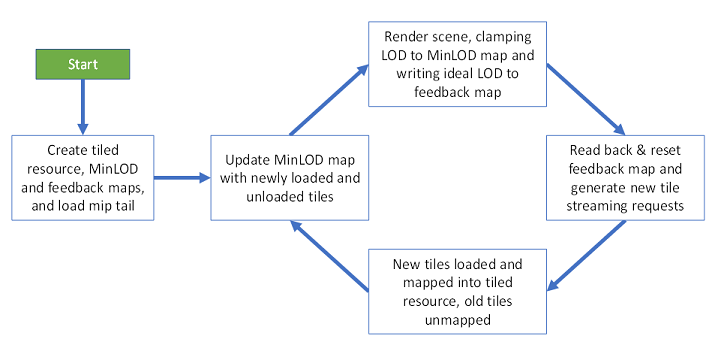
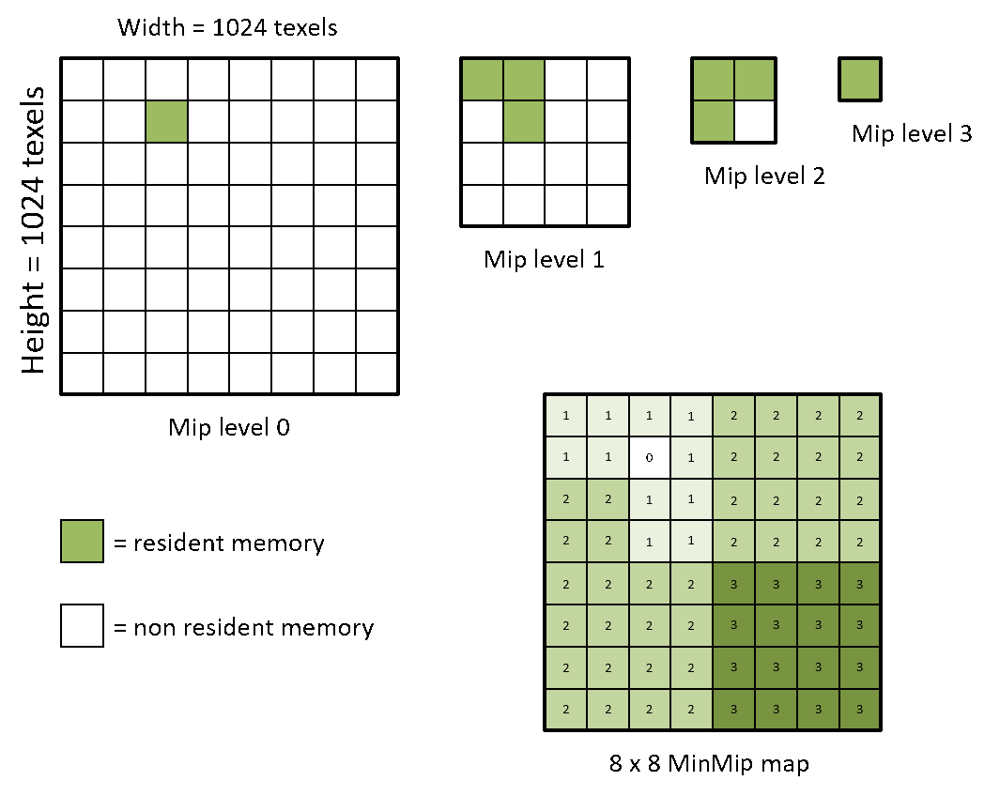
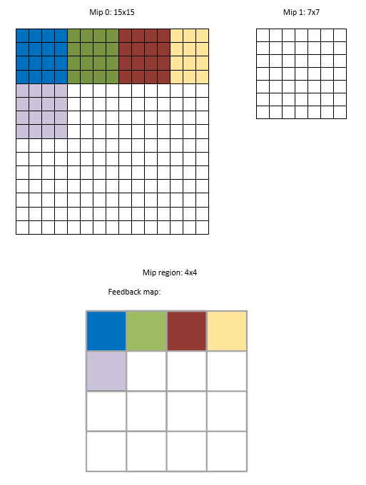
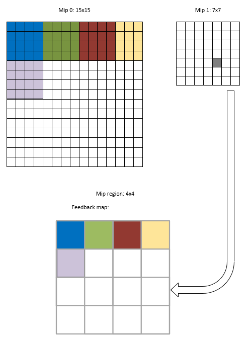
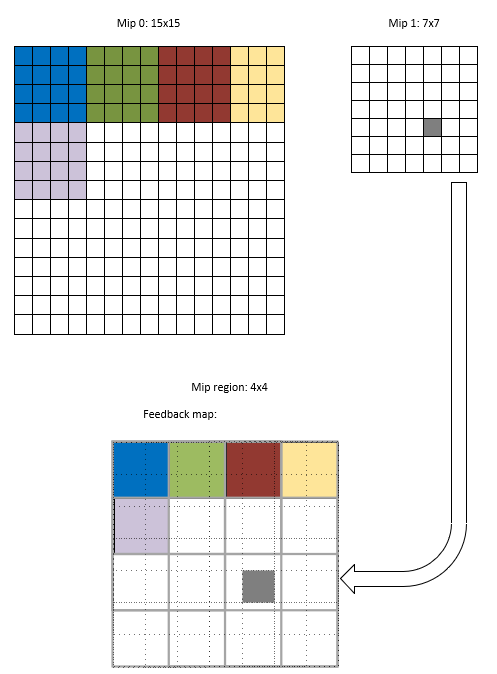
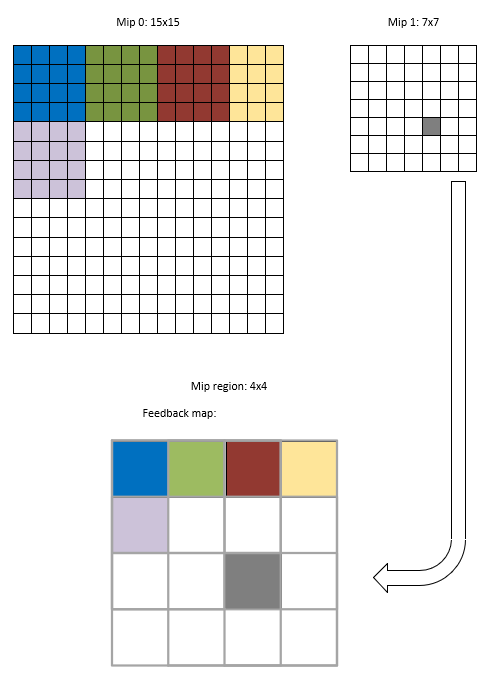

# Sampler Feedback

## About this document
This document describes a Direct3D 12 runtime feature.

## Overview
Sampler Feedback is a Direct3D feature for capturing and recording texture sampling information and locations. Without sampler feedback, these details would be opaque to the developer.

## Motivation
Sampler feedback is one feature with two distinct usage scenarios: streaming and texture-space shading.

### Streaming

Over time, there has been steady increase in display resolutions whereupon games are expected to be drawn at higher and higher resolutions. An expectation of high-resolution output brings about a need for high resolution textures, and with those, a high memory cost. In many situations it is not desirable or feasible to keep the most-detailed mips of all of a scene's textures in memory all at the same time.

The general process of loading texture data on-demand, rather than upfront-all-at-once, is called *texture streaming* in this document, or *streaming* for short.

It makes sense to use streaming in scenarios where only some of a texture's mips are deemed necessary for the scene. When new mips are deemed necessary-- for example, if a new object appears in the scene, or if an object has moved closer into view and requires more detail-- the application may choose to load more-detailed parts of the mip chain. 

There is a kind of Direct3D resource particularly suitable for providing control to applications under memory-constrained scenarios: *tiled resources*. To avoid the need to keep all most-detailed mips of a scene's textures in memory at the same time, applications may use tiled resources. Tiled resources offer a way to keep parts of a texture resident in memory while other parts of the texture are not resident.

> #### Note
> Specifically D3D12_TILED_RESOURCES_TIER_2 is recommended as a dependency for a workable streaming implementation; hardware tier 2 covers the ability to control tile residency, also the ability to straightforwardly clamp to resident mip levels when sampling.

Independently of whether sampler feedback is available, Direct3D12-based applications have, through tiled resources, the ability to progressively load the mip chain. There's also the status bit available through any sample which can be plugged in to CheckAccessFullyMapped so that the app can detect tile residency, and opportunities for streaming in more texture data.

However, the strategy of tiled resources + CheckAccessFullyMapped or other residency determination mechanisms, to detect and load non-resident tiles on demand has room for improvement. That's where sampler feedback comes in. Sampler feedback streamlines the process of writing out "ideal mip levels", since the detection of the "ideal mip level" and writing-it-out can be done all in one step, allowing the driver to optimize this process.

#### Terminology
Use of sampler feedback with streaming is sometimes abbreviated as *SFS*. It is also sometimes called *sparse feedback textures*, or *SFT*, or *PRT+*, which stands for "partially resident textures".

### Texture-Space Shading

Sometimes abbreviated as *TSS*, texture-space shading is a means of reducing some types of unappealing rendering artifacts-- for example, temporal instability of the way objects are lit-- during rendering. This is accomplished by de-coupling *shading of an object in world space* with *rasterization of the shape of that object to the final target*.

#### Without Sampler Feedback

For background, the general texture space shading algorithm does not require sampler feedback. The texture space shading process works like this:

1. Consider a 3-D object or 3-D scene element which should be shaded in texture space.

2. Allocate a target texture of suitable resolution for how close the object will tend to be relative to the camera.

3. Determine a scheme for mapping locations on the surface of that object, in world space, to areas of that target texture. Fortunately, real scenarios often have the notion of {U, V} co-ordinates per object, and a {U, V} unwrapping map to act as this scheme.

4. Draw the scene, targeting the target texture. For this pass, it may be desirable to simply run a compute shader instead of a conventional graphics render, using a pre-canned mapping of geometry-to-target-space with no notion of a "camera". This pass would be the pass in which expensive lighting operations are used.

5. Draw the scene once again, targeting the final target. The object is rasterized to the screen. Shading the object is a simple texture lookup which already contains the result of the scene's lighting computations. This is a far less expensive rendering operation compared to the previous step.

This is a two-pass algorithm. Sometimes the first pass is called the *shading pass* and the second one is called the *rasterization pass*. Technically both passes involve shading; the second is far, far less computationally expensive.

The *shading pass* consists primarily of lighting computations and does not strictly require rasterization. It can be performed by a graphics or compute operation.

A motive for this texture-space shading algorithm is the reduction in visual instability-over-time for shiny objects that are far away. Because lighting for objects is computed from a perspective of a close observer, the lighting results are likely to be temporally stable.

Another motive is the de-coupling of the lighting step from the rasterization step. Many lighting computations do not need to be re-computed frame-over-frame; there could be a real performance savings by computing lighting, say, every other frame, while the observable locations of objects in screen space are still updated every frame.

> #### Remark about VR scenario
> Texture shading with sampler feedback especially lends itself to VR scenarios, or *stereo* rendering, because the scene is to be drawn twice with a small change in camera displacement. It is likely that a given object can have its lighting-in-the-scene computed once, and the result used for both eyes' rendering. Alhough this technique is not perfectly optically realistic, it is likely to look acceptable in practice.

#### With Sampler Feedback

With the general texture-space shading algorithm described in the above section one challenge is, for the first pass, knowing which areas of the target texture to shade. Naively, one could shade the entire texture, but it could be expensive and often unnecessary. Perhaps, shading the entire texture would mean shading all facets of an object, even when only about half the facets can be viewed in the scene. Sampler feedback provides a means of reducing the cost of the *shading pass*.

Integration of sampler feedback with texture space shading means splitting up the first pass into two, yielding a three-pass algorithm if implemented straightforwardly. With sampler feedback, the texture-space shading operation would work like this:

Steps 1, through 3, are the same as in the above section.

4. Draw objects straightforwardly to the final target in screen space. For each object with which texture-space shading will be used, keep a *feedback map* of which areas of objects' target texture would be updated.

5. For objects with which texture-space-shading will be used, draw the scene targeting the objects' target texture. This pass would be the pass in which expensive lighting operations are used. But, do not shade areas of the target texture not included in the *feedback map*. 

6. Draw the scene once again, targeting the final target. The object is rasterized to the screen. Shading the object is a simple texture lookup which already contains the result of the scene's lighting computations.

The ability to skip shading operations in step 5 above comprises a performance savings made available by sampler feedback.

## Feature Support

Sampler feedback support is not required as part of a Direct3D feature level. 

Support for sampler feedback is queryable from a CheckFeatureSupport capability tier.

The tiers are organized as version-numbers-with-fractions as follows:
* TIER_NOT_SUPPORTED indicates sampler feedback is not supported. Attempts at calling sampler feedback APIs represent an error.
* TIER_0_9 (i.e., version 0.9) indicates sampler feedback is supported for samplers with these texture addressing modes:
    
    * D3D12_TEXTURE_ADDRESS_MODE_WRAP
    * D3D12_TEXTURE_ADDRESS_MODE_CLAMP 
* TIER_1_0 (i.e., version 1.0) indicates sampler feedback is supported for all texture addressing modes.

## How to adopt Sampler Feedback for Streaming

To adopt SFS, an application does the following:
* Use a tiled texture (instead of a non-tiled texture), called a reserved texture resource in D3D12, for anything that needs to be streamed.
* Along with each tiled texture, create a small "MinMip map" texture and small "feedback map" texture.
  * The MinMip map represents per-region mip level clamping values for the tiled texture; it represents what is actually loaded.
  * The feedback map represents and per-region desired mip level for the tiled texture; it represents what needs to be loaded.
* Update the mip streaming engine to stream individual tiles instead of mips, using the feedback map contents to drive streaming decisions. 
* When tiles are made resident or nonresident by the streaming system, the corresponding texture's MinMip map must be updated to reflect the
updated tile residency, which will clamp the GPU's accesses to that
region of the texture.
* Change shader code to read from MinMip maps and write to feedback maps. Feedback maps are written using special-purpose HLSL constructs.

> #### Remark
> There is an opportunity to use one clamp and feedback result for multiple textures, if several identically-sized textures are used and sampled together which all share the same structure and layout.

### Flowchart of streaming scenario
The flowchart below represents the data flow for SFS within an application:



## The MinMip Map
The MinMip map is used to ensure samples' mip levels are clamped to what is actually resident.

While the sampler feedback feature in general is suitable for both streaming and texture-space-shading scenarios, usage of the MinMip map as described in this section is suitable for just the **streaming** scenario.

### Not a Runtime Feature
The MinMip map section does not describe any particular functionality of runtime, or any constructs specifically geared for the purpose of making the MinMip map work.

What this section *does* describe is a recommended application practice for integration of sampler feedback for streaming.

### Structure and Format
While the application is free to choose how to represent MinMip map values, the examples presented in this document represent values in the MinMip map as unsigned integers.

> #### Terminology: Paired
> For a MinMip map to be called "paired" to a sampled resource, it means that the MinMip map is used in ways that correspond to that resource and represents most-detailed resident mips for that resource. 
> 
> A resource could be considered "paired" to more than one MinMip map, and a MinMip map could contain information for more than one resource. That is to say, pairing need not be exclusive. 

> #### Terminology: Mip Region
> Each texel in the MinMip map corresponds to an **mip region** of the paired resource. 
A **Mip region** is a 2D area over a resource whose dimensions are one tile or a multiple of the tile size. This terminology is used in this document to avoid ambiguous use of the word *tile*.

MinMip map textures, when decoded, do not have mip levels.

A MinMip map has the same resource dimensionality as the texture with which it is paired. For example, the MinMip map for an array texture with mipmaps is an array texture with one mip.

The width and height of a MinMip map will typically be smaller than the width and height of the texture it corresponds to. For example, it can be expressed as
```
  MinMipTex.width = PairedTex.width / MipRegion.width
  MinMipTex.height = PairedTex.height / MipRegion.height
```

> #### Remark
> Although the values in the MinMip map are presented as integers in this document, an application may choose to perform filtering to smoothly fade one mip into another. This filtering step may use computations involving fractional mip level depending on how the app chooses to do it.

### Typical Interpretation
A MinMip map is paired with a tiled texture.

The typical usage pattern is for each texel in the MinMip map to correspond to a **mip region** of the paired resource. As the paired resource is likely to be a reserved resource, it is likely that a 64KB-worth-of-data-sized mip region would be used, or a small multiple thereof.

Each texel in the MinMip map represents the highest-detail, lowest-value mip level that is fully resident in the tiled texture within that mip region.

For example, the figure below shows the 4 most detailed mipmaps in a 1024 x 1024 texture with a 4 byte per texel image format. The grid shows 64KB tiles. To the bottom right, a paired MinMip map is shown.

One texel of MinMip map corresponds to the size of one mip region- in this case, one 64KB tile in Mip level 0 of the tiled texture.



The structure of the MinMip map doesn't describe residency of individual mips in a mip chain. It indicates what is the most-detailed mip. For example, the value of 1 in the upper left corner entry of the MinMip map means for the top-left mip region, mip levels 1, 2, 3, … (up to the max mip level) are all resident.

> #### Note
> While the values and interpretation described in the previous section represent a reasonable implementation scheme, the system doesn't prevent apps from putting other numbers in the MinMip map or using other numbering schemes.

The values encoded in each texel of a MinMip map are unsigned integers and typically span the expected range of mip level values in the largest possible tiled resource. 

### Sampling from the MinMip map
Recall how passing a min-mip to a sampler will perform a clamp when sampling. There, the clamp is uniformly performed no matter where in the texture the sample ends up being. In a similar manner, the MinMip map decides clamping, too- just, the clamp value can vary per-mip-region.

During scene rendering, the app can choose to do the following (or, perhaps, some variation of its choosing): 
* Shader samples from the MinMip map
  * Use the same UV(W) texture coordinates used to sample from the tiled texture
* Get the filtered mip level value returned from MinMip map, called *X*
* Use *X* as a per-pixel mip level clamp value for sampling from the tiled texture. 

### Updating the MinMip map
When the application maps or unmaps a tile from the tiled resource, it's responsible for updating the MinMip map to reflect the change in mapping. This is done by writing a rectangle of updated entries in the MinMip map (either on the CPU or GPU), with the rectangle size corresponding to the coverage region of each mapping change.  

Loading a mip tile affects a variable number of MinMip map texels. The number of texels it affects depends on the mip level of the tile loaded. Supposing the typical case where a MinMip map has one texel per tile-of-the-source-texture-Mip0, then loading a mip 0 tile would mean updating one MinMip texel. Loading a mip 1 tile would mean updating 4 MinMip texels; loading a mip 2 tile would mean updating 16 MinMip texels, and so on.

In the figure in the Interpretation section above, updating the MinMip map for the mapping of the single mip 0 tile would entail at most one texel being updated, while updating the MinMip map for a single mip 2 tile would entail at most 16 (4x4) texels being updated.

## Feedback Maps

### They are a runtime feature
This section of the document describes a runtime feature specifically geared for representing and manipulating feedback maps.

### They are of an opaque format
The actual underlying storage of feedback maps may vary across GPUs and is opaque to the application. To get application-inspectable data from a feedback map, the application performs a *decode* step. This is discussed further below in the section "Opaque resource type for feedback maps".

> #### Terminology: Paired
> For a feedback map to be called "paired" to a sampled resource, it means that the feedback map contains sampler feedback for that resource.
> 
> When a feedback map is bound to a resource, the feedback map can not be used for writing feedback for other resources and the resource cannot be used with other feedback maps.
> 
> Outside of bindings, however, a resource may be used for writing feedback to different feedback maps and a single feedback map may be repurposed to contain feedback for different resources. That is to say, outside of bindings the pairing need not be exclusive.

> #### Terminology: mip region
> Each texel of a feedback map corresponds to a **mip region** of the paired texture.
> 
> In the case of sampler feedback for streaming, a **mip region** is likely to be a tile of the paired reserved, or *tiled* resource. 
> 
> In the case of using feedback for texture-space shading, the application would choose what is suitable. A small tile size would provide greater precision of feedback, while a larger tile size would allow a smaller memory cost of the MinMip map and feedback maps. 

### Mip region constraints
Each dimension of a mip region is
* a power-of-two number
* greater than or equal to 4
* less than or equal to half of the dimension of the most detailed mip of the paired texture.

The most fine-grained a mip region is allowed to be is 4x4 (four texels by four texels) in the paired 2D texture.

For example, for a 32x32 paired texture, mip regions of 16x16, 8x8, or 4x4 are allowed. Going with this example, asymmetric mip regions like 16x8 or 4x8 are also allowed. As another example, for an 100x100 paired texture, mip regions of 32x32, 16x16, 8x8, and 4x4 are allowed.

### Resource properties

Feedback maps can be committed or placed resources.

Feedback maps cannot themselves be tiled (reserved) resources.

Their dimension is TEXTURE2D.

Their width and height come from the paired resource.

They have a mip count which matches the resource with which they are paired.

They have an array size which matches the resource with which they are paired.

Their format is DXGI_FORMAT_SAMPLER_FEEDBACK_MIN_MIP_OPAQUE or DXGI_FORMAT_SAMPLER_FEEDBACK_MIP_REGION_USED_OPAQUE.

They are single-sampled; that is to say, they have sample count 1. They have sample quality 0.

Their layout is D3D12_TEXTURE_LAYOUT_UNKNOWN. The hardware implementation decides their layout.

They are created with the flag D3D12_RESOURCE_FLAG_ALLOW_UNORDERED_ACCESS.

### General interpretation and usage
Values in a sampler feedback map represent the choice of which mips have been requested. 

The application updates the feedback map against which mips are being requested. The semantics for updating are similar to performing a texture sample. The updating doesn't require any deep understanding, on the part of the application, of where the texture sampler is going to read from or what the filtering scheme is.

### Feedback values
Meaningful values for sampler feedback are obtained through *transcoding*, described further below. The interpretations of values depend on whether the feedback map is *MinMip* type or *MipRegionUsed* type, described further below.

### Packed mips behavior
If the paired texture is a tiled resource with packed mips, feedback writes involving the packed mips don't behave differently from non-packed mips. 

### Zero-weight reads
In some cases, a filtering mode may involve a computation with multiple texture reads where some of the reads are zero-weight (i.e., are multiplied by zero). 

These zero-weight reads may cause feedback to be written to the feedback map, or they may not, depending on the graphics hardware's implementation of the sampler.

### Paired resource must be single-sampled
Sampler feedback can not be used with a paired resource with sample count greater-than-one. This restriction is related to the fact that there isn't a way to call Sample on those resources.

### Conservative behavior under anisotropic filtering without mips
If anisotropic filtering is used and the sampled texture has mip count 1, feedback writes may include "false positives"- that is, conservative behavior.

>#### Remark
> Applications seeking to avoid conservative behavior may choose to circumvent it by allocating the affected anisotropic-filtered textures with mip count greater than one.

### Null feedback map binding is permitted
Feedback map UAVs may be created against a NULL paired texture. If shader code involves writes to a feedback map, but the feedback's shader bind name either
* is not bound to any descriptor, or
* is bound to a feedback UAV descriptor, but the descriptor was created using a NULL paired texture

then the writes have no effect.

### Clearing

When a feedback map is said to be "cleared", it does not have feedback written for any mip. Generally, applications can clear feedback maps using a command list API.

If the implementation's interpretation of a cleared feedback map is equivalent to all-zero allocations for the resource, and the resource has not been created with the D3D12_HEAP_FLAG_CREATE_NOT_ZEROED flag, then it can be said that "committed feedback maps are created cleared".

Placed feedback maps have undefined contents upon creation. To clear them, applications can use a clear or discard command list API.

### Two choices

There are two different implementations of feedback maps, and the application choose between the two implementations upon creating the maps. The two choices are MinMip feedback map, and MipRegionUsed feedback map.

#### MinMip feedback map

##### Structure
MinMip feedback maps, when decoded, do not have mip levels.

##### Interpretation

Each texel in the MinMip feedback map corresponds to a mip region of the paired texture.

The value of each texel is the most-detailed mip level that has been requested within the mip region, with no mip level clamping applied. Put another way, each texel’s value is the “ideal” most-detailed mip level that would have been used for that region.

##### Subtracting feedback, or force-clearing to "no mip" through shader code
The feedback-writing HLSL constructs presented in this document do not expose ways "subtracting feedback", e.g., performing writes that convey no mip has been requested. Instead, a clearing API in the form of ClearUnorderedAccessViewUint is used to clear feedback maps, or encode may be used to explicitly set feedback maps' values.

##### Initializing
The application is free to initialize the feedback map as it sees fit, either through shader code or transcoding, discussed a bit further on.

##### Sampling and updating

Hardware samples with and updates a MinMip feedback map by:

1.	Using the texture coordinates, paired texture and the app's sampler state for sampling the paired texture, a sampling pattern (list of one or more sample locations) is established by the hardware.

2.	For each sample in the sampling pattern, the fractional mip level is computed, using the normalized texture coordinates of the sample, the gradients, and the dimensions of the paired texture.

3.	For each sample, the normalized texture coordinates of the sample location is converted into absolute integer texel coordinates against the feedback map. The mip level of the sample is encoded and written into the feedback map using an atomic minimum operation. A rough approximation of the MinMip feedback map operation in HLSL would resemble the following code, for a trivial sample pattern:
```
    float IdealMipLevel = TiledTexture.CalculateLevelOfDetail(TiledTextureSampler, TexCoord);

    uint2 FeedbackMapCoords;
    FeedbackMapCoords.x = (uint)(TexCoord.x * FeedbackMapDimensions.x);
    FeedbackMapCoords.y = (uint)(TexCoord.y * FeedbackMapDimensions.y);
    InterlockedMin(FeedbackMap[FeedbackMapCoords], IdealMipLevel);
```
The feedback map sampling operation is unique in that it starts as a texture sampling operation against the paired texture, and then after texture addressing is complete, the sample locations are converted into UAV atomic operations against the feedback map instead of proceeding to texture fetch and filter against the paired texture.

>#### Remark
>The above example indicates a trivial sample pattern for illustrative purposes. In practice, applications are likely to use more complicated sample patterns. Complicated sample patterns is where the usefulness of sampler feedback really becomes clear. Manually emulating the complex sample pattern of an anisotropic texture filter, for example, is difficult.

>#### Remark
>Although it's straightforward to describe sampling and updating the feedback map as if it's a pass all on its own, apps can certainly integrate it as part of scene rendering.

##### Typical application usage for streaming

The application can periodically inspect and reset each MinMip feedback map to gather information about which regions of each streamable tiled texture must change. The interval could be as often as once per frame.

The “default” or "initial" value set by the app of each entry in a MinMip feedback map can be anything the app wants. Most logically, it'd be the mip level value that is always guaranteed to be resident in the streamable tiled texture, assuming nonresidency wasn't made possible. Typically this would be the smallest mip level present on storage, or the base mip level of the packed mip tail (if present), but an application's content pipeline design could establish any mip level as the “always resident” level.

As the MinMip feedback map is updated during scene rendering, mip level values smaller than the reset value may appear in the feedback map. At the conclusion of the frame, or some other chosen interval, the app reads back the contents of the MinMip feedback map and resets each of its entries to the default value. Scene rendering for the next frame/interval can proceed at this point.

Using the feedback values read back to the CPU, the app compares the minimum mip level value captured in each region to the set of tiles that are currently loaded for the tiled texture. 
* Values smaller than the currently loaded tiles’ mip level at a region invoke new load requests and the data for those tiles is streamed in.  
* Values larger than the currently loaded mip level at a region might invoke unload requests after a certain period of time has elapsed. 

To re-claim no-longer-needed memory, the texture streaming engine could maintain a “last referenced” timestamp for each tracked tile, so that tiles with timestamps older than a certain value can be considered outdated and no longer needed. 

##### Circumstances where one paired texture texel might correspond to multiple feedback texels
This section describes a possibility of conservative behavior for feedback involving the least-detailed mips of the paired texture, depending on the hardware implementation.

For a given paired texture and mip region, all mips numbered N where
* PairedMipNWidth < PairedMip0Width / MipRegionWidth, or
* PairedMipNHeight < PairedMip0Height / MipRegionHeight

are called the set of *small tail mips* for purposes of this section.

When writing feedback for *small tail mip* M, hardware may write either
* M, or
* The lowest-indexed *small tail mip*.

For example, consider a 1024x1024 paired texture with a full mip chain. 
Its mips are sized {1024x1024, 512x512, 256x256, 128x128, 64x64, 32x32, 16x16, 8x8, 4x4, 2x2, 1x1}, indexed 0 through 10 inclusive.
Suppose the mip region is 16x16.

In that case,

PairedMip0Width / MipRegionWidth = 1024 / 16 = 64; similarly for the height.

The mips can be described as follows

| Mip level | Size | Small tail mip? | Feedback mip level result |
|:-|-|:--|--|
|0 |1024x1024 | N | 0 |
|1 |512x512| N | 1 |
|2 |256x256| N | 2 |
|3 |128x128| N | 3 |
|4 |64x64| N | 4 |
|5 |32x32| Y | 5 |
|6 |16x16| Y | 5, or 6 |
|7 |8x8| Y | 5, or 7 |
|8 |4x4| Y | 5, or 8 |
|9 |2x2| Y | 5, or 9 |
|10 |1x1| Y | 5, or 10 |

The *small tail mips* are the set of mips less-detailed than 64x64, namely those mips of size {32x32, 16x16, 8x8, 4x4, 2x2, 1x1}, indexed 5 through 10 inclusive.


Therefore in this example, feedback writes for mips indexed 6 through 10 may cause 5 to be written to the feedback map. To put it another way, a more-detailed-mip-than-requested may be written to the feedback map in circumstances where one paired texel might correspond to multiple feedback texels.

#### MipRegionUsed feedback map

##### Structure
A MipRegionUsed feedback map has a structure with mip levels. A texel in mip N refers to a mip region in mip N of the paired texture.

Each texel's value holds a boolean true or false value that indicates the desired status of that region in the paired texture. 

The boolean value, in the transcoded R8_UINT format with one byte per texel, is represented as **255**, or **0xFF** for true and **0x0** for false.

##### Initializing
The application is free to initialize the feedback map as it sees fit, either through shader code or transcoding, discussed a bit further on.

##### Sampling and updating

Hardware samples and updates a MipRegionUsed feedback map as follows (in steps that may not occur in the exact factoring described, but are functionally equivalent):

1.	Using the texture coordinates, paired texture and the app's sampler state (e.g., filtering mode) for sampling the paired texture, a sampling pattern (list of one or more sample locations) is established by the hardware.

2.	For each sample in the sampling pattern, one or two integer mip levels are computed, using the normalized texture coordinates of the sample, the gradients, and the dimensions of the paired texture.

3.	For each sample, the feedback map absolute integer texel coordinates are computed corresponding to the normalized texture coordinates & integer mip level of the sample at each of the sample’s mip levels. The hardware’s native swizzling pattern could be used for the feedback map. A “true” value is atomically OR-ed into the feedback map texel.

##### Application usage

MipRegionUsed feedback maps provide similar data back to the app's streaming code as MinMip feedback maps, but in a different layout and encoding. 

MipRegionUsed feedback maps contain boolean “hit or miss” values for each region of each mip level, and can be individually addressed as such. 

Developers choose whether MinMip feedback maps or MipRegionUsed feedback maps would be most optimal for their needs. While only one type of feedback map can be in use at a time for each resource, both types could be freely mixed together within the same scene.

#### Comparison of MinMip Feedback Map and MipRegionUsed Feedback Map
A MipRegionUsed feedback map contains strictly more information than a MinMip feedback map:
* A MipRegionUsed feedback map conveys what can be thought of as a "bitfield of mip levels". 
* A MinMip feedback map conveys an "index of the rightmost-set bit in that bitfield of mip levels".

Strictly speaking, it'd be possible to derive a MinMip feedback map from a MipRegionUsed feedback map. That said, the process would be a bit cumbersome. Both map types have some usefulness. Both are provided as Direct3D12 constructs.

For *streaming*, applications may use a MinMip feedback map because the streaming system can load the most-detailed requested mip, and not the intermediate mip levels.

For *texture-space-shading*, or other related applications, exact knowledge of "which mip levels were requested" could be used to drive decisions about how to shade the scene.

### Performance and Stochastic Update of Feedback Maps
Recall how a feedback map entry represents a mip region of texels in the paired resource, not a single texel. In typical scene rendering, when samples come from closely-spaced-together UV coodinates, the written feedback can be redundant. Redundancy is exacerbated as the mip region size increases.

Given the possibility of wasteful redundancy, it is critical that the operation to update the feedback map does as much coalescing of redundant values as possible before going through with the feedback map write. With this in mind, reducing the sheer quantity of feedback map operations by stochastic methods (e.g., random discard) may be worth pursuing by applications in their shader code.

>#### Remark
>Experimental results have shown that discarding over 99% of feedback map updates can still provide enough reliable data to the app. A discard heuristic approach is not proposed as a runtime/compiler feature in this document but would be a possible implementation idea for the app developer.

### Permitted binding
A descriptor for a feedback map corresponds to the appropriate HLSL type, e.g., FeedbackTexture2DMinMip, described more in the sections below.

A feedback map cannot be bound as a typical UAV; it is not eligible for the general-purpose reads and writes normally available with typical UAVs. Instead, it is bound as a special-purpose UAV with a special-purpose API.

### Permitted resource states
Feedback maps are compatible with
* COMMON state, from which implicit state transitions may occur, described below
* UNORDERED_ACCESS_VIEW state to be used for feedback
* RESOLVE_SOURCE or RESOLVE_DEST to be used with transcoding
* COPY_SOURCE or COPY_DEST to be used with copying.

Sampler feedback resources do not have any special implications for implicit state transition (i.e., state "promotion" and "decay"). Sampler feedback resources are allowed to be flagged as SIMULTANEOUS_ACCESS. This means that, for example, a SIMULTANEOUS_ACCESS sampler feedback resource in COMMON state may be promoted to COPY_SOURCE or COPY_DEST when used for copying. Or, if it is SIMULTANEOUS_ACCESS and in COMMON state, for example, it could be promoted to RESOLVE_SOURCE or RESOLVE_DEST when used with transcoding.

### Copying
Applications can copy feedback maps using CopyResource.

Copying feedback maps using CopyTextureRegion is not supported.

### Transcoding
Feedback maps are transcoded to and from an application-usable format using the API ResolveSubresourceRegion with resolve modes D3D12_RESOLVE_MODE_ENCODE_SAMPLER_FEEDBACK and D3D12_RESOLVE_MODE_DECODE_SAMPLER_FEEDBACK.

Independently of sampler feedback, the semantics for ResolveSubresourceRegion are that it effectively operates on a source and dest rect of the same size. These rectangles are specified in a co-ordinate system. 

When performing transcode operations involving a sampler feedback resource, the co-ordinate space for these source and dest rects, in all cases, is the co-ordinate space of the *decoded* resource, not the opaque resource.

ResolveSubresourceRegion can transcode one subresource at a time, or the whole subresource. To transcode one subresource at a time, specify source and dest subresource indices. To transcode the whole resource, specify UINT_MAX as the source and dest subresource indices.

Applications can transcode all subresources using UINT_MAX subresource indices, or use sub-rectangle semantics, but not both at the same time.

#### Compatible transcode resources

##### General semantics

When transcoding an opaque feedback resource to or from a non-opaque one, the non-opaque resource has the following properties:
* It is dimension TEXTURE2D.
* For a feedback map of texture size {FeedbackWidth, FeedbackHeight}, and mip region of {MipRegionWidth, MipRegionHeight}
  * It has a width of at least ceil(FeedbackWidth / MipRegionWidth).
  * It has a height of at least ceil(FeedbackHeight / MipRegionHeight).
* It has the same DepthOrArraySize of the feedback resource.
  * If the feedback resource is of MIN_MIP type, it has mip count 1.
  * If the feedback resource is of MIP_REGION_USED type, it has the mip count of the paired resource. 
    * There may be a requirement of padding the transcode resource in order to have the necessary number of mips.
* It has format DXGI_FORMAT_R8_UINT.
* It, like the feedback texture, has sample count 1, sample quality 0.

The following properties are free to be decided by the application for its purposes: 
* alignment
* flags
* allocation type (e.g., commited, placed or reserved).

##### Additional semantics for encoding and decoding MinMip feedback maps

The above *general semantics* work for all feedback in general; this section describes one additional way to encode and decode feedback for non-arrayed MinMip feedback resources (that is, a feedback resource of array size 1).

When transcoding to or from an opaque MinMip feedback resource, the non-opaque resources has the following properties:
* It is a BUFFER.
* For a feedback map of texure size {FeedbackWidth, FeedbackHeight}
  * It has a size of at least FeedbackWidth * FeedbackHeight.
* It, like all buffers, has format DXGI_FORMAT_UNKNOWN.
* It, like all buffers, has sample count 1, sample quality 0.

##### Deciding whether to trancode MinMip feedback maps to a texture or buffer

Applications may choose to decode to a texture if subsequent operations need to operate on a texture; especially if they require preservation of mip structure. Alternatively, applications may choose to decode to a buffer if direct CPU readback is desired.

#### Transcode resources and padding
A resource used with transcoding may have padding compared to what is strictly required to store feedback. 

When transcoding using a non-opaque texture, if the subresource of the transcode resource is larger than necessary, the unused padding is located at the right and bottom. That is to say, when a resource used for transcoding is larger than necessary, the start of the data is locked to the top-left corner.

When transcoding using a non-opaque buffer, if the buffer is larger than necessary, the unused padding is located at the end. That is to say, if the buffer is larger than necessary, then the start of the data is locked to the start of the buffer.

>#### Remark about possible future extension to transcode
>A possible convenience to offer applications would be to allow a transcode to R32_UINT or R32_G32_UINT, yielding a bitmask of requested mips.

#### Encoding cleared feedback
With a MinMip feedback map, encoding a value of 0xFF is taken to mean "no feedback is requested" for that mip region.

With a MipRegionUsed feedback map, encoding values of 0x0 is taken to mean "no feedback is requested" for a given mip level and mip region.

#### Transitivity for MipRegionUsed feedback maps
If an application
* has opaque feedback map A 
* decodes A into to a non-opaque resource B
* encodes B into feedback map C

then A and C contain equivalent feedback.

If an application
* has non-opaque resource A
* encodes A into a feedback map B
* decodes B into resource C

then A and C contain the same data.

Note that this section describes MipRegionUsed feedback maps. Transitivity is not guaranteed for MinMip feedback maps in general. 

This is related to the conservative behavior of sampler feedback: for example, suppose you're encoding a MinMip feedback map with 5 mips, and the last paired mip is size 1x1.
  * The source buffer you encode contains no mip (0xff) everywhere except a single texel containing index 4. 
  * When you decode that feedback, there won't be any feedback which points to no mip (0xff). All the returned mip levels contained in the resulting buffer will be 4. 
  
The conservative behavior of sampler feedback in general is mentioned here, because take the example above: but instead of encoding you're simply writing feedback. Something somewhere tries to load the tail mip. When you decode that feedback, all returned mip level values will contain a number <= 4. You get the most amount of precision for mip zero, but lower levels of precision for mips thereafter.

### Feedback maps for texture arrays
Feedback maps for paired texture arrays are supported, but the feedback map and the paired texture array need to have the same array size.

### Heap serialization of feedback maps
Feedback maps are eligible for heap serialization on platforms that support it (i.e., heap serialization tier greater than D3D12_HEAP_SERIALIZATION_TIER_0). Applications can serialize and de-serialize feedback maps' contents using CopyResource, and forego transcoding if the GPU and driver stay consistent and they do not wish to understand the feedback maps' contents.

### Example of non-power-of-two feedback maps behavior

This section describes transcoded feedback maps of non-power-of-two sizes, given the fact that mip regions are required to be a power-of-two and may not fit neatly along texel boundaries.

To re-iterate the purpose of a *mip region*-- each texel in a feedback map can be thought of corresponding to a *mip region* of texels in the paired texture. For example, if the mip region is 4x4, each texel in the feedback map can be thought of corresponding to a 4x4 region in the paired texture- 16 pixels in total. The mip region describes the granularity of information stored in the feedback map. The Direct3D sampler feedback feature requires all mip regions to be powers of two. 

When the hardware is deciding where in the feedback map to write feedback, it needs to perform a co-ordinate mapping. That mapping is trivial for pow2, but requires some spelling-out for non-pow2.

Consider a mip region size of 4x4, with a 15x15 paired texture that has two mips. For this, a 4x4 feedback map (in transcoded space) is used. Suppose the feedback map already had some data written to it:



In this figure, blue feedback map texels indicate they came from a sample of the blue region of the paired texture, and so on for different colors.

Suppose that there was feedback that needed to be written for a sample at mip level 1:



In this case, a “grid” should be considered spacially projected over-top of the feedback map, to determine the co-ordinate (i.e., in transcoded space) of where to write the feedback.




Feedback is written to the appropriate spot.

 

In this way, there is predictability of where feedback will be written for non-power-of-two texture cases.

## Batch Processing of Feedback and MinMip Resources

MinMip and feedback maps are expected to be very small in size – typically less than 1 KB, and commonly in the range of 256 – 512 bytes. Using many individual small-sized resources can pose two problems:
* Direct3D 12's alignment rules favor texture alignments significantly larger than these sizes.
* Peforming many clears and copies on one resource at a time can incur unwanted CPU overhead.

To increase efficiency, applications may choose to organize same-size and suitably-compatible textures into an array, and allocate feedback and MinMip maps into corresponding texture arrays that are divided up with a suballocator. 

For feedback maps, an app would manage a small number of opaque texture array resources (each with unique XY dimensions and hundreds of slices), and views of the subresources. Each subresource is associated with one feedback map. That way, the size and packing of the feedback map memory takes advantage of hardware’s efficient packing of array slices.

## Summary of required Direct3D constructs

This section describes the API constructs which allow developers to use sampler feedback.

### Existing Tiled Resources support

Tiled resources are pertinent for using sampler feedback for streaming.

The core of SFS is the existing support for tiled resources, including tiled textures (i.e., reserved resources), tile pools (i.e., ID3D12Heap objects), and the GPU timeline tile mapping and copy APIs on the D3D12 command queue and command list.

### Opaque resource type for feedback maps

The exact implementation of feedback maps-- both MinMip and MipRegionUsed variants-- is hardware specific. The exact encoding of the values within feedback maps may vary depending on hardware implementation and is opaque to the application. 

The runtime validates broad restrictions of the feedback map and provides a narrow set of ways in which it can be used.

This document describes APIs for 
* creating feedback maps, and
* moving data in and out of these opaque resources to standardized layouts which can be used regardless of hardware.

To create a feedback map and its UAV descriptor, two sets of resource dimensions are provided to the driver.  The feedback map itself has dimensions (e.g., something small like 16 x 16), and the sampled texture it will provide sampler feedback against (e.g., something like 4096 x 4096).

The opaque resource creation API takes information from the resource description corresponding to the feedback map itself, and creates an “unbound” opaque feedback map resource.  Then a feedback-map specific API is used for creating the feedback map UAV descriptor. This view creation API takes the resource pointer to the feedback map as well as information from the resource description of the sampled texture. The information is bound together at view descriptor creation time.

Because the encoding of the feedback map is opaque to the application, APIs exist to copy data into and out of the opaque resource in a standardized way.

### HLSL constructs for writing to feedback maps

In a later section, this document describes HLSL object types for feedback maps, with methods for writing sampler feedback to them.

## API
```
enum D3D12_FEATURE
{
    // ...
    D3D12_FEATURE_D3D12_OPTIONS7,
};

enum D3D12_SAMPLER_FEEDBACK_TIER
{
    D3D12_SAMPLER_FEEDBACK_TIER_NOT_SUPPORTED = 0,
    D3D12_SAMPLER_FEEDBACK_TIER_0_9 = 90,
    D3D12_SAMPLER_FEEDBACK_TIER_1_0 = 100
};

struct D3D12_FEATURE_DATA_D3D12_OPTIONS7
{
    // ...
    D3D12_SAMPLER_FEEDBACK_TIER SamplerFeedbackTier;
    // ...
};
```
Checking for support looks like:

```
    D3D12_FEATURE_DATA_D3D12_OPTIONS7 options = {};
    CHECK_HR(d3dDevice->CheckFeatureSupport(D3D12_FEATURE_D3D12_OPTIONS7, &options, sizeof(options)));
    bool bSamplerFeedbackSupported = (D3D12_SAMPLER_FEEDBACK_TIER_NOT_SUPPORTED != options.SamplerFeedbackTier);
```
This structure exists:

```
struct D3D12_MIP_REGION
{
    UINT Width;
    UINT Height;
    UINT Depth;
};

```

> #### Note
> The Depth field of D3D12_MIP_REGION exists for future proofing and extension purposes. In the implementation described in this document, applications always set Depth to 0, or equivalently to 1 when sampler feedback is used.


The following two new DXGI_FORMAT enumeration values exist:
```
typedef enum DXGI_FORMAT
{
    ...
    DXGI_FORMAT_SAMPLER_FEEDBACK_MIN_MIP_OPAQUE = 189,
    DXGI_FORMAT_SAMPLER_FEEDBACK_MIP_REGION_USED_OPAQUE  = 190,
    ...
}
```

For reference, the resource description struct, without any capabilities of describing sampler feedback, is:
```
struct D3D12_RESOURCE_DESC
{
    D3D12_RESOURCE_DIMENSION Dimension;
    UINT64 Alignment;
    UINT64 Width;
    UINT Height;
    UINT16 DepthOrArraySize;
    UINT16 MipLevels;
    DXGI_FORMAT Format;
    DXGI_SAMPLE_DESC SampleDesc;
    D3D12_TEXTURE_LAYOUT Layout;
    D3D12_RESOURCE_FLAGS Flags;
};
```

Sampler feedback maps is described through a revision of the resource description struct defined as follows:

```
struct D3D12_RESOURCE_DESC1
{
    D3D12_RESOURCE_DIMENSION Dimension;
    UINT64 Alignment;
    UINT64 Width;
    UINT Height;
    UINT16 DepthOrArraySize;
    UINT16 MipLevels;
    DXGI_FORMAT Format;
    DXGI_SAMPLE_DESC SampleDesc;
    D3D12_TEXTURE_LAYOUT Layout;
    D3D12_RESOURCE_FLAGS Flags;    
    D3D12_MIP_REGION SamplerFeedbackMipRegion;
};

```

The device and resource interfacse have been revised to be compatible with the revised resource description struct.

```

    MIDL_INTERFACE("728f1fa2-ea11-4a9f-9b52-9b42a484d5c9")
    ID3D12Device8 : public ID3D12Device7
    {
    public:
        virtual D3D12_RESOURCE_ALLOCATION_INFO STDMETHODCALLTYPE GetResourceAllocationInfo2( 
            UINT visibleMask,
            UINT numResourceDescs,
            _In_reads_(numResourceDescs)  const D3D12_RESOURCE_DESC1 *pResourceDescs,
            _Out_writes_opt_(numResourceDescs)  D3D12_RESOURCE_ALLOCATION_INFO1 *pResourceAllocationInfo1) = 0;
        
        virtual HRESULT STDMETHODCALLTYPE CreateCommittedResource2( 
            _In_  const D3D12_HEAP_PROPERTIES *pHeapProperties,
            D3D12_HEAP_FLAGS HeapFlags,
            _In_  const D3D12_RESOURCE_DESC1 *pDesc,
            D3D12_RESOURCE_STATES InitialResourceState,
            _In_opt_  const D3D12_CLEAR_VALUE *pOptimizedClearValue,
            _In_opt_  ID3D12ProtectedResourceSession *pProtectedSession,
            REFIID riidResource,
            _COM_Outptr_opt_  void **ppvResource) = 0;
        
        virtual HRESULT STDMETHODCALLTYPE CreatePlacedResource1( 
            _In_  ID3D12Heap *pHeap,
            UINT64 HeapOffset,
            _In_  const D3D12_RESOURCE_DESC1 *pDesc,
            D3D12_RESOURCE_STATES InitialState,
            _In_opt_  const D3D12_CLEAR_VALUE *pOptimizedClearValue,
            REFIID riid,
            _COM_Outptr_opt_  void **ppvResource) = 0;
        
        virtual void STDMETHODCALLTYPE CreateSamplerFeedbackUnorderedAccessView( 
            _In_opt_  ID3D12Resource *pTargetedResource,
            _In_opt_  ID3D12Resource *pFeedbackResource,
            _In_  D3D12_CPU_DESCRIPTOR_HANDLE DestDescriptor) = 0;
        
        virtual void STDMETHODCALLTYPE GetCopyableFootprints1( 
            _In_  const D3D12_RESOURCE_DESC1 *pResourceDesc,
            _In_range_(0,D3D12_REQ_SUBRESOURCES)  UINT FirstSubresource,
            _In_range_(0,D3D12_REQ_SUBRESOURCES-FirstSubresource)  UINT NumSubresources,
            UINT64 BaseOffset,
            _Out_writes_opt_(NumSubresources)  D3D12_PLACED_SUBRESOURCE_FOOTPRINT *pLayouts,
            _Out_writes_opt_(NumSubresources)  UINT *pNumRows,
            _Out_writes_opt_(NumSubresources)  UINT64 *pRowSizeInBytes,
            _Out_opt_  UINT64 *pTotalBytes) = 0;        
    };

       
    MIDL_INTERFACE("BE36EC3B-EA85-4AEB-A45A-E9D76404A495")
    ID3D12Resource2 : public ID3D12Resource1
    {
    public:
        virtual D3D12_RESOURCE_DESC1 STDMETHODCALLTYPE GetDesc1( void) = 0;
        
    };
```

There is a D3DX helper structure for the revised resource description struct.

```
struct CD3DX12_RESOURCE_DESC1 : public D3D12_RESOURCE_DESC1
{
    CD3DX12_RESOURCE_DESC1() = default;
    explicit CD3DX12_RESOURCE_DESC1( const D3D12_RESOURCE_DESC1& o ) :
        D3D12_RESOURCE_DESC1( o )
    {}
    CD3DX12_RESOURCE_DESC1( 
        D3D12_RESOURCE_DIMENSION dimension,
        UINT64 alignment,
        UINT64 width,
        UINT height,
        UINT16 depthOrArraySize,
        UINT16 mipLevels,
        DXGI_FORMAT format,
        UINT sampleCount,
        UINT sampleQuality,
        D3D12_TEXTURE_LAYOUT layout,
        D3D12_RESOURCE_FLAGS flags,
        UINT samplerFeedbackMipRegionWidth = 0,
        UINT samplerFeedbackMipRegionHeight = 0,
        UINT samplerFeedbackMipRegionDepth = 0)
        ...

    // Similar methods as CD3DX12_RESOURCE_DESC
};
```

Use the revised CreateCommittedResource or CreatePlacedResource to create a feedback resource.
```
    // Populate some fields directly from the paired resource.
    D3D12_RESOURCE_DESC feedbackResourceDesc{};
    feedbackResourceDesc.Width = pairedDesc.Width;
    feedbackResourceDesc.Height = pairedDesc.Height;
    feedbackResourceDesc.MipLevels = pairedDesc.MipLevels;
    feedbackResourceDesc.DepthOrArraySize = pairedDesc.DepthOrArraySize;

    // Populate fields based on usage constraint
    feedbackResourceDesc.Dimension = D3D12_RESOURCE_DIMENSION_TEXTURE2D;
    feedbackResourceDesc.SampleDesc.Count = 1;
    feedbackResourceDesc.SampleDesc.Quality = 0;
    feedbackResourceDesc.Layout = D3D12_TEXTURE_LAYOUT_UNKNOWN;
    feedbackResourceDesc.Flags = D3D12_RESOURCE_FLAG_ALLOW_UNORDERED_ACCESS;

    // Set format based on desired sampler feedback type
    feedbackResourceDesc.Format = useMinMipRepresentation? DXGI_FORMAT_SAMPLER_FEEDBACK_MIN_MIP_OPAQUE : DXGI_FORMAT_SAMPLER_FEEDBACK_MIP_REGION_USED_OPAQUE;

    // Set desired mip region
    feedbackResourceDesc.SamplerFeedbackMipRegion = D3D12_MIP_REGION{ 8, 8, 1 };

    CComPtr<ID3D12Resource> feedbackTexture;
    spDevice->CreateCommittedResource2(
        &defaultHeapProperties,
        D3D12_HEAP_FLAG_NONE,
        &feedbackResourceDesc,
        D3D12_RESOURCE_STATE_UNORDERED_ACCESS,
        nullptr, // clear value
        IID_PPV_ARGS(&feedbackTexture));
```


As for binding- this API exists, for creation of the suitable descriptor:
```
HRESULT ID3D12Device8::CreateSamplerFeedbackUnorderedAccessView(
        ID3D12Resource* pairedResource,
        ID3D12Resource* feedbackResource,
        D3D12_CPU_DESCRIPTOR_HANDLE dest)
```

Example usage:

```
    // D3D12_CPU_DESCRIPTOR_HANDLE compatibleDestDescriptor comes from heap type CBV_SRV_UAV
    
    CHECK_HR(d3dDevice->CreateSamplerFeedbackUnorderedAccessView(
        texture, 
        feedbackTexture,
        compatibleDestDescriptor));
```

Implicitly, this is a descriptor for ViewDimension2D with an appropriate format; mip slice and plane slice are abstracted away.

Suppose a root parameter binds u3 to compatibleDestDescriptor's heap. In shader code, you could have something like

```
    Texture2D<float4> g_texture : register(t0);

    SamplerState g_sampler : register(s0);
    FeedbackTexture2D<SAMPLER_FEEDBACK_MIP_REGION_USED> g_feedback : register(u3);
    
    float4 PSMain(VSIn in) : SV_TARGET
    {
        float2 uv = in.uv;
        g_feedback.WriteSamplerFeedback(g_texture, g_sampler, uv);
        ...
```

Or, more specifically for SFS, something like

```
...
Texture2D<uint> g_residentMinMip : register(t1);

float4 PSMain(VSIn in) : SV_TARGET
{
        float2 uv = in.uv;

        // Optional step for SFS:
        uint minMip = g_residentMinMip.Sample(g_sampler, uv);

        int2 offset = int2(0, 0);
        g_texture.Sample(g_sampler, uv, offset, minMip ); 
        
        // Use for driving streaming decision
        g_feedback.WriteSamplerFeedback(g_texture, g_sampler, uv);
        ...
```

For transcoding to and from non-feedback resources, ID3D12GraphicsCommandList1::ResolveSubresourceRegion is used.

There are two resolve modes
```
enum D3D12_RESOLVE_MODE
{
    // ...
    D3D12_RESOLVE_MODE_ENCODE_SAMPLER_FEEDBACK,
    D3D12_RESOLVE_MODE_DECODE_SAMPLER_FEEDBACK
};
```

used like
```
cl->ResolveSubresourceRegion(readbackResource, 0, 0, 0, feedbackTexture, 0, nullptr, DXGI_FORMAT_R8_UINT, D3D12_RESOLVE_MODE_DECODE_SAMPLER_FEEDBACK);
```
where readbackResource is in RESOLVE_DEST, and feedbackTexture has been transitioned from UNORDERED_ACCESS to RESOLVE_SOURCE.

Nonzero X, Y are permitted. 

When transcoding, the consolidated format is DXGI_FORMAT_R8_UINT.

Source rect semantics are permitted for MipRegionUsed feedback maps. They are not permitted for MinMip feedback maps. This applies to both encode and decode.

When using source rect semantics with MipRegionUsed feedback maps the co-ordinates of the source rectangle, and the destination X and Y are in the space of a *transcoded resource*. Applications do not use co-ordinate systems of any opaque, vendor-specific resources.

To transcode the entire subresource at once, specify UINT_MAX as the source and dest subresource indices.

Some specific semantics are required for MIN_MIP type feedback maps since their transcoded representation has a flattened mip chain:
* For resolve mode DECODE where a MinMip map is a source, SrcSubresource should be UINT_MAX, or -1
* For resolve mode ENCODE where a MinMip map is a dest, DstSubresource should be UINT_MAX -1

For clearing, ClearUnorderedAccessViewUint is used. The four number values passed to it, ordinarily used for specifying what to clear each channel to, are ignored. A cleared feedback map can be thought of as meaning "no mips have been requested for any mip region." 
* If transcoded, a cleared MinMip feedback map consists of all 255 (0xFF) values. 
* If transcoded, a cleared MipRegionUsed feedback map consists of all 0 values.

Sub-rectangle semantics are not supported, and are ignored when clearing feedback maps.

> #### Remark about usage of clears
> Applications desiring setting-of-specific-values to the feedback map should use the transcode API, as clearing is not the way to do this.

For copying, CopyResource is supported. CopySubresourceRegion is not permitted for feedback maps.

## DDI

Sampler feedback feature information is communicated through UMD DDI revision 0075.
```
//----------------------------------------------------------------------------------------------------------------------------------
// D3D12 Release 7, Build rev 5.
#define D3D12DDI_BUILD_VERSION_0075 5
#define D3D12DDI_SUPPORTED_0075 ((((UINT64)D3D12DDI_INTERFACE_VERSION_R7) << 32) | (((UINT64)D3D12DDI_BUILD_VERSION_0075) << 16))
```

A tier enum exists to describe presence sampler feedback support.
```

typedef enum D3D12DDI_SAMPLER_FEEDBACK_TIER
{
    D3D12DDI_SAMPLER_FEEDBACK_TIER_NOT_SUPPORTED = 0,
    D3D12DDI_SAMPLER_FEEDBACK_TIER_0_9 = 90,
    D3D12DDI_SAMPLER_FEEDBACK_TIER_1_0 = 100,
} D3D12DDI_SAMPLER_FEEDBACK_TIER;
```
An OPTIONS cap struct allows the driver to return a supported tier.
```
typedef struct D3D12DDI_D3D12_OPTIONS_DATA_0073
{
    ...
    D3D12DDI_SAMPLER_FEEDBACK_TIER SamplerFeedbackTier;
} D3D12DDI_D3D12_OPTIONS_DATA_0073;
```

These types exist:
```
typedef struct D3D12DDI_MIP_REGION_0075
{
    UINT Width;
    UINT Height;
    UINT Depth;
} D3D12DDI_MIP_REGION_0075;

```

The CREATERESOURCE DDI argument struct is revised as follows:
```
typedef struct D3D12DDIARG_CREATERESOURCE_0075
{
    ...
    D3D12DDI_MIP_REGION_0075        SamplerFeedbackMipRegion;
} D3D12DDIARG_CREATERESOURCE_0075;
```

Three device functions are revised to take the above DDI argument struct instead:
```
typedef HRESULT ( APIENTRY* PFND3D12DDI_CREATEHEAPANDRESOURCE_0075 )( 
    D3D12DDI_HDEVICE, _In_opt_ CONST D3D12DDIARG_CREATEHEAP_0001*, D3D12DDI_HHEAP, D3D12DDI_HRTRESOURCE,
    _In_opt_ CONST D3D12DDIARG_CREATERESOURCE_0075*, _In_opt_ CONST D3D12DDI_CLEAR_VALUES*, 
    D3D12DDI_HPROTECTEDRESOURCESESSION_0030, D3D12DDI_HRESOURCE );
    
typedef D3D12DDI_HEAP_AND_RESOURCE_SIZES ( APIENTRY* PFND3D12DDI_CALCPRIVATEHEAPANDRESOURCESIZES_0075 )(
     D3D12DDI_HDEVICE, _In_opt_ CONST D3D12DDIARG_CREATEHEAP_0001*, _In_opt_ CONST D3D12DDIARG_CREATERESOURCE_0075*,
     D3D12DDI_HPROTECTEDRESOURCESESSION_0030 );

typedef VOID ( APIENTRY* PFND3D12DDI_CHECKRESOURCEALLOCATIONINFO_0075 )(
    D3D12DDI_HDEVICE, _In_ CONST D3D12DDIARG_CREATERESOURCE_0075*, D3D12DDI_RESOURCE_OPTIMIZATION_FLAGS,
    UINT32 AlignmentRestriction, UINT VisibleNodeMask, _Out_ D3D12DDI_RESOURCE_ALLOCATION_INFO_0022* );
```

Additionally, this sampler-feedback-specific function type exists:
```
typedef VOID ( APIENTRY* PFND3D12DDI_CREATE_SAMPLER_FEEDBACK_UNORDERED_ACCESS_VIEW_0075 ) (
    _In_ D3D12DDI_HDEVICE hDrvDevice,
    _In_ D3D12DDI_HRESOURCE hDrvTargetedResource,
    _In_ D3D12DDI_HRESOURCE hDrvFeedbackResource,
    _In_ D3D12DDI_CPU_DESCRIPTOR_HANDLE DestDescriptor );
```

Finally, the table of device function pointers is revised:
```
typedef struct D3D12DDI_DEVICE_FUNCS_CORE_0075
{
    ...

    PFND3D12DDI_CALCPRIVATEHEAPANDRESOURCESIZES_0075                    pfnCalcPrivateHeapAndResourceSizes;
    PFND3D12DDI_CREATEHEAPANDRESOURCE_0075                              pfnCreateHeapAndResource;
    ...
    PFND3D12DDI_CHECKRESOURCEALLOCATIONINFO_0075                        pfnCheckResourceAllocationInfo;
    ...
    PFND3D12DDI_CREATE_SAMPLER_FEEDBACK_UNORDERED_ACCESS_VIEW_0073      pfnCreateSamplerFeedbackUnorderedAccessView;

} D3D12DDI_DEVICE_FUNCS_CORE_0073;
```

## HLSL constructs for writing to feedback maps

The following HLSL object types are available for writing to feedback maps using template parameter *type*:
 * FeedbackTexture2D\<type\>
 * FeedbackTexture2DArray\<type\>

 The permitted values for *type* are
 * SAMPLER_FEEDBACK_MIN_MIP
 * SAMPLER_FEEDBACK_MIP_REGION_USED

With this, the syntax of declaring the different types of feedback map are, for example:
```
FeedbackTexture2D<SAMPLER_FEEDBACK_MIN_MIP> g_feedback2DMinMip;
FeedbackTexture2D<SAMPLER_FEEDBACK_MIP_REGION_USED> g_feedback2DMipRegionUsed;

FeedbackTexture2DArray<SAMPLER_FEEDBACK_MIN_MIP> g_feedback2DArrayMinMip;
FeedbackTexture2DArray<SAMPLER_FEEDBACK_MIP_REGION_USED> g_feedback2DArrayMipRegionUsed;
``` 
 
Feedback objects have the following DXIL operations:
* dx.op.writeSamplerFeedback
* dx.op.writeSamplerFeedbackBias
* dx.op.writeSamplerFeedbackGrad
* dx.op.writeSamplerFeedbackLevel

All of these objects are write-only resources that point to a special kind of unordered access view meant for sampler feedback (i.e., created using the API, CreateSamplerFeedbackUnorderedAccessView). They bind to a u# HLSL register. This new HLSL object type is usable in all shader stages, but certain methods are restricted to pixel shader only, similar to existing restrictions with some Texture2D and Texture2DArray methods. These exceptions are spelled out in the table below.

The following table indicates which stader stages are permitted for each DXIL operation.

|DXIL operation                     |HLSL method                  |PS Stage|Non-PS Stage
|-----------------------------------|-----------------------------|:------:|:------:|
|dx.op.writeSamplerFeedback         |WriteSamplerFeedback         |Y       |N
|dx.op.writeSamplerFeedbackBias     |WriteSamplerFeedbackBias     |Y       |N
|dx.op.writeSamplerFeedbackGrad     |WriteSamplerFeedbackGrad     |Y       |Y
|dx.op.writeSamplerFeedbackLevel    |WriteSamplerFeedbackLevel    |Y       |Y

With each of these feedback texture object methods, an additional texture object parameter would be added that refers to the paired texture being sampled against - as opposed to the feedback texture object where the feedback will be written to.  For example, one form of FeedbackTexture2DMinMip::WriteSamplerFeedback would look like the following:

```
void FeedbackTexture2DMinMip::WriteSamplerFeedback(
  in Texture2D SampledTexture,
  in SamplerState S,
  in float2 Location);
```

The texture parameter indicates which texture to generate feedback for. If the texture parameter does not match the resource used when creating the binding, the behavior is undefined.

The writing of feedback does not support offsets. That is, all feedback should be written assuming samples at zero offsets.

## DXIL Resource Operations

The following DXIL operations exist for writing feedback.

### WriteSamplerFeedback
The following signature shows the operation syntax:

```
declare void @dx.op.writeSamplerFeedback(
    i32,                  ; opcode
    %dx.types.Handle,     ; feedback map texture handle (output)
    %dx.types.Handle,     ; sampled texture handle
    %dx.types.Handle,     ; sampler handle
    float,                ; coordinate c0
    float,                ; coordinate c1
    float,                ; coordinate c2
    float,                ; coordinate c3
    float)                ; clamp
```

| Valid resource type        | # of active coordinates           |
| ------------- |:-------------|:-----|
| **Texture2D**        | 2 (c0, c1) |
| **Texture2DArray**   | 3 (c0, c1, c2 = array slice) |

### WriteSamplerFeedbackBias
The following signature shows the operation syntax:

```
declare void @dx.op.writeSamplerFeedbackBias(
    i32,                  ; opcode
    %dx.types.Handle,     ; feedback map texture handle (output)
    %dx.types.Handle,     ; sampled texture handle
    %dx.types.Handle,     ; sampler handle
    float,                ; coordinate c0
    float,                ; coordinate c1
    float,                ; coordinate c2
    float,                ; coordinate c3
    float,                ; bias: in [-16.f,15.99f]
    float)                ; clamp
```
Valid resource types and active components are the same as for the writeSamplerFeedback operation.

### WriteSamplerFeedbackLevel

The following signature shows the operation syntax:
```
declare void @dx.op.writeSamplerFeedbackLevel(
    i32,                  ; opcode
    %dx.types.Handle,     ; feedback map texture handle (output)
    %dx.types.Handle,     ; sampled texture handle
    %dx.types.Handle,     ; sampler handle
    float,                ; coordinate c0
    float,                ; coordinate c1
    float,                ; coordinate c2
    float,                ; coordinate c3
    float)                ; mip level
```
Valid resource types and active components are the same as for the writeSamplerFeedback operation.

### WriteSamplerFeedbackGrad

The following signature shows the operation syntax:

```
declare void @dx.op.writeSamplerFeedbackGrad(
    i32,                  ; opcode
    %dx.types.Handle,     ; feedback map texture handle (output)
    %dx.types.Handle,     ; sampled texture handle
    %dx.types.Handle,     ; sampler handle
    float,                ; coordinate c0
    float,                ; coordinate c1
    float,                ; coordinate c2
    float,                ; coordinate c3
    float,                ; ddx0
    float,                ; ddx1
    float,                ; ddx2
    float,                ; ddy0
    float,                ; ddy1
    float,                ; ddy2
    float)                ; clamp
```
Valid resource types and active components are the same as for the writeSamplerFeedback operation.

## Test cases
This section doesn't get specific about differentiating between unit tests and HLK tests.
* Usability of new feature cap
* Creation of feedback maps of MinMip type and MipRegionUsed type
* Creation of feedback maps for different mip regions
* Attempted create of feedback maps for incompatible paired textures
* Attempt at feedback map creation with insufficient shader model
* Validate zero-size mip region
* Transcoding of feedback maps
* Writing feedback using each of the new shader ops
* Binding of new shader objects to compatible and incompatible sources
* Use of shader ops from incompatible shader stage