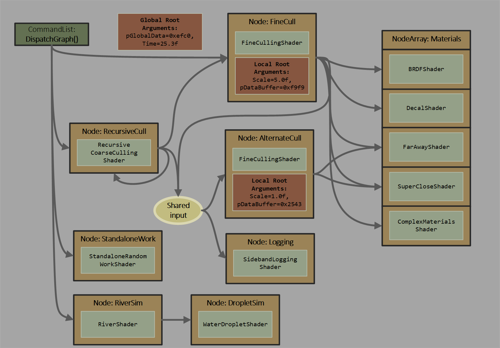
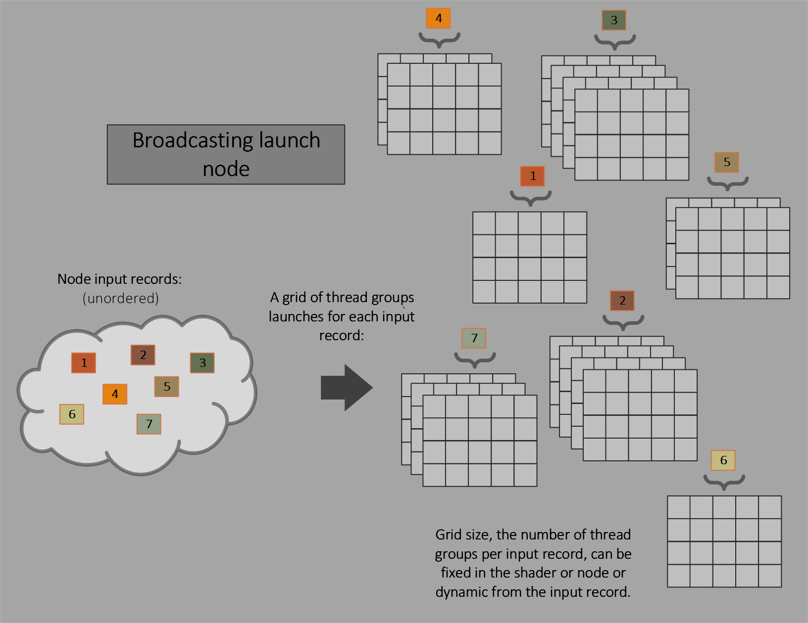
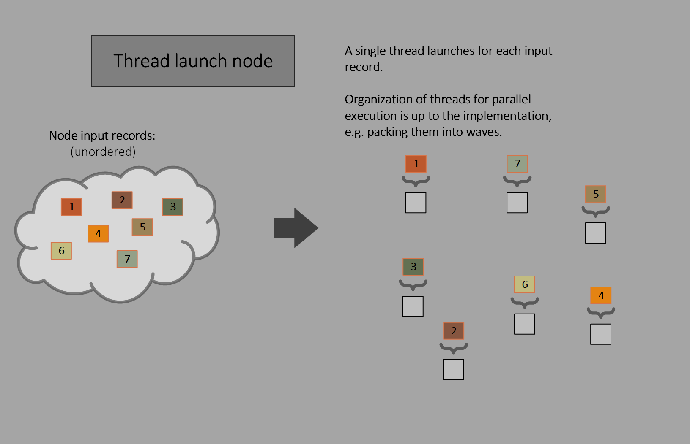
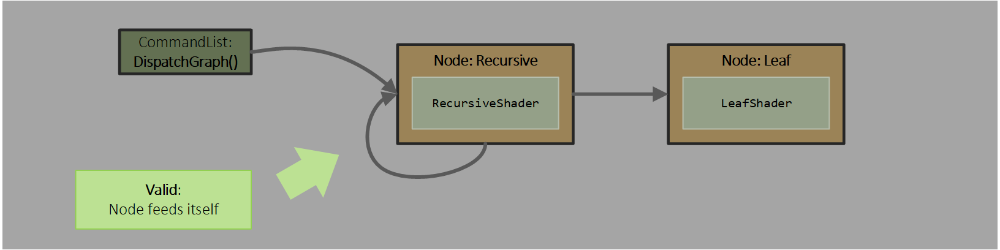
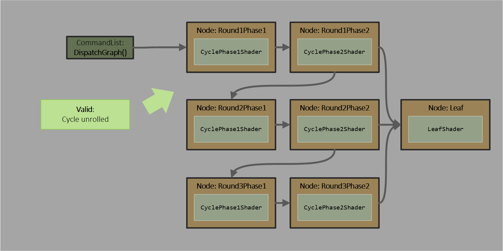
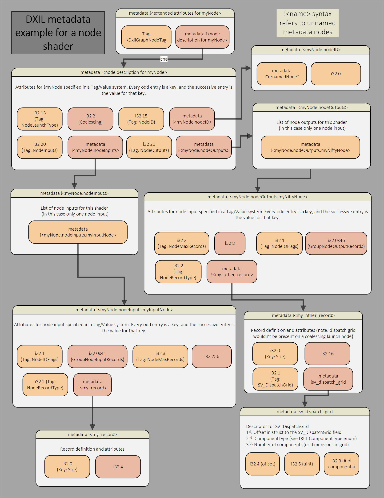

<h1>D3D12 Work Graphs</h1>
v1.009 6/13/2024

---

<h1>Contents</h1>

- [Introduction to work graphs](#introduction-to-work-graphs)
  - [Basis](#basis)
  - [Characteristics](#characteristics)
  - [Analysis](#analysis)
  - [Scenarios summary](#scenarios-summary)
  - [Existing support](#existing-support)
- [Definitions](#definitions)
  - [Thread](#thread)
  - [Thread Group](#thread-group)
  - [Wave](#wave)
  - [Program](#program)
- [System design](#system-design)
  - [Overview](#overview)
  - [Nodes](#nodes)
  - [Node arrays](#node-arrays)
  - [Shader at a node](#shader-at-a-node)
  - [Resource bindings](#resource-bindings)
  - [Feeding nodes](#feeding-nodes)
  - [Node types](#node-types)
    - [Broadcasting launch nodes](#broadcasting-launch-nodes)
    - [Coalescing launch nodes](#coalescing-launch-nodes)
    - [Thread launch nodes](#thread-launch-nodes)
    - [Mesh nodes](#mesh-nodes)
    - [Draw nodes](#draw-nodes)
    - [DrawIndexed nodes](#drawindexed-nodes)
  - [Shader invocation at a node](#shader-invocation-at-a-node)
  - [Node ID](#node-id)
  - [Node input](#node-input)
  - [Node output](#node-output)
    - [Recursion](#recursion)
  - [Shaders can use input record lifetime for scoped scratch storage](#shaders-can-use-input-record-lifetime-for-scoped-scratch-storage)
  - [Sharing input records across nodes](#sharing-input-records-across-nodes)
  - [Wave semantics](#wave-semantics)
    - [Thread visibility in wave operations](#thread-visibility-in-wave-operations)
    - [Support for WaveSize shader function attribute](#support-for-wavesize-shader-function-attribute)
  - [Quad and derivative operation semantics](#quad-and-derivative-operation-semantics)
  - [NonUniformResourceIndex semantics](#nonuniformresourceindex-semantics)
  - [Producer - consumer dataflow through UAVs](#producer---consumer-dataflow-through-uavs)
    - [Examples of producer - consumer dataflow through UAVs](#examples-of-producer---consumer-dataflow-through-uavs)
      - [Dispatch grid writing to UAV for consumer node to read](#dispatch-grid-writing-to-uav-for-consumer-node-to-read)
      - [Single thread writing to UAV for consumer node to read](#single-thread-writing-to-uav-for-consumer-node-to-read)
  - [Work Graph](#work-graph)
  - [Node limits](#node-limits)
    - [Node count limits](#node-count-limits)
    - [Node output limits](#node-output-limits)
    - [Node input limits](#node-input-limits)
    - [Node array constraints](#node-array-constraints)
  - [Backing memory](#backing-memory)
    - [Discovering backing memory size requirements](#discovering-backing-memory-size-requirements)
  - [Binding a work graph](#binding-a-work-graph)
  - [Initiating work from a command list](#initiating-work-from-a-command-list)
    - [ExecuteIndirect and DispatchGraph](#executeindirect-and-dispatchgraph)
  - [No deadlocks / system overload](#no-deadlocks--system-overload)
  - [Joins - synchronizing within the graph](#joins---synchronizing-within-the-graph)
  - [Scheduling considerations for the driver](#scheduling-considerations-for-the-driver)
    - [Input memory management](#input-memory-management)
- [Discovering device support for work graphs](#discovering-device-support-for-work-graphs)
  - [Feature scaling](#feature-scaling)
- [Interactions with other D3D12 features](#interactions-with-other-d3d12-features)
- [Graphics nodes](#graphics-nodes)
  - [Graphics nodes execution characteristics](#graphics-nodes-execution-characteristics)
    - [Graphics nodes with ordered rasterization](#graphics-nodes-with-ordered-rasterization)
  - [Graphics node resource binding and root arguments](#graphics-node-resource-binding-and-root-arguments)
    - [Graphics node index and vertex buffers](#graphics-node-index-and-vertex-buffers)
  - [Helping mesh nodes work better on some hardware](#helping-mesh-nodes-work-better-on-some-hardware)
  - [Graphics nodes example](#graphics-nodes-example)
    - [Graphics node pull model vertex access](#graphics-node-pull-model-vertex-access)
- [API](#api)
  - [Device methods](#device-methods)
    - [CheckFeatureSupport Structures](#checkfeaturesupport-structures)
    - [CheckFeatureSupport](#checkfeaturesupport)
      - [D3D12\_FEATURE\_D3D12\_OPTIONS21](#d3d12_feature_d3d12_options21)
      - [D3D12\_WORK\_GRAPHS\_TIER](#d3d12_work_graphs_tier)
    - [CreateStateObject](#createstateobject)
      - [CreateStateObject Structures](#createstateobject-structures)
        - [D3D12\_STATE\_OBJECT\_DESC](#d3d12_state_object_desc)
        - [D3D12\_STATE\_SUBOBJECT](#d3d12_state_subobject)
        - [D3D12\_STATE\_OBJECT\_TYPE](#d3d12_state_object_type)
        - [D3D12\_STATE\_SUBOBJECT\_TYPE](#d3d12_state_subobject_type)
        - [D3D12\_STATE\_OBJECT\_FLAGS](#d3d12_state_object_flags)
        - [D3D12\_STATE\_OBJECT\_CONFIG](#d3d12_state_object_config)
        - [D3D12\_WORK\_GRAPH\_DESC](#d3d12_work_graph_desc)
        - [D3D12\_WORK\_GRAPH\_FLAGS](#d3d12_work_graph_flags)
        - [D3D12\_NODE](#d3d12_node)
        - [D3D12\_NODE\_TYPE](#d3d12_node_type)
        - [D3D12\_SHADER\_NODE](#d3d12_shader_node)
        - [D3D12\_NODE\_OVERRIDES\_TYPE](#d3d12_node_overrides_type)
        - [D3D12\_BROADCASTING\_LAUNCH\_OVERRIDES](#d3d12_broadcasting_launch_overrides)
        - [D3D12\_COALESCING\_LAUNCH\_OVERRIDES](#d3d12_coalescing_launch_overrides)
        - [D3D12\_THREAD\_LAUNCH\_OVERRIDES](#d3d12_thread_launch_overrides)
        - [D3D12\_COMMON\_COMPUTE\_NODE\_OVERRIDES](#d3d12_common_compute_node_overrides)
        - [D3D12\_NODE\_ID](#d3d12_node_id)
        - [D3D12\_NODE\_OUTPUT\_OVERRIDES](#d3d12_node_output_overrides)
        - [D3D12\_PROGRAM\_NODE](#d3d12_program_node)
        - [D3D12\_PROGRAM\_NODE\_OVERRIDES\_TYPE](#d3d12_program_node_overrides_type)
        - [D3D12\_MESH\_LAUNCH\_OVERRIDES](#d3d12_mesh_launch_overrides)
        - [D3D12\_MAX\_NODE\_INPUT\_RECORDS\_PER\_GRAPH\_ENTRY\_RECORD](#d3d12_max_node_input_records_per_graph_entry_record)
        - [D3D12\_DRAW\_LAUNCH\_OVERRIDES](#d3d12_draw_launch_overrides)
        - [D3D12\_DRAW\_INDEXED\_LAUNCH\_OVERRIDES](#d3d12_draw_indexed_launch_overrides)
        - [D3D12\_COMMON\_PROGRAM\_NODE\_OVERRIDES](#d3d12_common_program_node_overrides)
    - [CreateVertexBufferView](#createvertexbufferview)
    - [CreateDescriptorHeap](#createdescriptorheap)
    - [AddToStateObject](#addtostateobject)
  - [ID3D12StateObjectProperties1 methods](#id3d12stateobjectproperties1-methods)
    - [GetShaderIdentifier](#getshaderidentifier)
    - [GetProgramIdentifier](#getprogramidentifier)
      - [GetProgramIdentifier structures](#getprogramidentifier-structures)
        - [D3D12\_PROGRAM\_IDENTIFIER](#d3d12_program_identifier)
    - [GetShaderStackSize](#getshaderstacksize)
  - [ID3D12WorkGraphProperties methods](#id3d12workgraphproperties-methods)
    - [GetNumWorkGraphs](#getnumworkgraphs)
    - [GetProgramName](#getprogramname)
    - [GetWorkGraphIndex](#getworkgraphindex)
    - [GetNumNodes](#getnumnodes)
    - [GetNodeID](#getnodeid)
    - [GetNodeIndex](#getnodeindex)
    - [GetNodeLocalRootArgumentsTableIndex](#getnodelocalrootargumentstableindex)
    - [GetNumEntrypoints](#getnumentrypoints)
    - [GetEntrypointID](#getentrypointid)
    - [GetEntrypointIndex](#getentrypointindex)
    - [GetEntrypointRecordSizeInBytes](#getentrypointrecordsizeinbytes)
    - [GetEntrypointRecordAlignmentInBytes](#getentrypointrecordalignmentinbytes)
    - [GetWorkGraphMemoryRequirements](#getworkgraphmemoryrequirements)
      - [GetWorkGraphMemoryRequirements structures](#getworkgraphmemoryrequirements-structures)
        - [D3D12\_WORK\_GRAPH\_MEMORY\_REQUIREMENTS](#d3d12_work_graph_memory_requirements)
  - [ID3D12WorkGraphProperties1 methods](#id3d12workgraphproperties1-methods)
    - [SetMaximumInputRecords](#setmaximuminputrecords)
  - [Command list methods](#command-list-methods)
    - [SetProgram](#setprogram)
      - [SetProgram Structures](#setprogram-structures)
        - [D3D12\_SET\_PROGRAM\_DESC](#d3d12_set_program_desc)
        - [D3D12\_PROGRAM\_TYPE](#d3d12_program_type)
        - [D3D12\_SET\_WORK\_GRAPH\_DESC](#d3d12_set_work_graph_desc)
        - [D3D12\_SET\_WORK\_GRAPH\_FLAGS](#d3d12_set_work_graph_flags)
        - [D3D12\_SET\_GENERIC\_PIPELINE\_DESC](#d3d12_set_generic_pipeline_desc)
    - [DispatchGraph](#dispatchgraph)
      - [DispatchGraph Structures](#dispatchgraph-structures)
        - [D3D12\_DISPATCH\_GRAPH\_DESC](#d3d12_dispatch_graph_desc)
        - [D3D12\_DISPATCH\_GRAPH\_MODE](#d3d12_dispatch_graph_mode)
        - [D3D12\_NODE\_CPU\_INPUT](#d3d12_node_cpu_input)
        - [D3D12\_NODE\_GPU\_INPUT](#d3d12_node_gpu_input)
        - [D3D12\_MULTI\_NODE\_CPU\_INPUT](#d3d12_multi_node_cpu_input)
        - [D3D12\_MULTI\_NODE\_GPU\_INPUT](#d3d12_multi_node_gpu_input)
    - [SetWorkGraphMaximumGPUInputRecords](#setworkgraphmaximumgpuinputrecords)
- [HLSL](#hlsl)
  - [Shader target](#shader-target)
  - [Shader function attributes](#shader-function-attributes)
  - [Node Shader Parameters](#node-shader-parameters)
    - [Node Shader system values](#node-shader-system-values)
  - [Record struct](#record-struct)
    - [Record Attributes](#record-attributes)
      - [NodeTrackRWInputSharing](#nodetrackrwinputsharing)
    - [Record system values](#record-system-values)
      - [SV\_DispatchGrid](#sv_dispatchgrid)
  - [Objects](#objects)
    - [Input Record objects](#input-record-objects)
    - [Output Node Objects](#output-node-objects)
    - [Output Record Objects](#output-record-objects)
  - [Record access](#record-access)
    - [Single record access](#single-record-access)
    - [Array records access](#array-records-access)
    - [Potential future record access operator](#potential-future-record-access-operator)
    - [Record access examples](#record-access-examples)
  - [Node input declaration](#node-input-declaration)
    - [Node input attributes](#node-input-attributes)
  - [Methods operating on node input](#methods-operating-on-node-input)
    - [Input record Count method](#input-record-count-method)
    - [FinishedCrossGroupSharing](#finishedcrossgroupsharing)
  - [Node output declaration](#node-output-declaration)
    - [Node output attributes](#node-output-attributes)
  - [Node output array indexing](#node-output-array-indexing)
  - [Methods operating on node output](#methods-operating-on-node-output)
    - [GetThreadNodeOutputRecords](#getthreadnodeoutputrecords)
    - [GetGroupNodeOutputRecords](#getgroupnodeoutputrecords)
    - [IncrementOutputCount](#incrementoutputcount)
    - [OutputComplete](#outputcomplete)
      - [Potential future convenience: auto-inserted OutputComplete](#potential-future-convenience-auto-inserted-outputcomplete)
    - [Node output IsValid method](#node-output-isvalid-method)
  - [Node and record object semantics in shaders](#node-and-record-object-semantics-in-shaders)
    - [Common group-uniform object semantics](#common-group-uniform-object-semantics)
    - [Uniform handle vs per-thread records](#uniform-handle-vs-per-thread-records)
    - [Null handle values](#null-handle-values)
  - [Examples of input and output use in shaders](#examples-of-input-and-output-use-in-shaders)
  - [General intrinsics](#general-intrinsics)
    - [GetRemainingRecursionLevels](#getremainingrecursionlevels)
    - [Barrier](#barrier)
      - [Barrier Rules](#barrier-rules)
      - [Barrier mapping from earlier intrinsics](#barrier-mapping-from-earlier-intrinsics)
- [DXIL](#dxil)
  - [DXIL Shader function attributes](#dxil-shader-function-attributes)
    - [NodeLaunchType encoding](#nodelaunchtype-encoding)
    - [XYZ metadata structure](#xyz-metadata-structure)
    - [NodeID metadata structure](#nodeid-metadata-structure)
  - [Node and record handles](#node-and-record-handles)
    - [Creating handles to node outputs](#creating-handles-to-node-outputs)
    - [Creating handles to node input records](#creating-handles-to-node-input-records)
    - [Annotating node handles](#annotating-node-handles)
  - [Node input and output metadata table](#node-input-and-output-metadata-table)
    - [NodeIOFlags and NodeIOKind encoding](#nodeioflags-and-nodeiokind-encoding)
  - [Lowering Get-NodeOutputRecords](#lowering-get-nodeoutputrecords)
  - [Lowering input/output loads and stores](#lowering-inputoutput-loads-and-stores)
  - [Lowering IncrementOutputCount](#lowering-incrementoutputcount)
  - [Lowering OutputComplete](#lowering-outputcomplete)
  - [Lowering input record Count method](#lowering-input-record-count-method)
  - [Lowering FinishedCrossGroupSharing](#lowering-finishedcrossgroupsharing)
  - [NodeRecordType metadata structure](#noderecordtype-metadata-structure)
    - [SV\_DispatchGrid metadata structure](#sv_dispatchgrid-metadata-structure)
  - [Lowering Node output IsValid method](#lowering-node-output-isvalid-method)
  - [Lowering GetRemainingRecursionLevels](#lowering-getremainingrecursionlevels)
  - [Lowering Barrier](#lowering-barrier)
  - [Node and record object semantics in DXIL](#node-and-record-object-semantics-in-dxil)
    - [Handle value classifications](#handle-value-classifications)
    - [Handle value uniformity](#handle-value-uniformity)
  - [Example of creating node input and output handles](#example-of-creating-node-input-and-output-handles)
  - [Example DXIL metadata diagram](#example-dxil-metadata-diagram)
- [DDI](#ddi)
  - [DDI for reporting work graph support](#ddi-for-reporting-work-graph-support)
    - [D3D12DDICAPS\_TYPE\_OPTIONS\_0108](#d3d12ddicaps_type_options_0108)
    - [D3D12DDI\_OPTIONS\_0108](#d3d12ddi_options_0108)
    - [D3D12DDI\_WORK\_GRAPHS\_TIER](#d3d12ddi_work_graphs_tier)
  - [DDI function tables](#ddi-function-tables)
    - [PFND3D12DDI\_GET\_PROGRAM\_IDENTIFIER\_0108](#pfnd3d12ddi_get_program_identifier_0108)
    - [PFND3D12DDI\_GET\_WORK\_GRAPH\_MEMORY\_REQUIREMENTS\_0108](#pfnd3d12ddi_get_work_graph_memory_requirements_0108)
    - [PFND3D12DDI\_SET\_PROGRAM\_0108](#pfnd3d12ddi_set_program_0108)
    - [PFND3D12DDI\_DISPATCH\_GRAPH\_0108](#pfnd3d12ddi_dispatch_graph_0108)
  - [DDI function table related structures and enums](#ddi-function-table-related-structures-and-enums)
    - [D3D12DDI\_PROGRAM\_IDENTIFIER\_0108](#d3d12ddi_program_identifier_0108)
    - [D3D12DDI\_WORK\_GRAPH\_MEMORY\_REQUIREMENTS\_0108](#d3d12ddi_work_graph_memory_requirements_0108)
    - [D3D12DDI\_SET\_PROGRAM\_DESC\_0108](#d3d12ddi_set_program_desc_0108)
    - [D3D12DDI\_PROGRAM\_TYPE\_0108](#d3d12ddi_program_type_0108)
    - [D3D12DDI\_SET\_WORK\_GRAPH\_DESC\_0108](#d3d12ddi_set_work_graph_desc_0108)
    - [D3D12DDI\_SET\_WORK\_GRAPH\_FLAGS\_0108](#d3d12ddi_set_work_graph_flags_0108)
    - [D3D12DDI\_DISPATCH\_GRAPH\_DESC\_0108](#d3d12ddi_dispatch_graph_desc_0108)
    - [D3D12DDI\_DISPATCH\_MODE\_0108](#d3d12ddi_dispatch_mode_0108)
    - [D3D12DDI\_NODE\_CPU\_INPUT\_0108](#d3d12ddi_node_cpu_input_0108)
    - [D3D12DDI\_NODE\_GPU\_INPUT\_0108](#d3d12ddi_node_gpu_input_0108)
    - [D3D12DDI\_MULTI\_NODE\_CPU\_INPUT\_0108](#d3d12ddi_multi_node_cpu_input_0108)
    - [D3D12DDI\_MULTI\_NODE\_GPU\_INPUT\_0108](#d3d12ddi_multi_node_gpu_input_0108)
  - [DDI state object creation related structures and enums](#ddi-state-object-creation-related-structures-and-enums)
    - [D3D12DDI\_STATE\_SUBOBJECT\_TYPE](#d3d12ddi_state_subobject_type)
    - [D3D12DDI\_WORK\_GRAPH\_DESC\_0108](#d3d12ddi_work_graph_desc_0108)
    - [D3D12DDI\_WORK\_GRAPH\_FLAGS\_0108](#d3d12ddi_work_graph_flags_0108)
    - [D3D12DDI\_NODE\_LIST\_ENTRY\_0108](#d3d12ddi_node_list_entry_0108)
    - [D3D12DDI\_NODE\_0108](#d3d12ddi_node_0108)
    - [D3D12DDI\_NODE\_TYPE\_0108](#d3d12ddi_node_type_0108)
    - [D3D12DDI\_SHADER\_NODE\_0108](#d3d12ddi_shader_node_0108)
    - [D3D12DDI\_NODE\_PROPERTIES\_TYPE\_0108](#d3d12ddi_node_properties_type_0108)
    - [D3D12DDI\_BROADCASTING\_LAUNCH\_NODE\_PROPERTIES\_0108](#d3d12ddi_broadcasting_launch_node_properties_0108)
    - [D3D12DDI\_COALESCING\_LAUNCH\_NODE\_PROPERTIES\_0108](#d3d12ddi_coalescing_launch_node_properties_0108)
    - [D3D12DDI\_THREAD\_LAUNCH\_NODE\_PROPERTIES\_0108](#d3d12ddi_thread_launch_node_properties_0108)
    - [D3D12DDI\_NODE\_OUTPUT\_0108](#d3d12ddi_node_output_0108)
    - [D3D12DDI\_NODE\_IO\_FLAGS\_0108](#d3d12ddi_node_io_flags_0108)
    - [D3D12DDI\_NODE\_IO\_KIND\_0108](#d3d12ddi_node_io_kind_0108)
    - [D3D12DDI\_RECORD\_DISPATCH\_GRID\_0108](#d3d12ddi_record_dispatch_grid_0108)
    - [D3D12DDI\_NODE\_ID\_0108](#d3d12ddi_node_id_0108)
    - [D3D12DDI\_PROGRAM\_NODE\_0110](#d3d12ddi_program_node_0110)
    - [D3D12DDI\_MESH\_LAUNCH\_PROPERTIES\_0110](#d3d12ddi_mesh_launch_properties_0110)
    - [D3D12DDI\_MAX\_NODE\_INPUT\_RECORDS\_PER\_GRAPH\_ENTRY\_RECORD\_0110](#d3d12ddi_max_node_input_records_per_graph_entry_record_0110)
    - [D3D12DDI\_DRAW\_LAUNCH\_PROPERTIES\_0108](#d3d12ddi_draw_launch_properties_0108)
    - [D3D12DDI\_DRAW\_INDEXED\_LAUNCH\_PROPERTIES\_0108](#d3d12ddi_draw_indexed_launch_properties_0108)
- [Generic programs](#generic-programs)
  - [Supported shader targets](#supported-shader-targets)
  - [Resource binding](#resource-binding)
  - [CreateStateObject structures for generic programs](#createstateobject-structures-for-generic-programs)
    - [D3D12\_DXIL\_LIBRARY\_DESC](#d3d12_dxil_library_desc)
    - [D3D12\_EXPORT\_DESC](#d3d12_export_desc)
    - [D3D12\_GENERIC\_PROGRAM\_DESC](#d3d12_generic_program_desc)
    - [Subobjects that can be listed in a generic program](#subobjects-that-can-be-listed-in-a-generic-program)
    - [Defaults for subobjects missing from a generic program](#defaults-for-subobjects-missing-from-a-generic-program)
      - [Missing STREAM\_OUTPUT](#missing-stream_output)
      - [Missing BLEND](#missing-blend)
      - [Missing SAMPLE\_MASK](#missing-sample_mask)
      - [Missing RASTERIZER](#missing-rasterizer)
      - [Missing INPUT\_LAYOUT](#missing-input_layout)
      - [Missing INDEX\_BUFFER\_STRIP\_CUT\_VALUE](#missing-index_buffer_strip_cut_value)
      - [Missing PRIMITIVE\_TOPOLOGY](#missing-primitive_topology)
      - [Missing RENDER\_TARGET\_FORMATS](#missing-render_target_formats)
      - [Missing DEPTH\_STENCIL\_FORMAT](#missing-depth_stencil_format)
      - [Missing SAMPLE\_DESC](#missing-sample_desc)
      - [Missing VIEW\_INSTANCING](#missing-view_instancing)
      - [Missing FLAGS](#missing-flags)
      - [Missing DEPTH\_STENCIL or DEPTH\_STENCIL1 or DEPTH\_STENCIL2](#missing-depth_stencil-or-depth_stencil1-or-depth_stencil2)
- [Change log](#change-log)

---

# Introduction to work graphs

Work graphs are a system for GPU based work creation in D3D12.

---

## Basis

In many GPU workoads, an initial calculation on the GPU determines what subsequent work the GPU needs to do. This can be accomplished with a round trip back to the CPU to issue the new work.  But it is typically better for the GPU to be able to feed itself directly.  `ExecuteIndirect` in D3D12 is a form of this, where the app uses the GPU to record a very constrained command buffer that needs to be serially processed on the GPU to issue new work.

Consider a new option.  Suppose shader threads running on the GPU (producers) can request other work to run (consumers).  Consumers can be producers as well. The system can schedule the requested work as soon as the GPU has capacity to run it.  The app can also let the system manage memory for the data flowing between tasks.

This is **work graphs**.  A graph of nodes where shader code at each node can request invocations of other nodes, without waiting for them to launch. Work graphs capture the user's algorithmic intent and overall structure, without burdening the developer to know too much about the specific hardware it will run on.  The asynchronous nature maximizes the freedom for the system to decide how best to execute the work.

Here is a graph contrived to illustrate several capabilities:


---

## Characteristics 

- When initiating work with `DispatchGraph()`, the app can pass arguments to graph entrypoints from either app CPU memory copied into a command list's recording, or app GPU memory read at command list execution.  These options are convenient even in a single node graph.
- There are a few options for how a node translates incoming work requests into a set of shader invocations, ranging from a single thread per work item to variable sized grids of thread groups per work item.
- The graph is acyclic, with one exception: a node can output to itself.  There is a depth limit of 32 including recursion.
- For implementation efficiency there are limits on the amount of data that node invocations can pass directly to other nodes; for bulk data transfer apps need to use UAV accesses.
- Scheduling of work requests can be done by the system with whatever underlying hardware tools are at its disposal.
  - Less capable architectures might revert to a single processor on the GPU scheduling work requests.  More advanced architectures might use distributed scheduling techniques and account for the specific topology of processing resources on the GPU to efficiently manage many work requests being generated in parallel.
  - This is in contrast to the `ExecuteIndirect` model which forces a serial processing step for the GPU - walking through a GPU generated command list to determine a sequence of commands to issue.
- Data from a producer might be more likely to flow to a consumer directly, staying within caches
  - This could reduce reliance on off-chip memory bandwidth for performance scaling
- Because data can flow between small tasks in a fine-grained way, the programming model doesn't force the application to drain the GPU of work between data processing steps.
- Since the system handles buffering of data passed between producers and consumers (if the app wants), the programming model can be simpler than `ExecuteIndirect`.

---

## Analysis

Despite the potential advantages, the free scheduling model may not always the best target for an app's workload.  Characteristics of the task, such as how it interacts with memory/caches, or the sophistication of hardware over time, may dictate whether some existing approach is better.  Like continuing to use `ExecuteIndirect`.  Or building producer consumer systems out of relatively long running compute shader threads that cross communicate - clever and fragile. Or using the paradigms in the DirectX Raytracing model, involving shaders splitting up and continuing later.  Work graphs are another tool in the toolbox.

Given that the model is about producers requesting for consumers to run, currently there isn't an explicit notion of waiting before launching a node.  For instance, waiting for all work at multiple producer nodes to finish before a consumer launches.  This can technically be accomplished by breaking up a graph, or with clever shader logic. Synchronization wasn’t a focus for the initial design, hence these workarounds, discussed more in [Joins - synchronizing within the graph](#joins---synchronizing-within-the-graph).  Native synchronization support may be defined in the future and would be better than the workarounds in lots of ways.  Many other compute frameworks explicitly use a graph to define bulk dependencies, in contrast to the feed-forward model here.

---

## Scenarios summary

- Reducing number of passes out to memory and GPU idling in multi-pass compute algorithms
- Avoiding the pattern in ExecuteIndirect of serial processing through worst case sized buffers
- Classification and binning via node arrays
- Eventually: 
  - Feeding graphics from compute
  - Bulk work synchronization

---

## Existing support

Here is a summary of existing ways the GPU can generate work for itself; a reminder of the breadth of work scheduling abilities GPUs already have at their disposal.  

- Rasterizer
  - Variable number of pixels with various strict ordering requirements.
- Tessellation and Geometry Shaders
  - Mix of programmable expansion and fixed function.
- [Mesh Shaders](MeshShader.md)
  - Alternative pipeline for programmable geometry expansion and processing
  - Seeks to avoid bottlnecks in the above pipelines
- [ExecuteIndirect](IndirectDrawing.md)
  - App generates a command buffer on the GPU and then executes it
  - Many limitations on PC like not being able to change shaders
  - App needs to do worst case buffering between phases
  - Messy implementations in drivers
  - Could try to add flexibility here, but would be doubling down on the mess
- [Callable Shaders](Raytracing.md\#callable-shaders) (from [DXR](Raytracing.md))
  - Form of dynamic call from a shader thread that returns to caller
  - Typically implemented by ending the shader invocation at the callsite and starting a new one to resume
  - Could be extended outside DXR (even into this spec), but out of scope
  - Work graphs expose a variation on launching threads of work when return to caller isn't needed

Work graphs exists alongside these, but can potentially also merge in some of their abilities. There will be situations where more than one of these options can accomplish a task. Unless the work to be done can be molded to very closely match the structure of one of the solutions, it is difficult to say which option is best.  The answer may depend on hardware details or content characteristics.

---

# Definitions

---

## Thread

Individual shader invocation on the GPU.  Dynamic function calls made by a thread are considered part of the thread if they are invoked with semantics that require execution to return to the caller and resume in order.

---

## Thread Group

Set of threads (with 3 dimensional ID per thread).  Up to 1024 threads can be in a thread group, based on existing compute shader rules.

All threads in a thread group can access some thread group shared memory, whose scope is the lifetime of the thread group.

A compute `Dispatch()` can issue a 3D grid of thread groups, so each thread group has a 3D GroupID.  Each dimension is limited to 65535.

> It may be worth introducing a variant where the grid size is just a 1D UINT for simplicity.  And/or it is a UINT with Y in the upper 16 bits and X in the lower 16 bits.

Threads in a thread group have no execution ordering guarantee with respect to each other.  Same for the set of thread groups in a compute `Dispatch()`.

---

## Wave

Hardware specific grouping of threads/lanes executing together, in lockstep on some architectures but potentially diverging on other architectures.  

Hardware chooses the mapping of threads from thread groups into waves.  Some tricky shader instructions have been exposed that enable apps to opportunistically exploit whatever wave coherence that any given hardware may provide.  

---

## Program

The notion of a "program" encapsulates what used to be described as "pipeline state" or "pipeline state objects" in D3D12.  Things that were pipeline state before can be equivalently defined as "program"s now. Like a VS+PS pipeline (along with other relevant state like rasterizer state).  Or a standalone compute shader.  The list of program types can be seen [here](#d3d12_program_type).

Raytracing introduced state objects as a way of defining a collection of code and other configuration data.  This container format now supports having multiple "programs" defined in a single object, such as multiple permutations of VS+PS graphics pipelines defined in one state object.  The the exception is raytracing pipelines, which must be standalone, not mixed with other programs in one state object, for simplicity.  Each individual program is something that can be bound as a unit on the GPU for execution.   

Existing ways of defining pipelines are still valid, to maintain code compatibility.  

The term "program" is used rather than "pipeline" to step away from the connotation in a "pipeline" that there is a sequence of operations.  "Program" intends to convey a grouping of shaders and/or fixed function operations that are launched as logical grouping on the GPU.  In many cases this grouping is a sequence, like a pipeline.  But it can be a graph too, as in this spec.

---

# System design

---

## Overview

The app can define a set of nodes.  In the most basic form at each node there is a fixed shader. In more advanced incarnations a node could have other contents, such as holding multiple shaders and state, as in a graphics [program](#program).  Command lists can send records to nodes, initiating work: groups of shader invocations.  Nodes can also send records to other nodes, generating more work.  

Multiple nodes can use the same shader, specialized in some way.  Multiple nodes can share input, meaning multiple different shaders can be launched for a given input.  Multiple nodes can write to the same destination node.

Independent of node input/outputs, shaders can directly access memory via SRVs, UAVs etc.

Repeating the contrived graph from the intro as a visual aid:


Shaders can run when (a) input is available, and (b) if not a leaf node, sufficient output storage is reserved by the system.  This is for the system to worry about for the most part - the system will find a way to schedule all generated work.  That said, the app has some influence on how much backing storage the system can use in order to make progress.

Cycles in the flow of execution are not allowed, except that a node can target itself.  In other words, a node cannot output to an ancestor node.  Work is guaranteed to complete, barring app-error.

When a producing shader outputs to a consumer, the execution of the consumer may happen later, independent of the progress of the producing shader.  Deadlock may occur if a producing shader's completion is dependent on the execution of a consumer shader.  There is no return from the consumer to the producer.

Nodes can be set up with different semantics in terms of how shaders are invoked relative to inputs.

---

## Nodes

Node are building blocks out of which a system of dynamic execution flow can be constructed.

Nodes have a type defining its semantics.  

Nodes that hold a compute shader support three ways to launch. One type of node can launch a batch (grid) of compute shader thread groups that all share a given input.  Another type of node can launch thread groups at a time, each group consuming a set of available inputs at once, such that the set of inputs is visible to the group.  Yet another type just launches individual threads at a time, each processing one input item.  

More advanced implementations can support leaf nodes that can be a graphics [program](#program).

Concrete descriptions of these node types appear later.

---

## Node arrays

Nodes can be arranged in arrays.  This allows nodes the option of dynamically indexing into a node array to select which node(s) to output to.  Binning scenarios can be implemented this way.

A proposal not supported yet is allowing the [AddToStateObject()](#addtostateobject) API that currently exists for DXR to be extended to support cheaply adding leaf nodes to an existing array in a work graph after the work graph has been created.  This might help with streaming materials for instance, and could be of use in combination with proposed support for [graphics nodes](#graphics-nodes).

---

## Shader at a node 

The shader (or entire [program](#program) if applicable) that runs at a node is a fixed choice defined with the node.

---

## Resource bindings

Root constants, root descriptors and descriptor tables (pointing into the descriptor heap) can be sourced from root arguments bound on the command list, declared via global root signature common to all shaders.  This is similar to other other types of [programs](#program).

The app can also choose to assign a block of memory to a node that acts as fixed storage for local root arguments.  So the shader could get its set of resource bindings from a combination of the global root arguments and some local ones at the node.  Multiple nodes could then be created out of the same shader, differentiated in behavior by the local root arguments.  An alternative to doing this is the app has to pass these arguments into the shader via the input records, but it bloats input records unnecessarily if the data doesn't need to be varying.

As a reminder, shaders support indexing directly into the full descriptor heap for any resource access, independent of root signatures.  In the context of nodes it means indices that resource references can be passed along as input records.

---

## Feeding nodes

The system manages input data arriving at a node to generate a set of shader launches.  

The semantics of how nodes inputs are handled may be configurable over time.  This might imply various types of queueing happening in the implementation - how this is done is opaque / owned by the driver.  There is flexibility for how backing storage for node inputs is handled, discussed [later](#backing-memory)

The sequence that records get consumed / dequed at a node is unordered / unpredictable.  This provides maximum flexibility for implementations.  

Independent of this unordered dequeueing, the order that records are enqueued is also unordered.  Input order is unpredictable simply because input can arrive from multiple GPU sources/threads running concurrently.  

> Other ordering schemes could be entertained in the future if they could work well. Here are a couple of example possibilities, without implying these are useful or at all feasible, just food for thought: 
> - dequeue least recently queued
> - complete all launched child work before continuing to the next item

There is a constrained case where some ordering is guaranteed, described in [graphics nodes with ordered rasterization](#graphics-nodes-with-ordered-rasterization).

Input records at a node are of a fixed size - the size of the input struct declared in the node's shader.

The backing physical memory footprint a system needs to execute a graph (to handle the possibility spilling out of caches for instance) is owned by the application - see [backing memory](#backing-memory).  To simplify implementations, there are [node output limits](#node-output-limits), and [node input limits](#node-input-limits).

Input record size can be 0 - discussed under [record struct](#record-struct).  This simply means the node input is purely of a logical capacity.  An app might want to manage data storage between nodes manually (e.g. in UAVs). 

---

## Node types

[Broadcasting launch nodes](#broadcasting-launch-nodes) : one input seen by many thread groups
[Thread launch nodes](#thread-launch-nodes) : one input per thread
[Coalescing launch nodes](#coalescing-launch-nodes) : variable inputs seen by each thread group

Proposed future [graphics node](#graphics-nodes) types:

[Mesh nodes](#mesh-nodes): invoke a [mesh shading program](#program) like `DispatchMesh()`

The following have been **cut** in favor of starting experimentation with [mesh nodes](#mesh-nodes) only:

[Draw nodes](#draw-nodes): invoke a [graphics program](#program) like `DrawInstanced()`
[DrawIndexed nodes](#drawindexed-nodes): invoke a [graphics program](#program) like `DrawIndexedInstanced()`

---

### Broadcasting launch nodes

The equivalent of compute `Dispatch()` is generated when input is present - one grid of thread groups launched per input.  Work is invoked a thread group at a time as the system reserves output space (if needed) for each thread group.  



The dispatch grid size can either be part of the input record or be fixed for the node.  

The thread group is fixed in the shader.  

All thread groups that are launched share the same set of input parameters.  The exception is the usual system ID values which identify individual threads within the group/grid.

For wave packing see [Thread visibility in wave operations](#thread-visibility-in-wave-operations).

---

### Coalescing launch nodes

Here, multiple inputs are collectively visible to each thread group that is launched.

Coalescing launch nodes can be useful if the shader can use shader memory or cooperation between threads in the group to process multiple inputs together (even though the number of inputs available may vary).  If such cooperation is not required (beyond opportunistically using wave ops across threads in a wave), [thread launch nodes](#thread-launch-nodes), described later, may be more appropriate to use.  Coalescing launch nodes can also be useful in scenarios where [thread launch nodes](#thread-launch-nodes) would have made more sense but the tight output data limits on that node type are too restrictive.


The thread group size is fixed in the shader.  

Dispatch grid size doesn't apply, as instead the system simply launches individual thread groups at a time.

> Since there is no dispatch grid size, that means there is no notion of amplification in this type of work launch.

The shader [declares](#node-input-declaration) as part of its input the maximum number of input records that a thread group can input.  If the shader declares 512 as the input record maximum, the system is allowed to invoke a thread group when it has anywhere from 1 to 512 input records available.

Of course the system will attempt to fill each thread group with the maximum declared input records, but it is allowed to invoke with fewer records as it sees fit.  An example might be that no other node is ready to launch new work and the GPU has free processing resources, so it might decide that it is better to do something than nothing.  There may simply be an odd amount of final work left to drain when ancestors in the graph of nodes are finished.  

Launched thread groups can see the full set of input available as an array.  The shader can discover how many inputs there are and is responsible for distributing work items across threads in the thread group.  If threads don't have any work to do, they can simply exit immediately.

Any time a shader declares it expects some number greater than 1 as the maximum number of input records that it can handle in a thread group, it must call the input record's [Count()](#input-record-count-method) method to discover how many records its thread group actually got.

The number of records sent to any given thread group launch is implementation-defined, and not necessarily repeatable on a given implementation.  This is true independent of the method that produces the input -- i.e. whether it comes from another node or from DispatchGraph.  And it is true regardless size of input records, including 0 size records in particular.

For wave packing see [Thread visibility in wave operations](#thread-visibility-in-wave-operations).

---

### Thread launch nodes

Thread launch nodes invoke one thread for each input.

Thread launch nodes are conceptually a subset of [coalescing launch nodes](#coalescing-launch-nodes).   They use a thread group size of (1,1,1), so the thread group size need not be declared, and limit the number of input records per thread group launch to 1.  

While a coalescing launch node can express what a thread launch node can do, it is worth calling out the single thread case with a dedicated type.  In terms of implementation, thread launch nodes can pack work fundamentally differently than coalescing or broadcasting launch nodes: thread launch nodes allow multiple threads from different launches to be packed into a wave (see [Thread visibility in wave operations](#thread-visibility-in-wave-operations)).  By contrast if a coalescing launch node declared a thread group size of 1, other thread group launches wouldn't be able to be packed with it (at least they cannot appear to be, and in reality they likely will not be packed).



For wave packing see [Thread visibility in wave operations](#thread-visibility-in-wave-operations).

> Thread launch nodes can be thought of somewhat like the callable shaders that are in DXR, except they do not return back to the caller.  And instead of appearing as a function call from a shader, which would be a different path to invoking threads of execution than the work graph itself, thread launch nodes are by definition part of the work graph structure.  It may still prove interesting to support DXR-style callable shaders in the future, but for now at least, thread launch nodes serve as alternative that embraces a unified model for launching work - nodes in a work graph, while still allowing applications to indicate situations when their workload does involve independent threads of work.

> A restriction that was considered but not enacted: Nodes that output to thread launch nodes (call them producers) may output no more records to thread launch nodes than there are threads in the producer's thread group.  This would allow some implementations to choose to invoke thread launch node threads as a continuation after the producer's threads exit.  As it is, implementations that care about this can observe what a shader is doing and not merge nodes if the stars don't align.

---

### Mesh nodes

> This section is proposed as part of [graphics nodes](#graphics-nodes), which aren't supported yet.

Mesh launch nodes can only appear at a leaf of a work graph.  They can appear in the graph as standalone entrypoints as well (which is a form of leaf).

The equivalent of a graphics `DispatchMesh()` is generated when an input is present at a mesh node - a set of mesh shader threadgroups.  The program at the node must begin with a shader with `[NodeLaunch("mesh")]` (as opposed to mesh shader).  This is basically a hybrid of a broadcasting launch node and a mesh shader.  These shaders can only be used in work graphs, not from `DispatchMesh()` on the command list, which is for plain mesh shaders.

> Amplification shaders are not supported since they aren't needed in a work graph.  Nodes in the graph that feed into the mesh launch node can do work amplification with more flexibility than an amplification shader alone.

Consistent with the mesh shader spec, each of the thead group's three dimensions must be less than 64k, and the total number of thread groups launched must not exceed 2^22.  Work is launched for the [program](#program) at the node the same way it would if the equivalent was used on a command list with a `DispatchMesh()` call.

Node input and dispatch grid behavior follow he same semantics as [broadcasting launch nodes](#broadcasting-launch-nodes).

Accordingly, grid size can be dynamic or fixed.  An input record is therefore only required for the dynamic grid case, where `SV_DispatchGrid` can reside along with any other input data the shader needs, illustrated below.  This works the same way as described for broadcasting launch nodes in: [SV_DispatchGrid](#sv_dispatchgrid).  A `[NodeDispatchGrid()]` [shader function attribute](#shader-function-attributes) indicates a fixed grid, and `[NodeMaxDispatchGrid()]` indicates a dynamic grid - one must be present.  Whichever one is specified, that one can also be [overridden](#d3d12_mesh_launch_overrides) at the API as well.

All of the normal system-generated values for mesh shaders, such as `SV_DispatchThreadID`, `SV_GroupThreadID`, `SV_GroupIndex`, `SV_GroupID`, etc. work as expected.  The snippet below illustrates an example input record to a *mesh launch node*:

```c++
// Example input record with dynamic grid
struct MyMeshNodeInput
{
    uint3 dispatchGrid : SV_DispatchGrid; // can appear anywhere in struct
    // Other fields omitted for brevity.
};
```

Related topics:
- [Graphics nodes](#graphics-nodes)
- [Graphics nodes example](#graphics-nodes-example)
- [Helping mesh nodes work better on some hardware](#helping-mesh-nodes-work-better-on-some-hardware)

---

### Draw nodes

> `[CUT]` This section was proposed as part of [graphics nodes](#graphics-nodes), but has been cut in favor of starting experimentation with [mesh nodes](#mesh-nodes) only.

Draw launch nodes can only appear at a leaf of a work graph. They can appear in the graph as standalone entrypoints as well (which is a form of leaf).

The equivalent of a graphics `DrawInstanced()` is generated when an input is present - a set of instanced draws launched per input.  Work is launched for the [program](#program) at the node the same way it would if the equivalent was used on the command list with a `DrawInstanced()` call.

Per-draw arguments must be present in the input record.  This is specified using `SV_DrawArgs`.  All of the normal system generated values for graphics shaders, such as `SV_VertexID`, `SV_InstanceID`, `SV_PrimitiveID`, etc. work as expected for the shaders at the node.  The snippet below illustrates an example input payload to a *draw launch node*:

```c++
// This structure is a fixed part of the API.
struct D3D12_DRAW_ARGUMENTS
{
  uint VertexCountPerInstance;
  uint InstanceCount;
  uint StartVertexLocation;
  uint StartInstanceLocation;
};

// This structure is defined by the application's shader.
//
// The presence of SV_DrawArgs is essential here because it defines this input record type as being associated
// with a draw node.  It also specifies where in the input record the parameters need to be read
// from by the implementation.
struct MyDrawNodeInput
{
    D3D12_DRAW_ARGUMENTS drawArgs : SV_DrawArgs; // can appear anywhere in struct
    // Other fields omitted for brevity.
};
```

There is also a system values that goes in the struct to define optional vertex buffer bindings, 
desribed in [Graphics node resource binding and root arguments](#graphics-node-resource-binding-and-root-arguments).

The entire input record for a *draw launch node* is accessible from the first shader stage in the node's associated [program](#program), a vertex shader.

For further details see [Graphics nodes](#graphics-nodes) and [Graphics nodes example](#graphics-nodes-example).

---

### DrawIndexed nodes

> `[CUT]` This section was proposed as part of [graphics nodes](#graphics-nodes), but has been cut in favor of starting experimentation with [mesh nodes](#mesh-nodes) only.

DrawIndexed launch nodes can only appear at a leaf of a work graph. They can appear in the graph as standalone entrypoints as well (which is a form of leaf).

The equivalent of a graphics `DrawIndexedInstanced()` is generated when an input is present - a set of indexed, instanced draws launched per input.  Work is launched for the [program](#program) at the node the same way it would if the equivalent was used on a command list with a `DrawIndexedInstanced()` call.

Per-draw arguments must be present in the input record.  This is specified by using `SV_DrawIndexedArgs`.  All of the normal system generated values for graphics shaders, such as `SV_VertexID`, `SV_InstanceID`, `SV_PrimitiveID`, etc. work as expected for the shaders at the node.  The snippet below illustrates an example input payload to a *draw-indexed launch node*:

```c++
// This structure is a fixed part of the API.
struct D3D12_DRAW_INDEXED_ARGUMENTS
{
    uint IndexCountPerInstance;
    uint InstanceCount;
    uint StartIndexLocation;
    int  BaseVertexLocation;
    uint StartInstanceLocation;
};

// This structure is defined by the application's shader.
//
// The presence of SV_DrawIndexedArgs is essential here because it defines this input record type as being
// associated with a draw-indexed node.  It also specifies where in the input record the parameters of the
// draw should be read from by the implementation.
struct MyDrawIndexedNodeInput
{
    D3D12_DRAW_INDEXED_ARGUMENTS drawIndexedArgs : SV_DrawIndexedArgs; // can appear anywhere in struct
    // Other fields omitted for brevity.
};
```

There are also system values that go in the struct to define index buffer and optional vertex buffer bindings, 
desribed in [Graphics node resource binding and root arguments](#graphics-node-resource-binding-and-root-arguments).

The entire input record for a *draw-indexed launch node* is accessible from the first shader stage in the node's associated [program](#program), a vertex shader.

For further details see [Graphics nodes](#graphics-nodes) and [Graphics nodes example](#graphics-nodes-example).

---

## Shader invocation at a node

A node can run a shader when the shader's declared requirements are met:

- input is present
- the system can reserve space for the shader's worst case output to destination nodes (if any)

If the shader at a node is configured to produce a grid of compute thread groups as part of one logical invocation, the system can execute individual thread groups as their output capacity is reserved, as opposed to waiting for output capacity for the entire set of thread groups atomically.

Implementations cannot perform redundant invocations of the requested set of thread groups / dispatch grid of a node's shader based on a given input if there could be any side effects (such as via UAV accessses and node outputs) that vary over redundant invocations.   Certainly the inputs to a node can only produce the one set of output records that the node's shader invocations are intended to produce.

> Why would an implementation want to spend effort processing the same input multiple times?  There might be a temptation for an implementation to use a scheduling strategy where it runs a "dummy" invocation of a node which doesn't actually output anything, just to observe how much it would actually output.  Then it can reserve the optimal amount of output storage for a real invocation, avoiding reserving the worst case declared output storage for the node.  This could only work if no matter how many times a node runs with a given input, results are identical (including anything written to UAVs), and the outputs to other nodes are only produced once.  Of course it would be difficult for an implementation to know this is safe to do.   If the need for this type of optimization proves valuable, shaders could be given the option to opt-in redundant node invocations via annotation on a shader, something like: `[InvariantNodeBehavior]`.  The implementation would be allowed to run such a node multiple times for a given input, with appropriate masking done by the implementation such that the set of output records produced matches what one invocation would have produced.

---

## Node ID

A Node ID is in the form: `{string name, array index}`.  The array index part means all nodes are technically in a [node array](#node-arrays), where the name of the array is the string name portion of the Node ID. Standalone nodes that have a unique string name just happen to be in an array of size 1.

In terms of HLSL [shader function attributes](#shader-function-attributes), a node ID can be explicitly defined via `[NodeID("name",arrayIndex)]`, or just `[NodeID("name")]`, which implies array index 0.

In the absence of these attributes for explicitly indicating node IDs, node ID defaults to whatever name is in context (with array index 0) for convenience.  

For instance if a [node shader definition](#shader-function-attributes) doesn't specify a `[NodeID()]` attribute, the node ID defaults to `{shader name in HLSL, 0}` in the compiled shader. The NodeID and shader name are separate entities in the shader.  From the runtime point of view, it doesn't know whether the NodeID was specified explicitly or was a default assignment.  The significance is if the shader export is renamed when importing into a state object, the NodeID doesn't also get renamed. To rename NodeIDs at state object creation, use node overrides such as [D3D12_COMMON_COMPUTE_NODE_OVERRIDES](#d3d12_common_compute_node_overrides) at the API.  

If a [node output declaration](#node-output-declaration) doesn't specify a `[NodeID()]` attribute the node ID defaults to `{localVariableName for the output node, 0}`.


Given a variable declared in a shader that represents an array of output nodes, say `myOutputArray` having a  Node ID `{name,arrayIndex}`, the `arrayIndex` part of the ID serves as the *base* for array indexing.  So the shader body can index the node array via `myOutputArray[i]`, which resolves to Node ID `{name,arrayIndex+i}`.

Node IDs can be seen in the various examples in the following sections.

Some APIs refer to NodeIDs as well (such as methods for overriding the IDs specified in shaders): see [D3D12_NODE_ID](#d3d12_node_id). 

Various constraints on the construction of node arrays are described in [Node array constraints](#node-array-constraints).

---

## Node input

Below are some examples illustrating input (outputs shown later in [node outputs](#node-output)).

Documentation of all of the syntax is in the [HLSL](#hlsl) section.

Here is an example of a compute shader whose input record includes a dispatch grid size:

> (There are no outputs shown in these examples - outputs are introduced in a later topic)

```C++
    struct MY_RECORD
    {
        // shader arguments
        uint3 DispatchGrid : SV_DispatchGrid;
        uint foo;
        float bar;
    };

    // A note about node naming:
    // By default, the name of a node that uses this shader is the
    // name of the shader, "myCullingNode" in this case below.
    // The name can be overridden outside the shader,
    // as well as by using the function attribute 'NodeID':
    // [NodeID("myRename")]
    //
    // If the node is part of an array of nodes, the location in the array
    // can be indicated (defaults to 0 if not specified):
    // [NodeID("nodeThatIsPartOfAnArrayOfNodes",5)]  

    // [NodeLaunch("broadcasting")] indicates this is a broadcasting node,
    // so a given input is broadcast to all thread groups launched in the
    // dispatch grid.
    [Shader("node")]
    [NodeLaunch("broadcasting")]
    [NumThreads(4,5,6)]
    [NodeMaxDispatchGrid(10,1,1)] // when grid size is an input parameter
                              // either the shader must declare a maximum grid 
                              // size (as shown here), and/or any node that uses the
                              // shader must do so (if the node declares it overrides)    
    void myCullingNode(uint3 DTid : SV_DispatchThreadID, ...
        // myRecord is the input record for this node
        DispatchNodeInputRecord<MY_RECORD> myRecord
        )
    {
        ...

        // See note about future '->' alternative to .Get(). below.
        if(myRecord.Get().foo)
        {
            ...
        }
    }
```

> Note: see [future `->` operator support](#potential-future-record-access-operator) for use in place of `Get()`.

Here is an example of a shader that uses a coalescing launch, so the input is an array: 

```C++
    struct MY_OTHER_RECORD
    {
        uint textureIndex;
    };

    [Shader("node")]
    [NodeLaunch("coalescing")]
    [NodeID("myRenamedNode")] // optional rename of node.  
                              // Export name is still myCoalescingNode, but
                              // when used in a node, it's name defaults to "myRenamedNode"
    [NumThreads(1024,1,1)]
    void myCoalescingNode(...,
        // The system will launch a thread group when anywhere from 1 to 256 records 
        // are available.
        [MaxRecords(256)] GroupNodeInputRecords<MY_OTHER_RECORD> myRecords,
        uint3 threadInGroup : SV_GroupThreadID
        )
    {
        uint numRecords = myRecords.Count(); // find out how many inputs 
                                             // this thread group has 
                                             // ([1...256])

        // In this shader, every 4 threads processes a given input
        if(threadInGroup.x / 4 >= numRecords)
        {
            return;
        }
        ...
        float4 color = DoLookup(texcoords, myRecords[i].textureIndex);
        ...
    }

```
	
Here is an example of a compute shader whose input only has shader arguments, as the dispatch grid size is fixed at the node.  The shader also doesn't declare a thread group size, which means the node the shader is used at must declare a thread group size:

```C++
    struct MY_OTHER_RECORD // this record goes to a node with a fixed dispatch 
                           // grid size so nothing other than shader arguments 
                           // are here
    {
        uint textureIndex; 
    };

    // Observe, no thread group size - so it must be defined at the node
    [Shader("node")]
    [NodeLaunch("broadcasting")]
    void myPhysicsNode(uint3 DTid : SV_DispatchThreadID, ...
        DispatchNodeInputRecord<MY_OTHER_RECORD> myRecord
        )
    {
        ...
    }
```

Here is an example of a shader that gets invoked when the input has a count of zero-sized records available.  This can indicate progress for scenarios that may not need any other payload data:

```C++
    [Shader("node")]
    [NodeLaunch("coalescing")]
    [NumThreads(1024,1,1)]
    void myPostprocessingNode(...,
        // Launch a thread group whenever the input has a count from 1 to 64.
        // After completion, the input's overlallcount is decremented by the
        // launched count.
        // The app somehow knows what this represents, so no other payload 
        // is needed. 
        EmptyNodeInput<64> myProgressCounter
        )
    )
    {
        // Shader knows a batch of prior work is done (from 1 to 64)
        uint finishedWork = myProgressCounter.Count();
    }

```

Here is a variation of zero-sized records using broadcast semantics, whereby a dispatch grid is launched per zero-sized record.

```C++
    [Shader("node")]
    [NodeLaunch("broadcasting")]
    [NumThreads(1024,1,1)]
    [NodeMaxDispatchGrid(256,1,1)]
    void myPostprocessingNode(...,
        // Since there's no node input declared, it's assumed to be a zero-sized record
        )
    {
    }

```

For more see [Examples of input and output use in shaders](#examples-of-input-and-output-use-in-shaders).

---

## Node output

Shaders can freely access UAVs of course.

In addition, shaders can declare nodes they want to write to.  Outputs are generated per-thread group - threads in the thread group must work together to generate the set of output for the group.

Each such output declaration specifies various [attributes](#node-output-attributes) like max output records.  The record layout declaration is late-bound in the shader body when the shader code is actually writing to it.

Below are some examples illustrating node output variations.

Documentation of all of the syntax is in the [HLSL](#hlsl) section.

Here is a shader that outputs to 66 different nodes.  They are declared as 3 individual output nodes and one array of 63 output nodes, the latter being dynamically indexable.

```C++
    struct MY_INPUT_RECORD
    {
        float value;
        UINT data;
    };

    struct MY_RECORD
    {
        uint3 dispatchGrid : SV_DispatchGrid; 
        // shader arguments:
        UINT foo;
        float bar;
    };
    struct MY_MATERIAL_RECORD 
    {
        uint textureIndex;
        float3 normal;
    };

    [Shader("node")]
    [NodeLaunch("broadcasting")]
    [NumThreads(4,5,6)]
    void myFancyNode(...,  
        DispatchNodeInputRecord<MY_INPUT_RECORD> myInput,

        // Output node named myFascinatingNode of type MY_RECORD
        [MaxRecords(4)] NodeOutput<MY_RECORD> myFascinatingNode,

        // Output node that is externally named "myNiftyNode".  The local 
        // name in the shader is myRecords.  The external name also includes
        // an optional number, 3 in this case.  This indicates that 
        // "myNiftyNode" is actually an array of nodes, and this shader is 
        // choosing to write to just array index [3] in that array of nodes.
        // It is also possible to write to multiple array entries in a 
        // node array, shown by myMaterials further below.
        // The name ("myNiftyNode",3) can also be overridden externally.
        [NodeID("myNiftyNode",3)] [MaxRecords(4)] NodeOutput<MY_RECORD> myRecords,

        // myMaterials is an array of 63 nodes.
        // This is declaring that it is sharing it's max output records with myRecords above.
        // So across both outputs (including myMaterials itself being an array of nodes),
        // the shader will output no more than 4 records (not 4 per node, but 4 across all of the nodes).
        // All nodes in the array must accept the same record type (MY_MATERIAL_RECORD in this case).
        // If nodes with different input record types need to be targeted, they can't be in the same array.
        [MaxRecordsSharedWith(myRecords)]
        [AllowSparseNodes] // opt-in: not all nodes in graph need to be populated
        [NodeArraySize(63)] NodeOutputArray<MY_MATERIAL_RECORD> myMaterials,

        // an output that has empty record size
        [MaxRecords(20)] EmptyNodeOutput myProgressCounter
        )
    {
        // examples of how to write to output shown below
    }
```

When a thread group is executing, its threads must request output records from nodes.  This can be done with the thread group sharing output records and/or by each thread independently requesting its own output records to fill in.  Either way, the calls to retrieve records must be made thread group uniform, so outside any flow control that may vary within the thread group (varying includes threads exiting).

The group shared way accomplish this is by requesting 0 or more records via [GetGroupNodeOutputRecords](#getgroupnodeoutputrecords) which must be thread group uniform, not in flow control that could vary in the thread group (varying includes threads exiting).  The threads in the group can cooperate to fill in the returned output records (if any) and then must call `OutputComplete()` when finished.  The `numRecords` argument allows storage for multiple output records to be available appearing as an array.  Storage for output records can be retrieved in separate chunks via multiple calls, albeit with likely more overhead than batching into fewer larger requests. The sum of records retrieved in the shader must not exceed the maximums declared at the top of the shader, else behavior is undefined.

The per-thread way to request output records from nodes returns records to be filled out to the individual thread that requested them.  Different threads in the group making the same call can request record(s) from different nodes in a node array (or the same node) if desired, or request no record at all.  The option for a given thread to request no record at all might seem odd (why make the call in the first place?), but it is useful given calls to these methods must be thread group uniform, meaning not within any varying flow control (varying includes threads exiting).  The method for this is [GetThreadNodeOutputRecords](#getthreadnodeoutputrecords).

Once output records are retrieved, they are read/writeable.  For group shared output records, if there is any cooperative read+writing going on that requires synchronization (e.g. threads cooperatively OR'ing in bits into a shared record member), a [Barrier()](#barrier) can be used. In particular there is an option to barrier on the record memory itself to ensure data visibility across the thread group.

Some output examples are shown here:

```C++

    // Observe in these examples that all calls to Get*NodeOutputRecords() are thread group uniform,
    // meaning outside of any flow control that could vary within the thread group (varying includes threads exiting):

    // This first example retrieves an array of 3 records for the thread group to collectively fill out:
    GroupNodeOutputRecords<MY_RECORD> myOutRecords = 
        myFascinatingNode.GetGroupNodeOutputRecords(3); // no more than 4 per declaration above
    myOutRecords[someIndex].foo = 5;
    etc.
    myOutRecords.OutputComplete(); // indicate that all output has been finished.
    ...

    // Here is an example of binning into an array of nodes.  In this example,
    // each thread either writes a record to an arbitrary output node in a node array, or writes nothing.
    int chosenMaterialForThisThread = ComputeMyMaterial(); // suppose my function returns -1 if the current thread
                                                           // has nothing to output
    bool allocateRecordForThisThread = chosenMaterialForThisThread >= 0 ? true : false;
    ThreadNodeOutputRecords<MY_MATERIAL> myMaterial = 
        myMaterials[chosenMaterialForThisThread].GetThreadNodeOutputRecords(allocateRecordForThisThread ? 1 : 0);
    // Above: if thread local variable "allocateRecordForThisThread" is false, the call ignores
    // the specified node, myMaterials[chosenMaterialForThisThread].  Further, the variable
    // used to index the node output array, [chosenMaterialForThisThread] need not be initialized 
    // for that thread.  And the returned object, myMaterial, is invalid to access.

    if(allocateRecordForThisThread)
    {
        // See note about future '->' alternative to .Get(). below.
        myMaterial.Get().color = red; 
        // Note that myMaterials is an array of output nodes that have to share 
        // the same struct for their output.
        // It would be handy if HLSL supported unions some day, 
        // so that this struct could at least be easier to repurpose even if it has a fixed size.

        // Suppose one thread went down this branch.  
        // That means one record from the reservation of 4 is used.

        ...

        // Can't call OutputComplete here, since it must be group uniform:
        // myMaterial.OutputComplete(); <- Invalid!
    }

    myMaterial.OutputComplete();

    ...
    
    // Note it would likely be more efficient to batch up output requests (merging this with above),
    // via GetThreadNodeOutputRecords.  But this example is simply showing what is possible:
    myMaterial = 
        myMaterials[anotherMaterial].GetThreadNodeOutputRecords(thisThreadNeedsToOutputSomethingElse);

    if(thisThreadNeedsToOutputSomethingElse)
    {
        // Suppose one thread went down this branch.
        // So a second record from the reservation of 4 is used.
        // See note about future '->' alternative to .Get(). below.
        myMaterial.Get().color = green;
    }
    myMaterial.OutputComplete();

    ...
    // From the declaration above, myRecords shares its output reservation of 4 records with myMaterials.
    // There are 2 records left, and this uses them up:
    GroupNodeOutputRecords<MY_RECORD> outRec = 
        myRecords.GetGroupNodeOutputRecords(2);
    outRec[0].textureIndex = 3;
    outRec[1].textureIndex = 4;
    outRec.OutputComplete();
```

> Note: see [future `->` operator support](#potential-future-record-access-operator) for use in place of `Get()`.

A call to `records.OutputComplete()` must be reached for every call to `Get*NodeOutputRecords()` - see [OutputComplete()](#outputcomplete) for more detail, including exceptions to this requirement that might be supported time permitting in the future.

Once outputs have been declared, any threads in the thread group can collectively generate any of the output.   

For a EmptyNodeOutput (like `myProgressCounter` above), the shader needs to call `{Group\|Thread}IncrementOutputCount(n)` once during execution to select the logical output count, otherwise 0 outputs are assumed when the shader finishes execution.

```C++
    myProgressCounter.GroupIncrementOutputCount(12); // see myProgressCounter declared
                                                     // above
```

For more see [Examples of input and output use in shaders](#examples-of-input-and-output-use-in-shaders).

---

### Recursion

To limit system complexity, recursion is not allowed, with the exception of a node targeting itself.  There can be no other cycles in the graph of nodes.



If a node targets itself, it must declare a max recursion level - see `NodeMaxRecursionDepth` in the example shader below, corresponding to node `Recursive` in the above diagram.  Exceeding this declared maximum during execution produces undefined results.  [GetRemainingRecursionLevels()](#getremainingrecursionlevels) or the [IsValid()](#node-output-isvalid-method) node output method can be used to notice recursion status in a shader if needed (not shown in the examples below).

```C++
    struct MY_BOX 
    {
        uint boxDataBufferDescriptorHeapIndex;
        uint boxDataOffset;
        float foo;
    };
    struct MY_LEAF
    {
        float goo;
        int moo;
    };

    [Shader("node")]
    [NodeLaunch("broadcasting")]
    [NodeMaxRecursionDepth(16)] // Declaration required when the shader is used in
                       // such a way that the NodeID for one of its outputs is 
                       // the same ID as the node itself.  If, via renaming of 
                       // output NodeID or NodeID that the shader is used at, 
                       // recursion is no longer happening, that's fine, this 
                       // NodeMaxRecursionDepth declaration doesn't apply.
    [NodeMaxDispatchGrid(1,1,1)]
    [NumThreads(8,1,1)]
    void recursiveNode(...,
        // The node input can be Broadcast or Coalescing launch, 
        // but must use the same struct type as the output for recursion 
        // to make sense:
        DispatchNodeInputRecord<MY_BOX> inputBox,

        // Output up to 8 records back to `recursive`
        // which is the name of this node:
        [MaxRecords(8)] NodeOutput<MY_BOX> recursiveNode,

        // Share recursiveNode's output budget of 8 with leafNode.
        // So up to 8 records can be arbitrarily distributed across `leaf`
        // and `recursive`:
        [MaxRecordsSharedWith(recursiveNode)] NodeOutput<MY_LEAF> leafNode,

        uint3 threadInGroup : SV_GroupThreadID
        )
    {
        // In this example, each thread examines inputBox
        // which might contain 8 children.
        // Per thread: when a child is found that isn't a leaf write it to 
        // `recursiveNode` to be further explored, else write the leaf to 
        // `leafNode`.
        ThreadNodeOutputRecords<MY_BOX> box = 
            recursiveNode.GetThreadNodeOutputRecords(bCurrentThreadIsABox);
        if(bCurrentThreadIsABox)
        {
            box[0].foo = aNumber;
            ...
        }
        box.OutputComplete();

        ThreadNodeOutputRecords<MY_LEAF> leaf = 
            leafNode.GetThreadNodeOutputRecords(bCurrentThreadIsALeaf);
        if(bCurrentThreadIsALeaf)
        {
            leaf[0].foo = aNumber;
            ...
        } // else no output for this thread
        leaf.OutputComplete();

        // Tree explorations could be done many ways.  In this example, 
        // individual threads could instead loop over the children of a box, 
        // such that each thread is configured to process a box.  This would be 
        // a shader set up to run in coalescing mode, distributing boxes across 
        // threads, instead of each thread group processing an individual box. 
    }
```

If an app needs a more complex cycle than just a node feeding itself, it can construct a graph that has the worst case recursion expanded into nodes.

As a simple example, consider a graph with nodes `CyclePhase1`, `CyclePhase2`, `Leaf`:


Node `CyclePhase2` wants to send work to `CyclePhase1` or `Leaf`.  The nontrivial cycle back to `CyclePhase1` is not allowed.

If the app knows that 3 is the worst case recursion depth, it can manually specify the following graph, using the same shader `CyclePhase1Shader` at nodes `Round1Phase1`, `Round2Phase1` and `Round3Phase1` and the same shader `CyclePhase2Shader` at nodes `Round1Phase2`, `Round2Phase2` and `Round3Phase2`:



To enable a single shader to be reused in multiple places in a graph as above, the input and output node IDs declared in the shader can be renamed when the shader is assigned to a node.

In addition, an output declared by a shader can be left unassigned when it is used at a given node (opt-in with the `[AllowSparseNodes]` or `[UnboundedSparseNodes]` [output attribute](#node-output-attributes)), such as at `Round3Phase2` in the example graph above, which doesn't need to recurse to `CyclePhase1Shader` any more.  This tells the system that it doesn't need to reserve storage for that output when deciding to launch the shader at that node.  The app promises that when the shader executes it will not write to that output - any code in the shader that writes to it will get skipped due to flow control.  If the shader violates this promise and tries to write to an unreserved output, behavior is undefined.  

---

## Shaders can use input record lifetime for scoped scratch storage

The system keeps an input record alive for all invocations of a shader consuming that input from a node.  For a coalescing launch node this would be all the threads in a thread group.  For a broadcasting launch node, this would be all threads in all thread groups across the dispatch grid of thread groups.

Only when the system knows all invocations of these shaders have finished reading the input can it's storage be released.  Basic ways the system could track inputs are finished with is tracking that all spawned shaders that use the input have completed execution, or implementing reference counting on the allocation.

The application can take advantage of this input lifetime to use the input as scratch storage that it wants shared across the dispatched threads.  The scope is all threads in the dispatch grid if applicable, not just a given thread group.  Shaders are allowed read + write access (including atomics) to their input record.  If the shader writes to its input record, the guarantee is the system can't duplicate that record for any reason for different shader launches.

Memory synchronization for read+write input records is supported by the [`Barrier()`](#barrier) intrinsic. In particular there is an option to barrier on the record memory itself to ensure visibility of its data at the appropriate scope.

> Consider an example:  A node launches a shader with an input record that sets the dispatch group size to be big enough for a parallel bounding box calculation of a set of vertices.  The spawned thread groups may locally cooperate to compute local bounding boxes, but the results need to be merged across the entire set of dispatched thread groups.  
> 
> Certainly the app could be forced to allocate (or preallocate) some memory location to hold this scratch calculation.  More convenient, though, is to simply make the bounding box scratch storage a member of the input record.  Whoever creates the record initializes the box field appropriately.  Then each thread group can merge its local bounding box calculation into the scratch.  The last thread group to contribute knows the final bounding box result.  But who is last?

Write access to input records is accomplished by using `RW{Dispatch|Thread}NodeInputRecord` or `RWGroupNodeInputRecords` to declare the input (as opposed to `{Dispatch|Thread}NodeInputRecord` or `GroupNodeInputRecords`).

For broadcasting launch nodes, where multiple thread groups can be launched for a given input record, [FinishedCrossGroupSharing()](#finishedcrossgroupsharing) can be optionally called on node input.  The shader can make this call when a given thread group is finished reads and writes to it for the purpose of coordination across thread groups. Either every thread group has to call this uniformly within each thread group, or none of them can call it.  The system returns `false` for thread groups that are not the last to finish, and these thread groups are no longer allowed to read or write to the input.  The system returns `true` if the current thread group is the last to access the input.  This thread group can continue reading/writing to the input as much as it wants, likely to take some action on the final contents of the input.

```C++
    bool RWDispatchNodeInputRecord<recordType>::FinishedCrossGroupSharing();

    e.g.:

    struct [NodeTrackRWInputSharing] rec1
    {
        Box boundingBox;
        //...
    };

    [NodeLaunch("broadcasting")]
    [NumThreads(64, 1, 1)]
    [NodeDispatchGrid(4, 1, 1)]
    void myNode(
        globallycoherent RWDispatchNodeInputRecord<rec1> myInput,
        [MaxRecords(4)] NodeOutput<rec0> myOutput)
    {
        ...
        // If the local thread group needs to finish work first,
        // a barrier with group sync must be used before calling
        // FinishedCrossGroupSharing().  e.g.:
        Barrier(NODE_INPUT_MEMORY, DEVICE_SCOPE|GROUP_SYNC);

        if(myInput.FinishedCrossGroupSharing())
        {
            // This thread group is the last to finish coordinating 
            // with other thread groups, so it can take further action 
            // on the contents of myInput
            // See note about future '->' alternative to .Get(). below.
            outputRec.boundingBox = myInput.Get().boundingBox;
        }
    }
```

> Note: see [future `->` operator support](#potential-future-record-access-operator) for use in place of `Get()`.

> In the bounding box calculation example, the code that sees [FinishedCrossGroupSharing()](#finishedcrossgroupsharing) return `true` can do something like frustum culling on the box and/or copying the box into a record to be sent to some other node for further processing.

For coalescing or thread launch nodes, input records aren't shared across thread groups, instead a given input is only visible to a single thread group.  As such, [FinishedCrossGroupSharing()](#finishedcrossgroupsharing) doesn't apply here.  The utility in these nodes for `RWThreadNodeInputRecords` or `RWGroupNodeInputRecords` (the latter for coalescing launch with multiple inputs available) is simply allowing the shader to use the input records as scratch space if desired (e.g. when the input data is finished with or transforming the input data in place), instead of having to allocate additional local variables for such storage.

Of course the app could figure this out on its own by using an atomic on a scratch variable in its input record too.  And in fact that might be worth doing for more complex situations, such as coordinating multiple stages of execution across all dispatched threads.  For the simple [FinishedCrossGroupSharing()](#finishedcrossgroupsharing) case though, the system might be able to do better, or it might just use an additional atomic counter behind the scenes - no worse than an app doing this manually.

Unfortunately [FinishedCrossGroupSharing()](#finishedcrossgroupsharing) can't be called in graph entrypoint nodes, reason discussed in the spec for the [FinishedCrossGroupSharing()](#finishedcrossgroupsharing) intrinsic.

If a node might call [FinishedCrossGroupSharing()](#finishedcrossgroupsharing) it must specify the `[`[NodeTrackRWInputSharing](#nodetrackrwinputsharing)`]` attribute on the [record struct](#record-struct).  Matching this, the upstream node that produces the input record must specify the `[`[NodeTrackRWInputSharing](#nodetrackrwinputsharing)`]` on the corresponding [record struct](#record-struct) as well.  The easiest way to do this is to use the same structure declaration with the attribute for both the producer and consumer nodes.

> If it could be interesting to optionally constrain a node such that only one record that has arrived at the node can be launching a shader at a time, scratch memory wouldn't need to be duplicated in every input record and could instead be associated with the node itself.  

---

## Sharing input records across nodes

Multiple nodes can share the same input.  This is broadcasting one input to multiple shaders.

This is configured in the the declaration of a node by stating that it shares the same input as another node ID.

In HLSL, this means specifiying `[NodeShareInputOf("nodeIDWhoseInputToShare",optionalArrayIndex)]` in the configuration block preceding the shader definition.
This name can be overridden in the work graph declaration as well, including specifying NULL for the node ID to disable sharing that might have been declared in the shader.

Shaders used at each of these nodes must be able to be invoked with the same input record.

The system has to finish launching the shaders for all nodes sharing the input before the input record can be released.  These don't need to be launched atomically, so output storage reservations only need to be done for the portions (e.g. thread groups) being launched at a time.

Input records declared as `RW{Dispatch|Thread}NodeInputRecord` or `RWGroupNodeInputRecords` (see [Shaders can use input record lifetime for scoped scratch storage](#shaders-can-use-input-record-lifetime-for-scoped-scratch-storage)) cannot be shared across nodes.

> If an app wants to keep allocations alive for complicated scopes (such as across multiple nodes), it can implement its own referenced counted heap allocator.  If there appears to be value in this being a system service, such that it looks like IHVs could do a significantly better job at this than every application having to roll their own allocators, it could be added in the future.  A system provided allocator could perhaps participating in node launch scheduling as well.  For instance nodes could declare the maximum amount of memory they may need to allocate, which the scheduler then ensures is avaialble before node launch.  Any allocations an app makes within this budget can then be freed anywhere the app wants including nodes arbitrarily downstream in the graph. 

The following are some other limitations that exist to reduce driver complexity.

A node that recurses or is directly targeted by another node cannot share the input of another node.  And a node can't share the input of a node that recurses.

A node whose input is shared to other node(s) can't get its input both from other nodes and from graph entry.

No more than 256 nodes can share an input.  This number happens to be related for a possible implementation to the maximum number of outputs from a node, same number.

If nodes share an input, this incurs an extra cost on the producing node's [node output limits](#node-output-limits).

---

## Wave semantics

---

### Thread visibility in wave operations

Wave operations in shaders exhibit the following rules for thread visibility:

- For standalone compute shaders, and in work graphs: [broadcasting](#broadcasting-launch-nodes) and [coalescing](#coalescing-launch-nodes) launch nodes, only threads from a single thread group can appear to the app to be packed into a wave, visible to wave ops.
  
- For [thread launch](#thread-launch-nodes) nodes in work graphs, multiple threads from the same node (and only that node) can appear to the app to be packed into a wave, visible to wave ops. Thread launch nodes don't support any group scope features like group shared memory or group scope barriers.

---

### Support for WaveSize shader function attribute

For HLSL shaders in general there is an `WaveSize(N)` shader function attribute for forcing a wave size for a shader out of the options a given device supports.  This is also supported for node shaders of all launch types.

---

## Quad and derivative operation semantics

Quad and derivative operations are invalid in thread launch nodes since there is not a sufficiently sized thread group available.  Other launch modes support these operations as long as the thread group size meets the requirements per spec for the operations.

---

## NonUniformResourceIndex semantics

To restate the rules for shaders in general, irrespective of work graphs:  The value indexing into a resource array or a `(Resource|Sampler)DescriptorHeap` must be uniform across all active threads in a wave, unless `NonUniformResourceIndex` is called directly on the index within the indexing operation, such as:

```C++
myBufferArray[NonUniformResourceIndex(index)].Load(...)
```

From the perspective of work graphs, the following specific considerations apply:

- **Input record members**: For thread launch nodes, since threads at a node may be packed into a wave, input record members are likely to be nonuniform unless the shader author knows there are fields in the input that are repeated across all records.  For other launch modes, input records are uniform by construction.
- **Local root arguments**: Constant per node, meaning uniform.

Should an implementation pack threads from multiple thread groups (not from thread launch nodes) into a wave, or pack threads/groups from different nodes into a wave, this must not have any functionally visible side effects for shader code.  In the case of deciding when to specify NURI, applications don't need to worry about this possibility.

---

## Producer - consumer dataflow through UAVs

Suppose a producer node wants to invoke a consumer and pass data to it through UAVs, separate from system-managed records.  Perhaps the data doesn't line up with record flow exactly or record size limits require the app to manually spill to UAVs. 

To ensure the data is visible to the consumer, this is the supported path:

|Producer UAV writes|Consumer UAV reads|
|---|---|
|atomics or `globallycoherent` stores|atomics or `globallycoherent` loads|

Notice that the stores and loads above are `globallycoherent`, which means fastest GPU memory caches are bypassed for those paths to work.  Atomics have this property as well; `globallycoherent` is implied, so specifying it has no effect on an atomic operation.

The consumer doesn't need a barrier before accessing the data.  In the producer though, a barrier is required between UAV writes and the *node invocation request*. A node invocation request is when a producer node's shader executes an [OutputComplete()](#outputcomplete) or [{Thread|Group}IncrementOutputCount()](#incrementoutputcount) call. Resulting consumer node invocations can occur any time after this.  The minimum barrier between relevant UAV writes and a node invocation request is [Barrier](#barrier)(`UAV_MEMORY or object,DEVICE_SCOPE`), where `object` is the UAV.  This keeps the UAV accesses and node invocation request in order.  

> An app might get away without this barrier - things seem to work fine.  Maybe the driver internally did a barrier to enable its implementation of [OutputComplete()](#outputcomplete), and unbenownst to the driver that barrier was what the app needed for its UAV data passing to work.  And the driver's compiler didn't happen to move UAV writing code past `OutputComplete()`.  Then along comes a different device or driver without a hidden barrier, or the compiler validly moves UAV writing code past `OutputComplete()` and the app falls apart.

In contrast to the listing above, here are the **unsupported** options for passing data from producer to consumer through UAVs, for the purpose of illustration:

|Producer UAV writes|Consumer UAV reads|
|---|---|
|atomics or `globallycoherent` stores|non-`globallycoherent` loads|
|non-`globallycoherent` stores|atomics or non-`globallycoherent` loads|

In other words, there isn't a path enabled for both the producer and consumer to benefit from the fastest GPU memory caches during their individual accesses to the UAV data while making producer data visible to the consumer.

> Notes on failed explorations:

> A solid attempt was made to support producer writes staging in local/fastest caches (non-`globallycoherent` memory) with a path for the data to be visible in the consumer's local/fastest caches (non-`globallycoherent` memory).  A complication is that the consumer could end up running on a distant core from the producer, exactly which core unpredictable.

> One approach was allowing the [Barrier()](#barrier) intrinsic to request release/acquire semantics generally understood in memory model lexicon, so that an appropriate release barrier after a consumer data write paired with acquire barrier before consumer read could complete the data-path from producer to consumer.  This might have worked semantically but IHV feedback was that the expense of making these broadly scoped memory operations available at thread/group frequency would result in excessively redundant cache flushing/invalidation.  

> Another approach considered was a `NodeBarrier()` intrinsic, which would allow producers to effectively queue up a request for heavyweight barrier before consumer node invocations that results in necessary producer cache flush and consumer cache invalidation roughly between producer finishing write and consumer invoking.  This would not only maintain memory caching at both producer and consumer, but also enable scenarios like transitioning resources between UAV and SRV state between node invocations to allow texture filtering (with cache) of data generated within in a graph.  Unfortunately not all drivers/hardware could implement this `NodeBarrier()` concept cleanly in a reasonable timeframe.  Further, the expectation is that longer term a more first-class mechanism for bulk synchronization will be introduced to work graphs that might help with this scenario and others.  It would have been nice to have an interim solution given a full solution may take a long time, but it didn't work out. Hopefully the learnings from the false starts taken so far will help inform a future design. In the meantime there may be more cases than might have been necessary where apps have to live with the drawbacks of `globallycoherent` memory, or else break graphs apart over a command list.  See [Joins - synchronizing within the graph](#joins---synchronizing-within-the-graph) for related discussion about current fundamental graph limitations.  

---

### Examples of producer - consumer dataflow through UAVs

---

#### Dispatch grid writing to UAV for consumer node to read

```C++
globallycoherent RWByteAddressBuffer myUAV : register(u0);
groupshared uint g_TotalCompletedGroups;

[Shader("node")]
[NodeLaunch("broadcasting")]
[NumThreads(32,1,1)]
#define GRID_SIZE 16
[NodeDispatchGrid(GRID_SIZE,1,1)]
void myProducer(
    [MaxRecords(1)] EmptyNodeOutput myConsumer,
    uint groupID : SV_GroupID,
    uint threadInGroup : SV_GroupIndex
)
{
    g_TotalCompletedGroups = 0;
    Barrier(g_TotalCompletedGroups, GROUP_SCOPE|GROUP_SYNC);

    MyHelper_WritePerGroupUAVRegionUsingAtomicsOrStores(myUAV, groupID, threadInGroup);

    // This barrier prevents the compiler from reordering UAV writes or node invocation requests across barrier
    // The DEVICE_SCOPE portion ensures that the UAV writes are also seen globally before the atomic after the barrier.
    // Note the above UAV writes still need to be in globallycoherent memory, or else written by atomics.
    Barrier(myUAV, DEVICE_SCOPE|GROUP_SYNC);

    if(threadInGroup == 0)
    {
        // Assume this location was initialized to 0:
        myUAV.InterlockedAdd(progressAddress, 1, g_TotalCompletedGroups);
    }
    Barrier(g_TotalCompletedGroups,GROUP_SCOPE|GROUP_SYNC);
    if(g_TotalCompletedGroups == GRID_SIZE-1) // all the other groups are done
    {
        myConsumer.GroupIncrementOutputCount(1); // Note: this call needs to be group uniform
    }
}

[Shader("node")]
[NodeLaunch("broadcasting")]
[NumThreads(32,1,1)]
[NodeDispatchGrid(32,1,1)]
void myConsumer(
    uint groupID : SV_GroupID,
    uint threadInGroup : SV_GroupIndex
)
{
    MyHelper_ConsumeDataUsingAtomicsOrLoads(myUAV, groupID, threadInGroup);
}

```

Every access to the UAV skips fastest caches.  Which may be fine if the access pattern woudn't benefit from the cache anyhow.

---

#### Single thread writing to UAV for consumer node to read

In this example an individual producer thread wants to make its UAV writes visible to a consumer.

```C++
globallycoherent RWByteAddressBuffer myUAV : register(u0);

[Shader("node")]
[NodeLaunch("thread")]
void myProducer(
    [MaxRecords(1)] EmptyNodeOutput myConsumer
)
{
    MyHelper_WriteUAVRegionUsingAtomicsOrStores(myUAV);

    // This barrier prevents the compiler from moving UAV writes or node invocation requests across barrier.
    // The DEVICE_SCOPE portion ensures that the UAV writes are also seen globally before the node
    // invocation request after the barrier.
    // Note the above UAV writes still need to be in globallycoherent memory, or else written by atomics.
    Barrier(UAV_MEMORY, DEVICE_SCOPE); 

    myConsumer.ThreadIncrementOutputCount(1);
}

[Shader("node")]
[NodeLaunch("broadcasting")]
[NumThreads(32,1,1)]
[NodeDispatchGrid(32,1,1)]
void myConsumer(
    uint groupID : SV_GroupID,
    uint threadInGroup : SV_GroupIndex
)
{
    MyHelper_ConsumeDataUsingAtomicsOrStores(myUAV, groupID, threadInGroup);
}

```

---

## Work Graph

An app can define a set of nodes to be active together by defining a program of type `WORK_GRAPH` in a state object.  This is constructed using the same state object infrastructure used for raytracing state objects, via the [CreateStateObject](#createstateobject) API.  So the work graph definition can be authored in HLSL or programatically.  

All properties of individual nodes can be authored directly into a shader function definition.  See [HLSL](#hlsl).

The work graph definition can then optionally override any attributes of shaders being assigned to nodes in the graph.  See the [node description](#d3d12_node) for a work graph.

Connectivity between nodes could manifest in many forms. There could be a set of nodes each with inputs and no outputs to other nodes - they may all simply do work that writes to resources as output.  There could be a sets of nodes that generate disconnected paths of execution.  The constraint is that the graph cannot have cycles other than any given node being allowed to target itself.

---

## Node limits

---

### Node count limits

The number of nodes in a graph is limited only to simplify the system's tracking of nodes.  From the programming model, nodes have [Node IDs](#node-id), which have two components: name and array index.  The limit is defined such that implementations can map each node IDs in a graph into a `24` bit value.  Thus there can be at most `0xffffff` nodes in a graph. 

Furthermore, the array index value that a Node's ID uses counts against this limit.  It is valid to have sparsely populated arrays of nodes, and so gaps count against the limit.  Finally, for any node that is recursive, it's [NodeMaxRecursionDepth()](#shader-function-attributes) also counts against the limit, as implementations may internally unroll recursive node.  

Putting that all together, the limit on nodes in the graph is enforced with the following calculation:

- For all nodes that share a given Node ID string name, determine the highest array index value used with that string name: `MaxArrayIndexPerNodeStringName`.  Since the array index means `0` based counting, the number of slots used is: `NumSlotsPerNodeStringName = MaxArrayIndexPerNodeStringName + 1`.
- Tally the sum of `NumSlotsPerNodeStringName` for each unique string name: `NumSlotsForAllNodeStringNames`
- For any node that declares `[NodeMaxRecursionDepth()]`, tally the sum of all these declarations as `NumSlotsForRecursiveNodes`
- `NumSlotsForAllNodeStringNames + NumSlotsForRecursiveNodes <= 0xffffff`

> Regardless of this arbitrarily high limit, the more nodes that are active, the more the scheduler has to track, obviously.  It is possible that a scheduler implementation does not have to degrade its performance significantly as node count grows.  That is an aspiration though, and in practice there may be hardware dependent performance drops as node counts grow.  

> One possibility is implementations could tolerate a graph with a massive number of nodes just fine, as long as many of the nodes are at the same depth in the graph. In support of this, there is a hard constraint on graph depth as a way to limit implementation complexity.  

The longest chain of nodes cannot exceed `32` (`#define D3D12_WORK_GRAPHS_MAX_NODE_DEPTH 32`).  Nodes that target themselves recursively count against this limit by their maximum declared recursion level.

---

### Node output limits

There is a limit on output record storage that is a function of the following variables:

`MaxRecords` = Maximum output record count declared across all outputs for a thread group summed together.  These are declared on outputs via `[MaxRecords()]` [node output attributes](#node-output-attributes) or [D3D12_NODE_OUTPUT_OVERRIDES](#d3d12_node_output_overrides).

`MaxOutputSize` = Space required by the `MaxRecords` records in total

`SharedMemorySize` = Space required by thread group shared memory declared by a thread group

`MaxRecords_WithTrackRWInputSharing` = 
                    Maximum output record count, Like `MaxRecords` above, except only
                    counting outputs that specify the 
                    `[`[NodeTrackRWInputSharing](#nodetrackrwinputsharing)`]` attribute on the
                    [record struct](#record-struct).

Requirements: 

```none
All launch modes:

    SharedMemorySize <= 32 KB

Broadcasting and Coalescing launch nodes:

    MaxRecords <= 256

    MaxOutputSize <= (32 KB - 4*MaxRecords_WithTrackRWInputSharing)

    (MaxOutputSize + 
     SharedMemorySize + 
     8*MaxRecords
    ) <= 48KB 

Thread launch node:

    MaxRecords <= 8

    MaxOutputSize <= 128 bytes
```

Notes:

If multiple (N) nodes [share input records](#sharing-input-records-across-nodes) that are output by a given node, the cost of those records is multiplied by N against the limits involving `MaxRecords` and `MaxOutputSize` above.  This is to be forgiving of the simplest of implementations that need to internally duplicate records that are shared.  If the node is outputting to an array, the cost multiplier is the max N value for the nodes present in the array.

For `MaxRecords`, an exception to the limits are empty records ([EmptyNodeOutput](#node-output-declaration)), which don't count against the limit.  That said, outputs that are [EmptyNodeOutput](#node-output-declaration) still need to have [MaxRecords or MaxRecordsSharedWith](#node-output-attributes) declared to help scheduler implementations reason about work expansion potential and also avoid overflowing tracking of live work.

> The constraint on 'SharedMemorySize' is simply consistent with the longstanding limit on compute shaders.

> The last constraint for broadcasting and coalescing launch nodes, combining all the variables, simply allows for implementations that choose to allocate all of these from a limited memory space.  Some implementations will not care about some of the terms in this constraint because they have different tools to work with in the hardware. 

> These bounds on the memory footprint of node shaders are present to simplify implementations and make them at least less likely to hit performance cliffs and very large overall graph execution memory backing footprints.  The exact numbers are at least somewhat arbitrary, so some implementations may yield more efficiency when apps don't need to max out the limits.

> One might notice that the tight limits on thread launch nodes could be worked around by simply renaming the node to be coalescing launch or broadcasting launch nodes with a thread group size of 1.  While this is true, implementations of the different node types will typically be fundamentally different.  For instance with coalescing and broadcasting launch nodes, implementations cannot appear to pack thread groups into a wave by definition (see [Thread visibility in wave operations](#thread-visibility-in-wave-operations)), so it might be that using thread groups of size 1 in those node types will expose inefficiency similar to using compute shaders in general this way.  On the other hand, if thread launch output limits turn out be too restrictive, working around them by switching node types (and possibly using larger thread group sizes) might produce inefficiency locally in a graph that is worth taking on for the benefit of overall graph data flow.  This is hard to predict, and apps are certainly free to experiment to see what works best.  

Another limit on outputs is the maximum number of node output declarations from a node is 1024.  This refers to output targets, not number of records.  Fortunately outputting to a node array only counts as 1 to this limit (regardless of array size).  So it is exceedingly unlikely for an application to reach the limit - imagine a single shader that declares more than 1024 separate individual outputs (that many lines of HLSL code just in the shader function signature), and has dedicated separate code in the shader body to write to each of the outputs.

---

### Node input limits

If the inputs to a node all come from other nodes in the graph, the output limits on them imply a limit on the input size - a maximum of 32KB per record.  Inputs to a node from outside the graph, i.e. from [DispatchGraph()](#dispatchgraph) have no size limit.

For a [coalescing launch node](#coalescing-launch-nodes), a shader could declare that it supports a very large maximum number of input records.  This might seem to imply an unbounded amount of input storage.  However, some implementations may simply never fill the requested quota; they are allowed to launch with fewer than the maximum number of inputs.  

---

### Node array constraints

Nodes that are in an array (in the case of an array of size greater than 1) have the same string name for their [NodeID](#shader-function-attributes), but use the array index part of the NodeID to place themselves in an array.  The default array index if not specified is `[0]` - all nodes are in an array of size 1 at minimum.

Node arrays don't have to be contiguously populated.  Whatever NodeIDs are present in a graph with the same string name but different array indices defines the populated part of an array.

Constraints on nodes in the same array:

- Input record type must be the same - see [Node input declaration](#node-input-declaration).
- Input record access mode must be the same - see `RW` vs read-only vs `EmptyNodeInput` in [Node input declaration](#node-input-declaration)
- If any node in an array has a static dispatch grid size (e.g. declares `[NodeDispatchGrid()]`), all nodes must do so.
- The launch mode for all nodes in an array must match.
- For the purpose of enforcing the maximum allowed graph depth limit described in [Node count limits](#node-count-limits), the depth of any given entry in a node array is defined to be equal to the maximum depth any other part of the same node array appears at in the graph.  This can apply if it looks like different parts of a graph are targetting different regions of one array from different depths - the whole array counts as being at the highest depth.  A byproduct of this is that a node in an array cannot target another node in the same array (else the max-depth rule would go to infinity).  Self-recursion of a node in an array is fine, and the increase in depth for self recursion of a node doesn't increase the depth of other nodes in the same array.

---

## Backing memory

The system manages storage for node input records in a backing memory pool allocated by apps.  The amount of memory to allocate is discussed later.  Ideally records stay in on chip caches as much as possible during shader execution, but the backing memory provides a place for the system to spill when needed.  This backing memory is also used to represent any other context state about work graph execution.  

The separation of work graph definition from backing memory means an app can use multiple different sets of backing memory with the same work graph.  Each set represents an independent state of work graph execution. This could be necessary, for instance, if an app asks the GPU to run command lists on parallel device queues where each command list happens to use the same work graph.  Each invocation has independent context memory so there are no conflicts.

Conversely, it is invalid for command lists that reference the same work graph backing memory to be submitted to multiple device queues such that they might run in parallel.  Behavior is undefined in this case.

> Use of work graph backing memory across device queues in parallel is not allowed because some implementations simply can't support this, or even if they could, it is too complicated to bother with.  The most basic issue, at least at the time of spec authoring, is that D3D does not support multiple device queues simultaneously writing to the same resource.  Even if parallel writes were supported, implementations might have to make difficult tradeoffs in other areas such as scheduler behavior and memory budgeting that could detract from optimal performance.  Further, it doesn't yet appear that this uniquely enables any scenario that would justify the effort to support.

Memory in individual records is only initialized when a shader writes to it as part of its output, or it is initialized as part of initiating work from a command list (described later).  This data is only defined to be valid as long as a record is waiting to be consumed or being consumed at a node input, and it is read/writeable by any shaders that input the record.  The write option means that shaders can put shared scratch storage in the input record whose lifetime is scoped to all shaders that are invoked by the record.  Once any shader invocations that need to be invoked based on an input record have finished reading the record, the system returns the record back the pool, where the memory contents become undefined until it gets reused.

---

### Discovering backing memory size requirements

The system looks at the work graph configuration and gives the app a range of backing memory sizes that will work for it.  This is communicated as a min, max and size granularity (meaning sizes larger than min are larger by a multiple of this value).  The minimum size the system reports will guarantee that work submitted to the work graph will complete.  The exception is misbehaved app, such as having an infinite loop in a shader or a shader violating its promises and trying to output more than it declared.  If an app can afford to allocate a backing store that is larger than the minimum, the work graph may be able to execute more efficiently.

See [GetWorkGraphMemoryRequirements()](#getworkgraphmemoryrequirements).

---

## Binding a work graph

An work graph can be set as the current [program](#program) on a command list via [SetProgram()](#setprogram).

---

## Initiating work from a command list

Work starts when an executing commandlist places a set of input records in node inputs via [DispatchGraph()](#dispatchgraph).

The system attempts to submit all the specified work as input capacity is available.  This is guaranteed to occur for an well behaved app (more on that later).  Implementations might submit the batch of records from `DispatchGraph()` to the graph nodes in arbitrarily large or small chunks, and in arbitrary order, as input capacity becomes available while the graph executes.  

Command list processing does not proceed further until all records in the `DispatchGraph()` call have been submitted.  The GPU may still be executing the submitted work (and even work submitted beforehand) as subsequent commands on the command list are processed.  If an app wants to force completion a UAV barrier must be used (effectively a wait-for-idle) or other more nuanced synchronization mechanism must be used if available (discussed later).

Even without any synchronization between commands, it is fine to call `DispatchGraph()` again on the same work graph.  This simply puts more records into ports that may still have records pending in them from ongoing execution, as input capacity becomes available.

### ExecuteIndirect and DispatchGraph

There is currently no support for calling `DispatchGraph()` via the from `ExecuteIndirect()`. Fortunately, `DispatchGraph()` has [modes](#d3d12_dispatch_graph_mode) that take inputs from the GPU, in addition to being able to effectively batch up some GPU-decided number of `DispatchGraph()` invocations.  So this already covers most of what `ExecuteIndirect()` would have allowed for anyhow.  What isn't supported is driving `DispatchGraph()` calls from the GPU paired with changes to global root arguments (like changing root constants), or changing the local root argument table, between GPU generated `DispatchGraph()` calls.

There isn't a technical reason that `DispatchGraph()` can't be used in an `ExecuteIndirect()` command signature.  If important scenarios arise that need this and workarounds are not sufficient, the feature can be added.

One workaround for being able to change global context information between GPU-generated `DispatchGraph()` invocations is for the app to pass whatever global parameter needs changing into the graph via input records.  

There are a couple of potential issues with this workaround, however.  If this uniform data needs to be read by many nodes in a graph, it would need to be sent to all of them via records flowing through the graph, which could be less efficient than if nodes that need the global data could just access it directly.  Also, if what needs to be changed are root descriptors (which are basically GPUVA pointers), there is no way to do this, at least until HLSL has native pointer support.  Identifying regions of memory for a graph invocation to use (that may need to be distinguished from other in-flight graph invocations) would have to be accomplished by putting in input records either: (a) offsets within existing bindings in the global and/or local root arguments or (b) descriptor heap indexes.

Longer term, a more general approach to setting up constant data might arise.  Perhaps there can be a mechanism for instantiating scoped data that stays alive for some window within a graph.  A scope could be a whole graph, where an entry point node sets up some data that the rest of the graph sees - this would be close to what global root arguments accomplish already, so arguably of no new value.  The utility might be in scoping data to subsets of a graph.  This might be a sideband data mechanism from the input/output records flowing through graphs.  The details of how this could work have not been fleshed out yet.

---

## No deadlocks / system overload 

An app is violating its promises / requirements if it does things like:
- submitting too much work relative to the graph definition or shader output declarations
- not providing sufficient backing memory for the graph relative to what the driver requested
- recursing in a self-recursing node more than the maximum recursion level declared in the shader
- infinite loop in shader code
  
These produce undefined results and may result in memory corruption, commandlist-removed state or device-removed state.

Barring the above problems the system is guaranteed to be able to complete work submitted to a graph.

> Implications for drivers to be able to achieve this deadlock free guarantee are discussed under [input memory management](#input-memory-management).
  
---

## Joins - synchronizing within the graph

In the current set of node types, node invocations come from a request from a producer or from graph entry.  There isn't an explicit notion of waiting for a set of operations to finish before launching a node.

Consider a graph with two nodes, A -\> B.  Suppose A will execute several thread groups of work, but they all need to finish before B can start.  There isn't an explicit way in the current model to express this.

Similarly, consider a graph with a join, where producer nodes C and D both want to send data to E.  But the nature of the dependency is that C and D must finish some paired set of work before E can process the collective result.

Here are a couple of ways to accomplish this syncronization. These is mentioned only because there isn't yet a formal way to do it in the current design.  So while the following options work, keep in mind there can be better ways in the future: 

Take the example with nodes C and D feeding E.

The first workaround is to break up a graph.  The first task from the command list would be a work graph containing disconnected nodes C and D that can run in parallel.  After a barrier on the command list, a second work graph with just E in it is issued afterwards.  This is a blunt and very limiting solution.

The second workaround gets the job done with one work graph. First suppose there are 10 thread groups of work for C to do and 20 thread groups of work for D, that all need to finish before E can launch.  So 30 total thread groups of work across the two nodes.  The application can make each thread group of C and each thread group of D atomically increment a common counter in a UAV upon completion (totally application managed).  Whichever thread group sees that the count has reached 30 knows it is last to finish.  This thread group requests an invocation at E.  As far as passing data from C and D to E, that could be done through UAV memory, possibly [EmptyNodeOutput](#output-node-objects) if there doesn't need to be a dedicated payload sent to E.

If the volume of contention on a counter would be too high, the shader could layer multiple counters, such as indepdendent progress counters per node.  When a thread group sees from it's node counter it is last in the node to finish, it could then increment a count of completed cross-node results.  The thread group that sees the final tally is complete then notifies the consumer (E) to run. 

In this fashion, application shader code can accomplish arbitrarily complex synchronization of sets of work flowing through a graph, potentially while other parts of the graph operate in parallel, all without the system having to understand any of the synchronization that is happening.  The system just has to handle scheduling tasks once they have been requested, that's it.  On the other hand, there would likely be significant benefits for letting the system understand what synchronization is needed explicitly.  The system might be able to execute more efficiently.  The programming model would be cleaner and easier to statically verify or debug.

A consideration in favor of breaking up large logical graphs into sections, at least for now, is when data flows across nodes using explicit writes to UAVs (if records aren't sufficient), memory accesses must be done bypassing the fastest caches, such as using `globallycoherent` UAVs.  This is discussed in [Producer - consumer data flow through UAVs](#producer---consumer-dataflow-through-uavs).  Breaking up a graph would mean that UAV accesses within the graph can benefit from caches, given that there is bulk synchronization at the command list happening at the breaking point between separate graph invocations.  And further this would allow cases like one graph generating a texture via UAV writes and a subsequent one reading the data via texture filtering as an SRV with the benefits of memory caches intact within each graph.

It is possible in the future to consider new node types that can explicitly express bulk dependencies in some way.  The crudest form would simply be a static dependency graph, perhaps without nodes making dynamic output decisions or limiting them.  The system could plan an optimal fixed order of execution in this case, for essentially any hardware.  Such a concept exists in many other compute frameworks, of course.  Alternatively synchronization objects could be instantiated (potentially alongside a transient memory allocation) that flow through the graph and trigger work when some criteria is satisfied - an area of future investigation.

See [FinishedCrossGroupSharing](#finishedcrossgroupsharing) for a limited join scenario that is explicitly supported across the thread groups of a given dispatch when they happen to be sharing read/write access to an input record.  This one only exists because it was simple to do initially.

---

## Scheduling considerations for the driver

The following is roughly, logically, what the GPU driver must do.  This will likely be implemented in a far more nuanced way exploiting hardware specifics:

Whenever items are added to a node input, the scheduler can track that node (and any others that may share the input) to be considered for launch.  

As soon as convenient, the system can evaluate these nodes for readiness to execute.  If a node's input requirements are met (i.e. enough input to run a shader), and output space can be reserved, the node is now tracked as ready to execute (or can just start executing).

The order that hardware executes ready work is undefined.  It would seem appealing if some rough characteristics could be consistently achieved, like prioritizing nodes that most recently became eligible to execute (e.g. explore graphs depth first).  

As mentioned earlier, if there is no work ready to run (e.g. execution requirements not met, such as no output space), this behaves identically to there being no more tasks queued at all - execution simply stops, as opposed to, say, hanging.

### Input memory management

If a node outputs to multiple other nodes, a way that an implementation can minimize the cost of reserving output space is to make the target ports share the same underlying budget for record storage.  This way only a single check for free space needs to be done to decide if the node can launch.

To guarantee progress in overall graph execution, an implementation likely must assign isolated record budgets to "phases" in the graph.  The minimum number of independent record pools needed to ensure progress is equal to the maximum length in the graph.

Suppose instead that a producer node and consumer node *share* a pool for records.  The producer might eats up the last output space available in this pool when it launches some shader threads.  When the threads finish execution, the output space still remains reserved until the consumer shaders launch and finish referencing the data.  The consumer node can't make it's output reservation, however, because all the space was taken by the producer's output, so deadlock results.  If the consumer instead gets its records from a different memory budget, deadlock will not happen.

In areas where a graph has branches, nodes of a similar depth in the graph from a graph entry point could share a pool without sacrificing the ability to make progress.  Having separate pools would work too of course, just not strictly necessary.  Nodes that target themselves need to be duplicated by the implementation by the maximum recursion count, such that each level of recursion uses a different pool.

Consider an implementation that uses a robust pool distribution following the above strategy.  Suppose it also happens to allocate the absolute minimum size for each pool - no larger than the maximum output a single thread group can produce at a given node. And suppose the implementation somehow manages to schedule work execution in some worst possible order.  The robust pool distribution guarantees that work will still complete.

Thus, given work completion is trivial to guarantee, an implementation need only focus on how to maximize performance/bandwidth by taking advantage of larger than minimal pool sizes to account for GPU characteristics like number of execution units.  An implementation might also choose to use some simple heuristics in work scheduling order, if the most trivial "just run anything that's ready" scheduling strategy leaves a lot of performance on the table.

---

# Discovering device support for work graphs

See `WorkGraphsTier` in [D3D12_FEATURE_D3D12_OPTIONS21](#d3d12_feature_d3d12_options21).

---

## Feature scaling

The model described in this spec could have constraints added or be expanded over time to embrace levels of hardware functionality.  

One way to do this is to define tiers of functionality, where lower tiers don't support certain features and there may be differences in numerical limits.

---

# Interactions with other D3D12 features

- Work Graphs do not support accessing protected content. If a need arises for this, it could be designed.
- Work Graphs can't be used in bundles.
- Pipeline statistics report invocations of nodes against the corresponding shader type.  So compute-based node shader invocations increment `CSInvocations`.

---

# Graphics nodes

> This section is proposed and not supported yet.  Details need to be proven out and refined across hardware vendors, and this process might require a lengthy incubation period.  The vision should be useful for everyone to see though: This is a potential way that work graphs could support more than just compute shaders.

With graphics nodes at the leaves of a work graph, `DispatchMesh()` calls can be requested by enqueueing a record with mesh specific arguments to the node. Since there can be more than one graphics node in the work graph, this implies the system being able to switch between what graphics program is running on the fly, something that has not been exposed by D3D on PC before.

Similarly if draw and drawindexed nodes were supported (currently cut), records could produce the equivalent of `DrawInstanced()`, `DrawIndexedInstanced()` calls by including draw specific arguments, including index and vertex buffer bindings.

The following node launch type listed earlier in the spec supports [programs](#program) with graphics shaders:

[Mesh nodes](#mesh-nodes): invoke a [mesh shading program](#program) like `DispatchMesh()`

The following additional node launch types have been **cut** in favor of starting with [mesh nodes](#mesh-nodes) only:

[Draw nodes](#draw-nodes): invoke a [graphics program](#program) like `DrawInstanced()`
[DrawIndexed nodes](#drawindexed-nodes): invoke a [graphics program](#program) like `DrawIndexedInstanced()`

> Initial private experimentation is being done with just mesh nodes, reported via unreleased [D3D12_WORK_GRAPHS_TIER_1_1](#d3d12_work_graphs_tier).  While this spec description is public, the implementation isn't yet ready to be public.

See [D3D12_GENERIC_PROGRAM_DESC](#d3d12_generic_program_desc) for how to define a program to use at one of these nodes at the API.

Additional details on their operation follow.

---

## Graphics nodes execution characteristics

> This section is proposed as part of [graphics nodes](#graphics-nodes), which aren't supported yet.

- Draw order: By default the order of graphics node launches is undefined. Invocations of multiple concurrent graphics nodes (or any nodes in the work graph) have no ordering relative to each other. Even invocations of a single graphics node (like any node in a work graph) *may* be reordered.  There is an exception where ordering can be opted-in, described in [graphics nodes with ordered rasteization](#graphics-nodes-with-ordered-rasterization) below.

- Switching between executing graphics nodes: The implication is while executing the graph there is arbitrary switching between graphics nodes (among other nodes).  The GPU overhead required for this switching is expected to scale with the number of distinct graphics nodes in particular as well as the difference between the state configuration in each graphics node's [program](#program) definition.  So programs which are all *mostly* the same should have a low switching overhead, while wildly different ones will have a higher overhead.  Developers may need to account for this when deciding which states to vary across the many graphics nodes that may be in a single work graph.

---

### Graphics nodes with ordered rasterization

Work graphs with [graphics nodes](#graphics-nodes) (when [supported](#d3d12_work_graphs_tier)) can specify the [flag](#d3d12_work_graph_flags) `D3D12_WORK_GRAPH_FLAG_ENTRYPOINT_GRAPHICS_NODES_RASTERIZE_IN_ORDER` as part of [D3D12_WORK_GRAPH_DESC](#d3d12_work_graph_desc).  This is quite experimental, so during the mesh nodes preview phase this will not yet be supported by all drivers for potentially several months after launch.  There aren't capability bits for determining this, simply look at communications from the GPU vendor about whether/when this flag will be supported. The flag is put in place to enable bringing the feature up during the course of preview without needing to do an updated preview release.  

The meaning of the flag is as follows:

If a work graph has any nodes that drive graphics, e.g. [mesh nodes](#mesh-nodes), and those nodes are graph entrypoints, then invocations of these nodes directly from work graph input ([DispatchGraph()](#dispatchgraph) input) retire rasterization results to any given render target location (e.g. rendertarget/depth sample location) in the order of these inputs.  That is, rasterization resulting from graph input `N` retires before rasterization resulting from input `N+1` etc., even if the invoked graphics nodes are different.  Even though rasterization results retire in this order, pixel shader invocations producing them may not be in order - this is just like rasterization behavior outside work graphs.

If the graph has other non-graphics nodes that invoke graphics nodes, rasterization that results from these paths do not guarantee order across node invocations. A given graphics node may be both a graph entrypoint and driven from within the graph, in which case only the inputs directly to the graphics node via entrypoint rasterize in order with respect to other graphics nodes directly driven via entrypoints.

UAV accesses in graphics nodes do not guarantee ordering except for [Raster order views](RasterOrderViews.md) in the mesh node [program](#program)'s pixel shader, also just like rasterization behavior outside work graphs.

In the context of [mesh nodes](#mesh-nodes), regardless of the presence of the `D3D12_WORK_GRAPH_FLAG_ENTRYPOINT_GRAPHICS_NODES_RASTERIZE_IN_ORDER` flag, individual invocations of a mesh node (dispatch grid per invocation) internally always follow the rasterization order defined in the mesh shader spec under [rasterization order](MeshShader.md#rasterization-order).  In that spec the description without amplification shaders present is the relevant part, aligning with how individual mesh node invocations behave in a work graph.  On top of this, the presence of the work graph flag `D3D12_WORK_GRAPH_FLAG_ENTRYPOINT_GRAPHICS_NODES_RASTERIZE_IN_ORDER` provides a way of ordering the mesh node invocations overall.  The combination of opt-in overall ordering flag and always present mesh node ordering produces fully deterministic raster ordering.

> A possible use for this ordering capability is GPU-driven rendering of transparencies with varying materials.  The work graph could be a set of standalone mesh nodes that are all entrypoints, acting as a sort of material palette.  The app can call [DispatchGraph()](#dispatchgraph) with input data from CPU or GPU that represents the sorted order to render geometry + materials, computed earlier, for instance from an earlier work graph. Ordering should only be requested if actually needed, as the extra constraint may limit performance that could be achieved otherwise. 
> 
> In general a graph with only standalone leaf nodes (all entrypoints) might be useful even without the ordering flag discussed here, and with or without mesh nodes.  This flat graph structure acts like a variant of the [`ExecuteIndirect()`](IndirectDrawing.md) API that can support program changes.  There is a difference around state changes, where `ExecuteIndirect()` defines sequential state changes like resource binding updates, versus in work graphs input records and local root arguments describe node state instead in a non-persistent manner.  Summing it up, when using work graphs in this `ExecuteIndirect()`-in-a-graph fashion AND ordering is needed, the `D3D12_WORK_GRAPH_FLAG_ENTRYPOINT_GRAPHICS_NODES_RASTERIZE_IN_ORDER` applies.

---

## Graphics node resource binding and root arguments

> This section is proposed as part of [graphics nodes](#graphics-nodes), which aren't supported yet.

Like other node types, graphics nodes also receive an input record with effectively per-draw arguments that are a combination of system interpreted values and user values.

Each shader in the [program](#program) at a graphics node (e.g. vertex shader, pixel shader etc.) can get resource bindings from the work graph's global root signature and/or from a local root signature at the node.  This is in contrast to when these shaders are used outside of work graphs, in which case only the global root signature applies.  

When graphics nodes are used in a work graph, the entire work graph (both graphics and compute nodes) must gets their global root arguments from *graphics* root arguments on the command list (e.g. `pCommandList->SetGraphicsRoot*()` as opposed to `pCommandList->SetComputeRoot*()`).  This is enforced by the requirement that a state object containing work graphs with graphics nodes must set the flag `D3D12_STATE_OBJECT_FLAG_WORK_GRAPHS_USE_GRAPHICS_STATE_FOR_GLOBAL_ROOT_SIGNATURE` in the [D3D12_STATE_OBJECT_FLAGS](#d3d12_state_object_flags) subobject.

---

### Graphics node index and vertex buffers

> `[CUT]` This section was proposed as part of [graphics nodes](#graphics-nodes), but has been cut in favor of starting experimentation with [mesh nodes](#mesh-nodes) only.

This section applies to [Draw nodes](#draw-nodes) and [DrawIndexed nodes](#drawindexed-nodes), which need input assembler index and vertex buffer bindings.

Unlike draw calls on a command list, which get index and vertex buffer bindings from the commmand list, graphics nodes find vertex and index bufffers to use from GPU memory.  

Use of vertex buffer bindings is up to the application if it wants to take advantage of the hardware vertex data decoding exposed at the input assembler stage.

To enable vertex buffer bindings at `Draw*` nodes, there is a vertex buffer view (VBV) descriptor heap type,`D3D12_DESCRIPTOR_HEAP_TYPE_VBV` that can be created via existing [CreateDescriptorHeap()](#createdescriptorheap).  A VBV heap only contains vertex buffer view descriptors.  Vertex buffer views can be created into a VBV heap using [CreateVertexBufferView()](#createvertexbufferview) and copied via existing `CopyDescriptors*()` APIs.  The VBV heap can be bound on the command list simultaneously with other descriptor heap types via existing `SetDescriptorsHeaps()`.

If vertex buffer bindings are used by the node, its input record must contain a `uint` `SV_VertexBufferTable` system value that is an index into the VBV heap where the set of vertex buffer bindings defined in the [program](#program)'s input layout can be found. This descriptor index specifies the start of a contiguous series of vertex buffer descriptors which the draw can fetch from.  The number of vertex buffers used by the node is a property of the input layout.

For [DrawIndexed nodes](#drawindexed-nodes), the input record must contain a `D3D12_INDEX_BUFFER` `SV_IndexBuffer` system value, which is a combination of an GPU address to an index buffer and a size.  The format of the index buffer is a property of the [program](#program)'s input layout.

```c++
// This structure is a fixed part of the API.
// NOTE: The DXGI_FORMAT of the index buffer is a property of the program's input layout
struct D3D12_INDEX_BUFFER
{
  uint64_t Address;
  uint SizeInBytes;
};

// This structure is defined by the application's shader.
//
// Here is a record for a Draw launch node
struct MyDrawNodePayload
{
    // Order of these doesn't matter
    D3D12_DRAW_ARGUMENTS drawArgs : SV_DrawArgs;
    uint vbTable : SV_VertexBufferTable; // can be omitted if vertex bindings aren't used
    // Other fields omitted for brevity (and can be interspersed with above)
};

// This structure is defined by the application's shader.
//
// Here is a record for a DrawIndexed launch node
struct MyDrawIndexedNodePayload
{
    // Order of these doesn't matter
    D3D12_DRAW_INDEXED_ARGUMENTS drawIndexedArgs : SV_DrawIndexedArgs;
    uint vbTable : SV_VertexBufferTable; // can be omitted if vertex bindings aren't used
    D3D12_INDEX_BUFFER indexBuffer : SV_IndexBuffer;
    // Other fields omitted for brevity (and can be interspersed with above).
};
```

---

## Helping mesh nodes work better on some hardware

> This section is proposed as part of [graphics nodes](#graphics-nodes), which aren't supported yet.

Some implementations may prefer to minimize work backpressure at the graphics transition (e.g. mesh noddes) in a graph.  For example, some hardware may experience heavyweight transitions when switching between the execution of compute based nodes and graphics leaf nodes.

Such implementations can glean some information about worst-case graph dataflow from the various maximum output declarations and grid/group size declarations that are statically declared from the graph.  Beyond that, extra declarations are available here, specific to mesh nodes to to enable more accurate workload estimation given information from the application.

> This is quite experimental, likely to be tweaked from learnings, ideally not even needed longer term.

The following HLSL attribute is available [mesh nodes](#mesh-nodes) (only):

- `[NodeMaxInputRecordsPerGraphEntryRecord(uint count,bool sharedAcrossNodeArray)]` [shader function attribute](#shader-function-attributes)
  - Only required in complex topologies (defined next), otherwise optional if the app can declare a much smaller value than the worst case the driver would arrive at by just propagating max output declarations through the graph to the node
  - Complex topologies requiring this declaration on a mesh node: 
    - From the mesh node, moving two or more nodes upstream in the graph reaches a producer that outputs to a node array
    - Between that node array output and the mesh node any intermediate node:
      - Expands the number of output records vs its input
      - Are `NodeLaunch("broadcast")` or a node that recurses
  - This attribute can be overridden at the API or only specified there, for convenience via [D3D12_MESH_LAUNCH_OVERRIDES](#d3d12_mesh_launch_overrides).

The following API methods apply only to work graphs with [mesh nodes](#mesh-nodes):

- [ID3D12WorkGraphProperties1](#id3d12workgraphproperties1-methods)::[SetMaximumInputRecords()](#setmaximuminputrecords) must be called before calling [GetWorkGraphMemoryRequirements()](#getworkgraphmemoryrequirements), defining the maximum number of CPU or GPU input records a given [DispatchGraph()](#dispatchgraph) call could use.
- [SetWorkGraphMaximumGPUInputRecords()](#setworkgraphmaximumgpuinputrecords) must be called on the [command list](#command-list-methods) before any calls to [DispatchGraph()](#dispatchgraph) if those calls will be used with input data that lives in GPU memory. `SetWorkGraphMaximumGPUInputRecords()` can be called multiple times, taking effect for subsequent `DispatchGraph()` calls until another `SetWorkGraphMaximumGPUInputRecords()` call or the end of the commandlist.

Supplying/producing more records than any of these declarations results in undefined behavior.

---

## Graphics nodes example

> This section is proposed as part of [graphics nodes](#graphics-nodes), which aren't supported yet.

The code snippet below outlines the shaders for a simple work graph where a [broadcasting launch node](#broadcasting-launch-nodes) sends indexed draws to a [program](#program) associated with a [mesh node](#mesh-nodes).

```C++
struct MyPSInput
{
  float4 position : SV_Position;
  float2 texCoord : TEXCOORD0;
};

// -------------------------------------------------------------------------------------------------
// Simple pixel shader driven by the graphics node.
//
// Nothing special exists in this shader related to work graphs.  It is essentially a completely
// "normal" pixel shader.
//
float4 MyPixelShader(
  in MyPSInput psInput) : SV_Color
{
  return; // Sample texture based on texture coordinates.  Omitted for brevity.
}

struct MyMeshData
{
  float3 perDispatchConstant;
  uint3 dispatchGrid : SV_DispatchGrid;
};

// -------------------------------------------------------------------------------------------------
// Simple compute shader for the compute node.  Runs a single thread, which unconditionally fills
// out a MyMeshData record to send to the mesh node.
//
[NodeID("MyComputeNode")]
[NodeLaunch("broadcasting")]
[NodeIsProgramEntry]
[NodeDispatchGrid(1, 1, 1)]
[NumThreads(1, 1, 1)]
void MyComputeShader(
  [MaxRecords(1)][NodeID("MyDrawIndexedNode")]
  [NodeID("meshMaterial")] NodeOutput<MyMeshData> nodeOutput)
{
  GroupNodeOutputRecords<MyMeshData> record = GetGroupNodeOutputRecords(nodeOutput, 1);

  // In the future `Get().` below will have `->` as an alternative.
  record.Get().dispatchGrid = uint3(/* Omitted for brevity. */);
  record.Get().perDispatchConstant = float3(/* Omitted for brevity. */);

  record.OutputComplete();
}

// -------------------------------------------------------------------------------------------------
// Simple mesh shader for a dispatch-mesh node.
//
// The [NodeID()] attribute is optional on the entry shader for a program at a graphics node,
// vertex or mesh shader.  In its absence, when the node is defined at the API it would have
// to specify a NodeID, or can override the name specified here.
//
// The [NodeIsProgramEntry] attribute is optional here, and its presence means that the dispatch mesh
// node could be launched directly from DispatchNodes(), without going through one or more compute 
// nodes.
//
[NodeID("meshMaterial")]
[NodeLaunch("mesh")]
[OutputTopology("triangle")]
[NodeMaxDispatchGrid(16,1,1)]
[NumThreads(1, 1, 1)]
void MyMeshShader(
  DispatchNodeInputRecord<MyMeshData> nodeInput,
  out vertices MyPSInput verts[3],
  out indices uint3 tris[1])
{
  SetMeshOutputCounts(3, 1);

  for (uint i = 0; i < 3; ++i)
  {
  // In the future `Get().` below will have `->` as an alternative.
    verts[i].position = ComputePosition(nodeInput.Get().perDispatchConstant);
    verts[i].texCoord = ComputeTexCoord(i);
  }

  tris[0] = uint3(0, 1, 2);
}
```

> `[CUT]` The remainder of this section has been cut in favor of starting experimentation with [mesh nodes](#mesh-nodes) only.

The code snippet below outlines the shaders for a simple work graph where a [broadcasting launch node](#broadcasting-launch-nodes) sends indexed draws to a [program](#program) associated with a [DrawIndexed node](#drawindexed-nodes).

```C++
struct MyDrawIndexedData
{
  float3 perDrawConstant;

  D3D12_DRAW_INDEXED_ARGUMENTS drawArgs : SV_DrawIndexedArgs;
  uint vbTable : SV_VertexBufferTable;
  D3D12_INDEX_BUFFER indexBuffer : SV_IndexBuffer;
};

// -------------------------------------------------------------------------------------------------
// Simple compute shader for the compute node.  Runs a single thread, which unconditionally fills
// out a MyDrawIndexedData record representing the draw to launch.
//
[NodeID("MyComputeNode")]
[NodeLaunch("broadcasting")]
[NodeIsProgramEntry]
[NodeDispatchGrid(1, 1, 1)]
[NumThreads(1, 1, 1)]
void MyComputeShader(
  [MaxRecords(1)][NodeID("MyDrawIndexedNode")]
  NodeOutput<MyDrawIndexedData> nodeOutput)
{
  GroupNodeOutputRecords<MyDrawIndexedData> record = GetGroupNodeOutputRecords(nodeOutput, 1);

  // In the future `Get().` below will have `->` as an alternative.
  record.Get().drawArgs.IndexCountPerInstance = /* Omitted for brevity. */;
  record.Get().drawArgs.InstanceCount = /* Omitted for brevity. */;
  record.Get().drawArgs.StartIndexLocation = /* Omitted for brevity. */;
  record.Get().drawArgs.BaseVertexLocation = /* Omitted for brevity. */;
  record.Get().drawArgs.StartInstanceLocation = /* Omitted for brevity. */;

  record.Get().vbTable.GeometryDescriptorHeapOffset = /* Omitted for brevity. */;

  record.Get().indexBuffer.Address = /* Omitted for brevity. */;
  record.Get().indexBuffer.SizeInBytes = /* Omitted for brevity. */;

  record.Get().perDrawConstant = float3(/* Omitted for brevity. */);

  record.OutputComplete();
}

struct MyVSInput
{
  float3 position : POSITION;
  float2 texCoord : TEXCOORD0;
};

// -------------------------------------------------------------------------------------------------
// Simple vertex shader for the draw-indexed node.
//
// The [NodeID()] attribute is optional on the entry shader for a program at a graphics node,
// vertex or mesh shader.  In its absence, when the node is defined at the API it would have
// to specify a NodeID, or can override the name specified here.
//
// The [NodeIsProgramEntry] attribute is optional here, and its presence means that the draw indexed
// node could be launched directly from DispatchNodes(), without going through one or more compute 
// nodes.
//
// Note that there is no special interaction with the index or vertex buffer "handles" contained in
// the input record.  The handles are part of the input record, but there is nothing to do with them
// because the normal Input Assembler pipeline stage still functions for this node.
//
[NodeID("material",7)]
[NodeLaunch("drawindexed")]
MyPSInput MyVertexShader(
  DispatchNodeInputRecord<MyDrawIndexedData> nodeInput,
  in MyVSInput vsInput)
{
  MyPSInput psInput;
  // In the future `Get().` below will have `->` as an alternative.
  psInput.position = float4(vsInput.position + nodeInput.Get().perDrawConstant, 1.0f);
  psInput.texCoord = vsInput.texCoord;

  return psInput;
}

```

---

### Graphics node pull model vertex access

> `[CUT]` This section was proposed as part of [graphics nodes](#graphics-nodes), but has been cut in favor of starting experimentation with [mesh nodes](#mesh-nodes) only.  The feature described here could in theory work for any shader stage, but isn't currently a priority.

An alternative option to fetch vertex data from vertex buffers would be pull-model access out of the vertex buffer view heap.  The strawman HLSL snippet below illustrates the a variant of the same vertex shader above example, except it is revised here to use pull-model vertex fetches.

```c++
// -------------------------------------------------------------------------------------------------
// Pull-model vertex shader for the draw-indexed node.
//
// In this example, SV_VertexID is used to trivially fetch from each
// separate stream rather than relying on the input assembler stage to do the vertex fetches
// automatically.
//
// Syntax shown is strawman.
//
[NodeID("material",7)]
[NodeLaunch("drawindexed")]
[VertexBufferCount(2)]
MyPSInput MyPullModelVertexShader(
  DispatchNodeInputRecord<MyDrawIndexedData> nodeInput,
  uint vertexID : SV_VertexID)
{
  // In the future `Get().` below will have `->` as an alternative.
  VertexStream position = GetVertexStream<float3>(nodeInput.Get().vertexBuffers, 0);
  VertexStream texCoord = GetVertexStream<float2>(nodeInput.Get().vertexBuffers, 1);

  MyPSInput psInput;
  psInput.position = float4(position.Fetch(vertexID) + nodeInput.Get().perDrawConstant, 1.0f);
  psInput.texCoord = texCoord.Fetch(vertexID);

  return psInput;
}
```

---

# API

---

## Device methods

Per D3D12 device interface semantics, these device methods can be called
by multiple threads simultaneously.

---

### CheckFeatureSupport Structures

---

### CheckFeatureSupport

```C++
HRESULT CheckFeatureSupport(
    D3D12_FEATURE Feature,
    [annotation("_Inout_updates_bytes_(FeatureSupportDataSize)")]
    void* pFeatureSupportData,
    UINT FeatureSupportDataSize
    );
```

This isn't a work graphs specific API, just the generic D3D API for
querying feature support. To query for work graphs support, pass
`D3D12_FEATURE_D3D12_OPTIONS21` for Feature, and point
pFeatureSupportData to a [D3D12_FEATURE_D3D12_OPTIONS21](#d3d12_feature_d3d12_options21)
variable. This has a member [D3D12_WORK_GRAPHS_TIER](#d3d12_work_graphs_tier) WorkGrapshTier.

---

#### D3D12_FEATURE_D3D12_OPTIONS21

```C++
// D3D12_FEATURE_D3D12_OPTIONS21
typedef struct D3D12_FEATURE_DATA_D3D12_OPTIONS21
{
    [annotation("_Out_")] D3D12_WORK_GRAPHS_TIER WorkGraphsTier;
    ...
} D3D12_FEATURE_DATA_D3D12_OPTIONS_21;
```

This is the D3D12 options struct that reports WorkGraphsTier, the work graphs support level. See
[D3D12_WORK_GRAPHS_TIER](#d3d12_work_graphs_tier).

---

#### D3D12_WORK_GRAPHS_TIER

```C++
typedef enum D3D12_WORK_GRAPHS_TIER
{
    D3D12_WORK_GRAPHS_TIER_NOT_SUPPORTED = 0,
    D3D12_WORK_GRAPHS_TIER_1_0 = 10,
    D3D12_WORK_GRAPHS_TIER_1_1 = 11, // unreleased
} D3D12_WORK_GRAPHS_TIER;
```

Level of work graphs support on the device. Queried via
[CheckFeatureSupport()](#checkfeaturesupport).

Value                               | Definition
-----                               | ----------
`D3D12_WORK_GRAPHS_TIER_NOT_SUPPORTED` | No support for work graphs on the device. Attempts to create any work graphs related object will fail and using work graphs related APIs on command lists results in undefined behavior.
`D3D12_WORK_GRAPHS_TIER_1_0` | The device fully supports the first full work graphs release.  See [Discovering device support for work graphs](#discovering-device-support-for-work-graphs).
`D3D12_WORK_GRAPHS_TIER_1_1` | Tier in which [graphics nodes](#graphics-nodes) are being prototyped.  This level implies the device supports `D3D12_MESH_SHADER_TIER_1`.

---

### CreateStateObject

```C++
HRESULT CreateStateObject(
    _In_ const D3D12_STATE_OBJECT_DESC* pDesc,
    _In_ REFIID riid, // ID3D12StateObject
    _COM_Outptr_ void** ppStateObject
    );
```

See the DXR spec for an overview of state objects.  This spec adds to them.

Parameter                               | Definition
---------                               | ----------
`const D3D12_STATE_OBJECT_DESC* pDesc`  | Description of state object to create. See [D3D12_STATE_OBJECT_DESC](#d3d12_state_object_desc). To help generate this see the `CD3D12_STATE_OBJECT_DESC` helper in class in d3dx12.h.
`REFIID riid`                           | __uuidof(ID3D12StateObject)
`_COM_Outptr_ void** ppStateObject`     | Returned state object.
`Return: HRESULT`                       | `S_OK` for success. `E_INVALIDARG`, `E_OUTOFMEMORY` on failure. The debug layer provides detailed status information.

---

#### CreateStateObject Structures

Helper/sample wrapper code is available to make using the below
structures for defining state objects much simpler to use.

---

##### D3D12_STATE_OBJECT_DESC

```C++
typedef struct D3D12_STATE_OBJECT_DESC
{
    D3D12_STATE_OBJECT_TYPE Type;
    UINT NumSubobjects;
    _In_reads_(NumSubobjects) const D3D12_STATE_SUBOBJECT* pSubobjects;
} D3D12_STATE_OBJECT_DESC;
```

Member                               | Definition
------                               | ----------
`D3D12_STATE_OBJECT_TYPE Type`       | See [D3D12_STATE_OBJECT_TYPE](#d3d12_state_object_type).
`UINT NumSubobjects`                 | Size of pSubobjects array.
`_In_reads(NumSubobjects) const D3D12_STATE_SUBOBJECT* pSubobjects` | Array of subobject definitions. See [D3D12_STATE_SUBOBJECT](#d3d12_state_subobject).

---

##### D3D12_STATE_SUBOBJECT

```C++
typedef struct D3D12_STATE_SUBOBJECT
{
    D3D12_STATE_SUBOBJECT_TYPE Type;
    const void* pDesc;
} D3D12_STATE_SUBOBJECT;
```

Subobject within a state object description.

Parameter                           | Definition
---------                           | ----------
`D3D12_STATE_SUBOBJECT_TYPE Type`   | See [D3D12_STATE_SUBOBJECT_TYPE](#d3d12_state_subobject_type).
`const void* pDesc`                 | Pointer to state object description of the specified type.

---

##### D3D12_STATE_OBJECT_TYPE

```C++
typedef enum D3D12_STATE_OBJECT_TYPE
{
    D3D12_STATE_OBJECT_TYPE_COLLECTION = 0, // Relevant to this spec
    ...
    D3D12_STATE_OBJECT_TYPE_RAYTRACING_PIPELINE = 3,
    D3D12_STATE_OBJECT_TYPE_EXECUTABLE = 4, // Relevant to this spec
} D3D12_STATE_OBJECT_TYPE;
```

Value                               | Definition
---------                           | ----------
`D3D12_STATE_OBJECT_TYPE_COLLECTION` | Collection state object.  This can hold individual shaders but not generic program or work graph definitions.
`D3D12_STATE_OBJECT_TYPE_RAYTRACING_PIPELINE` | Standalone raytracing pipeline.  For now at least, raytracing pipelines can only be defined here, and not in `EXECUTABLE` state objects below.
`D3D12_STATE_OBJECT_TYPE_EXECUTABLE` | State object that holds one or more [programs](#program).  This could hold zero or more work graphs, as well as zero or more compute, graphics and mesh shading programs.  A raytracing pipelines are not supported here (though using `RayQuery` in non-raytracing shader stages is fine).

---

##### D3D12_STATE_SUBOBJECT_TYPE

Here are the subset of subobject types relevant to this spec.  Some of these are originally declared in the raytracing spec (even though they aren't specific to raytracing).  Additional subobjects relevant here and defined in this spec are indicated in the list below.

```C++
typedef enum D3D12_STATE_SUBOBJECT_TYPE
{
    D3D12_STATE_SUBOBJECT_TYPE_STATE_OBJECT_CONFIG = 0,
    D3D12_STATE_SUBOBJECT_TYPE_GLOBAL_ROOT_SIGNATURE = 1,
    D3D12_STATE_SUBOBJECT_TYPE_LOCAL_ROOT_SIGNATURE = 2,
    D3D12_STATE_SUBOBJECT_TYPE_NODE_MASK = 3,
    D3D12_STATE_SUBOBJECT_TYPE_DXIL_LIBRARY = 5,
    D3D12_STATE_SUBOBJECT_TYPE_EXISTING_COLLECTION = 6,
    D3D12_STATE_SUBOBJECT_TYPE_SUBOBJECT_TO_EXPORTS_ASSOCIATION = 7,
    D3D12_STATE_SUBOBJECT_TYPE_DXIL_SUBOBJECT_TO_EXPORTS_ASSOCIATION = 8,
    ...
    D3D12_STATE_SUBOBJECT_TYPE_WORK_GRAPH = 13 // Defined in this spec

    D3D12_STATE_SUBOBJECT_TYPE_STREAM_OUTPUT = 14,  // D3D12_STREAM_OUTPUT_DESC
    D3D12_STATE_SUBOBJECT_TYPE_BLEND = 15,  // D3D12_BLEND_DESC
    D3D12_STATE_SUBOBJECT_TYPE_SAMPLE_MASK = 16,  // UINT
    D3D12_STATE_SUBOBJECT_TYPE_RASTERIZER = 17,  // D3D12_RASTERIZER_DESC2
    D3D12_STATE_SUBOBJECT_TYPE_DEPTH_STENCIL = 18,  // D3D12_DEPTH_STENCIL_DESC
    D3D12_STATE_SUBOBJECT_TYPE_INPUT_LAYOUT = 19,  // D3D12_INPUT_LAYOUT_DESC
    D3D12_STATE_SUBOBJECT_TYPE_IB_STRIP_CUT_VALUE = 20,  // D3D12_INDEX_BUFFER_STRIP_CUT_VALUE
    D3D12_STATE_SUBOBJECT_TYPE_PRIMITIVE_TOPOLOGY = 21,  // D3D12_PRIMITIVE_TOPOLOGY_TYPE
    D3D12_STATE_SUBOBJECT_TYPE_RENDER_TARGET_FORMATS = 22,  // D3D12_RT_FORMAT_ARRAY
    D3D12_STATE_SUBOBJECT_TYPE_DEPTH_STENCIL_FORMAT = 23,  // DXGI_FORMAT
    D3D12_STATE_SUBOBJECT_TYPE_SAMPLE_DESC = 24,  // DXGI_SAMPLE_DESC
    // 25 is unused
    D3D12_STATE_SUBOBJECT_TYPE_FLAGS = 26,  // D3D12_PIPELINE_STATE_FLAGS
    D3D12_STATE_SUBOBJECT_TYPE_DEPTH_STENCIL1 = 27, // D3D12_DEPTH_STENCIL_DESC1
    D3D12_STATE_SUBOBJECT_TYPE_VIEW_INSTANCING = 28, // D3D12_VIEW_INSTANCING_DESC
    D3D12_STATE_SUBOBJECT_TYPE_GENERIC_PROGRAM = 29, // D3D12_GENERIC_PROGRAM_DESC
    D3D12_STATE_SUBOBJECT_TYPE_DEPTH_STENCIL2 = 30, // D3D12_DEPTH_STENCIL_DESC2
} D3D12_STATE_SUBOBJECT_TYPE;
```

Subobject types defined in this spec:

Value                           | Definition
---------                       | ----------
`D3D12_STATE_SUBOBJECT_TYPE_STATE_OBJECT_CONFIG` | State object config subobject.  See [D3D12_STATE_OBJECT_CONFIG](#d3d12_state_object_config).  This pre-existing subobject has a new flag proposed as part of [graphics nodes](#graphics-nodes), which aren't supported yet.
`D3D12_STATE_SUBOBJECT_TYPE_WORK_GRAPH` | Work graph definition subobject. See [D3D12_WORK_GRAPH_DESC](#d3d12_work_graph_desc).
`D3D12_STATE_SUBOBJECT_TYPE_GENERIC_PROGRAM` | Generic program definition subobject.  See [D3D12_GENERIC_PROGRAM_DESC](#d3d12_generic_program_desc).  This is proposed as part of [graphics nodes](#graphics-nodes), which aren't supported yet.

> The following subobjects are proposed as part of [graphics nodes](#graphics-nodes), which aren't supported yet.

To use any of the subojects below, directly list them in a generic program description, as opposed to using subobject associations.  See [D3D12_GENERIC_PROGRAM_DESC](#d3d12_generic_program_desc), which also lists defaults for any of these subobjects that aren't specified.

Value                           | Definition
---------                       | ----------
`D3D12_STATE_SUBOBJECT_TYPE_STREAM_OUTPUT` | Stream output definition subobject that can used by a [generic program](#d3d12_generic_program_desc).  The contents are the pre-existing API struct: `D3D12_STREAM_OUTPUT_DESC`.  [Defaults if missing](#missing-stream_output).
`D3D12_STATE_SUBOBJECT_TYPE_BLEND` | Blend description subobject that can be used by a [generic program](#d3d12_generic_program_desc).  The contents are the pre-existing API struct: `D3D12_BLEND_DESC`. [Defaults if missing](#missing-blend).
`D3D12_STATE_SUBOBJECT_TYPE_SAMPLE_MASK` |  Sample mask subobject that can be used by a [generic program](#d3d12_generic_program_desc).  The contents are a `UINT`. [Defaults if missing](#missing-sample_mask).
`D3D12_STATE_SUBOBJECT_TYPE_RASTERIZER` | Rasterizer description subobject that can be used by a [generic program](#d3d12_generic_program_desc).  The contents are the pre-existing API struct: `D3D12_RASTERIZER_DESC2`. [Defaults if missing](#missing-rasterizer).
`D3D12_STATE_SUBOBJECT_TYPE_INPUT_LAYOUT` | Input layout description subobject that can be used by a [generic program](#d3d12_generic_program_desc).  The contents are the pre-existing API struct: `D3D12_INPUT_LAYOUT_DESC`. [Defaults if missing](#missing-input_layout).
`D3D12_STATE_SUBOBJECT_TYPE_IB_STRIP_CUT_VALUE` | Index buffer strip cut value description subobject that can be used by a [generic program](#d3d12_generic_program_desc).  The contents are the pre-existing API struct: `D3D12_INDEX_BUFFER_STRIP_CUT_VALUE`. [Defaults if missing](#missing-index_buffer_strip_cut_value).
`D3D12_STATE_SUBOBJECT_TYPE_PRIMITIVE_TOPOLOGY` | Primitive topology description subobject that can be used by a [generic program](#d3d12_generic_program_desc).  The contents are the pre-existing API struct: `D3D12_PRIMITIVE_TOPOLOGY_TYPE`. [Defaults if missing](#missing-primitive_topology).
`D3D12_STATE_SUBOBJECT_TYPE_RENDER_TARGET_FORMATS` | RenderTarget formats description subobject that can be used by a [generic program](#d3d12_generic_program_desc).  The contents are the pre-existing API struct: `D3D12_RT_FORMAT_ARRAY`. [Defaults if missing](#missing-render_target_formats).
`D3D12_STATE_SUBOBJECT_TYPE_DEPTH_STENCIL_FORMAT` | Depth Stencil format description subobject that can be used by a [generic program](#d3d12_generic_program_desc).  The contents are a `DXGI_FORMAT`. [Defaults if missing](#missing-depth_stencil_format).
`D3D12_STATE_SUBOBJECT_TYPE_SAMPLE_DESC` | Sample description subobject that can be used by a [generic program](#d3d12_generic_program_desc).  The contents are the pre-existing API struct: `D3D12_SAMPLE_DESC`. [Defaults if missing](#missing-sample_desc).
`D3D12_STATE_SUBOBJECT_TYPE_FLAGS` | Pipeline state flags subobject that can be used by a [generic program](#d3d12_generic_program_desc).  The contents are the pre-existing flags enum: `D3D12_PIPELINE_STATE_FLAGS`. [Defaults if missing](#missing-flags).
`D3D12_STATE_SUBOBJECT_TYPE_VIEW_INSTANCING` | View Instancing description subobject that can be used by a [generic program](#d3d12_generic_program_desc).  The contents are the pre-existing API struct: `D3D12_VIEW_INSTANCING_DESC`. [Defaults if missing](#missing-view_instancing).
`D3D12_STATE_SUBOBJECT_TYPE_DEPTH_STENCIL` | Depth Stencil description subobject that can be used by a [generic program](#d3d12_generic_program_desc).  The contents are the pre-existing API struct: `D3D12_DEPTH_STENCIL_DESC`. [Defaults if missing](#missing-depth_stencil-or-depth_stencil1-or-depth_stencil2).
`D3D12_STATE_SUBOBJECT_TYPE_DEPTH_STENCIL1` | Depth Stencil (iteration 1) description subobject that can be used by a [generic program](#d3d12_generic_program_desc).  The contents are the pre-existing API struct: `D3D12_DEPTH_STENCIL_DESC1`. [Defaults if missing](#missing-depth_stencil-or-depth_stencil1-or-depth_stencil2).
`D3D12_STATE_SUBOBJECT_TYPE_DEPTH_STENCIL2` | Depth Stencil (iteration 2) description subobject that can be used by a [generic program](#d3d12_generic_program_desc).  The contents are the pre-existing API struct: `D3D12_DEPTH_STENCIL_DESC2`. [Defaults if missing](#missing-depth_stencil-or-depth_stencil1-or-depth_stencil2).

---

##### D3D12_STATE_OBJECT_FLAGS

```C++
typedef enum D3D12_STATE_OBJECT_FLAGS
{
    D3D12_STATE_OBJECT_FLAG_NONE = 0x0,
    D3D12_STATE_OBJECT_FLAG_ALLOW_LOCAL_DEPENDENCIES_ON_EXTERNAL_DEFINITIONS = 0x1,
    D3D12_STATE_OBJECT_FLAG_ALLOW_EXTERNAL_DEPENDENCIES_ON_LOCAL_DEFINITIONS = 0x2,
    D3D12_STATE_OBJECT_FLAG_ALLOW_STATE_OBJECT_ADDITIONS = 0x4,
    D3D12_STATE_OBJECT_FLAG_WORK_GRAPHS_USE_GRAPHICS_STATE_FOR_GLOBAL_ROOT_SIGNATURE = 0x40,
} D3D12_STATE_OBJECT_FLAGS;
```

These flags initially was introduced with raytracing.  In the context of work graphs there is a new flag proposed as part of [graphics nodes](#graphics-nodes), which aren't supported yet:

Flag                           | Definition
---------                      | ----------
`D3D12_STATE_OBJECT_FLAG_WORK_GRAPHS_USE_GRAPHICS_STATE_FOR_GLOBAL_ROOT_SIGNATURE`  | All nodes in work graphs in the state object get their global root signature bindings from graphics state as opposed to compute state.  e.g. `pCommandList->SetGraphicsRoot*()` APIs as opposed to `pCommandList->SetComputeRoot*()` APIs.  This flag must be specified for state objects that contain work graphs using [graphics nodes](#graphics-nodes).  For work graphs that don't use graphics nodes, this flag can be used optionally.  It is only available when [D3D12_WORK_GRAPHS_TIER_1_1](#d3d12_work_graphs_tier) is supported.

---

##### D3D12_STATE_OBJECT_CONFIG

```C++
typedef struct D3D12_STATE_OBJECT_CONFIG
{
    D3D12_STATE_OBJECT_FLAGS Flags;
} D3D12_STATE_OBJECT_CONFIG;
```

This subobject initially was introduced with raytracing.  In the contextg of work grpahs there is a new flag in [D3D12_STATE_OBJECT_FLAGS](#d3d12_state_object_flags) proposed as part of [graphics nodes](#graphics-nodes), which aren't supported yet.

---

##### D3D12_WORK_GRAPH_DESC

```C++
typedef struct D3D12_WORK_GRAPH_DESC
{
    LPCWSTR ProgramName;

    D3D12_WORK_GRAPH_FLAGS Flags;

    UINT    NumEntrypoints;
    _In_reads_opt_(NumEntrypoints) const D3D12_NODE_ID* pEntrypoints;

    UINT    NumExplicitlyDefinedNodes;
    _In_reads_opt_(NumExplicitlyDefinedNodes) const D3D12_NODE* pExplicitlyDefinedNodes; 
} D3D12_WORK_GRAPH_DESC;
```

Parameter                           | Definition
---------                           | ----------
`ProgramName`  | Name of the work graph in the state object.  This can be used in APIs that need to reference a work graph definitions, like [GetProgramIdentifier()](#getprogramidentifier) and [GetWorkGraphIndex()](#getworkgraphindex).  There can be multiple work graphs in a single state object, so the latter returns a local index in the set of work graphs in the state object.  The index can then be passed into other methods describing that particular work graph, such as [GetWorkGraphMemoryRequirements()](#getworkgraphmemoryrequirements).
Flags | See [D3D12_WORK_GRAPH_FLAGS](#d3d12_work_graph_flags).
NumEntrypoints | Size of the `pEntrypoints` array.  If 0, that array is ignored and can be null.
`pEntrypoints` | See discussion below.
NumExplicitlyDefinedNodes | Size of the `pNumExplicitlyDefinedNodes` array.  If 0, that array is ignored and can be null.
`pExplicitlyDefinedNodes` | See discussion below.

The `pExplicitlyDefinedNodes`, `pEntrypoints` and the `D3D12_WORK_GRAPH_FLAG_INCLUDE_ALL_AVAILABLE_NODES` option in the `Flags` field provide three ways ways to specify the nodes in a graph.  Each can be used individually or any combination.  In terms of order of operations, the system populates the work graph first with any nodes in `pExplicitlyDefinedNodes`, then via `pEntrypoints`, and then via the flag `D3D12_WORK_GRAPH_FLAG_INCLUDE_ALL_AVAILABLE_NODES`.  

Any node IDs listed in `pEntrypoints` are obviously treated as program entrypoints, even if the shader doesn't specify it in the [shader function attributes](#shader-function-attributes).  Additional nodes in the graph definition are auto-populated - automatically inferred by the runtime, traversing the declared node outputs starting at the entrypoints, recursively adding referenced child nodes in a depth first manner, traversing outputs for a given node in the order declared in the shader.  It is an error if an expected child node isn't present in the state object, unless the output being traversed is an array output from the parent node.  Array node outputs are allowed to not be fully populated in the graph.

The `D3D12_WORK_GRAPH_FLAG_INCLUDE_ALL_AVAILABLE_NODES` flag does similar graph auto-population, taking each node shader exported from DXIL libraries in the order they were exported, adding them to the graph and recursively adding their children (if not already in the graph).  Nodes added because of this flag that end up with no other node writing to them are taken to be graph entrypoints.

Nodes listed in `pExplicitlyDefinedNodes` allow for optionally overriding various parameters of nodes from what the original shader code specified, so it is more flexible but not as simple as using `pEntrypoints` above, or the `D3D12_WORK_GRAPH_FLAG_INCLUDE_ALL_AVAILABLE_NODES` flag.  If any of the nodes specified in `pExplicitlyDefinedNodes` do happen to be identified as entrypoints in the shader code or the API node overrides, additional referenced nodes are auto-populated into the graph the same as above.  

One characteristic of nodes defined in `pExplicitlyDefinedNodes` is that these take precedence (override) over any node shaders in the state object that might have the same ID.  This is relevant when the runtime is looking for nodes to add to the graph as it auto-populates from entrypoints and is looking for a node with a particular ID.

Nodes can optionally be renamed from what their node ID is in HLSL when specified via `pExplicitlyDefinedNodes`.  This can be done multiple times on a given HLSL node ID if desired.  As mentioned above, if the runtime is auto-populating a graph definition from an entrypoint and it encounters an explicitly defined node via rename with the same node ID as one node defined in HLSL, the explicitly defined node gets used.

If the auto-population process encounters a node that is already in the graph, that's fine - there's simply no new node to add in that case.  

If a node is explicitly defined in the graph, not marked as an entrypoint, and isn't output to by any other node in the graph it is treated as an error.  Such a node needs to either be explictly marked as an entrypoint (either in HLSL, via override, or putting in the `pEntrypoints` list), or not included in the graph at all. 

> Requiring entrypoints to be intentionally called out (as opposed to just assuming they are entrypoints if nothing else writes to them) reduces the likelihood of nodes being inserted in a graph unintentionally.  The exception is when the `D3D12_WORK_GRAPH_FLAG_INCLUDE_ALL_AVAILABLE_NODES` flag is specified (opt-in), the runtime simply includes all nodes that have been exported from DXIL libraries, connects them up, and those that aren't targetted by other nodes in the graph are assumed to be graph entrypoints.

> It is somewhat redundant to have three different ways to specify graph contents. The `D3D12_WORK_GRAPH_FLAG_INCLUDE_ALL_AVAILABLE_NODES` and `pEntrypoints` options are basically there for convenience, likely to apply to majority of graph definitions on their own, particularly if nothing about the HLSL code needs to be overridden.

An empty work graph will succeed state object creation.  This is just a convenience, such as for procedural graph generation collapsing to an empty graph, possibly in a state object containing other graphs that are not empty, so the overall state object creation need not fail.  [GetProgramIdentifier](#getprogramidentifier) returns a zeroed out identifier for an empty work graph, and it is invalid to use it, such as via [SetProgram](#setprogram).

---

##### D3D12_WORK_GRAPH_FLAGS

Here are the subset of subobject types relevant to work graphs.  Most of the relevant subobject types are declared in the raytracing spec (even though they aren't specific to raytracing).  Additional subobjects relevant here and defined in this spec are indicated in the list below.

```C++
typedef enum D3D12_WORK_GRAPH_FLAGS
{
    D3D12_WORK_GRAPH_FLAG_NONE = 0x0,
    D3D12_WORK_GRAPH_FLAG_INCLUDE_ALL_AVAILABLE_NODES = 0x1,
    D3D12_WORK_GRAPH_FLAG_ENTRYPOINT_GRAPHICS_NODES_RASTERIZE_IN_ORDER = 0x2,
} D3D12_WORK_GRAPH_FLAGS;
```

Subobject types defined in this spec:

Flag                           | Definition
---------                           | ----------
`D3D12_WORK_GRAPH_FLAG_INCLUDE_ALL_AVAILABLE_NODES` | Assume any node that has been exported from a dxil library in the state object belongs in the work graph.  See the discussion in [D3D12_WORK_GRAPH_DESC](#d3d12_work_graph_desc) discussing the various options for populating a work graph.  This flag can be handy in particular for simple cases where the author of the state object knows all the nodes belong in one graph, in which case the work graph definition doesn't need to explicitly name the nodes or entrypoints; the runtime can just figure it out by including everything and noticing how the nodes all fit together.
`D3D12_WORK_GRAPH_FLAG_ENTRYPOINT_GRAPHICS_NODES_RASTERIZE_IN_ORDER` | See [graphics nodes with ordered rasterization](#graphics-nodes-with-ordered-rasterization) for a description of this flag. Requires support for [D3D12_WORK_GRAPHS_TIER_1_1](#d3d12_work_graphs_tier) which introduces [mesh nodes](#mesh-nodes), though during preview phase will not yet be supported by all drivers for potentially several months after launch.  There aren't capability bits for determining this, simply look at communications from the GPU vendor about whether/when this flag will be supported.  The flag is put in place to enable bringing the feature up during the course of preview without needing to do an updated preview release.

---

##### D3D12_NODE

```C++
typedef struct D3D12_SHADER_NODE_DESC
{
    D3D12_NODE_TYPE NodeType;
    union
    {
        D3D12_SHADER_NODE Shader; // D3D12_NODE_TYPE_SHADER
        D3D12_PROGRAM_NODE Program; // D3D12_NODE_TYPE_PROGRAM, not supported yet
    };
} D3D12_NODE;
```

Member                           | Definition
---------                        | ----------
`NodeType` | Type of node, and which entry in the union is used.  See [D3D12_NODE_TYPE](#d3d12_node_type).
`Shader` | See [D3D12_SHADER_NODE](#d3d12_shader_node).
`Program` | See [D3D12_PROGRAM_NODE](#d3d12_program_node).  Not supported until [graphics nodes](#graphics-nodes) are supported.

---

##### D3D12_NODE_TYPE

```C++
typedef enum D3D12_NODE_TYPE
{
    D3D12_NODE_TYPE_SHADER = 0x0,
    D3D12_NODE_TYPE_PROGRAM = 0x1 // Not supported yet
} D3D12_NODE_TYPE;
```

This enum is referenced by [D3D12_NODE](#d3d12_node).

Value                           | Definition
---------                       | ----------
`D3D12_NODE_TYPE_SHADER`       | Shader node.
`D3D12_NODE_TYPE_PROGRAM`      | Node that contains a program, such as a [graphic node](#graphics-nodes) - not supported yet.

---

##### D3D12_SHADER_NODE

```C++
typedef struct D3D12_SHADER_NODE
{
    LPCWSTR       Shader; // by default export name is node name (array index is just 0)
    D3D12_NODE_OVERRIDES_TYPE OverridesType;
    union
    {
        // Set to null if not used.
        const D3D12_BROADCASTING_LAUNCH_OVERRIDES* pBroadcastingLauchOverrides;
        const D3D12_COALESCING_LAUNCH_OVERRIDES* pCoalescingLaunchOverrides;
        const D3D12_THREAD_LAUNCH_OVERRIDES* pThreadLaunchOverrides;
        const D3D12_COMMON_COMPUTE_NODE_OVERRIDES* pCommonComputeNodeOverrides;
    };
} D3D12_SHADER_NODE;
```

Member                           | Definition
---------                        | ----------
`Shader` | Which exported shader to use for this node.  The specified shader must specify [shader target](#shader-target) `[Shader("node")]`.  If the shader doesn't explicitly specify a Node ID, the ID for the node is {export name, array index 0}, unless the ID is overridden in the applicable `*_OVERRIDES` struct here.
`OverridesType` | See [D3D12_NODE_OVERRIDES_TYPE](#d3d12_node_overrides_type).  Can be set to `D3D12_NODE_OVERRIDES_TYPE_NONE` if nothing is being overridden.  Otherwise, it must be set to either a value that matches the launch mode declared for the shader or `D3D12_NODE_OVERRIDES_TYPE_COMMON_COMPUTE`, and then the corresponding entry in the union is referenced.  The launch mode of a shader can't be changed. `D3D12_NODE_OVERRIDES_TYPE_COMMON_COMPUTE` is handy for doing overrides that aren't unique to a given launch mode, so the specific launch mode doesn't have to be known.
`pBroadcastingLaunchOverrides` | Used when `OverridesType` is `D3D12_NODE_OVERRIDES_TYPE_BROADCASTING_LAUNCH`. See [D3D12_BROADCASTING_LAUNCH_OVERRIDES](#d3d12_broadcasting_launch_overrides).
`pCoalescingLaunchOverrides` | Used when `OverridesType` is `D3D12_NODE_OVERRIDES_TYPE_COALESCING_LAUNCH`. See [D3D12_COALESCING_LAUNCH_OVERRIDES](#d3d12_coalescing_launch_overrides).
`pThreadLaunchOverrides` | Used when `OverridesType` is `D3D12_NODE_OVERRIDES_TYPE_THREAD_LAUNCH`. See [D3D12_THREAD_LAUNCH_OVERRIDES](#d3d12_thread_launch_overrides).
`pCommonComputeNodeOverrides` | Used when `OverridesType` is `D3D12_NODE_OVERRIDES_TYPE_COMMON_COMPUTE`. See [D3D12_COMMON_COMPUTE_NODE_OVERRIDES](#d3d12_common_compute_node_overrides).

---

##### D3D12_NODE_OVERRIDES_TYPE

```C++
typedef enum D3D12_NODE_OVERRIDES_TYPE
{
    D3D12_NODE_OVERRIDES_TYPE_NONE = 0,
    D3D12_NODE_OVERRIDES_TYPE_BROADCASTING_LAUNCH = 1,
    D3D12_NODE_OVERRIDES_TYPE_COALESCING_LAUNCH = 2,
    D3D12_NODE_OVERRIDES_TYPE_THREAD_LAUNCH = 3,
    D3D12_NODE_OVERRIDES_TYPE_COMMON_COMPUTE = 4
} D3D12_NODE_OVERRIDES_TYPE;
```

This enum is referenced by [D3D12_SHADER_NODE](#d3d12_shader_node).

Value                           | Definition
---------                        | ----------
`D3D12_NODE_OVERRIDES_TYPE_NONE` | Use the shader as-is, no overrides.
`D3D12_NODE_OVERRIDES_TYPE_BROADCASTING_LAUNCH` | For a broadcasting launch node, use [D3D12_BROADCASTING_LAUNCH_OVERRIDES](#d3d12_broadcasting_launch_overrides) to define overrides from what was declared in the shader.
`D3D12_NODE_OVERRIDES_TYPE_COALESCING_LAUNCH` | For a coalescing launch node, use [D3D12_COALESCING_LAUNCH_OVERRIDES](#d3d12_coalescing_launch_overrides) to define overrides from what was declared in the shader.
`D3D12_NODE_OVERRIDES_TYPE_THREAD_LAUNCH` | For a thread launch node, use [D3D12_THREAD_LAUNCH_OVERRIDES](#d3d12_thread_launch_overrides) to define overrides from what was declared in the shader.
`D3D12_NODE_OVERRIDES_TYPE_COMMON_COMPUTE` | For overrides that apply to any launch mode, use [D3D12_COMMON_COMPUTE_NODE_OVERRIDES](#d3d12_common_compute_node_overrides) to define overrides from what was declared in the shader.  This is a convenience to allow overrides that aren't unique to a given launch mode, so the node's launch mode doesn't have to be known.

---

##### D3D12_BROADCASTING_LAUNCH_OVERRIDES

Override shader attributes.  See [shader function attributes](#shader-function-attributes) and [node output declaration](#node-output-declaration) for the attributes that can be overridden.

```C++
typedef struct D3D12_BROADCASTING_LAUNCH_OVERRIDES
{
    _In_opt_ const UINT*          pLocalRootArgumentsTableIndex;
    _In_opt_ const BOOL*          pIsProgramEntry;
    _In_opt D3D12_NODE_ID*        pNewName;
    _In_opt_ const D3D12_NODE_ID* pShareInputOf;
    _In_reads_opt_(3) const UINT* pDispatchGrid;
    _In_reads_opt_(3) const UINT* pMaxDispatchGrid;
    UINT                          NumOutputOverrides;
    _In_reads_opt_(NumOutputOverrides) const D3D12_NODE_OUTPUT_OVERRIDES* 
                                  pOutputOverrides;
} D3D12_BROADCASTING_LAUNCH_OVERRIDES;
```

Member                           | Definition
---------                        | ----------
`pLocalRootArgumentsTableIndex` | Overrides [shader function attribute](#shader-function-attributes) `[NodeLocalRootArgumentsTableIndex()]` (or default table index discussed at the link if the attribute wasn't specified). `-1` means auto-assign (if the node has a local root signature associated with it) - equivalent to not declaring.  Set to `nullptr` if not overriding the shader definition / default.
`pIsProgramEntry` | Overrides [shader function attribute](#shader-function-attributes) `[NodeIsProgramEntry]` (or lack of it).  Invalid to set this to false if no other nodes output to this node.  Set to `nullptr` if not overriding the shader definition / default.
`pNewName` | Assign a new name for the node instead of what the shader defined via [shader function attribute](#shader-function-attributes) `[NodeID()]`, or in the absence of that attribute the default node ID {shader export name, array index 0}.  If not overriding the existing NodeID, specify `nullptr` for `pNewName`.
`pShareInputOf` | Overrides [shader function attribute](#shader-function-attributes) `[NodeShareInputOf()]` (or lack of it).  Set to `nullptr` if not overriding the shader definition / default.  Specify `nullptr` for `pShareInputOf->Name` to force not sharing input.  The NodeID specified here applies after any node renames.
`pDispatchGrid` | Overrides [shader function attribute](#shader-function-attributes) `[NodeDispatchGrid()]` (or lack of it). Set to `nullptr` if not overriding the shader definition or not applicable (e.g. dispatch grid is in shader record), in which case `[NodeMaxDispatchGrid()]` / `pMaxDispatchGrid` are relevant instead). The uint x y and z parameters individually cannot exceed 65535, and x*y*z cannot exceed 2^24-1 (16,777,215).
`pMaxDispatchGrid` | Overrides [shader function attribute](#shader-function-attributes) `[NodeMaxDispatchGrid()]` (or lack of it). Set to `nullptr` if not overriding the shader definition or not applicable (e.g. fixed dispatch grid, in which case `[NodeDispatchGrid()]` / `pDispatchGrid` are relevant instead). The uint x y and z parameters individually cannot exceed 65535, and x*y*z cannot exceed 2^24-1 (16,777,215).
`NumOutputOverrides` | Size of array pointed to by `pOutputOverrides`.  Anyu number of the shader's declared otput ndoes can have output attributes overridden.  Set to 0 if not overriding any outputs (`pOutputOverrides` will be ignored).
`pOutputOverrides` | If `NumOutputOverrides > 0`, points to an array of `NumOutputOverrides` [D3D12_NODE_OUTPUT_OVERRIDES](#d3d12_node_output_overrides) definitions.

---

##### D3D12_COALESCING_LAUNCH_OVERRIDES

Override shader attributes.  See [shader function attributes](#shader-function-attributes) and [node output declaration](#node-output-declaration) for the attributes that can be overridden.

```C++
typedef struct D3D12_COALESCING_LAUNCH_OVERRIDES
{
    _In_opt_ const UINT*          pLocalRootArgumentsTableIndex;
    _In_opt_ const BOOL*          pIsProgramEntry;
    _In_opt D3D12_NODE_ID*        pNewName;
    _In_opt_ const D3D12_NODE_ID* pShareInputOf;
    UINT                          NumOutputOverrides;
    _In_reads_opt_(NumOutputOverrides) const D3D12_NODE_OUTPUT_OVERRIDES* 
                                  pOutputOverrides;
} D3D12_COALESCING_LAUNCH_OVERRIDES;
```

Member                           | Definition
---------                        | ----------
`pLocalRootArgumentsTableIndex` | Overrides [shader function attribute](#shader-function-attributes) `[NodeLocalRootArgumentsTableIndex()]` (or default table index discussed at the link if the attribute wasn't specified). `-1` means auto-assign (if the node has a local root signature associated with it) - equivalent to not declaring.  Set to `nullptr` if not overriding the shader definition / default.
`pIsProgramEntry` | Overrides [shader function attribute](#shader-function-attributes) `[NodeIsProgramEntry]` (or lack of it).  Invalid to set this to false if no other nodes output to this node.  Set to `nullptr` if not overriding the shader definition / default.
`pNewName` | Assign a new name for the node instead of what the shader defined via [shader function attribute](#shader-function-attributes) `[NodeID()]`, or in the absence of that attribute the default node ID {shader export name, array index 0}.  If not overriding the existing NodeID, specify `nullptr` for `pNewName`.
`pShareInputOf` | Overrides [shader function attribute](#shader-function-attributes) `[NodeShareInputOf()]` (or lack of it).  Set to `nullptr` if not overriding the shader definition / default.  Specify `nullptr` for `pShareInputOf->Name` to force not sharing input.  The NodeID specified here applies after any node renames.
`NumOutputOverrides` | Size of array pointed to by `pOutputOverrides`.  Anyu number of the shader's declared otput ndoes can have output attributes overridden.  Set to 0 if not overriding any outputs (`pOutputOverrides` will be ignored).
`pOutputOverrides` | If `NumOutputOverrides > 0`, points to an array of `NumOutputOverrides` [D3D12_NODE_OUTPUT_OVERRIDES](#d3d12_node_output_overrides) definitions.

---

##### D3D12_THREAD_LAUNCH_OVERRIDES

Override shader attributes.  See [shader function attributes](#shader-function-attributes) and [node output declaration](#node-output-declaration) for the attributes that can be overridden.

```C++
typedef struct D3D12_THREAD_LAUNCH_OVERRIDES
{
    _In_opt_ const UINT*          pLocalRootArgumentsTableIndex;
    _In_opt_ const BOOL*          pIsProgramEntry;
    _In_opt D3D12_NODE_ID*        pNewName;
    _In_opt_ const D3D12_NODE_ID* pShareInputOf;
    UINT                          NumOutputOverrides;
    _In_reads_opt_(NumOutputOverrides) const D3D12_NODE_OUTPUT_OVERRIDES* 
                                  pOutputOverrides;
} D3D12_THREAD_LAUNCH_OVERRIDES;
```

Member                           | Definition
---------                        | ----------
`pLocalRootArgumentsTableIndex` | Overrides [shader function attribute](#shader-function-attributes) `[NodeLocalRootArgumentsTableIndex()]` (or default table index discussed at the link if the attribute wasn't specified). `-1` means auto-assign (if the node has a local root signature associated with it) - equivalent to not declaring.  Set to `nullptr` if not overriding the shader definition / default.
`pIsProgramEntry` | Overrides [shader function attribute](#shader-function-attributes) `[NodeIsProgramEntry]` (or lack of it).  Invalid to set this to false if no other nodes output to this node.  Set to `nullptr` if not overriding the shader definition / default.
`pNewName` | Assign a new name for the node instead of what the shader defined via [shader function attribute](#shader-function-attributes) `[NodeID()]`, or in the absence of that attribute the default node ID {shader export name, array index 0}.  If not overriding the existing NodeID, specify `nullptr` for `pNewName`.
`pShareInputOf` | Overrides [shader function attribute](#shader-function-attributes) `[NodeShareInputOf()]` (or lack of it).  Set to `nullptr` if not overriding the shader definition / default.  Specify `nullptr` for `pShareInputOf->Name` to force not sharing input.  The NodeID specified here applies after any node renames.
`NumOutputOverrides` | Size of array pointed to by `pOutputOverrides`.  Anyu number of the shader's declared otput ndoes can have output attributes overridden.  Set to 0 if not overriding any outputs (`pOutputOverrides` will be ignored).
`pOutputOverrides` | If `NumOutputOverrides > 0`, points to an array of `NumOutputOverrides` [D3D12_NODE_OUTPUT_OVERRIDES](#d3d12_node_output_overrides) definitions.

---

##### D3D12_COMMON_COMPUTE_NODE_OVERRIDES

Override shader attributes.  See [shader function attributes](#shader-function-attributes) and [node output declaration](#node-output-declaration) for the attributes that can be overridden.

This option is a convenience for overriding properties that are common across all compute launch modes: thread launch, coalescing launch and broadcasting launch.

```C++
typedef struct D3D12_COMMON_COMPUTE_NODE_OVERRIDES
{
    _In_opt_ const UINT*          pLocalRootArgumentsTableIndex;
    _In_opt_ const BOOL*          pIsProgramEntry;
    _In_opt D3D12_NODE_ID*        pNewName;
    _In_opt_ const D3D12_NODE_ID* pShareInputOf;
    UINT                          NumOutputOverrides;
    _In_reads_opt_(NumOutputOverrides) const D3D12_NODE_OUTPUT_OVERRIDES* 
                                  pOutputOverrides;
} D3D12_COMMON_COMPUTE_NODE_OVERRIDES;
```

Member                           | Definition
---------                        | ----------
`pLocalRootArgumentsTableIndex` | Overrides [shader function attribute](#shader-function-attributes) `[NodeLocalRootArgumentsTableIndex()]` (or default table index discussed at the link if the attribute wasn't specified). `-1` means auto-assign (if the node has a local root signature associated with it) - equivalent to not declaring.  Set to `nullptr` if not overriding the shader definition / default.
`pIsProgramEntry` | Overrides [shader function attribute](#shader-function-attributes) `[NodeIsProgramEntry]` (or lack of it).  Invalid to set this to false if no other nodes output to this node.  Set to `nullptr` if not overriding the shader definition / default.
`pNewName` | Assign a new name for the node instead of what the shader defined via [shader function attribute](#shader-function-attributes) `[NodeID()]`, or in the absence of that attribute the default node ID {shader export name, array index 0}.  If not overriding the existing NodeID, specify `nullptr` for `pNewName`.
`pShareInputOf` | Overrides [shader function attribute](#shader-function-attributes) `[NodeShareInputOf()]` (or lack of it).  Set to `nullptr` if not overriding the shader definition / default.  Specify `nullptr` for `pShareInputOf->Name` to force not sharing input.  The NodeID specified here applies after any node renames.
`NumOutputOverrides` | Size of array pointed to by `pOutputOverrides`.  Anyu number of the shader's declared otput ndoes can have output attributes overridden.  Set to 0 if not overriding any outputs (`pOutputOverrides` will be ignored).
`pOutputOverrides` | If `NumOutputOverrides > 0`, points to an array of `NumOutputOverrides` [D3D12_NODE_OUTPUT_OVERRIDES](#d3d12_node_output_overrides) definitions.

---

##### D3D12_NODE_ID

```C++
typedef struct D3D12_NODE_ID
{
    LPCWSTR Name;
    UINT    ArrayIndex;    
} D3D12_NODE_ID;
```

Member                           | Definition
---------                        | ----------
`Name` | String portion of node name.
`ArrayIndex` | Array index portion of node name.

---

##### D3D12_NODE_OUTPUT_OVERRIDES

```C++
typedef struct D3D12_NODE_OUTPUT_OVERRIDES
{
    UINT                            OutputIndex;
    _In_opt_ const D3D12_NODE_ID*   pNewName;
    _In_opt_ const BOOL*            pAllowSparseNodes;
    _In_opt_ const UINT*            pMaxRecords;
    _In_opt_ const UINT*            pMaxRecordsSharedWithOutputIndex;
} D3D12_NODE_OUTPUT_OVERRIDES;
```

Member                           | Definition
---------                        | ----------
`OutputIndex` | Which output is being overridden.  This is a `0` based index based on the order output decalrations appear in the shader.  Output arrays count as one output declaration - so referencing one of them here overrides the behavior of the output array as a whole.
`pNewName` | New NodeID to override the one defined in the shader, either: [node output attribute](#node-output-attributes) `[NodeID()]`, or if that attribute is not present, the default NodeID for the output: {HLSL variable name, array index 0}.  If `OutputIndex` refers to an output array, this is the new NodeID for that start of the array.  Set to `nullptr` if not overriding the name in the shader.
`pAllowSparseNodes` | Overrides [node output attribute](#node-output-attributes) `[AllowSparseNodes]` (or lack of it) in the shader.  If not specified here or in shader, defaults to `FALSE`, except `TRUE` if the shader uses `[UnboundedSparseNodes]`.  Can't be `FALSE` if the shader uses `[UnboundedSparseNodes]`. Set to `nullptr` if not overriding the shader.  
`pMaxRecords` | Overrides [node output attribute](#node-output-attributes) `[MaxRecords()]` or `MaxRecordsSharedWith()]`, whichever one is present in the shader.  In the case of the shader declaring `[MaxRecordsSharedWith()]`, using `pMaxRecords` to override makes the output budget no longer shared. At most one of `pMaxRecords` or `pMaxRecordsSharedWithOutputIndex` can be set.  Set to `nullptr` if not overrriding the shader.
`pMaxRecordsSharedWithOutputIndex` | Overrides [node output attribute](#node-output-attributes) `[MaxRecordsShardWith()]` or `[MaxRecords()]`, whichever one is present in the shader.  In the acase of the shader declaring `[MaxRecords()]`, using `pMaxRecordsSharedWithOutputIndex` to override makes the output budget now shared. At most one of `pMaxRecords` or `pMaxRecordsSharedWith` can be set.  Set to `nullptr` if not overrriding the shader.  If overriding, the index value identifies which shader output to share with, a 0-based index into the outputs in the order declared in the shader.

---

##### D3D12_PROGRAM_NODE

> This section is proposed as part of [graphics nodes](#graphics-nodes), which aren't supported yet.

```C++
typedef struct D3D12_PROGRAM_NODE
{
    LPCWSTR     Program; 
    D3D12_PROGRAM_NODE_OVERRIDES_TYPE OverridesType;
    union
    {
        // Set to null if not used.
        const D3D12_DRAW_LAUNCH_OVERRIDES* pDrawLaunchOverrides;
        const D3D12_DRAW_INDEXED_LAUNCH_OVERRIDES* pDrawIndexedLaunchOverrides;
        const D3D12_MESH_LAUNCH_OVERRIDES* pMeshLaunchOverrides;
        const D3D12_COMMON_PROGRAM_NODE_OVERRIDES* pCommonProgramNodeOverrides;
    };
} D3D12_PROGRAM_NODE;
```

Member                           | Definition
---------                        | ----------
`Program` | Which program subobject to use for this node.  
`OverridesType` | See [D3D12_PROGRAM_NODE_OVERRIDES_TYPE](#d3d12_program_node_overrides_type).  Can be set to `D3D12_PROGRAM_NODE_OVERRIDES_TYPE_NONE` if nothing is being overridden.  Otherwise, it must be set to a value that matches the launch mode of the program, and then the corresponding entry in the union is referenced.  The launch mode of a program can't be changed - it is intrinsic to the contents of the program (e.g. presence of vertex shader vs mesh shader, or use of index buffer).
`pDrawLaunchOverrides` | Used when `OverridesType` is `D3D12_PROGRAM_NODE_OVERRIDES_TYPE_DRAW_LAUNCH`. See [D3D12_DRAW_LAUNCH_OVERRIDES](#d3d12_draw_launch_overrides).
`pDrawIndexedLaunchOverrides` | Used when `OverridesType` is `D3D12_PROGRAM_NODE_OVERRIDES_TYPE_DRAW_INDEXED_LAUNCH`. See [D3D12_DRAW_INDEXED_LAUNCH_OVERRIDES](#d3d12_draw_indexed_launch_overrides).
`pMeshLaunchOverrides` | Used when `OverridesType` is `D3D12_PROGRAM_NODE_OVERRIDES_TYPE_MESH_LAUNCH`. See [D3D12_MESH_LAUNCH_OVERRIDES](#d3d12_mesh_launch_overrides).
`pCommonProgramNodeOverrides` | Used when `OverridesType` is `D3D12_PROGRAM_NODE_OVERRIDES_TYPE_COMMON_PROGRAM`. See [D3D12_COMMON_PROGRAM_NODE_OVERRIDES](#d3d12_common_program_node_overrides).

---

##### D3D12_PROGRAM_NODE_OVERRIDES_TYPE

> This section is proposed as part of [graphics nodes](#graphics-nodes), which aren't supported yet.

```C++
typedef enum D3D12_PROGRAM_NODE_OVERRIDES_TYPE
{
    D3D12_PROGRAM_NODE_OVERRIDES_TYPE_NONE = 0,
    D3D12_PROGRAM_NODE_OVERRIDES_TYPE_DRAW_LAUNCH = 1,
    D3D12_PROGRAM_NODE_OVERRIDES_TYPE_DRAW_INDEXED_LAUNCH = 2,
    D3D12_PROGRAM_NODE_OVERRIDES_TYPE_MESH_LAUNCH = 3,
    D3D12_PROGRAM_NODE_OVERRIDES_TYPE_COMMON_PROGRAM = 4,
} D3D12_PROGRAM_NODE_OVERRIDES_TYPE;
```

This enum is referenced by [D3D12_PROGRAM_NODE](#d3d12_program_node).

Value                           | Definition
---------                        | ----------
`D3D12_PROGRAM_NODE_OVERRIDES_TYPE_NONE` | Use the shader as-is, no overrides.
`D3D12_PROGRAM_NODE_OVERRIDES_TYPE_DRAW_LAUNCH` | (`[CUT]` in favor of starting experimentation with [mesh nodes](#mesh-nodes) only.) For a draw node, use [D3D12_DRAW_LAUNCH_OVERRIDES](#d3d12_draw_launch_overrides) to define overrides from what was declared in the shader. 
`D3D12_PROGRAM_NODE_OVERRIDES_TYPE_DRAW_INDEXED_LAUNCH` | (`[CUT]` in favor of starting experimentation with [mesh nodes](#mesh-nodes) only.) For a draw indexed node, use [D3D12_DRAW_INDEXED_LAUNCH_OVERRIDES](#d3d12_draw_indexed_launch_overrides) to define overrides from what was declared in the shader.
`D3D12_PROGRAM_NODE_OVERRIDES_TYPE_MESH_LAUNCH` | For a mesh node, use [D3D12_MESH_LAUNCH_OVERRIDES](#d3d12_mesh_launch_overrides) to define overrides from what was declared in the shader.
`D3D12_PROGRAM_NODE_OVERRIDES_TYPE_COMMON_PROGRAM` | For overrides that apply to any program node type, use typedef [D3D12_COMMON_PROGRAM_NODE_OVERRIDES](#d3d12_common_program_node_overrides). This is a convenience to allow overrides that aren't unique to a given launch mode, so the node's launch mode doesn't have to be known.

---

##### D3D12_MESH_LAUNCH_OVERRIDES

> This section is proposed as part of [graphics nodes](#graphics-nodes), which aren't supported yet.

Override program attributes for [mesh nodes](#mesh-nodes).  This is used in [D3D12_PROGRAM_NODE](#d3d12_program_node).

```C++
typedef struct D3D12_MESH_LAUNCH_OVERRIDES
{
    _In_opt_ const UINT*          pLocalRootArgumentsTableIndex;
    _In_opt_ const BOOL*          pIsProgramEntry;
    _In_opt const D3D12_NODE_ID*  pNewName;
    _In_opt_ const D3D12_NODE_ID* pShareInputOf;
    _In_reads_opt_(3) const UINT* pDispatchGrid;
    _In_reads_opt_(3) const UINT* pMaxDispatchGrid;
    _In_opt_ const D3D12_MAX_NODE_INPUT_RECORDS_PER_GRAPH_ENTRY_RECORD*  pMaxInputRecordsPerGraphEntryRecord;
} D3D12_MESH_LAUNCH_OVERRIDES;
```

Member                           | Definition
---------                        | ----------
`pLocalRootArgumentsTableIndex` | Overrides [shader function attribute](#shader-function-attributes) `[NodeLocalRootArgumentsTableIndex()]` (or default table index discussed at the link if the attribute wasn't specified). `-1` means auto-assign (if the node has a local root signature associated with it) - equivalent to not declaring.  Set to `nullptr` if not overriding the shader definition / default.
`pIsProgramEntry` | Overrides [shader function attribute](#shader-function-attributes) `[NodeIsProgramEntry]` (or lack of it).  Invalid to set this to false if no other nodes output to this node.  Set to `nullptr` if not overriding the shader definition / default.
`pNewName` | Assign a new name for the node instead of what the first shader in the program may have defined via [shader function attribute](#shader-function-attributes) `[NodeID()]` (not supported yet), or in the absense of that attribute the default node ID {program name, array index 0}.  If not overriding the existing NodeID, specify `nullptr` for `pNewName`.
`pShareInputOf` | Overrides [shader function attribute](#shader-function-attributes) `[NodeShareInputOf()]` (or lack of it).  Set to `nullptr` if not overriding the shader definition / default.  Specify `nullptr` for `pShareInputOf->Name` to force not sharing input.  The NodeID specified here applies after any node renames.
`pDispatchGrid` | Overrides [shader function attribute](#shader-function-attributes) `[NodeDispatchGrid()]` (or lack of it). Set to `nullptr` if not overriding the shader definition or not applicable (e.g. dispatch grid is in shader record), in which case `[NodeMaxDispatchGrid()]` / `pMaxDispatchGrid` are relevant instead). The uint x y and z parameters individually cannot exceed 65535, and x*y*z cannot exceed 2^24-1 (16,777,215).
`pMaxDispatchGrid` | Overrides [shader function attribute](#shader-function-attributes) `[NodeMaxDispatchGrid()]` (or lack of it). Set to `nullptr` if not overriding the shader definition or not applicable (e.g. fixed dispatch grid, in which case `[NodeDispatchGrid()]` / `pDispatchGrid` are relevant instead). The uint x y and z parameters individually cannot exceed 65535, and x*y*z cannot exceed 2^24-1 (16,777,215).
`pMaxInputRecordsPerGraphEntryRecord` | Overrides [shader function attribute](#shader-function-attributes) `[NodeMaxInputRecordsPerGraphEntryRecord()]` (or lack of it).  Set to `nullptr` if not overriding the shader definition or it is not needed. See [D3D12_MAX_NODE_INPUT_RECORDS_PER_GRAPH_ENTRY_RECORD](#d3d12_max_node_input_records_per_graph_entry_record).  For when to use, see [Helping mesh nodes work better on some hardware](#helping-mesh-nodes-work-better-on-some-hardware).

---

##### D3D12_MAX_NODE_INPUT_RECORDS_PER_GRAPH_ENTRY_RECORD

> This section is proposed as part of [graphics nodes](#graphics-nodes), which aren't supported yet.

This is used in [D3D12_MESH_LAUNCH_OVERRIDES](#d3d12_mesh_launch_overrides).  See see [Helping mesh nodes work better on some hardware](#helping-mesh-nodes-work-better-on-some-hardware).

```C++
typedef struct D3D12_MAX_NODE_INPUT_RECORDS_PER_GRAPH_ENTRY_RECORD
{
    UINT RecordCount;
    BOOL bCountSharedAcrossNodeArray;
};
```

Member | Definition
---    |---
RecordCount | Overrides the [shader function attribute](#shader-function-attributes) `[NodeMaxInputRecordsPerGraphEntryRecord()]` with a new value of `count`. |
bCountSharedAcrossNodeArray | Overrides the [shader function attribute](#shader-function-attributes) `[NodeMaxInputRecordsPerGraphEntryRecord()]` with a new value of `sharedAcrossNodeArray`. |

---

##### D3D12_DRAW_LAUNCH_OVERRIDES

> `[CUT]` This section was proposed as part of [graphics nodes](#graphics-nodes), but has been cut in favor of starting experimentation with [mesh nodes](#mesh-nodes) only.

Override program attributes.  This is used in [D3D12_PROGRAM_NODE](#d3d12_program_node).

```C++
typedef struct D3D12_DRAW_LAUNCH_OVERRIDES
{
    _In_opt_ const UINT*          pLocalRootArgumentsTableIndex;
    _In_opt_ const BOOL*          pIsProgramEntry;
    _In_opt const D3D12_NODE_ID*  pNewName;
} D3D12_DRAW_LAUNCH_OVERRIDES;
```

Member                           | Definition
---------                        | ----------
`pLocalRootArgumentsTableIndex` | Overrides [shader function attribute](#shader-function-attributes) `[NodeLocalRootArgumentsTableIndex()]` (or default table index discussed at the link if the attribute wasn't specified). `-1` means auto-assign (if the node has a local root signature associated with it) - equivalent to not declaring.  Set to `nullptr` if not overriding the shader definition / default.
`pIsProgramEntry` | Overrides [shader function attribute](#shader-function-attributes) `[NodeIsProgramEntry]` (or lack of it).  Invalid to set this to false if no other nodes output to this node.  Set to `nullptr` if not overriding the shader definition / default.
`pNewName` | Assign a new name for the node instead of what the first shader in the program may have defined via [shader function attribute](#shader-function-attributes) `[NodeID()]` (not supported yet), or in the absense of that attribute the default node ID {program name, array index 0}.  If not overriding the existing NodeID, specify `nullptr` for `pNewName`.

---

##### D3D12_DRAW_INDEXED_LAUNCH_OVERRIDES

> `[CUT]` This section was proposed as part of [graphics nodes](#graphics-nodes), but has been cut in favor of starting experimentation with [mesh nodes](#mesh-nodes) only.

Override program attributes.  This is used in [D3D12_PROGRAM_NODE](#d3d12_program_node).

```C++
typedef struct D3D12_DRAW_INDEXED_LAUNCH_OVERRIDES
{
    _In_opt_ const UINT*          pLocalRootArgumentsTableIndex;
    _In_opt_ const BOOL*          pIsProgramEntry;
    _In_opt const D3D12_NODE_ID*  pNewName;
} D3D12_DRAW_INDEXED_LAUNCH_OVERRIDES;
```

Member                           | Definition
---------                        | ----------
`pLocalRootArgumentsTableIndex` | Overrides [shader function attribute](#shader-function-attributes) `[NodeLocalRootArgumentsTableIndex()]` (or default table index discussed at the link if the attribute wasn't specified). `-1` means auto-assign (if the node has a local root signature associated with it) - equivalent to not declaring.  Set to `nullptr` if not overriding the shader definition / default.
`pIsProgramEntry` | Overrides [shader function attribute](#shader-function-attributes) `[NodeIsProgramEntry]` (or lack of it).  Invalid to set this to false if no other nodes output to this node.  Set to `nullptr` if not overriding the shader definition / default.
`pNewName` | Assign a new name for the node instead of what the first shader in the program may have defined via [shader function attribute](#shader-function-attributes) `[NodeID()]` (not supported yet), or in the absense of that attribute the default node ID {program name, array index 0}.  If not overriding the existing NodeID, specify `nullptr` for `pNewName`.

---

##### D3D12_COMMON_PROGRAM_NODE_OVERRIDES

> This section is proposed as part of [graphics nodes](#graphics-nodes), which aren't supported yet.

Override program attributes.  This is used in [D3D12_PROGRAM_NODE](#d3d12_program_node).

This option is a convenience for overriding properties that are common across all program node types.

```C++
typedef struct D3D12_COMMON_PROGRAM_NODE_OVERRIDES
{
    _In_opt_ const UINT*          pLocalRootArgumentsTableIndex;
    _In_opt_ const BOOL*          pIsProgramEntry;
    _In_opt const D3D12_NODE_ID*  pNewName;
} D3D12_COMMON_PROGRAM_NODE_OVERRIDES;
```

Member                           | Definition
---------                        | ----------
`pLocalRootArgumentsTableIndex` | Overrides [shader function attribute](#shader-function-attributes) `[NodeLocalRootArgumentsTableIndex()]` (or default table index discussed at the link if the attribute wasn't specified). `-1` means auto-assign (if the node has a local root signature associated with it) - equivalent to not declaring.  Set to `nullptr` if not overriding the shader definition / default.
`pIsProgramEntry` | Overrides [shader function attribute](#shader-function-attributes) `[NodeIsProgramEntry]` (or lack of it).  Invalid to set this to false if no other nodes output to this node.  Set to `nullptr` if not overriding the shader definition / default.
`pNewName` | Assign a new name for the node instead of what the first shader in the program may have defined via [shader function attribute](#shader-function-attributes) `[NodeID()]`, or in the absense of that attribute the default node ID {program name, array index 0}.  If not overriding the existing NodeID, `nullptr`.

---

### CreateVertexBufferView

> `[CUT]` This section was proposed as part of [graphics nodes](#graphics-nodes), but has been cut in favor of starting experimentation with [mesh nodes](#mesh-nodes) only.  The feature described here could in theory work for any shader stage, but isn't currently a priority.

```C++

// This struct already exists in d3d12.h and is reused here
typedef struct D3D12_VERTEX_BUFFER_VIEW
{
    D3D12_GPU_VIRTUAL_ADDRESS BufferLocation;
    UINT SizeInBytes; 
    UINT StrideInBytes;
} D3D12_VERTEX_BUFFER_VIEW;

void CreateVertexBufferView(
    _In_opt_ ID3D12Resource* pResource,
    _In_opt_ const D3D12_VERTEX_BUFFER_VIEW* pDesc,
    _In_ D3D12_CPU_DESCRIPTOR_HANDLE DestDescriptor
    );
```

Parameter                               | Definition
---------                               | ----------
`ID3D12Resource* pResource`             | Buffer on which to create view
`_In_opt_ const D3D12_VERTEX_BUFFER_VIEW* pDesc` | View description (preexisting struct in d3d12.h)
`_In_ D3D12_CPU_DESCRIPTOR_HANDLE DestDescriptor` | Location in a vertex buffer view heap to place descriptor

This API is relevant to [graphics nodes](#graphics-nodes).  In particular, see [graphics node resource bindding and root arguments](#graphics-node-resource-binding-and-root-arguments).

---

### CreateDescriptorHeap

> `[CUT]` This section was proposed as part of [graphics nodes](#graphics-nodes), but has been cut in favor of starting experimentation with [mesh nodes](#mesh-nodes) only.  The feature described here could in theory work for any shader stage, but isn't currently a priority.

The existing `CrateDescriptorHeap()` method includes a descriptor heap type relevant to [graphics nodes](#graphics-nodes), `D3D12_DESCRIPTOR_HEAP_TYPE_VBV`:

```c++
typedef enum D3D12_DESCRIPTOR_HEAP_TYPE
{
  D3D12_DESCRIPTOR_HEAP_TYPE_CBV_SRV_UAV = 0,
  D3D12_DESCRIPTOR_HEAP_TYPE_SAMPLER,
  D3D12_DESCRIPTOR_HEAP_TYPE_RTV,
  D3D12_DESCRIPTOR_HEAP_TYPE_DSV,

  D3D12_DESCRIPTOR_HEAP_TYPE_VBV,             // relevant here

  D3D12_DESCRIPTOR_HEAP_TYPE_NUM_TYPES
};
```

See [graphics node resource bindding and root arguments](#graphics-node-resource-binding-and-root-arguments).

---

### AddToStateObject

```C++
HRESULT AddToStateObject(
    _In_ const D3D12_STATE_OBJECT_DESC* pAddition,
    _In_ ID3D12StateObject* pStateObjectToGrowFrom,
    _In_ REFIID riid, // ID3D12StateObject
    _COM_Outptr_ void** ppNewStateObject
    );
```

`AddToStateObject()` allows incrementally adding to an existing state object.  This incurs lower CPU overhead than creating a state object from scratch that is a superset of an existing one (e.g. adding a few more shaders).  See the DXR spec where the API was introduced for some background around the motivations.

In the context of this spec, `AddToStateObject()` allows adding nodes to any work graph that already exists in the state object, with constraints to ensure the system overhead of adding the nodes is minimal.  Entirely new work graphs can be introduced as well (perhaps constructed out of some shaders already in the state object as well as new ones).  

The point of growing a work graph is to allow efficient streaming of new nodes into a work graph, such as new shader permutations, "materials" and the like.  This might be useful to do with [graphics nodes](#graphics-nodes) for example.  

Addition to work graphs are available with state objects of [type](#D3D12_STATE_OBJECT_TYPE) `D3D12_STATE_OBJECT_TYPE_EXECUTABLE`.  See the DXR spec for how additions work for `D3D12_STATE_OBJECT_TYPE_RAYTRACING_PIPELINE`.  

> Many of the the rules that follow are stricter than technically necessary, in the interest of simplicity of implementation and testing.  They can be loosened if it enables new valuable scenarios that are efficient to support.

First, here are a few general/overall properties for additions to state objects of type `D3D12_STATE_OBJECT_TYPE_EXECUTABLE`, organized by properties similar to `AddToStateObject()` for raytracing pipelines (DXR) vs different.  After that is a definition of what a valid addition to a `D3D12_STATE_OBJECT_TYPE_EXECUTABLE` looks like.

- Similarities to `AddToStateObject()` for DXR:
  - The original state object and the portion being added must both opt-in to being used with `AddToStateObject()`.  This is accomplished by specifying the flag `D3D12_STATE_OBJECT_FLAG_ALLOW_STATE_OBJECT_ADDITIONS` as part of the flags member of a `D3D12_STATE_OBJECT_CONFIG` subobject.
  - Each state object version behaves logically as if it exposes the full contents of the latest version and all predecesssors.  Apps can any of the versions when they are finished being used, independent of others.  The runtime will keep a shared internal data structures for versions alive (essentially representing the final version), while it will inform drivers when the app has freed earlier versions in case the driver can free up any resources tied to them.
   
- Differences with `AddToStateObject()` for DXR:
  - Additions to `EXECUTABLE` state objects can only be made to the most recent addition, for simplicity.  In other words additions to executables must be done in a linear sequence.  Whereas with DXR there could be forks in the version history.
  - Additions made to a work graph mean that a new program identifier must be [retrieved](#getprogramidentifier) for it.  Similarly work graph backing store memory requirements must be [retrieved](#getworkgraphmemoryrequirements) for the update work graph. To use the new work graph version, the new identifier must be [set](#setprogram) on the command list with backing memory that has been initialized at first use.  This backing store allocation and initialization is the one part of making an addition to a work graph whose CPU cost is proportional to the size of the overall work graph, as opposed to being proportional to the size of the addition.

Valid additions to state objects of type `D3D12_STATE_OBJECT_TYPE_EXECUTABLE`:

- New shaders, generic [programs](#program), work graphs, subobjects like root signatures that shaders may need or building blocks of generic programs like blend state.
- New nodes of any [node type](#node-types) added to a new or existing work graph in the state object
- New generic programs and nodes in work graphs can reference new and/or existing shaders and subobjects
  - When subobjects like blend state are initially added to a state object, there will eventually be an option to define them in DXIL with a string name (not available yet, but like how DXR subobjects are supported already).  Calls to `AddToStateObject` that add a generic program can identify the blend state by name.  Until then, if a generic program defined in an addition needs to reference a subobject, the subobject will need to be specified locally in the addition as there isn't a way to identify subobjects in previous versions of the state object.  Shaders entrypoints from earlier versions of the state object can be used in new nodes (referenced by export name).

Work graph specific rules:

- Adding nodes to an existing work graph in a state object is accomplished by passing a new work graph definition to `AddToStateObject`, whose name matches the existing one, with just the new nodes listed in it.  If the program name is unique in the state object, that means an entirely new work graph is being added (perhaps reusing some existing/new shaders), and later additions can be done to that as well.
- Ways additions can fit onto to an existing graph
  - Filling holes in output node array ranges of the graph, where `[`[AllowSparseNodes](#node-output-attributes)`]` or `[UnboundedSparseNodes]` is specified on the output array.
  - Adding new entrypoint nodes.  The entrypoint index of existing nodes, as reported by [GetEntrypointIndex()](#getentrypointindex), remain unchanged. New entrypoints will have entrypoint index values that continue past existing entrypoints.
  - Any of the above additions can be a graph of nodes in itself, like adding a subgraph to the overall graph.
  - New nodes can output to existing nodes in the graph, as long as the graph addition doesn't cause the maximum depth from an entrypoint of of any existing node to increase.
  - NodeIDs of new nodes must not exist in any previous version of the graph.
  - The total graph with additions must fit within all existing rules about graph structure, such as described in [Node limits](#node-limits)

- Invalid additions:
  - Adding nodes that share input of an existing node.  This is an arbitrary limitation for simplicity for implementations.  Input sharing can still be present in the work graph, including within nodes being added, but just cannot be the way that an addition attaches to an existing node in the graph.

---

## ID3D12StateObjectProperties1 methods

`ID3D12StateObjectProperties1` is an interface exported by `ID3D12StateObject`. The following methods are exposed from `ID3D12StateObjectProperties1`, extending `ID3D12StateObjectProperties` with some additional functionality noted here:

---

### GetShaderIdentifier

```C++
const void* GetShaderIdentifier(LPCWSTR pExportName);
```

Documented in the DXR spec for `ID3D12StateObjectProperties`.  Relevant to ratyracing pipelines only.

> In the context of work graphs this would be applicable if callable shaders were supported, for the purpose of populating callable shader tables that can be called from nodes.  Callable shader support from work graphs has been cut at least for now, however, in favor of [thread launch nodes](#thread-launch-nodes).

---

### GetProgramIdentifier

```C++
D3D12_PROGRAM_IDENTIFIER GetProgramIdentifier(LPCWSTR pProgramName);
```

Identifies a [program](#program) for the purpose of setting it on a command list.  This allows for a given state object to contain multiple programs (including work graphs) - distingushed by their program name.  It also means that programs such as work graphs can be identified on the GPU, if need be, without trying to make, say, `ID3D12StateObject*` containers have meaning on a GPU.

The returned identifier is valid only as long a the underlying state object is alive.

If the program is a work graph with no nodes, the returned identifier is zeroed out and therefore invalid to use, such as via [SetProgram](#setprogram).

---

#### GetProgramIdentifier structures

---

##### D3D12_PROGRAM_IDENTIFIER

```C++
typedef struct D3D12_PROGRAM_IDENTIFIER
{
    UINT64 OpaqueData[4];
} D3D12_PROGRAM_IDENTIFIER;
```

---

### GetShaderStackSize

```C++
UINT64 GetShaderStackSize(LPCWSTR pExportName);
```

Documented in the DXR spec for `ID3D12StateObjectProperties`.  Relevant to raytracing pipelines only.

> In the context of work graphs this would be applicable if callable shaders were supported.  Callable shader support from work graphs has been cut at least for now, however, in favor of [thread launch nodes](#thread-launch-nodes).
  
> If callable shaders were supported and the name of a node needs to include an array index, it would be specified with the format: `nodeName[arrayIndex]`. `nodename[0]` is equivalent to `nodename`.

---

## ID3D12WorkGraphProperties methods

`ID3D12WorkGraphProperties` is an interface exported by `ID3D12StateObject`. The following methods are exposed from `ID3D12WorkGraphProperties`, focused on reflecting information about work graphs that might be relevant to the API user.

The data these methods return are stable given the same state object created at different time or on different devices.  The exception is [GetWorkGraphMemoryRequirements](#getworkgraphmemoryrequirements), which is a query that is fielded by the driver, whose results can therefore vary.

---

### GetNumWorkGraphs

```C++
UINT GetNumWorkGraphs();
```

Returns the number of work graphs in the state object.

> It isn't strictly necessary to use this method, as an app might know from when it created the state object how many work graphs were specified.  Even so, this method could help verify that assumptions are correct.

---

### GetProgramName

```C++
LPCWSTR GetProgramName(UINT WorkGraphIndex);
```

Returns the program name for the work graph at index `WorkGraphIndex`, in the range `[0... NumWorkGraphs-1]`.  This is the name that was defined in the work graph definition, e.g. in [D3D12_WORK_GRAPH_DESC](#d3d12_work_graph_desc).  

Returns `nullptr` if `WorkGraphIndex` is invalid.

This method is the inverse of [GetWorkGraphIndex](#getworkgraphindex).

This name can be used in [GetProgramIdentifier()](#getprogramidentifier) to retrieve the identifier for the program to be used with [SetProgram()](#setprogram).

> It isn't strictly necessary to use this method, as an app might know from when it created the graph what order work graphs were specified.  Even so, this method could help verify that assumptions are correct.

---

### GetWorkGraphIndex

```C++
UINT GetWorkGraphIndex(LPCWSTR pProgramName);
```

Returns the index (`[0... NumWorkGraphs-1]`) for the specified work graph name.  This is the name that was defined in the work graph definition, e.g. in [D3D12_WORK_GRAPH_DESC](#d3d12_work_graph_desc).

Returns `-1` if `pProgramName` doesn't correspond to a work graph in the state object.

This method is the inverse of [GetProgramName](#getprogramname).

This index can be used in various methods of `ID3D12WorkGraphProperties` for obtaining information about a particular work graph.

> It isn't strictly necessary to use this method, as an app might know from when it created the graph what order work graphs were specified.  Even so, this method could help verify that assumptions are correct.

---

### GetNumNodes

```C++
UINT GetNumNodes(UINT WorkGraphIndex);
```

Returns the number of nodes in the work graph at at index `WorkGraphIndex` (`[0... NumWorkGraphs-1]`).

Returns `-1` if the `WorkGraphIndex` is invalid.

> It isn't strictly necessary to use this method, as an app might know from when it created the graph how many nodes are in it.  Even so, this method could help verify that assumptions are correct.

---

### GetNodeID

```C++
D3D12_NODE_ID GetNodeID(UINT WorkGraphIndex, UINT NodeIndex);
```

Returns the ID of the node at index `NodeIndex` (`[0... NumNodes-1]`) in the work graph at at index `WorkGraphIndex` (`[0... NumWorkGraphs-1]`).

Returns `{nullptr,0}` if `WorkGraphIndex` or `NodeIndex` are invalid.

This method is the inverse of [GetNodeIndex](#getnodeindex).

> It isn't strictly necessary to use this method, as an app can choose to understand what order nodes are popoulated in the graph relative to the description passed into into the work graph creation API (including any auto population of nodes that may have been requested), described in [D3D12_WORK_GRAPH_DESC](#d3d12_work_graph_desc).  Even so, this method could help verify that assumptions are correct.

---

### GetNodeIndex

```C++
UINT GetNodeIndex(UINT WorkGraphIndex, D3D12_NODE_ID NodeID);
```

Returns the node index (`[0... NumNodes-1]`) of the node named `NodeID` in the work graph at at index `WorkGraphIndex` (`[0... NumWorkGraphs-1]`).

Returns `-1` if `WorkGraphIndex` or `NodeIndex` are invalid.

This method is the inverse of [GetNodeID](#getnodeid).

> It isn't strictly necessary to use this method, as an app can choose to understand what order nodes are popoulated in the graph relative to the description passed into into the work graph creation API (including any auto population of nodes that may have been requested), described in [D3D12_WORK_GRAPH_DESC](#d3d12_work_graph_desc).  Even so, this method could help verify that assumptions are correct.

---

### GetNodeLocalRootArgumentsTableIndex

```C++
UINT GetNodeLocalRootArgumentsTableIndex(UINT WorkGraphIndex, UINT NodeIndex);
```

Returns the local root argument table index (0 based) of the node index `NodeIndex` (`[0... NumNodes-1]`) in the work graph at at index `WorkGraphIndex` (`[0... NumWorkGraphs-1]`).

Returns `-1` if `WorkGraphIndex` or `NodeIndex` are invalid or the specified node doesn't use local root arguments at all.

> It isn't strictly necessary to use this method, as an app might know how it assigned these indices to nodes, or how auto-assigment works if relied upon.  Even so, this method could help verify that assumptions are correct.  For the auto-assigment rules, see `[NodeLocalRootArgumentsTableIndex(index)]` under [Shader function attributes](#shader-function-attributes).  

---

### GetNumEntrypoints

```C++
UINT GetNumEntrypoints(UINT WorkGraphIndex);
```

Returns the number of entrypoints in the work graph at at index `WorkGraphIndex` (`[0... NumWorkGraphs-1]`).

Returns `-1` if the `WorkGraphIndex` is invalid.

> It isn't strictly necessary to use this methode, as an app might know from when it created the graph how many entrypoints there are.  Even so, this method could help verify that assumptions are correct.

---

### GetEntrypointID

```C++
D3D12_NODE_ID GetEntrypointID(UINT WorkGraphIndex, UINT EntrypointIndex);
```

Returns the Node ID of entrypoint index `EntrypointIndex` (`[0... NumEntrypoints-1]`) in the work graph at at index `WorkGraphIndex` (`[0... NumWorkGraphs-1]`).

Returns `{nullptr,0}` if the `WorkGraphIndex` or `EntrypointIndex` are invalid.

This method is the inverse of [GetEntrypointIndex](#getentrypointindex).

> It isn't strictly necessary to use this method, as an app can choose to understand what the node ID will be for a given entrypoint index based on the order nodes are popoulated in the graph relative to the description passed into into the work graph creation API (including any auto population of nodes that may have been requested), described in [D3D12_WORK_GRAPH_DESC](#d3d12_work_graph_desc).  Even so, this method could help verify that assumptions are correct.

---

### GetEntrypointIndex

```C++
UINT GetEntrypointIndex(UINT WorkGraphIndex, D3D12_NODE_ID NodeID);
```

Returns the entrypoint index (`[0... NumEntrypoints-1]`) for the specified entrypoint NodeID in the work graph at at index `WorkGraphIndex` (`[0... NumWorkGraphs-1]`).

Returns `-1` if the `WorkGraphIndex` is invalid `NodeID` is not an entrypoint in the work graph.

This method is the inverse of [GetEntrypointID](#getentrypointid).

> It isn't strictly necessary to use this method, as an app can choose to understand what the entrypoint index will be for a given node ID based on the order nodes are popoulated in the graph relative to the description passed into into the work graph creation API (including any auto population of nodes that may have been requested), described in [D3D12_WORK_GRAPH_DESC](#d3d12_work_graph_desc).  Even so, this method could help verify that assumptions are correct.

---

### GetEntrypointRecordSizeInBytes

```C++
UINT GetEntrypointRecordSizeInBytes(UINT WorkGraphIndex, UINT EntrypointIndex);
```

Returns the record size of entry point index `EntrypointIndex` (`[0... NumEntrypoints-1]`) in the work graph at at index `WorkGraphIndex` (`[0... NumWorkGraphs-1]`).

This includes any padding neccessary to meet the input record size requirements described in [D3D12_NODE_CPU_INPUT](#d3d12_node_cpu_input) and equivalently in [D3D12_NODE_GPU_INPUT](#d3d12_node_gpu_input).  For instance a record that just contains a uint16 (which appears to be 2 bytes) actually counts as 4 bytes due to the minimum granularity specified in those sections.

Returns `-1` if the `WorkGraphIndex` or `EntrypointIndex` are invalid.

Returns `0` for entrypoints that have empty input.

> This method can be handy as a confirmation that a graph's input is what the app expects.  Apps really need to know this from looking at the shaders they authored (to even know what data to pass), but this serves as an optional sanity check. This reflects what [DispatchGraph()](#dispatchgraph) expects for input.

---

### GetEntrypointRecordAlignmentInBytes

```C++
UINT GetEntrypointRecordAlignmentInBytes(UINT WorkGraphIndex, UINT EntrypointIndex);
```

Returns the record alignment of entry point index `EntrypointIndex` (`[0... NumEntrypoints-1]`) in the work graph at at index `WorkGraphIndex` (`[0... NumWorkGraphs-1]`).

This includes any padding neccessary to meet the input record alignment requirements described in [D3D12_NODE_CPU_INPUT](#d3d12_node_cpu_input) and equivalently in [D3D12_NODE_GPU_INPUT](#d3d12_node_gpu_input).  For instance a record that just contains a uint16 (which appears to be 2 bytes) actually counts as requiring a 4 byte alignment due to the minimum granularity specified in those sections.

Returns `-1` if the `WorkGraphIndex` or `EntrypointIndex` are invalid.

Returns `0` for entrypoints that have empty input.

> This method can be handy as a confirmation that a graph's input is what the app expects.  Apps really need to know this from looking at the shaders they authored (to even know what data to pass), but this serves as an optional sanity check. This reflects what [DispatchGraph()](#dispatchgraph) expects for input.

---

### GetWorkGraphMemoryRequirements

See [Discovering backing memory size requirements](#discovering-backing-memory-size-requirements).

```C++
void GetWorkGraphMemoryRequirements(
    UINT WorkGraphIndex, // Work graph to retrieve memory requirements for
    _Out_ D3D12_WORK_GRAPH_MEMORY_REQUIREMENTS* pWorkGraphMemoryRequirements
);
```

Fills out `pWorkGraphMemoryRequirements` (see [D3D12_WORK_GRAPH_MEMORY_REQUIREMENTS](#d3d12_work_graph_memory_requirements)) based on the work graph at index `WorkGraphIndex` (`[0... NumWorkGraphs-1]`).

Zeroes are valid return values if the system doesn't need any backing memory for the graph.  The application can pass `null` for the backing memory in [SetProgram()](#setprogram) in this case.

The output is aso zeroed out if `WorkGraphIndex` is invalid (debug layer will report the error).  

See [Backing memory](#backing-memory).

---

#### GetWorkGraphMemoryRequirements structures

##### D3D12_WORK_GRAPH_MEMORY_REQUIREMENTS

```C++
typedef struct D3D12_WORK_GRAPH_MEMORY_REQUIREMENTS
{
    UINT64 MinSizeInBytes;
    UINT64 MaxSizeInBytes;
    UINT SizeGranularityInBytes;
} D3D12_WORK_GRAPH_MEMORY_REQUIREMENTS;
```

Member                           | Definition
---------                           | ----------
`MinSizeInBytes` | Minimum size the driver needs for backing memory.
`MaxSizeInBytes` | Maximum size the driver would be able to make use of for backing memory.
`SizeGranularityInBytes` | Sizes that the driver can use that are larger than `MinSizeInBytes` are larger by a multiple of `SizeGranularityInBytes`.  The application can provide sizes for backing memory that are larger than `MinSizeInBytes` + an integer multiple of `SizeGranularityInBytes`, or larger than `MaxSizeInBytes`, but it simply wastes memory as the driver won't touch memory beyond the size range and granularity specifications here.

The min can be reported as zero if the system doesn't need any backing memory for the graph.  If min is reported as zero, max might also be reported as zero unless the system can use backing store if the app wants but can also handle being given none.  When zero is reported as a valid size, the application can pass `null` for the backing memory in [SetProgram()](#setprogram).

Referenced by [GetWorkGraphMemoryRequirements](#getworkgraphmemoryrequirements).

---

## ID3D12WorkGraphProperties1 methods

> This section is proposed as part of [graphics nodes](#graphics-nodes), which aren't supported yet.

`ID3D12WorkGraphProperties1` is an interface exported by `ID3D12StateObject`, adding to [ID3D12WorkGraphProperties methods](#id3d12workgraphproperties-methods). The following member is exposed from `ID3D12WorkGraphProperties1`.

---

### SetMaximumInputRecords

> This section is proposed as part of [graphics nodes](#graphics-nodes), which aren't supported yet.

```C++
void SetMaximumInputRecords(UINT WorkGraphIndex, UINT MaxRecords, UINT MaxNodeInputs);
```

See [Helping mesh nodes work better on some hardware](#helping-mesh-nodes-work-better-on-some-hardware).

For work graphs that use [graphics nodes](#graphics-nodes), in order for some implementations to calculate the amount of backing store memory they need, [GetWorkGraphMemoryRequirements](#getworkgraphmemoryrequirements) requires:

Member                           | Definition
---------                        | ----------
`MaxRecords` | The maximum value of `NumRecords` that may be passed in any given [DispatchGraph()](#dispatchgraph) call. For multi-node input modes - [D3D12_MULTI_NODE_CPU_INPUT](#d3d12_multi_node_cpu_input) and [D3D12_MULTI_NODE_GPU_INPUT](#d3d12_multi_node_gpu_input), this is maximum totaled across all inputs in a given [DispatchGraph()](#dispatchgraph) call.  
`MaxNodeInputs`|The maximum number of entrypoints that will be fed by a [DispatchGraph()](#dispatchgraph) must be specified via the `MaxNodeInputs` parameter.  Logically this would be at least 1, but can be more if [D3D12_MULTI_NODE_CPU_INPUT](#d3d12_multi_node_cpu_input) and [D3D12_MULTI_NODE_GPU_INPUT](#d3d12_multi_node_gpu_input) are used.  These modes specify a set of entrypoints to feed records to with a `NumNodeInputs` member.  The `MaxNodeInputs` member of `SetMaximumInputRecords()` must be set to the largest value of `NumNodeInputs` that could be used in a `DispatchGraph()` call.

This state only applies to the next call to [GetWorkGraphMemoryRequirements](#getworkgraphmemoryrequirements) for this work graph.  The runtime takes a mutex in work graph properties methods like `SetMaximumInputRecords()` and `GetWorkGraphMemoryRequirements()` - they are thread safe.

If the work graph has graphics nodes and this method isn't called before [GetWorkGraphMemoryRequirements()](#getworkgraphmemoryrequirements), behavior is undefined, and the debug layer reports an error.  If the app calls [DispatchGraph()](#dispatchgraph) and exceeds these limits, behavior is undefined.

If [DispatchGraph()](#dispatchgraph) will be called with inputs in GPU memory - [D3D12_NODE_GPU_INPUT](#d3d12_node_gpu_input) or [D3D12_MULTI_NODE_GPU_INPUT](#d3d12_multi_node_gpu_input) - then on the command list [SetWorkGraphMaximumGPUInputRecords()](#setworkgraphmaximumgpuinputrecords) must be called before the backing memory is initialized via call to [SetProgram()](#setprogram) with [D3D12_SET_WORK_GRAPH_FLAG_INITIALIZE](#d3d12_set_work_graph_flags).  The maxmimum set on the command list must not exceed the maximum count originally declared via `ID3D12WorkGraphProperties1::SetMaximumInputRecords()` above.

If the work graph doesn't have graphics nodes, this method has no effect.

---

## Command list methods

For all command list methods, at command list recording the runtime makes a
deep copy of the parameters (not including data in GPU memory pointed to
via GPU virtual addresses). So the application's CPU memory for the
parameters is no longer referenced when the call returns. When the
commands actually execute on the GPU timeline any GPU memory identified
by GPU virtual addresses gets accessed, giving freedom for the
application to change that memory independent of command list recording
time.

---

### SetProgram

Method for setting a [program](#program) on a command list.  

This is a successor to SetPipelineState* methods that existed for setting pipelines defined via older methods.

Work graphs can only be set within command lists of type `DIRECT` or `COMPUTE`.  `BUNDLE` is not supported given that bundles are meant to be reused across command lists, and the [backing memory](#backing-memory) for work graphs can't be used for parallel graph invocations.

```C++
void SetProgram(_In_ const D3D12_SET_PROGRAM_DESC* pDesc);
```

Parameter                           | Definition
---------                           | ----------
`pDesc` | See [D3D12_SET_PROGRAM_DESC](#d3d12_set_program_desc).

---

#### SetProgram Structures

---

##### D3D12_SET_PROGRAM_DESC

```C++
typedef struct D3D12_SET_PROGRAM_DESC
{
    D3D12_PROGRAM_TYPE Type;
    union
    {
        D3D12_SET_GENERIC_PIPELINE_DESC GenericPipeline; 
        D3D12_SET_RAYTRACING_PIPELINE_DESC RaytracingPipeline;
        D3D12_SET_WORK_GRAPH_DESC WorkGraph; 
    };
} D3D12_SET_PROGRAM_DESC;
```

Member                           | Definition
---------                           | ----------
`Type` | Selects which program type to set, and thus which entry in the union to use. See [D3D12_PROGRAM_TYPE](#d3d12_program_type).
`GenericPipeline` | See [D3D12_SET_GENERIC_PIPELINE_DESC](#d3d12_set_generic_pipeline_desc).
`RaytracingPipeline` | This way of setting raytracing pipelines isn't supported yet.
`WorkGraph` | See [D3D12_SET_WORK_GRAPH_DESC](#d3d12_set_work_graph_desc).

---

##### D3D12_PROGRAM_TYPE

```C++
typedef enum D3D12_PROGRAM_TYPE
{
    D3D12_PROGRAM_TYPE_GENERIC_PIPELINE = 1,    // Pipeline starting with a vertex or mesh shader.
    D3D12_PROGRAM_TYPE_RAYTRACING_PIPELINE = 4, // This variant of setting raytracing pipelines isn't supported yet.
    D3D12_PROGRAM_TYPE_WORK_GRAPH = 5           // Work Graph
} D3D12_PROGRAM_TYPE;
```

Referenced by [D3D12_SET_PROGRAM_DESC](#d3d12_set_program_desc).

---

##### D3D12_SET_WORK_GRAPH_DESC

```C++
typedef struct D3D12_SET_WORK_GRAPH_DESC
{  
    D3D12_PROGRAM_IDENTIFIER ProgramIdentifier;
    D3D12_SET_WORK_GRAPH_FLAGS Flags;
    D3D12_GPU_VIRTUAL_ADDRESS_RANGE BackingMemory; // pointer to memory in UAV 
                                                   // resource state
    D3D12_GPU_VIRTUAL_ADDRESS_RANGE_AND_STRIDE NodeLocalRootArgumentsTable;
} D3D12_SET_WORK_GRAPH_DESC;

```

Member                           | Definition
---------                           | ----------
`ProgramIdentifier` | Which work graph to set.  See [D3D12_PROGRAM_IDENTIFIER](#d3d12_program_identifier) and [GetProgramIdentifier](#getprogramidentifier).
`Flags` | See [D3D12_SET_WORK_GRAPH_FLAGS](#d3d12_set_work_graph_flags).
`BackingMemory` | See [Backing memory](#backing-memory) and [GetWorkGraphMemoryRequirements()](#getworkgraphmemoryrequirements).  The memory must be accessible as a UAV (`D3D12_BARRIER_ACCESS_COMMON` or `D3D12_BARRIER_ACCESS_UNORDERED_ACCESS`, or with legacy resource state `D3D12_RESOURCE_STATE_COMMON` or `D3D12_RESOURCE_STATE_UNORDERED_ACCESS`).  The address must be `8` byte aligned.  Can be null if the driver report zero as a valid size.
`NodeLocalRootArgumentsTable` | Local root argument table location.  See [GetNodeLocalRootArgumentsTableIndex](#getnodelocalrootargumentstableindex) and the `[NodeLocalRootArgumentsTableIndex()]` [shader function attribute](#shader-function-attributes). `NodeLocalRootArgumentsTable`, if non-null, the memory must be accessible as a shader resource (`D3D12_BARRIER_ACCESS_COMMON` or `D3D12_BARRIER_ACCESS_SHADER_RESOURCE`, or with legacy resource state `D3D12_RESOURCE_STATE_COMMON` or `D3D12_RESOURCE_STATE_NON_PIXEL_SHADER_RESOURCE`).  Nodes that use different local root signatures can't point to the same location in the table, otherwise behavior is undefined.  As such, stride can be `0` only if the work graph uses a single local root signature.  If the stride is nonzero, it must be at least as large as the largest local root signature argument footprint. So there is some unused memory between shader records when they are smaller than the stride.  The address and stride must both be aligned to the size of the largest member of any local root signature in the work graph, e.g. `8` bytes if there are any root descriptors.  Constants only impose 32bit alignment (even if they are vectors).

> If callable shaders were supported, a second version of this struct would be needed, with an additional `D3D12_GPU_VIRTUAL_ADDRESS_RANGE_AND_STRIDE CallableShaderTable` member.

---

##### D3D12_SET_WORK_GRAPH_FLAGS

```C++
typedef enum D3D12_SET_WORK_GRAPH_FLAGS
{
    D3D12_SET_WORK_GRAPH_FLAG_NONE       = 0x0,
    D3D12_SET_WORK_GRAPH_FLAG_INITIALIZE = 0x1, 
} D3D12_SET_WORK_GRAPH_FLAGS;
```

Flag                           | Definition
---------                           | ----------
`D3D12_SET_WORK_GRAPH_FLAG_INITIALIZE` |<p>Ask system to prepare [backing memory](#backing-memory) for initial dispatch. When this flag is used, app first needs to need to manually ensure any previous references to the backing memory are finished execution, via appropriate preceding Barrier() call if necessary, treating the backing memory initialization as if it is a compute shader doing UAV writes.</p><p>The first time a work graph is used with a particular backing memory allocation, the flag `D3D12_SET_WORK_GRAPH_FLAG_INITIALIZE` must be set so the system can prepare the opaque contents for use by graph execution.  This includes situations like reusing backing memory that is in an unknown state for whatever reason, such as if it was last used with a different work graph or for some other purpose.  This isn't needed if independent memory changes, like the local root argument table changes or the contents of global root arguments.</p><p>If the app knows that the last time the backing memory was used was with the same work graph, it doesn't need to specify `D3D12_SET_WORK_GRAPH_FLAG_INITIALIZE` when setting the memory on the command list.  A command list barrier also isn't needed between subsesquent graph invocations (work from each can overlap), unless the application specifically wants one graph invocation to finish before the next.</p>

---

##### D3D12_SET_GENERIC_PIPELINE_DESC

```C++
typedef struct D3D12_SET_GENERIC_PIPELINE_DESC
{  
    D3D12_PROGRAM_IDENTIFIER ProgramIdentifier;
} D3D12_SET_GENERIC_PIPELINE_DESC;
```

Member                           | Definition
---------                           | ----------
`ProgramIdentifier` | Which generic program to set.  See [D3D12_PROGRAM_IDENTIFIER](#d3d12_program_identifier) and [GetProgramIdentifier](#getprogramidentifier).

---

### DispatchGraph

```C++
void DispatchGraph(
    const D3D12_DISPATCH_GRAPH_DESC* pDesc);
```

Parameter                           | Definition
---------                           | ----------
`pDesc` | See [D3D12_DISPATCH_GRAPH_DESC](#d3d12_dispatch_graph_desc).

See [initiating work from a command list](#initiating-work-from-a-command-list).

`DispatchGraph` can only be called within command lists of type `DIRECT` or `COMPUTE`.  `BUNDLE` is not supported given that bundles are meant to be reused across command lists, and the [backing memory](#backing-memory) for work graphs can't be used for parallel graph invocations.

There is no implicit barrier between `DispatchGraph()` calls (similar to other `Dispatch*()` APIs).  So unless the app inserts command list barriers, the system can overlap graph execution with surrounding work, including other graph invocations.  For compute nodes, the appropriate sync in a `Barrier()` call is `D3D12_BARRIER_SYNC_COMPUTE_SHADING`.  For [graphics nodes](#graphics-nodes), the relevant sync can be used for the stage - mesh launch node shaders described in [mesh nodes](#mesh-nodes) would use `D3D12_BARRIER_SYNC_VERTEX_SHADING` just like mesh shaders outside a work graph.  Similarly other parts of the mesh node program, like pixel shader, depth stencil and rasterizer state, can sync with relevant `D3D12_BARRIER_SYNC_*`.  Since the order of execution of a work graph is unordered, using any of these barriers before or after `DispatchGraph()` may in practice conservatively sync around the full graph execution bounds.  Even though technically, for instance, a barrier related to mesh nodes in the work graph might need only apply when the first mesh node happens to start or the last one finishes.

Note the discussion in [D3D12_SET_WORK_GRAPH_FLAGS](#d3d12_set_work_graph_flags) on `D3D12_SET_WORK_GRAPH_FLAG_INITIALIZE` for semantics around [backing memory](#backing-memory).

---

#### DispatchGraph Structures

---

##### D3D12_DISPATCH_GRAPH_DESC

```C++
typedef struct D3D12_DISPATCH_GRAPH_DESC
{
    D3D12_DISPATCH_GRAPH_MODE Mode;
    union
    {
        D3D12_NODE_CPU_INPUT       NodeCPUInput;
        D3D12_GPU_VIRTUAL_ADDRESS  NodeGPUInput;
        D3D12_MULTI_NODE_CPU_INPUT MultiNodeCPUInput;
        D3D12_GPU_VIRTUAL_ADDRESS  MultiNodeGPUInput;
    };    
} D3D12_DISPATCH_GRAPH_DESC;

```

Member                           | Definition
---------                           | ----------
`Mode` | Which entry in the union to use.  See [D3D12_DISPATCH_GRAPH_MODE](#d3d12_dispatch_graph_mode).
`NodeCPUInput` | See [D3D12_NODE_CPU_INPUT](#d3d12_node_cpu_input).
`NodeGPUInput` | See [D3D12_NODE_GPU_INPUT](#d3d12_node_gpu_input).  In GPU memory.  The memory must be accessible as a shader resource (`D3D12_BARRIER_ACCESS_COMMON` or `D3D12_BARRIER_ACCESS_SHADER_RESOURCE`, or with legacy resource state `D3D12_RESOURCE_STATE_COMMON` or `D3D12_RESOURCE_STATE_NON_PIXEL_SHADER_RESOURCE`)
`MultiNodeCPUInput` | See [D3D12_MULTI_NODE_CPU_INPUT](#d3d12_multi_node_cpu_input).
`MultiNodeGPUInput` | See [D3D12_MULTI_NODE_GPU_INPUT](#d3d12_multi_node_gpu_input).  In GPU memory.  The memory must be accessible as a shader resource (`D3D12_BARRIER_ACCESS_COMMON` or `D3D12_BARRIER_ACCESS_SHADER_RESOURCE`, or with legacy resource state `D3D12_RESOURCE_STATE_COMMON` or `D3D12_RESOURCE_STATE_NON_PIXEL_SHADER_RESOURCE`)

Referenced by [DispatchGraph()](#dispatchgraph)

---

##### D3D12_DISPATCH_GRAPH_MODE

```C++
typedef enum D3D12_DISPATCH_GRAPH_MODE
{
    D3D12_DISPATCH_GRAPH_MODE_NODE_CPU_INPUT = 0, // D3D12_NODE_CPU_INPUT
    D3D12_DISPATCH_GRAPH_MODE_NODE_GPU_INPUT = 1, // D3D12_NODE_GPU_INPUT in GPU memory
    D3D12_DISPATCH_GRAPH_MODE_MULTI_NODE_CPU_INPUT = 2, // D3D12_MULTI_NODE_CPU_INPUT
    D3D12_DISPATCH_GRAPH_MODE_MULTI_NODE_GPU_INPUT = 3 // D3D12_MULTI_NODE_GPU_INPUT in GPU memory
} D3D12_DISPATCH_MODE;

```

---

##### D3D12_NODE_CPU_INPUT

This provides a way to define input record data for a node from CPU memory, copied into the command list during command list recording, to be referenced by the GPU during command list execution.  

> While it is certainly possible to use this method to upload large amounts of data to the GPU, the downside is it puts the burden on the driver to hold a copy of the data in the command allocator's memory for the command list.  If an app can manually upload bulk data to GPU visible memory, one of the GPU_INPUT modes may be more efficent.  The app can make its own tradeoffs here.  The API doesn't enforce any limit on how much data can be used with the CPU_INPUT mechanism, though out-of-memory during command list recording is a generic possibility in the extreme.

```C++
typedef struct D3D12_NODE_CPU_INPUT
{
    UINT EntrypointIndex;
    UINT NumRecords;
    const void* pRecords;
    UINT64 RecordStrideInBytes;
} D3D12_NODE_CPU_INPUT;
```

Member                           | Definition
---------                           | ----------
`UINT EntrypointIndex` | Provides index of a given entry to a work graph.  See the [GetEntrypointIndex](#getentrypointindex) API. 
`UINT NumRecords` | Number of records to add. `NumRecords` is always used - even with empty records the count of empty work items still drives node invocations. 
`const void* pRecords` | Record definitions, laid out with the same member packing and struct size rules that C uses.  If the target node's [input declaration](#node-input-declaration) declares an empty node input, or there is no input declaration (an alternate mode of empty node input), this parameter is ignored by the system and can be set to NULL if desired.  The data is copied/saved by the driver at the [DispatchGraph()](#dispatchgraph) call during command-list recording.  So immediately after the [DispatchGraph()](#dispatchgraph) call returns on the CPU timeline, the data pointed to is no longer referenced by the system and the caller has free ownership of the memory again. The address must be aligned to the largest scalar member size and be a multiple of 4 bytes.  The alignment requirement for a given entrypoint can be queried by [GetEntrypointRecordAlignmentInBytes()](#getentrypointrecordalignmentinbytes).
`UINT64 RecordStrideInBytes` | Distance between the start of each record in bytes. If the target node's [input declaration](#node-input-declaration) declares an empty node input, or there is no input declaration (an alternate mode of empty node input), this parameter is ignored by the system and can be set to NULL if desired.  This doesn't need to be 64 bits, but this way the struct matches with the layout of the GPU version below, in case there is ever a world where CPU and GPU can share pointers.  `RecordStrideInBytes` can be 0 to replicate a single record, and if it is nonzero, it must be at least as big as the entrypoint's input record size, which can be retrieved via [GetEntrypointRecordSizeInBytes()](#getentrypointrecordsizeinbytes) for convenience.  Stride must be aligned to the largest scalar member size and be a multiple of 4 bytes.  The alignment requirement for a given entrypoint can be queried by [GetEntrypointRecordAlignmentInBytes()](#getentrypointrecordalignmentinbytes).

Referenced by [D3D12_DISPATCH_GRAPH_DESC](#d3d12_dispatch_graph_desc).

---

##### D3D12_NODE_GPU_INPUT

This provides a way to define input record data for a node from GPU memory, referenced when [DispatchGraph()](#dispatchgraph) in a command list executes on the GPU.

```C++
typedef struct D3D12_NODE_GPU_INPUT
{
    UINT EntrypointIndex;
    UINT NumRecords;
    D3D12_GPU_VIRTUAL_ADDRESS_AND_STRIDE Records;
} D3D12_NODE_GPU_INPUT;
```

Member                           | Definition
---------                           | ----------
`UINT EntrypointIndex` | Provides index of a given entry to a work graph.  See the [GetEntrypointIndex](#getentrypointindex) API. 
`UINT NumRecords` | Number of records to add. `NumRecords` is always used - even with empty records the count of empty work items still drives node invocations.
`D3D12_GPU_VIRTUAL_ADDRESS_AND_STRIDE Records` | Record definitions, laid out with the same member packing and struct size rules that C uses. The memory must be accessible as a shader resource (`D3D12_BARRIER_ACCESS_COMMON` or `D3D12_BARRIER_ACCESS_SHADER_RESOURCE`, or with legacy resource state `D3D12_RESOURCE_STATE_COMMON` or `D3D12_RESOURCE_STATE_NON_PIXEL_SHADER_RESOURCE`).  If the target node's [input declaration](#node-input-declaration) declares an empty node input, or there is no input declaration (an alternate mode of empty node input), this parameter is ignored by the system and can be zeroed out if desired.  Stride can be 0 to replicate a single record, and if it is nonzero, it must be at least as big as the entrypoint's input record size, which can be retrieved via [GetEntrypointRecordSizeInBytes()](#getentrypointrecordsizeinbytes) for convenience.  Address and stride must also be aligned to the largest scalar member size and be a multiple of 4 bytes.  The alignment requirement for a given entrypoint can be queried by [GetEntrypointRecordAlignmentInBytes()](#getentrypointrecordalignmentinbytes). The system does not alter the record data, except if the records are consumed by a node that writes to its input records (see `RW{Dispatch|Thread}NodeInputRecord` and `RWGroupNodeInputRecords` in [Node input declaration](#node-input-declaration)), in which case the contents of the writeable portions of the input records becomes undefined during graph execution.

Referenced by [D3D12_DISPATCH_GRAPH_DESC](#d3d12_dispatch_graph_desc).

---

##### D3D12_MULTI_NODE_CPU_INPUT

This allows batching of inputs to multiple nodes from CPU memory, copied into the command list during command list recording, to be referenced by the GPU during command list execution.  Multiple entries in the batch could also target the same node, such as in a scenario where an app happens to have input records for a node organized in multiple contiguous lists of records.

> See the discussion in [D3D12_NODE_CPU_INPUT](#d3d12_node_cpu_input) on the tradeoff between CPU_INPUT modes vs GPU_INPUT modes for bulk data.

```C++
typedef struct D3D12_MULTI_NODE_CPU_INPUT
{
    UINT NumNodeInputs;
    const D3D12_NODE_CPU_INPUT* pNodeInputs;
    UINT64 NodeInputStrideInBytes;
} D3D12_MULTI_NODE_CPU_INPUT;

```

Member                           | Definition
---------                           | ----------
`UINT NumNodeInputs` | Number of entries in the array `pNodeInputs`.
`const D3D12_NODE_CPU_INPUT* pNodeInputs` | Array of [D3D12_NODE_CPU_INPUT](#d3d12_node_cpu_input).  Address must be `8` byte aligned.
`UINT64 NodeInputStrideInBytes` | Distance between `D3D12_NODE_CPU_INPUT` structs pointed to by pNodeInputs.  Stride can be 0 to replicate the input, otherwise the stride must be at least as large as `D3D12_NODE_CPU_INPUT`. Stride must be `8` byte aligned.  This field doesn't need to be 64 bits, but this way the struct matches with the layout of the GPU version below, in case there is ever a world where CPU and GPU can share pointers.

Referenced by [D3D12_DISPATCH_GRAPH_DESC](#d3d12_dispatch_graph_desc).

---

##### D3D12_MULTI_NODE_GPU_INPUT

This allows batching of inputs to multiple nodes from GPU memory, referenced when [DispatchGraph()](#dispatchgraph) in a command list executes on the GPU. Multiple entries in the batch could also target the same node, such as in a scenario where an app happens to have input records for a node organized in multiple contiguous lists of records.

```C++
typedef struct D3D12_MULTI_NODE_GPU_INPUT
{
    UINT NumNodeInputs;
    D3D12_GPU_VIRTUAL_ADDRESS_AND_STRIDE NodeInputs; // D3D12_GPU_NODE_INPUT array
} D3D12_MULTI_NODE_GPU_INPUT;

```

Member                           | Definition
---------                           | ----------
`UINT NumNodeInputs` | Number of entries in the array `pNodeInputs`.
`D3D12_GPU_VIRTUAL_ADDRESS_AND_STRIDE* NodeInputs` | Array of [D3D12_NODE_GPU_INPUT](#d3d12_node_gpu_input) with custom data stride.   Stride can be 0 to replicate the input, otherwise the stride must be at least as large as `D3D12_NODE_GPU_INPUT`.  Address and stride must be `8` byte aligned.  The memory must be accessible as a shader resource (`D3D12_BARRIER_ACCESS_COMMON` or `D3D12_BARRIER_ACCESS_SHADER_RESOURCE`, or with legacy resource state `D3D12_RESOURCE_STATE_COMMON` or `D3D12_RESOURCE_STATE_NON_PIXEL_SHADER_RESOURCE`).

Referenced by [D3D12_DISPATCH_GRAPH_DESC](#d3d12_dispatch_graph_desc).

---

### SetWorkGraphMaximumGPUInputRecords

> This section is proposed as part of [graphics nodes](#graphics-nodes), which aren't supported yet.

See [Helping mesh nodes work better on some hardware](#helping-mesh-nodes-work-better-on-some-hardware).

```C++
void SetWorkGraphMaximumGPUInputRecords(UINT MaxRecords, UINT MaxNodeInputs);
```

If the work graph doesn't have graphics nodes, this method has no effect and isn't needed.

This method also isn't needed if the work graph has graphics nodes but will be driven with inputs from CPU memory - [D3D12_NODE_CPU_INPUT](#d3d12_node_cpu_input) or [D3D12_MULTI_NODE_CPU_INPUT](#d3d12_multi_node_cpu_input) in [DispatchGraph()](#dispatchgraph).  Equivalent to calling `SetWorkGraphMaximumGPUInputRecords(0,0)`.

For a work graph with graphics nodes that will be driven by GPU input data, this method must be called somewhere in the commandlist before `DispatchGraph()`, otherwise graph execution behavior is undefined. `SetWorkGraphMaximumGPUInputRecords()` can be called multiple times in a commandlist, taking effect on subsequent `DispatchGraph()` calls until the end of the commandlist or `SetWorkGraphMaximumGPUInputRecords()` gets called again.

The semantics are as follows.

Member                           | Definition
---------                        | ----------
`MaxRecords`|The maximum value of `NumRecords` that may be passed to each [DispatchGraph](#dispatchgraph) call when using input records specified in GPU memory via [D3D12_NODE_GPU_INPUT](#d3d12_node_gpu_input) or [D3D12_MULTI_NODE_GPU_INPUT](#d3d12_multi_node_gpu_input) (across all inputs in a call).
`MaxNodeInputs`|The maximum number of entrypoints that will be fed by each [DispatchGraph()](#dispatchgraph) call.  Logically this would be at least 1, but can be more if [D3D12_MULTI_NODE_CPU_INPUT](#d3d12_multi_node_cpu_input) and [D3D12_MULTI_NODE_GPU_INPUT](#d3d12_multi_node_gpu_input) are used.  These modes specify a set of entrypoints to feed records to with a `NumNodeInputs` member.  In this case the `MaxNodeInputs` member of `SetMaximumInputRecords()` must be set to the largest value of `NumNodeInputs` that could be used in a `DispatchGraph()` call.

Calling `DispatchGraph()` exceeding the above declarations results in undefined behavior.

The `MaxRecords` and `MaxNodeInputs` values must not exceed the values set earlier via `ID3D12WorkGraphsProperties1`::[SetMaximumInputRecords()](#setmaximuminputrecords), else behavior is undefined.  That method had to be called before the [GetWorkGraphMemoryRequirements()](#getworkgraphmemoryrequirements) call that provided the size of backing memory that will be initialized by the next [SetProgram()](#setprogram) call here on the commandlist.  The inputs the app passes to a `DispatchGraph()` call can't exceed these values else behavior is undefined.

---

# HLSL

---

## Shader target

Shaders at nodes are currently only compute shaders authored in a library, target lib_6_8 or above. The attribute `[Shader("node")]` on a shader function indicates it can be used in a work graph. A given function entry may only have one `Shader` attribute denoting its type, however shader entry functions are callable as ordinary functions, which enables code reuse between shader stages.

The attribute name `"Shader"` is case insensitive.  The string must be lowercase.

Shaders used for generic programs support shader model 6.0+ (e.g. vs_6_X, ps_6_X, cs_6_X ...etc) and doesn't currently support lib targets.

---

## Shader function attributes

These attributes can be used on shader functions used at nodes.  Any attributes that can be used on standard compute shaders are also available for nodes, not listed below.

Attribute names are case insensitive.  Strings are case sensitive.

DXIL definition [here](#dxil-shader-function-attributes).

attribute                     | required | description
------------------------------|:--------:|------------
`[NodeLaunch("mode")]`    | N  |  `"mode"` can be `"broadcasting"`, `"coalescing"` or `"thread"`.  Default if `NodeLaunch` attribute is not present is `"broadcasting"`.
`[NodeIsProgramEntry]`      | N | Node can receive input records from outside the graph - e.g. from a commmand list.  Any node in a graph that has an input that isn't targetted by other node(s) must either specify this attribute, or it must be separately indicated when constructing the work graph.  Nodes interior to a graph can optionally set this attribute to indicate that not only are they fed from the graph they are also fed from outside.  A graph can have multiple entrypoints.  This can be overridden/selected when constructing a work graph as part of the [definition of a node](#d3d12_node).
`[NodeID("nodeName")]` or `[NodeID("nodeName",arrayIndex)]` | N | Name for the node.  In the absence of this attribute, the shader function name is the node name.  There is also an optional uint `arrayIndex` parameter, meaning the shader is actually at slot `nodeName[arrayIndex]` in an array of nodes with the collective ID `nodeName`.  The absence of `arrayIndex` means `arrayIndex` is `0`, which is also the case if `NodeID` isn't specified at all (using the shader function name). This can be overridden via the `Rename` option when constructing a work graph as part of the [definition of a node](#d3d12_node).  All nodes are implicitly part of an array of nodes with the given node name string, albeit typically this array happens to be of size 1 (when the app is simply using the node in a non-arrayed way).  If array indexing isn't needed, the second component can be any value, typically 0 but whatever the choice, the index is still considered as part of the identity of the node.  Gaps in a given node array are allowed.  Behavior is undefined if a shader outputs to an empty array index (via dynamic indexing the output node array in the shader). See [Node array constraints](#node-array-constraints).
`[NodeLocalRootArgumentsTableIndex(index)]` | N | `uint index` indicates the record index into the local root arguments table [bound](#d3d12_set_work_graph_desc) when the work graph is used.  In the absence of this attribute, or it is set to `-1`, and a node's shader has a local root signature associated with it, the index defaults to an unsed value 0,1,2.. (skipping over any entries that have been used by explicit `[NodeLocalRootArgumentsTableIndex(index)]` values).  Default indices are assigned in the order the node is added to the work graph - see the discussion of the order of graph node population in [D3D12_WORK_GRAPH_DESC](#d3d12_work_graph_desc).  This index can be overridden when constructing a work graph as part of the [definition of a node](#d3d12_node).  Multiple nodes can only point to the same location in the local root arguments table if they use the same local root signature.
`[NumThreads(x,y,z)]`|Y (except N for thread launch node)| Thread group size.  This is part of standard compute shaders.
`[NodeShareInputOf("nodeName")]` or `[NodeShareInputOf("nodeName",arrayIndex)]` | N | Share the input of the specified NodeID with this node.  See [sharing input records across nodes](#sharing-input-records-across-nodes).  If N nodes share an input, N-1 of the nodes must point to the remaining node as the one they are all sharing the input of.  This sharing definition can also be overridden (assigning/changing/disabling the sharing target) when constructing a work graph as part of the [definition of a node](#d3d12_node), such as if the node to share with needs to be renamed.
`[NodeDispatchGrid(x,y,z)]`|N (`BroadcastingLaunch` must have this or `NodeMaxDispatchGrid`)|Define the number of thread groups to launch for a `BroadcastingLaunch` node. In its absence, the [node definition](#d3d12_node) must declare it, or it must appear as [SV_DispatchGrid](#sv_dispatchgrid) in the input record - dynamic dispatch grid size.  If the declaration appears in both the shader and the node definition, the definition in the node overrides. This attribute cannot be used if the launch mode is not `BroadcastingLaunch`.  The uint `x` `y` and `z` parameters individually cannot exceed 65535, and `x*y*z` cannot exceed 2^24-1 (16,777,215).
`[NodeMaxDispatchGrid(x,y,z)]`|N (`BroadcastingLaunch` must have this or `MaxDispatchGrid`)| Declares the maximum dispatch grid size when the input record includes [SV_DispatchGrid](#sv_dispatchgrid) - dynamic dispatch grid size.  This attribute cannot be specified if the dispatch grid size is not dynamic or if the launch mode is not `BroadcastingLaunch`. If the declaration appears in both the shader and the node definition, the definition in the node overrides.   The uint `x` `y` and `z` parameters individually cannot exceed 65535, and `x*y*z` cannot exceed 2^24-1 (16,777,215).
`[NodeMaxRecursionDepth(count)]`|N|`uint count` indicates the maximum depth of recursion of the current node.  This attribute is required when the shader is used in such a way that the NodeID for one of its outputs is the same ID as the node itself.  If no output node name matches the current node name, including via renaming of output NodeID or shader's NodeID, recursion is not actually happening, and this MaxRecursion declaration doesn't apply.  Setting this to 0 is the equivalent of not specifying this attribute - no recursion.  To help shader code know where it is in recursion, there are a couple of options: [Node output IsValid() method](#node-output-isvalid-method) and [GetRemainingRecursionLevels()](#getremainingrecursionlevels).
`[NodeMaxInputRecordsPerGraphEntryRecord(count, sharedAcrossNodeArray)]`| N (`NodeLaunch("mesh")` only) | This attribute is proposed as part of [graphics nodes](#graphics-nodes), which aren't supported yet.  See [Helping mesh nodes work better on some hardware](#helping-mesh-nodes-work-better-on-some-hardware) for more detail about what this mean, when this is required or when it can optionally be helpful to specify. `uint count`: The maximum number of records that can be passed to this node, from all possible producers, **per** entry record passed to [DispatchGraph()](#dispatchgraph). `bool sharedAcrossNodeArray`: If `true` indicates whether that `count` is actually shared for all nodes with the same node string name (regardless of array index) in the entire graph.  If `false` (default) it applies just to the current node.  If the attribute is specified with `true`, then it need only be specified on one of the nodes.  State object creation fails if any node specifies `true` and another node in the array set has a declaration and it doesn't match.

## Node Shader Parameters

Node shaders support three categories of parameters:

- an optional [Node input declaration](#node-input-declaration)
- zero or more [Node output declarations](#node-output-declaration)
- zero or more [Node Shader system values](#node-shader-system-values) depending on launch mdoe

### Node Shader system values

A subset of compute shader system value inputs are supported on node shaders, depending on launch mode.  These have the same types and meanings in node shaders as they do for compute shaders.

For [Thread launch](#thread-launch-nodes), no compute shader system values are supported.
For [Coalescing launch](#coalescing-launch-nodes), `SV_GroupThreadID` and `SV_GroupIndex` are supported.
For [Broadcasting launch](#broadcasting-launch-nodes), all compute shader system values are supported.

Here's a table of the supported compute shader system value inputs:

|system value semantic         | supported launch modes | description |
|------------------------------|:---------:|-------------|
| `SV_GroupThreadID` | [Broadcasting](#broadcasting-launch-nodes), [Coalescing](#coalescing-launch-nodes) | Thread ID within group |
| `SV_GroupIndex` | [Broadcasting](#broadcasting-launch-nodes), [Coalescing](#coalescing-launch-nodes) | Flattened thread index within group |
| `SV_GroupID` | [Broadcasting](#broadcasting-launch-nodes) | Group ID within dispatch |
| `SV_DispatchThreadID` | [Broadcasting](#broadcasting-launch-nodes) | Thread ID within dispatch |

---

## Record struct

Inputs or outputs to a node can be any generic nonempty HLSL struct:

```C++
struct MyStruct
{
    float4 foo;
    // etc..
};
```

Empty records can be used as well, in which case there is no struct - see `EmptyNodeInput` in [Node input declaration](#node-input-declaration) and `EmptyNodeOutput` in [Node output declaration](#node-output-declaration).

### Record Attributes

Record structs can optionally use attributes.  There is currently only one:

#### NodeTrackRWInputSharing

If the node might call [FinishedCrossGroupSharing](#finishedcrossgroupsharing) it must specify `[NodeTrackRWInputSharing]` on the record struct type used in the `RWDispatchNodeInputRecord` `recordType` template argument.  Some implementations need to allocate 4 bytes extra in the record (upstream in the consumer) to support this.  The upstream producer node must also use the `[NodeTrackRWInputSharing]` attribute on the record struct type used for the node output.  The easiest way to do this is to use the same structure declaration with the attribute for both the producer and consumer nodes.

A struct using `[NodeTrackRWInputSharing]` is not allowed in the template argument for any `*NodeInputRecord` object other than `RWDispatchNodeInputRecord`.

Outside of the template argument for node and record object types, this attribute has no effect elsewhere in HLSL.

```C++
struct [NodeTrackRWInputSharing] MySharedRecord
{
    float4 foo;
    // etc..
};
```

Additionally, this attribute must be on the struct used in directly in the type.  For instance, if the attribute is on a struct from which your record struct is derived, it has no effect.

```C++
struct [NodeTrackRWInputSharing] MySharedRecord
{
  //...
};

// MyUnsharedRecord will not have [NodeTrackRWInputSharing] applied
// because the attribute is not inherited from MySharedRecord.
struct MyUnsharedRecord : MySharedRecord
{
    float4 foo;
    // etc..
};
```

### Record system values

Record structs can optionally include system values.  There is currently only one:

#### SV_DispatchGrid

`uint/uint2/uint3/uint16_t/uint16_t2/uint16_t3 SV_DispatchGrid`

`SV_DispatchGrid` can optionally appear anywhere in a record.

If the record arrives at a [broadcasting launch node](#broadcasting-launch-nodes) that doesn't declare a fixed dispatch grid size via `[NodeDispatchGrid(x,y,z)]`, `SV_DispatchGrid` becomes the dynamic grid size used to launch at the node.

For other launch modes, or broadcasting launch that specify `[NodeDispatchGrid(x,y,z)]`, the `SV_DispatchGrid` semantic in an input record has no meaning and the field acts as vanilla input data to the node.  These modes aren't strictly mutually exclusive to allow some flexibility, such as for nodes that are [sharing input](#sharing-input-records-across-nodes) to be able to have different properties if desired, where some may actually use the dynamic dispatch grid, and others may not; it is always fine for `SV_DispatchGrid` to be present, and it only has special meaning depending on context.

If the type is `uint` or `uint16_t`, this defines the `x` component of the dispatch grid, and the `y`, `z` components are 1.

If the type is `uint2` or `uint16_t2`, this defines the `x` and `y` components of the dispatch grid, and the `z` component is 1.

If this type is `unit3` or `uint16_t3`, this defines the `x` `y` and `z` components of the dispatch grid.

The `x` `y` and `z` values used to launch at a node cannot exceed the `NodeMaxDispatchGrid` values [declared in the shader](#shader-function-attributes) or [declared for the node](#d3d12_shader_node), otherwise behavior is undefined.

---

## Objects

### Input Record objects

| Object | Template Arguments | Methods | Description |
|---|---|---|---|
| [`DispatchNodeInputRecord`](#node-input-declaration) | `recordType` | [Get](#single-record-access) | read-only input to [Broadcasting launch](#broadcasting-launch-nodes) node |
| [`RWDispatchNodeInputRecord`](#node-input-declaration) | `recordType` | [Get](#single-record-access)<br>[FinishedCrossGroupSharing](#finishedcrossgroupsharing) | shared read/write input to [Broadcasting launch](#broadcasting-launch-nodes) node |
| [`GroupNodeInputRecords`](#node-input-declaration) | `recordType` | [Get](#array-records-access)<br>[`operator[]`](#array-records-access)<br>[Count](#input-record-count-method) | read-only input to [Coalescing launch](#coalescing-launch-nodes) node<br>use with `[MaxRecords(maxCount)]` on [Coalescing launch](#coalescing-launch-nodes) to specify a count greater than 1 |
| [`RWGroupNodeInputRecords`](#node-input-declaration) | `recordType` | [Get](#array-records-access)<br>[`operator[]`](#array-records-access)<br>[Count](#input-record-count-method) | shared read/write input to [Coalescing launch](#coalescing-launch-nodes) node<br>use with `[MaxRecords(maxCount)]` on [Coalescing launch](#coalescing-launch-nodes) to specify a count greater than 1 |
| [`ThreadNodeInputRecord`](#node-input-declaration) | `recordType` | [Get](#single-record-access) | read-only input to [Thread launch](#thread-launch-nodes) node |
| [`RWThreadNodeInputRecord`](#node-input-declaration) | `recordType` | [Get](#single-record-access) | read/write input to [Thread launch](#thread-launch-nodes) node |
| [`EmptyNodeInput`](#node-input-declaration) | | [Count](#input-record-count-method) | empty input<br>use with `[MaxRecords(maxCount)]` on [Coalescing launch](#coalescing-launch-nodes) to specify a count greater than 1 |

### Output Node Objects

| Object | Template Arguments | Methods | Description |
|---|---|---|---|
| [NodeOutput](#node-output-declaration) | `recordType` | [GetThreadNodeOutputRecords](#getthreadnodeoutputrecords)<br>[GetGroupNodeOutputRecords](#getgroupnodeoutputrecords)<br>[IsValid](#node-output-isvalid-method) | Defines an output and record type for spawning nodes |
| [NodeOutputArray](#node-output-declaration) | `recordType` | [`operator[]`](#node-output-array-indexing) | Defines an array of node outputs |
| [EmptyNodeOutput](#node-output-declaration) | `recordType` | [{Group\|Thread}IncrementOutputCount](#incrementoutputcount)<br>[IsValid](#node-output-isvalid-method) | Defines an empty output for spawning nodes with no record data |
| [EmptyNodeOutputArray](#node-output-declaration) | `recordType` | [`operator[]`](#node-output-array-indexing) | Defines an array of empty node outputs |

### Output Record Objects

| Object | Template Arguments | Methods | Description |
|---|---|---|---|
| [ThreadNodeOutputRecords](#getthreadnodeoutputrecords) | `recordType` | [Get](#array-records-access)<br>[`operator[]`](#array-records-access)<br>[OutputComplete](#outputcomplete) | set of zero or more records for each thread |
| [GroupNodeOutputRecords](#getgroupnodeoutputrecords) | `recordType` | [Get](#array-records-access)<br>[`operator[]`](#array-records-access)<br>[OutputComplete](#outputcomplete) | set of one or more records with shared access across the thread group |

---

## Record access

### Single record access

Record objects that only hold a single record (`{RW}DispatchNodeInputRecord` and `{RW}ThreadNodeInputRecord`) have a `Get()` method to access the contained record.

> Note: see [future `->` operator support](#potential-future-record-access-operator) for use in place of `Get()`.

Record access example:

- `myRecord.Get().field` - access `field` from the record

### Array records access

Record objects that may hold more than one record (`{RW}GroupNodeInputRecords`, `{RW}ThreadNodeOutputRecords` and `{RW}GroupNodeOutputRecords`) have a `Get(int index=0)` method and an `operator[]` to access a contained record.  The `index` parameter for the `Get` method defautls to `0`, so it can be used the same way as for single-record access when only accessing the first record.

> Note: see [future `->` operator support](#potential-future-record-access-operator) for use in place of `Get()`.

Record access examples:

- `myRecords.Get().field` - access `field` from the first record
- `myRecords.Get(i).field` - access `field` from record at index `i`
- `myRecords[i].field` - access `field` from record at index `i`

### Potential future record access operator

A future language update may make the dereference operator `->` available, allowing `myRecord->field` in place of `myRecord.Get().field`.

### Record access examples

See [Node input](#node-input) for more examples, as well as [Examples of input and output use in shaders](#examples-of-input-and-output-use-in-shaders).

---

## Node input declaration

Node input can be in one of the following forms.  See [Node input](#node-input) for examples.  This is in addition to standard compute shader inputs like various thread ID system values.

Options for [Broadcasting launch](#broadcasting-launch-nodes):

- `DispatchNodeInputRecord<`*recordType*`>` *nameInShader*
  - read only node input
- `RWDispatchNodeInputRecord<`*recordType*`>` *nameInShader*
  - RW variant indicates launched shaders have shared read/write access to the input record, as if it is UAV memory.
- `globallycoherent RWDispatchNodeInputRecord<`*recordType*`>` *nameInShader*
  - Same as previous except loads/stores to the record will be used for cross group communication.  See [Producer - consumer dataflow through UAVs](#producer---consumer-dataflow-through-uavs).  The `globallycoherent` is optional, see the discussion of `NODE_INPUT_MEMORY` in [Barrier()](#barrier).
- *nothing*
  - no input record declaration simply launches one dispatch grid of thread groups for for every empty input record sent to the node.  The dispatch grid size must be declared at the shader or node.   The shader is left to manually access its resource bindings for any necessary context information.  Nodes that output to this type of node use `EmptyNodeOutput` which lets a counter of empty records be incremented.

Options for [Coalescing launch](#coalescing-launch-nodes):

- `[MaxRecords(`*maxCount*`)]` `GroupNodeInputRecords<`*recordType*`>` *nameInShader*
  - thread groups will be launched with 1..maxCount input records
- `[MaxRecords(`*maxCount*`)]` `RWGroupNodeInputRecords<`*recordType*`>` *nameInShader*
  - RW variant indicates launched shaders have shared read/write access to the input records, as if it is UAV memory.
- `[MaxRecords(`*maxCount*`)]` `EmptyNodeInput` *nameInShader*
  - thread groups will be launched with 1...maxCount empty inputs.  The shader is left to manually access its resource bindings for any necessary context information.  Nodes that output to this type of node use `EmptyNodeOutput` which lets a counter of empty records be incremented.
- *nothing*
  - no input record declaration simply launches one thread group for every empty input record sent to it - equivalent to `[MaxRecords(1)] EmptyNodeInput`.  The shader is left to manually access its resource bindings for any necessary context information.  Nodes that output to this type of node use `EmptyNodeOutput` which lets a counter of empty records be incremented.

Options for [Thread launch](#thread-launch-nodes):

- `ThreadNodeInputRecord<`*recordType*`>` *nameInShader*
  - read only node input
- `RWThreadNodeInputRecord<`*recordType*`>` *nameInShader*
  - RW variant indicates launched thread has read/write access to the input record.  Since this is thread launch, access is not shared with anything outside the thread, so it's equivalent to having a local mutable record.
- *nothing*
  - a thread launch node with no input record declaration simply gets one thread group launched for every empty input record sent to it, with thread group size (1,1,1) by the definition of a thread launch node.  The shader is left to manually access its resource bindings for any necessary context information.  Nodes that output to this type of node declare `EmptyNodeOutput`, enabling an counter to be incremented. Nodes that output to this type of node use `EmptyNodeOutput` which lets a counter of empty records be incremented.

Notes about all of the above objects:
- They behave as objects holding a handle value.  Assignment and function parameter passing with matching object types will copy handle values, rather than copying contents of records.   See [Node and record object semantics in shaders](#node-and-record-object-semantics-in-shaders) for implications.
- `{RW}{Dispatch|Thread}NodeInputRecord` objects have a `Get()` method which returns a reference to the template argument type for member access and for assignment or copying record contents into and out of function calls when the contained record type is used instead of a matching object type.
- `{RW}GroupNodeInputRecords` objects have an `operator[]` defined that retrieves a reference to the record at the provided array index.  This reference is used for member access or copying in/out of functions or for assignments using the record type.  For convenience, a `Get(int index=0)` is also defined with a default index of `0`, so that the first record can be accessed in the same way as objects that only hold a single record.
- All of the above objects can be passed as parameters into internal linkage function calls.  Internal linkage refers to static functions defined within the same module that are not `export` functions.
- If an `RWDispatchNodeInputRecord`'s record layout contains a [SV_DispatchGrid](#sv_dispatchgrid) field, shaders cannot write to that field, and the compiler attempts to enforce this.  Implementations may need to reference the data here actively while spawning invocations of the dynamically selected dispatch grid size.

> Note: see [future `->` operator support](#potential-future-record-access-operator) for use in place of `Get()`.

---

### Node input attributes

attribute                     | required | description
------------------------------|:--------:|------------
`[MaxRecords(maxCount)]`    | N (for `{RW}GroupNodeInputRecords` or `EmptyNodeInput` only)  |  Maximum record or EmptyNodeInput count for coalescing thread launch input.  Default is 1 if unspecified.
`globallycoherent` | N (for `RWDispatchNodeInputRecord` only`) | Stores and loads bypass fastest caches, so they can be used for cross group communication.  See [Producer - consumer dataflow through UAVs](#producer---consumer-dataflow-through-uavs).

---

## Methods operating on node input

---

### Input record Count method

`Count()` works with the various node input types of coalescing launch nodes:

- `[MaxRecords(`*maxCount*`)]` `uint GroupNodeInputRecords<`*recordType*`>::Count()`
- `[MaxRecords(`*maxCount*`)]` `uint RWGroupNodeInputRecords<`*recordType*`>::Count()`
- `[MaxRecords(`*maxCount*`)]` `uint EmptyNodeInput::Count()`

This returns 1...*maxCount* for `GroupNodeInputRecords`, `RWGroupNodeInputRecords`, and `EmptyNodeInput`.  It is the number of records that have been coalesced into the current thread group.

DXIL definition [here](#lowering-input-record-count-method).

---

### FinishedCrossGroupSharing

`FinishedCrossGroupSharing()` is applicable to broadcasting launch nodes and works with read+write node input types:

- `bool RWDispatchNodeInputRecord<`*recordType*`>::FinishedCrossGroupSharing()`

The semantics of this method are described in [scoped scratch storage](#shaders-can-use-input-record-lifetime-for-scoped-scratch-storage).

`FinishedCrossGroupSharing` calls must be dispatch grid uniform, not in any flow control that could vary across any thread in any thread groups in the dispatch grid (varying includes threads exiting), otherwise behavior is undefined. Though the callsite is uniform, executing threads do not need to be synchronized to this location in groups (e.g. via [Barrier](#barrier)). There may be some implementation specific barrier happening but the shader cannot assume anything about it. Often the shader will need to include an appropriate [Barrier](#barrier) call depending on what it is doing around `FinishedCrossGroupSharing`.  For instance if the local group needs to finish some work first, a barrier with group sync (and any relevant memory type/scope) must be used before calling `FinishedCrossGroupSharing`.

At most one call to `FinishedCrossGroupSharing` can be reached during execution of each thread - additional calls are invalid (undefined behavior) and the compiler will attempt to flag them as errors.

Unfortunately `FinishedCrossGroupSharing()` can't be called on nodes that are entrypoints in a graph.  The reason is some implementations need to allocate 4 extra bytes in input records and initialize it to the dispatch grid size to be able to implement `FinishedCrossGroupSharing()`. And for graph entrypoints, it is the app that owns the memory for the input records.  A workaround to get this functionality at graph entrypoints is for an app to manually put an extra 4 byte field in input records that are fed into the graph, initialized with the dispatch grid size.  The launched thread groups can then atomically decrement the number when they are done.  It does mean that implementations that could have done better will be a bit less efficient when this workaround is needed at graph entrypoints.

Both producer and consumer nodes must specify the `[`[NodeTrackRWInputSharing](#nodetrackrwinputsharing)`]` attribute on the [record struct](#record-struct) if the consumer might call `FinishedCrossGroupSharing()`.  This tells the producer's driver shader compilation to allocate 4 byte of extra space per record if needed by the implementation, discussed above.  And this space counts against its [node output limits](#node-output-limits).

DXIL definition [here](#lowering-finishedcrossgroupsharing).

---

## Node output declaration

Node output can be in one of the following forms.  See [Node output](#node-output) for examples.  A shader declare 0 or more outputs.

- *attribute-list* `NodeOutput<`*recordType*`>` *nameInShader*
- *attribute-list* `NodeOutputArray<`*recordType*`>` *nameInShader*

- *attribute-list* `EmptyNodeOutput` *nameInShader*
- *attribute-list* `EmptyNodeOutputArray` *nameInShader*

*attribute-list* is composed of [Node output attributes](#node-output-attributes).

Notes about all of the above objects:
- They behave as objects holding a handle value.  Assignment and function parameter passing with matching object types will copy handle values, rather than copying contents of records.  See [Node and record object semantics in shaders](#node-and-record-object-semantics-in-shaders) for implications.
- They can be passed as parameters into internal linkage function calls.  Internal linkage refers to static functions defined within the same module that are not `export` functions.
- `NodeOutputArray` and `EmptyNodeOutputArray` are objects representing a range of node outputs as an array, with a shared `MaxRecords` pool, and the array size specified in the `[NodeArraySize(count)]` attribute, or `[UnboundedSparseNodes]`.  They support indexing like an array with the [`operator[]`](#node-output-array-indexing), which returns the singular `NodeOutput` or `EmptyNodeOutput` objects.
- Since the array size is not part of the object type, you can pass `NodeOutputArray` and `EmptyNodeOutputArray` to functions without those functions needing to be specialized for different declared array sizes.

See [Examples of input and output use in shaders](#examples-of-input-and-output-use-in-shaders).

For more on arrays see [Node array constraints](#node-array-constraints).

---

### Node output attributes

attribute                        |required|description
---------------------------------|:------:|-----------
`[MaxRecords(count)]`      |Y (this or below attribute)|Given uint `count` declaration, the thread group can output `0...count` records to this output.  Exceeding this results in undefined behavior.  For `NodeArrayOutput`, count applies across all the output nodes in the array (not count per node). This attribute can be overridden via the `NumOutputOverrides / pOutputOverrides` option when constructing a work graph as part of the [definition of a node](#d3d12_shader_node).  See [Node output limits](#node-output-limits).
`[MaxRecordsSharedWith(nameInShader)]`|Y (this or above attribute)|The budget for output records for this output is shared with another previously declared output, identified by it's name in the shader.  That output must have a `[MaxRecords(count)]` attribute.  Any number of outputs can share a budget together, and they don't have to have the same record type (including size of the record type).  The system may choose to manage output space reservations for mixed size outputs in some conservative manner behind the scenes, invisible to the app.  Different sets of outputs can have separate budgets - the number of budgets is the number of `[MaxRecords(count)]` declarations, and other output declarations each share with any one of these. This attribute can be overridden via the `NumOutputOverrides / pOutputOverrides` option when constructing a work graph as part of the [definition of a node](#d3d12_shader_node).  
`[NodeID("nodeName")]` or `[NodeID("nodeName",baseArrayIndex)]`|N|Define the name of the output node.  In the absence of this attribute, the node name defaults to the same as the local variable name (*nameInshader* above).   The variant with the `uint baseArrayIndex` parameter defines a node name including array index (defaults to 0 in its absence).  It is a `base` index in the sense that for `NodeArrayOutput<arraySize>` which defines an array of nodes, baseArrayIndex defines where the local shaders view of the array starts in a node array that may be larger. This attribute can be overridden via the `NumOutputOverrides / pOutputOverrides` option when constructing a work graph as part of the [definition of a node](#d3d12_shader_node).  All nodes are implicitly part of an array of nodes with the given node name string, albeit typically this array happens to be of size 1 (when the app is simply using the node in a non-arrayed way).  If array indexing isn't needed, the second component can be any value, typically 0 but whatever the choice, the index is still considered as part of the identity of the node.  Gaps in a given node array are allowed.  Behavior is undefind if a shader outputs to an empty array index (via dynamic indexing the output node array in the shader).
`[AllowSparseNodes]`|N|Allow a work graph to be created where there may not be a node present for this output.  Or if it is an output array, some of entries in the array may not have nodes present.  In the absence of this attribute, by default the output must point to a node in the work graph.  Or if it is an output array, the entire output range must have nodes in the work graph.  To help shader code know if an output node is present, there is the node output [IsValid()](#node-output-isvalid-method) method.  Also see [AddToStateObject](#addtostateobject) which allows adding new nodes to a work graph after it is initially created in the gaps within an `[AllowSparseNodes]` node array range.  Empty space between used array slots will likely incur proportionate storage overhead for implementations - something to be aware of, but may be perfectly fine overall.
`[NodeArraySize(count)]` | Y (for `NodeOutputArray` or `EmptyNodeOutputArray`, unless `[UnboundedSparseNodes]` is specified) | Specifies the output array size for `NodeOutputArray` or `EmptyNodeOutputArray` objects.  `[NodeArraySize(0xffffffff)]` is equivalent to setting `[UnboundedSparseNodes]` and `[AllowSparseNodes]`.
`[UnboundedSparseNodes]`|N|No limit to array size for `NodeOutputArray` or `EmptyNodeOutputArray` objects.  This is equivalent to setting `NodeArraySize(0xffffffff)]`, and also implies `[AllowSparseNodes]`, so those don't need to be set.  Like `[AllowSparseNodes]`, allow a work graph to be created where not all entries in the array are present.  To help shader code know if an output node is present, there is the node output [IsValid()](#node-output-isvalid-method) method.  Unbounded can be useful if when a shader is being authored, the precise number of nodes it will output to isn't known.  In particular this can be useful with [AddToStateObject](#addtostateobject), adding new nodes on the fly after a graph is initially constructed, such as shader permutations.  Even though the array size is unbounded, the starting array index for the array is based on the `NodeID` for the output (just like bounded arrays).  There is still a limit on maximum array index actually used for any given node used in the graph, described in [Node count limits](#node-count-limits).  `UnboundedSparseNodes` should only be used when actually needed (as opposed to applying it blindly to every node output just in case), particularly if [AddToStateObject](#addtostateobject) has been opted-into with the `D3D12_STATE_OBJECT_FLAG_ALLOW_STATE_OBJECT_ADDITIONS` state object flag.  Here there can be minor additional overhead for some drivers to manage unbounded arrays, worth it if neeeded, but unnecessary to take on everywhere that relatively small fixed array sizes would suffice.

---

## Node output array indexing

`NodeOutputArray` and `EmptyNodeOutputArray` must be indexed with `operator[]` to retrieve individual `NodeOutput` or `EmptyNodeOutput` objects, respectively.  All built-in functions and methods operate on the individual object types, not on the array object types.  For example: `myNodeArray[i].IsValid()` or `Barrier(myNodeArray[i], ...)`.

---

## Methods operating on node output

The following methods are available on node output objects for getting output records for writing, and for other operations.  Examples are shown in [Node output](#node-output).

---

### GetThreadNodeOutputRecords

The `NodeOutput` object has a `GetThreadNodeOutputRecords()` method.  This returns the `ThreadNodeOutputRecords<recordType>` object.

```C++
ThreadNodeOutputRecords<recordType> 
    NodeOutput<recordType>::GetThreadNodeOutputRecords(uint numRecordsForThisThread)
```

This provides output records in a thread-local fashion.  Calls to this method must be thread group uniform though, not in any flow control that could vary within the thread group (varying includes threads exiting), otherwise behavior is undefined. That said, executing threads do not need to be synchronized to this location (e.g. via [Barrier](#barrier)). There may be some implementation specific barrier happening the shader cannot assume anything about it.

Though the call must be in uniform control flow, output node indexing (if any) and the value for `numRecordsForThisThread` are not required to be uniform, such as `myOutputs[i].GetThreadNodeOutputRecords(j)` where both `i` and `j` are non-uniform values.  In this way, you are able to allocate from a different node output on each thread, which is useful for binning outputs.

If the `numRecordsForThisThread` parameter is 0, the `nodeOutput` parameter is ignored for that thread and the object returned by the call cannot be indexed by the thread (since it contains no records), otherwise behavior is undefined.  Further, if `nodeOutput` was retrieved from a `NodeOutputArray`, such as `myNodeArray[i]`, and the thread didn't request any record(s), `myNodeArray` is not referenced by that thread and the index `[i]` is ignored, valid to be uninitialized or any value for that thread.  `OutputComplete()` must still be called for the returned `ThreadNodeOutputRecords` object in a group-uniform way, even when the `numRecordsForThisThread` parameter may be 0 for some threads.

This object gives access to the calling thread (only) to fill in the retrieved record storage via syntax of this form:

```C++
// Retrieve a single record to fill out:
ThreadNodeOutputRecords<MY_RECORD> myOutputRecord = myNodeArray[i].GetThreadNodeOutputRecords(thisThreadNeedsToOutput ? 1 : 0);
if(thisThreadNeedsToOutput)
{
    ...
    // See note about future '->' alternative to .Get(). below.
    myOutputRecord.Get().member = value;
    ...
}
myOutputRecord.OutputComplete();

// Retrieve an array of records to fill out:
ThreadNodeOutputRecords<MY_RECORD> myOutputRecords = nodeOutput.GetThreadNodeOutputRecords(numRecords);
...
for(uint i = 0; i < numRecords; i++)
{
    ...
    // Could also use myOutputRecords.Get(i).member
    myOutputRecords[i].member = value; 
    ...
}
myOutputRecords.OutputComplete();
```

The record counts passed in to `GetThreadNodeOutputRecords()` count against the `MaxRecords(count)` record budget declared for the output node or group of output nodes.  See `MaxRecords` and `MaxRecordsSharedWith` in [node output attributes](#node-output-attributes).

Notes about the `ThreadNodeOutputRecords` object:

- This behaves as an object holding a handle value.  Assignment and function parameter passing with matching object types will copy handle values, rather than copying contents of records.   See [Node and record object semantics in shaders](#node-and-record-object-semantics-in-shaders) for implications.
- `ThreadNodeOutputRecords` objects have an `operator[]` defined that retrieves a reference to the record at the provided array index.  This reference is used for member access or copying in/out of functions or for assignments using the record type.  For convenience, a `Get(int index=0)` is also defined with a default index of `0`, so that the first record can be accessed in the same way as objects that only hold a single record.  Note: see [future `->` operator support](#potential-future-record-access-operator) for use in place of `Get()`.
- See the requirement that a matching [OutputComplete()](#outputcomplete) call must be present after any call to  `GetThreadNodeOutputRecords()`.

Examples of using `ThreadNodeOutputRecords` objects are shown in [Node output](#node-output) as well as [Examples of input and output use in shaders](#examples-of-input-and-output-use-in-shaders).

DXIL definition [here](#lowering-get-nodeoutputrecords).

---

### GetGroupNodeOutputRecords

The `NodeOutput` object has a `GetGroupNodeOutputRecords()` method.  This returns a `GroupNodeOutputRecords<recordType>` object.

```C++
GroupNodeOutputRecords<recordType> 
    NodeOutput<recordType>.GetGroupNodeOutputRecords(uint numRecords)
```

This provides output records shared by the thread group to fill out.

Calls to this method must be thread group uniform, not in any flow control that could vary within the thread group (varying includes threads exiting), and input parameters must be uniform, otherwise behavior is undefined. That said, executing threads do not need to be synchronized to this location (e.g. via [Barrier](#barrier)). There may be some implementation specific barrier happening but the shader cannot assume anything about it.

Calls to this method are not allowed in [thread launch nodes](#thread-launch-nodes), since there isn't a group in that case.

These objects give access to the thread group to cooperatively fill in the retrieved record storage via syntax of this form: 

```C++
if(allocateARecordForGroup)
{
    // Retrieve a single record to fill out:
    GroupNodeOutputRecords<MY_RECORD> myOutputRecord = nodeOutput.GetGroupNodeOutputRecords(1);

    // Perhaps part of thread group group cooperated to calculate `value`
    // See note about future '->' alternative to .Get(). below.
    myOutputRecord.Get().member = value;

    myOutputRecord.OutputComplete();
}

// Retrieve an array of records to fill out:
GroupNodeOutputRecords<MY_RECORD> myOutputRecords = myMaterialNodeArray[i].GetGroupNodeOutputRecords(numRecords);
...
for(uint i = 0; i < numRecords; i++)
{
    // Perhaps part of thread group cooperated to calculate `value`
    myOutputRecords[i].member = value; 

}
myOutputRecords.OutputComplete();
```

The `numRecords` argument specifies the number of records to retrieve for the group, and count against the `MaxRecords(count)` record budget declared for the output node or group of output nodes.  See `MaxRecords` and `MaxRecordsSharedWith` in [node output attributes](#node-output-attributes).

It's allowed for `NumRecords` to be `0`, in which case, the node handle is not used (and does not need to be valid), the returned `GroupNodeOutputRecords` object cannot be indexed to access any record data, and the only valid method to call on the record object is [OutputComplete()](#outputcomplete).

Notes about `GroupNodeOutputRecords` object:

- This behaves as an object holding a handle value.  Assignment and function parameter passing with matching object types will copy handle values, rather than copying contents of records.  See [Node and record object semantics in shaders](#node-and-record-object-semantics-in-shaders) for implications.
- `GroupNodeOutputRecords` objects have an `operator[]` defined that retrieves a reference to the record at the provided array index.  This reference is used for member access or copying in/out of functions or for assignments using the record type.  For convenience, a `Get(int index=0)` is also defined with a default index of `0`, so that the first record can be accessed in the same way as objects that only hold a single record.  Note: see [future `->` operator support](#potential-future-record-access-operator) for use in place of `Get()`.
- All of the above objects can be passed as parameters into internal linkage function calls.  Internal linkage refers to static functions defined within the same module that are not `export` functions.  
- See the requirement that a matching [OutputComplete()](#outputcomplete) call must be present after any call to  `GetGroupNodeOutputRecords()`.

Examples of using `ThreadNodeOutputRecords` objects are shown in [Node output](#node-output) as well as [Examples of input and output use in shaders](#examples-of-input-and-output-use-in-shaders).

DXIL definition [here](#lowering-get-nodeoutputrecords).

---

### IncrementOutputCount

`GroupIncrementOutputCount()` or `ThreadIncrementOutputCount()` methods can be called on the `EmptyNodeOutput` object (node output with empty record structs):

```C++
void EmptyNodeOutput::GroupIncrementOutputCount(uint count)
void EmptyNodeOutput::ThreadIncrementOutputCount(uint count)
```

`GroupIncrementOutputCount()` and `ThreadIncrementOutputCount()` method calls must be thread group uniform, not in any flow control that could vary within the thread group (varying includes threads exiting).  That said, executing threads do not need to be synchronized to this location (e.g. via [Barrier](#barrier)). There may be some implementation specific synchronization happening but the shader cannot assume anything about it.

For details on using these methods while passing data with UAVs, see [Producer - consumer dataflow through UAVs](#producer---consumer-dataflow-through-uavs).

For `GroupIncrementOutputCount()`, the `EmptyNodeOutput` object and `count` parameter must be uniform, otherwise behavior is undefined.  The `count` applies **once for the group as a whole**.

For `ThreadIncrementOutputCount()`, the `EmptyNodeOutput` object and `count` parameter can vary per-thread, so the `count` from each thread is added to the output selected on that thread.

If one of the node's outputs is declared as `EmptyNodeOutput myEmptyNodeOutput`, incrementing its count with a single group-uniform value would use `GroupIncrementOutputCount`, the empty-record equivalent to using the `GetGroupNodeOutputRecords`, like so:

```C++
myEmptyNodeOutput.GroupIncrementOutputCount(perGroupUniformCount);
```

If the node declares an output that is an array of empty node outputs, as `EmptyNodeOutputArray myEmptyOutputs`, incrementing counts on multiple output nodes at once, you would use the `ThreadIncrementOutputCount`, the empty-record equivalent to using the `GetThreadNodeOutputRecords`, like so:

```C++
myEmptyOutputs[i].ThreadIncrementOutputCount(perThreadCount);
```

`{Group\|Thread}IncrementOutputCount()` may be called multiple times on an output by a thread group.  The count passed in each time (applicable for the thread group as whole for `GroupIncrementOutputCount()` or per thread for `ThradIncrementOutputCount()`) takes away from the record budget declared for the output node or group of output nodes.  See `MaxRecords` and `MaxRecordsSharedWith` in [node output attributes](#node-output-attributes).  Incrementing more than the declared maximum produces undefined behavior.

An example of using `IncrementOutputCount` is shown in [Node output](#node-output).

DXIL definition [here](#lowering-incrementoutputcount).

---

### OutputComplete

After obtaining zero or more output records by calling `Get{Group|Thread}NodeOutputRecords()`, and a thread group is later finished using the returned `ThreadNodeOutputRecords`/`GroupNodeOutputRecords` object for writing a set of zero or more records, it must call `records.OutputComplete()` at least once once, otherwise behavior is undefined.  This may or may not be all the records the shader will output to a given node output.  For a possible exception to this requirement to call `OutputComplete()` see [Potential future convenience: auto-inserted OutputComplete](#potential-future-convenience-auto-inserted-outputcomplete).  

```C++
// Overloads that indicate a subset of node outputs are complete:
void ThreadNodeOutputRecords<recordType>::OutputComplete()
void GroupNodeOutputRecords<recordType>::OutputComplete()
```

e.g.
```C++
mySubsetOfOutputRecords.OutputComplete();
```

Calling `OutputComplete()` means that no more writes can be done to the object in question (otherwise behavior is undefined).  

`OutputComplete` calls must be thread group uniform, not in any flow control that could vary within the thread group (varying includes threads exiting), otherwise behavior is undefined. That said, executing threads do not need to be synchronized to this location (e.g. via [Barrier](#barrier)).  There may be some implementation specific synchronization happening but the shader cannot assume anything about it. 

It is up to the shader to initialize all requested output record members before calling `OutputComplete()`, for fields that will be actually referenced by the output node, otherwise undefined behavior will result when they access uninitialized memory.  Writes to records being completed (potentially from various threads in a group) don't need any barrier issued by the shader to be visible to the system. Only if the shader wants to read from the output records written by other threads before they are complete would appropriate [Barriers](#barrier) be needed with respect to record data.  

For details on passing data outside of records using UAVs, see [Producer - consumer dataflow through UAVs](#producer---consumer-dataflow-through-uavs).

Variables representing output records (or output nodes) can be assigned to other such variables freely, which internally just copies the handle to the object, not copying the object.  The compiler tries to deduce that for every call to `records = Get*NodeOutputRecords()`, at least one matching call to `records.OutputComplete()` will execute.  If the compiler's validator thinks a path won't call the required `records.OutputComplete()` it will report an error.  This validation may be too strict or loose in complex control flow or assignment use cases.

> While Work Graphs is a pre-release feature, the compiler may not catch all error cases where there isn't a direct link between `Get*NodeOutputRecords()` and `OutputComplete()`

If function calls remain in the code after any inlining, calls to `records.OutputComplete()` must be in the same function as the call to `Get*NodeOutputRecords()` that it matches with.  This avoids the compiler needing its analysis to span function boundaries.

Also see [Node and record object semantics in shaders](#node-and-record-object-semantics-in-shaders) for more nuance around how  uninitialized or null objects behave wrt `OutputComplete()`.

To see lots of different uses of `OutputComplete()` see [Examples of input and output use in shaders](#examples-of-input-and-output-use-in-shaders).   Other examples are in [Node output](#node-output).

DXIL definition [here](#lowering-outputcomplete).

---

#### Potential future convenience: auto-inserted OutputComplete

In the future the compiler may be extended to be able to auto-insert `records.OutputComplete()` calls in compiler output in places where it is clear that a call needs to be made.  So the shader doesn't have to bother with `OutputComplete()` unless there is a situation where it is not obvious how it would get called.  If auto-insertion of `OutputComplete` is implemented, some examples when it applies will be listed.  The compiler will not handle complex flow control and assignment use cases.

---

### Node output IsValid method

```C++
    bool NodeOutput<recordType>::IsValid()
    bool EmptyNodeOutput::IsValid()
```

Indicates whether the specified output node is present in the work graph.   In the case of an output node array, only the specific node can be queried (`myNodeArray[i]`).

Suppose an output node may sometimes not be populated in a work graph, enabled via `[AllowSparseNodes]` [node output attribute](#node-output-attributes)).  `IsValid()` can help a shader know if it wants to reject code that writes to this unbound output.

Similarly, for a recursive node, `IsValid()` can be called on the recursive output to know if the leaf has been reached, based on the declared `[NodeMaxRecursionDepth]` [shader function attribute](#shader-function-attributes).  To query fine-grained recursion progress, there is [GetRemainingRecursionLevels()](#getremainingrecursionlevels).

DXIL definition [here](#lowering-node-output-isvalid-method).

---

## Node and record object semantics in shaders

This section discusses how the various node and record objects behave as if represented as a handle or pointer.

The relevant object types are:

- `{RW}{Dispatch|Thread}NodeInputRecord`, `{RW}GroupNodeInputRecords` (see [here](#node-input-declaration))
- `{Group|Thread}NodeOutputRecords` (see [here](#getthreadnodeoutputrecords) and [here](#getgroupnodeoutputrecords))
- `{Empty}NodeOutput{Array}` (see [here](#node-output-declaration))

Also see [Node and record object semantics in DXIL](#node-and-record-object-semantics-in-dxil).

---

### Common group-uniform object semantics

These node and record objects can all be thought of as being represented by a handle or pointer. This handle value must be group-uniform, meaning it holds the same value across all threads in a group.  (See [Uniform handle vs. per-thread records](#uniform-handle-vs-per-thread-records) for the distinction between the handle being uniform vs the records accessed which might not be.)

As a result, assignment to the object or passing it to a function call through an `out` or `inout` parameter must be performed in group-uniform control flow.  In order to satisfy DXIL restrictions on non-inlined functions [described here](#node-and-record-object-semantics-in-dxil), functions that return node/record objects or have `out` or `inout` node/record object parameters must be inlined.

Assignment from one object to another of the same type results in a copy of the contained handle.
If [OutputComplete()](#outputcomplete) is called on an object instance when a copy exists elsewhere, the handle value held by the copy will become stale / invalid. Performing any operation with the object containing a stale handle results in undefined behavior, including a call to [OutputComplete()](#outputcomplete).

---

### Uniform handle vs per-thread records

Though the object handle is group-uniform, records accessed through the object may still be per-thread, unless the records themselves are defined to be shared across the group, such as with `GroupNodeOutputRecords` or `{RW}{DispatchNodeInputRecord|GroupNodeInputRecords}`.  Even if 0 records were allocated to some or all of the threads in the group sharing the object handle, it is still a valid handle, distinct from null handle described next.

---

### Null handle values

Local variables of these object types are initialized to a null value before assignment.
One operation is allowed on null object values of the appropriate type: [OutputComplete()](#outputcomplete).
All other operations, including Read/write operations, result in undefined behavior when performed on an object holding a null value.

[OutputComplete()](#outputcomplete) uses an `inout` parameter for the record object, and clears the object handle to null after the call.
This means extra [OutputComplete()](#outputcomplete) calls on the same object that now has a null handle are legal and will result in a no-op.

---

## Examples of input and output use in shaders

```C++
void FillStruct(inout MY_STRUCT inputStruct) {...}

// Internal linkage (static, not export) functions defined within the same module,
// may use node and record objects as parameter types:
uint ReadValue(GroupNodeInputRecords<MY_STRUCT, 1> In) {...}
void WriteRecord(ThreadNodeOutputRecords<MY_STRUCT> Out) {...}
void WriteGroupRecord(GroupNodeOutputRecords<MY_STRUCT> Out) {...}
void WriteNodeOutput(NodeOutput<MY_STRUCT> outputNode);

void WriteNodeOutputArray(NodeOutputArray<MY_STRUCT> outputNode, uint numNodes);

cbuffer CB0 { uint C; }

void main( GroupNodeInputRecords<MY_STRUCT, 1> inputRecord,
  [NodeArraySize(4)] NodeOutputArray<MY_STRUCT> outputNodes)
{
    // Pass handle to function, which can then read record directly
    ReadValue(inputRecord);

    // Index outputNodes array, and pass a single output node to a function.
    WriteNodeOutput(outputNodes[1]);

    // Pass an entire node output array into a function
    WriteNodeOutputArray(outputNodes, 4);

    // Assuming this is defined:
    bool thisThreadNeedsToOutput = ...;

    ThreadNodeOutputRecords<MY_STRUCT> outputRecord =
        outputNodes[0].GetThreadNodeOutputRecords((uint)thisThreadNeedsToOutput);

    if (thisThreadNeedsToOutput) {
        // copy MY_STRUCT contents from inputRecord to outputRecord
        outputRecord.Get() = inputRecord.Get();
        // See note about future '->' alternative to .Get(). below.

        // copy MY_STRUCT contents in/out by implicitly casting to (MY_STRUCT&)
        FillStruct(outputRecord.Get());

        // pass handle to function, which may read/write values to actual records
        WriteRecord(outputRecord.Get());
    }

    // Accessing records here results in UNDEFINED BEHAVIOR if
    // thisThreadNeedsToOutput is false on any thread.  However, the compiler
    // will not stop you from making these mistakes (yet).
    //outputRecord.Get() = inputRecord.Get();
    //FillStruct(outputRecord.Get());

    // Ok if WriteRecord only accesses record when thisThreadNeedsToOutput is
    // true, otherwise UNDEFINED BEHAVIOR.
    WriteRecord(outputRecord);

    ////////////////////
    ThreadNodeOutputRecords<MY_STRUCT> outputRecords =
        outputNodes[0].GetThreadNodeOutputRecords(thisThreadNeedsToOutput ? 4 : 0);
    ThreadNodeOutputRecords<MY_STRUCT> outputRecords2 =
        outputNodes[0].GetThreadNodeOutputRecords(thisThreadNeedsToOutput ? 2 : 0);

    if (thisThreadNeedsToOutput) {
        // pass handle to function, which may read/write values to actual records
        WriteRecords(outputRecords);

        // not legal, different types:
        //outputRecord = outputRecords;

        // Copy MY_STRUCT record contents at outputRecords.Get() to outputRecord
        outputRecord = outputRecords.Get();
        // See note about future '->' alternative to .Get(). below.

        // Indexing the ThreadNodeOutputRecords gets a MY_STRUCT reference,
        // which can't be passed to a function with a ThreadNodeOutputRecords<MY_STRUCT> parameter.
        //WriteRecord(outputRecords.Get()); // Not Legal

        // Copy MY_STRUCT record at index 0 by value into and back out of FillStruct()
        FillStruct(outputRecords.Get());
        // See note about future '->' alternative to .Get(). below.

        // Compiler does not yet catch this:
        // Undefined Behavior: OutputComplete not called within uniform control flow
        //outputRecords.OutputComplete();
    }

    // Call OutputComplete outside non-uniform flow control

    // OutputComplete must be called before overwriting the handle,
    // otherwise there will be no way to access the handle to complete the outputs later.
    // If this call is omitted, the validator will detect the missing call and fail.
    outputRecords.OutputComplete();

    // assign outputRecords2 handle to outputRecords
    outputRecords = outputRecords2;
    // both outputRecords and outputRecords2 alias to the same output records array of 2 now

    // Complete writing to outputRecords
    outputRecords.OutputComplete();

    // OutputComplete(outputRecords2); // invalid since outputRecords2 is a stale copy of the handle

    outputRecords.OutputComplete(); // valid no-op call, since outputRecords is "null"
                                   // after previous outputRecords.OutputComplete()

    bool done = false;
    for (uint i = 0; i < C; ++i) {
        // Define this within the loop, and complete it before the end of the
        // loop. While it's legal to define it outside the loop and assign it
        // here instead, it's easy to forget to call OutputComplete with each
        // iteration of the loop, and if you only call it outside the loop,
        // the code can produce undefined behavior, but the compiler will not
        // catch it.
        GroupNodeOutputRecords<MY_STRUCT> gsRecord =
            outputNodes[0].GetGroupNodeOutputRecords(1);

        // Not likely what you want to do, since the point of Group records is
        // for all threads in the group to collaborate on writing to
        // gsRecord. This will copy the MY_STRUCT contents on a per-thread
        // basis, which will be a race condition on write if input inputRecord isn't
        // uniform:
        //gsRecord[0] = inputRecord;

        // Same problem here, but worse, gsRecord will be copied into
        // per-thread memory, then modified by the function, then copied back
        // to groupshared record, which causes a race-condition.
        //FillStruct(gsRecord);

        // pass handle to function, which may read/write values to actual records
        // entire group will collaborate on writing record.
        WriteGroupRecord(gsRecord);

        // Don't forget to complete your outputs
        gsRecord.OutputComplete();
    }

    // Complete writing to outputRecord
    // If this call is omitted, the validator will detect the missing call and fail.
    outputRecord.OutputComplete();
}
```

> Note: see [future `->` operator support](#potential-future-record-access-operator) for use in place of `Get()`.

---

## General intrinsics

---

### GetRemainingRecursionLevels

```C++
    uint GetRemainingRecursionLevels()
```

For a node that recurses, returns how many levels of recursion remain (`0` at the leaf), against the declared `[NodeMaxRecursionDepth]` [shader function attribute](#shader-function-attributes).  Also returns `0` if the current node is not recursive at all.

If a recursive shader only cares about whether it has reached the leaf of recursion or not (as opposed to exactly how far in the recursion chain), the node output [IsValid()](#node-output-isvalid-method) method is an alternative way to know.

DXIL definition [here](#lowering-getremainingrecursionlevels).

---

### Barrier

The following `Barrier()` intrinsic is available in all shader stages (not just in work graphs).  This is a superset of existing intrinsics (which are still supported): `AllMemoryBarrier{WithGroupSync}()`, `GroupMemoryBarrier{WithGroupSync}()`, `DeviceMemoryBarrier{WithGroupSync}()`.

`Barrier()` takes flags to control its behavior, encompassing everything the existing barriers could do while being extensible.  The flags selections must be static / resolvable at compile time.

In the context of work graphs, `Barrier()` helps by enabling a memory barrier on input and/or output record memory specifically, while the implementation is free to manifest the data in whatever type of memory it wants.

DXIL definition [here](#lowering-barrier).

```C++
enum class MEMORY_TYPE_FLAG : uint {
    UAV_MEMORY               = 0x00000001,
    GROUP_SHARED_MEMORY      = 0x00000002,
    NODE_INPUT_MEMORY        = 0x00000004,
    NODE_OUTPUT_MEMORY       = 0x00000008, 
    ALL_MEMORY               = 0x0000000f,
};

enum class BARRIER_SEMANTIC_FLAG
{
    GROUP_SYNC  = 0x00000001,
    GROUP_SCOPE = 0x00000002,
    DEVICE_SCOPE = 0x00000004,
}

// Request a barrier for a set of memory types and/or thread group execution sync.
// Some usages can be translated to prior shader models; otherwise require SM 6.8.
void Barrier(uint MemoryTypeFlags, uint SemanticFlags)

// Request a barrier for just the memory referred to by a UAV object
// UAVResource can be any UAV resource object.
// Requires SM 6.8 and shader stage with visible group.
template<typename UAVResource>
void Barrier(UAVResource o, uint SemanticFlags)

// Request a barrier for just the memory associated with a record object
// NodeRecordObject can be any RW*NodeInputRecord(s) object, or
// any *NodeOutputRecords object. In other words:
// RWDispatchNodeInputRecord, RWGroupNodeInputRecords, RWThreadNodeInputRecord,
// GroupNodeOutputRecords, or ThreadNodeOutputRecords object.
// Requires SM 6.8 and node shader stage.
template<typename NodeRecordObject>
void Barrier(NodeRecordObject o, uint SemanticFlags)

```

As a basis, D3D's shader memory consistency model is relaxed, as generally understood in existing architectures and literature. Loosely, this means the program author and/or compiler are responsible for identifying all memory and thread synchronization points via some appropriately expressive labeling.

|`MEMORY_TYPE_FLAG`|Definition|
|-|-|
|`UAV_MEMORY`|All UAVs accessed by the shader.|
|`GROUP_SHARED_MEMORY`|Group shared memory for the current thread group. |
|`NODE_INPUT_MEMORY`|Input record memory, particularly when declared as read-write.  For cross-group dataflow through [RWDispatchNodeInputRecord](#node-input-declaration), note there is a `globallycoherent` [node input attribute](#node-input-attributes) available.  If that is used, or accesses are done via atomics, the only time barrier would be necessary on `NODE_INPUT_MEMORY` would be to prevent the compiler from migrating related code across the barrier (not necessary for visibility of the data across threads). |
|`NODE_OUTPUT_MEMORY`|Output record memory.  Not needed to make data visible to [OutputComplete()](#outputcomplete).  Rather, this is for the case of threads in a group communicating with each other through writes/reads in allocated node output memory while it is being prepared, before calling `OutputComplete()`.|
|`ALL_MEMORY`|Shorthand for all memoy type flags combined.|

|`BARRIER_SEMANTIC_FLAG`|Definition|
|-|-|
|`GROUP_SYNC`|Synchronize threads in group to the current location in the shader.|
|`GROUP_SCOPE`|Scope for memory visibility is current thread group.  Subsumed by `DEVICE_SCOPE`.|
|`DEVICE_SCOPE`|Scope for memory visibility is device.  This only relevant for memory accesses to `globallycoherent` resources or atomics, to ensure the rest of the device sees the accesses in the correct order.  For load/store to non-`globallycoherent` resources this accomplishes nothing more than `GROUP_SCOPE`. |

A `Barrier()` call using `GROUP_SYNC` must be called from uniform flow control in the thread group.

See a couple of examples of `Barrier()` being applied in [Producer - consumer dataflow through UAVs](#producer---consumer-dataflow-through-uavs).

[OutputComplete()](#outputcomplete), [{Thread|Group}IncrementOutputCount()](#incrementoutputcount) and [FinishedCrossGroupSharing()](#finishedcrossgroupsharing) are never moved across a barrier by compilers.

The minimal call `Barrier(0,0)` technically accomplishes nothing, as no memory type or sync has been requested.  Regardless, the DXC compiler may, in its DXIL code generation, prevent any memory access of *any* memory type from moving in either direction over any `Barrier()` call, regardless of flags in the call that might indicate specific memory types.  The underlying driver compilation, however, is free to take advantage of the specific flags.  As such, without any flags, this minimal call `Barrier(0,0)` accomplishes nothing at the level of machine code generation - it is not a barrier to anything.

The minimal calls `Barrier(UAV_MEMORY,0)` or `Barrier(myUAV,0)` signal to the driver compilation to machine code that accesses to all UAV memory, or `myUAV` in the latter case, in thread program order cannot be migrated in either direction accross the barrier.  The driver compiler can freely move other memory accesses across the barrier.  There is no action at execution to ensure data visibility outside the thread, since no related `*_SCOPE` is specified in the semantic flags.  In practice some memory scope flag will be needed as well, assuming the shader invocation using the barrier wants to enforce the memory operations are seen outside it in the code order.  So the only utility in using a barrier with a memory type specified but without a memory scope is if there was a performance implication for maintaining a particular order/grouping of memory transactions local to a shader, which compiler code reordering would lose.

Calling `Barrier()` with `MemoryTypeFlags` equal to `ALL_MEMORY` is allowed on shader stages that do not have access to all memory types.  The inapplicable memory types will be masked off in this case.  In other words, `NODE_INPUT_MEMORY` or `NODE_OUTPUT_MEMORY` will be masked off when not called from a node shader, and `GROUP_SHARED_MEMORY` will be masked off when not called from a shader with access to group shared memory.  However, if called with any value of `MemoryTypeFlags` besides `ALL_MEMORY`, each memory type specified must be applicable to the shader stage, otherwise the operation is invalid.

This table identifies shader stages to which different `MemoryTypeFlags` apply:

|`MEMORY_TYPE_FLAG`|Applicable Shader Stages|
|-|-|
|`UAV_MEMORY`| applicable to all shader stages |
|`GROUP_SHARED_MEMORY`| compute-like shader stages: compute, mesh, amplification, and node |
|`NODE_INPUT_MEMORY`| node shaders only |
|`NODE_OUTPUT_MEMORY`| node shaders only |
|`ALL_MEMORY`| usable in all shader stages, automatically masked to applicable bits |

"If both `DEVICE_SCOPE` and `GROUP_SCOPE` are specified in `SemanticFlags`, then `GROUP_SCOPE` is ignored and masked off.

> **Note** this barrier translation was planned, but not implemented:
> 
> The new barrier intrinsic with compatible `MemoryTypeFlags` and `SemanticFlags` can be used on older shader models, as long as the flags map to the original barrier DXIL operation (after shader stage masking).  See details [here](#lowering-barrier).

#### Barrier Rules

There are rules for valid combinations of flags and objects to avoid meaningless states, and catch likely user errors.

These are the principles behind the rules:

- GROUP flags do not apply where there is no visible group in HLSL.
- SCOPE flags require some memory of that scope or larger to be specified for them to be meaningful.

General rules:

- `GROUP_SCOPE` and `GROUP_SYNC` may only be used in compute-model shaders with a visible group: compute, mesh, and amplification shaders, or node shaders with broadcasting or coalescing launch.
- Thread launch nodes do not have access to group scope.  Therefore, it is not valid to use `GROUP_SCOPE` or `GROUP_SYNC` in `SemanticFlags` for any `Barrier()` call, or to use any `MemoryTypeFlags` without `UAV_MEMORY`.
- Using `DEVICE_SCOPE` requires `UAV_MEMORY`, `NODE_INPUT_MEMORY`, a UAV resource object, or `RWDispatchNodeInputRecord` object.

When calling `Barrier()` overload with `MemoryTypeFlags`:

- `GROUP_SCOPE` may only be used if `MemoryTypeFlags` is non-zero.
- `NODE_INPUT_MEMORY` is only applicable at `DEVICE_SCOPE` on a broadcasting node that inputs a `RWDispatchNodeInputRecord`.  However, inapplicable scopes are allowed and ignored.
- `NODE_OUTPUT_MEMORY` is only applicable to at most `GROUP_SCOPE`.  It is invalid to use `DEVICE_SCOPE` unless `NODE_INPUT_MEMORY` or `UAV_MEMORY` are also included in the `MemoryTypeFlags` since it cannot be meaningful.  Besides this case, any inapplicable scopes will be ignored.
- The driver is required to ignore any memory types and scopes not applicable to the actual node input or output memory declared by an entry function when `NODE_INPUT_MEMORY` and/or `NODE_OUTPUT_MEMORY` are used.  This includes ignoring the memory flag when no actual node intput or output exists.  This simplifies call graph validation and allows a function to use a barrier with these flags without concern about whether the entry has declared inputs or outputs at the specified scope.

When calling `Barrier()` overload with a node record object:

- A `Barrier()` call with `RWGroupNodeInputRecords`, or `GroupNodeOutputRecords` may not be used with `DEVICE_SCOPE`, since this scope does not apply to group-local objects.
- A `Barrier()` call with `RWThreadNodeInputRecord` or `ThreadNodeOutputRecords` cannot use `GROUP_SCOPE` or `DEVICE_SCOPE` - these scopes do not apply to thread-local objects.  Using the `Barrier()` on the object only serves to prevent loads and stores to the record(s) from being moved across the `Barrier()` call.

---

#### Barrier mapping from earlier intrinsics

Here are the equivalents of earlier barrier intrinsics expressed with [Barrier()](#barrier).

```C++
AllMemoryBarrier() ->
     Barrier(ALL_MEMORY,
             DEVICE_SCOPE)

AllMemoryBarrierWithGroupSync() ->
     Barrier(ALL_MEMORY,
             DEVICE_SCOPE|GROUP_SYNC)

DeviceMemoryBarrier() -> 
     Barrier(UAV_MEMORY,
             DEVICE_SCOPE)

DeviceMemoryBarrierWithGroupSync() -> 
     Barrier(UAV_MEMORY,
             DEVICE_SCOPE|GROUP_SYNC)

GroupMemoryBarrier() -> 
     Barrier(GROUP_SHARED_MEMORY,
             GROUP_SCOPE)

GroupMemoryBarrierWithGroupSync() -> 
     Barrier(GROUP_SHARED_MEMORY,
             GROUP_SCOPE|GROUP_SYNC)
```

---

# DXIL

This section describes the lowering of the [HLSL](#hlsl) concepts in this spec to DXIL.

---

## DXIL Shader function attributes

Metadata is used to define properties for Shader functions using a Tag/Value system.

The table below lists all of the properties that can be encoded in the DXIL metadata.

See [DXIL example](#example-of-creating-node-input-and-output-handles) and an [example DXIL metadata diagram](#example-dxil-metadata-diagram) for setting function properties using metadata. 

HLSL definition [here](#shader-function-attributes).

|Tag                               | Tag encoding   | Value type                                          | Default |
|----------------------------------|----------------|-----------------------------------------------------|-------|
| NodeLaunchType                   | `i32 13`        | `i32` [(NodeLaunchType encoding)](#nodelaunchtype-encoding) | required |
| NodeIsProgramEntry               | `i32 14`        | `i1` or `true`/`false`                              | optional |
| NodeID                           | `i32 15`        | [NodeID metadata](#nodeid-metadata-structure)       | required |
| NodeLocalRootArgumentsTableIndex | `i32 16`        | `i32`                                               | optional, -1 means default/auto-assign |
| NumThreads (shared with CS)      | `i32 4`         | [XYZ metadata](#xyz-metadata-structure)             | required, except not allowed for [thread launch node](#thread-launch-nodes) |
| NodeShareInputOf                 | `i32 17`        | [NodeID metadata](#nodeid-metadata-structure)       | not shared |
| NodeDispatchGrid                 | `i32 18`        | [XYZ metadata](#xyz-metadata-structure)             | optional for [broadcasting launch node](#broadcasting-launch-nodes), either this or NodeMaxDispatchGrid must be present.  Not allowed for other launch modes.  |
| NodeMaxRecursionDepth            | `i32 19`        | `i32`                                               | 0 |
| NodeInputs                       | `i32 20`        | List of node inputs used in shader                  | exactly one entry |
| NodeOutputs                      | `i32 21`        | List of node outputs used in shader                 | zero or more entries |
| NodeMaxDispatchGrid              | `i32 22`        | [XYZ metadata](#xyz-metadata-structure)             | optional for [broadcasting launch node](#broadcasting-launch-nodes), either this or NodeDispatchGrid must be present. Not allowed for other launch modes. |

---

### NodeLaunchType encoding

```C++
enum class NodeLaunchType {
    Invalid = 0,
    Broadcasting = 1,
    Coalescing = 2,
    Thread = 3
}
```

---

### XYZ metadata structure

```LLVM
!<xyz> = metadata { i32 <x>, i32 <y>, i32 <z> }
```

Metadata structure to hold three `i32` values.

---

### NodeID metadata structure

```LLVM
!<nodeID> = metadata { metadata !"renamedNode", i32 <index> }
```

Metadata structure used to represent NodeID HLSL attribute

---

## Node and record handles

Two new handle types are introduced to refer to nodes and records in DXIL.

See section [Node and record object semantics in DXIL](#node-and-record-object-semantics-in-dxil).

```llvm
%dx.types.NodeHandle = type { i8* }
%dx.types.NodeRecordHandle = type { i8* }
```

---

### Creating handles to node outputs

```LLVM
%dx.types.NodeHandle @dx.op.createNodeOutputHandle(i32 %Opcode, i32 %NodeOutputIndex)

; Second step: Annotate handle with dx.op.annotateNodeHandle before use.

; Third step used for output arrays, takes in above handle
%dx.types.NodeHandle @dx.op.indexNodeHandle(i32 %Opcode, i32 %dx.types.NodeHandle, i32 %ArrayIndex)

; Fourth step used for output arrays: Annotate handle with dx.op.annotateNodeHandle before use.
```

Parameter | Definition
--------- | ----------
`i32 NodeOutputIndex` | Index of the node in the separate output metadata list for the entryPoint, each list is in declaration order.

`%ArrayIndex` is a 0-based index within the bounds of the output node array represented by the handle.

See [Node and record object semantics in DXIL](#node-and-record-object-semantics-in-dxil) for a discussion around the behavior 
of work graph handles.

---

### Creating handles to node input records

Node input records are represented by handles created by the `@dx.op.createNodeInputRecordHandle` intrinsic.
All properties of node inputs are encoded in the DXIL metadata.

```LLVM
%dx.types.NodeRecordHandle @dx.op.createNodeInputRecordHandle(i32 %Opcode, i32 %NodeInputIndex)

; Second step: Annotate handle with dx.op.annotateNodeRecordHandle before use.
```

Parameter | Definition
--------- | ----------
`i32 NodeInputIndex` | Must be 0 for now.

`%ArrayIndex` is a 0-based index within the bounds of the record array represented by the handle.

See [Node and record object semantics in DXIL](#node-and-record-object-semantics-in-dxil) for a discussion around the behavior 
of work graph handles.

---

### Annotating node handles

All node handles and record handles need to be annotated with some constant type information before they can be used by any other operation.  This includes annotating handles upon entry to a function when passing as a parameter.

```llvm
%dx.types.NodeInfo = type {
  i32,  ; NodeIOFlags for node type
  i32,  ; RecordSize (0 if EmptyNodeOutput)
}

%dx.types.NodeRecordInfo = type {
  i32,  ; NodeIOFlags - includes record properties
  i32,  ; RecordSize (0 if EmptyNodeInput)
}

; NodeInfo argument must be constant
%dx.types.NodeHandle @dx.op.annotateNodeHandle(i32 %Opcode, %dx.types.NodeHandle %NodeHandle, %dx.types.NodeInfo { ... })

; NodeRecordInfo argument must be constant
%dx.types.NodeRecordHandle @dx.op.annotateNodeRecordHandle(i32 %Opcode, %dx.types.NodeRecordHandle %RecordHandle, %dx.types.NodeRecordInfo { ... })
```

---

## Node input and output metadata table

Metadata is used to define properties for node inputs and outputs using a tag/value system.

The table below lists all of the properties that can be encoded in the DXIL metadata.

A [DXIL example](#example-of-creating-node-input-and-output-handles) and an [example DXIL metadata diagram](#example-dxil-metadata-diagram) for creating handles and setting properties using metadata is at the end of this proposal. 

|Tag                            | Tag encoding   | Value type                       | Default |
|-------------------------------|----------------|----------------------------------|---------|
| NodeOutputID                  | `i32 0`        | [NodeID Metadata](#nodeid-metadata-structure) | required for output, not allowed for input |
| NodeIOFlags                   | `i32 1`        | `i32` [(NodeIOFlags and NodeIOKind Encoding)](#nodeioflags-and-nodeiokind-encoding) | required |
| NodeRecordType                | `i32 2`        | [NodeRecordType Metadata](#noderecordtype-metadata-structure) | required if not empty record |
| NodeMaxRecords                | `i32 3`        | `i32`  | required for [coalescing launch nodes](#coalescing-launch-nodes) input, otherwise not allowed on input.  For output defaults to 1.  |
| NodeMaxRecordsSharedWith      | `i32 4`        | [NodeID metadata](#nodeid-metadata-structure) | not shared |
| NodeOutputArraySize           | `i32 5`        | `i32` (The value `0xffffffff` means unbounded array size, and `NodeAllowSparseNodes` must be `true`) | 1 (not allowed for input) |
| NodeAllowSparseNodes          | `i32 6`        | `i1` or `true`/`false` | allowed for output only, `false` if not present |

---

### NodeIOFlags and NodeIOKind encoding

```C++
  enum class NodeIOFlags {
    Input = 0x1,
    Output = 0x2,
    ReadWrite = 0x4,
    EmptyRecord = 0x8,     // EmptyNodeOutput[Array], EmptyNodeInput
    NodeArray = 0x10,      // NodeOutputArray, EmptyNodeOutputArray

    // Record granularity (enum in 2 bits)
    ThreadRecord = 0x20,    // [RW]ThreadNodeInputRecord, ThreadNodeOutputRecords
    GroupRecord = 0x40,     // [RW]GroupNodeInputRecord, GroupNodeOutputRecords
    DispatchRecord = 0x60,  // [RW]DispatchNodeInputRecord
    RecordGranularityMask = 0x60,

    NodeIOKindMask = 0x7F,

    // TrackRWInputSharing tracked on all non-empty input/output record/node types
    TrackRWInputSharing = 0x100,
    GloballyCoherent = 0x200, // Allowed for RWDispatchNodeInputRecord only

    // Mask for node/record properties beyond NodeIOKind (KindMask)
    NodeFlagsMask = 0x100,
    RecordFlagsMask = 0x300,
  };

  enum class NodeIOKind {
    Invalid = 0,

    // Nodes:
    EmptyInput = NodeIOFlags::EmptyRecord | NodeIOFlags::Input,

    NodeOutput = NodeIOFlags::ReadWrite | NodeIOFlags::Output,
    NodeOutputArray = NodeIOFlags::ReadWrite | NodeIOFlags::Output | NodeIOFlags::NodeArray,
    EmptyOutput = NodeIOFlags::EmptyRecord | NodeIOFlags::Output,
    EmptyOutputArray = NodeIOFlags::EmptyRecord | NodeIOFlags::Output | NodeIOFlags::NodeArray,

    // Records:
    DispatchNodeInputRecord = NodeIOFlags::Input | NodeIOFlags::DispatchRecord,
    GroupNodeInputRecords   = NodeIOFlags::Input | NodeIOFlags::GroupRecord,
    ThreadNodeInputRecord   = NodeIOFlags::Input | NodeIOFlags::ThreadRecord,

    RWDispatchNodeInputRecord = NodeIOFlags::ReadWrite | NodeIOFlags::Input | NodeIOFlags::DispatchRecord,
    RWGroupNodeInputRecords   = NodeIOFlags::ReadWrite | NodeIOFlags::Input | NodeIOFlags::GroupRecord,
    RWThreadNodeInputRecord   = NodeIOFlags::ReadWrite | NodeIOFlags::Input | NodeIOFlags::ThreadRecord,

    GroupNodeOutputRecords  = NodeIOFlags::ReadWrite | NodeIOFlags::Output | NodeIOFlags::GroupRecord,
    ThreadNodeOutputRecords = NodeIOFlags::ReadWrite | NodeIOFlags::Output | NodeIOFlags::ThreadRecord,
  };
```

`NodeIOKind` is just an enum that can be extracted from `NodeIOFlags` via `KindMask`.
`RecordFlagsMask` specifies legal flags for use in `dx.op.annotateNodeRecordHandle`.

---

## Lowering Get-NodeOutputRecords

See [GetThreadNodeOutputRecords](#getthreadnodeoutputrecords) and [GetGroupNodeOutputRecords](#getgroupnodeoutputrecords) for HLSL definition.

HLSL

```C++
ThreadNodeOutputRecords<recordType> 
    NodeOutput<recordType>::GetThreadNodeOutputRecords(uint numRecordsForThisThread)

GroupNodeOutputRecords<recordType> 
    NodeOutput<recordType>::GetGroupNodeOutputRecords(uint numRecords)
```

DXIL

```LLVM
%dx.types.NodeRecordHandle @dx.op.allocateNodeOutputRecords(i32 %Opcode, %dx.types.NodeHandle %NodeOutputHandle, i32 %NumRecords, i1 %PerThread)

; Second step: Annotate handle with dx.op.annotateNodeRecordHandle before use.
```

Node output records are represented by handles returned by the `@dx.op.allocateNodeOutputRecords` intrinsic.  

`%PerThread` must be an immediate constant value.
It is `1` when using GetThreadNodeOutputRecords,
and `0` when using GetGroupNodeOutputRecords.

See [Node and record object semantics in DXIL](#node-and-record-object-semantics-in-dxil) for a discussion around the behavior of work graph handles.

---

## Lowering input/output loads and stores

Reads and writes of node inputs and output records first retrieve a record pointer in address space 6, using the `dx.op.getNodeRecordPtr` intrinsic.  The array index is provided here, which will be 0 for the single record case.

> Address space 6 is a new address space added here for node record pointers. The definition of address space 6 isn't final, so this may go through some revision before SM 6.8 release.

Next, ordinary getelementptr (GEP) and load, store, or atomic operations are performed on the pointer.
Atomic operations will similarly use native llvm AtomicRMW and AtomicCmpXchg instructions on the pointer.

```LLVM
; Retrieves a pointer to a single input or output record, from the record handle and array index.
; Overloaded on the llvm record type: <ty>
%recordPtr = call <ty> addrspace(6)* @dx.op.getNodeRecordPtr.<ty>(i32 %Opcode, %dx.types.NodeRecordHandle %RecordHandle, i32 %ArrayIndex)
%eltPtr = getelementptr <ty>, <ty> addrspace(6)* %recordPtr, i32 0, i32 %idx0 ; look up element in record
; Now, perform load/store/atomic operations on %eltPtr
; Such as load:
%loaded = load i32, i32 addrspace(6)* %eltPtr, align 4
; Such as atomic add:
%atomicAdd = atomicrmw add i32 addrspace(6)* %eltPtr, i32 %value seq_cst
```

---

## Lowering IncrementOutputCount

See [{Group\|Thread}IncrementOutputCount](#incrementoutputcount) for HLSL definition.

HLSL

```C++
void EmptyNodeOutput::GroupIncrementOutputCount(uint count)
void EmptyNodeOutput::ThreadIncrementOutputCount(uint count)
```

DXIL

```LLVM
; %PerThread is a constant: true for ThreadIncrementOutputCount, fale for GroupIncrementOutputCount
void @dx.op.incrementOutputCount(i32 %Opcode, %dx.types.NodeHandle %NodeOutput, i32 count, i1 %PerThread)
```

---

## Lowering OutputComplete

See [OutputComplete](#outputcomplete) for HLSL definition.

HLSL

```C++
void ThreadNodeOutputRecords<recordType>::OutputComplete()
void GroupNodeOutputRecords<recordType>::OutputComplete()
```

DXIL

```llvm
void @dx.op.outputComplete(i32 %Opcode, %dx.types.NodeRecordHandle %RecordHandle)
```

- `dx.op.outputComplete` will be called once, in the same function, for each handle value returned by a call to `dx.op.allocateNodeOutputRecords` that represents 0 or more records. Expected behavior is undefined otherwise.
- A handle value that is zeroinitializer is a valid null handle, which is a no-op when passed into `dx.op.outputComplete` any number of times.
  
See [Node and record object semantics in DXIL](#node-and-record-object-semantics-in-dxil) for a discussion around the behavior 
of work graph handles, particularly how they interact with `OutputComplete`.

---

## Lowering input record Count method

See [Input record Count method](#input-record-count-method) for HLSL definition.

HLSL

```C++
uint GroupNodeInputRecords<`*recordType*`>::Count();
uint RWGroupNodeInputRecords<`*recordType*`>::Count();
uint EmptyNodeInput::Count();
```

DXIL

```LLVM
i32 @dx.op.getInputRecordCount(i32 %Opcode, %dx.types.NodeRecordHandle %NodeInputHandle)
```

---

## Lowering FinishedCrossGroupSharing

See [FinishedCrossGroupSharing](#finishedcrossgroupsharing) for HLSL definition.

HLSL

```C++
bool RWDispatchNodeInputRecord<recordType>::FinishedCrossGroupSharing()
```

DXIL

```LLVM
i1 @dx.op.finishedCrossGroupSharing(i32 %Opcode, %dx.types.NodeRecordHandle %NodeInputHandle)
```

---

## NodeRecordType metadata structure

The NodeRecordType metadata structure is used to define node record types and assign system values.

All of the NodeRecordType metadatas for a shader are stored as a list in the named-metadata !dx.nodeRecordTypes.

Properties that can be encoded using NodeRecordType:

| Tag                           | Tag encoding   | Value type                |
|-------------------------------|----------------|---------------------------|
| Size                          | `i32 0`        | `i32`                     |
| SV_DispatchGrid               | `i32 1`        | `SV_DispatchGrid metadata`|

---

### SV_DispatchGrid metadata structure

```LLVM
!sv_dispatchgrid = metadata { i32 %ByteOffset, i32 %ComponentType, i32 %NumComponents }
```

- Refer to DXIL ComponentType enum for valid  %ComponentType values

---

HLSL

```C++
struct RECORD_TYPE
{
    uint bar;
    uint3 dispatchGrid : SV_DispatchGrid;
}
```

DXIL

```LLVM
; Arg #1: Size Tag (0)
; Arg #2: 16 bytes
; Arg #3: SV_DispatchGrid Tag (1)
; Arg #4: SV_DispatchGrid metadata
!record_type = !{ i32 0, i32 16, i32 1, !sv_dispatchgrid }

; Arg #1: 4 Byte Offset in struct
; Arg #2: uint (5)
; Arg #3: 3 components (uint3)
!sv_dispatchgrid = !{ i32 4, i32 5, i32 3 }
```

- All metadata above is *unnamed metadata*. They are only named in this example for easier understanding.

---

## Lowering Node output IsValid method

See [Node output IsValid method](#node-output-isvalid-method) for HLSL definition.

HLSL
```C++
    bool NodeOutput<recordType>::IsValid()
    bool EmptyNodeOutput::IsValid()
```

DXIL
```LLVM
i1 @dx.op.nodeOutputIsValid(i32 %Opcode, %dx.types.NodeHandle %NodeOutputHandle)
```

---

## Lowering GetRemainingRecursionLevels

See [GetRemainingRecursionLevels](#getremainingrecursionlevels) for HLSL definition.

HLSL
```C++
    uint GetRemainingRecursionLevels()
```

DXIL
```LLVM
i32 @dx.op.getRemainingRecursionLevels(i32 %Opcode)
```

---

## Lowering Barrier

See [Barrier](#barrier) for HLSL definition, including flags definitions.

HLSL
```C++
void Barrier(uint MemoryTypeFlags, uint SemanticFlags)
// Here, UAVObject stands for any UAV resource object in HLSL
template<typename UAVObject>
void Barrier(UAVObject o, uint SemanticFlags)
// Here, NodeRecordObject stands for any node record object in HLSL
template<typename NodeRecordObject>
void Barrier(NodeRecordObject o, uint SemanticFlags)
```

DXIL
```LLVM
; Inapplicable MemoryTypeFlags flags in the DXIL op must be ignored, and scopes adjusted as necessary.
void @dx.op.barrierByMemoryType(i32 %Opcode, i32 %MemoryTypeFlags, i32 %SemanticFlags)
void @dx.op.barrierByMemoryHandle(i32 %Opcode, %dx.types.Handle %Object, i32 %SemanticFlags)
void @dx.op.barrierByNodeRecordHandle(i32 %Opcode, %dx.types.NodeRecordHandle %Object, i32 %SemanticFlags)
```

Inapplicable `MemoryTypeFlags` flags in the DXIL op must be ignored by the implementation, and any scopes must be narrowed according to actual memory scopes present.  While the compiler will do its best to validate scopes, some cases may not be caught through call graph validation and may result in an inapplicable combination after masking for available memory types.  An explicitly allowed example is when node input/output flags that don't apply given the actual node inputs and/or outputs used in the node shader entry point.

> **Note**, this barrier translation was planned, but not implemented:
> 
> Previous HLSL barrier intrinsics map to the new `@dx.op.barrierByMemoryType` DXIL operation when used on shader model 6.8 or above.
> 
> The new HLSL barrier intrinsic map to the old `@dx.op.barrier` DXIL operation on prior shader models for compatible `MemoryTypeFlags` and `SemanticFlags` inputs.  Compatible inputs are ones that, after masking `MemoryTypeFlags` for shader stage when `ALL_MEMORY`, are equivalent to valid combinations of mode flags in the original `@dx.op.barrier` DXIL operation.  This excludes cases that could be expressed by the mode flags in the old operation, but either were not considered valid before, or were not accessible through the original HLSL intrinsics.

Here is a mapping between old and equivalent new flag parameters (after masking `MemoryTypeFlags` for shader stage).  `@dx.op.barrier` mode flags are defined by `DXIL::BarrierMode`.

| HLSL intrinsic | `DXIL::BarrierMode` | `MemoryTypeFlags` | `SemanticFlags` |
|-|-|-|-|
| `AllMemoryBarrier()` | `(10)` = `UAVFenceGlobal(2)` + `TGSMFence(8)` | `(3)` = `UAV_MEMORY(1)` + `GROUP_SHARED_MEMORY(2)` | `(4)` = `DEVICE_SCOPE(4)` |
| `AllMemoryBarrierWithGroupSync()` | `(11)` = `UAVFenceGlobal(2)` + `TGSMFence(8)` + `SyncThreadGroup(1)` | `(3)` = `UAV_MEMORY(1)` + `GROUP_SHARED_MEMORY(2)` | `(5)` = `DEVICE_SCOPE(4)` + `GROUP_SYNC(1)` |
| `DeviceMemoryBarrier()` | `(2)` = `UAVFenceGlobal(2)` | `(1)` = `UAV_MEMORY(1)` | `(4)` = `DEVICE_SCOPE(4)` |
| `DeviceMemoryBarrierWithGroupSync()` | `(3)` = `UAVFenceGlobal(2)` + `SyncThreadGroup(1)` | `(1)` = `UAV_MEMORY(1)` | `(5)` = `DEVICE_SCOPE(4)` + `GROUP_SYNC(1)` |
| `GroupMemoryBarrier()` | `(8)` = `TGSMFence(8)` | `(2)` = `GROUP_SHARED_MEMORY(2)` | `(2)` = `GROUP_SCOPE(2)` |
| `GroupMemoryBarrierWithGroupSync()` | `(9)` = `TGSMFence(8)` + `SyncThreadGroup(1)` | `(2)` = `GROUP_SHARED_MEMORY(2)` | `(3)` = `GROUP_SCOPE(2)` + `GROUP_SYNC(1)` |

> **Note**, this barrier translation was planned, but not implemented:
> 
> Other flag combinations are explicitly not supported for translation to the original `@dx.op.barrier` operation.  This includes ones with `MemoryTypeFlags` of `0`, and ones that lack a `*_SCOPE` flag.  This also includes the technically legal case of `UAV_MEMORY` used with `GROUP_SCOPE` that maps to `UAVFenceThreadGroup`, but was not previously exposed in HLSL.

---

## Node and record object semantics in DXIL

This section is meant to clearly define the way work graph [Node and record handles](#node-and-record-handles) are expected to be supported by a consumer of DXIL.  It also contains commentary about what the DXIL validator may or may not enforce.

Also see [Node and record object semantics in shaders](#node-and-record-object-semantics-in-shaders)

### Handle value classifications

The validator will attempt to prevent DXIL that hits obvious "undefined behavior" cases.
However, if the validator is agressive at preventing any case that it can't prove is legal, there's a good chance it will hamper valid use cases, especially before sophisticated analysis has been implemented.
So effort may be made for the compiler to warn about potentially invalid uses, but the validator may not always prevent them.

This table describes the expected behavior for each class of handle value that an operation may see.

| Handle Value | Behavior for [OutputComplete](#lowering-outputcomplete) | Behavior for all other operations |
| - | - | - |
| undef | undefined behavior | undefined behavior |
| zeroinitializer | no-op | undefined behavior |
| live | completes output, makes the value stale | normal operation |
| stale/other/garbage | undefined behavior | undefined behavior |

A "live" handle value is a valid handle retrieved by an intrinsic, from that point in the program until [OutputComplete](#lowering-outputcomplete) is called on the handle (if applicable).
After [OutputComplete](#lowering-outputcomplete) is called, the previously "live" handle value becomes a "stale" handle value (like a pointer to freed memory) for all code that follows the [OutputComplete](#lowering-outputcomplete) call.
The handle behavior is analogous to a pointer, where delete/free is defined to be a no-op on a null pointer.

### Handle value uniformity

Due to a lack of uniform analysis in the compiler/validator, handle uniformity is not enforced in DXIL that may be passed to a driver.  However, the following rules constrain what is expected to be well-defined and what results in undefined behavior.  Additional restrictions are listed here that may or may not relate to handle uniformity.

- All handle values for input/output records and nodes must be group-uniform in order to be well-defined.
- In DXIL, intrinsic calls producing handles must be made from group-uniform control flow and are considered to produce group-uniform handle values.
- In DXIL, calls to [OutputComplete](#lowering-outputcomplete) must be in the same function as the corresponding intrinsic call that produced the handle value in the first place.  The [OutputComplete](#lowering-outputcomplete) call must also occur within group-uniform control flow.
- The behavior of using a divergent (non-group-uniform) handle value is undefined.
  - A divergent (non-group-uniform) handle value may be the product of non-uniform control flow and conditional assignment (phi/select), for instance.
- Calls to functions accepting a handle value as an input-only parameter may be called from non-uniform control flow and work as expected.
- Structs containing work graph handle values must not be present in DXIL.
  - Otherwise, this complicates things in ways we are not prepared to deal with at this time.
  - This will be enforced by the DXIL validator.
- Use of Work Graph handles are not allowed in other shader stages.
- Pointers to record or node handles are not allowed in DXIL.  HLSL constructs that would produce pointers, such as arrays are allowed as long as they are optimized away for DXIL.
  - If they are supported in the future, stores to handle pointers (alloca or internal global) must store a value from a group-uniform source, within group-uniform control flow, otherwise, use of the handle loaded from the location results in undefined behavior.
- Functions returning a handle value or that have a handle pointer as a parameter are not allowed in DXIL.  These are allowed in HLSL, but must be inlined for DXIL.
  - If supported in the future, such functions must be called under group-uniform control flow.

---

## Example of creating node input and output handles

The example below creates input and output handles and encodes the properties of the nodes inside the DXIL metadata.

HLSL

```C++
struct MY_RECORD
{
    uint foo;
};

struct MY_OTHER_RECORD
{
    uint bar;
    uint3 dispatchGrid : SV_DispatchGrid;
};

[NodeLaunch("coalescing")]
[NodeID("renamedNode", 0)]
void myNode(GroupNodeInputRecords<MY_RECORD, 256> myInputNode,
            [MaxRecords(8)] NodeOutput<MY_OTHER_RECORD> myNiftyNode)
{
    ...
}

```

DXIL

```LLVM
; !<name> syntax below refers to unnamed metadata nodes

%dx.types.NodeHandle = type { i8* }
%dx.types.NodeRecordHandle = type { i8* }
%MY_RECORD = type { i32 };
%MY_OTHER_RECORD = type { i32, i32, i32, i32 };

define void @myNode() {
    ; Create node handle describing GroupNodeInputRecords<MY_RECORD, 256>
    ; Arg #1: Opcode = <CreateNodeInputRecordHandle>
    ; Arg #2: NodeInputIndex = 0 // always 0 for now, only one node input supported
    %1 = call %dx.types.NodeRecordHandle dx.op.createNodeInputRecordHandle(i32 <CreateNodeInputRecordHandle>, i32 0)

    ; Handle must be annotated before use
    ; Arg #1: Opcode = <AnnotateNodeRecordHandle>
    ; Arg #2: NodeRecordHandle
    ; Arg #3: constant NodeRecordInfo static type information
    %2 = call %dx.types.NodeRecordHandle @dx.op.annotateNodeRecordHandle(i32 <AnnotateNodeRecordHandle>, %dx.types.NodeRecordHandle %1, %dx.types.NodeRecordInfo { ... })

    ; Create node handle describing NodeOutput<MY_OTHER_RECORD>
    ; Arg #1: Opcode = <CreateNodeOutputHandle>
    ; Arg #2: NodeOutputIndex = 0
    %3 = call %dx.types.NodeHandle dx.op.createNodeHandle(i32 <CreateNodeOutputHandle>, i32 0)

    ; Handle must be annotated before use
    ; Arg #1: Opcode = <AnnotateNodeHandle>
    ; Arg #2: NodeHandle
    ; Arg #3: constant NodeInfo static type information
    %4 = call %dx.types.NodeHandle @dx.op.annotateNodeHandle(i32 <AnnotateNodeHandle>, %dx.types.NodeHandle %3, %dx.types.NodeInfo { ... })

    ....

    ret void
}

; Arg #1: Size Tag (0)
; Arg #2: 4 bytes
!my_record = !{ i32 0, i32 4 }

; Arg #1: Size Tag (0)
; Arg #2: 16 bytes
; Arg #3: SV_DispatchGrid Tag (1)
; Arg #4: SV_DispatchGrid metadata
!my_other_record = !{ i32 0, i32 16, i32 1, !sv_dispatchgrid }

; Arg #1: 4 Byte Offset in struct
; Arg #2: uint (5)
; Arg #3: 3 components (uint3)
!sv_dispatchgrid = !{ i32 4, i32 5, i32 3 }

!dx.entryPoints = !{metadata !<entryPoints.myNode>}
!<entryPoints.myNode> = metadata !{ void @myNode(), !"myNode", null, null, !<extended attributes for myNode> }

; Description for shader 'myNode'
; Arg #1: NodeLaunchType Tag (13)
; Arg #2: Coalescing (2)
; Arg #3: NodeID Tag (15)
; Arg #4: metadata !<myNode.nodeid>
; Arg #5: NodeInputs Tag (20)
; Arg #6: metadata !<myNode.nodeInputs>
; Arg #7: NodeOutputs Tag (21)
; Arg #8: metadata !<myNode.nodeOutputs>
!<extended attributes for myNode> = metadata !{ i32 13, i32 2, i32 15, metadata !<myNode.nodeid>, i32 20, !<myNode.nodeInputs>, i32 21, !<myNode.nodeOutputs>}

; Represents [NodeID("renamedNode", 0)]
!<myNode.nodeid> = metadata !{metadata !"renamedNode", i32 0}

; List node NodeInputs used by 'myNode'
!<myNode.nodeInputs> = metadata !{metadata !<myNode.nodeInputs.myInputNode>}

; Tag/Value list of attributes for NodeInput 'myInputNode'
; Arg #1: NodeIOFlags Tag (1)
; Arg #2: GroupNodeInputRecords (0x41)
; Arg #3: NodeMaxRecords Tag (3)
; Arg #4: 256
; Arg #5: NodeRecordType Tag (2)
; Arg #6: metadata !<my_record>
!<myNode.nodeInputs.myInputNode> = metadata !{i32 1, i32 0x41, i32 3, i32 256, i32 2, !<my_record> }

; List of Node Outputs used by 'myNode'.
!<myNode.nodeOutputs> = metadata !{metadata !<myNode.nodeOutputs.myNiftyNode>}

; Tag/Value list of attributes for NodeOutput 'myNiftyNode'
; Arg #1: NodeMaxRecords Tag (3)
; Arg #2: 8
; Arg #3: NodeIOKind Tag (1)
; Arg #4: GroupNodeOutputRecords (0x46)
; Arg #5: NodeRecordType Tag (2)
; Arg #6: metadata !<my_other_record>
!<myNode.nodeOutputs.myNiftyNode> = metadata !{i32 3, i32 8, i32 1, i32 0x46, i32 2, metadata !<my_other_record>}

```

- All metadata except for `!dx.entryPoints` is *unnamed metadata*. They are only named in this example for easier understanding.

---

## Example DXIL metadata diagram



---

# DDI

Work graph support is advertised via [DDI for reporting work graph support](#ddi-for-reporting-work-graph-support).

Work graph related DDI functions are listed in [DDI function tables](#ddi-function-tables), with links to other related structures.

Work graph related state object creation related structures are listed in [DDI state object creation related structures and enums](#ddi-state-object-creation-related-structures-and-enums).

---

## DDI for reporting work graph support

Drivers report support for work graphs via the capability reporting DDI described here.

---

### D3D12DDICAPS_TYPE_OPTIONS_0108

```C++
typedef enum D3D12DDICAPS_TYPE
{
    ...
    D3D12DDICAPS_TYPE_OPTIONS_0108   = 1076, // D3D12DDI_OPTIONS_DATA_0108
    ...
}
```

This is a new caps reporting entry in the `D3D12DDICAPS_TYPE` enum used by the DDI fuction `PFND3D12DDI_GETCAPS`.  It corresponds to the caps structure [D3D12DDI_OPTIONS_0108](#d3d12ddi_options_0108).

### D3D12DDI_OPTIONS_0108

```C++
typedef struct D3D12DDI_OPTIONS_0108
{
    ... 
    D3D12DDI_WORK_GRAPHS_TIER WorkGraphsTier;
} D3D12DDI_OPTIONS_DATA_0108;
```

Member                              | Definition
---------                           | ----------
`WorkGraphsTier`   | See [D3D12DDI_WORK_GRAPHS_TIER](#d3d12ddi_work_graphs_tier).

---

### D3D12DDI_WORK_GRAPHS_TIER

```C++
typedef enum D3D12DDI_WORK_GRAPHS_TIER
{
    D3D12DDI_WORK_GRAPHS_TIER_NOT_SUPPORTED = 0,
    D3D12DDI_WORK_GRAPHS_TIER_1_0 = 10,
} D3D12DDI_WORK_GRAPHS_TIER;
```

See details in the API equivalent: [D3D12_WORK_GRAPHS_TIER](#d3d12_work_graphs_tier).

---

## DDI function tables

```C++
typedef struct D3D12DDI_DEVICE_FUNCS_CORE_0108
{
    ...
    PFND3D12DDI_GET_PROGRAM_IDENTIFIER_0108                pfnGetProgramIdentifier;
    PFND3D12DDI_GET_WORK_GRAPH_MEMORY_REQUIREMENTS_0108    pfnGetWorkGraphMemoryRequirements;
} D3D12DDI_DEVICE_FUNCS_CORE_0108;

typedef struct D3D12DDI_COMMAND_LIST_FUNCS_3D_0108
{
    ...
    PFND3D12DDI_SET_PROGRAM_0108                           pfnSetProgram;
    PFND3D12DDI_DISPATCH_GRAPH_0108                        pfnDispatchGraph;
} D3D12DDI_COMMAND_LIST_FUNCS_3D_0108;
```

Member                              | Definition
---------                           | ----------
`pfnGetProgramIdentifier`          | See [PFND3D12DDI_GET_PROGRAM_IDENTIFIER_0108](#pfnd3d12ddi_get_program_identifier_0108).
`pfnGetWorkGraphMemoryRequirements` | See [PFND3D12DDI_GET_WORK_GRAPH_MEMORY_REQUIREMENTS_0108](#pfnd3d12ddi_get_work_graph_memory_requirements_0108).
`pfnSetProgram`  | See [PFND3D12DDI_SET_PROGRAM_0108](#pfnd3d12ddi_set_program_0108).
`pfnDispatchGraph` | See [PFND3D12DDI_DISPATCH_GRAPH_0108](#pfnd3d12ddi_dispatch_graph_0108).

At API see [ID3D12StateObjectProperties1](#id3d12stateobjectproperties1-methods), [ID3D12WorkGraphProperties](#id3d12workgraphproperties-methods), [Device methods](#device-methods) and [Command-list methods](#command-list-methods).

---

### PFND3D12DDI_GET_PROGRAM_IDENTIFIER_0108

```C++
typedef D3D12DDI_PROGRAM_IDENTIFIER_0108 ( APIENTRY* PFND3D12DDI_GET_PROGRAM_IDENTIFIER_0108 )( 
        D3D12DDI_HSTATEOBJECT_0054 hStateObject, 
        LPCWSTR pProgramName );
```

Parameter                           | Definition
---------                           | ----------
`hStateObject` | State object DDI handle
`pProgramName` | Name of program, such as work graph, for which to retrieve program identifier.

Returns [D3D12DDI_PROGRAM_IDENTIFIER_0108](#d3d12ddi_program_identifier_0108).  Used in [PFND3D12DDI_SET_PROGRAM_0108](#pfnd3d12ddi_set_program_0108)

---

### PFND3D12DDI_GET_WORK_GRAPH_MEMORY_REQUIREMENTS_0108

```C++
typedef void ( APIENTRY* PFND3D12DDI_GET_WORK_GRAPH_MEMORY_REQUIREMENTS_0108 )(
    D3D12DDI_HSTATEOBJECT_0054 hStateObject, 
    LPCWSTR pProgramName, 
    _Out_ D3D12DDI_WORK_GRAPH_MEMORY_REQUIREMENTS_0108* pRequirements);
```

Parameter                           | Definition
---------                           | ----------
`hStateObject` | State object DDI handle
`pProgramName` | Name of work graph for which to retrieve memory requirements.
`pRequirements` | Memory requirements filled in by driver.  See [D3D12DDI_WORK_GRAPH_MEMORY_REQUIREMENTS_0108](#d3d12ddi_work_graph_memory_requirements_0108).

At API see [GetWorkGraphMemoryRequirements](#getworkgraphmemoryrequirements).

---

### PFND3D12DDI_SET_PROGRAM_0108

```C++
typedef void ( APIENTRY* PFND3D12DDI_SET_PROGRAM_0108 )(
    D3D12DDI_HCOMMANDLIST hCommandList, 
    _In_ const D3D12DDI_SET_PROGRAM_DESC_0108* pDesc );
```

Parameter                           | Definition
---------                           | ----------
`hCommandList` | Command list DDI handle
`pDesc` | Program to set on command list.  See [D3D12DDI_SET_PROGRAM_DESC_0108](#d3d12ddi_set_program_desc_0108).

At API see [SetProgram](#setprogram).

---

### PFND3D12DDI_DISPATCH_GRAPH_0108

```C++
typedef void ( APIENTRY* PFND3D12DDI_DISPATCH_GRAPH_0108 )( 
    D3D12DDI_HCOMMANDLIST hCommandList, 
    _In_ CONST D3D12DDI_DISPATCH_GRAPH_DESC_0108* pDesc);
```

Parameter                           | Definition
---------                           | ----------
`hCommandList` | Command list DDI handle
`pDesc` | Dispatch graph parameters.  See [PFND3D12DDI_DISPATCH_GRAPH_0108](#pfnd3d12ddi_dispatch_graph_0108).

At API see [DispatchGraph](#dispatchgraph).

---

## DDI function table related structures and enums

---

### D3D12DDI_PROGRAM_IDENTIFIER_0108

```C++
typedef struct D3D12DDI_PROGRAM_IDENTIFIER_0108
{
    UINT64 OpaqueData[4];
} D3D12DDI_PROGRAM_IDENTIFIER_0108;
```

Member                              | Definition
---------                           | ----------
`OpaqueData`                        | Device specific program identifier, global in process.

Referenced in methods such as [PFND3D12DDI_GET_PROGRAM_IDENTIFIER_0108](#pfnd3d12ddi_get_program_identifier_0108) and [PFND3D123DDI_SET_PROGRAM_0108](#pfnd3d12ddi_set_program_0108).

At API see [D3D12_PROGRAM_IDENTIFIER](#d3d12_program_identifier).

---

### D3D12DDI_WORK_GRAPH_MEMORY_REQUIREMENTS_0108

```C++
typedef struct D3D12DDI_WORK_GRAPH_MEMORY_REQUIREMENTS_0108
{
    UINT64 MinSizeInBytes;
    UINT64 MaxSizeInBytes;
    UINT SizeGranularityInBytes;
} D3D12DDI_WORK_GRAPH_MEMORY_REQUIREMENTS_0108;
```

Referenced by [PFND3D12DDI_GET_WORK_GRAPH_MEMORY_REQUIREMENTS](#pfnd3d12ddi_get_work_graph_memory_requirements_0108).

At API see [D3D12_WORK_GRAPH_MEMORY_REQUIREMENTS](#d3d12_work_graph_memory_requirements).

---

### D3D12DDI_SET_PROGRAM_DESC_0108

```C++
typedef struct D3D12DDI_SET_PROGRAM_DESC_0108
{
    D3D12DDI_PROGRAM_TYPE_0108 Type;
    union
    {
        D3D12DDI_SET_GENERIC_PROGRAM_DESC_0108 GenericPipeline; 
        D3D12DDI_SET_RAYTRACING_PIPELINE_DESC_0108 RaytracingPipeline;
        D3D12DDI_SET_WORK_GRAPH_DESC_0108 WorkGraph; 
    };
} D3D12DDI_SET_PROGRAM_DESC_0108;
```

Member                              | Definition
---------                           | ----------
`Type` | Type of program to set, and thus which union entry to use.  See [D3D12DDI_PROGRAM_TYPE_0108](#d3d12ddi_program_type_0108).
`GenericPipeline` | Outside scope of this spec.
`ComputeShader` | Outside scope of this spec.
`MeshPipeline` | Outside scope of this spec.
`RaytracingPipeline` | Outside scope of this spec.  Also unused/unsupported as a way of setting raytracing pipelines for now.
`WorkGraph` | See [D3D12DDI_SET_WORK_GRAPH_DESC_0108](#d3d12ddi_set_work_graph_desc_0108).

Referenced by [PFND3D12DDI_SET_PROGRAM_0108](#pfnd3d12ddi_set_program_0108).

At API see [D3D12_SET_PROGRAM_DESC](#d3d12_set_program_desc).

---

### D3D12DDI_PROGRAM_TYPE_0108

```C++
typedef enum D3D12DDI_PROGRAM_TYPE_0108
{
    D3D12DDI_PROGRAM_TYPE_GENERIC_PIPELINE_0108 = 1,
    D3D12DDI_PROGRAM_TYPE_RAYTRACING_PIPELINE_0108 = 4,
    D3D12DDI_PROGRAM_TYPE_WORK_GRAPH_0108 = 5
} D3D12DDI_PROGRAM_TYPE_0108;
```

Referenced by [D3D12DDI_SET_PROGRAM_DESC_0108](#d3d12ddi_set_program_desc_0108).

At API see [D3D12_PROGRAM_TYPE](#d3d12_program_type).

---

### D3D12DDI_SET_WORK_GRAPH_DESC_0108

```C++
typedef struct D3D12DDI_SET_WORK_GRAPH_DESC_0108
{  
    D3D12DDI_PROGRAM_IDENTIFIER_0108 ProgramIdentifier;
    D3D12DDI_SET_WORK_GRAPH_FLAGS_0108 Flags;
    D3D12DDI_GPU_VIRTUAL_ADDRESS_RANGE BackingMemory;
    D3D12DDI_GPU_VIRTUAL_ADDRESS_RANGE_AND_STRIDE NodeLocalRootArgumentsTable;
} D3D12DDI_SET_WORK_GRAPH_DESC_0108;
```

Member                              | Definition
---------                           | ----------
`ProgramIdentifier`       | See [D3D12DDI_PROGRAM_IDENTIFIER_0108](#d3d12ddi_program_identifier_0108).
`Flags` | See [D3D12DDI_SET_WORK_GRAPH_FLAGS_0108](#d3d12ddi_set_work_graph_flags_0108).
`BackingMemory` | See [Backing memory](#backing-memory).  The address must be `8` byte aligned.
`NodeLocalRootArgumentsTable` | Location of local root arguments table.  See the members of [D3D12DDI_SHADER_NODE_0108](#d3d12ddi_shader_node_0108) in a work graph definition at the DDI indicating what the local root argument table index for a given node in a work graph is (if any).

At API see [D3D12_SET_WORK_GRAPH_DESC](#d3d12_set_work_graph_desc).

---

### D3D12DDI_SET_WORK_GRAPH_FLAGS_0108

```C++
typedef enum D3D12DDI_SET_WORK_GRAPH_FLAGS_0108
{
    D3D12DDI_SET_WORK_GRAPH_FLAG_NONE_0108       = 0x0,
    D3D12DDI_SET_WORK_GRAPH_FLAG_INITIALIZE_0108 = 0x1, 
} D3D12DDI_SET_WORK_GRAPH_FLAGS_0108;
```

Referenced by [D3D12DDI_SET_WORK_GRAPH_DESC_0108](#d3d12ddi_set_work_graph_desc_0108).

At API see [D3D12_SET_WORK_GRAPH_FLAGS](#d3d12_set_work_graph_flags).

---

### D3D12DDI_DISPATCH_GRAPH_DESC_0108

```C++
typedef struct D3D12DDI_DISPATCH_GRAPH_DESC_0108
{
    D3D12DDI_DISPATCH_MODE_0108 Mode;
    union
    {
        D3D12DDI_NODE_CPU_INPUT_0108       NodeCPUInput;
        D3D12DDI_GPU_VIRTUAL_ADDRESS       NodeGPUInput;
        D3D12DDI_MULTI_NODE_CPU_INPUT_0108 MultiNodeCPUInput;
        D3D12DDI_GPU_VIRTUAL_ADDRESS       MultiNodeGPUInput;
    };    
} D3D12DDI_DISPATCH_GRAPH_DESC_0108;
```

Member                              | Definition
---------                           | ----------
`Mode`                              | Which entry in the union to use.  See [D3D12DDI_DISPATCH_MODE_0108](#d3d12ddi_dispatch_mode_0108).
`NodeCPUInput`                      | See [D3D12DDI_NODE_CPU_INPUT_0108](#d3d12ddi_node_cpu_input_0108).
`NodeGPUInput`                      | See [D3D12DDI_NODE_GPU_INPUT_0108](#d3d12ddi_node_gpu_input_0108).
`MultiNodeCPUInput`                 | See [D3D12DDI_MULTI_NODE_CPU_INPUT](#d3d12ddi_multi_node_cpu_input_0108).
`MultiNodeGPUInput`                 | See [D3D12DDI_MULTI_NODE_GPU_INPUT](#d3d12ddi_multi_node_gpu_input_0108).

At API see [D3D12_DISPATCH_GRAPH_DESC](#d3d12_dispatch_graph_desc)

---

### D3D12DDI_DISPATCH_MODE_0108

```C++
typedef enum D3D12DDI_DISPATCH_MODE_0108
{
    D3D12DDI_DISPATCH_MODE_NODE_CPU_INPUT_0108 = 0, // D3D12DDI_NODE_CPU_INPUT_0108
    D3D12DDI_DISPATCH_MODE_NODE_GPU_INPUT_0108 = 1, // D3D12DDI_NODE_GPU_INPUT_0108 in GPU memory
    D3D12DDI_DISPATCH_MODE_MULTI_NODE_CPU_INPUT_0108 = 2, // D3D12DDI_MULTI_NODE_CPU_INPUT_0108
    D3D12DDI_DISPATCH_MODE_MULTI_NODE_GPU_INPUT_0108 = 3 // D3D12DDI_MULTI_NODE_GPU_INPUT_0108 in GPU memory
} D3D12DDI_DISPATCH_MODE_0108;
```

Referenced by [PFND3D12DDI_DISPATCH_GRAPH_DESC_0108](#d3d12ddi_dispatch_graph_desc_0108).

At API see [D3D12_DISPATCH_GRAPH_MODE](#d3d12_dispatch_graph_mode).

---

### D3D12DDI_NODE_CPU_INPUT_0108

```C++
typedef struct D3D12DDI_NODE_CPU_INPUT_0108
{
    UINT EntrypointIndex;
    UINT NumRecords;
    const void* pRecords;
    UINT64 RecordStrideInBytes;
} D3D12DDI_NODE_CPU_INPUT_0108;
```

Referenced by [PFND3D12DDI_DISPATCH_GRAPH_DESC_0108](#d3d12ddi_dispatch_graph_desc_0108).

At API see [D3D12_NODE_CPU_INPUT](#d3d12_node_cpu_input).

---

### D3D12DDI_NODE_GPU_INPUT_0108

```C++
typedef struct D3D12DDI_NODE_GPU_INPUT_0108
{
    UINT EntrypointIndex;
    UINT NumRecords;
    D3D12DDI_GPU_VIRTUAL_ADDRESS_AND_STRIDE Records;
} D3D12DDI_NODE_GPU_INPUT_0108;
```

Referenced by [PFND3D12DDI_DISPATCH_GRAPH_DESC_0108](#d3d12ddi_dispatch_graph_desc_0108) in GPU memory.

At API see [D3D12_NODE_GPU_INPUT](#d3d12_node_gpu_input).

---

### D3D12DDI_MULTI_NODE_CPU_INPUT_0108

```C++
typedef struct D3D12DDI_MULTI_NODE_CPU_INPUT_0108
{
    UINT NumNodeInputs;
    const D3D12DDI_NODE_CPU_INPUT_0108* pNodeInputs;
    UINT64 NodeInputStrideInBytes;
} D3D12DDI_MULTI_NODE_CPU_INPUT_0108;
```

Referenced by [PFND3D12DDI_DISPATCH_GRAPH_DESC_0108](#d3d12ddi_dispatch_graph_desc_0108).

At API see [D3D12_MULTI_NODE_CPU_INPUT](#d3d12_multi_node_cpu_input).

---

### D3D12DDI_MULTI_NODE_GPU_INPUT_0108

```C++
typedef struct D3D12DDI_MULTI_NODE_GPU_INPUT_0108
{
    UINT NumNodeInputs;
    D3D12DDI_GPU_VIRTUAL_ADDRESS_AND_STRIDE NodeInputs; // D3D12DDI_GPU_NODE_INPUT_0108 array
} D3D12DDI_MULTI_NODE_GPU_INPUT_0108;
```

Referenced by [PFND3D12DDI_DISPATCH_GRAPH_DESC_0108](#d3d12ddi_dispatch_graph_desc_0108) in GPU memory.

At API see [D3D12_MULTI_NODE_GPU_INPUT](#d3d12_multi_node_gpu_input).

---

## DDI state object creation related structures and enums
 
---

### D3D12DDI_STATE_SUBOBJECT_TYPE

Below is a pruned list of the subobject types relevant to work graphs:

```C++
typedef enum D3D12DDI_STATE_SUBOBJECT_TYPE
{
    D3D12DDI_STATE_SUBOBJECT_TYPE_STATE_OBJECT_CONFIG = 0, // D3D12DDI_STATE_OBJECT_CONFIG_0054
    D3D12DDI_STATE_SUBOBJECT_TYPE_GLOBAL_ROOT_SIGNATURE = 1, // D3D12DDI_GLOBAL_ROOT_SIGNATURE_0054
    D3D12DDI_STATE_SUBOBJECT_TYPE_LOCAL_ROOT_SIGNATURE = 2, // D3D12DDI_LOCAL_ROOT_SIGNATURE_0054
    D3D12DDI_STATE_SUBOBJECT_TYPE_NODE_MASK = 3, // D3D12_NODE_MASK_0054
    D3D12DDI_STATE_SUBOBJECT_TYPE_DXIL_LIBRARY = 5, // D3D12DDI_DXIL_LIBRARY_DESC_0054
    D3D12DDI_STATE_SUBOBJECT_TYPE_EXISTING_COLLECTION = 6, // D3D12DDI_EXISTING_COLLECTION_DESC_0054
    ...
    D3D12DDI_STATE_SUBOBJECT_TYPE_WORK_GRAPH = 13, // D3D12DDI_WORK_GRAPH_DESC_0108
    ...
    D3D12DDI_STATE_SUBOBJECT_TYPE_SHADER_EXPORT_SUMMARY = 0x100000, // D3D12DDI_FUNCTION_SUMMARY_0054
} D3D12DDI_STATE_SUBOBJECT_TYPE;
```

In a state object definition at the DDI, work graphs are a subobject of type `D3D12DDI_STATE_SUBOBJECT_TYPE_WORK_GRAPH`.  See [D3D12DDI_WORK_GRAPH_DESC_0108](#d3d12ddi_work_graph_desc_0108) for the subobject layout.

The other subobject types are inherited as-is from the DXR spec, so not documented in this spec.

---

### D3D12DDI_WORK_GRAPH_DESC_0108

```C++
typedef struct D3D12DDI_WORK_GRAPH_DESC_0108
{
    LPCWSTR ProgramName;
    UINT Version;
    D3D12DDI_WORK_GRAPH_FLAGS_0108 Flags;
    UINT NumNodes;
    D3D12DDI_NODE_LIST_ENTRY_0108* pNodes;
    UINT NumEntrypoints;
    D3D12DDI_NODE_LIST_ENTRY_0108* pEntrypoints;
} D3D12DDI_WORK_GRAPH_DESC_0108;
```

Member                           | Definition
---------                        | ----------
`ProgramName` | Name of work graph.  Unique in the given state object.
`Version` | Which version of a work graph this is, starting at `0`. When [AddToStateObject](#addtostateobject) is being used, this increments for new versions.  Note that if a state object that has had a few additions in it to other parts of it (perhaps other work graphs) gets a newly created work graph added, `Version` will be `0` for the initial appearance of the new work graph, even though the state object itself has had a few iterations.  Similarly if additions are made to other parts of a state object but a particular work graph in it is left alone, it's version doesn't change until the next time an addition is made to the work graph itself.  The `Version` value is the same numbering used in the `VersionAdded` field of [D3D12DDI_NODE_0108](#d3d12ddi_node_0108).
`Flags` | See [D3D12DDI_WORK_GRAPH_FLAGS_0108](#d3d12ddi_work_graph_flags_0108).
`NumNodes` | Number of nodes including already existing ones if an addition is happening.
`pNodes` | List of pointers to node definitions. See [D3D12DDI_NODE_LIST_ENTRY_0108](#d3d12ddi_node_list_entry_0108) and [D3D12DDI_NODE_0108](#d3d12ddi_node_0108).  Even with the `D3D12DDI_WORK_GRAPH_FLAG_ADD_TO_EXISTING_WORK_GRAPH` flag, this is a list of all nodes in the graph.  New nodes appear at the start of the list.
`NumEntrypoints` | Number of entrypoints including already existing ones if an addition is happening.
`pEntrypoints` | List of pointers to entrypoints. See [D3D12DDI_NODE_LIST_ENTRY_0108](#d3d12ddi_node_list_entry_0108) and [D3D12DDI_NODE_0108](#d3d12ddi_node_0108). Even with the `D3D12DDI_WORK_GRAPH_FLAG_ADD_TO_EXISTING_WORK_GRAPH` flag, this is a list of all entrypoints.  New entrypoints appear at the start of the list and continue entrypoint index numbering after previous versions.  Suppose the initial version of a graph has two entrypoints.  This list would have two entries, and the driver must infer that they have entry point indices `[0]` and `[1]` respectively for record assignments from [DispatchGraph()](#dispatchgraph).  If an addition happens, with 3 new entrypoints, the list for the new graph version would have 5 entries, with the new entries at that start of the list. The driver must infer the entrypoint indices of the 3 new entries at the start of the list (e.g the entries with the new `Version`), so the full list would be `[2]`, `[3]`, `[4]`, `[0]`, `[1]`.  Ideally these assignments would have been provided by the runtime in the DDI so the driver wouldn't have to figure this out, but this was missed and deemed not important enough to fix.

This is the definition of a state subobject of type `D3D12DDI_STATE_SUBOBJECT_TYPE_WORK_GRAPH` (see [D3D12DDI_STATE_SUBOBJECT_TYPE](#d3d12ddi_state_subobject_type)).

At the API this is [D3D12_WORK_GRAPH_DESC](#d3d12_work_graph_desc), however the DDI version is quite different.  The runtime provides conveniences at the API like being able to define a work graph just by listing entrypoints or even by asking for all available nodes to be used.  The runtime takes the API work graph definition, validates it, and gives the driver the final set of nodes in the graph, depicted in this `D3D12DDI_WORK_GRAPH_DESC_0108` struct.  

---

### D3D12DDI_WORK_GRAPH_FLAGS_0108

```C++
typedef enum D3D12DDI_WORK_GRAPH_FLAGS_0108
{
    D3D12DDI_WORK_GRAPH_FLAG_NONE = 0x0,
    D3D12DDI_WORK_GRAPH_FLAG_ADD_TO_EXISTING_WORK_GRAPH = 0x1,
    D3D12DDI_WORK_GRAPH_FLAG_ENTRYPOINT_GRAPHICS_NODES_RASTERIZE_IN_ORDER = 0x2,
} D3D12DDI_WORK_GRAPH_FLAGS_0108;
```

Subobject types defined in this spec:

Flag                           | Definition
---------                           | ----------
`D3D12DDI_WORK_GRAPH_FLAG_ADD_TO_EXISTING_WORK_GRAPH` | The work graph is being added to an existing one, so the `ProgramName` in [D3D12DDI_WORK_GRAPH_DESC_0108](#d3d12ddi_work_graph_desc_0108) will have been seen before.  It is possible for `AddToStateObject()` to be used without this flag, in which case an entirely new work graph is being added to the state object, such as making a new graph from some existing or new nodes in the state object. So this flag helps distinguish adding an entirely new state object versus adding to an existing one.  The driver could also deduce this by checking to see of `ProgramName` already exists in the state object, but the flag saves the trouble.  Whether or not this flag is present, the work graph description will list the entire graph, with newly added nodes at the start of the list (reusing list entries for existing nodes).  Newly added node definitions include pointers for how they are connected to the rest of the graph (just like existing nodes), and existing nodes provided in previous state objects are updated in-place to link back to the new nodes they are connected to.  So there is one representation of all versions of the graph together, and the differences between versions can be seen by the version number in each node.   For the rules about valid additions, see [AddToStateObject()](#addtostateobject).
`D3D12DDI_WORK_GRAPH_FLAG_ENTRYPOINT_GRAPHICS_NODES_RASTERIZE_IN_ORDER` | See [graphics nodes with ordered rasterization](#graphics-nodes-with-ordered-rasterization) for the semantics of this flag.  Requires support for [D3D12_WORK_GRAPHS_TIER_1_1](#d3d12_work_graphs_tier) which introduces [mesh nodes](#mesh-nodes).

---

### D3D12DDI_NODE_LIST_ENTRY_0108

```C++
typedef struct D3D12DDI_NODE_LIST_ENTRY_0108
{
    D3D12DDI_NODE_0108* pNode;
    D3D12DDI_NODE_LIST_ENTRY_0108* pNext;
} D3D12DDI_NODE_LIST_ENTRY_0108;
```

Member                           | Definition
---------                        | ----------
`pNode` | Pointer to [D3D12DDI_NODE_0108](#d3d12ddi_node_0108).  
`pNext` | Next node in list.

---

### D3D12DDI_NODE_0108

Pointers to this struct at the DDI (e.g. from other node descriptions) are stable, of particular importance across [AddToStateObject](#addtostateobject) additions.

```C++
typedef struct D3D12DDI_NODE_0108
{
    UINT VersionAdded;
    D3D12DDI_NODE_TYPE_0108 NodeType;
    union
    {        
        D3D12DDI_SHADER_NODE_0108 Shader; // D3D12DDI_NODE_TYPE_SHADER_0108
        D3D12_PROGRAM_NODE_0110   Program; // D3D12_NODE_TYPE_PROGRAM_0108, not supported yet
    };
} D3D12DDI_NODE_0108;
```

Member                           | Definition
---------                        | ----------
`VersionAdded` | Version number the node was added to the state object, starting at `0` for the initial work graph.  Only becomes relevant when [AddToStateObject()](#addtostateobject) starts being used to add nodes to a work graph, in which case the version number distingushes when the node was added.  The structure of a graph at any given version can be identified by considering any version less or equal to the relevant version number.
`NodeType` | Type of node, and thus which entry in the union to use.  See [D3D12DDI_NODE_TYPE_0108](#d3d12ddi_node_type_0108).
`Shader` | See [D3D12DDI_SHADER_NODE_0108](#d3d12ddi_shader_node_0108).
`Program` | See [D3D12DDI_PROGRAM_NODE_0110](#d3d12ddi_program_node_0110).  Not supported until [graphics nodes](#graphics-nodes) are supported.

Referenced by [D3D12DDI_WORK_GRAPH_DESC_0108](#d3d12ddi_work_graph_desc_0108).

---

### D3D12DDI_NODE_TYPE_0108

```C++
typedef enum D3D12DDI_NODE_TYPE_0108
{
    D3D12DDI_NODE_TYPE_SHADER_0108 = 0x0
    D3D12DDI_NODE_TYPE_PROGRAM_0110 = 0x1 // Not supported yet
} D3D12DDI_NODE_TYPE_0108;
```

Node type.

Referenced by [D3D12DDI_NODE_0108](#d3d12ddi_node_0108).

---

### D3D12DDI_SHADER_NODE_0108

```C++
typedef struct D3D12DDI_SHADER_NODE_0108
{
    LPCWSTR                            Shader; 
    D3D12DDI_NODE_PROPERTIES_TYPE_0108 PropertiesType;
    union
    {
        const D3D12DDI_BROADCASTING_LAUNCH_NODE_PROPERTIES_0108* pBroadcastingLaunchNodeProperties;
        const D3D12DDI_COALESCING_LAUNCH_NODE_PROPERTIES_0108* pCoalescingLaunchNodeProperties;
        const D3D12DDI_THREAD_LAUNCH_NODE_PROPERTIES_0108* pThreadLaunchNodeProperties;
    };
} D3D12DDI_SHADER_NODE_0108;
```

Member                           | Definition
---------                        | ----------
`Shader` | Name of the shader for the node, after any renaming that may have been done when exporting shaders into a state object.
`PropertiesType` |  A selection of which entry in the union describes properties of the node.  Which of these entries is used is a result of the properties of the shader and cannot be changed.
`pBroadcastingLaunchNodeProperties` | See [D3D12DDI_BROADCASTING_LAUNCH_NODE_PROPERTIES_0108](#d3d12ddi_broadcasting_launch_node_properties_0108).
`pCoalescingLaunchNodeProperties` | See [D3D12DDI_COALESCING_LAUNCH_NODE_PROPERTIES_0108](#d3d12ddi_coalescing_launch_node_properties_0108).
`pThreadLaunchNodeProperties` | See [D3D12DDI_THREAD_LAUNCH_NODE_PROPERTIES_0108](#d3d12ddi_thread_launch_node_properties_0108).

Referenced by [D3D12DDI_NODE_0108](#d3d12ddi_node_0108).

---

### D3D12DDI_NODE_PROPERTIES_TYPE_0108

```C++
typedef enum D3D12DDI_NODE_PROPERTIES_TYPE_0108
{
    D3D12DDI_NODE_PROPERTIES_TYPE_BROADCASTING_LAUNCH_0108 = 1,
    D3D12DDI_NODE_PROPERTIES_TYPE_COALESCING_LAUNCH_0108 = 2,
    D3D12DDI_NODE_PROPERTIES_TYPE_THREAD_LAUNCH_0108 = 3
} D3D12DDI_NODE_PROPERTIES_TYPE_0108;
```

Referenced by [D3D12DDI_SHADER_NODE_0108](#d3d12ddi_shader_node_0108).

---

### D3D12DDI_BROADCASTING_LAUNCH_NODE_PROPERTIES_0108

```C++
typedef struct D3D12DDI_BROADCASTING_LAUNCH_NODE_PROPERTIES_0108
{
    D3D12DDI_NODE_ID_0108 FinalName;
    BOOL bProgramEntry;
    D3D12DDI_NODE_IO_KIND_0108 InputNodeIOKind;
    UINT InputNodeIOFlags;
    UINT InputRecordSizeInBytes;
    UINT GroupSharedUsageInBytes;
    UINT MaxRecursionDepth;
    _In_opt_ const UINT* pLocalRootArgumentsTableIndex; 
    _In_opt_ const D3D12DDI_NODE_0108* pShareInputOfNode; 
    _In_reads_opt_(3) const UINT* pDispatchGrid;
    _In_reads_opt_(3) const UINT* pMaxDispatchGrid;
    _In_opt_ const D3D12DDI_RECORD_DISPATCH_GRID_0108* pRecordDispatchGrid;
    D3D12DDI_NODE_LIST_ENTRY_0108* pInputNodes;
    D3D12DDI_NODE_LIST_ENTRY_0108* pNodesSharingInputWithThisNode;
    UINT          NumOutputs; 
    _In_reads_opt_(NumOutputs) const D3D12DDI_NODE_OUTPUT_0108* pOutputs;
} D3D12DDI_BROADCASTING_LAUNCH_NODE_PROPERTIES_0108;
```

Any properties listed here take precedence over (override) what may have been declared in the shader for the node.  The driver must always use the properties listed here as the final property selections.  If a driver happens to care about whether something was overridden, it can compare any setting here against what the shader declared.

Member                           | Definition
---------                        | ----------
`FinalName` | Final name of the node after any optional renames done at the API.  See [D3D12DDI_NODE_ID_0108](#d3d12ddi_node_id_0108).
`bProgramEntry` | The current node is a program entry.  If so, this node will be listed in the `pEntrypoints` list in [D3D12DDI_WORK_GRAPH_DESC_0108](#d3d12ddi_work_graph_desc_0108).  As such this parameter is redundant, but it is present for clarity.  The shader may not have declared it is an entrypoint but the runtime may have determined it must be one, or at the API the choice may have been overridden in some way.  This will never be false for a node that is not targetted by any other nodes in the graph.
`InputNodeIOKind` |  The class of input.  See the input enums in [D3D12DDI_NODE_IO_KIND_0108](#d3d12ddi_node_io_kind_0108).  And see [Node input declaration](#node-input-declaration).
`InputNodeIOFlags` |  See the flags within `D3D12DDI_NODE_IO_FLAGS_FLAG_MASK` in [D3D12DDI_NODE_IO_FLAGS_0108](#d3d12ddi_node_io_flags_0108).  For an input, the only flag that applies is `D3D12DDI_NODE_IO_FLAG_TRACK_RW_INPUT_SHARING`.  Also see [Node input declaration](#node-input-declaration).
`InputRecordSizeInBytes` | Size of the input record.  Can be 0 if `NodeIOKind` is [D3D12DDI_NODE_IO_KIND_EMPTY_INPUT_0108](#d3d12ddi_node_io_kind_0108).
`GroupSharedUsageInBytes` | Size of group shared usage by the node.
`MaxRecursionDepth` | Max recursion declared by shader (if at all). 0 means no recursion.
`pLocalRootArgumentsTableIndex` | If a local root signature has been associated with the shader and/or the shader explicitly declared a local root argument table index it wants to use, the 0 based index is pointed to here.  The runtime may have auto-assigned a location.  If no local root signature has been associated with the shader, this will be `nullptr`.
`pShareInputOfNode` |  `nullptr` if the nodes isn't sharing another node's input.  If this node is sharing its input from another node in the work graph, this points to it: [D3D12DDI_NODE_0108](#d3d12ddi_node_0108). If multiple nodes are in an input sharing set, all but the source node will point to the source node, and the source will instead set the `pNodesSharingInputWithThisNode` parameter to point to the others.
`pDispatchGrid` | If the node has a fixed dispatch grid size, it is specified here as a 3 component value.  Otherwise this is `nullptr`
`pMaxDispatchGrid` | If the node gets its dispatch grid size as part of its input record, the max dispatch grid size is specified here as a 3 component value.  Otherwise this is `nullptr`.
`pRecordDispatchGrid` | If `nullptr`, the input record doesn't contain [SV_DispatchGrid](#sv_dispatchgrid).  Else, points to a description of how [SV_DispatchGrid](#sv_dispatchgrid) appears in the input record.  See [D3D12DDI_RECORD_DISPATCH_GRID_0108](#d3d12ddi_record_dispatch_grid_0108).
`pInputNodes` | List ([D3D12DDI_NODE_LIST_ENTRY](#d3d12ddi_node_list_entry_0108)) of nodes ([D3D12DDI_NODE_0108](#d3d12ddi_node_0108)) that target this node. `pNodeInputs` is `nullptr` if no nodes target this node.
`pNodesSharingInputWithThisNode` | List ([D3D12DDI_NODE_LIST_ENTRY](#d3d12ddi_node_list_entry_0108)) of nodes ([D3D12DDI_NODE_0108](#d3d12ddi_node_0108)) that share input with this node. `pNodesSharingInputWithThisNode` is `nullptr` if no nodes share input with this node.
`NumOutputs` | Number of nodes this node outputs to.
`pOutputs` | Array of `NumOutputs` output definitions.  See [D3D12DDI_NODE_OUTPUT_0108](#d3d12ddi_node_output_0108).`pOutputs` is `nullptr` if this node does not output to other nodes.

Referenced by [D3D12DDI_SHADER_NODE_0108](#d3d12ddi_shader_node_0108).

---

### D3D12DDI_COALESCING_LAUNCH_NODE_PROPERTIES_0108

```C++
typedef struct D3D12DDI_COALESCING_LAUNCH_NODE_PROPERTIES_0108
{
    D3D12DDI_NODE_ID_0108 FinalName;
    BOOL bProgramEntry;
    D3D12DDI_NODE_IO_KIND_0108 InputNodeIOKind;
    UINT InputNodeIOFlags;
    UINT InputRecordSizeInBytes;
    UINT InputMaxRecordArraySize;
    UINT GroupSharedUsageInBytes;
    UINT MaxRecursionDepth;
    _In_opt_ const UINT* pLocalRootArgumentsTableIndex; 
    _In_opt_ const D3D12DDI_NODE_0108* pShareInputOfNode; 
    D3D12DDI_NODE_LIST_ENTRY_0108* pInputNodes;
    D3D12DDI_NODE_LIST_ENTRY_0108* pNodesSharingInputWithThisNode;
    UINT          NumOutputs; 
    _In_reads_opt_(NumOutputs) const D3D12DDI_NODE_OUTPUT_0108* pOutputs;
} D3D12DDI_COALESCING_LAUNCH_NODE_PROPERTIES_0108;
```

Any properties listed here take precedence over (override) what may have been declared in the shader for the node.  The driver must always use the properties listed here as the final property selections.  If a driver happens to care about whether something was overridden, it can compare any setting here against what the shader declared.

Member                           | Definition
---------                        | ----------
`FinalName` | Final name of the node after any optional renames done at the API.  See [D3D12DDI_NODE_ID_0108](#d3d12ddi_node_id_0108).
`bProgramEntry` | The current node is a program entry.  If so, this node will be listed in the  `pEntrypointNodeIndices` array in [D3D12DDI_WORK_GRAPH_DESC_0108](#d3d12ddi_work_graph_desc_0108).  As such this parameter is redundant, but it is present for clarity.  The shader may not have declared it is an entrypoint but the runtime may have determined it must be one, or at the API the choice may have been overridden in some way.  This will never be false for a node that is not targetted by any other nodes in the graph.
`InputNodeIOKind` |  The class of input.  See the input enums in [D3D12DDI_NODE_IO_KIND_0108](#d3d12ddi_node_io_kind_0108).  And see [Node input declaration](#node-input-declaration).
`InputNodeIOFlags` |  See the flags within `D3D12DDI_NODE_IO_FLAGS_FLAG_MASK` in [D3D12DDI_NODE_IO_FLAGS_0108](#d3d12ddi_node_io_flags_0108).  For an input, the only flag that applies is `D3D12DDI_NODE_IO_FLAG_TRACK_RW_INPUT_SHARING`.  Also see [Node input declaration](#node-input-declaration).
`InputRecordSizeInBytes` | Size of the input record.  Can be 0 if `NodeIOKind` is [D3D12DDI_NODE_IO_KIND_EMPTY_INPUT_0108](#d3d12ddi_node_io_kind_0108).
`InputMaxRecordArraySize` | Maximum number of input records the shader has declared that can be input to a launch of a thread group for this coalescing launch node.  See [Node input declaration](#node-input-declaration).
`GroupSharedUsageInBytes` | Size of group shared usage by the node.
`MaxRecursionDepth` | Max recursion declared by shader (if at all). 0 means no recursion.
`pLocalRootArgumentsTableIndex` | If a local root signature has been associated with the shader and/or the shader explicitly declared a local root argument table index it wants to use, the 0 based index is pointed to here.  The runtime may have auto-assigned a location.  If no local root signature has been associated with the shader, this will be `nullptr`.
`pShareInputOfNode` |  `nullptr` if the nodes isn't sharing another node's input.  If this node is sharing its input from another node in the work graph, this points to it: [D3D12DDI_NODE_0108](#d3d12ddi_node_0108). If multiple nodes are in an input sharing set, all but the source node will point to the source node, and the source will instead set the `pNodesSharingInputWithThisNode` parameter to point to the others.
`pInputNodes` | List ([D3D12DDI_NODE_LIST_ENTRY](#d3d12ddi_node_list_entry_0108)) of nodes ([D3D12DDI_NODE_0108](#d3d12ddi_node_0108)) that target this node. `pNodeInputs` is `nullptr` if no nodes target this node.
`pNodesSharingInputWithThisNode` | List ([D3D12DDI_NODE_LIST_ENTRY](#d3d12ddi_node_list_entry_0108)) of nodes ([D3D12DDI_NODE_0108](#d3d12ddi_node_0108)) that share input with this node. `pNodesSharingInputWithThisNode` is `nullptr` if no nodes share input with this node.
`NumOutputs` | Number of nodes this node outputs to.
`pOutputs` | Array of `NumOutputs` output definitions.  See [D3D12DDI_NODE_OUTPUT_0108](#d3d12ddi_node_output_0108).`pOutputs` is `nullptr` if this node does not output to other nodes.

Referenced by [D3D12DDI_SHADER_NODE_0108](#d3d12ddi_shader_node_0108).

---

### D3D12DDI_THREAD_LAUNCH_NODE_PROPERTIES_0108

```C++
typedef struct D3D12DDI_THREAD_LAUNCH_NODE_PROPERTIES_0108
{
    D3D12DDI_NODE_ID_0108 FinalName;
    BOOL bProgramEntry;
    D3D12DDI_NODE_IO_KIND_0108 InputNodeIOKind;
    UINT InputNodeIOFlags;
    UINT InputRecordSizeInBytes;
    UINT GroupSharedUsageInBytes;
    UINT MaxRecursionDepth;
    _In_opt_ const UINT* pLocalRootArgumentsTableIndex; 
    _In_opt_ const D3D12DDI_NODE_0108* pShareInputOfNode; 
    D3D12DDI_NODE_LIST_ENTRY_0108* pInputNodes;
    D3D12DDI_NODE_LIST_ENTRY_0108* pNodesSharingInputWithThisNode;
    UINT          NumOutputs; 
    _In_reads_opt_(NumOutputs) const D3D12DDI_NODE_OUTPUT_0108* pOutputs;
} D3D12DDI_THREAD_LAUNCH_NODE_PROPERTIES_0108;
```

Any properties listed here take precedence over (override) what may have been declared in the shader for the node.  The driver must always use the properties listed here as the final property selections.  If a driver happens to care about whether something was overridden, it can compare any setting here against what the shader declared.

Member                           | Definition
---------                        | ----------
`FinalName` | Final name of the node after any optional renames done at the API.  See [D3D12DDI_NODE_ID_0108](#d3d12ddi_node_id_0108).
`bProgramEntry` | The current node is a program entry.  If so, this node will be listed in the  `pEntrypointNodeIndices` array in [D3D12DDI_WORK_GRAPH_DESC_0108](#d3d12ddi_work_graph_desc_0108).  As such this parameter is redundant, but it is present for clarity.  The shader may not have declared it is an entrypoint but the runtime may have determined it must be one, or at the API the choice may have been overridden in some way.  This will never be false for a node that is not targetted by any other nodes in the graph.
`InputNodeIOKind` |  The class of input.  See the input enums in [D3D12DDI_NODE_IO_KIND_0108](#d3d12ddi_node_io_kind_0108).  And see [Node input declaration](#node-input-declaration).
`InputNodeIOFlags` |  See the flags within `D3D12DDI_NODE_IO_FLAGS_FLAG_MASK` in [D3D12DDI_NODE_IO_FLAGS_0108](#d3d12ddi_node_io_flags_0108).  For an input, the only flag that applies is `D3D12DDI_NODE_IO_FLAG_TRACK_RW_INPUT_SHARING`.  Also see [Node input declaration](#node-input-declaration).
`InputRecordSizeInBytes` | Size of the input record.  Can be 0 if `NodeIOKind` is [D3D12DDI_NODE_IO_KIND_EMPTY_INPUT_0108](#d3d12ddi_node_io_kind_0108).
`GroupSharedUsageInBytes` | Size of group shared usage by the node.
`MaxRecursionDepth` | Max recursion declared by shader (if at all). 0 means no recursion.
`pLocalRootArgumentsTableIndex` | If a local root signature has been associated with the shader and/or the shader explicitly declared a local root argument table index it wants to use, the 0 based index is pointed to here.  The runtime may have auto-assigned a location.  If no local root signature has been associated with the shader, this will be `nullptr`.
`pShareInputOfNode` |  `nullptr` if the nodes isn't sharing another node's input.  If this node is sharing its input from another node in the work graph, this points to it: [D3D12DDI_NODE_0108](#d3d12ddi_node_0108). If multiple nodes are in an input sharing set, all but the source node will point to the source node, and the source will instead set the `pNodesSharingInputWithThisNode` parameter to point to the others.
`pInputNodes` | List ([D3D12DDI_NODE_LIST_ENTRY](#d3d12ddi_node_list_entry_0108)) of nodes ([D3D12DDI_NODE_0108](#d3d12ddi_node_0108)) that target this node. `pNodeInputs` is `nullptr` if no nodes target this node.
`pNodesSharingInputWithThisNode` | List ([D3D12DDI_NODE_LIST_ENTRY](#d3d12ddi_node_list_entry_0108)) of nodes ([D3D12DDI_NODE_0108](#d3d12ddi_node_0108)) that share input with this node. `pNodesSharingInputWithThisNode` is `nullptr` if no nodes share input with this node.
`NumOutputs` | Number of nodes this node outputs to.
`pOutputs` | Array of `NumOutputs` output definitions.  See [D3D12DDI_NODE_OUTPUT_0108](#d3d12ddi_node_output_0108).`pOutputs` is `nullptr` if this node does not output to other nodes.

Referenced by [D3D12DDI_SHADER_NODE_0108](#d3d12ddi_shader_node_0108).

---

### D3D12DDI_NODE_OUTPUT_0108

```C++

typedef struct D3D12DDI_NODE_OUTPUT_0108
{
    _In_ D3D12DDI_NODE_ID_0108 FinalName;
    UINT OutputIndex;
    D3D12DDI_NODE_IO_KIND_0108 NodeIOKind;
    UINT NodeIOFlags;
    UINT RecordSizeInBytes;
    BOOL bAllowSparseNodes;
    _In_opt_ const D3D12DDI_RECORD_DISPATCH_GRID_0108* pRecordDispatchGrid;
    _In_opt_ const UINT* pMaxRecords;
    _In_opt_ const UINT* pMaxRecordsSharedWithOutputIndex;
    UINT ArraySize;
    D3D12DDI_NODE_LIST_ENTRY_0103* pOutputs;
} D3D12DDI_NODE_OUTPUT_0108;

```

Member                           | Definition
---------                        | ----------
`FinalName` | Final name of the node being output to after any optional renames done at the API (from the point of view of the node doing output).  See [D3D12DDI_NODE_ID_0108](#d3d12ddi_node_id_0108).  If `ArraySize > 1`, this is the NodeID of beginning of the array of nodes being output to.
`OutputIndex` | 0 based index of this output in the set of outputs for this node (node array output counts as one entry in this set).  This index matches the order the outputs are declared, and how they appear in the `pOutputs` arrays in [D3D12DDI_BROADCASTING_LAUNCH_NODE_PROPERTIES_0108](#d3d12ddi_broadcasting_launch_node_properties_0108), [D3D12DDI_COALESCIONG_LAUNCH_NODE_PROPERTIES_0108](#d3d12ddi_coalescing_launch_node_properties_0108) and [D3D12DDI_THREAD_LAUNCH_NODE_PROPERTIES_0108](#d3d12ddi_thread_launch_node_properties_0108).  As such, this value is redundant, but provided for clarity.  Other members of this struct, `D3D12DDI_NODE_OUTPUT_0108`, reference nodes using this indexing space.
`NodeIOKind` | The class of output.  See the output enums in [D3D12DDI_NODE_IO_KIND_0108](#d3d12ddi_node_io_kind_0108). And see [Node output declaration](#node-output-declaration).
`NodeIOFlags` |  See the flags within `D3D12DDI_NODE_IO_FLAGS_FLAG_MASK` in [D3D12DDI_NODE_IO_FLAGS_0108](#d3d12ddi_node_io_flags_0108). And see [Node input declaration](#node-input-declaration).
`RecordSizeInBytes` | Size of the output record.  Can be 0 if `NodeIOKind` is [D3D12DDI_NODE_IO_KIND_EMPTY_OUTPUT_0108](#d3d12ddi_node_io_kind_0108).
`bAllowSparseNodes` | Whether sparse nodes are allowed.  This comes from the `[`[AllowSparseNodes](#node-output-attributes)`]` attribute on a node output, or can be overridden at tha API, so the final status is indicated here.
`pRecordDispatchGrid` | If `nullptr`, the output record doesn't contain [SV_DispatchGrid](#sv_dispatchgrid).  Else, points to a description of how [SV_DispatchGrid](#sv_dispatchgrid) appears in the output record.  See [D3D12DDI_RECORD_DISPATCH_GRID_0108](#d3d12ddi_record_dispatch_grid_0108).
`pMaxRecords` |  Maximum number of output records that a thread group will output to this output node/array.  If the output record budget for this output is shared with another output, `pMaxRecords` is `nullptr` and `pMaxRecordsSharedWithIndex` is specified instead.  If the shader declared `[MaxRecordsSharedWith()]`, it is valid to override it with `pMaxRecords`, which makes the output budget no longer shared.
`pMaxRecordsSharedWithIndex` | If this output shares its output record budget with another output, this points to the 0 based index of that output based on the order they are declared, and how they appear in the `pOutputs` arrays in [D3D12DDI_BROADCASTING_LAUNCH_NODE_PROPERTIES_0108](#d3d12ddi_broadcasting_launch_node_properties_0108), [D3D12DDI_COALESCIONG_LAUNCH_NODE_PROPERTIES_0108](#d3d12ddi_coalescing_launch_node_properties_0108) and [D3D12DDI_THREAD_LAUNCH_NODE_PROPERTIES_0108](#d3d12ddi_thread_launch_node_properties_0108).  The output that is pointed to will have `pMaxRecords` specified.  If the current output does not share its output record budget, `pMaxRecordsSharedWithIndex` is `nullptr`. If the shader declared `[MaxRecords()]`, it is valid to override it with `pMaxRecordsSharedWithIndex`, which makes the output budget now shared with another output.
`ArraySize` | At least 1.  This is the number of nodes this output refers to, in an array starting with the NodeID specified in `FinalName`.  `0xffffffff` means unbounded node array size, which is only permitted when `bAllowSparseNodes` is true.
`pOutputs` | List ([D3D12DDI_NODE_LIST_ENTRY](#d3d12ddi_node_list_entry_0108)) of nodes ([D3D12DDI_NODE_0108](#d3d12ddi_node_0108)) that this node outputs to. `pOutputs` is `nullptr` this node doesn't output to other nodes.  If `bAllowSparseNodes` is true, this list isn't necessarily as long as `ArraySize`.  Regardless of `bAllowSparseNodes` state, drivers shouldn't assume the list entries is in array index order.  The array index of a given output can be found in its node ID.  When [AddToStateObject()](#addtostateobject) adds outputs, additions will appear at the start of the list, which is another reason not to assume they are array index order.

Referenced by [D3D12DDI_BROADCASTING_LAUNCH_NODE_PROPERTIES_0108](#d3d12ddi_broadcasting_launch_node_properties_0108), [D3D12DDI_COALESCING_LAUNCH_NODE_PROPERTIES_0108](#d3d12ddi_coalescing_launch_node_properties_0108) and [D3D12DDI_THREAD_LAUNCH_NODE_PROPERTIES_0108](#d3d12ddi_thread_launch_node_properties_0108)

---

### D3D12DDI_NODE_IO_FLAGS_0108

These flags, are a DDI copy of the flags in [NodeIOFlags and NodeIOKind encoding](#nodeioflags-and-nodeiokind-encoding) in DXIL metadata.

```C++
typedef enum D3D12DDI_NODE_IO_FLAGS_0108 {
    D3D12DDI_NODE_IO_FLAG_INPUT = 0x1,
    D3D12DDI_NODE_IO_FLAG_OUTPUT = 0x2,
    D3D12DDI_NODE_IO_FLAG_READ_WRITE = 0x4,
    D3D12DDI_NODE_IO_FLAG_EMPTY_RECORD = 0x8,
    D3D12DDI_NODE_IO_FLAG_NODE_ARRAY = 0x10,

    D3D12DDI_NODE_IO_FLAG_THREAD_RECORD = 0x20,
    D3D12DDI_NODE_IO_FLAG_GROUP_RECORD = 0x40,
    D3D12DDI_NODE_IO_FLAG_DISPATCH_RECORD = 0x60,
    D3D12DDI_NODE_IO_FLAG_RECORD_GRANULARITY_MASK = 0x60,

    D3D12DDI_NODE_IO_FLAG_KIND_MASK = 0x7F,

    D3D12DDI_NODE_IO_FLAG_TRACK_RW_INPUT_SHARING = 0x100,
    D3D12DDI_NODE_IO_FLAG_GLOBALLY_COHERENT = 0x200,

    D3D12DDI_NODE_IO_FLAG_NODE_FLAGS_MASK = 0x100,
    D3D12DDI_NODE_IO_FLAG_RECORD_FLAGS_MASK = 0x300
 } D3D12DDI_NODE_IO_FLAGS_0108;

```

### D3D12DDI_NODE_IO_KIND_0108

In this enum, each entry comprised of a set of [D3D12DDI_NODE_IO_FLAGS_0108](#d3d12ddi_node_io_flags_0108) flags, within `D3D12DDI_NODE_IO_FLAG_KIND_MASK`.  This is a DDI copy of the `NodeIOKind` portion of the [NodeIOFlags and NodeIOKind encoding](#nodeioflags-and-nodeiokind-encoding) in DXIL metadata.

```C++
typedef enum D3D12DDI_NODE_IO_KIND_0108 {
    D3D12DDI_NODE_IO_KIND_INVALID = 
            0,

    D3D12DDI_NODE_IO_KIND_EMPTY_INPUT_0108 = 
            D3D12DDI_NODE_IO_FLAG_EMPTY_RECORD |
            D3D12DDI_NODE_IO_FLAG_INPUT,

    D3D12DDI_NODE_IO_KIND_NODE_OUTPUT_0108 = 
            D3D12DDI_NODE_IO_FLAG_READ_WRITE |
            D3D12DDI_NODE_IO_FLAG_OUTPUT,

    D3D12DDI_NODE_IO_KIND_NODE_OUTPUT_ARRAY_0108 = 
            D3D12DDI_NODE_IO_FLAG_READ_WRITE |
            D3D12DDI_NODE_IO_FLAG_OUTPUT |
            D3D12DDI_NODE_IO_FLAG_NODE_ARRAY,

    D3D12DDI_NODE_IO_KIND_EMPTY_OUTPUT_0108 = 
            D3D12DDI_NODE_IO_FLAG_EMPTY_RECORD |
            D3D12DDI_NODE_IO_FLAG_OUTPUT,

    D3D12DDI_NODE_IO_KIND_EMPTY_OUTPUT_ARRAY_0108 = 
            D3D12DDI_NODE_IO_FLAG_EMPTY_RECORD |
            D3D12DDI_NODE_IO_FLAG_OUTPUT |
            D3D12DDI_NODE_IO_FLAG_NODE_ARRAY,

    D3D12DDI_NODE_IO_KIND_DISPATCH_NODE_INPUT_RECORD_0108 = 
            D3D12DDI_NODE_IO_FLAG_INPUT |
            D3D12DDI_NODE_IO_FLAG_DISPATCH_RECORD,

    D3D12DDI_NODE_IO_KIND_GROUP_NODE_INPUT_RECORDS_0108 = 
            D3D12DDI_NODE_IO_FLAG_INPUT |
            D3D12DDI_NODE_IO_FLAG_GROUP_RECORD,

    D3D12DDI_NODE_IO_KIND_THREAD_NODE_INPUT_RECORD_0108 = 
            D3D12DDI_NODE_IO_FLAG_INPUT |
            D3D12DDI_NODE_IO_FLAG_THREAD_RECORD,

    D3D12DDI_NODE_IO_KIND_READ_WRITE_DISPATCH_NODE_INPUT_RECORD_0108 = 
            D3D12DDI_NODE_IO_FLAG_READ_WRITE |
            D3D12DDI_NODE_IO_FLAG_INPUT |
            D3D12DDI_NODE_IO_FLAG_DISPATCH_RECORD,

    D3D12DDI_NODE_IO_KIND_READ_WRITE_GROUP_NODE_INPUT_RECORDS_0108 = 
            D3D12DDI_NODE_IO_FLAG_READ_WRITE |
            D3D12DDI_NODE_IO_FLAG_INPUT |
            D3D12DDI_NODE_IO_FLAG_GROUP_RECORD,

    D3D12DDI_NODE_IO_KIND_READ_WRITE_THREAD_NODE_INPUT_RECORD_0108 = 
            D3D12DDI_NODE_IO_FLAG_READ_WRITE |
            D3D12DDI_NODE_IO_FLAG_INPUT |
            D3D12DDI_NODE_IO_FLAG_THREAD_RECORD,

    D3D12DDI_NODE_IO_KIND_GROUP_NODE_OUTPUT_RECORDS_0108 = 
            D3D12DDI_NODE_IO_FLAG_READ_WRITE |
            D3D12DDI_NODE_IO_FLAG_OUTPUT |
            D3D12DDI_NODE_IO_FLAG_GROUP_RECORD,

    D3D12DDI_NODE_IO_KIND_THREAD_NODE_OUTPUT_RECORDS_0108 = 
            D3D12DDI_NODE_IO_FLAG_READ_WRITE |
            D3D12DDI_NODE_IO_FLAG_OUTPUT |
            D3D12DDI_NODE_IO_FLAG_THREAD_RECORD,
} D3D12DDI_NODE_IO_KIND_0108;

```

---

### D3D12DDI_RECORD_DISPATCH_GRID_0108

This describes the [SV_DispatchGrid](#sv_dispatchgrid) field in a record, if present.

```C++
typedef struct D3D12DDI_RECORD_DISPATCH_GRID_0108
{
    UINT16 ByteOffset;
    UINT8 NumComponents;
    BOOL b16BitsPerComponent;
} D3D12DDI_RECORD_DISPATCH_GRID_0108;
```

Member                           | Definition
---------                        | ----------
`ByteOffset`    | Offset of [SV_DispatchGrid](#sv_dispatchgrid) in record.
`NumComponents` | Number of components in [SV_DispatchGrid](#sv_dispatchgrid), `[1...3]`
`b16BitsPerComponent` | If true, the components in [SV_DispatchGrid](#sv_dispatchgrid) are `uint16`, else `uint32`.

---

### D3D12DDI_NODE_ID_0108

```C++
typedef struct D3D12DDI_NODE_ID_0108
{
    LPCWSTR Name;
    UINT    ArrayIndex;    
} D3D12DDI_NODE_ID_0108;
```

Member                           | Definition
---------                        | ----------
`Name`    | String part of Node ID
`ArrayIndex` | Array index part of Node ID (defaults to 0 if not specified in HLSL)

At the API see [D3D12_NODE_ID](#d3d12_node_id).

---

### D3D12DDI_PROGRAM_NODE_0110

> This section is proposed as part of [graphics nodes](#graphics-nodes), which aren't supported yet.

```C++
typedef struct D3D12DDI_PROGRAM_NODE_0110
{
    LPCWSTR     Program; 
    D3D12DDI_PROGRAM_NODE_PROPERTIES_TYPE PropertiesType;
    union
    {
        // Set to null if not used.
        const D3D12DDI_DRAW_LAUNCH_PROPERTIES_0108* pDrawLaunchNodeProperties;
        const D3D12DDI_DRAW_INDEXED_LAUNCH_PROPERTIES_0108* pDrawIndexedLaunchNodeProperties;
        const D3D12DDI_MESH_LAUNCH_PROPERTIES_0110* pMeshLaunchNodeProperties;
    };
} D3D12DDI_PROGRAM_NODE_0110;
```

> `[CUT]` This section was proposed as part of [graphics nodes](#graphics-nodes), but has been cut in favor of starting experimentation with [mesh nodes](#mesh-nodes) only.  The feature described here could in theory work for any shader stage, but isn't currently a priority.

Member                           | Definition
---------                        | ----------
`Program` | Which program subobject to use for this node.  
`PropertiesType` | See [D3D12DDI_PROGRAM_NODE_OVERRIDES_TYPE_0108](#d3d12_program_node_overrides_type).  A selection of which entry in the union describes properties of the node.
`pDrawLaunchNodeProperties` | (`[CUT]` in favor of starting experimentation with [mesh nodes](#mesh-nodes) only.) Used when `OverridesType` is `D3D12DDI_PROGRAM_NODE_OVERRIDES_TYPE_DRAW_LAUNCH_0108`. See [D3D12DDI_DRAW_LAUNCH_PROPERTIES_0108](#d3d12ddi_draw_launch_properties_0108).
`pDrawIndexedLaunchNodeProperties` | (`[CUT]` in favor of starting experimentation with [mesh nodes](#mesh-nodes) only.) Used when `OverridesType` is `D3D12DDI_PROGRAM_NODE_OVERRIDES_TYPE_DRAW_INDEXED_LAUNCH_0108`. See [D3D12DDI_DRAW_INDEXED_LAUNCH_PROPERTIES_0108](#d3d12ddi_draw_indexed_launch_properties_0108).
`pMeshLaunchNodeProperties` | Used when `OverridesType` is `D3D12DDI_PROGRAM_NODE_OVERRIDES_TYPE_MESH_LAUNCH_0110`. See [D3D12DDI_MESH_LAUNCH_PROPERTIES_0110](#d3d12ddi_mesh_launch_properties_0110).

---

### D3D12DDI_MESH_LAUNCH_PROPERTIES_0110

> This section is proposed as part of [graphics nodes](#graphics-nodes), which aren't supported yet.

```C++
typedef struct D3D12DDI_MESH_LAUNCH_PROPERTIES_0110
    D3D12DDI_NODE_ID_0108 FinalName;
    BOOL bProgramEntry;
    D3D12DDI_NODE_IO_KIND_0108 InputNodeIOKind;
    UINT InputNodeIOFlags;
    UINT InputRecordSizeInBytes;
    _In_opt_ const UINT* pLocalRootArgumentsTableIndex; 
    _In_reads_opt_(3) const UINT* pDispatchGrid;
    _In_reads_opt_(3) const UINT* pMaxDispatchGrid;
    _In_opt_ const D3D12DDI_RECORD_DISPATCH_GRID_0108* pRecordDispatchGrid;
    _In_opt_ const UINT* pShareInputOfNodeIndex; 
    UINT          NumInputNodeIndices;
    _In_reads_opt_(NumInputNodeIndices) const UINT* pInputNodeIndices;
    UINT          NumNodesSharingInputWithThisNode;
    _In_reads_opt_(NumNodesSharingInputWithThisNode) const UINT* pIndicesOfNodesSharingInputWithThisNode;
    _In_opt_ const D3D12DDI_MAX_NODE_INPUT_RECORDS_PER_GRAPH_ENTRY_RECORD_0110*  pMaxInputRecordsPerGraphEntryRecord;
} D3D12DDI_MESH_LAUNCH_PROPERTIES_0110;
```

Any properties listed here take precedence over (override) what may have been declared in the program's definition.  The driver must always use the properties listed here as the final property selections.  If a driver happens to care about whether something was overridden, it can compare any setting here against what the shader declared.

Member                           | Definition
---------                        | ----------
`FinalName` | Final name of the node after any optional renames done at the API.  See [D3D12DDI_NODE_ID_0108](#d3d12ddi_node_id_0108).
`bProgramEntry` | The current node is a program entry.  If so, this node will be listed in the  `pEntrypointNodeIndices` array in [D3D12DDI_WORK_GRAPH_DESC_0108](#d3d12ddi_work_graph_desc_0108).  As such this parameter is redundant, but it is present for clarity.  The first shader in the program may not have declared it is an entrypoint but the runtime may have determined it must be one, or at the API the choice may have been overridden in some way.  This will never be false for a node that is not targetted by any other nodes in the graph.
`InputNodeIOKind` |  The class of input.  See the input enums in [D3D12DDI_NODE_IO_KIND_0108](#d3d12ddi_node_io_kind_0108).  And see [Node input declaration](#node-input-declaration).
`InputNodeIOFlags` |  See the flags within `D3D12DDI_NODE_IO_FLAGS_FLAG_MASK` in [D3D12DDI_NODE_IO_FLAGS_0108](#d3d12ddi_node_io_flags_0108).  For an input, the only flag that applies is `D3D12DDI_NODE_IO_FLAG_TRACK_RW_INPUT_SHARING`.  Also see [Node input declaration](#node-input-declaration).
`InputRecordSizeInBytes` | Size of the input record.  Can be 0 if `NodeIOKind` is [D3D12DDI_NODE_IO_KIND_EMPTY_INPUT_0108](#d3d12ddi_node_io_kind_0108).
`pLocalRootArgumentsTableIndex` | If a local root signature has been associated with shaders in the program (must be same signature) and/or shaders explicitly declared a local root argument table index they wants to use (must be same one), the 0 based index is pointed to here.  The runtime may have auto-assigned a location.  If no local root signature has been associated with the shader, this will be `nullptr`.
`pDispatchGrid` | If the node has a fixed dispatch grid size, it is specified here as a 3 component value.  Otherwise this is `nullptr`.
`pMaxDispatchGrid` | If the node gets its dispatch grid size as part of its input record, the max dispatch grid size is specified here as a 3 component value.  Otherwise this is `nullptr`.
`pRecordDispatchGrid` | If `nullptr`, the input record doesn't contain [SV_DispatchGrid](#sv_dispatchgrid).  Else, points to a description of how [SV_DispatchGrid](#sv_dispatchgrid) appears in the input record.  See [D3D12DDI_RECORD_DISPATCH_GRID_0108](#d3d12ddi_record_dispatch_grid_0108).
`NumInputNodeIndices` | How many nodes in the work graph target this node.
`pShareInputOfNodeIndex` |  `nullptr` if the nodes isn't sharing another node's input.  If this node is sharing its input from another node in the work graph, this points to the `NodeIndex` of that node.  This node can be located via `ppNodes[*pShareInputOfNodeIndex]` in [D3D12DDI_WORK_GRAPH_DESC_0108](#d3d12ddi_work_graph_desc_0108).  If multiple nodes are in an input sharing set, all but the source node will point to the source node, and the source will instead set the `pIndicesOfNodeSharingInputWithThisNode` parameter to point to the others.
`NumInputNodeIndices` | How many nodes in the work graph target this node.
`pInputNodeIndices` | Array of `NumNodeIndices` indices of nodes that target this node.  These nodes, if any, can be located in [D3D12DDI_WORK_GRAPH_DESC_0108](#d3d12ddi_work_graph_desc_0108) via `ppNodes[pInputNodeIndices[i]]`, where `i` spans `[0..NumNodeIndices-1]`. `pNodeInputIndices` is `nullptr` if no nodes target this node.
`NumNodesSharingInputWithThisNode` | How many other nodes share this nodes' input.
`pIndicesOfNodesSharingInputWithThisNode` | Array of `NumNodesSharingInputWithThisNode` indices of nodes that share input with this node. These nodes, if any, can be located in [D3D12DDI_WORK_GRAPH_DESC_0108](#d3d12ddi_work_graph_desc_0108) via `ppNodes[pIndicesOfNodesSharingInputWithThisNode[i]]`, where `i` spans `[0..NumNodesSharingInputWithThisNode-1]`. `pIndicesOfNodesSharingInputWithThisNode` is `nullptr` if no nodes share input with this node.
`pMaxInputRecordsPerGraphEntryRecord` | See [Helping mesh nodes work better on some hardware](#helping-mesh-nodes-work-better-on-some-hardware) for semantics.  Set to `nullptr` if not overriding the shader definition or it is not needed. See [D3D12DDI_MAX_NODE_INPUT_RECORDS_PER_GRAPH_ENTRY_RECORD_0110](#d3d12ddi_max_node_input_records_per_graph_entry_record_0110).  If this is shared for an array, the runtime will automatically repeat the declaration here at the DDI for all nodes with the same name in {name,arrayIndex}.

Referenced by [D3D12DDI_PROGRAM_NODE_0110](#d3d12ddi_program_node_0110).

---

### D3D12DDI_MAX_NODE_INPUT_RECORDS_PER_GRAPH_ENTRY_RECORD_0110

> This section is proposed as part of [graphics nodes](#graphics-nodes), which aren't supported yet.

This is used in [D3D12DDI_MESH_LAUNCH_PROPERTIES_0110](#d3d12ddi_mesh_launch_properties_0110).  See [D3D12_MAX_NODE_INPUT_RECORDS_PER_GRAPH_ENTRY_RECORD](#d3d12_max_node_input_records_per_graph_entry_record) for the API equivalent.

```C++
typedef struct D3D12DDI_MAX_NODE_INPUT_RECORDS_PER_GRAPH_ENTRY_RECORD_0110
{
    UINT RecordCount;
    BOOL bCountSharedAcrossNodeArray;
};
```

---

### D3D12DDI_DRAW_LAUNCH_PROPERTIES_0108

> `[CUT]` This section was proposed as part of [graphics nodes](#graphics-nodes), but has been cut in favor of starting experimentation with [mesh nodes](#mesh-nodes) only.  The feature described here could in theory work for any shader stage, but isn't currently a priority.

```C++
typedef struct D3D12DDI_DRAW_LAUNCH_PROPERTIES_0108
{
    D3D12DDI_NODE_ID_0108 FinalName;
    BOOL bProgramEntry;
    D3D12DDI_NODE_IO_KIND_0108 InputNodeIOKind;
    UINT InputNodeIOFlags;
    UINT InputRecordSizeInBytes;
    _In_opt_ const UINT* pLocalRootArgumentsTableIndex; 
    _In_opt_ const UINT* pShareInputOfNodeIndex; 
    UINT          NumInputNodeIndices;
    _In_reads_opt_(NumInputNodeIndices) const UINT* pInputNodeIndices;
    UINT          NumNodesSharingInputWithThisNode;
    _In_reads_opt_(NumNodesSharingInputWithThisNode) const UINT* pIndicesOfNodesSharingInputWithThisNode;
} D3D12DDI_DRAW_LAUNCH_PROPERTIES_0108;
```

Any properties listed here take precedence over (override) what may have been declared in the program's definition.  The driver must always use the properties listed here as the final property selections.  If a driver happens to care about whether something was overridden, it can compare any setting here against what the shader declared.

Member                           | Definition
---------                        | ----------
`FinalName` | Final name of the node after any optional renames done at the API.  See [D3D12DDI_NODE_ID_0108](#d3d12ddi_node_id_0108).
`bProgramEntry` | The current node is a program entry.  If so, this node will be listed in the  `pEntrypointNodeIndices` array in [D3D12DDI_WORK_GRAPH_DESC_0108](#d3d12ddi_work_graph_desc_0108).  As such this parameter is redundant, but it is present for clarity.  The first shader in the program may not have declared it is an entrypoint but the runtime may have determined it must be one, or at the API the choice may have been overridden in some way.  This will never be false for a node that is not targetted by any other nodes in the graph.
`InputNodeIOKind` |  The class of input.  See the input enums in [D3D12DDI_NODE_IO_KIND_0108](#d3d12ddi_node_io_kind_0108).  And see [Node input declaration](#node-input-declaration).
`InputNodeIOFlags` |  See the flags within `D3D12DDI_NODE_IO_FLAGS_FLAG_MASK` in [D3D12DDI_NODE_IO_FLAGS_0108](#d3d12ddi_node_io_flags_0108).  For an input, the only flag that applies is `D3D12DDI_NODE_IO_FLAG_TRACK_RW_INPUT_SHARING`.  Also see [Node input declaration](#node-input-declaration).
`InputRecordSizeInBytes` | Size of the input record.  Can be 0 if `NodeIOKind` is [D3D12DDI_NODE_IO_KIND_EMPTY_INPUT_0108](#d3d12ddi_node_io_kind_0108).
`pLocalRootArgumentsTableIndex` | If a local root signature has been associated with shaders in the program (must be same signature) and/or shaders explicitly declared a local root argument table index they wants to use (must be same one), the 0 based index is pointed to here.  The runtime may have auto-assigned a location.  If no local root signature has been associated with the shader, this will be `nullptr`.
`pShareInputOfNodeIndex` |  `nullptr` if the nodes isn't sharing another node's input.  If this node is sharing its input from another node in the work graph, this points to the `NodeIndex` of that node.  This node can be located via `ppNodes[*pShareInputOfNodeIndex]` in [D3D12DDI_WORK_GRAPH_DESC_0108](#d3d12ddi_work_graph_desc_0108).  If multiple nodes are in an input sharing set, all but the source node will point to the source node, and the source will instead set the `pIndicesOfNodeSharingInputWithThisNode` parameter to point to the others.
`NumInputNodeIndices` | How many nodes in the work graph target this node.
`pInputNodeIndices` | Array of `NumNodeIndices` indices of nodes that target this node.  These nodes, if any, can be located in [D3D12DDI_WORK_GRAPH_DESC_0108](#d3d12ddi_work_graph_desc_0108) via `ppNodes[pInputNodeIndices[i]]`, where `i` spans `[0..NumNodeIndices-1]`. `pNodeInputIndices` is `nullptr` if no nodes target this node.
`NumNodesSharingInputWithThisNode` | How many other nodes share this nodes' input.
`pIndicesOfNodesSharingInputWithThisNode` | Array of `NumNodesSharingInputWithThisNode` indices of nodes that share input with this node. These nodes, if any, can be located in [D3D12DDI_WORK_GRAPH_DESC_0108](#d3d12ddi_work_graph_desc_0108) via `ppNodes[pIndicesOfNodesSharingInputWithThisNode[i]]`, where `i` spans `[0..NumNodesSharingInputWithThisNode-1]`. `pIndicesOfNodesSharingInputWithThisNode` is `nullptr` if no nodes share input with this node.

Referenced by [D3D12DDI_PROGRAM_NODE_0110](#d3d12ddi_program_node_0110).

---

### D3D12DDI_DRAW_INDEXED_LAUNCH_PROPERTIES_0108

> `[CUT]` This section was proposed as part of [graphics nodes](#graphics-nodes), but has been cut in favor of starting experimentation with [mesh nodes](#mesh-nodes) only.  The feature described here could in theory work for any shader stage, but isn't currently a priority.

```C++
typedef struct D3D12DDI_DRAW_INDEXED_LAUNCH_PROPERTIES_0108
{
    D3D12DDI_NODE_ID_0108 FinalName;
    BOOL bProgramEntry;
    D3D12DDI_NODE_IO_KIND_0108 InputNodeIOKind;
    UINT InputNodeIOFlags;
    UINT InputRecordSizeInBytes;
    _In_opt_ const UINT* pLocalRootArgumentsTableIndex; 
    _In_opt_ const UINT* pShareInputOfNodeIndex; 
    UINT          NumInputNodeIndices;
    _In_reads_opt_(NumInputNodeIndices) const UINT* pInputNodeIndices;
    UINT          NumNodesSharingInputWithThisNode;
    _In_reads_opt_(NumNodesSharingInputWithThisNode) const UINT* pIndicesOfNodesSharingInputWithThisNode;
} D3D12DDI_DRAW_INDEXED_LAUNCH_PROPERTIES_0108;
```

Any properties listed here take precedence over (override) what may have been declared in the program's definition.  The driver must always use the properties listed here as the final property selections.  If a driver happens to care about whether something was overridden, it can compare any setting here against what the shader declared.

Member                           | Definition
---------                        | ----------
`FinalName` | Final name of the node after any optional renames done at the API.  See [D3D12DDI_NODE_ID_0108](#d3d12ddi_node_id_0108).
`bProgramEntry` | The current node is a program entry.  If so, this node will be listed in the  `pEntrypointNodeIndices` array in [D3D12DDI_WORK_GRAPH_DESC_0108](#d3d12ddi_work_graph_desc_0108).  As such this parameter is redundant, but it is present for clarity.  The first shader in the program may not have declared it is an entrypoint but the runtime may have determined it must be one, or at the API the choice may have been overridden in some way.  This will never be false for a node that is not targetted by any other nodes in the graph.
`InputNodeIOKind` |  The class of input.  See the input enums in [D3D12DDI_NODE_IO_KIND_0108](#d3d12ddi_node_io_kind_0108).  And see [Node input declaration](#node-input-declaration).
`InputNodeIOFlags` |  See the flags within `D3D12DDI_NODE_IO_FLAGS_FLAG_MASK` in [D3D12DDI_NODE_IO_FLAGS_0108](#d3d12ddi_node_io_flags_0108).  For an input, the only flag that applies is `D3D12DDI_NODE_IO_FLAG_TRACK_RW_INPUT_SHARING`.  Also see [Node input declaration](#node-input-declaration).
`InputRecordSizeInBytes` | Size of the input record.  Can be 0 if `NodeIOKind` is [D3D12DDI_NODE_IO_KIND_EMPTY_INPUT_0108](#d3d12ddi_node_io_kind_0108).
`pLocalRootArgumentsTableIndex` | If a local root signature has been associated with shaders in the program (must be same signature) and/or shaders explicitly declared a local root argument table index they wants to use (must be same one), the 0 based index is pointed to here.  The runtime may have auto-assigned a location.  If no local root signature has been associated with the shader, this will be `nullptr`.
`pShareInputOfNodeIndex` |  `nullptr` if the nodes isn't sharing another node's input.  If this node is sharing its input from another node in the work graph, this points to the `NodeIndex` of that node.  This node can be located via `ppNodes[*pShareInputOfNodeIndex]` in [D3D12DDI_WORK_GRAPH_DESC_0108](#d3d12ddi_work_graph_desc_0108).  If multiple nodes are in an input sharing set, all but the source node will point to the source node, and the source will instead set the `pIndicesOfNodeSharingInputWithThisNode` parameter to point to the others.
`NumInputNodeIndices` | How many nodes in the work graph target this node.
`pInputNodeIndices` | Array of `NumNodeIndices` indices of nodes that target this node.  These nodes, if any, can be located in [D3D12DDI_WORK_GRAPH_DESC_0108](#d3d12ddi_work_graph_desc_0108) via `ppNodes[pInputNodeIndices[i]]`, where `i` spans `[0..NumNodeIndices-1]`. `pNodeInputIndices` is `nullptr` if no nodes target this node.
`NumNodesSharingInputWithThisNode` | How many other nodes share this nodes' input.
`pIndicesOfNodesSharingInputWithThisNode` | Array of `NumNodesSharingInputWithThisNode` indices of nodes that share input with this node. These nodes, if any, can be located in [D3D12DDI_WORK_GRAPH_DESC_0108](#d3d12ddi_work_graph_desc_0108) via `ppNodes[pIndicesOfNodesSharingInputWithThisNode[i]]`, where `i` spans `[0..NumNodesSharingInputWithThisNode-1]`. `pIndicesOfNodesSharingInputWithThisNode` is `nullptr` if no nodes share input with this node.

Referenced by [D3D12DDI_PROGRAM_NODE_0110](#d3d12ddi_program_node_0110).

---

# Generic programs

Generic programs introduce the need to configure graphics pipline state. They introduce notion of graphics subobjects such as rasterizer and blend settings.

An app can define a set of shaders to be active together by defining a program of type `GENERIC_PROGRAM` in a state object. This is constructed using the same state object infrastructure used for raytracing and work graph state objects, via the [CreateStateObject](#createstateobject) API.

Generic programs are available to any device that supports SM6.8 and support non-library shader targets shaders SM6.0+.

## Supported shader targets
Exports specified in generic programs support shader model 6.0+ targets vs\_, ps\_ ...etc, but not lib_*. Shaders can be added to a state object using a [DXIL library subobject](#d3d12_dxil_library_desc).

Shaders compiled with DXC version 1.8 or newer via these targets will appear as if they have a single export whose name is the entrypoint's name in HLSL as expected. Shaders compiled with older DXC work similarly, except the runtime can't find the shader's entrypoint name. To handle the missing entrypoint name the app must rename it and the name of the shader entrypoint in HLSL is ignored. The shader entrypoint name can be renamed when included in a DXIL library subobject, via [export desc](#d3d12_export_desc).

---

## Resource binding

For non-library shaders if a root signature is specified in the shader the runtime will create a root signature subobject and associate it with the shader entrypoint. The root signature in the shader will need to match the global root signature or any root signature associated with a shader in a generic program.

For library shaders a subobject association (defined in the DXR spec including rules for default associations) can be specified in the shader including the name of a non-library shader entrypoint. The association will apply to non-library shader entrypoints for root signature subobject associations only.

---
## CreateStateObject structures for generic programs
### D3D12_DXIL_LIBRARY_DESC

```C++
typedef struct D3D12_DXIL_LIBRARY_DESC
{
    D3D12_SHADER_BYTECODE DXILLibrary;
    UINT NumExports;
    _In_reads_(NumExports) D3D12_EXPORT_DESC* pExports;
} D3D12_DXIL_LIBRARY_DESC;
```

Member                              | Definition
---------                           | ----------
`D3D12_SHADER_BYTECODE DXILLibrary` | Shader to include in the state object. Supported shaders include vs\_, ps\_ ...etc must be compiled with target 6.0 or higher. Library shaders must have been compiled with library target 6.3 or higher. It is fine to specify the same shader multiple times either in the same state object / collection or across multiple, as long as the names exported each time don't conflict in a given state object.
`UINT NumExports` | Size of pExports array. If 0, everything gets exported from the Shader. For non-library shaders the shader entrypoint is the only thing that can be exported.
`_In_reads(NumExports) D3D12_EXPORT_DESC* pExports` | Optional exports array. See [D3D12_EXPORT_DESC](#d3d12_export_desc).

---

### D3D12_EXPORT_DESC

```C++
typedef struct D3D12_EXPORT_DESC
{
    LPCWSTR Name;
    _In_opt_ LPCWSTR ExportToRename;
    D3D12_EXPORT_FLAGS Flags;
} D3D12_EXPORT_DESC;
```

Member                              | Definition
---------                           | ----------
`LPWSTR Name` | Name to be exported. If the name refers to a function that is overloaded, a mangled version of the name (function parameter information encoded in name string) can be provided to disambiguate which overload to use. The mangled name for a function can be retrieved from HLSL compiler reflection (not documented in this spec). If `ExportToRename` field is non-null, `Name` refers to the new name to use for it when exported. In this case `Name` must be an unmangled name, whereas `ExportToRename` can be either a mangled or unmangled name. A given internal name may be exported multiple times with different renames (and/or not renamed). Shader entrypoints (as opposed to non-entry library functions) always use unmangled names. Thus for generic programs only unmangled names apply. For newer runtimes that support [Generic programs](#generic-programs): As a convenience, when there is only one export available in the library, `Name` can be set to "\*" to refer to that one export without having to know it's name. If the lib has multiple exports, specifying "\*" for `Name` is invalid. If doing a rename, this "\*" option applies to the `ExportToRename` field instead, as the Name field becomes the new name. For non-lib shaders compiled with older compilers (older than version 1.8), the shader name isn't visible to the runtime, so a rename must be done with the "*" option. Doing so would then work fine with both old and new compilers equivalently.
`_In_opt_ LPWSTR ExportToRename` | If non-null, this is the name of an export to use but then rename when exported. Described further above.
`D3D12_EXPORT_FLAGS Flags` | Flags to apply to the export.

Note for driver authors:
In the DDI version of this struct, drivers are always given a non-null `Name`, even if at the API the NULL option was specified. In particular when it is non-lib shader bytecode, which by definition only has one entrypoint in it, the driver must always use the `Name` specified at the DDI to refer to the entrypoint, regardless of what the name in the bytecode is, and `ExportToRename` can be ignored.

---
### D3D12_GENERIC_PROGRAM_DESC

```C++

typedef struct D3D12_GENERIC_PROGRAM_DESC
{
    LPCWSTR ProgramName;

    UINT NumExports;
    [annotation("_In_reads_(NumExports)")] LPCWSTR* pExports;

    UINT    NumSubobjects;
    [annotation("_In_reads_opt_(NumSubobjects)")] const D3D12_STATE_SUBOBJECT* const* ppSubobjects;
} D3D12_GENERIC_PROGRAM_DESC;

```

Parameter                           | Definition
---------                           | ----------
`ProgramName`  | Name of the generic program in the state object.  This can be used in APIs that need to reference generic program definitions, like [GetProgramIdentifier()](#getprogramidentifier), and within work graphs via [graphics nodes](#d3d12_program_node). This can be left null for [graphics nodes](#graphics-nodes) in the case where an application is using the ability to construct a graph via node auto-population as described in [D3D12_WORK_GRAPH_DESC](#d3d12_work_graph_desc). In that case, the node ID of the entry shader will be found via node autopopulation to add the program containing the shader to the graph. Even though `ProgramName` isn't necessary here, in its absence the runtime autogenerates a name based on the node ID internally for the purpose of identifying the program when reporting any errors during state object validation via debug layer.  The app doesn't need to worry about this name.  On the other hand if the app needs to do any overrides of a [graphics node](#graphics-nodes) definition from the API, then the generic program would need a `ProgramName` so the node definition can refer to it.
NumExports | Size of the `pExports` array.  If 0, that array is ignored and can be null.
`pExports` | Array of shader entrypoints to use in the program.  Collectively they must make sense to be used together.  There must be either a vertex shader or a mesh shader, as well as any other desired shaders that can go with them.
NumSubobjects | Size of the `ppSubobjects` array.  If 0, that array is ignored and can be null.
`ppSubobjects` | Array of pointers to subobjects to include in the program.  This can any of the [subobjects that can be listed in a generic program](#subobjects-that-can-be-listed-in-a-generic-program) that are needed.  For example `INPUT_LAYOUT`, `BLEND` etc.

---

### Subobjects that can be listed in a generic program

Below are the [subobject types](#d3d12_state_subobject_type) that can be listed in a generic program.  These don't use subobject associations (which associate subobjects with shader exports) since it is likely that individual generic programs in a state object will mix and match these state objects. Thus they are simply listed in the generic program definition.

- STREAM_OUTPUT
- BLEND
- SAMPLE_MASK
- RASTERIZER
- INPUT_LAYOUT
- INDEX_BUFFER_STRIP_CUT_VALUE
- PRIMITIVE_TOPOLOGY
- RENDER_TARGET_FORMATS
- DEPTH_STENCIL_FORMAT
- SAMPLE_DESC
- VIEW_INSTANCING
- FLAGS
- DEPTH_STENCIL
- DEPTH_STENCIL1
- DEPTH_STENCIL2

See [D3D12_STATE_SUBOBJECT_TYPE](#d3d12_state_subobject_type) for the definitions of these subobjects.  There are also [defaults for subobjects missing from a generic program](#defaults-for-subobjects-missing-from-a-generic-program).

Subobjects not listed above, like **global root signatures** or **local root signatures**, are associated with shaders directly using subobject to export associations (defined in the DXR spec including rules for default associations).  If any of these subobjects like local root signatures are associated with multiple shaders in a generic program, the subobjects must match for any shaders that use them.

---

### Defaults for subobjects missing from a generic program

#### Missing STREAM_OUTPUT

When stream output is not present in a generic program it is disabled as if the following values:

```C++
    *pSODeclaration = nullptr;
    NumEntries = 0;
    *pBufferStrides = nullptr;
    NumStrides = 0;
    RasterizedStream = 0;
```

#### Missing BLEND

BLEND default parameter values:

```C++
    AlphaToCoverageEnable =	FALSE;
    IndependentBlendEnable = FALSE;
    RenderTarget[0].BlendEnable = FALSE;
    RenderTarget[0].LogicOpEnable =	FALSE;
    RenderTarget[0].SrcBlend = D3D12_BLEND_ONE;
    RenderTarget[0].DestBlend = D3D12_BLEND_ZERO;
    RenderTarget[0].BlendOp = D3D12_BLEND_OP_ADD;
    RenderTarget[0].SrcBlendAlpha = D3D12_BLEND_ONE;
    RenderTarget[0].DestBlendAlpha = D3D12_BLEND_ZERO;
    RenderTarget[0].BlendOpAlpha = D3D12_BLEND_OP_ADD;
    RenderTarget[0].LogicOp = D3D12_LOGIC_OP_NOOP;
    RenderTarget[0].RenderTargetWriteMask = D3D12_COLOR_WRITE_ENABLE_ALL;
```

#### Missing SAMPLE_MASK

The default value is `UINT_MAX`.

#### Missing RASTERIZER

Default parameter values:

```C++
    FillMode = D3D12_FILL_MODE_SOLID;  
    CullMode = D3D12_CULL_MODE_BACK;  
    FrontCounterClockwise = FALSE;  
    DepthBias = D3D12_DEFAULT_DEPTH_BIAS;  
    DepthBiasClamp = D3D12_DEFAULT_DEPTH_BIAS_CLAMP;  
    SlopeScaledDepthBias = D3D12_DEFAULT_SLOPE_SCALED_DEPTH_BIAS;  
    DepthClipEnable = TRUE;  
    LineRasterizationMode = D3D12_LINE_RASTERIZATION_MODE_ALIASED;
    AntialiasedLineEnable = FALSE;  
    ForcedSampleCount = 0;  
    ConservativeRaster = D3D12_CONSERVATIVE_RASTERIZATION_MODE_OFF;  
```

#### Missing INPUT_LAYOUT

The default is no input buffers, which might be used for:

- a pipeline without the Input Assembler
- a pipline with the Input Assembler, and the shader uses ID system values to identify vertices and manually fetch data.
  
```C++
    *pInputElementDescs = nullptr;
    NumElements = 0;
```

#### Missing INDEX_BUFFER_STRIP_CUT_VALUE

The default value is `D3D12_INDEX_BUFFER_STRIP_CUT_VALUE_DISABLED`.

#### Missing PRIMITIVE_TOPOLOGY

For programs with a vertex shader, the default value is `D3D12_PRIMITIVE_TOPOLOGY_TYPE_UNDEFINED`. An unspecified primitive topology will fail state object creation.

For programs with a mesh shader, the mesh shader itself declares an output topology, so a primmitive topology subobject isn't needed.  If a primitive topology subobject happens to be present, the runtime enforces that it matches what the mesh shader declared.

#### Missing RENDER_TARGET_FORMATS

The default value used is no render target.

```C++
    NumRenderTargets = 0;
```

#### Missing DEPTH_STENCIL_FORMAT

The default value is no depth stencil target.

#### Missing SAMPLE_DESC

SAMPLE_DESC default parameter values:

```C++
    Count = 1;
    Quality = 0;
```

#### Missing VIEW_INSTANCING

 VIEW_INSTANCING default parameter values:

```C++
    ViewInstanceCount = 0;
    pViewInstanceLocations = nullptr;
    Flags = D3D12_VIEW_INSTANCING_FLAG_NONE;
```

#### Missing FLAGS

 The default is `D3D12_PIPELINE_STATE_FLAG_NONE`.

#### Missing DEPTH_STENCIL or DEPTH_STENCIL1 or DEPTH_STENCIL2

DEPTH_STENCIL_DESC2 default parameter values:

```C++
    DepthEnable = TRUE;
    DepthWriteMask = D3D12_DEPTH_WRITE_MASK_ALL;
    DepthFunc = D3D12_COMPARISON_FUNC_LESS;
    StencilEnable = FALSE;
    StencilReadMask = D3D12_DEFAULT_STENCIL_READ_MASK;
    StencilWriteMask = D3D12_DEFAULT_STENCIL_WRITE_MASK;
    const D3D12_DEPTH_STENCILOP_DESC defaultStencilOp =
    { D3D12_STENCIL_OP_KEEP, D3D12_STENCIL_OP_KEEP, D3D12_STENCIL_OP_KEEP, D3D12_COMPARISON_FUNC_ALWAYS };
    FrontFace = defaultStencilOp;
    BackFace = defaultStencilOp;
    DepthBoundsTestEnable = FALSE;
```

> If there is no DEPTH_STENCIL_DESC*, DEPTH_STENCIL_DESC2 is be used as the default. If DESC or DESC1 is specified, the runtime upconverts to DESC2 for the driver, with missing entries filled with their individual defaults.

# Change log

Version|Date|Description
-|-|-
v0.01|2/5/2020|Initial writeup.
v0.02|2/14/2020|<li>For clarity, changed the term FIFO to DEQUEUE_MODE_LRQ (least recently queued).  Similarly, LIFO changed to DEQUEUE_MODE_MRQ (most recently queued).  This better conveys that items can be enqueued in unpredictable order.  The semantic is just about the order of dequeueing.</li><li>Also added DEQUEUE_MODE_UNORDERED, the most forgiving to hardware.</li><li>Renamed the term "priority queue" to simply ordered queues, to avoid implying "priority".</li><li>Added a 3rd design alternative: system managed launching, app managed queues</li>
v0.03|2/28/2020|<li>Renamed `queues` to `ports` to further distance the abstraction from implying any particular implementation of data marshalling.</li><li>Under the Mesh Shaders recap, observed that we allow AS->MS with no rasterization already, which is a baby step towards compute-only work creation.</li><li>For now just require a fixed shader to be defined at each node.  In the future could consider having the shader selection be part of the input record might make sense in constrained cases, such as when strict ordering might matter like a sequence of Draw(s).</li><li>Under resource bindings, noted that one use of nodes is to be able to specialize a given shader with different properties via local root arguments, which saves such parameters from having to come in the input record.</li><li>Emphasized that MRQ and LRQ are preferences, not guarantees.</li><li>Clarified that when shaders declare a range of input counts they can support being launched with for a given invocation, `[min,max]`, the system invokes the shader with a *multiple* of `min` input records per launch, no more than `max` per launch.</li><li>In the example shader that output to an array of 2000 ports, reduced that array size to 32 to make it someone less scary looking.</li><li>Added section: "Shaders can exploit input record lifetime".  Among other things discussed that input record is read/write so apps can use a part of the input record as scratch space visible across entire dispatch (not just thread group).</li><li>If a shader outputs to multiple ports, they must all share the same record pool.  This makes evaluating the launch condition simpler for the scheduler: the check for sufficient output space is just a single number to compare.</li><li>Reworked the Node Pipeline State Object section to reflect the fact that the shaders are fixed per node.</li><li>Clarified "Completionist port advancement?" section to talk about the possibility of a port option where the system must finish executing one launch before proceeding to the next.</li><li>Reworded "Minimalist alternative with no explicit queues" section to "Scaled down feature" and discussed this in terms of a subset of the full port/node proposal.</li><li>Added a brief discussion: "Different conceptual model - "spawn/sync"</li>
v0.04|3/17/2020|<li>Made DIRECT_LAUNCH nodes only launch one dispatch grid per input.  So removed the ability to request a variable number of inputs (whatever may be available) get packed into a given dispatch grid's input.</li><li>Thread group size can be specified in the shader or as part of the node.  The latter means a given shader can be used with multiple nodes with different thread group sizes.</li><li>For COALESCING_LAUNCH nodes, simplified input semantics such that the full set of inputs the system chose to launch a thread group with is visible to the entire thread group.  No need to make a fixed declaration of a distribution of input record to thread(s), instead the shader can manually distribute the set of available work across the thread group without the system having to care about it.</li><li>For COALESCING_LAUNCH nodes, removed the ability to specify a dispatch grid size.  So there is no amplification here.  Amplification is the job of DIRECT_LAUNCH nodes, not COALESCING_LAUNCH  nodes.  For the latter, the system is simply trying to collect enough work to fill/launch thread groups at a time.</li><li>For COALESCING_LAUNCH nodes, simplified the shader's input port declaration such that it only declares the maximum number of input records a thread group can handle.  The system can launch a thread group with anywhere from 1 to the specified maximum number of records.  Of course the system will try to fill thread groups with work, but may not always be able to accomplish that.  There is also no longer a notion of the system pruning unused threads in the thread group.  Instead, the full thread group executes, and if the threads in the thread group discovers that there are less than the maximum number of input records currently available, individual threads can simply exit manually if desired.</li><li>Simplified output semantics such that `SetOutputCount()` must be called at most once per output port, uniformly for a thread group.  The count must not exceed the shader's declared maximum output for the port.  After calling `SetOutputPort`, the thread group can generate any of the declared outputs in any order, including via any combinations of threads in the group generating parallel outputs.  The absence of a call to `SetOutputCount()` for an output port means the thread group is not outputting anything to that port.</li><li>In the recursion example, proposed a way to declare the following:  Even though the shader declared two output ports, each with a maximum amount of output to the individual port, the system need only reserve the union of the storage requirements for each output port.  In the example shown, the shader is going to output up to 8 records total, distributed across the two output ports.  So the system doesn't need to reserve 8+8 = 16, but rather only space for 8 output records (for the larger of the two struct sizes).</li><li>Pools are created with an app specified allocation granularity in bytes.  Storage for an arbitrary record size allocated out of the pool is therefore in the least multiple of the allocation granularity that encompass a given record size.</li><li>In the initiating work section, specified that all specified records must have target ports that share the same record pool.  This way the test for sufficient capacity to submit the full set of work atomically is trivial.</li>
v0.05|3/30/2020|<li>Disallowed cycles in work graph.  The app can manually unroll shader recursion, such as by creating a chain of nodes that share the same shader, to max recursion depth needed.</li><li>Updated the example in the recursion section to illustrate how an app would have to expand manually.</li><li>Removed various port modes (except as food for thought), so that there is only the `UNORDERED` mode for now.</li><li>In the Node Pipeline State Object section, require that if a node is configured going to have its dispatch grid size be a member of the input record (as opposed to fixed at the node), the node must declare a maximum dispatch grid size.  This information might help the system reason a bit about the nature of dataflow through the graph.  One way this could be useful is if the record pool design gets simplified in some way, such as only exposing an overall pool size to the application for an entire graph, and letting drivers deal with how to distribute the memory budget across ports.  Such a simplifcation is just an option, not committed in the spec yet.</li>
v0.06|4/08/2020|<li>Some refinement and corrections in the various code examples.</li><li>Reworked the record pool concept, wrapping it all up in a notion of pipeline backing memory.  The focus now is on the driver requesting an allocation size range for backing memory based on the NPSO definition that the app must allocate.  The minimum size guarantees the NPSO can complete execution of work, but if the app can budget more the system might run more efficiently.  This is one allocation for the entire NPSO.  Left it as an option that we could go further and give apps more fine grained control over the sizing of individual records pools within the overall backing storage.</li><li>Defined `SetPipelineContext()` API, separate from the API for setting the NPSO on a command list - `SetPipelineState1()`.  `SetPipelineContext()` lets the app set the memory backing for an NPSO independent of the NPSO itself.  So the same NPSO could be used with different pipeline contexts or the same pipeline context on multiple command lists running in parallel - it is up to the app.  The pipeline context also includes setting pointers to local root arguments for nodes, as well as a callable shader table (like DXR's callable shaders).</li><li>Reworked `DispatchGraph()` semantics such that it is guaranteed to be able to submit all the records the app provides.  The system is allowed to submit the records in arbitrary order and in arbitrarily large or small chunks as there is port capacity available.  Since there are no graph cycles, and a new declaration in the NPSO of the maximum number of records that `DispatchGraph()` can submit to any given node, the system can guarantee that it can eventually consume all work submitted in any `DispatchGraph()` call, even if it means waiting for work to drain.  The waiting isn't a big deal, because the GPU is busy doing work.  This is essentially how existing compute `Dispatch()` and graphics `Draw()` work from the app's point of view - not need to worry about the work actually getting submitted.</li><li>Added a discussion of synchronizing around work completion.  This points out that a separate spec will pursue improvements in the granularity of work synchronization available beyond the current, coarse, command queue level fence signal/wait.  The implementation timeline of this will be decoupled from this GPU work creation spec.</li>
v0.07|4/11/2020|<li>Removed ports from the API surface.  An NPSO is just made of nodes now.  And a node just contains a shader and some optional additional declarations/specializations.</li><li>Ports are still described / discussed, now merely a name for what the system is doing to manage input records to a node.</li><li>Tweaked all the shader examples to declare node ID for the current node and output node IDs, instead of port IDs.  In a future update will consider if node IDs could just be strings.</li><li>Added some diagrams.</li>
v0.08|5/4/2020|<li>Added section for future consideration - "scheduler shaders".  It briefly explores the possibility of exposing what appears to be a CPU on the GPU that can run a "scheduler shader" that can do anything a command list can do plus memory load/stores and execution synchronization.</li><li>Cleaned up the semantics for shaders writing to output records.  Instead of calling an `Emit()` intrinsic, the output record array can simply be written to directly.  The downside is it is less obvious when a shader is finished writing any given output record.  But that would only be of use if there was some performance advantage a system could manifest by forwarding completed outputs for scheduling even as other outputs are still being produced by the shader.  If there is feedback that this could be important, something like an optional `OutputFinished(outputname)` intrinsic could be added.</li><li>Allow one form of node recursion: A node outputting to itself, as long as the maximum recursion level is declared.  More complex cycles still need to be manually unrolled into cycle free graph by the app / above the API.</li><li>Under `Node limits` added a limit that the longest chain of nodes in a graph cannot exceed 32.  Nodes that target themselves recursively count against this limit by their maximum declared recursion level.</li><li>Under `Port memory management` added a discussion about how an implementation can guarantee execution progress by a robust division of record pools, essentially using a dedicated pool per level in the graph.  This is an implementation detail, but seemed worth a discussion nonetheless.</li>
v0.09|8/4/2020|<li>Renamed "Direct Launch" to "Broadcasting Launch" nodes, to convey that the input record is broadcast across a dispatch grid.</li><li>Major overhaul of HLSL syntax, maintaining previously proposed functionality just in a cleaner form (that is also implementable in the compiler).</li><li>For broadcasting launch nodes, the dispatch grid `x` `y` and `z` parameters individually cannot exceed 2^22-1 (4,194,303), and `x*y*z` cannot exceed 2^24-1 (16,777,215).</li><li>When the dispatch grid is part of an input record, its type can be any of uint/uint2/uint3/uint16_t/uint16_t2/uint16_t3.  Types with fewer than 3 components set the missing components in the 3D grid to 1.</li><li>Removed discussions of alternative models - app managed memory model and spawn/sync model.  The focus now is on one design.</li><li>Node shaders have access to callable shaders, where the callable shaders do not have access to thread group shared memory.</li><li>Added [API](#api) section.  Among other things this describes how to create node pipelines, including ability to override any attributes authored in shaders when they are assigned to a node in a pipeline.</li><li>This API for creating node pipelines, [SetPipelineState2()](#setprogram), attempts to be a superset of previous APIs for setting pipeline state by being modal.  E.g. a mode for setting traditional pipelines, like VS/PS, AS/MS, CS, another mode for setting raytracing (DXR) pipelines and another mode for setting node pipelines.  The common currency is the state object infrastructure inherited from DXR, but allowing for different specializations for binding different pipeline types to a command list.  This spec only fleshes out the details for setting node pipelines for now, and other pipeline types will be thought through later.</li><li>Added [HLSL](#hlsl) section as a place to formally document all the language additions for shaders used in node pipelines.</li>
v0.1|9/1/2020|<li>Cut callable shaders from spec, to be reconsidered for a future release if it still appears to be compelling even after the rest of the GPU work creation design has been utilized by apps.  Left brief mentions of the feature in various places, called out as being unsupported, only to illustrate how it could work should we bring the feature back.</li><li>Fixed a few cut/paste errors and stale text.</li><li>For the DispatchGraph API, clarified that the D3D12_INPUT_RECORD_SET_DESC member: `D3D12_GPU_VIRTUAL_ADDRESS_AND_STRIDE Records` points to user input record data that is laid out using the same struct member alignment rules that C uses.</li>
v0.11|10/1/2020|<li>Some const specifiers missing from various API structs.</li>
v0.12|10/9/2020|<li>Minor API cleanup: Added [D3D12_NODE_OVERRIDES_TYPE](#d3d12_node_overrides_type) enum to make it more obvious which entry in the overrides union in [D3D12_NODE](#d3d12_node) is being used.</li>
v0.13|11/25/2020|<li>Added a new node type, [Thread launch nodes](#thread-launch-nodes) nodes).  These are a simple subset of [Coalescing launch nodes](#coalescing-launch-nodes), where each work item only launches a single thread.  Thread launch nodes encapsulate independent work that wouldn't benefit from shared memory.  They can be thought of as a minimal version of callable shaders from DXR, albeit not a separate system of making function calls and they do not return to the caller. Instead, thread launch nodes are explicitly part of the same graph structure as the other launch types.  Also see [Node input declarations](#node-input-declaration) which adds to the existing launch types a description of how inputs for thread launch nodes are declared.</li><li>In the [Shader invocations at a node](#shader-invocation-at-a-node) section, made a clarification: Implementations cannot perform redundant invocations of the requested set of thread groups / dispatch grid of a node's shader based on a given input if there could be any side effects (such as via UAV accessses and node outputs) that vary over redundant invocations.   Certainly the inputs to a node can only produce the one set of output records that the node's shader invocations are intended to produce.  There is a discussion as to why this even needs to be clarified at all.  And left open is the possibility of adding a shader attribute like `[InvariantNodeBehavior]` if it becomes beneficial for shader authors to communicate to implementations that it would be safe to run the shader for a given node input more than once, including appropriate masking to produce the same output records that a single invocation would have produced.</li><li>Flipped all HLSL functions in the spec from being member functions on objects (like node input / output objects) to being global intrinsics that take objects as input.  So for instance, what used to be `myOutputRecord.Complete()` is now `OutputComplete(myOutputRecord)`.  This eliminates possible name collisions for objects that represent records, like `myOutputRecord` here, where we also allow members of the record to be accessed via `myOutputRecord.foo = 3`, even if name collisions are likely to be rare.  Just made this flip from member function to global intrinsic for all HLSL intrinsics for this spec even if not necessary, just for consistency.</li><li>Changed the way node outputs are declared such that the record type being written to an output node is no longer allowed to be selected dynamically in shader code.   This was originally allowed to make binning into arrays of nodes simpler to author (nodes in an array did not have to all take in the same record type).  Now, output nodes and node arrays must declare a record type for the whole array.  If a shader wants to use multiple different record types, each needs its own declaration.  Arrays of output nodes are still allowed, but only for cases where all entries in the array share a record type.  The spec already provided a way for shaders to indicate a shared output record budget for a set of outputs, even across multiple declarations including multiple output node arrays:  the `[MaxOutputRecordsSharedWith()]` [node output attribute](#node-output-attributes).  So shaders having to split arrays by record type doesn't change system capability.  And shader code for things like material binning doesn't particularly change, since local code in a shader that writes to a given material bin has to know what type of record it is writing either way.  The main win for requiring one record type shared across an array is that it becomes possible to statically validate that shaders in a node pipeline are writing the correct record types to their output ports for the consumer nodes that are hooked up in the graph.  An additional win is the shader syntax for writing to node outputs is now cleaner.   See examples in [Node output](#node-output) and details in [Node output declaration](#node-output-declaration).  All code examples in the spec were updated to reflect the syntax changes.</li><li>In [Sharing input recorsd across nodes](#sharing-input-records-across-nodes), disallowed read-write input records from being shared across nodes.  Added a note here that if an app wants to do complicated allocation scope management it can roll its own reference counted memory allocator.  And if it turns out IHVs can do a better job at this than apps, such a memory allocator could be added as a system service too, perhaps participating in node launch scheduling as well (e.g. nodes could declare the maximum amount of memory they may need to allocate, and app can free the memory anywhere it wants including downstream in the pipeline).</li><li>Under [Node output declaration](#node-output-declaration), added a TODO: If a node output is declared as an array, the nodes that populate the array may require some properties to be consistent across the nodes if it helps implementations work better.  An example requirement might be that all the nodes have to be the same launch type.  To what extent these type of requirements are necessary is not understood yet.</li>
v0.14|12/09/2020|<li>Clarified that [GetOutputRecord and GetOutputRecordArray](#getthreadnodeoutputrecords), [IncrementOutputCount](#incrementoutputcount) and [OutputComplete](#outputcomplete) methods function at thread group scope only.</li><li>Cleaned up shader example in [Recursion](#recursion) section so it is more clear that the call to GetOutputRecordArray() is at thread group scope.</li><li>In [Shaders can use input record lifetime for scratch storage](#shaders-can-use-input-record-lifetime-for-scoped-scratch-storage) section, added:  For coalescing or thread launch nodes, input records aren't shared across thread groups, instead a given input is only visible to a single thread group.  As such, `FinishedCrossGroupSharing()` doesn't apply here.  The utility in these nodes for `RWNodeInput` or `RWNodeInputArray` (the latter for coalescing launch with multiple inputs available) is simply allowing the shader to use the input records as scratch space if desired (e.g. when the input data is finished with or transforming the input data in place), instead of having to allocate additional local variables for such storage.</li>
v0.15|01/13/2021|<li>Under [Pipeline state backing memory](#backing-memory), made a cut, flipping a rule so that now: It is invalid for command lists that reference the same NP backing memory to be submitted to multiple device queues such that they might run in parallel.  It appears implementations cannot support this, or even if they could, it is too complicated to bother with.  The most basic issue, at least at the time of spec authoring, is that D3D does not support multiple device queues simultaneously writing to the same resource.  Even if parallel writes were supported, implementations might have to make difficult tradeoffs in other areas such as scheduler behavior and memory budgeting that could detract from optimal performance.  Further, it doesn't yet appear that this uniquely enables any scenario that would justify the effort to support.</li>
v0.16|01/25/2021|<li>Migrated the functionality of `GetOutputRecord` and `GetOutputRecordArray` methods to intrinsics with new names to emphasize the group-shared visibility of the returned records: [GetGroupSharedOutputRecord and GetGroupSharedOutputRecordArray](#getgroupnodeoutputrecords).  The original intrinsics, [GetOutputRecord and GetOutputRecordArray](#getthreadnodeoutputrecords) still exist but have different semantics.  These methods now operate uniquely per calling thread, albeit still with the restiction that the call has to be made a thread group scope - not in varying flow control.  This per-thread behavior simplifies binning scnenarios, scattering records across various nodes in a node array.  All four of the intrinsics listed here for retrieving records also have an input that indicates if the caller is active - either boolean or in the case of the array versions, numRecords parameter being 0 vs greater than 0.  This way even without a branch, the shader can express culling of an output.  Updated various code examples to illustrate the new semantics in the [node output](#node-output) and [recursion](#recursion) sections.</li>
v0.17|2/5/2021|<li>In [Coalescing launch nodes](#coalescing-launch-nodes) clarified that the number of records sent to any given thread group launch is implementation-defined, and not necessarily repeatable a given implementation.  This is true independent of the method that produces the input -- i.e. whether it comes from another node or from DispatchGraph.  And it is true regardless size of input records, including 0 size records in particular.</li><li>For the D3D12_INPUT_RECORD_DESC parameter to [DispatchGraph](#dispatchgraph), clarified that if the target node's [input declaration](#node-input-declaration) doesn't declares an empty node input, or there is no input declaration (an alternate mode of empty node input), this `Records` parameter is ignored by the system and can be set to NULL if desired.  `NumRecords` is always used - even with empty records the count of empty work items still drives node invocations.</li><li>For [Node input declaration](#node-input-declaration), added clarification for coalescing launch nodes that when there is no input record declaration, which was  already defined to simply launche one thread group for every empty input record sent to it.  The clarification is that this is equivalent to declaring `EmptyNodeInput<1>`.</li>
v0.18|03/12/2021|<li>Clarification for the various [Intrinsics operating on node output](#methods-operating-on-node-input) that must be called only at thread group scope, not in any varying flow control: Clarified that "varying" includes threads exiting.</li><li>Reworked the way initial input records can be passed to the [DispatchGraph](#dispatchgraph) API.  Added [modes](#d3d12_dispatch_graph_mode) for this, with options for sourcing input record counts and data from the CPU (recorded into the command list) or instead from GPU memory.</li><li>Added a section: [ExecuteIndirect and DispatchGraph](#executeindirect-and-dispatchgraph) discussing that `DispatchGraph()` currently isn't supported from `ExecuteIndirect()`.  The discssion points out that if this was supported it would be to be able to change root arguments between `DispatchGraph()` calls generated on the GPU.  If there are real scenarios for this, the feature could be added, as there isn't a technical reason why it can't be supported.  Workarounds are discussed, such as passing global data for the graph to see through input records, with the downside that the data has to flow though the graph even if only some nodes may need to see it, and this would tax the buffering of data between nodes.</li><li>Added a section: Repurposing plain compute shader code.  This discusses situations in which certain shaders for node pipelines could be used with basic compute Dispatch(), or conversely how shaders authored for basic compute Dispatch() could be used within a node pipeline.  As part of this change, now when a shader is to be used with a node pipeline, it must declare `[Shader("Node")]`.  If it is to also be used as compute, `[Shader("Compute")]` can be present *as well* - drivers may end up compiling multiple versions of the shader if multiple of these declarations is present, if the underlying implementation needs specialization on this axis.</li><li>In the [Shader function attributes](#shader-function-attributes) section, renamed all Node specific attributes with a `Node` prefix. e.g., the `[MaxDispatchGrid(x,y,z)]` attribute became `[NodeMaxDispatchGrid(x,y.z)]`.  This is in support of the previous topic, making it very clear which attributes at the start of a compute shader are relevant only when the shader is used in a node pipeline.  Launch mode declaration is also renamed, from `[BroadcastingLaunch]` / `[CoalescingLaunch]` / `[ThreadLaunch]` to `[NodeLaunch("Broadcasting")]` / `[NodeLaunch("Coalescing")]` / `[NodeLaunch("Thread")]` syntax.</li>
v0.19|04/07/2021|<li>Renamed feature from "D3D12 GPU Work Creation" to "D3D12 Work Graphs", to be more specific about what it is.</li><li>Primary addition in this version: A [DXIL](#dxil) specification.</li><li>Added the notion of a [program](#program), just as a name for a set of shaders that can run together.  Examples of programs are a graphics pipeline or a raytracing pipeline or a work graph.  Adding this name was motivated simply to avoid referring to a work graph as a "pipeline", as "pipeline" sounds like something sequential.  Multiple programs can be defined in a given state object.   The exception is raytracing pipelines, which remain standalone in a state object for now, for simplicity.</li><li>Added a [Barrier()](#barrier) intrinsic that is a superset of existing HLSL barriers.  This new version takes all of its operational configuration as input flags rather than being a list of separate intrinsics.  `Barrier()` can be used in any shader, not just node shaders.  In the context of node shaders, `Barrier()` allows expressing a barrier on input records or output records, leaving implementations free to place these memory classes anywhere they like.</li>
v0.20|05/14/2021|<li>Added [Thread visibility in wave operations](#thread-visibility-in-wave-operations) defining wave op visibility for all the launch modes as well as standalone compute shaders (no change in defacto behavior for these).</li><li>[DXIL definition](#dxil) tweaks:</li><li>Merged NodeInputKind and NodeOutputKind into [NodeIOKind](#nodeioflags-and-nodeiokind-encoding).</li><li>`NodeIOKind` also doesn't encode "arrayness" of an input or output any longer.  This was redundant as other attributes indicate "arrayness".</li><li>Removed redundant input or output index in [node input and output metadata tables](#node-input-and-output-metadata-table).</li><li>Updated [Example DXIL metadata diagram](#example-dxil-metadata-diagram) to be consistent with the changes described above.</li>
v0.21|05/21/2021|<li>[Node input](#node-input) section incorrectly showed an example of renaming the ID of a node using a NodeID attribute at the node input declaration.  This was fixed to show that NodeID is an optional [shader function attribute](#shader-function-attributes), which was correctly specified elsewhere in the spec.</li><li>In [API](#api) section, the struct for overriding thread launch node parameters was missing: [D3D12_THREAD_LAUNCH_OVERRIDES](#d3d12_thread_launch_overrides)</li>
v0.22|7/20/2021|<li>Under [Shaders can use input record lifetime for scratch storage](#shaders-can-use-input-record-lifetime-for-scoped-scratch-storage), backed off from wording that implied that system tracking to enable the [`FinishedCrossGroupSharing()`](#finishedcrossgroupsharing) intrinsic is free.  Clarified that an implementation may just use an additional atomic counter behind the scenes to make this intrinsic work just like an app could do.</li><li>Added [Node array constraints](#node-array-constraints) section with some initial constraints such as input record type must be identical.  A TODO is to list any other constraints that may be needed - perhaps properties like launch mode need to match across an array for instance?</li><li>In [DXIL Shader function attributes](#dxil-shader-function-attributes) section, renumbered tag encodings to reflect that these are in an existing namespace.  The NumThreads encoding, for instance is shared with the existing one for compute shaders.</li><li>In DXIL subsection [Example of creating node input and output handles](#example-of-creating-node-input-and-output-handles), as well as the [Example DXIL metadata diagram](#example-dxil-metadata-diagram), removed an unneeded level of indirection in the metadata for declaring a node.</li><li>Added [Node output limits](#node-output-limits) and [Node input limits](#node-input-limits).  These are a first stab at defining I/O limits for thread group launches.</li><li>Added a new [shader function attribute](#shader-function-attributes) and [node output attribute](#node-output-attributes): `[TrackRWInputSharing]`.  This is to enable implementations that need to put 4 bytes of padding input records an initialize a counter there in order to be able to implement the [FinishedCrossGroupSharing()](#finishedcrossgroupsharing) intrinsic in a consumer node.  In DXIL this shows up in the [NodeIOKind encoding](#nodeioflags-and-nodeiokind-encoding).</li><li>Related to the above, in the spec for [FinishedCrossGroupSharing()](#finishedcrossgroupsharing), disallowed graph entrypoint nodes from calling this intrinsic, since the input records come from the app, and implementations that need 4 bytes padding per record may not have an efficient/clean way to allocate it somewhere.  Apps can work around this by manually putting 4 bytes extra in their input records to graph entry nodes, initializing to dispatch grid size, and then using atomics in the launched shader to emulate `FinishedCrossGroupSharing()`.  Unfortunately it does mean implementations that could have done this better suffer a bit.</li><li>Fleshed out [D3D12_WORK_GRAPH_DESC](#d3d12_work_graph_desc) API definition.  Allowed an option for the app to just list graph entrypoints, and the runtime will auto-populate the rest of the graph definition by traversing outputs recursively and adding referenced nodes that are in the state object.  Nodes are no longer assumed to be entrypoints if they are not explicitly called out as entrypoints.  Before, a node that wasn't written by any other nodes was assumed to be an entrypoint, but that might lead to nodes being unintentionally added to a graph and not noticed.</li><li>Added [D3D12_WORK_GRAPHS_TIER](#d3d12_work_graphs_tier) to report hardware support.  For now there is only one tier, D3D12_WORK_GRAPHS_TIER_1_0.</li><li>In the API work graph definition's [broadcasting launch overrides](#d3d12_broadcasting_launch_overrides) and [coalescing launch overrides](#d3d12_coalescing_launch_overrides), removed the ability to override the thread group size of a shader when defining a node.  This little feature wasn't fully thought through - for instance apps would have no way of knowing in the shader what the actual thread group size is unless they pass it in manually (perhaps we could add an intrinsic to query).  And there's no way to declare the amount of thread group shared memory as a function of the number of threads.   We could bring this feature back if there is a good argument for only being able to override the thread group size in a way that the shader doesn't need to know about, or a good argument that we should fully flesh out this feature.</li>
v0.23|8/6/2021|<li>Minor tweak to the [Node output limits](#node-output-limits) calculations - moving a term (MaxOutputRecordCount_WithTrackRWInputSharing) from one place to another.</li><li>Added stride to [D3D12_MULTI_NODE_CPU_INPUT](#d3d12_multi_node_cpu_input) and [D3D12_MULTI_NODE_GPU_INPUT](#d3d12_multi_node_gpu_input) to allow more flexible spacing of graph seed data.  Made the stride a 64 bit field to make the CPU and GPU versions of the structs line up - not strictly necessary but might be convenient if some day CPU and GPU pointers could line up equivalent.</li>
v0.24|10/22/2021|<li>In [Node input limits](#node-input-limits) section corrected the statement of a node's max record size fed from another node from 48KB to 32KB.  32KB is described in the [Node output limits](#node-output-limits) section as the max output record size.</li><li>In [Node array constraints](#node-array-constraints) required that the launch mode for all nodes in an array must match.</li><li>Also in the [Node array constraints](#node-array-constraints) section specified: the calculation graph depth, for the purpose of validating the maximum graph depth limit described in [Node count limits](#node-count-limits), assumes that the depth of any given entry in a node array is equal to the maximum depth any other part of the same node array appears at in the graph.  This can apply if it looks like different parts of a graph are targetting different regions of one array from different depths - the whole array counts as being at the highest depth.  A byproduct of this is that a node in an array cannot target another node in the same array.  Self-recursion of a node in an array is fine, and the increase in depth for self recursion of a node doesn't increase the depth of other nodes in the same array.</li><li>In the [Overview](#overview) section added a clarification about node execution: Deadlock may occur if a producing shader’s completion is dependent on the execution of a consumer shader.</li><li>Under [D3D12_SET_WORK_GRAPH_FLAGS](#d3d12_set_work_graph_flags), stated that the `D3D12_SET_WORK_GRAPH_FLAG_INITIALIZE` flag isn't needed if independent memory changes, like the local root argument table changes or the contents of global root arguments.</li><li>For [GetGroupSharedOutputRecord and GetGroupSharedOutputRecordArray](#getgroupnodeoutputrecords) clarified that the input parameters must be uniform.</li><li>Renamed [shader function attribute](#shader-function-attributes) and [node output attribute](#node-output-attributes): `[TrackRWInputSharing]` to `[NodeTrackRWInputSharing]`.</li><li>In the DXIL [NodeIOKind](#nodeioflags-and-nodeiokind-encoding) encoding, removed OutputRecord and OutputRecordWithShareTracking, leaving only RWOutputRecord and RWOutputRecordWithShareTracking.  This simply reflects in the encoding that output records are always read-write.</li><li>Added [ID3D12WorkGraphProperties](#id3d12workgraphproperties-methods) interface (exposed by `ID3D12StateObject1`) with various methods to discover properties about a work graph.  The list of methods is expanded from what was available before directly off of [ID3D12StateObjectProperties1](#id3d12stateobjectproperties1-methods)).  It seemed cleaner to separate work graph specific methods to a dedicated interface.</li><li>In [D3D12_WORK_GRAPH_DESC](#d3d12_work_graph_desc) added an optional flag `D3D12_WORK_GRAPH_FLAG_INCLUDE_ALL_AVAILABLE_NODES` which adds another option for populating a work graph.  This is the most convenient of the 3 options, allowing graph's contents to be defined simply by the presence of nodes in the state object, without even having to list what the entrypoint(s) are - the runtime will just figure it out.  This flag can be combined with the other graph population options.  Order of precedence is as follows (adding nodes if their ID isn't already in the graph):  (1) Nodes specified by `pExplicitlyDefinedNodes` (here is where overrides like renames can be specified, at highest precedence), (2) Nodes specified by `pEntrypoints` (and their children), (3) All (remaining) available nodes if `D3D12_WORK_GRAPH_FLAG_INCLUDE_ALL_AVAILABLE_NODES`.</li><li>In [Shader function attributes](#shader-function-attributes) clarified how the absence of a `[NodeLocalRootArgumentsTableIndex(index)]`, or setting it to `-1` makes the runtime auto-assign an unused local root argument table entry for the node (if it has a local root signature assigned).</li><li>In [Discovering device support for work graphs](#discovering-device-support-for-work-graphs) listed the conditions required for experimental work graphs support to be visible to an app.</li><li>Added a [DDI](#ddi) section with preliminary documentation of the experimental DDI.</li><li>In [D3D12_SET_WORK_GRAPH_DESC](#d3d12_set_work_graph_desc) clarified the state required for backing memory: The memory must be accessible as a UAV (`D3D12_BARRIER_ACCESS_COMMON` or `D3D12_BARRIER_ACCESS_UNORDERED_ACCESS`, or with legacy resource state `D3D12_RESOURCE_STATE_COMMON` or `D3D12_RESOURCE_STATE_UNORDERED_ACCESS`).   And for node local root arguments tables: If non-null, the memory must be accessible as a shader resource (`D3D12_BARRIER_ACCESS_COMMON` or `D3D12_BARRIER_ACCESS_SHADER_RESOURCE`, or with legacy resource state `D3D12_RESOURCE_STATE_COMMON` or `D3D12_RESOURCE_STATE_NON_PIXEL_SHADER_RESOURCE`).</li><li>Simmilar to above, for feeding graph inputs from the GPU, in [D3D12_NODE_GPU_INPUT](#d3d12_node_gpu_input) and [D3D12_MULTI_NODE_GPU_INPUT](#d3d12_multi_node_gpu_input), stated the memory must be accessible as a shader resource (`D3D12_BARRIER_ACCESS_COMMON` or `D3D12_BARRIER_ACCESS_SHADER_RESOURCE`, or with legacy resource state `D3D12_RESOURCE_STATE_COMMON` or `D3D12_RESOURCE_STATE_NON_PIXEL_SHADER_RESOURCE`).
v0.25|11/9/2021|<li>Added [GetEntrypointRecordsSizeInBytes()](#getentrypointrecordsizeinbytes) to `ID3D12WorkGraphProperties` as a convenience for apps to know the expected input record size(s) for a graph.  Apps really need to know this from looking at the shaders they authored (to even know what data to pass), but this serves as an optional sanity check.</li><li>For inputs to [DispatchGraph()](#dispatchgraph), clarified what the record stride values can be - in particular 0 is allowed, to replicate an input, otherwise any stride parameters must be at least as big as the expected record/struct size.  Addresses and strides must be `8` byte aligned when they are pointing to a struct that has pointers in it.  Address and stride for input record data must be `4` byte aligned.</li><li>For [D3D12_SET_WORK_GRAPH_DESC](#d3d12_set_work_graph_desc), required the address and stride of `NodeLocalRootArgumentsTable` to be aligned to the largest member of any local root signature in the work graph.  Stride can be 0 or otherwise at least as large as the largest local root signature in the work graph.  Nodes with different local root signatures can't point to the same location in the root arguments table.</li><li>Split DXIL metadata `NodeIOKind` field into two parts (encoded in the same flags field): [NodeIOFlags and NodeIOKind encoding](#nodeioflags-and-nodeiokind-encoding).  This way IO kinds (like `NodeInput` or `RWNodeOutput`) don't have to have enum variations for every combination of additional flags (like `NodeTrackRWInputSharing`)</li><li>Added a few new fields in various work graph DDI structures that reveal a few more properties of node shaders.  These properties are all available in the `DXIL`, so not strictly necessary to repeat in the work graph DDI description, though they enable drivers to understand more about graph structure before parsing the `DXIL` shaders if desired.  The added fields are `NodeIOKind`, `InputRecordSizeInBytes`, `RecordSizeInBytes` (for outputs), `pRecordDispatchGrid` (description of how `SV_DispatchGrid` appears in a record, if at all), and `GroupSharedUsageInBytes`.  See these new fields added, where applicable, in: [D3D12DDI_BROADCASTING_LAUNCH_NODE_PROPERTIES_0108](#d3d12ddi_broadcasting_launch_node_properties_0108), [D3D12DDI_COALESCING_LAUNCH_NODE_PROPERTIES_0108](#d3d12ddi_coalescing_launch_node_properties_0108), [D3D12DDI_THREAD_LAUNCH_NODE_PROPERTIES_0108](#d3d12ddi_thread_launch_node_properties_0108) and [D3D12DDI_NODE_OUTPUT_0108](#d3d12ddi_node_output_0108).</li><li>Removed the term 'port' from the spec, given it was merely an abstract notion about how node inputs are managed and not actually visible.  Folks were getting confused.  Simply reworded the uses of the word to "node inputs" or similar.</li><li>Based on request, increased [D3D12_PROGRAM_IDENTIFIER](#d3d12_program_identifier) size from 8 bytes to 32 bytes.</li><li>In [ID3D12WorkGraphProperties methods](#id3d12workgraphproperties-methods) clarified that the data returned by the methods are stable across instances of the same state object even across devices.  The exception is [GetWorkGraphMemoryRequirements()](#getworkgraphmemoryrequirements), which is fielded by the driver, so results can vary.</li><li>Added `[AllowSparseNodes]` [node output attribute](#node-output-attributes), so a node shader can opt-in to allowing target nodes to not be present in the work graph.  Typically the intent for a shader author is there are no dangling outputs - there are downstream nodes - so when this attribute isn't present, the runtime enforces a fully populated graph is present.  `[AllowSparseNodes]` can be handy for repurposing a shader to ignore a particular output, or perhaps more likely, for cases of output node arrays where not all entries in the array are populated.</li><li>For [Barrier()](#barrier) clarified that the flags must be static / resolvable at compile time.</li><li>For [D3D12_NODE_GPU_INPUT](#d3d12_node_gpu_input), specified the system does not alter the record data, even if the records are consumed by a node that writes to its input records (see `RWNodeInput` and `RWNodeInputArray` in [Node input declaration](#node-input-declaration)).  This implies that at least for writeable input records, the system will copy them somewhere before feeding the transient copy into work graph execution.</li>
v0.26|11/30/2021|<li>Since [FinishedCrossGroupSharing()](#finishedcrossgroupsharing) only works for broadcasting launch nodes, it was an accident that it was listed in [lowering FinshedCrossGroupSharing()](#lowering-finishedcrossgroupsharing) as having a form that inputs a record array (which only applies to coalescing launch nodes).  Got rid of that incorrect array input version of the function.</li><li>Clarified that [SetProgram](#setprogram) with work graphs, and [DispatchGraph](#dispatchgraph) can only be called from command lists of type DIRECT or COMPUTE.  BUNDLE is not supported, since bundles are intended to be reused by different command lists and the [backing memory](#backing-memory) for work graphs does not support parallel invocation.</li><li>Changed a decision made in the previous spec update based on IHV feedback. For [D3D12_NODE_GPU_INPUT](#d3d12_node_gpu_input), previously specified the system does not alter the record data, even if the records are consumed by a node that writes to its input records (see `RWNodeInput` and `RWNodeInputArray` in [Node input declaration](#node-input-declaration)).  Spec changed to say the contents of writeable portions of input records becomes undefined during graph execution.</li><li>Fleshed out documentation for some of the work graph [APIs](#api).</li>
v0.27|12/1/2021|<li>In [D3D12_NODE_OUTPUT_OVERRIDES](#d3d12_node_output_overrides), the struct definition was stale (didn't match the header).  Further, made a clarification of a couple of the override options: Shaders can declare either `[MaxOutputRecords()]` or `[MaxOutputRecordsSharedWith()]` on an output.  If overriding these at the API, either `pMaxOutputRecords` or `pMaxOutputRecordsSharedWithIndex` can be set, including the option of switching from shared output to not-shared or vice versa.</li>
v0.28|1/12/2022|<li>Fixed some stale text that made it look like the thread group size in a shader can be overridden at the API.  This was indeed considered earlier, but was cut when it appeared to be underspecified and not worth it for now.  Some of the pre-cut wording was left over.</li><li>In [sharing input records across nodes](#sharing-input-records-across-nodes), added: A node that recurses or is directly targeted by another node cannot share the input of another node.  And a node can't share the input of a node that recurses.</li><li>Under [D3D12_SET_WORK_GRAPH_DESC](#d3d12_set_work_graph_desc) and [D3D12DDI_SET_WORK_GRAPH_DESC_0108](#d3d12ddi_set_work_graph_desc_0108) stated that the address to the backing memory provided by the appication must be 64KB aligned.</li><li>Near the beginning of the spec added a [Node ID](#node-id) section, and a bit later a [Node arrays](#node-arrays) section.  Before these explicit introductions, there was some confusion around these concepts appearing organically in the spec.</li><li>DXIL [NodeLaunchType encoding](#nodelaunchtype-encoding) fixed to match implementation - was missing the `Invalid = 0` encoding, which offsets the others by 1.</li><li>In [GetGroupSharedOutputRecord and GetGroupSharedOutputRecordArray](#getgroupnodeoutputrecords), fixed example to use correct arguments to GetGroupSharedOutputRecord() (it doesn't have a bool input parameter as was shown before).</li><li>In [IncrementOutputCount](#incrementoutputcount), clarified that the incrementing each time the method is called is done at thread group scope as opposed to per thread.</li>
v0.29|1/27/2022|<li>In node description DDIs, added `MaxRecursionDepth` from the node shader (if declared; 0 means no recursion) for IHV convenience.  Added to these DDIs: [D3D12DDI_BROADCASTING_LAUNCH_NODE_PROPERTIES_0108](#d3d12ddi_broadcasting_launch_node_properties_0108), [D3D12DDI_COALESCING_LAUNCH_NODE_PROPERTIES_0108](#d3d12ddi_coalescing_launch_node_properties_0108) and [D3D12DDI_THREAD_LAUNCH_NODE_PROPERTIES_0108](#d3d12ddi_thread_launch_node_properties_0108).</li>
v0.30|2/8/2022|<li>Minor tweak:  Changed parameter order for [GetOutputRecord and GetOutputRecordArray](#getthreadnodeoutputrecords) and [GetGroupSharedOutputRecordArray](#getgroupnodeoutputrecords) to be consistent with other intrisics, such that any intrinsic that takes a node I/O argument has that as the first parameter, and any other parameters that might be present come afterward.</li><li>Added [Interactions with other D3D12 features](#interactions-with-other-d3d12-features) section.  It states that Work Graphs don't support bundles (which is mentioned elsewhere in the spec), and (new addition) they don't support or protected content.</li>
v0.31|2/23/2022|<li>In [Sharing input records across nodes](#sharing-input-records-across-nodes) section added restriction that no more than 256 nodes can share an input. Also a node whose input is shared to other node(s) can't get its input both from other nodes and from graph entry.  These are simply to reduce driver complexity.</li><li>Added two intrinsics to help shader code know if an output is valid: [NodeOutputIsValid](#node-output-isvalid-method) and [GetRemainingRecursionLevels](#getremainingrecursionlevels).</li><li>To reduce further confusion, in [Node input declaration](#node-input-declaration) renamed `[RW]NodeInput[Array]` objects to `[RW]NodeInputRecord[Array]`, to make it more clear these are structurally different from the output counterpart, `NodeOutput`.  The inputs are actually records, whereas the outputs are nodes that require calling `Get*OutputRecord*()` methods to retrieve output records.</li><li>To be consistent with the `*NodeInputRecord*` naming above, in [this section](#getthreadnodeoutputrecords) and [this one](#getgroupnodeoutputrecords), renamed record objects `OutputRecord[Array]` to `NodeOutputRecord[Array]`, and the methods for getting records from `Get[GroupShared]OutputRecord[Array]` to `Get[GroupShared]NodeOutputRecord[Array]`.</li><li>In [Barrier](#barrier) section fixed flags enums to be `enum class`, and fixed typo `MEMORY_TYPE_FLAGS` to `MEMORY_TYPE_FLAG`</li><li>In [NodeIOFlags and NodeIOKind encoding](#nodeioflags-and-nodeiokind-encoding) section fixed enums to be `enum class`.</li><li>Reworked DXIL [Lowering input/output loads and stores](#lowering-inputoutput-loads-and-stores) section to be structured around getelementptr (GEP).  Some examples are shown, including how atomic operations on records is done.</li><li>Reworked HLSL [OutputComplete](#outputcomplete) and DXIL [Lowering OutputComplete](#lowering-outputcomplete) sections with new rules requiring apps always call `OutputComplete(records)`, rather than allowing for implicit calls as the spec used to allow.</li><li>Added subsection [Potential future convenience: auto-inserted OutputComplete](#potential-future-convenience-auto-inserted-outputcomplete) that mentions the compiler may develop the ability to notice when it is trivial where a call to `OutputComplete(records)` needs to happen and so for convenience it will auto insert the call into the compiler output.</li><li>In [lowering OutputComplete](#lowering-outputcomplete), minor cleanup of the dxil such that instead of separate ops `dx.op.outputCompleteRecord(i32 %Opcode, ...)` and `dx.op.outputCompleteNode(i32 %Opcode, ...)`, there is just one op, `dx.op.outputComplete(i32 %Opcode, ...)`, where %Opcode is either `OutputCompleteRecord` or `OutputCompleteHandle`.</li><li>In DXIL [Creating handles to node outputs](#creating-handles-to-node-outputs) section, removed the option to make handles for node inputs, since those are just input records directly.  Correpondingly in the next section, [Creating handles to node input records](#creating-handles-to-node-input-records), changed the parameter to `@dx.op.createNodeInputRecordsHandle` to be `NodeInputIndex = 0 (always, only one input source per node)`, where it used to be `NodeInputHandle`, which no longer exists.</li><li>In [Node input declaration](#node-input-declaration), [Node output declaration](#node-output-declaration), [GetNodeOutputRecord and GetNodeOutputRecordArray](#getthreadnodeoutputrecords) and [GetGroupSharedNodeOutputRecord and GetGroupSharedNodeOutputRecordArray](#getgroupnodeoutputrecords) sections added a list of notes about these objects.  Describes that these behave like objects holding a handle value, so variable assignment copies handles not the data.  And these objects can be passed as parameters into internal linkage function calls.  Internal linkage refers to static functions defined within the same module that are not `export` functions.</li><li>Renamed `GetRecordCount()` to [GetInputRecordCount](#input-record-count-method), with similar change in the [DXIL](#lowering-input-record-count-method).</li><li>Added [Examples of input and output use in shaders](#examples-of-input-and-output-use-in-shaders) to help show what can be done with records in a shader.</li>
v0.32|3/8/2022|<li>Spec previously allowed redundant calls to `OutputComplete()` on record or node objects.  Refined that with a lot more nuance in a new section: [Node and record object semantics in shaders](#node-and-record-object-semantics-in-shaders)</li><li>Also added [Node and record object semantics in DXIL](#node-and-record-object-semantics-in-dxil).</li><li>In [Node output](#node-output), fixed one of the examples that was calling `OutputComplete(leaf)` in non-uniform flow control.</li><li>Fixed a couple of cases of incorrect syntax in [Examples of input and output use in shaders](#examples-of-input-and-output-use-in-shaders).</li><li>DXIL typos - a couple of ops were all lowercase, fixed to and needed to be lowerCamelCase: [@dx.op.nodeOutputIsValid](#lowering-node-output-isvalid-method) and [@dx.op.getRemainingRecursionLevels](#lowering-getremainingrecursionlevels).</li><li>In [ID3D12WorkGraphProperties methods](#id3d12workgraphproperties-methods) clarified in each member why it isn't strictly necessary to call them.  For instance the `GetEntrypointIndex(UINT WorkGraphIndex, D3D12_NODE_ID NodeID)` method isn't strictly necessary to use, as an app can choose to understand what the entrypoint index will be for a given node ID based on the order nodes are popoulated in the graph relative to the description passed into into the work graph creation API (including any auto population of nodes that may have been requested), described in [D3D12_WORK_GRAPH_DESC](#d3d12_work_graph_desc).  Even so, this method could help verify that assumptions are correct.  A similar sort of description was added for each member of this class.</li>
v0.33|4/11/2022|<li>In [D3D12_WORK_GRAPH_DESC](#d3d12_work_graph_desc) specified that a work graph with zero nodes will succeed state object creation.  It might be the result of a procedural graph generation, in a state object with other useable graphs, so state object creation need not fail. For [GetProgramIdentifier](#getprogramidentifier) on an empty graph, the runtime returns a zeroed out identifier, which is invalid to use, such as in [SetProgram](#setprogram).</li><li>Fixed some typos in [IncrementOutputCount](#incrementoutputcount) section.</li><li>Renamed DXIL `@dx.op.createNodeInputRecordsHandle` to `@dx.op.createNodeInputRecordHandle` (removed the `s`), given multiple developers working with this preferred it.  No change in behavior - it can still point to multiple handles.</li><li>In [FinishedCrossGroupSharing](#finishedcrossgroupsharing), specified calls must be dispatch grid uniform, not varying across any thread across all thread groups in a dispatch grid.  Also, at most one call to `FinishedCrossGroupSharing` can be reached during execution of each thread - additional calls are invalid (undefined behavior) and the compiler will attempt to flag them as errors.</li><li>For all the various node I/O intrinsics, like [OutputComplete](#outputcomplete), specified that executing threads do not need to be synchronized to this location (e.g. via [Barrier](#barrier)). There may be some implementation specific synchronization happening but the shader cannot assume anything about it.</li><li>For [OutputComplete](#outputcomplete) removed the overloads for `OutputComplete(node)`, leaving just `OutputComplete(records)`.  Nobody saw value in the node variant at least at the moment, and now that `OutputComplete(records)` is no longer optional dont want to leave more burden on apps.</li><li>In [GetGroupSharedNodeOutputRecord and GetGroupSharedNodeOutputRecordArray](#getgroupnodeoutputrecords) stated that these methods are not available in thread launch nodes, since there isn't a group in that case.</li><li>In [Node output limits](#node-output-limits) made separate limits for thread launch nodes:  MaxOutputSize = 128 bytes, MaxOutputRecords = 8.  Noted that all of these limits are somewhat arbitrary, and also discussed how just renaming a node from thread launch to another launch type to get around the limits will have consequences since the implementations of the node types are fundamentally different.</li><li>In [Thread launch nodes](#thread-launch-nodes) definition made it more clear that even though thread launch is conceptually a subset of a coalescing launch node, implementations will be fundamentally different.  In particular pointed out that threads from different launches allowed to be packed in a wave in thread launch.</li>
v0.34|6/29/2022|<li>In "Repurposing plain compute shader code", clarified that local root signatures cannot be associated if `[Shader("Compute")]` is present (and note that default associations using a local root signature will not associate with a compute shader).</li><li>Update stale spec references to things that were renamed in the experimental API and DDI headers. For example, GraphicsPipeline was renamed to GenericPipeline, and COMPUTE_SHADER and MESH_PIPELINE pipeline types were deleted.</li><li>Removed `[NodeMaxDispatchGrid(x,y,z)]` shader function attribute since nobody was using the information, and exceeding it would produce more undefined behavior across implementations.</li><li>In [Node count limits](#node-count-limits) put in a limit on the number of nodes in the graph only for the purpose of letting implementations track node IDs with 24 bit values - so at most 0xffffff nodes.  Detailed exactly how the limit is enforced, in which empty array slots around against it, as do recursive nodes which implementations can unroll.</li><li>Renamed the API cap structure that holds the WorkGraphsTier value from `D3D12_FEATURE_OPTIONS14` to [D3D12_FEATURE_OPTIONS_EXPERIMENTAL](#d3d12_feature_d3d12_options21) so it is no longer mixed confusingly alongside non-experimental features.  Once out of experimental, it will go back into whatever the latest options struct is.</li><li>In the [Sharing input records across nodes](#sharing-input-records-across-nodes) section, got rid of the limitation: "An unfortunate limitation that had to be imposed here, at least for now, is that the dispatch grid size must be fixed and identical at all nodes sharing an input.", as it turns out we really didn't need this limitation.</li><li>In [D3D12_BROADCASTING_LAUNCH_OVERRIDES](#d3d12_broadcasting_launch_overrides) clarified that the `pDispatchGrid` override can only be used to change the dispatch grid of a node that already declared `[NodeDispatchGrid()]`, and it can't be used to change a node from dynamic to static dispatch or vice versa.</li><li>In [SV_DispatchGrid](#sv_dispatchgrid), tweaked the rules about when it is honored to be the following: `SV_DispatchGrid` can optionally appear anywhere in a record.  If the record arrives at a [broadcasting launch node](#broadcasting-launch-nodes) that doesn't declare a fixed dispatch grid size via `[NodeDispatchGrid(x,y,z)]`, `SV_DispatchGrid` becomes the dynamic grid size used to launch at the node.  For other launch modes, or broadcasting launch that specify `[NodeDispatchGrid(x,y,z)]`, the `SV_DispatchGrid` semantic in an input record has no meaning and the field acts as vanilla input data to the node.  These modes aren't strictly mutually exclusive to allow some flexibility, such as for nodes that are [sharing input](#sharing-input-records-across-nodes) to be able to have different properties if desired, where some may actually use the dynamic dispatch grid, and others may not; it is always fine for `SV_DispatchGrid` to be present, and it only has special meaning depending on context.</li><li>DXIL: Create new handle types [Node and record handles](#node-and-record-handles) to differentiate from resource handles</li><li>DXIL: Add [Annotating node handles](#annotating-node-handles) to capture static node and record type properties</li><li>DXIL: Add groupshared flag for record properties in [NodeIOFlags and NodeIOKind Encoding](#nodeioflags-and-nodeiokind-encoding)</li><li>Specify that `[NodeTrackRWInputSharing]` is allowed on the input parameter itself, in addition to the function entry, and the rule when defining functions that accept the input record object as a parameter.</li><li>Change address space for record handles to 6.</li><li>In [Node input declaration](#node-input-declaration) section, stated that if an `RWNodeInputRecord`'s record layout contains a [SV_DispatchGrid](#sv_dispatchgrid) field, shaders cannot write to that field, and the compiler attempts to enforce this.  Implementations may need to reference the data here actively while spawning invocations of the dynamically selected dispatch grid size.</li>
v0.35|8/15/2022|<li>Under [Lowering GetNodeOutputRecord](#lowering-get-nodeoutputrecords), for DXIL, clarified that the `%PerThread` parameter to `@dx.op.allocateNodeOutputRecords` is an immediate constant value, `1` refers to `GetNodeOutputRecord{Array}` and `0` refers to `GetGroupSharedNodeOutputRecord{Array}`.</li><li>In [Node input declaration](#node-input-declaration) added: If an `RWNodeInputRecord`'s record layout contains a [SV_DispatchGrid](#sv_dispatchgrid) field, shaders cannot write to that field, and the compiler attempts to enforce this.  Implementations may need to reference the data here actively while spawning invocations of the dynamically selected dispatch grid size.</li>
v0.36|9/9/2022|<li>Under [Node output limits](#node-output-limits), clarified that even though outputs that are [EmptyNodeOutput](#node-output-declaration) don't count against node output data size limits, they still need to have [MaxOutputRecords or MaxOutputRecordsSharedWith](#node-output-attributes) declared to help scheduler implementations reason about work expansion potential and also avoid overflowing tracking of live work.</li><li>DXIL: Under [Lowering IncrementOutputCount](#lowering-incrementoutputcount) corrected parameter from %dx.types.NodeRecordHandle to %dx.types.NodeHandle.</li><li>DXIL: add `indexNodeRecordHandle` (see [Creating handles to node outputs](#creating-handles-to-node-outputs) and [Lowering GetNodeOutputRecord](#lowering-get-nodeoutputrecords)) and remove index from `getNodeRecordPtr` ([Lowering input/output loads and stores](#lowering-inputoutput-loads-and-stores)), and updated create sequences to add annotate and potential indexing operations</li><li>Stale mentions of MaxDispatchGrid declaration in various places.  This was meant to be removed in the v0.34 update.</li>
v0.37|9/22/2022|<li>DXIL: In [Annotating node handles](#annotating-node-handles), minor clarification that second NodeRecordInfo field is 0 for other record types.</li><li>Brought `[MaxDispatchGrid()]` [shader function attribute](#shader-function-attributes) back after previously cutting it because it appeared nobody needed it.  Now it has become clear there is some need for this declaration to give implementations an upper bound on the magnitude of `SV_DispatchGrid` values to expect in records arriving at the node.  This is an API/DDI and compiler breaking change.</li>
v0.38|2/24/2023|<li>Implicit record casting has been removed, replaced with explicit `Get()` methods, with note regarding future potential language support for `operator->` for convenience.  See [Record access](#record-access) section.</li><li>Added `NodeOutputArray` and `EmptyNodeOutputArray` in place of native array declarations; array size moved to `[NodeArraySize(count)]` attribute.  See [Node output declaration](#node-output-declaration).</li><li>Record objects have been broken down differently, renamed, and functions have moved to methods.  Coalescing inputs are the only ones that support array type, and max record/empty input count moved to `[MaxRecords(maxCount)]` attribute.  See new [Objects](#objects) table for linked objects and methods.</li><li>Split NodeInputRecord objects between launch types and combine coalescing single and array types into `{RW}GroupNodeInputRecords`; see [Node input declaration](#node-input-declaration)</li><li>Merge/rename `{GroupShared}NodeOutputRecord` and `{GroupShared}NodeOutputRecordArray` objects into `{Group\|Thread}NodeOutputRecords`; see [GetThreadNodeOutputRecords](#getthreadnodeoutputrecords) and [GetGroupNodeOutputRecords](#getgroupnodeoutputrecords)</li><li>Split [IncrementOutputCount](#incrementoutputcount) method into Group and Thread variants to match `Get{Group\|Thread}NodeOutputRecords`</li><li>Move [NodeTrackRWInputSharing](#nodetrackrwinputsharing) to the record struct declaration, removing it from function, input, and output attributes.</li><li>Update DXIL operations to eliminate separate record indexing and annotation steps and fold record indexing back into `dx.op.getNodeRecordPtr`; see [Creating handles to node input records](#creating-handles-to-node-input-records), [Lowering GetThreadNodeOutputRecords](#lowering-get-nodeoutputrecords) and [Lowering input/output loads and stores](#lowering-inputoutput-loads-and-stores)</li><li>Clarifications for non-uniform parameters and empty allocation for [GetThreadNodeOutputRecords](#getthreadnodeoutputrecords)</li><li>Corresponding updates to examples and miscellaneous corrections</li><li>Updated [`dx.types.Node{Record}Info`](#annotating-node-handles).  For `dx.types.NodeInfo`: removed `OutputArraySize`.  For `dx.types.NodeRecordInfo`: removed `MaxArraySize`, added `RecordSize`</li><li>[NodeIOFlags](#nodeioflags-and-nodeiokind-encoding) have been updated with new a `DispatchRecord` value.</li><li>Updated [NodeIOKind enum](#nodeioflags-and-nodeiokind-encoding) for each HLSL object kind</li><li>Added [Node Shader Parameters](#node-shader-parameters) section with table for supported compute system values by launch mode.</li>
v0.39|5/5/2023|<li>In [Node output attributes](#node-output-attributes), renamed `[MaxOutputRecords()]` and `[MaxOutputRecordsSharedWith()]` to `[MaxRecords()]` and `[MaxRecordsSharedWith()]`.  This allows reusing the same `[MaxRecords()]` [Node input attribute](#node-input-attributes).  It is clear from the context whether it applies to input or output.  Made the same name changes at the API, to [D3D12_NODE_OUTPUT_OVERRIDES](#d3d12_node_output_overrides) and DDI, to [D3D12DDI_NODE_OUTPUT_0108](#d3d12ddi_node_output_0108).</li><li>Made similar renames to the DXIL [Node input and output metadata table](#node-input-and-output-metadata-table), where `NodeInputMaxRecordArraySize` and `NodeMaxOutputRecords` are collapsed into `NodeMaxRecords`.  Removing an entry in the table also means renumbering the remaining fields to remove the gap.  Also renamed `NodeMaxOutputRecordsSharedWith` to `NodeMaxRecordsSharedWith`</li><li>Also in DXIL [Node input and output metadata table](#node-input-and-output-metadata-table), added `NodeAllowSparseNodes`.</li><li>For Broadcasting launch nodes, reduced the maximum value of any component of the dispatch grid size from 2^22-1 to 65535 (just like vanilla Compute).  It turns out not all hardware can support the raised limit.  The larger limit could be reconsidered in some future version of Work Graphs / Compute.</li><li>In [SV_DispatchGrid](#sv_dispatchgrid), clarified that for a broadcasting launch node that doesn't specify a fixed grid size, if the shader doens't declare any input, it is implied the shader inputs a 12 byte uint3 `SV_DispatchGrid` record.</li><li>Large batch of wording cleanups in various sections, particularly near the beginning of the spec, intro sections.</li><li>Added [graphics nodes](#graphics-nodes).  This is a future addition to work graphs, not currently supported.</li><li>Also added proposed, not yet supported, way to grow an already created state object, applying the existing [AddToStateObject()](#addtostateobject) API from DXR to [programs](#program) and work graphs.  Subobjects and programs can be added incrementally, and using those (and/or building blocks already in the state object), new leaf nodes can be addded to leaf node arrays of a work graph (where [AllowSparseNodes](#node-output-attributes) has been declared by the writer to the array) by adding new programs to already created state objects.</li><li>Added restriction on [sharing input records across nodes](#sharing-input-records-across-nodes) such that if N nodes share records produced by a node, the cost of that record is multiplied by N towards [node output limits](#node-output-limits).  See [node output limits](#node-output-limits) for more detail.</li><li>Breaking update to [D3D12DDI_NODE_IO_FLAGS_0108](#d3d12ddi_node_io_flags_0108) and [D3D12DDI_NODE_IO_KIND_0108](#d3d12ddi_node_io_kind_0108) to match the equivalents in DXIL in [NodeIOFlags and NodeIOKind encoding](#nodeioflags-and-nodeiokind-encoding).</li><li>In [D3D12DDI_NODE_OUTPUT_0108](#d3d12ddi_node_output_0108) added `bool bAllowSparseNodes` to indicate the final status of the `[`[AllowSparseNodes](#node-output-attributes)`]` attribute, which may have been overridden at the API.  This used to be part of [D3D12DDI_NODE_IO_FLAGS_0108](#d3d12ddi_node_io_flags_0108), but was removed (and from the DXIL equivalent), so the `bool` parameter was needed.</li><li>In [Lowering IncrementOutputCount](#lowering-incrementoutputcount), merged Thread and Group DXIL intrinsics into one using a PerThread bool, for consistency with [`dx.op.allocateNodeOutputRecords`](#lowering-get-nodeoutputrecords).</li><li>Added [Joins - synchronizing within the graph](#joins---synchronizing-within-the-graph) to discuss how synchronization within a graph can be done manually now, with the possibility adding new node types in the future that could support more bulk static dependencies between them.</li>
v0.40|5/24/2023|<li>Fixed typos in DDI defines: [D3D12DDI_NODE_IO_KIND_0108](#d3d12ddi_node_io_kind_0108) and [D3D12DDI_NODE_OUTPUT_0108](#d3d12ddi_node_output_0108).</li>
v0.41|5/26/2023|<li>In DXIL [Node input and output metadata table](#node-input-and-output-metadata-table), `NodeMaxRecords` and `NodeRecordType` entries were reversed from what the compiler implemented, so swapped the entries in the spec to match the code.</li><li>In [Example of creating node input and output handles](#example-of-creating-node-input-and-output-handles) and [Example DXIL metadata diagram](#example-dxil-metadata-diagram) fixed metadata encoding values, several of which were stale.</li><li>In [Node input](#node-input) fixed examples that used old GetInputRecordCount() to be .count().</li><li>In DXIL [NodeIOFlags and NodeIOKind encoding](#nodeioflags-and-nodeiokind-encoding), there was a typo `GroupNodeOutputRecord` fixed to `GroupNodeOutputRecords` and `ThreadNodeOutputRecord` fixed to `ThreadNodeOutputRecords`.  Similar typo in the DDI header under [D3D12DDI_NODE_IO_KIND_0108](#d3d12ddi_node_io_kind_0108).  This will require new headers and driver recompile but fortunately not a binary breaking change.</li>
v0.42|6/12/2023|<li>In [Shader function attributes](#shader-function-attributes) section removed stale text under `[NodeShareInputOf()]` that said that nodes sharing input need to have the same node type and dispatch grid size - these constraints were never actually needed.</li>
v0.43|6/25/2023|<li>In [Shader target](#shader-target) and [Shader function attributes](#shader-function-attributes) sections fixed the case sensitivity to match expected final compiler behavior: For attributes like `Shader("node")` and `NodeLaunch("mode")` (`"mode"` is `"coalescing"` etc.), the attribute name is case insensitive, while the string is case sensitive.  And for these two attributes, the strings also must be lowercase.  The current preview compiler is incorrectly case insensitive for the string in `NodeLaunch("mode")`.  Updated samples to match.</li><li>Linked to [Thread visibility in wave operations](#thread-visibility-in-wave-operations) from the launch mode sections such as [Coalescing launch nodes](#coalescing-launch-nodes) for discoverability.</li>
v0.44|9/7/2023|<li>Added [Producer - consumer dataflow through UAVs](#producer---consumer-dataflow-through-uavs), summarizing the rules for how to make sure data written to UAVs in a producer node ends up visible to a consumer.</li><li> Added example code for a couple of barrier scenarios:<ul><li>[Dispatch grid writing to UAV for consumer node to read](#dispatch-grid-writing-to-uav-for-consumer-node-to-read)</li><li>[Single thread writing to UAV for consumer node to read](#single-thread-writing-to-uav-for-consumer-node-to-read)</li></ul></li><li>Joined the ACCESS_FLAGS and SYNC_FLAGS field in [Barrier](#barrier) into a single flags field: BARRIER_SEMANTIC_FLAGS for simplicity.  Matching change to DXIL in [Lowering barrier](#lowering-barrier).</li><li>In [Node input declaration](#node-input-declaration) and [Node input atttributes](#node-input-attributes), added a `globallycoherent` option to `RWDispatchNodeInputRecord` for cases loads/stores will be used on the input record for cross-group communication.  Matching change to DXIL in [NodeIOFlags and NodeIOKind encoding](#nodeioflags-and-nodeiokind-encoding)</li><li>Added [Quad and derivative operation semantics](#quad-and-derivative-operation-semantics) and [NonUniformResourceIndex semantics](#nonuniformresourceindex-semantics) sections to clarify how these operate in work graphs.</li><li>Added [Support for WaveSize shader function attribute](#support-for-wavesize-shader-function-attribute) section to clarify that the HLSL `WaveSize(N)` shader function attribute works for shaders node shaders of all launch types.</li><li>Refined behavior for [AddToStateObject()](#addtostateobject) with more specifics and more flexibility than the initial proposal.  Will need more refinement with feedback.</li><li>Along with the [AddToStateObject()](#addtostateobject) refinement, changed various work graphs creation DDIs so that nodes identify their connections to other nodes with lists of pointers rather than by index.  This way when additions are made, existing node definitons can be updated in-place by appending pointers to lists when a node points to a newly added node, or is targetted by a newly added node.  The addition lists all nodes, with new ones at the start of the list. All affected existing node definitions from previous DDIs are modified in-place to point to each other appropriately.  Each node definition includes a versionAdded number so that with a single DDI memory representation of the full work graph, drivers can see what the structure at any given version looked like if needed.  See [D3D12DDI_WORK_GRAPH_DESC_0108](#d3d12ddi_work_graph_desc_0108)(added flags, version, and changed node arrays to lists), [D3D12DDI_WORK_GRAPH_FLAGS_0108](#d3d12ddi_work_graph_flags_0108)(new addition flag), [D3D12DDI_NODE_LIST_ENTRY_0108](#d3d12ddi_node_list_entry_0108)(new, used for lists of nodes), [D3D12DDI_NODE_0108](#d3d12ddi_node_0108)(updated with `VersionAdded` instead of `NodeIndex`), [D3D12DDI_NODE_OUTPUT_0108](#d3d12ddi_node_output_0108)(updated with node list instead of array), [D3D12DDI_BROADCASTING_LAUNCH_NODE_PROPERTIES_0108](#d3d12ddi_broadcasting_launch_node_properties_0108)(updated with input node list instead of arrays), [D3D12DDI_COALESCING_LAUNCH_NODE_PROPERTIES_0108](#d3d12ddi_coalescing_launch_node_properties_0108)(updated with input node list instead of arrays), [D3D12DDI_THREAD_LAUNCH_NODE_PROPERTIES_0108](#d3d12ddi_thread_launch_node_properties_0108)(updated with input node list instead of arrays)</li><li>In [Node output attributes](#node-output-attributes) added `[UnboundedSparseNodes]` option, which is equivalent to setting `[AllowSparseNodes]` and `[NodeArraySize(0xffffffff)]`.  In DXIL [Node input and output metadata table](#node-input-and-output-metadata-table), noted that for `NodeOutputArraySize`, `0xffffffff` means unbounded array size and `NodeAllowSparseNodes` must be `true`.</li><li>Removed changes to allow multiple conflicting `shader` attributes on entry points. Replaced **Repurposing plain compute shader code** with **Reusing shader entries**. Removed references to default or implicit node inputs throughout.</li><li>In [D3D12_WORK_GRAPHS_TIER](#d3d12_work_graphs_tier) added `D3D12_WORK_GRAPHS_TIER_1_0` (and same at DDI) to get ready for first full release.</li>
v0.45|9/22/2023|<li>Added new option for overriding node properties at the API, a new [D3D12_NODE_OVERRIDES_TYPE](#d3d12_node_overrides_type), [D3D12_NODE_OVERRIDES_TYPE_COMMON_COMPUTE](#d3d12_node_overrides_type).  This allows overriding common properties agnostic to launch mode, like renaming a node or its outputs, without having to know the launch mode of the node/shader.  Previously any override required the app to know the launch mode to pick the matching override type for the shader.</li><li>In [Interactions with other d3d12 features](#interactions-with-other-d3d12-features), noted that - Pipeline statistics report invocations of nodes against the corresponding shader type.  So compute-based node shader invocations increment `CSInvocations`.</li>
v0.46|10/5/2023|<li>In [D3D12_WORK_GRAPH_MEMORY_REQUIREMENTS](#d3d12_work_graph_memory_requirements) renamed `SizeAlignmentInBytes` to `SizeGranularityInBytes` to be more clear.  It turns out the codebase already used this name.  Users were confusing `SizeAlignmentInBytes` in the spec for the alignment of the base address, when actually it defines that usable backing memory sizes larger than the minimum stated by the driver must be larger than the minimum by a multiple of `SizeGranularityInBytes`.  Added documentation describing the meaning more clearly, and clarified: The application can provide sizes for backing memory that are larger than `MinSizeInBytes` + an integer multiple of `SizeGranularityInBytes`, or larger than `MaxSizeInBytes`, but it simply wastes memory as the driver won't touch memory beyond the size range and granularity specifications here.</li>
v0.47|11/1/2023|<li>A new section was added for [Generic programs](#generic-programs) that explains the way a generic program is supported as part of the upcoming SM6.8 release. Generic programs are available to any device that supports SM6.8 and the [Supported shader targets](#supported-shader-targets) are non-library shader targets SM6.0+. Also added details about how [Resource binding](#resource-binding) and exports `Default shader entrypoint names` will be handled for non-library shaders. To enable the use of non-library shader an update for [D3D12\_DXIL\_LIBRARY\_DESC](#d3d12_dxil_library_desc) and [D3D12\_EXPORT\_DESC](#d3d12_export_desc) create state object structures was added showing how they will be used for generic programs. [D3D12\_EXPORT\_DESC](#d3d12_export_desc) will also introduce a new way to rename exports in the case of a shader library or non-library with only one export; the export can be referenced by passing in a NULL as the export will be handled by the runtime and the resolved list of names passed on to the driver (see link for exact details).</li><li>Removed section **Reusing shader entries**, as unfortunately there is no longer any way to share compute shader and node shader code to save on binary space.  This is because lib targets were node shaders live can no longer be used for specifying compute shaders (cs_* target is all that's supported).  Having compute shaders and all other preexisting shader types in lib targets was a feature that was proposed but the feature is now cut for this release.</li>
v0.48|11/8/2023|<li>In [D3D12\_EXPORT\_DESC](#d3d12_export_desc) for lib/non-lib with only one export in the shader, changed the way to pick it without knowing the name from NULL to "\*" to eliminate any possibility for an accidental rename when an `ExportToRename` is NULL and there is a typo in `Name` (see link for exact details). </li>
v0.49|12/7/2023|<li>In [AddToStateObject](#addtostateobject), clarified that when entrypoints are added to a graph, the entrypoint index of existing nodes, as reported by [GetEntrypointIndex()](#getentrypointindex), remain unchanged. New entrypoints will have entrypoint index values that continue past existing entrypoints.</li><li>Corresponding to this, clarified in [D3D12DDI_WORK_GRAPH_DESC_0108](#d3d12ddi_work_graph_desc_0108) how drivers must infer entrypoint index values for entries in the list to match the API view.  It was an oversight that the runtime's index calculation wasn't passed to the driver, but deemed not important enough to rectify.</li><li>In [Graphics nodes example](#graphics-nodes-example), removed text stating that `DispatchNodeInputRecord<>` on the input declaration of a vertex or mesh shader is optional.  It is required (should graphics nodes be supported in the future), consistent with changes to the spec in v0.44 spec that removed defaults for missing node inputs</li>Renamed D3D12_OPTIONS_EXPERIMENTAL to [D3D12_FEATURE_OPTIONS21](#d3d12_feature_d3d12_options21), final location to find [D3D12_WORK_GRAPHS_TIER](#d3d12_work_graphs_tier) via [CheckFeatureSupport](#checkfeaturesupport).<li>In [Discovering device suppport for work graphs](#discovering-device-support-for-work-graphs) removed the need to enable `D3D12StateObjectsExperiment` to use work graphs via `D3D12EnableExperimentalFeatures()`, leaving only `D3D12ExperimentalShaderModels` needed here until shader model 6.8 is final.</li>
v0.50|1/9/2024|<li>In [Graphics nodes](#graphics-nodes) described that initially mesh nodes are supported for private experimentation, exposed via [D3D12_WORK_GRAPHS_TIER_1_1](#d3d12_work_graphs_tier).</li><li>In [Graphics node resource binding and root arguments](#graphics-node-resource-binding-and-root-arguments) described a new flag for [D3D12_STATE_OBJECT_CONFIG](#d3d12_state_object_config), `D3D12_STATE_OBJECT_FLAG_WORK_GRAPHS_USE_GRAPHICS_STATE_FOR_GLOBAL_ROOT_SIGNATURE`, available in [D3D12_WORK_GRAPHS_TIER_1_1](#d3d12_work_graphs_tier).  Any work graph that uses graphics nodes must use this flag in it's containing state object.  Previously the spec stated that graphics nodes would use compute state.  The semantics here might still need tweaking.</li><li>In [DispatchMesh launch nodes](#mesh-nodes) and [Graphics nodes example](#graphics-nodes-example), explained how mesh node support works initially for private experimentation, while there is no HLSL support for mesh node specific syntax yet.  The main affordance for experimentation is that existing mesh shader `payload` input that is normally used as input from the amplification shader is repurposed to be the node input record, given there is no `DispatchNodeInputRecord` object support for mesh shaders for now.  So instead of the `payload` coming from an amplification shader (not supported with work graphs), in a work graph the producer node's output record becomes the mesh shader `payload` input, for now.</li><li>Made some  minor corrections and tweaks to the [D3D12_PROGRAM_NODE](#d3d12_program_node) API struct's member fields for overriding program node properties.</li><li>In [Generic programs](#generic-programs) default names will no longer be assigned by the runtime for shaders produced by older compilers where the runtime can't see the shader name. Instead, for non-library shaders compiled with older compilers the app must rename the shader entrypoint from "*" to a new name, effectively assigning a name. Based on that the Name field in  [D3D12\_EXPORT\_DESC](#d3d12_export_desc) will no longer accept shader entry point default names (removed).</li>
v0.51|1/19/2024|<li>Renamed DispatchMesh launch nodes to simply [Mesh launch nodes](#mesh-nodes).  Similar for related APIs and DDIs such as [D3D12_MESH_LAUNCH_OVERRIDES](#d3d12_mesh_launch_overrides).</li><li>In [Mesh launch nodes](#mesh-nodes) allowed for `[NodeMaxDispatchGrid()]` or `[NodeDispatchGrid()]` shader function attributes to enable selecting between fixed or dynamic dispatch grid.  This spec does still mention that a dynamic dispatch grid is required, but for the purposes of experimentation in case this requirement can be relaxed, the fixed grid option is at least set up to be allowed.</li><li>Similarly for [D3D12_MESH_LAUNCH_OVERRIDES](#d3d12_mesh_launch_overrides), added overrides for `[NodeShareInputOf()]`, `[NodeMaxDispatchGrid()]` and `[NodeDispatchGrid()]` shader function attributes, consistent with broadcasting launch nodes.</li>
v0.52|2/9/2024|<li>If [GetWorkGraphMemoryRequirements](#getworkgraphmemoryrequirements) and [D3D12_WORK_GRAPH_MEMORY_REQUIREMENTS](#d3d12_work_graph_memory_requirements) noted that zero is a possible valid size (including zero as the min but nonzero as the max), in which case it is valid for the app to pass null to [SetProgram](#setprogram).</li><li>In [D3D12_DISPATCH_GRAPH_DESC](#d3d12_dispatch_graph_desc) clarified the resource state required for `[MULTI]_NODE_GPU_INPUT` graph input description that is in GPU memory (basically the same state requirement as the actual record data that the description points to which was already documented).</li><li>In [Node output limits](#node-output-limits) added constraint that a node can't declare more than 1024 outputs.  Not records, but outputs.  Fortunately node arrays just count as 1 output, so it is exceedingly unlikely that any application would ever run into the limit.</li><li>In [D3D12_SET_WORK_GRAPH_DESC](#d3d12_set_work_graph_desc) reduced backing memory alignment from 64KB minimum to 8 byte minimum.</li><li>In [D3D12_NODE_CPU_INPUT](#d3d12_node_cpu_input) and [D3D12_NODE_GPU_INPUT](#d3d12_node_gpu_input) updated the record address and stride requirement to `max(4,largest scalar member size)` bytes.  Stride can also be `0`.  The change here is that previously alignments that weren't multiple of 4 were valid.  e.g. a uint16 record,2 bytes, requires 4 byte alignment. [GetEntrypointRecordSizeInBytes()](#getentrypointrecordsizeinbytes) reflects this padding on reported record sizes.</li><li>For generic programs, in the section describing defaults for missing subobjects, under [Missing primitive topology](#missing-primitive_topology), clarified that if it is a mesh shader program, the topology is declared in the shader itself, so a primitive topology subobject isn't needed.  If a primitive topology subobject happens to be present, the runtime enforces it matches what the mesh shader declared.  This simply matches existing PSO behavior.</li><li>[Barrier](#barrier) fixes: Uniform control flow only required for `GROUP_SYNC`. `DeviceMemoryBarrier*()` excludes `GROUP_SHARED_MEMORY`. `MemoryTypeFlags` masked for shader stage when `ALL_MEMORY`. Added detailed rules for valid Barrier() use. Fix [DXIL ops](#lowering-barrier) for UAV Handle vs. NodeRecordHandle. Old intrinsics should produce the new DXIL op on SM 6.8, and uses of the new HLSL intrinsic equivalent to the old HLSL intrinsics will map to the existing barrier DXIL op on prior shader models.</li>
v0.53|2/22/2024|<li>Cleared out mentions of June 2023 preview ahead of official release.</li><li>Noted that [Draw nodes](#draw-nodes), [DrawIndexed nodes](#drawindexed-nodes) and related supporting APIs are cut in favor of experimenting with [mesh nodes](#mesh-nodes) only.</li>
v0.54|3/1/2024|<li>Now that DXC reports record alignment to the runtime based on the member sizes, added a [GetEntrypointRecordAlignmentInBytes()](#getentrypointrecordalignmentinbytes) method to help apps understand the record alignment rules, as applied to a given entry point's struct definition.  No driver impact from this new API.  This is a complement to the exisiting [GetEntrypointRecordSizeInBytes()](#getentrypointrecordsizeinbytes) API.</li><li>Cleaned up the entry record size and alignemnt requirements in [D3D12_NODE_CPU_INPUT](#d3d12_node_cpu_input) and [D3D12_NODE_GPU_INPUT](#d3d12_node_gpu_input) such that they are aligned to largest scalar member size and must be a multiple of 4. The previous definition would have allowed a struct of size 6 bytes to have a stride of 6.  To be safe, bumping that to 8.  This is reflected in the above mentioned APIs.</li><li>In [D3D12_STATE_SUBOBJECT_TYPE](#d3d12_state_object_type), the contents of the subobject `D3D12_SATE_SUBOBJECT_TYPE_RASTERIZER` were incorrectly stated as `D3D12_RASTERIZER_DESC`.  Corrected this to be the latest version of this desc, `D3D12_RASTERIZER_DESC2`, which is what the runtime was already assuming and passing to the driver.  Correspondingly updated the section describing defaults for missing subobjects to define the correct struct type in [Missing RASTERIZER](#missing-rasterizer), where `MultisampleEnable` isn't a member, it is `LineRasterizationMode` instead, defaulting to `D3D12_LINE_RASTERIZATION_MODE_ALIASED`.</li>
v0.55|3/9/2024|<li>Added [Helping mesh nodes work better on some hardware](#helping-mesh-nodes-work-better-on-some-hardware).  Plus a few related sections linked from there. This is relevant to experimental mesh nodes prototyping, not yet exposed.</li><li>Minor fixup: Under [Supported shader targets](#supported-shader-targets) for generic programs, there was a TBD on what DXC version would be required to compile non-lib shaders such as `vs_* / ps_*` targets and have the runtime be able to know the name of the function (so the app isn't forced to give it a name to use it in a generic program).  Updated the TBD to DXC version 1.8, the compiler launched alongside the runtime with generic programs support.</li>
v1.000|3/11/2023|<li>Bumping version to 1.000 for official release.</li>
v1.001|3/13/2024|<li>Fixed broken wording in experimental [Mesh nodes](#mesh-nodes) section.  Made it more clear that a shader of node launch "mesh" is basically a hybrid of a broadcasting launch shader and a mesh shader.  One point in particular that needed cleaning up is that dispatch grid (fixed or dynamic) works just like with broadcasting launch wrt `SV_DispatchGrid` in record, `[NodeMaxDispatchGrid()]` vs `[NodeDispatchGrid()]` options.</li><li>Missing const on pointer members of [D3D12_NODE_CPU_INPUT](#d3d12_node_cpu_input) and [D3D12_MULTI_NODE_CPU_INPUT](#d3d12_multi_node_cpu_input).  Released headers don't have this fixed yet - will be include at next chance for an update.</li>
v1.002|3/21/2024|<li>In [D3D12_STATE_OBJECT_TYPE](#d3d12_state_object_type) clarified what can be in the various state object types.  For instance, `COLLECTION` state objects can have shaders but not program definitions like generic pipelines or work graphs.  The latter are confined to `EXECUTABLE` state objects, at least for now.</li><li>Claraified that experimental [D3D12_WORK_GRAPHS_TIER_1_1](#d3d12_work_graphs_tier) implies the device supports `D3D12_MESH_SHADER_TIER_1`.</li>
v1.003|3/25/2024|<li>In [shader function attributes](#shader-function-attributes), for `[NodeShareInputOf(nodeID)]`, corrected the semantics around node renaming to match shipped behavior. The text used to say that the specified nodeID is before any node renames, so if the target gets renamed, the sharing connection based on old name stays intact.  This was incorrect.  Instead, if the node to share from gets renamed, the `[NodeShareInputOf(nodeID)]` attribute can be overridden at the API to point to the new nodeID.</li>
v1.004|4/22/2024|<li>In [Barrier](#barrier) and [Lowering Barrier](#lowering-barrier), clarify that barrier translation between old/new DXIL ops depending on shader model is not implemented.</li>
v1.005|4/30/2024|<li>Fixed minor typos in various mesh node DDIs names where version was 0108 but meant to be 0110.</li>
v1.006|5/02/2024|<li>In [NodeID](#node-id) section, clarified some semantics around default NodeID naming.  Specifically, if a [node shader definition](#shader-function-attributes) doesn't specify a `[NodeID()]` attribute, the node ID defaults to `{shader name in HLSL, 0}` in the compiled shader. The NodeID and shader name are separate entities in the shader.  From the runtime point of view, it doesn't know whether the NodeID was specified explicitly or was a default assignment.  The significance is if the shader export is renamed when importing into a state object, the NodeID doesn't also get renamed. To rename NodeIDs at state object creation, use node overrides such as [D3D12_COMMON_COMPUTE_NODE_OVERRIDES](#d3d12_common_compute_node_overrides) at the API.</li>
v1.007|5/03/2024|<li>In [FinishedCrossGroupSharing](#finishedcrossgroupsharing) added an example for when a barrier might be needed before calling `FinishedCrossGroupSharing()`.  Similarly added this to the example code in the [Shaders can use input record lifetime for scoped scratch storage](#shaders-can-use-input-record-lifetime-for-scoped-scratch-storage) section.</li><li>In [DispatchGraph](#dispatchgraph) and [D3D12_SET_WORK_GRAPH_FLAGS](#d3d12_set_work_graph_flags) clarified that there is no implicit barrier around `DispatchGraph` calls, so graph execution can overlap surrounding work including other graph invocation, unless the app manually inserts barriers on the command list.</li>
v1.008|6/6/2024|<li>Added [graphics nodes with ordered rasterization](#graphics-nodes-with-ordered-rasterization) section.  Correspondingly added a `D3D12_WORK_GRAPH_FLAG_ENTRYPOINT_GRAPHICS_NODES_RASTERIZE_IN_ORDER` [flag](#d3d12_work_graph_flags) to the `D3D12_WORK_GRAPHS_DESC` API and a similar [flag](#d3d12ddi_work_graph_flags_0108) in the DDI.  Noted that this may not be supported until potentially several months after preview launch for all drivers - check with GPU vendor (there's no caps for support for now).  This flag gives apps a way to get fully deterministic rasterization order in a specific case detailed in the spec text.  In short, the focus is to expand on the existing ability to use a work graph in an enhanced `ExecuteIndirect()`-like manner, already supporting the ability to switch programs (e.g. mesh nodes): One can use a graph structure with some/all of its nodes being standalone entrypoints.  The new addition is the ability to opt-in to rasterization order for those graphics nodes directly fed from graph entry (with respect to each other). This could be useful, for instance, for GPU driven rendering of transparencies.</li><li>In [D3D12_SET_WORK_GRAPH_FLAGS](#d3d12_set_work_graph_flags) clarified that `D3D12_SET_WORK_GRAPH_FLAG_INITIALIZE` acts as a compute shader doing UAV writes from the perspective of any barrier the app may need to issue beforehand.</li><li>In [DispatchGraph()](#dispatchgraph) added a discussion of how `D3D12_BARRIER_SYNC_*` in `Barrier()` API calls apply around work graph execution.</li><li>Added `MaxNodeInputs` parameter to [ID3D12WorkGraphProperties1::SetMaximumInputRecords()](#setmaximuminputrecords) and [ID3D12CommandList::SetWorkGraphMaximumGPUInputRecords()](#setworkgraphmaximumgpuinputrecords) to give mesh nodes implementations a bit more information about user workload.</li><li>In [D3D12_GENERIC_PROGRAM_DESC](#d3d12_generic_program_desc), for the `ProgramName` field, added: This can be left null for [graphics nodes](#graphics-nodes) in the case where an application is using the ability to construct a graph via node auto-population as described in [D3D12_WORK_GRAPH_DESC](#d3d12_work_graph_desc). In that case, the node ID of the entry shader will be found via node autopopulation to add the program containing the shader to the graph. Even though `ProgramName` isn't necessary here, in its absence the runtime autogenerates a name based on the node ID internally for the purpose of identifying the program when reporting any errors during state object validation via debug layer.  The app doesn't need to worry about this name.  On the other hand if the app needs to do any overrides of a [graphics node](#graphics-nodes) definition from the API, then the generic program would need a `ProgramName` so the node definition can refer to it.</li>
v1.009|6/13/2024|<li>In [Helping mesh nodes work better on some hardware](#helping-mesh-nodes-work-better-on-some-hardware) and [SetWorkGraphMaximumGPUInputRecords()](#setworkgraphmaximumgpuinputrecords), changed the requirements for this call such that it isn't needed before initializing backing memory, but instead needed before calls to `DispatchGraph()` on the commandlist that feed mesh nodes via GPU input records.</li>