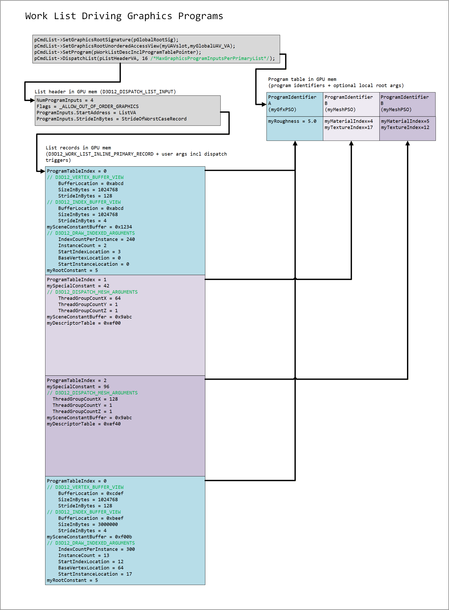
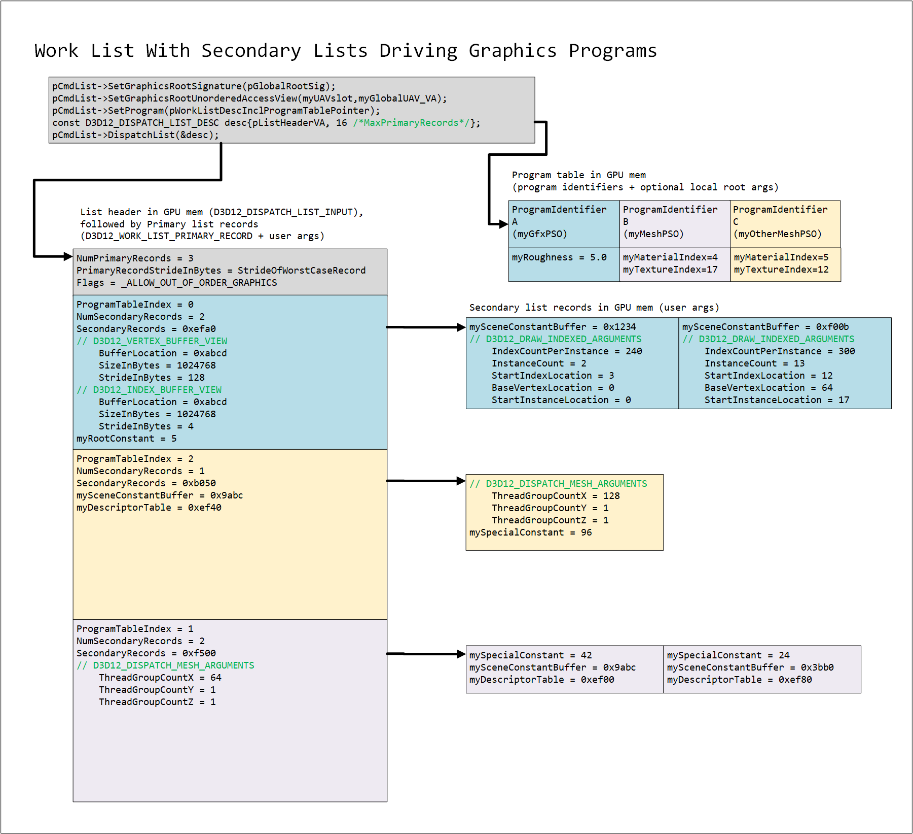
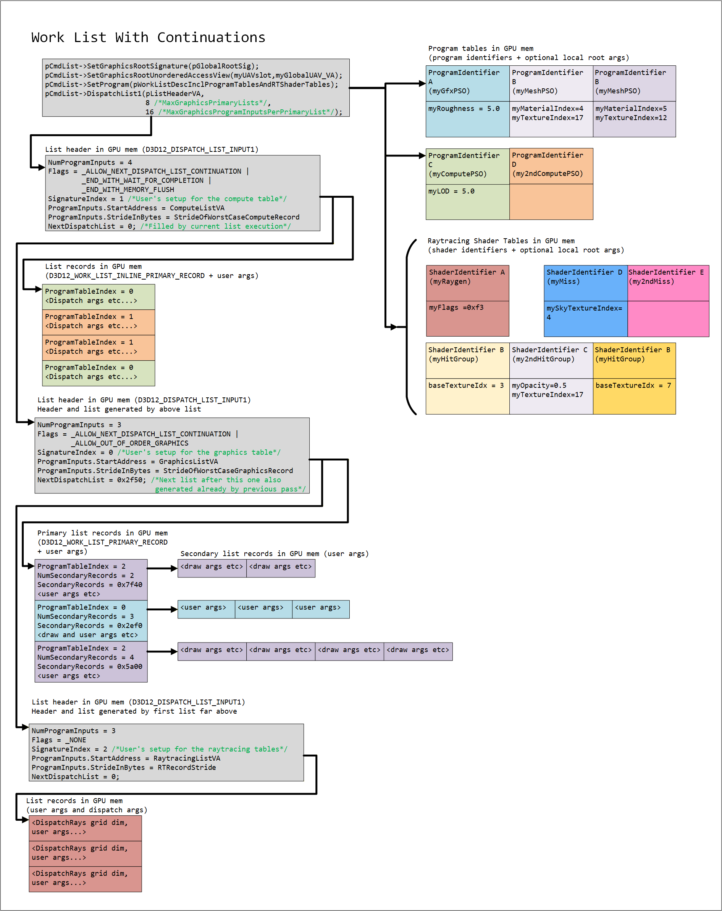

<h1>D3D12 Work Lists</h1>
<h2>GPU-Driven Rendering with Dynamic Program Selection</h2>

v0.851 8/24/2026

---

- [Motivation](#motivation)
- [Work Lists Overview](#work-lists-overview)
  - [Work List Sketches](#work-list-sketches)
- [System Overview](#system-overview)
  - [Terminology](#terminology)
  - [Components](#components)
  - [Workflow](#workflow)
  - [Binding sources at record execution](#binding-sources-at-record-execution)
- [Dispatch Model](#dispatch-model)
  - [Primary record layout](#primary-record-layout)
  - [MaxGraphicsProgramInputsPerPrimaryList](#maxgraphicsprograminputsperprimarylist)
- [Work List Signature](#work-list-signature)
  - [Per-binding source: primary list vs secondary list](#per-binding-source-primary-list-vs-secondary-list)
  - [Argument layouts and the signature objects](#argument-layouts-and-the-signature-objects)
  - [Record byte layouts](#record-byte-layouts)
    - [Per-arg natural alignment](#per-arg-natural-alignment)
    - [Stride derivation](#stride-derivation)
    - [Divergence from ExecuteIndirect](#divergence-from-executeindirect)
  - [Program table slot layout](#program-table-slot-layout)
  - [Supported argument types](#supported-argument-types)
  - [Per-argument-type layouts](#per-argument-type-layouts)
    - [\_INCREMENTING\_CONSTANT](#_incrementing_constant)
    - [\_DESCRIPTOR\_TABLE](#_descriptor_table)
    - [\_DISPATCH\_RAYS\_DIMENSIONS](#_dispatch_rays_dimensions)
    - [\_FIXED\_DISPATCH](#_fixed_dispatch)
    - [\_INLINE\_ROOT\_PARAMETER](#_inline_root_parameter)
    - [\_INLINE\_STATIC\_SAMPLER](#_inline_static_sampler)
    - [\_DISPATCH\_LIST\_HEADER\_POINTER](#_dispatch_list_header_pointer)
    - [\_PROGRAM\_TABLE\_POINTER](#_program_table_pointer)
    - [\_PRIMARY\_LIST\_POINTER](#_primary_list_pointer)
    - [\_PRIMARY\_RECORD\_POINTER](#_primary_record_pointer)
    - [\_SECONDARY\_LIST\_POINTER](#_secondary_list_pointer)
    - [\_SECONDARY\_RECORD\_POINTER](#_secondary_record_pointer)
    - [Other argument types](#other-argument-types)
  - [Root signature bindings](#root-signature-bindings)
  - [Input Assembler bindings](#input-assembler-bindings)
  - [Record strides](#record-strides)
  - [State leakage and reset](#state-leakage-and-reset)
  - [Incrementing constant semantics](#incrementing-constant-semantics)
- [Program Table](#program-table)
  - [Program table record layout](#program-table-record-layout)
  - [Subobject variation mask](#subobject-variation-mask)
  - [Program table entries](#program-table-entries)
  - [State object integration for program-table programs](#state-object-integration-for-program-table-programs)
  - [Local root signatures](#local-root-signatures)
    - [Two authoring paths](#two-authoring-paths)
    - [Why no implicit-args path for the global root signature](#why-no-implicit-args-path-for-the-global-root-signature)
    - [Storage of local root arguments](#storage-of-local-root-arguments)
    - [Rules](#rules)
  - [Raytracing pipeline programs](#raytracing-pipeline-programs)
    - [Local root arguments in raytracing-class signatures](#local-root-arguments-in-raytracing-class-signatures)
    - [Using the same RTPSO with and without Work Lists](#using-the-same-rtpso-with-and-without-work-lists)
    - [App-side flow](#app-side-flow)
  - [Populating the program table](#populating-the-program-table)
- [Binding via SetProgram](#binding-via-setprogram)
  - [Compatibility of bind type with dispatch method](#compatibility-of-bind-type-with-dispatch-method)
- [Tier 2 Dispatch Features](#tier-2-dispatch-features)
  - [MaxGraphicsPrimaryLists](#maxgraphicsprimarylists)
- [Signature Selection](#signature-selection)
  - [Uniformity constraints across program command signatures](#uniformity-constraints-across-program-command-signatures)
- [Dispatch List Continuations](#dispatch-list-continuations)
  - [Next-list pointer semantics](#next-list-pointer-semantics)
  - [Effect of continuations on per-list state](#effect-of-continuations-on-per-list-state)
- [Execution Order and State Scoping](#execution-order-and-state-scoping)
- [Compatibility and Validation](#compatibility-and-validation)
- [GPU Timeline Validation Hooks](#gpu-timeline-validation-hooks)
  - [Validation hook areas](#validation-hook-areas)
  - [Validation program table](#validation-program-table)
  - [System-generated validator pointer arg types](#system-generated-validator-pointer-arg-types)
  - [Binding the validation program table](#binding-the-validation-program-table)
  - [Validator invocation order and barriers](#validator-invocation-order-and-barriers)
  - [Validator defensive neutralization patterns](#validator-defensive-neutralization-patterns)
  - [Validation hooks in continuation chains](#validation-hooks-in-continuation-chains)
  - [Validation hooks limitations](#validation-hooks-limitations)
- [Interaction with other command-list features](#interaction-with-other-command-list-features)
  - [Predication](#predication)
  - [Bundles](#bundles)
  - [Command queue type](#command-queue-type)
  - [Render passes](#render-passes)
  - [Queries and counters](#queries-and-counters)
  - [Object lifetime](#object-lifetime)
  - [PIX and debug](#pix-and-debug)
- [Resource States and Synchronization](#resource-states-and-synchronization)
- [Example](#example)
  - [GPU culling and work list emission](#gpu-culling-and-work-list-emission)
- [Feature Tiers and Capability Queries](#feature-tiers-and-capability-queries)
  - [Tier 1](#tier-1)
  - [Tier 2](#tier-2)
- [API](#api)
  - [Device methods](#device-methods)
    - [CheckFeatureSupport](#checkfeaturesupport)
      - [CheckFeatureSupport Structures](#checkfeaturesupport-structures)
        - [D3D12\_FEATURE\_DATA\_WORK\_LISTS](#d3d12_feature_data_work_lists)
        - [D3D12\_WORK\_LISTS\_TIER](#d3d12_work_lists_tier)
    - [CreateProgramCommandSignature](#createprogramcommandsignature)
      - [CreateProgramCommandSignature Structures](#createprogramcommandsignature-structures)
        - [D3D12\_PROGRAM\_COMMAND\_SIGNATURE\_DESC](#d3d12_program_command_signature_desc)
    - [CreateWorkListSignature](#createworklistsignature)
      - [CreateWorkListSignature Structures](#createworklistsignature-structures)
        - [D3D12\_WORK\_LIST\_SIGNATURE\_DESC](#d3d12_work_list_signature_desc)
        - [D3D12\_WORK\_LIST\_ARGUMENT\_DESC](#d3d12_work_list_argument_desc)
        - [D3D12\_INDIRECT\_ARGUMENT\_SOURCE](#d3d12_indirect_argument_source)
        - [D3D12\_INDIRECT\_ARGUMENT\_BINDING](#d3d12_indirect_argument_binding)
    - [CreateWorkListSignatureArray](#createworklistsignaturearray)
      - [CreateWorkListSignatureArray Structures](#createworklistsignaturearray-structures)
        - [D3D12\_WORK\_LIST\_SIGNATURE\_ARRAY\_DESC](#d3d12_work_list_signature_array_desc)
  - [Command list methods](#command-list-methods)
    - [SetProgram](#setprogram)
      - [SetProgram Structures](#setprogram-structures)
        - [D3D12\_PROGRAM\_TYPE](#d3d12_program_type)
        - [D3D12\_WORK\_LIST\_BINDING\_TYPE](#d3d12_work_list_binding_type)
        - [D3D12\_DISPATCH\_RAYS\_DIMENSIONS](#d3d12_dispatch_rays_dimensions)
        - [D3D12\_WORK\_LIST\_RAYTRACING\_BINDING](#d3d12_work_list_raytracing_binding)
        - [D3D12\_WORK\_LIST\_BINDING](#d3d12_work_list_binding)
        - [D3D12\_WORK\_LIST\_PROGRAM\_TABLE\_BINDING](#d3d12_work_list_program_table_binding)
        - [D3D12\_SET\_WORK\_LIST\_DESC](#d3d12_set_work_list_desc)
        - [D3D12\_SET\_WORK\_LIST\_DESC1](#d3d12_set_work_list_desc1)
    - [DispatchList](#dispatchlist)
      - [DispatchList Structures](#dispatchlist-structures)
        - [D3D12\_DISPATCH\_LIST\_INPUT](#d3d12_dispatch_list_input)
        - [D3D12\_DISPATCH\_LIST\_FLAGS](#d3d12_dispatch_list_flags)
        - [Primary record headers](#primary-record-headers)
        - [D3D12\_WORK\_LIST\_PRIMARY\_RECORD](#d3d12_work_list_primary_record)
        - [D3D12\_WORK\_LIST\_INLINE\_PRIMARY\_RECORD](#d3d12_work_list_inline_primary_record)
        - [D3D12\_WORK\_LIST\_RAYTRACING\_RECORD](#d3d12_work_list_raytracing_record)
        - [D3D12\_WORK\_LIST\_INLINE\_RAYTRACING\_RECORD](#d3d12_work_list_inline_raytracing_record)
    - [DispatchList1](#dispatchlist1)
      - [DispatchList1 Structures](#dispatchlist1-structures)
        - [D3D12\_DISPATCH\_LIST\_INPUT1](#d3d12_dispatch_list_input1)
        - [D3D12\_DISPATCH\_LIST\_FLAGS1](#d3d12_dispatch_list_flags1)
  - [Interfaces](#interfaces)
    - [ID3D12ProgramCommandSignature](#id3d12programcommandsignature)
    - [ID3D12WorkListSignature](#id3d12worklistsignature)
    - [ID3D12WorkListSignatureArray](#id3d12worklistsignaturearray)
  - [Additional state object subobjects](#additional-state-object-subobjects)
    - [Program command signature state-object subobject](#program-command-signature-state-object-subobject)
  - [Constants](#constants)
    - [D3D12\_PROGRAM\_TABLE\_MAX\_BYTE\_STRIDE](#d3d12_program_table_max_byte_stride)
- [DDI Design](#ddi-design)
  - [DDI entry points](#ddi-entry-points)
    - [Shared between Tier 1 and Tier 2](#shared-between-tier-1-and-tier-2)
    - [Tier 1 DDI](#tier-1-ddi)
    - [Tier 2 additions](#tier-2-additions)
    - [GPU-resident structs](#gpu-resident-structs)
    - [Per-signature binding](#per-signature-binding)
  - [Validation hooks DDI](#validation-hooks-ddi)
  - [DDI capability reporting](#ddi-capability-reporting)
- [Open Issues](#open-issues)
- [Change Log](#change-log)

---

# Motivation

D3D [ExecuteIndirect](IndirectDrawing.md) lacks a way to express PSO (pipeline state object) / program changes, an often-requested feature present in various other graphics APIs. This limitation creates challenges for algorithms that need to operate on a large number of PSOs, where active PSOs can only be determined on the GPU timeline.

`ExecuteIndirect` can only express this pattern by issuing one call per possible PSO state and using a 0 indirect-argument count to skip inactive states. The approach is functionally correct but can overwhelm implementations with empty calls, starving the GPU of useful work and causing inefficiencies.

> This feature is early in development.  While the spec is public, implementations are not ready.  Hopefully a preview can be available some time in 2027.

---

# Work Lists Overview

Work Lists allow the GPU to select a pipeline per draw from a GPU-resident program table, dispatching work across multiple pipelines in a single API call. Applications write transparent argument buffers using work list signature layouts and organize dispatch inputs by program table index. The implementation handles pipeline selection and record execution without requiring CPU involvement in PSO bucketing.

Four core capabilities sit behind that summary, available at `WORK_LISTS_TIER_1` and above:

- **GPU-driven program selection per draw.** Each draw, dispatch, or `DispatchRays` issued by one [`DispatchList`](#dispatchlist) call can use a different PSO. The GPU picks which one by reading a per-record index into a GPU-resident table of program identifiers, so one CPU-side call can dispatch work across hundreds of PSOs in any mix, without per-PSO CPU bucketing or `ExecuteIndirect`-style worst-case empty calls. The table is just app-managed GPU memory, so any producer (CPU upload, `CopyBufferRegion`, or shader UAV writes) can populate it.

- **Per-PSO indirect-argument layouts.** Different PSOs in the same dispatch can have different per-record argument shapes, e.g. one PSO updates a root SRV per draw while another updates a per-material root constant, or two PSOs touch different sets of root parameter slots. Each PSO's layout (its [program command signature](#createprogramcommandsignature)) is associated with the program at state-object creation time, so the driver can specialize the per-PSO indirect-argument unpack and root-binding update sequences at compile time.

- **Per-binding source choice.** Some bindings naturally vary per draw (per-instance vertex / instance counts, per-execution root parameters); others are shared across many draws using the same PSO (a per-material CBV, a per-batch root constant). Work Lists lets each argument declare which kind it is, so shared bindings live once in shared per-PSO-batch memory instead of being duplicated in every per-draw record (the way they would under `ExecuteIndirect`). See [Per-binding source](#per-binding-source-primary-list-vs-secondary-list) for the formal model.

- **Fully GPU-resident inputs.** Every input the implementation reads at dispatch time, the record count, the per-record buffers, the program table, even the dispatch input struct itself, lives in GPU memory. A producer compute shader can populate the full pipeline end-to-end with no CPU readback and no fixed CPU-side worst case; the dispatch picks it up where the producer left it.

Optionally, per-program **local root arguments** may live alongside each program identifier in the program table, the way they do in raytracing shader records, so per-program bindings that would otherwise be replicated in every record live once per PSO.

`WORK_LISTS_TIER_2` adds two features for fully GPU-resident multi-phase pipelines, e.g. a compute culling pass that produces a draw list whose record count isn't known on the CPU:

- **Cross-class chaining.** A single work list signature dispatches against records of one executable class (all graphics, all compute, or all raytracing), so a multi-phase pipeline that mixes classes (e.g. a compute-class culling list followed by a graphics-class draw list) needs more than one signature. Aggregating two or more **work list signatures** (the per-list containers, *not* the per-PSO program command signatures already covered above) into an [`ID3D12WorkListSignatureArray`](#id3d12worklistsignaturearray) lets each list in the chain pick which one applies via [`SignatureIndex`](#d3d12_dispatch_list_input1), all within one CPU-side dispatch. Without this, every cross-class transition would need a separate CPU API call.

- **GPU-driven chaining.** Without continuations, an app running N back-to-back lists has to either decide N on the CPU up front (forcing readback of GPU intermediate counts) or always issue worst-case-many lists and let later ones no-op. With continuations, each list publishes its successor's address via [`NextDispatchList`](#d3d12_dispatch_list_input1), the GPU itself decides whether to continue and what comes next. Producer/consumer chains turn into one CPU API call: the previous list's shaders write the next list's entire input (counts, buffers, even the address of the list after that), then the implementation walks the chain end-to-end with no CPU intervention. A list that authors its successor this way sets [`_END_WITH_WAIT_FOR_COMPLETION`](#d3d12_dispatch_list_flags1); a chain already in place needs no flag and launches through greedily.

Combined, the two let an entire GPU-driven pipeline, such as multiple rounds of compute followed by draw, live behind one [`DispatchList1`](#dispatchlist1) call. Command-list state that's *not* part of the per-record argument shape (render-target binding, viewport, scissor, depth-stencil state) stays fixed across the whole chain (it's CPU-set command-list state, set once before the dispatch), so pipelines whose phases need different render-target setups still need separate dispatches.

---

## Work List Sketches

Here are a few introductory diagrams to give an idea of some of the workload shapes possible with Work Lists.  For simplicity these diagrams omit the initial setup objects that let the app explain to the D3D system what the Work List shape will be.  What you see here are examples of what can be done once configured.  The rest of the spec covers all the details.

The simplest shape is a single list of records. Each record selects an entry in the program table, which names the pipeline that record runs, and carries that pipeline's arguments, ending with the dispatch trigger that launches the work. One list can drive several different pipelines: below, a draw and two mesh dispatches sit side by side, and the two mesh records select different program table entries naming the same pipeline, differing only in the local root arguments bound with it.



Records can also fan out. A primary record holds the state that a group of executions shares, such as the vertex and index buffer views in the first record below, and points at a list of secondary records that each supply the arguments for one execution. The shared setup is then stored once rather than repeated per execution. Which arguments live at which level is set by the program command signature associated with each program, so the three programs below choose differently: two of them take their dispatch trigger from the secondary records while the third takes a single trigger from the primary record, and the constant buffer and descriptor table are shared in one program and per-execution in another.



Finally, a list can hand off to another list, so the GPU keeps going without returning to the CPU. Each list in the chain selects its own work list signature, and with it its own program table and executable class, so the chain below runs a compute pass, then a graphics pass, then a raytracing pass from a single [`DispatchList1`](#dispatchlist1) call. A list finds the next one through `NextDispatchList`, which the running list's own shaders can fill in, letting work already in flight decide what happens next. Flags on each list say whether it waits for its work to finish and makes its writes visible before the next list reads them.



---

# System Overview

Work Lists has three structural pieces every dispatch hangs off of: the **objects** the implementation consumes (signature, signature array, program table, primary list), the **workflow** by which a Work List dispatch is authored and consumed across the CPU/GPU timeline, and the **binding sources** that determine where each shader-visible binding's bytes come from at record execution time. The three subsections cover each in turn.

---

## Terminology

A glossary of the terms used throughout the spec. Each entry points at the section where the concept is defined fully.

- **Program command signature** ([`ID3D12ProgramCommandSignature`](#createprogramcommandsignature)). The per-PSO indirect-argument layout; what each generic program is associated with at state-object creation. Unit of compile-time HW specialization. See [Argument layouts and the signature objects](#argument-layouts-and-the-signature-objects).

- **Program** (interchangeably, **PSO**). A [generic program](WorkGraphs.md#generic-programs) declared inside an [`ID3D12StateObject`](Raytracing.md#state-objects), with a [program command signature](#createprogramcommandsignature) associated to it as a subobject. Free-standing `ID3D12PipelineState*` objects are not programs in this spec. See [Program Table](#program-table) and [State object integration for program-table programs](#state-object-integration-for-program-table-programs).

- **Program table.** GPU-resident table the implementation reads per-record to look up which program identifier to use for each invocation. Used by graphics-class and compute-class signatures only. Named to distinguish from raytracing **shader tables**, though the per-slot byte layout is similar; see [Program table slot layout](#program-table-slot-layout). See [Program Table](#program-table).

- **Executable class.** Each [program command signature](#createprogramcommandsignature) is classified by its dispatch-trigger argument as **graphics-class** (`_DRAW` / `_DRAW_INDEXED` / `_DISPATCH_MESH`), **compute-class** (`_DISPATCH` / `_FIXED_DISPATCH`), or **raytracing-class** (`_DISPATCH_RAYS_DIMENSIONS`). See [Dispatch Model](#dispatch-model) and [Root signature bindings](#root-signature-bindings).

- **Primary record / primary list.** A [`DispatchList`](#dispatchlist) consumes a **primary list** of **primary records**. Each primary record's contents depend on its signature's executable class and per-arg source choices; see [Primary record layout](#primary-record-layout) for the possible record shapes.

- **Secondary record / secondary list.** When any of a [program command signature](#createprogramcommandsignature)'s args have `Source == SOURCE_SECONDARY_RECORD`, each primary record points at a **secondary list** of **secondary records** (one per execution); each secondary record carries one execution's value for those args. Signatures whose args are all primary-sourced have no secondary list. See [Per-binding source](#per-binding-source-primary-list-vs-secondary-list).

- **LRA (local root arguments).** Per-PSO local-root-sig argument bytes; live in the program table slot alongside the program identifier, not in records. See [Local root signatures](#local-root-signatures).

- **Work list signature** ([`ID3D12WorkListSignature`](#createworklistsignature)). Per-list container that aggregates one or more program command signatures under a shared global root signature. See [Work List Signature](#work-list-signature).

- **Continuation / continuation chain** (Tier 2). The GPU follows a per-list `NextDispatchList` pointer to chain into the next dispatch list autonomously; the whole sequence under one CPU-issued [`DispatchList1`](#dispatchlist1) is the **continuation chain**. See [Dispatch List Continuations](#dispatch-list-continuations).

- **Signature array** ([`ID3D12WorkListSignatureArray`](#id3d12worklistsignaturearray), Tier 2). Aggregates one or more work list signatures; each dispatch list in a chain picks which to use via its `SignatureIndex`. See [Signature Selection](#signature-selection).

- **GPU Timeline Validation Hooks** (Tier 2 only, debug-layer mechanism). Mechanism for attaching validation compute programs that the implementation invokes on the GPU around dispatch-list record processing, for continuation lists that CPU-side validation cannot reach (the GPU follows continuations autonomously, so the CPU can record validation work only for the head list). See [GPU Timeline Validation Hooks](#gpu-timeline-validation-hooks).

---

## Components

The diagram below shows the objects and data structures involved in a Work List dispatch. The top half is built CPU-side at creation time; the bottom half is GPU-resident and consumed by [`DispatchList`](#dispatchlist) / [`DispatchList1`](#dispatchlist1) at execution time. The shape shown is the Tier 2 / multi-signature one; the Tier 1 shape is a subset (a single bound signature, no per-list signature selection, no continuation chain across multiple lists). Local root arguments and the shader-record-style program-table-slot layout are part of the Tier 1 baseline. See [Feature Tiers and Capability Queries](#feature-tiers-and-capability-queries) for the per-tier matrix.

```
┌────────────────────────────────────────────────────────────────────────────┐
│                        CREATION-TIME OBJECTS (CPU)                         │
│                                                                            │
│ ┌──────────────────────────────┐                                           │
│ │ ID3D12WorkListSignature      │                                           │
│ │ - pProgramCommandSignatures  │                                           │
│ │   (one or more)              │                                           │
│ │ - SubobjectMask              │                                           │
│ │                              │                                           │
│ │ (strides + slot count are    │                                           │
│ │  per-dispatch; see           │                                           │
│ │  D3D12_DISPATCH_LIST_INPUT)  │                                           │
│ └──────────────┬───────────────┘                                           │
│                │                                                           │
│  ┌─────────────▼──────────────────┐     ┌────────────────────────────┐     │
│  │ ID3D12ProgramCommandSignatures │     │ Generic Program(s)         │     │
│  │ "PCS" (one per PSO arg shape)  │     │  /  RTPSO shaders          │     │
│  │  - pArgumentDescs[]            │     │                            │     │
│  │  - SecondaryRecordByteStride   ◄─────┤  + ProgramCommandSig assoc │     │
│  │  - pGlobalRootSignature        │     │  + (opt) LocalRootsig,     │     │
│  │    (optional; uniform across   │     │    declared in PCS' args   │     │
│  │     all PCSes in the WLS)      │     │    for convenience, or in  │     │
│  │                                │     │    a state-object subobject│     │
│  │                                │     │    + association           │     │
│  │                                │     │  (defined in               │     │
│  │                                │     │   ID3D12StateObject(s))    │     │
│  └────────────────────────────────┘     └────────────────────────────┘     │
│                                                                            │
│  Direct-bind path (Tier 1+; Tier 2 when no validation hooks attached):     │
│      bind ID3D12WorkListSignature directly via SetProgram                  │
│      (D3D12_PROGRAM_TYPE_WORK_LIST)                                        │
│                                                                            │
│  Array bind path (Tier 2 only; required for multi-signature, also          │
│  required for single-signature with GPU Timeline Validation Hooks):        │
│      CreateWorkListSignatureArray(                                         │
│          { NumSignatures, pSignatures[] } )    (NumSignatures >= 1)        │
│              │                                                             │
│              ▼                                                             │
│      ID3D12WorkListSignatureArray                                          │
│      (then bind via SetProgram,                                            │
│       D3D12_PROGRAM_TYPE_WORK_LIST1)                                       │
│                                                                            │
│  (Lists in a Tier 2 continuation chain pick from pSignatures via           │
│   SignatureIndex, switching modes between continuations.)                  │
│                                                                            │
└────────────────────────────────────────────────────────────────────────────┘
```

> Abbreviations in diagram: PCS = program command signature; WLS = work list signature; PSO = pipeline state object; RTPSO = raytracing pipeline state object.

Legend for the components diagram:

- **Generic Program(s) / RTPSO shaders**: each is a shader entity declared in an `ID3D12StateObject` that carries a program command signature association. Graphics-class / compute-class: a generic-program subobject, reached into a program table by program identifier. Raytracing-class: the raytracing shaders a dispatch invokes (raygen / miss / hit-group / callable), reached through the standard shader tables in the SetProgram-bound [`D3D12_WORK_LIST_RAYTRACING_BINDING`](#d3d12_work_list_raytracing_binding); other shaders in the same RTPSO may carry a different association or none. The diagram draws one box for compactness. See [State object integration for program-table programs](#state-object-integration-for-program-table-programs) and [Raytracing pipeline programs](#raytracing-pipeline-programs).
- **`ID3D12WorkListSignature`**: the per-list container. References one or more `ID3D12ProgramCommandSignature`s via `pProgramCommandSignatures[]` plus a `SubobjectMask` that selects which state-object subobjects may vary across the associated programs. Primary-list stride travels with each [`DispatchList`](#dispatchlist) call in [`D3D12_DISPATCH_LIST_INPUT`](#d3d12_dispatch_list_input); program-table per-slot stride and slot count travel with each [`SetProgram`](#setprogram) bind in [`D3D12_WORK_LIST_PROGRAM_TABLE_BINDING`](#d3d12_work_list_program_table_binding) (for non-raytracing signatures).
- **`ID3D12ProgramCommandSignature`**: the **per-PSO binding layout artifact**. Carries `pArgumentDescs[]` (each arg has a `Type`, a `Source`, and a `Binding`), `SecondaryRecordByteStride`, and an optional `pGlobalRootSignature` (shared across every program command signature in the same work list signature when present; see [Uniformity constraints](#uniformity-constraints-across-program-command-signatures)). The program command signature is the single declaration of the per-PSO arg layout: which args feed which root-sig slots, where each arg's bytes come from, and which root signature each slot lives in (the global and local root signatures complete the binding shape). Local root signature contents are authored either inline via [`_INLINE_*` args](#supported-argument-types) (implicit local root signature path) or via a `D3D12_LOCAL_ROOT_SIGNATURE` state-object subobject + `D3D12_SUBOBJECT_TO_EXPORTS_ASSOCIATION` (explicit local root signature path); see [Local root signatures](#local-root-signatures). Analog of `ID3D12CommandSignature` in `ExecuteIndirect`, scoped per-program rather than globally bound.
- **`+ ProgramCommandSig assoc`** (line inside the Generic Program(s) / RTPSO shaders box, with arrow `◄─────` to the program command signature box): every shader Work Lists can dispatch has a program command signature associated with it in its `ID3D12StateObject` via `D3D12_SUBOBJECT_TO_EXPORTS_ASSOCIATION` (the standard state-object association mechanism; see [Raytracing.md's Default associations](Raytracing.md#default-associations) section for the all-shaders-in-one shorthand commonly used with RTPSOs). The association is the compile-time HW specialization input. Graphics-class and compute-class generic programs carrying it remain exclusive to Work Lists. Raytracing is different: the same RTPSO can be used both by Work Lists and by ordinary `DispatchRays`. Only the raytracing shaders a work list dispatch actually invokes need the selected work list signature's program command signature. See [State object integration for program-table programs](#state-object-integration-for-program-table-programs) and [Using the same RTPSO with and without Work Lists](#using-the-same-rtpso-with-and-without-work-lists).
- **`+ (opt) Local RS`** (line inside the Generic Program(s) / RTPSO shaders box): an optional **per-PSO** local root signature for the program. The local root signature is the per program command signature binding space (vs the global root signature which is shared across program command signatures in a work list signature); it's what unlocks per-PSO arg customization beyond the shared global root signature. Two authoring paths: declared inline via [`_INLINE_*` args](#supported-argument-types) on the program command signature (implicit local root signature path; runtime synthesizes the local root signature and auto-injects it as a state-object subobject covering the program command signature's associated shaders), or declared as a standard `D3D12_LOCAL_ROOT_SIGNATURE` state-object subobject + `D3D12_SUBOBJECT_TO_EXPORTS_ASSOCIATION` (explicit local root signature path; per the standard `D3D12_SUBOBJECT_TO_EXPORTS_ASSOCIATION` rules, which allow per-export associations, a default-association covering everything else, or any mix). Both paths work for graphics-class and compute-class; raytracing-class supports only the explicit path (see [validation rule 21](#compatibility-and-validation)). The byte storage of the resulting local root arguments differs by class: graphics-class and compute-class store them in the per-slot space following the program identifier in the program table (see [Local root signatures](#local-root-signatures)); raytracing-class stores them in shader-table records inside the bound [`D3D12_WORK_LIST_RAYTRACING_BINDING`](#d3d12_work_list_raytracing_binding) (the standard raytracing shader-record layout).
- **`pSignature` / `pSignatures[i]`**: the bound work list signature (single in the direct-bind path; selected by `SignatureIndex` from the bound signature array in the array-bind path). See [Binding via SetProgram](#binding-via-setprogram) for the two bind paths and [Uniformity constraints](#uniformity-constraints-across-program-command-signatures) for what signatures in an array must share.

Once these objects are bound (via [`SetProgram`](#setprogram) with `D3D12_PROGRAM_TYPE_WORK_LIST`), [`DispatchList`](#dispatchlist) reads the per-list inputs from GPU memory:

```
┌────────────────────────────────────────────────────────────────────────────┐
│                       GPU-RESIDENT DATA                                    │
│                                                                            │
│   ┌──────────────────────────────────────────────┐                         │
│   │  D3D12_DISPATCH_LIST_INPUT1 (GPU memory)     │                         │
│   │  ┌─ NumProgramInputs                         │                         │
│   │  ├─ Flags                                    │                         │
│   │  ├─ SignatureIndex = i (Tier 2)              │                         │
│   │  ├─ ProgramInputs.StrideInBytes              │                         │
│   │  ├─ ProgramInputs ────────────────────┐      │                         │
│   │  └─ NextDispatchList   (Tier 2)       │      │                         │
│   └───────────────────────────────────────┼──────┘                         │
│   ┌──────────────────────────┐  ┌─────────▼──────────────────────────────┐ │
│   │ Program Table[i]         │  │ Primary List                           │ │
│   │ (SetProgram-bound;       │  │ (D3D12_WORK_LIST_PRIMARY_RECORD[])     │ │
│   │  pBindings[i])           │  │                                        │ │
│   │ ┌──────────────────────┐ │  │ ┌────────────────────────────────────┐ │ │
│   │ │ slot 0: id(A) │ args │ │  │ │ [0] ProgramTableIndex      = 0     │ │ │
│   │ │ slot 1: id(B) │ args │ │  │ │     NumSecondaryRecords    = 12    │ │ │
│   │ │ slot 2: stale record │ │  │ │     SecondaryRecords ──┐           │ │ │
│   │ │ slot 3: id(C) │ args │ │  │ ├────────────────────────┼───────────┤ │ │
│   │ └──────────────────────┘ │  │ │ [1] ProgramTableIndex  │  = 3      │ │ │
│   └──────────────────────────┘  │ │     NumSecondaryRecords│  = 8      │ │ │
│                                 │ │     SecondaryRecords ──┼──┐        │ │ │
│                                 │ │     MyMaterialSRV      │  │= 0xFFFF│ │ │
│                                 │ └────────────────────────┼──┼────────┘ │ │
│                                 └──────────────────────────┼──┼──────────┘ │
│                                                            │  │            │
│            ┌───────────────────────────────────────────────┘  │            │
│            │                                  ┌───────────────┘            │
│   ┌────────▼─────────────────────┐  ┌─────────▼────────────────────┐       │
│   │ Secondary list (12 entries)  │  │ Secondary list (8 entries)   │       │
│   │ ┌──────────────────────────┐ │  │ ┌──────────────────────────┐ │       │
│   │ │ [0]                      │ │  │ │ [0]                      │ │       │
│   │ │   MyMaterialSRV= 0xAAAA  │ │  │ │   VertexCount  = 32      │ │       │
│   │ │   VertexCount  = 64      │ │  │ │   InstanceCount= 4       │ │       │
│   │ │   InstanceCount= 1       │ │  │ │   StartVertex  = 0       │ │       │
│   │ │   StartVertex  = 0       │ │  │ │   StartInstance= 0       │ │       │
│   │ │   StartInstance= 0       │ │  │ ├──────────────────────────┤ │       │
│   │ │   MyTintColor  = 0xC0FFEE│ │  │ │ [1]                      │ │       │
│   │ ├──────────────────────────┤ │  │ │   ... (and 6 more)       │ │       │
│   │ │ [1]                      │ │  │ └──────────────────────────┘ │       │
│   │ │   ... (and 10 more)      │ │  └──────────────────────────────┘       │
│   │ └──────────────────────────┘ │                                         │
│   └──────────────────────────────┘                                         │
└────────────────────────────────────────────────────────────────────────────┘
```

Legend for the GPU-resident diagram:

- **`id(A)`, `id(B)`, `id(C)`**: program identifiers obtained via `ID3D12StateObjectProperties1::GetProgramIdentifier`. Slot 2's "stale record" might be an invalid id, such as for a program identifier whose program has been deleted, fine as long as executing lists don't reference this slot.
- **Program table stride**: the per-slot stride is the `Table.StrideInBytes` field of the [`D3D12_WORK_LIST_PROGRAM_TABLE_BINDING`](#d3d12_work_list_program_table_binding) supplied at [`SetProgram`](#setprogram) time, app-chosen as `0` or at least `sizeof(D3D12_PROGRAM_IDENTIFIER) = 32` bytes. A `0` stride is the broadcast form (every index resolves to the single record at the table's start address); when the stride is `32`, the table reduces to identifier-only records (no local root arguments).
- **`args`** in each slot: the local root arguments payload, packed exactly per the local root signature associated (in the state object) with the program identified by that slot. See [Local root signatures](#local-root-signatures).
- **Primary list**: each entry is a [primary record](#primary-record-layout) using the [`D3D12_WORK_LIST_PRIMARY_RECORD`](#d3d12_work_list_primary_record) hybrid header (`ProgramTableIndex`, `NumSecondaryRecords`, `SecondaryRecords`); some entries (like `[1]` in this diagram) also carry inline primary-sourced arg payload after the header (the `MyMaterialSRV = 0xFFFF` shown), packed in the signature's `pArgumentDescs` order.
- **Secondary lists**: each `SecondaryRecords` pointer resolves to a buffer of secondary records whose layout (`SecondaryRecordByteStride` and the per-arg byte packing) comes from the [program command signature](#createprogramcommandsignature) associated with the PSO that primary record's `ProgramTableIndex` selects. **Different primary records pointing at different PSOs can have secondary lists with different shapes and strides.** The example uses this freedom:
  - Primary record `[0]` selects a PSO whose program command signature sources `MyMaterialSRV` per-execution (it appears in every secondary record) and also has an extra `MyTintColor` arg unique to this PSO (via [`Binding == LOCAL_ROOT_SIGNATURE`](#d3d12_indirect_argument_binding), which doesn't participate in cross-program command signature uniformity).
  - Primary record `[1]` selects a PSO whose program command signature sources `MyMaterialSRV` from the primary record (the inline `MyMaterialSRV = 0xFFFF` shown there), so its secondary records don't carry that arg at all and the secondary stride is smaller.
  - Both program command signatures share the same global root signature and touch the same global root parameters (uniformity satisfied for global-bound args); they differ in per-arg `Source` choice and in their local-root-sig-bound extra args.

  Each buffer holds `NumSecondaryRecords` records; primary record `[0]` carries 12 secondary records (only the first two are drawn), primary record `[1]` carries 8. The buffers are app-allocated GPU memory.
- **Tier 2 markers**: the diagram shows [`D3D12_DISPATCH_LIST_INPUT1`](#d3d12_dispatch_list_input1), the Tier 2 input struct. Fields marked `(Tier 2)` (`SignatureIndex`, `NextDispatchList`) and the `_1`-suffixed struct itself are absent from the Tier 1 [`D3D12_DISPATCH_LIST_INPUT`](#d3d12_dispatch_list_input). On Tier 1 the bound thing is a single signature (no array), so there is no index to read.
- **`= i`** (next to `SignatureIndex`, Tier 2; also shown as `[i]` on the Program Table box): `i` is the value of `SignatureIndex` for this dispatch list. The same index selects in parallel from the SetProgram-bound `pSignatures[]` (the signature) and `pBindings[]` (the [tagged binding](#d3d12_work_list_binding), the `ProgramTable` member shown in the diagram for graphics/compute, or the `pRaytracing` member for raytracing-class which carries an RTPSO + shader tables and skips the program table). See [Signature Selection](#signature-selection) for the array-bind setup. On Tier 1 (or Tier 2 direct-bind) only a single signature + single binding are present; Tier 1's [`D3D12_DISPATCH_LIST_INPUT`](#d3d12_dispatch_list_input) has no `SignatureIndex` field, and Tier 2 direct-bind requires `SignatureIndex == 0`.
- **Continuation** (Tier 2): *not* drawn as a pipe in the diagram. When [`_ALLOW_NEXT_DISPATCH_LIST_CONTINUATION`](#d3d12_dispatch_list_flags1) is set in `Flags` and `NextDispatchList` is non-null, the GPU re-enters at that address, effectively replaying the entire diagram against a fresh [`D3D12_DISPATCH_LIST_INPUT1`](#d3d12_dispatch_list_input1) (which may select a different signature, possibly of a different executable class). See [Dispatch List Continuations](#dispatch-list-continuations). Tier 1 does not have this field.

---

## Workflow

The diagram below shows the order of operations across the CPU and GPU timelines.

```
                    ┌──────────────────────────────────────────┐
                    │           Application (CPU)              │
                    │                                          │
                    │  1. Create one or more                   │
                    │     ID3D12ProgramCommandSignatures (per- │
                    │     PSO arg layouts, per-arg Source +    │
                    │     Binding, optional GlobalRootSig and  │
                    │     LocalRootSig via inline args or      │
                    │     subobject).                          │
                    │  2. Create one or more                   │
                    │     ID3D12WorkListSignatures, each       │
                    │     wrapping a set of ProgramCommand-    │
                    │     Signatures plus a SubobjectMask      │
                    │     (compile-time HW spec input).        │
                    │  3. Create State Object(s) containing    │
                    │     generic programs (VS/PS, CS, MS)     │
                    │     each associated with one Program-    │
                    │     CommandSignature subobject.          │
                    │     GlobalRootSig: one, shared across    │
                    │     all ProgramCommandSigs in the        │
                    │     WorkListSig. LocalRootSig: per       │
                    │     ProgramCommandSig, declared inline   │
                    │     via _INLINE_* args or via state-     │
                    │     object subobject.                    │
                    │     For RT, build an RTPSO with the      │
                    │     program command signature subobject  │
                    │     associated with the raytracing       │
                    │     shaders the dispatch invokes.        │
                    │  4. (Tier 2 array bind path only)        │
                    │     CreateWorkListSignatureArray with    │
                    │     ID3D12WorkListSignature*s in         │
                    │     pSignatures[]. Required for multi-   │
                    │     signature dispatch and for single-   │
                    │     signature dispatch with GPU Timeline │
                    │     Validation Hooks. Skip on Tier 1 or  │
                    │     when binding one signature directly  │
                    │     with no validation hooks.            │
                    │  5. Source GPU memory for the dispatch   │
                    │     input, primary list, secondary lists │
                    │     (if any), and program table (non-RT  │
                    │     only; RT uses SetProgram-bound RTPSO │
                    │     + shader tables instead). Either CPU │
                    │     pre-allocation or GPU-timeline sub-  │
                    │     allocation works; step 7 fills the   │
                    │     memory.                              │
                    └──────────────┬───────────────────────────┘
                                   │
                    ┌──────────────▼───────────────────────────┐
                    │  6. Command List Recording (CPU)         │
                    │                                          │
                    │  SetProgram (bind signature or array).   │
                    │                                          │
                    │  Set persistent global root params and   │
                    │  IA bindings the records do not          │
                    │  override (CPU-state inherited per the   │
                    │  class-separated binding sets).          │
                    └──────────────┬───────────────────────────┘
                                   │
                    ┌──────────────▼───────────────────────────┐
                    │  7. Populate GPU-Resident Inputs         │
                    │                                          │
                    │  Each input is app-owned GPU memory and  │
                    │  may be filled however the app wants,    │
                    │  CPU map+copy, CopyBufferRegion upload,  │
                    │  shader UAV writes, or any mix.          │
                    │  Inputs the implementation reads:        │
                    │   - program table (non-RT signatures;    │
                    │     often CPU-uploaded once at init;     │
                    │     can be shader-written too) OR        │
                    │     RTPSO + shader tables (raytracing-   │
                    │     class signatures; bound at SetProgram│
                    │     time, no per-call upload)            │
                    │   - secondary lists (per-execution arg   │
                    │     bytes per the signature)             │
                    │   - primary list (records pointing at    │
                    │     the secondary lists and selecting    │
                    │     program-table slots)                 │
                    │   - the outer D3D12_DISPATCH_LIST_INPUT  │
                    │     struct (NumProgramInputs, Flags,     │
                    │     ProgramInputs.StrideInBytes,         │
                    │     ProgramInputs; on Tier 2 also        │
                    │     SignatureIndex, NextDispatchList)    │
                    │                                          │
                    │  Whatever writes each input barriers it  │
                    │  to SHADER_RESOURCE before DispatchList  │
                    │  reads it.                               │
                    └──────────────┬───────────────────────────┘
                                   │
                    ┌──────────────▼───────────────────────────┐
                    │  8. DispatchList / DispatchList1 (GPU)   │
                    │                                          │
                    │  Implementation reads the dispatch list  │
                    │  input, selects the work list signature  │
                    │  (bound on Tier 1, or via SignatureIndex │
                    │  on Tier 2) and its SetProgram-bound     │
                    │  binding (program table for graphics or  │
                    │  compute, RTPSO + shader tables for      │
                    │  raytracing), walks the primary list,    │
                    │  fetches each primary record's secondary │
                    │  records (when applicable), and executes │
                    │  them with the program command           │
                    │  signature's argument layout for each.   │
                    │                                          │
                    │  (Tier 2) If _ALLOW_NEXT_DISPATCH_LIST_  │
                    │  CONTINUATION is set, the GPU reads      │
                    │  NextDispatchList and, if non-null,      │
                    │  re-enters as if DispatchList1 were      │
                    │  called again. The read may happen at    │
                    │  any time unless _END_WITH_WAIT_FOR_     │
                    │  COMPLETION is set, which defers it to   │
                    │  this list's retire point. The next      │
                    │  list's data must already be valid;      │
                    │  shaders here may author it only if      │
                    │  the wait is set. The SetProgram-bound   │
                    │  bindings (program tables, raytracing    │
                    │  bindings, validation program table)     │
                    │  are immutable for the entire chain      │
                    │  (Compatibility rules 14 and 18).        │
                    └──────────────────────────────────────────┘
```

> Abbreviations in diagram: PSO = pipeline state object; RT = raytracing; RTPSO = raytracing pipeline state object; HW = hardware; IA = input assembler.

---

## Binding sources at record execution

A **program command signature** declares the per-PSO arg layout: which args feed which shader-visible slots, where each arg's bytes come from at execution time, and which root signature each slot lives in. That arg list tells you the per-record overrides and any inline local-root-signature declarations, but not the full binding shape on its own: global-root-signature slots not overridden by any arg aren't in it (their structure is in `pGlobalRootSignature`, valued from command-list state), and on the explicit-LRS path the local-root-signature slot structure is in a separate state-object subobject. (On the implicit-LRS path the args declare every local-root-signature slot, including `_PROGRAM_TABLE_RECORD`-sourced ones; only their bytes come from the program-table record, not their declaration.) The full binding shape is the program command signature args together with the global root signature and the local root signature.

Every shader-visible binding slot lives in one of two root signatures, and gets its per-execution value from one of two sources for that scope:

```
                            ┌──────────────────────────────┬──────────────────────────────┐
                            │  PER-EXECUTION OVERRIDE      │  STATIC DEFAULT              │
                            │  (per-record arg present)    │  (no per-record arg)         │
┌───────────────────────────┼──────────────────────────────┼──────────────────────────────┤
│ GlobalRootSig             │  per-record arg's bytes,     │  command-list root state     │
│ (shared across all        │  from primary/secondary      │  (set via SetGraphicsRoot*   │
│ ProgramCommandSigs in the │  record or system;           │  or SetComputeRoot* before   │
│ WorkListSig)              │  Binding == GlobalRootSig    │  DispatchList; preserved     │
│                           │                              │  at end-of-call)             │
├───────────────────────────┼──────────────────────────────┼──────────────────────────────┤
│ LocalRootSig (per-PCS;    │  per-record arg's bytes, from│  program-table record bytes  │
│ each PCS owns its own;    │  primary/secondary record or │  (LRA tail in program-table  │
│ authored inline via       │  system; Binding ==          │  slot). Implicit-LRS:        │
│ _INLINE_ROOT_PARAMETER /  │  LocalRootSig (or            │  _INLINE_ROOT_PARAMETER +    │
│ _INLINE_STATIC_SAMPLER    │  _INLINE_ROOT_PARAMETER with │  Source=_PROGRAM_TABLE_RECORD│
│ args, OR via state-object │  non-_PROGRAM_TABLE_RECORD   │  or _INLINE_STATIC_SAMPLER + │
│ D3D12_LOCAL_ROOT_SIGNATURE│  Source)                     │  Source=_STATIC for baked-in │
│ subobject + association)  │                              │  static samplers).           │
├───────────────────────────┼──────────────────────────────┼──────────────────────────────┤
│ LocalRootSig (raytracing) │  not available; RT-class     │  shader-table record bytes   │
│ (RT-class shaders use the │  PCSes cannot have LRS args  │  (standard raytracing        │
│ explicit-LRS path via     │                              │  shader-record layout, see   │
│ state-object subobject +  │                              │  Local root arguments in     │
│ association)              │                              │  raytracing-class signatures)│
└───────────────────────────┴──────────────────────────────┴──────────────────────────────┘
```

> Abbreviations in diagram: PCS = program command signature; LRA = local root arguments; RT = raytracing.

The PSO sees the merged result: every global root signature slot the program uses (filled from one of the global root signature sources above) plus every local root signature slot the program uses (filled from one of the local root signature sources). The PSO does not see which source any binding came from, only what each slot resolves to when its record runs.

Notes on each cell:

- **global root signature / per-execution override**: a program command signature arg with `Binding == _GLOBAL_ROOT_SIGNATURE` and `Source == _PRIMARY_RECORD` / `_SECONDARY_RECORD` / `_SYSTEM` provides the bytes for that global root signature slot per execution. The arg's `RootParameterIndex` selects the slot in the shared `pGlobalRootSignature`.

- **global root signature / static default**: global root signature slots not touched by any per-record arg keep the value that was set on the command list before [`DispatchList`](#dispatchlist) via `SetGraphicsRoot*` / `SetComputeRoot*` calls. `DispatchList` does not modify them. (End-of-call reset behavior, which applies to slots that ARE touched per-record, is covered in [State leakage and reset](#state-leakage-and-reset).)

- **local root signature / per-execution override**: a program command signature arg targeting local root signature with a per-execution `Source` provides the bytes for that local root signature slot per invocation. Either a conventional arg type (`_CONSTANT` / `_CONSTANT_BUFFER_VIEW` / etc.) with `Binding == _LOCAL_ROOT_SIGNATURE` (explicit local root signature path), or an [`_INLINE_ROOT_PARAMETER`](#_inline_root_parameter) arg with `Source == _PRIMARY_RECORD` / `_SECONDARY_RECORD` / `_SYSTEM` (implicit local root signature path). Local root signature slots are per program command signature, so per-record arg variation effectively lets bindings vary per PSO (the central capability local root signature unlocks). A conventional local arg contributes record bytes sized per its argument type (see [Record byte layouts](#record-byte-layouts)), exactly as its global-scope counterpart does; it is never zero-sized.

- **local root signature / static default** (graphics-class and compute-class): the local-root-argument bytes not overridden per-record come from the program-table record's LRA tail in the program-table slot. In the path where the local root signature is declared implicitly by entries in the program command signature (as opposed to associating a separately created local root signature), an [`_INLINE_ROOT_PARAMETER`](#_inline_root_parameter) arg with `Source == _PROGRAM_TABLE_RECORD` sources its DWORD sub-range from this cell (other sub-ranges of the same slot, if any, can be per-execution-overridden from the override column). On the explicit local root signature path there is no per-arg `_PROGRAM_TABLE_RECORD` source: any slot not overridden by a per-execution conventional arg draws its value from the LRA tail automatically as this static default. `_PROGRAM_TABLE_RECORD` exists only for the implicit path, which declares every slot inline and so needs an explicit way to name the tail as a source. [`_INLINE_STATIC_SAMPLER`](#_inline_static_sampler) args (with `Source == _STATIC`) also live in this cell conceptually; the static sampler is baked into the local root signature at program command signature creation, so there's no per-execution byte payload at all. Raytracing-class is a separate case: see the bottom row of the diagram, the local root arguments come from shader-table records (different storage model) and there is no per-execution override at all (validation rule 21).

> Vertex/index buffer bindings follow the same partition: per-record args feed the slots a signature explicitly binds, and command-list state (whatever the application set via `IASetVertexBuffers` / `IASetIndexBuffer` before [`DispatchList`](#dispatchlist)) feeds the rest. See [Input Assembler bindings](#input-assembler-bindings).

In a multi-signature Tier 2 dispatch, the [Uniformity constraints](#uniformity-constraints-across-program-command-signatures) require every signature *of a given executable class* to update the same set of root-parameter slots, so within each binding set (graphics, or compute / raytracing) the partition above (which global root signature slots are per-record-overridden vs. command-list-state-fed) is stable across the entire [`DispatchList`](#dispatchlist) call. Compute-class and raytracing-class signatures share the same compute root binding set, so their uniformity rule applies jointly across both. Graphics-class signatures write to a separate binding set, independent of compute / raytracing. The finer-grained split *within* per-record args (whether a given arg's bytes come from the primary record, secondary record, or system) is *not* constrained to match across signatures; each signature independently chooses per arg.

Local root signature slots are inherently per program command signature, so local root signature contents/size and the split between per-execution-override and static-default slots can vary across program command signatures in a work list signature; that's a benefit of having multiple program command signatures with different per-record arg layouts.

---

# Dispatch Model

[`DispatchList`](#dispatchlist) (Tier 1) and [`DispatchList1`](#dispatchlist1) (Tier 2) execute work across one or more programs, with per-program batches of records specified in GPU memory. The call reads its parameters, how many programs are launched, how many records each consumes, which program table to consult, which signature applies (Tier 2), whether to chain to a follow-on list (Tier 2), from GPU memory at execution time, so an upstream compute pass can fully author the dispatch with no CPU involvement.

The command list must have a [work list signature](#work-list-signature) bound via [`SetProgram`](#setprogram) before the call. Tier 1 binds a single signature directly via [`D3D12_PROGRAM_TYPE_WORK_LIST`](#d3d12_program_type). Tier 2 additionally supports the array bind path ([`D3D12_PROGRAM_TYPE_WORK_LIST1`](#d3d12_program_type) with [`ID3D12WorkListSignatureArray`](#createworklistsignaturearray)) for multi-signature dispatch and for single-signature dispatch with [GPU Timeline Validation Hooks](#gpu-timeline-validation-hooks). The global root signature on the bound signature applies to every record.

The per-list input is described by [`D3D12_DISPATCH_LIST_INPUT`](#d3d12_dispatch_list_input) (Tier 1) or [`D3D12_DISPATCH_LIST_INPUT1`](#d3d12_dispatch_list_input1) (Tier 2, adding `SignatureIndex` and `NextDispatchList`). The input carries per-list flags ([`D3D12_DISPATCH_LIST_FLAGS`](#d3d12_dispatch_list_flags) / [`_FLAGS1`](#d3d12_dispatch_list_flags1)), a GPU VA of the primary list, and a GPU VA of the program table.

---

## Primary record layout

Each entry of the primary list (`D3D12_DISPATCH_LIST_INPUT::ProgramInputs`) is a **primary record**. For non-raytracing-class signatures, a primary record carries the program-table index for the program to execute, optionally a pointer to a secondary list of secondary records, and optionally inline primary-sourced argument bytes. For raytracing-class signatures, the RTPSO is bound at [`SetProgram`](#setprogram) time so the program-table-index field is dropped; the primary record carries just the optional secondary-list pointer plus inline primary-sourced argument bytes. Which fixed header applies is driven by the signature's executable class and per-argument source choices, see [Per-binding source](#per-binding-source-primary-list-vs-secondary-list). The byte-level layout (offsets, padding rules) is normative in [Primary record layout](#primary-record-layout).

| Signature class | Any `SOURCE_SECONDARY_RECORD` arg? | Primary record struct |
|---|---|---|
| Graphics / Compute | No | [`D3D12_WORK_LIST_INLINE_PRIMARY_RECORD`](#primary-record-headers) |
| Graphics / Compute | Yes | [`D3D12_WORK_LIST_PRIMARY_RECORD`](#primary-record-headers) |
| Raytracing | No | [`D3D12_WORK_LIST_INLINE_RAYTRACING_RECORD`](#primary-record-headers) |
| Raytracing | Yes | [`D3D12_WORK_LIST_RAYTRACING_RECORD`](#primary-record-headers) |

For both structs, the inline arg payload (when present) follows the fixed header in memory, packed in `pArgumentDescs` order. The total size of each primary record (header plus any inline tail plus trailing pad) is the dispatch input's `ProgramInputs.StrideInBytes`.

The byte layouts are:

**Hybrid**, header is [`D3D12_WORK_LIST_PRIMARY_RECORD`](#primary-record-headers); used when the program command signature for the selected PSO has any `SOURCE_SECONDARY_RECORD` args.

| Bytes | Field |
|---|---|
| `[0..3]`   | `ProgramTableIndex` (UINT) |
| `[4..7]`   | `NumSecondaryRecords` (UINT) |
| `[8..15]`  | `SecondaryRecords` (`D3D12_GPU_VIRTUAL_ADDRESS`) |
| `[16..]`   | inline primary-sourced arg payload (in `pArgumentDescs` order, filtered to `SOURCE_PRIMARY_RECORD`); absent when no args are `SOURCE_PRIMARY_RECORD` |

**Fully inline**, header is [`D3D12_WORK_LIST_INLINE_PRIMARY_RECORD`](#primary-record-headers); used when the program command signature for the selected PSO has no `SOURCE_SECONDARY_RECORD` args.

| Bytes | Field |
|---|---|
| `[0..3]`  | `ProgramTableIndex` (UINT) |
| `[4..]`   | inline primary-sourced arg payload (in `pArgumentDescs` order, filtered to `SOURCE_PRIMARY_RECORD`); absent when no args are `SOURCE_PRIMARY_RECORD` |

**Raytracing-class hybrid**, header is [`D3D12_WORK_LIST_RAYTRACING_RECORD`](#primary-record-headers); used when the raytracing-class program command signature has any `SOURCE_SECONDARY_RECORD` args. No `ProgramTableIndex` (raytracing-class signatures don't use a program table; the RTPSO is bound at [`SetProgram`](#setprogram) time).

| Bytes | Field |
|---|---|
| `[0..3]`   | `NumSecondaryRecords` (UINT) |
| `[4..7]`   | (padding for 8-byte alignment of the next field) |
| `[8..15]`  | `SecondaryRecords` (`D3D12_GPU_VIRTUAL_ADDRESS`) |
| `[16..]`   | inline primary-sourced arg payload (in `pArgumentDescs` order, filtered to `SOURCE_PRIMARY_RECORD`); absent when no args are `SOURCE_PRIMARY_RECORD` |

**Raytracing-class fully inline**, layout-only marker type [`D3D12_WORK_LIST_INLINE_RAYTRACING_RECORD`](#primary-record-headers); used when the raytracing-class program command signature has no `SOURCE_SECONDARY_RECORD` args. No fixed header at all.

| Bytes | Field |
|---|---|
| `[0..]`   | inline primary-sourced arg payload (in `pArgumentDescs` order, filtered to `SOURCE_PRIMARY_RECORD`); absent when no args are `SOURCE_PRIMARY_RECORD` |

App responsibility: set the per-dispatch [`D3D12_DISPATCH_LIST_INPUT::ProgramInputs.StrideInBytes`](#d3d12_dispatch_list_input) to fit the chosen header + inline tail + any trailing pad, 8-byte aligned. (The dispatch input declares this stride so the implementation can walk the primary list without inspecting individual records.)

---

## MaxGraphicsProgramInputsPerPrimaryList

The `MaxGraphicsProgramInputsPerPrimaryList` argument to [`DispatchList`](#dispatchlist) and [`DispatchList1`](#dispatchlist1) is the application's upper bound on the largest single primary list's `NumProgramInputs` value within this call (the maximum over each individual list in a [continuation chain](#dispatch-list-continuations), *not* the sum across continuations). Implementations may use this bound to size internal graphics buffers allocated at command-list recording time. Exceeding the bound at execution time is undefined behavior.

For pure compute / raytracing chains (no graphics-class records anywhere), pass 0.

---

# Work List Signature

A **work list signature** ([`ID3D12WorkListSignature`](#createworklistsignature)) is the per-list container that groups one or more [**program command signatures**](#createprogramcommandsignature) (per-PSO indirect-argument layouts) plus a `SubobjectMask` declaring which state-object subobjects may vary across the associated programs. Every contained program command signature must reference the same **global root signature** (the runtime enforces this at signature creation). Primary-list stride, program-table per-slot stride, and program-table slot count are *not* baked into the signature, they travel with each [`DispatchList`](#dispatchlist) call (see [`D3D12_DISPATCH_LIST_INPUT`](#d3d12_dispatch_list_input)) so apps can resize / re-stride without recreating the signature.

The unit of compile-time HW specialization is the program command signature, not the work list signature: each [generic program](#state-object-integration-for-program-table-programs) eligible to appear in the program table is associated with exactly one program command signature at state-object creation, so the driver sees that PSO's indirect-argument layout (which args come from where, which root params they update) while it is still compiling the program.

A work list signature with a single program command signature is the common case (all PSOs in the list share one arg layout). Graphics-class and compute-class work list signatures may contain multiple program command signatures, letting different PSOs in the same list use different per-record arg layouts; each primary record selects the program and its associated signature through `ProgramTableIndex`. A raytracing-class work list signature contains exactly one program command signature because raytracing records have no `ProgramTableIndex` or other PCS selector. Tier 2 changes the raytracing PCS only by selecting a different one-PCS work list signature through `SignatureIndex`. Cross-class chaining likewise uses separate work list signatures; a single work list signature cannot mix executable classes.

---

## Per-binding source: primary list vs secondary list

Each argument in a [program command signature](#createprogramcommandsignature) has a **source** indicating where its value comes from, the [`D3D12_INDIRECT_ARGUMENT_SOURCE`](#d3d12_indirect_argument_source) enum on each [`D3D12_WORK_LIST_ARGUMENT_DESC`](#d3d12_work_list_argument_desc) selects `SOURCE_PRIMARY_RECORD` (per-primary-record bytes; shared across every execution under that primary record), `SOURCE_SECONDARY_RECORD` (per-execution bytes in the secondary list), or `SOURCE_SYSTEM` (value synthesized by the implementation at invocation time; no record bytes are read for the arg). Most arg types accept `SOURCE_PRIMARY_RECORD` or `SOURCE_SECONDARY_RECORD`; arg types whose value the implementation supplies (e.g., [`_INCREMENTING_CONSTANT`](#_incrementing_constant), and the [validation pointer arg types](#gpu-timeline-validation-hooks)) require `SOURCE_SYSTEM`.

`SOURCE_PRIMARY_RECORD` is useful when a binding (e.g., a per-material root constant or CBV) is the same across many invocations of one program selection, it lives once in the primary record instead of being duplicated in every secondary record. When **no** argument of a given program command signature is `SOURCE_SECONDARY_RECORD`, primary records selecting that command sig don't have a secondary list at all and the primary record IS the record (see [Primary record layout](#primary-record-layout)).

Different program command signatures within the same work list signature can independently choose per-arg sources, so one PSO's secondary record can be small (few `SOURCE_SECONDARY_RECORD` args) while another's is large; each program command signature carries its own `SecondaryRecordByteStride`.

---

## Argument layouts and the signature objects

The per-record argument layout is described by an array of [`D3D12_WORK_LIST_ARGUMENT_DESC`](#d3d12_work_list_argument_desc) entries on a [program command signature](#createprogramcommandsignature), each carrying a `Type` (from the shared `D3D12_INDIRECT_ARGUMENT_TYPE` enum), a `Source` (from [`D3D12_INDIRECT_ARGUMENT_SOURCE`](#d3d12_indirect_argument_source)), a `Binding` (from [`D3D12_INDIRECT_ARGUMENT_BINDING`](#d3d12_indirect_argument_binding)), and a type-specific payload (root parameter index, vertex buffer slot, etc.). Each program command signature also carries its own optional `pGlobalRootSignature` (must match across all program command signatures in a work list signature when non-null; see [Uniformity constraints](#uniformity-constraints-across-program-command-signatures) and its own `SecondaryRecordByteStride`. Local root signature for the program command signature is authored either inline via [`_INLINE_ROOT_PARAMETER`](#_inline_root_parameter) / [`_INLINE_STATIC_SAMPLER`](#_inline_static_sampler) args in `pArgumentDescs` (implicit local root signature path) or via a standard `D3D12_LOCAL_ROOT_SIGNATURE` state-object subobject + association (explicit local root signature path); see [Local root signatures](#local-root-signatures). A program command signature is created via [`CreateProgramCommandSignature`](#createprogramcommandsignature) from a [`D3D12_PROGRAM_COMMAND_SIGNATURE_DESC`](#d3d12_program_command_signature_desc).

The set of program command signatures that may be referenced by a single list, plus the `SubobjectMask` over varying state-object subobjects, is described by [`D3D12_WORK_LIST_SIGNATURE_DESC`](#d3d12_work_list_signature_desc), which [`CreateWorkListSignature`](#createworklistsignature) consumes to produce an [`ID3D12WorkListSignature`](#id3d12worklistsignature). Primary-list stride, program-table stride, and program-table slot count come in per-dispatch via [`D3D12_DISPATCH_LIST_INPUT`](#d3d12_dispatch_list_input). Compile-time HW specialization happens once each program command signature is associated with generic programs in a state object (see [State object integration for program-table programs](#state-object-integration-for-program-table-programs)); the driver sees the per-PSO indirect-argument layout while it is still compiling the program.

---

## Record byte layouts

The program command signature arg list determines the byte layout of three record types at execution time:

- **Primary record**: a fixed header ([`D3D12_WORK_LIST_PRIMARY_RECORD`](#d3d12_work_list_primary_record), [`D3D12_WORK_LIST_INLINE_PRIMARY_RECORD`](#d3d12_work_list_inline_primary_record), [`D3D12_WORK_LIST_RAYTRACING_RECORD`](#d3d12_work_list_raytracing_record), or [`D3D12_WORK_LIST_INLINE_RAYTRACING_RECORD`](#d3d12_work_list_inline_raytracing_record); see [Primary record layout](#primary-record-layout) for which) plus an inline tail containing the program command signature's `Source == _PRIMARY_RECORD` args in `pArgumentDescs[]` order.
- **Secondary record**: the program command signature's `Source == _SECONDARY_RECORD` args in `pArgumentDescs[]` order, one record per execution.
- **Program-table record** (the local-root-argument bytes not overridden per-record): for graphics-class and compute-class, the LRA tail bytes in each program-table slot; for raytracing-class, shader-table records inside the SetProgram-bound [`D3D12_WORK_LIST_RAYTRACING_BINDING`](#d3d12_work_list_raytracing_binding). Local root signature slot order in the program-table record follows the local root signature slot order (synthesized from `_INLINE_*` args' first-appearance order in the implicit local root signature path, or the explicit local root signature's declared order in the explicit local root signature path).

### Per-arg natural alignment

Each arg occupies the size below and is placed at its natural alignment within its record, with the implementation adding any necessary padding between args to satisfy alignment:

| Arg payload | Size | Alignment |
|---|---|---|
| Root descriptor (CBV / SRV / UAV; `D3D12_GPU_VIRTUAL_ADDRESS`) | 8 bytes | 8-byte |
| Descriptor table (`D3D12_GPU_DESCRIPTOR_HANDLE`) | 8 bytes | 8-byte |
| Root constants (a single `_CONSTANT` arg, `N` tightly packed DWORDs) | `N * 4` bytes | 4-byte |
| `D3D12_VERTEX_BUFFER_VIEW` / `D3D12_INDEX_BUFFER_VIEW` | 16 bytes | 4-byte (struct alignment of the contained members) |
| `D3D12_DRAW_ARGUMENTS` | 16 bytes | 4-byte |
| `D3D12_DRAW_INDEXED_ARGUMENTS` | 20 bytes | 4-byte |
| `D3D12_DISPATCH_ARGUMENTS` / `D3D12_DISPATCH_MESH_ARGUMENTS` | 12 bytes | 4-byte |
| `D3D12_DISPATCH_RAYS_DIMENSIONS` (per-execution raytracing payload) | 12 bytes | 4-byte |
| `_INLINE_ROOT_PARAMETER` | wrapped root parameter's size (recurse) | wrapped root parameter's alignment |
| `_INCREMENTING_CONSTANT` / validator pointer types / `_INLINE_STATIC_SAMPLER` / `_FIXED_DISPATCH` | 0 (no per-execution byte payload) | N/A |

### Stride derivation

The runtime computes the minimum stride for each record class by walking the program command signature args once: placing each arg at the next natural-alignment boundary that fits, summing the sizes plus padding, then rounding the total up to 8-byte for the stride. **User-specified strides must not be less than the minimum stride implied by the arg data** (they may be larger if the app wants extra trailing padding per record). The one exception is `SecondaryRecordByteStride`, which may also be `0` as a broadcast form (every secondary index resolves to the record at the secondary list's start address); see below.

- `ProgramInputs.StrideInBytes` (per-dispatch, on [`D3D12_DISPATCH_LIST_INPUT`](#d3d12_dispatch_list_input)): must be ≥ the minimum primary-record size (header + inline tail) and 8-byte aligned.
- `SecondaryRecordByteStride` (per program command signature, on [`D3D12_PROGRAM_COMMAND_SIGNATURE_DESC`](#d3d12_program_command_signature_desc)): must be `0` or at least the minimum secondary-record size, and (when non-zero) 8-byte aligned. A `0` stride is the broadcast form: every secondary index resolves to the record at the secondary list's start address. A program command signature with no `Source == _SECONDARY_RECORD` args must use `0`.

Apps that want to know the resulting per-arg offsets can compute them with the same rule, applied to their `_INLINE_*` args' declaration order (which is the order the runtime uses when synthesizing the local root signature). The synthesized [`ID3D12RootSignature*`](#id3d12programcommandsignature) itself is also available via [`GetSynthesizedLocalRootSignature`](#id3d12programcommandsignature) for inspection, reuse, or association with a different state object.

### Divergence from ExecuteIndirect

`ExecuteIndirect` packs args tightly with no per-arg alignment padding ("Indirect argument structures have no padding" per [IndirectDrawing.md](IndirectDrawing.md)); WL diverges from this rule to keep alignment consistent with the raytracing-shader-record convention that LRA tail already uses. Apps moving between EI and WL see different record layouts for the same arg list: EI records are tightly packed, WL records are padded per-arg-natural. The implementation handles the difference; apps only need to be aware when authoring per-record byte writers / readers manually.

---

## Program table slot layout

Slot N occupies bytes `[N * ByteStride .. (N+1) * ByteStride - 1]`, where the stride is supplied at [`SetProgram`](#setprogram) time via [`D3D12_WORK_LIST_PROGRAM_TABLE_BINDING::Table.StrideInBytes`](#d3d12_work_list_program_table_binding) (a `0` stride is the broadcast form: every index resolves to the single record at the table's start address):

| Bytes | Field |
|---|---|
| `[0..31]`              | `D3D12_PROGRAM_IDENTIFIER` (system) |
| `[32..32 + LRA_N - 1]` | Program-table-record local root arguments (system); `LRA_N` is the size of program N's program-table-record LRA portion (the LRA bytes not overridden per-record by program command signature args), or 0 if program N has no LRS |
| `[32 + LRA_N..]`       | App-defined padding (ignored by the system) |

App responsibility: set the [`ByteStride`](#d3d12_work_list_program_table_binding) in the [`SetProgram`](#setprogram)-bound [`D3D12_WORK_LIST_PROGRAM_TABLE_BINDING`](#d3d12_work_list_program_table_binding) to `0` (the broadcast form: every index resolves to the single record at the table's start address, holding one program identifier plus that program's LRA) or `>= 32 + max(program-table-record LRA size across all program identifiers actually present in the bound table)`, 8-byte aligned when non-zero. Full validation requires per-dispatch GPU validation by the debug layer (against actually-present program identifiers; see [GPU Timeline Validation Hooks](#gpu-timeline-validation-hooks) and [Compatibility and Validation](#compatibility-and-validation) rule 6). App storage not interpreted by the system is supported by setting a larger stride than the minimum.

---

## Supported argument types

The following argument types are supported in Work List work list signatures:

| Argument Type | Description |
|---|---|
| `D3D12_INDIRECT_ARGUMENT_TYPE_DRAW` | Draw arguments (vertex count, instance count, etc.) |
| `D3D12_INDIRECT_ARGUMENT_TYPE_DRAW_INDEXED` | Indexed draw arguments |
| `D3D12_INDIRECT_ARGUMENT_TYPE_DISPATCH` | Compute dispatch arguments |
| [`D3D12_INDIRECT_ARGUMENT_TYPE_FIXED_DISPATCH`](#_fixed_dispatch) | Compute dispatch trigger whose thread-group counts are fixed on the arg (not read from a record). General-purpose; motivated by GPU-Based Validation. Not in the `ExecuteIndirect` arg set; Work-Lists-specific. |
| `D3D12_INDIRECT_ARGUMENT_TYPE_DISPATCH_MESH` | Mesh shader dispatch arguments |
| `D3D12_INDIRECT_ARGUMENT_TYPE_CONSTANT` | Root constant values |
| `D3D12_INDIRECT_ARGUMENT_TYPE_CONSTANT_BUFFER_VIEW` | Root CBV |
| `D3D12_INDIRECT_ARGUMENT_TYPE_SHADER_RESOURCE_VIEW` | Root SRV |
| `D3D12_INDIRECT_ARGUMENT_TYPE_UNORDERED_ACCESS_VIEW` | Root UAV |
| `D3D12_INDIRECT_ARGUMENT_TYPE_VERTEX_BUFFER_VIEW` | Vertex buffer binding |
| `D3D12_INDIRECT_ARGUMENT_TYPE_INDEX_BUFFER_VIEW` | Index buffer binding |
| [`D3D12_INDIRECT_ARGUMENT_TYPE_INCREMENTING_CONSTANT`](#_incrementing_constant) | Auto-incrementing constant per shader invocation. See [`_INCREMENTING_CONSTANT` layout](#_incrementing_constant) for the payload and [Incrementing constant semantics](#incrementing-constant-semantics) for the runtime behavior. |
| [`D3D12_INDIRECT_ARGUMENT_TYPE_DESCRIPTOR_TABLE`](#_descriptor_table) | Update a descriptor-table root parameter per record. See [Per-argument-type layouts](#per-argument-type-layouts). Not in the `ExecuteIndirect` argument set; Work-Lists-specific. |
| [`D3D12_INDIRECT_ARGUMENT_TYPE_DISPATCH_RAYS_DIMENSIONS`](#_dispatch_rays_dimensions) | Work-Lists-specific raytracing dispatch trigger. Its record payload is only [`D3D12_DISPATCH_RAYS_DIMENSIONS`](#d3d12_dispatch_rays_dimensions) (`Width`, `Height`, `Depth`); the RTPSO and shader tables are bound separately via [`D3D12_WORK_LIST_RAYTRACING_BINDING`](#d3d12_work_list_raytracing_binding). Supported only on devices that report `D3D12_FEATURE_DATA_WORK_LISTS::DispatchRaysSupported == TRUE`. |
| `D3D12_INDIRECT_ARGUMENT_TYPE_DISPATCH_RAYS` | ExecuteIndirect full-descriptor raytracing argument (`D3D12_DISPATCH_RAYS_DESC`). This existing argument type is not valid in a Work Lists program command signature; Work Lists uses `_DISPATCH_RAYS_DIMENSIONS` so its 12-byte record payload is unambiguous. |
| [`D3D12_INDIRECT_ARGUMENT_TYPE_INLINE_ROOT_PARAMETER`](#_inline_root_parameter) | Inline declaration of a local root signature root parameter; payload wraps `D3D12_ROOT_PARAMETER1`. Triggers implicit local root signature synthesis on the containing program command signature (see [Local root signatures](#local-root-signatures)). Graphics-class and compute-class only; see [validation rule 21](#compatibility-and-validation). |
| [`D3D12_INDIRECT_ARGUMENT_TYPE_INLINE_STATIC_SAMPLER`](#_inline_static_sampler) | Inline declaration of a local root signature static sampler; payload wraps `D3D12_STATIC_SAMPLER_DESC1`. Baked into the synthesized local root signature at program command signature creation. Graphics-class and compute-class only; see [validation rule 21](#compatibility-and-validation). |
| [`D3D12_INDIRECT_ARGUMENT_TYPE_DISPATCH_LIST_HEADER_POINTER`](#_dispatch_list_header_pointer) | System-generated [validator pointer arg](#system-generated-validator-pointer-arg-types); only valid in primary-list-validator program command signatures (Tier 2 GPU Timeline Validation Hooks). |
| [`D3D12_INDIRECT_ARGUMENT_TYPE_PROGRAM_TABLE_POINTER`](#_program_table_pointer) | System-generated [pointer arg](#system-generated-validator-pointer-arg-types); valid in a primary-list-validator program command signature (Tier 2) and in a data program command signature (Tier 1; for GBV / conformance testing). Graphics/compute only. |
| [`D3D12_INDIRECT_ARGUMENT_TYPE_PRIMARY_LIST_POINTER`](#_primary_list_pointer) | System-generated [validator pointer arg](#system-generated-validator-pointer-arg-types); only valid in primary-list-validator program command signatures (Tier 2). |
| [`D3D12_INDIRECT_ARGUMENT_TYPE_PRIMARY_RECORD_POINTER`](#_primary_record_pointer) | System-generated [pointer arg](#system-generated-validator-pointer-arg-types); valid in a secondary-list-validator program command signature (Tier 2) and in a data program command signature (Tier 1; bound per-execution, for GBV / conformance testing). |
| [`D3D12_INDIRECT_ARGUMENT_TYPE_SECONDARY_LIST_POINTER`](#_secondary_list_pointer) | System-generated [validator pointer arg](#system-generated-validator-pointer-arg-types); only valid in secondary-list-validator program command signatures (Tier 2). |
| [`D3D12_INDIRECT_ARGUMENT_TYPE_SECONDARY_RECORD_POINTER`](#_secondary_record_pointer) | System-generated [pointer arg](#system-generated-validator-pointer-arg-types); valid in a data program command signature only (Tier 1; bound per-execution to the current secondary record, for GBV / conformance testing; hybrid lists). |

Each program command signature must contain exactly one **dispatch-trigger argument** from this set: `D3D12_INDIRECT_ARGUMENT_TYPE_DRAW`, `D3D12_INDIRECT_ARGUMENT_TYPE_DRAW_INDEXED`, `D3D12_INDIRECT_ARGUMENT_TYPE_DISPATCH`, `D3D12_INDIRECT_ARGUMENT_TYPE_DISPATCH_MESH`, [`D3D12_INDIRECT_ARGUMENT_TYPE_DISPATCH_RAYS_DIMENSIONS`](#_dispatch_rays_dimensions), or [`D3D12_INDIRECT_ARGUMENT_TYPE_FIXED_DISPATCH`](#_fixed_dispatch). This argument's type determines the program command signature's executable class (see [Root signature bindings](#root-signature-bindings)). Unlike `ExecuteIndirect`'s command signatures, the dispatch-trigger argument's position in the arg list is not constrained, it may appear at any index, and (except for [`_FIXED_DISPATCH`](#_fixed_dispatch), whose dimensions are fixed on the arg and read no record bytes) may use either `Source` (`SOURCE_PRIMARY_RECORD` or `SOURCE_SECONDARY_RECORD`) per the signature's per-binding source choices.

[`D3D12_INDIRECT_ARGUMENT_TYPE_DESCRIPTOR_TABLE`](#_descriptor_table) is part of the `D3D12_INDIRECT_ARGUMENT_TYPE` enumeration. Its [`D3D12_WORK_LIST_ARGUMENT_DESC`](#d3d12_work_list_argument_desc) payload identifies which root parameter slot the per-record handle targets:

```c++
struct
{
    UINT RootParameterIndex; // must reference a descriptor-table root parameter
} DescriptorTable;
```

---

## Per-argument-type layouts

---

### _INCREMENTING_CONSTANT

`_INCREMENTING_CONSTANT` consumes no bytes in either the primary record or the secondary record (the counter is supplied by the system, not by the app), but its `D3D12_WORK_LIST_ARGUMENT_DESC::IncrementingConstant` payload carries a Work-Lists-specific `Flags` field beyond the `ExecuteIndirect` `{RootParameterIndex, DestOffsetIn32BitValues}` pair. See [Incrementing constant semantics](#incrementing-constant-semantics) for the runtime behavior (counting unit, per-list reset, per-secondary-list reset).

```c++
struct
{
    UINT                                 RootParameterIndex;
    UINT                                 DestOffsetIn32BitValues;
    D3D12_INCREMENTING_CONSTANT_FLAGS    Flags;
} IncrementingConstant;
```

```c++
typedef enum D3D12_INCREMENTING_CONSTANT_FLAGS
{
    D3D12_INCREMENTING_CONSTANT_FLAG_NONE                      = 0x0,
    D3D12_INCREMENTING_CONSTANT_FLAG_RESET_PER_SECONDARY_LIST  = 0x1,
} D3D12_INCREMENTING_CONSTANT_FLAGS;
DEFINE_ENUM_FLAG_OPERATORS(D3D12_INCREMENTING_CONSTANT_FLAGS);
```

| Flag | Description |
|---|---|
| `_RESET_PER_SECONDARY_LIST` | The counter restarts at 0 at the start of every primary record's secondary list, the shader sees a per-secondary-list index instead of a list-wide index. Valid only when the program command signature is hybrid (has at least one `SOURCE_SECONDARY_RECORD` arg); on a fully-inline signature the flag has no effect because there is no secondary list. Without this flag (default), the counter is list-wide and crosses primary record boundaries. |

The `Source` field on the `_INCREMENTING_CONSTANT` arg desc must be `SOURCE_SYSTEM`: the value is system-supplied (an incrementing per-execution counter), not record-supplied. Any other `Source` value is rejected at [`CreateProgramCommandSignature`](#createprogramcommandsignature).

---

### _DESCRIPTOR_TABLE

For `_DESCRIPTOR_TABLE`, the in-buffer record layout is:

| Argument Type | Per-record bytes | In-buffer payload |
|---|---|---|
| `D3D12_INDIRECT_ARGUMENT_TYPE_DESCRIPTOR_TABLE` | 8 | A `D3D12_GPU_DESCRIPTOR_HANDLE` (8-byte aligned) for the start of the descriptor table, the same value passed to `SetGraphicsRootDescriptorTable` / `SetComputeRootDescriptorTable`. It must address the currently bound descriptor heap of the appropriate type. |

This is the ordinary 8-byte `D3D12_GPU_DESCRIPTOR_HANDLE` an application binds everywhere else, whether through `SetGraphicsRootDescriptorTable` / `SetComputeRootDescriptorTable` on a command list or by writing it into a raytracing shader record. As in those cases, the descriptor heap of the required type (CBV/SRV/UAV vs. sampler) must be bound via `SetDescriptorHeaps` when [`DispatchList`](#dispatchlist) executes; the handle resolves within the bound heap and is not a self-contained pointer the way a `D3D12_GPU_VIRTUAL_ADDRESS`-based root argument is.

> The 1-DWORD root-signature cost of a descriptor table (see [ResourceBinding.md](ResourceBinding.md)) is root-signature-budget accounting, unrelated to this 8-byte record payload; to an application a descriptor table has always been an 8-byte handle.

> Different records in the same list may freely use different handles and may target different sub-tables of the same bound heap. If, at [`DispatchList`](#dispatchlist) time, no descriptor heap of the required type is bound on the command list, behavior for any record that actually executes a `DESCRIPTOR_TABLE` argument is undefined. If both a CBV/SRV/UAV heap and a sampler heap are bound, the implementation routes each record's handle to whichever bound heap matches the root parameter's declared type.

> **Local descriptor tables.** A descriptor table that is a local root argument (an [`_INLINE_ROOT_PARAMETER`](#_inline_root_parameter) with `ParameterType == DESCRIPTOR_TABLE`, or an explicit-path conventional `_DESCRIPTOR_TABLE` arg with `Binding == _LOCAL_ROOT_SIGNATURE`) uses this same 8-byte `D3D12_GPU_DESCRIPTOR_HANDLE`, whether it comes from a record or from the program-table LRA tail, matching how raytracing local root signatures store descriptor tables.

---

### _DISPATCH_RAYS_DIMENSIONS

> **Capability gate.** Use of `_DISPATCH_RAYS_DIMENSIONS` requires `D3D12_FEATURE_DATA_WORK_LISTS::DispatchRaysSupported == TRUE` on the device, orthogonal to `D3D12_WORK_LISTS_TIER`. See [Raytracing pipeline programs](#raytracing-pipeline-programs) for the full RT-class authoring story.

For `_DISPATCH_RAYS_DIMENSIONS`, the in-buffer per-execution payload is a [`D3D12_DISPATCH_RAYS_DIMENSIONS`](#d3d12_dispatch_rays_dimensions) value:

| Argument Type | Per-execution bytes | In-buffer payload |
|---|---|---|
| `D3D12_INDIRECT_ARGUMENT_TYPE_DISPATCH_RAYS_DIMENSIONS` | 12 | A [`D3D12_DISPATCH_RAYS_DIMENSIONS`](#d3d12_dispatch_rays_dimensions): `UINT Width`, `UINT Height`, `UINT Depth`. |

This Work-Lists-specific type is distinct from the existing `D3D12_INDIRECT_ARGUMENT_TYPE_DISPATCH_RAYS`, whose ExecuteIndirect payload is the full `D3D12_DISPATCH_RAYS_DESC`. The distinct enum values make record size and interpretation explicit: Work Lists supplies only dimensions per execution because the RTPSO and four shader tables are bound at command-list level via [`D3D12_WORK_LIST_RAYTRACING_BINDING`](#d3d12_work_list_raytracing_binding).

The dispatch-trigger behavior otherwise matches the other dispatch-trigger types ([`_DRAW`](#supported-argument-types), [`_DRAW_INDEXED`](#supported-argument-types), [`_DISPATCH`](#supported-argument-types), [`_DISPATCH_MESH`](#supported-argument-types)): the signature's other arguments update root parameters of the active raytracing pipeline's global root signature, and the dimensions then launch one ray dispatch. The `Source` field may be `SOURCE_PRIMARY_RECORD` or `SOURCE_SECONDARY_RECORD` per the signature's per-binding source choices.

---

### _FIXED_DISPATCH

> Tier 1+.

`_FIXED_DISPATCH` is a compute dispatch-trigger whose thread-group counts are **declared on the arg** (fixed at [`CreateProgramCommandSignature`](#createprogramcommandsignature)) rather than read from a record. It makes the program command signature compute-class, exactly like [`_DISPATCH`](#supported-argument-types), except the grid is a compile-time constant on the signature instead of a per-execution [`D3D12_DISPATCH_ARGUMENTS`](#supported-argument-types) value pulled from the record. It reads **no per-execution record bytes**; its `Source` must be `_STATIC`.

This is a general-purpose fixed-grid compute trigger. Its motivating consumer is **GPU-Based Validation**, which drives validation work lists whose per-execution programs need a launch grid decoupled from the app's (possibly-invalid) record-sourced dimensions: the validation program launches at a fixed grid (e.g. `(1,1,1)`) while reading the app's dimensions as data (via [`_SECONDARY_RECORD_POINTER`](#_secondary_record_pointer)) to validate them. There is no restriction on its use, any work list may use it for a fixed-grid compute step.

Payload in [`D3D12_WORK_LIST_ARGUMENT_DESC`](#d3d12_work_list_argument_desc)'s union:

```c++
struct
{
    UINT ThreadGroupCountX;
    UINT ThreadGroupCountY;
    UINT ThreadGroupCountZ;
} FixedDispatch;
```

Each of `ThreadGroupCountX` / `Y` / `Z` is validated at [`CreateProgramCommandSignature`](#createprogramcommandsignature) against the device's compute dispatch grid caps, using the same rules as a compute `Dispatch`: each dimension is at most `D3D12_CS_DISPATCH_MAX_THREAD_GROUPS_PER_DIMENSION` (65,535), except a 1D grid (`ThreadGroupCountY == 1` and `ThreadGroupCountZ == 1`) may set `ThreadGroupCountX` up to the device's driver-reported `D3D12_FEATURE_DATA_D3D12_OPTIONS22::Max1DDispatchSize` (see [Increased 1D dispatch dimensions](D3D12IncreasedDispatchDimension.md); this cap is at least 65,535, and is 65,535 on devices without the feature). Since the dimensions are fixed on the signature, this is a create-time check against the reported device caps; values above the cap are rejected there, and so is a zero in any dimension: each of `ThreadGroupCountX` / `Y` / `Z` must be at least `1`, because a fixed zero-thread-group grid is a program that can never dispatch (unlike a record-sourced [`_DISPATCH`](#supported-argument-types), whose per-execution dimensions are not known at creation and so may legally be zero at run time). The signature's other arguments update root parameters and are sourced as usual; only the dispatch dimensions are fixed. The arg type is Work-Lists-specific (not in the `ExecuteIndirect` set) and appears in the shared `D3D12_INDIRECT_ARGUMENT_TYPE` / `D3D12DDI_INDIRECT_ARGUMENT_TYPE` enum; the driver launches the declared `(X, Y, Z)` compute grid per execution with no record read.

---

### _INLINE_ROOT_PARAMETER

> Tier 1+. Local root signature root parameter declared inline; see [Local root signatures](#local-root-signatures).

`_INLINE_ROOT_PARAMETER` declares one root parameter slot in the [program command signature](#createprogramcommandsignature)'s **synthesized local root signature**, inline in the program command signature arg list. This is a convenience: apps can declare local root signature slots directly in the PCS args without authoring a separate `ID3D12RootSignature*` object and wiring it up via a `D3D12_LOCAL_ROOT_SIGNATURE` state-object subobject + association. Each such arg defines BOTH the slot itself (full `D3D12_ROOT_PARAMETER1` content) AND the slot's byte-sourcing semantics (via `Source` and, for constants, `DestOffsetIn32BitValues` / `Num32BitValuesToSet`) in a single arg. The runtime synthesizes the local root signature from these args and auto-injects it as a state-object subobject covering the program command signature's associated shaders. Apps that prefer to author a separate local root signature object can still use the standard subobject + association path; see [Local root signatures](#local-root-signatures) for both paths.

Payload in [`D3D12_WORK_LIST_ARGUMENT_DESC`](#d3d12_work_list_argument_desc)'s union:

```c++
typedef struct D3D12_WORK_LIST_INLINE_ROOT_PARAMETER
{
    D3D12_ROOT_PARAMETER1 RootParameter;     // slot definition: ParameterType (CBV/SRV/UAV/
                                             // CONSTANTS/DESCRIPTOR_TABLE), register binding,
                                             // descriptor ranges, flags, ShaderVisibility
    // For ParameterType == D3D12_ROOT_PARAMETER_TYPE_32BIT_CONSTANTS only: the DWORD
    // sub-range [DestOffsetIn32BitValues, DestOffsetIn32BitValues + Num32BitValuesToSet)
    // of the slot this arg fills, from whichever Source the arg specifies. Both must be 0
    // for other ParameterTypes. A whole-slot fill is DestOffset 0, Num = the slot's
    // Num32BitValues; the footprint is always explicit (no implicit whole-slot default).
    UINT DestOffsetIn32BitValues;
    UINT Num32BitValuesToSet;
} D3D12_WORK_LIST_INLINE_ROOT_PARAMETER;
```

The arg's [`Binding`](#d3d12_indirect_argument_binding) must be `_LOCAL_ROOT_SIGNATURE` (this arg type is local-root-signature-only; there is no analog for the global root signature because the global root signature is shared across program command signatures in a work list signature; see [Local root signatures](#local-root-signatures) for the asymmetry rationale).

The arg's [`Source`](#d3d12_indirect_argument_source) says where this slot's bytes come from:
- `_PRIMARY_RECORD` / `_SECONDARY_RECORD` / `_SYSTEM`: per-record byte override (same semantics as existing arg types)
- `_PROGRAM_TABLE_RECORD`: the arg's DWORD sub-range is sourced from the program-table record's LRA storage (the LRA tail bytes in the program-table slot). One copy per program-table record, shared across every execution of that program. The program-table tail carries exactly the DWORDs sourced this way.

The wrapped `RootParameter.ShaderVisibility` must be `_ALL` (local root signature slots are always visible to all shader stages per [Raytracing.md's Note on shader visibility](Raytracing.md#note-on-shader-visibility)).

Multiple `_INLINE_ROOT_PARAMETER` args may target the same local root signature slot (matching `ShaderRegister + RegisterSpace + ParameterType`) only when `ParameterType == _32BIT_CONSTANTS`, and only if their wrapped `RootParameter` content is identical (apart from `DestOffsetIn32BitValues` / `Num32BitValuesToSet` and `Source`). This composes one constants slot from multiple sources at non-overlapping DWORD sub-ranges, in any mix (e.g., DWORDs 0-3 from the program-table record for a custom per-program arg, DWORDs 4-7 from a secondary record). No DWORD may be sourced more than once. For non-constant `ParameterType`s, only one inline arg per slot is valid. See [validation rule 23](#compatibility-and-validation).

Raytracing-class signatures cannot use this arg type (see [validation rule 21](#compatibility-and-validation)).

---

### _INLINE_STATIC_SAMPLER

> Tier 1+. Local root signature inline static-sampler declaration; see [Local root signatures](#local-root-signatures).

`_INLINE_STATIC_SAMPLER` declares one static sampler in the [program command signature](#createprogramcommandsignature)'s **synthesized local root signature**, inline in the program command signature arg list. This is a convenience matching `_INLINE_ROOT_PARAMETER`: apps can declare the static sampler directly in the PCS args without authoring a separate `ID3D12RootSignature*` with the static sampler declared there and wiring it up via a `D3D12_LOCAL_ROOT_SIGNATURE` state-object subobject + association. The sampler is baked into the local root signature at program command signature creation; there is no per-execution byte payload of any kind. Apps that prefer to author a separate local root signature object can still use the standard subobject + association path; see [Local root signatures](#local-root-signatures) for both paths.

Payload in [`D3D12_WORK_LIST_ARGUMENT_DESC`](#d3d12_work_list_argument_desc)'s union:

```c++
D3D12_STATIC_SAMPLER_DESC1 InlineStaticSampler;     // full static-sampler definition
                                                    // (filter, address modes, comparison
                                                    // func, register binding, flags,
                                                    // etc.); ShaderVisibility must be _ALL
```

The arg's [`Binding`](#d3d12_indirect_argument_binding) must be `_LOCAL_ROOT_SIGNATURE`.

The arg's [`Source`](#d3d12_indirect_argument_source) must be `_STATIC` (the value the spec uses to explicitly say "no per-execution byte payload"; static samplers are baked into the local root signature at program command signature creation).

The standard static-sampler uniformity constraints from raytracing local root signatures apply: multiple LRSes (across multiple program command signatures) defining the same `(ShaderRegister, RegisterSpace)` static sampler must define it identically; the total unique static samplers across the global root signature and all LRSes in a state object must fit the binding-model static-sampler limit. See [Local root signatures vs global root signatures](Raytracing.md#local-root-signatures-vs-global-root-signatures) in Raytracing.md.

Raytracing-class signatures cannot use this arg type (see [validation rule 21](#compatibility-and-validation)).

---

### _DISPATCH_LIST_HEADER_POINTER

> Tier 2 only. Validation hooks API.

System-generated GPU virtual address bound as a root descriptor in the [primary list validator](#validation-hook-areas) or the [signature-selection validator](#validation-hook-areas). The value is the GPU virtual address of the current dispatch list's [`D3D12_DISPATCH_LIST_INPUT1`](#d3d12_dispatch_list_input1). Per-record byte count: `0` (the value is not pulled from any record; the implementation synthesizes it at invocation time).

The `Source` field on the arg desc must be `SOURCE_SYSTEM`: the value is system-supplied. Any other `Source` value is rejected at [`CreateProgramCommandSignature`](#createprogramcommandsignature). The `Binding` field must be `GLOBAL_ROOT_SIGNATURE`: the synthesized value targets the validation program's global root signature at the slot identified by `RootParameterIndex`. `LOCAL_ROOT_SIGNATURE` is rejected at [`CreateProgramCommandSignature`](#createprogramcommandsignature), because the value is invocation-level context, not a per-record local root argument. The slot must be a root-descriptor slot (typed as a UAV in the validator's root signature if the validator intends to write back via the [Validator defensive neutralization patterns](#validator-defensive-neutralization-patterns)).

This arg type is only valid in a program command signature attached to a [primary list validator](#validation-hook-areas) (referenced by a non-zero `ListValidationProgramTableIndex`) or a [signature-selection validator](#validation-hook-areas) (referenced by a non-zero `SignatureSelectionValidationProgramTableIndex` on [`D3D12_SET_WORK_LIST_DESC1`](#d3d12_set_work_list_desc1)). Including it in a normal program command signature, or in a secondary list validator, is rejected at [`CreateProgramCommandSignature`](#createprogramcommandsignature).

---

### _PROGRAM_TABLE_POINTER

> Validator use is Tier 2 (validation hooks); data program command signature use is Tier 1.

System-generated GPU virtual address bound as a root descriptor in the [primary list validator](#validation-hook-areas) or in a data [program command signature](#createprogramcommandsignature) (see [availability](#system-generated-validator-pointer-arg-types)). The value is the `StartAddress` field of the [`D3D12_WORK_LIST_PROGRAM_TABLE_BINDING`](#d3d12_work_list_program_table_binding) bound at [`SetProgram`](#setprogram) time for the current list's selected signature (`pBindings[SignatureIndex].ProgramTable.StartAddress` for the Tier 2 array-bind case, or the single binding's `ProgramTable.StartAddress` for the direct-bind case). Per-record byte count: `0`. In a data program command signature (for GBV or conformance testing) the same table start address is bound as the list shader executes; the shader reaches the current program's slot from the primary record's `ProgramTableIndex` and the bound `ByteStride`. This arg type only applies to graphics-class and compute-class signatures (those that use a program table); declaring it on a raytracing-class program command signature is rejected at [`CreateProgramCommandSignature`](#createprogramcommandsignature), because raytracing-class signatures have no program table.

`Source` must be `SOURCE_SYSTEM`; `Binding` must be `GLOBAL_ROOT_SIGNATURE`, as for [`_DISPATCH_LIST_HEADER_POINTER`](#_dispatch_list_header_pointer). Valid in a primary list validator's program command signature and in a data program command signature; see [System-generated pointer arg types](#system-generated-validator-pointer-arg-types) for the availability rules.

---

### _PRIMARY_LIST_POINTER

> Tier 2 only. Validation hooks API.

System-generated GPU virtual address bound as a root descriptor in the [primary list validator](#validation-hook-areas). The value is the GPU virtual address read from the current dispatch list header's `ProgramInputs` field. Per-record byte count: `0`.

`Source` must be `SOURCE_SYSTEM`; `Binding` must be `GLOBAL_ROOT_SIGNATURE`, as for [`_DISPATCH_LIST_HEADER_POINTER`](#_dispatch_list_header_pointer). Only valid in a primary list validator's program command signature.

---

### _PRIMARY_RECORD_POINTER

> Validator use is Tier 2 (validation hooks); data program command signature use is Tier 1.

System-generated GPU virtual address bound as a root descriptor in [validation programs](#gpu-timeline-validation-hooks) or in a data [program command signature](#createprogramcommandsignature) (see [availability](#system-generated-validator-pointer-arg-types)). The value is the GPU virtual address of the primary record currently driving the invocation: in a secondary list validator, the primary record driving secondary list validation; in a data program command signature (for GBV or conformance testing), the primary record driving the current execution. Per-record byte count: `0`. It applies to all executable classes (graphics-class, compute-class, and raytracing-class); every list has primary records.

`Source` must be `SOURCE_SYSTEM`; `Binding` must be `GLOBAL_ROOT_SIGNATURE`, as for [`_DISPATCH_LIST_HEADER_POINTER`](#_dispatch_list_header_pointer). Valid in a secondary list validator's program command signature (one referenced from the bound validation program table by a non-zero `RecordValidationProgramTableIndex`) and in a data program command signature; see [System-generated pointer arg types](#system-generated-validator-pointer-arg-types) for the availability rules.

---

### _SECONDARY_LIST_POINTER

> Tier 2 only. Validation hooks API.

System-generated GPU virtual address bound as a root descriptor in [validation programs](#gpu-timeline-validation-hooks). The value is the GPU virtual address read from the current primary record's `SecondaryRecords` field, or null when that record is fully-inline and so has no such field. It may be declared on a validator program command signature of any executable class; declaring it does not require the validated records to be hybrid. Per-record byte count: `0`.

`Source` must be `SOURCE_SYSTEM`; `Binding` must be `GLOBAL_ROOT_SIGNATURE`, as for [`_DISPATCH_LIST_HEADER_POINTER`](#_dispatch_list_header_pointer). Only valid in a program command signature attached to a secondary list validator (one referenced from the bound validation program table by a non-zero `RecordValidationProgramTableIndex`).

---

### _SECONDARY_RECORD_POINTER

> Tier 1. Data program command signature use only.

System-generated GPU virtual address bound as a root descriptor in a data [program command signature](#createprogramcommandsignature). The value is the GPU virtual address of the secondary record driving the current execution. Per-record byte count: `0`. Defined only for executions driven by a secondary record (hybrid lists of any executable class, including raytracing-class hybrid lists); for a primary-only list it has no defined value and must not appear in the program command signature.

`Source` must be `SOURCE_SYSTEM`; `Binding` must be `GLOBAL_ROOT_SIGNATURE`, as for [`_DISPATCH_LIST_HEADER_POINTER`](#_dispatch_list_header_pointer). Valid in a data program command signature only (for GBV or conformance testing); it has no validator use, because a secondary list validator processes the whole secondary list via [`_SECONDARY_LIST_POINTER`](#_secondary_list_pointer) rather than a single record. See [System-generated pointer arg types](#system-generated-validator-pointer-arg-types) for the availability rules.

---

### Other argument types

For all other argument types in the table above, the per-record byte layout is the one specified in [IndirectDrawing.md](IndirectDrawing.md#indirect-argument-buffer-structures); that layout is normative for Work Lists too and is not redefined here.

---

## Root signature bindings

- Work list signature arguments specify a `RootParameterIndex` to identify which root signature entry they apply to. `RootParameterIndex` values index into the shared global root signature, the same one each signature was created with, sourced as described in [Uniformity constraints across signatures](#uniformity-constraints-across-program-command-signatures).
- Each program command signature's executable class (determined by its dispatch-trigger argument's type) selects which command-list binding state it writes to. **Graphics-class** signatures ([`_DRAW`](#supported-argument-types) / [`_DRAW_INDEXED`](#supported-argument-types) / [`_DISPATCH_MESH`](#supported-argument-types) trailing) write the *graphics* root binding state and the IA bindings; **compute-class** ([`_DISPATCH`](#supported-argument-types) / [`_FIXED_DISPATCH`](#_fixed_dispatch) trailing) and **raytracing-class** ([`_DISPATCH_RAYS_DIMENSIONS`](#_dispatch_rays_dimensions) trailing) signatures write the *compute* root binding state (raytracing dispatches use the compute binding set, matching standalone `DispatchRays`). These binding sets are independent: a graphics signature in a continuation chain does not interact with the compute root binding state, and vice versa. This is why the [Uniformity constraints](#uniformity-constraints-across-program-command-signatures) on "the same set of root parameters touched" apply *per class* rather than across the whole signature array.
- Entries in the global root signature that are *not* updated by any work list signature retain their command-list-level bindings unmodified throughout the entire [`DispatchList`](#dispatchlist) call (and every continuation list inside it).
- Entries that **are** updated by a work list signature follow the [state leakage and reset](#state-leakage-and-reset) rules below.

---

## Input Assembler bindings

`VertexBuffer` and `IndexBuffer` bindings work the same way they do under [`ExecuteIndirect`](IndirectDrawing.md). For each VB slot (and the IB), if a signature includes a `VERTEX_BUFFER_VIEW` / `INDEX_BUFFER_VIEW` argument that targets the slot, every record's per-record bytes supply that binding; otherwise the binding the application set on the command list before [`DispatchList`](#dispatchlist) (via `IASetVertexBuffers` / `IASetIndexBuffer`) is used. Touched slots reset at end-of-call (after the chain finishes) per [State leakage and reset](#state-leakage-and-reset); untouched slots are preserved unchanged. In multi-signature Tier 2 dispatch, all graphics-class signatures in a [signature array](#createworklistsignaturearray) must touch the same set of VB slots and agree on IB presence, see the IA-uniformity rule in [Uniformity constraints](#uniformity-constraints-across-program-command-signatures), so the per-record-vs-command-list partition is stable across the call regardless of which signature is active.

---

## Record strides

Two strides describe the in-memory layout of records, both 8-byte aligned:

- `ProgramInputs.StrideInBytes`, the stride between primary records in the primary list (`D3D12_DISPATCH_LIST_INPUT::ProgramInputs`). Must fit the chosen primary record header, one of [`D3D12_WORK_LIST_PRIMARY_RECORD`](#d3d12_work_list_primary_record), [`D3D12_WORK_LIST_INLINE_PRIMARY_RECORD`](#d3d12_work_list_inline_primary_record), [`D3D12_WORK_LIST_RAYTRACING_RECORD`](#d3d12_work_list_raytracing_record), or [`D3D12_WORK_LIST_INLINE_RAYTRACING_RECORD`](#d3d12_work_list_inline_raytracing_record) per the signature's executable class and per-arg source choices, plus any inline arg payload plus trailing pad.
- `SecondaryRecordByteStride`, on each [`D3D12_PROGRAM_COMMAND_SIGNATURE_DESC`](#d3d12_program_command_signature_desc), the stride between secondary records in each secondary list (pointed at by `D3D12_WORK_LIST_PRIMARY_RECORD::SecondaryRecords`). A non-zero stride must fit the packed `SOURCE_SECONDARY_RECORD` args plus trailing pad; a `0` stride is the broadcast form (every secondary index resolves to the list's start address), which is also the required value when the program command signature has no `SOURCE_SECONDARY_RECORD` args.

If natural arg packing yields a non-8-byte-multiple size (e.g. a signature containing `D3D12_INDIRECT_ARGUMENT_TYPE_CONSTANT` / [`_DISPATCH`](#supported-argument-types) / [`_DISPATCH_MESH`](#supported-argument-types) / [`_DRAW_INDEXED`](#supported-argument-types) in some combinations), the app pads up to the next 8-byte boundary. There is no per-list or per-record stride override, the implementation walks both lists using the signature's stride values.

---

## State leakage and reset

State leakage is governed by these rules, applied once at the end of the entire [`DispatchList`](#dispatchlist) call (after the original list and any continuation lists have all retired), **not** between lists in a chain:

- If any signature in the chain binds a VB to a particular slot, that VB slot is reset to NULL.
- If any signature in the chain binds an IB, the IB is reset to NULL.
- If any signature in the chain sets a root constant (literal or incrementing), the root constant value is reset to 0.
- If any signature in the chain sets a root view (CBV/SRV/UAV), the root view is reset to NULL.
- If any signature in the chain sets a descriptor table root parameter, that parameter is reset to a NULL descriptor table handle.

Resets apply to the appropriate binding set per signature class, graphics-class signature touches reset graphics root binding state and IA bindings; compute-class and raytracing-class signature touches reset compute root binding state. See [Root signature bindings](#root-signature-bindings).

**Within the chain** (between continuation lists, governed by [Dispatch List Continuations](#dispatch-list-continuations)), no state is reset. This is safe because no shader invocation ever observes a binding "inherited" from a previous record or list: the [Uniformity constraints](#uniformity-constraints-across-program-command-signatures) ensure every shader gets a complete set of bindings from its own record's bytes. (Wherever the [Execution Order rules](#execution-order-and-state-scoping) permit out-of-order execution, "previous" doesn't even have a defined meaning.) The deferred reset is purely about end-state, what the next non-Work-Lists command on the command list will observe after [`DispatchList`](#dispatchlist) returns.

Deferring resets to end-of-call avoids wasted NULL-binds between continuation lists that would just be re-bound by the next list anyway.

> The reset rules match what [`ExecuteIndirect` applies at the end of an indirect call](IndirectDrawing.md#state-leakage); apps that already use those rules can carry the same mental model into Work Lists. The only difference is that Work Lists' "end of call" can encompass a continuation chain rather than a single dispatch.

Reset-to-zero vs. restore-original is an open question, see [Open Issues](#open-issues).

---

## Incrementing constant semantics

[`D3D12_INDIRECT_ARGUMENT_TYPE_INCREMENTING_CONSTANT`](#_incrementing_constant) exposes a system-managed 32-bit unsigned integer counter to the shader as a root constant. The counter writes the root constant identified by the `D3D12_WORK_LIST_ARGUMENT_DESC::IncrementingConstant` payload (`{ RootParameterIndex, DestOffsetIn32BitValues, Flags }`); from the shader's point of view, it is an ordinary root constant. The argument occupies no space in either record buffer; it is resolved at execution time by the implementation.

**Counting unit.** The counter post-increments per **shader invocation** (per PSO launch), not per primary record, not per record traversal. The exact mapping:

- For **hybrid** signatures (signatures with any `SOURCE_SECONDARY_RECORD` arg), one secondary record = one shader invocation. The counter goes `0, 1, 2, ...` across the secondary records, in array order, across all primary records in `ProgramInputs` order. Primary records themselves do *not* increment the counter; they only delimit batches of secondary records.
- For **fully-inline** signatures (no `SOURCE_SECONDARY_RECORD` args), each primary record *is* one shader invocation (no secondary list under it). The counter goes `0, 1, 2, ...` across the primary records in `ProgramInputs` array order.

Within a list:

- The counter is 0 for the first shader invocation and post-increments for each subsequent invocation.
- By default the count does *not* reset at primary record boundaries inside the same list, secondary records of primary record N see counter values continuing on from where primary record N-1's secondary records left off. The [`D3D12_INCREMENTING_CONSTANT_FLAG_RESET_PER_SECONDARY_LIST`](#_incrementing_constant) flag (see [`_INCREMENTING_CONSTANT` layout](#_incrementing_constant) for the full flag set) overrides this for hybrid signatures: when set, the counter restarts at 0 at the start of each primary record's secondary list.

Across lists:

- When a [continuation](#dispatch-list-continuations) starts a new list, the counter resets to 0 (for the new list, if it uses an incrementing constant).
- Each list in a continuation chain is independent with respect to the counter: any given list may or may not use an incrementing constant, lists that do may target different `{RootParameterIndex, DestOffsetIn32BitValues}`, and lists that do may independently set or clear the per-secondary-list reset flag, there is no cross-list uniformity requirement on the feature.

A work list signature can contain at most one incrementing constant.

> **Other indexing variations via primary-sourced constants.** The system provides only the two counters above (list-wide or per-secondary-list); any further per-invocation index the app wants is best built by writing a primary-sourced constant in each primary record. Examples: a primary-record index (write `0, 1, 2, ...` per record at authoring time); a prefix sum of secondary-record counts so the shader can recover the list-wide flat index as `prefix + per_secondary_index` even with [`_RESET_PER_SECONDARY_LIST`](#_incrementing_constant); a per-program or per-batch tag for "which logical bucket am I in". The asymmetry (system handles linear counting, app handles structural locating info) matches how the data naturally flows: the implementation has to count invocations anyway, but only the app knows what structural metadata is meaningful for its workload. If a particular structural value (e.g. system-computed prefix sum) turns out to be a consistent cost driver across apps, such a value can be promoted to a system-provided addition; the current spec leaves it to the app.

> **Interaction with [`_ALLOW_OUT_OF_ORDER_GRAPHICS`](#d3d12_dispatch_list_flags).** The incrementing-constant value is the *position* of the shader invocation in the list's linear invocation sequence (the order described above). It is deterministic regardless of [`_ALLOW_OUT_OF_ORDER_GRAPHICS`](#d3d12_dispatch_list_flags), that flag relaxes *execution* ordering, not *numbering*. In other words, invocation N's shader always sees counter == N, but invocation N may begin or retire before invocation N-1. Shaders that rely on the counter as a stable per-invocation key (e.g. as a UAV index) therefore work unchanged with out-of-order; shaders that interpret it as an execution-order index do not.

> The single-list counter behavior (modulo Work Lists' primary/secondary record split and the per-secondary-list reset flag) matches the same argument type in `ExecuteIndirect` (see [Incrementing constant in IndirectDrawing.md](IndirectDrawing.md#incrementing-constant)). The cross-list reset and per-secondary-list reset behaviors are specific to Work Lists.

---

# Program Table

The program table is a GPU-resident array of records that maps `UINT32` indices to programs. Used by graphics-class and compute-class signatures; raytracing-class signatures don't use a program table at all (the RTPSO and shader tables are bound directly at [`SetProgram`](#setprogram) time; see [Raytracing pipeline programs](#raytracing-pipeline-programs)). It is a transparent, app-managed buffer, there is no opaque per-slot data and no dedicated update API. The application allocates the buffer, writes records into it directly (CPU upload, `CopyBufferRegion`, or shader UAV writes), and may freely re-populate slots between [`SetProgram`](#setprogram) bindings (the bound table is immutable for the duration of any in-flight [`DispatchList`](#dispatchlist), per [Compatibility rule 14](#compatibility-and-validation)).

A given program table corresponds to one [`ID3D12WorkListSignature*`](#work-list-signature) bound at [`SetProgram`](#setprogram) time. At Tier 2, the SetProgram-bound `pBindings[]` array may hold multiple program tables, one per signature slot whose `Type` is `_PROGRAM_TABLE`; each list in the continuation chain picks the signature/binding pair its `SignatureIndex` selects. Two slots may pair the same signature pointer with different program-table bindings (e.g., the same signature over a per-list table of currently-active programs), and different lists in the chain pick whichever pair fits their workload.

---

## Program table record layout

Each program table slot is a `D3D12_PROGRAM_IDENTIFIER` followed by the slot's program-table-record local root arguments (the local-root-argument bytes NOT overridden per-record by program command signature args; see [rule 6](#compatibility-and-validation)):

```
record = { D3D12_PROGRAM_IDENTIFIER (32 bytes) | local root arguments }
```

- `D3D12_PROGRAM_IDENTIFIER` is a 32-byte opaque identifier (the same value type used by [Work Graphs](WorkGraphs.md) and [Raytracing](Raytracing.md) for the same purpose), obtained via `ID3D12StateObjectProperties1::GetProgramIdentifier`.
- The program-table-record local root arguments (the local-root-argument bytes sourced from the program-table record, i.e. not overridden per-record by program command signature args) are packed in the order declared by the local root signature, using the same per-field packing rules raytracing applies to its [shader records](Raytracing.md#shader-record) (root descriptors and descriptor handles are each 8 bytes and 8-byte aligned; root constants are an array of DWORD values with no extra padding). The tail is packed over only the not-overridden subset: a per-record-overridden arg contributes zero tail bytes, so overridden slots leave no dead-space placeholder (the tail is compressed, not the full local-root-signature layout with holes).
- The per-slot stride is `Table.StrideInBytes` field of the [`SetProgram`](#setprogram)-bound [`D3D12_WORK_LIST_PROGRAM_TABLE_BINDING`](#d3d12_work_list_program_table_binding), app-chosen as `0` or at least `sizeof(D3D12_PROGRAM_IDENTIFIER) = 32` bytes, 8-byte aligned when non-zero. A `0` stride is the broadcast form: every index resolves to the single record at the table's start address. Combined with the 8-byte alignment requirement on the program table buffer's GPU VA (see [`D3D12_WORK_LIST_PROGRAM_TABLE_BINDING::Table.StartAddress`](#d3d12_work_list_program_table_binding)), every slot starts at an 8-byte-aligned offset (slot `N` lives at `N * ByteStride`). Whether HW needs more alignment for program-identifier fetch is an [open question](#open-issues).

When no program in the table uses a local root signature, every slot is just the 32-byte identifier (apps may still set `ByteStride > 32` for app-side padding).

> The per-field packing of local root arguments matches raytracing's [shader records](Raytracing.md#shader-record), so apps already familiar with shader-table authoring should find this natural. Per-slot and per-buffer alignment requirements are looser (8 bytes vs. raytracing's 32/64); whether they should be tightened is an [open question](#open-issues).

---

## Subobject variation mask

The `SubobjectMask` field on [`D3D12_WORK_LIST_SIGNATURE_DESC`](#d3d12_work_list_signature_desc) selects which `D3D12_PIPELINE_STATE_SUBOBJECT_TYPE` values may vary across entries in this program table. Programs reachable through a given table may differ only in the subobjects identified by this mask, see the subobject-mask-adherence rule in [Compatibility and Validation](#compatibility-and-validation) for the validation story (which is necessarily GPU-side, since the table is app-authored opaque memory). Must be sufficient to distinguish the program variants the application intends to enroll (e.g., different VS/PS combinations).

```c++
typedef enum D3D12_PIPELINE_STATE_SUBOBJECT_MASK
{
    D3D12_PIPELINE_STATE_SUBOBJECT_MASK_VS              = (1 << D3D12_PIPELINE_STATE_SUBOBJECT_TYPE_VS),
    D3D12_PIPELINE_STATE_SUBOBJECT_MASK_PS              = (1 << D3D12_PIPELINE_STATE_SUBOBJECT_TYPE_PS),
    D3D12_PIPELINE_STATE_SUBOBJECT_MASK_DS              = (1 << D3D12_PIPELINE_STATE_SUBOBJECT_TYPE_DS),
    D3D12_PIPELINE_STATE_SUBOBJECT_MASK_HS              = (1 << D3D12_PIPELINE_STATE_SUBOBJECT_TYPE_HS),
    D3D12_PIPELINE_STATE_SUBOBJECT_MASK_GS              = (1 << D3D12_PIPELINE_STATE_SUBOBJECT_TYPE_GS),
    D3D12_PIPELINE_STATE_SUBOBJECT_MASK_CS              = (1 << D3D12_PIPELINE_STATE_SUBOBJECT_TYPE_CS),
    D3D12_PIPELINE_STATE_SUBOBJECT_MASK_STREAM_OUTPUT   = (1 << D3D12_PIPELINE_STATE_SUBOBJECT_TYPE_STREAM_OUTPUT),
    D3D12_PIPELINE_STATE_SUBOBJECT_MASK_BLEND           = (1 << D3D12_PIPELINE_STATE_SUBOBJECT_TYPE_BLEND),
    D3D12_PIPELINE_STATE_SUBOBJECT_MASK_SAMPLE_MASK     = (1 << D3D12_PIPELINE_STATE_SUBOBJECT_TYPE_SAMPLE_MASK),
    D3D12_PIPELINE_STATE_SUBOBJECT_MASK_RASTERIZER      = (1 << D3D12_PIPELINE_STATE_SUBOBJECT_TYPE_RASTERIZER),
    D3D12_PIPELINE_STATE_SUBOBJECT_MASK_DEPTH_STENCIL   = (1 << D3D12_PIPELINE_STATE_SUBOBJECT_TYPE_DEPTH_STENCIL),
    D3D12_PIPELINE_STATE_SUBOBJECT_MASK_INPUT_LAYOUT    = (1 << D3D12_PIPELINE_STATE_SUBOBJECT_TYPE_INPUT_LAYOUT),
    D3D12_PIPELINE_STATE_SUBOBJECT_MASK_IB_STRIP_CUT_VALUE = (1 << D3D12_PIPELINE_STATE_SUBOBJECT_TYPE_IB_STRIP_CUT_VALUE),
    D3D12_PIPELINE_STATE_SUBOBJECT_MASK_PRIMITIVE_TOPOLOGY = (1 << D3D12_PIPELINE_STATE_SUBOBJECT_TYPE_PRIMITIVE_TOPOLOGY),
    D3D12_PIPELINE_STATE_SUBOBJECT_MASK_SAMPLE_DESC     = (1 << D3D12_PIPELINE_STATE_SUBOBJECT_TYPE_SAMPLE_DESC),
    D3D12_PIPELINE_STATE_SUBOBJECT_MASK_VIEW_INSTANCING = (1 << D3D12_PIPELINE_STATE_SUBOBJECT_TYPE_VIEW_INSTANCING),
    D3D12_PIPELINE_STATE_SUBOBJECT_MASK_AS              = (1 << D3D12_PIPELINE_STATE_SUBOBJECT_TYPE_AS),
    D3D12_PIPELINE_STATE_SUBOBJECT_MASK_MS              = (1 << D3D12_PIPELINE_STATE_SUBOBJECT_TYPE_MS),
} D3D12_PIPELINE_STATE_SUBOBJECT_MASK;
```

> Note: This enum lists only the subobject types that are permitted to vary across program-table entries. States that must be uniform across the table (e.g. the global root signature) aren't included.

> Note: A mask of 0 is valid but uncommon; it only makes sense when every entry has the same `D3D12_PROGRAM_IDENTIFIER` and just the local root arguments differ slot-to-slot. Most apps that use a program table want program variation and will set at least one bit.

---

## Program table entries

Each program table slot holds a single `D3D12_PROGRAM_IDENTIFIER` followed by the configured local-root-arguments payload. Identifiers are obtained from state-object generic programs via:

```c++
D3D12_PROGRAM_IDENTIFIER ID3D12StateObjectProperties1::GetProgramIdentifier(
    LPCWSTR pProgramName
);
```

The application is free to obtain identifiers once at state-object creation time and reuse them, or to look them up on demand.

Any given table entry is only referenced if an executing list points to it and has records to invoke on it; otherwise the memory doesn't need to be initialized.

Every referenced program must satisfy the eligibility rules in [State object integration for program-table programs](#state-object-integration-for-program-table-programs) below, and must be compatible with this signature, including the [`SubobjectMask`](#subobject-variation-mask) constraint that programs in the same table may differ only in the subobjects covered by the mask, and the [local root signature](#local-root-signatures) constraint that each program's program-table-record LRA portion (the LRA bytes not overridden per-record by program command signature args) must fit within `ByteStride - sizeof(D3D12_PROGRAM_IDENTIFIER)`.

---

## State object integration for program-table programs

Programs whose identifiers may appear in a program table are sourced exclusively from [generic programs](WorkGraphs.md#generic-programs) declared in an [`ID3D12StateObject`](Raytracing.md#state-objects). Free-standing `ID3D12PipelineState*` objects created via `CreateGraphicsPipelineState` / `CreateComputePipelineState` are not eligible. (This section covers the graphics-class and compute-class case. Raytracing-class shaders are also state-object-resident and use the same `D3D12_SUBOBJECT_TO_EXPORTS_ASSOCIATION` mechanism to attach a program command signature, but they live inside an RTPSO and are reached via shader-table records rather than program-table slots; see [Raytracing pipeline programs](#raytracing-pipeline-programs) for that path.)

This restriction is what makes compile-time hardware specialization possible. A [program command signature](#createprogramcommandsignature) is associated with each participating generic program at state object creation time, so the driver sees the per-PSO indirect-argument layout while it is still compiling the program and may emit specialized code for each binding access. Because that layout is fixed before compilation, the driver compiles each binding access directly into the program with the per-binding offsets baked in. At execution the system supplies only the base addresses of this invocation's data (the records and program-table slot it draws from), and the compiled code fetches each binding's value at a fixed offset into the appropriate one; a system-supplied `Source` (an incrementing constant, say) is computed at invocation instead. This holds for every binding the program command signature feeds, whatever its `Binding` (global or local root signature) and whatever its [`Source`](#d3d12_indirect_argument_source): the `Source` only selects where each binding's value comes from, governing where the value lives and how often it varies, not when it is resolved. Every binding is resolved per execution, for every `Source`, including `_PROGRAM_TABLE_RECORD`.

The association uses a Program Command Signature subobject ([`D3D12_STATE_SUBOBJECT_TYPE_PROGRAM_COMMAND_SIGNATURE`](#program-command-signature-state-object-subobject)) and the standard `D3D12_SUBOBJECT_TO_EXPORTS_ASSOCIATION` mechanism.

A single program command signature subobject can be associated with one or many generic programs in the state object via `D3D12_SUBOBJECT_TO_EXPORTS_ASSOCIATION`, the same way Root Signatures are associated. Programs that share the same per-PSO arg layout naturally share one program command signature. The association lets the program command signature supply two pieces of root state to each associated program automatically, with different override rules for each:

- **Global root signature** (`pGlobalRootSignature`, required when any arg targets the global root signature (`Binding == _GLOBAL_ROOT_SIGNATURE`) or any associated shader has a global root signature in scope; the program command signature may override some, all, or none of those bindings per-record via args with `Binding == _GLOBAL_ROOT_SIGNATURE`; see [validation rule 26](#compatibility-and-validation)): when supplied, it's supplied to every associated program. A program may declare its own global root signature association in the state object only if it matches the program command signature's `pGlobalRootSignature`; declaring a different one is invalid. All program command signatures referenced by the same [`ID3D12WorkListSignature`](#createworklistsignature) must share this same `pGlobalRootSignature` (when non-null).  The global root signature is optional so that apps that don't need common bindings across PSOs can skip it.
- **Local root signature**: optional, per program command signature. Authored either inline via [`_INLINE_ROOT_PARAMETER`](#_inline_root_parameter) / [`_INLINE_STATIC_SAMPLER`](#_inline_static_sampler) args on the program command signature (implicit local root signature path; runtime auto-injects the synthesized local root signature as a state-object subobject covering the program command signature's associated programs), or via a standard `D3D12_LOCAL_ROOT_SIGNATURE` state-object subobject + `D3D12_SUBOBJECT_TO_EXPORTS_ASSOCIATION` (explicit local root signature path; per the standard `D3D12_SUBOBJECT_TO_EXPORTS_ASSOCIATION` rules, which allow per-export associations, a default-association covering everything else, or any mix). Both paths apply to graphics-class and compute-class generic programs; raytracing-class shaders are restricted to the explicit path (see [validation rule 21](#compatibility-and-validation), and LRS apply to shader tables for raytracing, not touched by Program Command Signatures). The local root signature is optional so that apps that don't need per-program unique bindings can skip it. See [Local root signatures](#local-root-signatures) for how the per-slot local-root-arguments layout follows.

Since most programs need at least some resource bindings, a typical program command signature supplies at least one of: a global root signature (via `pGlobalRootSignature`), a local root signature (via inline args or a separate state-object subobject + association), or both. A program command signature with neither is valid but only useful for shaders that declare no typical resource bindings, perhaps only using vertex buffer inputs for instance.

Requirements:

- Every generic program whose identifier may appear in a program table **must** have a program command signature subobject associated with it.
- The associated program command signature must be one of the [`ID3D12ProgramCommandSignature`](#createprogramcommandsignature)s referenced (via `pProgramCommandSignatures[]`) by the [`ID3D12WorkListSignature`](#id3d12worklistsignature) that the dispatch list runs against (the directly-bound work list signature in the direct-bind path, or the work list signature selected via `SignatureIndex` from the bound [`ID3D12WorkListSignatureArray`](#id3d12worklistsignaturearray) in the array bind path) at the time the slot is referenced.
- A generic program with a program command signature association is **exclusive to Work Lists**. It can only be referenced via its program identifier as a slot value in a program table, it cannot be bound directly via [`SetProgram`](#setprogram), used as a work-graph node, or invoked through any non-[`DispatchList`](#dispatchlist) path. Attempting to do so is invalid.
  - If the same shader configuration is needed both inside and outside Work Lists, declare it as **two** generic programs: one with the program command signature associated (for Work Lists) and one without (for direct use). The two can live in different state objects, or in the same state object under different program names.

**Mixing state objects in a single table.** A program table may hold identifiers for programs sourced from more than one `ID3D12StateObject`. The only constraints are the per-program requirements above, each program must have a program command signature associated that is one of those referenced by the bound work list signature, and each program must satisfy the table's `SubobjectMask`. Apps may freely partition their programs across state objects for build-time or lifetime reasons without affecting program table eligibility.

**Partial graphics programs.** A program command signature is a compile-time specialization input in the same sense as a local or global root signature: the driver compiles its argument-unpack semantics directly into the shader code, and the program command signature is associated with the shaders via `D3D12_SUBOBJECT_TO_EXPORTS_ASSOCIATION`. Like a root signature, it must be associated with the shaders at [partial-program](PartialGraphicsPrograms.md) construction for them to be usable with Work Lists; shaders compiled without one are not Work-Lists-capable. The construction-time association is carried into any generic program that references those shaders by name, via the underlying export. A program command signature association is only valid on shader exports: the state-object validator rejects any attempt to declare one at the link step, so there is no link-time program command signature that could differ from the construction-time association. A program command signature has no in-shader form (unlike a root signature), so it is specified purely by association with the shaders.

---

## Local root signatures

In the context of Work Lists, the **local root signature (LRS)** is the per program command signature binding space. Where the global root signature (GRS) is shared across every program command signature in a work list signature (see [Uniformity constraints](#uniformity-constraints-across-program-command-signatures)), each program command signature has its own local root signature, which is what makes per-PSO arg customization possible: different PSOs in the same work list signature can have different local root signature layouts and different per-record arg behaviors, beyond what their shared global root signature supports.

### Two authoring paths

A program command signature can author its local root signature one of two ways:

1. **Implicit (inline via program command signature args)** (graphics-class and compute-class only). A convenience path that produces a **synthesized local root signature** from inline args, removing the need to author a separate `ID3D12RootSignature*` object and wire it up via a state-object subobject + association. Apps add [`_INLINE_ROOT_PARAMETER`](#_inline_root_parameter) and [`_INLINE_STATIC_SAMPLER`](#_inline_static_sampler) args to the program command signature's `pArgumentDescs[]` with `Binding == _LOCAL_ROOT_SIGNATURE`. Each such arg defines one root sig entry inline (its full `D3D12_ROOT_PARAMETER1` content for root params, or `D3D12_STATIC_SAMPLER_DESC1` for static samplers) AND its byte-sourcing semantics (via `Source`). The runtime synthesizes the local root signature from these args and auto-injects it as a state-object `D3D12_LOCAL_ROOT_SIGNATURE` subobject covering every shader the program command signature is associated with. Apps that want to inspect or share the synthesized local root signature can retrieve it via [`ID3D12ProgramCommandSignature::GetSynthesizedLocalRootSignature`](#id3d12programcommandsignature) but don't need to in the common case. See [validation rules 22-23](#compatibility-and-validation) for path semantics and constraints.

2. **Explicit (state-object subobject + association)**: the standard D3D12 path, available for all three executable classes. App authors an `ID3D12RootSignature*` (with the `D3D12_ROOT_SIGNATURE_FLAG_LOCAL_ROOT_SIGNATURE` flag), wraps it in a `D3D12_STATE_SUBOBJECT_TYPE_LOCAL_ROOT_SIGNATURE` state-object subobject, and associates it with shaders via `D3D12_SUBOBJECT_TO_EXPORTS_ASSOCIATION` (per the standard association mechanism: per-export or default-association covering everything else, in any mix). Program command signature args with `Binding == _LOCAL_ROOT_SIGNATURE` using conventional types (`_CONSTANT` / `_CONSTANT_BUFFER_VIEW` / etc.) reference the local root signature's slots by `RootParameterIndex`. This is the only path available for raytracing-class.

Within a single program command signature, the two paths are mutually exclusive (mixing `_INLINE_*` local root signature args with conventional `Binding == _LOCAL_ROOT_SIGNATURE` args is rejected; see [validation rule 22](#compatibility-and-validation)). Different program command signatures in the same work list signature can independently pick different paths.

### Why no implicit-args path for the global root signature

The global root signature is shared across every program command signature in a work list signature (see [Uniformity constraints](#uniformity-constraints-across-program-command-signatures)). An implicit-args path for the global root signature (authoring it inline via program command signature args) would force every program command signature to repeat the same arg declarations and would require the runtime to equivalence-check them at work list signature creation. The implicit local root signature feature exists specifically because local root signature is per program command signature, where inline declaration removes a real duplication burden; global root signature doesn't have that burden, so a separate `ID3D12RootSignature*` shared across program command signatures (the existing path) remains the right shape.

### Storage of local root arguments

Byte storage of local root arguments differs by class:

- **Graphics-class and compute-class**: the program-table-record portion of the local root arguments (the local-root-argument bytes not overridden per-record by program command signature args) lives in the bytes that follow the program identifier in each program-table slot, the way local root arguments do in a raytracing [shader record](Raytracing.md#shader-record). Per-record-overridden bytes come from the records instead (see [Record byte layouts](#record-byte-layouts)): a per-record-overridden arg contributes zero tail bytes, so the tail is packed over only the not-overridden subset with no dead-space placeholder for overridden slots.
- **Raytracing-class**: local root arguments live in shader-table records inside the SetProgram-bound [`D3D12_WORK_LIST_RAYTRACING_BINDING`](#d3d12_work_list_raytracing_binding); the standard raytracing shader-record layout. See [Local root arguments in raytracing-class signatures](#local-root-arguments-in-raytracing-class-signatures).

The argument-packing layout is the same in both: each argument is placed at its individual alignment (root descriptors and descriptor handles 8-byte; root constants tightly packed DWORDs) in declaration order, matching the layout specified for raytracing local root signatures. See [Record byte layouts](#record-byte-layouts) for how the program command signature arg list determines record byte layouts (primary record, secondary record, LRA tail).

> A nice-to-have follow-on, HLSL inline syntax for declaring a local root signature next to a non-library-target shader, analogous to the `RootSignature("...")` attribute that already works for global root signatures and lib-target locals, is captured under [Open Issues](#open-issues). It is not required for Work Lists to be usable; the programmatic associations above are sufficient.

### Rules

- **Binding completeness (uniform across all classes).** The combination of a shader's **global** root signature (the one shared across every program command signature in a bound work list signature) and its applicable **local** root signature must define all resource bindings the shader declares, with no overlap, exactly as in raytracing.

Rules for the graphics-class and compute-class program-table storage path (for raytracing-class shaders see [Local root arguments in raytracing-class signatures](#local-root-arguments-in-raytracing-class-signatures)):

- Different programs in the same table may have different local root signatures (or none). Each slot's LRA bytes are interpreted per the local root signature of whichever program identifier the slot currently holds; the byte span used per slot is the program-table-record portion of that program's local root signature (the bytes not overridden per-record by program command signature args; see [rule 6](#compatibility-and-validation)).
- For every program that may appear in a given table with a non-zero stride, the program-table-record portion of its local root arguments (the local-root-argument bytes not overridden per-record by program command signature args; sized using raytracing local-root-signature size calculations over that subset) must be ≤ `Table.StrideInBytes - sizeof(D3D12_PROGRAM_IDENTIFIER)`. A program with no local root signature is always compatible. Under the broadcast form (`Table.StrideInBytes == 0`) this ceiling does not apply: every index resolves to the single record at the table's start address, which holds the identifier plus that program's LRA with no next-slot boundary.
- If no program command signature in the work list signature has a local root signature (neither inline-args nor associated state-object subobject) and no programs in the table have a local root signature association, every slot's LRA portion is empty; `ByteStride` only needs to fit the program identifier (32 bytes, plus any app-side padding), or be `0` for the broadcast form.

> The hardware-specialization story is the same as for raytracing: the driver sees the local root signature (along with the program command signature's per-arg layout) at state-object compile time and can emit specialized argument unpack code.

> **What the local root signature carries vs. what the program command signature args carry.** The two are orthogonal, and the driver needs both to emit the unpack code. The local root signature is the binding *structure*: which local slots exist and what each is (type, register binding, descriptor ranges, size), the target each unpacked value is written into. The program command signature args are the per-record *sourcing partition*: for each local slot, whether it is sourced per-record (overridden by a per-execution arg, occupying bytes in the primary or secondary record) or takes its static default from the LRA tail, which record each sourced slot occupies, and, for `_32BIT_CONSTANTS` slots, the DWORD sub-range split. The local root signature is silent on this partition, so a local slot's record-byte contribution is set by the args, not derivable from the local root signature. That is why every per-record-sourced local arg, non-constant ones (CBV / SRV / UAV / descriptor table) included, contributes to the record byte layout and must be counted when sizing the record ([rule 25(e)](#compatibility-and-validation)); it is never zero-sized. The driver correspondingly does not receive the full root-parameter structure a second time through the args: that arrives once via the local root signature, and the args carry only the sourcing partition plus the constant sub-range split.

---

## Raytracing pipeline programs

Raytracing is the third executable class for Work Lists, alongside graphics (which includes mesh shaders via `_DISPATCH_MESH`) and compute. Unlike graphics-class and compute-class, raytracing-class signatures do not use a [program table](#program-table) at all: each list dispatches against exactly one raytracing pipeline state object (RTPSO) plus its four shader tables, all bound at command-list level via [`D3D12_WORK_LIST_RAYTRACING_BINDING`](#d3d12_work_list_raytracing_binding) at [`SetProgram`](#setprogram) time. The per-execution payload of [`_DISPATCH_RAYS_DIMENSIONS`](#_dispatch_rays_dimensions) is then just the dimensions ([`D3D12_DISPATCH_RAYS_DIMENSIONS`](#d3d12_dispatch_rays_dimensions): `Width`, `Height`, `Depth`).

> **Capability gate.** The entire raytracing-class is gated by [`D3D12_FEATURE_DATA_WORK_LISTS::DispatchRaysSupported`](#d3d12_feature_data_work_lists), reported via [`CheckFeatureSupport`](#checkfeaturesupport) and orthogonal to [`D3D12_WORK_LISTS_TIER`](#d3d12_work_lists_tier) (a Tier 1 device may or may not expose it). On devices that don't report this cap, [`CreateProgramCommandSignature`](#createprogramcommandsignature) fails for any program command signature whose dispatch-trigger argument is [`D3D12_INDIRECT_ARGUMENT_TYPE_DISPATCH_RAYS_DIMENSIONS`](#_dispatch_rays_dimensions). Apps must check the cap before authoring any raytracing-class program command signature.

The RTPSO is bound directly as `ID3D12StateObject*` in the raytracing binding's `pRaytracingStateObject` member; there is no Work-Lists-specific identifier the app must extract from the RTPSO. Each raytracing-class binding in a Tier 2 signature array may reference a different RTPSO and shader-table set. `SignatureIndex` selects the one-PCS raytracing work list signature and its paired RTPSO/shader-table binding together, so continuation lists may switch RTPSO and program command signature without new API surface. The array-wide shared-global-root-signature rule still applies: every PCS in every work list signature in the array references the same `pGlobalRootSignature`, matching the single command-list compute-root binding state across the full dispatch and continuation chain.

Every raytracing shader that a work list dispatch actually invokes must have the selected work list signature's single program command signature associated with it, through the standard `D3D12_SUBOBJECT_TO_EXPORTS_ASSOCIATION` resolution rules. Shaders that sit in a bound shader table but are never invoked are unconstrained, and other shaders in the same RTPSO may use a different program command signature or none. This is the same scoping raytracing already uses for global root signatures (see [Raytracing.md](Raytracing.md)), which likewise constrains only the shaders a dispatch invokes. A missing or mismatched association on an invoked shader is invalid and results in undefined behavior. The core runtime cannot validate it. Diagnosing it requires GPU-based validation, a sub-feature of the debug layer: the shader identifiers live in GPU memory, and which shaders a dispatch invokes is only knowable as it executes.

The existing `ID3D12StateObjectProperties1::GetShaderIdentifier(LPCWSTR shaderName)` is still used for populating shader-table records (raygen, miss, hit groups, callables); those shader tables are then named in the [`D3D12_WORK_LIST_RAYTRACING_BINDING`](#d3d12_work_list_raytracing_binding) at SetProgram time.

---

### Local root arguments in raytracing-class signatures

Local root signature association for raytracing-class shaders uses the standard state-object subobject + association mechanism (`D3D12_LOCAL_ROOT_SIGNATURE` subobject + `D3D12_SUBOBJECT_TO_EXPORTS_ASSOCIATION`; per-export or default-association covering everything else, in any mix); see [Local root signatures](#local-root-signatures). Where the bytes live differs by class: for graphics-class and compute-class the local root argument bytes live in the per-slot space following the program identifier in the program table; for raytracing-class they live in shader-table records pointed at by the bound [`D3D12_WORK_LIST_RAYTRACING_BINDING`](#d3d12_work_list_raytracing_binding) (the standard raytracing shader-record layout). Work Lists does not introduce a new local-arguments storage mechanism for raytracing-class; the standard shader-table-record mechanism handles it.

**Per-invocation local root signature arg customization is NOT supported for raytracing-class signatures.** The asymmetry comes from how the two classes store local root arguments. For graphics-class and compute-class, local root arguments live in the per-slot space following the program identifier in the **program table**; program command signature args with `Binding == _LOCAL_ROOT_SIGNATURE` can override individual fields per record, so those overridden fields don't need to be carried in the program-table slot at all. For raytracing-class, local root arguments live in **shader-table records** (the standard raytracing storage), which program command signatures don't touch; raytracing-class shaders read shader-table-record bytes as-is, with no machinery for the program command signature to substitute fields. Raytracing-class still gets per-invocation variation through the standard raytracing shader-table indexing: different geometry/instance/hit-group combinations select different shader-table records, each carrying its own local root argument bytes. Per-invocation variation on the global root signature side can still come from program command signature args targeting the global root signature (those are unrestricted for raytracing-class). Enforced by [validation rule 21](#compatibility-and-validation).

### Using the same RTPSO with and without Work Lists

The same RTPSO can serve both Work Lists and ordinary raytracing. An RTPSO may hold shaders associated with different program command signatures, and shaders with no association at all. A work list dispatch constrains only the shaders it actually invokes: those must carry the selected work list signature's program command signature. Violating that is undefined behavior. Diagnosing it requires GPU-based validation, a sub-feature of the debug layer, and validation never changes command-list execution.

Every valid raytracing-class PCS preserves the standard RTPSO shader-table local-root layout. [Validation rule 21](#compatibility-and-validation) rejects every raytracing-class PCS arg with `Binding == _LOCAL_ROOT_SIGNATURE` and rejects `_INLINE_ROOT_PARAMETER` and `_INLINE_STATIC_SAMPLER`, so a PCS cannot alter or synthesize the RTPSO's local root signature layout or source local-root bytes outside standard shader-table records.

PCS associations do not change ordinary `DispatchRays` or `ExecuteIndirect` ray-dispatch semantics. Direct and indirect ray dispatch obtain dimensions, shader tables, and root state through their ordinary APIs; no Work Lists record sourcing or argument-unpack behavior is applied. Shader identifiers and shader-table records may be reused across ordinary and Work Lists invocation, provided that on the Work Lists path every invoked shader satisfies the program command signature and global root signature requirements above (rules 1 and 19). Outside Work Lists, the PCS does not execute and performs no root-parameter updates, including for system-sourced args.

This specification does not require one program command signature across an entire RTPSO and does not prescribe how a driver represents this internally. Within a single work list, every raytracing shader the dispatch invokes shares one program command signature, the one on the selected work list signature. Across a [continuation](#dispatch-list-continuations) chain the program command signature can still vary, because each list selects its own work list signature and paired binding through `SignatureIndex`.

---

### App-side flow

```c++
// 1. Build the raytracing-class program command signature first. It has one
// _DISPATCH_RAYS_DIMENSIONS trigger arg (per-execution Width/Height/Depth) plus
// any other args the shaders' global root signature needs to update per
// execution. Raytracing-class PCSes have no per-invocation LRS arg support
// (rule 21); LRS for RT shaders is configured purely via the standard
// D3D12_LOCAL_ROOT_SIGNATURE state-object subobject + association mechanism
// in the RTPSO, with bytes living in shader-table records.
ComPtr<ID3D12ProgramCommandSignature> pPCS = /* CreateProgramCommandSignature(...) */;

// 2. Build the RTPSO with a D3D12_STATE_SUBOBJECT_TYPE_PROGRAM_COMMAND_SIGNATURE
// subobject pointing at pPCS, associated with every shader this work list
// dispatch invokes, via the standard
// D3D12_SUBOBJECT_TO_EXPORTS_ASSOCIATION rules (per-export or default). Other
// shaders in the same RTPSO may use a different PCS or none.
ComPtr<ID3D12StateObject> pRTPipelineSO = /* CreateStateObject(...) */;

// 3. Wrap the program command signature in a work list signature.
ComPtr<ID3D12WorkListSignature> pWLS = /* CreateWorkListSignature with pPCS */;

// 4. Build the SetProgram binding. The Type discriminator is _RAYTRACING; the
// union's pRaytracing member points to the RTPSO + four-shader-table payload
// (same shape and semantics as D3D12_DISPATCH_RAYS_DESC's shader-table fields).
D3D12_WORK_LIST_RAYTRACING_BINDING rtBinding = {};
rtBinding.pRaytracingStateObject    = pRTPipelineSO.Get();
rtBinding.RayGenerationShaderRecord = /* ... */;
rtBinding.MissShaderTable           = /* ... */;
rtBinding.HitGroupTable             = /* ... */;
rtBinding.CallableShaderTable       = /* ... */;

D3D12_SET_WORK_LIST_DESC setDesc    = {};
setDesc.pSignature                  = pWLS.Get();
setDesc.Binding.Type                = D3D12_WORK_LIST_BINDING_TYPE_RAYTRACING;
setDesc.Binding.pRaytracing         = &rtBinding;

D3D12_SET_PROGRAM_DESC progDesc = {};
progDesc.Type     = D3D12_PROGRAM_TYPE_WORK_LIST;
progDesc.WorkList = setDesc;
pCmdList->SetProgram(&progDesc);

// 5. Per-execution, the primary list (or its secondary list, depending on the
// program command signature's Source choice) carries D3D12_DISPATCH_RAYS_DIMENSIONS values: 12 bytes
// of {Width, Height, Depth}. The bound RTPSO and shader tables apply to every
// dispatch.
pCmdList->DispatchList(/* GPU VA of D3D12_DISPATCH_LIST_INPUT */,
                       /* MaxGraphicsProgramInputsPerPrimaryList */ 0);
```

---

## Populating the program table

The program table is just an ordinary buffer; there is no dedicated update API. The application writes records into the buffer using whatever mechanism best fits the data flow:

- **CPU upload**, `memcpy` into a mapped upload-heap buffer, optionally followed by `CopyBufferRegion` to a default-heap buffer.
- **GPU copy**, `CopyBufferRegion` from a staging buffer that already holds records.
- **Compute-shader writes**, a UAV write of records chosen on the GPU, e.g. by a per-frame culling/binning pass that picks active programs and authors their local root arguments.

Slot `N` lives at byte offset `N * ByteStride` (from the [`SetProgram`](#setprogram)-bound [`D3D12_WORK_LIST_PROGRAM_TABLE_BINDING`](#d3d12_work_list_program_table_binding)) within the buffer. Sparse / partial updates are natural: write only the slots that change, and a [`DispatchList`](#dispatchlist) that doesn't index unwritten slots is unaffected by their contents.

After the writes complete (and any necessary barrier from `D3D12_BARRIER_ACCESS_UNORDERED_ACCESS` / `_COPY_DEST` to `D3D12_BARRIER_ACCESS_COMMON` or `_SHADER_RESOURCE`), the [`SetProgram`](#setprogram)-bound [`D3D12_WORK_LIST_PROGRAM_TABLE_BINDING::Table.StartAddress`](#d3d12_work_list_program_table_binding) is dereferenced at [`DispatchList`](#dispatchlist) time and slot `ProgramTableIndex` is read (from each primary record) to identify the program (and supply its local root arguments) for that primary record's executions. The program table buffer itself may be GPU-written between [`SetProgram`](#setprogram) calls (e.g. by an upstream compute pass that picks active programs); its contents must remain stable from when [`SetProgram`](#setprogram) executes on the GPU until every referencing [`DispatchList`](#dispatchlist) / [`DispatchList1`](#dispatchlist1) chain completes (per [Compatibility and Validation](#compatibility-and-validation) rule 14).

---

# Binding via SetProgram

Before calling [`DispatchList`](#dispatchlist) / [`DispatchList1`](#dispatchlist1), the application binds the work list signature (or signature array) and its paired [tagged binding](#d3d12_work_list_binding) on the command list via [`SetProgram`](#setprogram). The tagged binding is a program table (for graphics-class and compute-class signatures) or an RTPSO + shader tables (for raytracing-class signatures).

The direct-bind path uses [`D3D12_PROGRAM_TYPE_WORK_LIST`](#d3d12_program_type) and [`D3D12_SET_WORK_LIST_DESC`](#d3d12_set_work_list_desc) (one signature + one tagged binding, no validation hooks), valid on every Tier 1+ device. The array bind path uses [`D3D12_PROGRAM_TYPE_WORK_LIST1`](#d3d12_program_type) and [`D3D12_SET_WORK_LIST_DESC1`](#d3d12_set_work_list_desc1) (`pSignatureArray` with one or more signatures + parallel `pBindings[]` + optional `ValidationProgramTable`), only valid on devices reporting `WORK_LISTS_TIER_2`.

Each signature's paired binding is carried in a [`D3D12_WORK_LIST_BINDING`](#d3d12_work_list_binding): for graphics-class and compute-class signatures the binding's `ProgramTable` member ([`D3D12_WORK_LIST_PROGRAM_TABLE_BINDING`](#d3d12_work_list_program_table_binding)) names the program-table buffer (plus its stride and slot count); for raytracing-class signatures the binding's `pRaytracing` member ([`D3D12_WORK_LIST_RAYTRACING_BINDING`](#d3d12_work_list_raytracing_binding)) names the RTPSO and four shader tables. A single binding for the direct-bind case, or one per signature in the array case. All bindings persist across continuations and are shared by every list in the chain (per [Compatibility rules 14 and 18](#compatibility-and-validation)); apps that need to change a binding must re-issue [`SetProgram`](#setprogram). The bound signature (or signature array) remains bound until [`SetProgram`](#setprogram) or `SetPipelineState` is called with a different program or pipeline state.

---

## Compatibility of bind type with dispatch method

| Bound | [`DispatchList`](#dispatchlist) (Tier 1) | [`DispatchList1`](#dispatchlist1) (Tier 2) |
|---|---|---|
| single binding (`WORK_LIST`) | valid | valid, `SignatureIndex` must be 0 |
| array binding (`WORK_LIST1`) | invalid (array bindings are Tier 2 only) | valid, `SignatureIndex` indexes the bound array |

A Tier 2 caller that needs only single-signature dispatch (and where the debug layer / tools are not attaching [GPU Timeline Validation Hooks](#gpu-timeline-validation-hooks)) can bind a signature directly via [`D3D12_PROGRAM_TYPE_WORK_LIST`](#d3d12_program_type) and use [`DispatchList1`](#dispatchlist1); this is the right pattern when only [continuations](#dispatch-list-continuations) and Tier 2 flags are needed, without per-list signature selection. When the debug layer / tools attach validation hooks for a single signature, the array path is required ([`D3D12_PROGRAM_TYPE_WORK_LIST1`](#d3d12_program_type) with `NumSignatures == 1` in the array and `SignatureIndex == 0` in every dispatch input), since [`D3D12_SET_WORK_LIST_DESC`](#d3d12_set_work_list_desc) has no `ValidationProgramTable` field.

---

# Tier 2 Dispatch Features

Tier 2 adds GPU-driven continuation chains, multi-signature dispatch, and the [GPU Timeline Validation Hooks](#gpu-timeline-validation-hooks) mechanism. The added surface:

- **[`DispatchList1`](#dispatchlist1)**, the Tier 2 dispatch entry point; takes [`D3D12_DISPATCH_LIST_INPUT1`](#d3d12_dispatch_list_input1) and a [`MaxGraphicsPrimaryLists`](#maxgraphicsprimarylists) upper-bound arg.
- **[`D3D12_DISPATCH_LIST_INPUT1`](#d3d12_dispatch_list_input1)**, per-list input adding `SignatureIndex` (multi-signature selection) and `NextDispatchList` (continuation pointer).
- **[`D3D12_DISPATCH_LIST_FLAGS1`](#d3d12_dispatch_list_flags1)**, adds [`_ALLOW_NEXT_DISPATCH_LIST_CONTINUATION`](#d3d12_dispatch_list_flags1), [`_END_WITH_WAIT_FOR_COMPLETION`](#d3d12_dispatch_list_flags1), and [`_END_WITH_MEMORY_FLUSH`](#d3d12_dispatch_list_flags1).
- **[`CreateWorkListSignatureArray`](#createworklistsignaturearray)**, creates the multi-signature aggregation object [`ID3D12WorkListSignatureArray`](#id3d12worklistsignaturearray), bound for dispatch via [`SetProgram`](#setprogram) with `D3D12_PROGRAM_TYPE_WORK_LIST1`.
- **[GPU Timeline Validation Hooks](#gpu-timeline-validation-hooks)**, validation-program-table mechanism for catching corrupted dispatch list contents on the GPU timeline (debug-layer use case; see the linked section for the full mechanism and why it's array-bind-only).

Continuation chains use [`_INPUT1`](#d3d12_dispatch_list_input1) end-to-end, every `NextDispatchList` in a Tier 2 chain points at another [`D3D12_DISPATCH_LIST_INPUT1`](#d3d12_dispatch_list_input1). Tier 1 implementations expose none of this surface; Tier 1 callers never see it.

---

## MaxGraphicsPrimaryLists

The `MaxGraphicsPrimaryLists` arg to [`DispatchList1`](#dispatchlist1) is the application's upper bound on the number of graphics-class primary lists in this call's continuation chain (including the head list when it is graphics-class). Graphics-class includes signatures whose dispatch-trigger argument is [`_DRAW`](#supported-argument-types), [`_DRAW_INDEXED`](#supported-argument-types), or [`_DISPATCH_MESH`](#supported-argument-types). Implementations may use this bound to size resources allocated at command-list recording time. Exceeding the bound at execution time is undefined behavior.

Examples:

| Chain | `MaxGraphicsPrimaryLists` |
|---|---|
| single graphics primary list, no chain | 1 |
| single compute primary list, no chain | 0 |
| compute → graphics → compute → graphics → compute | 2 |
| compute → compute → compute → compute | 0 |
| graphics → graphics → graphics | 3 |
| mesh → graphics → mesh | 3 |
| compute → mesh → graphics → raytracing | 2 |

---

# Signature Selection

> Tier 2 only. **Signature selection** lets a single [`SetProgram`](#setprogram) bind a set of work list signatures from which each dispatch list in a continuation chain picks one per-execution via [`SignatureIndex`](#d3d12_dispatch_list_input1); needed when a multi-phase pipeline has phases with different signatures (e.g., variable compute phases followed by graphics). The array path is accessed by creating an [`ID3D12WorkListSignatureArray`](#createworklistsignaturearray) via [`CreateWorkListSignatureArray`](#createworklistsignaturearray), binding it via [`SetProgram`](#setprogram) with `D3D12_PROGRAM_TYPE_WORK_LIST1`, and dispatching with [`DispatchList1`](#dispatchlist1). See [Binding via SetProgram](#binding-via-setprogram) for when each bind path applies.

A signature array carries one or more [work list signatures](#work-list-signature). Each dispatch list selects exactly one of them via `D3D12_DISPATCH_LIST_INPUT1::SignatureIndex` (which must be `0` when `NumSignatures == 1`); different lists in a [continuation](#dispatch-list-continuations) chain may freely pick different signatures (when there are multiple).

When the array carries multiple signatures, a single GPU-driven multi-list pipeline can switch among logical modes between continuation lists, for example, alternating between a draw-shaped signature and a dispatch-shaped one, or between two draw signatures that update different incidental state, without any CPU intervention between phases.

---

## Uniformity constraints across program command signatures

With the two-level signature object model (a work list signature wrapping one or more program command signatures), [Uniformity constraints](#uniformity-constraints-across-program-command-signatures) apply to the **set of [program command signatures](#createprogramcommandsignature) used together within a single [`DispatchList`](#dispatchlist) call**. That set is:

- For a single [`ID3D12WorkListSignature`](#createworklistsignature) bound directly: its own `pProgramCommandSignatures[]`. Validated at [`CreateWorkListSignature`](#createworklistsignature).
- For Tier 2 multi-signature dispatch via [`ID3D12WorkListSignatureArray`](#createworklistsignaturearray): the union of `pProgramCommandSignatures[]` across every bound work list signature in the array. Validated at [`CreateWorkListSignatureArray`](#createworklistsignaturearray); within a single work list signature it's already validated by the constructor.

Apply to the relevant set:

1. **Shared global root signature.** Every program command signature in the set must reference the same `pGlobalRootSignature`. Within a single work list signature this is validated by [`CreateWorkListSignature`](#createworklistsignature), which sources the shared root signature from `pProgramCommandSignatures[0]->pGlobalRootSignature` and validates that every other program command signature in the work list signature uses the same one. Across work list signatures in a signature array, [`CreateWorkListSignatureArray`](#createworklistsignaturearray) validates that `pSignatures[0]->pProgramCommandSignatures[0]->pGlobalRootSignature` matches the same field for every other program command signature reachable from every other work list signature in the array. This remains one shared GRS even when continuation slots select different RTPSOs: the command list has one compute-root binding state across the complete `DispatchList1` call and its continuations, and command-list-provided global arguments not overridden by records come from that state.
2. **Identical set of updated root parameters within a class.** Graphics-class program command signatures ([`_DRAW`](#supported-argument-types) / [`_DRAW_INDEXED`](#supported-argument-types) / [`_DISPATCH_MESH`](#supported-argument-types) trailing) all write the same set of graphics root parameter indices; compute-class ([`_DISPATCH`](#supported-argument-types) / [`_FIXED_DISPATCH`](#_fixed_dispatch) trailing) and raytracing-class ([`_DISPATCH_RAYS_DIMENSIONS`](#_dispatch_rays_dimensions) trailing) program command signatures all write the same set of compute root parameter indices. Graphics-class may touch a completely different set of `RootParameterIndex` values than compute-class, because the two classes write to independent binding sets, see [Root signature bindings](#root-signature-bindings). Within a class, different program command signatures may use different argument *types* for a given root parameter (e.g. one updates root constant 3 with `INCREMENTING_CONSTANT`, another with a literal `CONSTANT`), but each must update exactly the same set of root parameter slots in its class's binding set. The rule applies *per `Binding`*: args declared with [`Binding == GLOBAL_ROOT_SIGNATURE`](#d3d12_indirect_argument_binding) participate in this uniformity check on the shared global root signature; args declared with `Binding == LOCAL_ROOT_SIGNATURE` are program-local and need not match across program command signatures. This guarantees that no global root parameter is unexpectedly carried over from a previous list when a new list of the same class with a different program command signature starts.
3. **Identical set of touched IA slots across graphics-class program command signatures.** Graphics-class program command signatures must agree on the set of vertex-buffer slot indices touched by their [`_VERTEX_BUFFER_VIEW`](#supported-argument-types) args and on the presence/absence of an [`_INDEX_BUFFER_VIEW`](#supported-argument-types) arg, see [Input Assembler bindings](#input-assembler-bindings). Same rationale as the root-parameter-uniformity constraint above, but applied to the IA binding state (which is independent of the root parameter binding state). Without this, an IA slot a previous program command signature wrote per-record would leak into a later graphics-class program command signature's executions that expect to inherit the slot from command-list state (`IASetVertexBuffers` / `IASetIndexBuffer`). Compute-class and raytracing-class program command signatures do not use IA bindings, so this constraint is vacuous for them.
4. **Class compatibility within a chain.** A single list operates against records of one executable class (all graphics, all compute, or all raytracing), as described in [Compatibility and Validation](#compatibility-and-validation). Different lists in a [continuation](#dispatch-list-continuations) chain may select work list signatures whose referenced program command signatures are of different classes, e.g. a compute list (GPU-side culling) followed by a graphics list that consumes the records it produced. The command list must satisfy the bind requirements of every class actually used (e.g. render targets bound for graphics lists, a descriptor heap of matching type for descriptor-table records).
5. **Exactly one raytracing-class PCS per work list signature.** A raytracing-class work list signature must contain exactly one program command signature. Raytracing records carry no `ProgramTableIndex`, so no per-record selector can choose among multiple PCSes. The one PCS also supplies that signature's `RecordValidationProgramTableIndex`. Tier 2 switches PCS only by selecting a different raytracing work list signature through `SignatureIndex`. Graphics-class and compute-class work list signatures may contain multiple PCSes because each primary record selects a program and its associated PCS through `ProgramTableIndex`. Validated at [`CreateWorkListSignature`](#createworklistsignature).

---

# Dispatch List Continuations

> Tier 2 only. **Continuations** let the GPU autonomously chain into the next dispatch list by reading a per-list `NextDispatchList` pointer; needed for fully GPU-generated multi-phase pipelines where the number and content of the phases is determined on the fly on the GPU (e.g., variable producer/consumer compute phases followed by graphics). Continuations are accessed via [`DispatchList1`](#dispatchlist1) with [`D3D12_DISPATCH_LIST_INPUT1`](#d3d12_dispatch_list_input1). Tier 1 work list dispatches execute exactly one list per [`DispatchList`](#dispatchlist) call.

The [`_ALLOW_NEXT_DISPATCH_LIST_CONTINUATION`](#d3d12_dispatch_list_flags1) flag (in [`D3D12_DISPATCH_LIST_FLAGS1`](#d3d12_dispatch_list_flags1)) lets the GPU-resident work of one list determine the *next* list to run, all inside a single CPU-issued [`DispatchList1`](#dispatchlist1) call.

---

## Next-list pointer semantics

When a list is issued with [`_ALLOW_NEXT_DISPATCH_LIST_CONTINUATION`](#d3d12_dispatch_list_flags1) set:

1. The GPU reads `D3D12_DISPATCH_LIST_INPUT1::NextDispatchList` from GPU memory. The timing of this read depends on [`_END_WITH_WAIT_FOR_COMPLETION`](#d3d12_dispatch_list_flags1) (see below).
2. If the value is null, the [`DispatchList1`](#dispatchlist1) call ends after the current list retires.
3. If the value is non-null, the GPU treats it as if `DispatchList1(NextDispatchList, MaxGraphicsPrimaryLists, MaxGraphicsProgramInputsPerPrimaryList)` had just been issued, including re-evaluating `NumProgramInputs`, `Flags`, `SignatureIndex`, the `ProgramInputs` array, and (potentially) another `NextDispatchList`. There is no recursion limit imposed by the API beyond [`MaxGraphicsPrimaryLists`](#maxgraphicsprimarylists)'s graphics-list bound; each chained list pays its own state-leakage reset and may itself opt into further continuation.

The timing of the `NextDispatchList` read depends only on whether this list sets [`_END_WITH_WAIT_FOR_COMPLETION`](#d3d12_dispatch_list_flags1). Whether a graphics-class list retires its records in order, which is what [`_ALLOW_OUT_OF_ORDER_GRAPHICS`](#d3d12_dispatch_list_flags) controls, does not affect it. That flag describes *retirement* order within a list, while a continuation is about *launch* order, and the implementation may run ahead on that:

**No wait: the next list may launch before this one retires.** With only [`_ALLOW_NEXT_DISPATCH_LIST_CONTINUATION`](#d3d12_dispatch_list_flags1) set, the implementation may read `NextDispatchList` at any time, including at launch, and may overlap the launch of the next list with the tail of the current one. The app asserts that the next [`D3D12_DISPATCH_LIST_INPUT1`](#d3d12_dispatch_list_input1) (the one this list's `NextDispatchList` points at, and what that one references) is already valid by the time this list runs, written from the CPU, by earlier GPU work with appropriate barriers before the [`DispatchList1`](#dispatchlist1) call, or by an earlier list in the chain that set the wait. Shaders in *this* list must not author any part of it, nor any data the next list consumes; a list that does either sets the wait instead ([rule 13](#compatibility-and-validation)). Such a chain runs with no barrier between its lists, and the implementation launches through it as greedily as it has room for.

**Wait: the next list launches only after preceding work retires.** The app sets [`_END_WITH_WAIT_FOR_COMPLETION`](#d3d12_dispatch_list_flags1). The implementation defers reading `NextDispatchList` until preceding work has fully retired, so shaders inside the current list are free to write into the memory holding the next [`D3D12_DISPATCH_LIST_INPUT1`](#d3d12_dispatch_list_input1) (and its referenced arrays and record buffers) and then publish the pointer by writing it into the `NextDispatchList` field. Any list whose shaders author the next list's input needs this, whatever its class. An in-order graphics-class list is no exception: its records retire in order, but that says nothing about when the implementation reads the pointer, and the shader that wrote it may belong to any record.

The deferral covers the whole of the *next* [`D3D12_DISPATCH_LIST_INPUT1`](#d3d12_dispatch_list_input1), not just the current list's `NextDispatchList` field that points at it. Step 3 above re-evaluates the next list's `NumProgramInputs`, `Flags`, `SignatureIndex` and `ProgramInputs` array as a consequence of following the pointer, so none of them is read before the retire point and a producer shader may author any of them. `NextDispatchList` is named on its own in step 1 only because it is the field whose read timing the flag controls.

Memory visibility of a producer's writes (so the next list actually sees them, rather than stale cached values) is the app's call between two options:

- **Shader-managed**: producer shaders use globally-coherent UAV writes. The coherent write is what makes a value visible beyond the local cache; `DeviceMemoryBarrier` orders writes against other operations in the same shader and is not itself what publishes them, so no barrier is required after the final store for the next list to observe it, this list having been sequenced ahead of the next one either way. Each write pays its own coherence cost; for producer phases with many writes this can be significantly less efficient than the implementation-managed alternative below.
- **Implementation-managed**: the app additionally sets [`_END_WITH_MEMORY_FLUSH`](#d3d12_dispatch_list_flags1), and producer shaders can use normal cached writes. The implementation makes those writes visible at list-end, so the next list reads fresh values. Likely lower overhead when the producer phase has many writes: the writes themselves can hit in cache, and the cost is paid once at the end rather than on every write.

Supplying neither is an application error. These two options are the only mechanisms that make a producer's writes visible to the next list, and [`_END_WITH_WAIT_FOR_COMPLETION`](#d3d12_dispatch_list_flags1) is not a third: it orders the next list after the current one but publishes nothing. Without one of the two there is no mechanism to make the writes visible, so what the next list reads is undefined ([rule 28](#compatibility-and-validation)).

Under either option, a producer publishing to the next list does not need to order its own writes against each other. That relief comes from [`_END_WITH_WAIT_FOR_COMPLETION`](#d3d12_dispatch_list_flags1) rather than from the flush, and a producer sets that flag anyway under [rule 13](#compatibility-and-validation): with the wait set the next list does not begin until the current list has retired, so it cannot observe intermediate state whichever option is chosen. What is unnecessary in both cases is splitting the writes into phases: record bodies first, a barrier placed to separate them, then the fields that trigger consumption. What the implementation-managed option changes is the cost of making those writes visible, one flush at list-end rather than per-write coherence. Neither option speaks to ordering that shaders within the current list must observe of each other.

The memory holding the next [`D3D12_DISPATCH_LIST_INPUT1`](#d3d12_dispatch_list_input1) (and everything it references) is subject to the same resource-state and alignment requirements as the original list's input, see [Resource States and Synchronization](#resource-states-and-synchronization).

> **Continuation chain length is bounded for graphics, otherwise unbounded.** The [`MaxGraphicsPrimaryLists`](#maxgraphicsprimarylists) arg to [`DispatchList1`](#dispatchlist1) caps the count of graphics-class lists the chain may execute (see [DispatchList1](#dispatchlist1)); non-graphics lists do not count and the chain may follow `NextDispatchList` for them indefinitely. Each continuation is, semantically, a fresh [`DispatchList1`](#dispatchlist1), so the cost of chaining N times is roughly N times the cost of issuing N separate [`DispatchList1`](#dispatchlist1) calls. Chains do not accumulate driver state and do not require unbounded internal storage.
>
> What *does* still apply is normal command-list execution timing. A [`DispatchList1`](#dispatchlist1) call (one list or a long chain) executes inside the GPU scheduler's preemption / TDR (Timeout Detection and Recovery) window. A multi-second chain may be killed by TDR exactly the same way an oversized `Dispatch` or `ExecuteIndirect` would be, this is a host/scheduler property, not a Work-Lists-specific limit. Apps needing long-running chains must disable the timeout through their environment's mechanism; this spec does not include one.

---

> **Chain length and termination.** Graphics-class chain length is bounded by [`MaxGraphicsPrimaryLists`](#maxgraphicsprimarylists). Compute-class and raytracing-class chains have no spec-level length cap: a primary list with [`_ALLOW_NEXT_DISPATCH_LIST_CONTINUATION`](#d3d12_dispatch_list_flags1) set and a non-null `NextDispatchList` always continues, including pathological cases like a producer-shader bug that writes a self-referencing `NextDispatchList` (in which case the chain is bounded only by GPU-engine TDR). Apps should treat the producer code that authors `NextDispatchList` values as correctness-critical: it alone decides whether the chain terminates.

---

## Effect of continuations on per-list state

Each list in a continuation chain runs as a fresh per-list dispatch, but the [state-leakage and reset rules](#state-leakage-and-reset) apply once at the end of the entire chain, not at each list boundary. No shader invocation in the chain observes a binding "inherited" from a previous record or list (the [Uniformity constraints](#uniformity-constraints-across-program-command-signatures) ensure each record's bytes fully supply its shader's bindings), so the deferred reset isn't about preserving inter-list state for shaders to read, it's about avoiding per-list overhead that would have no observable effect anyway.

- The incrementing-constant counter (if any) resets to 0 at the start of every list. Within a single list it increments across every execution (across every primary record and, for hybrid signatures, every secondary record), regardless of which program runs each execution.
- The selected `SignatureIndex` is re-evaluated per list in the chain, picking the per-list signature and its paired [tagged binding](#d3d12_work_list_binding) from the SetProgram-bound `pSignatureArray` and `pBindings[]` arrays. Different lists may select different `SignatureIndex` values, picking different signatures or different bindings as needed; raytracing-class slots may select different RTPSO, PCS, and shader-table combinations. The bindings themselves (program tables, raytracing bindings, validation program table) are immutable for the entire chain per Compatibility rules 14 and 18; what varies per list is which one is selected, not the contents of the bound things.
- Command-list-level bindings (descriptor heaps, render targets, viewport/scissor, root parameters not touched by any signature) persist across the chain unchanged. The application supplies them once on the CPU before [`DispatchList`](#dispatchlist) is called; the GPU never alters them between lists.
- Bindings touched by any signature in the chain are reset once at end-of-call per [state leakage and reset](#state-leakage-and-reset). The set of bindings that get reset is the union of bindings touched by every signature actually used in the chain, partitioned by class (graphics-class touches → graphics binding state + IA; compute-class and raytracing-class touches → compute binding state).

Debug-layer validation of continuation chains is handled by the [GPU Timeline Validation Hooks](#gpu-timeline-validation-hooks) mechanism (Tier 2; see that section).

---

# Execution Order and State Scoping

This section summarizes the execution-order and binding-lifetime rules defined in detail elsewhere in the spec; the cross-references below point to the normative definitions. It's intended as a quick reference for readers who want one place to look up "what happens when, and what state crosses what boundary."

- Graphics-class records (`DRAW`, `DRAW_INDEXED`, `DISPATCH_MESH`) execute in array order: primary records in `ProgramInputs` order, and within each primary record its secondary records in array order. The [`D3D12_DISPATCH_LIST_FLAG_ALLOW_OUT_OF_ORDER_GRAPHICS`](#d3d12_dispatch_list_flags) flag opts the list out of this ordering, in which case graphics records may launch and retire in any order across primary records and across the secondary records within a primary record.
- At a list boundary the arriving list's flags decide what happens, and an implementation reads only those. A graphics-class list without [`_ALLOW_OUT_OF_ORDER_GRAPHICS`](#d3d12_dispatch_list_flags) lands after work already in flight, so rasterization and output-merger results stay in submission order across the boundary; one that sets the flag may overtake it. Anything a shader reads needs [`_END_WITH_WAIT_FOR_COMPLETION`](#d3d12_dispatch_list_flags1) on the earlier list either way. See [Ordering across a list boundary](#d3d12_dispatch_list_flags) in the flag description, and [rule 13](#compatibility-and-validation).
- Compute records (`DISPATCH`) and raytracing records ([`_DISPATCH_RAYS_DIMENSIONS`](#_dispatch_rays_dimensions)) are never guaranteed to be launched or to execute in `ProgramInputs` order, with or without the flag above, matching standalone `Dispatch` and `DispatchRays` which have no inter-invocation ordering.
- For graphics-class and compute-class records, the program is selected once per primary record based on its `ProgramTableIndex` and applies to every execution that primary record drives (one execution in the fully-inline case; `NumSecondaryRecords` executions in the hybrid case); local root arguments are sourced from the same program-table slot, alongside the program identifier. For raytracing-class records (whose primary record headers have no `ProgramTableIndex`), the RTPSO is fixed for the entire list, bound at [`SetProgram`](#setprogram) time via [`D3D12_WORK_LIST_RAYTRACING_BINDING`](#d3d12_work_list_raytracing_binding); per-shader local root arguments come from the shader-table records named in that binding, per the standard raytracing model.
- Within a list, each record's shader invocation receives the per-record arg values supplied by its own record's bytes; the [Uniformity constraints](#uniformity-constraints-across-program-command-signatures) ensure complete coverage so no record "inherits" from another. Records may execute in any order (always for compute-class and raytracing-class; opt-in via [`_ALLOW_OUT_OF_ORDER_GRAPHICS`](#d3d12_dispatch_list_flags) for graphics-class), so "previous record" has no defined meaning at the per-execution view.
- At end of the entire [`DispatchList`](#dispatchlist) call (after every continuation list has retired), bindings touched by any signature in the chain are reset per [State leakage and reset](#state-leakage-and-reset). There is no reset between lists within the chain, because no in-flight binding state is observable to any shader invocation (each gets a fully configured set from its own record's bytes).
- Entries in the global root signature that are not updated by any work list signature retain their command-list-level bindings throughout the entire [`DispatchList`](#dispatchlist) call.
- For lists that use the incrementing-constant arg type: the counter post-increments per shader invocation (per PSO launch). For hybrid signatures, one secondary record = one invocation; for fully-inline signatures, one primary record = one invocation. By default the counter is list-wide; the [`_RESET_PER_SECONDARY_LIST`](#_incrementing_constant) flag on the IC arg desc restarts it at every primary record's secondary list. Lists in a continuation chain are independent, each may or may not use IC, may target different `{RootParameterIndex, DestOffsetIn32BitValues}`, and may independently set the reset flag. See [Incrementing constant semantics](#incrementing-constant-semantics).

---

# Compatibility and Validation

The constraints below apply at three different points, and where a rule can be enforced determines who enforces it.

- **Object creation** ([`CreateProgramCommandSignature`](#createprogramcommandsignature), [`CreateWorkListSignature`](#createworklistsignature), [`CreateWorkListSignatureArray`](#createworklistsignaturearray), state-object creation). Everything needed is present in the descs and objects the app passes in, so the core runtime validates here and fails the creation call, with the debug layer reporting a matching message. Most rules below are of this kind.
- **Command list recording** ([`SetProgram`](#setprogram), [`DispatchList`](#dispatchlist) / [`DispatchList1`](#dispatchlist1)). The core runtime performs essentially no validation of command-list recording methods. A violation is invalid, and the debug layer reports it by printing a message without altering command-list behavior.
- **Execution.** Some rules cannot be settled before the work runs, either because the deciding bytes live in GPU memory that need not be written yet (program-table and shader-table records), or because the answer depends on run-time control flow (which program a record selects, which raytracing shaders a dispatch invokes). Violations are undefined behavior, and diagnosis requires GPU-based validation, a sub-feature of the debug layer that observes execution rather than scanning the bound buffers.

Each rule below states which point it applies at. The program tables themselves are opaque buffers of records from the runtime's perspective; misuse at dispatch time (an out-of-range or never-written slot index, a bad continuation pointer, an invalid signature index) falls under the [GPU Timeline Validation Hooks](#gpu-timeline-validation-hooks) mechanism for the structural-error cases, plus the GPU-validation rules tracked in [Open Issues](#open-issues) for cases the validation hooks don't cover.

Per-program / per-table:

1. **Program command signature association.** Every program or RTPSO shader invoked by a Work Lists dispatch must have a program command signature associated with it as a state-object subobject (see [State object integration for program-table programs](#state-object-integration-for-program-table-programs) for the graphics-class and compute-class case, [Raytracing pipeline programs](#raytracing-pipeline-programs) for the raytracing-class case). For graphics-class and compute-class: every program whose identifier may appear in work list signature `i`'s program table must have one of `pSignatures[i]->pProgramCommandSignatures[]` associated with it via `D3D12_SUBOBJECT_TO_EXPORTS_ASSOCIATION` in its `ID3D12StateObject`. For raytracing-class: the work list signature contains exactly one program command signature, and every shader the dispatch actually invokes must have that one associated through `D3D12_SUBOBJECT_TO_EXPORTS_ASSOCIATION`. Shaders present in a bound shader table but never invoked are unconstrained, and other shaders in the same RTPSO may carry a different program command signature or none. A missing or mismatched association on an invoked shader is invalid and results in undefined behavior. The core runtime cannot validate it; diagnosing it requires GPU-based validation, a sub-feature of the debug layer. Because the requirement is scoped to invocation rather than to table contents, scanning the bound shader tables is not sufficient: validation must observe the shaders the dispatch actually invokes. This requirement does not restrict ordinary `DispatchRays` or `ExecuteIndirect` ray-dispatch use of the RTPSO.
2. **Global root signature compatibility.** Every such program must use a global root signature that matches its associated program command signature's `pGlobalRootSignature`, which by construction matches the shared global root signature of the containing work list signature (and, in a Tier 2 array, every other work list signature too). For raytracing-class, an invoked shader may alternatively use no global root signature at all; see [rule 19](#compatibility-and-validation). See [Uniformity constraints](#uniformity-constraints-across-program-command-signatures) for how the shared global root signature is sourced.
3. **Program-class compatibility.** Every program (graphics-class / compute-class) or RTPSO shader (raytracing-class) carrying a program command signature association must be compatible with that program command signature's dispatch-trigger argument type: [`_DRAW`](#supported-argument-types) / [`_DRAW_INDEXED`](#supported-argument-types) requires graphics programs, [`_DISPATCH`](#supported-argument-types) requires compute, [`_DISPATCH_MESH`](#supported-argument-types) requires mesh, and [`_DISPATCH_RAYS_DIMENSIONS`](#_dispatch_rays_dimensions) requires raytracing-pipeline shaders (raygen / miss / hit-group / callable, in an RTPSO bound via [`D3D12_WORK_LIST_RAYTRACING_BINDING`](#d3d12_work_list_raytracing_binding) at [`SetProgram`](#setprogram) time).
4. **Program class uniformity within a table.** All programs reachable through a given program table must be of one executable class, all graphics or all compute. Mixing classes within the same table is not supported. (Raytracing-class signatures do not use a program table at all; see [Raytracing pipeline programs](#raytracing-pipeline-programs).) Different *work list signatures* may use different classes (Tier 2). Within graphics-class, a single table is allowed to mix mesh and non-mesh PSOs (VS+PS, MS+PS, etc.) provided the table's [`SubobjectMask`](#subobject-variation-mask) covers every subobject that varies across the programs (e.g. `_VS | _PS | _MS`).
5. **Subobject variation mask adherence.** Programs reachable through a given program table may differ only in the subobjects identified by that table's `SubobjectMask`. Violations are invalid; full CPU-side diagnosis isn't possible (the table is app-authored GPU memory), so the debug layer / GPU validation may catch them, otherwise behavior is undefined.
6. **Program-table-record LRA footprint.** The program table is fixed-stride and array-indexable: every slot occupies the same number of bytes (`ByteStride`, set in the bound [`D3D12_WORK_LIST_PROGRAM_TABLE_BINDING`](#d3d12_work_list_program_table_binding) at [`SetProgram`](#setprogram) time), and slot `N` lives at byte offset `N * ByteStride`. A `0` `Table.StrideInBytes` is the broadcast form: every index resolves to the single record at the table's start address, so the per-slot LRA ceiling below does not apply (that record holds the identifier plus the program's LRA). A non-zero `ByteStride` must accommodate the worst-case program identifier that could appear in the bound table. For every such program with an associated local root signature (declared inline on its program command signature via [`_INLINE_ROOT_PARAMETER`](#_inline_root_parameter) / [`_INLINE_STATIC_SAMPLER`](#_inline_static_sampler) args, OR via a state-object `D3D12_LOCAL_ROOT_SIGNATURE` subobject associated with the program), the program-table-record portion of its local root arguments (the local-root-argument bytes NOT overridden per-record by program command signature args; computed using the raytracing local-root-signature sizing rules) must be ≤ `Table.StrideInBytes - sizeof(D3D12_PROGRAM_IDENTIFIER)`. Bytes overridden per-record by program command signature args don't take program-table bytes; they come from the args at execution time. Override granularity is per-DWORD for root constants slots (a slot can be split: some DWORDs sourced from the program-table record, others overridden per-record) and whole-slot for other parameter types, so the program-table tail carries exactly the bytes sourced from it. The runtime can only partially validate this CPU-side, since it doesn't know in advance which state object's identifiers the app populates the table with; the full check against actually-present program identifiers requires per-dispatch GPU validation by the debug layer via [GPU Timeline Validation Hooks](#gpu-timeline-validation-hooks). Without that validation, mismatch is undefined behavior.

Across program command signatures (within a work list signature, and across work list signatures in a Tier 2 array):

7. **Shared global root signature.** Every program command signature in the set used together must reference the same global root signature. See [Uniformity constraints](#uniformity-constraints-across-program-command-signatures) for sourcing.
8. **Identical set of updated root parameters within a class.** Graphics-class program command signatures write the same set of `RootParameterIndex` values (for args with `Binding == GLOBAL_ROOT_SIGNATURE`); compute-class program command signatures (including raytracing-class) write the same set. Cross-class sets may differ (the two classes write to independent binding sets). Args with `Binding == LOCAL_ROOT_SIGNATURE` are program-local and need not match. See [Uniformity constraints](#uniformity-constraints-across-program-command-signatures) for the underlying rule.
9. **Identical set of touched IA slots across graphics-class program command signatures.** Graphics-class program command signatures used together must touch the same set of vertex-buffer slot indices (via [`_VERTEX_BUFFER_VIEW`](#supported-argument-types) args) and agree on the presence/absence of an [`_INDEX_BUFFER_VIEW`](#supported-argument-types) arg. See [Uniformity constraints](#uniformity-constraints-across-program-command-signatures) for the underlying rule.

Tier 2 chains:

10. **Continuation chains use [`_INPUT1`](#d3d12_dispatch_list_input1) throughout.** Every `D3D12_DISPATCH_LIST_INPUT1::NextDispatchList` in a Tier 2 chain must point at another [`D3D12_DISPATCH_LIST_INPUT1`](#d3d12_dispatch_list_input1) (not a Tier 1 [`D3D12_DISPATCH_LIST_INPUT`](#d3d12_dispatch_list_input)). The implementation reads chain entries as [`_INPUT1`](#d3d12_dispatch_list_input1).
11. **[`MaxGraphicsPrimaryLists`](#maxgraphicsprimarylists) upper bound.** The number of graphics-class lists actually executed by a [`DispatchList1`](#dispatchlist1) call's chain must not exceed the [`MaxGraphicsPrimaryLists`](#maxgraphicsprimarylists) arg the app passed. A list counts whether or not it executes any records, since in a produced chain the app cannot know which links will turn out empty and so could not evaluate a bound that excluded them. Exceeding the bound is undefined behavior.
12. **[`MaxGraphicsProgramInputsPerPrimaryList`](#maxgraphicsprograminputsperprimarylist) upper bound.** Within any single graphics-class primary list actually executed by a [`DispatchList`](#dispatchlist) / [`DispatchList1`](#dispatchlist1) call (head list or any continuation list), `NumProgramInputs` must not exceed the [`MaxGraphicsProgramInputsPerPrimaryList`](#maxgraphicsprograminputsperprimarylist) arg the app passed. Exceeding the bound is undefined behavior.
13. **A list whose shaders author the next list must set the wait.** Record ordering does not sequence a continuation. [`_ALLOW_OUT_OF_ORDER_GRAPHICS`](#d3d12_dispatch_list_flags) describes *retirement* order within a graphics-class list, and compute-class and raytracing-class records never have a defined order at all. Reading `NextDispatchList` and launching the next list is *launch* order, which the implementation is free to run ahead on. A list whose shaders write any part of the next [`D3D12_DISPATCH_LIST_INPUT1`](#d3d12_dispatch_list_input1), or data the next list consumes, must set [`_END_WITH_WAIT_FOR_COMPLETION`](#d3d12_dispatch_list_flags1), whatever its class. Without it the implementation may read the pointer and launch the next list before the shader that wrote it has retired.

Program table binding stability:

14. **Bound program tables are immutable from `SetProgram` (GPU execution) until every referencing [`DispatchList`](#dispatchlist) / [`DispatchList1`](#dispatchlist1) call has completed.** The buffer pointed to by `binding.ProgramTable.Table.StartAddress` (for each [`D3D12_WORK_LIST_BINDING`](#d3d12_work_list_binding) with `Type == _PROGRAM_TABLE`, single in the direct-bind case, every such entry in the Tier 2 `pBindings[]` array case), plus the buffer pointed to by [`D3D12_SET_WORK_LIST_DESC1`](#d3d12_set_work_list_desc1)'s `ValidationProgramTable.Table.StartAddress` if present, must not be written by the GPU or the CPU during this window. The window opens when [`SetProgram`](#setprogram) executes on the GPU and closes when every dispatch chain that references the binding has fully retired (including all continuations within each such chain). Chain retirement is what closes the window, not a subsequent [`SetProgram`](#setprogram); apps may mutate the buffer as soon as every referencing chain finishes, even if a `SetProgram` that replaces the binding is still in flight on the command list. This is what enables a debug layer (or any other consumer) to swap a bound table for a debug variant transparently to the producer shader (no producer cooperation needed) and see stable contents until the dispatch chain finishes. Apps that need to mutate a table's contents must complete those writes (with appropriate barriers) before the next [`SetProgram`](#setprogram), or after every referencing dispatch chain completes. The rule does forbid the pattern of a compute pass inside the same chain populating the next phase's program table; apps that need GPU-side table generation between phases must split into multiple [`DispatchList`](#dispatchlist) / [`DispatchList1`](#dispatchlist1) calls on the CPU side, with `SetProgram` re-bound between calls. GPU-driven [continuations](#dispatch-list-continuations) cannot re-bind the program table mid-chain because [`SetProgram`](#setprogram) is a command-list-recording operation, not something the GPU executes between continuation lists. (Raytracing-class bindings have an analogous immutability requirement; see rule 18.)

Raytracing-class:

15. **Raytracing-class local root arguments live in shader-table records.** Local root signature association for raytracing-class shaders uses the standard state-object subobject + association mechanism (`D3D12_LOCAL_ROOT_SIGNATURE` subobject + `D3D12_SUBOBJECT_TO_EXPORTS_ASSOCIATION`); see [Local root signatures](#local-root-signatures). The byte storage differs by class: graphics-class and compute-class store local root arguments in the per-slot space following the program identifier in the program table; raytracing-class stores them in shader-table records pointed to by the SetProgram-bound [`D3D12_WORK_LIST_RAYTRACING_BINDING`](#d3d12_work_list_raytracing_binding) (standard raytracing shader-record mechanism). Work Lists does not introduce a new local-arguments storage mechanism for raytracing-class, and raytracing-class signatures do not support per-invocation local root signature arg override (see rule 21).
16. **DispatchRays capability requirement.** Any program command signature with a dispatch-trigger argument of [`D3D12_INDIRECT_ARGUMENT_TYPE_DISPATCH_RAYS_DIMENSIONS`](#_dispatch_rays_dimensions) requires `D3D12_FEATURE_DATA_WORK_LISTS::DispatchRaysSupported == TRUE` on the device. [`CreateProgramCommandSignature`](#createprogramcommandsignature) fails on devices that don't support it.

SetProgram binding-class matching:

17. **[`D3D12_WORK_LIST_BINDING`](#d3d12_work_list_binding) `Type` must match the bound signature's executable class.** For [`D3D12_SET_WORK_LIST_DESC`](#d3d12_set_work_list_desc): `Binding.Type == _PROGRAM_TABLE` when `pSignature` is graphics-class or compute-class; `Binding.Type == _RAYTRACING` when `pSignature` is raytracing-class. For [`D3D12_SET_WORK_LIST_DESC1`](#d3d12_set_work_list_desc1): for every `i`, `pBindings[i].Type` must match the executable class of `pSignatureArray->pSignatures[i]` by the same rule. A mismatch is invalid; the debug layer reports it at [`SetProgram`](#setprogram).

18. **Bound raytracing-class state is immutable from `SetProgram` (GPU execution) until every referencing [`DispatchList`](#dispatchlist) / [`DispatchList1`](#dispatchlist1) call has completed.** When a [`D3D12_WORK_LIST_BINDING`](#d3d12_work_list_binding) with `Type == _RAYTRACING` is selected (directly in [`D3D12_SET_WORK_LIST_DESC`](#d3d12_set_work_list_desc), or via `SignatureIndex` into [`D3D12_SET_WORK_LIST_DESC1`](#d3d12_set_work_list_desc1)'s `pBindings[]`), the [`D3D12_WORK_LIST_RAYTRACING_BINDING`](#d3d12_work_list_raytracing_binding)'s `pRaytracingStateObject` reference and its four shader-table address/range/stride values must not change during this window. The window opens when [`SetProgram`](#setprogram) executes on the GPU and closes when every dispatch chain that references the binding has fully retired (including all continuations within each such chain). Parallels rule 14 for program tables and enables debug-layer consumers to substitute the binding transparently to the producer shader (no producer cooperation needed).

19. **Raytracing-class global root signature match.** When `Binding.Type == _RAYTRACING`, every raytracing shader the dispatch actually invokes must use the shared `pGlobalRootSignature` (the one that every program command signature used together in this [`DispatchList`](#dispatchlist) call was created against, the set defined under [Uniformity constraints](#uniformity-constraints-across-program-command-signatures), which covers both bind paths), or no global root signature at all. This ensures the per-execution arg payloads delivered through the signature update the same root parameter space the invoked shaders read from. This matches the scoping raytracing already uses (see [Raytracing.md](Raytracing.md)): one state object may hold shaders using different global root signatures, and only the shaders a given dispatch invokes are constrained, so shaders sitting unused in a bound shader table place no requirement on the binding. The core runtime cannot validate this at [`SetProgram`](#setprogram) time, since the shader identifiers live in GPU memory and which shaders a dispatch invokes is only knowable as it executes; diagnosing it requires GPU-based validation, a sub-feature of the debug layer, observing the shaders actually invoked rather than scanning the bound tables.

20. **Independent RTPSO bindings across continuation slots.** Each `_RAYTRACING` entry in [`D3D12_SET_WORK_LIST_DESC1`](#d3d12_set_work_list_desc1)'s `pBindings[]` may reference an independent RTPSO and shader-table set. `SignatureIndex` selects the work list signature and paired binding together, so continuation lists may switch RTPSO and program command signature. Each selected RTPSO and shader-table set must satisfy rules 1, 18, and 19 with its paired one-PCS raytracing work list signature. This flexibility does not relax the array-wide shared-global-root-signature rule: every PCS across the signature array still references the same `pGlobalRootSignature`, and all command-list-provided global arguments come from the one compute-root binding state for the complete dispatch chain.

21. **Raytracing-class signatures cannot customize local root signature args per invocation.** No arg in a raytracing-class [program command signature](#createprogramcommandsignature)'s `pArgumentDescs[]` may have `Binding == _LOCAL_ROOT_SIGNATURE`, AND no arg may use the [`_INLINE_ROOT_PARAMETER`](#_inline_root_parameter) or [`_INLINE_STATIC_SAMPLER`](#_inline_static_sampler) arg types (implicit local root signature surface; also local root signature-only and thus equally invalid for RT-class). Rationale: RT shaders' local root signature values come from shader-table records with no per-record override path in the RT dispatch machinery; per-invocation customization is structurally unavailable, and inline local root signature declaration via program command signature args has no place to flow because RT shaders' local root signature lives in shader-table-record bytes the runtime cannot synthesize at program command signature-creation time. RT apps that need per-invocation variation must put it in shader-table-record bytes (different records for different invocations) or in the global root signature; RT apps that need a fixed local root signature use the standard [`D3D12_LOCAL_ROOT_SIGNATURE`](Raytracing.md#d3d12_local_root_signature) state-object subobject + association mechanism. Rejected at [`CreateProgramCommandSignature`](#createprogramcommandsignature).

22. **Implicit local root signature path: the args define the local root signature, no resolved overlap with a state-object association.** When any [`_INLINE_ROOT_PARAMETER`](#_inline_root_parameter) or [`_INLINE_STATIC_SAMPLER`](#_inline_static_sampler) arg appears in a [program command signature](#createprogramcommandsignature)'s `pArgumentDescs[]`, the program command signature synthesizes the local root signature from those args and the runtime auto-injects it as a [`D3D12_LOCAL_ROOT_SIGNATURE`](Raytracing.md#d3d12_local_root_signature) state-object subobject covering every shader the program command signature is associated with via [`D3D12_SUBOBJECT_TO_EXPORTS_ASSOCIATION`](Raytracing.md#d3d12_subobject_to_exports_association). Any explicit `D3D12_LOCAL_ROOT_SIGNATURE` association that resolves to a shader the program command signature is associated with (after the standard [`D3D12_SUBOBJECT_TO_EXPORTS_ASSOCIATION`](Raytracing.md#d3d12_subobject_to_exports_association) preemption, where a per-export association beats a default) is rejected at state-object creation: the synthesized local root signature is itself injected as a per-export association over those shaders and *defines* their local root signature, not a default. A default `D3D12_LOCAL_ROOT_SIGNATURE` association covering other exports is not rejected; it simply does not apply to the program command signature's shaders, which the synthesized per-export association preempts. Also: mixing `_INLINE_*` arg types with conventional types having `Binding == _LOCAL_ROOT_SIGNATURE` within the same program command signature is rejected at [`CreateProgramCommandSignature`](#createprogramcommandsignature); pick one local root signature authoring path per program command signature.

23. **Implicit local root signature arg constraints (`_INLINE_*` arg types).** For `_INLINE_ROOT_PARAMETER` and `_INLINE_STATIC_SAMPLER` args with `Binding == _LOCAL_ROOT_SIGNATURE`: (a) Multiple `_INLINE_ROOT_PARAMETER` args may target the same local root signature slot (matching `ShaderRegister + RegisterSpace + ParameterType`) only when `RootParameter.ParameterType == _32BIT_CONSTANTS` and only if their wrapped `D3D12_ROOT_PARAMETER1` content is identical apart from per-arg `DestOffsetIn32BitValues` / `Num32BitValuesToSet`; non-constant `ParameterType`s require a single inline arg per slot. (b) `_INLINE_STATIC_SAMPLER` args sharing the same `ShaderRegister + RegisterSpace` are rejected (one inline static-sampler arg per register binding). (c) `_INLINE_ROOT_PARAMETER` requires `RootParameter.ShaderVisibility == _ALL` (local root signature slots are always visible to all shader stages per [Raytracing.md's Note on shader visibility](Raytracing.md#note-on-shader-visibility)). (d) `_INLINE_STATIC_SAMPLER` requires `Source == _STATIC`. (e) For `_INLINE_ROOT_PARAMETER` constants slots (`RootParameter.ParameterType == _32BIT_CONSTANTS`), `DestOffsetIn32BitValues` / `Num32BitValuesToSet` select the DWORD sub-range of the slot the arg covers, independent of the arg's `Source`: a `_PROGRAM_TABLE_RECORD` arg's sub-range is sourced from the program-table record's LRA tail (the same bytes for every execution of that program), while a per-execution-source (`_PRIMARY_RECORD` / `_SECONDARY_RECORD` / `_SYSTEM`) arg's sub-range is sourced from the driving record or a system value (which can vary per execution). A single constants slot may be composed from any mix of these sources at different sub-ranges (e.g. DWORDs 0-3 from the program-table record for a custom per-program arg, DWORDs 4-7 from a secondary record); the only sourcing constraint is that no DWORD is sourced more than once (see (f)). Each arg requires `Num32BitValuesToSet > 0` and `DestOffsetIn32BitValues + Num32BitValuesToSet <= RootParameter.Constants.Num32BitValues` of the slot it declares; a whole-slot fill is `DestOffsetIn32BitValues == 0` with `Num32BitValuesToSet ==` the slot size. The program-table footprint is always stated explicitly (the author declares how many DWORDs the program-table record carries; there is no implicit whole-slot default). (f) When multiple `_INLINE_ROOT_PARAMETER` args target the same constants slot, they must be placed adjacent in `pArgumentDescs[]` in ascending order of `DestOffsetIn32BitValues`, with no overlap between their `[DestOffsetIn32BitValues, DestOffsetIn32BitValues + Num32BitValuesToSet)` write ranges (mirrors [rule 24(c)](#compatibility-and-validation) for the conventional path). All checks at [`CreateProgramCommandSignature`](#createprogramcommandsignature).

24. **Program command signature arg list well-formedness.** Within `pArgumentDescs[]`:
    (a) **Sort by `RootParameterIndex` within each `Binding` scope.** Args with `Binding == _GLOBAL_ROOT_SIGNATURE` that have a `RootParameterIndex` field must appear in ascending order of `RootParameterIndex`; same for args with `Binding == _LOCAL_ROOT_SIGNATURE` using conventional types (explicit local root signature path). The two `Binding` scopes can be freely interleaved within the arg list (each scope's sort is enforced independently). The [`_INLINE_ROOT_PARAMETER`](#_inline_root_parameter) / [`_INLINE_STATIC_SAMPLER`](#_inline_static_sampler) arg types don't have `RootParameterIndex` and are exempt from this sort requirement (their multi-arg-per-slot layout is governed by [rule 23](#compatibility-and-validation)). Sorting eases driver-side parsing of the arg list (adopted from `ExecuteIndirect`'s convention).
    (b) **Single arg per non-constants slot.** Each `(Binding, RootParameterIndex)` tuple may be referenced by multiple args only when the targeted root parameter is a root constants slot (`D3D12_ROOT_PARAMETER_TYPE_32BIT_CONSTANTS`). For other root parameter types (CBV / SRV / UAV / descriptor table / validator pointer types), each `(Binding, RootParameterIndex)` is referenced by at most one arg. Note: a `_CONSTANT` arg and an `_INCREMENTING_CONSTANT` arg are both legal multi-arg participants on the same constants slot at non-overlapping `DestOffsetIn32BitValues` ranges (see (c) below). Inline local root signature multi-arg-per-slot is governed by [rule 23](#compatibility-and-validation).
    (c) **Multi-arg-per-constants-slot sub-update ordering.** When multiple args share a `(Binding, RootParameterIndex)` tuple targeting a root constants slot (any mix of `_CONSTANT` and `_INCREMENTING_CONSTANT`), they must appear in ascending order of `DestOffsetIn32BitValues` (placed adjacent in `pArgumentDescs[]`) with no overlap between their write ranges. `_CONSTANT` writes `Num32BitValuesToSet` DWORDs starting at `DestOffsetIn32BitValues`; `_INCREMENTING_CONSTANT` implicitly writes 1 DWORD at `DestOffsetIn32BitValues`. Adopted from `ExecuteIndirect`'s convention for ease of driver parsing.
    Rejected at [`CreateProgramCommandSignature`](#createprogramcommandsignature).

25. **Per-arg integrity.** Each arg in `pArgumentDescs[]`:
    (a) **Sizing**: for `_CONSTANT` args, `Num32BitValuesToSet > 0` AND `DestOffsetIn32BitValues + Num32BitValuesToSet <= Num32BitValues` of the targeted root constant slot. For `_INCREMENTING_CONSTANT` args, `DestOffsetIn32BitValues < Num32BitValues` of the targeted root constant slot (writes one DWORD per invocation). Inline-declared constants slots (`_INLINE_ROOT_PARAMETER` with `ParameterType == _32BIT_CONSTANTS`) have their per-arg DWORD-sub-range sizing covered by [rule 23](#compatibility-and-validation) (same `DestOffset + Num <= slot size` bound, applied to the slot the inline arg declares, for every `Source`).
    (b) **Range**: `RootParameterIndex` must be a valid index into the targeted root sig (`pGlobalRootSignature` for `Binding == _GLOBAL_ROOT_SIGNATURE`; the synthesized or explicit local root signature for `Binding == _LOCAL_ROOT_SIGNATURE`). For `_VERTEX_BUFFER_VIEW` args, the VB slot index must be within valid D3D12 VB slot range.
    (c) **IA arg validity per executable class**: compute-class and raytracing-class program command signatures (dispatch-trigger `_DISPATCH` / `_FIXED_DISPATCH` / `_DISPATCH_RAYS_DIMENSIONS`) must not contain `_VERTEX_BUFFER_VIEW` or `_INDEX_BUFFER_VIEW` args (no IA bindings in these classes). `_INDEX_BUFFER_VIEW` further requires the program command signature's dispatch-trigger to be `_DRAW_INDEXED`, and at most one such arg per program command signature.
    (d) **VB slot uniqueness**: no single VB slot may be touched by more than one `_VERTEX_BUFFER_VIEW` arg in a single program command signature.
    (e) **Stride sizing**: `ProgramInputs.StrideInBytes` (per dispatch, on [`D3D12_DISPATCH_LIST_INPUT`](#d3d12_dispatch_list_input)) must be 8-byte aligned AND at least the minimum-required-size for that record class (computed per the per-arg natural alignment packing rules; see [Record byte layouts](#record-byte-layouts)). `SecondaryRecordByteStride` (per program command signature, on [`D3D12_PROGRAM_COMMAND_SIGNATURE_DESC`](#d3d12_program_command_signature_desc)) must be `0` or at least the minimum secondary-record size, and 8-byte aligned when non-zero; a `0` stride is the broadcast form, and is the required value when the program command signature has no `Source == _SECONDARY_RECORD` args.
    Rejected at [`CreateProgramCommandSignature`](#createprogramcommandsignature), or at [`DispatchList`](#dispatchlist) for the per-dispatch `ProgramInputs.StrideInBytes`.

26. **`pGlobalRootSignature` presence.** [`D3D12_PROGRAM_COMMAND_SIGNATURE_DESC::pGlobalRootSignature`](#d3d12_program_command_signature_desc) must be non-null when the program command signature has any arg with `Binding == _GLOBAL_ROOT_SIGNATURE` (those args reference root-parameter slots in it, per [rule 25(b)](#compatibility-and-validation)), OR when any program/shader the program command signature is associated with has a global root signature in scope (an explicit `D3D12_GLOBAL_ROOT_SIGNATURE` subobject or a DXIL-embedded root signature, whether or not the shader references any of its parameters), so the runtime can bind it on the command list for those shaders. The program command signature may override some, all, or none of those bindings per-record via args with `Binding == _GLOBAL_ROOT_SIGNATURE`. May be null only when the program command signature has no `Binding == _GLOBAL_ROOT_SIGNATURE` args and no associated shader has a global root signature in scope. When non-null, must equal the `pGlobalRootSignature` of every other program command signature in the same work list signature ([Uniformity constraints](#uniformity-constraints-across-program-command-signatures)). Rejected at [`CreateProgramCommandSignature`](#createprogramcommandsignature) (presence/absence based on arg content) or at state-object creation (when an associated program has a global root signature in scope that the program command signature doesn't supply).
27. **A fully-inline raytracing-class signature takes no secondary list validator.** [`D3D12_PROGRAM_COMMAND_SIGNATURE_DESC::RecordValidationProgramTableIndex`](#d3d12_program_command_signature_desc) must be `0` when a **raytracing-class** program command signature has no `SOURCE_SECONDARY_RECORD` args. The restriction is raytracing-specific because the validator fires only for raytracing-class *hybrid* primary records, so a fully-inline raytracing-class signature would designate a validator that can never be invoked. Graphics-class and compute-class signatures invoke it once per primary record whether or not that record has a secondary list, so a fully-inline signature of those classes may legitimately designate one to validate its primary records. This is not the same condition as `SecondaryRecordByteStride == 0`, which is also the legal broadcast form for a signature that does have secondary-sourced args. Rejected at [`CreateProgramCommandSignature`](#createprogramcommandsignature).
28. **Producer writes must be published, and the consumer must be sequenced after them.** A producer shader whose writes are consumed by a later list in a [continuation chain](#dispatch-list-continuations) must publish them. It does that either by using globally coherent writes, or by the list setting [`_END_WITH_MEMORY_FLUSH`](#d3d12_dispatch_list_flags1). Doing neither is undefined behavior. Publication alone is not sufficient: the consumer must also not read early, which comes only from [`_END_WITH_WAIT_FOR_COMPLETION`](#d3d12_dispatch_list_flags1) on the producing list (see [rule 13](#compatibility-and-validation)). `DeviceMemoryBarrier` is not a third mechanism and does not substitute for either: it orders writes within a shader rather than making them visible. Unlike the other rules here this one is undiagnosable: the flush is visible to the debug layer as a flag, but whether a shader used globally coherent writes is a shader-authoring property that no API-entry check and no GPU-timeline validator observes.

---

# GPU Timeline Validation Hooks

> Tier 2 only. **GPU Timeline Validation Hooks** are a debug-layer mechanism for validating Work List records on the GPU at dispatch time, complementing the validation rules in [Compatibility and Validation](#compatibility-and-validation). Where the API-entry rules check what can be known from the descs and objects the app passes in (signature shape, immutability windows), GPU-timeline hooks check **record contents**: bytes that only exist in GPU memory and are read at dispatch time. A third category, covered by rules 1 and 19, is decidable only from what actually executes and needs GPU-based validation that observes invocation. For any list dispatched directly by the app (a Tier 1 [`DispatchList`](#dispatchlist), or the head list of a Tier 2 continuation chain), the debug layer validates by recording its own compute [`DispatchList`](#dispatchlist) into the command list immediately before the app's `DispatchList` at command-list-record time. The GPU then executes the debug-layer validation work first, against the same input data, then executes the app's work. No API surface is required for that path; it is just ordinary command-list authoring. The mechanism described in this section exists for the case command-list-record-time injection cannot reach: [continuation](#dispatch-list-continuations) lists are jumped to by the GPU autonomously, so the CPU can record validation work only for the head list, not for any subsequent continuation list. One element of this area is available at Tier 1 without any hook: the data program command signature use of the three record pointers, [`_PROGRAM_TABLE_POINTER`](#_program_table_pointer), [`_PRIMARY_RECORD_POINTER`](#_primary_record_pointer), and [`_SECONDARY_RECORD_POINTER`](#_secondary_record_pointer), which lets tier-1 GPU-Based Validation read records inside the patched list shaders while it self-serves the pre-launch checks as above.

Most validation rules in [Compatibility and Validation](#compatibility-and-validation) are decidable from the descs and objects the app passes in, and the runtime checks those at API entry points. They don't catch GPU-time corruption: errors in values the producer writes into GPU-resident records, or in the producer-emitted GPU virtual addresses themselves. Examples include any value the producer compute shader writes incorrectly into a primary record, a secondary record, a dispatch list header, or a program table slot. The runtime has no way to inspect those bytes at API entry-point time; they exist only in GPU memory and are read at dispatch time. The mechanism in this section fills that gap for continuation chains (the head dispatch list is already covered by the CPU-side path noted above).

The mechanism described in this section is for the debug layer and/or tools (PIX-style profilers, frame-capture tools, validation suites). It gives them a way to attach validation programs that the implementation invokes at well-defined points during dispatch list processing. Each invocation receives system-generated GPU virtual address bindings (header, primary list, current primary record, current secondary list, program table) so it can read the relevant memory without depending on app-bound descriptors. The mechanism is bound at command-list level, so it persists across every continuation in a chain without producer cooperation.

**Apps must not populate the validation hook fields themselves.** When an app sets any validation index field on a program command signature or work list signature (or the `SignatureSelectionValidationProgramTableIndex` on [`D3D12_SET_WORK_LIST_DESC1`](#d3d12_set_work_list_desc1)), or binds a `ValidationProgramTable` at [`SetProgram`](#setprogram) time, the debug layer and tools (the intended consumers of this mechanism) likely will not be able to staple their validation compute shader code to the app's compute shader code and therefore may be unable to function properly.

---

## Validation hook areas

Four validation areas cover the layers of state a dispatch list reads as it executes. Each area is independently optional and uses its own mechanism. The order of operations is a strict pipeline: signature-selection validation runs first, guarding the `SignatureIndex` that selects everything else; then the two structural validators (primary list and secondary list) complete before any of the work list's record processing begins; shader validation runs inside each record's execution as it fires, because the debug layer has woven validation code into the shaders themselves. This separation guarantees that a bad `SignatureIndex`, a bad header, a bad primary record, or a bad secondary record is caught and (if the validator chooses) neutralized before the implementation starts processing records, so a corrupted list cannot reach record execution. See [Validator invocation order and barriers](#validator-invocation-order-and-barriers) for the full sequence.

The first three areas (signature-selection, primary list, secondary list) use the validation-program-table machinery described in the rest of this section; the fourth (shader validation) is a debug-layer-only behavior with no API surface, included here for completeness.

1. **Signature-selection validation**, designated by [`D3D12_SET_WORK_LIST_DESC1::SignatureSelectionValidationProgramTableIndex`](#d3d12_set_work_list_desc1). Invoked once per dispatch list, before the work list signature is selected from the bound array (that is, before the per-signature [primary list validation](#validation-hook-areas), which runs after selection). Binding: [`DISPATCH_LIST_HEADER_POINTER`](#system-generated-validator-pointer-arg-types) only; the other pointer args identify per-signature state (program table, primary list) that does not exist yet, because no signature has been chosen. The GPU validation shader reads `SignatureIndex` from the [`D3D12_DISPATCH_LIST_INPUT1`](#d3d12_dispatch_list_input1) header and range-checks it against the bound `NumBindings`, which the GPU validation implementation delivers via additional bindings on the validation shader, sourced from tracking structures the debug layer maintains (the same way the other areas receive non-header context). On an out-of-range index it neutralizes the list, clamping `SignatureIndex` to `0` and zeroing `NumProgramInputs` (see [Validator defensive neutralization patterns](#validator-defensive-neutralization-patterns)), so the following selection dereferences a valid slot and processes no records. This is the only area not reached through `pSignatures[SignatureIndex]`, which is exactly why it is the only place `SignatureIndex` itself can be validated. Unlike the primary-list and secondary-list validators, which loop over variable-length lists and declare their grid via a `_FIXED_DISPATCH` arg on their own program command signature, this validator inspects only the fixed-size header, so it declares a `(1, 1, 1)` grid.

2. **Primary list validation**, designated by [`D3D12_WORK_LIST_SIGNATURE_DESC::ListValidationProgramTableIndex`](#d3d12_work_list_signature_desc). Invoked once per dispatch list, before any record processing. Bindings: [`DISPATCH_LIST_HEADER_POINTER`](#system-generated-validator-pointer-arg-types), [`PROGRAM_TABLE_POINTER`](#system-generated-validator-pointer-arg-types), [`PRIMARY_LIST_POINTER`](#system-generated-validator-pointer-arg-types). The GPU validation shader can read the [`D3D12_DISPATCH_LIST_INPUT1`](#d3d12_dispatch_list_input1) header at the header pointer, the primary list bytes at the primary-list pointer (the total reachable length is `NumProgramInputs * ProgramInputs.StrideInBytes`, computable from the header), and bytes at the program-table pointer. State not present in those bytes (the SetProgram-bound `SlotCount` and `ByteStride`, the argument layout each program command signature defines, descriptor heap bases) is not directly visible; the GPU validation implementation delivers any such context via additional bindings on the validation shader, sourced from tracking structures the debug layer maintains (whether those bindings live in the validation shader's global root signature or local root signature is an implementation detail). Dispatched at the grid declared by a [`_FIXED_DISPATCH`](#_fixed_dispatch) arg on the primary list validator's own program command signature (typically `(N, 1, 1)`). The validation shader picks a convenient `[numthreads(...)]` size and loops internally over `NumProgramInputs` primary records as needed; the implementation does not scale the grid by the data.

3. **Secondary list validation**, designated by [`D3D12_PROGRAM_COMMAND_SIGNATURE_DESC::RecordValidationProgramTableIndex`](#d3d12_program_command_signature_desc). Invoked per primary record whose program command signature declares a non-zero index, after the primary list validation shader and a barrier, before that primary record's program executions. For graphics-class and compute-class the record selects its program command signature via its `ProgramTableIndex`; for raytracing-class (whose records carry no `ProgramTableIndex`) the program command signature is the single one bound with the RTPSO, so the validator fires once per raytracing-class hybrid primary record over that record's secondary list. A *raytracing-class* program command signature whose records are fully-inline (no `SOURCE_SECONDARY_RECORD` args) can never invoke the validator, since it fires only for hybrid raytracing-class records, and must set the index to 0 per [rule 27](#compatibility-and-validation). Graphics-class and compute-class signatures are not restricted this way: the validator is invoked per primary record for them, so a fully-inline signature may designate one to validate its primary records. The selected work list signature's single raytracing-class program command signature supplies the index; no per-record selection picks among program command signatures (see [Uniformity constraints](#uniformity-constraints-across-program-command-signatures)). Bindings: [`PRIMARY_RECORD_POINTER`](#system-generated-validator-pointer-arg-types), [`SECONDARY_LIST_POINTER`](#system-generated-validator-pointer-arg-types). The GPU validation shader can read the primary record at the primary-record pointer and bytes at the secondary-list pointer. For a fully-inline graphics-class or compute-class signature there is no secondary list, so the secondary-list pointer is null and there are no secondary records to step; the validator runs once for that primary record and validates the record itself. State not present in those bytes (the program command signature's secondary-record stride needed to step record-to-record, the program command signature's argument layout needed to interpret each record's contents, descriptor heap bases) is not directly visible; the GPU validation implementation delivers any such context via additional bindings on the validation shader, sourced from tracking structures the debug layer maintains (root-signature placement is an implementation detail). Dispatched at the grid declared by a [`_FIXED_DISPATCH`](#_fixed_dispatch) arg on the secondary list validator's own program command signature (typically `(N, 1, 1)`). The validation shader picks a convenient `[numthreads(...)]` size and loops internally over `NumSecondaryRecords` secondary records as needed, or over none in the fully-inline case; the implementation does not scale the grid by the data.

4. **Shader validation** (debug-layer mechanism; no API surface). Distinct from the primary list and secondary list validators: instead of being invoked as a separate compute dispatch around record processing, this area patches validation logic into the user's shaders themselves. The debug layer intercepts state object creation and rewrites or wraps the user's shaders, prepending (or interleaving) validation code that runs inside each execution. What the injected code can check is bounded by what's expressible in HLSL inside the patched shader, plus whatever extra debug-layer-bound resources the rewrite plumbs into the shader's root signatures. This area's mechanism is intentionally not specified beyond its existence and intent: there is no spec-level API surface, because the debug layer accomplishes it purely via shader rewriting and PSO substitution. The category is included here so the model of "four validation areas" is complete; any concrete checks belong to the debug-layer implementation, not the spec. To let the patched shaders read record data (for example, to validate descriptor handles), the three record pointers that are valid in a data program command signature, [`_PROGRAM_TABLE_POINTER`](#_program_table_pointer), [`_PRIMARY_RECORD_POINTER`](#_primary_record_pointer), and [`_SECONDARY_RECORD_POINTER`](#_secondary_record_pointer), are available to the patched shaders exactly as they are to any data program command signature, bound per-execution; the debug-layer rewrite plumbs them into the patched shader's root signature. These three record pointers are available at **Tier 1** (unlike the validator hooks, which are Tier 2), so this shader-validation style of GBV works on tier-1 dispatch lists: the debug layer self-serves the pre-launch structural checks by recording its own validation dispatch before `DispatchList` (see the [section intro](#gpu-timeline-validation-hooks)), and reads records inside the patched list shaders through these pointers.

After all secondary list validator invocations complete for the dispatch list and a barrier, the implementation re-reads the (possibly modified) header to determine which records to actually process. See [Validator defensive neutralization patterns](#validator-defensive-neutralization-patterns).

---

## Validation program table

The set of validation programs available during a dispatch list is the **validation program table**: a GPU-resident table of program identifiers, structurally identical to the regular [program table](#program-table). Each slot is `D3D12_PROGRAM_IDENTIFIER`-sized (32 bytes) followed by zero or more bytes of local root arguments (per the program's local root signature; identical to the program table convention; see [Program table slot layout](#program-table-slot-layout)). Slot `0` is reserved as a sentinel meaning "no validator at this index"; an index value of `0` on a signature field disables the corresponding validator tier for that signature.

Validation programs are regular generic compute programs declared in `ID3D12StateObject`s. Their identifiers are obtained via `ID3D12StateObjectProperties1::GetProgramIdentifier`, written into the validation program table by the consumer (typically the debug layer). The associated local root signature, if any, gives each validator slot-specific bindings beyond the system-generated pointer args (e.g., a per-validator debug log buffer, per-validator severity thresholds).

The validation program table is bound at command-list level alongside the work list signature; see [Binding the validation program table](#binding-the-validation-program-table). Once bound, it persists for the duration of the [`SetProgram`](#setprogram) binding, including across every continuation in the chain. Producers writing continuation [`D3D12_DISPATCH_LIST_INPUT1`](#d3d12_dispatch_list_input1) entries are unaware of the validation table; the implementation looks it up from the bound command-list state regardless of which signature the continuation selects.

---

## System-generated validator pointer arg types

Validation programs receive context through system-generated argument types. Each appears in the validator's [`D3D12_WORK_LIST_ARGUMENT_DESC`](#d3d12_work_list_argument_desc) list, with `RootParameterIndex` identifying the validator's root-signature slot the implementation should bind to. `Binding` must be `GLOBAL_ROOT_SIGNATURE`: these args carry invocation-level context (a system-synthesized GPU virtual address), not per-record or per-slot data, so `LOCAL_ROOT_SIGNATURE` is not meaningful for them and is rejected at [`CreateProgramCommandSignature`](#createprogramcommandsignature). The validator's own local root signature (see [Validation program table](#validation-program-table)) still carries its slot-specific bindings; those are separate from these pointer args. Each is a root descriptor (8-byte GPU virtual address); the value is synthesized by the implementation at invocation time.

Most of these are validator-only, but three record pointers are valid in a normal (data) [program command signature](#createprogramcommandsignature): [`_PROGRAM_TABLE_POINTER`](#_program_table_pointer) and [`_PRIMARY_RECORD_POINTER`](#_primary_record_pointer) in addition to their validator use, and the new [`_SECONDARY_RECORD_POINTER`](#_secondary_record_pointer) which is data-only. In a data program command signature the implementation binds them per-execution as the list shader runs (the current primary record, the current secondary record, and the program-table start address). This is what lets the [shader-validation area](#validation-hook-areas) (GBV) read record data from inside the patched list shaders, and it makes those system-supplied values directly conformance-testable: an app can declare them in a data program command signature and verify the bound value. In a data program command signature they occupy `GLOBAL_ROOT_SIGNATURE` root-parameter slots like any other such arg and are subject to the same uniformity rules (see [Compatibility and Validation](#compatibility-and-validation)). `DISPATCH_LIST_HEADER_POINTER`, `PRIMARY_LIST_POINTER`, and `SECONDARY_LIST_POINTER` remain validator-only. The data program command signature use of the three record pointers is available at **Tier 1** (the validator use, and the validator dispatches themselves, are Tier 2); this is what makes tier-1 GPU-Based Validation possible, since a tier-1 dispatch list has no validation-hook surface but the debug layer can still read records inside its patched list shaders through these pointers.

| Argument Type | What the implementation binds | Available to |
|---|---|---|
| [`D3D12_INDIRECT_ARGUMENT_TYPE_DISPATCH_LIST_HEADER_POINTER`](#_dispatch_list_header_pointer) | GPU virtual address of the current dispatch list's [`D3D12_DISPATCH_LIST_INPUT1`](#d3d12_dispatch_list_input1) | Primary list validator; signature-selection validator |
| [`D3D12_INDIRECT_ARGUMENT_TYPE_PROGRAM_TABLE_POINTER`](#_program_table_pointer) | GPU virtual address of the program table (the `StartAddress` field of the SetProgram-bound binding for the current signature; graphics/compute only) | Primary list validator; data program command signature (GBV / conformance testing) |
| [`D3D12_INDIRECT_ARGUMENT_TYPE_PRIMARY_LIST_POINTER`](#_primary_list_pointer) | GPU virtual address of the primary list (from the header's `ProgramInputs` field) | Primary list validator |
| [`D3D12_INDIRECT_ARGUMENT_TYPE_PRIMARY_RECORD_POINTER`](#_primary_record_pointer) | GPU virtual address of the primary record driving the current invocation | Secondary list validation; data program command signature (per-execution; GBV / conformance testing) |
| [`D3D12_INDIRECT_ARGUMENT_TYPE_SECONDARY_LIST_POINTER`](#_secondary_list_pointer) | GPU virtual address of the secondary list (from the current primary record's `SecondaryRecords` field), or null for a fully-inline primary record | Secondary list validation |
| [`D3D12_INDIRECT_ARGUMENT_TYPE_SECONDARY_RECORD_POINTER`](#_secondary_record_pointer) | GPU virtual address of the secondary record driving the current execution (hybrid lists) | Data program command signature (per-execution; GBV / conformance testing) |

Each contributes a same-shape payload member to the [`D3D12_WORK_LIST_ARGUMENT_DESC`](#d3d12_work_list_argument_desc) union, one per type (matching the per-type pattern used by `DescriptorTable`, `IncrementingConstant`, etc.):

```c++
struct { UINT RootParameterIndex; } DispatchListHeaderPointer;   // _DISPATCH_LIST_HEADER_POINTER
struct { UINT RootParameterIndex; } ProgramTablePointer;         // _PROGRAM_TABLE_POINTER
struct { UINT RootParameterIndex; } PrimaryListPointer;          // _PRIMARY_LIST_POINTER
struct { UINT RootParameterIndex; } PrimaryRecordPointer;        // _PRIMARY_RECORD_POINTER
struct { UINT RootParameterIndex; } SecondaryListPointer;        // _SECONDARY_LIST_POINTER
struct { UINT RootParameterIndex; } SecondaryRecordPointer;      // _SECONDARY_RECORD_POINTER
```

`RootParameterIndex` on each selects the validator's root-descriptor slot the synthesized GPU virtual address is written to.

Two of these arg types, [`_PROGRAM_TABLE_POINTER`](#_program_table_pointer) and [`_PRIMARY_RECORD_POINTER`](#_primary_record_pointer), are valid both in a validator program command signature and in a normal (data) program command signature, where the implementation binds them per-execution as described above. [`_SECONDARY_RECORD_POINTER`](#_secondary_record_pointer) is data-only (it has no validator use). The other three, `DISPATCH_LIST_HEADER_POINTER`, `PRIMARY_LIST_POINTER`, and `SECONDARY_LIST_POINTER`, are validator-only: including one in a data program command signature is invalid (caught at [`CreateProgramCommandSignature`](#createprogramcommandsignature)). The signature-selection validator runs before a signature is chosen, so only `DISPATCH_LIST_HEADER_POINTER` has a defined value for it; the other pointer args identify per-signature state that does not exist yet, so the implementation has nothing to bind for them. Because a validator's role is fixed at bind time by which index field selects it, not at `CreateProgramCommandSignature`, this is an authoring constraint on the debug layer: the program command signature that `SignatureSelectionValidationProgramTableIndex` points at should declare only `DISPATCH_LIST_HEADER_POINTER`.

---

## Binding the validation program table

The validation program table is provided alongside the work list signature binding via the [`SetProgram`](#setprogram) extended desc. Only [`D3D12_SET_WORK_LIST_DESC1`](#d3d12_set_work_list_desc1) (Tier 2 only) carries the `ValidationProgramTable` field; the direct-bind [`D3D12_SET_WORK_LIST_DESC`](#d3d12_set_work_list_desc) does not. When `ValidationProgramTable` is non-null on `D3D12_SET_WORK_LIST_DESC1`, every validation index field on every signature in the bound array (and on every program command signature referenced), plus the `SignatureSelectionValidationProgramTableIndex` on `D3D12_SET_WORK_LIST_DESC1` itself, is interpreted against this table. The table memory must be accessible as a shader resource (same access rules as the regular program table; see [Resource States and Synchronization](#resource-states-and-synchronization)) and must remain valid for the duration of the binding. The binding persists across continuations within the bound [`SetProgram`](#setprogram) scope.

The validator program command signatures are never members of any work list signature's `pProgramCommandSignatures[]`; they are reached exclusively through slots in the bound validation program table. They have different uniformity requirements than data program command signatures (their global root signature is the validator's own; they use the [validator pointer arg types](#system-generated-validator-pointer-arg-types) which a data program command signature cannot include) and so cannot coexist in the same work list signature's `pProgramCommandSignatures[]`. Each validator program command signature declares its dispatch grid with a [`_FIXED_DISPATCH`](#_fixed_dispatch) arg (`Source == _STATIC`), the same fixed-grid compute trigger a data program command signature uses; the debug layer sets it when it creates the validator program command signature. There are no dedicated validation-grid fields on the app-facing descs.

When `ValidationProgramTable` is null on `D3D12_SET_WORK_LIST_DESC1`, the implementation ignores all validation index fields on the bound signatures; no validators are invoked. This is the steady-state retail-build behavior; the binding has zero cost when validation is off. When binding via the direct-bind path (`D3D12_SET_WORK_LIST_DESC`, no `ValidationProgramTable` field), no validators are invoked regardless of any index fields the signature carries; the debug layer covers this path via its [CPU-side validation injection](#gpu-timeline-validation-hooks) instead.

---

## Validator invocation order and barriers

The order is a strict pipeline: signature-selection validation runs first (guarding the `SignatureIndex` that selects everything else), then the two structural validators (primary list and secondary list) complete before any record processing begins. Once validation passes, the work list executes; shader validation is woven into each execution by the debug layer's shader rewriting and so runs automatically as the executions fire. This separation guarantees that bad inputs are caught before they reach the implementation's record-processing path.

For each dispatch list (the head list of a [`DispatchList`](#dispatchlist) / [`DispatchList1`](#dispatchlist1) call and every continuation list in the chain) **when a [`ValidationProgramTable`](#binding-the-validation-program-table) is bound** (Tier 2 array-bind via [`D3D12_SET_WORK_LIST_DESC1`](#d3d12_set_work_list_desc1) with non-null `ValidationProgramTable`), the implementation:

1. **Signature-selection validation.** If the bound [`D3D12_SET_WORK_LIST_DESC1`](#d3d12_set_work_list_desc1)'s `SignatureSelectionValidationProgramTableIndex` is non-zero, dispatches the signature-selection validator with a `DISPATCH_LIST_HEADER_POINTER` binding synthesized from the header, before `SignatureIndex` is read for selection. The dispatch grid is declared by a `_FIXED_DISPATCH` arg on the signature-selection validator's own program command signature, typically `(1, 1, 1)` since the check inspects only the fixed-size header. When the index field is zero, no signature-selection validator runs and an out-of-range `SignatureIndex` is undefined behavior.
2. Waits for signature-selection validation to complete (UAV barrier; the validator may have clamped `SignatureIndex` and/or zeroed `NumProgramInputs`) and re-reads the header. From this point `SignatureIndex` is in range `[0, NumBindings)` and is treated as fixed for selection.
3. Reads the dispatch list header to identify the work list signature via `pSignatures[SignatureIndex]` (array bind is the prerequisite for any validator invocation; direct bind never enters this cycle since [`D3D12_SET_WORK_LIST_DESC`](#d3d12_set_work_list_desc) has no `ValidationProgramTable` field).
4. **Primary list validation.** If the signature's `ListValidationProgramTableIndex` is non-zero, dispatches the primary list validator with `DISPATCH_LIST_HEADER_POINTER`, `PROGRAM_TABLE_POINTER`, and `PRIMARY_LIST_POINTER` bindings synthesized from the header. The dispatch grid is declared by a `_FIXED_DISPATCH` arg on the primary list validator's own program command signature (typically `(N, 1, 1)`). The validator shader picks its own `[numthreads(...)]` size and loops internally over `NumProgramInputs` records as needed; the implementation does not scale the grid by the data.
5. Waits for primary list validation to complete (UAV barrier; the validator may have written to the header to neutralize the list).
6. Re-reads the header. From this point on, the header is treated as immutable for this dispatch list.
7. **Secondary list validation (all primary records in parallel).** For each primary record whose program command signature has a non-zero `RecordValidationProgramTableIndex`, dispatches the secondary list validator with `PRIMARY_RECORD_POINTER` and `SECONDARY_LIST_POINTER` bindings (for raytracing-class the program command signature is the single RTPSO-bound one, and only hybrid primary records have a secondary list to dispatch against; for a fully-inline graphics-class or compute-class record the secondary-list pointer is null and there are no secondary records). The dispatch grid is declared by a `_FIXED_DISPATCH` arg on the secondary list validator's own program command signature (typically `(N, 1, 1)`). The validator shader picks its own `[numthreads(...)]` size and loops internally over `NumSecondaryRecords` records as needed; the implementation does not scale the grid by the data. Per-primary-record secondary list validation invocations are independent and the implementation may run them concurrently.
8. Waits for **all** secondary list validator invocations to complete (UAV barrier across the entire set of per-primary-record dispatches). Validators may have written to their primary records to truncate `NumSecondaryRecords`, to the header to truncate `NumProgramInputs`, or to neutralize via the [Validator defensive neutralization patterns](#validator-defensive-neutralization-patterns).
9. Re-reads the header and per-primary-record fields. From this point on, the primary list and each primary record's `NumSecondaryRecords` / `SecondaryRecords` are treated as immutable for execution purposes.
10. Proceeds with record processing as defined by [Dispatch Model](#dispatch-model). **Shader validation** runs automatically: if the debug layer has wrapped or rewritten the user's shaders to inject validation code, each execution carries that validation code with it; the implementation does not explicitly invoke a separate shader-validation dispatch.

The per-record secondary list validator can be invoked either per primary record (one dispatch per record) or batched per `(program command signature, set of records using it)` pair (one dispatch per pair, with internal thread fan-out across records). The choice is an implementation detail. Either way, all secondary list validation invocations together must complete and their writes be visible before any record processing begins.

For [continuation chains](#dispatch-list-continuations), the entire ten-step cycle above repeats per list. Each list in the chain gets its own full structural validation (primary list and secondary list) using the validators looked up via that list's selected signature, before any of its own records execute. The validation program table binding does not need re-issuing; it persists for the entire chain (and across all chains within the same [`SetProgram`](#setprogram) scope).

**Within each list, the order described above is strict** (primary list and secondary list validation complete and barrier before record processing begins). **Across continuation boundaries** the implementation has more freedom: when the current list's [`D3D12_DISPATCH_LIST_FLAG1_END_WITH_WAIT_FOR_COMPLETION`](#d3d12_dispatch_list_flags1) is not set, the GPU may overlap the current list's record processing with reads and primary-list / secondary-list validation dispatches of the next continuation. The next list's record processing still cannot begin until its own signature-selection, primary-list, and secondary-list validation complete and their writes are visible, but the next list's signature-selection and primary-list validation dispatches may begin before the previous list's record processing fully retires. With `_END_WITH_WAIT_FOR_COMPLETION` set, the next continuation's cycle does not begin until the previous list's record processing fully retires.

---

## Validator defensive neutralization patterns

A validation shader can defensively neutralize bad records by writing back through any of its bindings declared as a UAV-bound root descriptor (the alternative is read-only, for shaders that only inspect). On detecting an unrecoverable error, the validator writes zeros to a count field that the implementation re-reads, or zeros to an arg-count field inside a record that becomes a no-op draw / dispatch. Four levels of neutralization are available, choose whichever scopes the damage to the right granularity:

- **Signature selection.** The signature-selection validator, with a UAV-bound `DISPATCH_LIST_HEADER_POINTER`, clamps an out-of-range `SignatureIndex` into range (e.g. to `0`) and writes `NumProgramInputs = 0`, so selection lands on a valid slot and the list executes no records. The implementation re-reads the header after signature-selection validation, before selecting the signature.
- **Whole list.** A primary list validator with a UAV-bound `DISPATCH_LIST_HEADER_POINTER` writes `NumProgramInputs = 0` (or a smaller value, to truncate processing at the first invalid record). The implementation re-reads the header before record processing.
- **One primary record's secondary list** (hybrid records only). A secondary list validator with a UAV-bound `PRIMARY_RECORD_POINTER` writes `NumSecondaryRecords = 0` on its dispatched-against primary record (or a smaller value, to truncate processing at the first invalid secondary record). A fully-inline primary record has no such field, and offset 4 there is inline arg payload, so a validator must not write it and should neutralize through the per-execution pattern below instead. The implementation re-reads the affected primary record's fields before processing it.
- **One per-execution invocation.** Any validator with UAV access to the record carrying a dispatch-trigger arg (the primary record via `PRIMARY_LIST_POINTER` or `PRIMARY_RECORD_POINTER`, or a secondary record via `SECONDARY_LIST_POINTER`) can zero the dispatch-trigger arg's bytes for that invocation: `VertexCountPerInstance = 0` / `InstanceCount = 0` for `_DRAW`, `IndexCountPerInstance = 0` / `InstanceCount = 0` for `_DRAW_INDEXED`, `ThreadGroupCountX/Y/Z = 0` for `_DISPATCH` / `_DISPATCH_MESH`, `Width = 0` / `Height = 0` / `Depth = 0` for `_DISPATCH_RAYS_DIMENSIONS`. The implementation still invokes the dispatch-trigger but the GPU produces no shader work. Useful when only some executions in a record are bad and the validator wants to keep the rest.

The implementation guarantees that the re-reads in steps 2, 6, and 9 of [Validator invocation order and barriers](#validator-invocation-order-and-barriers) see writes to the header and any primary record the validator targets. Writing other header fields (e.g., `NextDispatchList`) has implementation-defined effect; validators should restrict modifications to the count fields above and the per-execution arg bytes within records.

These patterns let validation **prevent** bad execution rather than only detect it after the fact. That matters most for continuation chains, where a corrupted intermediate list could otherwise crash the GPU and lose the entire chain's debug context.

---

## Validation hooks in continuation chains

Each list in a [continuation](#dispatch-list-continuations) chain triggers its own set of validators based on the signature it selects via `SignatureIndex` (see [Binding the validation program table](#binding-the-validation-program-table) for the prerequisite that a `ValidationProgramTable` is bound; the direct-bind path runs no validators). The bound validation program table persists for all continuations within the same [`SetProgram`](#setprogram) scope; the implementation looks up validators in it for each continuation list independently.

A continuation chain that crosses [executable classes](#uniformity-constraints-across-program-command-signatures) (e.g., a compute list followed by a graphics list selected via `SignatureIndex`) gets per-class validation automatically: the compute list's signature selects compute-class validators, the graphics list's signature selects graphics-class validators. No producer involvement is required at any continuation boundary.

A GPU validation shader has no implicit knowledge of where in a chain its list sits (head, first continuation, etc.). If the validation implementation needs that context, it derives it from external state the implementation maintains (e.g., a per-chain UAV counter the debug layer increments). How that state is plumbed into the validation shader (global vs local root sig, root constant vs root descriptor) is an implementation detail.

---

## Validation hooks limitations

The validators can reach the buffers the implementation knows how to synthesize as root descriptors: the dispatch list header, the primary list buffer, the current primary record, the current secondary list buffer, and the program table. They cannot follow GPU virtual addresses stored *inside* records (e.g., a Root SRV virtual address contained in a secondary record), because HLSL does not support dereferencing arbitrary GPU virtual addresses bound as values rather than as descriptors.

If the [Dynamic Buffer Objects](https://github.com/microsoft/hlsl-specs/pull/579) HLSL feature is available, validators can dereference VAs stored in records for deeper resource-level validation (e.g., checking that a Root SRV VA in a secondary record points at a resource that is in a shader-readable state). Without that HLSL feature, validators are limited to structural and format-conformance checks; resource-level validation requires either a CPU-side pass (not possible for continuations) or the Dynamic Buffer Objects feature.

---

# Interaction with other command-list features

The subsections below define how [`DispatchList`](#dispatchlist) interacts with command-list features that are not specific to Work Lists (predication, bundles, queue type, queries, lifetime, debug). Each rule is normative for Work Lists; comparisons to `ExecuteIndirect` appear only where the analogy aids understanding.

---

## Predication

When command-list predication is active and the predicate evaluates to "skip," the entire [`DispatchList`](#dispatchlist) call is dropped, including every list in any [continuation](#dispatch-list-continuations) chain. The predicate is sampled once at the start of the call; the chain is not re-predicated per list.

---

## Bundles

[`DispatchList`](#dispatchlist) is **not** allowed inside a bundle command list. The GPU-resident indirection (signatures, program tables, continuation pointers) is not bundle-friendly, and there is no compelling use case for it in the recorded-state model that bundles support. Recording [`DispatchList`](#dispatchlist) into a bundle is invalid.

---

## Command queue type

[`DispatchList`](#dispatchlist) and [`DispatchList1`](#dispatchlist1) are valid on direct command lists for any class of signature. On compute command lists they are valid when every signature actually used by the call is compute-class or raytracing-class, the single bound signature in the Tier 1 case, or every signature reached via `SignatureIndex` across the continuation chain in the Tier 2 case. A compute-class or raytracing-class signature is one whose dispatch-trigger argument is `D3D12_INDIRECT_ARGUMENT_TYPE_DISPATCH`, [`D3D12_INDIRECT_ARGUMENT_TYPE_FIXED_DISPATCH`](#_fixed_dispatch), or [`D3D12_INDIRECT_ARGUMENT_TYPE_DISPATCH_RAYS_DIMENSIONS`](#_dispatch_rays_dimensions). This mirrors standalone `Dispatch` and `DispatchRays`, both of which are legal on compute queues. Both methods are invalid on copy or video command lists. Tier 2 multi-signature chains that mix graphics with anything else therefore require a direct command list.

---

## Render passes

Render passes are optional brackets that apps can put around graphics work, see [Render Passes](RenderPasses.md). They aren't required for work lists in general. The rule that matters here is which work lists can be used **inside** a render pass scope (between `ID3D12GraphicsCommandList4::BeginRenderPass` and `EndRenderPass`):

- **Graphics-class lists** can be recorded inside a render pass scope (or outside, just like any other graphics work).
- **Compute-class and raytracing-class lists** cannot be recorded inside a render pass scope. This follows directly from the existing render-pass rule that `Dispatch*` calls are disallowed inside a render pass; compute-class and raytracing-class lists are dispatches and inherit that prohibition.

For Tier 2 mixed-class chains the call is rejected inside a render pass if *any* signature reachable via `SignatureIndex` across the chain is compute-class or raytracing-class, even when the first list is graphics-class.

---

## Queries and counters

Queries (timestamp, occlusion, pipeline statistics) that wrap a [`DispatchList`](#dispatchlist) call account for the entire call, including continuation lists, as they would for any other GPU work. Per-record query granularity is not provided.

---

## Object lifetime

[`CreateWorkListSignatureArray`](#createworklistsignaturearray) takes references on each `ID3D12WorkListSignature*` in its `pSignatures[]`. The shared global root signature is reachable transitively through the signatures (each signature already holds a reference to its root signature from [`CreateWorkListSignature`](#createworklistsignature)), so the signature array does not take an additional reference on it directly. In the single-signature direct-bind case (Tier 1 and Tier 2 with `D3D12_PROGRAM_TYPE_WORK_LIST`), no aggregating object exists; the command-list bind itself does not take a new ref on the signature.

The state objects that source program identifiers are *not* referenced by the bound work list signature (or signature array), the runtime treats program identifiers as opaque values once they are in a table. Applications must keep referenced state objects alive while any outstanding [`DispatchList`](#dispatchlist) work could use their identifiers, exactly as they would for any [`SetProgram`](#setprogram) consumer.

---

## PIX and debug

[`DispatchList`](#dispatchlist) is markable like any other command-list operation (`BeginEvent` / `EndEvent`). Tools may surface signatures, continuation chains, and per-list flags as part of the trace; the exact UX is tool-specific and out of scope for this spec.

---

# Resource States and Synchronization

Buffer resource states required during [`DispatchList`](#dispatchlist) / [`DispatchList1`](#dispatchlist1) execution. All buffers below are read by the GPU; the application is responsible for transitioning them to the listed state before the dispatch call and keeping them there until every referencing dispatch (including continuation lists in a chain) has retired. The runtime performs no implicit transitions; the table is the full contract for the **required states**, and the prose below the table covers the **barriers and producer-shader rules** needed to get resources into those states. The "Required State" column lists both [enhanced barrier](D3D12EnhancedBarriers.md) access values (`D3D12_BARRIER_ACCESS_*`) and legacy resource state values (`D3D12_RESOURCE_STATE_*`) that are equivalent.

| Resource | Required State |
|---|---|
| [`D3D12_DISPATCH_LIST_INPUT`](#d3d12_dispatch_list_input) struct (including continuation targets) | Accessible as a shader resource (`D3D12_BARRIER_ACCESS_COMMON` or `D3D12_BARRIER_ACCESS_SHADER_RESOURCE`, or with legacy resource state `D3D12_RESOURCE_STATE_COMMON` or `D3D12_RESOURCE_STATE_NON_PIXEL_SHADER_RESOURCE`) |
| Primary list (primary records, plus any secondary lists they reference) | Accessible as a shader resource (`D3D12_BARRIER_ACCESS_COMMON` or `D3D12_BARRIER_ACCESS_SHADER_RESOURCE`, or with legacy resource state `D3D12_RESOURCE_STATE_COMMON` or `D3D12_RESOURCE_STATE_NON_PIXEL_SHADER_RESOURCE`) |
| Record buffers | Accessible as a shader resource (`D3D12_BARRIER_ACCESS_COMMON` or `D3D12_BARRIER_ACCESS_SHADER_RESOURCE`, or with legacy resource state `D3D12_RESOURCE_STATE_COMMON` or `D3D12_RESOURCE_STATE_NON_PIXEL_SHADER_RESOURCE`) |
| Program table buffer(s) bound at [`SetProgram`](#setprogram) (via [`D3D12_WORK_LIST_PROGRAM_TABLE_BINDING::Table.StartAddress`](#d3d12_work_list_program_table_binding); one per non-raytracing signature in the array case). Contents must be immutable from when [`SetProgram`](#setprogram) executes on the GPU until every referencing [`DispatchList`](#dispatchlist) / [`DispatchList1`](#dispatchlist1) chain completes (per Compatibility rule 14). | Accessible as a shader resource (`D3D12_BARRIER_ACCESS_COMMON` or `D3D12_BARRIER_ACCESS_SHADER_RESOURCE`, or with legacy resource state `D3D12_RESOURCE_STATE_COMMON` or `D3D12_RESOURCE_STATE_NON_PIXEL_SHADER_RESOURCE`) |
| Raytracing-class shader-table buffers (`RayGenerationShaderRecord`, `MissShaderTable`, `HitGroupTable`, `CallableShaderTable`) bound at [`SetProgram`](#setprogram) via [`D3D12_WORK_LIST_RAYTRACING_BINDING`](#d3d12_work_list_raytracing_binding) for raytracing-class signatures. Contents must be immutable from when [`SetProgram`](#setprogram) executes on the GPU until every referencing [`DispatchList`](#dispatchlist) / [`DispatchList1`](#dispatchlist1) chain completes (per Compatibility rule 18). | Accessible as a shader resource per the standard raytracing shader-table rules (see [Raytracing.md](Raytracing.md)). |

The application writes records into each program table buffer (see [Populating the program table](#populating-the-program-table)). The application must ensure those writes are complete and the buffer is transitioned to a readable state before [`DispatchList`](#dispatchlist) reads it. The barrier kind depends on how the table was populated (UAV writes vs. copy operations vs. initial CPU upload).

If a shader populates the [`D3D12_DISPATCH_LIST_INPUT`](#d3d12_dispatch_list_input) struct, the primary list, any secondary lists, the program table, or any other record buffers (compute is most common, but any shader's UAV writes work), appropriate barriers must be inserted between the producer work and the [`DispatchList`](#dispatchlist) call.

For [continuations](#dispatch-list-continuations) (Tier 2): resource states cannot change between lists in a chain, the GPU runs the chain without CPU intervention to issue barriers. The app must put every next-list resource ([`D3D12_DISPATCH_LIST_INPUT`](#d3d12_dispatch_list_input), `ProgramInputs` array, record buffers, plus the SetProgram-bound program-table or raytracing shader-table buffers depending on signature class) into `*_COMMON` or `*_SHADER_RESOURCE` access **before** the original [`DispatchList`](#dispatchlist) is issued, and leave it there for the duration. For incrementally generated or sequenced chains ([`_END_WITH_WAIT_FOR_COMPLETION`](#d3d12_dispatch_list_flags1)), producer shaders inside an earlier list write into these same buffers as UAVs, the buffers must therefore be in an access state that also permits UAV writes (typically `_COMMON`); the producers are responsible for appropriate UAV barriers, and must publish their writes by one of the two mechanisms described under [Next-list pointer semantics](#next-list-pointer-semantics), globally coherent writes or the list setting [`_END_WITH_MEMORY_FLUSH`](#d3d12_dispatch_list_flags1), so the implementation observes consistent contents when the wait completes. Supplying neither is undefined behavior, see [rule 28](#compatibility-and-validation).

---

# Example

A full end-to-end walkthrough of a GPU-driven culling+draw pipeline implemented with Work Lists: the application runs a culling compute shader that classifies visible instances by material, then issues a single [`DispatchList`](#dispatchlist) that draws every classified instance with the right per-material pipeline. The example shows how the program table, primary list, secondary lists, and per-list signature binding fit together for a representative use case, and demonstrates the inline local root signature authoring path on the program command signature ([`_INLINE_ROOT_PARAMETER`](#_inline_root_parameter) + [`_INLINE_STATIC_SAMPLER`](#_inline_static_sampler) for per-material state) plus [`GetSynthesizedLocalRootSignature`](#id3d12programcommandsignature) for runtime inspection.

---

## GPU culling and work list emission

This example shows a compute shader that performs frustum culling, writes per-execution argument records into per-program secondary lists, builds the primary list, and populates the [`D3D12_DISPATCH_LIST_INPUT`](#d3d12_dispatch_list_input) struct for [`DispatchList`](#dispatchlist). It uses a Tier 1 work list (single signature, no continuations) (the simplest possible work list) so it works on every Tier 1+ device. The program command signature also declares a per-material local root signature inline via [`_INLINE_ROOT_PARAMETER`](#_inline_root_parameter) (per-material tint constant, sourced per-program from the program-table-record LRA tail) and [`_INLINE_STATIC_SAMPLER`](#_inline_static_sampler) (a linear/wrap sampler the per-material pixel shader uses).

The signature's per-execution args are a Root SRV + [`_DRAW`](#supported-argument-types), both sourced from the secondary list (`SOURCE_SECONDARY_RECORD`); the primary list is therefore a hybrid primary list with [`D3D12_WORK_LIST_PRIMARY_RECORD`](#primary-record-headers) entries and no inline root-args tail. In addition, the signature declares two inline local root signature args: a per-material tint root constant (`_INLINE_ROOT_PARAMETER` with `Source == _PROGRAM_TABLE_RECORD`, contributing 16 bytes per program to each program-table-record's LRA tail), and a static sampler (`_INLINE_STATIC_SAMPLER` with `Source == _STATIC`, baked into the synthesized local root signature, no per-program or per-execution bytes).

**HLSL, culling shader:**

```hlsl
struct SecondaryRecord
{
    // Matches the signature's SOURCE_SECONDARY_RECORD args:
    //   Root SRV   (8 bytes)
    //   _DRAW args (16 bytes)
    uint64_t MaterialBufferSRV;
    uint VertexCountPerInstance;
    uint InstanceCount;
    uint StartVertexLocation;
    uint StartInstanceLocation;
};

struct ObjectData
{
    float3 BoundsCenter;
    float BoundsRadius;
    uint VertexCount;
    uint StartVertex;
    uint ProgramTableIndex;  // Which PSO to use
    uint64_t MaterialSRV;
};

// Per-program region in g_SecondaryBuffer is reserved as a fixed slab
// (app-defined upper bound).
#define MAX_RECORDS_PER_PIPELINE 256

cbuffer Constants : register(b0)
{
    float4x4 g_ViewProjection;
    uint g_ObjectCount;
};

StructuredBuffer<ObjectData> g_Objects : register(t0);

// Per-program secondary list (one buffer per ProgramTableIndex; app manages
// sub-allocation as a contiguous region within g_SecondaryBuffer).
RWStructuredBuffer<SecondaryRecord> g_SecondaryBuffer : register(u0);
RWByteAddressBuffer g_SecondaryCounts : register(u1);

[numthreads(64, 1, 1)]
void CullAndEmit(uint3 dtid : SV_DispatchThreadID)
{
    if (dtid.x >= g_ObjectCount) return;

    ObjectData obj = g_Objects[dtid.x];

    // Frustum cull
    float4 clipPos = mul(float4(obj.BoundsCenter, 1.0), g_ViewProjection);
    bool visible = (abs(clipPos.x) - obj.BoundsRadius <= clipPos.w) &&
                   (abs(clipPos.y) - obj.BoundsRadius <= clipPos.w) &&
                   (clipPos.z + obj.BoundsRadius >= 0) &&
                   (clipPos.z - obj.BoundsRadius <= clipPos.w);
    if (!visible) return;

    // Atomically allocate a slot for this program's secondary list.
    uint slotInList;
    g_SecondaryCounts.InterlockedAdd(obj.ProgramTableIndex * 4, 1, slotInList);

    // Write the secondary record into the per-program region.
    uint globalSlot = obj.ProgramTableIndex * MAX_RECORDS_PER_PIPELINE + slotInList;

    SecondaryRecord rec;
    rec.MaterialBufferSRV       = obj.MaterialSRV;
    rec.VertexCountPerInstance  = obj.VertexCount;
    rec.InstanceCount           = 1;
    rec.StartVertexLocation     = obj.StartVertex;
    rec.StartInstanceLocation   = 0;

    g_SecondaryBuffer[globalSlot] = rec;
}

// --- Not shown ----------------------------------------------------------------
// A real implementation also writes:
//
//   1. The primary list (D3D12_WORK_LIST_PRIMARY_RECORD[]) in pPrimaryListBuffer:
//      one primary record per active ProgramTableIndex, each carrying:
//        ProgramTableIndex   = i
//        NumSecondaryRecords = g_SecondaryCounts[i]
//        SecondaryRecords    = GPU VA of i's region inside g_SecondaryBuffer
//      (No inline arg tail: every signature arg is SOURCE_SECONDARY_RECORD.)
//
//   2. D3D12_DISPATCH_LIST_INPUT in pDispatchInputBuffer:
//        {
//          NumProgramInputs             = count of active primary records,
//          Flags                        = D3D12_DISPATCH_LIST_FLAG_NONE,
//          ProgramInputs.StartAddress   = pPrimaryListBuffer GPU VA,
//          ProgramInputs.StrideInBytes  = sizeof(D3D12_WORK_LIST_PRIMARY_RECORD),   // 16
//        }
//      (program table GPU VA, stride, and slot count are not in the input;
//       they are bound at SetProgram time below.)
//
// Both writes happen in GPU memory; no CPU readback is required between
// CullAndEmit and DispatchList. Omitted to keep the focus on the per-program
// secondary-record write pattern.
// -----------------------------------------------------------------------------
```

**CPU-side setup:**

```c++
// 1. Create the program command signature.
//    Per-execution args:
//      - Root SRV (GRS slot 1, from secondary record)
//      - _DRAW dispatch trigger (from secondary record)
//    Inline local root signature args (synthesized into a local root signature
//    covering associated shaders; no separate ID3D12RootSignature* needed):
//      - Per-material tint constant (LRS root constants slot 0, space 1; bytes
//        come from the program-table-record LRA tail, one copy per program).
//      - Static sampler (LRS sampler register s0, space 1; baked into the
//        synthesized local root signature at PCS creation; no per-program or
//        per-execution bytes).

D3D12_WORK_LIST_ARGUMENT_DESC args[4] = {};

// args[0]: Root SRV (GRS) - material buffer pointer, per-execution
args[0].Type    = D3D12_INDIRECT_ARGUMENT_TYPE_SHADER_RESOURCE_VIEW;
args[0].Source  = D3D12_INDIRECT_ARGUMENT_SOURCE_SECONDARY_RECORD;
args[0].Binding = D3D12_INDIRECT_ARGUMENT_BINDING_GLOBAL_ROOT_SIGNATURE;
args[0].ShaderResourceView.RootParameterIndex = 1;

// args[1]: _DRAW dispatch trigger, per-execution
args[1].Type    = D3D12_INDIRECT_ARGUMENT_TYPE_DRAW;
args[1].Source  = D3D12_INDIRECT_ARGUMENT_SOURCE_SECONDARY_RECORD;
args[1].Binding = D3D12_INDIRECT_ARGUMENT_BINDING_GLOBAL_ROOT_SIGNATURE;

// args[2]: _INLINE_ROOT_PARAMETER - per-material tint root constant (float4,
//          16 bytes), declared as LRS slot 0. Source is _PROGRAM_TABLE_RECORD:
//          the 16 bytes for this slot come from the program-table-record LRA
//          tail, one copy per program (set when populating the program table below).
args[2].Type    = D3D12_INDIRECT_ARGUMENT_TYPE_INLINE_ROOT_PARAMETER;
args[2].Source  = D3D12_INDIRECT_ARGUMENT_SOURCE_PROGRAM_TABLE_RECORD;
args[2].Binding = D3D12_INDIRECT_ARGUMENT_BINDING_LOCAL_ROOT_SIGNATURE;
args[2].InlineRootParameter.RootParameter.ParameterType        = D3D12_ROOT_PARAMETER_TYPE_32BIT_CONSTANTS;
args[2].InlineRootParameter.RootParameter.Constants.ShaderRegister = 0;
args[2].InlineRootParameter.RootParameter.Constants.RegisterSpace  = 1;
args[2].InlineRootParameter.RootParameter.Constants.Num32BitValues = 4;     // float4 tint
args[2].InlineRootParameter.RootParameter.ShaderVisibility     = D3D12_SHADER_VISIBILITY_ALL;
// LRS slots are always visible to all shader stages; _ALL is required for inline LRS args.
// DestOffset/Num select the slot DWORD sub-range this arg covers. Here the whole 4-DWORD
// slot is sourced from the program-table record (DestOffset 0, Num 4); the footprint is
// explicit. A mixed slot could instead take DWORDs 0-1 from here and DWORDs 2-3 from a
// secondary record, as long as the ranges don't overlap.
args[2].InlineRootParameter.DestOffsetIn32BitValues = 0;
args[2].InlineRootParameter.Num32BitValuesToSet     = 4;   // whole slot, explicit footprint

// args[3]: _INLINE_STATIC_SAMPLER - linear/wrap sampler, baked into the
//          synthesized LRS at PCS creation. No per-program or per-execution
//          bytes (Source must be _STATIC).
args[3].Type    = D3D12_INDIRECT_ARGUMENT_TYPE_INLINE_STATIC_SAMPLER;
args[3].Source  = D3D12_INDIRECT_ARGUMENT_SOURCE_STATIC;
args[3].Binding = D3D12_INDIRECT_ARGUMENT_BINDING_LOCAL_ROOT_SIGNATURE;
args[3].InlineStaticSampler.Filter           = D3D12_FILTER_MIN_MAG_MIP_LINEAR;
args[3].InlineStaticSampler.AddressU         = D3D12_TEXTURE_ADDRESS_MODE_WRAP;
args[3].InlineStaticSampler.AddressV         = D3D12_TEXTURE_ADDRESS_MODE_WRAP;
args[3].InlineStaticSampler.AddressW         = D3D12_TEXTURE_ADDRESS_MODE_WRAP;
args[3].InlineStaticSampler.ShaderRegister   = 0;
args[3].InlineStaticSampler.RegisterSpace    = 1;
args[3].InlineStaticSampler.MaxLOD           = D3D12_FLOAT32_MAX;  // zero-init would leave 0.0, restricting the sampler to mip 0 only
args[3].InlineStaticSampler.ShaderVisibility = D3D12_SHADER_VISIBILITY_ALL;  // inline LRS args are always _ALL

D3D12_PROGRAM_COMMAND_SIGNATURE_DESC pcsDesc = {};
pcsDesc.NumArgumentDescs           = 4;
pcsDesc.pArgumentDescs             = args;
pcsDesc.SecondaryRecordByteStride  = sizeof(SecondaryRecord);             // 24 bytes
pcsDesc.pGlobalRootSignature       = pRootSig;
// No pDefaultLocalRootSignature field - removed in favor of inline args
// (implicit-LRS path, demonstrated by args[2]/args[3]) or a separate
// D3D12_LOCAL_ROOT_SIGNATURE state-object subobject + association (explicit-
// LRS path; not used here).

ComPtr<ID3D12ProgramCommandSignature> pPCS;
device->CreateProgramCommandSignature(&pcsDesc, IID_PPV_ARGS(&pPCS));

// 1b. (Optional) Extract the synthesized local root signature interface.
//     Useful for migrating an inline LRS declaration to the explicit-LRS path
//     (associate the returned ID3D12RootSignature* with shaders in another state
//     object via D3D12_LOCAL_ROOT_SIGNATURE subobject + D3D12_SUBOBJECT_TO_EXPORTS_
//     ASSOCIATION), or for sharing the synthesized LRS across multiple state
//     objects. Returns S_OK with the runtime's internally-created
//     ID3D12RootSignature*; returns S_FALSE when the program command signature
//     has no inline LRS args (not applicable here, since args[2]/args[3] are
//     declared).
ComPtr<ID3D12RootSignature> pSynthesizedLRS;
HRESULT hr = pPCS->GetSynthesizedLocalRootSignature(IID_PPV_ARGS(&pSynthesizedLRS));
// hr == S_OK; pSynthesizedLRS holds the synthesized root signature with:
//   - 1 root parameter (32BIT_CONSTANTS, 4 dwords, b0 space1, all-stages visible per rule 23(c))
//   - 1 static sampler (linear/wrap, s0 space1, all-stages visible per static-sampler rules)

// 2. Create the work list signature wrapping the program command signature plus
//    the `SubobjectMask`. Per-dispatch strides + slot count come below. No arg has
//    Source == _PRIMARY_RECORD, so primary records reduce to the hybrid header
//    (no inline arg tail).

ID3D12ProgramCommandSignature* pcsArray[1] = { pPCS.Get() };
D3D12_WORK_LIST_SIGNATURE_DESC wlsDesc = {};
wlsDesc.NumProgramCommandSignatures = 1;
wlsDesc.pProgramCommandSignatures   = pcsArray;
wlsDesc.SubobjectMask               = D3D12_PIPELINE_STATE_SUBOBJECT_MASK_VS
                                    | D3D12_PIPELINE_STATE_SUBOBJECT_MASK_PS;

ComPtr<ID3D12WorkListSignature> pWlSig;
device->CreateWorkListSignature(&wlsDesc, IID_PPV_ARGS(&pWlSig));

// Per-dispatch strides + slot count we will use below in D3D12_DISPATCH_LIST_INPUT.
// No arg has Source == _PRIMARY_RECORD -> primary record is just the hybrid header.
const UINT64 kPrimaryRecordByteStride = sizeof(D3D12_WORK_LIST_PRIMARY_RECORD);  // 16 bytes
// Stride = 32-byte identifier + 16 bytes (float4 per-material tint LRA tail), 8-byte aligned.
// args[2] declares an LRS root constant slot whose Source is _PROGRAM_TABLE_RECORD,
// so per-program bytes for that slot live in the LRA tail of each program-table record.
const UINT64 kPerProgramRecordLRAStride = 16;                                        // 4 dwords = float4 tint
const UINT64 kProgramTableByteStride    = sizeof(D3D12_PROGRAM_IDENTIFIER)           // 32 (identifier)
                                        + kPerProgramRecordLRAStride;                // + 16 (LRA tail) = 48
const UINT   kProgramTableSlotCount   = 64;

// 3. Allocate the program table buffer.
//    UPLOAD heap here so the Map() below works without a staging copy. A
//    production app would typically place the table in a DEFAULT heap and
//    upload via a staging buffer + CopyBufferRegion for faster GPU reads.
//    Size = SlotCount * ByteStride.

UINT64 tableSize = kProgramTableSlotCount * kProgramTableByteStride;
// ... CreateCommittedResource with D3D12_HEAP_TYPE_UPLOAD,
//     D3D12_RESOURCE_STATE_GENERIC_READ, size tableSize, into pProgramTableBuffer ...

// 4. Populate the program table. Each slot is laid out as:
//      [0..31]   D3D12_PROGRAM_IDENTIFIER
//      [32..47]  per-program LRA tail bytes (16 bytes = float4 tint), consumed
//                by args[2]'s _INLINE_ROOT_PARAMETER (Source = _PROGRAM_TABLE_RECORD)
//    Each referenced state object was created with pPCS associated with its
//    programs via D3D12_SUBOBJECT_TO_EXPORTS_ASSOCIATION. The runtime's
//    auto-injected synthesized-LRS subobject covers those programs as well.

ComPtr<ID3D12StateObjectProperties1> pMaterialProps, pShadowProps;
pMaterialStateObject->QueryInterface(IID_PPV_ARGS(&pMaterialProps));
pShadowStateObject  ->QueryInterface(IID_PPV_ARGS(&pShadowProps));

struct ProgramSlot {
    D3D12_PROGRAM_IDENTIFIER id;
    float                    tint[4];   // matches args[2]'s float4 LRA
};
static_assert(sizeof(ProgramSlot) == 48, "ProgramSlot must match ByteStride");

ProgramSlot slots[3] = {};
slots[0].id      = pMaterialProps->GetProgramIdentifier(L"OpaqueProgram");
slots[0].tint[0] = 1.0f; slots[0].tint[1] = 1.0f; slots[0].tint[2] = 1.0f; slots[0].tint[3] = 1.0f;  // white
slots[1].id      = pMaterialProps->GetProgramIdentifier(L"TransparentProgram");
slots[1].tint[0] = 0.5f; slots[1].tint[1] = 0.7f; slots[1].tint[2] = 1.0f; slots[1].tint[3] = 0.5f;  // blue-ish, 50% alpha
slots[2].id      = pShadowProps  ->GetProgramIdentifier(L"ShadowProgram");
slots[2].tint[0] = 0.0f; slots[2].tint[1] = 0.0f; slots[2].tint[2] = 0.0f; slots[2].tint[3] = 1.0f;  // black (shadow caster)

void* pMapped = nullptr;
pProgramTableBuffer->Map(0, nullptr, &pMapped);
memcpy(pMapped, slots, sizeof(slots));
pProgramTableBuffer->Unmap(0, nullptr);

// 5. Barrier: program table buffer -> SHADER_RESOURCE.
//    UPLOAD heap: no transition needed (resource stays in GENERIC_READ).
//    DEFAULT heap with staging copy: transition COPY_DEST -> NON_PIXEL_SHADER_RESOURCE
//    (or D3D12_BARRIER_ACCESS_SHADER_RESOURCE under the enhanced-barrier API).

// 6. Dispatch the culling shader: fills secondary list, primary list, and
//    D3D12_DISPATCH_LIST_INPUT (see the "Not shown" note in the HLSL).
cmdList->SetPipelineState(pCullPSO);
cmdList->Dispatch((maxObjectCount + 63) / 64, 1, 1);

// 7. Barriers: compute UAV writes -> shader-resource reads for DispatchList.
//    Each producer buffer (g_SecondaryBuffer, primary list, D3D12_DISPATCH_LIST_INPUT)
//    transitions UNORDERED_ACCESS -> NON_PIXEL_SHADER_RESOURCE (or, under enhanced
//    barriers, ACCESS_UNORDERED_ACCESS -> ACCESS_SHADER_RESOURCE with SYNC_COMPUTE_SHADING
//    -> SYNC_EXECUTE_INDIRECT).

// 8. Bind the work list signature AND the program table directly via SetProgram.
//    This direct-bind path (D3D12_PROGRAM_TYPE_WORK_LIST) needs no wrapping
//    "program" object. For Tier 2 multi-signature dispatch, or for Tier 2
//    single-signature dispatch with GPU Timeline Validation Hooks, use the
//    array bind path instead: call CreateWorkListSignatureArray to build an
//    ID3D12WorkListSignatureArray, then bind that with
//    D3D12_PROGRAM_TYPE_WORK_LIST1 and one D3D12_WORK_LIST_BINDING per
//    signature in the array.

D3D12_SET_WORK_LIST_DESC setWorkListDesc = {};
setWorkListDesc.pSignature = pWlSig.Get();
// Signature is graphics-class, so Binding.Type is PROGRAM_TABLE; the
// union's ProgramTable member carries the GPU VA, stride, and slot count.
setWorkListDesc.Binding.Type                             = D3D12_WORK_LIST_BINDING_TYPE_PROGRAM_TABLE;
setWorkListDesc.Binding.ProgramTable.Table.StartAddress  = pProgramTableBuffer->GetGPUVirtualAddress();
setWorkListDesc.Binding.ProgramTable.Table.SizeInBytes   = tableSize;
setWorkListDesc.Binding.ProgramTable.Table.StrideInBytes = kProgramTableByteStride;
setWorkListDesc.Binding.ProgramTable.SlotCount           = kProgramTableSlotCount;

D3D12_SET_PROGRAM_DESC setProgramDesc = {};
setProgramDesc.Type     = D3D12_PROGRAM_TYPE_WORK_LIST;
setProgramDesc.WorkList = setWorkListDesc;
cmdList->SetProgram(&setProgramDesc);

// 9. DispatchList: per-dispatch inputs (count, flags, primary list VA) live in
//    GPU memory authored by the culling shader; the program table is supplied
//    by SetProgram above.
//    MaxGraphicsProgramInputsPerPrimaryList = 3 here: the table is populated
//    with 3 candidate programs (Opaque, Transparent, Shadow) and the design
//    emits one primary record per active ProgramTableIndex, so NumProgramInputs
//    is at most 3 (1-3 depending on which programs have visible objects this
//    frame). Pass the worst case; graphics-class records always require sizing
//    the graphics buffer.
cmdList->DispatchList(pDispatchInputBuffer->GetGPUVirtualAddress(),
                      /* MaxGraphicsProgramInputsPerPrimaryList */ 3);
```

---

# Feature Tiers and Capability Queries

Work Lists exposes a single tier capability, [`D3D12_WORK_LISTS_TIER`](#d3d12_work_lists_tier), reported via [`CheckFeatureSupport`](#checkfeaturesupport) with [`D3D12_FEATURE_DATA_WORK_LISTS`](#d3d12_feature_data_work_lists). An orthogonal cap, `DispatchRaysSupported`, indicates whether the device exposes the raytracing-class indirect argument type ([`D3D12_INDIRECT_ARGUMENT_TYPE_DISPATCH_RAYS_DIMENSIONS`](#_dispatch_rays_dimensions)), this can be supported at either tier independently.

---

## Tier 1

Tier 1 is the baseline: program command signature creation ([`CreateProgramCommandSignature`](#createprogramcommandsignature)) plus work list signature creation ([`CreateWorkListSignature`](#createworklistsignature)) wrapping one or more program command signatures, direct work list signature binding via [`SetProgram`](#setprogram) with `D3D12_PROGRAM_TYPE_WORK_LIST`, GPU-driven program selection from a program table (for graphics-class and compute-class signatures), [`D3D12_INDIRECT_ARGUMENT_TYPE_DESCRIPTOR_TABLE`](#_descriptor_table) (a Work-Lists-specific argument type not in the `ExecuteIndirect` argument set), the [`_ALLOW_OUT_OF_ORDER_GRAPHICS`](#d3d12_dispatch_list_flags) per-list flag, and [`MaxGraphicsProgramInputsPerPrimaryList`](#maxgraphicsprograminputsperprimarylist) on [`DispatchList`](#dispatchlist) for graphics-buffer sizing. Local root arguments are supported (the [`ByteStride`](#d3d12_work_list_program_table_binding) declared at [`SetProgram`](#setprogram) time may exceed the identifier size to hold them); the shader-record-style record layout is part of the baseline.

Tier 1 devices that additionally report `DispatchRaysSupported` can also create and bind raytracing-class program command signatures (those with a [`_DISPATCH_RAYS_DIMENSIONS`](#_dispatch_rays_dimensions) dispatch-trigger argument) via the same direct-bind path, with the RTPSO and shader tables bound as a [`D3D12_WORK_LIST_RAYTRACING_BINDING`](#d3d12_work_list_raytracing_binding) in [`D3D12_SET_WORK_LIST_DESC`](#d3d12_set_work_list_desc) instead of a program table; see [Raytracing pipeline programs](#raytracing-pipeline-programs).

> The separate capability bit for raytracing support from Work Lists isn't expected to be permanent.   By the time the feature ships the hope is this can just be a requirement of Tier 1.

---

## Tier 2

At Tier 2 the entire [Tier 2 Dispatch Features](#tier-2-dispatch-features) surface is available: [`DispatchList1`](#dispatchlist1) with [`MaxGraphicsPrimaryLists`](#maxgraphicsprimarylists) and [`MaxGraphicsProgramInputsPerPrimaryList`](#maxgraphicsprograminputsperprimarylist), [`D3D12_DISPATCH_LIST_INPUT1`](#d3d12_dispatch_list_input1), [`D3D12_DISPATCH_LIST_FLAGS1`](#d3d12_dispatch_list_flags1) (continuation + wait + memory-flush flags), [`CreateWorkListSignatureArray`](#createworklistsignaturearray) with `D3D12_WORK_LIST_SIGNATURE_ARRAY_DESC` (the array bind path, used both for multi-signature dispatch via `SignatureIndex` and for single-signature dispatch when validation hooks are needed), and the [GPU Timeline Validation Hooks](#gpu-timeline-validation-hooks) mechanism (validation index fields on the signature descs, a `ValidationProgramTable` field on [`D3D12_SET_WORK_LIST_DESC1`](#d3d12_set_work_list_desc1) only, 5 system-generated pointer arg types, and the SetProgram-bound binding immutability rules on program tables and raytracing bindings for the duration of dispatch ([Compatibility rules 14 and 18](#compatibility-and-validation))). At Tier 1 there is no GPU-side validation hook surface; the debug layer validates work lists by recording its own compute [`DispatchList`](#dispatchlist) into the command list immediately before the app's `DispatchList` (the GPU runs the validation work first, then the app's work), with no API surface required.

---

# API

The Work Lists API surface is gathered below. Each method's parameter and result types are defined locally underneath it, in the order a reader would encounter them walking outward from the method (which is the opposite of header-include order). Conceptual material (what a signature IS, how primary records and secondary records flow, when continuations apply, what state crosses a list boundary, etc.) lives in the narrative sections above ([Dispatch Model](#dispatch-model), [Work List Signature](#work-list-signature), [Program Table](#program-table), [Binding via SetProgram](#binding-via-setprogram), [Tier 2 Dispatch Features](#tier-2-dispatch-features), [Signature Selection](#signature-selection), [Dispatch List Continuations](#dispatch-list-continuations)). This section is the formal reference.

---

## Device methods

Methods on `ID3D12Device14` that the application calls at signature-creation time. None of these methods touch a command list; they produce immutable signature / signature-array objects (and a capability struct) that subsequent command-list calls bind and dispatch against.

---

### CheckFeatureSupport

The standard D3D12 `ID3D12Device::CheckFeatureSupport` method, queried with `D3D12_FEATURE_WORK_LISTS` and a [`D3D12_FEATURE_DATA_WORK_LISTS`](#d3d12_feature_data_work_lists) output, reports the device's Work Lists support level. See [Feature tiers and capability queries](#feature-tiers-and-capability-queries) for the conceptual overview.

---

#### CheckFeatureSupport Structures

---

##### D3D12_FEATURE_DATA_WORK_LISTS

```c++
typedef struct D3D12_FEATURE_DATA_WORK_LISTS
{
    D3D12_WORK_LISTS_TIER Tier;
    BOOL DispatchRaysSupported;         // independent of Tier; may be TRUE on either
                                        // Tier 1 or Tier 2 devices
} D3D12_FEATURE_DATA_WORK_LISTS;
```

| Field | Description |
|---|---|
| `Tier` | The supported Work Lists tier. [`_NOT_SUPPORTED`](#d3d12_work_lists_tier) indicates Work Lists are unavailable. |
| `DispatchRaysSupported` | `TRUE` if the device supports [`D3D12_INDIRECT_ARGUMENT_TYPE_DISPATCH_RAYS_DIMENSIONS`](#_dispatch_rays_dimensions) as a signature's dispatch-trigger argument and accepts a [`D3D12_WORK_LIST_BINDING`](#d3d12_work_list_binding) with `Type == _RAYTRACING` at [`SetProgram`](#setprogram). Independent of `Tier`, a Tier 1 device may report `TRUE` (a single RT-class signature is fully usable at Tier 1; multi-signature and continuations are not required for `DispatchRays` support), and a Tier 2 device may report either value. The two axes are reported independently. |

Queried via:

```c++
D3D12_FEATURE_DATA_WORK_LISTS data = {};
device->CheckFeatureSupport(D3D12_FEATURE_WORK_LISTS, &data, sizeof(data));
```

Used by:

- [CheckFeatureSupport](#checkfeaturesupport) - `pFeatureSupportData` parameter

---

##### D3D12_WORK_LISTS_TIER

```c++
typedef enum D3D12_WORK_LISTS_TIER
{
    D3D12_WORK_LISTS_TIER_NOT_SUPPORTED = 0,
    D3D12_WORK_LISTS_TIER_1             = 10,
    D3D12_WORK_LISTS_TIER_2             = 20,
} D3D12_WORK_LISTS_TIER;
```

| Tier | Capabilities |
|---|---|
| `_NOT_SUPPORTED` | Work Lists are not available on this device. |
| `_TIER_1` | All of the core Work List API surface: [`CreateProgramCommandSignature`](#createprogramcommandsignature) (per-PSO arg layout), [`CreateWorkListSignature`](#createworklistsignature) (per-list container wrapping one or more program command signatures plus the `SubobjectMask`), [`DispatchList`](#dispatchlist) (with [`MaxGraphicsProgramInputsPerPrimaryList`](#maxgraphicsprograminputsperprimarylist) for graphics-buffer sizing), direct signature binding via [`SetProgram`](#setprogram) with `D3D12_PROGRAM_TYPE_WORK_LIST`, GPU-driven program selection from a program table, [`D3D12_INDIRECT_ARGUMENT_TYPE_DESCRIPTOR_TABLE`](#_descriptor_table) (a Work-Lists-specific argument type not in the `ExecuteIndirect` argument set), and the [`_ALLOW_OUT_OF_ORDER_GRAPHICS`](#d3d12_dispatch_list_flags) per-list flag. Local root arguments are supported (the [`ByteStride`](#d3d12_work_list_program_table_binding) declared at [`SetProgram`](#setprogram) time may exceed the identifier size to hold them); the shader-record-style record layout is part of the baseline. |
| `_TIER_2` | Covers everything in `_TIER_1` plus the entire [Tier 2 Dispatch Features](#tier-2-dispatch-features) surface: [`DispatchList1`](#dispatchlist1) (with [`MaxGraphicsPrimaryLists`](#maxgraphicsprimarylists) and [`MaxGraphicsProgramInputsPerPrimaryList`](#maxgraphicsprograminputsperprimarylist)), [`D3D12_DISPATCH_LIST_INPUT1`](#d3d12_dispatch_list_input1), [`D3D12_DISPATCH_LIST_FLAGS1`](#d3d12_dispatch_list_flags1) (continuation + wait + memory-flush flags), and [`CreateWorkListSignatureArray`](#createworklistsignaturearray) with `D3D12_WORK_LIST_SIGNATURE_ARRAY_DESC` (multi-signature dispatch via `SignatureIndex`). Enables [multi-signature dispatch](#signature-selection) and [GPU-driven continuations](#dispatch-list-continuations). |

The Tier 1 API surface (program command signature + work list signature creation + direct binding + [`DispatchList`](#dispatchlist)) is available on every Tier 1+ device. Tier 2 additionally exposes the `_1` dispatch surface plus [`CreateWorkListSignatureArray`](#createworklistsignaturearray) (the array bind path, used for multi-signature dispatch and for single-signature dispatch with [GPU Timeline Validation Hooks](#gpu-timeline-validation-hooks)); Tier 1 devices don't expose these entry points. Calling a Tier 2 entry point on a Tier 1 device fails at the API boundary.

Used by:

- [D3D12_FEATURE_DATA_WORK_LISTS](#d3d12_feature_data_work_lists) - `Tier` member

---

### CreateProgramCommandSignature

```c++
interface ID3D12ProgramCommandSignature : ID3D12DeviceChild { };

HRESULT ID3D12DeviceN::CreateProgramCommandSignature(
    _In_  const D3D12_PROGRAM_COMMAND_SIGNATURE_DESC* pDesc,
          REFIID                                        riid,
    _Out_ void**                                        ppCommandSignature
);
```

A **program command signature** describes the per-PSO arg layout: how each argument is sourced (primary record vs secondary record), which root signature binding each updates, and the per-PSO local root signature (if any). A [work list signature](#work-list-signature) carries one or more of these; each [generic program](#state-object-integration-for-program-table-programs) eligible to appear in this list's program table is associated with exactly one of them at state-object creation time, so the driver knows the per-PSO arg layout while it is still compiling the program.

All command signatures bound together inside a single [`ID3D12WorkListSignature`](#id3d12worklistsignature) must reference the same `pGlobalRootSignature` when non-null (see [Uniformity constraints](#uniformity-constraints-across-program-command-signatures)). What CAN vary across them within a single work list signature: which root args are sourced from primary record vs secondary record vs command-list state, the per-PSO secondary record stride, and the per-PSO local root signature (each program command signature has its own local root signature, declared inline via [`_INLINE_*`](#_inline_root_parameter) args or via state-object subobject + association; see [Local root signatures](#local-root-signatures)).

See [Work List Signature](#work-list-signature) for the conceptual overview of the two-level signature object model (work list signature + program command signatures).

---

#### CreateProgramCommandSignature Structures

---

##### D3D12_PROGRAM_COMMAND_SIGNATURE_DESC

Desc input to [`CreateProgramCommandSignature`](#createprogramcommandsignature).

```c++
typedef struct D3D12_PROGRAM_COMMAND_SIGNATURE_DESC
{
    // Argument layout (includes _INLINE_ROOT_PARAMETER + _INLINE_STATIC_SAMPLER args
    // with Binding = _LOCAL_ROOT_SIGNATURE when using the implicit-LRS path).
    UINT NumArgumentDescs;
    const D3D12_WORK_LIST_ARGUMENT_DESC* pArgumentDescs;
    UINT SecondaryRecordByteStride;        // stride of each secondary record under this
                                           // program command sig; required to be 0 when no
                                           // arg is SOURCE_SECONDARY_RECORD, and also legal
                                           // as the broadcast form when such args do exist

    // Global root signature. Optional (may be null when the PCS has no args targeting GRS
    // AND associated shaders use no GRS bindings). When non-null, must match the
    // pGlobalRootSignature of every other program command sig in a given
    // ID3D12WorkListSignature
    ID3D12RootSignature* pGlobalRootSignature;

    // Local root signature: authored either inline via _INLINE_ROOT_PARAMETER /
    // _INLINE_STATIC_SAMPLER args in pArgumentDescs above (implicit-LRS path; PCS
    // synthesizes the LRS and auto-injects it as a state-object subobject covering
    // its associated shaders), OR via a standard D3D12_LOCAL_ROOT_SIGNATURE state-
    // object subobject + D3D12_SUBOBJECT_TO_EXPORTS_ASSOCIATION (explicit-LRS path).
    // No PCS field for either path. See Local root signatures section.

    // List validation (optional; 0 = no record validator). See GPU Timeline Validation Hooks.
    UINT RecordValidationProgramTableIndex;
} D3D12_PROGRAM_COMMAND_SIGNATURE_DESC;
```

| Member | Description |
|---|---|
| `NumArgumentDescs` / `pArgumentDescs` | Argument layout for PSOs associated with this program command sig. See [`D3D12_WORK_LIST_ARGUMENT_DESC`](#d3d12_work_list_argument_desc). |
| `SecondaryRecordByteStride` | Byte stride of each secondary record under a primary record selecting this program command sig. Derivable from `pArgumentDescs` (sum of secondary-sourced arg sizes, with alignment); declared explicitly so the implementation can walk secondary lists without re-deriving. A `0` stride is the broadcast form (every secondary index resolves to the record at the secondary list's start address), matching raytracing shader tables and Work Graphs; it is also the required value when the program command signature has no `SOURCE_SECONDARY_RECORD` args. A non-zero stride must be at least the minimum secondary-record size. |
| `pGlobalRootSignature` | Optional. Required when the program command signature has any arg with `Binding == _GLOBAL_ROOT_SIGNATURE`, or when any associated shader has a global root signature in scope; may be null otherwise. When non-null, must match the `pGlobalRootSignature` of every other program command sig held by the same [`ID3D12WorkListSignature`](#id3d12worklistsignature) per [Uniformity constraints](#uniformity-constraints-across-program-command-signatures). Args declared in `pArgumentDescs` with `Binding == _GLOBAL_ROOT_SIGNATURE` update root-parameter slots in this root signature. There is no implicit-global root signature path on the program command signature (global root signature is shared across program command signatures; defining it inline per program command signature would create redundancy; apps that want to skip authoring a separate root sig pass the same `ID3D12RootSignature*` to every program command signature in the work list signature via this field). |
| `RecordValidationProgramTableIndex` | (Tier 2 only; must be 0 at Tier 1) Optional. If non-zero, identifies the slot in the bound [validation program table](#validation-program-table) of the [secondary list validator](#validation-hook-areas) the implementation invokes for each primary record selecting this program command signature. `0` disables this validation area for this program command signature. Must be `0` when a *raytracing-class* program command signature has no `SOURCE_SECONDARY_RECORD` args, per [rule 27](#compatibility-and-validation), which explains why the restriction is raytracing-specific, distinguishes it from `SecondaryRecordByteStride == 0`, and gives its enforcement point. For raytracing-class (whose records carry no `ProgramTableIndex` to select among them), the work list signature's single program command signature supplies this index, per [Uniformity constraints](#uniformity-constraints-across-program-command-signatures). The exactly-one-raytracing-program-command-signature requirement is enforced at [`CreateWorkListSignature`](#createworklistsignature). The validator's dispatch grid is declared by a [`_FIXED_DISPATCH`](#_fixed_dispatch) arg on the validator's own program command signature, not here. See [GPU Timeline Validation Hooks](#gpu-timeline-validation-hooks). |

Used by:

- [CreateProgramCommandSignature](#createprogramcommandsignature) - `pDesc` parameter

---

### CreateWorkListSignature

```c++
interface ID3D12WorkListSignature : ID3D12DeviceChild { };

HRESULT ID3D12DeviceN::CreateWorkListSignature(
    _In_  const D3D12_WORK_LIST_SIGNATURE_DESC* pDesc,
          REFIID                                riid,
    _Out_ void**                                ppSignature
);
```

A **work list signature** is the per-list container for one or more [program command signatures](#createprogramcommandsignature) plus a `SubobjectMask` that selects which state-object subobjects may vary across the associated programs. The driver sees the full set of per-PSO arg layouts at signature creation time and at state-object association time, enabling compile-time specialization. Primary-list stride, program-table stride, and program-table slot count are per-dispatch (see [`D3D12_DISPATCH_LIST_INPUT`](#d3d12_dispatch_list_input)).

See [Work List Signature](#work-list-signature) for the conceptual overview.

---

#### CreateWorkListSignature Structures

---

##### D3D12_WORK_LIST_SIGNATURE_DESC

Desc input to [`CreateWorkListSignature`](#createworklistsignature).

```c++
typedef struct D3D12_WORK_LIST_SIGNATURE_DESC
{
    // Per-PSO command signatures
    UINT NumProgramCommandSignatures;
    ID3D12ProgramCommandSignature* const* pProgramCommandSignatures;

    // Subobject variation mask (compile-time HW spec input)
    D3D12_PIPELINE_STATE_SUBOBJECT_MASK SubobjectMask;

    // List validation (optional; 0 = no validator). See GPU Timeline Validation Hooks.
    UINT ListValidationProgramTableIndex;
} D3D12_WORK_LIST_SIGNATURE_DESC;
```

| Member | Description |
|---|---|
| `NumProgramCommandSignatures` / `pProgramCommandSignatures` | The set of [`ID3D12ProgramCommandSignature`](#createprogramcommandsignature)s this signature contains. Every program command sig must reference the same `pGlobalRootSignature`; the runtime sources the shared global root signature from `pProgramCommandSignatures[0]->pGlobalRootSignature` and validates that every other program command sig uses the same one. Each generic program eligible to appear in this signature's program table is associated with exactly one of these program command sigs at state-object creation time. Raytracing-class signatures differ: they contain exactly one program command signature, use no program table, and constrain only the raytracing shaders a dispatch actually invokes, which must carry that association (see [Raytracing pipeline programs](#raytracing-pipeline-programs)). |
| `SubobjectMask` | Standard state-object subobject variation mask narrowing the set of state-object subobjects used by associated generic programs. See [Subobject variation mask](#subobject-variation-mask). |
| `ListValidationProgramTableIndex` | (Tier 2 only; must be 0 at Tier 1) Optional. If non-zero, identifies the slot in the bound [validation program table](#validation-program-table) of the [primary list validator](#validation-hook-areas) the implementation invokes once per dispatch list (before any record processing) for every dispatch list whose selected work list signature is this one. The primary list validator covers both header-level checks and primary-list-level checks in a single dispatch. The validator's dispatch grid is declared by a [`_FIXED_DISPATCH`](#_fixed_dispatch) arg on the validator's own program command signature, not here. `0` disables this validation area for this work list signature. See [GPU Timeline Validation Hooks](#gpu-timeline-validation-hooks). |

> **Strides and table size are per-call**, not per-signature. The primary-record stride travels with each [`DispatchList`](#dispatchlist) call in [`D3D12_DISPATCH_LIST_INPUT`](#d3d12_dispatch_list_input); the program-table per-slot stride and slot count travel with each [`SetProgram`](#setprogram) bind in [`D3D12_WORK_LIST_PROGRAM_TABLE_BINDING`](#d3d12_work_list_program_table_binding) (for non-raytracing signatures; raytracing-class signatures don't use a program table, see [Raytracing pipeline programs](#raytracing-pipeline-programs)). Apps can grow or shrink the program table or change the primary-record / per-slot strides between calls without recreating the signature, the same way raytracing apps can resize a shader table without rebuilding the RTPSO.

Used by:

- [CreateWorkListSignature](#createworklistsignature) - `pDesc` parameter

---

##### D3D12_WORK_LIST_ARGUMENT_DESC

Describes a single argument in a [program command signature](#createprogramcommandsignature)'s arg list. See [Argument layouts and the signature object](#argument-layouts-and-the-signature-objects) for the conceptual overview and [Supported argument types](#supported-argument-types) for the type enum.

```c++
typedef struct D3D12_WORK_LIST_ARGUMENT_DESC
{
    D3D12_INDIRECT_ARGUMENT_TYPE    Type;       // shared enum with ExecuteIndirect
    D3D12_INDIRECT_ARGUMENT_SOURCE  Source;     // where the arg's bytes come from
    D3D12_INDIRECT_ARGUMENT_BINDING Binding;    // which root sig the arg targets
    union {
        // ... per-arg-type payload structs; see Per-argument-type layouts ...
    };
} D3D12_WORK_LIST_ARGUMENT_DESC;
```

| Member | Description |
|---|---|
| `Type` | Argument kind. Uses the `D3D12_INDIRECT_ARGUMENT_TYPE` enum shared with `ExecuteIndirect`. See [Supported argument types](#supported-argument-types). |
| `Source` | Where this arg's value comes from. `_PRIMARY_RECORD` / `_SECONDARY_RECORD` for arg types that read from a record; `_SYSTEM` for arg types the implementation synthesizes at invocation time; `_PROGRAM_TABLE_RECORD` for [`_INLINE_ROOT_PARAMETER`](#_inline_root_parameter) args whose DWORD sub-range is sourced from the program-table record's LRA tail (fixed per program-table record); `_STATIC` for [`_INLINE_STATIC_SAMPLER`](#_inline_static_sampler) and [`_FIXED_DISPATCH`](#_fixed_dispatch) args (no per-execution byte payload; the value is fixed on the arg). See [`D3D12_INDIRECT_ARGUMENT_SOURCE`](#d3d12_indirect_argument_source). |
| `Binding` | Which root signature this arg targets. `_GLOBAL_ROOT_SIGNATURE` (default; updates a slot in the program command signature's `pGlobalRootSignature`) or `_LOCAL_ROOT_SIGNATURE` (**graphics-class and compute-class only**; rejected on raytracing-class program command signatures, see [validation rule 21](#compatibility-and-validation)). Updates a slot in the applicable local root signature, either declared inline via [`_INLINE_ROOT_PARAMETER`](#_inline_root_parameter) / [`_INLINE_STATIC_SAMPLER`](#_inline_static_sampler) args on the same program command signature, or declared as a `D3D12_LOCAL_ROOT_SIGNATURE` state-object subobject associated with the program command signature's shaders; see [Local root signatures](#local-root-signatures)). See [`D3D12_INDIRECT_ARGUMENT_BINDING`](#d3d12_indirect_argument_binding). Ignored for arg types that don't have a `RootParameterIndex` payload, namely the dispatch-trigger args (`_DRAW`, `_DRAW_INDEXED`, `_DISPATCH`, `_DISPATCH_MESH`, `_DISPATCH_RAYS_DIMENSIONS`, `_FIXED_DISPATCH`) and the IA bindings (`_VERTEX_BUFFER_VIEW`, `_INDEX_BUFFER_VIEW`). Meaningful for root-binding arg types (`_CONSTANT`, `_CONSTANT_BUFFER_VIEW`, `_SHADER_RESOURCE_VIEW`, `_UNORDERED_ACCESS_VIEW`, `_DESCRIPTOR_TABLE`, `_INCREMENTING_CONSTANT`) and the [validator pointer types](#system-generated-validator-pointer-arg-types) (`_DISPATCH_LIST_HEADER_POINTER`, `_PROGRAM_TABLE_POINTER`, `_PRIMARY_LIST_POINTER`, `_PRIMARY_RECORD_POINTER`, `_SECONDARY_LIST_POINTER`, `_SECONDARY_RECORD_POINTER`). For [`_INLINE_ROOT_PARAMETER`](#_inline_root_parameter) and [`_INLINE_STATIC_SAMPLER`](#_inline_static_sampler) arg types, `Binding` must be `_LOCAL_ROOT_SIGNATURE` (these arg types are local root signature-only). |

Used by:

- [D3D12_PROGRAM_COMMAND_SIGNATURE_DESC](#d3d12_program_command_signature_desc) - `pArgumentDescs` member

---

##### D3D12_INDIRECT_ARGUMENT_SOURCE

```c++
typedef enum D3D12_INDIRECT_ARGUMENT_SOURCE
{
    D3D12_INDIRECT_ARGUMENT_SOURCE_PRIMARY_RECORD   = 1,   // per-primary-record bytes;
                                                           // shared across every execution
                                                           // under that primary record
    D3D12_INDIRECT_ARGUMENT_SOURCE_SECONDARY_RECORD = 2,   // per-execution bytes in the
                                                           // secondary list
    D3D12_INDIRECT_ARGUMENT_SOURCE_SYSTEM           = 3,   // value is system-supplied;
                                                           // no per-execution record bytes
                                                           // are read for this arg
    D3D12_INDIRECT_ARGUMENT_SOURCE_PROGRAM_TABLE_RECORD   = 4,   // bytes from per-program
                                                           // record (LRA tail in the program-
                                                           // table slot); valid only on
                                                           // _INLINE_ROOT_PARAMETER with
                                                           // Binding = _LOCAL_ROOT_SIGNATURE
                                                           // when the slot has no per-execution
                                                           // override
    D3D12_INDIRECT_ARGUMENT_SOURCE_STATIC           = 5,   // no per-execution byte payload; the value is
                                                           // fixed on the arg. Valid on _INLINE_STATIC_SAMPLER
                                                           // (baked static sampler) and _FIXED_DISPATCH
                                                           // (fixed dispatch grid).
} D3D12_INDIRECT_ARGUMENT_SOURCE;
```

| Value | Description |
|---|---|
| `_PRIMARY_RECORD` | The arg's bytes are sourced from the primary record (the entry of the primary list addressed by `D3D12_DISPATCH_LIST_INPUT::ProgramInputs`). One copy per primary record, shared across every execution that primary record drives. |
| `_SECONDARY_RECORD` | The arg's bytes are sourced from the secondary record (the per-execution entry of the secondary list the primary record points at). One copy per execution. |
| `_SYSTEM` | The arg's value is synthesized by the implementation at invocation time; no record bytes are read for this arg. Required for arg types whose value is system-supplied (e.g. [`_INCREMENTING_CONSTANT`](#_incrementing_constant), [validator pointer arg types](#system-generated-validator-pointer-arg-types)). |
| `_PROGRAM_TABLE_RECORD` | The arg's bytes are sourced from the program-table record's LRA storage (LRA tail bytes in the program-table slot). One copy per program-table record, shared across every execution of that program. Valid only on [`_INLINE_ROOT_PARAMETER`](#_inline_root_parameter) args with `Binding == _LOCAL_ROOT_SIGNATURE`. The arg's `DestOffsetIn32BitValues` / `Num32BitValuesToSet` DWORD sub-range of a constants slot (or a whole non-constants slot) comes from the program-table record's LRA bytes set when populating the program table. Composable with per-execution sources at other sub-ranges of the same constants slot. See [Local root signatures](#local-root-signatures). |
| `_STATIC` | No per-execution byte payload at all: the value is fixed on the arg at program command signature creation. Required on [`_INLINE_STATIC_SAMPLER`](#_inline_static_sampler) args (the static sampler is baked into the synthesized local root signature) and on [`_FIXED_DISPATCH`](#_fixed_dispatch) args (the thread-group counts are declared on the arg). |

`SOURCE_PRIMARY_RECORD` is useful when a binding (e.g., a per-material root constant or CBV) is the same across many invocations of one program selection, it lives once in the primary record instead of being duplicated in every secondary record. When **no** argument is `SOURCE_SECONDARY_RECORD`, the secondary list isn't read at all and the primary record IS the record (see [Primary record layout](#primary-record-layout) below).

`SOURCE_SYSTEM` is the source for arg types whose value the implementation synthesizes at invocation time (e.g., [`_INCREMENTING_CONSTANT`](#_incrementing_constant), and the [validation pointer arg types](#gpu-timeline-validation-hooks)); no bytes for the arg are read from the primary or secondary record. Arg types that require `SOURCE_SYSTEM` will say so in their per-arg-type definition; using a different source on such an arg is rejected at [`CreateProgramCommandSignature`](#createprogramcommandsignature). Arg types that allow record-sourced data must not use `SOURCE_SYSTEM`.

Used by:

- [D3D12_WORK_LIST_ARGUMENT_DESC](#d3d12_work_list_argument_desc) - `Source` member

---

##### D3D12_INDIRECT_ARGUMENT_BINDING

```c++
typedef enum D3D12_INDIRECT_ARGUMENT_BINDING
{
    D3D12_INDIRECT_ARGUMENT_BINDING_GLOBAL_ROOT_SIGNATURE = 0,   // default; arg updates a
                                                                 // slot in the program command
                                                                 // signature's pGlobalRootSignature
    D3D12_INDIRECT_ARGUMENT_BINDING_LOCAL_ROOT_SIGNATURE  = 1,   // arg updates a slot in the
                                                                 // applicable local root signature
                                                                 // (declared inline on the PCS
                                                                 // via _INLINE_* args, or via
                                                                 // D3D12_LOCAL_ROOT_SIGNATURE
                                                                 // state-object subobject +
                                                                 // association). Graphics-class
                                                                 // and compute-class only.
} D3D12_INDIRECT_ARGUMENT_BINDING;
```

| Value | Description |
|---|---|
| `_GLOBAL_ROOT_SIGNATURE` | Default. The arg's `RootParameterIndex` indexes into the program command signature's `pGlobalRootSignature`, updating one of its slots for this invocation. Matches the `ExecuteIndirect` convention. |
| `_LOCAL_ROOT_SIGNATURE` | The arg's `RootParameterIndex` indexes into the program's applicable local root signature, updating one of its slots for this invocation. The byte payload otherwise residing for that slot in the program-table slot is overwritten. Graphics-class and compute-class only; raytracing-class signatures cannot use this binding (RT shaders' local root signature values come from shader-table records with no per-invocation override path; see [Local root arguments in raytracing-class signatures](#local-root-arguments-in-raytracing-class-signatures) and rule 21). |

Selects which root signature a [`D3D12_WORK_LIST_ARGUMENT_DESC`](#d3d12_work_list_argument_desc)'s `RootParameterIndex` is interpreted against, the program command signature's global root signature (default; matches the `ExecuteIndirect` convention) or the per-program local root signature.

`LOCAL_ROOT_SIGNATURE` is useful when the per-record indirect args want to update bindings that vary per program rather than across all programs in a list. Examples: a per-material descriptor table or root constant that the local root signature already declares as part of the program-specific binding shape. Without `LOCAL_ROOT_SIGNATURE`, the same effect requires either parking those args on the global root signature (forcing them on every program in the list) or storing them as static bytes in the program-table slot (no per-execution variation).

> **Tier note.** `LOCAL_ROOT_SIGNATURE` overriding via per-record args adds infrastructure beyond plain local root signature support, especially for graphics-class on HW that tracks global-root-table values in dedicated state. This binding option is available at Tier 1; apps that only use `GLOBAL_ROOT_SIGNATURE` (the default) get the existing behavior.

Used by:

- [D3D12_WORK_LIST_ARGUMENT_DESC](#d3d12_work_list_argument_desc) - `Binding` member

---

### CreateWorkListSignatureArray

> Tier 2 only.

`CreateWorkListSignatureArray` creates an [`ID3D12WorkListSignatureArray`](#id3d12worklistsignaturearray) carrying an array of one or more signatures. The array path enables per-list signature selection via [`SignatureIndex`](#signature-selection) (Tier 2 multi-signature dispatch) and is also the entry point for attaching [GPU Timeline Validation Hooks](#gpu-timeline-validation-hooks) (a debug-layer Tier 2 mechanism whose binding field lives only on [`D3D12_SET_WORK_LIST_DESC1`](#d3d12_set_work_list_desc1); see that section for why). Apps that don't need either capability should bind a single signature directly via [`SetProgram`](#binding-via-setprogram) with `D3D12_PROGRAM_TYPE_WORK_LIST`, no array object is needed.

```c++
HRESULT ID3D12DeviceN::CreateWorkListSignatureArray(
    _In_  const D3D12_WORK_LIST_SIGNATURE_ARRAY_DESC* pDesc,
    REFIID                                            riid,
    _Out_ void**                                      ppSignatureArray
);
```

The signature array is the right place for the implementation to do per-(signature-set) precompute work, uniformity validation, signature-selection dispatch table, etc., once at creation time, reused across every [`SetProgram`](#setprogram) binding and every [`DispatchList1`](#dispatchlist1) call against the array.

---

#### CreateWorkListSignatureArray Structures

---

##### D3D12_WORK_LIST_SIGNATURE_ARRAY_DESC

Desc input to [`CreateWorkListSignatureArray`](#createworklistsignaturearray).

```c++
typedef struct D3D12_WORK_LIST_SIGNATURE_ARRAY_DESC
{
    UINT                            NumSignatures;
    ID3D12WorkListSignature*const*  pSignatures;
} D3D12_WORK_LIST_SIGNATURE_ARRAY_DESC;
```

| Member | Description |
|---|---|
| `NumSignatures` | Number of entries in `pSignatures`. Must be >= 1. The single-signature direct-bind path ([`D3D12_SET_WORK_LIST_DESC`](#d3d12_set_work_list_desc)) is the simpler choice for `NumSignatures == 1` and is what apps typically use; `NumSignatures == 1` here is also legitimate, for example when the debug layer transparently rewraps a single-signature app binding into the array path to attach a [`ValidationProgramTable`](#gpu-timeline-validation-hooks) for the chain's continuation lists. |
| `pSignatures` | Array of [`ID3D12WorkListSignature*`](#work-list-signature); each `D3D12_DISPATCH_LIST_INPUT1::SignatureIndex` selects one of these by index. The signatures must satisfy the [Uniformity constraints across signatures](#uniformity-constraints-across-program-command-signatures). The same `ID3D12WorkListSignature` pointer may appear at multiple slots; this is the intended pattern for apps that want to pair one signature with different per-slot bindings (e.g., the same signature paired with a different program table, or, for raytracing-class signatures, a different shader-tables binding (subject to [validation rule 20](#compatibility-and-validation))) and select among them per-list via `SignatureIndex`. Each slot is an independent `(signature, per-slot binding)` tuple from the [`SetProgram`](#setprogram) perspective. |

Used by:

- [CreateWorkListSignatureArray](#createworklistsignaturearray) - `pDesc` parameter

---

## Command list methods

Methods on `ID3D12GraphicsCommandListN` that the application calls during command-list recording. [`SetProgram`](#setprogram) binds the signature (or array); [`DispatchList`](#dispatchlist) / [`DispatchList1`](#dispatchlist1) issue the actual dispatch with the input pointer and (Tier 2) the graphics-list cap.

---

### SetProgram

The standard D3D12 `ID3D12GraphicsCommandList::SetProgram` method, called with a [`D3D12_PROGRAM_TYPE`](#d3d12_program_type) of [`_WORK_LIST`](#d3d12_program_type) (with a [`D3D12_SET_WORK_LIST_DESC`](#d3d12_set_work_list_desc) payload) or [`_WORK_LIST1`](#d3d12_program_type) (with a [`D3D12_SET_WORK_LIST_DESC1`](#d3d12_set_work_list_desc1) payload, Tier 2 only), binds either a single work list signature or a signature array. The signature (or array) remains bound until `SetProgram` or `SetPipelineState` is called with a different program. See [Binding via SetProgram](#binding-via-setprogram) for the conceptual overview, including the bind-vs-dispatch-method compatibility matrix.

---

#### SetProgram Structures

---

##### D3D12_PROGRAM_TYPE

```c++
typedef enum D3D12_PROGRAM_TYPE
{
    D3D12_PROGRAM_TYPE_GENERIC_PIPELINE          = 1,
    D3D12_PROGRAM_TYPE_RAYTRACING_PIPELINE       = 4,
    D3D12_PROGRAM_TYPE_WORK_GRAPH                = 5,
    D3D12_PROGRAM_TYPE_WORK_LIST           = 7,   // bind one signature + its tagged binding
                                                  // (program table OR raytracing); Tier 1+
    D3D12_PROGRAM_TYPE_WORK_LIST1          = 8,   // bind a signature array + per-signature
                                                  // tagged bindings + optional validation
                                                  // program table; Tier 2 only
} D3D12_PROGRAM_TYPE;
```

The first three values (`_GENERIC_PIPELINE`, `_RAYTRACING_PIPELINE`, `_WORK_GRAPH`) are pre-existing and shown for context; Work Lists adds the last two:

| Value | Description |
|---|---|
| `_WORK_LIST` | Direct-bind path. Pairs with a [`D3D12_SET_WORK_LIST_DESC`](#d3d12_set_work_list_desc) that carries one [`ID3D12WorkListSignature*`](#id3d12worklistsignature) plus its single tagged [`D3D12_WORK_LIST_BINDING`](#d3d12_work_list_binding) (program-table or raytracing). Available on Tier 1+. |
| `_WORK_LIST1` | Array-bind path. Pairs with a [`D3D12_SET_WORK_LIST_DESC1`](#d3d12_set_work_list_desc1) that carries an [`ID3D12WorkListSignatureArray*`](#id3d12worklistsignaturearray) plus a parallel `pBindings[]` of tagged bindings and an optional `ValidationProgramTable` for [GPU Timeline Validation Hooks](#gpu-timeline-validation-hooks). Tier 2 only. |

Used by:

- [SetProgram](#setprogram) - `Type` member of `D3D12_SET_PROGRAM_DESC`

---

##### D3D12_WORK_LIST_BINDING_TYPE

```c++
typedef enum D3D12_WORK_LIST_BINDING_TYPE
{
    D3D12_WORK_LIST_BINDING_TYPE_PROGRAM_TABLE = 0,  // non-RT signatures: program table holds program identifiers
    D3D12_WORK_LIST_BINDING_TYPE_RAYTRACING    = 1,  // RT signatures: RTPSO + shader tables bound directly
} D3D12_WORK_LIST_BINDING_TYPE;
```

| Value | Description |
|---|---|
| `_PROGRAM_TABLE` | The bound signature is graphics-class or compute-class; the binding's `ProgramTable` union member is read. The implementation looks up program identifiers in the program table at dispatch time. |
| `_RAYTRACING` | The bound signature is raytracing-class; the binding's `pRaytracing` union member is read. The implementation dispatches against the bound RTPSO + its four shader tables; no program table is read. |

Discriminator for the per-signature [`D3D12_WORK_LIST_BINDING`](#d3d12_work_list_binding) payload. The value must match the executable class of the signature it pairs with: a `PROGRAM_TABLE` binding pairs with a graphics-class or compute-class signature; a `RAYTRACING` binding pairs with a raytracing-class signature. A mismatch is invalid; the debug layer reports it at [`SetProgram`](#setprogram).

Used by:

- [D3D12_WORK_LIST_BINDING](#d3d12_work_list_binding) - `Type` member

---

##### D3D12_DISPATCH_RAYS_DIMENSIONS

```c++
typedef struct D3D12_DISPATCH_RAYS_DIMENSIONS
{
    UINT Width;
    UINT Height;
    UINT Depth;
} D3D12_DISPATCH_RAYS_DIMENSIONS;   // 12 bytes
```

The per-execution payload for the [`_DISPATCH_RAYS_DIMENSIONS`](#_dispatch_rays_dimensions) dispatch-trigger argument in a Work Lists raytracing-class program command signature. Matches the dimensions fields at the tail of the standard `D3D12_DISPATCH_RAYS_DESC` (the shader-table fields are bound separately via [`D3D12_WORK_LIST_RAYTRACING_BINDING`](#d3d12_work_list_raytracing_binding) at [`SetProgram`](#setprogram) time, so they do not appear per-record).

| Member | Description |
|---|---|
| `Width` / `Height` / `Depth` | Ray dispatch grid dimensions for this invocation, identical in meaning to the same fields on `D3D12_DISPATCH_RAYS_DESC`. |

Used by:

- [`_DISPATCH_RAYS_DIMENSIONS`](#_dispatch_rays_dimensions) - per-execution payload for the dispatch-trigger argument in raytracing-class program command signatures

---

##### D3D12_WORK_LIST_RAYTRACING_BINDING

```c++
typedef struct D3D12_WORK_LIST_RAYTRACING_BINDING
{
    ID3D12StateObject*                          pRaytracingStateObject;
    D3D12_GPU_VIRTUAL_ADDRESS_RANGE             RayGenerationShaderRecord;
    D3D12_GPU_VIRTUAL_ADDRESS_RANGE_AND_STRIDE  MissShaderTable;
    D3D12_GPU_VIRTUAL_ADDRESS_RANGE_AND_STRIDE  HitGroupTable;
    D3D12_GPU_VIRTUAL_ADDRESS_RANGE_AND_STRIDE  CallableShaderTable;
} D3D12_WORK_LIST_RAYTRACING_BINDING;
```

Describes the RTPSO + shader-table bundle the command list will dispatch against for a raytracing-class signature. Bound at command-list level via [`SetProgram`](#setprogram), persists across continuations, and may be substituted by a consumer (debug layer, profiler) transparently to the producer shader. The shader-table fields have the same shape (and same semantics) as the corresponding fields on the standard `D3D12_DISPATCH_RAYS_DESC`; only the grid dimensions (`Width` / `Height` / `Depth`) are not part of this binding, those are per-execution and supplied by the [`_DISPATCH_RAYS_DIMENSIONS`](#_dispatch_rays_dimensions) arg's payload.

| Member | Description |
|---|---|
| `pRaytracingStateObject` | The raytracing pipeline state object whose shaders are dispatched per-record. Must be `D3D12_STATE_OBJECT_TYPE_RAYTRACING_PIPELINE`; any other type is invalid and the debug layer reports it at [`SetProgram`](#setprogram), as for `Binding.Type` in [rule 17](#compatibility-and-validation). Every raytracing shader the dispatch actually invokes must use the shared `pGlobalRootSignature` (the one that every program command signature used together in this [`DispatchList`](#dispatchlist) call was created against, the set defined under [Uniformity constraints](#uniformity-constraints-across-program-command-signatures), which covers both bind paths), or no global root signature at all; other shaders in the same RTPSO are unconstrained. The core runtime cannot check this at [`SetProgram`](#setprogram), since which shaders a dispatch invokes is only knowable as it executes; a violation is undefined behavior, diagnosable only by GPU-based validation. See [validation rule 19](#compatibility-and-validation). When one `SetProgram` carries multiple raytracing-class bindings, each entry may reference a different RTPSO and shader-table set; `SignatureIndex` selects the work list signature and paired binding together. See [validation rule 20](#compatibility-and-validation). |
| `RayGenerationShaderRecord` / `MissShaderTable` / `HitGroupTable` / `CallableShaderTable` | Shader tables in the standard raytracing shader-table format. Same address-range and stride semantics as the corresponding fields on `D3D12_DISPATCH_RAYS_DESC`. Memory must be accessible as a shader resource for the duration of the binding. |

Contents (RTPSO pointer and shader-table addresses/strides) must not be mutated from when [`SetProgram`](#setprogram) executes on the GPU until every referencing [`DispatchList`](#dispatchlist) / [`DispatchList1`](#dispatchlist1) chain completes; see [Resource States and Synchronization](#resource-states-and-synchronization) and Compatibility and Validation rule 18.

Used by:

- [D3D12_WORK_LIST_BINDING](#d3d12_work_list_binding) - `pRaytracing` union member (when `Type == RAYTRACING`)

---

##### D3D12_WORK_LIST_BINDING

```c++
typedef struct D3D12_WORK_LIST_BINDING
{
    D3D12_WORK_LIST_BINDING_TYPE Type;
    union {
        D3D12_WORK_LIST_PROGRAM_TABLE_BINDING            ProgramTable;  // when Type == PROGRAM_TABLE
        const D3D12_WORK_LIST_RAYTRACING_BINDING*        pRaytracing;   // when Type == RAYTRACING
    };
} D3D12_WORK_LIST_BINDING;
```

| Member | Description |
|---|---|
| `Type` | A [`D3D12_WORK_LIST_BINDING_TYPE`](#d3d12_work_list_binding_type) discriminator selecting which union member is consumed. Must match the executable class of the signature this binding pairs with (graphics or compute → `PROGRAM_TABLE`; raytracing → `RAYTRACING`); a mismatch is invalid and the debug layer reports it at [`SetProgram`](#setprogram). |
| `ProgramTable` | When `Type == _PROGRAM_TABLE`, the by-value [`D3D12_WORK_LIST_PROGRAM_TABLE_BINDING`](#d3d12_work_list_program_table_binding) carrying the program table's physical byte range, per-slot stride, and logical slot count. |
| `pRaytracing` | When `Type == _RAYTRACING`, non-null pointer to a [`D3D12_WORK_LIST_RAYTRACING_BINDING`](#d3d12_work_list_raytracing_binding) carrying the RTPSO pointer and the four shader-table ranges. The descriptor pointer must remain valid for the duration of the synchronous [`SetProgram`](#setprogram) call; the implementation consumes or copies the descriptor there. The referenced RTPSO and GPU resources retain their separately documented execution-lifetime requirements. |

Tagged per-signature binding. The `Type` discriminator selects which union member is consumed and must match the executable class of the signature this binding pairs with (graphics or compute → `PROGRAM_TABLE`; raytracing → `RAYTRACING`). A mismatch is invalid; the debug layer reports it at [`SetProgram`](#setprogram).

The direct-bind ([`D3D12_SET_WORK_LIST_DESC`](#d3d12_set_work_list_desc)) path carries one `D3D12_WORK_LIST_BINDING`; the array bind ([`D3D12_SET_WORK_LIST_DESC1`](#d3d12_set_work_list_desc1)) path carries a `pBindings[]` array parallel to the signature array, with each entry's `Type` matched to the corresponding signature's class.

Used by:

- [D3D12_SET_WORK_LIST_DESC](#d3d12_set_work_list_desc) - `Binding` member
- [D3D12_SET_WORK_LIST_DESC1](#d3d12_set_work_list_desc1) - `pBindings[]` member (one per signature in the array)

---

##### D3D12_WORK_LIST_PROGRAM_TABLE_BINDING

```c++
typedef struct D3D12_WORK_LIST_PROGRAM_TABLE_BINDING
{
    D3D12_GPU_VIRTUAL_ADDRESS_RANGE_AND_STRIDE       Table;        // physical byte range + per-slot stride
    UINT                                             SlotCount;    // logical valid-index count
} D3D12_WORK_LIST_PROGRAM_TABLE_BINDING;
```

Describes a single program-table binding the command list will dispatch against. The program table is bound at command-list level via [`SetProgram`](#setprogram) so the binding persists across continuations and so a consumer (debug layer, profiler, etc.) can substitute the program table transparently to the producer shader.

| Member | Description |
|---|---|
| `Table` | Physical program-table buffer range and per-slot stride. `Table.StartAddress` must be 8-byte aligned. `Table.StrideInBytes` must be `0` or at least `sizeof(D3D12_PROGRAM_IDENTIFIER) = 32` (and at most [`D3D12_PROGRAM_TABLE_MAX_BYTE_STRIDE`](#d3d12_program_table_max_byte_stride)), and a multiple of 8 bytes when non-zero. A `0` stride is the broadcast form: every logical index resolves to the single record at `Table.StartAddress`. For a non-zero stride, `Table.SizeInBytes` must be at least `SlotCount * Table.StrideInBytes`. For a zero stride, `Table.SizeInBytes` must hold the single broadcast record (one program identifier plus that program's program-table-record LRA). Extra trailing bytes are allowed. The application populates this shader-resource-accessible range with records (see [Populating the program table](#populating-the-program-table)); contents must remain immutable from when [`SetProgram`](#setprogram) executes on the GPU until every referencing dispatch chain completes. |
| `SlotCount` | Logical valid-index count, independent of the physical `Table.SizeInBytes`. Every primary record's `ProgramTableIndex` must be in `[0, SlotCount)`. Keeping this separate is necessary for stride-0 broadcast, where many logical indices resolve to one physical record. Apps can change this between `SetProgram` binds without recreating the signature. |

Used by:

- [D3D12_WORK_LIST_BINDING](#d3d12_work_list_binding) - `ProgramTable` union member (when `Type == PROGRAM_TABLE`)
- [D3D12_SET_WORK_LIST_DESC1](#d3d12_set_work_list_desc1) - `ValidationProgramTable` member

---

##### D3D12_SET_WORK_LIST_DESC

```c++
typedef struct D3D12_SET_WORK_LIST_DESC
{
    ID3D12WorkListSignature* pSignature;
    D3D12_WORK_LIST_BINDING  Binding;  // tagged: program table OR raytracing, must match pSignature's class
} D3D12_SET_WORK_LIST_DESC;
```

Tier 1+ single-signature SetProgram payload. Carries the precreated signature plus a single tagged binding whose contents (and `Type` discriminator) depend on the signature's executable class. No validation-hook field appears here; the [`ValidationProgramTable`](#gpu-timeline-validation-hooks) binding lives on [`D3D12_SET_WORK_LIST_DESC1`](#d3d12_set_work_list_desc1) only (see [GPU Timeline Validation Hooks](#gpu-timeline-validation-hooks) for why).

| Member | Description |
|---|---|
| `pSignature` | The [`ID3D12WorkListSignature`](#work-list-signature) this command list will dispatch against. Static, precreated; lifetime is independent of the per-call `Binding`. |
| `Binding` | The [tagged binding](#d3d12_work_list_binding) for this signature. `Binding.Type` must match `pSignature`'s executable class: `_PROGRAM_TABLE` for graphics-class and compute-class signatures (the union's `ProgramTable` member is consumed); `_RAYTRACING` for raytracing-class signatures (the union's `pRaytracing` member is consumed). A mismatch is invalid; the debug layer reports it at [`SetProgram`](#setprogram). The binding persists across continuations and may be substituted by a consumer (debug layer, profiler) transparently to the producer shader. |

Used by:

- [SetProgram](#setprogram) - `WorkList` union member of `D3D12_SET_PROGRAM_DESC`

---

##### D3D12_SET_WORK_LIST_DESC1

> Tier 2 only.

Payload for [`SetProgram`](#setprogram) when binding a signature array, when using [GPU Timeline Validation Hooks](#gpu-timeline-validation-hooks), or both. See [Signature Selection](#signature-selection) for the conceptual overview.

```c++
typedef struct D3D12_SET_WORK_LIST_DESC1
{
    ID3D12WorkListSignatureArray*         pSignatureArray;

    // Per-signature tagged bindings, parallel to pSignatureArray->pSignatures[]:
    // pBindings[i].Type must match the executable class of pSignatures[i] (the
    // signature and binding for index i are selected together by
    // D3D12_DISPATCH_LIST_INPUT1::SignatureIndex). NumBindings must equal
    // pSignatureArray->NumSignatures.
    UINT                                  NumBindings;
    const D3D12_WORK_LIST_BINDING*        pBindings;

    // List validation table (optional; ProgramTable == 0 means no validation).
    // Shared across all signatures in the array. See GPU Timeline Validation Hooks.
    D3D12_WORK_LIST_PROGRAM_TABLE_BINDING ValidationProgramTable;

    // Signature-selection validation (optional; 0 = no validator). Runs before
    // SignatureIndex selects a signature. See GPU Timeline Validation Hooks.
    UINT                                  SignatureSelectionValidationProgramTableIndex;
} D3D12_SET_WORK_LIST_DESC1;
```

| Member | Description |
|---|---|
| `pSignatureArray` | The [`ID3D12WorkListSignatureArray`](#createworklistsignaturearray) to bind. Each `D3D12_DISPATCH_LIST_INPUT1::SignatureIndex` indexes into this array and, in parallel, into `pBindings[]`. Apps that need one signature paired with several different bindings put the same signature pointer at more than one slot in the array passed to [`CreateWorkListSignatureArray`](#createworklistsignaturearray), and give each of those slots its own `pBindings[]` entry. A continuation chain uses this to swap program tables between phases, or, for raytracing-class, to swap the RTPSO and shader tables while keeping the one program command signature that signature carries. A signature array of size 1 is allowed; the array form is also the way to attach a `ValidationProgramTable` to a single-signature Tier 2 setup. |
| `NumBindings` / `pBindings` | Per-signature [tagged bindings](#d3d12_work_list_binding), parallel to `pSignatureArray->pSignatures[]`. Must satisfy `NumBindings == pSignatureArray->NumSignatures`, and `pBindings[i].Type` must match the executable class of `pSignatureArray->pSignatures[i]` (a non-RT signature pairs with a `PROGRAM_TABLE` binding; an RT signature pairs with a `RAYTRACING` binding). Bindings persist across continuations. Apps that need the same binding paired with multiple different signatures may simply repeat the same binding values at multiple slots. Each array slot may pair a different one-PCS raytracing work list signature with a different RTPSO and shader-table binding. The binding itself carries no program command signature; that comes from the parallel `pSignatureArray->pSignatures[i]` slot (see [validation rule 20](#compatibility-and-validation)). |
| `ValidationProgramTable` | Optional [validation program table binding](#d3d12_work_list_program_table_binding). `ValidationProgramTable.Table.StartAddress == 0` means no validation, in which case `ByteStride` and `SlotCount` must also be 0. When non-null, every non-zero validation index field on every signature in the array (and on every program command signature referenced by any signature in the array), plus the `SignatureSelectionValidationProgramTableIndex` on this struct, is interpreted against this table; slot `0` is reserved as the "no validator" sentinel. See [GPU Timeline Validation Hooks](#gpu-timeline-validation-hooks). |
| `SignatureSelectionValidationProgramTableIndex` | (Tier 2 only.) Optional; `0` = no validator. If non-zero, the slot in the bound `ValidationProgramTable` of the [signature-selection validator](#validation-hook-areas), dispatched once per dispatch list before `SignatureIndex` selects a signature, to range-check `SignatureIndex` against `NumBindings` and neutralize a bad list (clamp the index to `0`, zero `NumProgramInputs`). Interpreted against `ValidationProgramTable`; ignored when that table is null. See [GPU Timeline Validation Hooks](#gpu-timeline-validation-hooks). |

Used by:

- [SetProgram](#setprogram) - `WorkList1` union member of `D3D12_SET_PROGRAM_DESC`

---

### DispatchList

`DispatchList` is a command list method that executes work across one or more programs, with per-program batches of records specified in GPU memory. Every parameter that drives the dispatch (including how many programs are launched and how many records each one consumes) is read from GPU memory at execution time, so an upstream compute pass can fully author the dispatch with no CPU involvement. [`DispatchList1`](#tier-2-dispatch-features) is the Tier 2 dispatch entry point; it adds support for multi-signature dispatch and GPU-driven continuation chains.

```c++
void ID3D12GraphicsCommandList::DispatchList(
    D3D12_GPU_VIRTUAL_ADDRESS DispatchListInput,                // points to D3D12_DISPATCH_LIST_INPUT in
                                                                // GPU memory
    UINT                      MaxGraphicsProgramInputsPerPrimaryList
);
```

| Parameter | Description |
|---|---|
| `DispatchListInput` | GPU virtual address of a [D3D12_DISPATCH_LIST_INPUT](#d3d12_dispatch_list_input) struct in GPU memory. Must be 8-byte aligned. The memory must be accessible as a shader resource (`D3D12_BARRIER_ACCESS_COMMON` or `D3D12_BARRIER_ACCESS_SHADER_RESOURCE`, or with legacy resource state `D3D12_RESOURCE_STATE_COMMON` or `D3D12_RESOURCE_STATE_NON_PIXEL_SHADER_RESOURCE`). |
| `MaxGraphicsProgramInputsPerPrimaryList` | Upper bound on the head primary list's `NumProgramInputs` for graphics-class dispatch. See [MaxGraphicsProgramInputsPerPrimaryList](#maxgraphicsprograminputsperprimarylist) for the full description; for Tier 1 there is no continuation chain, so this is just the head list's expected `NumProgramInputs`. Pass 0 for pure compute / raytracing dispatches. |

The command list must have a [work list signature](#work-list-signature) bound via [`SetProgram`](#setprogram) before calling `DispatchList`. Tier 1 binds a single signature directly via [`D3D12_PROGRAM_TYPE_WORK_LIST`](#d3d12_program_type). Tier 2 additionally supports the array bind path ([`D3D12_PROGRAM_TYPE_WORK_LIST1`](#d3d12_program_type) with [`ID3D12WorkListSignatureArray`](#createworklistsignaturearray)) for multi-signature dispatch and for single-signature dispatch with [GPU Timeline Validation Hooks](#gpu-timeline-validation-hooks). The global root signature on the bound signature applies to every record.

> The name `DispatchList` is plural because a single CPU-side call can execute a chain of lists when [continuations](#dispatch-list-continuations) are used (Tier 2). Without continuations, the call executes exactly one list. The shape of [`D3D12_DISPATCH_LIST_INPUT`](#d3d12_dispatch_list_input) parallels `D3D12_MULTI_NODE_GPU_INPUT` in [Work Graphs DispatchGraph](WorkGraphs.md#dispatchgraph).

---

#### DispatchList Structures

---

##### D3D12_DISPATCH_LIST_INPUT

```c++
typedef struct D3D12_DISPATCH_LIST_INPUT
{
    UINT                                  NumProgramInputs; // primary list count
    D3D12_DISPATCH_LIST_FLAGS             Flags;
    D3D12_GPU_VIRTUAL_ADDRESS_AND_STRIDE  ProgramInputs;    // primary-list GPU VA + per-record stride
} D3D12_DISPATCH_LIST_INPUT;    // 24 bytes
```

GPU-side input struct for [`DispatchList`](#dispatchlist). This struct definition shown from `d3d12.h` can be copied to HLSL with the following definitions:

```c++
typedef uint32_t UINT;
typedef uint32_t D3D12_DISPATCH_LIST_FLAGS;
typedef uint64_t UINT64;
typedef uint64_t D3D12_GPU_VIRTUAL_ADDRESS;
```

| Member | Description |
|---|---|
| `NumProgramInputs` | Number of entries in the `ProgramInputs` array (the primary list). Read from GPU memory at `DispatchList` time. `0` is legal: the list executes no records. In a Tier 2 continuation chain this includes a list in the middle of the chain, which continues into the next list if it sets [`_ALLOW_NEXT_DISPATCH_LIST_CONTINUATION`](#d3d12_dispatch_list_flags1) with a non-null `NextDispatchList` (both Tier 2 fields, on [`D3D12_DISPATCH_LIST_INPUT1`](#d3d12_dispatch_list_input1)). The Tier 2 [signature-selection validator](#validation-hook-areas) depends on `0` being legal, since it neutralizes a list it rejects by zeroing this field. Because that neutralization changes only this field, `ProgramInputs` is not read when this is `0`, and its `StartAddress` and `StrideInBytes` are then unconstrained. Neutralizing a list that way suppresses its records but not its continuation: a list rejected for an out-of-range `SignatureIndex` still follows its `NextDispatchList`, authored by the same producer, which is part of why that producer code is [correctness-critical](#dispatch-list-continuations). |
| `Flags` | A bitwise OR of [D3D12_DISPATCH_LIST_FLAGS](#d3d12_dispatch_list_flags) values controlling per-list options. |
| `ProgramInputs` | GPU virtual address and per-record stride of the primary list, an array of `NumProgramInputs` [primary records](#primary-record-layout) using one of the [Primary record headers](#primary-record-headers). When `NumProgramInputs > 0`, `StartAddress` and `StrideInBytes` must be 8-byte aligned; the stride must fit the worst-case primary record across every program command signature this dispatch will reference (header + inline primary-sourced tail + trailing pad). The memory must be accessible as a shader resource (`D3D12_BARRIER_ACCESS_COMMON` or `D3D12_BARRIER_ACCESS_SHADER_RESOURCE`, or with legacy resource state `D3D12_RESOURCE_STATE_COMMON` or `D3D12_RESOURCE_STATE_NON_PIXEL_SHADER_RESOURCE`). |

> The SetProgram-bound tagged binding (either a program-table binding's GPU VA / per-slot stride / slot count, or a raytracing binding's RTPSO + shader tables) is bound at command-list level via [`SetProgram`](#setprogram) and persists across continuations. See [`D3D12_SET_WORK_LIST_DESC`](#d3d12_set_work_list_desc) (Tier 1+, single signature + single binding, direct-bind path) and [`D3D12_SET_WORK_LIST_DESC1`](#d3d12_set_work_list_desc1) (Tier 2, signature array + parallel bindings keyed by `SignatureIndex`).

> Multi-signature dispatch (selecting a signature per list) and continuation chains (a list reading the next list's address from GPU memory) are [Tier 2 additions](#tier-2-dispatch-features); the additional per-list fields they need live on [`D3D12_DISPATCH_LIST_INPUT1`](#d3d12_dispatch_list_input1).

> A single-program dispatch is just `NumProgramInputs == 1`; there is no separate single-input flavor. The struct is named `D3D12_DISPATCH_LIST_INPUT` (singular) because it describes a single list.

Used by:

- [DispatchList](#dispatchlist) - `DispatchListInput` parameter

---

##### D3D12_DISPATCH_LIST_FLAGS

Per-list flags carried in `D3D12_DISPATCH_LIST_INPUT::Flags`.

```c++
typedef enum D3D12_DISPATCH_LIST_FLAGS
{
    D3D12_DISPATCH_LIST_FLAG_NONE                        = 0x0,
    D3D12_DISPATCH_LIST_FLAG_ALLOW_OUT_OF_ORDER_GRAPHICS = 0x1,
} D3D12_DISPATCH_LIST_FLAGS;
DEFINE_ENUM_FLAG_OPERATORS(D3D12_DISPATCH_LIST_FLAGS);
```

| Flag | Description |
|---|---|
| `_ALLOW_OUT_OF_ORDER_GRAPHICS` | Permits the implementation to launch and retire graphics-class records (`DRAW`, `DRAW_INDEXED`, `DISPATCH_MESH`) out of `ProgramInputs` order and out of per-program record order. Apps that need rasterization order across the records of a list (e.g. for blending or stencil correctness) must leave this flag clear. Compute-class (`_DISPATCH`, `_FIXED_DISPATCH`) and raytracing-class (`_DISPATCH_RAYS_DIMENSIONS`) records are never guaranteed to be launched or retired in `ProgramInputs` order, with or without this flag. Leaving the flag clear also carries a cost at a list boundary: the list lands after work already in flight, and the implementation may retire that work first, so the boundary may serialize. Setting it gives that up in both directions. See [Execution Order and State Scoping](#execution-order-and-state-scoping), and the note below on ordering across a list boundary. |

> **Scope: the in-order guarantee covers records and the executions they drive, not what happens inside an execution.** A list without this flag runs its records in order, and where a record has secondary records, those run in order too. The guarantee follows the order the records are walked. It stops at the execution: one execution is one `DRAW`, one `DRAW_INDEXED`, or one `DispatchMesh`, and this flag does not change what happens inside it. The same holds for [rasterizer-ordered views](RasterOrderViews.md#semantics), whose ordering guarantee covers overlapping pixel shader invocations generated by a single draw, and so by a single execution. Whether *setting* the flag should additionally relax rasterization order within an execution is an [open issue](#open-issues).

> **Mesh and amplification shaders inside an execution.** Thread group ordering within a `DispatchMesh` is defined by [MeshShader.md's Rasterization order](MeshShader.md#rasterization-order), and this flag does not reach it. That ordering is already only partial when an amplification shader is present, since the child mesh shader thread groups produced by a single amplification shader thread group may retire rasterized output in any order. So an in-order list implies no change to existing mesh and amplification shader semantics.

> **Ordering across a list boundary.** What happens at a boundary is decided by the flags of the list that is *arriving*, not the one it follows. An implementation reads only the flags of the list it is starting, and never has to remember what the previous list set.

> A graphics-class list that does not set `_ALLOW_OUT_OF_ORDER_GRAPHICS` retires its records in order among themselves, and lands after work already in flight. An implementation may retire that outstanding work first, whatever produced it and whatever flags it carried. A list that does set `_ALLOW_OUT_OF_ORDER_GRAPHICS` may instead overtake work still in flight, and may itself still be in flight when what follows begins.

> The four transitions, each following from that rule:
>
> - **Ordered list followed by an ordered list.** The new list lands after the earlier list's records, so rasterization and output-merger results stay in submission order across the boundary. This is the back-to-back case, and it needs no flag on either list.
> - **Ordered list followed by an unordered list.** The new list may begin launching and retiring before the earlier list's records have retired, so results may interleave. The earlier list being ordered does not hold it back: the second list's flag is what decides.
> - **Unordered list followed by an ordered list.** The new list lands after all outstanding work, the earlier list's included, and the implementation may retire that work first even though the earlier list never asked to be ordered. Again the second list's flag decides.
> - **Unordered list followed by an unordered list.** Neither is contained, and nothing is ordered across the boundary.
>
> Longer chains need no separate rule, since each boundary is decided by the list arriving at it. Ordered, then unordered, then ordered gives a third list that lands after everything outstanding from both of the first two, while those two remain unordered with respect to each other.
>
> Ordinary commands recorded after [`DispatchList1`](#dispatchlist1) behave as an ordered list in the second position: they are themselves ordered, so they land after work in flight. That pins the trailing boundary of the last list in a chain with no flag needed. An app that wants an unordered list contained at a boundary nothing else already pins sets [`_END_WITH_WAIT_FOR_COMPLETION`](#d3d12_dispatch_list_flags1) there.

> What does not carry is anything a shader reads. Launch order can run ahead of the earlier work's retirement, so a UAV write from the earlier list may land after a later list's shader has already read that memory, whatever either list's ordering. A dependency of that kind needs [`_END_WITH_WAIT_FOR_COMPLETION`](#d3d12_dispatch_list_flags1) on the earlier list, which holds back everything, since its reach is the one [`D3D12_BARRIER_SYNC_ALL`](D3D12EnhancedBarriers.md#d3d12_barrier_sync_all) describes. A list whose shaders produce the next list's input is exactly such a dependency (see [rule 13](#compatibility-and-validation) and [Next-list pointer semantics](#next-list-pointer-semantics)).

> Continuation and wait flags ([`_ALLOW_NEXT_DISPATCH_LIST_CONTINUATION`](#d3d12_dispatch_list_flags1), [`_END_WITH_WAIT_FOR_COMPLETION`](#d3d12_dispatch_list_flags1)) are [Tier 2 additions](#tier-2-dispatch-features); they live on [`D3D12_DISPATCH_LIST_FLAGS1`](#d3d12_dispatch_list_flags1).

Used by:

- [D3D12_DISPATCH_LIST_INPUT](#d3d12_dispatch_list_input) - `Flags` member

---

##### Primary record headers

Each entry of the primary list (`D3D12_DISPATCH_LIST_INPUT::ProgramInputs`) is a **primary record**. For non-raytracing-class signatures, a primary record carries the program-table index, optionally a pointer to a secondary list, and optionally inline primary-sourced argument bytes. For raytracing-class signatures, the RTPSO is bound at [`SetProgram`](#setprogram) time so the program-table-index field is absent. Which fixed header applies is driven by the signature's executable class and per-argument source choices.

| Signature class | Any `SOURCE_SECONDARY_RECORD` arg? | Primary record struct |
|---|---|---|
| Graphics / Compute | No | [`D3D12_WORK_LIST_INLINE_PRIMARY_RECORD`](#d3d12_work_list_inline_primary_record) |
| Graphics / Compute | Yes | [`D3D12_WORK_LIST_PRIMARY_RECORD`](#d3d12_work_list_primary_record) |
| Raytracing | No | [`D3D12_WORK_LIST_INLINE_RAYTRACING_RECORD`](#d3d12_work_list_inline_raytracing_record) |
| Raytracing | Yes | [`D3D12_WORK_LIST_RAYTRACING_RECORD`](#d3d12_work_list_raytracing_record) |

For both structs, the inline arg payload (when present) follows the fixed header in memory, packed in `pArgumentDescs` order. The total size of each primary record (header plus any inline tail plus trailing pad) is the dispatch input's `ProgramInputs.StrideInBytes`.

Used by:

- [D3D12_DISPATCH_LIST_INPUT](#d3d12_dispatch_list_input) - `ProgramInputs` member (element type)

---

##### D3D12_WORK_LIST_PRIMARY_RECORD

Header used when the signature has any `SOURCE_SECONDARY_RECORD` args.

```c++
typedef struct D3D12_WORK_LIST_PRIMARY_RECORD
{
    UINT                      ProgramTableIndex;
    UINT                      NumSecondaryRecords;
    D3D12_GPU_VIRTUAL_ADDRESS SecondaryRecords;     // stride = signature's
                                                    // SecondaryRecordByteStride
    // Followed in memory by inline primary-sourced arg payload (variable size),
    // packed per the signature's SOURCE_PRIMARY_RECORD args in pArgumentDescs order.
    // Padded so total primary record size == the dispatch input's ProgramInputs.StrideInBytes.
} D3D12_WORK_LIST_PRIMARY_RECORD;
```

| Member | Description |
|---|---|
| `ProgramTableIndex` | Index into the program table identifying which program to use for the executions this primary record drives. Must be a valid index within the bound program table's `SlotCount` (from [`D3D12_WORK_LIST_PROGRAM_TABLE_BINDING`](#d3d12_work_list_program_table_binding) at [`SetProgram`](#setprogram) time). |
| `NumSecondaryRecords` | Number of entries in the secondary list. Each secondary record drives one execution with the program selected by `ProgramTableIndex`. |
| `SecondaryRecords` | GPU virtual address of the secondary list, an array of `NumSecondaryRecords` secondary records, each `SecondaryRecordByteStride` bytes (from the signature). The address must be 8-byte aligned. The memory must be accessible as a shader resource (`D3D12_BARRIER_ACCESS_COMMON` or `D3D12_BARRIER_ACCESS_SHADER_RESOURCE`, or with legacy resource state `D3D12_RESOURCE_STATE_COMMON` or `D3D12_RESOURCE_STATE_NON_PIXEL_SHADER_RESOURCE`). |

Multiple primary records may reference the same `ProgramTableIndex`. This allows batching of executions with the same program from different contiguous secondary-list buffers.

Used by:

- [D3D12_DISPATCH_LIST_INPUT](#d3d12_dispatch_list_input) - `ProgramInputs` member (hybrid-signature element type)

---

##### D3D12_WORK_LIST_INLINE_PRIMARY_RECORD

Header used when no signature arg is `SOURCE_SECONDARY_RECORD` (no secondary list).

```c++
typedef struct D3D12_WORK_LIST_INLINE_PRIMARY_RECORD
{
    UINT ProgramTableIndex;
    // Followed in memory by inline arg payload (variable size),
    // packed per every signature arg in pArgumentDescs order.
    // Padded so total primary record size == the dispatch input's ProgramInputs.StrideInBytes.
} D3D12_WORK_LIST_INLINE_PRIMARY_RECORD;
```

| Member | Description |
|---|---|
| `ProgramTableIndex` | Index into the program table identifying which program to use for the single execution this primary record drives. Must be a valid index within the bound program table's `SlotCount` (from [`D3D12_WORK_LIST_PROGRAM_TABLE_BINDING`](#d3d12_work_list_program_table_binding) at [`SetProgram`](#setprogram) time). |

Each primary record drives exactly one execution. `NumSecondaryRecords` and `SecondaryRecords` are absent: with no secondary list there is nothing to count or point at, and there is no "batch", one primary record, one execution.

Used by:

- [D3D12_DISPATCH_LIST_INPUT](#d3d12_dispatch_list_input) - `ProgramInputs` member (fully-inline-signature element type)

---

##### D3D12_WORK_LIST_RAYTRACING_RECORD

Header used when a raytracing-class signature has any `SOURCE_SECONDARY_RECORD` args. Mirrors [`D3D12_WORK_LIST_PRIMARY_RECORD`](#d3d12_work_list_primary_record) with the `ProgramTableIndex` field dropped (raytracing-class signatures bind their RTPSO + shader tables via [`D3D12_WORK_LIST_RAYTRACING_BINDING`](#d3d12_work_list_raytracing_binding) at [`SetProgram`](#setprogram) time; there is no program table for raytracing).

```c++
typedef struct D3D12_WORK_LIST_RAYTRACING_RECORD
{
    UINT                      NumSecondaryRecords;
    UINT                      ReservedPadding;      // must be 0; aligns the GPUVA field below
    D3D12_GPU_VIRTUAL_ADDRESS SecondaryRecords;     // stride = signature's
                                                    // SecondaryRecordByteStride
    // Followed in memory by inline primary-sourced arg payload (variable size),
    // packed per the signature's SOURCE_PRIMARY_RECORD args in pArgumentDescs order.
    // Padded so total primary record size == the dispatch input's ProgramInputs.StrideInBytes.
} D3D12_WORK_LIST_RAYTRACING_RECORD;
```

| Member | Description |
|---|---|
| `NumSecondaryRecords` | Number of entries in the secondary list. Each secondary record drives one ray-dispatch execution against the bound RTPSO + shader tables. |
| `SecondaryRecords` | GPU virtual address of the secondary list, an array of `NumSecondaryRecords` secondary records, each `SecondaryRecordByteStride` bytes (from the signature). The address must be 8-byte aligned. The memory must be accessible as a shader resource (`D3D12_BARRIER_ACCESS_COMMON` or `D3D12_BARRIER_ACCESS_SHADER_RESOURCE`, or with legacy resource state `D3D12_RESOURCE_STATE_COMMON` or `D3D12_RESOURCE_STATE_NON_PIXEL_SHADER_RESOURCE`). |

For a raytracing-class signature with a single `_DISPATCH_RAYS_DIMENSIONS` arg whose `Source` is `SECONDARY_RECORD`, each secondary record is a [`D3D12_DISPATCH_RAYS_DIMENSIONS`](#d3d12_dispatch_rays_dimensions) value (12 bytes). The same primary record can drive many ray dispatches with varying grid dimensions, batched under one entry in the primary list.

Used by:

- [D3D12_DISPATCH_LIST_INPUT](#d3d12_dispatch_list_input) - `ProgramInputs` member (raytracing-class hybrid-signature element type)

---

##### D3D12_WORK_LIST_INLINE_RAYTRACING_RECORD

**This type is shown only to illustrate that a raytracing-class fully-inline record has no header.** When a raytracing-class signature has no `SOURCE_SECONDARY_RECORD` args (no secondary list), the record mirrors [`D3D12_WORK_LIST_INLINE_PRIMARY_RECORD`](#d3d12_work_list_inline_primary_record) with the `ProgramTableIndex` field dropped (the RTPSO is bound at [`SetProgram`](#setprogram) time, so there is no program-table index to carry): each primary record is just the inline arg payload, starting at byte 0.

> **Not a real struct.** `D3D12_WORK_LIST_INLINE_RAYTRACING_RECORD` is not defined in the D3D12 headers; it is named here only to mark this degenerate case, a raytracing-class fully-inline record with no per-record header.

```c++
typedef struct D3D12_WORK_LIST_INLINE_RAYTRACING_RECORD
{
    // empty - no per-record header
} D3D12_WORK_LIST_INLINE_RAYTRACING_RECORD;
```

For a raytracing-class signature with a single `_DISPATCH_RAYS_DIMENSIONS` arg whose `Source` is `PRIMARY_RECORD`, each primary record is a [`D3D12_DISPATCH_RAYS_DIMENSIONS`](#d3d12_dispatch_rays_dimensions) value (12 bytes). This is the most compact ray-dispatch list shape: each primary list entry is one ray dispatch with `Width` / `Height` / `Depth` directly in the record.

Each primary record drives exactly one execution. `NumSecondaryRecords` and `SecondaryRecords` are absent: with no secondary list there is nothing to count or point at.

Used by:

- [D3D12_DISPATCH_LIST_INPUT](#d3d12_dispatch_list_input) - `ProgramInputs` member (raytracing-class fully-inline-signature element type)

---

### DispatchList1

> Tier 2 only.

```c++
void ID3D12GraphicsCommandListN::DispatchList1(
    D3D12_GPU_VIRTUAL_ADDRESS DispatchListInput,                // points to D3D12_DISPATCH_LIST_INPUT1
                                                                // in GPU memory
    UINT                      MaxGraphicsPrimaryLists,
    UINT                      MaxGraphicsProgramInputsPerPrimaryList
);
```

| Parameter | Description |
|---|---|
| `DispatchListInput` | GPU virtual address of a [`D3D12_DISPATCH_LIST_INPUT1`](#d3d12_dispatch_list_input1). 8-byte aligned. Same resource-state requirements as the Tier 1 input (see [`DispatchList`](#dispatchlist)). |
| `MaxGraphicsPrimaryLists` | Application's upper bound on the number of graphics-class primary lists in this call's continuation chain. See [MaxGraphicsPrimaryLists](#maxgraphicsprimarylists) for the full description and examples. |
| `MaxGraphicsProgramInputsPerPrimaryList` | Upper bound on the largest single primary list's `NumProgramInputs` within this call (per individual list in the chain, *not* the sum across continuations). See [MaxGraphicsProgramInputsPerPrimaryList](#maxgraphicsprograminputsperprimarylist). |

Mixing Tier 1 inputs ([`D3D12_DISPATCH_LIST_INPUT`](#d3d12_dispatch_list_input)) into a Tier 2 chain is invalid; see [Dispatch List Continuations](#dispatch-list-continuations) for chain semantics.

---

#### DispatchList1 Structures

---

##### D3D12_DISPATCH_LIST_INPUT1

> Tier 2 only.

```c++
typedef struct D3D12_DISPATCH_LIST_INPUT1
{
    UINT                                  NumProgramInputs;
    D3D12_DISPATCH_LIST_FLAGS1             Flags;
    UINT                                  SignatureIndex;          // selects both the signature and
                                                                   // its paired binding (program table OR
                                                                   // raytracing) from the SetProgram-bound
                                                                   // parallel arrays
    UINT                                  ReservedPadding;         // must be 0; aligns UINT64 fields below
    D3D12_GPU_VIRTUAL_ADDRESS_AND_STRIDE  ProgramInputs;           // primary-list GPU VA + per-record stride
    D3D12_GPU_VIRTUAL_ADDRESS             NextDispatchList;        // GPU VA of another
                                                                   // D3D12_DISPATCH_LIST_INPUT1, or null
} D3D12_DISPATCH_LIST_INPUT1;    // 40 bytes
```

GPU-side input struct for [`DispatchList1`](#dispatchlist1). Same HLSL transcription as [`D3D12_DISPATCH_LIST_INPUT`](#d3d12_dispatch_list_input) plus a typedef for the Tier 2 flags enum:

```c++
typedef uint32_t D3D12_DISPATCH_LIST_FLAGS1;
```

| Member | Description |
|---|---|
| `NumProgramInputs` | Same as [`D3D12_DISPATCH_LIST_INPUT::NumProgramInputs`](#d3d12_dispatch_list_input). |
| `Flags` | A bitwise OR of [`D3D12_DISPATCH_LIST_FLAGS1`](#d3d12_dispatch_list_flags1) values. |
| `SignatureIndex` | Index into the bound [`D3D12_SET_WORK_LIST_DESC1`](#d3d12_set_work_list_desc1)'s parallel arrays, selecting *both* the signature (`pSignatureArray->pSignatures[SignatureIndex]`) and the paired [binding](#d3d12_work_list_binding) (`pBindings[SignatureIndex]`) for this list. The two arrays are parallel and the same index picks both. Apps that want to mix and match (e.g. use the same signature with different bindings across continuations, or the same binding with different signatures) achieve this by repeating the signature pointer or the binding values at multiple slots in the respective arrays. Must be 0 when a signature is bound directly via [`D3D12_SET_WORK_LIST_DESC`](#d3d12_set_work_list_desc) (single bound signature + single bound binding). See [Signature Selection](#signature-selection). |
| `ReservedPadding` | Must be 0. Pads the `ProgramInputs` address-and-stride value below to its natural 8-byte alignment so the GPU-side layout is unambiguous for shader authors. |
| `ProgramInputs` | Same address-and-stride shape as the Tier 1 field. Its `StrideInBytes` must fit the worst-case primary record across every program command signature reachable from the work list signature selected by `SignatureIndex`. |
| `NextDispatchList` | GPU virtual address of another `D3D12_DISPATCH_LIST_INPUT1`, or 0 (no continuation). Must be 0 or 8-byte aligned. Ignored unless [`D3D12_DISPATCH_LIST_FLAG1_ALLOW_NEXT_DISPATCH_LIST_CONTINUATION`](#d3d12_dispatch_list_flags1) is set in `Flags`. See [Dispatch List Continuations](#dispatch-list-continuations). |

Used by:

- [DispatchList1](#dispatchlist1) - `DispatchListInput` parameter

---

##### D3D12_DISPATCH_LIST_FLAGS1

> Tier 2 only.

```c++
typedef enum D3D12_DISPATCH_LIST_FLAGS1
{
    D3D12_DISPATCH_LIST_FLAG1_NONE                                  = 0x0,
    // Same value as Tier 1 enum.
    D3D12_DISPATCH_LIST_FLAG1_ALLOW_OUT_OF_ORDER_GRAPHICS           = 0x1,
    D3D12_DISPATCH_LIST_FLAG1_ALLOW_NEXT_DISPATCH_LIST_CONTINUATION = 0x2,
    D3D12_DISPATCH_LIST_FLAG1_END_WITH_WAIT_FOR_COMPLETION          = 0x4,
    D3D12_DISPATCH_LIST_FLAG1_END_WITH_MEMORY_FLUSH                 = 0x8,
} D3D12_DISPATCH_LIST_FLAGS1;
DEFINE_ENUM_FLAG_OPERATORS(D3D12_DISPATCH_LIST_FLAGS1);
```

| Flag | Description |
|---|---|
| [`_ALLOW_OUT_OF_ORDER_GRAPHICS`](#d3d12_dispatch_list_flags) | Same semantics as in [D3D12_DISPATCH_LIST_FLAGS](#d3d12_dispatch_list_flags); included here so a Tier 2 caller doesn't need to mix two flag enums. |
| `_ALLOW_NEXT_DISPATCH_LIST_CONTINUATION` | The GPU reads `NextDispatchList` and, if non-null, treats it as a fresh `DispatchList1` invocation pointing at that address. See [Dispatch List Continuations](#dispatch-list-continuations) for read-timing semantics. |
| `_END_WITH_WAIT_FOR_COMPLETION` | Supplies the *synchronization* half of a barrier at the end of this list, with [`D3D12_BARRIER_SYNC_ALL`](D3D12EnhancedBarriers.md#d3d12_barrier_sync_all) as both the `SyncBefore` and the `SyncAfter` scope. It transitions no access and flushes nothing, see `_END_WITH_MEMORY_FLUSH` for the access half. What follows, meaning the next list in a continuation chain or the commands recorded after `DispatchList1` in the same command list, does not begin until preceding work has fully retired. That covers everything this list launched and work already submitted on this command list. Within a continuation chain, this defers the read of `NextDispatchList` to the retire point, and with it the whole of the next [`D3D12_DISPATCH_LIST_INPUT1`](#d3d12_dispatch_list_input1) it points at. That happens after any [`_END_WITH_MEMORY_FLUSH`](#d3d12_dispatch_list_flags1) this list also requested. A list sets it when its shaders write the next list, or produce data the next list consumes, whatever its class. For work recorded after `DispatchList1`, this flag is equivalent to a barrier the app records itself immediately after the call. Record ordering does not substitute for it: with in-order graphics, record ordering sequences output-merger operations across the boundary, and supplies no ordering for other data dependencies (see [Execution Order and State Scoping](#execution-order-and-state-scoping)). |
| `_END_WITH_MEMORY_FLUSH` | Lets shaders in this list write UAVs normally, without having to make those writes globally coherent, and still have what follows see them once it runs. Visibility only: it does not hold the next list back, so a producer in a continuation chain pairs it with [`_END_WITH_WAIT_FOR_COMPLETION`](#d3d12_dispatch_list_flags1) ([rule 13](#compatibility-and-validation)). What follows means the next list in a continuation chain, or the commands recorded after `DispatchList1` in the same command list, and the two are treated alike. At the end of this list the implementation makes the writes visible, including any still sitting in caches that later work would not otherwise see. That applies across the whole command list rather than only this list's shaders. In barrier terms this is the *access* half, over shader UAV writes ([`D3D12_BARRIER_ACCESS_UNORDERED_ACCESS`](D3D12EnhancedBarriers.md#d3d12_barrier_access_unordered_access)). The precise access scope is tracked in [Open Issues](#open-issues). [Rasterizer-ordered view](RasterOrderViews.md#semantics) writes are included too, since those are UAV writes as well. [`D3D12_BARRIER_ACCESS_RENDER_TARGET`](D3D12EnhancedBarriers.md#d3d12_barrier_access_render_target) and [`D3D12_BARRIER_ACCESS_DEPTH_STENCIL_WRITE`](D3D12EnhancedBarriers.md#d3d12_barrier_access_depth_stencil_write) are **not** covered, and do not need to be. Later lists draw into the same bound targets, blending and depth/stencil testing against earlier output. An arriving in-order graphics list lands after work already in flight, so those results stay coherent across lists as they do across draws. What output-merger results need at a list boundary is *ordering*, not visibility, and an arriving in-order graphics list already provides it (see [Execution Order and State Scoping](#execution-order-and-state-scoping)). Independent of `_END_WITH_WAIT_FOR_COMPLETION` because the two are the two halves of a barrier: this flag is the access half, the wait is the sync half, and an app asks for either or both. Setting both is a global barrier at the end of the list. |

Used by:

- [D3D12_DISPATCH_LIST_INPUT1](#d3d12_dispatch_list_input1) - `Flags` member

---

## Interfaces

---

### ID3D12ProgramCommandSignature

The per-PSO command-signature object created by [`CreateProgramCommandSignature`](#createprogramcommandsignature). Opaque to apps after creation; carries the per-PSO indirect-argument layout, secondary record stride, optional shared global root signature, and (when the implicit local root signature path is used) a runtime-synthesized local root signature. Associated with one or more generic programs via the [Program command signature state-object subobject](#program-command-signature-state-object-subobject), and referenced inside an [`ID3D12WorkListSignature`](#id3d12worklistsignature) via `D3D12_WORK_LIST_SIGNATURE_DESC::pProgramCommandSignatures[]`. See [Work List Signature](#work-list-signature) for the conceptual overview of the two-level signature object model (work list signature + program command signatures) and [Local root signatures](#local-root-signatures) for the local root signature authoring options.

Derives from `ID3D12DeviceChild`. Methods:

```c++
interface ID3D12ProgramCommandSignature : ID3D12DeviceChild
{
    // Returns the LRS the PCS synthesized from its inline _INLINE_ROOT_PARAMETER /
    // _INLINE_STATIC_SAMPLER args (implicit-LRS path). Returns S_FALSE with *ppLocalRootSignature
    // set to nullptr when the PCS does not use the implicit-LRS path (i.e., LRS comes from a
    // state-object subobject + association, or the PCS has no LRS at all).
    //
    // Apps don't need to call this in the common case; the runtime feeds the synthesized
    // LRS into the state-object infra automatically. Provided as a convenience for apps
    // that want to inspect, reuse, or compare the synthesized LRS (e.g., for debugging,
    // migration from explicit-LRS, or sharing the LRS with another state object).
    //
    // The returned interface is AddRef'd (the caller owns the reference and must Release it).
    // Its lifetime is independent of the program command signature (it survives the PCS's
    // release), and repeated calls return the same underlying object (identity-stable).
    HRESULT GetSynthesizedLocalRootSignature(
        REFIID                              riid,
        _COM_Outptr_opt_ void**             ppLocalRootSignature
    );

    // Returns the immutable creation description retained by this PCS.
    // The returned pointer and all nested pointers remain valid while this PCS is alive.
    const D3D12_PROGRAM_COMMAND_SIGNATURE_DESC* GetDesc();
};
```

Used by:

- [CreateProgramCommandSignature](#createprogramcommandsignature)
- [D3D12_WORK_LIST_SIGNATURE_DESC](#d3d12_work_list_signature_desc) - `pProgramCommandSignatures` member
- [Program command signature state-object subobject](#program-command-signature-state-object-subobject) - `pProgramCommandSignature` member

---

### ID3D12WorkListSignature

The per-list signature object created by [`CreateWorkListSignature`](#createworklistsignature). Opaque to apps after creation; references one or more [`ID3D12ProgramCommandSignature`](#id3d12programcommandsignature)s (the per-PSO arg layouts) plus a `SubobjectMask` that selects which state-object subobjects may vary across associated programs. Primary-list stride, program-table stride, and program-table slot count are per-dispatch (see [`D3D12_DISPATCH_LIST_INPUT`](#d3d12_dispatch_list_input)). Bound for dispatch directly via [`SetProgram`](#setprogram) with `D3D12_PROGRAM_TYPE_WORK_LIST`, and referenced inside an [`ID3D12WorkListSignatureArray`](#id3d12worklistsignaturearray) for Tier 2 multi-signature dispatch. See [Work List Signature](#work-list-signature) for the conceptual overview.

Derives from `ID3D12DeviceChild`. No own methods.

Used by:

- [CreateWorkListSignature](#createworklistsignature)
- [D3D12_WORK_LIST_SIGNATURE_ARRAY_DESC](#d3d12_work_list_signature_array_desc) - `pSignatures` member
- [D3D12_SET_WORK_LIST_DESC](#d3d12_set_work_list_desc) - `pSignature` member

---

### ID3D12WorkListSignatureArray

> Tier 2 only.

The signature-array object created by [`CreateWorkListSignatureArray`](#createworklistsignaturearray). Holds one or more `ID3D12WorkListSignature*` plus any implementation-side precompute (uniformity validation, signature-selection dispatch table) for the array path. Bound via [`SetProgram`](#setprogram) with `D3D12_PROGRAM_TYPE_WORK_LIST1`. Indexed at dispatch time by [`D3D12_DISPATCH_LIST_INPUT1::SignatureIndex`](#d3d12_dispatch_list_input1). See [Signature Selection](#signature-selection) for the conceptual overview.

Derives from `ID3D12DeviceChild`. No own methods. Tier 2 only.

Used by:

- [D3D12_SET_WORK_LIST_DESC1](#d3d12_set_work_list_desc1) - `pSignatureArray` member

---

## Additional state object subobjects

---

### Program command signature state-object subobject

A state object subobject type that associates an `ID3D12ProgramCommandSignature*` with one or more generic programs declared in the same state object. The association uses the standard `D3D12_SUBOBJECT_TO_EXPORTS_ASSOCIATION` mechanism. See [State object integration for program-table programs](#state-object-integration-for-program-table-programs) for full semantics, including how the program command signature's `pGlobalRootSignature` and (when the implicit local root signature path is used) its synthesized local root signature auto-propagate to associated programs.

```c++
enum D3D12_STATE_SUBOBJECT_TYPE
{
    ...
    D3D12_STATE_SUBOBJECT_TYPE_PROGRAM_COMMAND_SIGNATURE,
};

typedef struct D3D12_PROGRAM_COMMAND_SIGNATURE_SUBOBJECT
{
    ID3D12ProgramCommandSignature* pProgramCommandSignature;
} D3D12_PROGRAM_COMMAND_SIGNATURE_SUBOBJECT;
```

| Member | Description |
|---|---|
| `pProgramCommandSignature` | The [`ID3D12ProgramCommandSignature*`](#id3d12programcommandsignature) this subobject carries. The subobject is associated with one or more shaders in the same `ID3D12StateObject` via [`D3D12_SUBOBJECT_TO_EXPORTS_ASSOCIATION`](Raytracing.md#d3d12_subobject_to_exports_association) (the standard state-object association mechanism). |

Used by:

- [CreateProgramCommandSignature](#createprogramcommandsignature) - state-object association mechanism

---

## Constants

---

### D3D12_PROGRAM_TABLE_MAX_BYTE_STRIDE

```c++
#define D3D12_PROGRAM_TABLE_MAX_BYTE_STRIDE 4096
```

Maximum allowed value of [`D3D12_WORK_LIST_PROGRAM_TABLE_BINDING::Table.StrideInBytes`](#d3d12_work_list_program_table_binding). Matches raytracing's max shader-record stride. Whether Work Lists actually needs this cap (vs. dropping it entirely) is tracked as an [open issue](#open-issues).

Used by:

- [D3D12_WORK_LIST_PROGRAM_TABLE_BINDING](#d3d12_work_list_program_table_binding) - `ByteStride` member

---

# DDI Design

The DDI surface mirrors the API surface 1:1, including the Tier 1 / Tier 2 split: Tier 1 implementations only expose the base entry points and structs; Tier 2 implementations expose the base set plus the `_1`-suffixed additions.

---

## DDI entry points

---

### Shared between Tier 1 and Tier 2

```c++
// Creates a program command signature: per-PSO arg layout (with per-binding
// SOURCE_PRIMARY_RECORD / SOURCE_SECONDARY_RECORD / SOURCE_PROGRAM_TABLE_RECORD /
// SOURCE_SYSTEM / SOURCE_STATIC choice and per-arg GLOBAL/LOCAL root sig
// Binding; inline LRS root params/static samplers via the _INLINE_*
// arg types), SecondaryRecordByteStride, optional pGlobalRootSignature
// (uniform across all program command signatures in the parent work list signature).
typedef HRESULT (APIENTRY* PFND3D12DDI_CREATEPROGRAMCOMMANDSIGNATURE)(
    D3D12DDI_HDEVICE                                  hDevice,
    const D3D12DDI_PROGRAM_COMMAND_SIGNATURE_DESC*    pDesc,
    D3D12DDI_HPROGRAMCOMMANDSIGNATURE                 hProgramCommandSignature
);

// Creates the work list signature: contains one or more hProgramCommandSignatures
// plus the SubobjectMask (compile-time HW spec input).
// Primary-record stride is per-dispatch in D3D12DDI_DISPATCH_LIST_INPUT(_1);
// program-table stride and slot count are per-binding in the
// D3D12DDI_WORK_LIST_BINDING the runtime forwards at SetProgram time
// (raytracing-class signatures don't use a program table; the binding's
// raytracing-variant carries an RTPSO + shader tables instead).
typedef HRESULT (APIENTRY* PFND3D12DDI_CREATEWORKLISTSIGNATURE)(
    D3D12DDI_HDEVICE                         hDevice,
    const D3D12DDI_WORK_LIST_SIGNATURE_DESC* pDesc,
    D3D12DDI_HWORKLISTSIGNATURE              hWorkListSignature
);
```

**Synthesized local root signature handoff.** When a program command signature uses the implicit local root signature path (its `pArgumentDescs[]` contains `_INLINE_*` args), the *runtime* synthesizes an `ID3D12RootSignature` from those args and injects it into the state object as an ordinary `D3D12_LOCAL_ROOT_SIGNATURE` subobject, associated (via [`D3D12_SUBOBJECT_TO_EXPORTS_ASSOCIATION`](Raytracing.md#d3d12_subobject_to_exports_association)) with the same shaders the program command signature is associated with, through the existing state-object-creation DDI. So the driver ends up seeing the inline-defined local root signature as a normal subobject association on those shaders, exactly as it would an app-authored explicit local root signature: the local-root-signature slot structure reaches the driver through that association, and the driver does not synthesize the local root signature object itself. The `_INLINE_*` args forwarded separately in `D3D12DDI_PROGRAM_COMMAND_SIGNATURE_DESC` convey only the per-record byte layout (which local-root-signature bytes are sourced per-record versus from the program-table record), not a request to construct the local root signature object. Each forwarded `_INLINE_ROOT_PARAMETER` carries its `Source` and, for constants slots, `DestOffsetIn32BitValues` / `Num32BitValuesToSet`, so the driver can place each DWORD sub-range (a single constants slot may be split across the program-table record and per-record sources).

---

### Tier 1 DDI

```c++
// DispatchList: per-list input points to D3D12DDI_DISPATCH_LIST_INPUT (no
// SignatureIndex, no NextDispatchList, Tier 1 flags only); MaxGraphicsProgramInputsPerPrimaryList
// is the recording-time upper bound used for graphics-buffer sizing.
typedef void (APIENTRY* PFND3D12DDI_DISPATCHLIST)(
    D3D12DDI_HCOMMANDLIST        hCommandList,
    D3D12DDI_GPU_VIRTUAL_ADDRESS DispatchListInput,
    UINT                         MaxGraphicsProgramInputsPerPrimaryList
);
```

Tier 1 has no separate program-object create DDI; a work list signature is bound directly via the runtime's [`SetProgram`](#setprogram) plumbing (with the runtime forwarding `hWorkListSignature` to the driver).

---

### Tier 2 additions

```c++
// CreateWorkListSignatureArray: takes a desc carrying an array of one or more
// hWorkListSignatures. Implementations do their per-(signature-set) precompute
// (uniformity validation, dispatch table, ...) here, once, reused across all
// binds of the resulting array.
typedef HRESULT (APIENTRY* PFND3D12DDI_CREATEWORKLISTSIGNATUREARRAY)(
    D3D12DDI_HDEVICE                                 hDevice,
    const D3D12DDI_WORK_LIST_SIGNATURE_ARRAY_DESC*   pDesc,
    D3D12DDI_HWORKLISTSIGNATUREARRAY                 hWorkListSignatureArray
);

// DispatchList1: per-list input points to D3D12DDI_DISPATCH_LIST_INPUT1 (adds
// SignatureIndex, NextDispatchList, Tier 2 flags); MaxGraphicsPrimaryLists and
// MaxGraphicsProgramInputsPerPrimaryList are recording-time upper bounds used
// for resource sizing.
typedef void (APIENTRY* PFND3D12DDI_DISPATCHLIST_1)(
    D3D12DDI_HCOMMANDLIST        hCommandList,
    D3D12DDI_GPU_VIRTUAL_ADDRESS DispatchListInput,
    UINT                         MaxGraphicsPrimaryLists,
    UINT                         MaxGraphicsProgramInputsPerPrimaryList
);
```

---

### GPU-resident structs

The GPU-resident input and record structs (`D3D12DDI_DISPATCH_LIST_INPUT` / [`_INPUT1`](#d3d12_dispatch_list_input1), `D3D12DDI_WORK_LIST_PRIMARY_RECORD`, `D3D12DDI_WORK_LIST_INLINE_PRIMARY_RECORD`, `D3D12DDI_WORK_LIST_RAYTRACING_RECORD`, `D3D12DDI_WORK_LIST_INLINE_RAYTRACING_RECORD`) have the same byte layout as their API counterparts. Drivers walk these directly from GPU memory at dispatch time; the runtime does not transform them between API and DDI.

The per-execution payload of [`_DISPATCH_RAYS_DIMENSIONS`](#_dispatch_rays_dimensions) in a raytracing-class program command signature is a `D3D12DDI_DISPATCH_RAYS_DIMENSIONS_0125` (1:1 mirror of `D3D12_DISPATCH_RAYS_DIMENSIONS`: `Width`, `Height`, `Depth`, 12 bytes); the RTPSO and shader tables are bound separately at command-list level (see the per-signature binding subsection below).

### Per-signature binding

Each bound signature carries a tagged `D3D12DDI_WORK_LIST_BINDING` (1:1 mirror of the API struct: a `D3D12DDI_WORK_LIST_BINDING_TYPE` discriminator plus a union of `D3D12DDI_WORK_LIST_PROGRAM_TABLE_BINDING` for graphics-class and compute-class signatures, or a pointer to `D3D12DDI_WORK_LIST_RAYTRACING_BINDING` for raytracing-class signatures). The runtime forwards the appropriate binding to the driver at [`SetProgram`](#setprogram) plumbing, alongside the work list signature handle (single-signature bind) or signature array handle (array bind, Tier 2). For the array bind, the runtime forwards a parallel array of `D3D12DDI_WORK_LIST_BINDING` entries (one per signature in the bound array, each entry's `Type` matching the corresponding signature's executable class). Drivers must treat the bound binding contents as immutable from when [`SetProgram`](#setprogram) executes on the GPU until every referencing [`DispatchList`](#dispatchlist) / [`DispatchList1`](#dispatchlist1) chain completes; see [Compatibility and Validation](#compatibility-and-validation) rule 14 (program-table-side) and rule 18 (raytracing-binding-side).

---

## Validation hooks DDI

The GPU Timeline Validation Hooks feature (see [GPU Timeline Validation Hooks](#gpu-timeline-validation-hooks)) mirrors 1:1 into the DDI: the corresponding DDI desc structs gain the same fields as the API desc structs (`RecordValidationProgramTableIndex` on `D3D12DDI_PROGRAM_COMMAND_SIGNATURE_DESC`; `ListValidationProgramTableIndex` on `D3D12DDI_WORK_LIST_SIGNATURE_DESC`; a `ValidationProgramTable` field of type `D3D12DDI_WORK_LIST_PROGRAM_TABLE_BINDING` (using the same struct as the regular program table binding) and a `SignatureSelectionValidationProgramTableIndex` field on the DDI counterpart of [`D3D12_SET_WORK_LIST_DESC1`](#d3d12_set_work_list_desc1) only; the DDI counterpart of [`D3D12_SET_WORK_LIST_DESC`](#d3d12_set_work_list_desc) has no `ValidationProgramTable` field). No additional DDI entry points are required: validation programs are regular generic compute programs declared in state objects (their identifiers acquired via the existing program-identifier DDI), the validation program table is opaque GPU memory the driver walks at dispatch time, and the table is bound through the existing `SetProgram` desc path.

The system-generated [argument types](#supported-argument-types) (`_DISPATCH_LIST_HEADER_POINTER`, `_PROGRAM_TABLE_POINTER`, `_PRIMARY_LIST_POINTER`, `_PRIMARY_RECORD_POINTER`, `_SECONDARY_LIST_POINTER`, `_SECONDARY_RECORD_POINTER`) appear in the same `D3D12DDI_INDIRECT_ARGUMENT_TYPE` enum as the existing arg types. The driver synthesizes the GPU virtual address values at dispatch time from the relevant header / record fields and binds them as root descriptors at the declared `RootParameterIndex`: into the validation program's root signature for the validator-context args, and into the executing list shader's root signature (per-execution) for the three record pointers (`_PROGRAM_TABLE_POINTER`, `_PRIMARY_RECORD_POINTER`, `_SECONDARY_RECORD_POINTER`) declared in a data program command signature. The driver invokes the signature-selection validator, the primary list validator, and the secondary list validators (one per program command signature) in the order described in [Validator invocation order and barriers](#validator-invocation-order-and-barriers).

Capability reporting for GPU Timeline Validation Hooks support is unconditional within Tier 2: every Tier 2 implementation supports the validation hooks; Tier 1 has no validation-hook surface (no validators, no validation program table) and uses CPU-side debug-layer validation instead (see the section's opening callout). The one Tier-1 element of this area is the data program command signature use of the three record pointers (`_PROGRAM_TABLE_POINTER`, `_PRIMARY_RECORD_POINTER`, `_SECONDARY_RECORD_POINTER`), which tier-1 GPU-Based Validation binds into its patched list shaders.

---

## DDI capability reporting

`D3D12DDICAPS_TYPE_WORK_LISTS` reads the following capability data:

```c++
typedef struct D3D12DDI_OPTIONS_DATA_WORK_LISTS
{
    D3D12DDI_WORK_LISTS_TIER Tier;                  // _TIER_1 or _TIER_2
    BOOL                     DispatchRaysSupported; // orthogonal to Tier
} D3D12DDI_OPTIONS_DATA_WORK_LISTS;
```

A driver reporting [`_TIER_2`](#d3d12_work_lists_tier) must implement every entry point listed above (Tier 1 + Tier 2 additions); a driver reporting [`_TIER_1`](#d3d12_work_lists_tier) implements only the Tier 1 set. `DispatchRaysSupported` is a separate cap and may be reported at either tier.

---

# Open Issues

- **Ability for Work List records to set additional state, in particular graphics state.**  The more state that Work Lists can modify, the lower the likelihood that apps will have to break batches because an unsupported state change is needed. Below are some candidates to consider - just listing the command list API name for which a Work List equivalent command argument could be defined.  Even if a bunch of these turn out to be easy, it's also possible that supporting too many at once will have unique overhead, so we may want to limit to the most important + cheapest.  We might also defer these additions to a future Tier and/or limit to the most critical states, mostly to allow the rest of the feature to be shipped first:

  - `IASetPrimitiveTopology`
  - `OMSetStencilRef` / `OMSetFrontAndBackStencilRef`
  - `OMSetDepthBounds`
  - `RSSetShadingRate`
  - `OMSetRenderTargets` - expected to be hard
  - `RSSetScissorRects` - expected to be hard
  - `RSSetViewports` - expected to be hard

- **Ordinary RTPSO and program command signature binding.** Work Lists selects the raytracing program command signature through the bound work list signature, but the ordinary `DispatchRays` and `ExecuteIndirect` paths have no equivalent selector: `SetPipelineState1` names an RTPSO only. Implementations whose specialization is program-command-signature-agnostic need nothing here. If some implementations do need to name a program command signature explicitly on the non-Work-Lists paths, the cleanest shape is a new additive `SetProgram` variant pairing an RTPSO with a program command signature rather than changing the existing identifier-only payload. IHV input requested; under active discussion.

- **Graphics-class and compute-class program portability.** A raytracing shader carrying a program command signature association stays usable on ordinary ray-dispatch paths, because [validation rule 21](#compatibility-and-validation) keeps such a program command signature from altering the shader-table local-root layout. The graphics-class and compute-class analogue is unresolved: those programs are reached through a program table and may carry per-record local root argument overrides and Work-Lists-only system-sourced args, so whether an equivalent portability guarantee is possible (and what would have to be excluded to get it) has not been investigated.

- **High-frequency shader-table fields.** Whether the raytracing binding should let some shader-table state vary at a higher frequency than currently defined at [`SetProgram`](#setprogram), or list continuations picking from an array of settings at `SetProgram`.  Should primary/secondary records be able to pick some/all shader table entries?  Implications on GPU based validation's ability to debug would need to be thought through.

- **Capability limits.** Are any per-call / per-table size limits needed? If so, the spec should define guaranteed minimums apps can rely on without querying (so the cap field becomes opt-in headroom, not mandatory plumbing). The Program Table `ByteStride` cap is fixed at 4096 bytes (see also the *Program table max stride* open issue); if devices need a per-device override, that's the most likely cap to come back, with a guaranteed minimum.

- **Shared graphics/compute global root binding state flag.** The spec keeps graphics-class and compute/raytracing-class global root binding state strictly separate ([Root signature bindings](#root-signature-bindings), [Uniformity constraints](#uniformity-constraints-across-program-command-signatures) per-class). A convenience flag analogous to Work Graphs' `D3D12_STATE_OBJECT_FLAG_WORK_GRAPHS_USE_GRAPHICS_STATE_FOR_GLOBAL_ROOT_SIGNATURE` could opt a chain into treating the two as a single shared set, sparing apps the need to issue paired `SetGraphicsRoot...` + `SetComputeRoot...` calls when they want identical bindings on both sides. This is mostly a developer convenience (apps can issue both calls themselves; an implementation may even fold them under the hood). Deferred pending feedback on whether the strict-separation default holds up across real engines; the flag is straightforward to add if demand emerges.

- **Program table buffer / per-slot alignment.** 8 bytes for both the buffer's GPU VA and the per-slot stride (`sizeof(D3D12_PROGRAM_IDENTIFIER) + roundup(LRA, 8)`). 8 is sufficient for per-field packing of local root args. Whether HW needs more for program-identifier fetch is unverified; raytracing's analogous shader-table values are 64-byte buffer base / 32-byte per-record (the raytracing spec doesn't state the rationale, so we can't predict whether the same constraints apply here). Open question for IHV review: are the 8-byte values right? Tightening to 32-byte per-slot wastes memory for small LRA (e.g., LRA=8 → stride 40→64), so the answer should be evidence-driven.

- **Program table max stride.** [`D3D12_PROGRAM_TABLE_MAX_BYTE_STRIDE`](#d3d12_program_table_max_byte_stride) is 4096, matching raytracing's max shader-record stride. Whether Work Lists actually needs a maximum-stride cap (and if so, whether 4096 is the right value) is unverified.

- **HLSL inline syntax for local root signatures on non-library generic programs.** Local root signatures already work for Work Lists via two runtime paths (declaring inline args on the program command signature via [`_INLINE_ROOT_PARAMETER`](#_inline_root_parameter) / [`_INLINE_STATIC_SAMPLER`](#_inline_static_sampler), or declaring `D3D12_LOCAL_ROOT_SIGNATURE` and associating via `D3D12_SUBOBJECT_TO_EXPORTS_ASSOCIATION`) on every shader profile. What's missing is an HLSL-source-level *convenience* syntax for "this entry point's root signature is local," analogous to the `[RootSignature("...")]` attribute that works for global root sigs everywhere and for local root sigs on `lib_6_*`-only. **Not a blocker**; Work Lists is fully usable via the programmatic association in [Local root signatures](#local-root-signatures). Quality-of-life ask for HLSL/DXC. Options: (a) extend `[RootSignature(...)]` (or add `[LocalRootSignature(...)]`) to non-library targets; (b) define a state-object subobject opting a generic program's root sig into "local" semantics with no compiler change. Out of scope for the Work Lists API itself.

- **End-of-call reset policy.** Whether bindings touched by any signature in the chain reset to zero/NULL (current EI behavior) at the end of the entire [`DispatchList`](#dispatchlist) call, or restore to the command-list-level state the application had set before the call. Restore-original helps engines with stable per-frame root-binding setup but costs more state tracking.

- **Preprocess.** Whether a preprocess step (analogous to the one in the opaque command model) is needed for [`DispatchList`](#dispatchlist). The transparent record model may simplify this, but implementations that need to translate records to native command packets may benefit from an explicit preprocess API.

- **Preemption granularity scope.** Devices report a preemption granularity (the smallest GPU work unit they're willing to preempt at, instruction / dispatch / draw / command-buffer / etc.). How does it compose with [`DispatchList`](#dispatchlist): per record, per list, or only per [`DispatchList`](#dispatchlist) invocation?

- **Does out-of-order graphics relax rasterization order within an execution?** [`_ALLOW_OUT_OF_ORDER_GRAPHICS`](#d3d12_dispatch_list_flags) is currently defined as relaxing order across the records of a list and across the executions a record drives, stopping at the execution. An app that sets it is declaring it does not depend on rasterization order in that list, which suggests the same freedom could reasonably extend inside a single execution, letting an implementation retire one draw's primitives, or one `DispatchMesh`'s thread groups, out of order as well. That would hand implementations more scheduling freedom, at the cost of a draw behaving differently inside a work list than the same draw issued outside one, and it would interact with the partial ordering amplification shaders already have (see [Rasterization order](MeshShader.md#rasterization-order)). It would also have to settle what happens to [rasterizer-ordered views](RasterOrderViews.md#semantics), whose whole purpose is ordering overlapping pixel shader invocations within a draw: either that guarantee is carved out and preserved, or setting the flag quietly makes ROVs meaningless for the records of that list. Whether this flag should carry that broader meaning, whether a separate opt-in is cleaner, and how much of the freedom hardware could actually use, is TBD with IHVs.

- **Barrier expression for each flag used alone.** The two flags are described as the sync half and the access half of a barrier, which is a useful model but does not map onto a legal [`D3D12_BARRIER`](D3D12EnhancedBarriers.md#d3d12_barrier_type) on its own. [`D3D12_BARRIER_ACCESS_UNORDERED_ACCESS`](D3D12EnhancedBarriers.md#d3d12_barrier_access_unordered_access) must be paired with sync bits, and [`D3D12_BARRIER_ACCESS_NO_ACCESS`](D3D12EnhancedBarriers.md#d3d12_barrier_access_no_access) pairs only with [`D3D12_BARRIER_SYNC_NONE`](D3D12EnhancedBarriers.md#d3d12_barrier_sync_none), so neither the flush alone nor the wait's "transitions no access" has a clean expression. Settle whether each flag should be given one, or whether the halves framing stays a description rather than a mapping. TBD with IHVs.
- **Exact access scope of [`_END_WITH_MEMORY_FLUSH`](#d3d12_dispatch_list_flags1).** The flag is defined as the access half of a barrier over shader UAV writes, with the wait supplying the sync half. The mapping to [`D3D12_BARRIER_ACCESS`](D3D12EnhancedBarriers.md#d3d12_barrier_access) bits is not settled on either side. On the available side, whether it is exactly [`D3D12_BARRIER_ACCESS_UNORDERED_ACCESS`](D3D12EnhancedBarriers.md#d3d12_barrier_access_unordered_access) or also reaches other shader-reachable writes such as [`D3D12_BARRIER_ACCESS_STREAM_OUTPUT`](D3D12EnhancedBarriers.md#d3d12_barrier_access_stream_output). On the visible side, what the consumer's access is at all, since a continuation reads the next list's records as dispatch input rather than binding them as a resource. Being conservative until this is settled: the row states the direction and names UAV writes, without claiming an exhaustive bit set. TBD with IHVs.

- **App-provided sort-key hint.** The work list signature can declare the location of its payload to act as a sort key: `{argument index, byte offset, bit count (up to 32)}`.  The implementation may choose to use this key to sort work (similar to [Shader Execution Reordering](Raytracing.md#shader-execution-reordering) in raytracing). Requires [`_ALLOW_OUT_OF_ORDER_GRAPHICS`](#d3d12_dispatch_list_flags) when used with graphics-class records. A cap bit could indicate whether the implementation actually uses the hint, mirroring SER's `ShaderExecutionReorderingActuallyReorders`.

- **Convenience path from `ID3D12PipelineState` to a state-object generic program.** Many existing engines build PSOs via `CreateGraphicsPipelineState` / `CreateComputePipelineState` and would benefit from a way to use them with Work Lists without manually authoring a state object. Options to investigate:
  - A `d3dx12.h` helper that, given an `ID3D12PipelineState*` plus a work list signature, produces an `ID3D12StateObject` containing a single equivalent generic program with the requested association already in place. Pure header-only convenience, no runtime changes.
  - Runtime support for accepting an `ID3D12PipelineState*` (along with a work list signature) at program-identifier-acquisition time and synthesizing the equivalent state-object generic program internally, so apps never have to touch state objects for this case.
  - Doing nothing and requiring apps to use state objects directly.
  TBD which (if any) is worth the cost.

---

# Change Log

Version|Date|Description
-|-|-
v0.1|4/21/2025|<ul><li>Initial writeup.</li></ul>
v0.2|4/24/2025|<ul><li>Reframed as Command Signatures + Work Lists.</li></ul>
v0.3|10/24/2025|<ul><li>Removed tiered capability system; single flag for Work Lists support.</li></ul>
v0.4|2/25/2026|<ul><li>Resolved TODOs: diagram descriptions, SV_Draw status, expanded PIX section.</li></ul>
v0.5|4/14/2026|<ul><li>Rewritten around a [`WorkList`](#dispatch-model) dispatch model.</li><li>GPU-driven dispatch input.</li><li>Pipeline table for program identifiers.</li><li>Defined [Execution Order and State Scoping](#execution-order-and-state-scoping) and [Compatibility and Validation](#compatibility-and-validation) sections.</li></ul>
v0.6|4/22/2026|<ul><li>State-object-only program sourcing (RT-style compile-time HW specialization).</li><li>Pipeline table renamed to **[program table](#program-table)** throughout (avoids collision with raytracing [shader tables](Raytracing.md#shader-record)).</li><li>Dispatch verb renamed `WorkList` -> [`DispatchList`](#dispatchlist).</li><li>Dispatch input fully GPU-resident, count included.</li><li>Program table simplified to an app-managed buffer of `D3D12_PROGRAM_IDENTIFIER`s.</li></ul>
v0.7|5/15/2026|<ul><li>Bindings not touched by a config's cmd sig inherit command-list state (matches `ExecuteIndirect`).</li><li>New arg types [`_DESCRIPTOR_TABLE`](#_descriptor_table) and `_DISPATCH_RAYS` (raytracing becomes a fourth executable class).</li><li>Per-slot [local root arguments](#local-root-signatures) (raytracing-shader-record style).</li><li>[Tier 2](#tier-2-dispatch-features): GPU-resident [continuations](#dispatch-list-continuations) + multi-config dispatch + [`_END_WITH_WAIT_FOR_COMPLETION`](#d3d12_dispatch_list_flags1).</li><li>New [Interaction with other command-list features](#interaction-with-other-command-list-features) section.</li><li>`DispatchRaysSupported` is an independent capability orthogonal to tier.</li></ul>
v0.75|5/27/2026|<ul><li>Work List Signature consolidation: single [`ID3D12WorkListSignature`](#id3d12worklistsignature) replaces v0.7's three-object model.</li><li>Per-binding source choice ([`_PRIMARY_RECORD`](#d3d12_indirect_argument_source) vs [`_SECONDARY_RECORD`](#d3d12_indirect_argument_source)).</li><li>Program table layout absorbed into the signature desc.</li><li>Root signatures absorbed: `pGlobalRootSignature` required, `pDefaultLocalRootSignature` optional.</li><li>[Tier 1](#tier-1) / [Tier 2](#tier-2) dispatch surface split: [`DispatchList`](#dispatchlist) + [`_INPUT`](#d3d12_dispatch_list_input) + [`_FLAGS`](#d3d12_dispatch_list_flags) at Tier 1; [`DispatchList1`](#dispatchlist1) + [`_INPUT1`](#d3d12_dispatch_list_input1) + [`_FLAGS1`](#d3d12_dispatch_list_flags1) ([continuations](#dispatch-list-continuations), [`_END_WITH_WAIT_FOR_COMPLETION`](#d3d12_dispatch_list_flags1), [`_END_WITH_MEMORY_FLUSH`](#d3d12_dispatch_list_flags1)) at Tier 2.</li><li>Multi-signature Tier 2 dispatch via [`ID3D12WorkListSignatureArray`](#id3d12worklistsignaturearray).</li><li>End-of-call reset is once per [`DispatchList`](#dispatchlist) call (not per continuation list).</li><li>[Class-separated binding sets](#root-signature-bindings) called out (graphics-class vs compute / raytracing-class).</li><li>Fresh type isolates from `ExecuteIndirect`.</li></ul>
v0.76|6/9/2026|<ul><li>Two-level signature split: new [`ID3D12ProgramCommandSignature`](#id3d12programcommandsignature) (per-PSO arg layout, secondary record stride, global root signature, optional default local root signature); [`ID3D12WorkListSignature`](#id3d12worklistsignature) becomes the per-list container wrapping one or more.</li><li>Per-arg override of which root signature an arg targets ([`_GLOBAL_ROOT_SIGNATURE`](#d3d12_indirect_argument_binding) vs [`_LOCAL_ROOT_SIGNATURE`](#d3d12_indirect_argument_binding)), so each PSO may have a different number of local-root args.</li><li>[Uniformity constraints](#uniformity-constraints-across-program-command-signatures) rewritten to apply across the set of program command signatures used together.</li><li>[`MaxGraphicsProgramInputsPerPrimaryList`](#maxgraphicsprograminputsperprimarylist) added to [`DispatchList`](#dispatchlist) / [`DispatchList1`](#dispatchlist1).</li><li>Primary-list and program-table shape (stride, slot count) moved from the signature desc to per-dispatch.</li><li>[Program table](#program-table) moved from [`_DISPATCH_LIST_INPUT`](#d3d12_dispatch_list_input) to [`SetProgram`](#setprogram) time, with contents immutable for the binding's lifetime ([rule 14](#compatibility-and-validation)).</li><li>New tagged [`D3D12_WORK_LIST_BINDING`](#d3d12_work_list_binding) ([`_PROGRAM_TABLE`](#d3d12_work_list_binding_type), [`_RAYTRACING`](#d3d12_work_list_binding_type)); [`SetProgram`](#setprogram) types unified as [`_WORK_LIST`](#d3d12_program_type) / [`_WORK_LIST1`](#d3d12_program_type).</li><li>Program command signatures must be associated with RTPSO shaders as they are with generic programs.</li><li>[Raytracing redesign](#raytracing-pipeline-programs): RTPSO and four shader tables move out of the program table into a `SetProgram`-bound [`_RAYTRACING`](#d3d12_work_list_raytracing_binding) binding; `_DISPATCH_RAYS` payload shrinks 100 to 12 bytes ([dimensions only](#d3d12_dispatch_rays_dimensions)). Two raytracing-class [primary record headers](#primary-record-headers) added, [`D3D12_WORK_LIST_RAYTRACING_RECORD`](#d3d12_work_list_raytracing_record) and [`D3D12_WORK_LIST_INLINE_RAYTRACING_RECORD`](#d3d12_work_list_inline_raytracing_record).</li><li>[GPU Timeline Validation Hooks](#gpu-timeline-validation-hooks) (Tier 2): three-area validation model, [`_SYSTEM`](#d3d12_indirect_argument_source) arg source, five [validator pointer arg types](#system-generated-validator-pointer-arg-types), `RecordValidationProgramTableIndex` / `ListValidationProgramTableIndex` with per-area `DispatchGridX`, `ValidationProgramTable` on [`_DESC1`](#d3d12_set_work_list_desc1), [neutralization patterns](#validator-defensive-neutralization-patterns).</li><li>[Validation rules](#compatibility-and-validation) 14 to 20 added.</li></ul>
v0.77|6/14/2026|<ul><li>**Implicit local root signature authoring via inline args** (graphics-class and compute-class only). New [`_INLINE_ROOT_PARAMETER`](#_inline_root_parameter) / [`_INLINE_STATIC_SAMPLER`](#_inline_static_sampler) arg types declare a local root signature inline; the runtime synthesizes it and auto-injects it as a state-object subobject. The explicit path is preserved. No implicit-global analog.</li><li>New [`_PROGRAM_TABLE_RECORD`](#d3d12_indirect_argument_source) source: bytes from the program-table record's LRA tail, valid only on `_INLINE_ROOT_PARAMETER` args with `Binding == _LOCAL_ROOT_SIGNATURE`. New [`_STATIC`](#d3d12_indirect_argument_source) source: no per-execution payload, required on `_INLINE_STATIC_SAMPLER` args.</li><li>`pDefaultLocalRootSignature` **removed**; [`pGlobalRootSignature`](#d3d12_program_command_signature_desc) is now optional.</li><li>New [`GetSynthesizedLocalRootSignature`](#id3d12programcommandsignature), returning `S_FALSE` on the explicit path.</li><li>**Raytracing-class signatures cannot customize local root signature args per invocation** ([rule 21](#compatibility-and-validation)): RT local root values come from shader-table records, so both `Binding == _LOCAL_ROOT_SIGNATURE` and the `_INLINE_*` types are forbidden there. Documentation correction; earlier text implied otherwise.</li><li>Validation rules 22 to 26 added: implicit local root signature semantics, inline arg constraints, arg-list well-formedness, per-arg integrity, `pGlobalRootSignature` presence.</li><li>**Per-arg natural alignment** in [record byte layouts](#record-byte-layouts), deliberately unlike `ExecuteIndirect`'s tight packing.</li></ul>
v0.78|6/17/2026|<ul><li>**`_PROGRAM_TABLE_RECORD` generalized to a composable sub-range source.** Previously it claimed the whole constants slot (`DestOffsetIn32BitValues` / `Num32BitValuesToSet` forced to 0, no mixing with per-execution sources on the slot). Now an [`_INLINE_ROOT_PARAMETER`](#_inline_root_parameter) arg with `Source == _PROGRAM_TABLE_RECORD` fills an explicit `DestOffset` / `Num` DWORD sub-range like any other constants source, so a single constants slot can compose per-program (program-table-record) and per-execution sub-ranges, non-overlapping. The program-table footprint is always stated explicitly (no implicit whole-slot default). See [validation rules 23 and 25](#compatibility-and-validation).</li><li>[`GetSynthesizedLocalRootSignature`](#id3d12programcommandsignature) return-object contract specified: the returned `ID3D12RootSignature*` is AddRef'd (caller releases), its lifetime is independent of the program command signature, and repeated calls are identity-stable.</li><li>[`pGlobalRootSignature`](#d3d12_program_command_signature_desc) presence condition completed ([validation rule 26](#compatibility-and-validation)): non-null is also required when any arg targets the global root signature, not only when associated shaders use global root signature bindings.</li><li>DDI: the synthesized local root signature handoff is documented. The runtime synthesizes the `ID3D12RootSignature` from the inline args and injects it as an ordinary `D3D12_LOCAL_ROOT_SIGNATURE` subobject; the driver treats it like an app-authored explicit local root signature.</li><li>Internal-consistency reconciliation: program-table local root arguments are described uniformly as the per-program-record portion (the bytes not overridden per-record) across all sites; inline multi-arg constants ordering and sizing rules completed ([validation rules 23-25](#compatibility-and-validation)); cross-references tidied.</li></ul>
v0.79|6/24/2026|<ul><li>**Rule 26 (`pGlobalRootSignature` presence) disambiguation.** Replaced the ambiguous 'uses global root signature bindings' phrasing with a precise 'has a global root signature in scope (an explicit `D3D12_GLOBAL_ROOT_SIGNATURE` subobject or a DXIL-embedded root signature, whether or not the shader references any of its parameters)' definition, applied across [validation rule 26](#compatibility-and-validation), the state-object-integration global-root-signature bullet, and the [`pGlobalRootSignature`](#d3d12_program_command_signature_desc) member-table row. Normative-text-only; the in-scope reading matches the state-object-association-overrides-DXIL semantics and the shared global-root-signature uniformity constraint.</li><li>**Program table [`ByteStride`](#d3d12_work_list_program_table_binding) 8-byte alignment.** `ByteStride` must now be a multiple of 8 bytes, so every array-indexed slot at `N * ByteStride` keeps its `D3D12_PROGRAM_IDENTIFIER` 8-byte aligned.</li><li>**Record-class determination made complementary.** A primary record is fully-inline when the program command signature has **no** `SOURCE_SECONDARY_RECORD` args (the exact complement of the hybrid condition), replacing the 'every arg is `SOURCE_PRIMARY_RECORD`' phrasing that left a record-byte-transparent `SOURCE_SYSTEM` arg such as `_INCREMENTING_CONSTANT` falling between fully-inline and hybrid. Both determination tables and the fully-inline byte-layout rows (now filtered to `SOURCE_PRIMARY_RECORD`, matching hybrid) updated. Clarification only; matches shipping behavior.</li></ul>
v0.80|7/4/2026|<ul><li>**Raytracing-class secondary-list validators defined.** The validator fires once per raytracing-class hybrid primary record using the single RTPSO-bound signature's `RecordValidationProgramTableIndex`, which must be `0` when that signature has no `SOURCE_SECONDARY_RECORD` args and uniform across the raytracing-class signatures reachable together.</li><li>**Broadcast strides.** `SecondaryRecordByteStride == 0` and program-table `Table.StrideInBytes == 0` now both mean every index resolves to the record at the start address, matching raytracing shader tables. Non-zero strides keep their existing floors.</li><li>**Signature-selection validation area added** ([`SignatureSelectionValidationProgramTableIndex`](#d3d12_set_work_list_desc1)), running once per list before selection to range-check `SignatureIndex` and neutralize a bad list. Array-level because a per-signature validator is itself selected by the index it would check.</li><li>**Record pointers usable in data shaders** for GBV and conformance testing: [`_PROGRAM_TABLE_POINTER`](#_program_table_pointer), [`_PRIMARY_RECORD_POINTER`](#_primary_record_pointer) and the new [`_SECONDARY_RECORD_POINTER`](#_secondary_record_pointer) are valid in a data program command signature, bound per-execution, available at **Tier 1**. The header, primary-list and secondary-list pointers stay validator-only.</li><li>**Record-pointer executable-class scope.** `_PROGRAM_TABLE_POINTER` is graphics-class and compute-class only; the record pointers are valid on all classes.</li><li>**New [`_FIXED_DISPATCH`](#_fixed_dispatch) compute dispatch-trigger**, thread-group counts fixed on the arg. Validator dispatch grids are now declared this way, replacing the removed `RecordValidationDispatchGridX` and `ListValidationDispatchGridX` fields.</li><li>**Program command signatures are a compile-time specialization input**, associated with shader exports via `D3D12_SUBOBJECT_TO_EXPORTS_ASSOCIATION`; link-step association is rejected.</li><li>**Local root argument sourcing clarified.** A descriptor table's record payload is the 8-byte `D3D12_GPU_DESCRIPTOR_HANDLE`; conventional local args on the explicit path are record or system sourced and draw un-overridden bytes from the LRA tail, with `_PROGRAM_TABLE_RECORD` implicit-path-only.</li><li>**Record-class complement completed** at `SecondaryRecordByteStride`, and the [per-arg alignment table](#per-arg-natural-alignment) now lists each arg's record size alongside its alignment.</li></ul>
v0.81|7/9/2026|<ul><li>**Public contract corrections.** Documented `ID3D12ProgramCommandSignature::GetDesc()` and its object-lifetime-bound returned description; adopted the canonical `D3D12DDI_OPTIONS_DATA_WORK_LISTS` capability-data name; made the raytracing binding union arm an indirect `pRaytracing` payload for stable array-element extensibility; and reused standard GPU-VA meta-types for program-table, primary-list, and raytracing shader-table bindings.</li></ul>
v0.82|7/24/2026|<ul><li>**Raytracing continuation and program command signature scoping.** Tier 2 continuation slots may bind different RTPSO, PCS, and shader-table combinations; `SignatureIndex` selects each one-PCS raytracing work list signature and its paired binding. Every PCS across the signature array still shares one `pGlobalRootSignature`, matching the command list's single compute-root binding state across the full chain. PCS compatibility is scoped to the shaders a dispatch actually invokes, leaving unused shader-table entries unconstrained; mismatch is undefined behavior and diagnosing it requires GPU-based validation. Whole-RTPSO PCS uniformity is not required. This supersedes the v0.80 constraint that `RecordValidationProgramTableIndex` be uniform across the raytracing-class program command signatures reachable together: a raytracing work list signature now contains exactly one program command signature, and that one supplies the index. PCS associations do not change ordinary direct or indirect ray-dispatch semantics, so compatible shader identifiers and shader tables remain reusable.</li><li>**Work-Lists-specific ray dimensions argument.** Added `D3D12_INDIRECT_ARGUMENT_TYPE_DISPATCH_RAYS_DIMENSIONS` with a 12-byte `D3D12_DISPATCH_RAYS_DIMENSIONS` record payload. The existing `D3D12_INDIRECT_ARGUMENT_TYPE_DISPATCH_RAYS` remains the ExecuteIndirect full-`D3D12_DISPATCH_RAYS_DESC` argument and is not valid in a Work Lists PCS.</li></ul>
v0.83|8/20/2026|<ul><li>**Restatement corrections.** `RecordValidationProgramTableIndex` no longer equates having no `SOURCE_SECONDARY_RECORD` args with `SecondaryRecordByteStride == 0`, which v0.80 separated by making a `0` stride the broadcast form. The condition becomes [rule 27](#compatibility-and-validation), scoped to raytracing-class because the validator fires only for *hybrid* raytracing-class records; graphics-class and compute-class signatures invoke it once per primary record and may designate one even when fully-inline, in which case the secondary-list pointer is null and the validator validates the primary record. The [`pRaytracingStateObject`](#d3d12_work_list_raytracing_binding) row and rule 19 attribute the shared global root signature to the program command signatures used together in one [`DispatchList`](#dispatchlist) call, covering the direct-bind and array-bind paths alike, name their enforcement points, and drop the description of `pGlobalRootSignature` as a work list signature member. Completes the v0.81 `pRaytracing` union-arm rename.</li><li>**Continuation clarifications.** [`_END_WITH_WAIT_FOR_COMPLETION`](#d3d12_dispatch_list_flags1) defers the whole of the *next* [`D3D12_DISPATCH_LIST_INPUT1`](#d3d12_dispatch_list_input1), not just the `NextDispatchList` field pointing at it, and that read happens after any [`_END_WITH_MEMORY_FLUSH`](#d3d12_dispatch_list_flags1) the list requested. Zero `NumProgramInputs` is legal anywhere in a chain: no records execute, `ProgramInputs` is unread and unconstrained, and the list still counts against [`MaxGraphicsPrimaryLists`](#maxgraphicsprimarylists). Publishing to the next list never requires ordering a producer's own writes under either visibility option, since the wait rather than the flush is what stops the next list observing intermediate state; neither speaks to ordering within the current list. New [rule 28](#compatibility-and-validation): a producer must publish by coherent writes or by the flush, and doing neither is undefined and undiagnosable. The coherent write is what publishes; `DeviceMemoryBarrier` orders within a shader, and is neither a publication mechanism nor required after the final store.</li></ul>
v0.84|8/21/2026|<ul><li>Added introductory diagrams.</li><li>In [Open Issues](#open-issues) listed we need to consider the option for Work Lists to change states like primitive topology, stencil ref etc., perhaps in a future release to give more time, and/or scoped to the most critical to limit complexity.</li></ul>
v0.85|8/22/2026|<ul><li>**Moving to the next list does not always need a barrier.** If a graphics-class list runs its records in order, the next list starts once the last record finishes, and `NextDispatchList` is read at that point. Nothing else has to finish first, so work that was already running when [`DispatchList1`](#dispatchlist1) was called keeps going. A list whose records have no defined order still needs [`_END_WITH_WAIT_FOR_COMPLETION`](#d3d12_dispatch_list_flags1). Applications set the same flags as before. What changed is why: an in-order list is sequenced by its own last record retiring, rather than by a wait the spec supplied on its behalf.</li><li>**The wait is no longer implied, and covers more when set.** An in-order graphics-class list no longer supplies [`_END_WITH_WAIT_FOR_COMPLETION`](#d3d12_dispatch_list_flags1) implicitly, and does not need it, since the sequencing above already orders the chain. A list that sets it explicitly gets a wider barrier than v0.84 described: v0.84 scoped it to the work the list itself launched, and it now covers all preceding work in the command list, which is what [`D3D12_BARRIER_SYNC_ALL`](D3D12EnhancedBarriers.md#d3d12_barrier_sync_all) describes.</li><li>**The flush no longer requires the wait.** [`_END_WITH_MEMORY_FLUSH`](#d3d12_dispatch_list_flags1) may now be set on its own. It says when this list's writes become visible. The wait says what is ordered after them. It now states that it applies to shader writes, including [ROVs](RasterOrderViews.md#semantics), and not to output-merger results.</li><li>**Out-of-order scope.** [`_ALLOW_OUT_OF_ORDER_GRAPHICS`](#d3d12_dispatch_list_flags) is now stated to apply across records and the executions they drive, and not within an execution.</li><li>**Producer code.** Authoring `NextDispatchList` is now described as correctness-critical rather than security-critical.</li><li>**New [Open Issues](#open-issues).** Whether the flag should also relax ordering within an execution, and whether output-merger results stay coherent across a list boundary.</li></ul>
v0.851|8/24/2026|<ul><li>**In-order no longer advances the chain.** v0.85 said an in-order graphics list's `NextDispatchList` is read after its last record retires, so the chain moved on with no barrier. Withdrawn. Record ordering says when records *retire*, while a continuation is about when the next list *launches*. A list whose shaders write the next list, or data it reads, now sets [`_END_WITH_WAIT_FOR_COMPLETION`](#d3d12_dispatch_list_flags1), whatever its class. A chain already in place needs no flag.</li><li>**The arriving list's flags decide what happens at a boundary.** An implementation reads only the flags of the list it is starting. An ordered list lands after work already in flight and may retire it first, so rasterization and output-merger results stay in submission order with no flag. An unordered list may overtake, and is pinned only where what follows is itself ordered. Anything a shader reads is the exception and still needs the wait. All four transitions are spelled out in the flag description. Because an arriving ordered list may retire outstanding work, the guarantee holds without knowing what the previous list did, so the v0.85 open issue asking whether hardware provides it is removed.</li><li>**[`_ALLOW_OUT_OF_ORDER_GRAPHICS`](#d3d12_dispatch_list_flags) also decides whether a boundary may serialize**, where it used to be about rasterization order within a list only.</li><li>**The flags are the two halves of a barrier.** The wait is the sync half, with [`D3D12_BARRIER_SYNC_ALL`](D3D12EnhancedBarriers.md#d3d12_barrier_sync_all) on both sides. The flush is the access half, over shader UAV writes. Setting both is a global barrier at the end of the list. Two new [Open Issues](#open-issues) cover the exact access scope and how each flag alone would be expressed.</li></ul>
